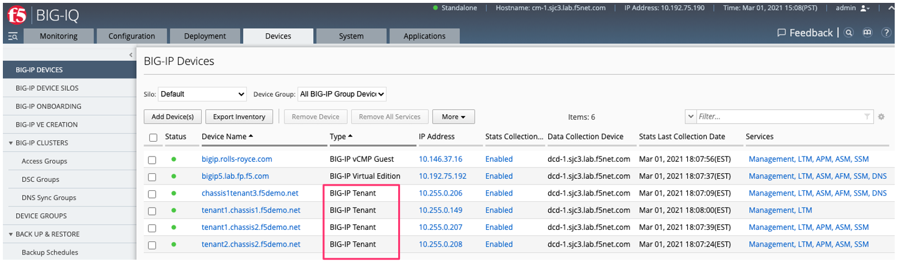

========================
BIG-IQ Support for VELOS
========================

Currently VELOS support in BIG-IQ will mimic VIPRION functionality. In VIPRION, a vCMP guest can be created via the chassis CLI, webUI, or API and it can then be imported into BIG-IQ as a device. From there, statistics/analytics can be gathered, and L4-7 configurations can be managed in a variety of ways. A VELOS tenant will behave identically to a vCMP guest from a BIG-IQ perspective, meaning you can import it after it has been created to manage configuration or get analytics.

When a VELOS tenant is created it can be imported as a device into BIG-IQ. It will import just like any other BIG-IP instance or device.  Once imported it will show up with a Type of **BIG-IP Tenant**.

VELOS tenants can also be onboarded in BIG-IQ using Declarative Onboarding (DO). Once a tenant is created via one of the VELOS interfaces you can run a DO declaration like the one below to BIG-IQ to provision, configure, and import it. In the DO declaration you will specify a **targetHost**, which is the IP address of the tenant to be onboarded. The following is an example of a DO declaration for onboarding a VELOS tenant:

.. code-block:: bash

    POST https://{{BigIQ_Mgmt}}/mgmt/shared/declarative-onboarding

.. code-block:: json

    {
        "class": "DO",
        "declaration": {
            "schemaVersion": "1.5.0",
            "class": "Device",
            "async": true,
            "Common": {
                "class": "Tenant",
                "myProvision": {
                    "class": "Provision",
                    "avr": "nominal",
                    "ltm": "nominal",
                    "asm": "nominal",
                    "apm": "nominal"
                },
                "myDns": {
                    "class": "DNS",
                    "nameServers": [
                        "10.192.50.10",
                        "10.192.50.11"
                    ]
                },
                "myNtp": {
                    "class": "NTP",
                    "servers": [
                        "time.f5net.com"
                    ],
                    "timezone": "UTC"
                },
                "internal-self": {
                    "class": "SelfIp",
                    "address": "10.10.11.11/24",
                    "vlan": "vlan-444",
                    "allowService": "all",
                    "trafficGroup": "traffic-group-local-only"
                },
                "external-self": {
                    "class": "SelfIp",
                    "address": "10.10.12.11/24",
                    "vlan": "vlan-555",
                    "trafficGroup": "traffic-group-local-only",
                    "allowService": "default"
                },
                "myDbVariables": {
                    "class": "DbVariables",
                    "ui.advisory.enabled": "true",
                    "ui.advisory.color": "red",
                    "ui.advisory.text": "Configuration deployed with AS3. Do not make any change directly on the BIG-IP or those changes may be lost."
                },
                "admin": {
                    "class": "User",
                    "userType": "regular",
                    "shell": "bash",
                    "partitionAccess": {
                        "all-partitions": {
                            "role": "admin"
                        }
                    },
                    "password": "{{Chassis_Partition_Password}}"
                },
                "root": {
                    "class": "User",
                    "userType": "root",
                    "newPassword": "{{Chassis_Partition_Password}}",
                    "oldPassword": "{{Chassis_Partition_Password}}"
                },
                "hostname": "tenant1.chassis1.f5demo.net"
            }
        },
        "targetHost": "{{Chassis1_Tenant1_IP}}",
        "targetUsername": "admin",
        "targetPassphrase": "admin",
        "bigIqSettings": {
            "failImportOnConflict": false,
            "conflictPolicy": "USE_BIGIQ",
            "deviceConflictPolicy": "USE_BIGIP",
            "versionedConflictPolicy": "KEEP_VERSION",
            "statsConfig": {
                "enabled": true,
                "zone": "default"
            },
            "accessModuleProperties": {
                "cm:access:access-group-name": "tenant1",
                "cm:access:import-shared": true
            },
            "snapshotWorkingConfig": false
        }
    }

Shortly after the declaration is sent to BIG-IQ you can see a new onboarding task. This will take a while to complete as it may require reboots of the tenant for module provisioning. After the tenant is onboarded it will be imported into BIG-IQ.

.. image:: images/bigiq_support_for_velos/image2.png
  :align: center
  :scale: 70%

F5OS Backup for VELOS
==========================

The configuration and monitoring of the F5OS platform layer is not managed by BIG-IQ, it has to be managed locally on the VELOS appliance using the F5OS CLI, webUI, API or SNMP. The exception, is that scheduled backups for F5OS configuration has been added in BIG-IQ version 8.3. This new functionality allows for rSeries and/or VELOS devices to be added to BIG-IQ for the purpose of backing up their F5OS configurations. The management IP address of the F5OS layer belonging to the rSeries appliance or VELOS system controller is added to the **F5OS** section in BIG-IQ. From this section, device credentials can be added to access the F5OS platform layer, and backups may be scheduled or created on demand. The F5OS tenants are backed up using the normal **Backup & Restore** workflows in BIG-IQ, just as any BIG-IP instance or vCMP guest would be.

**IMPORTANT: The F5 VELOS system uses a primary key to perform encryption and decryption of highly sensitive passwords/passphrases in the configuration database. You should set this primary key prior to performing any configuration backup if you have not already done so. In the case of a configuration migration such as moving configuration to a replacement device due to RMA, it is important to set the primary key to a known value so that the same key can be used to decrypt the passwords/passphrases in the configuration restored on the replacement device. More details are in the K article below.** 

`K50135154: Back up and restore the F5OS-C configuration on a VELOS system <https://my.f5.com/manage/s/article/K50135154>`_

Below are the two sections needed to fully restore an VELOS chassis. The **Backup & Restore** section is used for the F5OS tenants, and the **F5OS** section is used to backup the F5OS platform layer. 

.. image:: images/bigiq_support_for_rseries/image3.png
  :align: center
  :scale: 70%

Below is an example of a scheduled backup where VELOS and/or rSeries devices can be added to a scheduled backup. This will backup the F5OS platform layer only, F5OS tenants are backed up using the normal **Backup & Restore** workflows in BIG-IQ. 

.. image:: images/bigiq_support_for_rseries/image4.png
  :align: center
  :scale: 70%

If a restore of the F5OS layer needs to occur, this is not facilitated from BIG-IQ. You will need to download the saved backup you wish to restore for F5OS from the BIG-IQ system, and then follow the restoration procedures as outlined in the article below.

`K50135154: Back up and restore the F5OS-C configuration on a VELOS system <https://my.f5.com/manage/s/article/K50135154>`_

Note: You will need to have the passwords used to encrypt the primary key before restoring the F5OS configuration. Tenant configurations are restored separately from the F5OS layer.