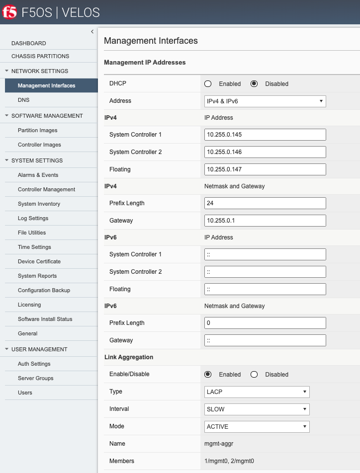
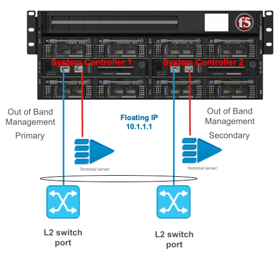
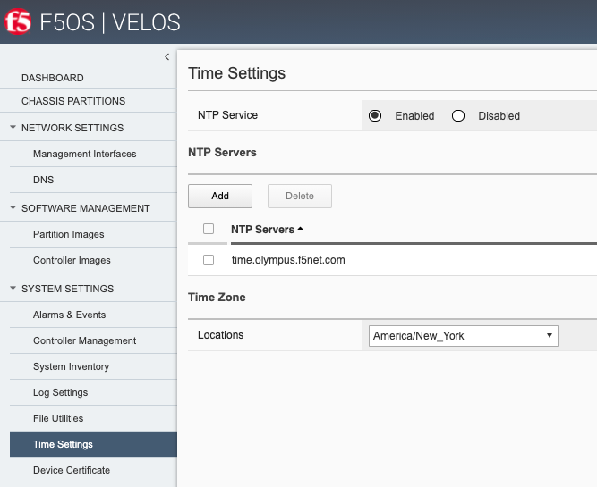

======================
Initial Setup of VELOS
======================

System Controller Setup
=======================

Connect a console or terminal server to each of the system controllers console ports. Login as admin/admin (you’ll be prompted to change the password) and access the F5OS CLI. F5OS utilizes **ConfD** for configuration management of F5OS and will be a familiar navigation experience if you have used it on other products. The CLI supports command completion and online help and is easy to navigate. There are **show** commands to display current configurations and status, and a **config** mode to alter current configuration.

Once logged in you can display the current running configuration by issuing the command **show running-config**.

.. code-block:: bash

  syscon-2-active# show running-config
  image controller config os os 1.2.0-0333
  !
  image controller config services service 1.2.0-0333
  !
  image controller config iso iso 1.2.0-0333
      service 1.2.0-0333
      os      1.2.0-0333
  !
  image partition config os os 1.2.0-0333
  !
  image partition config services service 1.2.0-0333
  !
  image partition config iso iso 1.2.0-0333
      service 1.2.0-0333
      os      1.2.0-0333
  !
  partitions partition bigpart
  config enabled
  …

Configuration is automatically synchronized between the primary and standby system controllers. The configuration of both controllers can be defined from the primary system controller, there is no need to login to the secondary system controller to configure an IP address. You’ll know which system controller is primary by the prompt:

An example of the Active/Primary system controller:

.. code-block:: bash

  syscon-2-active#

An example of the Secondary/Standby system controller:

.. code-block:: bash

  syscon-1-standby#

If you are logged into the standby system controller then you will not be able to enter config mode. You must be on the primary/active system controller.

.. code-block:: bash

  syscon-1-standby# config 
  Aborted: node is in readonly mode

Interface Configuration
======================= 

The out-of-band Ethernet interfaces on each system controller can be configured to run independently, or they may be put into a common Link Aggregation Group to provide added redundancy. To alter any configuration, you must enter config mode:

.. code-block:: bash

  syscon-2-active# config
  Entering configuration mode terminal
  syscon-2-active(config)#

Internal Chassis IP Ranges
==========================

The VELOS systems ship with a default internal RFC6598 address space of 100.64.0.0/12. This should be sufficient for most production environments. You can verify this with the following command.

.. code-block:: bash

  syscon-2-active# show system network 
  system network state configured-network-range-type RFC6598
  system network state configured-network-range 100.64.0.0/12
  system network state configured-chassis-id 1
  system network state active-network-range-type RFC6598
  system network state active-network-range 100.64.0.0/12
  system network state active-chassis-id 1
  syscon-2-active# 

This address range never leaves the inside of the chassis and will not interfere with any communication outside the VELOS chassis. There can however be address collisions if a device trying to manage VELOS via the out-of-band management port falls within this range, or an external management device or service falls within this range and communicated with VELOS over its out-of-band networking. This may result in VELOS not able to communicate with those devices.

Some examples would be any client trying to access the F5OS or tenant out-of-band interfaces to reach its’ CLI, GUI, or API. Other examples would be external services such as SNMP, DNS, NTP, SNMP, Authentication that have addresses that fall within the RFC6598 address space. You may experience connectivity problems with these types of clients/services if there is an overlap. Note that this does not affect the data plane / in-band interfaces, it only affects communication to the out-of-band interfaces. 

If there is the potential for conflict with external devices that fall within this range that need to communicate with VELOS, then there are options to change the configured-network-range-type to one of sixteen different blocks within the RFC1918 address space. Changing this will require a complete chassis power-cycle, rebooting is not sufficient.  Please consult with F5 prior to making any changes to the internal addresses.

.. code-block:: bash

  syscon-2-active(config)# system network config network-range-type RFC <Hit Tab>
  Possible completions:
    RFC1918   VELOS system uses 10.[0-15]/12 as specified by RFC1918
    RFC6598   VELOS system uses 100.64/10 as specified by RFC6598
  syscon-2-active(config)# system network config network-range-type RFC1918

If changing to one of the RFC1918 address spaces, you will need to choose from one of 16 prefix ranges as seen below. You should ensure that this will not overlap with a customer’s current address space:

.. code-block:: bash

  syscon-2-active(config)# system network config network-range-type RFC1918 prefix ?
  Description: 
  The network prefix index is used to select the range of IP addresses
  used internally within the chassis.  The network prefix should be
  selected such that internal chassis addresses do not overlap with
  site-local addresses that are accessible to the chassis.

  Network Prefix Index       Chassis Network Range
  0                          10.[0-15].0.0/12
  1                          10.[16-31].0.0/12
  2                          10.[32-47].0.0/12
  3                          10.[48-63].0.0/12
  4                          10.[64-79].0.0/12
  5                          10.[80-95].0.0/12
  6                          10.[96-111].0.0/12
  7                          10.[112-127].0.0/12
  8                          10.[128-143].0.0/12
  9                          10.[144-159].0.0/12
  10                         10.[160-175].0.0/12
  11                         10.[176-191].0.0/12
  12                         10.[192-207].0.0/12
  13                         10.[208-223].0.0/12
  14                         10.[224-239].0.0/12
  15                         10.[240-255].0.0/12
  Possible completions:
    <unsignedByte, 0 .. 15>[0]
  syscon-2-active(config)# system network config network-range-type RFC1918 prefix 15
    syscon-2-active(config)# commit
  Commit complete.

**Note: This change will not take effect until the chassis is power cycled. A complete power cycle is required in order to convert existing internal address space to the new address space, a reboot of individual chassis components is not sufficient.**

IP Address Assignment & Routing
===============================

Each system controller requires its own unique IP address, and a floating IP address also needs to be configured. The floating IP address will follow the primary system controller. The IP addresses can be statically defined or acquired via DHCP. In addition to the IP addresses a default route and subnet mask/prefix length is defined. For the initial release of VELOS only IPv4 IP addresses are supported on the out-of-band interfaces of the system controllers. IPv6 and dual stack IPv4/v6 support is slated to be added in the mid CY21 release. Note the tenants themselves support IPv4/IPv6 management today.

.. image:: images/initial_setup_of_velos/image1.png
  :align: center
  :scale: 70%

Once logged in you will configure the static IP addresses (unless DHCP is preferred).

.. code-block:: bash

  syscon-2-active(config)# system mgmt-ip config ipv4 controller-1 address 10.255.0.212
  syscon-2-active(config)# system mgmt-ip config ipv4 controller-2 address 10.255.0.213
  syscon-2-active(config)# system mgmt-ip config ipv4 floating address 10.255.0.214
  syscon-2-active(config)# system mgmt-ip config ipv4 prefix-length 24
  syscon-2-active(config)# system mgmt-ip config ipv4 gateway 10.255.0.1

In order to make these changes active you must commit the changes. No configuration changes are executed until the commit command is issued. 

.. code-block:: bash

  syscon-2-active(config)# commit

Now that the out-of-band addresses and routing are configured you can attempt to access the system controller GUI via the floating IP address that has been defined. You should see a screen similar to the one below, and you can verify your management interface settings.

Interface Aggregation for System Controllers (Optional)
=======================================================

As seen in previous diagrams each system controller has its own independent out-of-band 10Gb ethernet connection. These can run independently of each other and should be connected to the same layer2 VLAN so that the floating IP address can move from primary to standby in the event of a failure. You may optionally configure these two interfaces into a single Link Aggregation Group (LAG) for added resiliency which is recommended. This would allow direct access to either static IP address on the system controllers in the event one link should fail. Below is a depiction of each system controllers OOB interface bonded together in a single LAG:

To enable this feature, you would need to enable link aggregation on the system controllers via the CLI, GUI or API, and then make changes to your upstream layer2 switching infrastructure to ensure the two ports are put into the same LAG. To configure the management ports of both system controllers to run in a LAG configure as follows:

On the active controller create an LACP interface:

.. code-block:: bash

  lacp interfaces interface mgmt-aggr
  config name mgmt-aggr
  !
 
Next create a management aggregate interface and set the **config type** to **ieee8023adLag** and set the **lag-type** to **LACP**.

.. code-block:: bash 
  interfaces interface mgmt-aggr
  config name mgmt-aggr
  config type ieee8023adLag
  aggregation config lag-type LACP
  !

Finally add the aggregate that you created by name to each of the management interfaces on the two controllers: 

.. code-block:: bash

  !
  interfaces interface 1/mgmt0
  config name 1/mgmt0
  config type ethernetCsmacd
  ethernet config aggregate-id mgmt-aggr
  !
 
 
  interfaces interface 2/mgmt0
  config name 2/mgmt0
  config type ethernetCsmacd
  ethernet config aggregate-id mgmt-aggr

System Settings
===============

Once the IP addresses have been defined system settings such as DNS servers, NTP, and external logging should be defined. This can be done from the CLI, GUI, or API.

**From the CLI:**

.. code-block:: bash

  syscon-2-active# config
  Entering configuration mode terminal
  syscon-2-active(config)# system dns servers server 192.168.19.1 config address 192.168.10.1
  syscon-2-active(config-server-192.168.19.1)# exit
  syscon-2-active(config)# system ntp config enabled 
  syscon-2-active(config)# system ntp servers server time.f5net.com config address time.f5net.com
  syscon-2-active(config-server-time.f5net.com)# exit
  syscon-2-active(config)# system logging remote-servers remote-server 10.255.0.142 selectors selector LOCAL0 WARNING
  syscon-2-active(config-remote-server-10.255.0.142)# exit
  syscon-2-active(config)# commit

**From the GUI:**

You can configure the DNS and Time setting from the GUI if preferred. DNS is configured under **Network Settings > DNS**. Here you can add DNS lookup servers, and optional search domains. This will be needed for the VELOS chassis to resolve hostnames that may be used for external services like ntp, authentication servers, or to reach iHealth for qkview uploads.

.. image:: images/initial_setup_of_velos/image4.png
  :align: center
  :scale: 70%

  Configuring Network Time Protocol is highly recommended so that the VELOS systems clock is sync’d and accurate. In addition to configure NTP time sources, you can set the local timezone for this chassis location.

  It’s also a good idea to have the VELOS system send logs to an external syslog server. This can be configured in the System Settings > Log Settings screen. Here you can configure remote servers, the logging facility, and severity levels. You can also configure logging subsystem level individually. The remote logging severity level will override and component logging levels if they are higher, but only for logs sent remotely. Local logging levels will follow however the component levels are configured here.

.. image:: images/initial_setup_of_velos/image6.png
  :align: center
  :scale: 70%

**From the API:**

If you would prefer to automate the setup of the VELOS chassis, there are API calls for all of the examples above. To set the DNS configuration for the system controllers use the following API call:

PATCH https://{{Chassis1_System_Controller_IP}}:8888/restconf/data/

.. code-block:: json

  {
      "openconfig-system:system": {
          "clock": {
              "config": {
                  "timezone-name": "America/New_York"
              }
          },
          "dns": {
              "config": {
                  "search": "olympus.f5net.com"
              },
              "servers": {
                  "server": [
                      {
                          "address": "8.8.8.8",
                          "config": {
                              "address": "8.8.8.8"
                          }
                      },
                      {
                          "address": "192.168.10.1",
                          "config": {
                              "address": "192.168.10.1"
                          }
                      },
                      {
                          "address": "192.168.11.1",
                          "config": {
                              "address": "192.168.11.1"
                          }
                      }
                  ]
              }
          }
      }
  }

To set System Time settings use the following API call as an example:

PATCH https://{{Chassis1_System_Controller_IP}}:8888/restconf/data/

.. code-block:: json

  {
      "openconfig-system:system": {
          "clock": {
              "config": {
                  "timezone-name": "America/New_York"
              }
          },
          "ntp": {
              "config": {
                  "enabled": "true"
              },
              "servers": {
                  "server": [
                      {
                          "address": "time.f5net.com",
                          "config": {
                              "address": "time.f5net.com"
                          }
                      }
                  ]
              }
          }
      }
  }

To set a Remote Logging destination:

PATCH https://{{Chassis1_System_Controller_IP}}:8888/restconf/data/

.. code-block:: json

  {
      "openconfig-system:system": {
          "logging": {
              "remote-servers": {
                  "remote-server": [
                      {
                          "host": "10.255.0.142",
                          "config": {
                              "host": "10.255.0.142",
                              "remote-port": "514"
                          },
                          "selectors": {
                              "selector": [
                                  {
                                      "facility": "LOCAL0",
                                      "severity": "INFORMATIONAL",
                                      "config": {
                                          "facility": "LOCAL0",
                                          "severity": "INFORMATIONAL"
                                      }
                                  }
                              ]
                          }
                      }
                  ]
              }
          }
      }
  }

Licensing the VELOS Chassis
===========================

Licensing for the VELOS system is handled at the chassis level. This is similar to how VIPRION licensing is implemented where the system is licensed once, and all subsystems inherit their licensing from the chassis. With VELOS, licensing is applied at the system controller level and all chassis partitions and tenants will inherit their licenses from the base system. There is no need to procure add-on licenses for MAX SSL/Compression or for tenancy/vCMP. This is different than VIPRION where there was an extra charge for virtualization/vCMP and in some cases for MAX SSL/Compression. For VELOS these are included in the base license at no extra cost. VELOS does not run vCMP, and instead runs tenancy.

Licenses can be applied via CLI, GUI, or API. A base registration key and optional add-on keys are needed, and it follows the same manual or automatic licensing capabilities of other BIG-IP systems. Licensing is accessible under the System Settings > Licensing page. Automatic will require proper routing and DNS connectivity to the Internet to reach F5’s licensing server. If this is not possible to reach the licensing server use the manual method.

.. image:: images/initial_setup_of_velos/image7.png
  :width 45%

.. image:: images/initial_setup_of_velos/image8.png
  :width: 45%

You can activate and display the current license in the GUI, CLI or API. To license the VELOS chassis automatically from the CLI:

.. code-block:: bash

  syscon-1-active(config)# system licensing install registration-key I1234-12345-12345-12345-1234567
  result License installed successfully.

To license the VELOS chassis manually you’ll need to get the dossier first:

.. code-block:: bash

  syscon-2-active(config)# system licensing get-dossier
  b9a9936886bada077d93843a281ce4c34bf78db0d6c32c40adea3a5329db15edd413fe7d7f8143fd128ebe2d97642b4ed9192b530788fe3965593e3b42131c66220401b16843476159414ceeba8af5fb67a39fe2a2f408b9…

You can then access F5’s licensing server (license.f5.com) and paste in the dossier when prompted:

