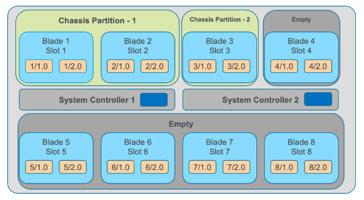
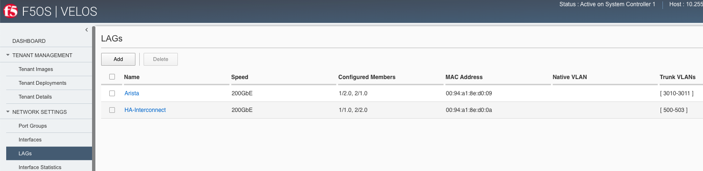
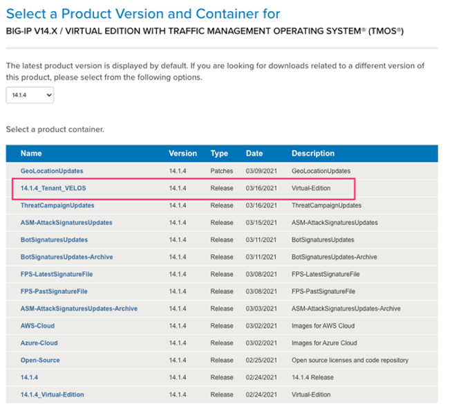
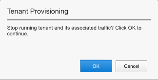
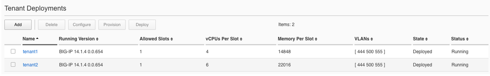

==========================================
Initial Setup Within the Chassis Partition
==========================================

Chassis partitions are completely separate management entities that are managed outside of the system controllers but are still considered part of the F5OS platform layer. If you have properly setup a chassis partition and assigned an out-of-band management IP address, you will be able to access it via its own CLI, GUI, and API. The chassis partitions only have a single out-of-band IP address and the system is resilient in that the single IP address should be reachable as long as one blade in the partition is active. There is no way to access the chassis partition via in-band networks, as the chassis partition does not have an option for in-band interfaces. 

.. image:: images/initial_setup_of_velos_chassis_partitions/image52.png
  :align: center
  :scale: 70% 

Chassis Partition Dashboard
---------------------------

The chassis partition Dashboard will provide a visual system summary of the partition and which slots it is assigned to. It will also list the total number of vCPU’s available for multitenancy and how many are currently in use. If there are any active-alarms they will be displayed on this page. There is also a tenant overview showing a quick summary of tenant status and basic parameters. Lastly there is a high availability status display.

.. image:: images/initial_setup_of_velos_chassis_partitions/image53.png
  :align: center
  :scale: 70% 

Chassis Partition Networking
----------------------------

Before configuring any tenant, you’ll need to setup networking for the chassis partition. All in-band networking is configured within the chassis partition layer, and all chassis partitions are completely isolated from each other. You cannot share any in-band networking internally between different chassis partitions.

Network Settings - > Port Groups
--------------------------------

Before configuring any interfaces, VLANs, or LAG’s you’ll need to configure the portgroups so that physical interfaces on the blade are configured for the proper speed and bundling. The portgroup component is used to control the mode of the physical port. This controls whether the port is bundled or unbundled and the port speed. The term portgroup is used rather than simply Port because some front panel sockets may accept different types of SFPs. Depending on the portgroup mode value, a different FPGA version is loaded, and the speed of the port is adjusted accordingly (this will require a reboot of the blade). The portgroup components are created by the system, based on the type of the blades installed. The user can modify the portgroup mode.

.. image:: images/initial_setup_of_velos_chassis_partitions/image54.png
  :width: 45%

.. image:: images/initial_setup_of_velos_chassis_partitions/image55.png
  :width: 45%

**NOTE: Both ports on the BX110 blade must be configured in the same mode in release 1.0. i.e. both ports must be configured for 100Gb, or 40Gb, or 4 x 25GB, or 4 x 10Gb. You cannot mix different port group settings on the same blade currently. A future release may provide more granular options.**  

Configuring PortGroups from the GUI
-----------------------------------

To configure Portgroups go to Network Settings > Port Groups in the chassis partition GUI. This should be configured before any Interface, VLAN, or LAG configuration as changing the portgroup mode will alter interface numbering on the blade. Note the warning at the top of the GUI page:

.. image:: images/initial_setup_of_velos_chassis_partitions/image56.png
  :align: center
  :scale: 70% 

If you do make a change the blade will be forced to reboot to load a new bitstream image into the FPGA.

Configuring PortGroups from the CLI
-----------------------------------

Portgroups can be configured from the chassis partition CLI using the portgroups command on config mode. The following command will set interface 1/1 for 100GB:

.. code-block:: bash

  bigpartition-2# config
  Entering configuration mode terminal
  bigpartition-2(config)# portgroups portgroup 1/1 config mode MODE_100GB

You must commit for any changes to take affect:

.. code-block:: bash

  bigpartition-2(config)# commit

Possible options for mode are: MODE_4x10GB,  MODE_4x25GB,  MODE_40GB,  MODE_100GB. You can optionally configure the portgroup name and ddm poll frequency. You can display the current configuration of the existing portgroups by running the CLI command show running-config portgroups:

.. code-block:: bash

  bigpartition-2# show running-config portgroups 
  portgroups portgroup 1/1
  config name 1/1
  config mode MODE_100GB
  config ddm ddm-poll-frequency 30
  !
  portgroups portgroup 1/2
  config name 1/2
  config mode MODE_100GB
  config ddm ddm-poll-frequency 30
  !
  portgroups portgroup 2/1
  config name 2/1
  config mode MODE_100GB
  config ddm ddm-poll-frequency 30
  !
  portgroups portgroup 2/2
  config name 2/2
  config mode MODE_100GB
  config ddm ddm-poll-frequency 30
  !
  bigpartition-2# 

Configuring PortGroups from the API

To list the current portgroup configuration issue the following API call:

.. code-block:: bash

  GET https://{{Chassis1_BigPartition_IP}}:8888/restconf/data/f5-portgroup:portgroups

.. code-block:: json

  {
      "f5-portgroup:portgroups": {
          "portgroup": [
              {
                  "portgroup_name": "1/1",
                  "config": {
                      "name": "1/1",
                      "mode": "MODE_100GB",
                      "f5-ddm:ddm": {
                          "ddm-poll-frequency": 30
                      }
                  },
                  "state": {
                      "vendor-name": "F5 NETWORKS INC.",
                      "vendor-oui": "009065",
                      "vendor-partnum": "OPT-0031        ",
                      "vendor-revision": "A0",
                      "vendor-serialnum": "X3CAU1J         ",
                      "transmitter-technology": "850 nm VCSEL",
                      "media": "100GBASE-SR4",
                      "optic-state": "QUALIFIED",
                      "f5-ddm:ddm": {
                          "rx-pwr": {
                              "low-threshold": {
                                  "alarm": "-14.0",
                                  "warn": "-11.0"
                              },
                              "instant": {
                                  "val-lane1": "-0.08",
                                  "val-lane2": "-0.61",
                                  "val-lane3": "-0.19",
                                  "val-lane4": "-0.73"
                              },
                              "high-threshold": {
                                  "alarm": "3.4",
                                  "warn": "2.4"
                              }
                          },
                          "tx-pwr": {
                              "low-threshold": {
                                  "alarm": "-10.0",
                                  "warn": "-8.0"
                              },
                              "instant": {
                                  "val-lane1": "-0.77",
                                  "val-lane2": "-1.01",
                                  "val-lane3": "-1.01",
                                  "val-lane4": "-0.82"
                              },
                              "high-threshold": {
                                  "alarm": "5.0",
                                  "warn": "3.0"
                              }
                          },
                          "temp": {
                              "low-threshold": {
                                  "alarm": "-5.0",
                                  "warn": "0.0"
                              },
                              "instant": {
                                  "val": "23.4609"
                              },
                              "high-threshold": {
                                  "alarm": "75.0",
                                  "warn": "70.0"
                              }
                          },
                          "bias": {
                              "low-threshold": {
                                  "alarm": "0.003",
                                  "warn": "0.005"
                              },
                              "instant": {
                                  "val-lane1": "0.007526",
                                  "val-lane2": "0.007484",
                                  "val-lane3": "0.00752",
                                  "val-lane4": "0.006914"
                              },
                              "high-threshold": {
                                  "alarm": "0.013",
                                  "warn": "0.011"
                              }
                          },
                          "vcc": {
                              "low-threshold": {
                                  "alarm": "2.97",
                                  "warn": "3.135"
                              },
                              "instant": {
                                  "val": "3.2555"
                              },
                              "high-threshold": {
                                  "alarm": "3.63",
                                  "warn": "3.465"
                              }
                          }
                      }
                  }
              },
              {
                  "portgroup_name": "1/2",
                  "config": {
                      "name": "1/2",
                      "mode": "MODE_100GB",
                      "f5-ddm:ddm": {
                          "ddm-poll-frequency": 30
                      }
                  },
                  "state": {
                      "vendor-name": "F5 NETWORKS INC.",
                      "vendor-oui": "009065",
                      "vendor-partnum": "OPT-0031        ",
                      "vendor-revision": "A0",
                      "vendor-serialnum": "X3CAU7H         ",
                      "transmitter-technology": "850 nm VCSEL",
                      "media": "100GBASE-SR4",
                      "optic-state": "QUALIFIED",
                      "f5-ddm:ddm": {
                          "rx-pwr": {
                              "low-threshold": {
                                  "alarm": "-14.0",
                                  "warn": "-11.0"
                              },
                              "instant": {
                                  "val-lane1": "0.95",
                                  "val-lane2": "0.84",
                                  "val-lane3": "0.82",
                                  "val-lane4": "1.17"
                              },
                              "high-threshold": {
                                  "alarm": "3.4",
                                  "warn": "2.4"
                              }
                          },
                          "tx-pwr": {
                              "low-threshold": {
                                  "alarm": "-10.0",
                                  "warn": "-8.0"
                              },
                              "instant": {
                                  "val-lane1": "-0.29",
                                  "val-lane2": "-0.52",
                                  "val-lane3": "-0.08",
                                  "val-lane4": "-0.34"
                              },
                              "high-threshold": {
                                  "alarm": "5.0",
                                  "warn": "3.0"
                              }
                          },
                          "temp": {
                              "low-threshold": {
                                  "alarm": "-5.0",
                                  "warn": "0.0"
                              },
                              "instant": {
                                  "val": "23.4218"
                              },
                              "high-threshold": {
                                  "alarm": "75.0",
                                  "warn": "70.0"
                              }
                          },
                          "bias": {
                              "low-threshold": {
                                  "alarm": "0.003",
                                  "warn": "0.005"
                              },
                              "instant": {
                                  "val-lane1": "0.00749",
                                  "val-lane2": "0.007632",
                                  "val-lane3": "0.00747",
                                  "val-lane4": "0.007484"
                              },
                              "high-threshold": {
                                  "alarm": "0.013",
                                  "warn": "0.011"
                              }
                          },
                          "vcc": {
                              "low-threshold": {
                                  "alarm": "2.97",
                                  "warn": "3.135"
                              },
                              "instant": {
                                  "val": "3.2668"
                              },
                              "high-threshold": {
                                  "alarm": "3.63",
                                  "warn": "3.465"
                              }
                          }
                      }
                  }
              },
              {
                  "portgroup_name": "2/1",
                  "config": {
                      "name": "2/1",
                      "mode": "MODE_100GB",
                      "f5-ddm:ddm": {
                          "ddm-poll-frequency": 30
                      }
                  },
                  "state": {
                      "vendor-name": "F5 NETWORKS INC.",
                      "vendor-oui": "009065",
                      "vendor-partnum": "OPT-0031        ",
                      "vendor-revision": "A0",
                      "vendor-serialnum": "X3CAU16         ",
                      "transmitter-technology": "850 nm VCSEL",
                      "media": "100GBASE-SR4",
                      "optic-state": "QUALIFIED",
                      "f5-ddm:ddm": {
                          "rx-pwr": {
                              "low-threshold": {
                                  "alarm": "-14.0",
                                  "warn": "-11.0"
                              },
                              "instant": {
                                  "val-lane1": "-0.74",
                                  "val-lane2": "-0.82",
                                  "val-lane3": "-0.94",
                                  "val-lane4": "-1.07"
                              },
                              "high-threshold": {
                                  "alarm": "3.4",
                                  "warn": "2.4"
                              }
                          },
                          "tx-pwr": {
                              "low-threshold": {
                                  "alarm": "-10.0",
                                  "warn": "-8.0"
                              },
                              "instant": {
                                  "val-lane1": "-0.81",
                                  "val-lane2": "-0.52",
                                  "val-lane3": "-0.99",
                                  "val-lane4": "-0.54"
                              },
                              "high-threshold": {
                                  "alarm": "5.0",
                                  "warn": "3.0"
                              }
                          },
                          "temp": {
                              "low-threshold": {
                                  "alarm": "-5.0",
                                  "warn": "0.0"
                              },
                              "instant": {
                                  "val": "25.1601"
                              },
                              "high-threshold": {
                                  "alarm": "75.0",
                                  "warn": "70.0"
                              }
                          },
                          "bias": {
                              "low-threshold": {
                                  "alarm": "0.003",
                                  "warn": "0.005"
                              },
                              "instant": {
                                  "val-lane1": "0.007464",
                                  "val-lane2": "0.0075",
                                  "val-lane3": "0.007408",
                                  "val-lane4": "0.007494"
                              },
                              "high-threshold": {
                                  "alarm": "0.013",
                                  "warn": "0.011"
                              }
                          },
                          "vcc": {
                              "low-threshold": {
                                  "alarm": "2.97",
                                  "warn": "3.135"
                              },
                              "instant": {
                                  "val": "3.2564"
                              },
                              "high-threshold": {
                                  "alarm": "3.63",
                                  "warn": "3.465"
                              }
                          }
                      }
                  }
              },
              {
                  "portgroup_name": "2/2",
                  "config": {
                      "name": "2/2",
                      "mode": "MODE_100GB",
                      "f5-ddm:ddm": {
                          "ddm-poll-frequency": 30
                      }
                  },
                  "state": {
                      "vendor-name": "F5 NETWORKS INC.",
                      "vendor-oui": "009065",
                      "vendor-partnum": "OPT-0031        ",
                      "vendor-revision": "A0",
                      "vendor-serialnum": "X3DA16Y         ",
                      "transmitter-technology": "850 nm VCSEL",
                      "media": "100GBASE-SR4",
                      "optic-state": "QUALIFIED",
                      "f5-ddm:ddm": {
                          "rx-pwr": {
                              "low-threshold": {
                                  "alarm": "-14.0",
                                  "warn": "-11.0"
                              },
                              "instant": {
                                  "val-lane1": "0.09",
                                  "val-lane2": "0.23",
                                  "val-lane3": "0.2",
                                  "val-lane4": "0.36"
                              },
                              "high-threshold": {
                                  "alarm": "3.4",
                                  "warn": "2.4"
                              }
                          },
                          "tx-pwr": {
                              "low-threshold": {
                                  "alarm": "-10.0",
                                  "warn": "-8.0"
                              },
                              "instant": {
                                  "val-lane1": "-0.49",
                                  "val-lane2": "-0.69",
                                  "val-lane3": "-0.49",
                                  "val-lane4": "-0.48"
                              },
                              "high-threshold": {
                                  "alarm": "5.0",
                                  "warn": "3.0"
                              }
                          },
                          "temp": {
                              "low-threshold": {
                                  "alarm": "-5.0",
                                  "warn": "0.0"
                              },
                              "instant": {
                                  "val": "23.8632"
                              },
                              "high-threshold": {
                                  "alarm": "75.0",
                                  "warn": "70.0"
                              }
                          },
                          "bias": {
                              "low-threshold": {
                                  "alarm": "0.003",
                                  "warn": "0.005"
                              },
                              "instant": {
                                  "val-lane1": "0.007494",
                                  "val-lane2": "0.007448",
                                  "val-lane3": "0.00747",
                                  "val-lane4": "0.007494"
                              },
                              "high-threshold": {
                                  "alarm": "0.013",
                                  "warn": "0.011"
                              }
                          },
                          "vcc": {
                              "low-threshold": {
                                  "alarm": "2.97",
                                  "warn": "3.135"
                              },
                              "instant": {
                                  "val": "3.2558"
                              },
                              "high-threshold": {
                                  "alarm": "3.63",
                                  "warn": "3.465"
                              }
                          }
                      }
                  }
              }
          ]
      }
  }

Network Settings -> Interfaces
------------------------------

Interface numbering will vary depending on the current portgroup configuration. Interfaces will always be numbered by **<blade#>/<port#>**. The number of ports on a blade will change depending on if the portgroup is configured as bundled or unbundled. If the ports are bundled then ports will be 1/1.0 & 1/2.0 for slot 1, and 2/1.0 & 2/2.0 for slot 2 etc…. If ports are unbundled then the port numbering will be 1/1.1, 1/1.2, 1/1.3, & 1/1.4 for the first physical port and 1/2.1, 1/2.2, 1/2.3, & 1/2.4 for the second physical port. Even when multiple chassis partitions are used, the port numbering will stay consistent starting with the blade number. Below is an example of port numbering with all bundled interfaces.

Configuring Interfaces from the GUI
-----------------------------------

Within the chassis partition GUI the physical ports of all blades within that partition will be visible by going to **Network Settings > Interfaces** page. If there are other chassis partitions in the VELOS system, then those ports will only be seen within their own chassis partition. In the example below this VELOS system has 3 blades installed, but only two are part of this chassis partition, so you will not see ports from the 3rd blade unless you connect directly to the other chassis partition.

.. image:: images/initial_setup_of_velos_chassis_partitions/image58.png
  :align: center
  :scale: 70%  

You can click on any interface to view its settings or edit them. You can currently change the interface State via the GUI or the **Native VLAN** (untagged) and **Trunk VLANs** (tagged) as long as the interface is not part of a LAG. If the interface is part of the LAG then the VLAN configuration is done within the LAG rather than the interface.

.. image:: images/initial_setup_of_velos_chassis_partitions/image59.png
  :align: center
  :scale: 70% 

Configuring Interfaces from the CLI
-----------------------------------

Interfaces can be configured in the chassis partition CLI. As mentioned previously portgroups should be configured for their desired state before configuring any interfaces as the interface numbering may change. In the CLI enter config mode and then specify the interface you want to configure. If the interface is going to be part of a LAG, then most of the configuration is done within the LAG. Use the command **show running-config interfaces** to see the current configuration:

.. code-block:: bash

  bigpartition-2# show running-config interfaces 
  interfaces interface 1/1.0
  config name 1/1.0
  config type ethernetCsmacd
  config enabled
  config tpid TPID_0X8100
  ethernet config aggregate-id ha
  !
  interfaces interface 1/2.0
  config name 1/2.0
  config type ethernetCsmacd
  config enabled
  config tpid TPID_0X8100
  ethernet config aggregate-id Arista
  !
  interfaces interface 2/1.0
  config name 2/1.0
  config type ethernetCsmacd
  config enabled
  config tpid TPID_0X8100
  ethernet config aggregate-id Arista
  !
  interfaces interface 2/2.0
  config name 2/2.0
  config type ethernetCsmacd
  config enabled
  config tpid TPID_0X8100
  ethernet config aggregate-id ha
  !
  interfaces interface Arista
  config name Arista
  config type ieee8023adLag
  config tpid TPID_0X8100
  aggregation config lag-type LACP
  aggregation config distribution-hash src-dst-ipport
  aggregation switched-vlan config trunk-vlans [ 444 555 ]
  !
  interfaces interface ha
  config name ha
  config type ieee8023adLag
  config tpid TPID_0X8100
  aggregation config lag-type LACP
  aggregation config distribution-hash src-dst-ipport
  aggregation switched-vlan config trunk-vlans [ 500 ]
  !

To make any changes you will need to enter config mode and then enter the interface to make changes. Be sure to commit any changes as they don’t take effect until the commit is issues.

.. code-block:: bash

  bigpartition-1# config
  Entering configuration mode terminal
  bigpartition-1(config)# interfaces interface 1/1.0
  bigpartition-1(config-interface-1/1.0)# ethernet switched-vlan config trunk-vlans 500
  bigpartition-1(config-interface-1/1.0)# commit

Configuring Interfaces from the API

The following API command will list all the current interfaces within the current chassis partition with their configuration and status: 

.. code-block:: bash

  GET https://{{Chassis2_BigPartition_IP}}:8888/restconf/data/openconfig-interfaces:interfaces

.. code-block:: json

    {
      "openconfig-interfaces:interfaces": {
          "interface": [
              {
                  "name": "3/1.0",
                  "config": {
                      "name": "3/1.0",
                      "type": "iana-if-type:ethernetCsmacd",
                      "enabled": true,
                      "openconfig-vlan:tpid": "openconfig-vlan-types:TPID_0X8100"
                  },
                  "state": {
                      "name": "3/1.0",
                      "type": "iana-if-type:ethernetCsmacd",
                      "mtu": 9600,
                      "enabled": true,
                      "oper-status": "UP",
                      "counters": {
                          "in-octets": "0",
                          "in-unicast-pkts": "0",
                          "in-broadcast-pkts": "0",
                          "in-multicast-pkts": "0",
                          "in-discards": "0",
                          "in-errors": "0",
                          "in-fcs-errors": "0",
                          "out-octets": "2820",
                          "out-unicast-pkts": "0",
                          "out-broadcast-pkts": "0",
                          "out-multicast-pkts": "30",
                          "out-discards": "0",
                          "out-errors": "0"
                      },
                      "f5-interface:forward-error-correction": "auto",
                      "f5-lacp:lacp_state": "LACP_DEFAULTED"
                  },
                  "openconfig-if-ethernet:ethernet": {
                      "state": {
                          "port-speed": "openconfig-if-ethernet:SPEED_100GB",
                          "hw-mac-address": "00:94:a1:8e:d1:00",
                          "counters": {
                              "in-mac-control-frames": "0",
                              "in-mac-pause-frames": "0",
                              "in-oversize-frames": "0",
                              "in-jabber-frames": "0",
                              "in-fragment-frames": "0",
                              "in-8021q-frames": "0",
                              "in-crc-errors": "0",
                              "out-mac-control-frames": "0",
                              "out-mac-pause-frames": "0",
                              "out-8021q-frames": "0"
                          },
                          "f5-if-ethernet:flow-control": {
                              "rx": "on"
                          }
                      },
                      "openconfig-vlan:switched-vlan": {
                          "config": {
                              "trunk-vlans": [
                                  500
                              ]
                          }
                      }
                  }
              },
              {
                  "name": "3/2.0",
                  "config": {
                      "name": "3/2.0",
                      "type": "iana-if-type:ethernetCsmacd",
                      "enabled": true,
                      "openconfig-vlan:tpid": "openconfig-vlan-types:TPID_0X8100"
                  },
                  "state": {
                      "name": "3/2.0",
                      "type": "iana-if-type:ethernetCsmacd",
                      "mtu": 9600,
                      "enabled": true,
                      "oper-status": "UP",
                      "counters": {
                          "in-octets": "62245397142",
                          "in-unicast-pkts": "152194827",
                          "in-broadcast-pkts": "62238",
                          "in-multicast-pkts": "297616",
                          "in-discards": "18882",
                          "in-errors": "0",
                          "in-fcs-errors": "0",
                          "out-octets": "61962689001",
                          "out-unicast-pkts": "167540438",
                          "out-broadcast-pkts": "855",
                          "out-multicast-pkts": "60",
                          "out-discards": "0",
                          "out-errors": "0"
                      },
                      "f5-interface:forward-error-correction": "auto",
                      "f5-lacp:lacp_state": "LACP_DEFAULTED"
                  },
                  "openconfig-if-ethernet:ethernet": {
                      "state": {
                          "port-speed": "openconfig-if-ethernet:SPEED_100GB",
                          "hw-mac-address": "00:94:a1:8e:d1:01",
                          "counters": {
                              "in-mac-control-frames": "0",
                              "in-mac-pause-frames": "0",
                              "in-oversize-frames": "0",
                              "in-jabber-frames": "0",
                              "in-fragment-frames": "0",
                              "in-8021q-frames": "0",
                              "in-crc-errors": "0",
                              "out-mac-control-frames": "0",
                              "out-mac-pause-frames": "0",
                              "out-8021q-frames": "0"
                          },
                          "f5-if-ethernet:flow-control": {
                              "rx": "on"
                          }
                      },
                      "openconfig-vlan:switched-vlan": {
                          "config": {
                              "trunk-vlans": [
                                  444,
                                  555
                              ]
                          }
                      }
                  }
              }
          ]
      }
  }

To configure interfaces (that are not part of a LAG), use the following PATCH API call. In the example below VLANs are being assigned to the physical interfaces.

.. code-block:: bash

  PATCH https://{{Chassis1_SmallPartition_IP}}:8888/restconf/data/openconfig-interfaces:interfaces

.. code-block:: json

  {
      "openconfig-interfaces:interfaces": {
          "interface": [
              {
                  "name": "3/1.0",
                  "openconfig-if-ethernet:ethernet": {
                      "openconfig-vlan:switched-vlan": {
                          "config": {
                              "trunk-vlans": [
                                  500
                              ]
                          }
                      }
                  }
              },
              {
                  "name": "3/2.0",
                  "openconfig-if-ethernet:ethernet": {
                      "openconfig-vlan:switched-vlan": {
                          "config": {
                              "trunk-vlans": [
                                  444,
                                  555
                              ]
                          }
                      }
                  }
              }
          ]
      }
  }

Network Settings -> VLANs
--------------------------

All in-band networking including VLANs are configured in the VELOS chassis partition layer, and just like vCMP guests inherit VLANs, VLANs will be inherited by VELOS tenants. This allows administrators to assign the VLANs that are authorized for use by the tenant at the chassis partition layer, and then within the tenant there is no ability to configure lower-level networking like interfaces, LAG’s and VLANs. 

VELOS supports both tagged (802.1Q) and untagged VLAN interfaces externally. VLANs can be configured from the CLI, GUI, or API.

**Note: 802.1Q-in-Q (double VLAN tagging) is not currently supported on the VELOS platform.**

**Note: VLAN names configured at the F5OS layer will be autogenerated as “vlan-<ID#>” inside the tenant itself in early versions of F5OS. This is different behavior than a vCMP guest. The Journey’s migration tool will handle this workflow by restoring a UCS which has the original VLAN names. You can change the VLAN name inside the tenant by deleting them and recreating them with the same VLAN ID configured in the F5OS platform layer, but with the desired name. This difference with vCMP has been corrected in v1.?.? versions of F5OS, and now VLAN names are passed onto the tenant.**

Configuring VLANs from the GUI
------------------------------

VLANs can be created in the chassis partition GUI under Network Settings > VLANs. VLANs are not shared across chassis partitions, and each partition must configure its own set of VLANs. When adding a new VLAN you will define a Name and a VLAN ID. When you assign this VLAN to an interface or LAG you will determine if you want it to be untagged by configuring it as a Native VLAN or tagged by adding it as a Trunked VLAN.

.. image:: images/initial_setup_of_velos_chassis_partitions/image60.png
  :align: center
  :scale: 70% 

  .. image:: images/initial_setup_of_velos_chassis_partitions/image61.png
  :align: center
  :scale: 70% 

Configuring VLANs from the CLI
------------------------------

VLANs can be configured within the chassis partition CLI. Once VLANs are created they can either be assigned to a physical interfaces or LAGs within the chassis partition. VLANs must be given a name and a VLAN ID. You can choose if a VLAN is tagged or untagged within the physical interface or LAG configuration.

To show the current configured VLANs and their options use the command **show running-config vlans**.

.. code-block:: bash

  bigpartition-1# show running-config vlans
  vlans vlan 500
  config name HA-VLAN
  !
  vlans vlan 501
  config name HA-VLAN-Tenant1
  !
  vlans vlan 502
  config name HA-VLAN-Tenant2
  !
  vlans vlan 503
  config name HA-VLAN-Tenant3
  !
  vlans vlan 3010
  config name Internal-VLAN
  !
  vlans vlan 3011
  config name External-VLAN
  !

You can also see configured state of VLANs by running the **show vlans** command:

.. code-block:: bash

  bigpartition-1# show vlans
  VLAN                   
  ID    INTERFACE        
  -----------------------
  500   HA-Interconnect  
  501   HA-Interconnect  
  502   HA-Interconnect  
  503   HA-Interconnect  
  3010  Arista           
  3011  Arista  

There are a few other VLAN related commands to show the configuration and running state of **vlan-listeners**. **show running-config vlan-listeners** will show the current configuration. A VLAN listener is created for each VLAN and is responsible for rebroadcasting traffic within the VLAN.

**NOTE: For Shared VLANs amongst different tenants, the VLAN must be tied to an external interface or LAG in order for the VLAN listener to be created.** 

.. code-block:: bash

  bigpartition-2# show running-config vlan-listeners 
  vlan-listeners vlan-listener Arista 444
  config entry-type RBCAST-LISTENER
  config owner rbcast
  config ifh-fields ndi-id 4095
  config ifh-fields svc 5
  config ifh-fields vtc 32
  config ifh-fields sep 15
  config ifh-fields mirroring disabled
  config service-ids [ 8 10 ]
  !
  vlan-listeners vlan-listener Arista 555
  config entry-type RBCAST-LISTENER
  config owner rbcast
  config ifh-fields ndi-id 4095
  config ifh-fields svc 5
  config ifh-fields vtc 32
  config ifh-fields sep 15
  config ifh-fields mirroring disabled
  config service-ids [ 8 10 ]
  !
  vlan-listeners vlan-listener ha 500
  config entry-type RBCAST-LISTENER
  config owner rbcast
  config ifh-fields ndi-id 4095
  config ifh-fields svc 5
  config ifh-fields vtc 32
  config ifh-fields sep 15
  config ifh-fields mirroring disabled
  config service-ids [ 8 10 ]
  !

The **show vlan-listeners** command will show the current state:

.. code-block:: bash

  bigpartition-1# show vlan-listeners 
                                                  NDI                                             SERVICE  
  INTERFACE        VLAN  ENTRY TYPE       OWNER    ID    SVC  VTC  SEP  DMS  DID  CMDS  MIRRORING  IDS      
  ----------------------------------------------------------------------------------------------------------
  Arista           444   RBCAST-LISTENER  rbcast   4095  5    32   15   -    -    -     disabled   [ 8 9 ]  
  Arista           555   RBCAST-LISTENER  rbcast   4095  5    32   15   -    -    -     disabled   [ 8 9 ]  
  HA-Interconnect  500   VLAN-LISTENER    tenant2  4095  9    -    15   -    -    -     disabled   -        
  HA-Interconnect  501   VLAN-LISTENER    tenant1  4095  8    -    15   -    -    -     disabled   -     

Configuring VLANs from the API

To configure VLANs use the following API command and JSON body. This will configure 3 VLANs (Interna-VLAN, External-VLAN, & HA-VLAN) along with their VLAN ID’s. After the VLANs are created you will be able to assign then to either interfaces or LAGs.

.. code-block:: bash
  PATCH https://{{Chassis1_BigPartition_IP}}:8888/restconf/data/

.. code-block:: json

  {
      "openconfig-vlan:vlans": {
          "vlan": [
              {
                  "vlan-id": "444",
                  "config": {
                      "vlan-id": 444,
                      "name": "Internal-VLAN"
                  }
              },
              {
                  "vlan-id": "555",
                  "config": {
                      "vlan-id": 555,
                      "name": "External-VLAN"
                  }
              },
              {
                  "vlan-id": "500",
                  "config": {
                      "vlan-id": 500,
                      "name": "HA-VLAN"
                  }
              }
          ]
      }
  }

The following command will list the configuration and status of all VLANs within the current chassis partition:

.. code-block:: bash

  GET https://{{Chassis1_BigPartition_IP}}:8888/restconf/data/openconfig-vlan:vlans

.. code-block:: json

  {
      "openconfig-vlan:vlans": {
          "vlan": [
              {
                  "vlan-id": 444,
                  "config": {
                      "vlan-id": 444,
                      "name": "Internal-VLAN"
                  },
                  "members": {
                      "member": [
                          {
                              "state": {
                                  "interface": "Arista"
                              }
                          }
                      ]
                  }
              },
              {
                  "vlan-id": 500,
                  "config": {
                      "vlan-id": 500,
                      "name": "HA-VLAN"
                  },
                  "members": {
                      "member": [
                          {
                              "state": {
                                  "interface": "HA-Interconnect"
                              }
                          }
                      ]
                  }
              },
              {
                  "vlan-id": 555,
                  "config": {
                      "vlan-id": 555,
                      "name": "External-VLAN"
                  },
                  "members": {
                      "member": [
                          {
                              "state": {
                                  "interface": "Arista"
                              }
                          }
                      ]
                  }
              }
          ]
      }
  }

Network Settings -> LAGs
------------------------

All in-band networking including LAGs are configured in the VELOS chassis partition layer. The admin will configure interfaces and/or LAGs and they will assign VLANs to those physical interfaces. Tenants will then inherit the VLANs that are assigned to them when they are created. It is recommended to spread LAG members across blades for added redundancy. You can add up to eight members for each LAG.

Configuring LAGs from the GUI
-----------------------------

Link Aggregation Groups (LAGs) can be configured in the chassis partition GUI via the **Network Settings > LAGs** page:

You can add a new LAG or edit an existing one. For **LAG Type** the options are **LACP** or **STATIC**. If you choose LACP then you have additional options for **LACP Interval** (**SLOW** or **FAST**) and **LACP Mode** (**ACTIVE** or **PASSIVE**). LACP best practices should follow previous BIG-IP examples as outlined in the links below. Note in BIG-IP the term Trunks is used in place of LAG which is used in VELOS: 

https://support.f5.com/csp/article/K1689

https://support.f5.com/csp/article/K13142

The following solution article provides guidance for setting up VELOS LAG interfaces and LACP with Cisco Nexus 9000 series switches:

https://support.f5.com/csp/article/K33431212

Once you have configured the LAG Type and LACP options, you can add any physical interfaces within this chassis partition to be part of a LAG. Note you cannot add physical interfaces that reside in other chassis partitions as they are completely isolated from each other. Finally, you can configure the **Native VLAN** (for untagged VLAN), and what **Trunked VLANs** (tagged) you’d like to add to this LAG interface.

.. image:: images/initial_setup_of_velos_chassis_partitions/image63.png
  :align: center
  :scale: 70% 

Configuring LAGs from the CLI
-----------------------------

Within the GUI LAGs and LACP parameters are configured within the LAG GUI pages. In the CLI they are broken out into sperate areas. First enter **config** mode and then use the following lacp commands to configure the lacp interfaces:

.. code-block:: bash

  bigpartition-1# config
  Entering configuration mode terminal
  bigpartition-1(config)# lacp interfaces interface Arista config name Arista
  bigpartition-1(config-interface-Arista)# config interval FAST 
  bigpartition-1(config-interface-Arista)# config lacp-mode ACTIVE 
  bigpartition-1(config-interface-Arista)# commit 

Next configure the interface aggregation:

.. code-block:: bash

  bigpartition-1(config)# interfaces interface Arista aggregation config distribution-hash src-dst-ipport  
  bigpartition-1(config-interface-Arista)#  aggregation config lag-type LACP
  bigpartition-1(config-interface-Arista)#  aggregation switched-vlan config trunk-vlans [ 444 555 ]
  bigpartition-1(config-interface-Arista)#  commit

You can view the current interface aggregation configurations in the CLI by running the command **show running-config interfaces interface aggregation** command. This will show the current aggregation interfaces, lag-type, distribution hash, and VLANs assigned to each lag:

.. code-block:: bash

  bigpartition-1# show running-config interfaces interface aggregation 
  interfaces interface Arista
  aggregation config lag-type LACP
  aggregation config distribution-hash src-dst-ipport
  aggregation switched-vlan config trunk-vlans [ 3010 3011 ]
  !
  interfaces interface HA-Interconnect
  aggregation config lag-type LACP
  aggregation config distribution-hash src-dst-ipport
  aggregation switched-vlan config trunk-vlans [ 500 501 502 503 ]
  !
  bigpartition-1#

Finally, you must configure interfaces to be part of the LAG. Below are examples of interface 1/1.0 and 2/2.0 being added to the aggregate-id **HA-Interconnect**, and interfaces 1/2.0 and 2/1.0 being added to the aggregate **Arista**.

.. code-block:: bash

  bigpartition-1# show running-config interfaces 
  interfaces interface 1/1.0
  config type ethernetCsmacd
  config enabled
  ethernet config aggregate-id HA-Interconnect
  !
  interfaces interface 1/2.0
  config type ethernetCsmacd
  config enabled
  ethernet config aggregate-id Arista
  !
  interfaces interface 2/1.0
  config type ethernetCsmacd
  config enabled
  ethernet config aggregate-id Arista
  !
  interfaces interface 2/2.0
  config type ethernetCsmacd
  config enabled
  ethernet config aggregate-id HA-Interconnect
  !
  interfaces interface Arista
  config type ieee8023adLag
  aggregation config lag-type LACP
  aggregation config distribution-hash src-dst-ipport
  aggregation switched-vlan config trunk-vlans [ 3010 3011 ]
  !
  interfaces interface HA-Interconnect
  config type ieee8023adLag
  aggregation config lag-type LACP
  aggregation config distribution-hash src-dst-ipport
  aggregation switched-vlan config trunk-vlans [ 500 501 502 503 ]
  !

You can also view the current lacp configuration for each LAG by issuing the **show running-config lacp** CLI command. This will show all the LACP parameters such as the system priority, name, interval, and lacp-mode for each LAG. 

.. code-block:: bash

  bigpartition-1# show running-config lacp
  lacp config system-priority 32768
  lacp interfaces interface Arista
  config name Arista
  config interval FAST
  config lacp-mode ACTIVE
  !
  lacp interfaces interface HA-Interconnect
  config name HA-Interconnect
  config interval FAST
  config lacp-mode ACTIVE
  !
  bigpartition-1# 

To see that status of the LACP interfaces run the command **show lacp**. It is best to widen your terminal screen as the output is dynamic and will display better on a wider terminal screen in more of a table format:

.. code-block:: bash

  bigpartition-1# show lacp
  lacp state system-id-mac 00:94:a1:8e:d0:08
                                                                                                                                                                                                                                  PARTNER  LACP    LACP    LACP    LACP    LACP             
                                              LACP                                                                                                                                        OPER                     PARTNER  PORT  PORT     IN      OUT     RX      TX      UNKNOWN  LACP    
  NAME             NAME             INTERVAL  MODE    SYSTEM ID MAC    INTERFACE  INTERFACE  ACTIVITY  TIMEOUT  SYNCHRONIZATION  AGGREGATABLE  COLLECTING  DISTRIBUTING  SYSTEM ID        KEY   PARTNER ID         KEY      NUM   NUM      PKTS    PKTS    ERRORS  ERRORS  ERRORS   ERRORS  
  ------------------------------------------------------------------------------------------------------------------------------------------------------------------------------------------------------------------------------------------------------------------------------------------
  Arista           Arista           FAST      ACTIVE  0:94:a1:8e:d0:8  1/2.0      -          ACTIVE    SHORT    IN_SYNC          true          true        true          0:94:a1:8e:d0:8  2     98:5d:82:1d:2c:a9  10       4352  125      713887  713949  0       0       0        0       
                                                                      2/1.0      -          ACTIVE    SHORT    IN_SYNC          true          true        true          0:94:a1:8e:d0:8  2     98:5d:82:1d:2c:a9  10       8320  129      713906  713948  0       0       0        0       
  HA-Interconnect  HA-Interconnect  FAST      ACTIVE  0:94:a1:8e:d0:8  1/1.0      -          ACTIVE    SHORT    IN_SYNC          true          true        true          0:94:a1:8e:d0:8  3     0:94:a1:8e:58:28   3        4224  8448     714114  713959  0       0       0        0       
                                                                      2/2.0      -          ACTIVE    SHORT    IN_SYNC          true          true        true          0:94:a1:8e:d0:8  3     0:94:a1:8e:58:28   3        8448  4224     714155  713959  0       0       0        0       

  bigpartition-1# 

If you have shorter width terminal, then the output above may be condensed as seen below:

.. code-block:: bash

  bigpartition-1# show lacp
  lacp state system-id-mac 00:94:a1:8e:d0:08
  lacp interfaces interface Arista
  state name    Arista
  state interval FAST
  state lacp-mode ACTIVE
  state system-id-mac 0:94:a1:8e:d0:8
  members member 1/2.0
    state activity   ACTIVE
    state timeout    SHORT
    state synchronization IN_SYNC
    state aggregatable true
    state collecting true
    state distributing true
    state system-id  0:94:a1:8e:d0:8
    state oper-key   2
    state partner-id 98:5d:82:1d:2c:a9
    state partner-key 10
    state port-num   4352
    state partner-port-num 125
    state counters lacp-in-pkts 714408
    state counters lacp-out-pkts 714471
    state counters lacp-rx-errors 0
    state counters lacp-tx-errors 0
    state counters lacp-unknown-errors 0
    state counters lacp-errors 0
  members member 2/1.0
    state activity   ACTIVE
    state timeout    SHORT
    state synchronization IN_SYNC
    state aggregatable true
    state collecting true
    state distributing true
    state system-id  0:94:a1:8e:d0:8
    state oper-key   2
    state partner-id 98:5d:82:1d:2c:a9
    state partner-key 10
    state port-num   8320
    state partner-port-num 129
    state counters lacp-in-pkts 714428
    state counters lacp-out-pkts 714469
    state counters lacp-rx-errors 0
    state counters lacp-tx-errors 0
    state counters lacp-unknown-errors 0
    state counters lacp-errors 0
  lacp interfaces interface HA-Interconnect
  state name    HA-Interconnect
  state interval FAST
  state lacp-mode ACTIVE
  state system-id-mac 0:94:a1:8e:d0:8
  members member 1/1.0
    state activity   ACTIVE
    state timeout    SHORT
    state synchronization IN_SYNC
    state aggregatable true
    state collecting true
    state distributing true
    state system-id  0:94:a1:8e:d0:8
    state oper-key   3
    state partner-id 0:94:a1:8e:58:28
    state partner-key 3
    state port-num   4224
    state partner-port-num 8448
    state counters lacp-in-pkts 714647
    state counters lacp-out-pkts 714493
    state counters lacp-rx-errors 0
    state counters lacp-tx-errors 0
    state counters lacp-unknown-errors 0
    state counters lacp-errors 0
  members member 2/2.0
    state activity   ACTIVE
    state timeout    SHORT
    state synchronization IN_SYNC
    state aggregatable true
    state collecting true
    state distributing true
    state system-id  0:94:a1:8e:d0:8
    state oper-key   3
    state partner-id 0:94:a1:8e:58:28
    state partner-key 3
    state port-num   8448
    state partner-port-num 4224
    state counters lacp-in-pkts 714689
    state counters lacp-out-pkts 714492
    state counters lacp-rx-errors 0
    state counters lacp-tx-errors 0
    state counters lacp-unknown-errors 0
    state counters lacp-errors 0
  bigpartition-1# 

Configuring LAGs from the API
-----------------------------

To create a LAG and add interfaces & proper LACP configuration will take a few different API calls. First a Link Aggregation Group (LAG) interface must be created. You will define a Name, specify the state, the LAG-type of LACP, and define which VLANs will use this LAG interface. In the Example below two LAG interfaces are being created (Arista & HA-Interconnect):

.. code-block:: bash

  PATCH https://{{Chassis1_BigPartition_IP}}:8888/restconf/data/

.. code-block:: json

  {
      "openconfig-interfaces:interfaces": {
          "interface": [
              {
                  "name": "Arista",
                  "config": {
                      "name": "Arista",
                      "type": "iana-if-type:ieee8023adLag",
                      "enabled": true,
                      "openconfig-vlan:tpid": "openconfig-vlan-types:TPID_0X8100"
                  },
                  "openconfig-if-aggregate:aggregation": {
                      "config": {
                          "lag-type": "LACP",
                          "f5-if-aggregate:distribution-hash": "src-dst-ipport"
                      },
                      "openconfig-vlan:switched-vlan": {
                          "config": {
                              "trunk-vlans": [
                                  444,
                                  555
                              ]
                          }
                      }
                  }
              },
              {
                  "name": "HA-Interconnect",
                  "config": {
                      "name": "HA-Interconnect",
                      "type": "iana-if-type:ieee8023adLag",
                      "enabled": true,
                      "openconfig-vlan:tpid": "openconfig-vlan-types:TPID_0X8100"
                  },
                  "openconfig-if-aggregate:aggregation": {
                      "config": {
                          "lag-type": "LACP",
                          "f5-if-aggregate:distribution-hash": "src-dst-ipport"
                      },
                      "openconfig-vlan:switched-vlan": {
                          "config": {
                              "trunk-vlans": [
                                  500
                              ]
                          }
                      }
                  }
              }
          ]
      }
  }

The next step is to add physical interfaces into the LAG group. Interfaces will be added to the aggregate-id that was created in the previous step:

.. code-block:: bash

  PATCH https://{{Chassis1_BigPartition_IP}}:8888/restconf/data/

.. code-block:: json

    {
      "openconfig-interfaces:interfaces": {
          "interface": [
              {
                  "name": "1/2.0",
                  "config": {
                      "name": "1/2.0"
                  },
                  "openconfig-if-ethernet:ethernet": {
                      "config": {
                          "openconfig-if-aggregate:aggregate-id": "Arista"
                      }
                  }
              },
              {
                  "name": "2/1.0",
                  "config": {
                      "name": "2/1.0"
                  },
                  "openconfig-if-ethernet:ethernet": {
                      "config": {
                          "openconfig-if-aggregate:aggregate-id": "Arista"
                      }
                  }
              },
              {
                  "name": "1/1.0",
                  "config": {
                      "name": "1/1.0"
                  },
                  "openconfig-if-ethernet:ethernet": {
                      "config": {
                          "openconfig-if-aggregate:aggregate-id": "HA-Interconnect"
                      }
                  }
              },
              {
                  "name": "2/2.0",
                  "config": {
                      "name": "2/2.0"
                  },
                  "openconfig-if-ethernet:ethernet": {
                      "config": {
                          "openconfig-if-aggregate:aggregate-id": "HA-Interconnect"
                      }
                  }
              }
          ]
      }
  }

The final step is adding LACP configuration for each LAG:

.. code-block:: bash

  PATCH https://{{Chassis2_BigPartition_IP}}:8888/restconf/data/

.. code-block:: json

  {
      "ietf-restconf:data": {
          "openconfig-lacp:lacp": {
              "interfaces": {
                  "interface": [
                      {
                          "name": "Arista",
                          "config": {
                              "name": "Arista",
                              "interval": "FAST",
                              "lacp-mode": "ACTIVE"
                          }
                      },
                      {
                          "name": "HA-Interconnect",
                          "config": {
                              "name": "HA-Interconnect",
                              "interval": "FAST",
                              "lacp-mode": "ACTIVE"
                          }
                      }
                  ]
              }
          }
      }
  }

To view the final LAG configuration via the API use the following API call:

.. code-block:: bash

	GET https://{{Chassis2_BigPartition_IP}}:8888/restconf/data/openconfig-lacp:lacp

.. code-block:: json

    {
      "openconfig-lacp:lacp": {
          "config": {
              "system-priority": 32768
          },
          "state": {
              "f5-lacp:system-id-mac": "00:94:a1:8e:58:18"
          },
          "interfaces": {
              "interface": [
                  {
                      "name": "Arista",
                      "config": {
                          "name": "Arista",
                          "interval": "FAST",
                          "lacp-mode": "ACTIVE"
                      },
                      "state": {
                          "name": "Arista",
                          "interval": "FAST",
                          "lacp-mode": "ACTIVE",
                          "system-id-mac": "0:94:a1:8e:58:18"
                      },
                      "members": {
                          "member": [
                              {
                                  "interface": "1/2.0",
                                  "state": {
                                      "activity": "ACTIVE",
                                      "timeout": "SHORT",
                                      "synchronization": "IN_SYNC",
                                      "aggregatable": true,
                                      "collecting": true,
                                      "distributing": true,
                                      "system-id": "0:94:a1:8e:58:18",
                                      "oper-key": 2,
                                      "partner-id": "44:4c:a8:fc:cc:23",
                                      "partner-key": 11,
                                      "port-num": 4352,
                                      "partner-port-num": 469,
                                      "counters": {
                                          "lacp-in-pkts": "2481",
                                          "lacp-out-pkts": "2031",
                                          "lacp-rx-errors": "0",
                                          "lacp-tx-errors": "0",
                                          "lacp-unknown-errors": "0",
                                          "lacp-errors": "0"
                                      }
                                  }
                              },
                              {
                                  "interface": "2/1.0",
                                  "state": {
                                      "activity": "ACTIVE",
                                      "timeout": "SHORT",
                                      "synchronization": "IN_SYNC",
                                      "aggregatable": true,
                                      "collecting": true,
                                      "distributing": true,
                                      "system-id": "0:94:a1:8e:58:18",
                                      "oper-key": 2,
                                      "partner-id": "44:4c:a8:fc:cc:23",
                                      "partner-key": 11,
                                      "port-num": 8320,
                                      "partner-port-num": 457,
                                      "counters": {
                                          "lacp-in-pkts": "2498",
                                          "lacp-out-pkts": "2031",
                                          "lacp-rx-errors": "0",
                                          "lacp-tx-errors": "0",
                                          "lacp-unknown-errors": "0",
                                          "lacp-errors": "0"
                                      }
                                  }
                              }
                          ]
                      }
                  },
                  {
                      "name": "HA-Interconnect",
                      "config": {
                          "name": "HA-Interconnect",
                          "interval": "FAST",
                          "lacp-mode": "ACTIVE"
                      },
                      "state": {
                          "name": "HA-Interconnect",
                          "interval": "FAST",
                          "lacp-mode": "ACTIVE",
                          "system-id-mac": "0:94:a1:8e:58:18"
                      },
                      "members": {
                          "member": [
                              {
                                  "interface": "1/1.0",
                                  "state": {
                                      "activity": "ACTIVE",
                                      "timeout": "SHORT",
                                      "synchronization": "IN_SYNC",
                                      "aggregatable": true,
                                      "collecting": true,
                                      "distributing": true,
                                      "system-id": "0:94:a1:8e:58:18",
                                      "oper-key": 3,
                                      "partner-id": "0:94:a1:8e:d0:18",
                                      "partner-key": 3,
                                      "port-num": 4224,
                                      "partner-port-num": 8448,
                                      "counters": {
                                          "lacp-in-pkts": "2230",
                                          "lacp-out-pkts": "2030",
                                          "lacp-rx-errors": "0",
                                          "lacp-tx-errors": "0",
                                          "lacp-unknown-errors": "0",
                                          "lacp-errors": "0"
                                      }
                                  }
                              },
                              {
                                  "interface": "2/2.0",
                                  "state": {
                                      "activity": "ACTIVE",
                                      "timeout": "SHORT",
                                      "synchronization": "IN_SYNC",
                                      "aggregatable": true,
                                      "collecting": true,
                                      "distributing": true,
                                      "system-id": "0:94:a1:8e:58:18",
                                      "oper-key": 3,
                                      "partner-id": "0:94:a1:8e:d0:18",
                                      "partner-key": 3,
                                      "port-num": 8448,
                                      "partner-port-num": 4224,
                                      "counters": {
                                          "lacp-in-pkts": "2236",
                                          "lacp-out-pkts": "2030",
                                          "lacp-rx-errors": "0",
                                          "lacp-tx-errors": "0",
                                          "lacp-unknown-errors": "0",
                                          "lacp-errors": "0"
                                      }
                                  }
                              }
                          ]
                      }
                  }
              ]
          }
      }
  }

You can get more granular information down to the interface level using the following API command:

.. code-block:: bash

	GET https://{{Chassis2_BigPartition_IP}}:8888/restconf/data/openconfig-interfaces:interfaces

.. code-block:: json

  {
      "openconfig-interfaces:interfaces": {
          "interface": [
              {
                  "name": "1/1.0",
                  "config": {
                      "name": "1/1.0",
                      "type": "iana-if-type:ethernetCsmacd",
                      "enabled": true
                  },
                  "state": {
                      "name": "1/1.0",
                      "type": "iana-if-type:ethernetCsmacd",
                      "mtu": 9600,
                      "enabled": true,
                      "oper-status": "UP",
                      "counters": {
                          "in-octets": "91534528",
                          "in-unicast-pkts": "0",
                          "in-broadcast-pkts": "1",
                          "in-multicast-pkts": "715113",
                          "in-discards": "0",
                          "in-errors": "0",
                          "in-fcs-errors": "0",
                          "out-octets": "91515778",
                          "out-unicast-pkts": "0",
                          "out-broadcast-pkts": "0",
                          "out-multicast-pkts": "714971",
                          "out-discards": "0",
                          "out-errors": "0"
                      },
                      "f5-interface:forward-error-correction": "auto",
                      "f5-lacp:lacp_state": "LACP_UP"
                  },
                  "openconfig-if-ethernet:ethernet": {
                      "config": {
                          "openconfig-if-aggregate:aggregate-id": "HA-Interconnect"
                      },
                      "state": {
                          "port-speed": "openconfig-if-ethernet:SPEED_100GB",
                          "hw-mac-address": "00:94:a1:8e:d0:02",
                          "counters": {
                              "in-mac-control-frames": "0",
                              "in-mac-pause-frames": "0",
                              "in-oversize-frames": "0",
                              "in-jabber-frames": "0",
                              "in-fragment-frames": "0",
                              "in-8021q-frames": "0",
                              "in-crc-errors": "0",
                              "out-mac-control-frames": "0",
                              "out-mac-pause-frames": "0",
                              "out-8021q-frames": "0"
                          },
                          "f5-if-ethernet:flow-control": {
                              "rx": "on"
                          }
                      }
                  }
              },
              {
                  "name": "1/2.0",
                  "config": {
                      "name": "1/2.0",
                      "type": "iana-if-type:ethernetCsmacd",
                      "enabled": true
                  },
                  "state": {
                      "name": "1/2.0",
                      "type": "iana-if-type:ethernetCsmacd",
                      "mtu": 9600,
                      "enabled": true,
                      "oper-status": "UP",
                      "counters": {
                          "in-octets": "124919687",
                          "in-unicast-pkts": "0",
                          "in-broadcast-pkts": "1869",
                          "in-multicast-pkts": "956957",
                          "in-discards": "0",
                          "in-errors": "0",
                          "in-fcs-errors": "0",
                          "out-octets": "91513088",
                          "out-unicast-pkts": "0",
                          "out-broadcast-pkts": "0",
                          "out-multicast-pkts": "714946",
                          "out-discards": "0",
                          "out-errors": "0"
                      },
                      "f5-interface:forward-error-correction": "auto",
                      "f5-lacp:lacp_state": "LACP_UP"
                  },
                  "openconfig-if-ethernet:ethernet": {
                      "config": {
                          "openconfig-if-aggregate:aggregate-id": "Arista"
                      },
                      "state": {
                          "port-speed": "openconfig-if-ethernet:SPEED_100GB",
                          "hw-mac-address": "00:94:a1:8e:d0:03",
                          "counters": {
                              "in-mac-control-frames": "0",
                              "in-mac-pause-frames": "0",
                              "in-oversize-frames": "0",
                              "in-jabber-frames": "0",
                              "in-fragment-frames": "0",
                              "in-8021q-frames": "0",
                              "in-crc-errors": "0",
                              "out-mac-control-frames": "0",
                              "out-mac-pause-frames": "0",
                              "out-8021q-frames": "0"
                          },
                          "f5-if-ethernet:flow-control": {
                              "rx": "on"
                          }
                      }
                  }
              },
              {
                  "name": "2/1.0",
                  "config": {
                      "name": "2/1.0",
                      "type": "iana-if-type:ethernetCsmacd",
                      "enabled": true
                  },
                  "state": {
                      "name": "2/1.0",
                      "type": "iana-if-type:ethernetCsmacd",
                      "mtu": 9600,
                      "enabled": true,
                      "oper-status": "UP",
                      "counters": {
                          "in-octets": "115515500",
                          "in-unicast-pkts": "0",
                          "in-broadcast-pkts": "7873",
                          "in-multicast-pkts": "879353",
                          "in-discards": "0",
                          "in-errors": "0",
                          "in-fcs-errors": "0",
                          "out-octets": "91518344",
                          "out-unicast-pkts": "0",
                          "out-broadcast-pkts": "0",
                          "out-multicast-pkts": "715003",
                          "out-discards": "0",
                          "out-errors": "0"
                      },
                      "f5-interface:forward-error-correction": "auto",
                      "f5-lacp:lacp_state": "LACP_UP"
                  },
                  "openconfig-if-ethernet:ethernet": {
                      "config": {
                          "openconfig-if-aggregate:aggregate-id": "Arista"
                      },
                      "state": {
                          "port-speed": "openconfig-if-ethernet:SPEED_100GB",
                          "hw-mac-address": "00:94:a1:8e:d0:82",
                          "counters": {
                              "in-mac-control-frames": "0",
                              "in-mac-pause-frames": "0",
                              "in-oversize-frames": "0",
                              "in-jabber-frames": "0",
                              "in-fragment-frames": "0",
                              "in-8021q-frames": "0",
                              "in-crc-errors": "0",
                              "out-mac-control-frames": "0",
                              "out-mac-pause-frames": "0",
                              "out-8021q-frames": "0"
                          },
                          "f5-if-ethernet:flow-control": {
                              "rx": "on"
                          }
                      }
                  }
              },
              {
                  "name": "2/2.0",
                  "config": {
                      "name": "2/2.0",
                      "type": "iana-if-type:ethernetCsmacd",
                      "enabled": true
                  },
                  "state": {
                      "name": "2/2.0",
                      "type": "iana-if-type:ethernetCsmacd",
                      "mtu": 9600,
                      "enabled": true,
                      "oper-status": "UP",
                      "counters": {
                          "in-octets": "136475840",
                          "in-unicast-pkts": "0",
                          "in-broadcast-pkts": "702127",
                          "in-multicast-pkts": "715154",
                          "in-discards": "0",
                          "in-errors": "0",
                          "in-fcs-errors": "0",
                          "out-octets": "91515522",
                          "out-unicast-pkts": "0",
                          "out-broadcast-pkts": "0",
                          "out-multicast-pkts": "714969",
                          "out-discards": "0",
                          "out-errors": "0"
                      },
                      "f5-interface:forward-error-correction": "auto",
                      "f5-lacp:lacp_state": "LACP_UP"
                  },
                  "openconfig-if-ethernet:ethernet": {
                      "config": {
                          "openconfig-if-aggregate:aggregate-id": "HA-Interconnect"
                      },
                      "state": {
                          "port-speed": "openconfig-if-ethernet:SPEED_100GB",
                          "hw-mac-address": "00:94:a1:8e:d0:83",
                          "counters": {
                              "in-mac-control-frames": "0",
                              "in-mac-pause-frames": "0",
                              "in-oversize-frames": "0",
                              "in-jabber-frames": "0",
                              "in-fragment-frames": "0",
                              "in-8021q-frames": "0",
                              "in-crc-errors": "0",
                              "out-mac-control-frames": "0",
                              "out-mac-pause-frames": "0",
                              "out-8021q-frames": "0"
                          },
                          "f5-if-ethernet:flow-control": {
                              "rx": "on"
                          }
                      }
                  }
              },
              {
                  "name": "Arista",
                  "config": {
                      "name": "Arista",
                      "type": "iana-if-type:ieee8023adLag",
                      "enabled": true
                  },
                  "state": {
                      "name": "Arista",
                      "type": "iana-if-type:ieee8023adLag",
                      "mtu": 9600,
                      "enabled": true,
                      "oper-status": "UP",
                      "f5-interface:forward-error-correction": "auto"
                  },
                  "openconfig-if-aggregate:aggregation": {
                      "config": {
                          "lag-type": "LACP",
                          "f5-if-aggregate:distribution-hash": "src-dst-ipport"
                      },
                      "state": {
                          "lag-type": "LACP",
                          "lag-speed": 200,
                          "f5-if-aggregate:distribution-hash": "src-dst-ipport",
                          "f5-if-aggregate:mac-address": "00:94:a1:8e:d0:09",
                          "f5-if-aggregate:lagid": 1
                      },
                      "openconfig-vlan:switched-vlan": {
                          "config": {
                              "trunk-vlans": [
                                  3010,
                                  3011
                              ]
                          }
                      }
                  }
              },
              {
                  "name": "HA-Interconnect",
                  "config": {
                      "name": "HA-Interconnect",
                      "type": "iana-if-type:ieee8023adLag",
                      "enabled": true
                  },
                  "state": {
                      "name": "HA-Interconnect",
                      "type": "iana-if-type:ieee8023adLag",
                      "mtu": 9600,
                      "enabled": true,
                      "oper-status": "UP",
                      "f5-interface:forward-error-correction": "auto"
                  },
                  "openconfig-if-aggregate:aggregation": {
                      "config": {
                          "lag-type": "LACP",
                          "f5-if-aggregate:distribution-hash": "src-dst-ipport"
                      },
                      "state": {
                          "lag-type": "LACP",
                          "lag-speed": 200,
                          "f5-if-aggregate:distribution-hash": "src-dst-ipport",
                          "f5-if-aggregate:mac-address": "00:94:a1:8e:d0:0a",
                          "f5-if-aggregate:lagid": 2
                      },
                      "openconfig-vlan:switched-vlan": {
                          "config": {
                              "trunk-vlans": [
                                  500,
                                  501,
                                  502,
                                  503
                              ]
                          }
                      }
                  }
              }
          ]
      }
  }

Deploying a Tenant
==================

Tenant Image Types
------------------

VELOS allows different packaging options for tenant images. It will be up to administrators to choose the image that is best suited for their environment. The main differences between the image types will be how much space they can consume on disk, and whether or not they allow in place upgrades. The only release supported at launch is 14.1.4, it can be found on downloads.f5.com:

.. image:: images/initial_setup_of_velos_chassis_partitions/image64.png
  :align: center
  :scale: 70% 

Ensure you choose the option labeled 14.1.4_Tenant_VELOS:

There are 4 different types of tenant images to choose from as seen below, please read the rest of this section to determine the best image type for your environment:

.. image:: images/initial_setup_of_velos_chassis_partitions/image66.png
  :align: center
  :scale: 70% 

The **T1-VELOS** image type should be used with extreme caution. It is the smallest of the image sizes, but it only has one slot/volume for TMOS software meaning it does not support upgrades (not even for hotfixes). This type of image is geared towards more modern environments where pave & nuke strategies are preferred over in place upgrades.   

.. image:: images/initial_setup_of_velos_chassis_partitions/image67.png
  :align: center
  :scale: 70% 

The remaining images (T2, ALL, T4) all support in place upgrades; however, they may limit the amount of disk space that can be used by the tenant and currently there is no utility to expand an image once it is full. A tenant expansion utility is something that is being considered for a future release.

The **T2-VELOS** image is intended for a tenant that will run LTM and or DNS only, it is not suitable for tenants needing other modules provisioned (AVR may be an exception). This type of image is best suited in a high density tenant environment where the number of tenants is going to be high per blade and using minimum CPU resources (1 or 2 vCPU’s per tenant). You may want to limit the amount of disk space each tenant can use as a means of ensuring the filesystem on the blade does not become full. As an example, there is 1TB of disk per blade, and 22 tenants each using the 142GB T4 image would lead to an over provisioning situation. Because tenants are deployed in sparse mode which allows over provisioning, this may not be an issue initially, but could become a problem later in the tenant’s lifespan as it writes more data to disk. To keep the tenants in check, you can deploy smaller T2 images which can consume 45GB each. LTM/DNS deployments use much less disk than other BIG-IP modules which do extensive local logging and utilize databases on disk.

The **All-VELOS** image is suitable for any module configuration and supports a maximum of 76GB for the tenant. It is expected that the number of tenants per blade would be much less, as the module combinations that drive the need for more disk typically require more CPU/Memory which will artificially reduce the tenant count per blade. Having a handful of 76GB or 156GB images per blade should not lead to an out of space condition. There are some environments where some tenants may need more disk space and the T4 image can provide for that. Until expansion utilities are made available, it may be best to default using the T4 image as that is essentially the default size for vCMP deployments today. 

The **T4-VELOS** image also supports any module combination but has additional disk capacity. If you intend to have lots of software images, databases for modules, run modules like SWG which utilize a lot of disk, and local logging then the added capacity is recommended. More detail on the image types can be found in the following solution article.

https://support.f5.com/csp/article/K45191957

**Note: In the initial VELOS release it is not possible to re-size an existing image. For this reason, F5 recommends using the T2 image only for LTM/DNS deployments when high tenant densities are expected on a blade. Otherwise using the T4 image would be the best choice until such time that tenant expansion utilities are supported. All images support sparse mode meaning they will not consume all space allocated to them at initial deployment.**

Note that the image sizes in the chart are the maximum amount of space a tenant could use, not necessarily what it will consume on the physical disk. VELOS tenants are deployed in sparse mode on the file system when they are created. That means that a tenant may think it has a certain amount of disk space, but in reality, most of the space that is unutilized is zeroed-out and not consuming any space on the disk. 

.. image:: images/initial_setup_of_velos_chassis_partitions/image68.png
  :align: center
  :scale: 70% 

This means the disk consumption on the chassis partition disk is actually much smaller than what appears inside the tenant. In the example below the tenant believes it has 77GB of disk allocated:

.. image:: images/initial_setup_of_velos_chassis_partitions/image69.png
  :align: center
  :scale: 70% 

However, the 76GB image is allocated in a sparse manner meaning the tenant is only utilizing what it needs and on the filesystem of the blade it is actually consuming only 11GB on the disk:

.. image:: images/initial_setup_of_velos_chassis_partitions/image70.png
  :align: center
  :scale: 70% 

This is analogous to thin provisioning in a hypervisor where you can over-allocate resources. vCMP as an example today uses an image similar in size to the T4 image. There may be rare instances where tenant running in production for a long time can end up with lots of extra space consumed on disk. This could be due to many in place software upgrades, local logging, core files, database use etc…There is no utility available to reclaim that space that may have been used at one point but is no longer used. If the disk utilization becomes over utilized, you could backup the tenant configuration, create a new fresh tenant, and restore the configuration from the old tenant, and then delete the old tenant. This would free up all the unused space again.

Tenant Deployment via CLI
-------------------------

Tenant lifecycle can be fully managed via the CLI using the **tenants** command in config mode. Using command tab completion and question marks will help display all the tenant options. Enter **config** mode and enter the command tenants **tenant <tenant-name>** where <tenant-name> is the name of the tenant you would like to create. This will put you into a mode for that tenant and you will be prompted for some basic information to create the tenant via a CLI wizard. After answering basic information you may configure additional tenant parameters by entering config ? within the tenant mode that will provide all the available options:

.. code-block:: bash

  bigpartition-2(config)# tenants tenant tenant2                        
  Value for 'config image' (<string>): BIGIP-14.1.4-0.0.619.ALL-VELOS.qcow2.zip.bundle
  Value for 'config mgmt-ip' (<IPv4 address>): 10.255.0.205
  Value for 'config prefix-length' (<unsignedByte, 1 .. 32>): 24
  Value for 'config gateway' (<IPv4 address>): 10.255.0.1

When you are inside the tenant mode you can enter each configuration item one line at a time using tab completion and question mark for help. 

.. code-block:: bash

  bigpartition-2# config
  Entering configuration mode terminal
  bigpartition-2(config)# tenants tenant tenant2 
  bigpartition-2(config-tenant-tenant2)# config ?
  Possible completions:
    appliance-mode        
    cryptos               Crypto devices for the tenant.
    gateway               User-specified gateway for the tenant mgmt-ip.
    image                 User-specified image for tenant.
    memory                User-specified memory in MBs for the tenant.
    mgmt-ip               User-specified mgmt-ip for the tenant management access.
    name                  User-specified name for tenant.
    nodes                 User-specified node-number(s) in the partition to schedule the tenant.
    prefix-length         User-specified prefix-length for the tenant mgmt-ip.
    running-state         User-specified desired state for the tenant.
    type                  Tenant type.
    vcpu-cores-per-node   User-specified number of logical cpu cores for the tenant.
    vlans                 User-specified vlan-id from partition vlan table for the tenant.
  bigpartition-2(config-tenant-tenant2)# config cryptos enabled 
  bigpartition-2(config-tenant-tenant2)# config vcpu-cores-per-node 4
  bigpartition-2(config-tenant-tenant2)# config type BIG-IP 
  bigpartition-2(config-tenant-tenant2)# config nodes 2
  bigpartition-2(config-tenant-tenant2)# config vlans 444        
  bigpartition-2(config-tenant-tenant2)# config vlans 500
  bigpartition-2(config-tenant-tenant2)# config vlans 555
  bigpartition-2(config-tenant-tenant2)# config running-state deployed
  bigpartition-2(config-tenant-tenant2)# config memory 14848

Any changes must be committed for them to be executed:

.. code-block:: bash

  bigpartition-2(config-tenant-tenant2)# commit
	
You may also put all the parameters on one line:

.. code-block:: bash

  bigpartition-2(config)# tenants tenant tenant2 config image BIGIP-14.1.4-0.0.619.ALL-VELOS.qcow2.zip.bundle vcpu-cores-per-node 2 nodes [ 1 2 ] vlans [ 2001 3001 ] mgmt-ip 10.144.140.107 prefix-length 24 gateway 10.144.140.254 name cbip3 running-state configured
  bigpartition-2 (tenant2)# commit
  Commit complete.

After the tenant is created you can run the command **show running-config tenant** to see what has been configured:

.. code-block:: bash

  bigpartition-2# show run tenant
  tenants tenant bigtenant
  config name         bigtenant
  config type         BIG-IP
  config image        BIGIP-14.1.4-0.0.619.ALL-VELOS.qcow2.zip.bundle
  config nodes        [ 1 2 ]
  config mgmt-ip      10.255.0.149
  config prefix-length 24
  config gateway      10.255.0.1
  config vlans        [ 444 500 555 ]
  config cryptos      enabled
  config vcpu-cores-per-node 6
  config memory       22016
  config running-state deployed
  config appliance-mode disabled
  !

To see the actual status of the tenants, issue the CLI command **show tenants**.

.. code-block:: bash

  bigpartition-2# show tenants 
  tenants tenant bigtenant
  state name          bigtenant
  state type          BIG-IP
  state mgmt-ip       10.255.0.149
  state prefix-length 24
  state gateway       10.255.0.1
  state vlans         [ 444 500 555 ]
  state cryptos       enabled
  state vcpu-cores-per-node 6
  state memory        22016
  state running-state deployed
  state mac-data base-mac 00:94:a1:8e:d0:0b
  state mac-data mac-pool-size 1
  state appliance-mode disabled
  state status        Running
  state primary-slot  1
  state image-version "BIG-IP 14.1.4 0.0.619"
  NDI      MAC                
  ----------------------------
  default  00:94:a1:8e:d0:09  

        INSTANCE                                                                                                                                                    
  NODE  ID        PHASE    IMAGE NAME                                       CREATION TIME         READY TIME            STATUS                   MGMT MAC           
  ------------------------------------------------------------------------------------------------------------------------------------------------------------------
  1     1         Running  BIGIP-14.1.4-0.0.619.ALL-VELOS.qcow2.zip.bundle  2021-01-15T17:15:03Z  2021-01-15T17:15:00Z  Started tenant instance  0a:27:45:20:90:c4  
  2     2         Running  BIGIP-14.1.4-0.0.619.ALL-VELOS.qcow2.zip.bundle  2021-01-15T17:15:03Z  2021-01-15T17:14:59Z  Started tenant instance  52:02:73:bf:ee:ac  

  tenants tenant tenant2
  state name          tenant2
  state type          BIG-IP
  state mgmt-ip       10.255.0.205
  state prefix-length 24
  state gateway       10.255.0.1
  state vlans         [ 444 500 555 ]
  state cryptos       enabled
  state vcpu-cores-per-node 4
  state memory        14848
  state running-state deployed
  state mac-data base-mac 00:94:a1:8e:d0:0d
  state mac-data mac-pool-size 1
  state appliance-mode disabled
  state status        Starting
  NDI      MAC                
  ----------------------------
  default  00:94:a1:8e:d0:0e  

        INSTANCE                                                                                                  CREATION  READY          MGMT  
  NODE  ID        PHASE                                          IMAGE NAME                                       TIME      TIME   STATUS  MAC   
  -----------------------------------------------------------------------------------------------------------------------------------------------
  2     2         Allocating resources to tenant is in progress  BIGIP-14.1.4-0.0.619.ALL-VELOS.qcow2.zip.bundle                           -     

Tenant Deployment via GUI
-------------------------

Uploading a Tenant Image
------------------------

You can upload a tenant image via the GUI in two different places. The first is by going to the **Tenant Management > Tenant Images** page. Click the Add button and you will receive a pop-up asking for the URL of a remote HTTPS server with optional credentials, and the ability to ignore certificate warnings. There is no option to upload direct from a computer via the browser, but this functionality will be added in a subsequent release.

.. image:: images/initial_setup_of_velos_chassis_partitions/image71.png
  :align: center
  :scale: 70% 

.. image:: images/initial_setup_of_velos_chassis_partitions/image72.png
  :align: center
  :scale: 70% 

After the image is uploaded you need to wait until it shows **Replicated** status before deploying a tenant.

Creating a Tenant
-----------------

You can deploy a tenant from the GUI using the Add button in the Tenant Management > Tenant Deployments screen.

.. image:: images/initial_setup_of_velos_chassis_partitions/image73.png
  :align: center
  :scale: 70% 

The tenant deployment options are almost identical to deploying a vCMP guest, with a few minor differences. You’ll supply the tenant a name and choose the image for it to run. Next you will pick what slots (blades) within the chassis partition you want the tenant to run on and assign an out-of-band management address, prefix and gateway. There are **Recommended** and **Advanced** options for resource provisioning, choosing Recommended will automatically adjust memory based on the vCPU’s allocated to the tenant. Choosing Advanced will allow you to over-allocate memory which is something VIPRION did not support. You can choose different states (Configured, Provisioned, Deployed) just like vCMP and there is an option to enable/disable HW crypto acceleration (Recommended this is enabled). And finally, there is an option to enable Appliance mode which will disable root/bash access to the tenant.

**Note: Configured mode in VELOS operates differently than vCMP. It will not preserve existing tenant disk configuration and should be used with caution.**

.. image:: images/initial_setup_of_velos_chassis_partitions/image74.png
  :align: center
  :scale: 70% 

Tenant Deployment via API
-------------------------

The VELOS tenant lifecycle is fully supported in the F5OS API. This section will cover common examples.

Uploading a Tenant Image
------------------------

The upload utility requires a remote HTTPS server that is hosting the tenant image file. All API calls for tenant lifecycle are posted to the IP address of the chassis partition.

.. code-block:: bash

  POST https://{{Chassis_Partition_IP}}:8888/api/data/f5-utils-file-transfer:file/import

.. code-block:: json

  {
      "input": [
          {
              "remote-host": "10.255.0.142",
              "remote-file": "{{Tenant_Image}}",
              "local-file": "IMAGES",
              "insecure": ""
          }
      ]
  }

Once the image transfer is initiated you can check on its status with the following API call. You cannot start to deploy a tenant until the image shows replicated status:

.. code-block:: bash

  GET https://{{Chassis_Partition_IP}}:8888/restconf/data/f5-tenant-images:images

.. code-block:: json

  {
      "f5-tenant-images:images": {
          "image": [
              {
                  "name": "BIGIP-14.1.4-0.0.11.ALL-VELOS.qcow2.zip.bundle",
                  "in-use": true,
                  "status": "replicated"
              },
              {
                  "name": "BIGIP-14.1.4.1-0.0.1.ALL-VELOS.qcow2.zip.bundle",
                  "in-use": false,
                  "status": "replicated"
              }
          ]
      }
  }

Creating a Tenant

Tenant creation via the API is as simple as defining the parameters below and sending the POST to the chassis partition.

.. code-block:: bash

  POST https://{{Chassis_Partition_IP}}:8888/restconf/data/f5-tenants:tenants

.. code-block:: json

  {
      "tenant": [
          {
              "name": "{{New_Tenant1_Name}}",
              "config": {
                  "image": "{{Tenant_Image}}",
                  "nodes": [
                      1
                  ],
                  "mgmt-ip": "{{Chassis2_Tenant1_IP}}",
                  "gateway": "{{OutofBand_DFGW}}",
                  "prefix-length": 24,
                  "vlans": [
                      444,
                      501,
                      555
                  ],
                  "vcpu-cores-per-node": 2,
                  "memory": 7680,
                  "cryptos": "enabled",
                  "running-state": "configured"
              }
          }
      ]
  }

Validating Tenant Status

.. code-block:: bash

  GET https://{{Chassis_Partition_IP}}:8888/restconf/data/f5-tenants:tenants

.. code-block:: json

  {
      "f5-tenants:tenants": {
          "tenant": [
              {
                  "name": "tenant1",
                  "config": {
                      "name": "tenant1",
                      "type": "BIG-IP",
                      "image": "BIGIP-14.1.4-0.0.11.ALL-VELOS.qcow2.zip.bundle",
                      "nodes": [
                          1
                      ],
                      "mgmt-ip": "10.255.0.207",
                      "prefix-length": 24,
                      "gateway": "10.255.0.1",
                      "vlans": [
                          444,
                          501,
                          555
                      ],
                      "cryptos": "enabled",
                      "vcpu-cores-per-node": "4",
                      "memory": "14848",
                      "running-state": "deployed",
                      "appliance-mode": {
                          "enabled": false
                      }
                  },
                  "state": {
                      "name": "tenant1",
                      "type": "BIG-IP",
                      "mgmt-ip": "10.255.0.207",
                      "prefix-length": 24,
                      "gateway": "10.255.0.1",
                      "mac-ndi-set": [
                          {
                              "ndi": "default",
                              "mac": "00:94:a1:8e:58:29"
                          }
                      ],
                      "vlans": [
                          444,
                          501,
                          555
                      ],
                      "cryptos": "enabled",
                      "vcpu-cores-per-node": "4",
                      "memory": "14848",
                      "running-state": "deployed",
                      "mac-data": {
                          "base-mac": "00:94:a1:8e:58:2b",
                          "mac-pool-size": 1
                      },
                      "appliance-mode": {
                          "enabled": false
                      },
                      "status": "Running",
                      "primary-slot": 1,
                      "image-version": "BIG-IP 14.1.4 0.0.11",
                      "instances": {
                          "instance": [
                              {
                                  "node": 1,
                                  "instance-id": 1,
                                  "phase": "Running",
                                  "image-name": "BIGIP-14.1.4-0.0.11.ALL-VELOS.qcow2.zip.bundle",
                                  "creation-time": "2021-03-15T19:42:43Z",
                                  "ready-time": "2021-03-15T19:42:57Z",
                                  "status": "Started tenant instance",
                                  "mgmt-mac": "62:e3:b2:ef:9d:66"
                              }
                          ]
                      }
                  }
              },
              {
                  "name": "tenant2",
                  "config": {
                      "name": "tenant2",
                      "type": "BIG-IP",
                      "image": "BIGIP-14.1.4-0.0.11.ALL-VELOS.qcow2.zip.bundle",
                      "nodes": [
                          1,
                          2
                      ],
                      "mgmt-ip": "10.255.0.208",
                      "prefix-length": 24,
                      "gateway": "10.255.0.1",
                      "vlans": [
                          444,
                          502,
                          555
                      ],
                      "cryptos": "enabled",
                      "vcpu-cores-per-node": "6",
                      "memory": "22016",
                      "running-state": "deployed",
                      "appliance-mode": {
                          "enabled": false
                      }
                  },
                  "state": {
                      "name": "tenant2",
                      "type": "BIG-IP",
                      "mgmt-ip": "10.255.0.208",
                      "prefix-length": 24,
                      "gateway": "10.255.0.1",
                      "mac-ndi-set": [
                          {
                              "ndi": "default",
                              "mac": "00:94:a1:8e:58:2a"
                          }
                      ],
                      "vlans": [
                          444,
                          502,
                          555
                      ],
                      "cryptos": "enabled",
                      "vcpu-cores-per-node": "6",
                      "memory": "22016",
                      "running-state": "deployed",
                      "mac-data": {
                          "base-mac": "00:94:a1:8e:58:2c",
                          "mac-pool-size": 1
                      },
                      "appliance-mode": {
                          "enabled": false
                      },
                      "status": "Running",
                      "primary-slot": 1,
                      "image-version": "BIG-IP 14.1.4 0.0.11",
                      "instances": {
                          "instance": [
                              {
                                  "node": 1,
                                  "instance-id": 1,
                                  "phase": "Running",
                                  "image-name": "BIGIP-14.1.4-0.0.11.ALL-VELOS.qcow2.zip.bundle",
                                  "creation-time": "2021-03-16T13:25:10Z",
                                  "ready-time": "2021-03-16T13:25:07Z",
                                  "status": "Started tenant instance",
                                  "mgmt-mac": "aa:b8:c3:ce:23:87"
                              },
                              {
                                  "node": 2,
                                  "instance-id": 2,
                                  "phase": "Running",
                                  "image-name": "BIGIP-14.1.4-0.0.11.ALL-VELOS.qcow2.zip.bundle",
                                  "creation-time": "2021-03-16T13:25:03Z",
                                  "ready-time": "2021-03-16T13:24:58Z",
                                  "status": "Started tenant instance",
                                  "mgmt-mac": "62:ce:c9:75:15:e0"
                              }
                          ]
                      }
                  }
              }
          ]
      }
  }

Resizing a Tenant
-----------------

VELOS tenants have static CPU and memory allocations. These can be changed after a tenant has been deployed, but the tenant will have to be temporarily suspended (put in the **provisioned** state), then the change to CPU and or memory allocation can be made. A tenant can be expanded within a single blade or it can be configured to extend across blades assuming adequate resources are available. Once the changes are completed the tenant can be put into the deployed state and returned to service.

**Note: Configured mode in VELOS operates differently than vCMP. It will not preserve existing tenant disk configuration and should be used with caution.**

Expanding a Tenant within the Same Blade via GUI
------------------------------------------------

Below is GUI output of a single tenant that is in the deployed and running state configured with 2 vCPU’s per slot, 7680 memory per slot, and the tenant is allowed to run on only slot1. The workflow below will cover expanding the tenant from 2 to 4 vCPU’s and the memory from 7680 to 14848 per slot. Click the check box next to the tenant, and then select the **Provision** button. 

.. image:: images/initial_setup_of_velos_chassis_partitions/image75.png
  :align: center
  :scale: 70% 

Click **OK**. This will move the tenant from **deployed** to **provisioned** state. You will see the tenant go from **running**, to **stopping** to **stopped**.

.. image:: images/initial_setup_of_velos_chassis_partitions/image77.png
  :align: center
  :scale: 70% 

Next click on the hyperlink for tenant1. This will bring you into the configuration page for that tenant.  Change the **vCPUs per slot** to **4**, and the **Memory per Slot** to **14848**, and set the state back to **deployed**. When finished click Save and the tenant will start up again with the new configuration.

.. image:: images/initial_setup_of_velos_chassis_partitions/image78.png
  :align: center
  :scale: 70% 

.. image:: images/initial_setup_of_velos_chassis_partitions/image79.png
  :align: center
  :scale: 70% 

Expanding a Tenant within the Same Blade via CLI
------------------------------------------------

Expanding a tenant on the same blade via the CLI follows the same workflows as the GUI. You must first put the tenant in a provisioned state, and then make configuration changes, and then change back to deployed state. You can view the current configuration of the tenant by issuing the **show running-config tenants** command. Note the tenant currently has 2 vCPU, and 7680 MB of memory.

.. code-block:: bash

  bigpartition-2# show running-config tenants 
  tenants tenant tenant1
  config type         BIG-IP
  config image        BIGIP-14.1.4-0.0.654.ALL-VELOS.qcow2.zip.bundle
  config nodes        [ 1 ]
  config mgmt-ip      10.255.0.207
  config prefix-length 24
  config gateway      10.255.0.1
  config vlans        [ 444 500 555 ]
  config cryptos      enabled
  config vcpu-cores-per-node 2
  config memory       7680
  config running-state deployed
  config appliance-mode disabled
  !
  bigpartition-2# 

You can also view the tenants running status by issuing the CLI command **show tenants**.

.. code-block:: bash

  bigpartition-2# show tenants 
  tenants tenant tenant1
  state type          BIG-IP
  state mgmt-ip       10.255.0.207
  state prefix-length 24
  state gateway       10.255.0.1
  state vlans         [ 444 500 555 ]
  state cryptos       enabled
  state vcpu-cores-per-node 2
  state memory        7680
  state running-state deployed
  state mac-data base-mac 00:94:a1:8e:58:1b
  state mac-data mac-pool-size 1
  state appliance-mode disabled
  state status        Running
  state primary-slot  1
  state image-version "BIG-IP 14.1.4 0.0.654"
  NDI      MAC                
  ----------------------------
  default  00:94:a1:8e:58:19  

        INSTANCE                                                                                                                                                    
  NODE  ID        PHASE    IMAGE NAME                                       CREATION TIME         READY TIME            STATUS                   MGMT MAC           
  ------------------------------------------------------------------------------------------------------------------------------------------------------------------
  1     1         Running  BIGIP-14.1.4-0.0.654.ALL-VELOS.qcow2.zip.bundle  2021-02-04T22:02:22Z  2021-02-04T22:02:18Z  Started tenant instance  42:d9:d1:e5:a3:c0  

  bigpartition-2# 

To change the tenant configuration, you must first enter config mode and then change the tenant running state to **provisioned**, the change won’t take effect until the **commit** command is issued:

.. code-block:: bash

  bigpartition-2#  config
  Entering configuration mode terminal
  bigpartition-2(config)# tenants tenant tenant1 config running-state provisioned         
  bigpartition-2(config-tenant-tenant1)# commit
  Commit complete.

You can monitor the tenant transition to provisioned state using the show commands above. Once in the provisioned state you can change the vCPU and memory configurations as well as the **running-state** back to deployed. Then issue the **commit** command to execute the changes.

.. code-block:: bash

  bigpartition-2(config-tenant-tenant1)# exit
  bigpartition-2(config)# tenants tenant tenant1 config vcpu-cores-per-node 4 memory 14848 running-state deployed    
  bigpartition-2(config-tenant-tenant1)# commit 
    Commit complete.

Expanding a Tenant within the Same Blade via API
------------------------------------------------

First get the current tenant status via the API and note the current CPU Allocation. The tenant in the example below is currently configured to run on slot1 (node) and has 2 vCPU’s and 7680 of memory per slot:

.. code-block:: bash

  GET https://{{Chassis1_BigPartition_IP}}:8888/restconf/data/f5-tenants:tenants/tenant={{New_Tenant1_Name}}/config

The API output:

.. code-block:: json

  {
      "f5-tenants:config": {
          "name": "tenant1",
          "type": "BIG-IP",
          "image": "BIGIP-14.1.4-0.0.654.ALL-VELOS.qcow2.zip.bundle",
          "nodes": [
              1
          ],
          "mgmt-ip": "10.255.0.207",
          "prefix-length": 24,
          "gateway": "10.255.0.1",
          "vlans": [
              444,
              500,
              555
          ],
          "cryptos": "enabled",
          "vcpu-cores-per-node": "2",
          "memory": "7680",
          "running-state": "deployed",
          "appliance-mode": {
              "enabled": false
          }
      }
  }

If you attempt to change the tenant configuration while it is in the deployed state it will fail with an error like the one below notifying you that config changes when in the **deployed** state is not allowed:

.. code-block:: json

  {
      "errors": {
          "error": [
              {
                  "error-message": "/tenants/tenant{tenant1}/config/vcpu-cores-per-node (value \"4\"): cannot change vcpu-cores-per-node when tenant is in deployed state",
                  "error-path": "/f5-tenants:tenants/tenant=tenant1/config/vcpu-cores-per-node",
                  "error-tag": "invalid-value",
                  "error-type": "application"
              }
          ]
      }
  }

The workflow to change the tenant configuration is to first change the tenant state to be **provisioned** then make the configuration change. Use the following API PATCH call to move the tenant to the provisioned state:

.. code-block:: bash

  PATCH https://{{Chassis2_BigPartition_IP}}:8888//restconf/data/f5-tenants:tenants/tenant={{New_Tenant1_Name}}/config/running-state

And for the JSON body of the API call change the **running-state** to **provisioned**:

.. code-block:: json

  {
      "running-state": "provisioned"
  }

Next issue the GET command above to obtain the tenant status and note that its running state has changed to **provisioned**:

.. code-block:: json

        "cryptos": "enabled",
        "vcpu-cores-per-node": "2",
        "memory": "7680",
        "running-state": "provisioned",
        "appliance-mode": {
            "enabled": false

Send a PATCH API command to change the CPU and memory configuration so the tenant can expand from 2 to 4 vCPU’s and from 7680 to 14848 GB of memory. It’s important to change both the CPU and memory allocation when expanding the tenant.

.. code-block:: bash

  PATCH https://{{Chassis2_BigPartition_IP}}:8888//restconf/data/f5-tenants:tenants/tenant={{New_Tenant1_Name}}/config/vcpu-cores-per-node

.. code-block:: json

  {
      "vcpu-cores-per-node": 4,
      "memory": 14848
  }

Finally change the tenant status back to **deployed** and then check the status again to confirm the change. The tenant should boot up with the expanded memory and CPU.

.. code-block:: bash

  PATCH https://{{Chassis2_BigPartition_IP}}:8888//restconf/data/f5-tenants:tenants/tenant={{New_Tenant1_Name}}/config/running-state

.. code-block:: json

  {
      "running-state": "deployed"
  }

Expanding a Tenant Across Blades via GUI
----------------------------------------

VELOS tenants can be configured to expand across multiple blades. You can pre-configure a tenant to span more than one blade, and as blades are added to a chassis partition the tenant should automatically expand and start using additional resources it has been configured for.

One consideration when expanding a tenant across more than one blade is that you will need to configure additional out-of-band IP addresses for each blade that the tenant will reside on. This is required for proper HA communication and failover to cover specific cases around blade failures. Below is a GUI screenshot inside a VELOS tenant that shows the out-of-band management IP address along with the **Cluster Member IP Addresses**. You should configure a Cluster Member IP Address for each slot that a tenant will span. The **Alternate Management** and **Alternate Cluster Member IP addresses** are for dual stack IPv4/IPv6 support and you would configure IPv6 addresses here, if the primary addresses were IPv4.

.. image:: images/initial_setup_of_velos_chassis_partitions/image80.png
  :align: center
  :scale: 70% 

Next a tenant that currently exists on a single blade will be expanded to span two blades using the GUI. In the screenshot below **tenant2** is currently configured to only run on slot/blade1 due to the **Allowed Slots** being configured for 1. This tenant is using 6 vCPU’s and 22016 MB of memory on slot1.

Click the check-mark next to tenant2 and then click the Provision button to move the tenant to the **provisioned** state so that configuration changes can occur. A pop-up will appear asking you to confirm. After confirming it will take a few seconds for the tenant to spin down into the provisioned state.

.. image:: images/initial_setup_of_velos_chassis_partitions/image82.png
  :align: center
  :scale: 70% 

Next click on the hyperlink for **tenant2** to change the configuration of the tenant. Change the **Allowed Slots** so that both 1 and 2 are now checked. Change the state from **Provisioned** to **Deployed* and then click **Save**. When prompted confirm, and then watch the tenant startup.

.. image:: images/initial_setup_of_velos_chassis_partitions/image83.png
  :align: center
  :scale: 70% 

Note the tenant is now configured for both. Slots 1 & 2 for **Allowed Slots**.

.. image:: images/initial_setup_of_velos_chassis_partitions/image84.png
  :align: center
  :scale: 70% 

Expanding a Tenant Across Blades via CLI
----------------------------------------

The same workflow can be done in the CLI. A tenant that currently exists on a single blade will be expanded to span two blades using the CLI. First display the current tenant status:

.. code-block:: bash

  bigpartition-2# show tenants tenant tenant2
  tenants tenant tenant2
  state type          BIG-IP
  state mgmt-ip       10.255.0.208
  state prefix-length 24
  state gateway       10.255.0.1
  state vlans         [ 444 500 555 ]
  state cryptos       enabled
  state vcpu-cores-per-node 6
  state memory        22016
  state running-state deployed
  state mac-data base-mac 00:94:a1:8e:58:1c
  state mac-data mac-pool-size 1
  state appliance-mode disabled
  state status        Running
  state primary-slot  1
  state image-version "BIG-IP 14.1.4 0.0.654"
  NDI      MAC                
  ----------------------------
  default  00:94:a1:8e:58:1a  

        INSTANCE                                                                                                                                                    
  NODE  ID        PHASE    IMAGE NAME                                       CREATION TIME         READY TIME            STATUS                   MGMT MAC           
  ------------------------------------------------------------------------------------------------------------------------------------------------------------------
  1     1         Running  BIGIP-14.1.4-0.0.654.ALL-VELOS.qcow2.zip.bundle  2021-02-05T18:10:47Z  2021-02-05T18:10:42Z  Started tenant instance  72:f1:75:fd:0e:5f  

.. code-block:: bash

  bigpartition-2# show running-config tenants tenant tenant2
  tenants tenant tenant2
  config type         BIG-IP
  config image        BIGIP-14.1.4-0.0.654.ALL-VELOS.qcow2.zip.bundle
  config nodes        [ 1 ]
  config mgmt-ip      10.255.0.208
  config prefix-length 24
  config gateway      10.255.0.1
  config vlans        [ 444 500 555 ]
  config cryptos      enabled
  config vcpu-cores-per-node 6
  config memory       22016
  config running-state deployed
  config appliance-mode disabled
  !

Enter config mode and change the tenant running-state to provisioned so that changes can be made to its configuration. A commit is needed to make the change.

.. code-block:: bash

  bigpartition-2# config                      
  Entering configuration mode terminal
  bigpartition-2(config)# tenants tenant tenant2 config running-state provisioned 
  bigpartition-2(config-tenant-tenant2)# commit
  Commit complete.

Next alter the nodes configuration to [ 1 2 ] so that the tenant will deploy onto both blades, and set the running-state back to deployed so that the tenant will start back up.

.. code-block:: bash

  bigpartition-2(config-tenant-tenant2)# exit
  bigpartition-2(config)# tenants tenant tenant2 config node [ 1 2 ] running-state deployed
  bigpartition-2(config-tenant-tenant2)# commit
  Commit complete.

You can verify the tenant status using the show tenants command. Note that Node 1 and Node 2 have an instance of tenant2 running.

.. code-block:: bash

  bigpartition-2# show tenants tenant tenant2
  tenants tenant tenant2
  state type          BIG-IP
  state mgmt-ip       10.255.0.208
  state prefix-length 24
  state gateway       10.255.0.1
  state vlans         [ 444 500 555 ]
  state cryptos       enabled
  state vcpu-cores-per-node 6
  state memory        22016
  state running-state deployed
  state mac-data base-mac 00:94:a1:8e:58:1c
  state mac-data mac-pool-size 1
  state appliance-mode disabled
  state status        Running
  state primary-slot  1
  state image-version "BIG-IP 14.1.4 0.0.654"
  NDI      MAC                
  ----------------------------
  default  00:94:a1:8e:58:1a  

        INSTANCE                                                                                                                                                    
  NODE  ID        PHASE    IMAGE NAME                                       CREATION TIME         READY TIME            STATUS                   MGMT MAC           
  ------------------------------------------------------------------------------------------------------------------------------------------------------------------
  1     1         Running  BIGIP-14.1.4-0.0.654.ALL-VELOS.qcow2.zip.bundle  2021-02-05T18:30:14Z  2021-02-05T18:30:11Z  Started tenant instance  de:b5:21:4c:1b:f6  
  2     2         Running  BIGIP-14.1.4-0.0.654.ALL-VELOS.qcow2.zip.bundle  2021-02-05T18:31:24Z  2021-02-05T18:31:21Z  Started tenant instance  26:4f:35:7f:5d:1b  

Expanding a Tenant Across Blades via API
----------------------------------------

If the tenant is already deployed, then you must first change the tenant to a provisioned state before changes can be made. This will cause the tenant to shutdown. The following API call will move the tenant to a provisioned state. 

.. code-block:: bash

  PATCH https://{{Chassis2_BigPartition_IP}}:8888//restconf/data/f5-tenants:tenants/tenant={{New_Tenant2_Name}}/config/running-state

.. code-block:: json

  {
      "running-state": "provisioned"
  }

Once the tenant is in the provisioned state you can issue another API call to modify its configuration. In this case the tenant will be expanded to run across slots 1 and 2, and also have its status changed back to deployed.

.. code-block:: bash

  PATCH https://{{Chassis2_BigPartition_IP}}:8888//restconf/data/f5-tenants:tenants/tenant={{New_Tenant2_Name}}/config/vcpu-cores-per-node

.. code-block:: json

  {
      "vcpu-cores-per-node": 6,
      "memory": 22016,
      "nodes": [
          1,
          2
      ],
      "running-state": "deployed"
  }

The last part is to verify the tenant’s status, and that the config change has taken affect:

.. code-block:: bash

  GET https://{{Chassis2_BigPartition_IP}}:8888/restconf/data/f5-tenants:tenants/tenant={{New_Tenant2_Name}}/config

.. code-block:: json

  {
      "f5-tenants:config": {
          "name": "tenant2",
          "type": "BIG-IP",
          "image": "BIGIP-14.1.4-0.0.654.ALL-VELOS.qcow2.zip.bundle",
          "nodes": [
              1
          ],
          "mgmt-ip": "10.255.0.208",
          "prefix-length": 24,
          "gateway": "10.255.0.1",
          "vlans": [
              444,
              500,
              555
          ],
          "cryptos": "enabled",
          "vcpu-cores-per-node": "6",
          "memory": "22016",
          "running-state": "deployed",
          "appliance-mode": {
              "enabled": false
          }
      }
  }
