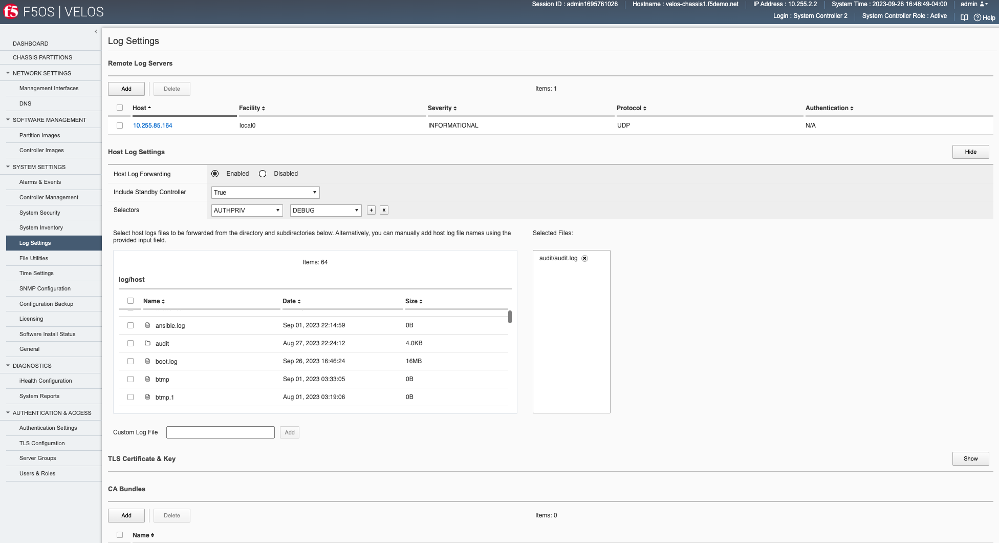

=========================================
Initial Setup of VELOS System Controllers
=========================================

System Controller Setup
=======================

Connect a console or terminal server to each of the system controllers console ports. Login as admin/admin (you’ll be prompted to change the password) and access the F5OS CLI. Follow the details in the link below to run the setup wizard.

`Run the VELOS Setup Wizard <https://techdocs.f5.com/en-us/hardware/velos-systems-getting-started/gs-system-initial-config.html#velos-setup-wizard-overview>_'

F5OS utilizes **ConfD** for configuration management and will be a familiar navigation experience if you have used it on other products. The CLI supports **<TAB>** command completion and online help via **?**, and is easy to navigate. There are **show** commands to display current configurations and status, and a **config** mode to alter current configuration.

Once logged in, you can display the current running configuration by issuing the command **show running-config**.

.. code-block:: bash

  syscon-2-active# show running-config
  image controller config os os 1.2.0-0333
  !
  image controller config services service 1.2.0-0333
  !
  image controller config iso iso 1.2.0-0333
      service 1.2.0-0333
      os      1.2.0-0333
  !
  image partition config os os 1.2.0-0333
  !
  image partition config services service 1.2.0-0333
  !
  image partition config iso iso 1.2.0-0333
      service 1.2.0-0333
      os      1.2.0-0333
  !
  partitions partition bigpart
  config enabled
  …

Configuration is automatically synchronized between the primary and standby system controllers. The configuration of both controllers can be defined from the primary system controller, there is no need to login to the secondary system controller to configure an IP address. You’ll know which system controller is primary by the prompt:

An example of the Active/Primary system controller:

.. code-block:: bash

  syscon-2-active#

An example of the Secondary/Standby system controller:

.. code-block:: bash

  syscon-1-standby#

If you are logged into the standby system controller, then you will not be able to enter config mode. You must be on the primary/active system controller to make configuration changes.

.. code-block:: bash

  syscon-1-standby# config 
  Aborted: node is in readonly mode

-----------------------
Interface Configuration
-----------------------

The out-of-band Ethernet interfaces on each system controller can be configured to run independently, or they may be put into a common Link Aggregation Group to provide added redundancy. To alter any configuration, you must enter config mode:

.. code-block:: bash

  syscon-2-active# config
  Entering configuration mode terminal
  syscon-2-active(config)#

--------------------------
Internal Chassis IP Ranges
--------------------------

Internal Chassis IP Ranges via CLI
----------------------------------

VELOS systems ship with a default internal RFC6598 address space of 100.64.0.0/12. This should be sufficient for most production environments. You can verify this with the following command.

.. code-block:: bash

  syscon-2-active# show system network 
  system network state configured-network-range-type RFC6598
  system network state configured-network-range 100.64.0.0/12
  system network state configured-chassis-id 1
  system network state active-network-range-type RFC6598
  system network state active-network-range 100.64.0.0/12
  system network state active-chassis-id 1
  syscon-2-active# 

This address range never leaves the inside of the chassis and will not interfere with any communication outside the VELOS chassis. There can however be address collisions if a device trying to manage VELOS via the out-of-band management port falls within this range, or an external management device or service falls within this range and communicates with VELOS over its out-of-band networking. This may result in VELOS not able to communicate with those devices.

Some examples would be any client trying to access the F5OS-C platform layer (system controller or chassis partition), or tenant out-of-band interfaces to reach its’ CLI, webUI, or API. Other examples would be external services such as SNMP, DNS, NTP, SNMP, Authentication that have addresses that fall within the RFC6598 address space. You may experience connectivity problems with these types of clients/services, if there is any address space overlap. Note, this does not affect the data plane / in-band interfaces, it only affects communication to the out-of-band interfaces. 

If there is the potential for conflict with external devices that fall within this range that need to communicate with F5OS, then there are options to change the configured **network-range-type** to one of sixteen different blocks within the RFC1918 address space. Changing this will require a complete chassis power-cycle, rebooting is not sufficient, a **commit** must occur before the reboot. Please consult with F5 prior to making any changes to the internal addresses.

.. code-block:: bash

  syscon-2-active(config)# system network config network-range-type RFC <Hit Tab>
  Possible completions:
    RFC1918   VELOS system uses 10.[0-15]/12 as specified by RFC1918
    RFC6598   VELOS system uses 100.64/10 as specified by RFC6598
  syscon-2-active(config)# system network config network-range-type RFC1918

If changing to one of the RFC1918 address spaces, you will need to choose from one of 16 prefix ranges as seen below. You should ensure that this will not overlap with current address space deployed within the environment:

.. code-block:: bash

  syscon-2-active(config)# system network config network-range-type RFC1918 prefix ?
  Description: 
  The network prefix index is used to select the range of IP addresses
  used internally within the chassis.  The network prefix should be
  selected such that internal chassis addresses do not overlap with
  site-local addresses that are accessible to the chassis.

  Network Prefix Index       Chassis Network Range
  0                          10.[0-15].0.0/12
  1                          10.[16-31].0.0/12
  2                          10.[32-47].0.0/12
  3                          10.[48-63].0.0/12
  4                          10.[64-79].0.0/12
  5                          10.[80-95].0.0/12
  6                          10.[96-111].0.0/12
  7                          10.[112-127].0.0/12
  8                          10.[128-143].0.0/12
  9                          10.[144-159].0.0/12
  10                         10.[160-175].0.0/12
  11                         10.[176-191].0.0/12
  12                         10.[192-207].0.0/12
  13                         10.[208-223].0.0/12
  14                         10.[224-239].0.0/12
  15                         10.[240-255].0.0/12
  Possible completions:
    <unsignedByte, 0 .. 15>[0]
  syscon-2-active(config)# system network config network-range-type RFC1918 prefix 15
    syscon-2-active(config)# commit
  Commit complete.

**Note: This change will not take effect until the chassis is power cycled. A complete power cycle is required in order to convert existing internal address space to the new address space, a reboot of individual chassis components is not sufficient.**

Internal Chassis IP Ranges via API
----------------------------------

To view the currently configured internal network ranges via API use the following API call.

.. code-block:: bash

  GET https://{{velos_chassis1_system_controller_ip}}:8888/restconf/data/openconfig-system:system/f5-system-network:network

The response will show the current configured network ranges for use internal to the VELOS chassis.

.. code-block:: json

  {
      "f5-system-network:network": {
          "config": {
              "network-range-type": "RFC6598",
              "prefix": 0,
              "chassis-id": 1
          },
          "state": {
              "configured-network-range-type": "RFC6598",
              "configured-network-prefix": 0,
              "configured-network-range": "100.64.0.0/12",
              "configured-chassis-id": 1,
              "active-network-range-type": "RFC6598",
              "active-network-prefix": 0,
              "active-network-range": "100.64.0.0/12",
              "active-chassis-id": 1
          }
      }
  }

To configure the internal network ranges via CLI use the following API call.

.. code-block:: bash

  PATCH https://{{velos_chassis1_system_controller_ip}}:8888/restconf/data/openconfig-system:system/f5-system-network:network

In the body of the API call, add the desired network-range-type as seen below.

.. code-block:: json

  {
      "f5-system-network:network": {
          "config": {
              "network-range-type": "RFC6598",
              "prefix": 0,
              "chassis-id": 1
          }
      }
  }

-------------------------------
IP Address Assignment & Routing
-------------------------------

Each system controller requires its own unique IP address, and a floating IP address also needs to be configured. The floating IP address will follow the primary system controller. The IP addresses can be statically defined or acquired via DHCP. In addition to the IP addresses, a default route and subnet mask/prefix length is defined. For the initial 1.1.x versions of F5OS-C only IPv4 IP addresses were supported on the out-of-band interfaces of the system controllers. IPv6 and dual stack IPv4/v6 support requires F5OS-C be running 1.2.x or later. Note the tenants themselves support IPv4/IPv6 management regardless of F5OS version.

.. image:: images/initial_setup_of_velos_system_controllers/image1.png
  :align: center
  :scale: 70%

Once logged in, you will configure the static IP addresses (unless DHCP is preferred).

.. code-block:: bash

  syscon-2-active(config)# system mgmt-ip config ipv4 controller-1 address 10.10.10.212
  syscon-2-active(config)# system mgmt-ip config ipv4 controller-2 address 10.10.10.213
  syscon-2-active(config)# system mgmt-ip config ipv4 floating address 10.10.10.214
  syscon-2-active(config)# system mgmt-ip config ipv4 prefix-length 24
  syscon-2-active(config)# system mgmt-ip config ipv4 gateway 10.10.10.1

To make these changes active, you must commit the changes. No configuration changes are executed until the commit command is issued. 

.. code-block:: bash

  syscon-2-active(config)# commit

Now that the out-of-band addresses and routing are configured, you can attempt to access the system controller webUI via the floating IP address that has been defined. The floating IP address should always be used to monitor and configure the system as it will always follow the active controller. Using the static IP addresses is best saved for diagnosing a problem, as the secondary controller will not allow config changes to be made, and monitoring may be limited when in standby state. After logging into the floating IP address, you should see a screen like the one below, and you can verify your management interface settings.

-------------------------------------------------------
Interface Aggregation for System Controllers (Optional)
-------------------------------------------------------

As seen in previous diagrams, each system controller has its own independent out-of-band 10Gb ethernet connection. These can run independently of each other and should be connected to the same layer2 VLAN so that the floating IP address can move from primary to standby in the event of a failure. You may optionally configure these two interfaces into a single Link Aggregation Group (LAG) for added resiliency, which is recommended. This would allow direct access to either static IP address on the system controllers in the event one link should fail. Below is a depiction of each system controllers out-of-band management interface bonded together in a single LAG:

.. image:: images/initial_setup_of_velos_system_controllers/image3.png
  :align: center
  :scale: 70%

To enable this feature, you would need to enable link aggregation on the system controllers via the CLI, webUI or API, and then make changes to your upstream layer2 switching infrastructure to ensure the two ports are put into the same LAG. To configure the management ports of both system controllers to run in a LAG, configure as follows:

 
Create a management aggregate interface and set the **config type** to **ieee8023adLag**, and set the **lag-type** to **LACP**.

.. code-block:: bash

  interfaces interface mgmt-aggr
  config name mgmt-aggr
  config type ieee8023adLag
  aggregation config lag-type LACP
  !

On the active controller, create a management LACP interface:

.. code-block:: bash

  lacp interfaces interface mgmt-aggr
  config name mgmt-aggr
  !

Finally, add the aggregate that you created by name to each of the management interfaces on the two controllers: 

.. code-block:: bash

  !
  interfaces interface 1/mgmt0
  config name 1/mgmt0
  config type ethernetCsmacd
  ethernet config aggregate-id mgmt-aggr
  !
 
 
  interfaces interface 2/mgmt0
  config name 2/mgmt0
  config type ethernetCsmacd
  ethernet config aggregate-id mgmt-aggr

-------------
Primary Key
-------------

The VELOS system uses a primary key to encrypt highly sensitive passwords/passphrases in the configuration database, such as:

•	Tenant unit keys used for TMOS Secure Vault
•	The F5OS API Service Gateway TLS key
•	Stored iHealth credentials
•	Stored AAA server credentials

The primary key is randomly generated by F5OS during initial installation. You should set the primary key to a known value prior to performing a configuration backup. If you restore a configuration backup on a different VELOS device, e.g. during an RMA replacement, you must first set the primary key passphrase and salt on the destination device to the same value as the source device. If this is not done correctly, the F5OS configuration restoration may appear to succeed but produce failures later when the system attempts to decrypt and use the secured parameters.

You should periodically change the primary key for additional security. If doing so, please note that a configuration backup is tied to the primary key at the time it was generated. If you change the primary key, you cannot restore older configuration backups without first setting the primary key to the previous value, if it is known. More details are provided in the solution article below.

**IMPORTANT: Be sure to make note and save the salt and passphrase in a safe location, as these will be needed to restore the configuration on a replacement system.** 

Setting the Primary Key via CLI
-------------------------------

Below is an example of configuring the passphrase and salt for the primary-key.

.. code-block:: bash

    syscon-1-active(config)# system aaa primary-key set passphrase               
    Value for 'passphrase' (<string, min: 6 chars, max: 255 chars>): **************
    Value for 'confirm-passphrase' (<string, min: 6 chars, max: 255 chars>): **************
    Value for 'salt' (<string, min: 6 chars, max: 255 chars>): **************
    Value for 'confirm-salt' (<string, min: 6 chars, max: 255 chars>): **************
    response Info: Key migration is initiated. Use 'show system aaa primary-key state status' to get status

    syscon-1-active(config)#

You can view the status of the primary-key being set with the **show system aaa primary-key state status** CLI command.

.. code-block:: bash

    syscon-1-active# show system aaa primary-key state status
    system aaa primary-key state status "IN_PROGRESS        Initiated: Tue Apr  9 19:46:14 2024"
    
    syscon-1-active# show system aaa primary-key state status
    system aaa primary-key state status "COMPLETE        Initiated: Tue Apr  9 19:46:14 2024"
    syscon-1-active# 

Note that the hash key can be used to check and compare the status of the primary-key on both the source and the replacement devices if restoring to a different device. To view the current primary-key hash, issue the following CLI command.

.. code-block:: bash

    syscon-1-active# show system aaa primary-key state
    system aaa primary-key state hash xxxxxxxxxxxxxxxxxxxxxxxxxxxxxxxxxxxxxxxxxxxxxxxxxxxxxxxxxxxxxxxxxxxxxxxxxxxxxxxxxxxx==
    system aaa primary-key state status "COMPLETE        Initiated: Tue Apr  9 19:46:14 2024"
    syscon-1-active#

Setting the Primary Key via API
-------------------------------

Below is an example of viewing and configuring the passphrase and salt for the primary-key via the API:

To view the key use the following API call:

.. code-block:: bash

  GET https://{{velos_chassis1_system_controller_ip}}:8888/restconf/data/openconfig-system:system/aaa/f5-primary-key:primary-key

The response will look similar to the output below.

.. code-block:: json

  {
      "f5-primary-key:primary-key": {
          "state": {
              "hash": "xxxxxxxxxxxxxxxxxxxxxxxxxxxxxxxxxxxxxxxxxxxxxxxxxxxxxxxxxxxxxxxxxxxxxxxxxxxxxxxxxxxx==",
              "status": "NONE"
          }
      }
  }
 
Below is the API call to set the primary-key:

.. code-block:: bash

  POST https://{{velos_chassis1_system_controller_ip}}:8888/restconf/data/openconfig-system:system/aaa/f5-primary-key:primary-key/f5-primary-key:set

In the body of the API call provide the passphrase and salt. Be sure to save the passphrase and sale in a secure location so that a configuration can be restored if something needs to be replaced. 

.. code-block:: json

  {
  "f5-primary-key:passphrase": "Pa$$w0rd!",
  "f5-primary-key:confirm-passphrase": " Pa$$w0rd!",",
  "f5-primary-key:salt": " Pa$$w0rd!",",
  "f5-primary-key:confirm-salt": " Pa$$w0rd!","
  }
 
After setting the passphrase and salt for the primary-key, you'll see a response similar to the one below.

.. code-block:: json

  {
      "f5-primary-key:output": {
          "response": "Info: Key migration is initiated. Use 'show system aaa primary-key state status' to get status\n"
      }
  }
 
 
You can then run the API GET command again to see status:

.. code-block:: json

  {
      "f5-primary-key:primary-key": {
          "state": {
              "hash": "xxxxxxxxxxxxxxxxxxxxxxxxxxxxxxxxxxxxxxxxxxxxxxxxxxxxxxxxxxxxxxxxxxxxxxxxxxxxxxxxxxxx==",
              "status": "COMPLETE        Initiated: Thu May 30 19:22:13 2024"
          }
      }
  }

---------------
System Settings
---------------

Once the IP addresses have been defined, system settings such as DNS servers, NTP, and external logging should be defined. This can be done from the CLI, webUI, or API.

Configure System Settings (DNS, NTP, Logging) From the CLI
---------------------------------------

In the system controller F5OS CLI, enter config mode. DNS, logging, and NTP can be set as seen in the example below.

.. code-block:: bash

  syscon-2-active# config
  Entering configuration mode terminal
  syscon-2-active(config)# system dns servers server 192.168.19.1 config address 192.168.10.1
  syscon-2-active(config-server-192.168.19.1)# exit
  syscon-2-active(config)# system ntp config enabled 
  syscon-2-active(config)# system ntp servers server time.f5net.com config address time.f5net.com
  syscon-2-active(config-server-time.f5net.com)# exit
  syscon-2-active(config)# system logging remote-servers remote-server 10.10.10.142 selectors selector LOCAL0 WARNING
  syscon-2-active(config-remote-server-10.10.10.142)# exit
  syscon-2-active(config)# commit

Configure System Settings (DNS, NTP, Logging) From the WebUI
----------------------------------------

You can configure the DNS and Time settings from the webUI if preferred. DNS is configured under **Network Settings > DNS**. Here you can add DNS lookup servers, and optional search domains. This will be needed for the VELOS chassis to resolve hostnames that may be used for external services like; licensing, ntp, authentication servers, or to reach iHealth for qkview uploads.

.. image:: images/initial_setup_of_velos_system_controllers/image4.png
  :align: center
  :scale: 70%

Configuring Network Time Protocol is highly recommended, so that the VELOS systems clock is synchronized and accurate. In addition to configuring NTP time sources, you can set the local timezone for this chassis location.

It’s also a good idea to have the VELOS system controllers send logs to an external syslog server. This can be configured in the **System Settings > Log Settings** screen. Here, you can configure remote servers, the logging facility, and severity levels. 

You can also configure logging subsystem levels individually. The remote logging severity level will override the component logging levels if they are configured higher, but only for logs sent remotely. Local logging levels will always follow the component levels that are configured here.

Configure System Settings (DNS, NTP, Logging) From the API
----------------------------------------------------------

If you would prefer to automate the setup of the VELOS chassis, there are F5OS-C API calls for all the examples above. F5OS supports token-based authentication for the F5OS API’s. You may send API calls to either port 8888 or port 443. The URI path will change slightly depending on which TCP port you choose to use. For API calls sent to port 443, the initial path will be /api, while API calls to port 888 will start with /restconf. F5OS also listens on port 80 and will redirect to TCP port 443.

Example of API call using port 8888.

.. code-block:: bash

  https://{{velos_chassis1_system_controller_ip}}:8888/restconf/data/openconfig-system:system/aaa

Example of API call using port 443. Replace /restconf with /api.

.. code-block:: bash

  https://{{velos_chassis1_system_controller_ip}}/api/data/openconfig-system:system/aaa

You can send a standard API call with user/password-based authentication (basic auth), and then store the token for subsequent API calls. The X-Auth-Token has a lifetime of fifteen minutes and can be renewed a maximum of five times before you need to authenticate again using basic auth. The renewal period begins at the ten-minute point, where the API will start sending a new X-Auth-Token in the response for the next five minutes. If your API calls fail to start using the new token by the 15-minute point, API calls will start returning 401 Not Authorized. All the API examples in this guide were generated using the Postman utility. Below is an example of using password-based authentication to the system controller floating IP address. Be sure to go to the **Auth** tab and set the *Type** to **Basic Auth** and enter the username and password to log into your system controller.

.. image:: images/initial_setup_of_velos_system_controllers/image6a.png
  :align: center
  :scale: 70%

To capture the token and save it for use in subsequent API calls, go to the **Test** option in the API call and enter the following:

.. code-block:: bash

  var headerValue = pm.response.headers.get("X-Auth-Token");
  pm.environment.set("X-Auth-Token_Chassis1_System_Controller", headerValue);

This will capture the auth token and store it in a variable called **X-Auth-Token_Chassis1_System_Controller**.

.. image:: images/initial_setup_of_velos_system_controllers/image6b.png
  :align: center
  :scale: 70%

This will be stored as a variable in the Postman **Environment** as seen below.

.. image:: images/initial_setup_of_velos_system_controllers/image6c.png
  :align: center
  :scale: 70%

Once the variable is stored with the auth token, it can be used instead of using basic auth on all subsequent API calls. On any subsequent API call under the **Auth** option, set the **Type** to **Bearer Token**, and set the **Token** to the variable name. Note, Postman references variables by encasing the variable name in these types of parentheses **{{Variable-Name}}**. In this case the **Token** is set to **{{x-auth-token_chassis1_system_controller}}**. 

.. image:: images/initial_setup_of_velos_system_controllers/image6d.png
  :align: center
  :scale: 70%

You must also add some required headers to any API calls sent to F5OS. It is important to include the header **Content-Type** **application/yang-data+json** and the Token header **X-Auth-Token** with a value of **{{x-auth-token_chassis1_system_controller}}**. The variable and header will change depending on the destination of the API call. It can be sent to a second chassis, or to chassis partitions within the chassis depending on the parameter being configured.

.. image:: images/initial_setup_of_velos_system_controllers/image6e.png
  :align: center
  :scale: 70%

Configure System Settings DNS From the API
^^^^^^^^^^^^^^^^^^^^^^^^^^^^^^^^^^^^^^^^^^

To set the DNS configuration for the system controllers, use the following API call with the headers and auth settings from above. Don't forget to acquire the auth token first, otherwise the API call will fail.

.. code-block:: bash

  PATCH https://{{velos_chassis1_system_controller_ip}}:8888/restconf/data/

In the body of the API call add the desired DNS configuration.

.. code-block:: json

  {
      "openconfig-system:system": {
          "clock": {
              "config": {
                  "timezone-name": "America/New_York"
              }
          },
          "dns": {
              "config": {
                  "search": "olympus.f5net.com"
              },
              "servers": {
                  "server": [
                      {
                          "address": "8.8.8.8",
                          "config": {
                              "address": "8.8.8.8"
                          }
                      },
                      {
                          "address": "192.168.10.1",
                          "config": {
                              "address": "192.168.10.1"
                          }
                      },
                      {
                          "address": "192.168.11.1",
                          "config": {
                              "address": "192.168.11.1"
                          }
                      }
                  ]
              }
          }
      }
  }

Configure System Settings NTP, Timezone From the API
^^^^^^^^^^^^^^^^^^^^^^^^^^^^^^^^^^^^^^^^^^^^^^^^^^^^

To set System Time settings, use the following API call as an example:

.. code-block:: bash

  PATCH https://{{velos_chassis1_system_controller_ip}}:8888/restconf/data/

In the body of the API call add the desired NTP & Timezone configuration.

.. code-block:: json

  {
      "openconfig-system:system": {
          "clock": {
              "config": {
                  "timezone-name": "America/New_York"
              }
          },
          "ntp": {
              "config": {
                  "enabled": "true"
              },
              "servers": {
                  "server": [
                      {
                          "address": "pool.ntp.org",
                          "config": {
                              "address": "pool.ntp.org"
                          }
                      }
                  ]
              }
          }
      }
  }

Configure System Settings SYSLOG From the API
^^^^^^^^^^^^^^^^^^^^^^^^^^^^^^^^^^^^^^^^^^^^^

To set a Remote Logging destination, use the following API call:

.. code-block:: bash

  PATCH https://{{velos_chassis1_system_controller_ip}}:8888/restconf/data/

In the body of the API call add the desired SYSLOG configuration.

.. code-block:: json

  {
      "openconfig-system:system": {
          "logging": {
              "remote-servers": {
                  "remote-server": [
                      {
                          "host": "10.10.10.1",
                          "config": {
                              "host": "10.10.10.1",
                              "remote-port": "514"
                          },
                          "selectors": {
                              "selector": [
                                  {
                                      "facility": "LOCAL0",
                                      "severity": "INFORMATIONAL",
                                      "config": {
                                          "facility": "LOCAL0",
                                          "severity": "INFORMATIONAL"
                                      }
                                  }
                              ]
                          }
                      }
                  ]
              }
          }
      }
  }

---------------------------
Licensing the VELOS Chassis
---------------------------

Licensing for the VELOS system is handled at the chassis level. This is like how VIPRION licensing is implemented, where the system is licensed once, and all subsystems inherit their licensing from the chassis. With VELOS, licensing is applied at the system controller level, and all chassis partitions and tenants will inherit their licenses from the base system. There is no need to procure add-on licenses for MAX SSL/Compression, or for tenancy/vCMP. This is different than VIPRION, where there was an extra charge for virtualization/vCMP, and in some cases for MAX SSL/Compression. For VELOS, these are included in the base license at no extra cost. VELOS does not run vCMP, and instead runs tenancy.

Licenses can be applied via the F5OS-C CLI, webUI, or API. A base registration key and optional add-on keys are needed, and it follows the same manual or automatic licensing capabilities of other BIG-IP systems.

Licensing via webUI
-------------------

Licensing is accessible under the **System Settings > Licensing** page. **Automatic** will require proper routing and DNS connectivity to the Internet to reach F5’s licensing server. If it is not possible to reach the licensing server, use the **Manual** method.

.. image:: images/initial_setup_of_velos_system_controllers/image7.png
  :width: 45%

.. image:: images/initial_setup_of_velos_system_controllers/image8.png
  :width: 45%

You can activate and display the current license in the webUI, CLI or API. 

Licensing via CLI
---------------------

You can license the VELOS system automatically if F5's licensing server is reachable from the VELOS system, and it can resolve the licensing servers name via DNS. If this is not possible, manual licensing may be used. To license the VELOS chassis automatically from the F5OS CLI:

.. code-block:: bash

  syscon-1-active(config)# system licensing install registration-key I1234-12345-12345-12345-1234567
  result License installed successfully.

To license the VELOS chassis manually, you’ll need to get the dossier first:

.. code-block:: bash

  syscon-2-active(config)# system licensing get-dossier
  xxxxxxxxxxxxxxxxxxxxxxxxxxxxxxxxxxxxxxxxxxxxxxxxxxxxxxxxxxxxxxxxxxxxxxxxxxxxxxxxxxxxxxxxxxxxxxxxxxxxxxxxxxxxxxxxxxxxxxxxxxxxxxxxxxxxxxxxxxxxxxxxxxxxxxxxxxxxxxxxxxxxxxxxxxxxxxxx…

You can then access F5’s licensing server (license.f5.com) via another host that has internet access, and paste in the dossier when prompted:

.. image:: images/initial_setup_of_velos_system_controllers/image9.png
  :align: center
  :scale: 70%

.. image:: images/initial_setup_of_velos_system_controllers/image10.png
  :align: center
  :scale: 70%

This should generate a license that can be saved or pasted into the VELOS system using the command **system licensing manual-install license**:

.. image:: images/initial_setup_of_velos_system_controllers/image11.png
  :align: center
  :scale: 70%

.. code-block:: bash

  syscon-2-active(config)# system licensing manual-install license 
  Value for 'license' (<string>): 
  [Multiline mode, exit with ctrl-D.]
  >

You should paste in the license, and when finished hit **<CTRL> D**.

.. code-block:: bash

  #
  > #-----------------------------------------
  > # Copyright 1996-2021, F5 Networks, Inc.
  > # All rights reserved. 
  > #-----------------------------------------
  > 
  result License installed successfully.
  syscon-2-active(config)# 

You can also view the End User License Agreement (EULA) via the CLI:

.. code-block:: bash

  syscon-2-active(config)# system licensing get-eula 
  eula-text END USER LICENSE AGREEMENT

  DOC-0355-16

  IMPORTANT " READ BEFORE INSTALLING OR OPERATING THIS PRODUCT

  YOU AGREE TO BE BOUND BY THE TERMS OF THIS LICENSE BY INSTALLING,
  HAVING INSTALLED, COPYING, OR OTHERWISE USING THE SOFTWARE.  IF YOU
  DO NOT AGREE, DO NOT INSTALL OR USE THE SOFTWARE.

The CLI command **show system licensing** will display the chassis level licensing:

.. code-block:: bash

  syscon-2-active# show system licensing 
  system licensing license 
                          Licensed version    1.2.0
                          Registration Key    XXXXX-12345-12345-12345-1234567
                          Licensed date       2020/12/08
                          License start       2020/12/07
                          License end         2021/01/08
                          Service check date  2020/12/08
                          Platform ID         F101
                          Appliance SN        chs600148s
                          
                          Active Modules
                            Local Traffic Manager, CX410 (XXXXXXX-XXXXXXX)
                            Best Bundle, CX410
                            APM-Lite
                            Carrier Grade NAT (AFM ONLY)
                            Max Compression, CX410
                            Rate Shaping
                            Max SSL, CX410
                            DNS, Max QPS, CX410
                            Advanced Routing, CX410
                            Advanced Firewall Manager, CX410
                            Advanced Web Application Firewall, CX410
                            Access Policy Manager, Base, CX410
                            Anti-Virus Checks
                            Base Endpoint Security Checks
                            Firewall Checks
                            Machine Certificate Checks
                            Network Access
                            Protected Workspace
                            Secure Virtual Keyboard
                            APM, Web Application
                            App Tunnel
                            Remote Desktop

**Note: VELOS supports AWAF and not ASM licensing. Modules such as AAM and Link Controller are not supported on the VELOS platform since they have reached End-of-Life.**

`K70113407: End of Software Development for BIG-IP AAM <https://support.f5.com/csp/article/K70113407>`_

`K13328631: United States of America Only: End of Sale notice -- BIG-IP Link Controller, effective October 31, 2015 <https://support.f5.com/csp/article/K13328631>`_

Manual Licensing via API
------------------------

Sometimes a manual licensing operation may need to be performed. This is common in environments where the VELOS chassis doesn't have access to the Internet to reach the licensing server. In this case, you may perform a manual licensing operation via the API. First, obtain the **Base Registration Key** that is tied to your system. Below is an example for a temporary evaluation license but the process would be similar for a production license. In the example below, the actual Registration Key has been obfuscated with XXXX's.

.. code-block:: bash

    ---------------------------------------------------------
    Contact              : Jim@F5.com
    ---------------------------------------------------------

    Registration Key     : XXXXX-XXXXX-XXXXX-XXXXX-XXXXXXX
    F5 Product           : F5-BIG-BT-CX410-LIC-DEV
    Evaluation Duration  : 30 days
    Requested Registration Key Configuration
    ---------------------------------------------------------

Then send the Base Reg Key in the body of the get-dossier API call below:

.. code-block:: bash

    POST https://{{velos_chassis1_system_controller_ip}}:8888/restconf/data/openconfig-system:system/f5-system-licensing:licensing/f5-system-licensing-install:get-dossier

Within the body of API call, enter your registation-key. Note, in the example below the actual Registration Key has been obfuscated with XXXX's.

.. code-block:: json

    {
        "registration-key": "XXXXX-XXXXX-XXXXX-XXXXX-XXXXXXX"
    }

If the API call is successful, then the output will give you a system-dossier as seen below.  Note, in the example below the actual system-dossier has been obfuscated with random characters. You'll need to copy and save the dossier, as you'll need to input it into F5's licensing server, to get the license for your system.

.. code-block:: json

    {
        "f5-system-licensing-install:output": {
            "system-dossier": "xxxxxxxxxxxxxxxxxxxxxxxxxxxxxxxxxxxxxxxxxxxxxxxxxxxxxxxxxxxxxxxxxxxxxxxxxxxxxxxxxxxxxxxxxxxxxxxxxxxxxxxxxxxxxxxxxxxxxxxxxxxxxxxxxxxxxxxxxxxxxxxxxxxxxxxxxxxxxxxxxxxxxxxxxxxxxxxxxxxxxxxxxxxxxxxxxxxxxxxxxxxxxxxxxxxxxxxxxxxxxxxxxxxxxxxxxxxxxxxxxxxxxxxxxxxxxxxxxxxxxxxxxxxxxxxxxxxxxxxxxxxxxxxxxxxxxxxxxxxxxxxxxxxxxxxxxxxxxxxxxxxxxxxxxxxxxxxxxxxxxxxxxxxxxxxxxxxxxxxxxxxxxxxxxxxxxxxxxxxxxxxxxxxxxxxxxxxxxxxxxxxxxxxxxxxxxxxxxxxxxxxxxxxxxxxxxxxxxxxxxxxxxxxxxxxxxxxxxxxxxxxxxxxxxxxxxxxxxxxxxxxxxxxxxxxxxxxxxxxxxxxxxxxxxxxxxxxxxxxxxxxxxxxxxxxxxxxxxxxxxxxxxxxxxxxxxxxxxxxxxxxxxxxxxxxxxxxxxxxxxxxxxxxxxxxxxxxxxxxxxxxxxxxxxxxxxxxxxxxxxxxxxxxxxxxxxxxxxxxxxxxxxxxxxxxxxxxxxxxxxxxxxxxxxxxxxxxxxxxxxxxxxxxxxxxxxxxxxxxxxxxxxxxxxxxxxxxxxxxxxxxxxxxxxxxxxxxxxxxxxxxxxxxxxxxxxxxxxxxxxxxxxxxxxxxxxxxxxxxxxxxxxxxxxxxxxxxxxxxxxxxxxxxxxxxxxxxxxxxxxxxxxxxxxxxxxxxxxxxxxxxxxxxxxxxxxxxxxxxxxxxxxxxxxxxxxxxxxxxxxxxxxxxxxxxxxxxxxxxxxxxxxxxxxxxxxxxxxxxxxxxxxxxxxxxxxxxxxxxxxxxxxxxxxxxxxxxxxxxxxxxxxxxxxxxxxxxxxxxxxxxxxxxxxxxxxxxxxxxxxxxxxxxxxxxxxxxxxxxxxxxxxxxxxxxxxxxxxxxxxxxxxxxxxxxxxxxxxxxxxxxxxxxxxxxxxxxxxxxxxxxxxxxxxxxxxxxxxxxxxxxxxxxxxxxxxxxxxxxxxxxxxxxxxxxxxxxxxxxxxxxxxxxxxxxxxxxxxxxxxxxxxxxxxxxxxxxxxxxxxxxxxxxxxxxxxxxxxxxxxxxxxxxxxxxxxxxxxxxxxxxxxxxxxxxxxxxxxxxxxxxxxxxxxxxxxxxxxxxxxxxxxxxxxxxxxxxxxxxxxxxxxxxxxxxxxxxxxxxxxxxxxxxxxxxxxxxxxxxxxxxxxxxxxxxxxxxxxxxxxxxxxxxxxxxxxxxxxxxxxxxxxxxxxxxxxxxxxxxxxxxxxxxxxxxxxxxxxxxxxxxxxxxxxxxxxxxxxxxxxxxxxxxxxxxxxxxxxxxxxxxxxxxxxxxxxxxxxxxxxxxxxxxxxxxxxxxxxxxxxxxxxxxxxxxxxxxxxxxxxxxxxxxxxxxxxxxxxxxxxxxxxxxxxxxxxxxxxxxxxxxxxxxxxxxxxxxxxxxxxxxxxxxxxxxxxxxxxxxxxxxxxxxxxxxxxxxxxxxxxxxxxxxxxxxxxxxxxxxxxxxxxxxxxxxxxxxxxxxxxxxxxxxxxxxxxxxxxxxxxxxxxxxxxxxxxxxxxxxxx"
        }
    }

Go to F5 license server: 

`Activate F5 License <https://activate.f5.com/license/dossier.jsp>`_

Paste in the dossier from your system.

Next, you'll be prompted to accept the End User License Agreement (EULA). Click on the check box to acknowledge that you have read and agree to the terms in the EULA. Then click Next.

A license will be displayed. You can either copy the output or download the License File. It is recommended you download the file if possible.

You'll need to edit the license file to escape any double quotes within the license body. In the body of the API call you have to escape any double quotes (inside the license) with slashes ( \ ), as seen below.

Send the following API call to install the new license:

.. code-block:: bash

    POST https://{{velos_chassis1_system_controller_ip}}:8888/restconf/data/openconfig-system:system/f5-system-licensing:licensing/f5-system-licensing-install:manual-install

In the body of the API call enter the edited license in the proper area. Below is the full body with the escaped double quotes in the license. Note the file has been obfuscated from its original:

.. code-block:: json

    {
        "input": 
        [
            {"license":"#
    Auth vers :                        5b
    #
    #
    #       BIG-IP System License Key File
    #       DO NOT EDIT THIS FILE!!
    #
    #       Install this file as \"/config/bigip.license\".
    #
    #       Contact information in file /CONTACTS
    #
    #
    #       Warning: Changing the system time while this system is running
    #                with a time-limited license may make the system unusable.
    #
    Usage :                            Evaluation
    #
    #
    #  Only the specific use referenced above is allowed. Any other uses are prohibited.
    #
    Vendor :                           F5 Networks, Inc.
    #
    #       Module List 
    #
    active module :                    Best Bundle, CX410|XXXXXXX-XXXXXXX|Max Compression, CX410|Rate Shaping|Max SSL, CX410|DNS, Max QPS, CX410|Advanced Firewall Manager, CX410|Advanced Web Application Firewall, CX410|Access Policy Manager, Base, CX410|Carrier Grade NAT (AFM ONLY)|Advanced Routing, CX410
    optional module :                  Advanced Protocols, CX410
    optional module :                  Anti-Bot Mobile, CX410
    optional module :                  APM, 1000 VPN Users
    optional module :                  APM, 10000 VPN Users
    optional module :                  APM, 25000 VPN Users
    optional module :                  APM, 500 VPN Users
    optional module :                  APM, 5000 VPN Users
    optional module :                  Basic Policy Enforcement Manager, CX410
    optional module :                  BPEM, Traffic Classification, CX410
    optional module :                  DataSafe, CX410
    optional module :                  Dynamic Policy Provisioning, CX410
    optional module :                  External Interface and Network HSM
    optional module :                  FIPS 140 Compliant Mode, Level 1, CX410
    optional module :                  FIX Low Latency, CX410
    optional module :                  Intrusion Prevention System, CX410
    optional module :                  IP Intelligence, 1Yr, CX410
    optional module :                  IP Intelligence, 3Yr, CX410
    optional module :                  IPS Signatures, 1Yr, CX410
    optional module :                  IPS Signatures, 3Yr, CX410
    optional module :                  Multicast Routing, CX410
    optional module :                  PEM URL Filtering, 1Yr, CX410
    optional module :                  PEM URL Filtering, 3Yr, CX410
    optional module :                  PEM, Quota Management, CX410
    optional module :                  Policy Enforcement Manager, CX410
    optional module :                  Privileged User Access, 100 End-Points
    optional module :                  Privileged User Access, 1000 End-Points
    optional module :                  Privileged User Access, 250 End-Points
    optional module :                  Privileged User Access, 50 End-Points
    optional module :                  Privileged User Access, 500 End-Points
    optional module :                  Secure Web Gateway, 1Yr, 30K Sessions, CX410
    optional module :                  Secure Web Gateway, 1Yr, 60K Sessions, CX410
    optional module :                  Secure Web Gateway, 3Yr, 30K Sessions, CX410
    optional module :                  Secure Web Gateway, 3Yr, 60K Sessions, CX410
    optional module :                  SM2_SM3_SM4
    optional module :                  Subscriber Discovery, CX410
    optional module :                  Threat Campaigns, 1Yr, CX410
    optional module :                  Threat Campaigns, 3Yr, CX410
    optional module :                  Traffic Classification, CX410
    optional module :                  URL Filtering, 1Yr, 30K Sessions, CX410
    optional module :                  URL Filtering, 1Yr, 60K Sessions, CX410
    optional module :                  URL Filtering, 3Yr, 30K Sessions, CX410
    optional module :                  URL Filtering, 3Yr, 60K Sessions, CX410
    #
    #       Accumulated Tokens for Module
    #       Max SSL, CX410  perf_SSL_Mbps 1  key XXXXXXX-XXXXXXX
    #
    perf_SSL_Mbps :                    1
    #
    #       Accumulated Tokens for Module
    #       Access Policy Manager, Base, CX410  apm_access_sessions 100000000  key XXXXXXX-XXXXXXX
    #
    #       Accumulated Tokens for Module
    #       Access Policy Manager, Base, CX410  apm_sessions 500  key XXXXXXX-XXXXXXX
    #
    #       Accumulated Tokens for Module
    #       Access Policy Manager, Base, CX410  apm_urlf_limited_sessions 100000000  key XXXXXXX-XXXXXXX
    #
    apm_access_sessions :              100000000
    apm_sessions :                     500
    apm_urlf_limited_sessions :        100000000
    #
    #       License Tokens for Module Advanced Web Application Firewall, CX410 key XXXXXXX-XXXXXXX
    #
    waf_gc :                           enabled
    mod_waf :                          enabled
    mod_datasafe :                     enabled
    mod_asm :                          enabled
    ltm_persist_cookie :               enabled
    ltm_persist :                      enabled
    ltm_lb_rr :                        enabled
    ltm_lb_ratio :                     enabled
    ltm_lb_priority :                  enabled
    ltm_lb_pool_member_limit :         UNLIMITED
    ltm_lb_least_conn :                enabled
    ltm_lb_l3_addr :                   enabled
    ltm_lb :                           enabled
    asm_apps :                         unlimited
    #
    #       License Tokens for Module Best Bundle, CX410 key XXXXXXX-XXXXXXX
    #
    perf_vcmp_max_guests :             100000
    perf_PVA_dram_limit :              enabled
    nw_vlan_groups :                   enabled
    mod_ltm :                          enabled
    mod_lbl :                          enabled
    mod_ilx :                          enabled
    ltm_network_virtualization :       enabled
    fpga_performance :                 enabled
    #
    #       License Tokens for Module Advanced Firewall Manager, CX410 key XXXXXXX-XXXXXXX
    #
    perf_SSL_total_TPS :               UNLIMITED
    nw_l2_transparent :                enabled
    mod_afw :                          enabled
    mod_afm :                          enabled
    ltm_netflow_switching :            enabled
    ltm_monitor_rule :                 enabled
    #
    #       License Tokens for Module Max SSL, CX410 key XXXXXXX-XXXXXXX
    #
    perf_SSL_per_core :                enabled
    perf_SSL_cmp :                     enabled
    #
    #       License Tokens for Module Max Compression, CX410 key XXXXXXX-XXXXXXX
    #
    perf_http_compression_Mbps :       UNLIMITED
    perf_http_compression_hw :         enabled
    #
    #       License Tokens for Module Advanced Routing, CX410 key XXXXXXX-XXXXXXX
    #
    nw_routing_rip :                   enabled
    nw_routing_ospf :                  enabled
    nw_routing_isis :                  enabled
    nw_routing_bgp :                   enabled
    nw_routing_bfd :                   enabled
    #
    #       License Tokens for Module DNS, Max QPS, CX410 key XXXXXXX-XXXXXXX
    #
    mod_dnsgtm :                       enabled
    ltm_dnssec :                       enabled
    ltm_dns_v13 :                      enabled
    ltm_dns_rate_limit :               UNLIMITED
    ltm_dns_rate_fallback :            UNLIMITED
    ltm_dns_lite :                     enabled
    ltm_dns_licensed_objects :         UNLIMITED
    gtm_rate_limit :                   UNLIMITED
    gtm_rate_fallback :                UNLIMITED
    gtm_licensed_objects :             UNLIMITED
    #
    #       License Tokens for Module Carrier Grade NAT (AFM ONLY) key XXXXXXX-XXXXXXX
    #
    mod_cgnat :                        enabled
    ltm_network_map :                  enabled
    ltm_monitor_udp :                  enabled
    ltm_monitor_tcp_ho :               enabled
    ltm_monitor_tcp :                  enabled
    ltm_monitor_radius :               enabled
    ltm_monitor_icmp :                 enabled
    ltm_monitor_gateway_icmp :         enabled
    dslite :                           enabled
    cgnat :                            enabled
    #
    #       License Tokens for Module Access Policy Manager, Base, CX410 key XXXXXXX-XXXXXXX
    #
    mod_apm :                          enabled
    apm_web_applications :             enabled
    apm_remote_desktop :               enabled
    apm_pingaccess :                   enabled
    apm_na :                           enabled
    apm_logon_page_fraud_protection :  enabled
    apm_ep_svk :                       enabled
    apm_ep_pws :                       enabled
    apm_ep_machinecert :               enabled
    apm_ep_fwcheck :                   enabled
    apm_ep_avcheck :                   enabled
    apm_ep :                           enabled
    apm_app_tunnel :                   enabled
    apm_api_protection :               enabled
    api_protection_infra :             enabled
    #
    #       License Tokens for Module Rate Shaping key XXXXXXX-XXXXXXX
    #
    ltm_bandw_rate_tosque :            enabled
    ltm_bandw_rate_fairque :           enabled
    ltm_bandw_rate_classl7 :           enabled
    ltm_bandw_rate_classl4 :           enabled
    ltm_bandw_rate_classes :           enabled
    #
    # Debug Msg - Is sol18346625 affected; New module/key without already existing keys before cut-off date of 2016-04-15 00.00.00
    #
    # LC disabled in accordance with https://support.f5.com/kb/en-us/solutions/public/k/18/sol18346625.html
    #
    gtm_lc :                           disabled
    #
    #       Licensing Information 
    #
    Licensed date :                    20231211
    License start :                    20231210
    License end :                      20240111
    Service check date :               20231211
    #
    #       Platform Information 
    #
    Registration Key :                 XXXXX-XXXXX-XXXXX-XXXXX-XXXXXXX
    Licensed version :                 1.6.1
    Platform ID :                      F101
    Appliance SN :                     chs123456s
    #
    #       Outbound License Dossier Validation
    #
    Dossier :                          
    xxxxxxxxxxxxxxxxxxxxxxxxxxxxxxxxxxxxxxxxxxxxxxxxxxxxxxxxxxxxxxxxxxxxxxxxxxxxxxxxxxxxxxxxxxxxxxxxxxxxxxxxxxxxxxxxxxxxxxxxxxxxxxxxxxxxxxxx
    #
    #       Outbound License Authorization Signature
    #
    Authorization :                    xxxxxxxxxxxxxxxxxxxxxxxxxxxxxxxxxxxxxxxxxxxxxxxxxxxxxxxxxxxxxxxxxxxxxxxxxxxxxxxxxxxxxxxxxxxxxxxxxxxxxxxxxxxxxxxxxxxxxxxxxxxxxxxxxxxxxxxxxxxxxxxxxxxxxxxxxxxxxxxxxxxxxxxxxxxxxxxxxxxxxxxxxxxxxxxxxxxxxxxxxxxxxxxxxxxxxxxxxxxxxxxxxxxxxxxxxxxxxxxxxxxxxxxxxxxxxxxxxxxxxxxxxxxxxxxxxxxxxxxxxxxxxxxxxxxxxxxxxxxxxxxxxxxxxxxxxxxxxxxxxxxxxxxxxxxxxxxxxxxxxxxxxxxxxxxxxxxxxxxxxxxxxxxxxxxxxxxxxxxxxxxxxxxxxxxxxxxxxxxxxxxxxxxxxxxxxxxxxxxxxxxxxxxxxxxxxxxxxxxxxxxxxxxxxxxxxxxxxxxxxxxxxxxxxxxxxxxxxxxxxxxxxxxxxxxxxxxxxxxxxxxxxxxxxxxxxxxxxxxxxxxxxxxxxxxxxxxxxxxxxxxx
    #
    #-----------------------------------------
    # Copyright 1996-2023, F5 Networks, Inc.
    # All rights reserved. 
    #-----------------------------------------
    "
            }
        ]
    }

You'll get the following confirmation that the license has been installed successfully:

.. code-block:: json

    {
        "f5-system-licensing-install:output": {
            "result": "License installed successfully."
        }
    }

Automatic Licensing via API
----------------------------

You can very easily apply a license automatically with the following API call. This assumes the VELOS system controllers are on the network, have internet access and DNS has been configured. This will allow the system to resolve the domain name for the F5 licensing server to apply the license.

.. code-block:: bash

  POST https://{{velos_chassis1_system_controller_ip}}:8888/restconf/data/openconfig-system:system/f5-system-licensing:licensing/f5-system-licensing-install:install

In the body of the API call add your Base Registration Key:

.. code-block:: json

    {
        "f5-system-licensing-install:input": [
            {
                "registration-key": "{{velos_license_registration_key_chassis1}}"
            }
        ]
    }

You should receive a success message indicating the License installed successfully.

.. code-block:: json

    {
        "f5-system-licensing-install:output": {
            "result": "License installed successfully."
        }
    }

To get the current licensing status via API use the following API call. Issue a **GET** to the out-of-band management IP address of the F5OS layer:

.. code-block:: bash

  GET https://{{velos_chassis1_system_controller_ip}}:8888/restconf/data/openconfig-system:system/f5-system-licensing:licensing

.. code-block:: json

  {
      "f5-system-licensing:licensing": {
          "config": {
              "registration-key": {
                  "base": "XXXXX-XXXXX-XXXXX-XXXXX-XXXXXXX"
              },
              "dossier": "xxxxxxxxxxxxxxxxxxxxxxxxxxxxxxxxxxxxxxxxxxxxxxxxxxxxxxxxxxxxxxxxxxxxxxxxxxxxxxxxxxxxxxxxxxxxxxxxxxxxxxxxxxxxxxxxxxxxxxxxxxxxxxxxxxxxxxxxxxxxxxxxxxxxxxxxxxxxxxxxxxxxxxxxxxxxxxxxxxxxxxxxxxxxxxxxxxxxxxxxxxxxxxxxxxxxxxxxxxxxxxxxxxxxxxxxxxxxxxxxxxxxxxxxxxxxxxxxxxxxxxxxxxxxxxxxxxxxxxxxxxxxxxxxxxxxxxxxxxxxxxxxxxxxxxxxxxxxxxxxxxxxxxxxxxxxxxxxxxxxxxxxxxxxxxxxxxxxxxxxxxxxxxxxxxxxxxxxxxxxxxxxxxxxxxxxxxxxxxxxxxxxxxxx",
              "license": "#\nAuth vers :                   5b\n#\n#\n#       BIG-IP System License Key File\n#       DO NOT EDIT THIS FILE!!\n#\n#       Install this file as \"/config/bigip.license\".\n#\n#       Contact information in file /CONTACTS\n#\n#\n#       Warning: Changing the system time while this system is running\n#                with a time-limited license may make the system unusable.\n#\nUsage :                       F5 Internal Product Development\n#\n#\n#  Only the specific use referenced above is allowed. Any other uses are prohibited.\n#\nVendor :                      F5 Networks, Inc.\n#\n#       Module List \n#\nactive module :               Local Traffic Manager, r10900|XXXXXX-XXXXXX|Rate Shaping|Anti-Virus Checks|Base Endpoint Security Checks|Firewall Checks|Machine Certificate Checks|Network Access|Protected Workspace|Secure Virtual Keyboard|APM, Web Application|App Tunnel|Remote Desktop|APM, Limited|Max SSL, r10900|Max Compression, r10900\noptional module :             Access Policy Manager, Base, r109XX\noptional module :             Access Policy Manager, Max, r109XX\noptional module :             Advanced Firewall Manager, r10XXX\noptional module :             Advanced Protocols\noptional module :             Advanced Web Application Firewall, r10XXX\noptional module :             App Mode (TMSH Only, No Root/Bash)\noptional module :             Basic Policy Enforcement Manager, i10XXX\noptional module :             BIG-IP, Multicast Routing\noptional module :             BIG-IP, Privileged User Access, 100 Endpoints\noptional module :             BIG-IP, Privileged User Access, 1000 Endpoints\noptional module :             BIG-IP, Privileged User Access, 250 Endpoints\noptional module :             BIG-IP, Privileged User Access, 50 Endpoints\noptional module :             BIG-IP, Privileged User Access, 500 Endpoints\noptional module :             Carrier-Grade NAT, r10XXX\noptional module :             DataSafe, r10XXX\noptional module :             DDOS, r10XXX\noptional module :             DNS 1K, rSeries\noptional module :             DNS Max, rSeries\noptional module :             Dynamic Policy Provisioning, r10XXX\noptional module :             External Interface and Network HSM\noptional module :             FIPS 140-2\noptional module :             FIX Low Latency\noptional module :             Intrusion Prevention System, r10XXX\noptional module :             IP Intelligence, 1Yr\noptional module :             IP Intelligence, 3Yr\noptional module :             IPS, 1Yr\noptional module :             IPS, 3Yr\noptional module :             Link Controller\noptional module :             LTM to Best Upgrade, r109XX\noptional module :             LTM to Better Upgrade, r109XX\noptional module :             Policy Enforcement Manager, r10XXX\noptional module :             Routing Bundle\noptional module :             SM2_SM3_SM4\noptional module :             SSL Orchestrator, r10XXX\noptional module :             Subscriber Discovery, r10XXX\noptional module :             Threat Campaigns, 1Yr\noptional module :             Threat Campaigns, 3Yr\noptional module :             Traffic Classification, r10XXX\noptional module :             URL Filtering, 1Yr\noptional module :             URL Filtering, 1Yr, Max\noptional module :             URL Filtering, 3Yr\noptional module :             URL Filtering, 3Yr, Max\noptional module :             VPN Users\n#\n#       Accumulated Tokens for Module\n#       Max SSL, r10900  perf_SSL_Mbps 1  key XXXXXX-XXXXXX\n#\nperf_SSL_Mbps :               1\n#\n#       Accumulated Tokens for Module\n#       APM, Limited  apm_urlf_limited_sessions 10  key XXXXXX-XXXXXX\n#\n#       Accumulated Tokens for Module\n#       APM, Limited  apml_sessions 10  key XXXXXX-XXXXXX\n#\napm_urlf_limited_sessions :   10\napml_sessions :               10\n#\n#       License Tokens for Module Local Traffic Manager, r10900 key XXXXXX-XXXXXX\n#\nthrottle_level :              900\nperf_vcmp_max_guests :        UNLIMITED\nperf_PVA_dram_limit :         enabled\nperf_CPU_cores :              UNLIMITED\nnw_vlan_groups :              enabled\nmod_ltm :                     enabled\nmod_lbl :                     enabled\nmod_ilx :                     enabled\nltm_network_virtualization :  enabled\nfpga_performance :            enabled\n#\n#       License Tokens for Module Max SSL, r10900 key XXXXXX-XXXXXX\n#\nperf_SSL_total_TPS :          UNLIMITED\nperf_SSL_per_core :           enabled\nperf_SSL_cmp :                enabled\n#\n#       License Tokens for Module Max Compression, r10900 key XXXXXX-XXXXXX\n#\nperf_http_compression_Mbps :  UNLIMITED\nperf_http_compression_hw :    enabled\n#\n#       License Tokens for Module APM, Limited key XXXXXX-XXXXXX\n#\nmod_apml :                    enabled\n#\n#       License Tokens for Module Rate Shaping key XXXXXX-XXXXXX\n#\nltm_bandw_rate_tosque :       enabled\nltm_bandw_rate_fairque :      enabled\nltm_bandw_rate_classl7 :      enabled\nltm_bandw_rate_classl4 :      enabled\nltm_bandw_rate_classes :      enabled\n#\n#       License Tokens for Module APM, Web Application key XXXXXX-XXXXXX\n#\napm_web_applications :        enabled\n#\n#       License Tokens for Module Remote Desktop key XXXXXX-XXXXXX\n#\napm_remote_desktop :          enabled\n#\n#       License Tokens for Module Network Access key XXXXXX-XXXXXX\n#\napm_na :                      enabled\n#\n#       License Tokens for Module Secure Virtual Keyboard key XXXXXX-XXXXXX\n#\napm_ep_svk :                  enabled\n#\n#       License Tokens for Module Protected Workspace key XXXXXX-XXXXXX\n#\napm_ep_pws :                  enabled\n#\n#       License Tokens for Module Machine Certificate Checks key XXXXXX-XXXXXX\n#\napm_ep_machinecert :          enabled\n#\n#       License Tokens for Module Firewall Checks key XXXXXX-XXXXXX\n#\napm_ep_fwcheck :              enabled\n#\n#       License Tokens for Module Anti-Virus Checks key XXXXXX-XXXXXX\n#\napm_ep_avcheck :              enabled\n#\n#       License Tokens for Module Base Endpoint Security Checks key XXXXXX-XXXXXX\n#\napm_ep :                      enabled\n#\n#       License Tokens for Module App Tunnel key XXXXXX-XXXXXX\n#\napm_app_tunnel :              enabled\n#\n# Debug Msg - Is sol18346625 affected; Usage, \"2021-09-28 00.00.00\", started after requirement date \"2016-04-15 00.00.00\"\n#\n# LC disabled in accordance with https://support.f5.com/kb/en-us/solutions/public/k/18/sol18346625.html\n#\ngtm_lc :                      disabled\n#\n#       Licensing Information \n#\nLicensed date :               20211129\nLicense start :               20210927\nLicense end :                 20220121\nService check date :          20211222\n#\n#       Platform Information \n#\nRegistration Key :            B1249-45920-70635-24344-7350724\nLicensed version :            1.0.0\nPlatform ID :                 C128\nAppliance SN :                f5-xpdn-ngmu\n#\n#       Outbound License Dossier Validation\n#\nDossier :                     xxxxxxxxxxxxxxxxxxxxxxxxxxxxxxxxxxxxxxxxxxxxxxxxxxxxxxxxxxxxxxxxxxxxxxxxxxxxxxxxxxxxxxxxxxxxxxxxxxxxxxxxxxxxxxxxxxxxxxxxxxxxxxxxxxxxxxxx\n#\n#       Outbound License Authorization Signature\n#\nAuthorization :               xxxxxxxxxxxxxxxxxxxxxxxxxxxxxxxxxxxxxxxxxxxxxxxxxxxxxxxxxxxxxxxxxxxxxxxxxxxxxxxxxxxxxxxxxxxxxxxxxxxxxxxxxxxxxxxxxxxxxxxxxxxxxxxxxxxxxxxxxxxxxxxxxxxxxxxxxxxxxxxxxxxxxxxxxxxxxxxxxxxxxxxxxxxxxxxxxxxxxxxxxxxxxxxxxxxxxxxxxxxxxxxxxxxxxxxxxxxxxxxxxxxxxxxxxxxxxxxxxxxxxxxxxxxxxxxxxxxxxxxxxxxxxxxxxxxxxxxxxxxxxxxxxxxxxxxxxxxxxxxxxxxxxxxxxxxxxxxxxxxxxxxxxxxxxxxxxxxxxxxxxxxxxxxxxxxxxxxxxxxxxxxxxxxxxxxxxxxxxxxxxxxxxxxxxxxxxxxxxxxxxxxxxxxxxxxxxxxxxxxxxxxxxxxxxxxxxxxxxxxxxxxxxxxxxxxxxxxxxxxxxxxxxxxxxxxxxxxxxxxxxxxxxxxxxxxxxxxxxxxxxxxxxxxxxxxxxxxxxxxxxxxxxxxxxxxxxxxxxxxxxxxxxxxxxxxxxxxxxxxxxxxxxxxxxxxxxxxxxxxxxxxxxxxxxxxxxxxxxxxxxxxxxxxxxxxxxxxxxxxxxxxxxxxxxxxxxxxxxxxxxxxxxxxxxxxxxxxxxxxx\n#\n#-----------------------------------------\n# Copyright 1996-2021, F5 Networks, Inc.\n# All rights reserved. \n#-----------------------------------------\n"
          },
          "state": {
              "license": "\nLicensed version    1.0.0\nRegistration Key    xxxxx-xxxxx-xxxxx-xxxxx-xxxxx\nLicensed date       2021/11/29\nLicense start       2021/09/27\nLicense end         2022/01/21\nService check date  2021/12/22\nPlatform ID         C128\nAppliance SN        f5-xxxx-xxxx\n\nActive Modules\n Local Traffic Manager, r10900 (XXXXXX-XXXXXX)\n  Rate Shaping\n  Anti-Virus Checks\n  Base Endpoint Security Checks\n  Firewall Checks\n  Machine Certificate Checks\n  Network Access\n  Protected Workspace\n  Secure Virtual Keyboard\n  APM, Web Application\n  App Tunnel\n  Remote Desktop\n  APM, Limited\n  Max SSL, r10900\n  Max Compression, r10900\n"
          }
      }
  }

--------------------------
Chassis Partition Creation
--------------------------

Once the base level networking, licensing, and system settings are defined, the next step is to create the chassis partitions that will be used. The system ships with all 8 slots defined within the **default** chassis partition. If there is no need for more than one chassis partition, you can just utilize the default partition and any blades installed will automatically cluster together. Multiple tenants can be defined within the chassis partition, and they can be restricted to specific vCPUs as well as restricted to a single blade or be allowed to span across multiple blades. Conceptually this is like how vCMP guests are defined on VIPRION, but the underlying technology in F5OS is different. 

If you decide to utilize the default partition you will need to assign an out-of-band management IP address, prefix, and default route so that it can be managed. You must also define what release of F5OS-C software the chassis partition should run. It is recommended you check downloads.f5.com for the latest F5OS-C software, as the version that shipped on the system may not be the latest. Note, this is different than the software that the tenants will run. Once the management IP address is assigned, you would then connect directly to that chassis partition to manage its networking, users and authentication, and tenants.

You may want to leave the default partition and create new partitions with names that make sense for your environment. As an example, you may want to create different chassis partitions for different environments like Development and Production, or for different business units, or departments, or different security zones. If you want to utilize other chassis partitions so that you can isolate all the networking for use by different groups, or for specific use cases, you must first edit the default partition and remove any slots that you want to add to other partitions. Once a slot is removed from the default partition an option to create new chassis partitions is enabled, slots that are not currently tied to an existing chassis partition may be added to a new chassis partition. 

Creating Chassis Partitions via the webUI
-----------------------------------------

The term **Slot** and **Blade** may be used interchangeably, in the F5OS-C configuration interfaces (CLI, webUI, API) the term slot is used as you may want to assign empty slots to a chassis partition. If the term blade were used, this may lead to confusion, as a blade may not be installed yet. In the webUI screen below, note that there is only the default partition, and all 8 slots are assigned to it. There are 3 blades installed in the chassis (in slots 1-3), and the rest show as **Empty**.  

.. image:: images/initial_setup_of_velos_system_controllers/image12.png
  :align: center
  :scale: 70%

For this configuration, you will remove slots 1, 2, and 3 from the **default** chassis partition first. Once they are removed from the default partition, they can be assigned to a new partition. Select the checkbox next to the default partition and then click **Edit**.

.. image:: images/initial_setup_of_velos_system_controllers/image13.png
  :align: center
  :scale: 70%

You can then click on the slots in the graphic that you want to remove (slots 1, 2, and 3), and they will change from dark blue to light blue. Also note; the **Selected Slots** will remove these slots from the default partition as indicated by **4,5,6,7,8**. Click **Save** to complete removing slots 1-3 from the default partition.

.. image:: images/initial_setup_of_velos_system_controllers/image14.png
  :align: center
  :scale: 70%

The slots will turn white, indicating they are not currently assigned to any chassis partition.

.. image:: images/initial_setup_of_velos_system_controllers/image15.png
  :align: center
  :scale: 70%

Next, create a new chassis partition that includes slots 1 & 2, and it will be named **Production**. In the graphic click on slots 1 & 2 and they should turn grey, then select **Create**. The partition name must start with a letter, and cannot contain any special characters, only alpha-numeric characters are allowed. Fill in the **Name, IP Address, Prefix Length,** and **Gateway** fields. Finally, select a **Partition Image** which defines the F5OS-C software release for the chassis partition. If there are no releases to choose from you must upload a valid chassis **partition image** into the system controller. You may download F5OS-C controller and partition images from downloads.f5.com. When done click **Save** to create the new chassis partition.  

.. image:: images/initial_setup_of_velos_system_controllers/image16.png
  :align: center
  :scale: 80%

Change the partition state to **Enabled**. You can monitor the chassis partition status; it will go from **Disabled**, to **Starting**, to **Running**. 

.. image:: images/initial_setup_of_velos_system_controllers/image18.png
  :align: center
  :scale: 80%

Next, repeat the process and create another chassis partition for slot3 naming it **Development**, and supply and IP address, prefix, and gateway along with a partition F5OS-C image to run

.. image:: images/initial_setup_of_velos_system_controllers/image19.png
  :align: center
  :scale: 80%

You’ll then see a summary of all 3 partitions, each with a unique **partition ID**, along with their **Operational State**.

.. image:: images/initial_setup_of_velos_system_controllers/image20.png
  :align: center
  :scale: 100%

If you click on the **Dashboard**, you’ll see a graphical representation that has slots color coded based on the partition they are assigned to:

.. image:: images/initial_setup_of_velos_system_controllers/image21.png
  :align: center
  :scale: 70%

Once the partitions are started and operational, you can log into each one directly via its management IP and change the default password. Each chassis partition will have a default username/password of admin/admin. When using the CLI or webUI you will be prompted on first login to change the password. 

.. image:: images/initial_setup_of_velos_system_controllers/image21a.png
  :align: center
  :scale: 70%

Below is an example of the CLI prompting for a new password. You'll then be disconnected and will have to log in with the new password.

.. code-block:: bash

  FLD-ML-00054045:~ jmccarron$ ssh -l admin 10.10.10.148
  The authenticity of host '10.10.10.148 (10.10.10.148)' can't be established.
  RSA key fingerprint is SHA256:xxxxxxxxxxxxxxxxxxxxxxxxxxxxxxx/xxxxxxxxx.
  Are you sure you want to continue connecting (yes/no/[fingerprint])? yes
  Warning: Permanently added '10.10.10.148' (RSA) to the list of known hosts.
  admin@10.10.10.148's password: 
  You are required to change your password immediately (root enforced)
  WARNING: Your password has expired.
  You must change your password now and login again!
  Changing password for user admin.
  Changing password for admin.
  (current) UNIX password: 
  New password: 
  Retype new password: 
  passwd: all authentication tokens updated successfully.
  Connection to 10.10.10.148 closed.

Creating a Chassis Partition via the CLI
----------------------------------------

Before creating a chassis partition via the CLI, you must first ensure that there are available slots to create a partition. You can issue the command **show running-config slots** to see what slots are available. If all the slots are assigned to a partition like **default**, then you’ll need to move some of the slots to the partition **none** before they can be added to a new partition. The **none** chassis partition is a special hidden partition that is used to temporarily remove slots from an existing chassis partition. In the webUI the none partition is hidden and this process is handled automatically. In the CLI and API you must first move slots to the none partition, before they are eligible to be added to a new partition.

.. code-block:: bash

  syscon-2-active# show running-config slots
  slots slot 1
  enabled
  partition default
  !
  slots slot 2
  enabled
  partition default
  !
  slots slot 3
  enabled
  partition default
  !
  slots slot 4
  enabled
  partition default
  !
  slots slot 5
  enabled
  partition default
  !
  slots slot 6
  enabled
  partition default
  !
  slots slot 7
  enabled
  partition default
  !
  slots slot 8
  enabled
  partition default
  !

In this case we will mimic the flow in the webUI section where there are 3 blades installed in slots 1-3. Enter **config** mode and configure each slot to be in the partition **none** and then commit the changes. 

.. code-block:: bash

  syscon-2-active(config)# slots slot 1 partition none 
  syscon-2-active(config-slot-1)# exit
  syscon-2-active(config)# slots slot 2 partition none 
  syscon-2-active(config-slot-2)# exit
  syscon-2-active(config)# slots slot 3 partition none 
  syscon-2-active(config-slot-3)# exit
  syscon-2-active(config)# commit

Now these slots are available to be assigned to a new partition. Enter config mode and add the partition by defining a name, adding a management IP address, prefix, and gateway. Be sure to commit the change. Next, you'll set the version for the partition to run, and then enable it and commit. Note there are still no slots assigned to the chassis partition.

.. code-block:: bash

  syscon-2-active# config
  Entering configuration mode terminal
  syscon-2-active(config)# partitions partition Production config mgmt-ip ipv4 address 10.19.10.148 prefix-length 24 gateway 10.10.10.1 
  syscon-2-active(config-partition-Production)# commit
  Commit complete.
  syscon-2-active(config-partition-Production)# set-version iso-version 1.4.0-3915 proceed                                                                   
  Value for 'proceed' [no,yes]: yes
  Partition database compatibility check skipped: service-version is unchanged.
  result Version update successful.
  syscon-2-active(config-partition-Production)# config enable                                                                                               
  syscon-2-active(config-partition-Production)# commit
  Commit complete.

Next assign slots 1 and 2 to the Production chassis partition and commit.

.. code-block:: bash

  syscon-2-active(config)# slots slot 1-2 partition Production enabled
  syscon-2-active(config-slot-1-2)# commit
  Commit complete.
  syscon-2-active(config-slot-1-2)# 

Next create a chassis partition for slot3 called **Development**.

.. code-block:: bash

  syscon-2-active(config)# partitions partition Development config mgmt-ip ipv4 address 10.10.10.141 prefix-length 24 gateway 10.10.10.1
  syscon-2-active(config-partition-Development)# commit                  
  Commit complete.
  syscon-2-active(config-partition-Development)# set-version iso-version 1.4.0-3915
  Partition database compatibility check skipped: service-version is unchanged.
  result Version update successful.
  syscon-2-active(config-partition-Development)# config enable

Next assign slot 3 to the Development chassis partition and commit.

.. code-block:: bash

  syscon-2-active(config)# slots slot 3 partition Development enable
  syscon-2-active(config-slot-3)# commit
  Commit complete.

You can use the command **show running-config partitions** to see how each partition is configured:

.. code-block:: bash

  syscon-2-active# show running-config partitions 
  partitions partition Development
  config enabled
  config iso-version 1.4.0-3915
  config mgmt-ip ipv4 address 10.10.10.141
  config mgmt-ip ipv4 prefix-length 24
  config mgmt-ip ipv4 gateway 10.10.10.1
  !
  partitions partition Production
  config enabled
  config iso-version 1.4.0-3915
  config mgmt-ip ipv4 address 10.10.10.148
  config mgmt-ip ipv4 prefix-length 24
  config mgmt-ip ipv4 gateway 10.10.10.1
  !
  partitions partition default
  config disabled
  config mgmt-ip ipv4 address 0.0.0.0
  config mgmt-ip ipv4 prefix-length 0
  config mgmt-ip ipv4 gateway 0.0.0.0
  config mgmt-ip ipv6 address ::
  config mgmt-ip ipv6 prefix-length 0
  config mgmt-ip ipv6 gateway ::
  !
  partitions partition none
  config disabled
  !
  syscon-2-active# 

The command **show partitions** will display the operation state and versions of the configured partitions:

.. code-block:: bash

  syscon-2-active# show partitions 
                                                                        RUNNING             
                  BLADE OS    SERVICE                 PARTITION        SERVICE     STATUS  
  NAME         ID  VERSION     VERSION     CONTROLLER  STATUS           VERSION     AGE     
  ------------------------------------------------------------------------------------------
  Development  3   1.4.0-3915  1.4.0-3915  1           running-active   1.4.0-3915  10m     
                                          2           running-standby  1.4.0-3915  10m     
  Production   2   1.4.0-3915  1.4.0-3915  1           running-active   1.4.0-3915  17m     
                                          2           running-standby  1.4.0-3915  17m     
  default      1   -           -           1           disabled         -           4h      
                                          2           disabled         -           5h      
  none         0   -           -           1           disabled         -           -       
                                          2           disabled         -           -       

  syscon-2-active# 

Once the partitions are started and operational, you can log into each one and change the default password. The chassis partition will have a default username/password of admin/admin. When using the CLI or webUI you will be prompted on first login to change the password. 

.. code-block:: bash

  FLD-ML-00054045:~ jmccarron$ ssh -l admin 10.10.10.148
  The authenticity of host '10.10.10.148 (10.10.10.148)' can't be established.
  RSA key fingerprint is SHA256:xxxxxxxxxxxxxxxxxxxxxxxxxxxxxxxxx/xxxxxxxxx.
  Are you sure you want to continue connecting (yes/no/[fingerprint])? yes
  Warning: Permanently added '10.10.10.148' (RSA) to the list of known hosts.
  admin@10.10.10.148's password: 
  You are required to change your password immediately (root enforced)
  WARNING: Your password has expired.
  You must change your password now and login again!
  Changing password for user admin.
  Changing password for admin.
  (current) UNIX password: 
  New password: 
  Retype new password: 
  passwd: all authentication tokens updated successfully.
  Connection to 10.10.10.148 closed.

Creating a Chassis Partition via the API
----------------------------------------

Before creating any new chassis partitions you should ensure you have the proper F5OS partition images loaded onto the system controller. You can query the system controller to see what images are currently available on the system:

.. code-block:: bash

  GET https://{{velos_chassis1_system_controller_ip}}:8888/restconf/data/f5-system-image:image/partition/config

.. code-block:: json

  {
      "f5-system-image:partition": {
          "config": {
              "os": {
                  "os": [
                      {
                          "version": "1.0.0-12251"
                      },
                      {
                          "version": "1.1.0-2954"
                      }
                  ]
              },
              "services": {
                  "service": [
                      {
                          "version": "1.0.0-12251"
                      },
                      {
                          "version": "1.1.0-2954"
                      }
                  ]
              },
              "iso": {
                  "iso": [
                      {
                          "version": "1.0.0-12251",
                          "service": "1.0.0-12251",
                          "os": "1.0.0-12251"
                      },
                      {
                          "version": "1.1.0-2954",
                          "service": "1.1.0-2954",
                          "os": "1.1.0-2954"
                      }
                  ]
              }
          },
          "state": {
              "controllers": {
                  "controller": [
                      {
                          "number": 1,
                          "os": {
                              "os": [
                                  {
                                      "version-os-partition": "1.1.0-2954",
                                      "controller": 1,
                                      "status": "ready",
                                      "date": "2021-02-06",
                                      "in-use": false
                                  },
                                  {
                                      "version-os-partition": "1.0.0-12251",
                                      "controller": 1,
                                      "status": "ready",
                                      "date": "2020-11-05",
                                      "in-use": false
                                  }
                              ]
                          },
                          "services": {
                              "service": [
                                  {
                                      "version-service-partition": "1.1.0-2954",
                                      "controller": 1,
                                      "status": "ready",
                                      "date": "2021-02-06",
                                      "in-use": false
                                  },
                                  {
                                      "version-service-partition": "1.0.0-12251",
                                      "controller": 1,
                                      "status": "ready",
                                      "date": "2020-11-05",
                                      "in-use": false
                                  }
                              ]
                          },
                          "iso": {
                              "iso": [
                                  {
                                      "version-iso-partition": "1.1.0-2954",
                                      "controller": 1,
                                      "status": "ready",
                                      "date": "2021-02-06",
                                      "in-use": true,
                                      "partitions": {
                                          "partition": [
                                              {
                                                  "name": "default",
                                                  "id": 1
                                              },
                                              {
                                                  "name": "Production",
                                                  "id": 2
                                              },
                                              {
                                                  "name": "smallpartition",
                                                  "id": 3
                                              }
                                          ]
                                      }
                                  },
                                  {
                                      "version-iso-partition": "1.0.0-12251",
                                      "controller": 1,
                                      "status": "ready",
                                      "date": "2020-11-05",
                                      "in-use": false
                                  }
                              ]
                          }
                      },
                      {
                          "number": 2,
                          "os": {
                              "os": [
                                  {
                                      "version-os-partition": "1.1.0-2954",
                                      "controller": 2,
                                      "status": "ready",
                                      "date": "2021-02-06",
                                      "in-use": false
                                  },
                                  {
                                      "version-os-partition": "1.0.0-12251",
                                      "controller": 2,
                                      "status": "ready",
                                      "date": "2020-11-05",
                                      "in-use": false
                                  }
                              ]
                          },
                          "services": {
                              "service": [
                                  {
                                      "version-service-partition": "1.1.0-2954",
                                      "controller": 2,
                                      "status": "ready",
                                      "date": "2021-02-06",
                                      "in-use": false
                                  },
                                  {
                                      "version-service-partition": "1.0.0-12251",
                                      "controller": 2,
                                      "status": "ready",
                                      "date": "2020-11-05",
                                      "in-use": false
                                  }
                              ]
                          },
                          "iso": {
                              "iso": [
                                  {
                                      "version-iso-partition": "1.1.0-2954",
                                      "controller": 2,
                                      "status": "ready",
                                      "date": "2021-02-06",
                                      "in-use": true,
                                      "partitions": {
                                          "partition": [
                                              {
                                                  "name": "default",
                                                  "id": 1
                                              },
                                              {
                                                  "name": "Production",
                                                  "id": 2
                                              },
                                              {
                                                  "name": "smallpartition",
                                                  "id": 3
                                              }
                                          ]
                                      }
                                  },
                                  {
                                      "version-iso-partition": "1.0.0-12251",
                                      "controller": 2,
                                      "status": "ready",
                                      "date": "2020-11-05",
                                      "in-use": false
                                  }
                              ]
                          }
                      }
                  ]
              }
          }
      }
  }

Next import the desired image into the system controller floating IP address using the path **images/staging**. You will need to import from a remote HTTPS, SFTP, or SCP server if using the API. There are other options avialable in the GUI where images can be imported or uploaded from a client machine. There is an insecure option if you don’t want to use certificate-based authentication to the remote HTTPS server. 

.. code-block:: bash

  POST https://{{velos_chassis1_system_controller_ip}}:8888/api/data/f5-utils-file-transfer:file/import

.. code-block:: json

    {
        "input": [
            {
                "remote-host": "10.10.10.142",
                "remote-file": "/upload/{{Partition_ISO_Image_Full}}",
                "local-file": "images/staging/",
                "insecure": "",
                "f5-utils-file-transfer:username": "corpuser",
                "f5-utils-file-transfer:password": "Passw0rd!!"
            }
        ]
    }

You should see confirmation like the output below:

.. code-block:: json

  {
      "f5-utils-file-transfer:output": {
          "result": "File transfer is initiated.(import/staging/F5OS-C-1.1.0-2391.PARTITION.CANDIDATE.iso)"
      }
  }

You may also check the transfer status via the API:

.. code-block:: bash

  POST https://{{velos_chassis1_system_controller_ip}}:8888/restconf/data/f5-utils-file-transfer:file/transfer-status

You will see a response similar like the output below showing status:

.. code-block:: json

  {
      "f5-utils-file-transfer:output": {
          "result": "\nS.No.|Operation  |Protocol|Local File Path                                             |Remote Host         |Remote File Path                                            |Status            \n1    |Import file|HTTPS   |/var/import/staging/F5OS-C-1.1.0-2391.PARTITION.CANDIDATE.iso|10.10.10.142        |F5OS-C-1.1.0-2391.PARTITION.CANDIDATE.iso                   |Peer certificate cannot be authenticated with given CA certificates\n"
      }
  }

Before creating a chassis partition via the API, you must first ensure that there are available slots to create a partition. You can issue API commands to see what slots are available. If all the slots are assigned to a partition like **default**, then you’ll need to move some of the slots to the partition **none** before they can be added to a new partition. The **none** chassis partition is a special hidden partition that is used to temporarily remove slots from an existing chassis partition. In the webUI the none partition is hidden and this process is handled automatically. In the CLI and API you must first move slots to the none partition, before they are eligible to be added to a new partition.

The system ships with all slots configured in the default chassis partition. Before you can create a new chassis partition, you must remove any slots from the default partition so that they are eligible to be added to a new chassis partition. To view the current assignment of slots to partitions use the following API command: 

.. code-block:: bash

  GET https://{{velos_chassis1_system_controller_ip}}:8888/restconf/data/f5-system-slot:slots

.. code-block:: json

  {
      "f5-system-slot:slots": {
          "slot": [
              {
                  "slot-num": 1,
                  "enabled": true,
                  "partition": "default"
              },
              {
                  "slot-num": 2,
                  "enabled": true,
                  "partition": "default"
              },
              {
                  "slot-num": 3,
                  "enabled": true,
                  "partition": "default"
              },
              {
                  "slot-num": 4,
                  "enabled": true,
                  "partition": "default"
              },
              {
                  "slot-num": 5,
                  "enabled": true,
                  "partition": "default"
              },
              {
                  "slot-num": 6,
                  "enabled": true,
                  "partition": "default"
              },
              {
                  "slot-num": 7,
                  "enabled": true,
                  "partition": "default"
              },
              {
                  "slot-num": 8,
                  "enabled": true,
                  "partition": "default"
              }
          ]
      }
  }

Next remove the default partition from the slots you’d like to assign to any new chassis partitions. In this case we’ll assign the partition **none** to slots 1, 2, 3. Once the slots are unassigned (in the none partition), they can be added to a new chassis partition.

.. code-block:: bash

  PATCH https://{{velos_chassis1_system_controller_ip}}:8888/restconf/data/

.. code-block:: json

  {
      "f5-system-slot:slots": {
          "slot": [
              {
                  "slot-num": 1,
                  "enabled": true,
                  "partition": "none"
              },
              {
                  "slot-num": 2,
                  "enabled": true,
                  "partition": "none"
              },
              {
                  "slot-num": 3,
                  "enabled": true,
                  "partition": "none"
              }
              
          ]
      }
  }

Next, a chassis partition called **Production** will be created. It will be assigned an out-of-band management IP address, mask and gateway, along with an F5OS ISO version that must be loaded before the partition can be created.

.. code-block:: bash

  POST https://{{velos_chassis1_system_controller_ip}}:8888/restconf/data/f5-system-partition:partitions

.. code-block:: json

    {
        "partition":
            {
        "name": "Production",
            "config": {
                    "enabled": false,
                        "iso-version": "{{Partition_ISO_Image}}",
                        "mgmt-ip": {
                            "ipv4": {
                                "address": "{{velos_chassis1_chassis_partition1_ip}}",
                                "prefix-length": 24,
                                "gateway": "{{OutofBand_DFGW}}"
                            }
                        }
                    }
            }
    }

Next, slots 1 & 2 will be assigned to the chassis partition called **Production**:

.. code-block:: bash

  PATCH https://{{velos_chassis1_system_controller_ip}}:8888/restconf/data/

.. code-block:: json

  {
      "f5-system-slot:slots": {
          "slot": [
              {
                  "slot-num": 1,
                  "enabled": true,
                  "partition": "Production"
              },
              {
                  "slot-num": 2,
                  "enabled": true,
                  "partition": "Production"
              }
              
          ]
      }
  }

Finally, the chassis partition **Production** containing slots 1 & 2 will be enabled:

.. code-block:: bash

  PATCH https://{{velos_chassis1_system_controller_ip}}:8888/restconf/data/f5-system-partition:partitions/partition=Production/config/enabled

.. code-block:: json

  {
      "enabled": true        
  }

Next, a chassis partition called **Development** will be created. It will be assigned an out-of-band management IP address, mask and gateway, along with an F5OS ISO version that must be loaded before the partition can be created.

.. code-block:: bash

  POST https://{{velos_chassis1_system_controller_ip}}:8888/restconf/data/f5-system-partition:partitions

.. code-block:: json

    {
        "partition":
            {
        "name": "Development",
            "config": {
                    "enabled": false,
                        "iso-version": "{{Partition_ISO_Image}}",
                        "mgmt-ip": {
                            "ipv4": {
                                "address": "{{velos_chassis1_chassis_partition2_ip}}",
                                "prefix-length": 24,
                                "gateway": "{{OutofBand_DFGW}}"
                            }
                        }
                    }
            }
    }

Next, slot 3 will be assigned to the chassis partition called Development:

.. code-block:: bash

  PATCH https://{{velos_chassis1_system_controller_ip}}:8888/restconf/data/

.. code-block:: json

  {
      "f5-system-slot:slots": {
          "slot": [
              {
                  "slot-num": 3,
                  "enabled": true,
                  "partition": "Development"
              }
          ]
      }
  }

Finally, the chassis partition **Development** containing slot 3 will be enabled:

.. code-block:: bash

  PATCH https://{{velos_chassis1_system_controller_ip}}:8888/restconf/data/f5-system-partition:partitions/partition=Development/config/enabled

.. code-block:: json

  {
      "enabled": true        
  }

The chassis partitions will have a default username/password of admin/admin. When using the webUI you would be prompted on first login to change the password. To do this via the API use the following API call. Note this API call is made to the IP address of the chassis partition and not the system controller. This API call is made using Basic Auth.

.. code-block:: bash

  POST https://{{velos_chassis1_chassis_partition1_ip}}:8888/restconf/operations/openconfig-system:system/aaa/authentication/users/user=admin/config/change-password

.. code-block:: json

    {
        "input": [
            {
                "old-password": "admin",
                "new-password": "{{Chassis_Partition_Password}}",
                "confirm-password": "{{Chassis_Partition_Password}}"
            }
        ]
    }

Repeat the same process for the chassis partition Development:

.. code-block:: bash

  POST https://{{Chassis1_Devlopment_IP}}:8888/restconf/operations/openconfig-system:system/aaa/authentication/users/user=admin/config/change-password

.. code-block:: json

    {
        "input": [
            {
                "old-password": "admin",
                "new-password": "{{Chassis_Partition_Password}}",
                "confirm-password": "{{Chassis_Partition_Password}}"
            }
        ]
    }

Once the chassis partitions have been created you can query their status using the following API command.

.. code-block:: bash

  GET https://{{velos_chassis1_system_controller_ip}}:8888/restconf/data/f5-system-partition:partitions

.. code-block:: json

  {
      "f5-system-partition:partitions": {
          "partition": [
              {
                  "name": "Development",
                  "config": {
                      "enabled": true,
                      "iso-version": "1.4.0-3915",
                      "mgmt-ip": {
                          "ipv4": {
                              "address": "10.10.10.141",
                              "prefix-length": 24,
                              "gateway": "10.10.10.1"
                          }
                      }
                  },
                  "state": {
                      "id": 3,
                      "os-version": "1.4.0-3915",
                      "service-version": "1.4.0-3915",
                      "install-os-version": "1.4.0-3915",
                      "install-service-version": "1.4.0-3915",
                      "install-status": "success",
                      "controllers": {
                          "controller": [
                              {
                                  "controller": 1,
                                  "partition-id": 3,
                                  "partition-status": "running-active",
                                  "running-service-version": "1.4.0-3915",
                                  "status-seconds": "1054",
                                  "status-age": "17m"
                              },
                              {
                                  "controller": 2,
                                  "partition-id": 3,
                                  "partition-status": "running-standby",
                                  "running-service-version": "1.4.0-3915",
                                  "status-seconds": "1051",
                                  "status-age": "17m"
                              }
                          ]
                      }
                  }
              },
              {
                  "name": "Production",
                  "config": {
                      "enabled": true,
                      "iso-version": "1.4.0-3915",
                      "mgmt-ip": {
                          "ipv4": {
                              "address": "10.10.10.148",
                              "prefix-length": 24,
                              "gateway": "10.10.10.1"
                          }
                      }
                  },
                  "state": {
                      "id": 2,
                      "os-version": "1.4.0-3915",
                      "service-version": "1.4.0-3915",
                      "install-os-version": "1.4.0-3915",
                      "install-service-version": "1.4.0-3915",
                      "install-status": "success",
                      "controllers": {
                          "controller": [
                              {
                                  "controller": 1,
                                  "partition-id": 2,
                                  "partition-status": "running-active",
                                  "running-service-version": "1.4.0-3915",
                                  "status-seconds": "1454",
                                  "status-age": "24m"
                              },
                              {
                                  "controller": 2,
                                  "partition-id": 2,
                                  "partition-status": "running-standby",
                                  "running-service-version": "1.4.0-3915",
                                  "status-seconds": "1453",
                                  "status-age": "24m"
                              }
                          ]
                      }
                  }
              },
              {
                  "name": "default",
                  "config": {
                      "enabled": false,
                      "mgmt-ip": {
                          "ipv4": {
                              "address": "0.0.0.0",
                              "prefix-length": 0,
                              "gateway": "0.0.0.0"
                          },
                          "ipv6": {
                              "address": "::",
                              "prefix-length": 0,
                              "gateway": "::"
                          }
                      }
                  },
                  "state": {
                      "id": 1,
                      "install-status": "none",
                      "controllers": {
                          "controller": [
                              {
                                  "controller": 1,
                                  "partition-id": 1,
                                  "partition-status": "disabled",
                                  "status-seconds": "18079",
                                  "status-age": "5h"
                              },
                              {
                                  "controller": 2,
                                  "partition-id": 1,
                                  "partition-status": "disabled",
                                  "status-seconds": "18541",
                                  "status-age": "5h"
                              }
                          ]
                      }
                  }
              },
              {
                  "name": "none",
                  "config": {
                      "enabled": false
                  },
                  "state": {
                      "id": 0,
                      "install-status": "none",
                      "controllers": {
                          "controller": [
                              {
                                  "controller": 1,
                                  "partition-id": 0,
                                  "partition-status": "disabled"
                              },
                              {
                                  "controller": 2,
                                  "partition-id": 0,
                                  "partition-status": "disabled"
                              }
                          ]
                      }
                  }
              }
          ]
      }
  }

System Controller Configuration Options
=======================================

Once the minimum parameters have been setup, you can go back and review or edit various settings for the system controllers. Below is a review of the current webUI options that are available with the system controller F5OS configuration. Other options are available within the F5OS chassis partition interfaces and are covered in a later section. 

-----------------------------------------
Network Settings -> Management Interfaces
-----------------------------------------

Under **Network Settings**, you can view/edit both the floating and static IP addresses for the system controllers. If you would prefer to use DHCP for automatic assignment of these addresses, this may also be configured. You may also choose to configure Link Aggregation for the two out-of-band management interfaces for added redundancy. The LAG will consist of the out-of-band management interface from each controller. The LAG on the system controllers have been designed to appear as a single device, so you can connect them to the same switch/LAG, or to a VPC where the LAG is across multiple switches that logically appear as one switch.

**NOTE: For the initial 1.1.x versions of F5OS-C only IPv4 IP addressing was available for the F5OS platform layer. IPv4/IPv6 dual stack support has since been added in the F5OS 1.2.x release. This limitation was only for the F5OS-C platform layer v1.1.x versions, BIG-IP tenants are capable of IPv4/v6 dual stack management, even with older F5OS software.** 

.. image:: images/initial_setup_of_velos_system_controllers/image22.png
  :align: center
  :scale: 70%

-----------------------
Network Settings -> DNS
-----------------------

External **DNS Lookup Servers** and **Search Domains** can be configured. This will be required for things like automatic license activation, NTP server domain resolution, and iHealth integration and it is recommended to be configured. 

.. image:: images/initial_setup_of_velos_system_controllers/image23.png
  :align: center
  :scale: 70%

---------------------------------------
Software Management -> Partition Images
---------------------------------------

Each chassis partition will require an F5OS-C software release to be specified when enabled. You may also upgrade chassis partitions as needed. Chassis partition releases are loaded into the system controllers via the **Software Management > Partition Images** webUI page. F5OS-C partition images are available on downloads.f5.com.

----------------------------------------
Software Management -> Controller Images
----------------------------------------

System controllers also run a unique F5OS-C software version and have a separate ISO from the chassis partitions. Both system controllers will need to run the same SW version. You can upload or import new F5OS-C controller images via the **Software Management > Controller Images** webUI screen.

----------------------------------
System Settings -> Alarms & Events
----------------------------------

Alarms and Events can be viewed via the **System Settings > Alarms & Events** webUI page. You may optionally choose different severity levels to see more or less events. The **Alarms** section displays events that are currently active, while the Events section displays historical events including those that have cleared. Each event should have different assertions to both **Raise** and **Clear** alarms. 

.. image:: images/initial_setup_of_velos_system_controllers/image26.png
  :align: center
  :scale: 70%

You may also change timeframe to see historical events, and optionally refresh the screen via the controls on the right-hand side of the page:

.. image:: images/initial_setup_of_velos_system_controllers/image27.png
  :align: center

----------------------------------------
System Settings -> Controller Management
----------------------------------------

System controller status, HA state, and software upgrades are managed via the **System Settings > Controller Management** webUI page. The **High Availability Status** refers to the Kubernetes control plane status which operates in an Active / Standby manner. Only one controller will be active from a Kubernetes control plane perspective. This does not reflect the status of the layer2 switch fabric on the controllers which operates in an active/active mode.

An administrator can failover from one system controller to the other, and also perform software upgrades to the controllers as needed. You may perform a bundled upgrade which combines both the OS and F5 service components, or they can be upgraded independently. An upgrade which includes the **OS**, will be more disruptive timewise vs. an upgrade that only updates the F5 **services**. F5 support would recommend which type of upgrade may be needed for a particular fix, or feature. Ideally F5 expects to have to update the OS less frequently in the long term than the F5 Services. Currently, F5 is recommending upgrades using the full ISO vs. separate OS and service upgrades.

**NOTE: The initial v1.1.x F5OS-C versions did not support rolling upgrades for the system controllers. Any upgrade that is initiated will update both controllers in parallel which will result in an outage for the entire chassis. A proper outage window should be planned for any upgrades, and updating the standby chassis first is recommended if possible. Rolling upgrade support for the system controllers was added to the 1.2.x release of F5OS-C. Once the system controllers are starting from a 1.2.x release, rolling upgrades are supported.** 

.. image:: images/initial_setup_of_velos_system_controllers/image28.png
  :align: center
  :scale: 70% 

-----------------------------------
System Settings -> System Inventory
-----------------------------------

The **System Settings > System Inventory** page provides status, part numbers and serial numbers for the different physical components including controllers, blades, fan trays, power supply controller units, power supplies, and LCD.

.. image:: images/initial_setup_of_velos_system_controllers/image29.png
  :align: center
  :scale: 70% 

-------------------------------
System Settings -> Log Settings
-------------------------------

Under **System Settings > Log Settings** you may add remote log servers for the F5OS system controllers. You can also specify the **Software Component Log Levels** which may be useful when troubleshooting specific issues.

---------------------------------
System Settings -> File Utilities
---------------------------------

The **System Settings > File Utilities** page allows for importing or exporting specific types of files to and from the system controllers. Logs from the various log directories log can be exported, cores and qkviews can be exported from diags/shared and system controller and chassis partition software images can be imported into import/staging.

.. image:: images/initial_setup_of_velos_system_controllers/image31.png
  :align: center
  :scale: 70% 

The Import/Export utility requires an external HTTPS server to copy to/from. A pop-up will be displayed asking for remote HTTPS server information. There are also options to upload/download directly through a browser to or from your desktop. 

.. image:: images/initial_setup_of_velos_system_controllers/image32.png
  :align: center
  :scale: 70% 

--------------------------------
System Settings -> Time Settings
--------------------------------

Under the **System Settings > Time Settings** page Network Time Protocol servers can be added so that the system controller time sources are sync’d to a reliable time source. The Time Zone may also be set.

-------------------------------------
System Settings -> System Security
-------------------------------------

Access to specific services running on the system controller F5OS layer can be restricted to certain IP addresses and/or subnets via the **Systems Settings > Security** page. The **Allowed IP Addresses** section will allow the admin to restrict who can access the F5OS layer. Here an administrator can also but F5OS into appliance mode, which will disable bash/root access on the controllers. Other security related parameters such as httpd and sshd cipher suites as well as the CLI idle timeout can be set on this page.

-------------------------------------
System Settings -> SNMP Configuration
-------------------------------------

SNMP **Communities**, **Users**, and **Targets** can be setup on the **System Settings -> SNMP Configuration** page. Here, an admin can enable access for SNMP monitoring of the system through either communities for SNMPv1/v2c, or through users for SNMPv3. In addition, remote SNMP Trap receiver locations can be enabled for alerting. 

---------------------------------
Diagnostics -> System Reports
---------------------------------

The **Diagnostics > System Reports** page allows an admin to generate QKViews and optionally upload them to iHealth. 

.. image:: images/initial_setup_of_velos_system_controllers/image35.png
  :align: center
  :scale: 70% 

To generate a QKView click on the button in the upper right-hand corner. It will take some time for the QKview to be generated.  

.. image:: images/initial_setup_of_velos_system_controllers/image36.png
  :align: center
  :scale: 70% 

.. image:: images/initial_setup_of_velos_system_controllers/image37.png
  :align: center
  :scale: 70% 

Once the QKView is generated, you can click the checkbox next to it, and then select **Upload to iHealth**. Your iHealth credentials will automatically fill in if entered them previously and be cleared if you want to use another account, you can optionally add an **F5 Support Case Number** and **Description**.

.. image:: images/initial_setup_of_velos_system_controllers/image38.png
  :align: center
  :scale: 70% 

If you would like to store iHealth credentials within the configuration you may do so via the system controller CLI. Enter **config** mode, and then use the **system diagnostics ihealth config** command to configure a username and password.

.. code-block:: bash

  syscon-1-active(config)# system diagnostics ihealth config ?
  Possible completions:
    authserver   Server for Authentication server of iHealth ex:- https://api.f5.com/auth/pub/sso/login/ihealth-api
    password     password to login to iHealth
    server       Server for iHealth ex:- https://ihealth-api.f5.com/qkview-analyzer/api/qkviews?visible_in_webUI=True
    username     username to login to iHealth
  syscon-1-active(config)# system diagnostics ihealth config 

---------------------------------------
System Settings -> Configuration Backup
---------------------------------------

You may backup the confd configuration databases for the system controller via the webUI. The backups can then be copied off-box using the file utilities webUI option. Currently the webUI does not support the restoration of confd backups, this must be done via the CLI or API. 

.. image:: images/initial_setup_of_velos_system_controllers/image39.png
  :align: center
  :scale: 70% 

.. image:: images/initial_setup_of_velos_system_controllers/image40.png
  :align: center
  :scale: 70% 

----------------------------
System Settings -> Licensing
----------------------------

Licensing for the VELOS system is handled at the chassis level. This is like how VIPRION licensing is handled, where the system is licensed once, and all subsystems inherit their licensing from the chassis. With VELOS licensing is applied at the system controller and all chassis partitions and tenants will inherit their licenses from the base system. There is no need to add-on license for MAX SSL/Compression or for tenancy. This is different than VIPRION where there was an extra charge for virtualization/vCMP and in some cases for MAX SSL/Compression. For VELOS these are included in the base license at no extra cost.

Licenses can be applied via CLI, webUI, or API. A base registration key and optional add-on keys are needed, and it follows the same manual or automatic licensing capabilities of other BIG-IP systems. 

.. image:: images/initial_setup_of_velos_system_controllers/image41.png
  :align: center
  :scale: 70% 

------------------------------------------
System Settings -> Software Install Status
------------------------------------------

The **System Settings -> Software Install Status** is used to verify and observe software updates of the system controllers and the chassis partitions. You can view the various stages of the install process.

.. image:: images/initial_setup_of_velos_system_controllers/image42.png
  :align: center
  :scale: 70% 

--------------------------
System Settings -> General
--------------------------

The **System Settings > General** page allows you to configure Appliance mode for the system controllers. Appliance mode is a security feature where all root and bash shell access are disabled. A user will only be able to utilize the F5OS CLI when Appliance mode is enabled. The page also displays the Systems Operation and Status which includes the Base OS and Service Versions currently running on the system controllers as well as the chassis partitions. You can also configure the system hostname, and as of F5OS-C 1.4.0 and later a **Login Banner** and Message of the Day **MOTD Banner** are supported.

.. image:: images/initial_setup_of_velos_system_controllers/image43.png
  :align: center
  :scale: 70% 

--------------------------------
User Management -> Auth Settings
--------------------------------

Each layer of F5OS has its own user and authentication management. This allows for a separate set of users that have access to the system controllers, and each chassis partition. You may define local users and/or remote authentication via LDAP, RADIUS, or TACACS+. 

.. image:: images/initial_setup_of_velos_system_controllers/image44.png
  :align: center
  :scale: 70% 

--------------------------------
User Management -> Server Groups
--------------------------------

You may define Server Groups which are collections of remote auth servers that the VELOS platform layer will use to authenticate against. LDAP, RADIUS, and TACACS+ are supported. For LDAP you may choose to authenticate of TCP or SSL. You can configure the remote host’s IP address and port. 

.. image:: images/initial_setup_of_velos_system_controllers/image46.png
  :align: center
  :scale: 70% 

.. image:: images/initial_setup_of_velos_system_controllers/image47.png
  :align: center
  :scale: 70% 

.. image:: images/initial_setup_of_velos_system_controllers/image48.png
  :align: center
  :scale: 70% 

.. image:: images/initial_setup_of_velos_system_controllers/image48a.png
  :align: center
  :scale: 70%   

------------------------
User Management -> Users
------------------------

Local Users may be defined, passwords set or changed, and then assigned to specific roles (Admin or Operator). An account may also be locked, and that may be changed here.

.. image:: images/initial_setup_of_velos_system_controllers/image49.png
  :align: center
  :scale: 70% 

.. image:: images/initial_setup_of_velos_system_controllers/image50.png
  :align: center
  :scale: 70% 

.. image:: images/initial_setup_of_velos_system_controllers/image51.png
  :align: center
  :scale: 70% 

