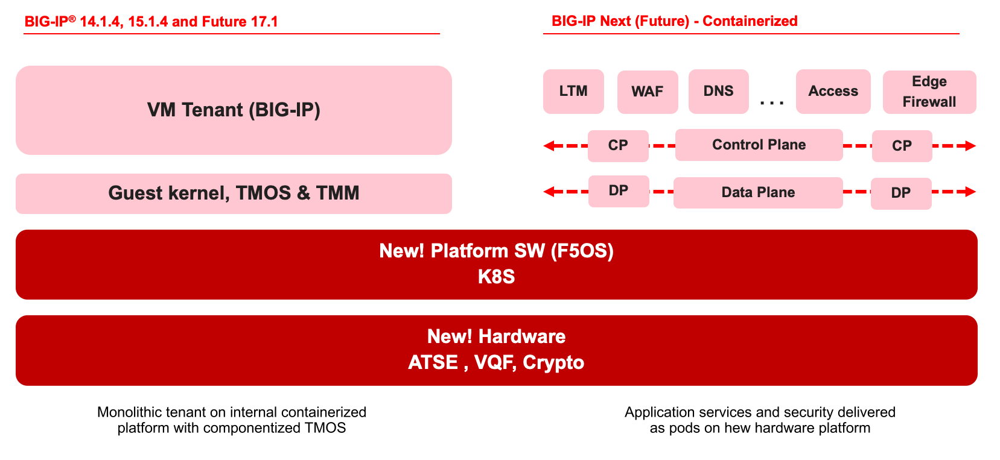
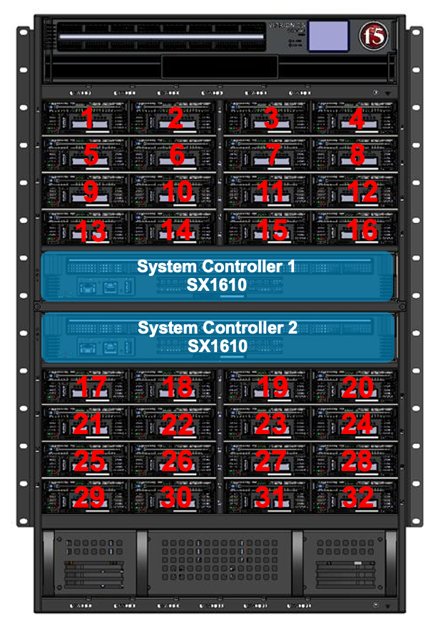
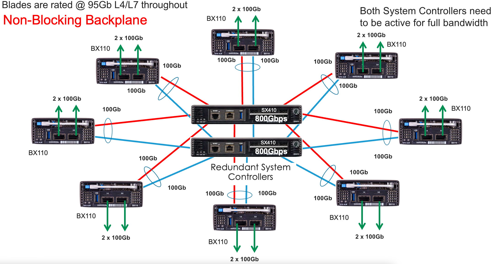
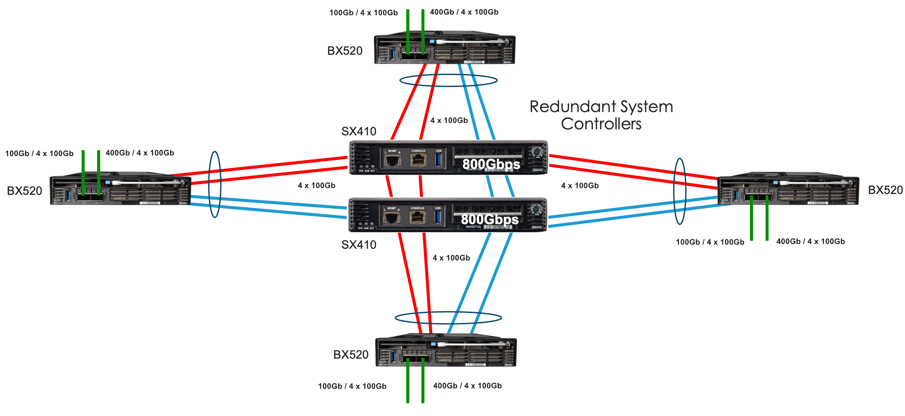
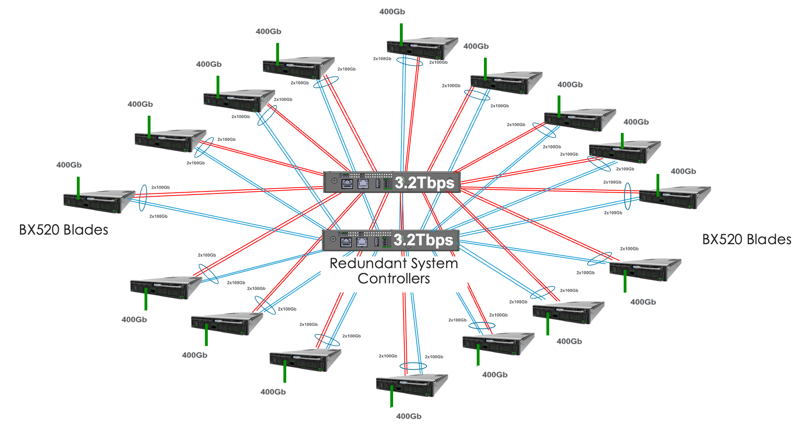
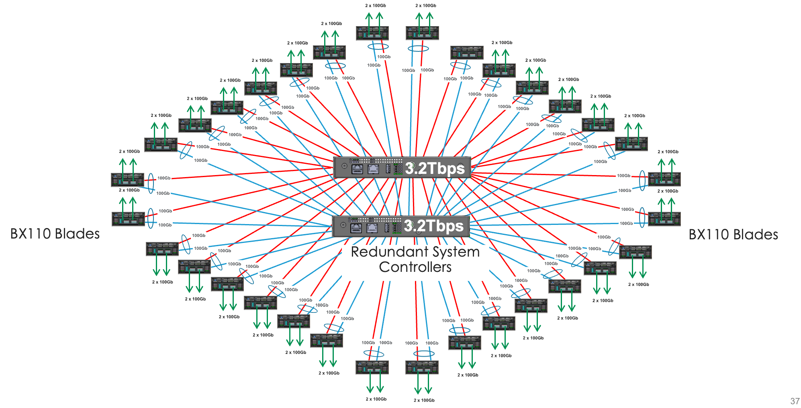
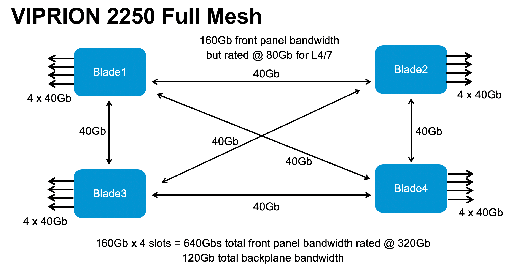
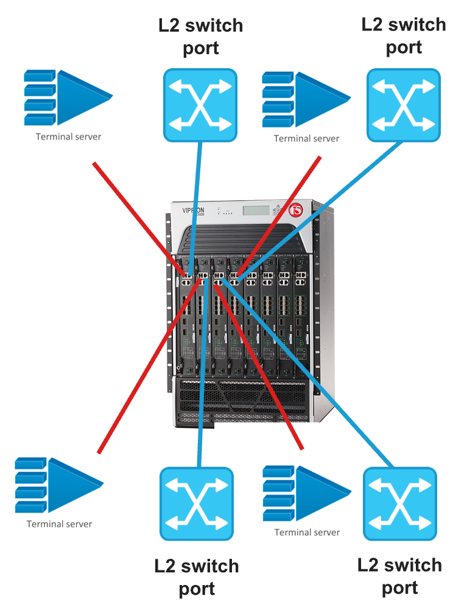
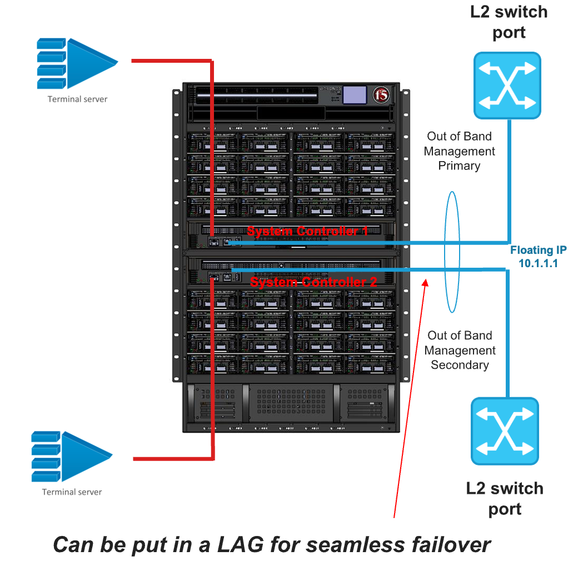

=============
Introduction
=============

VELOS is F5's next generation chassis-based solution that has replaced the current VIPRION platforms. Specifically, the new CX410 chassis is the direct replacement for the current VIPRION c2400/c2200 chassis families, and the CX1610 is a direct replacement for the VIPRION 4xxx family of chassis although there are cases where either chassis could replace the other. The VELOS platform has many advantages over the current VIPRION architecture. This guide will highlight the differences between the two architectures, and then provide details on how to configure, monitor, and troubleshoot the new platform. This will assist customers considering adoption of VELOS to understand how it will fit within their environment. 

VELOS Overview
===============

-------------------------------
Kubernetes Based Platform Layer
-------------------------------

The major difference between VELOS and VIPRION is the introduction of a new Kubernetes-based platform layer called F5OS that will allow for exciting new capabilities. Luckily customers won’t need to learn Kubernetes to manage the new chassis, it will be abstracted from the administrator who will be able to manage the new platform layer via familiar F5 CLI, webUI, or API interfaces. 

VELOS will continue to provide hardware acceleration and offload capabilities in a similar way that VIPRION did, however more modern FPGA, CPU, and crypto offload capabilities have been introduced. The new F5OS platform layer allows VELOS to run different types of tenants within the same chassis. As an example, VELOS will be able to run:

•	Existing TMOS/BIG-IP tenants (specific TMOS releases)
•	Next-generation BIG-IP software tenants (BIG-IP Next)
•	Possibility of running approved 3rd party tenants (future)

Customers will be able to migrate existing BIG-IP devices, or vCMP guests into a **tenant** running on VELOS. A tenant is conceptually like a vCMP guest on the VIPRION platform. Once inside the tenant, the management experience will be like the experience on existing BIG-IP platforms. The BIG-IP tenant will be managed just as a vCMP guest is managed today on VIPRION. The administrator can connect directly to the tenant’s webUI, CLI, or API and have the same experience as they have with their existing BIG-IP platforms. 

BIG-IP Next tenants will be able to be provisioned within the same chassis, which will allow customers to leverage the next generation of BIG-IP software side-by-side with the existing BIG-IP software. The F5OS platform layer provides a bridge between the current generation of BIG-IP and the newer generation BIG-IP Next. What will differ from an administrator’s perspective, is the initial setup of the F5OS platform layer. The new F5OS platform layer is leveraged in both VELOS chassis (F5OS-C), and rSeries appliances (F5OS-A). We’ll look at some additional architecture differences between VELOS and VIPRION, before exploring how to manage, and monitor the new F5OS platform layer. 

---------------------------------
Smaller Footprint, Higher Density
---------------------------------

The physical architecture of VELOS differs from the VIPRION platform in several ways. First, we’ve shrunk the size of the blades, and now support double the number of slots in the same 4RU chassis footprint as the VIPRION c2400 chassis. The VELOS CX410 chassis supports 8 slots instead of only 4 on the VIPRION C2400 chassis.

.. image:: images/velos_introduction/image2.png
  :align: center
  :scale: 70%

The CX1610 VELOS chassis supports 32 slots in a 16RU footprint vs. only 8 slots in the VIPRION C4800 chassis. 

.. note:: The CX1610 chassis and BX520 blade are generally available with F5OS-C 1.8.1

The second major difference compared to VIPRION, is the introduction of centralized/redundant SX410/SX1610 system controllers. The pictures above show the two redundant system controllers that are standard with the 4RU VELOS CX410 & the 16RU VELOS CX1610 chassis. Note, that the system controllers are specific to the chassis type they run in, and it is not possible to move them from one chassis type to another as they are physically different sizes.

For the CX410 chassis, the system controllers are responsible for providing non-blocking connections and layer 2 switching between the 8 slots within the system. The system controllers are star-wired with multiple connections to each slot. There are currently two different generations of line cards supported: the BX110 and BX520. Each BX110 blade has one 100Gb backplane connection to each system controller (200Gb total). The picture below shows the backplane interconnections of a fully populated 8 slot CX410 chassis with 8 BX110 blades installed. 

Each BX520 blade occupies 2 slots within the chassis and leverages 2 x 100Gb backplane interfaces within each slot for a total of 400Gb backplane connectivity. The picture below shows the backplane interconnections of a fully populated 8 slot CX410 chassis with 4 BX520 blades installed. 

.. note:: The CX1610 chassis and BX520 blade are targeted to be generally available with F5OS-C 1.8.1

For the CX1610 chassis, the system controllers are responsible for providing non-blocking connections and layer 2 switching between the 32 slots within the system. The system controllers are star-wired with multiple connections to each slot. There are currently two different generations of line cards (BX110 and BX520) and only the BX520 is supported in the CX1610 chassis at this time. Since each BX520 blade takes 2 slots, a maximum of 16 BX520 blades can be installed in the CX1610 chassis. Each BX520 blade occupies 2 slots within the chassis and leverages 2 x 100Gb backplane interfaces within each slot for a total of 400Gb backplane connectivity. The picture below shows the backplane interconnections of a fully populated 32 slot CX1610 chassis with 16 BX520 blades installed. 

It is technically possible that the BX110 blade could run inside the CX1610 chassis in the future if business demand is great enough, but there is no committed plan at this time. In this case, each BX110 blade would have one 100Gb backplane connection to each system controller (200Gb total). The picture below shows the backplane interconnections of a fully populated 32 slot CX1610 chassis and with 32 BX110 blades (currently unsupported) installed. 

.. note:: BX110 support in the CX1610 chassis is not supported. Mixing of blade types in the same CX410 chassis is not supported in F5OS-C 1.8.1, this is being considered for a future release.

 
While both system controllers are active, they provide a non-blocking 1.6Tbs backplane between the 8 slots on the CX410 chassis, and a non-blocking 6.4Tbs backplane between the 32 slots on the CX1610 chassis. Note that the BX110 line cards currently have a L4/L7 throughput rating of 95Gbs each, but that is not a limitation of the backplane. If one of the system controllers were to fail, traffic would immediately switch over to the remaining system controller and the backplane bandwidth would be cut in half to 800Gbps. This is still more bandwidth than the first generation of line cards (BX110) support. The BX520 line cards currently have a L4/L7 throughput rating of ~300/375Gbs each, but that is not a limitation of the backplane.   

The backplane for both the BX110 and BX520 ports are aggregated together using link aggregation during normal operation, and traffic will be distributed according to the hashing algorithm of the Link Aggregation Group (LAG), thus utilizing both controllers for forwarding between slots. Therefore, the system controllers operate in active/active manner under normal operation.

A VIPRION chassis in comparison does not have a centralized switch fabric, and all blades are connected across the passive backplane in a full mesh fashion. The backplane in VIPRION was blocking, meaning the front panel bandwidth of a blade was greater than the blades backplane connectivity. Below is an example of the VIPRION C2400 chassis with B2250 blades. Each blade had a single 40Gb connection to every other blade. The total backplane bandwidth is 6 x 40 Gb = 240 Gb.

The system controllers in VELOS are also the central point of management for the entire chassis. VIPRION required a dedicated out-of-band Ethernet management port and console connection for each blade inserted in the chassis. This meant more cabling, layer2 switch ports, and external terminal servers to fully manage the VIPRION chassis as seen below:

.. image:: images/velos_introduction/image5.png
  :align: center
  :scale: 50%

The VIPRION C4xxx chassis had a similar design that required a dedicated out-of-band Ethernet management port and console connection for each blade inserted in the chassis. Many customers expressed the desire to simplify this, as it required a lot of external cabling and devices. 

With VELOS, only the system controllers need to be cabled for out-of-band management, and console connections. This reduces the amount of cabling, layer2 switch ports, and external terminal servers required for full chassis management for the CX410 chassis as seen below. Additionally, the out-of-band Ethernet ports on the system controllers can be bundled together to form a Link Aggregation Group for added resiliency.

.. image:: images/velos_introduction/image6.png
  :align: center
  :scale: 50%

The VELOS CX1610 has a similar design where only the system controllers need to be cabled for out-of-band management, and console connections. This reduces the amount of cabling, layer2 switch ports, and external terminal servers required for full chassis management for the CX1610 chassis as seen below. Additionally, the out-of-band Ethernet ports on the system controllers can be bundled together to form a Link Aggregation Group for added resiliency.

----------------------------
The Kubernetes Control Plane
----------------------------

In addition to being the centralized layer2 switch fabric for the entire chassis, the system controllers also host the Kubernetes control plane that is responsible for provisioning resources/workloads within the chassis. VELOS utilizes an open-source distribution of Kubernetes called OpenShift, and specifically uses the OKD project/distribution. This is largely abstracted away from the administrator, as they won’t be configuring or monitoring containers or Kubernetes components. In cases where some Kubernetes features or monitoring needs to be exposed, it is abstracted and exposed through the new VELOS F5OS-C CLI, webUI, or API’s. 

A combination of Docker Compose and Kubernetes is used within the F5OS layer. Docker Compose is used to bring up the system controller and chassis partition software stacks, as they need to be fully functional early in the startup process. Then, Kubernetes takes over and is responsible for deploying workloads to the VELOS blades. One of the system controllers will be chosen to serve as primary, and the other secondary from a Kubernetes control plane perspective. The central VELOS chassis F5OS API, CLI, and webUI are served up from the primary system controller. The floating IP address will always follow the primary controller so CLI, webUI, and API access should not be prevented due to a controller failure.

.. image:: images/velos_introduction/image7.png
  :align: center
  :scale: 40%

The diagram above is somewhat simplified, as it shows a single software stack for the Kubernetes control plane. There are multiple instances that run on the system controllers. There is a software stack for the system controllers themselves which provides F5OS-C CLI, webUI, and API management for the controllers, as well as chassis partition (a grouping of blades) lifecycle management. There is also a unique stack for every chassis partition in the system. This software stack resides on the system controllers and can fail over from one controller to the other for added redundancy. It provides the F5OS CLI, webUI, and API functions for the chassis partition, as well as support for the networking services such as stpd, lldpd, lacpd, that get deployed as workloads on the blades.

The Kubernetes control plane is responsible for deploying workloads to the blades. This would happen when tenants or **chassis partitions** (see next section) are configured. We won’t get too deep into the Kubernetes architecture, as its not required to manage the VELOS chassis. Know that the Kubernetes platform layer will allow F5 to introduce exciting new features in the future, but F5 will continue to provide abstracted interfaces for ease of management. 

------------------
Chassis Partitions
------------------

Another exciting new feature is the notion of grouping multiple VELOS blades together to form “mini VIPRIONS” within the same VELOS chassis. This will allow for another layer of isolation, in addition to tenancy (like vCMP guests) that VIPRION didn’t support. This could be used to separate production from development/test environments, or to provide different security zones for different classes of applications. Within a VELOS chassis, an administrator can group together one or more blades to form a chassis partition. A chassis may contain multiple chassis partitions, and a blade may belong to only one chassis partition at a time. The minimum unit for a chassis partition is one blade, and the maximum is 8 BX110 blades within the CX410 chassis. For the BX520 blades the maximum chassis partition size is 4 blades in the CX410 chassis, and 16 blades in the CX1610 chassis (targeted to be generally available in F5OS-C 1.8.1). Currently, you cannot mix different blade types within the same chassis. In the future, only the CX410 chassis will support mixing both the BX110 and BX520 blades within the same chassis, this is not supported on the CX1610 chassis. When mixed blade support is added in the future on the CX410 chassis, you will not be able to mix different blade types within the same chassis partition, a chassis partition must only include blades of the same type. 
 
**Note: Chassis partitions are not related to TMOS admin partitions, which are typically used to provide admin separation within a TMOS instance.** 
 
A chassis partition runs its own unique F5OS-C software image, has a unique set of users/authentication, and is accessed via its own webUI, CLI, and API. The chassis partition can be further divided to support multiple BIG-IP tenants. A tenant operates in a similar manner to how vCMP guests operate within the VIPRION chassis. It is assigned dedicated vCPU and memory resources and is restricted to specific VLANs by the administrator for network connectivity. 

Below is an example of a VELOS CX410 chassis; divided into 3 chassis partitions (red, green, and blue). These chassis partitions are completely isolated from each other, and the system controllers ensure no traffic can bleed from one chassis partition to another. Once a chassis partition is created, individual tenants can be deployed, and they will be restricted to only the resources within that chassis partition. 

.. image:: images/velos_introduction/image8.png
  :align: center
  :scale: 40%

-------
Tenants
-------

Tenancy is required to deploy any BIG-IP resources. VELOS is a multitenant chassis by default, there is no bare-metal mode, although it can be configured to emulate this mode with a single large tenant. You can configure one big chassis partition and assign all blades in the system to this resource. In fact, there is a “Default” partition that all blades are part of when inserted. You may change the slots assigned to the chassis partition by removing it from default and assigning to a new or existing chassis partition. A tenant could then be assigned to utilize all CPU and memory across that chassis partition. This would emulate a VIPRION system running “bare metal” where vCMP is not provisioned. 

When configuring HA between two VELOS chassis, there is no HA relationship across chassis at the F5OS-C layer, where the system controllers or chassis partitions are configured. All HA is configured at the tenant level using Device Service Clustering, similar to how HA is configured between vCMP guests in separate VIPRION chassis. 

.. image:: images/velos_introduction/image9.png
  :align: center
  :scale: 60%

