================
Monitoring VELOS
================

With the introduction of a new platform layer, anyone deploying VELOS will need to know the important things for them to monitor to ensure proper health and performance of the system. In addition to getting F5’s recommendation on what to monitor, administrators will require details on how to get access to that information. 

Some admins may want CLI commands to monitor, or API calls to query the system, and others may prefer the webUI. Many customers also use SNMP to monitor and be alerted of system issues and events. For SNMP integrations F5 will provide specific SNMP OID’s that an admin can monitor, and what traps are available for altering. The following sections will outline what sort of monitoring and alerting is available with the new VELOS platform.

Accessing the F5OS API
======================

The VELOS platform APIs for the system controllers and chassis partitions can be reached on port 8888. In this document we will use the Postman tool to access VELOS platform layer APIs. You can download the Postman tool at:

https://www.postman.com/downloads/

You may also use Curl to get API status. The following curl command is pointed at the system controller floating IP address on port 8888. The example below is using basic authentication. You can request output in JSON by using the following Accept header:

.. code-block:: bash

    $ curl -k https://<System-Controller-IP>:8888/restconf/yang-library-version --header 'Accept: application/yang-data+json' -u admin:<password>

Or you can alter the Accept header to receive output in XML format:

.. code-block:: bash

    $ curl -k https://<System-Controller-IP>:8888/restconf/yang-library-version --header 'Accept: application/yang-data+xml' -u admin:<password>

The same format is used when pointing directly to the IP address of a Chassis Partition

.. code-block:: bash

    $ curl -k https://<Chassis-Partition-IP>:8888/restconf/yang-library-version --header 'Accept: application/yang-data+json' -u admin:<password>
 
Hardware and System Component Monitoring
========================================

-----------------------------------------------------
Hardware and System Component Monitoring from the CLI
-----------------------------------------------------

Show Components from the CLI
-----------------------------

High level appliance status can be obtained by using the **show components** command within the system controller layer, this will include all the subsystems:

.. code-block:: bash

    syscon-2-active# show components 
    components component blade-1
    state description "VELOS BX110"
    state serial-no bld424551s
    state part-no "400-0086-02 REV 2"
    state empty false
    state nebs capable true
    state nebs disabled
                                                                UPDATE  
    NAME                       NAME  VALUE          CONFIGURABLE  STATUS  
    ----------------------------------------------------------------------
    fw-version-bios            -     3.00.230.1     false         none    
    fw-version-bios-me         -     4.0.4.800      false         none    
    fw-version-cpld            -     05.04.00       false         none    
    fw-version-drive-nvme0n1   -     EDA7602Q       false         none    
    fw-version-lop-app         -     2.00.1100.0.1  false         none    
    fw-version-lop-bootloader  -     1.02.868.0.1   false         none    
    fw-version-sirr            -     1.1.99         false         none    

    components component blade-2
    state description "VELOS BX110"
    state serial-no bld422435s
    state part-no "400-0086-02 REV 2"
    state empty false
    state nebs capable true
    state nebs disabled
                                                                UPDATE  
    NAME                       NAME  VALUE          CONFIGURABLE  STATUS  
    ----------------------------------------------------------------------
    fw-version-bios            -     3.00.230.1     false         none    
    fw-version-bios-me         -     4.0.4.800      false         none    
    fw-version-cpld            -     05.04.00       false         none    
    fw-version-drive-nvme0n1   -     EDA7602Q       false         none    
    fw-version-lop-app         -     2.00.1100.0.1  false         none    
    fw-version-lop-bootloader  -     1.02.868.0.1   false         none    
    fw-version-sirr            -     1.1.99         false         none    

    components component blade-3
    state description "VELOS BX110"
    state serial-no bld422573s
    state part-no "400-0086-02 REV 2"
    state empty false
    state nebs capable true
    state nebs disabled
                                                                UPDATE  
    NAME                       NAME  VALUE          CONFIGURABLE  STATUS  
    ----------------------------------------------------------------------
    fw-version-bios            -     3.00.230.1     false         none    
    fw-version-bios-me         -     4.0.4.800      false         none    
    fw-version-cpld            -     05.04.00       false         none    
    fw-version-drive-nvme0n1   -     EDA7602Q       false         none    
    fw-version-lop-app         -     2.00.1100.0.1  false         none    
    fw-version-lop-bootloader  -     1.02.868.0.1   false         none    
    fw-version-sirr            -     1.1.99         false         none    

    components component blade-4
    state serial-no "Not Available"
    state part-no "Not Available"
    state empty true
    components component blade-5
    state serial-no "Not Available"
    state part-no "Not Available"
    state empty true
    components component blade-6
    state serial-no "Not Available"
    state part-no "Not Available"
    state empty true
    components component blade-7
    state serial-no "Not Available"
    state part-no "Not Available"
    state empty true
    components component blade-8
    state serial-no "Not Available"
    state part-no "Not Available"
    state empty true
    components component chassis
    psu state redundancy-mode no-redundancy
    psu state severity warning
    state description "VELOS CX410"
    state serial-no chs600032s
    state part-no "400-0087-02 REV 6"
    state empty false
    state nebs capable false
    state nebs disabled
    components component controller-1
    state description    "VELOS SX410"
    state serial-no      bld422584s
    state part-no        "SUB-0881-00 REV B"
    state empty          false
    state tpm-integrity-status Valid
    state nebs capable true
    state nebs disabled
    state memory total    33397862400
    state memory available 25323266048
    state memory free     350519296
    state memory used-percent 24
    state memory platform-total 33397862400
    state memory platform-used 13531021312
    state memory platform-used-percent 40
    state temperature current 26.1
    state temperature average 26.0
    state temperature minimum 25.4
    state temperature maximum 26.8
                                                                                        USED     
    AREA               CATEGORY               TOTAL         FREE          USED          PERCENT  
    ---------------------------------------------------------------------------------------------
    platform/sysroot   F5OS System            353835896832  233888256000  101946527744  30       
    platform/images    F5OS Images            270494859264  182400954368  74326732800   28       
    partition2/config  F5OS System            10726932480   10488057856   238874624     2        
    partition2/images  F5OS Partition Images  16095641600   12324638720   3771002880    23       
    partition2/shared  F5OS Partition         10726932480   10682204160   44728320      0        
    partition3/config  F5OS System            10726932480   10492542976   234389504     2        
    partition3/images  F5OS Partition Images  16095641600   12324638720   3771002880    23       
    partition3/shared  F5OS Partition         10726932480   10682204160   44728320      0        

    DISK DATA  DISK DATA     
    NAME       VALUE         
    -------------------------
    available  233888489472  
    capacity   353835896832  
    used       101946294272  

                                                                        UPDATE  
    NAME                                NAME  VALUE          CONFIGURABLE  STATUS  
    -------------------------------------------------------------------------------
    fw-version-bios                     -     2.03.175.1     -             none    
    fw-version-bios-me                  -     4.0.4.705      -             none    
    fw-version-cpld                     -     01.03.0A       -             none    
    fw-version-drive                    -     EDA7602Q       -             none    
    fw-version-lcd-app                  -     3.00.144.00.1  -             none    
    fw-version-lcd-bootloader           -     2.01.109.00.1  -             none    
    fw-version-lop-app                  -     2.01.1283.0.1  -             none    
    fw-version-lop-bootloader           -     1.02.1019.0.1  -             none    
    fw-version-sirr                     -     1.1.99         -             none    
    fw-version-vfc-app-fanCtrl1         -     2.00.1008.0.1  -             none    
    fw-version-vfc-bootloader-fanCtrl1  -     1.02.798.0.1   -             none    
    fw-version-vpc-app-psuCtrl1         -     2.00.875.0.1   -             none    
    fw-version-vpc-app-psuCtrl2         -     2.00.875.0.1   -             none    
    fw-version-vpc-bootloader-psuCtrl1  -     1.02.669.0.1   -             none    
    fw-version-vpc-bootloader-psuCtrl2  -     1.02.669.0.1   -             none    

    storage state disks disk nvme0n1
    state model "SAMSUNG MZ1LB960HAJQ-00007"
    state vendor Samsung
    state version EDA7602Q
    state serial-no S435NE0MA00234
    state size 683.00GB
    state type nvme
    state disk-io total-iops 0
    state disk-io read-iops 1568593
    state disk-io read-merged 676230
    state disk-io read-bytes 16736022528
    state disk-io read-latency-ms 556414
    state disk-io write-iops 647798528
    state disk-io write-merged 493710808
    state disk-io write-bytes 5791047771136
    state disk-io write-latency-ms 24729715
    state disk-io read-iops-per-sec 0
    state disk-io read-bytes-per-sec 0
    state disk-io write-iops-per-sec 607
    state disk-io write-bytes-per-sec 5971174
    cpu state cpu-utilization thread cpu
    cpu state cpu-utilization current 30
    cpu state cpu-utilization five-second-avg 29
    cpu state cpu-utilization one-minute-avg 26
    cpu state cpu-utilization five-minute-avg 27
    CPU               CORE                           THREAD                                         
    INDEX  CACHESIZE  CNT   FREQ           STEPPING  CNT     MODELNAME                              
    ------------------------------------------------------------------------------------------------
    1      2048(KB)   8     2200.000(MHz)  1         8       Intel(R) Atom(TM) CPU C3758 @ 2.20GHz  

                            FIVE    ONE     FIVE    
    THREAD                   SECOND  MINUTE  MINUTE  
    INDEX   THREAD  CURRENT  AVG     AVG     AVG     
    -------------------------------------------------
    0       cpu0    25       28      26      26      
    1       cpu1    29       22      27      28      
    2       cpu2    23       21      25      28      
    3       cpu3    36       30      25      25      
    4       cpu4    24       31      27      26      
    5       cpu5    25       31      23      27      
    6       cpu6    25       25      25      25      
    7       cpu7    54       39      28      26      

    components component controller-2
    state description    "VELOS SX410"
    state serial-no      bld424548s
    state part-no        "SUB-0881-00 REV B"
    state empty          false
    state tpm-integrity-status Valid
    state nebs capable true
    state nebs disabled
    state memory total    33397866496
    state memory available 24884887552
    state memory free     617697280
    state memory used-percent 25
    state memory platform-total 33397866496
    state memory platform-used 12755918848
    state memory platform-used-percent 38
    state temperature current 26.3
    state temperature average 26.3
    state temperature minimum 25.8
    state temperature maximum 27.1
                                                                                            USED     
    AREA                      CATEGORY               TOTAL         FREE          USED          PERCENT  
    ----------------------------------------------------------------------------------------------------
    platform/sysroot          F5OS System            353835896832  232491298816  103343484928  30       
    platform/images           F5OS Images            270494859264  173605605376  83122081792   32       
    /var/roothome/etcd3mount  F5OS System            5196181504    4515459072    395522048     8        
    partition2/config         F5OS System            10726932480   10516099072   210833408     1        
    partition2/images         F5OS Partition Images  16095641600   12324638720   3771002880    23       
    partition2/shared         F5OS Partition         10726932480   10682204160   44728320      0        
    partition3/config         F5OS System            10726932480   10523664384   203268096     1        
    partition3/images         F5OS Partition Images  16095641600   12324638720   3771002880    23       
    partition3/shared         F5OS Partition         10726932480   10682204160   44728320      0        

    DISK DATA  DISK DATA     
    NAME       VALUE         
    -------------------------
    available  232491298816  
    capacity   353835896832  
    used       103343484928  

                                                                        UPDATE  
    NAME                                NAME  VALUE          CONFIGURABLE  STATUS  
    -------------------------------------------------------------------------------
    fw-version-bios                     -     2.03.175.1     -             none    
    fw-version-bios-me                  -     4.0.4.705      -             none    
    fw-version-cpld                     -     01.03.0A       -             none    
    fw-version-drive                    -     EDA7602Q       -             none    
    fw-version-lcd-app                  -     3.00.144.00.1  -             none    
    fw-version-lcd-bootloader           -     2.01.109.00.1  -             none    
    fw-version-lop-app                  -     2.01.1283.0.1  -             none    
    fw-version-lop-bootloader           -     1.02.1019.0.1  -             none    
    fw-version-sirr                     -     1.1.99         -             none    
    fw-version-vfc-app-fanCtrl1         -     2.00.1008.0.1  -             none    
    fw-version-vfc-bootloader-fanCtrl1  -     1.02.798.0.1   -             none    
    fw-version-vpc-app-psuCtrl1         -     2.00.875.0.1   -             none    
    fw-version-vpc-app-psuCtrl2         -     2.00.875.0.1   -             none    
    fw-version-vpc-bootloader-psuCtrl1  -     1.02.669.0.1   -             none    
    fw-version-vpc-bootloader-psuCtrl2  -     1.02.669.0.1   -             none    

    storage state disks disk nvme0n1
    state model "SAMSUNG MZ1LB960HAJQ-00007"
    state vendor Samsung
    state version EDA7602Q
    state serial-no S435NE0MA00209
    state size 683.00GB
    state type nvme
    state disk-io total-iops 0
    state disk-io read-iops 1701730
    state disk-io read-merged 1138403
    state disk-io read-bytes 22318736384
    state disk-io read-latency-ms 469065
    state disk-io write-iops 813156586
    state disk-io write-merged 610730877
    state disk-io write-bytes 7674623405568
    state disk-io write-latency-ms 33913847
    state disk-io read-iops-per-sec 0
    state disk-io read-bytes-per-sec 819
    state disk-io write-iops-per-sec 298
    state disk-io write-bytes-per-sec 2761801
    cpu state cpu-utilization thread cpu
    cpu state cpu-utilization current 44
    cpu state cpu-utilization five-second-avg 33
    cpu state cpu-utilization one-minute-avg 41
    cpu state cpu-utilization five-minute-avg 42
    CPU               CORE                           THREAD                                         
    INDEX  CACHESIZE  CNT   FREQ           STEPPING  CNT     MODELNAME                              
    ------------------------------------------------------------------------------------------------
    1      2048(KB)   8     2200.000(MHz)  1         8       Intel(R) Atom(TM) CPU C3758 @ 2.20GHz  

                            FIVE    ONE     FIVE    
    THREAD                   SECOND  MINUTE  MINUTE  
    INDEX   THREAD  CURRENT  AVG     AVG     AVG     
    -------------------------------------------------
    0       cpu0    43       27      39      42      
    1       cpu1    67       35      41      42      
    2       cpu2    39       29      41      42      
    3       cpu3    54       38      43      42      
    4       cpu4    32       33      41      42      
    5       cpu5    37       40      43      43      
    6       cpu6    39       34      42      41      
    7       cpu7    37       32      40      42      

    components component fantray-1
    state firmware-version 1.02.798.0.1
    state software-version 2.00.1008.0.1
    state serial-no  sub0772g006w
    state part-no    "SUB-0772-05 REV B"
    state empty      false
    properties fantray-state fantray-temperature 33.0
    properties fantray-state inlet-fan-1-speed 6773
    properties fantray-state inlet-fan-2-speed 6737
    properties fantray-state inlet-fan-3-speed 6723
    properties fantray-state exhaust-fan-1-speed 6732
    properties fantray-state exhaust-fan-2-speed 6721
    properties fantray-state exhaust-fan-3-speed 6795
    components component lcd
    state serial-no sub0811g002h
    state part-no "SUB-0811-02 REV B"
    state empty false
    state mode secure
    components component psu-1
    state serial-no 19331BPJ0075
    state part-no PWR-0366-00
    state empty false
    properties psu-state psu-current-in 3.117
    properties psu-state psu-current-out 48.687
    properties psu-state psu-power-in 631.0
    properties psu-state psu-power-out 600.0
    properties psu-state psu-voltage-in 204.0
    properties psu-state psu-voltage-out 12.325
    properties psu-state psu-temperature-1 24.2
    properties psu-state psu-temperature-2 39.5
    properties psu-state psu-temperature-3 36.5
    properties psu-state psu-fan-1-speed 7456
    properties psu-state psu-fan-2-speed 7008
    components component psu-2
    state serial-no 19332BPJ0129
    state part-no PWR-0366-00
    state empty false
    properties psu-state psu-current-in 3.226
    properties psu-state psu-current-out 50.5
    properties psu-state psu-power-in 651.0
    properties psu-state psu-power-out 622.0
    properties psu-state psu-voltage-in 204.0
    properties psu-state psu-voltage-out 12.3219
    properties psu-state psu-temperature-1 24.0
    properties psu-state psu-temperature-2 39.7
    properties psu-state psu-temperature-3 35.5
    properties psu-state psu-fan-1-speed 7360
    properties psu-state psu-fan-2-speed 7008
    components component psu-3
    state serial-no "Not Available"
    state part-no "Not Available"
    state empty true
    components component psu-4
    state serial-no "Not Available"
    state part-no "Not Available"
    state empty true
    components component psu-controller-1
    state firmware-version 1.02.669.0.1
    state software-version 2.00.875.0.1
    state serial-no  sub0759g003u
    state part-no    "SUB-0759-04 REV A"
    state empty      false
    components component psu-controller-2
    state firmware-version 1.02.669.0.1
    state software-version 2.00.875.0.1
    state serial-no  sub0759g003z
    state part-no    "SUB-0759-04 REV A"
    state empty      false
    syscon-2-active# 

Show Component State Only from the CLI
--------------------------------------

If you just want the state and not all the details you can run the command **show components component state**:

.. code-block:: bash

    syscon-2-active# show components component state
    components component blade-1
    state description "VELOS BX110"
    state serial-no bld424551s
    state part-no "400-0086-02 REV 2"
    state empty false
    state nebs capable true
    state nebs disabled
    components component blade-2
    state description "VELOS BX110"
    state serial-no bld422435s
    state part-no "400-0086-02 REV 2"
    state empty false
    state nebs capable true
    state nebs disabled
    components component blade-3
    state description "VELOS BX110"
    state serial-no bld422573s
    state part-no "400-0086-02 REV 2"
    state empty false
    state nebs capable true
    state nebs disabled
    components component blade-4
    state serial-no "Not Available"
    state part-no "Not Available"
    state empty true
    components component blade-5
    state serial-no "Not Available"
    state part-no "Not Available"
    state empty true
    components component blade-6
    state serial-no "Not Available"
    state part-no "Not Available"
    state empty true
    components component blade-7
    state serial-no "Not Available"
    state part-no "Not Available"
    state empty true
    components component blade-8
    state serial-no "Not Available"
    state part-no "Not Available"
    state empty true
    components component chassis
    state description "VELOS CX410"
    state serial-no chs600032s
    state part-no "400-0087-02 REV 6"
    state empty false
    state nebs capable false
    state nebs disabled
    components component controller-1
    state description    "VELOS SX410"
    state serial-no      bld422584s
    state part-no        "SUB-0881-00 REV B"
    state empty          false
    state tpm-integrity-status Valid
    state nebs capable true
    state nebs disabled
    state memory total    33397862400
    state memory available 25295560704
    state memory free     319311872
    state memory used-percent 24
    state memory platform-total 33397862400
    state memory platform-used 13559164928
    state memory platform-used-percent 40
    state temperature current 26.2
    state temperature average 26.0
    state temperature minimum 25.4
    state temperature maximum 26.8
                                                                                        USED     
    AREA               CATEGORY               TOTAL         FREE          USED          PERCENT  
    ---------------------------------------------------------------------------------------------
    platform/sysroot   F5OS System            353835896832  233887080448  101947703296  30       
    platform/images    F5OS Images            270494859264  182400954368  74326732800   28       
    partition2/config  F5OS System            10726932480   10487996416   238936064     2        
    partition2/images  F5OS Partition Images  16095641600   12324638720   3771002880    23       
    partition2/shared  F5OS Partition         10726932480   10682204160   44728320      0        
    partition3/config  F5OS System            10726932480   10492538880   234393600     2        
    partition3/images  F5OS Partition Images  16095641600   12324638720   3771002880    23       
    partition3/shared  F5OS Partition         10726932480   10682204160   44728320      0        

    DISK DATA  DISK DATA     
    NAME       VALUE         
    -------------------------
    available  233887293440  
    capacity   353835896832  
    used       101947490304  

    components component controller-2
    state description    "VELOS SX410"
    state serial-no      bld424548s
    state part-no        "SUB-0881-00 REV B"
    state empty          false
    state tpm-integrity-status Valid
    state nebs capable true
    state nebs disabled
    state memory total    33397866496
    state memory available 24858370048
    state memory free     582602752
    state memory used-percent 25
    state memory platform-total 33397866496
    state memory platform-used 12782718976
    state memory platform-used-percent 38
    state temperature current 26.3
    state temperature average 26.3
    state temperature minimum 25.8
    state temperature maximum 27.0
                                                                                            USED     
    AREA                      CATEGORY               TOTAL         FREE          USED          PERCENT  
    ----------------------------------------------------------------------------------------------------
    platform/sysroot          F5OS System            353835896832  232488927232  103345856512  30       
    platform/images           F5OS Images            270494859264  173605605376  83122081792   32       
    /var/roothome/etcd3mount  F5OS System            5196181504    4515459072    395522048     8        
    partition2/config         F5OS System            10726932480   10516013056   210919424     1        
    partition2/images         F5OS Partition Images  16095641600   12324638720   3771002880    23       
    partition2/shared         F5OS Partition         10726932480   10682204160   44728320      0        
    partition3/config         F5OS System            10726932480   10523660288   203272192     1        
    partition3/images         F5OS Partition Images  16095641600   12324638720   3771002880    23       
    partition3/shared         F5OS Partition         10726932480   10682204160   44728320      0        

    DISK DATA  DISK DATA     
    NAME       VALUE         
    -------------------------
    available  232488927232  
    capacity   353835896832  
    used       103345856512  

    components component fantray-1
    state firmware-version 1.02.798.0.1
    state software-version 2.00.1008.0.1
    state serial-no  sub0772g006w
    state part-no    "SUB-0772-05 REV B"
    state empty      false
    components component lcd
    state serial-no sub0811g002h
    state part-no "SUB-0811-02 REV B"
    state empty false
    state mode secure
    components component psu-1
    state serial-no 19331BPJ0075
    state part-no PWR-0366-00
    state empty false
    components component psu-2
    state serial-no 19332BPJ0129
    state part-no PWR-0366-00
    state empty false
    components component psu-3
    state serial-no "Not Available"
    state part-no "Not Available"
    state empty true
    components component psu-4
    state serial-no "Not Available"
    state part-no "Not Available"
    state empty true
    components component psu-controller-1
    state firmware-version 1.02.669.0.1
    state software-version 2.00.875.0.1
    state serial-no  sub0759g003u
    state part-no    "SUB-0759-04 REV A"
    state empty      false
    components component psu-controller-2
    state firmware-version 1.02.669.0.1
    state software-version 2.00.875.0.1
    state serial-no  sub0759g003z
    state part-no    "SUB-0759-04 REV A"
    state empty      false
    syscon-2-active#

Show Component Properties from the CLI
----------------------------------------

This command shows the firmware version of the various subsystems, along with the fan tray and power supply info:

.. code-block:: bash

    syscon-2-active# show components component properties 
                                                                UPDATE  
    NAME                       NAME  VALUE          CONFIGURABLE  STATUS  
    ----------------------------------------------------------------------
    fw-version-bios            -     3.00.230.1     false         none    
    fw-version-bios-me         -     4.0.4.800      false         none    
    fw-version-cpld            -     05.04.00       false         none    
    fw-version-drive-nvme0n1   -     EDA7602Q       false         none    
    fw-version-lop-app         -     2.00.1100.0.1  false         none    
    fw-version-lop-bootloader  -     1.02.868.0.1   false         none    
    fw-version-sirr            -     1.1.99         false         none    

                                                                UPDATE  
    NAME                       NAME  VALUE          CONFIGURABLE  STATUS  
    ----------------------------------------------------------------------
    fw-version-bios            -     3.00.230.1     false         none    
    fw-version-bios-me         -     4.0.4.800      false         none    
    fw-version-cpld            -     05.04.00       false         none    
    fw-version-drive-nvme0n1   -     EDA7602Q       false         none    
    fw-version-lop-app         -     2.00.1100.0.1  false         none    
    fw-version-lop-bootloader  -     1.02.868.0.1   false         none    
    fw-version-sirr            -     1.1.99         false         none    

                                                                UPDATE  
    NAME                       NAME  VALUE          CONFIGURABLE  STATUS  
    ----------------------------------------------------------------------
    fw-version-bios            -     3.00.230.1     false         none    
    fw-version-bios-me         -     4.0.4.800      false         none    
    fw-version-cpld            -     05.04.00       false         none    
    fw-version-drive-nvme0n1   -     EDA7602Q       false         none    
    fw-version-lop-app         -     2.00.1100.0.1  false         none    
    fw-version-lop-bootloader  -     1.02.868.0.1   false         none    
    fw-version-sirr            -     1.1.99         false         none    

                                                                        UPDATE  
    NAME                                NAME  VALUE          CONFIGURABLE  STATUS  
    -------------------------------------------------------------------------------
    fw-version-bios                     -     2.03.175.1     -             none    
    fw-version-bios-me                  -     4.0.4.705      -             none    
    fw-version-cpld                     -     01.03.0A       -             none    
    fw-version-drive                    -     EDA7602Q       -             none    
    fw-version-lcd-app                  -     3.00.144.00.1  -             none    
    fw-version-lcd-bootloader           -     2.01.109.00.1  -             none    
    fw-version-lop-app                  -     2.01.1283.0.1  -             none    
    fw-version-lop-bootloader           -     1.02.1019.0.1  -             none    
    fw-version-sirr                     -     1.1.99         -             none    
    fw-version-vfc-app-fanCtrl1         -     2.00.1008.0.1  -             none    
    fw-version-vfc-bootloader-fanCtrl1  -     1.02.798.0.1   -             none    
    fw-version-vpc-app-psuCtrl1         -     2.00.875.0.1   -             none    
    fw-version-vpc-app-psuCtrl2         -     2.00.875.0.1   -             none    
    fw-version-vpc-bootloader-psuCtrl1  -     1.02.669.0.1   -             none    
    fw-version-vpc-bootloader-psuCtrl2  -     1.02.669.0.1   -             none    

                                                                        UPDATE  
    NAME                                NAME  VALUE          CONFIGURABLE  STATUS  
    -------------------------------------------------------------------------------
    fw-version-bios                     -     2.03.175.1     -             none    
    fw-version-bios-me                  -     4.0.4.705      -             none    
    fw-version-cpld                     -     01.03.0A       -             none    
    fw-version-drive                    -     EDA7602Q       -             none    
    fw-version-lcd-app                  -     3.00.144.00.1  -             none    
    fw-version-lcd-bootloader           -     2.01.109.00.1  -             none    
    fw-version-lop-app                  -     2.01.1283.0.1  -             none    
    fw-version-lop-bootloader           -     1.02.1019.0.1  -             none    
    fw-version-sirr                     -     1.1.99         -             none    
    fw-version-vfc-app-fanCtrl1         -     2.00.1008.0.1  -             none    
    fw-version-vfc-bootloader-fanCtrl1  -     1.02.798.0.1   -             none    
    fw-version-vpc-app-psuCtrl1         -     2.00.875.0.1   -             none    
    fw-version-vpc-app-psuCtrl2         -     2.00.875.0.1   -             none    
    fw-version-vpc-bootloader-psuCtrl1  -     1.02.669.0.1   -             none    
    fw-version-vpc-bootloader-psuCtrl2  -     1.02.669.0.1   -             none    

    components component fantray-1
    properties fantray-state fantray-temperature 33.0
    properties fantray-state inlet-fan-1-speed 6773
    properties fantray-state inlet-fan-2-speed 6746
    properties fantray-state inlet-fan-3-speed 6718
    properties fantray-state exhaust-fan-1-speed 6730
    properties fantray-state exhaust-fan-2-speed 6758
    properties fantray-state exhaust-fan-3-speed 6785
    components component psu-1
    properties psu-state psu-current-in 3.152
    properties psu-state psu-current-out 49.125
    properties psu-state psu-power-in 645.0
    properties psu-state psu-power-out 605.0
    properties psu-state psu-voltage-in 204.0
    properties psu-state psu-voltage-out 12.324
    properties psu-state psu-temperature-1 24.0
    properties psu-state psu-temperature-2 39.5
    properties psu-state psu-temperature-3 36.2
    properties psu-state psu-fan-1-speed 7488
    properties psu-state psu-fan-2-speed 6912
    components component psu-2
    properties psu-state psu-current-in 3.238
    properties psu-state psu-current-out 51.0
    properties psu-state psu-power-in 658.0
    properties psu-state psu-power-out 628.0
    properties psu-state psu-voltage-in 204.25
    properties psu-state psu-voltage-out 12.321
    properties psu-state psu-temperature-1 24.0
    properties psu-state psu-temperature-2 39.7
    properties psu-state psu-temperature-3 35.5
    properties psu-state psu-fan-1-speed 7392
    properties psu-state psu-fan-2-speed 6976
    syscon-2-active#

Show Power Supply Status from the CLI
--------------------------------------

Or you can view individual subsystems. High level power supply status can be obtained by using the **show components component <psu-#>** command:

.. code-block:: bash

    syscon-2-active#  show components component psu-1
    components component psu-1
    state serial-no 19331BPJ0075
    state part-no PWR-0366-00
    state empty false
    properties psu-state psu-current-in 3.14
    properties psu-state psu-current-out 49.125
    properties psu-state psu-power-in 643.0
    properties psu-state psu-power-out 605.0
    properties psu-state psu-voltage-in 204.0
    properties psu-state psu-voltage-out 12.324
    properties psu-state psu-temperature-1 24.2
    properties psu-state psu-temperature-2 39.5
    properties psu-state psu-temperature-3 36.5
    properties psu-state psu-fan-1-speed 7488
    properties psu-state psu-fan-2-speed 6944
    syscon-2-active#

You could also use an asterisk to display all psu's and psu controllers. Use the command **show components component psu-***.

.. code-block:: bash

    syscon-2-active# show components component psu-*     
    components component psu-1
    state serial-no 19331BPJ0075
    state part-no PWR-0366-00
    state empty false
    properties psu-state psu-current-in 3.125
    properties psu-state psu-current-out 48.937
    properties psu-state psu-power-in 635.0
    properties psu-state psu-power-out 604.0
    properties psu-state psu-voltage-in 204.0
    properties psu-state psu-voltage-out 12.325
    properties psu-state psu-temperature-1 24.5
    properties psu-state psu-temperature-2 39.5
    properties psu-state psu-temperature-3 36.5
    properties psu-state psu-fan-1-speed 7520
    properties psu-state psu-fan-2-speed 6976
    components component psu-2
    state serial-no 19332BPJ0129
    state part-no PWR-0366-00
    state empty false
    properties psu-state psu-current-in 3.234
    properties psu-state psu-current-out 50.75
    properties psu-state psu-power-in 673.0
    properties psu-state psu-power-out 625.0
    properties psu-state psu-voltage-in 204.25
    properties psu-state psu-voltage-out 12.321
    properties psu-state psu-temperature-1 24.2
    properties psu-state psu-temperature-2 39.7
    properties psu-state psu-temperature-3 35.5
    properties psu-state psu-fan-1-speed 7392
    properties psu-state psu-fan-2-speed 6944
    components component psu-3
    state serial-no "Not Available"
    state part-no "Not Available"
    state empty true
    components component psu-4
    state serial-no "Not Available"
    state part-no "Not Available"
    state empty true
    components component psu-controller-1
    state firmware-version 1.02.669.0.1
    state software-version 2.00.875.0.1
    state serial-no  sub0759g003u
    state part-no    "SUB-0759-04 REV A"
    state empty      false
    components component psu-controller-2
    state firmware-version 1.02.669.0.1
    state software-version 2.00.875.0.1
    state serial-no  sub0759g003z
    state part-no    "SUB-0759-04 REV A"
    state empty      false
    syscon-2-active# 

High level power supply stats can be obtained by using the **show components component psu-* properties** command:

.. code-block:: bash

    syscon-2-active# show components component psu-* properties 
    components component psu-1
    properties psu-state psu-current-in 3.097
    properties psu-state psu-current-out 48.5
    properties psu-state psu-power-in 635.0
    properties psu-state psu-power-out 598.0
    properties psu-state psu-voltage-in 203.75
    properties psu-state psu-voltage-out 12.325
    properties psu-state psu-temperature-1 24.2
    properties psu-state psu-temperature-2 39.5
    properties psu-state psu-temperature-3 36.5
    properties psu-state psu-fan-1-speed 7392
    properties psu-state psu-fan-2-speed 6944
    components component psu-2
    properties psu-state psu-current-in 3.253
    properties psu-state psu-current-out 50.5
    properties psu-state psu-power-in 657.0
    properties psu-state psu-power-out 622.0
    properties psu-state psu-voltage-in 204.25
    properties psu-state psu-voltage-out 12.321
    properties psu-state psu-temperature-1 23.7
    properties psu-state psu-temperature-2 39.7
    properties psu-state psu-temperature-3 35.5
    properties psu-state psu-fan-1-speed 7392
    properties psu-state psu-fan-2-speed 7008
    syscon-2-active#

Show LCD Status from the CLI
--------------------------------------

High level chassis LCD status can be obtained by using the **show components component lcd** command:

.. code-block:: bash

    syscon-2-active# show components component lcd
    components component lcd
    state serial-no sub0811g002h
    state part-no "SUB-0811-02 REV B"
    state empty false
    state mode secure
    syscon-2-active#

Show CPU Status from the CLI
--------------------------------------

You can view stats on the system controller CPU and basic utilization with the command **show components component cpu**:

.. code-block:: bash

    syscon-2-active# show components component cpu
    components component controller-1
    cpu state cpu-utilization thread cpu
    cpu state cpu-utilization current 18
    cpu state cpu-utilization five-second-avg 22
    cpu state cpu-utilization one-minute-avg 29
    cpu state cpu-utilization five-minute-avg 27
    CPU               CORE                           THREAD                                         
    INDEX  CACHESIZE  CNT   FREQ           STEPPING  CNT     MODELNAME                              
    ------------------------------------------------------------------------------------------------
    1      2048(KB)   8     2200.000(MHz)  1         8       Intel(R) Atom(TM) CPU C3758 @ 2.20GHz  

                            FIVE    ONE     FIVE    
    THREAD                   SECOND  MINUTE  MINUTE  
    INDEX   THREAD  CURRENT  AVG     AVG     AVG     
    -------------------------------------------------
    0       cpu0    19       22      28      27      
    1       cpu1    13       20      31      27      
    2       cpu2    11       18      28      27      
    3       cpu3    15       27      29      26      
    4       cpu4    16       25      28      26      
    5       cpu5    15       23      29      27      
    6       cpu6    13       19      28      26      
    7       cpu7    39       25      30      26      

    components component controller-2
    cpu state cpu-utilization thread cpu
    cpu state cpu-utilization current 44
    cpu state cpu-utilization five-second-avg 47
    cpu state cpu-utilization one-minute-avg 42
    cpu state cpu-utilization five-minute-avg 42
    CPU               CORE                           THREAD                                         
    INDEX  CACHESIZE  CNT   FREQ           STEPPING  CNT     MODELNAME                              
    ------------------------------------------------------------------------------------------------
    1      2048(KB)   8     2200.000(MHz)  1         8       Intel(R) Atom(TM) CPU C3758 @ 2.20GHz  

                            FIVE    ONE     FIVE    
    THREAD                   SECOND  MINUTE  MINUTE  
    INDEX   THREAD  CURRENT  AVG     AVG     AVG     
    -------------------------------------------------
    0       cpu0    33       44      45      44      
    1       cpu1    52       50      42      41      
    2       cpu2    47       46      44      42      
    3       cpu3    40       40      42      41      
    4       cpu4    41       45      42      43      
    5       cpu5    45       49      41      42      
    6       cpu6    41       48      41      41      
    7       cpu7    56       56      42      42      

    syscon-2-active#

You may also run this within a partition to see the CPU's running on the blades within the chassis partition. In the example below, there are 2 BX110 blades within the production chassis partition. 

.. code-block:: bash

    production-1# show components component cpu
    components component blade-1
    cpu state cpu-utilization thread cpu
    cpu state cpu-utilization current 6
    cpu state cpu-utilization five-second-avg 6
    cpu state cpu-utilization one-minute-avg 6
    cpu state cpu-utilization five-minute-avg 6
    cpu state cpu-utilization used-by ""
    CPU               CORE                           THREAD                                           
    INDEX  CACHESIZE  CNT   FREQ           STEPPING  CNT     MODELNAME                                
    --------------------------------------------------------------------------------------------------
    0      19712(KB)  14    2448.979(MHz)  4         28      Intel(R) Xeon(R) D-2177NT CPU @ 1.90GHz  

                            FIVE    ONE     FIVE                     
    THREAD                   SECOND  MINUTE  MINUTE                   
    INDEX   THREAD  CURRENT  AVG     AVG     AVG     USED BY          
    ------------------------------------------------------------------
    0       cpu0    5        2       2       3       F5OS             
    1       cpu1    14       12      12      12      tenant2          
    2       cpu2    6        4       3       3       F5OS             
    3       cpu3    3        3       2       3       F5OS             
    4       cpu4    23       31      35      36      tenant1          
    5       cpu5    4        2       3       3       F5OS             
    6       cpu6    2        4       3       3       F5OS             
    7       cpu7    6        2       2       2       F5OS             
    8       cpu8    8        14      18      20      tenant2          
    9       cpu9    7        4       3       2       F5OS             
    10      cpu10   4        3       2       2       F5OS             
    11      cpu11   2        2       2       2       F5OS Data Mover  
    12      cpu12   3        2       2       2       F5OS Data Mover  
    13      cpu13   1        1       2       2       F5OS Data Mover  
    14      cpu14   6        3       2       2       F5OS             
    15      cpu15   15       22      20      21      tenant2          
    16      cpu16   4        3       2       2       F5OS             
    17      cpu17   10       5       2       3       F5OS             
    18      cpu18   9        10      12      12      tenant1          
    19      cpu19   13       4       3       3       F5OS             
    20      cpu20   3        4       3       3       F5OS             
    21      cpu21   5        3       3       3       F5OS             
    22      cpu22   10       10      10      10      tenant2          
    23      cpu23   2        3       3       3       F5OS             
    24      cpu24   8        3       3       2       F5OS             
    25      cpu25   0        0       1       1       F5OS Dedicated   
    26      cpu26   0        0       1       1       F5OS Dedicated   
    27      cpu27   1        1       1       1       F5OS Dedicated   

    components component blade-2
    cpu state cpu-utilization thread cpu
    cpu state cpu-utilization current 6
    cpu state cpu-utilization five-second-avg 5
    cpu state cpu-utilization one-minute-avg 6
    cpu state cpu-utilization five-minute-avg 6
    cpu state cpu-utilization used-by ""
    CPU               CORE                           THREAD                                           
    INDEX  CACHESIZE  CNT   FREQ           STEPPING  CNT     MODELNAME                                
    --------------------------------------------------------------------------------------------------
    0      19712(KB)  14    1900.000(MHz)  4         28      Intel(R) Xeon(R) D-2177NT CPU @ 1.90GHz  

                            FIVE    ONE     FIVE                     
    THREAD                   SECOND  MINUTE  MINUTE                   
    INDEX   THREAD  CURRENT  AVG     AVG     AVG     USED BY          
    ------------------------------------------------------------------
    0       cpu0    0        1       2       2       F5OS             
    1       cpu1    1        1       3       2       F5OS             
    2       cpu2    16       13      10      10      tenant2          
    3       cpu3    34       29      39      40      tenant1          
    4       cpu4    0        1       3       3       F5OS             
    5       cpu5    2        2       3       2       F5OS             
    6       cpu6    4        1       2       3       F5OS             
    7       cpu7    1        1       2       2       F5OS             
    8       cpu8    2        2       2       2       F5OS             
    9       cpu9    6        1       2       2       F5OS             
    10      cpu10   16       13      10      10      tenant2          
    11      cpu11   2        3       2       2       F5OS Data Mover  
    12      cpu12   3        2       2       2       F5OS Data Mover  
    13      cpu13   3        3       2       2       F5OS Data Mover  
    14      cpu14   1        1       2       2       F5OS             
    15      cpu15   1        1       2       2       F5OS             
    16      cpu16   29       17      22      21      tenant2          
    17      cpu17   10       11      12      14      tenant1          
    18      cpu18   4        1       2       2       F5OS             
    19      cpu19   2        3       2       2       F5OS             
    20      cpu20   0        1       2       2       F5OS             
    21      cpu21   1        2       3       2       F5OS             
    22      cpu22   1        1       2       2       F5OS             
    23      cpu23   1        1       2       2       F5OS             
    24      cpu24   39       24      23      21      tenant2          
    25      cpu25   0        0       0       1       F5OS Dedicated   
    26      cpu26   0        0       1       1       F5OS Dedicated   
    27      cpu27   0        1       1       1       F5OS Dedicated   

    production-1#    

Show Storage Status from the CLI
--------------------------------------

You can view stats on the storage subsystems within the VELOS chassis. Below is an example of the disks within the system controllers.

.. code-block:: bash

    syscon-2-active# show components component storage | tab
                                                                                                                                                                                                        READ  READ   WRITE           
                                                                                                                                                READ                                          WRITE     IOPS  BYTES  IOPS   WRITE    
                DISK                                                                                    TOTAL  READ     READ                  LATENCY  WRITE      WRITE                     LATENCY   PER   PER    PER    BYTES    
    NAME          NAME     MODEL                       VENDOR   VERSION   SERIAL NO       SIZE      TYPE  IOPS   IOPS     MERGED   READ BYTES   MS       IOPS       MERGED     WRITE BYTES    MS        SEC   SEC    SEC    PER SEC  
    ---------------------------------------------------------------------------------------------------------------------------------------------------------------------------------------------------------------------------------
    controller-1  nvme0n1  SAMSUNG MZ1LB960HAJQ-00007  Samsung  EDA7602Q  S435NE0MA00234  683.00GB  nvme  0      1568600  676230   16736055296  556415   648294513  494080748  5795456132608  24748093  0     0      326    2487071  
    controller-2  nvme0n1  SAMSUNG MZ1LB960HAJQ-00007  Samsung  EDA7602Q  S435NE0MA00209  683.00GB  nvme  0      1702424  1139159  22324675584  469211   813718692  611136304  7679875763712  33936279  0     0      522    4922562  

    syscon-2-active#

You may also run the same command within a chassis partition to see the disks installed on each blade within the partition.

.. code-block:: bash

    production-1# show components component storage | tab
                                                                                                                                                                                                READ  READ    WRITE           
                                                                                                                                        READ                                          WRITE     IOPS  BYTES   IOPS   WRITE    
            DISK                                                                                    TOTAL  READ     READ                 LATENCY  WRITE      WRITE                     LATENCY   PER   PER     PER    BYTES    
    NAME     NAME     MODEL                       VENDOR   VERSION   SERIAL NO       SIZE      TYPE  IOPS   IOPS     MERGED  READ BYTES   MS       IOPS       MERGED     WRITE BYTES    MS        SEC   SEC     SEC    PER SEC  
    ----------------------------------------------------------------------------------------------------------------------------------------------------------------------------------------------------------------------------
    blade-1  nvme0n1  SAMSUNG MZ1LB960HAJQ-00007  Samsung  EDA7602Q  S435NE0MA00227  683.00GB  nvme  0      2257741  422     90820914688  589992   163436302  163013684  2180921189376  16295645  2     60769   88     1046244  
    blade-2  nvme0n1  SAMSUNG MZ1LB960HAJQ-00007  Samsung  EDA7602Q  S435NE0MA02828  683.00GB  nvme  0      1386266  267     54210973696  341221   163243958  147017285  1781346844672  15535372  5     109109  105    986232   

    production-1#

------------------------------------------
System Inventory / Components from the CLI
------------------------------------------

High level chassis status can be obtained by using the **show components component chassis** command:

.. code-block:: bash

    syscon-1-active# show components component chassis 
    components component chassis
    state description "VELOS CX410"
    state serial-no chs600032s
    state part-no "400-0087-02 REV 6"
    state empty false
    state nebs capable false
    state nebs disabled

High level blade status can be obtained by using the **show components component <blade-#>** command:

.. code-block:: bash

    syscon-1-active# show components component blade-1
    components component blade-1
    state description "VELOS BX110"
    state serial-no bld422435s
    state part-no "400-0086-02 REV 2"
    state empty false
    state nebs capable true
    state nebs enabled
    syscon-1-active# 

High level system controller status can be obtained by using the **show components component <controller-#>** command. There are two system controllers within each chassis 1 & 2.

.. code-block:: bash

    syscon-1-active# show components component blade-1
    components component blade-1
    state description "VELOS BX110"
    state serial-no bld422435s
    state part-no "400-0086-02 REV 2"
    state empty false
    state nebs capable true
    state nebs enabled
    syscon-1-active# 
    syscon-1-active# show components component controller-1
    components component controller-1
    state description    "VELOS SX410"
    state serial-no      bld422584s
    state part-no        "SUB-0881-00 REV B"
    state empty          false
    state tpm-integrity-status Valid
    state nebs capable true
    state nebs disabled
    state memory available 25662590976
    state memory free 13351870464
    state memory used-percent 24
    state temperature current 23.9
    state temperature average 25.2
    state temperature minimum 22.5
    state temperature maximum 28.0
                                                                        UPDATE  
    NAME                                NAME  VALUE          CONFIGURABLE  STATUS  
    -------------------------------------------------------------------------------
    fw-version-bios                     -     1.03.006.1     false         none    
    fw-version-bios-me                  -     4.0.4.211      false         none    
    fw-version-cpld                     -     01.03.0A       false         none    
    fw-version-lcd-app                  -     2.02.113.00.1  false         none    
    fw-version-lcd-bootloader           -     2.01.109.00.1  false         none    
    fw-version-lop-app                  -     1.00.1067.0.1  false         none    
    fw-version-lop-bootloader           -     1.02.1019.0.1  false         none    
    fw-version-vfc-app-fanCtrl1         -     1.00.824.0.1   false         none    
    fw-version-vfc-bootloader-fanCtrl1  -     1.02.798.0.1   false         none    
    fw-version-vpc-app-psuCtrl1         -     1.00.694.0.1   false         none    
    fw-version-vpc-app-psuCtrl2         -     1.00.694.0.1   false         none    
    fw-version-vpc-bootloader-psuCtrl1  -     1.02.669.0.1   false         none    
    fw-version-vpc-bootloader-psuCtrl2  -     1.02.669.0.1   false         none    

                                                                                                                                READ                           WRITE    
    DISK                                                                                    PERCENT  TOTAL  READ  READ    READ   LATENCY  WRITE  WRITE   WRITE  LATENCY  
    NAME     MODEL                       VENDOR   VERSION   SERIAL NO       SIZE      TYPE  USED     IOPS   IOPS  MERGED  BYTES  MS       IOPS   MERGED  BYTES  MS       
    ---------------------------------------------------------------------------------------------------------------------------------------------------------------------
    nvme0n1  SAMSUNG MZ1LB960HAJQ-00007  Samsung  EDA7502Q  S435NE0MA00234  683.00GB  nvme  -        -      -     -       -      -        -      -       -      -        
    sda      USB 3.0                     PNY      FD                        57.00GB   usb   -        -      -     -       -      -        -      -       -      -        

    cpu state cpu-utilization core cpu
    cpu state cpu-utilization current 46
    cpu state cpu-utilization five-second-avg 42
    cpu state cpu-utilization one-minute-avg 41
    cpu state cpu-utilization five-minute-avg 44
    CPU               CORE                           THREAD                                         
    INDEX  CACHESIZE  CNT   FREQ           STEPPING  CNT     MODELNAME                              
    ------------------------------------------------------------------------------------------------
    1      2048(KB)   8     2200.000(MHz)  1         8       Intel(R) Atom(TM) CPU C3758 @ 2.20GHz  

                        FIVE    ONE     FIVE    
    CORE                  SECOND  MINUTE  MINUTE  
    INDEX  CORE  CURRENT  AVG     AVG     AVG     
    ----------------------------------------------
    0      cpu0  65       51      42      44      
    1      cpu1  44       38      40      43      
    2      cpu2  51       38      42      43      
    3      cpu3  33       39      42      44      
    4      cpu4  40       38      41      43      
    5      cpu5  60       50      45      47      
    6      cpu6  35       34      40      43      
    7      cpu7  42       45      40      44      

High level fan tray status can be obtained by using the **show components component <fantray-#>** command:

.. code-block:: bash

    syscon-1-active# show components component fantray-1 
    components component fantray-1
    state firmware-version 1.02.798.0.1
    state software-version 1.00.824.0.1
    state serial-no  sub0772g002f
    state part-no    "SUB-0772-04 REV A"
    state empty      false

High level power supply status can be obtained by using the **show components component <psu-#>** command:

.. code-block:: bash

    syscon-1-active# show components component psu-1
    components component psu-1
    state serial-no 19331BPJ0075
    state part-no SPAFFIV-07
    state empty false

High level power supply controller status can be obtained by using the **show components component <psu-controller-#>** command. There are two Power Supply Controllers on the chassis 1 and 2.

.. code-block:: bash

    syscon-1-active# show components component psu-controller-1
    components component psu-controller-1
    state firmware-version 1.02.669.0.1
    state software-version 1.00.694.0.1
    state serial-no  sub0759g003u
    state part-no    "SUB-0759-04 REV A"
    state empty      false

High level chassis LCD status can be obtained by using the **show components component lcd** command:

.. code-block:: bash

    syscon-1-active# show components component lcd 
    components component lcd
    state serial-no sub0811g002h
    state part-no "SUB-0811-02 REV B"
    state empty false

A combined output of all the commands above can be output by a single command to get the complete inventory of the chassis by truncating the commands above to just **show components**:

.. code-block:: bash

    syscon-1-active# show components 
    components component blade-1
    state description "VELOS BX110"
    state serial-no bld422435s
    state part-no "400-0086-02 REV 2"
    state empty false
    state nebs capable true
    state nebs enabled
    components component blade-2
    state description "VELOS BX110"
    state serial-no bld424551s
    state part-no "400-0086-02 REV 2"
    state empty false
    state nebs capable true
    state nebs enabled
    ...

-----------------------------------------------------
Hardware and System Component Monitoring from the webUI
-----------------------------------------------------

In the system controller webUI there is a **System Inventory** page under the **System Monitoring** section that shows all the physical components (system controllers, blades, power supplies, PSU controller, fan-tray, disk, and LCD) within the chassis and their high-level status, part number, and serial number:

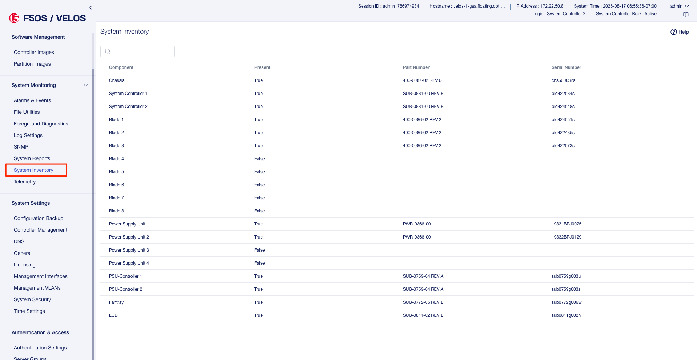

-----------------------------------------------------
Hardware and System Component Monitoring from the API
-----------------------------------------------------

This section will cover monitoring VELOS componenents.

Monitoring VELOS Component Platform Status via API
--------------------------------------------

You can get the status of the VELOS chassis components using the following API call. This will combine that status of all of the componenets into a single API call. These can also be broken out into more targeted API calls for specific compoenents which are also covered later in this section. 

.. code-block:: bash

    GET https://{{velos_chassis1_system_controller_ip}}:8888/restconf/data/openconfig-platform:components

For each blade, controller installed in the system, you'll see descrription, serial number, part number, and NEBS state. You'll also see detailed blade filesystem information, CPU, memory, and storage stats and temperature information. You can also monitor the various firmware update status and versions. 

.. code-block:: json

    {
        "openconfig-platform:components": {
            "component": [
                {
                    "name": "blade-1",
                    "config": {
                        "name": "blade-1"
                    },
                    "state": {
                        "description": "VELOS BX110",
                        "serial-no": "bld424551s",
                        "part-no": "400-0086-02 REV 2",
                        "empty": false,
                        "f5-platform:nebs": {
                            "capable": true,
                            "enabled": false
                        }
                    },
                    "properties": {
                        "property": [
                            {
                                "name": "fw-version-bios",
                                "config": {
                                    "name": "fw-version-bios"
                                },
                                "state": {
                                    "value": "3.00.230.1",
                                    "configurable": false,
                                    "f5-platform:update-status": "none"
                                }
                            },
                            {
                                "name": "fw-version-bios-me",
                                "config": {
                                    "name": "fw-version-bios-me"
                                },
                                "state": {
                                    "value": "4.0.4.800",
                                    "configurable": false,
                                    "f5-platform:update-status": "none"
                                }
                            },
                            {
                                "name": "fw-version-cpld",
                                "config": {
                                    "name": "fw-version-cpld"
                                },
                                "state": {
                                    "value": "05.04.00",
                                    "configurable": false,
                                    "f5-platform:update-status": "none"
                                }
                            },
                            {
                                "name": "fw-version-drive-nvme0n1",
                                "config": {
                                    "name": "fw-version-drive-nvme0n1"
                                },
                                "state": {
                                    "value": "EDA7602Q",
                                    "configurable": false,
                                    "f5-platform:update-status": "none"
                                }
                            },
                            {
                                "name": "fw-version-lop-app",
                                "config": {
                                    "name": "fw-version-lop-app"
                                },
                                "state": {
                                    "value": "2.00.1100.0.1",
                                    "configurable": false,
                                    "f5-platform:update-status": "none"
                                }
                            },
                            {
                                "name": "fw-version-lop-bootloader",
                                "config": {
                                    "name": "fw-version-lop-bootloader"
                                },
                                "state": {
                                    "value": "1.02.868.0.1",
                                    "configurable": false,
                                    "f5-platform:update-status": "none"
                                }
                            },
                            {
                                "name": "fw-version-sirr",
                                "config": {
                                    "name": "fw-version-sirr"
                                },
                                "state": {
                                    "value": "1.1.99",
                                    "configurable": false,
                                    "f5-platform:update-status": "none"
                                }
                            }
                        ]
                    }
                },
                {
                    "name": "blade-2",
                    "config": {
                        "name": "blade-2"
                    },
                    "state": {
                        "description": "VELOS BX110",
                        "serial-no": "bld422435s",
                        "part-no": "400-0086-02 REV 2",
                        "empty": false,
                        "f5-platform:nebs": {
                            "capable": true,
                            "enabled": false
                        }
                    },
                    "properties": {
                        "property": [
                            {
                                "name": "fw-version-bios",
                                "config": {
                                    "name": "fw-version-bios"
                                },
                                "state": {
                                    "value": "3.00.230.1",
                                    "configurable": false,
                                    "f5-platform:update-status": "none"
                                }
                            },
                            {
                                "name": "fw-version-bios-me",
                                "config": {
                                    "name": "fw-version-bios-me"
                                },
                                "state": {
                                    "value": "4.0.4.800",
                                    "configurable": false,
                                    "f5-platform:update-status": "none"
                                }
                            },
                            {
                                "name": "fw-version-cpld",
                                "config": {
                                    "name": "fw-version-cpld"
                                },
                                "state": {
                                    "value": "05.04.00",
                                    "configurable": false,
                                    "f5-platform:update-status": "none"
                                }
                            },
                            {
                                "name": "fw-version-drive-nvme0n1",
                                "config": {
                                    "name": "fw-version-drive-nvme0n1"
                                },
                                "state": {
                                    "value": "EDA7602Q",
                                    "configurable": false,
                                    "f5-platform:update-status": "none"
                                }
                            },
                            {
                                "name": "fw-version-lop-app",
                                "config": {
                                    "name": "fw-version-lop-app"
                                },
                                "state": {
                                    "value": "2.00.1100.0.1",
                                    "configurable": false,
                                    "f5-platform:update-status": "none"
                                }
                            },
                            {
                                "name": "fw-version-lop-bootloader",
                                "config": {
                                    "name": "fw-version-lop-bootloader"
                                },
                                "state": {
                                    "value": "1.02.868.0.1",
                                    "configurable": false,
                                    "f5-platform:update-status": "none"
                                }
                            },
                            {
                                "name": "fw-version-sirr",
                                "config": {
                                    "name": "fw-version-sirr"
                                },
                                "state": {
                                    "value": "1.1.99",
                                    "configurable": false,
                                    "f5-platform:update-status": "none"
                                }
                            }
                        ]
                    }
                },
                {
                    "name": "blade-3",
                    "config": {
                        "name": "blade-3"
                    },
                    "state": {
                        "description": "VELOS BX110",
                        "serial-no": "bld422573s",
                        "part-no": "400-0086-02 REV 2",
                        "empty": false,
                        "f5-platform:nebs": {
                            "capable": true,
                            "enabled": false
                        }
                    },
                    "properties": {
                        "property": [
                            {
                                "name": "fw-version-bios",
                                "config": {
                                    "name": "fw-version-bios"
                                },
                                "state": {
                                    "value": "3.00.230.1",
                                    "configurable": false,
                                    "f5-platform:update-status": "none"
                                }
                            },
                            {
                                "name": "fw-version-bios-me",
                                "config": {
                                    "name": "fw-version-bios-me"
                                },
                                "state": {
                                    "value": "4.0.4.800",
                                    "configurable": false,
                                    "f5-platform:update-status": "none"
                                }
                            },
                            {
                                "name": "fw-version-cpld",
                                "config": {
                                    "name": "fw-version-cpld"
                                },
                                "state": {
                                    "value": "05.04.00",
                                    "configurable": false,
                                    "f5-platform:update-status": "none"
                                }
                            },
                            {
                                "name": "fw-version-drive-nvme0n1",
                                "config": {
                                    "name": "fw-version-drive-nvme0n1"
                                },
                                "state": {
                                    "value": "EDA7602Q",
                                    "configurable": false,
                                    "f5-platform:update-status": "none"
                                }
                            },
                            {
                                "name": "fw-version-lop-app",
                                "config": {
                                    "name": "fw-version-lop-app"
                                },
                                "state": {
                                    "value": "2.00.1100.0.1",
                                    "configurable": false,
                                    "f5-platform:update-status": "none"
                                }
                            },
                            {
                                "name": "fw-version-lop-bootloader",
                                "config": {
                                    "name": "fw-version-lop-bootloader"
                                },
                                "state": {
                                    "value": "1.02.868.0.1",
                                    "configurable": false,
                                    "f5-platform:update-status": "none"
                                }
                            },
                            {
                                "name": "fw-version-sirr",
                                "config": {
                                    "name": "fw-version-sirr"
                                },
                                "state": {
                                    "value": "1.1.99",
                                    "configurable": false,
                                    "f5-platform:update-status": "none"
                                }
                            }
                        ]
                    }
                },
                {
                    "name": "blade-4",
                    "config": {
                        "name": "blade-4"
                    },
                    "state": {
                        "serial-no": "Not Available",
                        "part-no": "Not Available",
                        "empty": true
                    }
                },
                {
                    "name": "blade-5",
                    "config": {
                        "name": "blade-5"
                    },
                    "state": {
                        "serial-no": "Not Available",
                        "part-no": "Not Available",
                        "empty": true
                    }
                },
                {
                    "name": "blade-6",
                    "config": {
                        "name": "blade-6"
                    },
                    "state": {
                        "serial-no": "Not Available",
                        "part-no": "Not Available",
                        "empty": true
                    }
                },
                {
                    "name": "blade-7",
                    "config": {
                        "name": "blade-7"
                    },
                    "state": {
                        "serial-no": "Not Available",
                        "part-no": "Not Available",
                        "empty": true
                    }
                },
                {
                    "name": "blade-8",
                    "config": {
                        "name": "blade-8"
                    },
                    "state": {
                        "serial-no": "Not Available",
                        "part-no": "Not Available",
                        "empty": true
                    }
                },
                {
                    "name": "chassis",
                    "config": {
                        "name": "chassis"
                    },
                    "state": {
                        "description": "VELOS CX410",
                        "serial-no": "chs600032s",
                        "part-no": "400-0087-02 REV 6",
                        "empty": false,
                        "f5-platform:nebs": {
                            "capable": false,
                            "enabled": false
                        }
                    },
                    "f5-platform:psu": {
                        "state": {
                            "redundancy-mode": "no-redundancy",
                            "severity": "warning"
                        },
                        "config": {
                            "redundancy-mode": "no-redundancy",
                            "severity": "warning"
                        }
                    }
                },
                {
                    "name": "controller-1",
                    "config": {
                        "name": "controller-1"
                    },
                    "state": {
                        "description": "VELOS SX410",
                        "serial-no": "bld422584s",
                        "part-no": "SUB-0881-00 REV B",
                        "empty": false,
                        "f5-platform:tpm-integrity-status": "Valid",
                        "f5-platform:nebs": {
                            "capable": true,
                            "enabled": false
                        },
                        "f5-platform:file-systems": {
                            "file-system": [
                                {
                                    "area": "platform/sysroot",
                                    "category": "F5OS System",
                                    "total": "353835896832",
                                    "free": "233831534592",
                                    "used": "102003249152",
                                    "used-percent": 30
                                },
                                {
                                    "area": "platform/images",
                                    "category": "F5OS Images",
                                    "total": "270494859264",
                                    "free": "182400954368",
                                    "used": "74326732800",
                                    "used-percent": 28
                                },
                                {
                                    "area": "partition2/config",
                                    "category": "F5OS System",
                                    "total": "10726932480",
                                    "free": "10492096512",
                                    "used": "234835968",
                                    "used-percent": 2
                                },
                                {
                                    "area": "partition2/images",
                                    "category": "F5OS Partition Images",
                                    "total": "16095641600",
                                    "free": "12324638720",
                                    "used": "3771002880",
                                    "used-percent": 23
                                },
                                {
                                    "area": "partition2/shared",
                                    "category": "F5OS Partition",
                                    "total": "10726932480",
                                    "free": "10682204160",
                                    "used": "44728320",
                                    "used-percent": 0
                                },
                                {
                                    "area": "partition3/config",
                                    "category": "F5OS System",
                                    "total": "10726932480",
                                    "free": "10499620864",
                                    "used": "227311616",
                                    "used-percent": 2
                                },
                                {
                                    "area": "partition3/images",
                                    "category": "F5OS Partition Images",
                                    "total": "16095641600",
                                    "free": "12324638720",
                                    "used": "3771002880",
                                    "used-percent": 23
                                },
                                {
                                    "area": "partition3/shared",
                                    "category": "F5OS Partition",
                                    "total": "10726932480",
                                    "free": "10682204160",
                                    "used": "44728320",
                                    "used-percent": 0
                                }
                            ]
                        },
                        "f5-platform:memory": {
                            "total": "33397862400",
                            "available": "25474383872",
                            "free": "737255424",
                            "used-percent": 23,
                            "platform-total": "33397862400",
                            "platform-used": "12094328832",
                            "platform-used-percent": 36
                        },
                        "f5-platform:temperature": {
                            "current": "27.1",
                            "average": "27.1",
                            "minimum": "25.7",
                            "maximum": "29.0"
                        },
                        "f5-platform:disk-data": {
                            "stats": [
                                {
                                    "disk-data-name": "available",
                                    "disk-data-value": "233831534592"
                                },
                                {
                                    "disk-data-name": "capacity",
                                    "disk-data-value": "353835896832"
                                },
                                {
                                    "disk-data-name": "used",
                                    "disk-data-value": "102003249152"
                                }
                            ]
                        }
                    },
                    "properties": {
                        "property": [
                            {
                                "name": "fw-version-bios",
                                "config": {
                                    "name": "fw-version-bios"
                                },
                                "state": {
                                    "value": "2.03.175.1",
                                    "f5-platform:update-status": "none"
                                }
                            },
                            {
                                "name": "fw-version-bios-me",
                                "config": {
                                    "name": "fw-version-bios-me"
                                },
                                "state": {
                                    "value": "4.0.4.705",
                                    "f5-platform:update-status": "none"
                                }
                            },
                            {
                                "name": "fw-version-cpld",
                                "config": {
                                    "name": "fw-version-cpld"
                                },
                                "state": {
                                    "value": "01.03.0A",
                                    "f5-platform:update-status": "none"
                                }
                            },
                            {
                                "name": "fw-version-drive",
                                "config": {
                                    "name": "fw-version-drive"
                                },
                                "state": {
                                    "value": "EDA7602Q",
                                    "f5-platform:update-status": "none"
                                }
                            },
                            {
                                "name": "fw-version-lcd-app",
                                "config": {
                                    "name": "fw-version-lcd-app"
                                },
                                "state": {
                                    "value": "3.00.144.00.1",
                                    "f5-platform:update-status": "none"
                                }
                            },
                            {
                                "name": "fw-version-lcd-bootloader",
                                "config": {
                                    "name": "fw-version-lcd-bootloader"
                                },
                                "state": {
                                    "value": "2.01.109.00.1",
                                    "f5-platform:update-status": "none"
                                }
                            },
                            {
                                "name": "fw-version-lop-app",
                                "config": {
                                    "name": "fw-version-lop-app"
                                },
                                "state": {
                                    "value": "2.01.1283.0.1",
                                    "f5-platform:update-status": "none"
                                }
                            },
                            {
                                "name": "fw-version-lop-bootloader",
                                "config": {
                                    "name": "fw-version-lop-bootloader"
                                },
                                "state": {
                                    "value": "1.02.1019.0.1",
                                    "f5-platform:update-status": "none"
                                }
                            },
                            {
                                "name": "fw-version-sirr",
                                "config": {
                                    "name": "fw-version-sirr"
                                },
                                "state": {
                                    "value": "1.1.99",
                                    "f5-platform:update-status": "none"
                                }
                            },
                            {
                                "name": "fw-version-vfc-app-fanCtrl1",
                                "config": {
                                    "name": "fw-version-vfc-app-fanCtrl1"
                                },
                                "state": {
                                    "value": "2.00.1008.0.1",
                                    "f5-platform:update-status": "none"
                                }
                            },
                            {
                                "name": "fw-version-vfc-bootloader-fanCtrl1",
                                "config": {
                                    "name": "fw-version-vfc-bootloader-fanCtrl1"
                                },
                                "state": {
                                    "value": "1.02.798.0.1",
                                    "f5-platform:update-status": "none"
                                }
                            },
                            {
                                "name": "fw-version-vpc-app-psuCtrl1",
                                "config": {
                                    "name": "fw-version-vpc-app-psuCtrl1"
                                },
                                "state": {
                                    "value": "2.00.875.0.1",
                                    "f5-platform:update-status": "none"
                                }
                            },
                            {
                                "name": "fw-version-vpc-app-psuCtrl2",
                                "config": {
                                    "name": "fw-version-vpc-app-psuCtrl2"
                                },
                                "state": {
                                    "value": "2.00.875.0.1",
                                    "f5-platform:update-status": "none"
                                }
                            },
                            {
                                "name": "fw-version-vpc-bootloader-psuCtrl1",
                                "config": {
                                    "name": "fw-version-vpc-bootloader-psuCtrl1"
                                },
                                "state": {
                                    "value": "1.02.669.0.1",
                                    "f5-platform:update-status": "none"
                                }
                            },
                            {
                                "name": "fw-version-vpc-bootloader-psuCtrl2",
                                "config": {
                                    "name": "fw-version-vpc-bootloader-psuCtrl2"
                                },
                                "state": {
                                    "value": "1.02.669.0.1",
                                    "f5-platform:update-status": "none"
                                }
                            }
                        ]
                    },
                    "storage": {
                        "state": {
                            "f5-platform:disks": {
                                "disk": [
                                    {
                                        "disk-name": "nvme0n1",
                                        "state": {
                                            "model": "SAMSUNG MZ1LB960HAJQ-00007",
                                            "vendor": "Samsung",
                                            "version": "EDA7602Q",
                                            "serial-no": "S435NE0MA00234",
                                            "size": "683.00GB",
                                            "type": "nvme",
                                            "disk-io": {
                                                "total-iops": "0",
                                                "read-iops": "1565157",
                                                "read-merged": "664508",
                                                "read-bytes": "16619667456",
                                                "read-latency-ms": "555713",
                                                "write-iops": "502666553",
                                                "write-merged": "383907046",
                                                "write-bytes": "4484356748800",
                                                "write-latency-ms": "19299100",
                                                "read-iops-per-sec": "0",
                                                "read-bytes-per-sec": "0",
                                                "write-iops-per-sec": "360",
                                                "write-bytes-per-sec": "2629548"
                                            }
                                        }
                                    }
                                ]
                            }
                        }
                    },
                    "cpu": {
                        "state": {
                            "f5-platform:processors": {
                                "processor": [
                                    {
                                        "cpu-index": 1,
                                        "state": {
                                            "cachesize": "2048(KB)",
                                            "core-cnt": "8",
                                            "freq": "2200.000(MHz)",
                                            "stepping": "1",
                                            "thread-cnt": "8",
                                            "modelname": "Intel(R) Atom(TM) CPU C3758 @ 2.20GHz"
                                        }
                                    }
                                ]
                            },
                            "f5-platform:cpu-utilization": {
                                "thread": "cpu",
                                "current": 28,
                                "five-second-avg": 26,
                                "one-minute-avg": 24,
                                "five-minute-avg": 26
                            },
                            "f5-platform:cpu-threads": {
                                "cpu-thread": [
                                    {
                                        "thread-index": 0,
                                        "thread": "cpu0",
                                        "current": 19,
                                        "five-second-avg": 27,
                                        "one-minute-avg": 24,
                                        "five-minute-avg": 26
                                    },
                                    {
                                        "thread-index": 1,
                                        "thread": "cpu1",
                                        "current": 32,
                                        "five-second-avg": 26,
                                        "one-minute-avg": 26,
                                        "five-minute-avg": 27
                                    },
                                    {
                                        "thread-index": 2,
                                        "thread": "cpu2",
                                        "current": 38,
                                        "five-second-avg": 27,
                                        "one-minute-avg": 23,
                                        "five-minute-avg": 26
                                    },
                                    {
                                        "thread-index": 3,
                                        "thread": "cpu3",
                                        "current": 16,
                                        "five-second-avg": 23,
                                        "one-minute-avg": 23,
                                        "five-minute-avg": 26
                                    },
                                    {
                                        "thread-index": 4,
                                        "thread": "cpu4",
                                        "current": 24,
                                        "five-second-avg": 27,
                                        "one-minute-avg": 23,
                                        "five-minute-avg": 26
                                    },
                                    {
                                        "thread-index": 5,
                                        "thread": "cpu5",
                                        "current": 43,
                                        "five-second-avg": 26,
                                        "one-minute-avg": 26,
                                        "five-minute-avg": 27
                                    },
                                    {
                                        "thread-index": 6,
                                        "thread": "cpu6",
                                        "current": 22,
                                        "five-second-avg": 25,
                                        "one-minute-avg": 22,
                                        "five-minute-avg": 25
                                    },
                                    {
                                        "thread-index": 7,
                                        "thread": "cpu7",
                                        "current": 29,
                                        "five-second-avg": 25,
                                        "one-minute-avg": 24,
                                        "five-minute-avg": 27
                                    }
                                ]
                            }
                        }
                    }
                },
                {
                    "name": "controller-2",
                    "config": {
                        "name": "controller-2"
                    },
                    "state": {
                        "description": "VELOS SX410",
                        "serial-no": "bld424548s",
                        "part-no": "SUB-0881-00 REV B",
                        "empty": false,
                        "f5-platform:tpm-integrity-status": "Valid",
                        "f5-platform:nebs": {
                            "capable": true,
                            "enabled": false
                        },
                        "f5-platform:file-systems": {
                            "file-system": [
                                {
                                    "area": "platform/sysroot",
                                    "category": "F5OS System",
                                    "total": "353835896832",
                                    "free": "232129888256",
                                    "used": "103704895488",
                                    "used-percent": 30
                                },
                                {
                                    "area": "platform/images",
                                    "category": "F5OS Images",
                                    "total": "270494859264",
                                    "free": "173605605376",
                                    "used": "83122081792",
                                    "used-percent": 32
                                },
                                {
                                    "area": "/var/roothome/etcd3mount",
                                    "category": "F5OS System",
                                    "total": "5196181504",
                                    "free": "4514873344",
                                    "used": "396107776",
                                    "used-percent": 8
                                },
                                {
                                    "area": "partition2/config",
                                    "category": "F5OS System",
                                    "total": "10726932480",
                                    "free": "10520436736",
                                    "used": "206495744",
                                    "used-percent": 1
                                },
                                {
                                    "area": "partition2/images",
                                    "category": "F5OS Partition Images",
                                    "total": "16095641600",
                                    "free": "12324638720",
                                    "used": "3771002880",
                                    "used-percent": 23
                                },
                                {
                                    "area": "partition2/shared",
                                    "category": "F5OS Partition",
                                    "total": "10726932480",
                                    "free": "10682204160",
                                    "used": "44728320",
                                    "used-percent": 0
                                },
                                {
                                    "area": "partition3/config",
                                    "category": "F5OS System",
                                    "total": "10726932480",
                                    "free": "10527416320",
                                    "used": "199516160",
                                    "used-percent": 1
                                },
                                {
                                    "area": "partition3/images",
                                    "category": "F5OS Partition Images",
                                    "total": "16095641600",
                                    "free": "12324638720",
                                    "used": "3771002880",
                                    "used-percent": 23
                                },
                                {
                                    "area": "partition3/shared",
                                    "category": "F5OS Partition",
                                    "total": "10726932480",
                                    "free": "10682204160",
                                    "used": "44728320",
                                    "used-percent": 0
                                }
                            ]
                        },
                        "f5-platform:memory": {
                            "total": "33397866496",
                            "available": "25015001088",
                            "free": "490733568",
                            "used-percent": 25,
                            "platform-total": "33397866496",
                            "platform-used": "11680473088",
                            "platform-used-percent": 35
                        },
                        "f5-platform:temperature": {
                            "current": "27.6",
                            "average": "27.4",
                            "minimum": "25.9",
                            "maximum": "28.8"
                        },
                        "f5-platform:disk-data": {
                            "stats": [
                                {
                                    "disk-data-name": "available",
                                    "disk-data-value": "232130322432"
                                },
                                {
                                    "disk-data-name": "capacity",
                                    "disk-data-value": "353835896832"
                                },
                                {
                                    "disk-data-name": "used",
                                    "disk-data-value": "103704461312"
                                }
                            ]
                        }
                    },
                    "properties": {
                        "property": [
                            {
                                "name": "fw-version-bios",
                                "config": {
                                    "name": "fw-version-bios"
                                },
                                "state": {
                                    "value": "2.03.175.1",
                                    "f5-platform:update-status": "none"
                                }
                            },
                            {
                                "name": "fw-version-bios-me",
                                "config": {
                                    "name": "fw-version-bios-me"
                                },
                                "state": {
                                    "value": "4.0.4.705",
                                    "f5-platform:update-status": "none"
                                }
                            },
                            {
                                "name": "fw-version-cpld",
                                "config": {
                                    "name": "fw-version-cpld"
                                },
                                "state": {
                                    "value": "01.03.0A",
                                    "f5-platform:update-status": "none"
                                }
                            },
                            {
                                "name": "fw-version-drive",
                                "config": {
                                    "name": "fw-version-drive"
                                },
                                "state": {
                                    "value": "EDA7602Q",
                                    "f5-platform:update-status": "none"
                                }
                            },
                            {
                                "name": "fw-version-lcd-app",
                                "config": {
                                    "name": "fw-version-lcd-app"
                                },
                                "state": {
                                    "value": "3.00.144.00.1",
                                    "f5-platform:update-status": "none"
                                }
                            },
                            {
                                "name": "fw-version-lcd-bootloader",
                                "config": {
                                    "name": "fw-version-lcd-bootloader"
                                },
                                "state": {
                                    "value": "2.01.109.00.1",
                                    "f5-platform:update-status": "none"
                                }
                            },
                            {
                                "name": "fw-version-lop-app",
                                "config": {
                                    "name": "fw-version-lop-app"
                                },
                                "state": {
                                    "value": "2.01.1283.0.1",
                                    "f5-platform:update-status": "none"
                                }
                            },
                            {
                                "name": "fw-version-lop-bootloader",
                                "config": {
                                    "name": "fw-version-lop-bootloader"
                                },
                                "state": {
                                    "value": "1.02.1019.0.1",
                                    "f5-platform:update-status": "none"
                                }
                            },
                            {
                                "name": "fw-version-sirr",
                                "config": {
                                    "name": "fw-version-sirr"
                                },
                                "state": {
                                    "value": "1.1.99",
                                    "f5-platform:update-status": "none"
                                }
                            },
                            {
                                "name": "fw-version-vfc-app-fanCtrl1",
                                "config": {
                                    "name": "fw-version-vfc-app-fanCtrl1"
                                },
                                "state": {
                                    "value": "2.00.1008.0.1",
                                    "f5-platform:update-status": "none"
                                }
                            },
                            {
                                "name": "fw-version-vfc-bootloader-fanCtrl1",
                                "config": {
                                    "name": "fw-version-vfc-bootloader-fanCtrl1"
                                },
                                "state": {
                                    "value": "1.02.798.0.1",
                                    "f5-platform:update-status": "none"
                                }
                            },
                            {
                                "name": "fw-version-vpc-app-psuCtrl1",
                                "config": {
                                    "name": "fw-version-vpc-app-psuCtrl1"
                                },
                                "state": {
                                    "value": "2.00.875.0.1",
                                    "f5-platform:update-status": "none"
                                }
                            },
                            {
                                "name": "fw-version-vpc-app-psuCtrl2",
                                "config": {
                                    "name": "fw-version-vpc-app-psuCtrl2"
                                },
                                "state": {
                                    "value": "2.00.875.0.1",
                                    "f5-platform:update-status": "none"
                                }
                            },
                            {
                                "name": "fw-version-vpc-bootloader-psuCtrl1",
                                "config": {
                                    "name": "fw-version-vpc-bootloader-psuCtrl1"
                                },
                                "state": {
                                    "value": "1.02.669.0.1",
                                    "f5-platform:update-status": "none"
                                }
                            },
                            {
                                "name": "fw-version-vpc-bootloader-psuCtrl2",
                                "config": {
                                    "name": "fw-version-vpc-bootloader-psuCtrl2"
                                },
                                "state": {
                                    "value": "1.02.669.0.1",
                                    "f5-platform:update-status": "none"
                                }
                            }
                        ]
                    },
                    "storage": {
                        "state": {
                            "f5-platform:disks": {
                                "disk": [
                                    {
                                        "disk-name": "nvme0n1",
                                        "state": {
                                            "model": "SAMSUNG MZ1LB960HAJQ-00007",
                                            "vendor": "Samsung",
                                            "version": "EDA7602Q",
                                            "serial-no": "S435NE0MA00209",
                                            "size": "683.00GB",
                                            "type": "nvme",
                                            "disk-io": {
                                                "total-iops": "0",
                                                "read-iops": "1680343",
                                                "read-merged": "1138227",
                                                "read-bytes": "22058972160",
                                                "read-latency-ms": "466285",
                                                "write-iops": "646894011",
                                                "write-merged": "488592072",
                                                "write-bytes": "6097242719232",
                                                "write-latency-ms": "27061976",
                                                "read-iops-per-sec": "0",
                                                "read-bytes-per-sec": "0",
                                                "write-iops-per-sec": "352",
                                                "write-bytes-per-sec": "2974605"
                                            }
                                        }
                                    }
                                ]
                            }
                        }
                    },
                    "cpu": {
                        "state": {
                            "f5-platform:processors": {
                                "processor": [
                                    {
                                        "cpu-index": 1,
                                        "state": {
                                            "cachesize": "2048(KB)",
                                            "core-cnt": "8",
                                            "freq": "2200.000(MHz)",
                                            "stepping": "1",
                                            "thread-cnt": "8",
                                            "modelname": "Intel(R) Atom(TM) CPU C3758 @ 2.20GHz"
                                        }
                                    }
                                ]
                            },
                            "f5-platform:cpu-utilization": {
                                "thread": "cpu",
                                "current": 45,
                                "five-second-avg": 40,
                                "one-minute-avg": 43,
                                "five-minute-avg": 43
                            },
                            "f5-platform:cpu-threads": {
                                "cpu-thread": [
                                    {
                                        "thread-index": 0,
                                        "thread": "cpu0",
                                        "current": 48,
                                        "five-second-avg": 41,
                                        "one-minute-avg": 44,
                                        "five-minute-avg": 42
                                    },
                                    {
                                        "thread-index": 1,
                                        "thread": "cpu1",
                                        "current": 48,
                                        "five-second-avg": 40,
                                        "one-minute-avg": 43,
                                        "five-minute-avg": 42
                                    },
                                    {
                                        "thread-index": 2,
                                        "thread": "cpu2",
                                        "current": 54,
                                        "five-second-avg": 40,
                                        "one-minute-avg": 42,
                                        "five-minute-avg": 42
                                    },
                                    {
                                        "thread-index": 3,
                                        "thread": "cpu3",
                                        "current": 39,
                                        "five-second-avg": 39,
                                        "one-minute-avg": 43,
                                        "five-minute-avg": 43
                                    },
                                    {
                                        "thread-index": 4,
                                        "thread": "cpu4",
                                        "current": 42,
                                        "five-second-avg": 39,
                                        "one-minute-avg": 43,
                                        "five-minute-avg": 43
                                    },
                                    {
                                        "thread-index": 5,
                                        "thread": "cpu5",
                                        "current": 51,
                                        "five-second-avg": 43,
                                        "one-minute-avg": 43,
                                        "five-minute-avg": 44
                                    },
                                    {
                                        "thread-index": 6,
                                        "thread": "cpu6",
                                        "current": 34,
                                        "five-second-avg": 42,
                                        "one-minute-avg": 43,
                                        "five-minute-avg": 43
                                    },
                                    {
                                        "thread-index": 7,
                                        "thread": "cpu7",
                                        "current": 44,
                                        "five-second-avg": 32,
                                        "one-minute-avg": 42,
                                        "five-minute-avg": 42
                                    }
                                ]
                            }
                        }
                    }
                },
                {
                    "name": "fantray-1",
                    "config": {
                        "name": "fantray-1"
                    },
                    "state": {
                        "firmware-version": "1.02.798.0.1",
                        "software-version": "2.00.1008.0.1",
                        "serial-no": "sub0772g006w",
                        "part-no": "SUB-0772-05 REV B",
                        "empty": false
                    },
                    "properties": {
                        "f5-platform:fantray-state": {
                            "fantray-temperature": "34.0",
                            "inlet-fan-1-speed": 6775,
                            "inlet-fan-2-speed": 6714,
                            "inlet-fan-3-speed": 6729,
                            "exhaust-fan-1-speed": 6740,
                            "exhaust-fan-2-speed": 6726,
                            "exhaust-fan-3-speed": 6759
                        }
                    }
                },
                {
                    "name": "lcd",
                    "config": {
                        "name": "lcd",
                        "f5-platform-lcd:mode": "secure"
                    },
                    "state": {
                        "serial-no": "sub0811g002h",
                        "part-no": "SUB-0811-02 REV B",
                        "empty": false,
                        "f5-platform-lcd:mode": "secure"
                    }
                },
                {
                    "name": "psu-1",
                    "config": {
                        "name": "psu-1"
                    },
                    "state": {
                        "serial-no": "19331BPJ0075",
                        "part-no": "PWR-0366-00",
                        "empty": false
                    },
                    "properties": {
                        "f5-platform:psu-state": {
                            "psu-current-in": "3.156",
                            "psu-current-out": "48.687",
                            "psu-power-in": "640.0",
                            "psu-power-out": "600.0",
                            "psu-voltage-in": "203.75",
                            "psu-voltage-out": "12.327",
                            "psu-temperature-1": "25.0",
                            "psu-temperature-2": "40.5",
                            "psu-temperature-3": "37.2",
                            "psu-fan-1-speed": 7552,
                            "psu-fan-2-speed": 7136
                        }
                    }
                },
                {
                    "name": "psu-2",
                    "config": {
                        "name": "psu-2"
                    },
                    "state": {
                        "serial-no": "19332BPJ0129",
                        "part-no": "PWR-0366-00",
                        "empty": false
                    },
                    "properties": {
                        "f5-platform:psu-state": {
                            "psu-current-in": "3.281",
                            "psu-current-out": "50.875",
                            "psu-power-in": "670.0",
                            "psu-power-out": "627.0",
                            "psu-voltage-in": "204.0",
                            "psu-voltage-out": "12.321",
                            "psu-temperature-1": "24.7",
                            "psu-temperature-2": "41.0",
                            "psu-temperature-3": "36.2",
                            "psu-fan-1-speed": 7392,
                            "psu-fan-2-speed": 7040
                        }
                    }
                },
                {
                    "name": "psu-3",
                    "config": {
                        "name": "psu-3"
                    },
                    "state": {
                        "serial-no": "Not Available",
                        "part-no": "Not Available",
                        "empty": true
                    }
                },
                {
                    "name": "psu-4",
                    "config": {
                        "name": "psu-4"
                    },
                    "state": {
                        "serial-no": "Not Available",
                        "part-no": "Not Available",
                        "empty": true
                    }
                },
                {
                    "name": "psu-controller-1",
                    "config": {
                        "name": "psu-controller-1"
                    },
                    "state": {
                        "firmware-version": "1.02.669.0.1",
                        "software-version": "2.00.875.0.1",
                        "serial-no": "sub0759g003u",
                        "part-no": "SUB-0759-04 REV A",
                        "empty": false
                    }
                },
                {
                    "name": "psu-controller-2",
                    "config": {
                        "name": "psu-controller-2"
                    },
                    "state": {
                        "firmware-version": "1.02.669.0.1",
                        "software-version": "2.00.875.0.1",
                        "serial-no": "sub0759g003z",
                        "part-no": "SUB-0759-04 REV A",
                        "empty": false
                    }
                }
            ]
        }
    }

Monitoring VELOS Chassis Status via API
--------------------------------------------

You can get the status of the VELOS chassis via API by using the following API call.

.. code-block:: bash

    GET https://{{velos_chassis1_system_controller_ip}}:8888/restconf/data/openconfig-platform:components/component=chassis

In the output, you'll see the chassis description, serial number, part number, and NEBS status. You'll also see the current PSU state.

.. code-block:: json

    {
        "openconfig-platform:component": [
            {
                "name": "chassis",
                "config": {
                    "name": "chassis"
                },
                "state": {
                    "description": "VELOS CX410",
                    "serial-no": "chs600032s",
                    "part-no": "400-0087-02 REV 6",
                    "empty": false,
                    "f5-platform:nebs": {
                        "capable": false,
                        "enabled": false
                    }
                },
                "f5-platform:psu": {
                    "state": {
                        "redundancy-mode": "no-redundancy",
                        "severity": "warning"
                    },
                    "config": {
                        "redundancy-mode": "no-redundancy",
                        "severity": "warning"
                    }
                }
            }
        ]
    }

Monitoring VELOS Controller Status via API
--------------------------------------------

The API call below will query a specific system controller. You can replace **component=controller-1** at the end of the API call with **component=controller-2** to see the second controller status.

.. code-block:: bash

    GET https://{{velos_chassis1_system_controller_ip}}:8888/restconf/data/openconfig-platform:components/component=controller-1

In the output, you'll see the controller description, serial number, part number, NEBS and TPM status. You'll also see detailed controller filesystem information, CPU, memory, and storage stats and temperature information. You can also monitor the various firmware update status and versions. 

.. code-block:: json

    {
        "openconfig-platform:component": [
            {
                "name": "controller-1",
                "config": {
                    "name": "controller-1"
                },
                "state": {
                    "description": "VELOS SX410",
                    "serial-no": "bld422584s",
                    "part-no": "SUB-0881-00 REV B",
                    "empty": false,
                    "f5-platform:tpm-integrity-status": "Valid",
                    "f5-platform:nebs": {
                        "capable": true,
                        "enabled": false
                    },
                    "f5-platform:file-systems": {
                        "file-system": [
                            {
                                "area": "platform/sysroot",
                                "category": "F5OS System",
                                "total": "353835896832",
                                "free": "233832402944",
                                "used": "102002380800",
                                "used-percent": 30
                            },
                            {
                                "area": "platform/images",
                                "category": "F5OS Images",
                                "total": "270494859264",
                                "free": "182400954368",
                                "used": "74326732800",
                                "used-percent": 28
                            },
                            {
                                "area": "partition2/config",
                                "category": "F5OS System",
                                "total": "10726932480",
                                "free": "10492076032",
                                "used": "234856448",
                                "used-percent": 2
                            },
                            {
                                "area": "partition2/images",
                                "category": "F5OS Partition Images",
                                "total": "16095641600",
                                "free": "12324638720",
                                "used": "3771002880",
                                "used-percent": 23
                            },
                            {
                                "area": "partition2/shared",
                                "category": "F5OS Partition",
                                "total": "10726932480",
                                "free": "10682204160",
                                "used": "44728320",
                                "used-percent": 0
                            },
                            {
                                "area": "partition3/config",
                                "category": "F5OS System",
                                "total": "10726932480",
                                "free": "10499624960",
                                "used": "227307520",
                                "used-percent": 2
                            },
                            {
                                "area": "partition3/images",
                                "category": "F5OS Partition Images",
                                "total": "16095641600",
                                "free": "12324638720",
                                "used": "3771002880",
                                "used-percent": 23
                            },
                            {
                                "area": "partition3/shared",
                                "category": "F5OS Partition",
                                "total": "10726932480",
                                "free": "10682204160",
                                "used": "44728320",
                                "used-percent": 0
                            }
                        ]
                    },
                    "f5-platform:memory": {
                        "total": "33397862400",
                        "available": "25480728576",
                        "free": "745287680",
                        "used-percent": 23,
                        "platform-total": "33397862400",
                        "platform-used": "12087713792",
                        "platform-used-percent": 36
                    },
                    "f5-platform:temperature": {
                        "current": "27.2",
                        "average": "27.1",
                        "minimum": "25.7",
                        "maximum": "29.0"
                    },
                    "f5-platform:disk-data": {
                        "stats": [
                            {
                                "disk-data-name": "available",
                                "disk-data-value": "233832509440"
                            },
                            {
                                "disk-data-name": "capacity",
                                "disk-data-value": "353835896832"
                            },
                            {
                                "disk-data-name": "used",
                                "disk-data-value": "102002274304"
                            }
                        ]
                    }
                },
                "properties": {
                    "property": [
                        {
                            "name": "fw-version-bios",
                            "config": {
                                "name": "fw-version-bios"
                            },
                            "state": {
                                "value": "2.03.175.1",
                                "f5-platform:update-status": "none"
                            }
                        },
                        {
                            "name": "fw-version-bios-me",
                            "config": {
                                "name": "fw-version-bios-me"
                            },
                            "state": {
                                "value": "4.0.4.705",
                                "f5-platform:update-status": "none"
                            }
                        },
                        {
                            "name": "fw-version-cpld",
                            "config": {
                                "name": "fw-version-cpld"
                            },
                            "state": {
                                "value": "01.03.0A",
                                "f5-platform:update-status": "none"
                            }
                        },
                        {
                            "name": "fw-version-drive",
                            "config": {
                                "name": "fw-version-drive"
                            },
                            "state": {
                                "value": "EDA7602Q",
                                "f5-platform:update-status": "none"
                            }
                        },
                        {
                            "name": "fw-version-lcd-app",
                            "config": {
                                "name": "fw-version-lcd-app"
                            },
                            "state": {
                                "value": "3.00.144.00.1",
                                "f5-platform:update-status": "none"
                            }
                        },
                        {
                            "name": "fw-version-lcd-bootloader",
                            "config": {
                                "name": "fw-version-lcd-bootloader"
                            },
                            "state": {
                                "value": "2.01.109.00.1",
                                "f5-platform:update-status": "none"
                            }
                        },
                        {
                            "name": "fw-version-lop-app",
                            "config": {
                                "name": "fw-version-lop-app"
                            },
                            "state": {
                                "value": "2.01.1283.0.1",
                                "f5-platform:update-status": "none"
                            }
                        },
                        {
                            "name": "fw-version-lop-bootloader",
                            "config": {
                                "name": "fw-version-lop-bootloader"
                            },
                            "state": {
                                "value": "1.02.1019.0.1",
                                "f5-platform:update-status": "none"
                            }
                        },
                        {
                            "name": "fw-version-sirr",
                            "config": {
                                "name": "fw-version-sirr"
                            },
                            "state": {
                                "value": "1.1.99",
                                "f5-platform:update-status": "none"
                            }
                        },
                        {
                            "name": "fw-version-vfc-app-fanCtrl1",
                            "config": {
                                "name": "fw-version-vfc-app-fanCtrl1"
                            },
                            "state": {
                                "value": "2.00.1008.0.1",
                                "f5-platform:update-status": "none"
                            }
                        },
                        {
                            "name": "fw-version-vfc-bootloader-fanCtrl1",
                            "config": {
                                "name": "fw-version-vfc-bootloader-fanCtrl1"
                            },
                            "state": {
                                "value": "1.02.798.0.1",
                                "f5-platform:update-status": "none"
                            }
                        },
                        {
                            "name": "fw-version-vpc-app-psuCtrl1",
                            "config": {
                                "name": "fw-version-vpc-app-psuCtrl1"
                            },
                            "state": {
                                "value": "2.00.875.0.1",
                                "f5-platform:update-status": "none"
                            }
                        },
                        {
                            "name": "fw-version-vpc-app-psuCtrl2",
                            "config": {
                                "name": "fw-version-vpc-app-psuCtrl2"
                            },
                            "state": {
                                "value": "2.00.875.0.1",
                                "f5-platform:update-status": "none"
                            }
                        },
                        {
                            "name": "fw-version-vpc-bootloader-psuCtrl1",
                            "config": {
                                "name": "fw-version-vpc-bootloader-psuCtrl1"
                            },
                            "state": {
                                "value": "1.02.669.0.1",
                                "f5-platform:update-status": "none"
                            }
                        },
                        {
                            "name": "fw-version-vpc-bootloader-psuCtrl2",
                            "config": {
                                "name": "fw-version-vpc-bootloader-psuCtrl2"
                            },
                            "state": {
                                "value": "1.02.669.0.1",
                                "f5-platform:update-status": "none"
                            }
                        }
                    ]
                },
                "storage": {
                    "state": {
                        "f5-platform:disks": {
                            "disk": [
                                {
                                    "disk-name": "nvme0n1",
                                    "state": {
                                        "model": "SAMSUNG MZ1LB960HAJQ-00007",
                                        "vendor": "Samsung",
                                        "version": "EDA7602Q",
                                        "serial-no": "S435NE0MA00234",
                                        "size": "683.00GB",
                                        "type": "nvme",
                                        "disk-io": {
                                            "total-iops": "0",
                                            "read-iops": "1565157",
                                            "read-merged": "664508",
                                            "read-bytes": "16619667456",
                                            "read-latency-ms": "555713",
                                            "write-iops": "502634370",
                                            "write-merged": "383883211",
                                            "write-bytes": "4484072824320",
                                            "write-latency-ms": "19297968",
                                            "read-iops-per-sec": "0",
                                            "read-bytes-per-sec": "0",
                                            "write-iops-per-sec": "240",
                                            "write-bytes-per-sec": "2046857"
                                        }
                                    }
                                }
                            ]
                        }
                    }
                },
                "cpu": {
                    "state": {
                        "f5-platform:processors": {
                            "processor": [
                                {
                                    "cpu-index": 1,
                                    "state": {
                                        "cachesize": "2048(KB)",
                                        "core-cnt": "8",
                                        "freq": "2200.000(MHz)",
                                        "stepping": "1",
                                        "thread-cnt": "8",
                                        "modelname": "Intel(R) Atom(TM) CPU C3758 @ 2.20GHz"
                                    }
                                }
                            ]
                        },
                        "f5-platform:cpu-utilization": {
                            "thread": "cpu",
                            "current": 38,
                            "five-second-avg": 36,
                            "one-minute-avg": 25,
                            "five-minute-avg": 27
                        },
                        "f5-platform:cpu-threads": {
                            "cpu-thread": [
                                {
                                    "thread-index": 0,
                                    "thread": "cpu0",
                                    "current": 40,
                                    "five-second-avg": 36,
                                    "one-minute-avg": 24,
                                    "five-minute-avg": 26
                                },
                                {
                                    "thread-index": 1,
                                    "thread": "cpu1",
                                    "current": 31,
                                    "five-second-avg": 36,
                                    "one-minute-avg": 25,
                                    "five-minute-avg": 27
                                },
                                {
                                    "thread-index": 2,
                                    "thread": "cpu2",
                                    "current": 33,
                                    "five-second-avg": 35,
                                    "one-minute-avg": 25,
                                    "five-minute-avg": 27
                                },
                                {
                                    "thread-index": 3,
                                    "thread": "cpu3",
                                    "current": 42,
                                    "five-second-avg": 39,
                                    "one-minute-avg": 25,
                                    "five-minute-avg": 26
                                },
                                {
                                    "thread-index": 4,
                                    "thread": "cpu4",
                                    "current": 46,
                                    "five-second-avg": 39,
                                    "one-minute-avg": 24,
                                    "five-minute-avg": 26
                                },
                                {
                                    "thread-index": 5,
                                    "thread": "cpu5",
                                    "current": 36,
                                    "five-second-avg": 36,
                                    "one-minute-avg": 25,
                                    "five-minute-avg": 27
                                },
                                {
                                    "thread-index": 6,
                                    "thread": "cpu6",
                                    "current": 33,
                                    "five-second-avg": 30,
                                    "one-minute-avg": 23,
                                    "five-minute-avg": 26
                                },
                                {
                                    "thread-index": 7,
                                    "thread": "cpu7",
                                    "current": 45,
                                    "five-second-avg": 35,
                                    "one-minute-avg": 26,
                                    "five-minute-avg": 27
                                }
                            ]
                        }
                    }
                }
            }
        ]
    }

Monitoring VELOS Power Supply Status via API
--------------------------------------------

You can monitor any power supply within the VELOS chassis. You can replace **component=psu-1** at the end of the API call with **component=psu-2** or any other psu number to monitor any specific PSU status.

.. code-block:: bash

    GET https://{{velos_chassis1_system_controller_ip}}:8888/restconf/data/openconfig-platform:components/component=psu-1

In the output you'll see the PSU serial number, part number, and state. The state will include current, power, voltage, temperature and fan speed of each power supply.

.. code-block:: json

    {
        "openconfig-platform:component": [
            {
                "name": "psu-1",
                "config": {
                    "name": "psu-1"
                },
                "state": {
                    "serial-no": "19331BPJ0075",
                    "part-no": "PWR-0366-00",
                    "empty": false
                },
                "properties": {
                    "f5-platform:psu-state": {
                        "psu-current-in": "3.113",
                        "psu-current-out": "48.187",
                        "psu-power-in": "627.0",
                        "psu-power-out": "594.0",
                        "psu-voltage-in": "204.0",
                        "psu-voltage-out": "12.324",
                        "psu-temperature-1": "25.0",
                        "psu-temperature-2": "39.7",
                        "psu-temperature-3": "36.5",
                        "psu-fan-1-speed": 7552,
                        "psu-fan-2-speed": 6976
                    }
                }
            }
        ]
    }

Monitoring VELOS Power Supply Controller Status via API
------------------------------------------------------

Each VELOS chassis has multiple power supply controllers that are fully redundant. In the CX410 chassis there are two psu-controllers, and in the CX1610 chassis there are 4 psu controllers. You can monitor their status with the following API call. You can replace **component=psu-controller-1** at the end of the API call with **component=psu-controller-2** or replace it with whichever psu-controller number you wish to monitor. 

.. code-block:: bash

    GET https://{{velos_chassis1_system_controller_ip}}:8888/restconf/data/openconfig-platform:components/component=psu-controller-1

In the output you'll see the firmware and software versions, serial number, part number and **empty** state which indicates if the psu-controller is installed.

.. code-block:: json

    {
        "openconfig-platform:component": [
            {
                "name": "psu-controller-1",
                "config": {
                    "name": "psu-controller-1"
                },
                "state": {
                    "firmware-version": "1.02.669.0.1",
                    "software-version": "2.00.875.0.1",
                    "serial-no": "sub0759g003u",
                    "part-no": "SUB-0759-04 REV A",
                    "empty": false
                }
            }
        ]
    }

Monitoring VELOS Fan Tray Status via API
-----------------------------------------

Each VELOS chassis has one or more fan trays for cooling. The CX410 chassis has a single fan tray, and the CX1610 chassis four fan trays. You can monitor each fan tray with the API call below. You can replace **component=fantray-1** at the end of the API call with **component=fantray-2** to see the second controller status.

.. code-block:: bash

    GET https://{{velos_chassis1_system_controller_ip}}:8888/restconf/data/openconfig-platform:components/component=fantray-1

In the output you'll see the firmware and software versions, serial number, part number and **empty** state which indicates if the fan tray is installed. It will also display the fan tray temperature, inlet fan speeds, and exhaust fan speeds. 

.. code-block:: json

    {
        "openconfig-platform:component": [
            {
                "name": "fantray-1",
                "config": {
                    "name": "fantray-1"
                },
                "state": {
                    "firmware-version": "1.02.798.0.1",
                    "software-version": "2.00.1008.0.1",
                    "serial-no": "sub0772g006w",
                    "part-no": "SUB-0772-05 REV B",
                    "empty": false
                },
                "properties": {
                    "f5-platform:fantray-state": {
                        "fantray-temperature": "34.0",
                        "inlet-fan-1-speed": 6775,
                        "inlet-fan-2-speed": 6746,
                        "inlet-fan-3-speed": 6750,
                        "exhaust-fan-1-speed": 6730,
                        "exhaust-fan-2-speed": 6732,
                        "exhaust-fan-3-speed": 6795
                    }
                }
            }
        ]
    }

Monitoring VELOS LCD Status via API
-----------------------------------------

Each VELOS chassis has an LCD for initial configuration, alarms, and basic monitoring. You can check the health of the LCD with the following API call.

.. code-block:: bash

    GET https://{{velos_chassis1_system_controller_ip}}:8888/restconf/data/openconfig-platform:components/component=lcd

In the output you'll see the serial number, part number, lcd mode, and empty status.

.. code-block:: json

    {
        "openconfig-platform:component": [
            {
                "name": "lcd",
                "config": {
                    "name": "lcd",
                    "f5-platform-lcd:mode": "secure"
                },
                "state": {
                    "serial-no": "sub0811g002h",
                    "part-no": "SUB-0811-02 REV B",
                    "empty": false,
                    "f5-platform-lcd:mode": "secure"
                }
            }
        ]
    }

Monitoring VELOS Blade Status via API
-----------------------------------------

Each VELOS chassis can have multiple data plane blades installed. The CX410 chassis supports up to eight BX110 blades, or four BX520 blades. The CX1610 chassis can support up to sixteen BX520 blades. You can monitor each blade with the API call below. You can replace **component=blade-1** at the end of the API call with **component=blade-2** or whichever number blade you wish to monitor.

.. code-block:: bash

    GET https://{{velos_chassis1_system_controller_ip}}:8888/restconf/data/openconfig-platform:components/component=blade-1

In the output you'll see the blade description, serial number, part numbers, NEBS stats, and empty status. You'll also see the blades firmware status.

.. code-block:: json

    {
        "openconfig-platform:component": [
            {
                "name": "blade-1",
                "config": {
                    "name": "blade-1"
                },
                "state": {
                    "description": "VELOS BX110",
                    "serial-no": "bld424551s",
                    "part-no": "400-0086-02 REV 2",
                    "empty": false,
                    "f5-platform:nebs": {
                        "capable": true,
                        "enabled": false
                    }
                },
                "properties": {
                    "property": [
                        {
                            "name": "fw-version-bios",
                            "config": {
                                "name": "fw-version-bios"
                            },
                            "state": {
                                "value": "3.00.230.1",
                                "configurable": false,
                                "f5-platform:update-status": "none"
                            }
                        },
                        {
                            "name": "fw-version-bios-me",
                            "config": {
                                "name": "fw-version-bios-me"
                            },
                            "state": {
                                "value": "4.0.4.800",
                                "configurable": false,
                                "f5-platform:update-status": "none"
                            }
                        },
                        {
                            "name": "fw-version-cpld",
                            "config": {
                                "name": "fw-version-cpld"
                            },
                            "state": {
                                "value": "05.04.00",
                                "configurable": false,
                                "f5-platform:update-status": "none"
                            }
                        },
                        {
                            "name": "fw-version-drive-nvme0n1",
                            "config": {
                                "name": "fw-version-drive-nvme0n1"
                            },
                            "state": {
                                "value": "EDA7602Q",
                                "configurable": false,
                                "f5-platform:update-status": "none"
                            }
                        },
                        {
                            "name": "fw-version-lop-app",
                            "config": {
                                "name": "fw-version-lop-app"
                            },
                            "state": {
                                "value": "2.00.1100.0.1",
                                "configurable": false,
                                "f5-platform:update-status": "none"
                            }
                        },
                        {
                            "name": "fw-version-lop-bootloader",
                            "config": {
                                "name": "fw-version-lop-bootloader"
                            },
                            "state": {
                                "value": "1.02.868.0.1",
                                "configurable": false,
                                "f5-platform:update-status": "none"
                            }
                        },
                        {
                            "name": "fw-version-sirr",
                            "config": {
                                "name": "fw-version-sirr"
                            },
                            "state": {
                                "value": "1.1.99",
                                "configurable": false,
                                "f5-platform:update-status": "none"
                            }
                        }
                    ]
                }
            }
        ]
    }

Monitoring VELOS Chassis and Blade Power Levels via API
------------------------------------------------------

You can monitor the power levels of each blade in the VELOS chassis using the following API call.

.. code-block:: bash

    GET https://{{velos_chassis1_system_controller_ip}}:8888/restconf/data/openconfig-system:system/f5-system-blade-power:blade-power

In the output you can see the total power available, requested, and allocated for all the blades, and then you can see per blade stats showing requested and allocated power as well as the power state.

.. code-block:: json

    {
        "f5-system-blade-power:blade-power": {
            "total": {
                "available": 4555,
                "requested": 1170,
                "allocated": 1170
            },
            "allocation": [
                {
                    "slot-num": 1,
                    "requested-power": 390,
                    "allocated-power": 390,
                    "power-state": "on"
                },
                {
                    "slot-num": 2,
                    "requested-power": 390,
                    "allocated-power": 390,
                    "power-state": "on"
                },
                {
                    "slot-num": 3,
                    "requested-power": 390,
                    "allocated-power": 390,
                    "power-state": "on"
                },
                {
                    "slot-num": 4,
                    "requested-power": 0,
                    "allocated-power": 0
                },
                {
                    "slot-num": 5,
                    "requested-power": 0,
                    "allocated-power": 0
                },
                {
                    "slot-num": 6,
                    "requested-power": 0,
                    "allocated-power": 0
                },
                {
                    "slot-num": 7,
                    "requested-power": 0,
                    "allocated-power": 0
                },
                {
                    "slot-num": 8,
                    "requested-power": 0,
                    "allocated-power": 0
                }
            ]
        }
    }

Monitoring VELOS Chassis Base MAC Addresses via API
------------------------------------------------------

You can monitor the base MAC addresses and their assignment using the following API call.

.. code-block:: bash

    GET https://{{velos_chassis1_system_controller_ip}}:8888/restconf/data/openconfig-system:system/f5-system-chassis-macs:chassis-macs

In the output you'll see the base MAC address and how MAC addresses get allocated to the partitions. 

.. code-block:: json

    {
        "f5-system-chassis-macs:chassis-macs": {
            "base": "0094a18ed000",
            "partitions": {
                "partition": [
                    {
                        "identifier": 2,
                        "uuid": "91262b92-7496-43c9-a98e-7813b75a6c61",
                        "macs": {
                            "mac": [
                                {
                                    "offset": 8,
                                    "mac-address": "00:94:a1:8e:d0:08"
                                },
                                {
                                    "offset": 9,
                                    "mac-address": "00:94:a1:8e:d0:09"
                                },
                                {
                                    "offset": 10,
                                    "mac-address": "00:94:a1:8e:d0:0a"
                                },
                                {
                                    "offset": 11,
                                    "mac-address": "00:94:a1:8e:d0:0b"
                                },
                                {
                                    "offset": 12,
                                    "mac-address": "00:94:a1:8e:d0:0c"
                                },
                                {
                                    "offset": 13,
                                    "mac-address": "00:94:a1:8e:d0:0d"
                                },
                                {
                                    "offset": 14,
                                    "mac-address": "00:94:a1:8e:d0:0e"
                                },
                                {
                                    "offset": 15,
                                    "mac-address": "00:94:a1:8e:d0:0f"
                                },
                                {
                                    "offset": 16,
                                    "mac-address": "00:94:a1:8e:d0:10"
                                },
                                {
                                    "offset": 17,
                                    "mac-address": "00:94:a1:8e:d0:11"
                                },
                                {
                                    "offset": 18,
                                    "mac-address": "00:94:a1:8e:d0:12"
                                },
                                {
                                    "offset": 19,
                                    "mac-address": "00:94:a1:8e:d0:13"
                                },
                                {
                                    "offset": 20,
                                    "mac-address": "00:94:a1:8e:d0:14"
                                },
                                {
                                    "offset": 21,
                                    "mac-address": "00:94:a1:8e:d0:15"
                                },
                                {
                                    "offset": 22,
                                    "mac-address": "00:94:a1:8e:d0:16"
                                },
                                {
                                    "offset": 23,
                                    "mac-address": "00:94:a1:8e:d0:17"
                                }
                            ]
                        }
                    },
                    {
                        "identifier": 3,
                        "uuid": "05114867-6370-426c-99e6-2e0b29125c64",
                        "macs": {
                            "mac": [
                                {
                                    "offset": 24,
                                    "mac-address": "00:94:a1:8e:d0:18"
                                },
                                {
                                    "offset": 25,
                                    "mac-address": "00:94:a1:8e:d0:19"
                                },
                                {
                                    "offset": 26,
                                    "mac-address": "00:94:a1:8e:d0:1a"
                                },
                                {
                                    "offset": 27,
                                    "mac-address": "00:94:a1:8e:d0:1b"
                                },
                                {
                                    "offset": 136,
                                    "mac-address": "00:94:a1:8e:d0:88"
                                },
                                {
                                    "offset": 137,
                                    "mac-address": "00:94:a1:8e:d0:89"
                                },
                                {
                                    "offset": 138,
                                    "mac-address": "00:94:a1:8e:d0:8a"
                                },
                                {
                                    "offset": 139,
                                    "mac-address": "00:94:a1:8e:d0:8b"
                                },
                                {
                                    "offset": 140,
                                    "mac-address": "00:94:a1:8e:d0:8c"
                                },
                                {
                                    "offset": 141,
                                    "mac-address": "00:94:a1:8e:d0:8d"
                                },
                                {
                                    "offset": 142,
                                    "mac-address": "00:94:a1:8e:d0:8e"
                                },
                                {
                                    "offset": 143,
                                    "mac-address": "00:94:a1:8e:d0:8f"
                                },
                                {
                                    "offset": 144,
                                    "mac-address": "00:94:a1:8e:d0:90"
                                },
                                {
                                    "offset": 145,
                                    "mac-address": "00:94:a1:8e:d0:91"
                                },
                                {
                                    "offset": 146,
                                    "mac-address": "00:94:a1:8e:d0:92"
                                },
                                {
                                    "offset": 147,
                                    "mac-address": "00:94:a1:8e:d0:93"
                                },
                                {
                                    "offset": 148,
                                    "mac-address": "00:94:a1:8e:d0:94"
                                },
                                {
                                    "offset": 149,
                                    "mac-address": "00:94:a1:8e:d0:95"
                                },
                                {
                                    "offset": 150,
                                    "mac-address": "00:94:a1:8e:d0:96"
                                },
                                {
                                    "offset": 151,
                                    "mac-address": "00:94:a1:8e:d0:97"
                                },
                                {
                                    "offset": 152,
                                    "mac-address": "00:94:a1:8e:d0:98"
                                },
                                {
                                    "offset": 153,
                                    "mac-address": "00:94:a1:8e:d0:99"
                                },
                                {
                                    "offset": 154,
                                    "mac-address": "00:94:a1:8e:d0:9a"
                                },
                                {
                                    "offset": 155,
                                    "mac-address": "00:94:a1:8e:d0:9b"
                                },
                                {
                                    "offset": 264,
                                    "mac-address": "00:94:a1:8e:d1:08"
                                },
                                {
                                    "offset": 265,
                                    "mac-address": "00:94:a1:8e:d1:09"
                                },
                                {
                                    "offset": 266,
                                    "mac-address": "00:94:a1:8e:d1:0a"
                                },
                                {
                                    "offset": 267,
                                    "mac-address": "00:94:a1:8e:d1:0b"
                                },
                                {
                                    "offset": 268,
                                    "mac-address": "00:94:a1:8e:d1:0c"
                                },
                                {
                                    "offset": 269,
                                    "mac-address": "00:94:a1:8e:d1:0d"
                                },
                                {
                                    "offset": 270,
                                    "mac-address": "00:94:a1:8e:d1:0e"
                                },
                                {
                                    "offset": 271,
                                    "mac-address": "00:94:a1:8e:d1:0f"
                                }
                            ]
                        }
                    }
                ]
            }
        }
    }

Chassis Inventory from the API
-----------------------------

The overall chassis status can be queried via the following API command:

.. code-block:: bash

    GET https://{{System-Controller-IP}}:8888/restconf/data/openconfig-platform:components/component=chassis

The body of the response will look similar to the output below.

.. code-block:: json

    {
        "openconfig-platform:component": [
            {
                "name": "chassis",
                "config": {
                    "name": "chassis"
                },
                "state": {
                    "description": "VELOS CX410",
                    "serial-no": "chs600148s",
                    "part-no": "400-0087-01 REV 1",
                    "empty": false,
                    "f5-platform:nebs": {
                        "capable": false,
                        "enabled": false
                    }
                }
            }
        ]
    }

LCD Inventory from the API
-----------------------

The chassis LCD panel status can be queried via the following API command:

.. code-block:: bash

    GET https://{{System-Controller-IP}}:8888/restconf/data/openconfig-platform:components/component=lcd

The body of the response will look similar to the output below.

.. code-block:: json

    {
        "openconfig-platform:component": [
            {
                "name": "lcd",
                "config": {
                    "name": "lcd"
                },
                "state": {
                    "serial-no": "sub0811g002h",
                    "part-no": "SUB-0811-02 REV B",
                    "empty": false
                }
            }
        ]
    }

Fan Tray Inventory from the API
---------------------------

The chassis fan tray status can be queried via the following API command:

.. code-block:: bash

    GET https://{{System-Controller-IP}}:8888/restconf/data/openconfig-platform:components/component=fantray-1

The body of the response will look similar to the output below.

.. code-block:: json

    {
        "openconfig-platform:component": [
            {
                "name": "fantray-1",
                "config": {
                    "name": "fantray-1"
                },
                "state": {
                    "firmware-version": "1.02.798.0.1",
                    "software-version": "1.00.824.0.1",
                    "serial-no": "sub0772g002f",
                    "part-no": "SUB-0772-04 REV A",
                    "empty": false
                }
            }
        ]
    }

Power Supply Controller Inventory from the API
-------------------------------------------

There are two power supply controllers in the CX410 chassis. They can each be queried via the following API call. Substitute psu-controller-2 for the second controller status:

.. code-block:: bash

    GET https://{{System-Controller-IP}}:8888/restconf/data/openconfig-platform:components/component=psu-controller-1

The body of the response will look similar to the output below.

.. code-block:: json

    {
        "openconfig-platform:component": [
            {
                "name": "psu-controller-1",
                "config": {
                    "name": "psu-controller-1"
                },
                "state": {
                    "firmware-version": "1.02.669.0.1",
                    "software-version": "1.00.694.0.1",
                    "serial-no": "sub0759g003u",
                    "part-no": "SUB-0759-04 REV A",
                    "empty": false
                }
            }
        ]
    }

Power Supply Status Inventory the API
---------------------------------

The CX410 chassis can have up to 4 individual power supplies installed. Each can be queried via the following API command. Substitute psu-1, psu-2, psu-3, or psu-4 at the end of the API call:

.. code-block:: bash

    GET https://{{System-Controller-IP}}:8888/restconf/data/openconfig-platform:components/component=psu-1

The body of the response will look similar to the output below.

.. code-block:: json

    {
        "openconfig-platform:component": [
            {
                "name": "psu-1",
                "config": {
                    "name": "psu-1"
                },
                "state": {
                    "serial-no": "19331BPJ0075",
                    "part-no": "SPAFFIV-07",
                    "empty": false
                }
            }
        ]
    }

Blade Inventory from the API
-------------------------

There can be up to 8 blades installed in the CX410 chassis. Each one can be queried by changing the blade number at the end:

.. code-block:: bash

    GET https://{{System-Controller-IP}}:8888/restconf/data/openconfig-platform:components/component=blade-1

The body of the response will look similar to the output below.

.. code-block:: json

    {
        "openconfig-platform:component": [
            {
                "name": "blade-1",
                "config": {
                    "name": "blade-1"
                },
                "state": {
                    "description": "VELOS BX110",
                    "serial-no": "bld422435s",
                    "part-no": "400-0086-02 REV 2",
                    "empty": false,
                    "f5-platform:nebs": {
                        "capable": true,
                        "enabled": true
                    }
                }
            }
        ]
    }

System Controller 1 & 2 Status from the API
-------------------------------------------

There are 2 redundant system controllers in the CX410 chassis. Each one can be queried using the following API call. Substitute controller=2 to query the second system controller: 

.. code-block:: bash

    GET https://{{System-Controller-IP}}:8888/restconf/data/openconfig-platform:components/component=controller-1

Or:

.. code-block:: bash

    GET https://{{System-Controller-IP}}:8888/restconf/data/openconfig-platform:components/component=controller-2

The output of the API call above will be broken out into the following detail:

The beginning of the output highlights any equipment failures or mismatches and whether the chassis is NEBS enabled. Next is the current status of the platform memory for this system controller showing available, used, and used-precent. Next, are the thermal readings for temperature showing **current**, **average**, **minimum**, & **maximum** readings.

.. code-block:: json

    {
        "openconfig-platform:component": [
            {
                "name": "controller-1",
                "config": {
                    "name": "controller-1"
                },
                "state": {
                    "description": "VELOS SX410",
                    "serial-no": "bld422584s",
                    "part-no": "SUB-0881-00 REV B",
                    "empty": false,
                    "f5-platform:tpm-integrity-status": "Valid",
                    "f5-platform:nebs": {
                        "capable": true,
                        "enabled": false
                    },
                    "f5-platform:memory": {
                        "available": "25571659776",
                        "free": "13131718656",
                        "used-percent": 24
                    },
                    "f5-platform:temperature": {
                        "current": "24.1",
                        "average": "24.6",
                        "minimum": "22.9",
                        "maximum": "28.0"
                    }
                },

Next, in the output is properties which tracks the various software and BIOS versions:

.. code-block:: json

                "properties": {
                    "property": [
                        {
                            "name": "fw-version-bios",
                            "config": {
                                "name": "fw-version-bios"
                            },
                            "state": {
                                "value": "1.03.006.1",
                                "configurable": false,
                                "f5-platform:update-status": "none"
                            }
                        },
                        {
                            "name": "fw-version-bios-me",
                            "config": {
                                "name": "fw-version-bios-me"
                            },
                            "state": {
                                "value": "4.0.4.211",
                                "configurable": false,
                                "f5-platform:update-status": "none"
                            }
                        },
                        {
                            "name": "fw-version-cpld",
                            "config": {
                                "name": "fw-version-cpld"
                            },
                            "state": {
                                "value": "01.03.0A",
                                "configurable": false,
                                "f5-platform:update-status": "none"
                            }
                        },
                        {
                            "name": "fw-version-lcd-app",
                            "config": {
                                "name": "fw-version-lcd-app"
                            },
                            "state": {
                                "value": "2.02.113.00.1",
                                "configurable": false,
                                "f5-platform:update-status": "none"
                            }
                        },
                        {
                            "name": "fw-version-lcd-bootloader",
                            "config": {
                                "name": "fw-version-lcd-bootloader"
                            },
                            "state": {
                                "value": "2.01.109.00.1",
                                "configurable": false,
                                "f5-platform:update-status": "none"
                            }
                        },
                        {
                            "name": "fw-version-lop-app",
                            "config": {
                                "name": "fw-version-lop-app"
                            },
                            "state": {
                                "value": "1.00.1067.0.1",
                                "configurable": false,
                                "f5-platform:update-status": "none"
                            }
                        },
                        {
                            "name": "fw-version-lop-bootloader",
                            "config": {
                                "name": "fw-version-lop-bootloader"
                            },
                            "state": {
                                "value": "1.02.1019.0.1",
                                "configurable": false,
                                "f5-platform:update-status": "none"
                            }
                        },
                        {
                            "name": "fw-version-vfc-app-fanCtrl1",
                            "config": {
                                "name": "fw-version-vfc-app-fanCtrl1"
                            },
                            "state": {
                                "value": "1.00.824.0.1",
                                "configurable": false,
                                "f5-platform:update-status": "none"
                            }
                        },
                        {
                            "name": "fw-version-vfc-bootloader-fanCtrl1",
                            "config": {
                                "name": "fw-version-vfc-bootloader-fanCtrl1"
                            },
                            "state": {
                                "value": "1.02.798.0.1",
                                "configurable": false,
                                "f5-platform:update-status": "none"
                            }
                        },
                        {
                            "name": "fw-version-vpc-app-psuCtrl1",
                            "config": {
                                "name": "fw-version-vpc-app-psuCtrl1"
                            },
                            "state": {
                                "value": "1.00.694.0.1",
                                "configurable": false,
                                "f5-platform:update-status": "none"
                            }
                        },
                        {
                            "name": "fw-version-vpc-app-psuCtrl2",
                            "config": {
                                "name": "fw-version-vpc-app-psuCtrl2"
                            },
                            "state": {
                                "value": "1.00.694.0.1",
                                "configurable": false,
                                "f5-platform:update-status": "none"
                            }
                        },
                        {
                            "name": "fw-version-vpc-bootloader-psuCtrl1",
                            "config": {
                                "name": "fw-version-vpc-bootloader-psuCtrl1"
                            },
                            "state": {
                                "value": "1.02.669.0.1",
                                "configurable": false,
                                "f5-platform:update-status": "none"
                            }
                        },
                        {
                            "name": "fw-version-vpc-bootloader-psuCtrl2",
                            "config": {
                                "name": "fw-version-vpc-bootloader-psuCtrl2"
                            },
                            "state": {
                                "value": "1.02.669.0.1",
                                "configurable": false,
                                "f5-platform:update-status": "none"
                            }
                        }
                    ]
                },

The next section covers the storage details of the system:

.. code-block:: json

    "storage": {
                    "state": {
                        "f5-platform:disks": {
                            "disk": [
                                {
                                    "disk-name": "nvme0n1",
                                    "state": {
                                        "model": "SAMSUNG MZ1LB960HAJQ-00007",
                                        "vendor": "Samsung",
                                        "version": "EDA7502Q",
                                        "serial-no": "S435NE0MA00234",
                                        "size": "683.00GB",
                                        "type": "nvme"
                                    }
                                },
                                {
                                    "disk-name": "sda",
                                    "state": {
                                        "model": "USB 3.0",
                                        "vendor": "PNY",
                                        "version": "FD",
                                        "serial-no": "",
                                        "size": "57.00GB",
                                        "type": "usb"
                                    }
                                }
                            ]
                        }
                    }
                },

The last section of this output shows CPU state and stats. There are 8 CPU cores on each system controller, the output below is truncated as the stats are the same for each CPU (0-7). The output shows overall platform CPU utilization including current, five-second-avg, one-minute-avg, and five-minute-avg.

.. code-block:: json

    "cpu": {
                    "state": {
                        "f5-platform:processors": {
                            "processor": [
                                {
                                    "cpu-index": 1,
                                    "state": {
                                        "cachesize": "2048(KB)",
                                        "core-cnt": "8",
                                        "freq": "2200.000(MHz)",
                                        "stepping": "1",
                                        "thread-cnt": "8",
                                        "modelname": "Intel(R) Atom(TM) CPU C3758 @ 2.20GHz"
                                    }
                                }
                            ]
                        },
                        "f5-platform:cpu-utilization": {
                            "core": "cpu",
                            "current": 44,
                            "five-second-avg": 31,
                            "one-minute-avg": 47,
                            "five-minute-avg": 43
                        },
                        "f5-platform:cpu-cores": {
                            "cpu-core": [
                                {
                                    "core-index": 0,
                                    "core": "cpu0",
                                    "current": 34,
                                    "five-second-avg": 24,
                                    "one-minute-avg": 49,
                                    "five-minute-avg": 44
                                },
                                {
                                    "core-index": 1,
                                    "core": "cpu1",
                                    "current": 49,
                                    "five-second-avg": 33,
                                    "one-minute-avg": 44,
                                    "five-minute-avg": 42
                                },
                                {
                                    "core-index": 2,
                                    "core": "cpu2",
                                    "current": 55,
                                    "five-second-avg": 33,
                                    "one-minute-avg": 49,
                                    "five-minute-avg": 44
                                },
                                {
                                    "core-index": 3,
                                    "core": "cpu3",
                                    "current": 36,
                                    "five-second-avg": 34,
                                    "one-minute-avg": 48,
                                    "five-minute-avg": 43
                                },
                                {
                                    "core-index": 4,
                                    "core": "cpu4",
                                    "current": 56,
                                    "five-second-avg": 26,
                                    "one-minute-avg": 46,
                                    "five-minute-avg": 43
                                },
                                {
                                    "core-index": 5,
                                    "core": "cpu5",
                                    "current": 43,
                                    "five-second-avg": 38,
                                    "one-minute-avg": 48,
                                    "five-minute-avg": 43
                                },
                                {
                                    "core-index": 6,
                                    "core": "cpu6",
                                    "current": 44,
                                    "five-second-avg": 33,
                                    "one-minute-avg": 46,
                                    "five-minute-avg": 44
                                },
                                {
                                    "core-index": 7,
                                    "core": "cpu7",
                                    "current": 38,
                                    "five-second-avg": 27,
                                    "one-minute-avg": 46,
                                    "five-minute-avg": 44
                                }
                            ]
                        }
                    }
                }
            }
        ]
    }

--------------------------------------------------
System Alerting and Logging
--------------------------------------------------

From the system controller webUI there is a high-level status and alerting of any faults for the chassis level components.

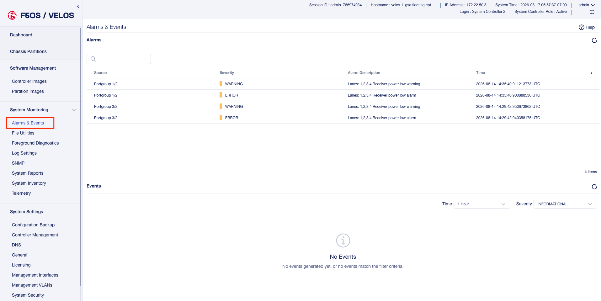

System Alerts via API
---------------------

Recent system level alerts can be accessed via the API. 

.. code-block:: bash

    GET https://{{System-Controller-IP}}:8888/restconf/data/openconfig-system:system/f5-event-log:events

The body of the response will look similar to the output below.

.. code-block:: json

    {
        "f5-event-log:events": {
            "event": [
                {
                    "log": "65543 controller-2 aom-fault EVENT NA \"LOP Runtime fault detected: LOP is not receiving health reports from all installed VFC cards\" \"2021-03-05 04:48:14.485125925 UTC\""
                },
                {
                    "log": "65543 controller-2 aom-fault CLEAR ERROR \"Fault detected in the AOM\" \"2021-03-05 04:48:14.605547335 UTC\""
                },
                {
                    "log": "65543 controller-2 aom-fault EVENT NA \"No LOP Runtime fault detected: LOP is not receiving health reports from all installed VFC cards\" \"2021-03-05 04:48:14.605590242 UTC\""
                },

System Controller Monitoring via CLI
------------------------------------

To see if the Openshift cluster is up and running use the **show cluster** command. You should see status for each installed blade and controller in the **Ready** state. Each section under **Stage Name** should show a **Status** of **Done**. During the bootup process you can monitor the status of the individual stages. The most recent Openshift logs are displayed, and you can determine if the chassis is healthy or having issues.

.. code-block:: bash

    syscon-2-active# show cluster 
    NAME          STATUS  TIME CREATED          ROLES         CPU  PODS  MEMORY      HUGEPAGES  
    --------------------------------------------------------------------------------------------
    blade-1       Ready   2021-01-30T21:50:32Z  compute       28   250   26112340Ki  102890Mi   
    blade-2       Ready   2021-01-16T08:20:08Z  compute       28   250   26112340Ki  102890Mi   
    blade-3       Ready   2021-01-30T21:50:31Z  compute       28   250   26112340Ki  102890Mi   
    controller-1  Ready   2020-12-08T21:09:45Z  infra,master  -    -     -           -          
    controller-2  Ready   2020-12-08T21:09:45Z  infra,master  -    -     -           -          

    STAGE NAME               STATUS  
    ---------------------------------
    AddingBlade              Done    
    HealthCheck              Done    
    HostedInstall            Done    
    MasterAdditionalInstall  Done    
    MasterInstall            Done    
    NodeBootstrap            Done    
    NodeJoin                 Done    
    Prerequisites            Done    
    ServiceCatalogInstall    Done    
    etcdInstall              Done    

    cluster cluster-status summary-status "Openshift cluster is healthy, and all controllers and blades are ready."
    INDEX  STATUS                                                                                      
    ---------------------------------------------------------------------------------------------------
    0      2021-02-06 18:19:59.445387 -  Orchestration manager startup.                                
    1      2021-02-06 18:20:15.219686 -  Orchestration manager transitioning to active.                
    2      2021-02-06 18:20:16.476607 -  Can now ping controller-1.chassis.local (10.1.3.51).          
    3      2021-02-06 18:20:26.863054 -  Can now ping controller-2.chassis.local (10.1.3.52).          
    4      2021-02-06 18:20:27.727600 -  Successfully ssh'd to CC controller-1.chassis.local.          
    5      2021-02-06 18:20:28.311630 -  Successfully ssh'd to CC controller-2.chassis.local.          
    6      2021-02-06 18:20:43.329803 -  Found valid DNS configuration on controller-2.chassis.local.  
    7      2021-02-06 18:21:23.039277 -  Can now ping blade blade-1.chassis.local (10.1.3.1).          
    8      2021-02-06 18:21:23.274312 -  Can now ping blade blade-2.chassis.local (10.1.3.2).          
    9      2021-02-06 18:21:23.520862 -  Can now ping blade blade-3.chassis.local (10.1.3.3).          
    10     2021-02-06 18:21:56.539448 -  Controller 1 is ready in openshift cluster.                   
    11     2021-02-06 18:21:56.539547 -  Controller 2 is ready in openshift cluster.                   
    12     2021-02-06 18:21:56.539583 -  Blade 1 is ready in openshift cluster.                        
    13     2021-02-06 18:21:56.539618 -  Blade 2 is ready in openshift cluster.                        
    14     2021-02-06 18:21:56.539652 -  Blade 3 is ready in openshift cluster.                        
    15     2021-02-06 18:21:56.539687 -  Openshift cluster is ready.                                   
    16     2021-02-06 18:21:56.541546 -  Successfully SSH'd to blade blade-1.chassis.local.            
    17     2021-02-06 18:21:56.970645 -  Successfully SSH'd to blade blade-2.chassis.local.            
    18     2021-02-06 18:21:57.492814 -  Successfully SSH'd to blade blade-3.chassis.local.            
    19     2021-02-06 18:21:58.312127 -  Openshift cluster is NOT ready.                               
    20     2021-02-06 18:22:19.060573 -  Openshift cluster is ready.                              

In the webUI a high-level status of the system controller HA state, and the ability to force a failover can be done from the **System Settings -> Controller Management** screen. Here you can see system controller 1 & 2 status, and role. You can optionally configure the type of failover with either auto (recommended) or Preferred node.  You can also force a failover from one system controller to the other and perform controller software upgrades. 

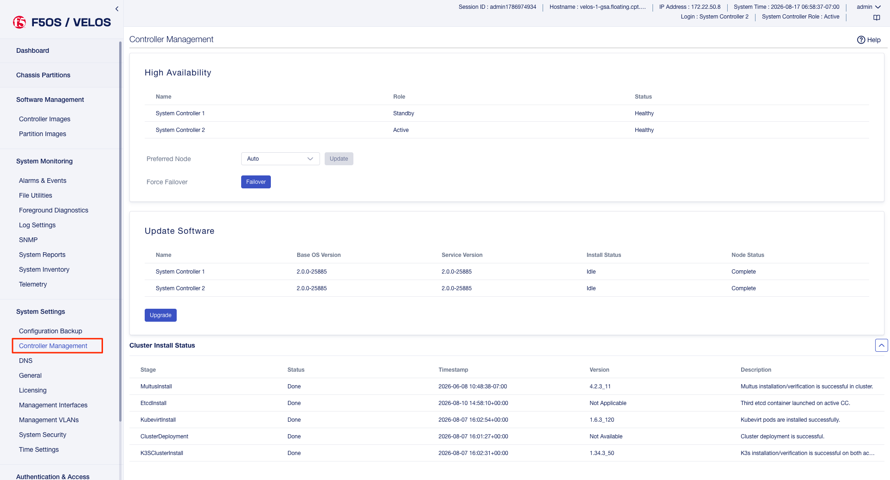

The dashboard in the system controller webUI also provides high level status of each controller and its current role.

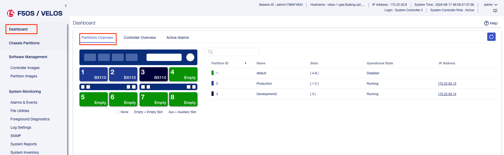

The **Controller View** section of the dashboard provides storage, memory, and CPU utilization for each system controller.

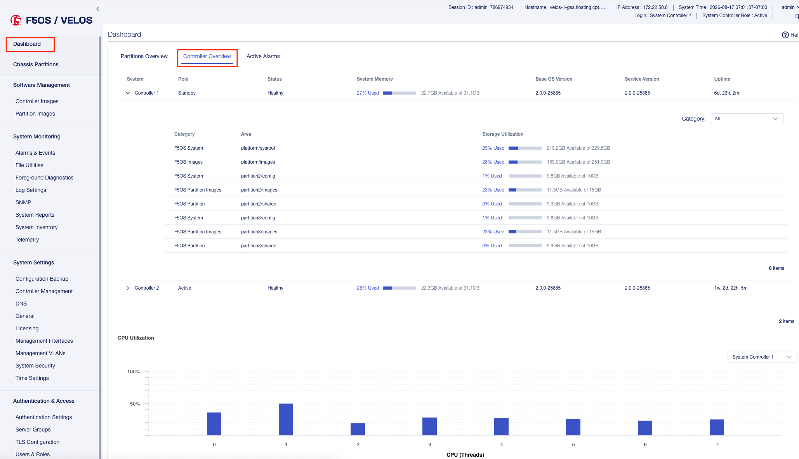

Active alarms & events can be viewed form the system controllers **System Settings > Alarms & Events** page:

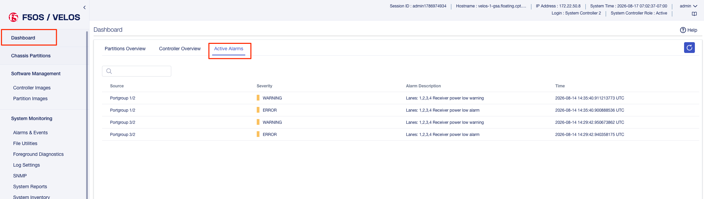

Monitoring the Layer2 Switch Fabric on the System Controllers
-------------------------------------------------------------

This section will outline what status should and can be monitored for the Layer2 switch fabric function on the system controllers. Administrators will want to monitor the internal and external interfaces and LAGs for both status and to view stats to understand current utilization. They will be looking to understand what the utilization of each port is and how is traffic balanced between the two switch fabrics on the system controllers. This section will detail what sort of monitoring is currently supported via CLI, webUI, API, and SNMP, and will also detail any altering, logging, or SNMP traps that are available.

Before getting into what monitoring is supported, it is important to understand how things connect and their labeling. The diagram below provides the internal interface numbering on the system controllers so that an admin can monitor the status and statistics of each interface. This will give them visibility into the traffic distribution across the backplane and dual switch fabrics.  Link Aggregation is configured on the blade side of the connection, but not on the system controller side. Note that the blade in slot 1 will have two connections, one to system controller 1 interface **1/3.1** and one to system controller 2 interface **2/3.1**, the numbering follows the same logic for other slots:

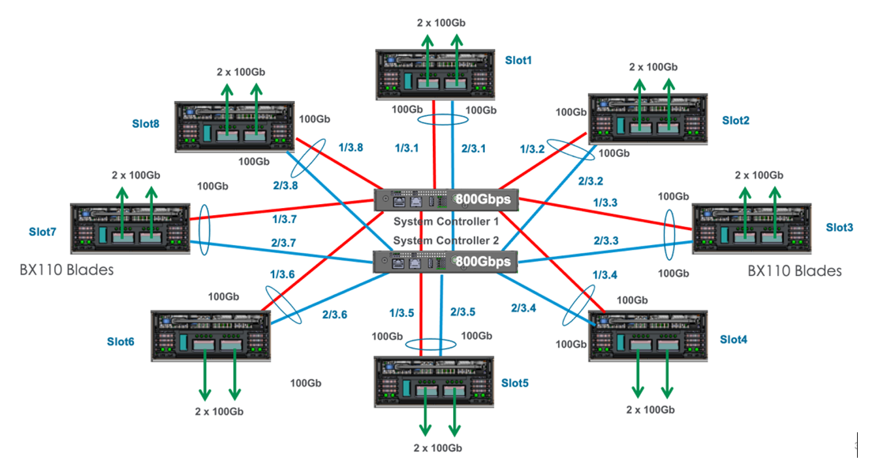

There are also separate control plane connections to each blade which are also put into Link Aggregation Group. Note that the blade in slot 1 will have two connections, one to system controller 1 interface **1/1.1** and one to system controller 2 interface **2/1.1**, the numbering follows the same logic for other slots:

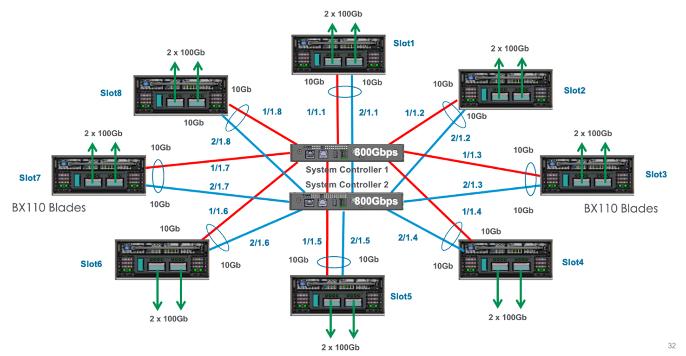

Those ports will be joined together in a LAG (Link Aggregation) bundle on the system controller side. Note the LAG connecting to slot 1 is labeled **cplagg_1.1**, slot2 is labeled **cplagg_1.2** etc…:

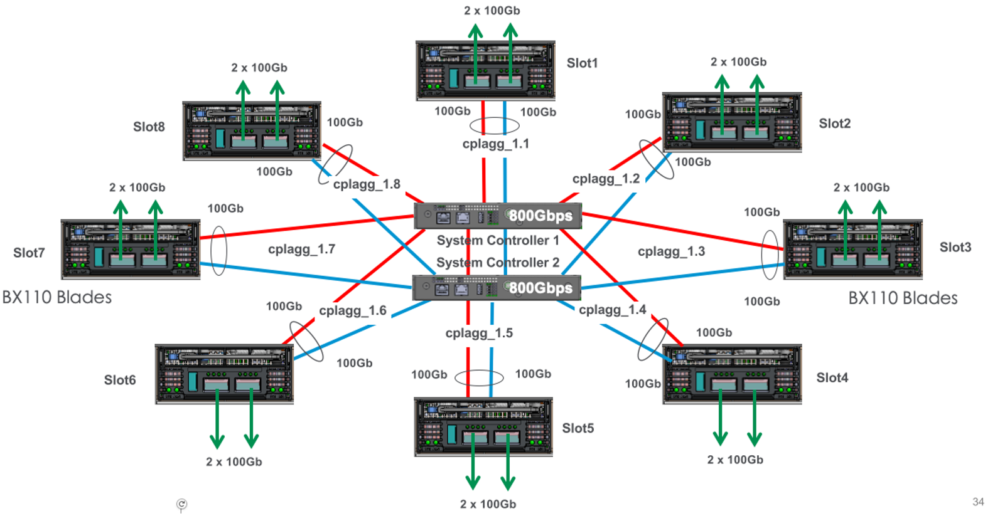

CLI Monitoring of the Layer2 Switch Fabric on the System Controllers
^^^^^^^^^^^^^^^^^^^^^^^^^^^^^^^^^^^^^^^^^^^^^^^^^^^^^^^^^^^^^^^^^^^^

There is a CLI command to monitor all the internal and external ports and LAGs on the dual system controllers as well as the out-of-band management ports. Below is a command to view the stats for one of the backplane ports of the system controller:

.. code-block:: bash

    syscon-2-active# show interfaces interface 1/1.1
    interfaces interface 1/1.1
    state name    1/1.1
    state type    ethernetCsmacd
    state loopback-mode false
    state enabled
    state ifindex 10
    state admin-status UP
    state oper-status UP
    state last-change 61612666625
    state counters in-octets 14937303301
    state counters in-pkts 64279377
    state counters in-unicast-pkts 46181461
    state counters in-broadcast-pkts 3495683
    state counters in-multicast-pkts 14602233
    state counters in-discards 553
    state counters in-errors 0
    state counters in-unknown-protos 0
    state counters in-fcs-errors 0
    state counters out-octets 13859445595
    state counters out-pkts 69051486
    state counters out-unicast-pkts 51154295
    state counters out-broadcast-pkts 13115083
    state counters out-multicast-pkts 4782108
    state counters out-discards 0
    state counters out-errors 0
    hold-time state up 0
    hold-time state down 0
    ethernet state mac-address 5a:a5:5a:01:01:01
    ethernet state auto-negotiate true
    ethernet state duplex-mode FULL
    ethernet state port-speed SPEED_10GB
    ethernet state enable-flow-control false
    ethernet state hw-mac-address 5a:a5:5a:01:01:01
    ethernet state counters in-mac-pause-frames 0
    ethernet state counters in-oversize-frames 3398952
    ethernet state counters in-jabber-frames 0
    ethernet state counters in-fragment-frames 0
    ethernet state counters in-8021q-frames 0
    ethernet state counters in-crc-errors 0
    ethernet state counters out-mac-pause-frames 0
    ethernet state counters out-8021q-frames 0

The **show lacp** CLI command will show both external LAG interfaces if the management ports are bonded together, and internal LAG’s to each slot. In the output below there are 3 blades installed in slots 1-3. They will be labeled **cplagg_1.<slot#>**. The name **mgmt_aggr** was provided by the admin when the LAG for the external management ports were configured. This name will be different depending on what the admin chooses for a name.

.. code-block:: bash

    syscon-1-active# show lacp
                                                                                                                                                                                                                                    PARTNER  LACP    LACP    LACP    LACP    LACP             
                                    LACP                     SYSTEM                                                                                                                       OPER                     PARTNER  PORT  PORT     IN      OUT     RX      TX      UNKNOWN  LACP    
    NAME        NAME        INTERVAL  MODE    SYSTEM ID MAC    PRIORITY  INTERFACE  INTERFACE  ACTIVITY  TIMEOUT  SYNCHRONIZATION  AGGREGATABLE  COLLECTING  DISTRIBUTING  SYSTEM ID        KEY   PARTNER ID         KEY      NUM   NUM      PKTS    PKTS    ERRORS  ERRORS  ERRORS   ERRORS  
    ------------------------------------------------------------------------------------------------------------------------------------------------------------------------------------------------------------------------------------------------------------------------------------------
    cplagg_1.1  cplagg_1.1  FAST      ACTIVE  0:a:49:ff:96:2   53248     1/1.1      1/1.1      ACTIVE    SHORT    IN_SYNC          true          true        true          0:a:49:ff:96:2   2     0:a:49:ff:96:2     0        4225  2        261162  259897  0       -       -        -       
                                                                        2/1.1      2/1.1      ACTIVE    SHORT    IN_SYNC          true          true        true          0:a:49:ff:96:2   2     0:a:49:ff:96:2     0        8321  4        260829  259557  0       -       -        -       
    cplagg_1.2  cplagg_1.2  FAST      ACTIVE  0:a:49:ff:95:22  53248     1/1.2      1/1.2      ACTIVE    SHORT    IN_SYNC          true          true        true          0:a:49:ff:95:22  3     0:a:49:ff:95:22    0        4226  2        261162  259897  0       -       -        -       
                                                                        2/1.2      2/1.2      ACTIVE    SHORT    IN_SYNC          true          true        true          0:a:49:ff:95:22  3     0:a:49:ff:95:22    0        8322  4        260829  259557  0       -       -        -       
    cplagg_1.3  cplagg_1.3  FAST      ACTIVE  0:a:49:ff:92:62  53248     1/1.3      1/1.3      ACTIVE    SHORT    IN_SYNC          true          true        true          0:a:49:ff:92:62  4     0:a:49:ff:92:62    0        4227  2        261162  259897  0       -       -        -       
                                                                        2/1.3      2/1.3      ACTIVE    SHORT    IN_SYNC          true          true        true          0:a:49:ff:92:62  4     0:a:49:ff:92:62    0        8323  4        260829  259558  0       -       -        -       
    cplagg_1.4  cplagg_1.4  FAST      ACTIVE  -                -                                                                                                                                                                                                                              
    cplagg_1.5  cplagg_1.5  FAST      ACTIVE  -                -                                                                                                                                                                                                                              
    cplagg_1.6  cplagg_1.6  FAST      ACTIVE  -                -                                                                                                                                                                                                                              
    cplagg_1.7  cplagg_1.7  FAST      ACTIVE  -                -                                                                                                                                                                                                                              
    cplagg_1.8  cplagg_1.8  FAST      ACTIVE  -                -                                                                                                                                                                                                                              
    mgmt-aggr   mgmt-aggr   SLOW      ACTIVE  0:94:a1:8e:d0:0  53248     1/mgmt0    1/mgmt0    ACTIVE    LONG     IN_SYNC          true          true        true          0:94:a1:8e:d0:0  10    44:4c:a8:bc:ca:77  10       4608  12       8708    259835  0       -       -        -       
                                                                        2/mgmt0    2/mgmt0    ACTIVE    LONG     IN_SYNC          true          true        true          0:94:a1:8e:d0:0  10    44:4c:a8:bc:ca:77  10       8704  11       8700    259506  0       -       -        -       

    syscon-1-active# 

webUI Monitoring of the Layer2 Switch Fabric on the System Controllers
^^^^^^^^^^^^^^^^^^^^^^^^^^^^^^^^^^^^^^^^^^^^^^^^^^^^^^^^^^^^^^^^^^^^

In the current release there is no backplane interface or LAG monitoring in the system controller webUI. You’ll need to use the CLI or API to get stats/status of the backplane ports or external management ports.

API Monitoring of the Layer2 Switch Fabric on the System Controllers
^^^^^^^^^^^^^^^^^^^^^^^^^^^^^^^^^^^^^^^^^^^^^^^^^^^^^^^^^^^^^^^^^^^^

The following API command will show all system controller Ethernet interfaces and link aggregation (both internal and external) as well as out-of-band management Interfaces.

.. code-block:: bash

    GET https://{{System-Controller-IP}}:8888/restconf/data/openconfig-interfaces:interfaces

The body of the response will look similar to the output below.

.. code-block:: json

    {
        "openconfig-interfaces:interfaces": {
            "interface": [
                {
                    "name": "1/1.1",
                    "config": {
                        "name": "1/1.1",
                        "type": "iana-if-type:ethernetCsmacd"
                    },
                    "state": {
                        "name": "1/1.1",
                        "type": "iana-if-type:ethernetCsmacd",
                        "loopback-mode": false,
                        "enabled": true,
                        "ifindex": 10,
                        "admin-status": "UP",
                        "oper-status": "UP",
                        "last-change": "92280482278",
                        "counters": {
                            "in-octets": "25930763576",
                            "in-pkts": "81611721",
                            "in-unicast-pkts": "80283080",
                            "in-broadcast-pkts": "1044199",
                            "in-multicast-pkts": "284442",
                            "in-discards": "234",
                            "in-errors": "0",
                            "in-unknown-protos": "0",
                            "in-fcs-errors": "0",
                            "out-octets": "4756887206",
                            "out-pkts": "14131402",
                            "out-unicast-pkts": "3522019",
                            "out-broadcast-pkts": "4997025",
                            "out-multicast-pkts": "5612358",
                            "out-discards": "0",
                            "out-errors": "0"
                        }
                    },
                    "hold-time": {
                        "state": {
                            "up": 0,
                            "down": 0
                        }
                    },
                    "openconfig-if-ethernet:ethernet": {
                        "config": {
                            "auto-negotiate": true,
                            "duplex-mode": "FULL",
                            "openconfig-if-aggregate:aggregate-id": "cplagg_1.1"
                        },
                        "state": {
                            "mac-address": "5a:a5:5a:01:01:01",
                            "auto-negotiate": true,
                            "duplex-mode": "FULL",
                            "port-speed": "openconfig-if-ethernet:SPEED_10GB",
                            "enable-flow-control": false,
                            "hw-mac-address": "5a:a5:5a:01:01:01",
                            "counters": {
                                "in-mac-pause-frames": "0",
                                "in-oversize-frames": "3768462",
                                "in-jabber-frames": "0",
                                "in-fragment-frames": "0",
                                "in-8021q-frames": "0",
                                "in-crc-errors": "0",
                                "out-mac-pause-frames": "0",
                                "out-8021q-frames": "0"
                            }
                        }
                    }
                },
                {
                    "name": "1/1.2",
                    "config": {
                        "name": "1/1.2",
                        "type": "iana-if-type:ethernetCsmacd"
                    },
                    "state": {
                        "name": "1/1.2",
                        "type": "iana-if-type:ethernetCsmacd",
                        "loopback-mode": false,
                        "enabled": true,
                        "ifindex": 11,
                        "admin-status": "UP",
                        "oper-status": "UP",
                        "last-change": "92285255781",
                        "counters": {
                            "in-octets": "56277978006",
                            "in-pkts": "88976020",
                            "in-unicast-pkts": "88696511",
                            "in-broadcast-pkts": "2220",
                            "in-multicast-pkts": "277289",
                            "in-discards": "161",
                            "in-errors": "0",
                            "in-unknown-protos": "0",
                            "in-fcs-errors": "0",
                            "out-octets": "13206772277",
                            "out-pkts": "32586877",
                            "out-unicast-pkts": "16699631",
                            "out-broadcast-pkts": "5189699",
                            "out-multicast-pkts": "10697547",
                            "out-discards": "0",
                            "out-errors": "0"
                        }
                    },
                    "hold-time": {
                        "state": {
                            "up": 0,
                            "down": 0
                        }
                    },
                    "openconfig-if-ethernet:ethernet": {
                        "config": {
                            "auto-negotiate": true,
                            "duplex-mode": "FULL",
                            "openconfig-if-aggregate:aggregate-id": "cplagg_1.2"
                        },
                        "state": {
                            "mac-address": "5a:a5:5a:01:01:02",
                            "auto-negotiate": true,
                            "duplex-mode": "FULL",
                            "port-speed": "openconfig-if-ethernet:SPEED_10GB",
                            "enable-flow-control": false,
                            "hw-mac-address": "5a:a5:5a:01:01:02",
                            "counters": {
                                "in-mac-pause-frames": "0",
                                "in-oversize-frames": "12417630",
                                "in-jabber-frames": "0",
                                "in-fragment-frames": "0",
                                "in-8021q-frames": "0",
                                "in-crc-errors": "0",
                                "out-mac-pause-frames": "0",
                                "out-8021q-frames": "0"
                            }
                        }
                    }
                },
                {
                    "name": "1/1.3",
                    "config": {
                        "name": "1/1.3",
                        "type": "iana-if-type:ethernetCsmacd"
                    },
                    "state": {
                        "name": "1/1.3",
                        "type": "iana-if-type:ethernetCsmacd",
                        "loopback-mode": false,
                        "enabled": true,
                        "ifindex": 2,
                        "admin-status": "UP",
                        "oper-status": "UP",
                        "last-change": "92275142893",
                        "counters": {
                            "in-octets": "354634359",
                            "in-pkts": "2641151",
                            "in-unicast-pkts": "2368952",
                            "in-broadcast-pkts": "2095",
                            "in-multicast-pkts": "270104",
                            "in-discards": "108",
                            "in-errors": "0",
                            "in-unknown-protos": "0",
                            "in-fcs-errors": "0",
                            "out-octets": "2988733076",
                            "out-pkts": "10658051",
                            "out-unicast-pkts": "6410863",
                            "out-broadcast-pkts": "3858086",
                            "out-multicast-pkts": "389102",
                            "out-discards": "0",
                            "out-errors": "0"
                        }
                    },
                    "hold-time": {
                        "state": {
                            "up": 0,
                            "down": 0
                        }
                    },
                    "openconfig-if-ethernet:ethernet": {
                        "config": {
                            "auto-negotiate": true,
                            "duplex-mode": "FULL",
                            "openconfig-if-aggregate:aggregate-id": "cplagg_1.3"
                        },
                        "state": {
                            "mac-address": "5a:a5:5a:01:01:03",
                            "auto-negotiate": true,
                            "duplex-mode": "FULL",
                            "port-speed": "openconfig-if-ethernet:SPEED_10GB",
                            "enable-flow-control": false,
                            "hw-mac-address": "5a:a5:5a:01:01:03",
                            "counters": {
                                "in-mac-pause-frames": "0",
                                "in-oversize-frames": "0",
                                "in-jabber-frames": "0",
                                "in-fragment-frames": "0",
                                "in-8021q-frames": "0",
                                "in-crc-errors": "0",
                                "out-mac-pause-frames": "0",
                                "out-8021q-frames": "0"
                            }
                        }
                    }
                },
                {
                    "name": "1/1.4",
                    "config": {
                        "name": "1/1.4",
                        "type": "iana-if-type:ethernetCsmacd"
                    },
                    "state": {
                        "name": "1/1.4",
                        "type": "iana-if-type:ethernetCsmacd",
                        "loopback-mode": false,
                        "enabled": true,
                        "ifindex": 3,
                        "admin-status": "UP",
                        "oper-status": "DOWN",
                        "counters": {
                            "in-octets": "0",
                            "in-pkts": "0",
                            "in-unicast-pkts": "0",
                            "in-broadcast-pkts": "0",
                            "in-multicast-pkts": "0",
                            "in-discards": "0",
                            "in-errors": "0",
                            "in-unknown-protos": "0",
                            "in-fcs-errors": "0",
                            "out-octets": "0",
                            "out-pkts": "0",
                            "out-unicast-pkts": "0",
                            "out-broadcast-pkts": "0",
                            "out-multicast-pkts": "0",
                            "out-discards": "0",
                            "out-errors": "0"
                        }
                    },
                    "hold-time": {
                        "state": {
                            "up": 0,
                            "down": 0
                        }
                    },
                    "openconfig-if-ethernet:ethernet": {
                        "config": {
                            "auto-negotiate": true,
                            "duplex-mode": "FULL",
                            "openconfig-if-aggregate:aggregate-id": "cplagg_1.4"
                        },
                        "state": {
                            "mac-address": "5a:a5:5a:01:01:04",
                            "auto-negotiate": true,
                            "duplex-mode": "FULL",
                            "port-speed": "openconfig-if-ethernet:SPEED_UNKNOWN",
                            "enable-flow-control": false,
                            "hw-mac-address": "5a:a5:5a:01:01:04",
                            "counters": {
                                "in-mac-pause-frames": "0",
                                "in-oversize-frames": "0",
                                "in-jabber-frames": "0",
                                "in-fragment-frames": "0",
                                "in-8021q-frames": "0",
                                "in-crc-errors": "0",
                                "out-mac-pause-frames": "0",
                                "out-8021q-frames": "0"
                            }
                        }
                    }
                },
                {
                    "name": "1/1.5",
                    "config": {
                        "name": "1/1.5",
                        "type": "iana-if-type:ethernetCsmacd"
                    },
                    "state": {
                        "name": "1/1.5",
                        "type": "iana-if-type:ethernetCsmacd",
                        "loopback-mode": false,
                        "enabled": true,
                        "ifindex": 12,
                        "admin-status": "UP",
                        "oper-status": "DOWN",
                        "counters": {
                            "in-octets": "0",
                            "in-pkts": "0",
                            "in-unicast-pkts": "0",
                            "in-broadcast-pkts": "0",
                            "in-multicast-pkts": "0",
                            "in-discards": "0",
                            "in-errors": "0",
                            "in-unknown-protos": "0",
                            "in-fcs-errors": "0",
                            "out-octets": "0",
                            "out-pkts": "0",
                            "out-unicast-pkts": "0",
                            "out-broadcast-pkts": "0",
                            "out-multicast-pkts": "0",
                            "out-discards": "0",
                            "out-errors": "0"
                        }
                    },
                    "hold-time": {
                        "state": {
                            "up": 0,
                            "down": 0
                        }
                    },
                    "openconfig-if-ethernet:ethernet": {
                        "config": {
                            "auto-negotiate": true,
                            "duplex-mode": "FULL",
                            "openconfig-if-aggregate:aggregate-id": "cplagg_1.5"
                        },
                        "state": {
                            "mac-address": "5a:a5:5a:01:01:05",
                            "auto-negotiate": true,
                            "duplex-mode": "FULL",
                            "port-speed": "openconfig-if-ethernet:SPEED_UNKNOWN",
                            "enable-flow-control": false,
                            "hw-mac-address": "5a:a5:5a:01:01:05",
                            "counters": {
                                "in-mac-pause-frames": "0",
                                "in-oversize-frames": "0",
                                "in-jabber-frames": "0",
                                "in-fragment-frames": "0",
                                "in-8021q-frames": "0",
                                "in-crc-errors": "0",
                                "out-mac-pause-frames": "0",
                                "out-8021q-frames": "0"
                            }
                        }
                    }
                },
                {
                    "name": "1/1.6",
                    "config": {
                        "name": "1/1.6",
                        "type": "iana-if-type:ethernetCsmacd"
                    },
                    "state": {
                        "name": "1/1.6",
                        "type": "iana-if-type:ethernetCsmacd",
                        "loopback-mode": false,
                        "enabled": true,
                        "ifindex": 13,
                        "admin-status": "UP",
                        "oper-status": "DOWN",
                        "counters": {
                            "in-octets": "0",
                            "in-pkts": "0",
                            "in-unicast-pkts": "0",
                            "in-broadcast-pkts": "0",
                            "in-multicast-pkts": "0",
                            "in-discards": "0",
                            "in-errors": "0",
                            "in-unknown-protos": "0",
                            "in-fcs-errors": "0",
                            "out-octets": "0",
                            "out-pkts": "0",
                            "out-unicast-pkts": "0",
                            "out-broadcast-pkts": "0",
                            "out-multicast-pkts": "0",
                            "out-discards": "0",
                            "out-errors": "0"
                        }
                    },
                    "hold-time": {
                        "state": {
                            "up": 0,
                            "down": 0
                        }
                    },
                    "openconfig-if-ethernet:ethernet": {
                        "config": {
                            "auto-negotiate": true,
                            "duplex-mode": "FULL",
                            "openconfig-if-aggregate:aggregate-id": "cplagg_1.6"
                        },
                        "state": {
                            "mac-address": "5a:a5:5a:01:01:06",
                            "auto-negotiate": true,
                            "duplex-mode": "FULL",
                            "port-speed": "openconfig-if-ethernet:SPEED_UNKNOWN",
                            "enable-flow-control": false,
                            "hw-mac-address": "5a:a5:5a:01:01:06",
                            "counters": {
                                "in-mac-pause-frames": "0",
                                "in-oversize-frames": "0",
                                "in-jabber-frames": "0",
                                "in-fragment-frames": "0",
                                "in-8021q-frames": "0",
                                "in-crc-errors": "0",
                                "out-mac-pause-frames": "0",
                                "out-8021q-frames": "0"
                            }
                        }
                    }
                },
                {
                    "name": "1/1.7",
                    "config": {
                        "name": "1/1.7",
                        "type": "iana-if-type:ethernetCsmacd"
                    },
                    "state": {
                        "name": "1/1.7",
                        "type": "iana-if-type:ethernetCsmacd",
                        "loopback-mode": false,
                        "enabled": true,
                        "ifindex": 4,
                        "admin-status": "UP",
                        "oper-status": "DOWN",
                        "counters": {
                            "in-octets": "0",
                            "in-pkts": "0",
                            "in-unicast-pkts": "0",
                            "in-broadcast-pkts": "0",
                            "in-multicast-pkts": "0",
                            "in-discards": "0",
                            "in-errors": "0",
                            "in-unknown-protos": "0",
                            "in-fcs-errors": "0",
                            "out-octets": "0",
                            "out-pkts": "0",
                            "out-unicast-pkts": "0",
                            "out-broadcast-pkts": "0",
                            "out-multicast-pkts": "0",
                            "out-discards": "0",
                            "out-errors": "0"
                        }
                    },
                    "hold-time": {
                        "state": {
                            "up": 0,
                            "down": 0
                        }
                    },
                    "openconfig-if-ethernet:ethernet": {
                        "config": {
                            "auto-negotiate": true,
                            "duplex-mode": "FULL",
                            "openconfig-if-aggregate:aggregate-id": "cplagg_1.7"
                        },
                        "state": {
                            "mac-address": "5a:a5:5a:01:01:07",
                            "auto-negotiate": true,
                            "duplex-mode": "FULL",
                            "port-speed": "openconfig-if-ethernet:SPEED_UNKNOWN",
                            "enable-flow-control": false,
                            "hw-mac-address": "5a:a5:5a:01:01:07",
                            "counters": {
                                "in-mac-pause-frames": "0",
                                "in-oversize-frames": "0",
                                "in-jabber-frames": "0",
                                "in-fragment-frames": "0",
                                "in-8021q-frames": "0",
                                "in-crc-errors": "0",
                                "out-mac-pause-frames": "0",
                                "out-8021q-frames": "0"
                            }
                        }
                    }
                },
                {
                    "name": "1/1.8",
                    "config": {
                        "name": "1/1.8",
                        "type": "iana-if-type:ethernetCsmacd"
                    },
                    "state": {
                        "name": "1/1.8",
                        "type": "iana-if-type:ethernetCsmacd",
                        "loopback-mode": false,
                        "enabled": true,
                        "ifindex": 5,
                        "admin-status": "UP",
                        "oper-status": "DOWN",
                        "counters": {
                            "in-octets": "0",
                            "in-pkts": "0",
                            "in-unicast-pkts": "0",
                            "in-broadcast-pkts": "0",
                            "in-multicast-pkts": "0",
                            "in-discards": "0",
                            "in-errors": "0",
                            "in-unknown-protos": "0",
                            "in-fcs-errors": "0",
                            "out-octets": "0",
                            "out-pkts": "0",
                            "out-unicast-pkts": "0",
                            "out-broadcast-pkts": "0",
                            "out-multicast-pkts": "0",
                            "out-discards": "0",
                            "out-errors": "0"
                        }
                    },
                    "hold-time": {
                        "state": {
                            "up": 0,
                            "down": 0
                        }
                    },
                    "openconfig-if-ethernet:ethernet": {
                        "config": {
                            "auto-negotiate": true,
                            "duplex-mode": "FULL",
                            "openconfig-if-aggregate:aggregate-id": "cplagg_1.8"
                        },
                        "state": {
                            "mac-address": "5a:a5:5a:01:01:08",
                            "auto-negotiate": true,
                            "duplex-mode": "FULL",
                            "port-speed": "openconfig-if-ethernet:SPEED_UNKNOWN",
                            "enable-flow-control": false,
                            "hw-mac-address": "5a:a5:5a:01:01:08",
                            "counters": {
                                "in-mac-pause-frames": "0",
                                "in-oversize-frames": "0",
                                "in-jabber-frames": "0",
                                "in-fragment-frames": "0",
                                "in-8021q-frames": "0",
                                "in-crc-errors": "0",
                                "out-mac-pause-frames": "0",
                                "out-8021q-frames": "0"
                            }
                        }
                    }
                },
                {
                    "name": "1/2.2",
                    "config": {
                        "name": "1/2.2",
                        "type": "iana-if-type:ethernetCsmacd"
                    },
                    "state": {
                        "name": "1/2.2",
                        "type": "iana-if-type:ethernetCsmacd",
                        "loopback-mode": false,
                        "enabled": true,
                        "ifindex": 16,
                        "admin-status": "UP",
                        "oper-status": "UP",
                        "last-change": "92290207170",
                        "counters": {
                            "in-octets": "35926728797",
                            "in-pkts": "62373338",
                            "in-unicast-pkts": "61424422",
                            "in-broadcast-pkts": "948836",
                            "in-multicast-pkts": "80",
                            "in-discards": "1420",
                            "in-errors": "0",
                            "in-unknown-protos": "0",
                            "in-fcs-errors": "0",
                            "out-octets": "18308927413",
                            "out-pkts": "75484207",
                            "out-unicast-pkts": "52192600",
                            "out-broadcast-pkts": "7630195",
                            "out-multicast-pkts": "15661412",
                            "out-discards": "0",
                            "out-errors": "0"
                        }
                    },
                    "hold-time": {
                        "state": {
                            "up": 0,
                            "down": 0
                        }
                    },
                    "openconfig-if-ethernet:ethernet": {
                        "config": {
                            "auto-negotiate": true,
                            "duplex-mode": "FULL"
                        },
                        "state": {
                            "mac-address": "5a:a5:5a:01:02:02",
                            "auto-negotiate": true,
                            "duplex-mode": "FULL",
                            "port-speed": "openconfig-if-ethernet:SPEED_10GB",
                            "enable-flow-control": false,
                            "hw-mac-address": "5a:a5:5a:01:02:02",
                            "counters": {
                                "in-mac-pause-frames": "0",
                                "in-oversize-frames": "777070",
                                "in-jabber-frames": "0",
                                "in-fragment-frames": "0",
                                "in-8021q-frames": "0",
                                "in-crc-errors": "0",
                                "out-mac-pause-frames": "0",
                                "out-8021q-frames": "0"
                            }
                        }
                    }
                },
                {
                    "name": "1/2.3",
                    "config": {
                        "name": "1/2.3",
                        "type": "iana-if-type:ethernetCsmacd"
                    },
                    "state": {
                        "name": "1/2.3",
                        "type": "iana-if-type:ethernetCsmacd",
                        "loopback-mode": false,
                        "enabled": true,
                        "ifindex": 17,
                        "admin-status": "UP",
                        "oper-status": "UP",
                        "last-change": "92294856723",
                        "counters": {
                            "in-octets": "35903131962",
                            "in-pkts": "62358618",
                            "in-unicast-pkts": "61409038",
                            "in-broadcast-pkts": "949512",
                            "in-multicast-pkts": "68",
                            "in-discards": "1408",
                            "in-errors": "0",
                            "in-unknown-protos": "0",
                            "in-fcs-errors": "0",
                            "out-octets": "10144687997",
                            "out-pkts": "48994975",
                            "out-unicast-pkts": "48994866",
                            "out-broadcast-pkts": "53",
                            "out-multicast-pkts": "56",
                            "out-discards": "0",
                            "out-errors": "0"
                        }
                    },
                    "hold-time": {
                        "state": {
                            "up": 0,
                            "down": 0
                        }
                    },
                    "openconfig-if-ethernet:ethernet": {
                        "config": {
                            "auto-negotiate": true,
                            "duplex-mode": "FULL"
                        },
                        "state": {
                            "mac-address": "5a:a5:5a:01:02:03",
                            "auto-negotiate": true,
                            "duplex-mode": "FULL",
                            "port-speed": "openconfig-if-ethernet:SPEED_10GB",
                            "enable-flow-control": false,
                            "hw-mac-address": "5a:a5:5a:01:02:03",
                            "counters": {
                                "in-mac-pause-frames": "0",
                                "in-oversize-frames": "0",
                                "in-jabber-frames": "0",
                                "in-fragment-frames": "0",
                                "in-8021q-frames": "0",
                                "in-crc-errors": "0",
                                "out-mac-pause-frames": "0",
                                "out-8021q-frames": "0"
                            }
                        }
                    }
                },
                {
                    "name": "1/2.4",
                    "config": {
                        "name": "1/2.4",
                        "type": "iana-if-type:ethernetCsmacd"
                    },
                    "state": {
                        "name": "1/2.4",
                        "type": "iana-if-type:ethernetCsmacd",
                        "loopback-mode": false,
                        "enabled": true,
                        "ifindex": 18,
                        "admin-status": "UP",
                        "oper-status": "UP",
                        "last-change": "92299535013",
                        "counters": {
                            "in-octets": "35887746555",
                            "in-pkts": "62347891",
                            "in-unicast-pkts": "61400563",
                            "in-broadcast-pkts": "947247",
                            "in-multicast-pkts": "81",
                            "in-discards": "1412",
                            "in-errors": "0",
                            "in-unknown-protos": "0",
                            "in-fcs-errors": "0",
                            "out-octets": "9947112430",
                            "out-pkts": "47524506",
                            "out-unicast-pkts": "47524403",
                            "out-broadcast-pkts": "53",
                            "out-multicast-pkts": "50",
                            "out-discards": "0",
                            "out-errors": "0"
                        }
                    },
                    "hold-time": {
                        "state": {
                            "up": 0,
                            "down": 0
                        }
                    },
                    "openconfig-if-ethernet:ethernet": {
                        "config": {
                            "auto-negotiate": true,
                            "duplex-mode": "FULL"
                        },
                        "state": {
                            "mac-address": "5a:a5:5a:01:02:04",
                            "auto-negotiate": true,
                            "duplex-mode": "FULL",
                            "port-speed": "openconfig-if-ethernet:SPEED_10GB",
                            "enable-flow-control": false,
                            "hw-mac-address": "5a:a5:5a:01:02:04",
                            "counters": {
                                "in-mac-pause-frames": "0",
                                "in-oversize-frames": "0",
                                "in-jabber-frames": "0",
                                "in-fragment-frames": "0",
                                "in-8021q-frames": "0",
                                "in-crc-errors": "0",
                                "out-mac-pause-frames": "0",
                                "out-8021q-frames": "0"
                            }
                        }
                    }
                },
                {
                    "name": "1/2.5",
                    "config": {
                        "name": "1/2.5",
                        "type": "iana-if-type:ethernetCsmacd"
                    },
                    "state": {
                        "name": "1/2.5",
                        "type": "iana-if-type:ethernetCsmacd",
                        "loopback-mode": false,
                        "enabled": true,
                        "ifindex": 20,
                        "admin-status": "UP",
                        "oper-status": "UP",
                        "last-change": "525159521784",
                        "counters": {
                            "in-octets": "39187630636",
                            "in-pkts": "156665808",
                            "in-unicast-pkts": "146241632",
                            "in-broadcast-pkts": "5146811",
                            "in-multicast-pkts": "5277365",
                            "in-discards": "357",
                            "in-errors": "0",
                            "in-unknown-protos": "0",
                            "in-fcs-errors": "0",
                            "out-octets": "131905256742",
                            "out-pkts": "191440059",
                            "out-unicast-pkts": "187741861",
                            "out-broadcast-pkts": "3664321",
                            "out-multicast-pkts": "33877",
                            "out-discards": "0",
                            "out-errors": "0"
                        }
                    },
                    "hold-time": {
                        "state": {
                            "up": 0,
                            "down": 0
                        }
                    },
                    "openconfig-if-ethernet:ethernet": {
                        "config": {
                            "auto-negotiate": true,
                            "duplex-mode": "FULL"
                        },
                        "state": {
                            "mac-address": "5a:a5:5a:01:02:05",
                            "auto-negotiate": false,
                            "duplex-mode": "FULL",
                            "port-speed": "openconfig-if-ethernet:SPEED_25GB",
                            "enable-flow-control": false,
                            "hw-mac-address": "5a:a5:5a:01:02:05",
                            "counters": {
                                "in-mac-pause-frames": "0",
                                "in-oversize-frames": "67713732",
                                "in-jabber-frames": "0",
                                "in-fragment-frames": "0",
                                "in-8021q-frames": "0",
                                "in-crc-errors": "0",
                                "out-mac-pause-frames": "0",
                                "out-8021q-frames": "0"
                            }
                        }
                    }
                },
                {
                    "name": "1/2.6",
                    "config": {
                        "name": "1/2.6",
                        "type": "iana-if-type:ethernetCsmacd"
                    },
                    "state": {
                        "name": "1/2.6",
                        "type": "iana-if-type:ethernetCsmacd",
                        "loopback-mode": false,
                        "enabled": true,
                        "ifindex": 21,
                        "admin-status": "UP",
                        "oper-status": "UP",
                        "last-change": "525170483866",
                        "counters": {
                            "in-octets": "3506406963",
                            "in-pkts": "11491114",
                            "in-unicast-pkts": "284319",
                            "in-broadcast-pkts": "896187",
                            "in-multicast-pkts": "10310608",
                            "in-discards": "278",
                            "in-errors": "0",
                            "in-unknown-protos": "0",
                            "in-fcs-errors": "0",
                            "out-octets": "56632515503",
                            "out-pkts": "73518479",
                            "out-unicast-pkts": "72742834",
                            "out-broadcast-pkts": "755683",
                            "out-multicast-pkts": "19962",
                            "out-discards": "0",
                            "out-errors": "0"
                        }
                    },
                    "hold-time": {
                        "state": {
                            "up": 0,
                            "down": 0
                        }
                    },
                    "openconfig-if-ethernet:ethernet": {
                        "config": {
                            "auto-negotiate": true,
                            "duplex-mode": "FULL"
                        },
                        "state": {
                            "mac-address": "5a:a5:5a:01:02:06",
                            "auto-negotiate": false,
                            "duplex-mode": "FULL",
                            "port-speed": "openconfig-if-ethernet:SPEED_25GB",
                            "enable-flow-control": false,
                            "hw-mac-address": "5a:a5:5a:01:02:06",
                            "counters": {
                                "in-mac-pause-frames": "0",
                                "in-oversize-frames": "12398399",
                                "in-jabber-frames": "0",
                                "in-fragment-frames": "0",
                                "in-8021q-frames": "0",
                                "in-crc-errors": "0",
                                "out-mac-pause-frames": "0",
                                "out-8021q-frames": "0"
                            }
                        }
                    }
                },
                {
                    "name": "1/3.1",
                    "config": {
                        "name": "1/3.1",
                        "type": "iana-if-type:ethernetCsmacd"
                    },
                    "state": {
                        "name": "1/3.1",
                        "type": "iana-if-type:ethernetCsmacd",
                        "loopback-mode": false,
                        "enabled": true,
                        "ifindex": 1,
                        "admin-status": "UP",
                        "oper-status": "UP",
                        "last-change": "95362054354",
                        "counters": {
                            "in-octets": "4439535522366",
                            "in-pkts": "52226052570",
                            "in-unicast-pkts": "52147390412",
                            "in-broadcast-pkts": "363",
                            "in-multicast-pkts": "78661795",
                            "in-discards": "0",
                            "in-errors": "0",
                            "in-unknown-protos": "0",
                            "in-fcs-errors": "0",
                            "out-octets": "4439666219327",
                            "out-pkts": "52227806487",
                            "out-unicast-pkts": "52149161038",
                            "out-broadcast-pkts": "1542",
                            "out-multicast-pkts": "78643907",
                            "out-discards": "0",
                            "out-errors": "0"
                        }
                    },
                    "hold-time": {
                        "state": {
                            "up": 0,
                            "down": 0
                        }
                    },
                    "openconfig-if-ethernet:ethernet": {
                        "config": {
                            "auto-negotiate": true,
                            "duplex-mode": "FULL"
                        },
                        "state": {
                            "mac-address": "5a:a5:5a:01:03:01",
                            "auto-negotiate": false,
                            "duplex-mode": "FULL",
                            "port-speed": "openconfig-if-ethernet:SPEED_UNKNOWN",
                            "enable-flow-control": false,
                            "hw-mac-address": "5a:a5:5a:01:03:01",
                            "counters": {
                                "in-mac-pause-frames": "0",
                                "in-oversize-frames": "32",
                                "in-jabber-frames": "0",
                                "in-fragment-frames": "0",
                                "in-8021q-frames": "0",
                                "in-crc-errors": "0",
                                "out-mac-pause-frames": "0",
                                "out-8021q-frames": "0"
                            }
                        }
                    }
                },
                {
                    "name": "1/3.2",
                    "config": {
                        "name": "1/3.2",
                        "type": "iana-if-type:ethernetCsmacd"
                    },
                    "state": {
                        "name": "1/3.2",
                        "type": "iana-if-type:ethernetCsmacd",
                        "loopback-mode": false,
                        "enabled": true,
                        "ifindex": 105,
                        "admin-status": "UP",
                        "oper-status": "UP",
                        "last-change": "95371605787",
                        "counters": {
                            "in-octets": "4439666243467",
                            "in-pkts": "52227806760",
                            "in-unicast-pkts": "52149161311",
                            "in-broadcast-pkts": "1542",
                            "in-multicast-pkts": "78643907",
                            "in-discards": "0",
                            "in-errors": "0",
                            "in-unknown-protos": "0",
                            "in-fcs-errors": "0",
                            "out-octets": "4439535546761",
                            "out-pkts": "52226052867",
                            "out-unicast-pkts": "52147390709",
                            "out-broadcast-pkts": "363",
                            "out-multicast-pkts": "78661795",
                            "out-discards": "0",
                            "out-errors": "0"
                        }
                    },
                    "hold-time": {
                        "state": {
                            "up": 0,
                            "down": 0
                        }
                    },
                    "openconfig-if-ethernet:ethernet": {
                        "config": {
                            "auto-negotiate": true,
                            "duplex-mode": "FULL"
                        },
                        "state": {
                            "mac-address": "5a:a5:5a:01:03:02",
                            "auto-negotiate": false,
                            "duplex-mode": "FULL",
                            "port-speed": "openconfig-if-ethernet:SPEED_UNKNOWN",
                            "enable-flow-control": false,
                            "hw-mac-address": "5a:a5:5a:01:03:02",
                            "counters": {
                                "in-mac-pause-frames": "0",
                                "in-oversize-frames": "32",
                                "in-jabber-frames": "0",
                                "in-fragment-frames": "0",
                                "in-8021q-frames": "0",
                                "in-crc-errors": "0",
                                "out-mac-pause-frames": "0",
                                "out-8021q-frames": "0"
                            }
                        }
                    }
                },
                {
                    "name": "1/3.3",
                    "config": {
                        "name": "1/3.3",
                        "type": "iana-if-type:ethernetCsmacd"
                    },
                    "state": {
                        "name": "1/3.3",
                        "type": "iana-if-type:ethernetCsmacd",
                        "loopback-mode": false,
                        "enabled": true,
                        "ifindex": 85,
                        "admin-status": "UP",
                        "oper-status": "UP",
                        "last-change": "95367435112",
                        "counters": {
                            "in-octets": "2403516",
                            "in-pkts": "11032",
                            "in-unicast-pkts": "0",
                            "in-broadcast-pkts": "1905",
                            "in-multicast-pkts": "9127",
                            "in-discards": "11032",
                            "in-errors": "0",
                            "in-unknown-protos": "0",
                            "in-fcs-errors": "0",
                            "out-octets": "0",
                            "out-pkts": "0",
                            "out-unicast-pkts": "0",
                            "out-broadcast-pkts": "0",
                            "out-multicast-pkts": "0",
                            "out-discards": "0",
                            "out-errors": "0"
                        }
                    },
                    "hold-time": {
                        "state": {
                            "up": 0,
                            "down": 0
                        }
                    },
                    "openconfig-if-ethernet:ethernet": {
                        "config": {
                            "auto-negotiate": true,
                            "duplex-mode": "FULL"
                        },
                        "state": {
                            "mac-address": "5a:a5:5a:01:03:03",
                            "auto-negotiate": false,
                            "duplex-mode": "FULL",
                            "port-speed": "openconfig-if-ethernet:SPEED_UNKNOWN",
                            "enable-flow-control": false,
                            "hw-mac-address": "5a:a5:5a:01:03:03",
                            "counters": {
                                "in-mac-pause-frames": "0",
                                "in-oversize-frames": "0",
                                "in-jabber-frames": "0",
                                "in-fragment-frames": "0",
                                "in-8021q-frames": "0",
                                "in-crc-errors": "0",
                                "out-mac-pause-frames": "0",
                                "out-8021q-frames": "0"
                            }
                        }
                    }
                },
                {
                    "name": "1/3.4",
                    "config": {
                        "name": "1/3.4",
                        "type": "iana-if-type:ethernetCsmacd"
                    },
                    "state": {
                        "name": "1/3.4",
                        "type": "iana-if-type:ethernetCsmacd",
                        "loopback-mode": false,
                        "enabled": true,
                        "ifindex": 53,
                        "admin-status": "UP",
                        "oper-status": "DOWN",
                        "counters": {
                            "in-octets": "0",
                            "in-pkts": "0",
                            "in-unicast-pkts": "0",
                            "in-broadcast-pkts": "0",
                            "in-multicast-pkts": "0",
                            "in-discards": "0",
                            "in-errors": "0",
                            "in-unknown-protos": "0",
                            "in-fcs-errors": "0",
                            "out-octets": "0",
                            "out-pkts": "0",
                            "out-unicast-pkts": "0",
                            "out-broadcast-pkts": "0",
                            "out-multicast-pkts": "0",
                            "out-discards": "0",
                            "out-errors": "0"
                        }
                    },
                    "hold-time": {
                        "state": {
                            "up": 0,
                            "down": 0
                        }
                    },
                    "openconfig-if-ethernet:ethernet": {
                        "config": {
                            "auto-negotiate": true,
                            "duplex-mode": "FULL"
                        },
                        "state": {
                            "mac-address": "5a:a5:5a:01:03:04",
                            "auto-negotiate": false,
                            "duplex-mode": "FULL",
                            "port-speed": "openconfig-if-ethernet:SPEED_25GB",
                            "enable-flow-control": false,
                            "hw-mac-address": "5a:a5:5a:01:03:04",
                            "counters": {
                                "in-mac-pause-frames": "0",
                                "in-oversize-frames": "0",
                                "in-jabber-frames": "0",
                                "in-fragment-frames": "0",
                                "in-8021q-frames": "0",
                                "in-crc-errors": "0",
                                "out-mac-pause-frames": "0",
                                "out-8021q-frames": "0"
                            }
                        }
                    }
                },
                {
                    "name": "1/3.5",
                    "config": {
                        "name": "1/3.5",
                        "type": "iana-if-type:ethernetCsmacd"
                    },
                    "state": {
                        "name": "1/3.5",
                        "type": "iana-if-type:ethernetCsmacd",
                        "loopback-mode": false,
                        "enabled": true,
                        "ifindex": 9,
                        "admin-status": "UP",
                        "oper-status": "DOWN",
                        "counters": {
                            "in-octets": "0",
                            "in-pkts": "0",
                            "in-unicast-pkts": "0",
                            "in-broadcast-pkts": "0",
                            "in-multicast-pkts": "0",
                            "in-discards": "0",
                            "in-errors": "0",
                            "in-unknown-protos": "0",
                            "in-fcs-errors": "0",
                            "out-octets": "0",
                            "out-pkts": "0",
                            "out-unicast-pkts": "0",
                            "out-broadcast-pkts": "0",
                            "out-multicast-pkts": "0",
                            "out-discards": "0",
                            "out-errors": "0"
                        }
                    },
                    "hold-time": {
                        "state": {
                            "up": 0,
                            "down": 0
                        }
                    },
                    "openconfig-if-ethernet:ethernet": {
                        "config": {
                            "auto-negotiate": true,
                            "duplex-mode": "FULL"
                        },
                        "state": {
                            "mac-address": "5a:a5:5a:01:03:05",
                            "auto-negotiate": false,
                            "duplex-mode": "FULL",
                            "port-speed": "openconfig-if-ethernet:SPEED_25GB",
                            "enable-flow-control": false,
                            "hw-mac-address": "5a:a5:5a:01:03:05",
                            "counters": {
                                "in-mac-pause-frames": "0",
                                "in-oversize-frames": "0",
                                "in-jabber-frames": "0",
                                "in-fragment-frames": "0",
                                "in-8021q-frames": "0",
                                "in-crc-errors": "0",
                                "out-mac-pause-frames": "0",
                                "out-8021q-frames": "0"
                            }
                        }
                    }
                },
                {
                    "name": "1/3.6",
                    "config": {
                        "name": "1/3.6",
                        "type": "iana-if-type:ethernetCsmacd"
                    },
                    "state": {
                        "name": "1/3.6",
                        "type": "iana-if-type:ethernetCsmacd",
                        "loopback-mode": false,
                        "enabled": true,
                        "ifindex": 102,
                        "admin-status": "UP",
                        "oper-status": "DOWN",
                        "counters": {
                            "in-octets": "0",
                            "in-pkts": "0",
                            "in-unicast-pkts": "0",
                            "in-broadcast-pkts": "0",
                            "in-multicast-pkts": "0",
                            "in-discards": "0",
                            "in-errors": "0",
                            "in-unknown-protos": "0",
                            "in-fcs-errors": "0",
                            "out-octets": "0",
                            "out-pkts": "0",
                            "out-unicast-pkts": "0",
                            "out-broadcast-pkts": "0",
                            "out-multicast-pkts": "0",
                            "out-discards": "0",
                            "out-errors": "0"
                        }
                    },
                    "hold-time": {
                        "state": {
                            "up": 0,
                            "down": 0
                        }
                    },
                    "openconfig-if-ethernet:ethernet": {
                        "config": {
                            "auto-negotiate": true,
                            "duplex-mode": "FULL"
                        },
                        "state": {
                            "mac-address": "5a:a5:5a:01:03:06",
                            "auto-negotiate": false,
                            "duplex-mode": "FULL",
                            "port-speed": "openconfig-if-ethernet:SPEED_25GB",
                            "enable-flow-control": false,
                            "hw-mac-address": "5a:a5:5a:01:03:06",
                            "counters": {
                                "in-mac-pause-frames": "0",
                                "in-oversize-frames": "0",
                                "in-jabber-frames": "0",
                                "in-fragment-frames": "0",
                                "in-8021q-frames": "0",
                                "in-crc-errors": "0",
                                "out-mac-pause-frames": "0",
                                "out-8021q-frames": "0"
                            }
                        }
                    }
                },
                {
                    "name": "1/3.7",
                    "config": {
                        "name": "1/3.7",
                        "type": "iana-if-type:ethernetCsmacd"
                    },
                    "state": {
                        "name": "1/3.7",
                        "type": "iana-if-type:ethernetCsmacd",
                        "loopback-mode": false,
                        "enabled": true,
                        "ifindex": 69,
                        "admin-status": "UP",
                        "oper-status": "DOWN",
                        "counters": {
                            "in-octets": "0",
                            "in-pkts": "0",
                            "in-unicast-pkts": "0",
                            "in-broadcast-pkts": "0",
                            "in-multicast-pkts": "0",
                            "in-discards": "0",
                            "in-errors": "0",
                            "in-unknown-protos": "0",
                            "in-fcs-errors": "0",
                            "out-octets": "0",
                            "out-pkts": "0",
                            "out-unicast-pkts": "0",
                            "out-broadcast-pkts": "0",
                            "out-multicast-pkts": "0",
                            "out-discards": "0",
                            "out-errors": "0"
                        }
                    },
                    "hold-time": {
                        "state": {
                            "up": 0,
                            "down": 0
                        }
                    },
                    "openconfig-if-ethernet:ethernet": {
                        "config": {
                            "auto-negotiate": true,
                            "duplex-mode": "FULL"
                        },
                        "state": {
                            "mac-address": "5a:a5:5a:01:03:07",
                            "auto-negotiate": false,
                            "duplex-mode": "FULL",
                            "port-speed": "openconfig-if-ethernet:SPEED_25GB",
                            "enable-flow-control": false,
                            "hw-mac-address": "5a:a5:5a:01:03:07",
                            "counters": {
                                "in-mac-pause-frames": "0",
                                "in-oversize-frames": "0",
                                "in-jabber-frames": "0",
                                "in-fragment-frames": "0",
                                "in-8021q-frames": "0",
                                "in-crc-errors": "0",
                                "out-mac-pause-frames": "0",
                                "out-8021q-frames": "0"
                            }
                        }
                    }
                },
                {
                    "name": "1/3.8",
                    "config": {
                        "name": "1/3.8",
                        "type": "iana-if-type:ethernetCsmacd"
                    },
                    "state": {
                        "name": "1/3.8",
                        "type": "iana-if-type:ethernetCsmacd",
                        "loopback-mode": false,
                        "enabled": true,
                        "ifindex": 41,
                        "admin-status": "UP",
                        "oper-status": "DOWN",
                        "counters": {
                            "in-octets": "0",
                            "in-pkts": "0",
                            "in-unicast-pkts": "0",
                            "in-broadcast-pkts": "0",
                            "in-multicast-pkts": "0",
                            "in-discards": "0",
                            "in-errors": "0",
                            "in-unknown-protos": "0",
                            "in-fcs-errors": "0",
                            "out-octets": "0",
                            "out-pkts": "0",
                            "out-unicast-pkts": "0",
                            "out-broadcast-pkts": "0",
                            "out-multicast-pkts": "0",
                            "out-discards": "0",
                            "out-errors": "0"
                        }
                    },
                    "hold-time": {
                        "state": {
                            "up": 0,
                            "down": 0
                        }
                    },
                    "openconfig-if-ethernet:ethernet": {
                        "config": {
                            "auto-negotiate": true,
                            "duplex-mode": "FULL"
                        },
                        "state": {
                            "mac-address": "5a:a5:5a:01:03:08",
                            "auto-negotiate": false,
                            "duplex-mode": "FULL",
                            "port-speed": "openconfig-if-ethernet:SPEED_25GB",
                            "enable-flow-control": false,
                            "hw-mac-address": "5a:a5:5a:01:03:08",
                            "counters": {
                                "in-mac-pause-frames": "0",
                                "in-oversize-frames": "0",
                                "in-jabber-frames": "0",
                                "in-fragment-frames": "0",
                                "in-8021q-frames": "0",
                                "in-crc-errors": "0",
                                "out-mac-pause-frames": "0",
                                "out-8021q-frames": "0"
                            }
                        }
                    }
                },
                {
                    "name": "1/4.1",
                    "config": {
                        "name": "1/4.1",
                        "type": "iana-if-type:ethernetCsmacd"
                    },
                    "state": {
                        "name": "1/4.1",
                        "type": "iana-if-type:ethernetCsmacd",
                        "loopback-mode": false,
                        "enabled": true,
                        "ifindex": 34,
                        "admin-status": "UP",
                        "oper-status": "UP",
                        "last-change": "92294733496",
                        "counters": {
                            "in-octets": "228",
                            "in-pkts": "2",
                            "in-unicast-pkts": "0",
                            "in-broadcast-pkts": "0",
                            "in-multicast-pkts": "2",
                            "in-discards": "2",
                            "in-errors": "0",
                            "in-unknown-protos": "0",
                            "in-fcs-errors": "0",
                            "out-octets": "0",
                            "out-pkts": "0",
                            "out-unicast-pkts": "0",
                            "out-broadcast-pkts": "0",
                            "out-multicast-pkts": "0",
                            "out-discards": "0",
                            "out-errors": "0"
                        }
                    },
                    "hold-time": {
                        "state": {
                            "up": 0,
                            "down": 0
                        }
                    },
                    "openconfig-if-ethernet:ethernet": {
                        "config": {
                            "auto-negotiate": true,
                            "duplex-mode": "FULL"
                        },
                        "state": {
                            "mac-address": "5a:a5:5a:01:04:01",
                            "auto-negotiate": true,
                            "duplex-mode": "FULL",
                            "port-speed": "openconfig-if-ethernet:SPEED_10GB",
                            "enable-flow-control": false,
                            "hw-mac-address": "5a:a5:5a:01:04:01",
                            "counters": {
                                "in-mac-pause-frames": "0",
                                "in-oversize-frames": "0",
                                "in-jabber-frames": "0",
                                "in-fragment-frames": "0",
                                "in-8021q-frames": "0",
                                "in-crc-errors": "0",
                                "out-mac-pause-frames": "0",
                                "out-8021q-frames": "0"
                            }
                        }
                    }
                },
                {
                    "name": "1/mgmt0",
                    "config": {
                        "name": "1/mgmt0",
                        "type": "iana-if-type:ethernetCsmacd"
                    },
                    "state": {
                        "name": "1/mgmt0",
                        "type": "iana-if-type:ethernetCsmacd",
                        "loopback-mode": false,
                        "enabled": true,
                        "ifindex": 15,
                        "admin-status": "UP",
                        "oper-status": "UP",
                        "last-change": "94788507060",
                        "counters": {
                            "in-octets": "124504572",
                            "in-pkts": "903148",
                            "in-unicast-pkts": "293862",
                            "in-broadcast-pkts": "538983",
                            "in-multicast-pkts": "70303",
                            "in-discards": "92",
                            "in-errors": "0",
                            "in-unknown-protos": "0",
                            "in-fcs-errors": "0",
                            "out-octets": "159838430",
                            "out-pkts": "993469",
                            "out-unicast-pkts": "553394",
                            "out-broadcast-pkts": "180102",
                            "out-multicast-pkts": "259973",
                            "out-discards": "0",
                            "out-errors": "0"
                        }
                    },
                    "hold-time": {
                        "state": {
                            "up": 0,
                            "down": 0
                        }
                    },
                    "openconfig-if-ethernet:ethernet": {
                        "config": {
                            "auto-negotiate": true,
                            "duplex-mode": "FULL",
                            "openconfig-if-aggregate:aggregate-id": "mgmt-aggr"
                        },
                        "state": {
                            "mac-address": "00:94:a1:8e:d0:7d",
                            "auto-negotiate": true,
                            "duplex-mode": "FULL",
                            "port-speed": "openconfig-if-ethernet:SPEED_1GB",
                            "enable-flow-control": false,
                            "hw-mac-address": "00:94:a1:8e:d0:7d",
                            "counters": {
                                "in-mac-pause-frames": "0",
                                "in-oversize-frames": "0",
                                "in-jabber-frames": "0",
                                "in-fragment-frames": "0",
                                "in-8021q-frames": "0",
                                "in-crc-errors": "0",
                                "out-mac-pause-frames": "0",
                                "out-8021q-frames": "0"
                            }
                        }
                    }
                },
                {
                    "name": "2/1.1",
                    "config": {
                        "name": "2/1.1",
                        "type": "iana-if-type:ethernetCsmacd"
                    },
                    "state": {
                        "name": "2/1.1",
                        "type": "iana-if-type:ethernetCsmacd",
                        "loopback-mode": false,
                        "enabled": true,
                        "ifindex": 10,
                        "admin-status": "UP",
                        "oper-status": "UP",
                        "last-change": "91721269332",
                        "counters": {
                            "in-octets": "4372564708",
                            "in-pkts": "17107339",
                            "in-unicast-pkts": "6258191",
                            "in-broadcast-pkts": "287493",
                            "in-multicast-pkts": "10561655",
                            "in-discards": "300",
                            "in-errors": "0",
                            "in-unknown-protos": "0",
                            "in-fcs-errors": "0",
                            "out-octets": "60252233307",
                            "out-pkts": "85000926",
                            "out-unicast-pkts": "84350738",
                            "out-broadcast-pkts": "129631",
                            "out-multicast-pkts": "520557",
                            "out-discards": "0",
                            "out-errors": "0"
                        }
                    },
                    "hold-time": {
                        "state": {
                            "up": 0,
                            "down": 0
                        }
                    },
                    "openconfig-if-ethernet:ethernet": {
                        "config": {
                            "auto-negotiate": true,
                            "duplex-mode": "FULL",
                            "openconfig-if-aggregate:aggregate-id": "cplagg_1.1"
                        },
                        "state": {
                            "mac-address": "5a:a5:5a:02:01:01",
                            "auto-negotiate": true,
                            "duplex-mode": "FULL",
                            "port-speed": "openconfig-if-ethernet:SPEED_10GB",
                            "enable-flow-control": false,
                            "hw-mac-address": "5a:a5:5a:02:01:01",
                            "counters": {
                                "in-mac-pause-frames": "0",
                                "in-oversize-frames": "12394712",
                                "in-jabber-frames": "0",
                                "in-fragment-frames": "0",
                                "in-8021q-frames": "0",
                                "in-crc-errors": "0",
                                "out-mac-pause-frames": "0",
                                "out-8021q-frames": "0"
                            }
                        }
                    }
                },
                {
                    "name": "2/1.2",
                    "config": {
                        "name": "2/1.2",
                        "type": "iana-if-type:ethernetCsmacd"
                    },
                    "state": {
                        "name": "2/1.2",
                        "type": "iana-if-type:ethernetCsmacd",
                        "loopback-mode": false,
                        "enabled": true,
                        "ifindex": 11,
                        "admin-status": "UP",
                        "oper-status": "UP",
                        "last-change": "91727028538",
                        "counters": {
                            "in-octets": "3456428138",
                            "in-pkts": "19902188",
                            "in-unicast-pkts": "13280905",
                            "in-broadcast-pkts": "1136594",
                            "in-multicast-pkts": "5484689",
                            "in-discards": "166",
                            "in-errors": "0",
                            "in-unknown-protos": "0",
                            "in-fcs-errors": "0",
                            "out-octets": "25052369345",
                            "out-pkts": "74559178",
                            "out-unicast-pkts": "73908994",
                            "out-broadcast-pkts": "129627",
                            "out-multicast-pkts": "520557",
                            "out-discards": "0",
                            "out-errors": "0"
                        }
                    },
                    "hold-time": {
                        "state": {
                            "up": 0,
                            "down": 0
                        }
                    },
                    "openconfig-if-ethernet:ethernet": {
                        "config": {
                            "auto-negotiate": true,
                            "duplex-mode": "FULL",
                            "openconfig-if-aggregate:aggregate-id": "cplagg_1.2"
                        },
                        "state": {
                            "mac-address": "5a:a5:5a:02:01:02",
                            "auto-negotiate": true,
                            "duplex-mode": "FULL",
                            "port-speed": "openconfig-if-ethernet:SPEED_10GB",
                            "enable-flow-control": false,
                            "hw-mac-address": "5a:a5:5a:02:01:02",
                            "counters": {
                                "in-mac-pause-frames": "0",
                                "in-oversize-frames": "3747325",
                                "in-jabber-frames": "0",
                                "in-fragment-frames": "0",
                                "in-8021q-frames": "0",
                                "in-crc-errors": "0",
                                "out-mac-pause-frames": "0",
                                "out-8021q-frames": "0"
                            }
                        }
                    }
                },
                {
                    "name": "2/1.3",
                    "config": {
                        "name": "2/1.3",
                        "type": "iana-if-type:ethernetCsmacd"
                    },
                    "state": {
                        "name": "2/1.3",
                        "type": "iana-if-type:ethernetCsmacd",
                        "loopback-mode": false,
                        "enabled": true,
                        "ifindex": 2,
                        "admin-status": "UP",
                        "oper-status": "UP",
                        "last-change": "91713346120",
                        "counters": {
                            "in-octets": "822985336",
                            "in-pkts": "7420328",
                            "in-unicast-pkts": "6108978",
                            "in-broadcast-pkts": "1041683",
                            "in-multicast-pkts": "269667",
                            "in-discards": "103",
                            "in-errors": "0",
                            "in-unknown-protos": "0",
                            "in-fcs-errors": "0",
                            "out-octets": "2467739747",
                            "out-pkts": "4752812",
                            "out-unicast-pkts": "4102624",
                            "out-broadcast-pkts": "129631",
                            "out-multicast-pkts": "520557",
                            "out-discards": "0",
                            "out-errors": "0"
                        }
                    },
                    "hold-time": {
                        "state": {
                            "up": 0,
                            "down": 0
                        }
                    },
                    "openconfig-if-ethernet:ethernet": {
                        "config": {
                            "auto-negotiate": true,
                            "duplex-mode": "FULL",
                            "openconfig-if-aggregate:aggregate-id": "cplagg_1.3"
                        },
                        "state": {
                            "mac-address": "5a:a5:5a:02:01:03",
                            "auto-negotiate": true,
                            "duplex-mode": "FULL",
                            "port-speed": "openconfig-if-ethernet:SPEED_10GB",
                            "enable-flow-control": false,
                            "hw-mac-address": "5a:a5:5a:02:01:03",
                            "counters": {
                                "in-mac-pause-frames": "0",
                                "in-oversize-frames": "0",
                                "in-jabber-frames": "0",
                                "in-fragment-frames": "0",
                                "in-8021q-frames": "0",
                                "in-crc-errors": "0",
                                "out-mac-pause-frames": "0",
                                "out-8021q-frames": "0"
                            }
                        }
                    }
                },
                {
                    "name": "2/1.4",
                    "config": {
                        "name": "2/1.4",
                        "type": "iana-if-type:ethernetCsmacd"
                    },
                    "state": {
                        "name": "2/1.4",
                        "type": "iana-if-type:ethernetCsmacd",
                        "loopback-mode": false,
                        "enabled": true,
                        "ifindex": 3,
                        "admin-status": "UP",
                        "oper-status": "DOWN",
                        "counters": {
                            "in-octets": "0",
                            "in-pkts": "0",
                            "in-unicast-pkts": "0",
                            "in-broadcast-pkts": "0",
                            "in-multicast-pkts": "0",
                            "in-discards": "0",
                            "in-errors": "0",
                            "in-unknown-protos": "0",
                            "in-fcs-errors": "0",
                            "out-octets": "0",
                            "out-pkts": "0",
                            "out-unicast-pkts": "0",
                            "out-broadcast-pkts": "0",
                            "out-multicast-pkts": "0",
                            "out-discards": "0",
                            "out-errors": "0"
                        }
                    },
                    "hold-time": {
                        "state": {
                            "up": 0,
                            "down": 0
                        }
                    },
                    "openconfig-if-ethernet:ethernet": {
                        "config": {
                            "auto-negotiate": true,
                            "duplex-mode": "FULL",
                            "openconfig-if-aggregate:aggregate-id": "cplagg_1.4"
                        },
                        "state": {
                            "mac-address": "5a:a5:5a:02:01:04",
                            "auto-negotiate": true,
                            "duplex-mode": "FULL",
                            "port-speed": "openconfig-if-ethernet:SPEED_UNKNOWN",
                            "enable-flow-control": false,
                            "hw-mac-address": "5a:a5:5a:02:01:04",
                            "counters": {
                                "in-mac-pause-frames": "0",
                                "in-oversize-frames": "0",
                                "in-jabber-frames": "0",
                                "in-fragment-frames": "0",
                                "in-8021q-frames": "0",
                                "in-crc-errors": "0",
                                "out-mac-pause-frames": "0",
                                "out-8021q-frames": "0"
                            }
                        }
                    }
                },
                {
                    "name": "2/1.5",
                    "config": {
                        "name": "2/1.5",
                        "type": "iana-if-type:ethernetCsmacd"
                    },
                    "state": {
                        "name": "2/1.5",
                        "type": "iana-if-type:ethernetCsmacd",
                        "loopback-mode": false,
                        "enabled": true,
                        "ifindex": 12,
                        "admin-status": "UP",
                        "oper-status": "DOWN",
                        "counters": {
                            "in-octets": "0",
                            "in-pkts": "0",
                            "in-unicast-pkts": "0",
                            "in-broadcast-pkts": "0",
                            "in-multicast-pkts": "0",
                            "in-discards": "0",
                            "in-errors": "0",
                            "in-unknown-protos": "0",
                            "in-fcs-errors": "0",
                            "out-octets": "0",
                            "out-pkts": "0",
                            "out-unicast-pkts": "0",
                            "out-broadcast-pkts": "0",
                            "out-multicast-pkts": "0",
                            "out-discards": "0",
                            "out-errors": "0"
                        }
                    },
                    "hold-time": {
                        "state": {
                            "up": 0,
                            "down": 0
                        }
                    },
                    "openconfig-if-ethernet:ethernet": {
                        "config": {
                            "auto-negotiate": true,
                            "duplex-mode": "FULL",
                            "openconfig-if-aggregate:aggregate-id": "cplagg_1.5"
                        },
                        "state": {
                            "mac-address": "5a:a5:5a:02:01:05",
                            "auto-negotiate": true,
                            "duplex-mode": "FULL",
                            "port-speed": "openconfig-if-ethernet:SPEED_UNKNOWN",
                            "enable-flow-control": false,
                            "hw-mac-address": "5a:a5:5a:02:01:05",
                            "counters": {
                                "in-mac-pause-frames": "0",
                                "in-oversize-frames": "0",
                                "in-jabber-frames": "0",
                                "in-fragment-frames": "0",
                                "in-8021q-frames": "0",
                                "in-crc-errors": "0",
                                "out-mac-pause-frames": "0",
                                "out-8021q-frames": "0"
                            }
                        }
                    }
                },
                {
                    "name": "2/1.6",
                    "config": {
                        "name": "2/1.6",
                        "type": "iana-if-type:ethernetCsmacd"
                    },
                    "state": {
                        "name": "2/1.6",
                        "type": "iana-if-type:ethernetCsmacd",
                        "loopback-mode": false,
                        "enabled": true,
                        "ifindex": 13,
                        "admin-status": "UP",
                        "oper-status": "DOWN",
                        "counters": {
                            "in-octets": "0",
                            "in-pkts": "0",
                            "in-unicast-pkts": "0",
                            "in-broadcast-pkts": "0",
                            "in-multicast-pkts": "0",
                            "in-discards": "0",
                            "in-errors": "0",
                            "in-unknown-protos": "0",
                            "in-fcs-errors": "0",
                            "out-octets": "0",
                            "out-pkts": "0",
                            "out-unicast-pkts": "0",
                            "out-broadcast-pkts": "0",
                            "out-multicast-pkts": "0",
                            "out-discards": "0",
                            "out-errors": "0"
                        }
                    },
                    "hold-time": {
                        "state": {
                            "up": 0,
                            "down": 0
                        }
                    },
                    "openconfig-if-ethernet:ethernet": {
                        "config": {
                            "auto-negotiate": true,
                            "duplex-mode": "FULL",
                            "openconfig-if-aggregate:aggregate-id": "cplagg_1.6"
                        },
                        "state": {
                            "mac-address": "5a:a5:5a:02:01:06",
                            "auto-negotiate": true,
                            "duplex-mode": "FULL",
                            "port-speed": "openconfig-if-ethernet:SPEED_UNKNOWN",
                            "enable-flow-control": false,
                            "hw-mac-address": "5a:a5:5a:02:01:06",
                            "counters": {
                                "in-mac-pause-frames": "0",
                                "in-oversize-frames": "0",
                                "in-jabber-frames": "0",
                                "in-fragment-frames": "0",
                                "in-8021q-frames": "0",
                                "in-crc-errors": "0",
                                "out-mac-pause-frames": "0",
                                "out-8021q-frames": "0"
                            }
                        }
                    }
                },
                {
                    "name": "2/1.7",
                    "config": {
                        "name": "2/1.7",
                        "type": "iana-if-type:ethernetCsmacd"
                    },
                    "state": {
                        "name": "2/1.7",
                        "type": "iana-if-type:ethernetCsmacd",
                        "loopback-mode": false,
                        "enabled": true,
                        "ifindex": 4,
                        "admin-status": "UP",
                        "oper-status": "DOWN",
                        "counters": {
                            "in-octets": "0",
                            "in-pkts": "0",
                            "in-unicast-pkts": "0",
                            "in-broadcast-pkts": "0",
                            "in-multicast-pkts": "0",
                            "in-discards": "0",
                            "in-errors": "0",
                            "in-unknown-protos": "0",
                            "in-fcs-errors": "0",
                            "out-octets": "0",
                            "out-pkts": "0",
                            "out-unicast-pkts": "0",
                            "out-broadcast-pkts": "0",
                            "out-multicast-pkts": "0",
                            "out-discards": "0",
                            "out-errors": "0"
                        }
                    },
                    "hold-time": {
                        "state": {
                            "up": 0,
                            "down": 0
                        }
                    },
                    "openconfig-if-ethernet:ethernet": {
                        "config": {
                            "auto-negotiate": true,
                            "duplex-mode": "FULL",
                            "openconfig-if-aggregate:aggregate-id": "cplagg_1.7"
                        },
                        "state": {
                            "mac-address": "5a:a5:5a:02:01:07",
                            "auto-negotiate": true,
                            "duplex-mode": "FULL",
                            "port-speed": "openconfig-if-ethernet:SPEED_UNKNOWN",
                            "enable-flow-control": false,
                            "hw-mac-address": "5a:a5:5a:02:01:07",
                            "counters": {
                                "in-mac-pause-frames": "0",
                                "in-oversize-frames": "0",
                                "in-jabber-frames": "0",
                                "in-fragment-frames": "0",
                                "in-8021q-frames": "0",
                                "in-crc-errors": "0",
                                "out-mac-pause-frames": "0",
                                "out-8021q-frames": "0"
                            }
                        }
                    }
                },
                {
                    "name": "2/1.8",
                    "config": {
                        "name": "2/1.8",
                        "type": "iana-if-type:ethernetCsmacd"
                    },
                    "state": {
                        "name": "2/1.8",
                        "type": "iana-if-type:ethernetCsmacd",
                        "loopback-mode": false,
                        "enabled": true,
                        "ifindex": 5,
                        "admin-status": "UP",
                        "oper-status": "DOWN",
                        "counters": {
                            "in-octets": "0",
                            "in-pkts": "0",
                            "in-unicast-pkts": "0",
                            "in-broadcast-pkts": "0",
                            "in-multicast-pkts": "0",
                            "in-discards": "0",
                            "in-errors": "0",
                            "in-unknown-protos": "0",
                            "in-fcs-errors": "0",
                            "out-octets": "0",
                            "out-pkts": "0",
                            "out-unicast-pkts": "0",
                            "out-broadcast-pkts": "0",
                            "out-multicast-pkts": "0",
                            "out-discards": "0",
                            "out-errors": "0"
                        }
                    },
                    "hold-time": {
                        "state": {
                            "up": 0,
                            "down": 0
                        }
                    },
                    "openconfig-if-ethernet:ethernet": {
                        "config": {
                            "auto-negotiate": true,
                            "duplex-mode": "FULL",
                            "openconfig-if-aggregate:aggregate-id": "cplagg_1.8"
                        },
                        "state": {
                            "mac-address": "5a:a5:5a:02:01:08",
                            "auto-negotiate": true,
                            "duplex-mode": "FULL",
                            "port-speed": "openconfig-if-ethernet:SPEED_UNKNOWN",
                            "enable-flow-control": false,
                            "hw-mac-address": "5a:a5:5a:02:01:08",
                            "counters": {
                                "in-mac-pause-frames": "0",
                                "in-oversize-frames": "0",
                                "in-jabber-frames": "0",
                                "in-fragment-frames": "0",
                                "in-8021q-frames": "0",
                                "in-crc-errors": "0",
                                "out-mac-pause-frames": "0",
                                "out-8021q-frames": "0"
                            }
                        }
                    }
                },
                {
                    "name": "2/2.2",
                    "config": {
                        "name": "2/2.2",
                        "type": "iana-if-type:ethernetCsmacd"
                    },
                    "state": {
                        "name": "2/2.2",
                        "type": "iana-if-type:ethernetCsmacd",
                        "loopback-mode": false,
                        "enabled": true,
                        "ifindex": 16,
                        "admin-status": "UP",
                        "oper-status": "UP",
                        "last-change": "91731943025",
                        "counters": {
                            "in-octets": "10498555489",
                            "in-pkts": "43643415",
                            "in-unicast-pkts": "42715957",
                            "in-broadcast-pkts": "927390",
                            "in-multicast-pkts": "68",
                            "in-discards": "24",
                            "in-errors": "0",
                            "in-unknown-protos": "0",
                            "in-fcs-errors": "0",
                            "out-octets": "40025701457",
                            "out-pkts": "78104847",
                            "out-unicast-pkts": "54792115",
                            "out-broadcast-pkts": "7677447",
                            "out-multicast-pkts": "15635285",
                            "out-discards": "0",
                            "out-errors": "0"
                        }
                    },
                    "hold-time": {
                        "state": {
                            "up": 0,
                            "down": 0
                        }
                    },
                    "openconfig-if-ethernet:ethernet": {
                        "config": {
                            "auto-negotiate": true,
                            "duplex-mode": "FULL"
                        },
                        "state": {
                            "mac-address": "5a:a5:5a:02:02:02",
                            "auto-negotiate": true,
                            "duplex-mode": "FULL",
                            "port-speed": "openconfig-if-ethernet:SPEED_10GB",
                            "enable-flow-control": false,
                            "hw-mac-address": "5a:a5:5a:02:02:02",
                            "counters": {
                                "in-mac-pause-frames": "0",
                                "in-oversize-frames": "775779",
                                "in-jabber-frames": "0",
                                "in-fragment-frames": "0",
                                "in-8021q-frames": "0",
                                "in-crc-errors": "0",
                                "out-mac-pause-frames": "0",
                                "out-8021q-frames": "0"
                            }
                        }
                    }
                },
                {
                    "name": "2/2.3",
                    "config": {
                        "name": "2/2.3",
                        "type": "iana-if-type:ethernetCsmacd"
                    },
                    "state": {
                        "name": "2/2.3",
                        "type": "iana-if-type:ethernetCsmacd",
                        "loopback-mode": false,
                        "enabled": true,
                        "ifindex": 17,
                        "admin-status": "UP",
                        "oper-status": "UP",
                        "last-change": "91736600968",
                        "counters": {
                            "in-octets": "10496541001",
                            "in-pkts": "43643033",
                            "in-unicast-pkts": "42715235",
                            "in-broadcast-pkts": "927735",
                            "in-multicast-pkts": "63",
                            "in-discards": "23",
                            "in-errors": "0",
                            "in-unknown-protos": "0",
                            "in-fcs-errors": "0",
                            "out-octets": "32274013723",
                            "out-pkts": "53814882",
                            "out-unicast-pkts": "53814779",
                            "out-broadcast-pkts": "59",
                            "out-multicast-pkts": "44",
                            "out-discards": "0",
                            "out-errors": "0"
                        }
                    },
                    "hold-time": {
                        "state": {
                            "up": 0,
                            "down": 0
                        }
                    },
                    "openconfig-if-ethernet:ethernet": {
                        "config": {
                            "auto-negotiate": true,
                            "duplex-mode": "FULL"
                        },
                        "state": {
                            "mac-address": "5a:a5:5a:02:02:03",
                            "auto-negotiate": true,
                            "duplex-mode": "FULL",
                            "port-speed": "openconfig-if-ethernet:SPEED_10GB",
                            "enable-flow-control": false,
                            "hw-mac-address": "5a:a5:5a:02:02:03",
                            "counters": {
                                "in-mac-pause-frames": "0",
                                "in-oversize-frames": "0",
                                "in-jabber-frames": "0",
                                "in-fragment-frames": "0",
                                "in-8021q-frames": "0",
                                "in-crc-errors": "0",
                                "out-mac-pause-frames": "0",
                                "out-8021q-frames": "0"
                            }
                        }
                    }
                },
                {
                    "name": "2/2.4",
                    "config": {
                        "name": "2/2.4",
                        "type": "iana-if-type:ethernetCsmacd"
                    },
                    "state": {
                        "name": "2/2.4",
                        "type": "iana-if-type:ethernetCsmacd",
                        "loopback-mode": false,
                        "enabled": true,
                        "ifindex": 18,
                        "admin-status": "UP",
                        "oper-status": "UP",
                        "last-change": "91745418204",
                        "counters": {
                            "in-octets": "10495853111",
                            "in-pkts": "43642401",
                            "in-unicast-pkts": "42715561",
                            "in-broadcast-pkts": "926784",
                            "in-multicast-pkts": "56",
                            "in-discards": "27",
                            "in-errors": "0",
                            "in-unknown-protos": "0",
                            "in-fcs-errors": "0",
                            "out-octets": "32111449258",
                            "out-pkts": "53850019",
                            "out-unicast-pkts": "53849911",
                            "out-broadcast-pkts": "62",
                            "out-multicast-pkts": "46",
                            "out-discards": "0",
                            "out-errors": "0"
                        }
                    },
                    "hold-time": {
                        "state": {
                            "up": 0,
                            "down": 0
                        }
                    },
                    "openconfig-if-ethernet:ethernet": {
                        "config": {
                            "auto-negotiate": true,
                            "duplex-mode": "FULL"
                        },
                        "state": {
                            "mac-address": "5a:a5:5a:02:02:04",
                            "auto-negotiate": true,
                            "duplex-mode": "FULL",
                            "port-speed": "openconfig-if-ethernet:SPEED_10GB",
                            "enable-flow-control": false,
                            "hw-mac-address": "5a:a5:5a:02:02:04",
                            "counters": {
                                "in-mac-pause-frames": "0",
                                "in-oversize-frames": "0",
                                "in-jabber-frames": "0",
                                "in-fragment-frames": "0",
                                "in-8021q-frames": "0",
                                "in-crc-errors": "0",
                                "out-mac-pause-frames": "0",
                                "out-8021q-frames": "0"
                            }
                        }
                    }
                },
                {
                    "name": "2/2.5",
                    "config": {
                        "name": "2/2.5",
                        "type": "iana-if-type:ethernetCsmacd"
                    },
                    "state": {
                        "name": "2/2.5",
                        "type": "iana-if-type:ethernetCsmacd",
                        "loopback-mode": false,
                        "enabled": true,
                        "ifindex": 20,
                        "admin-status": "UP",
                        "oper-status": "UP",
                        "last-change": "91749376611",
                        "counters": {
                            "in-octets": "130408111774",
                            "in-pkts": "248849392",
                            "in-unicast-pkts": "245152416",
                            "in-broadcast-pkts": "3663488",
                            "in-multicast-pkts": "33488",
                            "in-discards": "93",
                            "in-errors": "0",
                            "in-unknown-protos": "0",
                            "in-fcs-errors": "0",
                            "out-octets": "39155071852",
                            "out-pkts": "147371690",
                            "out-unicast-pkts": "136951024",
                            "out-broadcast-pkts": "5144992",
                            "out-multicast-pkts": "5275674",
                            "out-discards": "0",
                            "out-errors": "0"
                        }
                    },
                    "hold-time": {
                        "state": {
                            "up": 0,
                            "down": 0
                        }
                    },
                    "openconfig-if-ethernet:ethernet": {
                        "config": {
                            "auto-negotiate": true,
                            "duplex-mode": "FULL"
                        },
                        "state": {
                            "mac-address": "5a:a5:5a:02:02:05",
                            "auto-negotiate": false,
                            "duplex-mode": "FULL",
                            "port-speed": "openconfig-if-ethernet:SPEED_25GB",
                            "enable-flow-control": false,
                            "hw-mac-address": "5a:a5:5a:02:02:05",
                            "counters": {
                                "in-mac-pause-frames": "0",
                                "in-oversize-frames": "66746774",
                                "in-jabber-frames": "0",
                                "in-fragment-frames": "0",
                                "in-8021q-frames": "0",
                                "in-crc-errors": "0",
                                "out-mac-pause-frames": "0",
                                "out-8021q-frames": "0"
                            }
                        }
                    }
                },
                {
                    "name": "2/2.6",
                    "config": {
                        "name": "2/2.6",
                        "type": "iana-if-type:ethernetCsmacd"
                    },
                    "state": {
                        "name": "2/2.6",
                        "type": "iana-if-type:ethernetCsmacd",
                        "loopback-mode": false,
                        "enabled": true,
                        "ifindex": 21,
                        "admin-status": "UP",
                        "oper-status": "UP",
                        "last-change": "91753495222",
                        "counters": {
                            "in-octets": "56621094489",
                            "in-pkts": "85388246",
                            "in-unicast-pkts": "84613492",
                            "in-broadcast-pkts": "755358",
                            "in-multicast-pkts": "19396",
                            "in-discards": "58",
                            "in-errors": "0",
                            "in-unknown-protos": "0",
                            "in-fcs-errors": "0",
                            "out-octets": "3504829058",
                            "out-pkts": "11485860",
                            "out-unicast-pkts": "282611",
                            "out-broadcast-pkts": "895811",
                            "out-multicast-pkts": "10307438",
                            "out-discards": "0",
                            "out-errors": "0"
                        }
                    },
                    "hold-time": {
                        "state": {
                            "up": 0,
                            "down": 0
                        }
                    },
                    "openconfig-if-ethernet:ethernet": {
                        "config": {
                            "auto-negotiate": true,
                            "duplex-mode": "FULL"
                        },
                        "state": {
                            "mac-address": "5a:a5:5a:02:02:06",
                            "auto-negotiate": false,
                            "duplex-mode": "FULL",
                            "port-speed": "openconfig-if-ethernet:SPEED_25GB",
                            "enable-flow-control": false,
                            "hw-mac-address": "5a:a5:5a:02:02:06",
                            "counters": {
                                "in-mac-pause-frames": "0",
                                "in-oversize-frames": "12395527",
                                "in-jabber-frames": "0",
                                "in-fragment-frames": "0",
                                "in-8021q-frames": "0",
                                "in-crc-errors": "0",
                                "out-mac-pause-frames": "0",
                                "out-8021q-frames": "0"
                            }
                        }
                    }
                },
                {
                    "name": "2/3.1",
                    "config": {
                        "name": "2/3.1",
                        "type": "iana-if-type:ethernetCsmacd"
                    },
                    "state": {
                        "name": "2/3.1",
                        "type": "iana-if-type:ethernetCsmacd",
                        "loopback-mode": false,
                        "enabled": true,
                        "ifindex": 1,
                        "admin-status": "UP",
                        "oper-status": "UP",
                        "last-change": "94942086460",
                        "counters": {
                            "in-octets": "5101782656244",
                            "in-pkts": "57305206157",
                            "in-unicast-pkts": "28824166",
                            "in-broadcast-pkts": "363",
                            "in-multicast-pkts": "57276381628",
                            "in-discards": "0",
                            "in-errors": "0",
                            "in-unknown-protos": "0",
                            "in-fcs-errors": "0",
                            "out-octets": "5100404767374",
                            "out-pkts": "57297833348",
                            "out-unicast-pkts": "26860585",
                            "out-broadcast-pkts": "1533",
                            "out-multicast-pkts": "57270971230",
                            "out-discards": "0",
                            "out-errors": "0"
                        }
                    },
                    "hold-time": {
                        "state": {
                            "up": 0,
                            "down": 0
                        }
                    },
                    "openconfig-if-ethernet:ethernet": {
                        "config": {
                            "auto-negotiate": true,
                            "duplex-mode": "FULL"
                        },
                        "state": {
                            "mac-address": "5a:a5:5a:02:03:01",
                            "auto-negotiate": false,
                            "duplex-mode": "FULL",
                            "port-speed": "openconfig-if-ethernet:SPEED_UNKNOWN",
                            "enable-flow-control": false,
                            "hw-mac-address": "5a:a5:5a:02:03:01",
                            "counters": {
                                "in-mac-pause-frames": "0",
                                "in-oversize-frames": "24",
                                "in-jabber-frames": "0",
                                "in-fragment-frames": "0",
                                "in-8021q-frames": "0",
                                "in-crc-errors": "0",
                                "out-mac-pause-frames": "0",
                                "out-8021q-frames": "0"
                            }
                        }
                    }
                },
                {
                    "name": "2/3.2",
                    "config": {
                        "name": "2/3.2",
                        "type": "iana-if-type:ethernetCsmacd"
                    },
                    "state": {
                        "name": "2/3.2",
                        "type": "iana-if-type:ethernetCsmacd",
                        "loopback-mode": false,
                        "enabled": true,
                        "ifindex": 105,
                        "admin-status": "UP",
                        "oper-status": "UP",
                        "last-change": "94950666557",
                        "counters": {
                            "in-octets": "5100404793807",
                            "in-pkts": "57297833644",
                            "in-unicast-pkts": "26860585",
                            "in-broadcast-pkts": "1533",
                            "in-multicast-pkts": "57270971526",
                            "in-discards": "0",
                            "in-errors": "0",
                            "in-unknown-protos": "0",
                            "in-fcs-errors": "0",
                            "out-octets": "5101782683033",
                            "out-pkts": "57305206458",
                            "out-unicast-pkts": "28824166",
                            "out-broadcast-pkts": "363",
                            "out-multicast-pkts": "57276381929",
                            "out-discards": "0",
                            "out-errors": "0"
                        }
                    },
                    "hold-time": {
                        "state": {
                            "up": 0,
                            "down": 0
                        }
                    },
                    "openconfig-if-ethernet:ethernet": {
                        "config": {
                            "auto-negotiate": true,
                            "duplex-mode": "FULL"
                        },
                        "state": {
                            "mac-address": "5a:a5:5a:02:03:02",
                            "auto-negotiate": false,
                            "duplex-mode": "FULL",
                            "port-speed": "openconfig-if-ethernet:SPEED_UNKNOWN",
                            "enable-flow-control": false,
                            "hw-mac-address": "5a:a5:5a:02:03:02",
                            "counters": {
                                "in-mac-pause-frames": "0",
                                "in-oversize-frames": "24",
                                "in-jabber-frames": "0",
                                "in-fragment-frames": "0",
                                "in-8021q-frames": "0",
                                "in-crc-errors": "0",
                                "out-mac-pause-frames": "0",
                                "out-8021q-frames": "0"
                            }
                        }
                    }
                },
                {
                    "name": "2/3.3",
                    "config": {
                        "name": "2/3.3",
                        "type": "iana-if-type:ethernetCsmacd"
                    },
                    "state": {
                        "name": "2/3.3",
                        "type": "iana-if-type:ethernetCsmacd",
                        "loopback-mode": false,
                        "enabled": true,
                        "ifindex": 85,
                        "admin-status": "UP",
                        "oper-status": "UP",
                        "last-change": "94946614936",
                        "counters": {
                            "in-octets": "2355615",
                            "in-pkts": "10806",
                            "in-unicast-pkts": "0",
                            "in-broadcast-pkts": "1896",
                            "in-multicast-pkts": "8910",
                            "in-discards": "10806",
                            "in-errors": "0",
                            "in-unknown-protos": "0",
                            "in-fcs-errors": "0",
                            "out-octets": "0",
                            "out-pkts": "0",
                            "out-unicast-pkts": "0",
                            "out-broadcast-pkts": "0",
                            "out-multicast-pkts": "0",
                            "out-discards": "0",
                            "out-errors": "0"
                        }
                    },
                    "hold-time": {
                        "state": {
                            "up": 0,
                            "down": 0
                        }
                    },
                    "openconfig-if-ethernet:ethernet": {
                        "config": {
                            "auto-negotiate": true,
                            "duplex-mode": "FULL"
                        },
                        "state": {
                            "mac-address": "5a:a5:5a:02:03:03",
                            "auto-negotiate": false,
                            "duplex-mode": "FULL",
                            "port-speed": "openconfig-if-ethernet:SPEED_UNKNOWN",
                            "enable-flow-control": false,
                            "hw-mac-address": "5a:a5:5a:02:03:03",
                            "counters": {
                                "in-mac-pause-frames": "0",
                                "in-oversize-frames": "0",
                                "in-jabber-frames": "0",
                                "in-fragment-frames": "0",
                                "in-8021q-frames": "0",
                                "in-crc-errors": "0",
                                "out-mac-pause-frames": "0",
                                "out-8021q-frames": "0"
                            }
                        }
                    }
                },
                {
                    "name": "2/3.4",
                    "config": {
                        "name": "2/3.4",
                        "type": "iana-if-type:ethernetCsmacd"
                    },
                    "state": {
                        "name": "2/3.4",
                        "type": "iana-if-type:ethernetCsmacd",
                        "loopback-mode": false,
                        "enabled": true,
                        "ifindex": 53,
                        "admin-status": "UP",
                        "oper-status": "DOWN",
                        "counters": {
                            "in-octets": "0",
                            "in-pkts": "0",
                            "in-unicast-pkts": "0",
                            "in-broadcast-pkts": "0",
                            "in-multicast-pkts": "0",
                            "in-discards": "0",
                            "in-errors": "0",
                            "in-unknown-protos": "0",
                            "in-fcs-errors": "0",
                            "out-octets": "0",
                            "out-pkts": "0",
                            "out-unicast-pkts": "0",
                            "out-broadcast-pkts": "0",
                            "out-multicast-pkts": "0",
                            "out-discards": "0",
                            "out-errors": "0"
                        }
                    },
                    "hold-time": {
                        "state": {
                            "up": 0,
                            "down": 0
                        }
                    },
                    "openconfig-if-ethernet:ethernet": {
                        "config": {
                            "auto-negotiate": true,
                            "duplex-mode": "FULL"
                        },
                        "state": {
                            "mac-address": "5a:a5:5a:02:03:04",
                            "auto-negotiate": false,
                            "duplex-mode": "FULL",
                            "port-speed": "openconfig-if-ethernet:SPEED_25GB",
                            "enable-flow-control": false,
                            "hw-mac-address": "5a:a5:5a:02:03:04",
                            "counters": {
                                "in-mac-pause-frames": "0",
                                "in-oversize-frames": "0",
                                "in-jabber-frames": "0",
                                "in-fragment-frames": "0",
                                "in-8021q-frames": "0",
                                "in-crc-errors": "0",
                                "out-mac-pause-frames": "0",
                                "out-8021q-frames": "0"
                            }
                        }
                    }
                },
                {
                    "name": "2/3.5",
                    "config": {
                        "name": "2/3.5",
                        "type": "iana-if-type:ethernetCsmacd"
                    },
                    "state": {
                        "name": "2/3.5",
                        "type": "iana-if-type:ethernetCsmacd",
                        "loopback-mode": false,
                        "enabled": true,
                        "ifindex": 9,
                        "admin-status": "UP",
                        "oper-status": "DOWN",
                        "counters": {
                            "in-octets": "0",
                            "in-pkts": "0",
                            "in-unicast-pkts": "0",
                            "in-broadcast-pkts": "0",
                            "in-multicast-pkts": "0",
                            "in-discards": "0",
                            "in-errors": "0",
                            "in-unknown-protos": "0",
                            "in-fcs-errors": "0",
                            "out-octets": "0",
                            "out-pkts": "0",
                            "out-unicast-pkts": "0",
                            "out-broadcast-pkts": "0",
                            "out-multicast-pkts": "0",
                            "out-discards": "0",
                            "out-errors": "0"
                        }
                    },
                    "hold-time": {
                        "state": {
                            "up": 0,
                            "down": 0
                        }
                    },
                    "openconfig-if-ethernet:ethernet": {
                        "config": {
                            "auto-negotiate": true,
                            "duplex-mode": "FULL"
                        },
                        "state": {
                            "mac-address": "5a:a5:5a:02:03:05",
                            "auto-negotiate": false,
                            "duplex-mode": "FULL",
                            "port-speed": "openconfig-if-ethernet:SPEED_25GB",
                            "enable-flow-control": false,
                            "hw-mac-address": "5a:a5:5a:02:03:05",
                            "counters": {
                                "in-mac-pause-frames": "0",
                                "in-oversize-frames": "0",
                                "in-jabber-frames": "0",
                                "in-fragment-frames": "0",
                                "in-8021q-frames": "0",
                                "in-crc-errors": "0",
                                "out-mac-pause-frames": "0",
                                "out-8021q-frames": "0"
                            }
                        }
                    }
                },
                {
                    "name": "2/3.6",
                    "config": {
                        "name": "2/3.6",
                        "type": "iana-if-type:ethernetCsmacd"
                    },
                    "state": {
                        "name": "2/3.6",
                        "type": "iana-if-type:ethernetCsmacd",
                        "loopback-mode": false,
                        "enabled": true,
                        "ifindex": 102,
                        "admin-status": "UP",
                        "oper-status": "DOWN",
                        "counters": {
                            "in-octets": "0",
                            "in-pkts": "0",
                            "in-unicast-pkts": "0",
                            "in-broadcast-pkts": "0",
                            "in-multicast-pkts": "0",
                            "in-discards": "0",
                            "in-errors": "0",
                            "in-unknown-protos": "0",
                            "in-fcs-errors": "0",
                            "out-octets": "0",
                            "out-pkts": "0",
                            "out-unicast-pkts": "0",
                            "out-broadcast-pkts": "0",
                            "out-multicast-pkts": "0",
                            "out-discards": "0",
                            "out-errors": "0"
                        }
                    },
                    "hold-time": {
                        "state": {
                            "up": 0,
                            "down": 0
                        }
                    },
                    "openconfig-if-ethernet:ethernet": {
                        "config": {
                            "auto-negotiate": true,
                            "duplex-mode": "FULL"
                        },
                        "state": {
                            "mac-address": "5a:a5:5a:02:03:06",
                            "auto-negotiate": false,
                            "duplex-mode": "FULL",
                            "port-speed": "openconfig-if-ethernet:SPEED_25GB",
                            "enable-flow-control": false,
                            "hw-mac-address": "5a:a5:5a:02:03:06",
                            "counters": {
                                "in-mac-pause-frames": "0",
                                "in-oversize-frames": "0",
                                "in-jabber-frames": "0",
                                "in-fragment-frames": "0",
                                "in-8021q-frames": "0",
                                "in-crc-errors": "0",
                                "out-mac-pause-frames": "0",
                                "out-8021q-frames": "0"
                            }
                        }
                    }
                },
                {
                    "name": "2/3.7",
                    "config": {
                        "name": "2/3.7",
                        "type": "iana-if-type:ethernetCsmacd"
                    },
                    "state": {
                        "name": "2/3.7",
                        "type": "iana-if-type:ethernetCsmacd",
                        "loopback-mode": false,
                        "enabled": true,
                        "ifindex": 69,
                        "admin-status": "UP",
                        "oper-status": "DOWN",
                        "counters": {
                            "in-octets": "0",
                            "in-pkts": "0",
                            "in-unicast-pkts": "0",
                            "in-broadcast-pkts": "0",
                            "in-multicast-pkts": "0",
                            "in-discards": "0",
                            "in-errors": "0",
                            "in-unknown-protos": "0",
                            "in-fcs-errors": "0",
                            "out-octets": "0",
                            "out-pkts": "0",
                            "out-unicast-pkts": "0",
                            "out-broadcast-pkts": "0",
                            "out-multicast-pkts": "0",
                            "out-discards": "0",
                            "out-errors": "0"
                        }
                    },
                    "hold-time": {
                        "state": {
                            "up": 0,
                            "down": 0
                        }
                    },
                    "openconfig-if-ethernet:ethernet": {
                        "config": {
                            "auto-negotiate": true,
                            "duplex-mode": "FULL"
                        },
                        "state": {
                            "mac-address": "5a:a5:5a:02:03:07",
                            "auto-negotiate": false,
                            "duplex-mode": "FULL",
                            "port-speed": "openconfig-if-ethernet:SPEED_25GB",
                            "enable-flow-control": false,
                            "hw-mac-address": "5a:a5:5a:02:03:07",
                            "counters": {
                                "in-mac-pause-frames": "0",
                                "in-oversize-frames": "0",
                                "in-jabber-frames": "0",
                                "in-fragment-frames": "0",
                                "in-8021q-frames": "0",
                                "in-crc-errors": "0",
                                "out-mac-pause-frames": "0",
                                "out-8021q-frames": "0"
                            }
                        }
                    }
                },
                {
                    "name": "2/3.8",
                    "config": {
                        "name": "2/3.8",
                        "type": "iana-if-type:ethernetCsmacd"
                    },
                    "state": {
                        "name": "2/3.8",
                        "type": "iana-if-type:ethernetCsmacd",
                        "loopback-mode": false,
                        "enabled": true,
                        "ifindex": 41,
                        "admin-status": "UP",
                        "oper-status": "DOWN",
                        "counters": {
                            "in-octets": "0",
                            "in-pkts": "0",
                            "in-unicast-pkts": "0",
                            "in-broadcast-pkts": "0",
                            "in-multicast-pkts": "0",
                            "in-discards": "0",
                            "in-errors": "0",
                            "in-unknown-protos": "0",
                            "in-fcs-errors": "0",
                            "out-octets": "0",
                            "out-pkts": "0",
                            "out-unicast-pkts": "0",
                            "out-broadcast-pkts": "0",
                            "out-multicast-pkts": "0",
                            "out-discards": "0",
                            "out-errors": "0"
                        }
                    },
                    "hold-time": {
                        "state": {
                            "up": 0,
                            "down": 0
                        }
                    },
                    "openconfig-if-ethernet:ethernet": {
                        "config": {
                            "auto-negotiate": true,
                            "duplex-mode": "FULL"
                        },
                        "state": {
                            "mac-address": "5a:a5:5a:02:03:08",
                            "auto-negotiate": false,
                            "duplex-mode": "FULL",
                            "port-speed": "openconfig-if-ethernet:SPEED_25GB",
                            "enable-flow-control": false,
                            "hw-mac-address": "5a:a5:5a:02:03:08",
                            "counters": {
                                "in-mac-pause-frames": "0",
                                "in-oversize-frames": "0",
                                "in-jabber-frames": "0",
                                "in-fragment-frames": "0",
                                "in-8021q-frames": "0",
                                "in-crc-errors": "0",
                                "out-mac-pause-frames": "0",
                                "out-8021q-frames": "0"
                            }
                        }
                    }
                },
                {
                    "name": "2/4.1",
                    "config": {
                        "name": "2/4.1",
                        "type": "iana-if-type:ethernetCsmacd"
                    },
                    "state": {
                        "name": "2/4.1",
                        "type": "iana-if-type:ethernetCsmacd",
                        "loopback-mode": false,
                        "enabled": true,
                        "ifindex": 34,
                        "admin-status": "UP",
                        "oper-status": "UP",
                        "last-change": "91755988351",
                        "counters": {
                            "in-octets": "228",
                            "in-pkts": "2",
                            "in-unicast-pkts": "0",
                            "in-broadcast-pkts": "0",
                            "in-multicast-pkts": "2",
                            "in-discards": "2",
                            "in-errors": "0",
                            "in-unknown-protos": "0",
                            "in-fcs-errors": "0",
                            "out-octets": "0",
                            "out-pkts": "0",
                            "out-unicast-pkts": "0",
                            "out-broadcast-pkts": "0",
                            "out-multicast-pkts": "0",
                            "out-discards": "0",
                            "out-errors": "0"
                        }
                    },
                    "hold-time": {
                        "state": {
                            "up": 0,
                            "down": 0
                        }
                    },
                    "openconfig-if-ethernet:ethernet": {
                        "config": {
                            "auto-negotiate": true,
                            "duplex-mode": "FULL"
                        },
                        "state": {
                            "mac-address": "5a:a5:5a:02:04:01",
                            "auto-negotiate": true,
                            "duplex-mode": "FULL",
                            "port-speed": "openconfig-if-ethernet:SPEED_10GB",
                            "enable-flow-control": false,
                            "hw-mac-address": "5a:a5:5a:02:04:01",
                            "counters": {
                                "in-mac-pause-frames": "0",
                                "in-oversize-frames": "0",
                                "in-jabber-frames": "0",
                                "in-fragment-frames": "0",
                                "in-8021q-frames": "0",
                                "in-crc-errors": "0",
                                "out-mac-pause-frames": "0",
                                "out-8021q-frames": "0"
                            }
                        }
                    }
                },
                {
                    "name": "2/mgmt0",
                    "config": {
                        "name": "2/mgmt0",
                        "type": "iana-if-type:ethernetCsmacd"
                    },
                    "state": {
                        "name": "2/mgmt0",
                        "type": "iana-if-type:ethernetCsmacd",
                        "loopback-mode": false,
                        "enabled": true,
                        "ifindex": 15,
                        "admin-status": "UP",
                        "oper-status": "UP",
                        "last-change": "94362333415",
                        "counters": {
                            "in-octets": "2257420268",
                            "in-pkts": "2699262",
                            "in-unicast-pkts": "1682315",
                            "in-broadcast-pkts": "793147",
                            "in-multicast-pkts": "223800",
                            "in-discards": "182",
                            "in-errors": "0",
                            "in-unknown-protos": "0",
                            "in-fcs-errors": "0",
                            "out-octets": "60492741",
                            "out-pkts": "493007",
                            "out-unicast-pkts": "233377",
                            "out-broadcast-pkts": "27",
                            "out-multicast-pkts": "259603",
                            "out-discards": "0",
                            "out-errors": "0"
                        }
                    },
                    "hold-time": {
                        "state": {
                            "up": 0,
                            "down": 0
                        }
                    },
                    "openconfig-if-ethernet:ethernet": {
                        "config": {
                            "auto-negotiate": true,
                            "duplex-mode": "FULL",
                            "openconfig-if-aggregate:aggregate-id": "mgmt-aggr"
                        },
                        "state": {
                            "mac-address": "00:94:a1:8e:d0:7e",
                            "auto-negotiate": true,
                            "duplex-mode": "FULL",
                            "port-speed": "openconfig-if-ethernet:SPEED_1GB",
                            "enable-flow-control": false,
                            "hw-mac-address": "00:94:a1:8e:d0:7e",
                            "counters": {
                                "in-mac-pause-frames": "0",
                                "in-oversize-frames": "0",
                                "in-jabber-frames": "0",
                                "in-fragment-frames": "0",
                                "in-8021q-frames": "0",
                                "in-crc-errors": "0",
                                "out-mac-pause-frames": "0",
                                "out-8021q-frames": "0"
                            }
                        }
                    }
                },
                {
                    "name": "cplagg_1.1",
                    "config": {
                        "name": "cplagg_1.1",
                        "type": "iana-if-type:ieee8023adLag"
                    },
                    "state": {
                        "loopback-mode": false,
                        "enabled": true
                    },
                    "hold-time": {
                        "state": {
                            "up": 0,
                            "down": 0
                        }
                    },
                    "openconfig-if-aggregate:aggregation": {
                        "config": {
                            "lag-type": "LACP",
                            "min-links": 1
                        },
                        "state": {
                            "lag-speed": 1240240968
                        }
                    },
                    "openconfig-if-ethernet:ethernet": {
                        "state": {
                            "auto-negotiate": true,
                            "enable-flow-control": false
                        }
                    }
                },
                {
                    "name": "cplagg_1.2",
                    "config": {
                        "name": "cplagg_1.2",
                        "type": "iana-if-type:ieee8023adLag"
                    },
                    "state": {
                        "loopback-mode": false,
                        "enabled": true
                    },
                    "hold-time": {
                        "state": {
                            "up": 0,
                            "down": 0
                        }
                    },
                    "openconfig-if-aggregate:aggregation": {
                        "config": {
                            "lag-type": "LACP",
                            "min-links": 1
                        },
                        "state": {
                            "lag-speed": 1240240968
                        }
                    },
                    "openconfig-if-ethernet:ethernet": {
                        "state": {
                            "auto-negotiate": true,
                            "enable-flow-control": false
                        }
                    }
                },
                {
                    "name": "cplagg_1.3",
                    "config": {
                        "name": "cplagg_1.3",
                        "type": "iana-if-type:ieee8023adLag"
                    },
                    "state": {
                        "loopback-mode": false,
                        "enabled": true
                    },
                    "hold-time": {
                        "state": {
                            "up": 0,
                            "down": 0
                        }
                    },
                    "openconfig-if-aggregate:aggregation": {
                        "config": {
                            "lag-type": "LACP",
                            "min-links": 1
                        },
                        "state": {
                            "lag-speed": 1240240968
                        }
                    },
                    "openconfig-if-ethernet:ethernet": {
                        "state": {
                            "auto-negotiate": true,
                            "enable-flow-control": false
                        }
                    }
                },
                {
                    "name": "cplagg_1.4",
                    "config": {
                        "name": "cplagg_1.4",
                        "type": "iana-if-type:ieee8023adLag"
                    },
                    "state": {
                        "loopback-mode": false,
                        "enabled": true
                    },
                    "hold-time": {
                        "state": {
                            "up": 0,
                            "down": 0
                        }
                    },
                    "openconfig-if-aggregate:aggregation": {
                        "config": {
                            "lag-type": "LACP",
                            "min-links": 1
                        }
                    },
                    "openconfig-if-ethernet:ethernet": {
                        "state": {
                            "auto-negotiate": true,
                            "enable-flow-control": false
                        }
                    }
                },
                {
                    "name": "cplagg_1.5",
                    "config": {
                        "name": "cplagg_1.5",
                        "type": "iana-if-type:ieee8023adLag"
                    },
                    "state": {
                        "loopback-mode": false,
                        "enabled": true
                    },
                    "hold-time": {
                        "state": {
                            "up": 0,
                            "down": 0
                        }
                    },
                    "openconfig-if-aggregate:aggregation": {
                        "config": {
                            "lag-type": "LACP",
                            "min-links": 1
                        }
                    },
                    "openconfig-if-ethernet:ethernet": {
                        "state": {
                            "auto-negotiate": true,
                            "enable-flow-control": false
                        }
                    }
                },
                {
                    "name": "cplagg_1.6",
                    "config": {
                        "name": "cplagg_1.6",
                        "type": "iana-if-type:ieee8023adLag"
                    },
                    "state": {
                        "loopback-mode": false,
                        "enabled": true
                    },
                    "hold-time": {
                        "state": {
                            "up": 0,
                            "down": 0
                        }
                    },
                    "openconfig-if-aggregate:aggregation": {
                        "config": {
                            "lag-type": "LACP",
                            "min-links": 1
                        }
                    },
                    "openconfig-if-ethernet:ethernet": {
                        "state": {
                            "auto-negotiate": true,
                            "enable-flow-control": false
                        }
                    }
                },
                {
                    "name": "cplagg_1.7",
                    "config": {
                        "name": "cplagg_1.7",
                        "type": "iana-if-type:ieee8023adLag"
                    },
                    "state": {
                        "loopback-mode": false,
                        "enabled": true
                    },
                    "hold-time": {
                        "state": {
                            "up": 0,
                            "down": 0
                        }
                    },
                    "openconfig-if-aggregate:aggregation": {
                        "config": {
                            "lag-type": "LACP",
                            "min-links": 1
                        }
                    },
                    "openconfig-if-ethernet:ethernet": {
                        "state": {
                            "auto-negotiate": true,
                            "enable-flow-control": false
                        }
                    }
                },
                {
                    "name": "cplagg_1.8",
                    "config": {
                        "name": "cplagg_1.8",
                        "type": "iana-if-type:ieee8023adLag"
                    },
                    "state": {
                        "loopback-mode": false,
                        "enabled": true
                    },
                    "hold-time": {
                        "state": {
                            "up": 0,
                            "down": 0
                        }
                    },
                    "openconfig-if-aggregate:aggregation": {
                        "config": {
                            "lag-type": "LACP",
                            "min-links": 1
                        }
                    },
                    "openconfig-if-ethernet:ethernet": {
                        "state": {
                            "auto-negotiate": true,
                            "enable-flow-control": false
                        }
                    }
                },
                {
                    "name": "mgmt-aggr",
                    "config": {
                        "name": "mgmt-aggr",
                        "type": "iana-if-type:ieee8023adLag"
                    },
                    "state": {
                        "loopback-mode": false,
                        "enabled": true
                    },
                    "hold-time": {
                        "state": {
                            "up": 0,
                            "down": 0
                        }
                    },
                    "openconfig-if-aggregate:aggregation": {
                        "config": {
                            "lag-type": "LACP"
                        },
                        "state": {
                            "lag-speed": 1240240968
                        }
                    },
                    "openconfig-if-ethernet:ethernet": {
                        "state": {
                            "auto-negotiate": true,
                            "enable-flow-control": false
                        }
                    }
                }
            ]
        }
    }

Link Aggregation Status of System Controllers from the API
^^^^^^^^^^^^^^^^^^^^^^^^^^^^^^^^^^^^^^^^^^^^^

The following API call will list the status of all backplane LACP interfaces, as well as front panel management port lacp interfaces:

.. code-block:: bash

    GET https://{{System-Controller-IP}}:8888/restconf/data/openconfig-lacp:lacp

The body of the response will look similar to the output below.

.. code-block:: json

    {
        "openconfig-lacp:lacp": {
            "interfaces": {
                "interface": [
                    {
                        "name": "cplagg_1.1",
                        "config": {
                            "name": "cplagg_1.1",
                            "interval": "FAST"
                        },
                        "state": {
                            "name": "cplagg_1.1",
                            "interval": "FAST",
                            "lacp-mode": "ACTIVE",
                            "system-id-mac": "0:94:a1:8e:d0:0",
                            "system-priority": 53248
                        },
                        "members": {
                            "member": [
                                {
                                    "interface": "1/1.1",
                                    "state": {
                                        "activity": "ACTIVE",
                                        "timeout": "SHORT",
                                        "synchronization": "IN_SYNC",
                                        "aggregatable": true,
                                        "collecting": true,
                                        "distributing": true,
                                        "system-id": "0:94:a1:8e:d0:0",
                                        "oper-key": 2,
                                        "partner-id": "0:a:49:ff:96:2",
                                        "partner-key": 0,
                                        "port-num": 4225,
                                        "partner-port-num": 2,
                                        "counters": {
                                            "lacp-in-pkts": "1173835",
                                            "lacp-out-pkts": "1170433",
                                            "lacp-rx-errors": "0"
                                        }
                                    }
                                },
                                {
                                    "interface": "2/1.1",
                                    "state": {
                                        "activity": "ACTIVE",
                                        "timeout": "SHORT",
                                        "synchronization": "IN_SYNC",
                                        "aggregatable": true,
                                        "collecting": true,
                                        "distributing": true,
                                        "system-id": "0:94:a1:8e:d0:0",
                                        "oper-key": 2,
                                        "partner-id": "0:a:49:ff:96:2",
                                        "partner-key": 0,
                                        "port-num": 8321,
                                        "partner-port-num": 4,
                                        "counters": {
                                            "lacp-in-pkts": "1174757",
                                            "lacp-out-pkts": "1170443",
                                            "lacp-rx-errors": "0"
                                        }
                                    }
                                }
                            ]
                        }
                    },

Alerting and Logging for the Layer2 Switch Fabric on the System Controllers
^^^^^^^^^^^^^^^^^^^^^^^^^^^^^^^^^^^^^^^^^^^^^^^^^^^^^^^^^^^^^^^^^^^^^^^^^^^

API Monitoring of Chassis Cluster Status from the System Controller
-------------------------------------------------------------------

.. code-block:: bash

    GET https://{{System-Controller-IP}}:8888/restconf/data/f5-chassis-cluster:cluster

The body of the response will look similar to the output below.

.. code-block:: json

    {
        "f5-chassis-cluster:cluster": {
            "nodes": {
                "node": [
                    {
                        "name": "blade-1",
                        "status": "Ready",
                        "time-created": "2021-08-31T00:16:13Z",
                        "roles": "compute",
                        "info": {
                            "cpu": 28,
                            "pods": 250,
                            "memory": "26112340Ki",
                            "hugepages": "102890Mi"
                        }
                    },
                    {
                        "name": "blade-2",
                        "status": "Ready",
                        "time-created": "2021-08-31T00:16:12Z",
                        "roles": "compute",
                        "info": {
                            "cpu": 28,
                            "pods": 250,
                            "memory": "26112340Ki",
                            "hugepages": "102890Mi"
                        }
                    },
                    {
                        "name": "blade-3",
                        "status": "Ready",
                        "time-created": "2021-08-31T00:16:11Z",
                        "roles": "compute",
                        "info": {
                            "cpu": 28,
                            "pods": 250,
                            "memory": "26112340Ki",
                            "hugepages": "102890Mi"
                        }
                    },
                    {
                        "name": "controller-1",
                        "status": "Ready",
                        "time-created": "2021-08-30T23:30:41Z",
                        "roles": "infra,master"
                    },
                    {
                        "name": "controller-2",
                        "status": "Ready",
                        "time-created": "2021-09-15T20:16:48Z",
                        "roles": "infra,master"
                    }
                ]
            },
            "install-progress": {
                "install-progress": [
                    {
                        "stage-name": "AddingBlade",
                        "status": "Done"
                    },
                    {
                        "stage-name": "AddingController",
                        "status": "Done"
                    },
                    {
                        "stage-name": "AddingEtcd",
                        "status": "Done"
                    },
                    {
                        "stage-name": "HealthCheck",
                        "status": "Done"
                    },
                    {
                        "stage-name": "HostedInstall",
                        "status": "Done"
                    },
                    {
                        "stage-name": "MasterAdditionalInstall",
                        "status": "Done"
                    },
                    {
                        "stage-name": "MasterInstall",
                        "status": "Done"
                    },
                    {
                        "stage-name": "NodeBootstrap",
                        "status": "Done"
                    },
                    {
                        "stage-name": "NodeJoin",
                        "status": "Done"
                    },
                    {
                        "stage-name": "Prerequisites",
                        "status": "Done"
                    },
                    {
                        "stage-name": "ServiceCatalogInstall",
                        "status": "Done"
                    },
                    {
                        "stage-name": "etcdInstall",
                        "status": "Done"
                    }
                ]
            },
            "orchestration-manager": {
                "cluster-initialized": true,
                "cluster-ready": true,
                "active-node": "controller-1.chassis.local",
                "etcd-ha-initialized": true,
                "etcd-ha-running": true,
                "controller-status": [
                    {
                        "index": 1,
                        "name": "controller-1.chassis.local",
                        "inserted": true,
                        "in-cluster": true,
                        "ready-cluster": true,
                        "able-to-ping": true,
                        "able-to-ssh": true,
                        "state": "In Cluster"
                    },
                    {
                        "index": 2,
                        "name": "controller-2.chassis.local",
                        "inserted": true,
                        "in-cluster": true,
                        "ready-cluster": true,
                        "able-to-ping": true,
                        "able-to-ssh": true,
                        "state": "In Cluster"
                    }
                ],
                "blade-status": [
                    {
                        "index": 1,
                        "name": "blade-1.chassis.local",
                        "inserted": true,
                        "in-cluster": true,
                        "ready-cluster": true,
                        "able-to-ping": true,
                        "able-to-ssh": true,
                        "state": "In Cluster",
                        "partition-label": "partition-2"
                    },
                    {
                        "index": 2,
                        "name": "blade-2.chassis.local",
                        "inserted": true,
                        "in-cluster": true,
                        "ready-cluster": true,
                        "able-to-ping": true,
                        "able-to-ssh": true,
                        "state": "In Cluster",
                        "partition-label": "partition-2"
                    },
                    {
                        "index": 3,
                        "name": "blade-3.chassis.local",
                        "inserted": true,
                        "in-cluster": true,
                        "ready-cluster": true,
                        "able-to-ping": true,
                        "able-to-ssh": true,
                        "state": "In Cluster",
                        "partition-label": "partition-3"
                    }
                ]
            },
            "cluster-status": {
                "summary-status": "Check DNS server configuration. Openshift cluster is healthy, and all controllers and blades are ready.",
                "cluster-status": [
                    {
                        "status": "2021-09-17 02:37:43.730946 -  Orchestration manager startup."
                    },
                    {
                        "status": "2021-09-17 02:38:03.741536 -  Can now ping controller-1.chassis.local (100.65.3.51)."
                    },
                    {
                        "status": "2021-09-17 02:38:03.749433 -  Can now ping controller-2.chassis.local (100.65.3.52)."
                    },
                    {
                        "status": "2021-09-17 02:38:03.800254 -  Successfully ssh'd to CC controller-1.chassis.local."
                    },
                    {
                        "status": "2021-09-17 02:38:04.030608 -  Successfully ssh'd to CC controller-2.chassis.local."
                    },
                    {
                        "status": "2021-09-17 02:38:04.037921 -  Can now ping blade blade-1.chassis.local (100.65.3.1)."
                    },
                    {
                        "status": "2021-09-17 02:38:04.266296 -  Successfully SSH'd to blade blade-1.chassis.local."
                    },
                    {
                        "status": "2021-09-17 02:38:04.274272 -  Can now ping blade blade-2.chassis.local (100.65.3.2)."
                    },
                    {
                        "status": "2021-09-17 02:38:04.477978 -  Successfully SSH'd to blade blade-2.chassis.local."
                    },
                    {
                        "status": "2021-09-17 02:38:04.484810 -  Can now ping blade blade-3.chassis.local (100.65.3.3)."
                    },
                    {
                        "status": "2021-09-17 02:38:04.683856 -  Successfully SSH'd to blade blade-3.chassis.local."
                    },
                    {
                        "status": "2021-09-17 02:39:05.398483 -  Invalid DNS server configured on controller-1.chassis.local."
                    },
                    {
                        "status": "2021-09-17 02:39:05.424236 -  Orchestration manager transitioning to active."
                    },
                    {
                        "status": "2021-09-17 02:39:55.229251 -  Can NOT ping controller-2.chassis.local (100.65.3.52)."
                    },
                    {
                        "status": "2021-09-17 02:45:11.056259 -  Can now ping controller-2.chassis.local (100.65.3.52)."
                    },
                    {
                        "status": "2021-09-17 02:45:11.297634 -  Successfully ssh'd to CC controller-2.chassis.local."
                    },
                    {
                        "status": "2021-09-17 02:46:13.207504 -  Controller 1 is ready in openshift cluster."
                    },
                    {
                        "status": "2021-09-17 02:46:13.207610 -  Controller 2 is ready in openshift cluster."
                    },
                    {
                        "status": "2021-09-17 02:46:13.207654 -  Blade 1 is ready in openshift cluster."
                    },
                    {
                        "status": "2021-09-17 02:46:13.207697 -  Blade 2 is ready in openshift cluster."
                    },
                    {
                        "status": "2021-09-17 02:46:13.207739 -  Blade 3 is ready in openshift cluster."
                    },
                    {
                        "status": "2021-09-17 02:46:13.207782 -  Openshift cluster is ready."
                    },
                    {
                        "status": "2021-09-17 02:47:02.228486 -  Openshift cluster is NOT ready."
                    },
                    {
                        "status": "2021-09-17 02:47:21.461242 -  Openshift cluster is ready."
                    }
                ]
            }
        }
    }

API Monitoring of Chassis Partitions from the System Controller
---------------------------------------------------------------

.. code-block:: bash

    GET https://{{System-Controller-IP}}:8888/restconf/data/f5-system-slot:slots

The body of the response will look similar to the output below.

.. code-block:: json

    {
        "f5-system-slot:slots": {
            "slot": [
                {
                    "slot-num": 1,
                    "enabled": true,
                    "partition": "Production"
                },
                {
                    "slot-num": 2,
                    "enabled": true,
                    "partition": "Production"
                },
                {
                    "slot-num": 3,
                    "enabled": true,
                    "partition": "smallpartition"
                },
                {
                    "slot-num": 4,
                    "enabled": true,
                    "partition": "default"
                },
                {
                    "slot-num": 5,
                    "enabled": true,
                    "partition": "default"
                },
                {
                    "slot-num": 6,
                    "enabled": true,
                    "partition": "default"
                },
                {
                    "slot-num": 7,
                    "enabled": true,
                    "partition": "default"
                },
                {
                    "slot-num": 8,
                    "enabled": true,
                    "partition": "default"
                }
            ]
        }
    }

webUI Monitoring of Chassis Partitions from the System Controller
^^^^^^^^^^^^^^^^^^^^^^^^^^^^^^^^^^^^^^^^^^^^^^^^^^^^^^^^^^^^^^^

Within the Dahsboard section of thw webUI is a **Partition Overview** which shows how blades are assgined to chassis partitions, their management IP addresses, and their operational state.

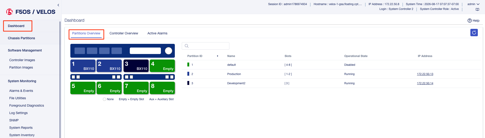

The are some basic visuals in the System Controller webUI for Chassis Partitions with an Operational State, views of the partitions, and the ability to do some basic configuration from the System Controller. You can connect directly to one of the Chassis Partitions to get more specific details.

The webUI screen below shows Chassis Partition visualization/configuration. An admin can see which blades belong to which chassis partitions as well as the chassis partition operational status:

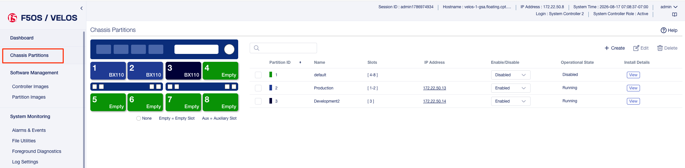

CLI Monitoring of Chassis Partitions from the System Controller
^^^^^^^^^^^^^^^^^^^^^^^^^^^^^^^^^^^^^^^^^^^^^^^^^^^^^^^^^^^^^^^

The CLI command show partitions will show the current chassis partitions ID’s and their status on each system controller:

.. code-block:: bash

    syscon-2-active# show partitions 
                            PARTITION  PARTITION  
    NAME        CONTROLLER  ID         STATUS     
    ----------------------------------------------
    bigpart     1           2          running    
                2           2          running    
    blade3part  1           3          running    
                2           3          running    
    default     1           1          running    
                2           1          running    
    none        1           0          disabled   
                2           0          disabled

The CLI command **show running-config slots** will show the which slots are configured to participate in specific chassis partitions:

.. code-block:: bash

    syscon-2-active# show running-config slots 
    slots slot 1
    enabled
    partition bigpart
    !
    slots slot 2
    enabled
    partition bigpart
    !
    slots slot 3
    enabled
    partition blade3part
    !
    slots slot 4
    enabled
    partition default
    !
    slots slot 5
    enabled
    partition default
    !
    slots slot 6
    enabled
    partition default
    !
    slots slot 7
    enabled
    partition default
    !
    slots slot 8
    enabled
    partition default
    !
  

Alerting and Logging of Chassis Partitions Events from the System Controller
^^^^^^^^^^^^^^^^^^^^^^^^^^^^^^^^^^^^^^^^^^^^^^^^^^^^^^^^^^^^^^^^^^^^^^^^^^^^

From the System Controller CLI you may also view the System Controller and individual Blade Status using the **show cluster** or the shortened **show cluster nodes** command:

.. code-block:: bash

    controller-1# show cluster nodes
    NAME          STATUS  TIME CREATED          ROLES         CPU  PODS  MEMORY      HUGEPAGES  
    --------------------------------------------------------------------------------------------
    blade-1       Ready   2020-08-06T06:18:08Z  compute       28   250   26112340Ki  102890Mi   
    blade-2       Ready   2020-08-06T06:18:09Z  compute       28   250   26112340Ki  102890Mi   
    controller-1  Ready   2020-08-06T05:52:45Z  infra,master  -    -     -           -          
    controller-2  Ready   2020-08-06T05:52:51Z  infra,master  -    -     -           -          

    controller-1# show cluster 
    NAME          STATUS  TIME CREATED          ROLES         CPU  PODS  MEMORY      HUGEPAGES  
    --------------------------------------------------------------------------------------------
    blade-1       Ready   2020-08-06T06:18:08Z  compute       28   250   26112340Ki  102890Mi   
    blade-2       Ready   2020-08-06T06:18:09Z  compute       28   250   26112340Ki  102890Mi   
    controller-1  Ready   2020-08-06T05:52:45Z  infra,master  -    -     -           -          
    controller-2  Ready   2020-08-06T05:52:51Z  infra,master  -    -     -           -          

    STAGE NAME               STATUS  
    ---------------------------------
    AddingBlade              Done    
    HealthCheck              Done    
    HostedInstall            Done    
    MasterAdditionalInstall  Done    
    MasterInstall            Done    
    NodeBootstrap            Done    
    NodeJoin                 Done    
    Prerequisites            Done    
    ServiceCatalogInstall    Done    
    etcdInstall              Done    

---------------------------
Monitoring VELOS Components
---------------------------

