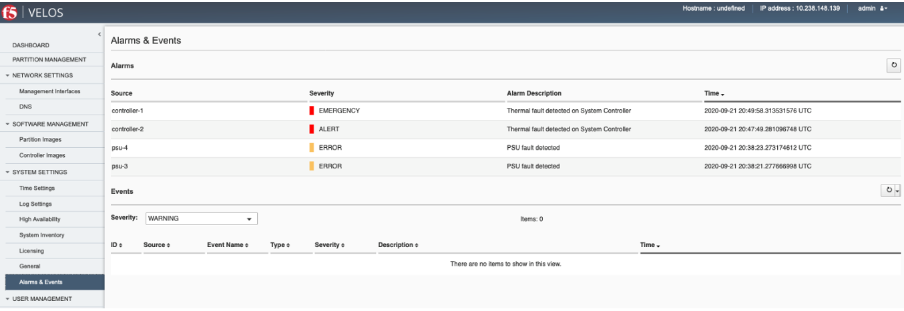

=====================================
Montoring VELOS Health & Alert Status
=====================================

VELOS has many components and subsystems which can be monitored via CLI, GUI, API, and SNMP. It may be difficult to sift through all the end points to determine which are the key ones that can quicky provide health of the chassis. This section will provide guidance on how to quickly get health and alert status of the VLEOS system, while other sections will focus on getting deeper detail.

Active Alerts
=============

The VELOS system has an alerting system where certain known issues will raise alerts when the occur, and will be be cleared when they are addressed or self-heal.

------------------------------
Checking Active Alerts via CLI
------------------------------

------------------------------
Checking Active Alerts via GUI
------------------------------

In the system controller GUI you can go to the **System Events > Alarms & Events** page to see if there are any known alerts for the system. The alerting page is focused on **Active** alerts, and not issues that have cleared. If for example the temperature rises beyond an acceptable threshold then a temperature alert will be raised. It will be seen in this page. If the temperature then falls back into a safe range then the alert will be removed. 

------------------------------
Checking Active Alerts via API
------------------------------

Recent system level alerts can be accessed via the API. Below is an API call to see all the system events that have occured for a particular chassis:

.. code-block:: bash

    GET https://{{System-Controller-IP}}:8888/restconf/data/openconfig-system:system/f5-event-log:events

Below are examples of events from a chassis in a test lab.Note there are ASSERT and Deasserted messages that clear them.

.. code-block:: json

    {
        "f5-event-log:events": {
            "event": [
                {
                    "log": "66048 controller-2 arbitration-state EVENT NA \"Deasserted: peer arbitration health state\" \"2021-05-24 15:53:18.820164630 UTC\""
                },
                {
                    "log": "66048 controller-2 arbitration-state EVENT NA \"Deasserted: peer arbitration request-active state\" \"2021-05-24 15:53:19.967579072 UTC\""
                },
                {
                    "log": "66048 controller-2 arbitration-state EVENT NA \"Deasserted: peer arbitration grant-active state\" \"2021-05-24 15:53:19.978854195 UTC\""
                },
                {
                    "log": "65545 fan-controller-1 power-fault ASSERT NOTICE \"Power fault detected in hardware\" \"2021-05-24 15:53:21.049898161 UTC\""
                },
                {
                    "log": "66048 controller-2 arbitration-state EVENT NA \"Asserted: local arbitration health state\" \"2021-05-24 15:53:26.015915252 UTC\""
                },
                {
                    "log": "66048 controller-2 arbitration-state EVENT NA \"Asserted: local arbitration request-active state\" \"2021-05-24 15:53:27.966554138 UTC\""
                },
                {
                    "log": "66048 controller-2 arbitration-state EVENT NA \"Asserted: local arbitration grant-active state\" \"2021-05-24 15:53:28.856929312 UTC\""
                },
                {
                    "log": "65546 blade-2 thermal-fault ASSERT WARNING \"Thermal fault detected in hardware\" \"2021-05-24 15:53:36.609780988 UTC\""
                },
                {
                    "log": "65546 blade-1 thermal-fault ASSERT WARNING \"Thermal fault detected in hardware\" \"2021-05-24 15:53:40.490642113 UTC\""
                },
                {
                    "log": "66048 controller-2 arbitration-state EVENT NA \"Asserted: peer arbitration health state\" \"2021-05-24 15:53:40.497334043 UTC\""
                },
                {
                    "log": "66048 controller-1 arbitration-state EVENT NA \"Asserted: peer arbitration health state\" \"2021-05-24 15:53:26.746574994 UTC\""
                },
                {
                    "log": "66048 controller-2 arbitration-state EVENT NA \"Asserted: peer arbitration request-active state\" \"2021-05-24 15:53:40.509161929 UTC\""
                },
                {
                    "log": "66048 controller-1 arbitration-state EVENT NA \"Asserted: peer arbitration request-active state\" \"2021-05-24 15:53:28.706752103 UTC\""
                },
                {
                    "log": "66048 controller-1 arbitration-state EVENT NA \"Asserted: peer arbitration grant-active state\" \"2021-05-24 15:53:28.715491054 UTC\""
                },
                {
                    "log": "66048 controller-1 arbitration-state EVENT NA \"Deasserted: local arbitration health state\" \"2021-05-24 15:53:30.717324742 UTC\""
                },
                {
                    "log": "66048 controller-1 arbitration-state EVENT NA \"Deasserted: local arbitration request-active state\" \"2021-05-24 15:53:30.855158278 UTC\""
                },
                {
                    "log": "66048 controller-1 arbitration-state EVENT NA \"Deasserted: local arbitration grant-active state\" \"2021-05-24 15:53:30.866478756 UTC\""
                },
                {
                    "log": "66048 controller-1 arbitration-state EVENT NA \"Asserted: local arbitration health state\" \"2021-05-24 15:53:32.702577376 UTC\""
                },
                {
                    "log": "66048 controller-1 arbitration-state EVENT NA \"Asserted: local arbitration request-active state\" \"2021-05-24 15:53:34.604942495 UTC\""
                },
                {
                    "log": "66048 controller-1 arbitration-state EVENT NA \"Deasserted: local arbitration request-active state\" \"2021-05-24 15:53:42.172936771 UTC\""
                },
                {
                    "log": "65546 blade-3 thermal-fault ASSERT WARNING \"Thermal fault detected in hardware\" \"2021-05-24 15:53:44.108120781 UTC\""
                },
                {
                    "log": "66048 controller-2 arbitration-state EVENT NA \"Deasserted: peer arbitration request-active state\" \"2021-05-24 15:53:44.763209737 UTC\""
                },
                {
                    "log": "65550 controller-1 firmware-update-status EVENT NA \"Firmware update is running for sirr \" \"2021-05-24 15:53:50.355583264 UTC\""
                },
                {
                    "log": "65550 controller-1 firmware-update-status EVENT NA \"Firmware update completed for sirr \" \"2021-05-24 15:53:54.860605432 UTC\""
                },
                {
                    "log": "131073 chassis nebsDisabled EVENT NA \"Chassis is operating with non-NEBS temperature thresholds\" \"2021-05-24 15:53:54.959361073 UTC\""
                },
                {
                    "log": "65550 controller-2 firmware-update-status EVENT NA \"Firmware update is running for sirr \" \"2021-05-24 15:53:55.977932249 UTC\""
                },
                {
                    "log": "65550 controller-2 firmware-update-status EVENT NA \"Firmware update completed for sirr \" \"2021-05-24 15:53:56.004017282 UTC\""
                },
                {
                    "log": "65546 blade-2 thermal-fault CLEAR WARNING \"Thermal fault detected in hardware\" \"2021-05-24 19:02:25.967760976 UTC\""
                },
                {
                    "log": "65546 blade-2 thermal-fault EVENT NA \"Deasserted: VQF hot\" \"2021-05-24 19:02:25.967814413 UTC\""
                },
                {
                    "log": "65546 blade-1 thermal-fault CLEAR WARNING \"Thermal fault detected in hardware\" \"2021-05-24 19:02:25.984620974 UTC\""
                },
                {
                    "log": "65546 blade-1 thermal-fault EVENT NA \"Deasserted: VQF hot\" \"2021-05-24 19:02:25.984658200 UTC\""
                },
                {
                    "log": "65546 blade-3 thermal-fault CLEAR WARNING \"Thermal fault detected in hardware\" \"2021-05-24 19:02:26.005916081 UTC\""
                },
                {
                    "log": "65546 blade-3 thermal-fault EVENT NA \"Deasserted: VQF hot\" \"2021-05-24 19:02:26.005953590 UTC\""
                },
                {
                    "log": "65550 blade-1 firmware-update-status EVENT NA \"Firmware update is running for vqf 0\" \"2021-05-24 19:27:26.907130040 UTC\""
                },
                {
                    "log": "65550 blade-1 firmware-update-status EVENT NA \"Firmware update completed for vqf 0\" \"2021-05-24 19:27:32.909166793 UTC\""
                },
                {
                    "log": "65550 blade-1 firmware-update-status EVENT NA \"Firmware update is running for atse 0\" \"2021-05-24 19:27:32.918458222 UTC\""
                },
                {
                    "log": "65550 blade-2 firmware-update-status EVENT NA \"Firmware update is running for atse 0\" \"2021-05-24 19:27:33.225942722 UTC\""
                },
                {
                    "log": "65550 blade-1 firmware-update-status EVENT NA \"Firmware update completed for atse 0\" \"2021-05-24 19:27:40.575885860 UTC\""
                },
                {
                    "log": "65550 blade-2 firmware-update-status EVENT NA \"Firmware update completed for atse 0\" \"2021-05-24 19:27:40.699221495 UTC\""
                },
                {
                    "log": "66049 controller-1 switch-fault EVENT NA \"data plane switch port hg14 (blade2/bp0) has uncorrected errors, value={fecUncorrected}\" \"2021-05-24 19:27:45.296321858 UTC\""
                },
                {
                    "log": "66049 controller-1 switch-fault EVENT NA \"data plane switch port hg0 (blade1/bp0) has uncorrected errors, value={fecUncorrected}\" \"2021-05-24 19:27:45.351543047 UTC\""
                },
                {
                    "log": "66049 controller-2 switch-fault EVENT NA \"data plane switch port hg14 (blade2/bp1) has uncorrected errors, value={fecUncorrected}\" \"2021-05-24 19:27:46.473379078 UTC\""
                },
                {
                    "log": "66049 controller-2 switch-fault EVENT NA \"data plane switch port hg0 (blade1/bp1) has uncorrected errors, value={fecUncorrected}\" \"2021-05-24 19:27:46.758451350 UTC\""
                },
                {
                    "log": "66049 controller-1 switch-fault EVENT NA \"data plane switch port hg14 (blade2/bp0) has no uncorrected errors\" \"2021-05-24 19:28:15.154986705 UTC\""
                },
                {
                    "log": "66049 controller-1 switch-fault EVENT NA \"data plane switch port hg0 (blade1/bp0) has no uncorrected errors\" \"2021-05-24 19:28:15.426611864 UTC\""
                },
                {
                    "log": "66049 controller-2 switch-fault EVENT NA \"data plane switch port hg0 (blade1/bp1) has no uncorrected errors\" \"2021-05-24 19:28:16.693070219 UTC\""
                },
                {
                    "log": "66049 controller-2 switch-fault EVENT NA \"data plane switch port hg14 (blade2/bp1) has no uncorrected errors\" \"2021-05-24 19:28:16.929074328 UTC\""
                },
                {
                    "log": "65550 blade-3 firmware-update-status EVENT NA \"Firmware update is running for vqf 0\" \"2021-05-24 19:28:59.482959232 UTC\""
                },
                {
                    "log": "65550 blade-3 firmware-update-status EVENT NA \"Firmware update completed for vqf 0\" \"2021-05-24 19:29:05.495334551 UTC\""
                },
                {
                    "log": "65550 blade-3 firmware-update-status EVENT NA \"Firmware update is running for atse 0\" \"2021-05-24 19:29:05.501245699 UTC\""
                },
                {
                    "log": "65550 blade-3 firmware-update-status EVENT NA \"Firmware update completed for atse 0\" \"2021-05-24 19:29:13.225536688 UTC\""
                },
                {
                    "log": "66049 controller-1 switch-fault EVENT NA \"data plane switch port hg11 (blade3/bp0) has uncorrected errors, value={fecUncorrected}\" \"2021-05-24 19:29:19.095000767 UTC\""
                },
                {
                    "log": "66049 controller-2 switch-fault EVENT NA \"data plane switch port hg11 (blade3/bp1) has uncorrected errors, value={fecUncorrected}\" \"2021-05-24 19:29:26.520634735 UTC\""
                },
                {
                    "log": "66049 controller-1 switch-fault EVENT NA \"data plane switch port hg11 (blade3/bp0) has no uncorrected errors\" \"2021-05-24 19:29:49.115375341 UTC\""
                },
                {
                    "log": "66049 controller-2 switch-fault EVENT NA \"data plane switch port hg11 (blade3/bp1) has no uncorrected errors\" \"2021-05-24 19:29:56.854690134 UTC\""
                },
                {
                    "log": "66048 controller-2 arbitration-state EVENT NA \"Asserted: local arbitration health state\" \"2021-05-26 02:41:33.773124875 UTC\""
                },
                {
                    "log": "66048 controller-2 arbitration-state EVENT NA \"Asserted: local arbitration request-active state\" \"2021-05-26 02:41:35.695101564 UTC\""
                },
                {
                    "log": "66048 controller-2 arbitration-state EVENT NA \"Asserted: local arbitration grant-active state\" \"2021-05-26 02:41:35.699045726 UTC\""
                },
                {
                    "log": "66048 controller-2 arbitration-state EVENT NA \"Deasserted: peer arbitration health state\" \"2021-05-26 02:41:39.786044205 UTC\""
                },
                {
                    "log": "66048 controller-2 arbitration-state EVENT NA \"Deasserted: peer arbitration request-active state\" \"2021-05-26 02:41:39.794249414 UTC\""
                },
                {
                    "log": "66048 controller-2 arbitration-state EVENT NA \"Deasserted: peer arbitration grant-active state\" \"2021-05-26 02:41:39.801413197 UTC\""
                },
                {
                    "log": "131073 chassis nebsDisabled EVENT NA \"Chassis is operating with non-NEBS temperature thresholds\" \"2021-05-26 02:41:40.461757212 UTC\""
                },
                {
                    "log": "66048 controller-2 arbitration-state EVENT NA \"Asserted: peer arbitration health state\" \"2021-05-26 02:42:07.768703623 UTC\""
                },
                {
                    "log": "66048 controller-2 arbitration-state EVENT NA \"Asserted: peer arbitration request-active state\" \"2021-05-26 02:42:07.773478111 UTC\""
                },
                {
                    "log": "66048 controller-2 arbitration-state EVENT NA \"Deasserted: local arbitration health state\" \"2021-05-26 02:42:07.777640774 UTC\""
                },
                {
                    "log": "66048 controller-2 arbitration-state EVENT NA \"Deasserted: local arbitration request-active state\" \"2021-05-26 02:42:07.784882772 UTC\""
                },
                {
                    "log": "66048 controller-2 arbitration-state EVENT NA \"Deasserted: local arbitration grant-active state\" \"2021-05-26 02:42:07.797839796 UTC\""
                },
                {
                    "log": "66048 controller-1 arbitration-state EVENT NA \"Asserted: peer arbitration grant-active state\" \"2021-05-26 02:41:34.187592931 UTC\""
                },
                {
                    "log": "66048 controller-1 arbitration-state EVENT NA \"Deasserted: local arbitration health state\" \"2021-05-26 02:41:35.217855071 UTC\""
                },
                {
                    "log": "66048 controller-1 arbitration-state EVENT NA \"Deasserted: local arbitration request-active state\" \"2021-05-26 02:41:35.225443025 UTC\""
                },
                {
                    "log": "66048 controller-1 arbitration-state EVENT NA \"Deasserted: local arbitration grant-active state\" \"2021-05-26 02:41:35.229464078 UTC\""
                },
                {
                    "log": "66048 controller-1 arbitration-state EVENT NA \"Asserted: peer arbitration health state\" \"2021-05-26 02:41:43.919541915 UTC\""
                },
                {
                    "log": "66048 controller-1 arbitration-state EVENT NA \"Asserted: local arbitration health state\" \"2021-05-26 02:42:05.250170202 UTC\""
                },
                {
                    "log": "66048 controller-1 arbitration-state EVENT NA \"Asserted: local arbitration request-active state\" \"2021-05-26 02:42:05.318741777 UTC\""
                },
                {
                    "log": "131073 chassis nebsDisabled EVENT NA \"Chassis is operating with non-NEBS temperature thresholds\" \"2021-05-26 02:42:06.203445372 UTC\""
                },
                {
                    "log": "66048 controller-1 arbitration-state EVENT NA \"Asserted: local arbitration grant-active state\" \"2021-05-26 02:42:07.211962644 UTC\""
                },
                {
                    "log": "66048 controller-1 arbitration-state EVENT NA \"Deasserted: peer arbitration health state\" \"2021-05-26 02:42:07.802468848 UTC\""
                },
                {
                    "log": "66048 controller-1 arbitration-state EVENT NA \"Deasserted: peer arbitration request-active state\" \"2021-05-26 02:42:07.812836190 UTC\""
                },
                {
                    "log": "66048 controller-1 arbitration-state EVENT NA \"Deasserted: peer arbitration grant-active state\" \"2021-05-26 02:42:07.837459150 UTC\""
                },
                {
                    "log": "131073 chassis nebsDisabled EVENT NA \"Chassis is operating with non-NEBS temperature thresholds\" \"2021-05-26 02:42:10.436404999 UTC\""
                },
                {
                    "log": "66048 controller-2 arbitration-state EVENT NA \"Asserted: peer arbitration grant-active state\" \"2021-05-26 02:42:10.822523042 UTC\""
                },
                {
                    "log": "65550 blade-2 firmware-update-status EVENT NA \"Firmware update is running for atse 0\" \"2021-05-26 04:06:34.843286399 UTC\""
                },
                {
                    "log": "65546 blade-2 thermal-fault ASSERT WARNING \"Thermal fault detected in hardware\" \"2021-05-26 04:06:36.864531942 UTC\""
                },
                {
                    "log": "65546 blade-2 thermal-fault EVENT NA \"Asserted: VQF hot\" \"2021-05-26 04:06:36.864577488 UTC\""
                },
                {
                    "log": "65550 blade-1 firmware-update-status EVENT NA \"Firmware update is running for vqf 0\" \"2021-05-26 04:06:39.864693543 UTC\""
                },
                {
                    "log": "65550 blade-2 firmware-update-status EVENT NA \"Firmware update completed for atse 0\" \"2021-05-26 04:06:40.767393044 UTC\""
                },
                {
                    "log": "65550 blade-3 firmware-update-status EVENT NA \"Firmware update is running for vqf 0\" \"2021-05-26 04:06:44.080096986 UTC\""
                },
                {
                    "log": "65546 blade-1 thermal-fault ASSERT WARNING \"Thermal fault detected in hardware\" \"2021-05-26 04:06:46.861342298 UTC\""
                },
                {
                    "log": "65546 blade-1 thermal-fault EVENT NA \"Asserted: VQF hot\" \"2021-05-26 04:06:46.861384173 UTC\""
                },
                {
                    "log": "65550 blade-1 firmware-update-status EVENT NA \"Firmware update completed for vqf 0\" \"2021-05-26 04:06:47.864891691 UTC\""
                },
                {
                    "log": "65550 blade-1 firmware-update-status EVENT NA \"Firmware update is running for atse 0\" \"2021-05-26 04:06:47.868305537 UTC\""
                },
                {
                    "log": "66049 controller-2 switch-status EVENT NA \"data plane switch port hg14 (blade2/bp1) has uncorrected errors, value={fecUncorrected}\" \"2021-05-26 04:06:50.071892384 UTC\""
                },
                {
                    "log": "65550 blade-3 firmware-update-status EVENT NA \"Firmware update completed for vqf 0\" \"2021-05-26 04:06:52.078973703 UTC\""
                },
                {
                    "log": "65550 blade-3 firmware-update-status EVENT NA \"Firmware update is running for atse 0\" \"2021-05-26 04:06:52.083057955 UTC\""
                },
                {
                    "log": "65546 blade-3 thermal-fault ASSERT WARNING \"Thermal fault detected in hardware\" \"2021-05-26 04:06:52.864912359 UTC\""
                },
                {
                    "log": "65546 blade-3 thermal-fault EVENT NA \"Asserted: VQF hot\" \"2021-05-26 04:06:52.864961319 UTC\""
          
                }
            ]
        }
    }

System Health
=============

VELOS also has a very robust **system health** utility where all the various hardware and software subsystems will first provide a high level health status, but then deeper detail can be gained on what is monitored via each subsystem.

------------------------------
Checking System Health via CLI
------------------------------

Below is the full output from a chassis with 3 blades installed. 

.. code-block:: bash

    syscon-1-active# show system health 
    system health components component blade-1
    hardware blade/hardware/cpu
    state name CPU
    state health ok
    state severity info
    NAME                                            DESCRIPTION                                  HEALTH  SEVERITY  VALUE  UPDATED AT            
    --------------------------------------------------------------------------------------------------------------------------------------------
    cpu:state:fatal-error-fault                     Fatal error                                  ok      info      0      2021-09-23T15:41:12Z  
    cpu:state:fivr-fault                            FIVR Fault                                   ok      info      0      2021-09-23T15:41:12Z  
    cpu:state:hw-correctable-error-fault            Hardware correctable error                   ok      info      0      2021-09-23T15:41:12Z  
    cpu:state:internal-error-fault                  Internal unrecoverable error                 ok      info      0      2021-09-23T15:41:12Z  
    cpu:state:machine-check-error                   Machine check error                          ok      info      0      2021-09-23T15:41:12Z  
    cpu:state:non-fatal-error-fault                 Non-fatal error                              ok      info      0      2021-09-23T15:41:12Z  
    cpu:state:processor-hot-fault                   Processor hot Fault                          ok      info      0      2021-09-23T15:41:12Z  
    cpu:state:thermal-trip-fault                    Thermal Trip Fault                           ok      info      0      2021-09-23T15:41:12Z  
    l4s:power-domain:cpu:1.05v-pch-aux              +1.05V PCH AUX power fault                   ok      info      0      2021-09-23T15:41:12Z  
    l4s:power-domain:cpu:1.0v-pch-pcvv-aux          +1.0V PCH PVNN AUX power fault               ok      info      0      2021-09-23T15:41:12Z  
    l4s:power-domain:cpu:1.1v-cpu-pvccio            +1.1V CPU PVCCIO power fault                 ok      info      0      2021-09-23T15:41:12Z  
    l4s:power-domain:cpu:1.1v-cpu-pvsa              +1.1V CPU PVSA power fault                   ok      info      0      2021-09-23T15:41:12Z  
    l4s:power-domain:cpu:1.8v-cpu-pvccin            +1.8V CPU PVCCIN power fault                 ok      info      0      2021-09-23T15:41:12Z  
    l4s:power-domain:cpu:1.8v-pch-aux               +1.8V PCH AUX power fault                    ok      info      0      2021-09-23T15:41:12Z  
    l4s:sensor:temperature:cpu                      CPU (C)                                      ok      info      40     2021-09-24T04:54:19Z  
    l4s:sensor:temperature:cputctldelta             CPU TCTL-Delta (C)                           ok      info      -40    2021-09-24T04:54:19Z  
    l4s:thermal-fault:cpu:pch                       CPU PCH Hot thermal fault                    ok      info      0      2021-09-23T15:41:12Z  
    l4s:thermal-fault:cpu:pvccin-vr                 CPU PVCCIN VR Hot thermal fault              ok      info      0      2021-09-23T15:41:12Z  
    rasdaemon:extlog:invalid-address                RAS Extlog invalid address event             ok      info      0      2021-09-23T15:41:12Z  
    rasdaemon:extlog:master-abort                   RAS Extlog master abort event                ok      info      0      2021-09-23T15:41:12Z  
    rasdaemon:extlog:memory-sparing                 RAS Extlog memory sparing event              ok      info      0      2021-09-23T15:41:12Z  
    rasdaemon:extlog:mirror-broken                  RAS Extlog mirror broken event               ok      info      0      2021-09-23T15:41:12Z  
    rasdaemon:extlog:multi-bit-ecc                  RAS Extlog mullti-bit ECC event              ok      info      0      2021-09-23T15:41:12Z  
    rasdaemon:extlog:multi-symbol-chipkill-ecc      RAS Extlog multi-symbol chipkill ECC event   ok      info      0      2021-09-23T15:41:12Z  
    rasdaemon:extlog:no-error                       RAS Extlog no error event                    ok      info      0      2021-09-23T15:41:12Z  
    rasdaemon:extlog:parity-error                   RAS Extlog parity error event                ok      info      0      2021-09-23T15:41:12Z  
    rasdaemon:extlog:physical-memory-map-out-event  RAS Extlog physical memory map-out event     ok      info      0      2021-09-23T15:41:12Z  
    rasdaemon:extlog:scrub-corrected-error          RAS Extlog scrub corrected error             ok      info      0      2021-09-23T15:41:12Z  
    rasdaemon:extlog:scrub-uncorrected-error        RAS Extlog scrub uncorrected error           ok      info      0      2021-09-23T15:41:12Z  
    rasdaemon:extlog:single-bit-ecc                 RAS Extlog single-bit ECC event              ok      info      0      2021-09-23T15:41:12Z  
    rasdaemon:extlog:single-symbol-chipkill-ecc     RAS Extlog single-symbol chipkill ECC event  ok      info      0      2021-09-23T15:41:12Z  
    rasdaemon:extlog:target-abort                   RAS Extlog target abort event                ok      info      0      2021-09-23T15:41:12Z  
    rasdaemon:extlog:unknown                        RAS Extlog unknown event                     ok      info      0      2021-09-23T15:41:12Z  
    rasdaemon:extlog:unknown-type                   RAS Extlog unknown type                      ok      info      0      2021-09-23T15:41:12Z  
    rasdaemon:extlog:watchdog-timeout               RAS Extlog watchdog timeout event            ok      info      0      2021-09-23T15:41:12Z  
    rasdaemon:mce:address-command-error             RAS MCE address/Command error                ok      info      0      2021-09-24T04:56:13Z  
    rasdaemon:mce:generic-undefined-request         RAS MCE generic undefined request            ok      info      0      2021-09-24T04:56:13Z  
    rasdaemon:mce:memory-read-error                 RAS MCE memory read error                    ok      info      0      2021-09-24T04:56:13Z  
    rasdaemon:mce:memory-scrubbing-error            RAS MCE memory scrubbing error               ok      info      0      2021-09-24T04:56:13Z  
    rasdaemon:mce:memory-write-error                RAS MCE memory write error                   ok      info      0      2021-09-24T04:56:13Z  
    rasdaemon:mce:processor-temp-throttling         RAS MCE processor temperature throttling     ok      info      0      2021-09-24T04:56:13Z  
    rasdaemon:mce:unknown-event                     RAS MCE unknown error                        ok      info      0      2021-09-23T15:41:12Z  

    hardware blade/hardware/cpu/pcie
    state name "PCIe BUS"
    state health ok
    state severity info
    NAME                                               DESCRIPTION                                          HEALTH  SEVERITY  VALUE  UPDATED AT            
    -------------------------------------------------------------------------------------------------------------------------------------------------------
    rasdaemon:aer:correctable:advisory-non-fatal       RAS AER 'Advisory Non-Fatal' correctable error       ok      info      0      2021-09-24T04:56:13Z  
    rasdaemon:aer:correctable:bad-dllp                 RAS AER 'Bad DLLP' correctable error                 ok      info      0      2021-09-24T04:56:13Z  
    rasdaemon:aer:correctable:bad-tlp                  RAS AER 'Bad TLP' correctable error                  ok      info      0      2021-09-24T04:56:13Z  
    rasdaemon:aer:correctable:receiver-error           RAS AER 'Receiver Error' correctable error           ok      info      0      2021-09-24T04:56:13Z  
    rasdaemon:aer:correctable:replay-num-rollover      RAS AER 'RELAY_NUM Rollover' correctable error       ok      info      0      2021-09-24T04:56:13Z  
    rasdaemon:aer:correctable:replay-timer-timeout     RAS AER 'Replay Timer Timeout' correctable error     ok      info      0      2021-09-24T04:56:13Z  
    rasdaemon:aer:uncorrectable:completer-abort        RAS AER 'Completer Abort' uncorrectable error        ok      info      0      2021-09-24T04:56:13Z  
    rasdaemon:aer:uncorrectable:completion-timeout     RAS AER 'Completion Timeout' uncorrectable error     ok      info      0      2021-09-24T04:56:13Z  
    rasdaemon:aer:uncorrectable:data-link-protocol     RAS AER 'Data Link Protocol' uncorrectable error     ok      info      0      2021-09-24T04:56:13Z  
    rasdaemon:aer:uncorrectable:ecrc                   RAS AER 'ECRC' uncorrectable error                   ok      info      0      2021-09-24T04:56:13Z  
    rasdaemon:aer:uncorrectable:flow-control-protocol  RAS AER 'Flow Control Protocol' uncorrectable error  ok      info      0      2021-09-24T04:56:13Z  
    rasdaemon:aer:uncorrectable:malformed-tlp          RAS AER 'Malformed TLP' uncorrectable error          ok      info      0      2021-09-24T04:56:13Z  
    rasdaemon:aer:uncorrectable:poisoned-tlp           RAS AER 'Poisoned TLP' uncorrectable error           ok      info      0      2021-09-24T04:56:13Z  
    rasdaemon:aer:uncorrectable:receiver-overflow      RAS AER 'Receiver Overflow' uncorrectable error      ok      info      0      2021-09-24T04:56:13Z  
    rasdaemon:aer:uncorrectable:unexpected-completion  RAS AER 'Unexpected Completion' uncorrectable error  ok      info      0      2021-09-24T04:56:13Z  
    rasdaemon:aer:uncorrectable:unsupported-request    RAS AER 'Unsupported Request' uncorrectable error    ok      info      0      2021-09-24T04:56:13Z  
    rasdaemon:aer:unknown-event                        RAS AER 'unknown' error                              ok      info      0      2021-09-23T15:41:12Z  

    hardware blade/hardware/dma/dm0
    state name "Data Mover 0"
    state health ok
    state severity info
    NAME                                                       DESCRIPTION                                            HEALTH  SEVERITY  VALUE  UPDATED AT            
    -----------------------------------------------------------------------------------------------------------------------------------------------------------------
    dma:epva:fnq-enqueue-full                                  ePVA FNQ enqueue full                                  ok      info             2021-05-18T17:48:23Z  
    dma:epva:rx-mgmt-fsd                                       ePVA Rx management FSD                                 ok      info             2021-05-18T17:48:23Z  
    dma:epva:rx-mgmt-fsd-drop-cvc-update-failures              ePVA Rx management FSD drop cvc update failure         ok      info             2021-05-18T17:48:23Z  
    dma:epva:rx-mgmt-fsd-drop-evict-failures                   ePVA Rx management FSD drop evict failure              ok      info             2021-05-18T17:48:23Z  
    dma:epva:rx-mgmt-fsd-drop-lively-failures                  ePVA Rx management FSD drop lively failure             ok      info             2021-05-18T17:48:23Z  
    dma:epva:rx-mgmt-fsd-drop-unknown-sep                      ePVA Rx management FSD drop unknown SEP                ok      info             2021-05-18T17:48:23Z  
    dma:epva:rx-mgmt-fsd-drop-unknown-svc                      ePVA Rx management FSD drop unknown SVC                ok      info             2021-05-18T17:48:23Z  
    dma:epva:rx-mgmt-fsd-drop-wrong-dm                         ePVA Rx management FSD drop wrong DM                   ok      info             2021-05-18T17:48:23Z  
    dma:epva:tx-action-snoop-cv-updates                        ePVA Tx action snoop CV updates                        ok      info             2021-05-18T17:48:23Z  
    dma:epva:tx-action-snoop-evict-drop-entry-mismatch         ePVA Tx action snoop evict drop entry mismatch         ok      info             2021-05-18T17:48:23Z  
    dma:epva:tx-action-snoop-evict-drop-no-entry               ePVA Tx action snoop evict drop no entry               ok      info             2021-05-18T17:48:23Z  
    dma:epva:tx-action-snoop-evict-table-locked                ePVA Tx action snoop evict drop table locked           ok      info             2021-05-18T17:48:23Z  
    dma:epva:tx-action-snoop-evicts                            ePVA Tx action snoop evict                             ok      info             2021-05-18T17:48:23Z  
    dma:epva:tx-action-snoop-flush-drop-dup-req                ePVA Tx action snoop flush drop dup req                ok      info             2021-05-18T17:48:23Z  
    dma:epva:tx-action-snoop-flushes                           ePVA Tx Action Snoop Flushes                           ok      info             2021-05-18T17:48:23Z  
    dma:epva:tx-action-snoop-insert-drop-evict-disable-no-pri  ePVA Tx action snoop insert drop evict disable no pri  ok      info             2021-05-18T17:48:23Z  
    dma:epva:tx-action-snoop-insert-drop-no-priority           ePVA Tx action snoop insert drop no priority           ok      info             2021-05-18T17:48:23Z  
    dma:epva:tx-action-snoop-insert-drop-table-locked          ePVA Tx action snoop insert drop table locked          ok      info             2021-05-18T17:48:23Z  
    dma:epva:tx-action-snoop-inserts                           ePVA Tx action snoop inserts                           ok      info             2021-05-18T17:48:23Z  
    dma:epva:tx-action-snoop-replace                           ePVA Tx action snoop replace                           ok      info             2021-05-18T17:48:23Z  
    dma:packet:qos                                             QoS                                                    ok      info             2021-05-18T17:48:23Z  
    dma:packet:rx-action-ring-full                             Rx Action Ring Full                                    ok      info             2021-05-18T17:48:23Z  
    dma:packet:rx-actions                                      Rx action count                                        ok      info             2021-05-18T17:48:23Z  
    dma:packet:rx-drop-bytes                                   Rx drop byte count                                     ok      info             2021-05-18T17:48:23Z  
    dma:packet:rx-drop-packets                                 Rx drop packets                                        ok      info             2021-05-18T17:48:23Z  
    dma:packet:rx-drop-unknown-sep                             Rx drop unknown SEP                                    ok      info             2021-05-18T17:48:23Z  
    dma:packet:rx-drop-unknown-svc                             Rx drop unknown SVC                                    ok      info             2021-05-18T17:48:23Z  
    dma:packet:rx-drop-wrong-dm                                Rx drop wrong DM                                       ok      info             2021-05-18T17:48:23Z  
    dma:packet:rx-metadata                                     Rx metadata                                            ok      info             2021-05-18T17:48:23Z  
    dma:packet:rx-pend-queue-full                              Rx pend queue full                                     ok      info             2021-05-18T17:48:23Z  
    dma:packet:tx-action-ring-full                             Tx action ring full                                    ok      info             2021-05-18T17:48:23Z  
    dma:packet:tx-actions                                      Tx action count                                        ok      info             2021-05-18T17:48:23Z  
    dma:packet:tx-pend-queue-full                              Tx pend queue full                                     ok      info             2021-05-18T17:48:23Z  

    hardware blade/hardware/dma/dm1
    state name "Data Mover 1"
    state health ok
    state severity info
    NAME                                                       DESCRIPTION                                            HEALTH  SEVERITY  VALUE  UPDATED AT            
    -----------------------------------------------------------------------------------------------------------------------------------------------------------------
    dma:epva:fnq-enqueue-full                                  ePVA FNQ enqueue full                                  ok      info             2021-05-18T17:48:23Z  
    dma:epva:rx-mgmt-fsd                                       ePVA Rx management FSD                                 ok      info             2021-05-18T17:48:23Z  
    dma:epva:rx-mgmt-fsd-drop-cvc-update-failures              ePVA Rx management FSD drop cvc update failure         ok      info             2021-05-18T17:48:23Z  
    dma:epva:rx-mgmt-fsd-drop-evict-failures                   ePVA Rx management FSD drop evict failure              ok      info             2021-05-18T17:48:23Z  
    dma:epva:rx-mgmt-fsd-drop-lively-failures                  ePVA Rx management FSD drop lively failure             ok      info             2021-05-18T17:48:23Z  
    dma:epva:rx-mgmt-fsd-drop-unknown-sep                      ePVA Rx management FSD drop unknown SEP                ok      info             2021-05-18T17:48:23Z  
    dma:epva:rx-mgmt-fsd-drop-unknown-svc                      ePVA Rx management FSD drop unknown SVC                ok      info             2021-05-18T17:48:23Z  
    dma:epva:rx-mgmt-fsd-drop-wrong-dm                         ePVA Rx management FSD drop wrong DM                   ok      info             2021-05-18T17:48:23Z  
    dma:epva:tx-action-snoop-cv-updates                        ePVA Tx action snoop CV updates                        ok      info             2021-05-18T17:48:23Z  
    dma:epva:tx-action-snoop-evict-drop-entry-mismatch         ePVA Tx action snoop evict drop entry mismatch         ok      info             2021-05-18T17:48:23Z  
    dma:epva:tx-action-snoop-evict-drop-no-entry               ePVA Tx action snoop evict drop no entry               ok      info             2021-05-18T17:48:23Z  
    dma:epva:tx-action-snoop-evict-table-locked                ePVA Tx action snoop evict drop table locked           ok      info             2021-05-18T17:48:23Z  
    dma:epva:tx-action-snoop-evicts                            ePVA Tx action snoop evict                             ok      info             2021-05-18T17:48:23Z  
    dma:epva:tx-action-snoop-flush-drop-dup-req                ePVA Tx action snoop flush drop dup req                ok      info             2021-05-18T17:48:23Z  
    dma:epva:tx-action-snoop-flushes                           ePVA Tx Action Snoop Flushes                           ok      info             2021-05-18T17:48:23Z  
    dma:epva:tx-action-snoop-insert-drop-evict-disable-no-pri  ePVA Tx action snoop insert drop evict disable no pri  ok      info             2021-05-18T17:48:23Z  
    dma:epva:tx-action-snoop-insert-drop-no-priority           ePVA Tx action snoop insert drop no priority           ok      info             2021-05-18T17:48:23Z  
    dma:epva:tx-action-snoop-insert-drop-table-locked          ePVA Tx action snoop insert drop table locked          ok      info             2021-05-18T17:48:23Z  
    dma:epva:tx-action-snoop-inserts                           ePVA Tx action snoop inserts                           ok      info             2021-05-18T17:48:23Z  
    dma:epva:tx-action-snoop-replace                           ePVA Tx action snoop replace                           ok      info             2021-05-18T17:48:23Z  
    dma:packet:qos                                             QoS                                                    ok      info             2021-05-18T17:48:23Z  
    dma:packet:rx-action-ring-full                             Rx Action Ring Full                                    ok      info             2021-05-18T17:48:23Z  
    dma:packet:rx-actions                                      Rx action count                                        ok      info             2021-05-18T17:48:23Z  
    dma:packet:rx-drop-bytes                                   Rx drop byte count                                     ok      info             2021-05-18T17:48:23Z  
    dma:packet:rx-drop-packets                                 Rx drop packets                                        ok      info             2021-05-18T17:48:23Z  
    dma:packet:rx-drop-unknown-sep                             Rx drop unknown SEP                                    ok      info             2021-05-18T17:48:23Z  
    dma:packet:rx-drop-unknown-svc                             Rx drop unknown SVC                                    ok      info             2021-05-18T17:48:23Z  
    dma:packet:rx-drop-wrong-dm                                Rx drop wrong DM                                       ok      info             2021-05-18T17:48:23Z  
    dma:packet:rx-metadata                                     Rx metadata                                            ok      info             2021-05-18T17:48:23Z  
    dma:packet:rx-pend-queue-full                              Rx pend queue full                                     ok      info             2021-05-18T17:48:23Z  
    dma:packet:tx-action-ring-full                             Tx action ring full                                    ok      info             2021-05-18T17:48:23Z  
    dma:packet:tx-actions                                      Tx action count                                        ok      info             2021-05-18T17:48:23Z  
    dma:packet:tx-pend-queue-full                              Tx pend queue full                                     ok      info             2021-05-18T17:48:23Z  

    hardware blade/hardware/dma/dm2
    state name "Data Mover 2"
    state health ok
    state severity info
    NAME                                                       DESCRIPTION                                            HEALTH  SEVERITY  VALUE  UPDATED AT            
    -----------------------------------------------------------------------------------------------------------------------------------------------------------------
    dma:epva:fnq-enqueue-full                                  ePVA FNQ enqueue full                                  ok      info             2021-05-18T17:48:23Z  
    dma:epva:rx-mgmt-fsd                                       ePVA Rx management FSD                                 ok      info             2021-05-18T17:48:23Z  
    dma:epva:rx-mgmt-fsd-drop-cvc-update-failures              ePVA Rx management FSD drop cvc update failure         ok      info             2021-05-18T17:48:23Z  
    dma:epva:rx-mgmt-fsd-drop-evict-failures                   ePVA Rx management FSD drop evict failure              ok      info             2021-05-18T17:48:23Z  
    dma:epva:rx-mgmt-fsd-drop-lively-failures                  ePVA Rx management FSD drop lively failure             ok      info             2021-05-18T17:48:23Z  
    dma:epva:rx-mgmt-fsd-drop-unknown-sep                      ePVA Rx management FSD drop unknown SEP                ok      info             2021-05-18T17:48:23Z  
    dma:epva:rx-mgmt-fsd-drop-unknown-svc                      ePVA Rx management FSD drop unknown SVC                ok      info             2021-05-18T17:48:23Z  
    dma:epva:rx-mgmt-fsd-drop-wrong-dm                         ePVA Rx management FSD drop wrong DM                   ok      info             2021-05-18T17:48:23Z  
    dma:epva:tx-action-snoop-cv-updates                        ePVA Tx action snoop CV updates                        ok      info             2021-05-18T17:48:23Z  
    dma:epva:tx-action-snoop-evict-drop-entry-mismatch         ePVA Tx action snoop evict drop entry mismatch         ok      info             2021-05-18T17:48:23Z  
    dma:epva:tx-action-snoop-evict-drop-no-entry               ePVA Tx action snoop evict drop no entry               ok      info             2021-05-18T17:48:23Z  
    dma:epva:tx-action-snoop-evict-table-locked                ePVA Tx action snoop evict drop table locked           ok      info             2021-05-18T17:48:23Z  
    dma:epva:tx-action-snoop-evicts                            ePVA Tx action snoop evict                             ok      info             2021-05-18T17:48:23Z  
    dma:epva:tx-action-snoop-flush-drop-dup-req                ePVA Tx action snoop flush drop dup req                ok      info             2021-05-18T17:48:23Z  
    dma:epva:tx-action-snoop-flushes                           ePVA Tx Action Snoop Flushes                           ok      info             2021-05-18T17:48:23Z  
    dma:epva:tx-action-snoop-insert-drop-evict-disable-no-pri  ePVA Tx action snoop insert drop evict disable no pri  ok      info             2021-05-18T17:48:23Z  
    dma:epva:tx-action-snoop-insert-drop-no-priority           ePVA Tx action snoop insert drop no priority           ok      info             2021-05-18T17:48:23Z  
    dma:epva:tx-action-snoop-insert-drop-table-locked          ePVA Tx action snoop insert drop table locked          ok      info             2021-05-18T17:48:23Z  
    dma:epva:tx-action-snoop-inserts                           ePVA Tx action snoop inserts                           ok      info             2021-05-18T17:48:23Z  
    dma:epva:tx-action-snoop-replace                           ePVA Tx action snoop replace                           ok      info             2021-05-18T17:48:23Z  
    dma:packet:qos                                             QoS                                                    ok      info             2021-05-18T17:48:23Z  
    dma:packet:rx-action-ring-full                             Rx Action Ring Full                                    ok      info             2021-05-18T17:48:23Z  
    dma:packet:rx-actions                                      Rx action count                                        ok      info             2021-05-18T17:48:23Z  
    dma:packet:rx-drop-bytes                                   Rx drop byte count                                     ok      info             2021-05-18T17:48:23Z  
    dma:packet:rx-drop-packets                                 Rx drop packets                                        ok      info             2021-05-18T17:48:23Z  
    dma:packet:rx-drop-unknown-sep                             Rx drop unknown SEP                                    ok      info             2021-05-18T17:48:23Z  
    dma:packet:rx-drop-unknown-svc                             Rx drop unknown SVC                                    ok      info             2021-05-18T17:48:23Z  
    dma:packet:rx-drop-wrong-dm                                Rx drop wrong DM                                       ok      info             2021-05-18T17:48:23Z  
    dma:packet:rx-metadata                                     Rx metadata                                            ok      info             2021-05-18T17:48:23Z  
    dma:packet:rx-pend-queue-full                              Rx pend queue full                                     ok      info             2021-05-18T17:48:23Z  
    dma:packet:tx-action-ring-full                             Tx action ring full                                    ok      info             2021-05-18T17:48:23Z  
    dma:packet:tx-actions                                      Tx action count                                        ok      info             2021-05-18T17:48:23Z  
    dma:packet:tx-pend-queue-full                              Tx pend queue full                                     ok      info             2021-05-18T17:48:23Z  

    hardware blade/hardware/drives
    state name Drives
    state health ok
    state severity info
    hardware blade/hardware/drives/nvme0n1
    state name "Drive NVME 0"
    state health ok
    state severity info
    NAME                                                              DESCRIPTION                                         HEALTH  SEVERITY  VALUE  UPDATED AT            
    ---------------------------------------------------------------------------------------------------------------------------------------------------------------------
    drives:capacity                                                   Drive capacity                                      ok      info      1      2021-09-24T04:00:01Z  
    drives:disk-usage-growth-rate                                     Drive capacity Growth Rate                          ok      info      1      2021-09-24T04:00:01Z  
    drives:smart:nvme:attr:available-spare                            Available spare                                     ok      info      100    2021-09-24T04:00:03Z  
    drives:smart:nvme:attr:critical-warning:available-spare           SMART Attribute Critical Warning - Available Spare  ok      info      false  2021-09-24T04:00:03Z  
    drives:smart:nvme:attr:critical-warning:media-or-internal-errors  SMART Attribute Critical Warning - Media Errors     ok      info      false  2021-09-24T04:00:03Z  
    drives:smart:nvme:attr:critical-warning:read-only-mode            SMART Attribute Critical Warning - Read-Only Mode   ok      info      false  2021-09-24T04:00:03Z  
    drives:smart:nvme:attr:critical-warning:temperature               SMART Attribute Critical Warning - Temperature      ok      info      false  2021-09-24T04:00:03Z  
    drives:smart:nvme:attr:critical-warning:volatile-memory-backup    SMART Attribute Critical Warning - Volatile Memory  ok      info      false  2021-09-24T04:00:03Z  
    drives:smart:nvme:attr:media-errors                               SMART Attribute media errors                        ok      info      0      2021-09-24T04:00:03Z  
    drives:smart:nvme:attr:percentage-used                            Percentage used (%)                                 ok      info      2      2021-09-24T04:00:03Z  
    drives:smart:nvme:attr:temperature                                Temperature (C)                                     ok      info      26     2021-09-24T04:00:03Z  

    hardware blade/hardware/fpga/atse0
    state name "FPGA ATSE-0"
    state health ok
    state severity info
    NAME                                      DESCRIPTION                      HEALTH  SEVERITY  VALUE    UPDATED AT            
    ----------------------------------------------------------------------------------------------------------------------------
    fpga:version                              FPGA bitfile version             ok      info      7.7.3.0  2021-09-23T15:41:33Z  
    interface:port:speed                      Port Speed                       ok      info      100      2021-09-23T15:41:33Z  
    l4s:power-domain:atse:0.9v-atse-vcc       +0.9V_ATSE_VCC power fault       ok      info      0        2021-09-23T15:41:12Z  
    l4s:power-domain:atse:0.9v-atse-vcceram   +0.9V_ATSE_VCCERAM power fault   ok      info      0        2021-09-23T15:41:12Z  
    l4s:power-domain:atse:1.12v-atse-vccrgbx  +1.12V_ATSE_VCCRGBX power fault  ok      info      0        2021-09-23T15:41:12Z  
    l4s:power-domain:atse:1.12v-atse-vcctgbx  +1.12V_ATSE_VCCTGBX power fault  ok      info      0        2021-09-23T15:41:12Z  
    l4s:power-domain:atse:1.2v-atse           +1.2V_ATSE power fault           ok      info      0        2021-09-23T15:41:12Z  
    l4s:power-domain:atse:1.8v-atse           +1.8V_ATSE power fault           ok      info      0        2021-09-23T15:41:12Z  
    l4s:power-domain:atse:2.4v-atse           +2.4V_ATSE power fault           ok      info      0        2021-09-23T15:41:12Z  
    l4s:power-domain:atse:2.5v-atse           +2.5V_ATSE power fault           ok      info      0        2021-09-23T15:41:12Z  
    l4s:power-domain:atse:3.0v-atse           +3.0V_ATSE power fault           ok      info      0        2021-09-23T15:41:12Z  
    l4s:power-domain:atse:vcore-vr            ATSE VCORE VR power fault        ok      info      0        2021-09-23T15:41:12Z  
    l4s:thermal-fault:atse:hot                ATSE Hot thermal fault           ok      info      0        2021-09-23T15:41:12Z  
    l4s:thermal-fault:atse:thermal-trip       ATSE thermal trip fault          ok      info      0        2021-09-23T15:41:12Z  
    l4s:thermal-fault:atse:vcore-vr           VCORE VR Hot thermal fault       ok      info      0        2021-09-23T15:41:12Z  

    hardware blade/hardware/fpga/atse0/be2
    state name "Bandwidth Engine"
    state health ok
    state severity info
    NAME                           DESCRIPTION             HEALTH  SEVERITY  VALUE  UPDATED AT            
    ------------------------------------------------------------------------------------------------------
    l4s:power-domain:be:0.95v-bwe  +0.95V_BWE power fault  ok      info      0      2021-09-23T15:41:12Z  
    l4s:power-domain:be:1.5v-bwe   +1.5V_BWE power fault   ok      info      0      2021-09-23T15:41:12Z  

    hardware blade/hardware/fpga/atse0/gearbox0
    state name Gearbox-0
    state health ok
    state severity info
    NAME                                       DESCRIPTION                                    HEALTH  SEVERITY  VALUE  UPDATED AT            
    -----------------------------------------------------------------------------------------------------------------------------------------
    atse:gearbox:rx-jabber-drop-count          RX Jabber from FP drop count                   ok      info      0      2021-09-24T04:58:17Z  
    atse:gearbox:rx-other-drop-count           RX MAC Errors from FP drop count               ok      info      0      2021-09-24T04:58:17Z  
    atse:gearbox:rx-runt-drop-count            RX Runt from FP drop count                     ok      info      0      2021-09-24T04:58:17Z  
    atse:gearbox:tx-fifo-mc-drop-count         TX Fifo MC drop count                          ok      info      0      2021-09-24T04:58:17Z  
    atse:gearbox:tx-fifo-overflow-drop-count   drop count due to FP TX FIFO Full              ok      info      0      2021-09-24T04:58:17Z  
    atse:gearbox:tx-jabber-drop-count          Jabber drop count TX'd to Gearbox from VQF     ok      info      0      2021-09-24T04:58:17Z  
    atse:gearbox:tx-other-drop-count           MAC Error drop count TX'd to Gearbox from VQF  ok      info      0      2021-09-24T04:58:17Z  
    atse:gearbox:tx-parity-error-drop-count    Parity error count TX'd to Gearbox from VQF    ok      info      0      2021-09-24T04:58:17Z  
    atse:gearbox:tx-port-not-found-drop-count  TX Port Not Present drop count                 ok      info      0      2021-09-24T04:58:17Z  
    atse:gearbox:tx-runt-drop-count            Runt drop count TX'd to Gearbox from VQF       ok      info      0      2021-09-24T04:58:17Z  

    hardware blade/hardware/fpga/atse0/gearbox1
    state name Gearbox-1
    state health ok
    state severity info
    NAME                                       DESCRIPTION                                    HEALTH  SEVERITY  VALUE  UPDATED AT            
    -----------------------------------------------------------------------------------------------------------------------------------------
    atse:gearbox:rx-jabber-drop-count          RX Jabber from FP drop count                   ok      info      0      2021-09-24T04:58:17Z  
    atse:gearbox:rx-other-drop-count           RX MAC Errors from FP drop count               ok      info      0      2021-09-24T04:58:17Z  
    atse:gearbox:rx-runt-drop-count            RX Runt from FP drop count                     ok      info      0      2021-09-24T04:58:17Z  
    atse:gearbox:tx-fifo-mc-drop-count         TX Fifo MC drop count                          ok      info      0      2021-09-24T04:58:17Z  
    atse:gearbox:tx-fifo-overflow-drop-count   drop count due to FP TX FIFO Full              ok      info      0      2021-09-24T04:58:17Z  
    atse:gearbox:tx-jabber-drop-count          Jabber drop count TX'd to Gearbox from VQF     ok      info      0      2021-09-24T04:58:17Z  
    atse:gearbox:tx-other-drop-count           MAC Error drop count TX'd to Gearbox from VQF  ok      info      0      2021-09-24T04:58:17Z  
    atse:gearbox:tx-parity-error-drop-count    Parity error count TX'd to Gearbox from VQF    ok      info      0      2021-09-24T04:58:17Z  
    atse:gearbox:tx-port-not-found-drop-count  TX Port Not Present drop count                 ok      info      0      2021-09-24T04:58:17Z  
    atse:gearbox:tx-runt-drop-count            Runt drop count TX'd to Gearbox from VQF       ok      info      0      2021-09-24T04:58:17Z  

    hardware blade/hardware/fpga/atse0/ifh0
    state name "ATSE<->VQF Host0"
    state health ok
    state severity info
    NAME                              DESCRIPTION             HEALTH  SEVERITY  VALUE         UPDATED AT            
    ----------------------------------------------------------------------------------------------------------------
    interface:port:fcs-error-rate     FCS errors in rate      ok      info      0             2021-09-24T04:58:17Z  
    interface:port:fcs-errors-in      FCS errors in           ok      info      0             2021-09-24T04:58:17Z  
    interface:port:rx-byte-rate       RX rate (B/s)           ok      info      23409.766667  2021-09-24T04:58:17Z  
    interface:port:rx-crc-error-rate  Eth Rx CRC error rate   ok      info      0             2021-09-24T04:58:17Z  
    interface:port:rx-crc-errors      Eth RX CRC errors       ok      info      0             2021-09-24T04:58:17Z  
    interface:port:rx-pkt-rate        RX packet rate (pkt/s)  ok      info      118.833333    2021-09-24T04:58:17Z  
    interface:port:total-errors-in    Total error frames RX   ok      info      0             2021-09-24T04:58:17Z  
    interface:port:total-errors-out   Total error frames TX   ok      info      0             2021-09-24T04:58:17Z  
    interface:port:tx-byte-rate       TX rate (B/s)           ok      info      19140.333333  2021-09-24T04:58:17Z  
    interface:port:tx-pkt-rate        TX packet rate (pkt/s)  ok      info      119.3         2021-09-24T04:58:17Z  

    hardware blade/hardware/fpga/atse0/ifh1
    state name "ATSE<->VQF FP1"
    state health ok
    state severity info
    NAME                              DESCRIPTION             HEALTH  SEVERITY  VALUE       UPDATED AT            
    --------------------------------------------------------------------------------------------------------------
    interface:port:fcs-error-rate     FCS errors in rate      ok      info      0           2021-09-24T04:58:17Z  
    interface:port:fcs-errors-in      FCS errors in           ok      info      0           2021-09-24T04:58:17Z  
    interface:port:rx-byte-rate       RX rate (B/s)           ok      info      132.266667  2021-09-24T04:58:17Z  
    interface:port:rx-crc-error-rate  Eth Rx CRC error rate   ok      info      0           2021-09-24T04:58:17Z  
    interface:port:rx-crc-errors      Eth RX CRC errors       ok      info      0           2021-09-24T04:58:17Z  
    interface:port:rx-pkt-rate        RX packet rate (pkt/s)  ok      info      0           2021-09-24T04:58:17Z  
    interface:port:total-errors-in    Total error frames RX   ok      info      0           2021-09-24T04:58:17Z  
    interface:port:total-errors-out   Total error frames TX   ok      info      0           2021-09-24T04:58:17Z  
    interface:port:tx-byte-rate       TX rate (B/s)           ok      info      204.283333  2021-09-24T04:58:17Z  
    interface:port:tx-pkt-rate        TX packet rate (pkt/s)  ok      info      0           2021-09-24T04:58:17Z  

    hardware blade/hardware/fpga/atse0/ifh2
    state name "ATSE<->VQF FP0"
    state health ok
    state severity info
    NAME                              DESCRIPTION             HEALTH  SEVERITY  VALUE       UPDATED AT            
    --------------------------------------------------------------------------------------------------------------
    interface:port:fcs-error-rate     FCS errors in rate      ok      info      0           2021-09-24T04:58:17Z  
    interface:port:fcs-errors-in      FCS errors in           ok      info      0           2021-09-24T04:58:17Z  
    interface:port:rx-byte-rate       RX rate (B/s)           ok      info      132.266667  2021-09-24T04:58:17Z  
    interface:port:rx-crc-error-rate  Eth Rx CRC error rate   ok      info      0           2021-09-24T04:58:17Z  
    interface:port:rx-crc-errors      Eth RX CRC errors       ok      info      0           2021-09-24T04:58:17Z  
    interface:port:rx-pkt-rate        RX packet rate (pkt/s)  ok      info      0           2021-09-24T04:58:17Z  
    interface:port:total-errors-in    Total error frames RX   ok      info      0           2021-09-24T04:58:17Z  
    interface:port:total-errors-out   Total error frames TX   ok      info      0           2021-09-24T04:58:17Z  
    interface:port:tx-byte-rate       TX rate (B/s)           ok      info      134.4       2021-09-24T04:58:17Z  
    interface:port:tx-pkt-rate        TX packet rate (pkt/s)  ok      info      0           2021-09-24T04:58:17Z  

    hardware blade/hardware/fpga/atse0/pcie0
    state name "ATSE<->CPU PCIe0"
    state health ok
    state severity info
    NAME                      DESCRIPTION            HEALTH  SEVERITY  VALUE  UPDATED AT            
    ------------------------------------------------------------------------------------------------
    pcie:link-down-count      Link Down Counter      ok      info      16     2021-09-24T04:58:19Z  
    pcie:ltssm:l0-exit-count  LTSSM L0 Exit Counter  ok      info      16     2021-09-24T04:58:19Z  

    hardware blade/hardware/fpga/atse0/pcie1
    state name "ATSE<->CPU PCIe1"
    state health ok
    state severity info
    NAME                      DESCRIPTION            HEALTH  SEVERITY  VALUE  UPDATED AT            
    ------------------------------------------------------------------------------------------------
    pcie:link-down-count      Link Down Counter      ok      info      16     2021-09-24T04:58:19Z  
    pcie:ltssm:l0-exit-count  LTSSM L0 Exit Counter  ok      info      16     2021-09-24T04:58:19Z  

    hardware blade/hardware/fpga/atse0/pcie2
    state name "ATSE<->CPU PCIe2"
    state health ok
    state severity info
    NAME                      DESCRIPTION            HEALTH  SEVERITY  VALUE  UPDATED AT            
    ------------------------------------------------------------------------------------------------
    pcie:link-down-count      Link Down Counter      ok      info      16     2021-09-24T04:58:19Z  
    pcie:ltssm:l0-exit-count  LTSSM L0 Exit Counter  ok      info      16     2021-09-24T04:58:19Z  

    hardware blade/hardware/fpga/vqf
    state name "VQF FPGA"
    state health ok
    state severity info
    NAME                                         DESCRIPTION                                HEALTH  SEVERITY  VALUE      UPDATED AT            
    -------------------------------------------------------------------------------------------------------------------------------------------
    fpga:version                                 FPGA bitfile version                       ok      info      8.7.12.29  2021-09-23T15:41:33Z  
    l4s:power-domain:vqf:0.9v-vqf-vcc            +0.9V_VQF_VCC power fault                  ok      info      0          2021-09-23T15:41:12Z  
    l4s:power-domain:vqf:0.9v-vqf-vcceram        +0.9V_VQF_VCCERAM power fault              ok      info      0          2021-09-23T15:41:12Z  
    l4s:power-domain:vqf:1.12v-vqf-vccrgbx       +1.12V_VQF_VCCRGBX power fault             ok      info      0          2021-09-23T15:41:12Z  
    l4s:power-domain:vqf:1.12v-vqf-vcctgbx       +1.12V_VQF_VCCTGBX power fault             ok      info      0          2021-09-23T15:41:12Z  
    l4s:power-domain:vqf:1.8v-vqf                +1.8V_VQF power fault                      ok      info      0          2021-09-23T15:41:12Z  
    l4s:power-domain:vqf:2.4v-vqf                +2.4V_VQF power fault                      ok      info      0          2021-09-23T15:41:12Z  
    l4s:power-domain:vqf:3.0v-vqf                +3.0V_VQF power fault                      ok      info      0          2021-09-23T15:41:12Z  
    l4s:power-domain:vqf:vcore-vr                VQF VCORE VR power fault                   ok      info      0          2021-09-23T15:41:12Z  
    l4s:thermal-fault:vqf:hot                    VQF Hot thermal fault                      ok      info      1          2021-09-23T15:41:19Z  
    l4s:thermal-fault:vqf:thermal-trip           VQF thermal trip fault                     ok      info      0          2021-09-23T15:41:12Z  
    l4s:thermal-fault:vqf:vcore-vr               VCORE VR Hot thermal fault                 ok      info      0          2021-09-23T15:41:12Z  
    vqf:global:egress-fifo-full-drop-count       Global Egress FIFO Full drop count         ok      info      0          2021-09-24T04:58:17Z  
    vqf:global:egress-unexpected-did-drop-count  Global Egress Unexpected DID drop count    ok      info      0          2021-09-24T04:58:17Z  
    vqf:global:ic-ifh-crc-errors                 Global IC IFH CRC Errors                   ok      info      0          2021-09-24T04:58:17Z  
    vqf:global:ic-voq-not-enabled-drop-count     Global Ingress VOQ Not Enabled drop count  ok      info      9          2021-09-24T04:58:17Z  
    vqf:global:ingress-fifo-full-drop-count      Global Ingress FIFO Full drop count        ok      info      0          2021-09-24T04:58:17Z  

    hardware blade/hardware/fpga/vqf/bp0
    state name "VQF<->CC1 BP0"
    state health ok
    state severity info
    NAME                              DESCRIPTION             HEALTH  SEVERITY  VALUE       UPDATED AT            
    --------------------------------------------------------------------------------------------------------------
    interface:port:fcs-error-rate     FCS errors in rate      ok      info      0           2021-09-24T04:58:17Z  
    interface:port:fcs-errors-in      FCS errors in           ok      info      0           2021-09-24T04:58:17Z  
    interface:port:rx-byte-rate       RX rate (B/s)           ok      info      777.133333  2021-09-24T04:58:17Z  
    interface:port:rx-crc-error-rate  Eth Rx CRC error rate   ok      info      0           2021-09-24T04:58:17Z  
    interface:port:rx-crc-errors      Eth RX CRC errors       ok      info      0           2021-09-24T04:58:17Z  
    interface:port:rx-pkt-rate        RX packet rate (pkt/s)  ok      info      9.683333    2021-09-24T04:58:17Z  
    interface:port:total-errors-in    Total error frames RX   ok      info      0           2021-09-24T04:58:17Z  
    interface:port:total-errors-out   Total error frames TX   ok      info      0           2021-09-24T04:58:17Z  
    interface:port:tx-byte-rate       TX rate (B/s)           ok      info      885.95      2021-09-24T04:58:17Z  
    interface:port:tx-pkt-rate        TX packet rate (pkt/s)  ok      info      9.2         2021-09-24T04:58:17Z  

    hardware blade/hardware/fpga/vqf/bp1
    state name "VQF<->CC2 BP1"
    state health ok
    state severity info
    NAME                              DESCRIPTION             HEALTH  SEVERITY  VALUE         UPDATED AT            
    ----------------------------------------------------------------------------------------------------------------
    interface:port:fcs-error-rate     FCS errors in rate      ok      info      0             2021-09-24T04:58:17Z  
    interface:port:fcs-errors-in      FCS errors in           ok      info      0             2021-09-24T04:58:17Z  
    interface:port:rx-byte-rate       RX rate (B/s)           ok      info      15145.333333  2021-09-24T04:58:17Z  
    interface:port:rx-crc-error-rate  Eth Rx CRC error rate   ok      info      0             2021-09-24T04:58:17Z  
    interface:port:rx-crc-errors      Eth RX CRC errors       ok      info      0             2021-09-24T04:58:17Z  
    interface:port:rx-pkt-rate        RX packet rate (pkt/s)  ok      info      130.133333    2021-09-24T04:58:17Z  
    interface:port:total-errors-in    Total error frames RX   ok      info      0             2021-09-24T04:58:17Z  
    interface:port:total-errors-out   Total error frames TX   ok      info      0             2021-09-24T04:58:17Z  
    interface:port:tx-byte-rate       TX rate (B/s)           ok      info      20034.6       2021-09-24T04:58:17Z  
    interface:port:tx-pkt-rate        TX packet rate (pkt/s)  ok      info      152.483333    2021-09-24T04:58:17Z  

    hardware blade/hardware/fpga/vqf/ifh0
    state name "VQF<->ATSE FP0"
    state health ok
    state severity info
    NAME                              DESCRIPTION                HEALTH  SEVERITY  VALUE       UPDATED AT            
    -----------------------------------------------------------------------------------------------------------------
    interface:port:fcs-error-rate     FCS errors in rate         ok      info      0           2021-09-24T04:58:17Z  
    interface:port:fcs-errors-in      FCS errors in              ok      info      0           2021-09-24T04:58:17Z  
    interface:port:rx-byte-rate       RX rate (B/s)              ok      info      134.4       2021-09-24T04:58:17Z  
    interface:port:rx-crc-error-rate  Eth Rx CRC error rate      ok      info      0           2021-09-24T04:58:17Z  
    interface:port:rx-crc-errors      Eth RX CRC errors          ok      info      0           2021-09-24T04:58:17Z  
    interface:port:rx-pkt-rate        RX packet rate (pkt/s)     ok      info      1.05        2021-09-24T04:58:17Z  
    interface:port:total-errors-in    Total error frames RX      ok      info      0           2021-09-24T04:58:17Z  
    interface:port:total-errors-out   Total error frames TX      ok      info      0           2021-09-24T04:58:17Z  
    interface:port:tx-byte-rate       TX rate (B/s)              ok      info      132.266667  2021-09-24T04:58:17Z  
    interface:port:tx-pkt-rate        TX packet rate (pkt/s)     ok      info      1.033333    2021-09-24T04:58:17Z  
    vqf:obuff:bytes-count             OBUFF bytes counter        ok      info      4729010     2021-09-24T04:58:17Z  
    vqf:obuff:ooq-drop-count          Out of queue drop counter  ok      info      0           2021-09-24T04:58:17Z  
    vqf:obuff:pkt-count               OBUFF packet counter       ok      info      33070       2021-09-24T04:58:17Z  
    vqf:obuff:voq-drop-count          Egress VOQ drop counter    ok      info      0           2021-09-24T04:58:17Z  

    hardware blade/hardware/fpga/vqf/ifh1
    state name "VQF<->ATSE FP1"
    state health ok
    state severity info
    NAME                              DESCRIPTION                HEALTH  SEVERITY  VALUE       UPDATED AT            
    -----------------------------------------------------------------------------------------------------------------
    interface:port:fcs-error-rate     FCS errors in rate         ok      info      0           2021-09-24T04:58:17Z  
    interface:port:fcs-errors-in      FCS errors in              ok      info      0           2021-09-24T04:58:17Z  
    interface:port:rx-byte-rate       RX rate (B/s)              ok      info      206.416667  2021-09-24T04:58:17Z  
    interface:port:rx-crc-error-rate  Eth Rx CRC error rate      ok      info      0           2021-09-24T04:58:17Z  
    interface:port:rx-crc-errors      Eth RX CRC errors          ok      info      0           2021-09-24T04:58:17Z  
    interface:port:rx-pkt-rate        RX packet rate (pkt/s)     ok      info      1.6         2021-09-24T04:58:17Z  
    interface:port:total-errors-in    Total error frames RX      ok      info      0           2021-09-24T04:58:17Z  
    interface:port:total-errors-out   Total error frames TX      ok      info      0           2021-09-24T04:58:17Z  
    interface:port:tx-byte-rate       TX rate (B/s)              ok      info      134.4       2021-09-24T04:58:17Z  
    interface:port:tx-pkt-rate        TX packet rate (pkt/s)     ok      info      1.05        2021-09-24T04:58:17Z  
    vqf:obuff:bytes-count             OBUFF bytes counter        ok      info      4728867     2021-09-24T04:58:17Z  
    vqf:obuff:ooq-drop-count          Out of queue drop counter  ok      info      0           2021-09-24T04:58:17Z  
    vqf:obuff:pkt-count               OBUFF packet counter       ok      info      33069       2021-09-24T04:58:17Z  
    vqf:obuff:voq-drop-count          Egress VOQ drop counter    ok      info      0           2021-09-24T04:58:17Z  

    hardware blade/hardware/fpga/vqf/ifh2
    state name "VQF<->ATSE Host0"
    state health ok
    state severity info
    NAME                              DESCRIPTION                HEALTH  SEVERITY  VALUE         UPDATED AT            
    -------------------------------------------------------------------------------------------------------------------
    interface:port:fcs-error-rate     FCS errors in rate         ok      info      0             2021-09-24T04:58:17Z  
    interface:port:fcs-errors-in      FCS errors RX              ok      info      0             2021-09-24T04:58:17Z  
    interface:port:rx-byte-rate       RX rate (B/s)              ok      info      19151.666667  2021-09-24T04:58:17Z  
    interface:port:rx-crc-error-rate  Eth Rx CRC error rate      ok      info      0             2021-09-24T04:58:17Z  
    interface:port:rx-crc-errors      Eth RX CRC errors          ok      info      0             2021-09-24T04:58:17Z  
    interface:port:rx-pkt-rate        RX packet rate (pkt/s)     ok      info      163.183333    2021-09-24T04:58:17Z  
    interface:port:total-errors-in    Total error frames RX      ok      info      0             2021-09-24T04:58:17Z  
    interface:port:total-errors-out   Total error frames TX      ok      info      0             2021-09-24T04:58:17Z  
    interface:port:tx-byte-rate       TX rate (B/s)              ok      info      23424.666667  2021-09-24T04:58:17Z  
    interface:port:tx-pkt-rate        TX packet rate (pkt/s)     ok      info      183.6         2021-09-24T04:58:17Z  
    vqf:obuff:bytes-count             OBUFF bytes counter        ok      info      344790235     2021-09-24T04:58:17Z  
    vqf:obuff:ooq-drop-count          Out of queue drop counter  ok      info      0             2021-09-24T04:58:17Z  
    vqf:obuff:pkt-count               OBUFF packet counter       ok      info      3826337       2021-09-24T04:58:17Z  
    vqf:obuff:voq-drop-count          Egress VOQ drop Counter    ok      info      0             2021-09-24T04:58:17Z  

    hardware blade/hardware/fpga/vqf/nse
    state name NSE
    state health ok
    state severity info
    NAME                                          DESCRIPTION                                          HEALTH  SEVERITY  VALUE  UPDATED AT            
    --------------------------------------------------------------------------------------------------------------------------------------------------
    nse:ldp:bad-ifh-crc-drop-count-0              Bad CRC drop count to vMIL from VOQ port 0           ok      info      0      2021-09-24T04:58:17Z  
    nse:ldp:bad-ifh-crc-drop-count-1              Bad CRC drop count to vMIL from VOQ port 1           ok      info      0      2021-09-24T04:58:17Z  
    nse:ldp:bad-ifh-crc-drop-count-2              Bad CRC drop count to vMIL from VOQ port 2           ok      info      0      2021-09-24T04:58:17Z  
    nse:ldp:bad-ifh-crc-drop-count-3              Bad CRC drop count to vMIL from VOQ port 3           ok      info      0      2021-09-24T04:58:17Z  
    nse:ldp:hldp-ntx-mgr-0-dop-count              hLDP NTX Manager 0 drop count                        ok      info      0      2021-09-24T04:58:17Z  
    nse:ldp:hldp-ntx-mgr-aggr-dop-count           hLDP NTX Manager Aggregated drop count               ok      info      0      2021-09-24T04:58:17Z  
    nse:ldp:itw-rx-error-drop-count               RX Error drop count from ATSE HDP                    ok      info      0      2021-09-24T04:58:17Z  
    nse:ldp:itw-rx-runt-drop-count                RX Runt drop count                                   ok      info      0      2021-09-24T04:58:17Z  
    nse:ldp:itw-tx-error-drop-count               TX Error drop count from VQF                         ok      info      0      2021-09-24T04:58:17Z  
    nse:ldp:itw-tx-jabber-drop-count              TX Jabber drop count                                 ok      info      0      2021-09-24T04:58:17Z  
    nse:ldp:nmil-0-rx-congestion-drop-count       nMIL 0 Rx Congestion drop count                      ok      info      0      2021-09-24T04:58:17Z  
    nse:ldp:nmil-0-rx-port-num-parity-drop-count  nMIL 0 Rx Port Num Parity drop count                 ok      info      0      2021-09-24T04:58:17Z  
    nse:ldp:nmil-0-rx-runt-drop-count             nMIL 0 RX Runt drop count                            ok      info      0      2021-09-24T04:58:17Z  
    nse:ldp:nmil-1-rx-congestion-drop-count       nMIL 1 Rx Congestion drop count                      ok      info      0      2021-09-24T04:58:17Z  
    nse:ldp:nmil-1-rx-port-num-parity-drop-count  nMIL 1 Rx Port Num Parity drop count                 ok      info      0      2021-09-24T04:58:17Z  
    nse:ldp:nmil-1-rx-runt-drop-count             nMIL 1 RX Runt drop count                            ok      info      0      2021-09-24T04:58:17Z  
    nse:ldp:ntx-mgr-0-drop-count                  NTX Manager 0 drop count                             ok      info      0      2021-09-24T04:58:17Z  
    nse:ldp:ntx-mgr-1-drop-count                  NTX Manager 1 drop count                             ok      info      0      2021-09-24T04:58:17Z  
    nse:ldp:ntx-mgr-aggr-drop-count               NTX Manager Aggregated drop count                    ok      info      0      2021-09-24T04:58:17Z  
    nse:ldp:rx-route-0-drop-count                 Route 0 drop count from FP                           ok      info      0      2021-09-24T04:58:17Z  
    nse:ldp:rx-route-1-drop-count                 Route 1 drop count from FP                           ok      info      0      2021-09-24T04:58:17Z  
    nse:ldp:rx-route-2-drop-count                 Route 2 drop count from FP                           ok      info      0      2021-09-24T04:58:17Z  
    nse:ldp:rx-route-3-drop-count                 Route 3 drop count from FP                           ok      info      0      2021-09-24T04:58:17Z  
    nse:ldp:tx-dag-0-drop-count-0                 Tx LDP 0 to VOQ port 0 drop count                    ok      info      0      2021-09-24T04:58:17Z  
    nse:ldp:tx-dag-0-drop-count-1                 Tx LDP 0 to VOQ port 1 drop count                    ok      info      0      2021-09-24T04:58:17Z  
    nse:ldp:tx-dag-0-drop-count-2                 Tx LDP 0 to VOQ port 2 drop count                    ok      info      0      2021-09-24T04:58:17Z  
    nse:ldp:tx-dag-1-drop-count-0                 Tx LDP 1 to VOQ port 0 drop count                    ok      info      0      2021-09-24T04:58:17Z  
    nse:ldp:tx-dag-1-drop-count-1                 Tx LDP 1 to VOQ port 1 drop count                    ok      info      0      2021-09-24T04:58:17Z  
    nse:ldp:tx-dag-1-drop-count-2                 Tx LDP 1 to VOQ port 2 drop count                    ok      info      0      2021-09-24T04:58:17Z  
    nse:ldp:tx-dag-2-drop-count-0                 Tx LDP 2 to VOQ port 0 drop count                    ok      info      0      2021-09-24T04:58:17Z  
    nse:ldp:tx-dag-2-drop-count-1                 Tx LDP 2 to VOQ port 1 drop count                    ok      info      0      2021-09-24T04:58:17Z  
    nse:ldp:tx-dag-2-drop-count-2                 Tx LDP 2 to VOQ port 2 drop count                    ok      info      0      2021-09-24T04:58:17Z  
    nse:ldp:vmil-rx-run-drop-count-0              Number of RX run packets from VOQ 0 dropped at vMIL  ok      info      0      2021-09-24T04:58:17Z  
    nse:ldp:vmil-rx-run-drop-count-1              Number of RX run packets from VOQ 1 dropped at vMIL  ok      info      0      2021-09-24T04:58:17Z  
    nse:ldp:vmil-rx-run-drop-count-2              Number of RX run packets from VOQ 2 dropped at vMIL  ok      info      0      2021-09-24T04:58:17Z  
    nse:ldp:vmil-rx-run-drop-count-3              Number of RX run packets from VOQ 3 dropped at vMIL  ok      info      0      2021-09-24T04:58:17Z  

    hardware blade/hardware/fpga/vqf/nse/nse-fp0
    state name "NSE FP0"
    state health ok
    state severity info
    NAME                                            DESCRIPTION                           HEALTH  SEVERITY  VALUE    UPDATED AT            
    ---------------------------------------------------------------------------------------------------------------------------------------
    nse:port:rx-bad-vlan-drop-count                 RX bad VLAN pkt drop count            ok      info      0        2021-09-24T04:58:17Z  
    nse:port:rx-ctrl-flags-default-drop-count       RX drop count control flags default   ok      info      0        2021-09-24T04:58:17Z  
    nse:port:rx-ctrl-flags-l2ls-default-drop-count  RX drop count control L2LS defaults   ok      info      0        2021-09-24T04:58:17Z  
    nse:port:rx-ctrl-flags-l2ls-drop-count          RX =drop count control L2LS           ok      info      0        2021-09-24T04:58:17Z  
    nse:port:rx-ctrl-flags-nls-drop-count           RX drop count control NLS             ok      info      0        2021-09-24T04:58:17Z  
    nse:port:rx-dtd-drop-count                      RX double tagged pkt drop count       ok      info      0        2021-09-24T04:58:17Z  
    nse:port:rx-std-drop-count                      RX single tagged pkt drop count       ok      info      0        2021-09-24T04:58:17Z  
    nse:port:rx-stp-drop-count                      RX spanning tree drop count           ok      info      0        2021-09-24T04:58:17Z  
    nse:port:rx-utd-drop-count                      RX un-tagged pkt drop count           ok      info      0        2021-09-24T04:58:17Z  
    nse:port:tx-bad-nti-drop-count                  TX bad NTI ptk drop count             ok      info      0        2021-09-24T04:58:17Z  
    nse:port:tx-bad-vlan-drop-count                 TX bad VLAN ptk drop count            ok      info      2057028  2021-09-24T04:58:17Z  
    nse:port:tx-std-drop-count                      TX single tagged disabled drop count  ok      info      0        2021-09-24T04:58:17Z  
    nse:port:tx-utd-drop-count                      TX un-tagged disabled drop count      ok      info      0        2021-09-24T04:58:17Z  

    hardware blade/hardware/fpga/vqf/nse/nse-fp1
    state name "NSE FP1"
    state health ok
    state severity info
    NAME                                            DESCRIPTION                           HEALTH  SEVERITY  VALUE    UPDATED AT            
    ---------------------------------------------------------------------------------------------------------------------------------------
    nse:port:rx-bad-vlan-drop-count                 RX bad VLAN pkt drop count            ok      info      0        2021-09-24T04:58:17Z  
    nse:port:rx-ctrl-flags-default-drop-count       RX drop count control flags default   ok      info      0        2021-09-24T04:58:17Z  
    nse:port:rx-ctrl-flags-l2ls-default-drop-count  RX drop count control L2LS defaults   ok      info      0        2021-09-24T04:58:17Z  
    nse:port:rx-ctrl-flags-l2ls-drop-count          RX =drop count control L2LS           ok      info      0        2021-09-24T04:58:17Z  
    nse:port:rx-ctrl-flags-nls-drop-count           RX drop count control NLS             ok      info      0        2021-09-24T04:58:17Z  
    nse:port:rx-dtd-drop-count                      RX double tagged pkt drop count       ok      info      0        2021-09-24T04:58:17Z  
    nse:port:rx-std-drop-count                      RX single tagged pkt drop count       ok      info      0        2021-09-24T04:58:17Z  
    nse:port:rx-stp-drop-count                      RX spanning tree drop count           ok      info      0        2021-09-24T04:58:17Z  
    nse:port:rx-utd-drop-count                      RX un-tagged pkt drop count           ok      info      0        2021-09-24T04:58:17Z  
    nse:port:tx-bad-nti-drop-count                  TX bad NTI ptk drop count             ok      info      0        2021-09-24T04:58:17Z  
    nse:port:tx-bad-vlan-drop-count                 TX bad VLAN ptk drop count            ok      info      1314964  2021-09-24T04:58:17Z  
    nse:port:tx-std-drop-count                      TX single tagged disabled drop count  ok      info      0        2021-09-24T04:58:17Z  
    nse:port:tx-utd-drop-count                      TX un-tagged disabled drop count      ok      info      0        2021-09-24T04:58:17Z  

    hardware blade/hardware/fpga/vqf/pcie0
    state name "VQF PCIe Config"
    state health ok
    state severity info
    NAME                      DESCRIPTION            HEALTH  SEVERITY  VALUE  UPDATED AT            
    ------------------------------------------------------------------------------------------------
    pcie:link-down-count      Link Down Counter      ok      info      0      2021-09-24T04:58:19Z  
    pcie:ltssm:l0-exit-count  LTSSM L0 Exit Counter  ok      info      1      2021-09-24T04:58:19Z  

    hardware blade/hardware/fpga/vqf/voq
    state name VOQ
    state health ok
    state severity info
    hardware blade/hardware/lop
    state name LOP
    state health ok
    state severity info
    NAME                                                 DESCRIPTION             HEALTH  SEVERITY  VALUE   UPDATED AT            
    -----------------------------------------------------------------------------------------------------------------------------
    l4s:sensor:current:lemanscurrentsensoridimon12vmain  IMON 12V MAIN (A)       ok      info      22.61   2021-09-24T04:54:18Z  
    l4s:sensor:temperature:atsedie1                      ATSE1 (C)               ok      info      53.6    2021-09-24T04:54:18Z  
    l4s:sensor:temperature:atsedie2                      ATSE2 (C)               ok      info      57.8    2021-09-24T04:54:18Z  
    l4s:sensor:temperature:atsedie3                      ATSE3 (C)               ok      info      60      2021-09-24T04:54:18Z  
    l4s:sensor:temperature:atsedie4                      ATSE4 (C)               ok      info      59.7    2021-09-24T04:54:18Z  
    l4s:sensor:temperature:atsedie5                      ATSE5 (C)               ok      info      62      2021-09-24T04:54:18Z  
    l4s:sensor:temperature:bwedie                        BWE (C)                 ok      info      47.5    2021-09-24T04:54:19Z  
    l4s:sensor:temperature:inlet                         Inlet (C)               ok      info      24      2021-09-24T04:54:18Z  
    l4s:sensor:temperature:outlet                        Outlet (C)              ok      info      46      2021-09-24T04:54:18Z  
    l4s:sensor:temperature:vqfdie1                       VQF1 (C)                ok      info      50.7    2021-09-24T04:54:19Z  
    l4s:sensor:temperature:vqfdie2                       VQF2 (C)                ok      info      54.5    2021-09-24T04:54:19Z  
    l4s:sensor:voltage:06vvttab                          0.6V VTT AB (V)         ok      info      0.606   2021-09-24T04:54:18Z  
    l4s:sensor:voltage:06vvttde                          0.6V VTT DE (V)         ok      info      0.607   2021-09-24T04:54:18Z  
    l4s:sensor:voltage:095vbwe                           0.95V BWE (V)           ok      info      0.95    2021-09-24T04:54:18Z  
    l4s:sensor:voltage:09vatsevcc                        0.9V ATSE VCC (V)       ok      info      0.925   2021-09-24T04:54:18Z  
    l4s:sensor:voltage:09vatsevcceram                    0.9V ATSE VCCERAM (V)   ok      info      0.907   2021-09-24T04:54:18Z  
    l4s:sensor:voltage:09vvqfvcc                         0.9V VQF VCC (V)        ok      info      0.906   2021-09-24T04:54:18Z  
    l4s:sensor:voltage:09vvqfvcceram                     0.9V VQF VCCERAM (V)    ok      info      0.897   2021-09-24T04:54:18Z  
    l4s:sensor:voltage:105vpchaux                        1.05V PCH AUX (V)       ok      info      1.056   2021-09-24T04:54:18Z  
    l4s:sensor:voltage:10vpchpvnnaux                     1.0V PCH PVNN AUX (V)   ok      info      0.963   2021-09-24T04:54:18Z  
    l4s:sensor:voltage:112vatsevccrgxb                   1.12V ATSE VCCRGXB (V)  ok      info      1.132   2021-09-24T04:54:18Z  
    l4s:sensor:voltage:112vatsevcctgxb                   1.12V ATSE VCCTGXB (V)  ok      info      1.123   2021-09-24T04:54:18Z  
    l4s:sensor:voltage:112vvqfvccrgxb                    1.12V VQF VCCRGXB (V)   ok      info      1.126   2021-09-24T04:54:18Z  
    l4s:sensor:voltage:112vvqfvcctgxb                    1.12V VQF VCCTGXB (V)   ok      info      1.123   2021-09-24T04:54:18Z  
    l4s:sensor:voltage:11vcpupvccio                      1.1V CPU PVCCIO (V)     ok      info      1.013   2021-09-24T04:54:18Z  
    l4s:sensor:voltage:11vcpupvsa                        1.1V CPU PVSA (V)       ok      info      0.872   2021-09-24T04:54:18Z  
    l4s:sensor:voltage:120v                              12.0V (V)               ok      info      12.181  2021-09-24T04:54:18Z  
    l4s:sensor:voltage:12vatse                           1.2V ATSE (V)           ok      info      1.204   2021-09-24T04:54:18Z  
    l4s:sensor:voltage:12vstby                           1.2V STBY (V)           ok      info      1.199   2021-09-24T04:54:18Z  
    l4s:sensor:voltage:12vvddqab                         1.2V VDDQ AB (V)        ok      info      1.228   2021-09-24T04:54:18Z  
    l4s:sensor:voltage:12vvddqde                         1.2V VDDQ DE (V)        ok      info      1.231   2021-09-24T04:54:18Z  
    l4s:sensor:voltage:15vbwe                            1.5V BWE (V)            ok      info      1.494   2021-09-24T04:54:18Z  
    l4s:sensor:voltage:18vatse                           1.8V ATSE (V)           ok      info      1.795   2021-09-24T04:54:18Z  
    l4s:sensor:voltage:18vcpupvccin                      1.8V CPU PVCCIN (V)     ok      info      1.79    2021-09-24T04:54:18Z  
    l4s:sensor:voltage:18vpchaux                         1.8V PCH AUX (V)        ok      info      1.805   2021-09-24T04:54:18Z  
    l4s:sensor:voltage:18vstby                           1.8V STBY (V)           ok      info      1.801   2021-09-24T04:54:18Z  
    l4s:sensor:voltage:18vvqf                            1.8V VQF (V)            ok      info      1.806   2021-09-24T04:54:18Z  
    l4s:sensor:voltage:24vatse                           2.4V ATSE (V)           ok      info      2.416   2021-09-24T04:54:18Z  
    l4s:sensor:voltage:24vvqf                            2.4V VQF (V)            ok      info      2.413   2021-09-24T04:54:18Z  
    l4s:sensor:voltage:25vatse                           2.5V ATSE (V)           ok      info      2.524   2021-09-24T04:54:18Z  
    l4s:sensor:voltage:25vstby                           2.5V STBY (V)           ok      info      2.488   2021-09-24T04:54:18Z  
    l4s:sensor:voltage:25vvppab                          2.5V VPP AB (V)         ok      info      2.559   2021-09-24T04:54:18Z  
    l4s:sensor:voltage:25vvppde                          2.5V VPP DE (V)         ok      info      2.56    2021-09-24T04:54:18Z  
    l4s:sensor:voltage:30vatse                           3.0V ATSE (V)           ok      info      3.003   2021-09-24T04:54:18Z  
    l4s:sensor:voltage:30vvqf                            3.0V VQF (V)            ok      info      2.997   2021-09-24T04:54:18Z  
    l4s:sensor:voltage:33v                               3.3V (V)                ok      info      3.316   2021-09-24T04:54:18Z  
    l4s:sensor:voltage:33vdsw                            3.3V DSW (V)            ok      info      3.318   2021-09-24T04:54:18Z  
    l4s:sensor:voltage:33vqsfp1                          3.3V QSFP1 (V)          ok      info      3.26    2021-09-24T05:08:42Z  
    l4s:sensor:voltage:33vqsfp2                          3.3V QSFP2 (V)          ok      info      3.278   2021-09-24T05:08:42Z  
    l4s:sensor:voltage:33vstby                           3.3V STBY (V)           ok      info      3.323   2021-09-24T04:54:18Z  
    l4s:sensor:voltage:50v                               5.0V (V)                ok      info      4.971   2021-09-24T04:54:18Z  
    l4s:sensor:voltage:50v2                              5.0V2 (V)               ok      info      4.978   2021-09-24T04:54:18Z  
    l4s:sensor:voltage:50vstby                           5.0V STBY (V)           ok      info      4.985   2021-09-24T04:54:18Z  
    l4s:sensor:voltage:50vstby2                          5.0V STBY2 (V)          ok      info      4.983   2021-09-24T04:54:18Z  
    lop:cpld:gpio-fault                                  CPLD GPIO fault         ok      info      false   2021-09-24T04:00:03Z  
    lop:fit:forced-bad-health                            LOP FIT forced bad health ok      info      false   2021-09-24T04:00:03Z  
    lop:i2c:1:cpld-eeprom-ack-fault                      I2C-1 CPLD EEPROM ack fault ok      info      false   2021-09-24T04:00:03Z  
    lop:i2c:1:pel-eeprom-ack-fault                       I2C-1 PEL EEPROM ack fault ok      info      false   2021-09-24T04:00:03Z  
    lop:i2c:1:platform-eeprom-ack-fault                  I2C-1 Platform EEPROM ack fault ok      info      false   2021-09-24T04:00:03Z  
    lop:i2c:1:stuck-bus-fault                            I2C-1 Stuck bus fault   ok      info      false   2021-09-24T04:00:03Z  
    lop:i2c:2:stuck-bus-fault                            I2C-2 stuck bus fault   ok      info      false   2021-09-24T04:00:03Z  
    lop:i2c:3:lm25066-hotswap-controller-ack-fault       I2C-3 LM25066 hotswap controller ack fault ok      info      false   2021-09-24T04:00:03Z  
    lop:i2c:3:max31730-atse1-ack-fault                   I2C-3 MAX31730 ATSE1 ack fault ok      info      false   2021-09-24T04:00:03Z  
    lop:i2c:3:max31730-atse2-ack-fault                   I2C-3 MAX31730 ATSE2 ack fault ok      info      false   2021-09-24T04:00:03Z  
    lop:i2c:3:max31730-vqf-ack-fault                     I2C-3 MAX31730 VQF ack fault ok      info      false   2021-09-24T04:00:03Z  
    lop:i2c:3:stuck-bus-fault                            I2C-3 stuck bus fault   ok      info      false   2021-09-24T04:00:03Z  
    lop:i2c:3:tmp421-outlet-ack-fault                    I2C-3 TMP421 outlet ack fault ok      info      false   2021-09-24T04:00:03Z  
    lop:i2c:3:tmp423-ack-fault                           I2C-3 TMP423 ack fault  ok      info      false   2021-09-24T04:00:03Z  
    lop:i2c:4:stuck-bus-fault                            I2C-4 stuck bus fault   ok      info      false   2021-09-24T04:00:03Z  
    lop:i2c:4:tmp421-inlet-ack-fault                     I2C-4 TMP421 inlet ack fault ok      info      false   2021-09-24T04:00:03Z  
    lop:i2c:4:tmp468-atse-ack-fault                      I2C-4 TMP468 ATSE ack fault ok      info      false   2021-09-24T04:00:03Z  
    lop:microcontroller:rev-id-fault                     Microcontroller Revision ID Fault ok      info      false   2021-09-24T04:00:03Z  
    lop:nc-si-rmii:failure                               LOP NC-SI / RMII Failure ok      info      false   2021-09-24T04:00:03Z  
    lop:post                                             LOP POST                ok      info      false   2021-09-24T04:00:03Z  

    hardware blade/hardware/memory
    state name Memory
    state health ok
    state severity info
    NAME                                    DESCRIPTION                         HEALTH  SEVERITY  VALUE  UPDATED AT            
    ---------------------------------------------------------------------------------------------------------------------------
    l4s:power-domain:dimm:0.6v-vtt-ab       +0.6V_VTT_AB power fault            ok      info      0      2021-09-23T15:41:12Z  
    l4s:power-domain:dimm:0.6v-vtt-de       +0.6V_VTT_DE power fault            ok      info      0      2021-09-23T15:41:12Z  
    l4s:power-domain:dimm:1.2v-vddq-ab      +1.2V_VDDQ_AB power fault           ok      info      0      2021-09-23T15:41:12Z  
    l4s:power-domain:dimm:1.2v-vddq-de      +1.2V_VDDQ_DE power fault           ok      info      0      2021-09-23T15:41:12Z  
    l4s:power-domain:dimm:2.5v-vpp-ab       +2.5V_VPP_AB power fault            ok      info      0      2021-09-23T15:41:12Z  
    l4s:power-domain:dimm:2.5v-vpp-de       +2.5V_VPP_DE power fault            ok      info      0      2021-09-23T15:41:12Z  
    l4s:thermal-fault:dimm:ddr4-channel-ab  DDR4 Channel A/B Hot thermal fault  ok      info      0      2021-09-23T15:41:12Z  
    l4s:thermal-fault:dimm:ddr4-channel-de  DDR4 Channel D/E Hot thermal fault  ok      info      0      2021-09-23T15:41:12Z  
    l4s:thermal-fault:dimm:vddq-channel-ab  VDDQ A/B VR Hot thermal fault       ok      info      0      2021-09-23T15:41:12Z  
    l4s:thermal-fault:dimm:vddq-channel-de  VDDQ D/E VR Hot thermal fault       ok      info      0      2021-09-23T15:41:12Z  
    memory:sensor:temperature               Memory DIMM temperature (C)         ok      info      39     2021-09-24T04:54:17Z  
    rasdaemon:mc:corrected:event            RAS Daemon MC corrected event       ok      info      0      2021-09-24T04:56:13Z  
    rasdaemon:mc:fatal:event                RAS Daemon MC fatal event           ok      info      0      2021-09-24T04:56:13Z  
    rasdaemon:mc:uncorrected:event          RAS Daemon MC uncorrected event     ok      info      0      2021-09-24T04:56:13Z  

    hardware blade/hardware/optic0
    state name optic-0
    state health ok
    state severity info
    NAME                                    DESCRIPTION                        HEALTH  SEVERITY  VALUE     UPDATED AT            
    -----------------------------------------------------------------------------------------------------------------------------
    l4s:power-domain:device:qsfp1           QSFP1 power fault                  ok      info      0         2021-09-23T15:41:12Z  
    optics:rx-power:alarm-warning-stats     Latched RX-Power alarm warning     ok      info      0         2021-09-24T04:55:46Z  
    optics:rx1-power                        RX power, channel 1                ok      info      -0.12     2021-09-24T04:55:46Z  
    optics:rx2-power                        RX power, channel 2                ok      info      -0.29     2021-09-24T04:55:46Z  
    optics:rx3-power                        RX power, channel 3                ok      info      -0.16     2021-09-24T04:55:46Z  
    optics:rx4-power                        RX power, channel 4                ok      info      -0.68     2021-09-24T04:55:46Z  
    optics:temperature                      Temperature (C)                    ok      info      20.2851   2021-09-24T04:55:46Z  
    optics:temperature:alarm-warning-stats  Latched temperature alarm warning  ok      info      0         2021-09-24T04:55:46Z  
    optics:tx-bias:alarm-warning-stats      Latched TX-Bias alarm warning      ok      info      0         2021-09-24T04:55:46Z  
    optics:tx-fault                         TX fault                           ok      info      0         2021-09-24T04:55:46Z  
    optics:tx-power:alarm-warning-stats     Latched TX-Power alarm warning     ok      info      0         2021-09-24T04:55:46Z  
    optics:tx-rx-los                        TX RX LOS                          ok      info      0         2021-09-24T04:55:46Z  
    optics:tx1-bias                         TX bias, channel 1                 ok      info      0.007576  2021-09-24T04:55:46Z  
    optics:tx1-power                        TX power, channel 1                ok      info      -0.76     2021-09-24T04:55:46Z  
    optics:tx2-bias                         TX bias, channel 2                 ok      info      0.007424  2021-09-24T04:55:46Z  
    optics:tx2-power                        TX power, channel 2                ok      info      -1.01     2021-09-24T04:55:46Z  
    optics:tx3-bias                         TX bias, channel 3                 ok      info      0.007576  2021-09-24T04:55:46Z  
    optics:tx3-power                        TX power, channel 3                ok      info      -1        2021-09-24T04:55:46Z  
    optics:tx4-bias                         TX bias, channel 4                 ok      info      0.00643   2021-09-24T04:55:46Z  
    optics:tx4-power                        TX power, channel 4                ok      info      -0.97     2021-09-24T04:55:46Z  
    optics:voltage                          Voltage (V)                        ok      info      3.2579    2021-09-24T04:55:46Z  
    optics:voltage:alarm-warning-stats      Latched voltage alarm warning      ok      info      0         2021-09-24T04:55:46Z  

    hardware blade/hardware/optic1
    state name optic-1
    state health ok
    state severity info
    NAME                                    DESCRIPTION                        HEALTH  SEVERITY  VALUE     UPDATED AT            
    -----------------------------------------------------------------------------------------------------------------------------
    l4s:power-domain:device:qsfp2           QSFP2 power fault                  ok      info      0         2021-09-23T15:41:12Z  
    optics:rx-power:alarm-warning-stats     Latched RX-Power alarm warning     ok      info      0         2021-09-24T04:55:47Z  
    optics:rx1-power                        RX power, channel 1                ok      info      0.94      2021-09-24T04:55:47Z  
    optics:rx2-power                        RX power, channel 2                ok      info      0.95      2021-09-24T04:55:47Z  
    optics:rx3-power                        RX power, channel 3                ok      info      1.04      2021-09-24T04:55:47Z  
    optics:rx4-power                        RX power, channel 4                ok      info      1.15      2021-09-24T04:55:47Z  
    optics:temperature                      Temperature (C)                    ok      info      20.3046   2021-09-24T04:55:47Z  
    optics:temperature:alarm-warning-stats  Latched temperature alarm warning  ok      info      0         2021-09-24T04:55:47Z  
    optics:tx-bias:alarm-warning-stats      Latched TX-Bias alarm warning      ok      info      0         2021-09-24T04:55:47Z  
    optics:tx-fault                         TX fault                           ok      info      0         2021-09-24T04:55:47Z  
    optics:tx-power:alarm-warning-stats     Latched TX-Power alarm warning     ok      info      0         2021-09-24T04:55:47Z  
    optics:tx-rx-los                        TX RX LOS                          ok      info      0         2021-09-24T04:55:47Z  
    optics:tx1-bias                         TX bias, channel 1                 ok      info      0.007516  2021-09-24T04:55:47Z  
    optics:tx1-power                        TX power, channel 1                ok      info      -0.29     2021-09-24T04:55:47Z  
    optics:tx2-bias                         TX bias, channel 2                 ok      info      0.007576  2021-09-24T04:55:47Z  
    optics:tx2-power                        TX power, channel 2                ok      info      -0.52     2021-09-24T04:55:47Z  
    optics:tx3-bias                         TX bias, channel 3                 ok      info      0.007418  2021-09-24T04:55:47Z  
    optics:tx3-power                        TX power, channel 3                ok      info      -0.08     2021-09-24T04:55:47Z  
    optics:tx4-bias                         TX bias, channel 4                 ok      info      0.007484  2021-09-24T04:55:47Z  
    optics:tx4-power                        TX power, channel 4                ok      info      -0.33     2021-09-24T04:55:47Z  
    optics:voltage                          Voltage (V)                        ok      info      3.2668    2021-09-24T04:55:47Z  
    optics:voltage:alarm-warning-stats      Latched voltage alarm warning      ok      info      0         2021-09-24T04:55:47Z  

    hardware blade/hardware/qat
    state name QAT
    state health ok
    state severity info
    hardware blade/hardware/tpm
    state name TPM
    state health ok
    state severity info
    NAME        DESCRIPTION    HEALTH  SEVERITY  VALUE  UPDATED AT            
    --------------------------------------------------------------------------
    tpm:health  TPM Self test  ok      info      PASS   2021-09-23T15:41:13Z  

    services blade/services/datapath_cp_proxy
    state name datapath_cp_proxy
    state health ok
    state severity info
    NAME                               DESCRIPTION                               HEALTH  SEVERITY  VALUE                           UPDATED AT            
    -----------------------------------------------------------------------------------------------------------------------------------------------------
    container:event:attach             Container attach event                    ok      info      0                               2021-06-08T22:11:29Z  
    container:event:die                Container die event                       ok      info      0                               2021-09-16T01:05:15Z  
    container:event:exec-create        Container exec create event               ok      info      0                               2021-06-08T22:11:29Z  
    container:event:exec-detach        Container exec detach event               ok      info      0                               2021-06-08T22:11:29Z  
    container:event:exec-die           Container exec die event                  ok      info      0                               2021-06-08T22:11:29Z  
    container:event:exec-start         Container exec start event                ok      info      0                               2021-06-08T22:11:29Z  
    container:event:kill               Container kill event                      ok      info      0                               2021-09-24T04:58:29Z  
    container:event:restart            Container restart event                   ok      info      0                               2021-09-23T15:41:13Z  
    container:event:restart-last-hour  Container restart count in the last hour  ok      info      0                               2021-06-08T22:11:29Z  
    container:event:start              Container start event                     ok      info      0                               2021-06-08T22:11:29Z  
    container:event:stop               Container stop event                      ok      info      0                               2021-09-10T14:41:46Z  
    container:running                  Container running                         ok      info      true                            2021-09-24T04:58:29Z  
    service:component:version          Service component version                 ok      info                                      2021-06-08T22:11:29Z  
    service:file-watcher-error         Service file watcher error                ok      info      false                           2021-06-08T22:11:29Z  
    service:message-error              Service health monitor error              ok      info                                      2021-09-24T04:58:29Z  
    service:message-error-count        Service health monitor error count        ok      info      0                               2021-09-15T02:55:37Z  
    service:overall-health             Service reported overall health           ok      info      Ok                              2021-09-23T15:41:15Z  
    service:ready                      Service ready status                      ok      info      true                            2021-09-24T04:58:29Z  
    service:restart-count              Service total restart count               ok      info      0                               2021-09-23T15:41:13Z  
    service:restart-last-hour          Service restart count in the last hour    ok      info      0                               2021-06-08T22:11:29Z  
    service:startup-timestamp          Service startup timestamp                 ok      info      2021-09-24T05:03:26.060870717Z  2021-09-24T04:58:29Z  
    service:version                    Service version                           ok      info      11.1.9                          2021-09-24T04:58:29Z  

    services blade/services/diag-agent
    state name diag-agent
    state health ok
    state severity info
    NAME                               DESCRIPTION                               HEALTH  SEVERITY  VALUE                           UPDATED AT            
    -----------------------------------------------------------------------------------------------------------------------------------------------------
    container:event:attach             Container attach event                    ok      info      0                               2021-05-18T17:48:24Z  
    container:event:die                Container die event                       ok      info      0                               2021-05-18T17:48:24Z  
    container:event:exec-create        Container exec create event               ok      info      0                               2021-05-18T17:48:24Z  
    container:event:exec-detach        Container exec detach event               ok      info      0                               2021-05-18T17:48:24Z  
    container:event:exec-die           Container exec die event                  ok      info      0                               2021-05-18T17:48:24Z  
    container:event:exec-start         Container exec start event                ok      info      0                               2021-05-18T17:48:24Z  
    container:event:kill               Container kill event                      ok      info      0                               2021-09-24T04:58:29Z  
    container:event:restart            Container restart event                   ok      info      0                               2021-09-23T15:41:13Z  
    container:event:restart-last-hour  Container restart count in the last hour  ok      info      0                               2021-06-08T22:11:29Z  
    container:event:start              Container start event                     ok      info      0                               2021-05-18T17:48:24Z  
    container:event:stop               Container stop event                      ok      info      0                               2021-05-18T17:48:24Z  
    container:running                  Container running                         ok      info      true                            2021-09-24T04:58:29Z  
    service:component:version          Service component version                 ok      info                                      2021-09-23T15:41:15Z  
    service:file-watcher-error         Service file watcher error                ok      info      false                           2021-05-18T17:48:24Z  
    service:message-error              Service health monitor error              ok      info                                      2021-09-23T15:41:15Z  
    service:message-error-count        Service health monitor error count        ok      info      0                               2021-06-08T22:11:29Z  
    service:overall-health             Service reported overall health           ok      info      Ok                              2021-09-23T15:41:15Z  
    service:ready                      Service ready status                      ok      info      true                            2021-09-23T15:41:15Z  
    service:restart-count              Service total restart count               ok      info      0                               2021-09-23T15:41:13Z  
    service:restart-last-hour          Service restart count in the last hour    ok      info      0                               2021-06-08T22:11:29Z  
    service:startup-timestamp          Service startup timestamp                 ok      info      2021-09-24T05:03:21.519693768Z  2021-09-23T15:41:15Z  
    service:version                    Service version                           ok      info      1.45.3                          2021-09-23T15:41:15Z  

    services blade/services/diag-agent/alert-manager
    state name alert-manager
    state health ok
    state severity info
    NAME                                    DESCRIPTION                                                    HEALTH  SEVERITY  VALUE  UPDATED AT            
    ------------------------------------------------------------------------------------------------------------------------------------------------------
    alert-manager:alarm-maintainer          Diag-agent is able to initialize the alarm maintainer          ok      info      true   2021-09-23T15:41:15Z  
    alert-manager:lop                       Diag-agent is able to initialize the LOP alert manager         ok      info      true   2021-09-23T15:41:15Z  
    alert-manager:lop:alert-handler:analog  Diag-agent is able to initialize the analog LOP alert handler  ok      info      true   2021-09-23T15:41:15Z  
    alert-manager:lop:alert-handler:binary  Diag-agent is able to initialize the binary LOP alert handler  ok      info      true   2021-09-23T15:41:15Z  
    alert-manager:platform:alarm-handler    Diag-agent is able to initialize the platform alarm handler    ok      info      true   2021-09-23T15:41:15Z  
    alert-manager:platform:alarm-manager    Diag-agent is able to initialize the platform alarm manager    ok      info      true   2021-09-23T15:41:15Z  

    services blade/services/diag-agent/cluster-agent
    state name cluster-agent
    state health ok
    state severity info
    NAME                      DESCRIPTION                                                               HEALTH  SEVERITY  VALUE  UPDATED AT            
    ---------------------------------------------------------------------------------------------------------------------------------------------------
    cluster-agent:connection  Diag-agent is able initialize cluster for inter diag-agent communication  ok      info      true   2021-09-23T15:41:15Z  

    services blade/services/diag-agent/publisher
    state name publisher
    state health ok
    state severity info
    NAME                     DESCRIPTION                                                    HEALTH  SEVERITY  VALUE  UPDATED AT            
    ---------------------------------------------------------------------------------------------------------------------------------------
    publisher:push-endpoint  Diag-agent is able to push &publish events over zmq interface  ok      info      true   2021-09-23T15:41:15Z  

    services blade/services/diag-agent/service
    state name service
    state health ok
    state severity info
    NAME                                 DESCRIPTION                                                  HEALTH  SEVERITY  VALUE  UPDATED AT            
    -------------------------------------------------------------------------------------------------------------------------------------------------
    service:hal:connection               Diag-agent is able to communicate with platform-hal          ok      info      true   2021-09-23T15:41:15Z  
    service:monitor:connection           Diag-agent is able to communicate with monitor agent         ok      info      true   2021-09-23T15:41:15Z  
    service:monitor:connection:firmware  Diag-agent is able initialize monitoring of firmware events  ok      info      true   2021-09-23T15:41:15Z  

    services blade/services/dma-agent
    state name dma-agent
    state health ok
    state severity notice
    NAME                               DESCRIPTION                               HEALTH  SEVERITY  VALUE                           UPDATED AT            
    -----------------------------------------------------------------------------------------------------------------------------------------------------
    container:event:attach             Container attach event                    ok      info      0                               2021-05-18T17:48:24Z  
    container:event:die                Container die event                       ok      info      0                               2021-05-18T17:48:24Z  
    container:event:exec-create        Container exec create event               ok      info      0                               2021-05-18T17:48:24Z  
    container:event:exec-detach        Container exec detach event               ok      info      0                               2021-05-18T17:48:24Z  
    container:event:exec-die           Container exec die event                  ok      info      0                               2021-05-18T17:48:24Z  
    container:event:exec-start         Container exec start event                ok      info      0                               2021-05-18T17:48:24Z  
    container:event:kill               Container kill event                      ok      info      0                               2021-09-02T00:31:23Z  
    container:event:restart            Container restart event                   ok      info      0                               2021-09-23T15:41:13Z  
    container:event:restart-last-hour  Container restart count in the last hour  ok      info      0                               2021-06-08T22:11:29Z  
    container:event:start              Container start event                     ok      info      0                               2021-05-18T17:48:24Z  
    container:event:stop               Container stop event                      ok      info      0                               2021-05-18T17:48:24Z  
    container:running                  Container running                         ok      info      true                            2021-09-24T04:58:13Z  
    service:component:version          Service component version                 ok      info                                      2021-05-18T17:48:24Z  
    service:file-watcher-error         Service file watcher error                ok      info      false                           2021-05-18T17:48:24Z  
    service:message-error              Service health monitor error              ok      info                                      2021-09-23T15:41:33Z  
    service:message-error-count        Service health monitor error count        ok      info      0                               2021-09-16T00:37:23Z  
    service:overall-health             Service reported overall health           ok      info      Ok                              2021-09-23T15:41:33Z  
    service:ready                      Service ready status                      ok      info      true                            2021-09-24T05:03:53Z  
    service:restart-count              Service total restart count               ok      notice    1                               2021-09-24T05:03:53Z  
    service:restart-last-hour          Service restart count in the last hour    ok      notice    1                               2021-09-24T05:03:53Z  
    service:startup-timestamp          Service startup timestamp                 ok      info      2021-09-24T05:03:52.906460455Z  2021-09-23T15:41:33Z  
    service:version                    Service version                           ok      info                                      2021-09-23T15:41:33Z  

    services blade/services/firmware
    state name firmware
    state health ok
    state severity info
    NAME                               DESCRIPTION                               HEALTH  SEVERITY  VALUE  UPDATED AT            
    ----------------------------------------------------------------------------------------------------------------------------
    container:event:attach             Container attach event                    ok      info      0      2021-05-18T17:48:24Z  
    container:event:die                Container die event                       ok      info      0      2021-05-18T17:48:24Z  
    container:event:exec-create        Container exec create event               ok      info      0      2021-05-18T17:48:24Z  
    container:event:exec-detach        Container exec detach event               ok      info      0      2021-05-18T17:48:24Z  
    container:event:exec-die           Container exec die event                  ok      info      0      2021-05-18T17:48:24Z  
    container:event:exec-start         Container exec start event                ok      info      0      2021-05-18T17:48:24Z  
    container:event:kill               Container kill event                      ok      info      0      2021-05-18T17:48:24Z  
    container:event:restart            Container restart event                   ok      info      0      2021-09-23T15:41:13Z  
    container:event:restart-last-hour  Container restart count in the last hour  ok      info      0      2021-06-08T22:11:29Z  
    container:event:start              Container start event                     ok      info      0      2021-05-18T17:48:24Z  
    container:event:stop               Container stop event                      ok      info      0      2021-05-18T17:48:24Z  
    container:running                  Container running                         ok      info      true   2021-09-24T04:58:13Z  

    services blade/services/firmware-fpga
    state name firmware-fpga
    state health ok
    state severity info
    NAME                               DESCRIPTION                               HEALTH  SEVERITY  VALUE  UPDATED AT            
    ----------------------------------------------------------------------------------------------------------------------------
    container:event:attach             Container attach event                    ok      info      0      2021-05-18T17:48:25Z  
    container:event:die                Container die event                       ok      info      0      2021-05-18T17:48:25Z  
    container:event:exec-create        Container exec create event               ok      info      0      2021-05-18T17:48:25Z  
    container:event:exec-detach        Container exec detach event               ok      info      0      2021-05-18T17:48:25Z  
    container:event:exec-die           Container exec die event                  ok      info      0      2021-05-18T17:48:25Z  
    container:event:exec-start         Container exec start event                ok      info      0      2021-05-18T17:48:25Z  
    container:event:kill               Container kill event                      ok      info      0      2021-05-18T17:48:25Z  
    container:event:restart            Container restart event                   ok      info      0      2021-09-23T15:41:13Z  
    container:event:restart-last-hour  Container restart count in the last hour  ok      info      0      2021-06-08T22:11:29Z  
    container:event:start              Container start event                     ok      info      0      2021-05-18T17:48:25Z  
    container:event:stop               Container stop event                      ok      info      0      2021-05-18T17:48:25Z  
    container:running                  Container running                         ok      info      true   2021-09-24T04:58:13Z  

    services blade/services/lacpd
    state name lacpd
    state health ok
    state severity info
    NAME                               DESCRIPTION                               HEALTH  SEVERITY  VALUE  UPDATED AT            
    ----------------------------------------------------------------------------------------------------------------------------
    container:event:attach             Container attach event                    ok      info      0      2021-05-18T17:49:49Z  
    container:event:die                Container die event                       ok      info      2      2021-09-23T15:41:25Z  
    container:event:exec-create        Container exec create event               ok      info      0      2021-05-18T17:49:49Z  
    container:event:exec-detach        Container exec detach event               ok      info      0      2021-05-18T17:49:49Z  
    container:event:exec-die           Container exec die event                  ok      info      0      2021-05-18T17:49:49Z  
    container:event:exec-start         Container exec start event                ok      info      0      2021-05-18T17:49:49Z  
    container:event:kill               Container kill event                      ok      info      0      2021-09-24T04:58:29Z  
    container:event:restart            Container restart event                   ok      info      7      2021-09-23T15:41:17Z  
    container:event:restart-last-hour  Container restart count in the last hour  ok      info      0      2021-06-08T22:11:31Z  
    container:event:start              Container start event                     ok      info      3      2021-09-23T15:41:37Z  
    container:event:stop               Container stop event                      ok      info      0      2021-09-15T03:01:36Z  
    container:running                  Container running                         ok      info      true   2021-09-24T05:03:55Z  

    services blade/services/line-dma-agent
    state name line-dma-agent
    state health ok
    state severity info
    NAME                               DESCRIPTION                               HEALTH  SEVERITY  VALUE                          UPDATED AT            
    ----------------------------------------------------------------------------------------------------------------------------------------------------
    container:event:attach             Container attach event                    ok      info      0                              2021-05-18T17:48:24Z  
    container:event:die                Container die event                       ok      info      0                              2021-05-18T17:48:24Z  
    container:event:exec-create        Container exec create event               ok      info      0                              2021-05-18T17:48:24Z  
    container:event:exec-detach        Container exec detach event               ok      info      0                              2021-05-18T17:48:24Z  
    container:event:exec-die           Container exec die event                  ok      info      0                              2021-05-18T17:48:24Z  
    container:event:exec-start         Container exec start event                ok      info      0                              2021-05-18T17:48:24Z  
    container:event:kill               Container kill event                      ok      info      0                              2021-09-16T01:05:15Z  
    container:event:restart            Container restart event                   ok      info      0                              2021-09-23T15:41:13Z  
    container:event:restart-last-hour  Container restart count in the last hour  ok      info      0                              2021-06-08T22:11:29Z  
    container:event:start              Container start event                     ok      info      0                              2021-05-18T17:48:24Z  
    container:event:stop               Container stop event                      ok      info      0                              2021-05-18T17:48:24Z  
    container:running                  Container running                         ok      info      true                           2021-09-24T04:58:13Z  
    service:component:version          Service component version                 ok      info                                     2021-05-18T17:48:24Z  
    service:file-watcher-error         Service file watcher error                ok      info      false                          2021-05-18T17:48:24Z  
    service:message-error              Service health monitor error              ok      info                                     2021-09-23T15:41:35Z  
    service:message-error-count        Service health monitor error count        ok      info      0                              2021-09-16T00:37:23Z  
    service:overall-health             Service reported overall health           ok      info      Ok                             2021-09-23T15:41:35Z  
    service:ready                      Service ready status                      ok      info      true                           2021-09-24T05:03:55Z  
    service:restart-count              Service total restart count               ok      info      0                              2021-09-23T15:41:13Z  
    service:restart-last-hour          Service restart count in the last hour    ok      info      0                              2021-07-19T21:24:07Z  
    service:startup-timestamp          Service startup timestamp                 ok      info      2021-09-24T05:03:53.86550282Z  2021-09-23T15:41:35Z  
    service:version                    Service version                           ok      info      1.3.22                         2021-09-23T15:41:35Z  

    services blade/services/lopd
    state name lopd
    state health ok
    state severity info
    NAME                               DESCRIPTION                               HEALTH  SEVERITY  VALUE  UPDATED AT            
    ----------------------------------------------------------------------------------------------------------------------------
    container:event:attach             Container attach event                    ok      info      0      2021-05-18T17:48:24Z  
    container:event:die                Container die event                       ok      info      0      2021-05-18T17:48:24Z  
    container:event:exec-create        Container exec create event               ok      info      0      2021-05-18T17:48:24Z  
    container:event:exec-detach        Container exec detach event               ok      info      0      2021-05-18T17:48:24Z  
    container:event:exec-die           Container exec die event                  ok      info      0      2021-05-18T17:48:24Z  
    container:event:exec-start         Container exec start event                ok      info      0      2021-05-18T17:48:24Z  
    container:event:kill               Container kill event                      ok      info      0      2021-05-18T17:48:24Z  
    container:event:restart            Container restart event                   ok      info      0      2021-09-23T15:41:13Z  
    container:event:restart-last-hour  Container restart count in the last hour  ok      info      0      2021-06-08T22:11:29Z  
    container:event:start              Container start event                     ok      info      0      2021-05-18T17:48:24Z  
    container:event:stop               Container stop event                      ok      info      0      2021-05-18T17:48:24Z  
    container:running                  Container running                         ok      info      true   2021-09-24T04:58:13Z  

    services blade/services/part_vers_1.2.1-10781_vers
    state name part_vers_1.2.1-10781_vers
    state health ok
    state severity info
    NAME                               DESCRIPTION                               HEALTH  SEVERITY  VALUE  UPDATED AT            
    ----------------------------------------------------------------------------------------------------------------------------
    container:event:attach             Container attach event                    ok      info      0      2021-09-24T05:03:32Z  
    container:event:die                Container die event                       ok      info      0      2021-09-24T05:03:32Z  
    container:event:exec-create        Container exec create event               ok      info      0      2021-09-24T05:03:32Z  
    container:event:exec-detach        Container exec detach event               ok      info      0      2021-09-24T05:03:32Z  
    container:event:exec-die           Container exec die event                  ok      info      0      2021-09-24T05:03:32Z  
    container:event:exec-start         Container exec start event                ok      info      0      2021-09-24T05:03:32Z  
    container:event:kill               Container kill event                      ok      info      0      2021-09-24T05:03:32Z  
    container:event:restart            Container restart event                   ok      info      0      2021-09-24T05:03:32Z  
    container:event:restart-last-hour  Container restart count in the last hour  ok      info      0      2021-09-24T05:03:32Z  
    container:event:start              Container start event                     ok      info      0      2021-09-24T05:03:32Z  
    container:event:stop               Container stop event                      ok      info      0      2021-09-24T05:03:32Z  
    container:running                  Container running                         ok      info      true   2021-09-24T05:03:32Z  

    services blade/services/partition-tcam-manager
    state name partition-tcam-manager
    state health ok
    state severity notice
    NAME                               DESCRIPTION                               HEALTH  SEVERITY  VALUE                           UPDATED AT            
    -----------------------------------------------------------------------------------------------------------------------------------------------------
    container:event:attach             Container attach event                    ok      info      0                               2021-06-08T22:11:29Z  
    container:event:die                Container die event                       ok      info      0                               2021-06-08T22:11:29Z  
    container:event:exec-create        Container exec create event               ok      info      0                               2021-06-08T22:11:29Z  
    container:event:exec-detach        Container exec detach event               ok      info      0                               2021-06-08T22:11:29Z  
    container:event:exec-die           Container exec die event                  ok      info      0                               2021-06-08T22:11:29Z  
    container:event:exec-start         Container exec start event                ok      info      0                               2021-06-08T22:11:29Z  
    container:event:kill               Container kill event                      ok      info      0                               2021-09-24T04:58:29Z  
    container:event:restart            Container restart event                   ok      info      0                               2021-09-23T15:41:13Z  
    container:event:restart-last-hour  Container restart count in the last hour  ok      info      0                               2021-06-08T22:11:29Z  
    container:event:start              Container start event                     ok      info      0                               2021-06-08T22:11:29Z  
    container:event:stop               Container stop event                      ok      info      0                               2021-06-08T22:11:29Z  
    container:running                  Container running                         ok      info      true                            2021-09-24T04:58:29Z  
    service:component:version          Service component version                 ok      info                                      2021-06-08T22:11:29Z  
    service:file-watcher-error         Service file watcher error                ok      info      false                           2021-06-08T22:11:29Z  
    service:message-error              Service health monitor error              ok      info                                      2021-09-23T15:41:33Z  
    service:message-error-count        Service health monitor error count        ok      info      0                               2021-09-16T00:37:21Z  
    service:overall-health             Service reported overall health           ok      info      Ok                              2021-09-23T15:41:33Z  
    service:ready                      Service ready status                      ok      info      true                            2021-09-24T05:03:51Z  
    service:restart-count              Service total restart count               ok      notice    1                               2021-09-24T05:03:51Z  
    service:restart-last-hour          Service restart count in the last hour    ok      notice    1                               2021-09-24T05:03:51Z  
    service:startup-timestamp          Service startup timestamp                 ok      info      2021-09-24T05:03:50.546654514Z  2021-09-23T15:41:33Z  
    service:version                    Service version                           ok      info                                      2021-09-23T15:41:33Z  

    services blade/services/partition_L2
    state name partition_L2
    state health ok
    state severity info
    NAME                               DESCRIPTION                               HEALTH  SEVERITY  VALUE                                                        UPDATED AT            
    ----------------------------------------------------------------------------------------------------------------------------------------------------------------------------------
    container:event:attach             Container attach event                    ok      info      0                                                            2021-06-08T22:11:29Z  
    container:event:die                Container die event                       ok      info      0                                                            2021-06-15T14:28:16Z  
    container:event:exec-create        Container exec create event               ok      info      0                                                            2021-06-08T22:11:29Z  
    container:event:exec-detach        Container exec detach event               ok      info      0                                                            2021-06-08T22:11:29Z  
    container:event:exec-die           Container exec die event                  ok      info      0                                                            2021-06-08T22:11:29Z  
    container:event:exec-start         Container exec start event                ok      info      0                                                            2021-06-08T22:11:29Z  
    container:event:kill               Container kill event                      ok      info      0                                                            2021-09-15T03:01:36Z  
    container:event:restart            Container restart event                   ok      info      0                                                            2021-09-23T15:41:13Z  
    container:event:restart-last-hour  Container restart count in the last hour  ok      info      0                                                            2021-06-08T22:11:29Z  
    container:event:start              Container start event                     ok      info      0                                                            2021-06-08T22:11:29Z  
    container:event:stop               Container stop event                      ok      info      0                                                            2021-06-08T22:11:29Z  
    container:running                  Container running                         ok      info      true                                                         2021-09-24T04:58:13Z  
    service:component:version          Service component version                 ok      info                                                                   2021-06-08T22:11:29Z  
    service:file-watcher-error         Service file watcher error                ok      info      false                                                        2021-06-08T22:11:29Z  
    service:message-error              Service health monitor error              ok      info                                                                   2021-09-23T15:41:15Z  
    service:message-error-count        Service health monitor error count        ok      info      0                                                            2021-09-15T02:55:33Z  
    service:overall-health             Service reported overall health           ok      info      Ok                                                           2021-09-23T15:41:15Z  
    service:ready                      Service ready status                      ok      info      true                                                         2021-09-23T15:41:15Z  
    service:restart-count              Service total restart count               ok      info      0                                                            2021-09-23T15:41:13Z  
    service:restart-last-hour          Service restart count in the last hour    ok      info      0                                                            2021-08-11T14:13:43Z  
    service:startup-timestamp          Service startup timestamp                 ok      info      2021-09-24T05:03:26.852730747Z                               2021-09-23T15:41:15Z  
    service:version                    Service version                           ok      info      4.13.1~f5os_c_1_2_1_candidate.2021_08_04_15_54_29.Seea41b26  2021-09-23T15:41:15Z  

    services blade/services/partition_alert_service
    state name partition_alert_service
    state health ok
    state severity info
    NAME                               DESCRIPTION                               HEALTH  SEVERITY  VALUE                           UPDATED AT            
    -----------------------------------------------------------------------------------------------------------------------------------------------------
    container:event:attach             Container attach event                    ok      info      0                               2021-06-08T22:11:29Z  
    container:event:die                Container die event                       ok      info      0                               2021-09-16T01:05:15Z  
    container:event:exec-create        Container exec create event               ok      info      0                               2021-06-08T22:11:29Z  
    container:event:exec-detach        Container exec detach event               ok      info      0                               2021-06-08T22:11:29Z  
    container:event:exec-die           Container exec die event                  ok      info      0                               2021-06-08T22:11:29Z  
    container:event:exec-start         Container exec start event                ok      info      0                               2021-06-08T22:11:29Z  
    container:event:kill               Container kill event                      ok      info      0                               2021-09-24T04:58:29Z  
    container:event:restart            Container restart event                   ok      info      0                               2021-09-23T15:41:13Z  
    container:event:restart-last-hour  Container restart count in the last hour  ok      info      0                               2021-06-08T22:11:29Z  
    container:event:start              Container start event                     ok      info      0                               2021-06-08T22:11:29Z  
    container:event:stop               Container stop event                      ok      info      0                               2021-09-16T01:05:15Z  
    container:running                  Container running                         ok      info      true                            2021-09-24T04:58:29Z  
    service:component:version          Service component version                 ok      info                                      2021-08-06T14:47:57Z  
    service:file-watcher-error         Service file watcher error                ok      info      false                           2021-08-06T14:47:57Z  
    service:message-error              Service health monitor error              ok      info                                      2021-09-24T04:58:29Z  
    service:message-error-count        Service health monitor error count        ok      info      0                               2021-09-15T02:55:37Z  
    service:overall-health             Service reported overall health           ok      info      Ok                              2021-09-23T15:41:15Z  
    service:ready                      Service ready status                      ok      info      true                            2021-09-24T04:58:29Z  
    service:restart-count              Service total restart count               ok      info      0                               2021-09-23T15:41:13Z  
    service:restart-last-hour          Service restart count in the last hour    ok      info      0                               2021-08-06T14:47:57Z  
    service:startup-timestamp          Service startup timestamp                 ok      info      2021-09-24T05:03:26.702065843Z  2021-09-24T04:58:29Z  
    service:version                    Service version                           ok      info      3.6.0                           2021-09-24T04:58:29Z  

    services blade/services/partition_api_svc_gateway
    state name partition_api_svc_gateway
    state health ok
    state severity info
    NAME                               DESCRIPTION                               HEALTH  SEVERITY  VALUE                                                        UPDATED AT            
    ----------------------------------------------------------------------------------------------------------------------------------------------------------------------------------
    container:event:attach             Container attach event                    ok      info      0                                                            2021-06-08T22:11:29Z  
    container:event:die                Container die event                       ok      info      0                                                            2021-09-16T01:05:15Z  
    container:event:exec-create        Container exec create event               ok      info      0                                                            2021-06-08T22:11:29Z  
    container:event:exec-detach        Container exec detach event               ok      info      0                                                            2021-06-08T22:11:29Z  
    container:event:exec-die           Container exec die event                  ok      info      0                                                            2021-06-08T22:11:29Z  
    container:event:exec-start         Container exec start event                ok      info      0                                                            2021-06-08T22:11:29Z  
    container:event:kill               Container kill event                      ok      info      0                                                            2021-09-24T04:58:29Z  
    container:event:restart            Container restart event                   ok      info      0                                                            2021-09-23T15:41:13Z  
    container:event:restart-last-hour  Container restart count in the last hour  ok      info      0                                                            2021-06-08T22:11:29Z  
    container:event:start              Container start event                     ok      info      0                                                            2021-06-08T22:11:29Z  
    container:event:stop               Container stop event                      ok      info      0                                                            2021-09-15T03:01:36Z  
    container:running                  Container running                         ok      info      true                                                         2021-09-24T04:58:29Z  
    service:component:version          Service component version                 ok      info                                                                   2021-06-08T22:11:29Z  
    service:file-watcher-error         Service file watcher error                ok      info      false                                                        2021-06-08T22:11:29Z  
    service:message-error              Service health monitor error              ok      info                                                                   2021-09-24T04:58:29Z  
    service:message-error-count        Service health monitor error count        ok      info      0                                                            2021-09-15T02:55:37Z  
    service:overall-health             Service reported overall health           ok      info      Ok                                                           2021-09-23T15:41:15Z  
    service:ready                      Service ready status                      ok      info      true                                                         2021-09-24T04:58:29Z  
    service:restart-count              Service total restart count               ok      info      0                                                            2021-09-23T15:41:13Z  
    service:restart-last-hour          Service restart count in the last hour    ok      info      0                                                            2021-06-08T22:11:29Z  
    service:startup-timestamp          Service startup timestamp                 ok      info      2021-09-24T05:03:26.496139639Z                               2021-09-24T04:58:29Z  
    service:version                    Service version                           ok      info      4.6.17~f5os_c_1_2_1_candidate.2021_08_30_16_40_16.S7a3c2a5a  2021-09-24T04:58:29Z  

    services blade/services/partition_authentication-mgr
    state name partition_authentication-mgr
    state health ok
    state severity info
    NAME                               DESCRIPTION                               HEALTH  SEVERITY  VALUE  UPDATED AT            
    ----------------------------------------------------------------------------------------------------------------------------
    container:event:attach             Container attach event                    ok      info      0      2021-06-08T22:11:29Z  
    container:event:die                Container die event                       ok      info      0      2021-09-16T01:05:15Z  
    container:event:exec-create        Container exec create event               ok      info      0      2021-06-08T22:11:29Z  
    container:event:exec-detach        Container exec detach event               ok      info      0      2021-06-08T22:11:29Z  
    container:event:exec-die           Container exec die event                  ok      info      0      2021-06-08T22:11:29Z  
    container:event:exec-start         Container exec start event                ok      info      0      2021-06-08T22:11:29Z  
    container:event:kill               Container kill event                      ok      info      0      2021-09-24T04:58:29Z  
    container:event:restart            Container restart event                   ok      info      0      2021-09-23T15:41:13Z  
    container:event:restart-last-hour  Container restart count in the last hour  ok      info      0      2021-06-08T22:11:29Z  
    container:event:start              Container start event                     ok      info      0      2021-06-08T22:11:29Z  
    container:event:stop               Container stop event                      ok      info      0      2021-09-15T03:01:36Z  
    container:running                  Container running                         ok      info      true   2021-09-24T04:58:29Z  

    services blade/services/partition_dagd
    state name partition_dagd
    state health ok
    state severity info
    NAME                               DESCRIPTION                               HEALTH  SEVERITY  VALUE  UPDATED AT            
    ----------------------------------------------------------------------------------------------------------------------------
    container:event:attach             Container attach event                    ok      info      0      2021-06-08T22:11:29Z  
    container:event:die                Container die event                       ok      info      0      2021-09-16T01:05:15Z  
    container:event:exec-create        Container exec create event               ok      info      0      2021-06-08T22:11:29Z  
    container:event:exec-detach        Container exec detach event               ok      info      0      2021-06-08T22:11:29Z  
    container:event:exec-die           Container exec die event                  ok      info      0      2021-06-08T22:11:29Z  
    container:event:exec-start         Container exec start event                ok      info      0      2021-06-08T22:11:29Z  
    container:event:kill               Container kill event                      ok      info      0      2021-09-24T04:58:29Z  
    container:event:restart            Container restart event                   ok      info      0      2021-09-23T15:41:13Z  
    container:event:restart-last-hour  Container restart count in the last hour  ok      info      0      2021-06-08T22:11:29Z  
    container:event:start              Container start event                     ok      info      0      2021-06-08T22:11:29Z  
    container:event:stop               Container stop event                      ok      info      0      2021-09-16T01:05:15Z  
    container:running                  Container running                         ok      info      true   2021-09-24T04:58:29Z  

    services blade/services/partition_fips-service
    state name partition_fips-service
    state health ok
    state severity info
    NAME                               DESCRIPTION                               HEALTH  SEVERITY  VALUE  UPDATED AT            
    ----------------------------------------------------------------------------------------------------------------------------
    container:event:attach             Container attach event                    ok      info      0      2021-06-08T22:11:29Z  
    container:event:die                Container die event                       ok      info      0      2021-06-08T22:11:29Z  
    container:event:exec-create        Container exec create event               ok      info      0      2021-06-08T22:11:29Z  
    container:event:exec-detach        Container exec detach event               ok      info      0      2021-06-08T22:11:29Z  
    container:event:exec-die           Container exec die event                  ok      info      0      2021-06-08T22:11:29Z  
    container:event:exec-start         Container exec start event                ok      info      0      2021-06-08T22:11:29Z  
    container:event:kill               Container kill event                      ok      info      0      2021-09-24T04:58:29Z  
    container:event:restart            Container restart event                   ok      info      0      2021-09-23T15:41:13Z  
    container:event:restart-last-hour  Container restart count in the last hour  ok      info      0      2021-06-08T22:11:29Z  
    container:event:start              Container start event                     ok      info      0      2021-06-08T22:11:29Z  
    container:event:stop               Container stop event                      ok      info      0      2021-06-08T22:11:29Z  
    container:running                  Container running                         ok      info      true   2021-09-24T04:58:29Z  

    services blade/services/partition_fpga
    state name partition_fpga
    state health ok
    state severity info
    NAME                               DESCRIPTION                               HEALTH  SEVERITY  VALUE                                                        UPDATED AT            
    ----------------------------------------------------------------------------------------------------------------------------------------------------------------------------------
    container:event:attach             Container attach event                    ok      info      0                                                            2021-06-08T22:11:29Z  
    container:event:die                Container die event                       ok      info      0                                                            2021-06-08T22:11:29Z  
    container:event:exec-create        Container exec create event               ok      info      0                                                            2021-06-08T22:11:29Z  
    container:event:exec-detach        Container exec detach event               ok      info      0                                                            2021-06-08T22:11:29Z  
    container:event:exec-die           Container exec die event                  ok      info      0                                                            2021-06-08T22:11:29Z  
    container:event:exec-start         Container exec start event                ok      info      0                                                            2021-06-08T22:11:29Z  
    container:event:kill               Container kill event                      ok      info      0                                                            2021-06-08T22:11:29Z  
    container:event:restart            Container restart event                   ok      info      0                                                            2021-09-23T15:41:13Z  
    container:event:restart-last-hour  Container restart count in the last hour  ok      info      0                                                            2021-06-08T22:11:29Z  
    container:event:start              Container start event                     ok      info      0                                                            2021-06-08T22:11:29Z  
    container:event:stop               Container stop event                      ok      info      0                                                            2021-06-08T22:11:29Z  
    container:running                  Container running                         ok      info      true                                                         2021-09-24T04:58:13Z  
    service:component:version          Service component version                 ok      info                                                                   2021-09-15T02:56:29Z  
    service:message-error              Service health monitor error              ok      info                                                                   2021-09-24T05:04:11Z  
    service:message-error-count        Service health monitor error count        ok      info      0                                                            2021-09-24T05:04:11Z  
    service:overall-health             Service reported overall health           ok      info                                                                   2021-06-08T22:11:29Z  
    service:ready                      Service ready status                      ok      info      true                                                         2021-09-24T05:04:11Z  
    service:restart-count              Service total restart count               ok      info      0                                                            2021-09-23T15:41:13Z  
    service:restart-last-hour          Service restart count in the last hour    ok      info      0                                                            2021-06-08T22:11:29Z  
    service:startup-timestamp          Service startup timestamp                 ok      info      2021-09-24T05:03:31.337387822Z                               2021-09-24T04:57:21Z  
    service:version                    Service version                           ok      info      15.0.0~f5os_c_1_2_1_candidate.2021_08_12_20_44_54.Sc88d0b73  2021-09-24T04:57:21Z  

    services blade/services/partition_ha
    state name partition_ha
    state health ok
    state severity info
    NAME                               DESCRIPTION                               HEALTH  SEVERITY  VALUE                           UPDATED AT            
    -----------------------------------------------------------------------------------------------------------------------------------------------------
    container:event:attach             Container attach event                    ok      info      0                               2021-05-18T17:48:24Z  
    container:event:die                Container die event                       ok      info      0                               2021-05-18T17:48:24Z  
    container:event:exec-create        Container exec create event               ok      info      0                               2021-05-18T17:48:24Z  
    container:event:exec-detach        Container exec detach event               ok      info      0                               2021-05-18T17:48:24Z  
    container:event:exec-die           Container exec die event                  ok      info      0                               2021-05-18T17:48:24Z  
    container:event:exec-start         Container exec start event                ok      info      0                               2021-05-18T17:48:24Z  
    container:event:kill               Container kill event                      ok      info      0                               2021-05-18T17:48:24Z  
    container:event:restart            Container restart event                   ok      info      0                               2021-09-23T15:41:13Z  
    container:event:restart-last-hour  Container restart count in the last hour  ok      info      0                               2021-06-08T22:11:29Z  
    container:event:start              Container start event                     ok      info      0                               2021-05-18T17:48:24Z  
    container:event:stop               Container stop event                      ok      info      0                               2021-05-18T17:48:24Z  
    container:running                  Container running                         ok      info      true                            2021-09-24T04:58:13Z  
    service:component:version          Service component version                 ok      info                                      2021-05-18T17:48:24Z  
    service:file-watcher-error         Service file watcher error                ok      info      false                           2021-06-08T22:11:29Z  
    service:message-error              Service health monitor error              ok      info                                      2021-09-23T15:41:15Z  
    service:message-error-count        Service health monitor error count        ok      info      0                               2021-09-15T02:55:31Z  
    service:overall-health             Service reported overall health           ok      info      Ok                              2021-09-23T15:41:15Z  
    service:ready                      Service ready status                      ok      info      true                            2021-09-23T15:41:15Z  
    service:restart-count              Service total restart count               ok      info      0                               2021-09-23T15:41:13Z  
    service:restart-last-hour          Service restart count in the last hour    ok      info      0                               2021-08-11T14:13:43Z  
    service:startup-timestamp          Service startup timestamp                 ok      info      2021-09-24T05:03:27.063940732Z  2021-09-23T15:41:15Z  
    service:version                    Service version                           ok      info                                      2021-09-23T15:41:15Z  

    services blade/services/partition_license_service
    state name partition_license_service
    state health ok
    state severity info
    NAME                               DESCRIPTION                               HEALTH  SEVERITY  VALUE  UPDATED AT            
    ----------------------------------------------------------------------------------------------------------------------------
    container:event:attach             Container attach event                    ok      info      0      2021-06-08T22:11:29Z  
    container:event:die                Container die event                       ok      info      0      2021-09-24T04:58:29Z  
    container:event:exec-create        Container exec create event               ok      info      0      2021-06-08T22:11:29Z  
    container:event:exec-detach        Container exec detach event               ok      info      0      2021-06-08T22:11:29Z  
    container:event:exec-die           Container exec die event                  ok      info      0      2021-06-08T22:11:29Z  
    container:event:exec-start         Container exec start event                ok      info      0      2021-06-08T22:11:29Z  
    container:event:kill               Container kill event                      ok      info      0      2021-09-24T04:58:29Z  
    container:event:restart            Container restart event                   ok      info      0      2021-09-23T15:41:13Z  
    container:event:restart-last-hour  Container restart count in the last hour  ok      info      0      2021-06-08T22:11:29Z  
    container:event:start              Container start event                     ok      info      0      2021-06-08T22:11:29Z  
    container:event:stop               Container stop event                      ok      info      0      2021-09-16T01:05:15Z  
    container:running                  Container running                         ok      info      true   2021-09-24T04:58:29Z  

    services blade/services/partition_manager
    state name partition_manager
    state health ok
    state severity info
    NAME                               DESCRIPTION                               HEALTH  SEVERITY  VALUE                                                        UPDATED AT            
    ----------------------------------------------------------------------------------------------------------------------------------------------------------------------------------
    container:event:attach             Container attach event                    ok      info      0                                                            2021-05-18T17:48:24Z  
    container:event:die                Container die event                       ok      info      0                                                            2021-09-15T02:55:30Z  
    container:event:exec-create        Container exec create event               ok      info      0                                                            2021-05-18T17:48:24Z  
    container:event:exec-detach        Container exec detach event               ok      info      0                                                            2021-05-18T17:48:24Z  
    container:event:exec-die           Container exec die event                  ok      info      0                                                            2021-05-18T17:48:24Z  
    container:event:exec-start         Container exec start event                ok      info      0                                                            2021-05-18T17:48:24Z  
    container:event:kill               Container kill event                      ok      info      0                                                            2021-05-18T17:48:24Z  
    container:event:restart            Container restart event                   ok      info      0                                                            2021-09-23T15:41:13Z  
    container:event:restart-last-hour  Container restart count in the last hour  ok      info      0                                                            2021-06-08T22:11:29Z  
    container:event:start              Container start event                     ok      info      0                                                            2021-09-15T02:55:31Z  
    container:event:stop               Container stop event                      ok      info      0                                                            2021-05-18T17:48:24Z  
    container:running                  Container running                         ok      info      true                                                         2021-09-24T04:58:13Z  
    service:component:version          Service component version                 ok      info                                                                   2021-05-18T17:48:24Z  
    service:file-watcher-error         Service file watcher error                ok      info      false                                                        2021-06-08T22:11:29Z  
    service:message-error              Service health monitor error              ok      info                                                                   2021-09-23T15:41:15Z  
    service:message-error-count        Service health monitor error count        ok      info      0                                                            2021-06-08T22:11:29Z  
    service:overall-health             Service reported overall health           ok      info      Ok                                                           2021-09-23T15:41:15Z  
    service:ready                      Service ready status                      ok      info      true                                                         2021-09-23T15:41:15Z  
    service:restart-count              Service total restart count               ok      info      0                                                            2021-09-23T15:41:13Z  
    service:restart-last-hour          Service restart count in the last hour    ok      info      0                                                            2021-09-15T02:55:31Z  
    service:startup-timestamp          Service startup timestamp                 ok      info      2021-09-24T05:03:21.164132067Z                               2021-09-23T15:41:15Z  
    service:version                    Service version                           ok      info      32.2.0-f5os-c-1-2-1-candidate.2021-08-04-19-58-57.S9ae08ced  2021-09-23T15:41:15Z  

    services blade/services/partition_platform-mgr
    state name partition_platform-mgr
    state health ok
    state severity info
    NAME                               DESCRIPTION                               HEALTH  SEVERITY  VALUE                          UPDATED AT            
    ----------------------------------------------------------------------------------------------------------------------------------------------------
    container:event:attach             Container attach event                    ok      info      0                              2021-06-08T22:11:29Z  
    container:event:die                Container die event                       ok      info      0                              2021-09-16T01:05:15Z  
    container:event:exec-create        Container exec create event               ok      info      0                              2021-06-08T22:11:29Z  
    container:event:exec-detach        Container exec detach event               ok      info      0                              2021-06-08T22:11:29Z  
    container:event:exec-die           Container exec die event                  ok      info      0                              2021-06-08T22:11:29Z  
    container:event:exec-start         Container exec start event                ok      info      0                              2021-06-08T22:11:29Z  
    container:event:kill               Container kill event                      ok      info      0                              2021-09-24T04:58:29Z  
    container:event:restart            Container restart event                   ok      info      0                              2021-09-23T15:41:13Z  
    container:event:restart-last-hour  Container restart count in the last hour  ok      info      0                              2021-06-08T22:11:29Z  
    container:event:start              Container start event                     ok      info      0                              2021-06-08T22:11:29Z  
    container:event:stop               Container stop event                      ok      info      0                              2021-09-16T01:05:15Z  
    container:running                  Container running                         ok      info      true                           2021-09-24T04:58:29Z  
    service:component:version          Service component version                 ok      info                                     2021-08-06T14:47:57Z  
    service:file-watcher-error         Service file watcher error                ok      info      false                          2021-08-06T14:47:57Z  
    service:message-error              Service health monitor error              ok      info                                     2021-09-24T04:58:29Z  
    service:message-error-count        Service health monitor error count        ok      info      0                              2021-09-15T02:55:37Z  
    service:overall-health             Service reported overall health           ok      info      Ok                             2021-09-23T15:41:15Z  
    service:ready                      Service ready status                      ok      info      true                           2021-09-24T04:58:29Z  
    service:restart-count              Service total restart count               ok      info      0                              2021-09-23T15:41:13Z  
    service:restart-last-hour          Service restart count in the last hour    ok      info      0                              2021-08-06T14:47:57Z  
    service:startup-timestamp          Service startup timestamp                 ok      info      2021-09-24T05:03:26.51177081Z  2021-09-24T04:58:29Z  
    service:version                    Service version                           ok      info      2.8.11                         2021-09-24T04:58:29Z  

    services blade/services/partition_rsyslogd
    state name partition_rsyslogd
    state health ok
    state severity info
    NAME                               DESCRIPTION                               HEALTH  SEVERITY  VALUE  UPDATED AT            
    ----------------------------------------------------------------------------------------------------------------------------
    container:event:attach             Container attach event                    ok      info      0      2021-06-08T22:11:29Z  
    container:event:die                Container die event                       ok      info      0      2021-06-08T22:11:29Z  
    container:event:exec-create        Container exec create event               ok      info      0      2021-06-08T22:11:29Z  
    container:event:exec-detach        Container exec detach event               ok      info      0      2021-06-08T22:11:29Z  
    container:event:exec-die           Container exec die event                  ok      info      0      2021-06-08T22:11:29Z  
    container:event:exec-start         Container exec start event                ok      info      0      2021-06-08T22:11:29Z  
    container:event:kill               Container kill event                      ok      info      0      2021-06-08T22:11:29Z  
    container:event:restart            Container restart event                   ok      info      0      2021-09-23T15:41:13Z  
    container:event:restart-last-hour  Container restart count in the last hour  ok      info      0      2021-06-08T22:11:29Z  
    container:event:start              Container start event                     ok      info      0      2021-06-08T22:11:29Z  
    container:event:stop               Container stop event                      ok      info      0      2021-06-08T22:11:29Z  
    container:running                  Container running                         ok      info      true   2021-09-24T04:58:13Z  

    services blade/services/partition_sw_rbcast
    state name partition_sw_rbcast
    state health ok
    state severity info
    NAME                               DESCRIPTION                               HEALTH  SEVERITY  VALUE  UPDATED AT            
    ----------------------------------------------------------------------------------------------------------------------------
    container:event:attach             Container attach event                    ok      info      0      2021-06-08T22:11:29Z  
    container:event:die                Container die event                       ok      info      0      2021-09-16T01:05:15Z  
    container:event:exec-create        Container exec create event               ok      info      0      2021-06-08T22:11:29Z  
    container:event:exec-detach        Container exec detach event               ok      info      0      2021-06-08T22:11:29Z  
    container:event:exec-die           Container exec die event                  ok      info      0      2021-06-08T22:11:29Z  
    container:event:exec-start         Container exec start event                ok      info      0      2021-06-08T22:11:29Z  
    container:event:kill               Container kill event                      ok      info      0      2021-09-24T04:58:29Z  
    container:event:restart            Container restart event                   ok      info      0      2021-09-23T15:41:13Z  
    container:event:restart-last-hour  Container restart count in the last hour  ok      info      0      2021-06-08T22:11:29Z  
    container:event:start              Container start event                     ok      info      0      2021-06-08T22:11:29Z  
    container:event:stop               Container stop event                      ok      info      0      2021-09-16T01:05:15Z  
    container:running                  Container running                         ok      info      true   2021-09-24T04:58:29Z  

    services blade/services/partition_tmstat_merged
    state name partition_tmstat_merged
    state health ok
    state severity info
    NAME                               DESCRIPTION                               HEALTH  SEVERITY  VALUE  UPDATED AT            
    ----------------------------------------------------------------------------------------------------------------------------
    container:event:attach             Container attach event                    ok      info      0      2021-06-08T22:11:29Z  
    container:event:die                Container die event                       ok      info      0      2021-09-10T14:41:46Z  
    container:event:exec-create        Container exec create event               ok      info      0      2021-06-08T22:11:29Z  
    container:event:exec-detach        Container exec detach event               ok      info      0      2021-06-08T22:11:29Z  
    container:event:exec-die           Container exec die event                  ok      info      0      2021-06-08T22:11:29Z  
    container:event:exec-start         Container exec start event                ok      info      0      2021-06-08T22:11:29Z  
    container:event:kill               Container kill event                      ok      info      0      2021-09-24T04:58:29Z  
    container:event:restart            Container restart event                   ok      info      0      2021-09-23T15:41:13Z  
    container:event:restart-last-hour  Container restart count in the last hour  ok      info      0      2021-06-08T22:11:29Z  
    container:event:start              Container start event                     ok      info      0      2021-06-08T22:11:29Z  
    container:event:stop               Container stop event                      ok      info      0      2021-09-02T01:48:59Z  
    container:running                  Container running                         ok      info      true   2021-09-24T04:58:29Z  

    services blade/services/partition_tmstat_zmq
    state name partition_tmstat_zmq
    state health ok
    state severity info
    NAME                               DESCRIPTION                               HEALTH  SEVERITY  VALUE                           UPDATED AT            
    -----------------------------------------------------------------------------------------------------------------------------------------------------
    container:event:attach             Container attach event                    ok      info      0                               2021-06-08T22:11:29Z  
    container:event:die                Container die event                       ok      info      0                               2021-09-16T01:05:15Z  
    container:event:exec-create        Container exec create event               ok      info      0                               2021-06-08T22:11:29Z  
    container:event:exec-detach        Container exec detach event               ok      info      0                               2021-06-08T22:11:29Z  
    container:event:exec-die           Container exec die event                  ok      info      0                               2021-06-08T22:11:29Z  
    container:event:exec-start         Container exec start event                ok      info      0                               2021-06-08T22:11:29Z  
    container:event:kill               Container kill event                      ok      info      0                               2021-09-24T04:58:29Z  
    container:event:restart            Container restart event                   ok      info      0                               2021-09-23T15:41:13Z  
    container:event:restart-last-hour  Container restart count in the last hour  ok      info      0                               2021-06-08T22:11:29Z  
    container:event:start              Container start event                     ok      info      0                               2021-06-08T22:11:29Z  
    container:event:stop               Container stop event                      ok      info      0                               2021-09-16T01:05:15Z  
    container:running                  Container running                         ok      info      true                            2021-09-24T04:58:29Z  
    service:component:version          Service component version                 ok      info                                      2021-06-08T22:11:29Z  
    service:file-watcher-error         Service file watcher error                ok      info      false                           2021-06-08T22:11:29Z  
    service:message-error              Service health monitor error              ok      info                                      2021-09-23T15:41:15Z  
    service:message-error-count        Service health monitor error count        ok      info      0                               2021-06-15T20:28:58Z  
    service:overall-health             Service reported overall health           ok      info      Ok                              2021-09-23T15:41:15Z  
    service:ready                      Service ready status                      ok      info      true                            2021-09-23T15:41:15Z  
    service:restart-count              Service total restart count               ok      info      0                               2021-09-23T15:41:13Z  
    service:restart-last-hour          Service restart count in the last hour    ok      info      0                               2021-06-08T22:11:29Z  
    service:startup-timestamp          Service startup timestamp                 ok      info      2021-09-24T05:03:21.686960592Z  2021-09-23T15:41:15Z  
    service:version                    Service version                           ok      info      1.17.2                          2021-09-23T15:41:15Z  

    services blade/services/partition_user_manager
    state name partition_user_manager
    state health ok
    state severity info
    NAME                               DESCRIPTION                               HEALTH  SEVERITY  VALUE  UPDATED AT            
    ----------------------------------------------------------------------------------------------------------------------------
    container:event:attach             Container attach event                    ok      info      0      2021-06-08T22:11:29Z  
    container:event:die                Container die event                       ok      info      0      2021-06-08T22:11:29Z  
    container:event:exec-create        Container exec create event               ok      info      0      2021-06-08T22:11:29Z  
    container:event:exec-detach        Container exec detach event               ok      info      0      2021-06-08T22:11:29Z  
    container:event:exec-die           Container exec die event                  ok      info      0      2021-06-08T22:11:29Z  
    container:event:exec-start         Container exec start event                ok      info      0      2021-06-08T22:11:29Z  
    container:event:kill               Container kill event                      ok      info      0      2021-06-08T22:11:29Z  
    container:event:restart            Container restart event                   ok      info      0      2021-09-23T15:41:13Z  
    container:event:restart-last-hour  Container restart count in the last hour  ok      info      0      2021-06-08T22:11:29Z  
    container:event:start              Container start event                     ok      info      0      2021-06-08T22:11:29Z  
    container:event:stop               Container stop event                      ok      info      0      2021-06-08T22:11:29Z  
    container:running                  Container running                         ok      info      true   2021-09-24T04:58:13Z  

    services blade/services/partition_velocity_rsyslogd
    state name partition_velocity_rsyslogd
    state health ok
    state severity info
    NAME                               DESCRIPTION                               HEALTH  SEVERITY  VALUE  UPDATED AT            
    ----------------------------------------------------------------------------------------------------------------------------
    container:event:attach             Container attach event                    ok      info      0      2021-06-08T22:11:29Z  
    container:event:die                Container die event                       ok      info      0      2021-09-16T01:05:15Z  
    container:event:exec-create        Container exec create event               ok      info      0      2021-06-08T22:11:29Z  
    container:event:exec-detach        Container exec detach event               ok      info      0      2021-06-08T22:11:29Z  
    container:event:exec-die           Container exec die event                  ok      info      0      2021-06-08T22:11:29Z  
    container:event:exec-start         Container exec start event                ok      info      0      2021-06-08T22:11:29Z  
    container:event:kill               Container kill event                      ok      info      0      2021-09-24T04:58:29Z  
    container:event:restart            Container restart event                   ok      info      0      2021-09-23T15:41:13Z  
    container:event:restart-last-hour  Container restart count in the last hour  ok      info      0      2021-06-08T22:11:29Z  
    container:event:start              Container start event                     ok      info      0      2021-06-08T22:11:29Z  
    container:event:stop               Container stop event                      ok      info      0      2021-09-16T01:05:15Z  
    container:running                  Container running                         ok      info      true   2021-09-24T04:58:29Z  

    services blade/services/platform-diag
    state name platform-diag
    state health ok
    state severity info
    NAME                               DESCRIPTION                               HEALTH  SEVERITY  VALUE                           UPDATED AT            
    -----------------------------------------------------------------------------------------------------------------------------------------------------
    container:event:attach             Container attach event                    ok      info      0                               2021-06-08T22:11:29Z  
    container:event:die                Container die event                       ok      info      0                               2021-06-08T22:11:29Z  
    container:event:exec-create        Container exec create event               ok      info      0                               2021-06-08T22:11:29Z  
    container:event:exec-detach        Container exec detach event               ok      info      0                               2021-06-08T22:11:29Z  
    container:event:exec-die           Container exec die event                  ok      info      0                               2021-06-08T22:11:29Z  
    container:event:exec-start         Container exec start event                ok      info      0                               2021-06-08T22:11:29Z  
    container:event:kill               Container kill event                      ok      info      0                               2021-06-08T22:11:29Z  
    container:event:restart            Container restart event                   ok      info      0                               2021-09-23T15:41:13Z  
    container:event:restart-last-hour  Container restart count in the last hour  ok      info      0                               2021-06-08T22:11:29Z  
    container:event:start              Container start event                     ok      info      0                               2021-06-08T22:11:29Z  
    container:event:stop               Container stop event                      ok      info      0                               2021-06-08T22:11:29Z  
    container:running                  Container running                         ok      info      true                            2021-09-24T04:58:13Z  
    service:component:version          Service component version                 ok      info                                      2021-09-23T15:41:15Z  
    service:file-watcher-error         Service file watcher error                ok      info      false                           2021-06-08T22:11:29Z  
    service:message-error              Service health monitor error              ok      info                                      2021-09-23T15:41:15Z  
    service:message-error-count        Service health monitor error count        ok      info      0                               2021-06-08T22:11:29Z  
    service:overall-health             Service reported overall health           ok      info      Ok                              2021-09-23T15:41:15Z  
    service:ready                      Service ready status                      ok      info      true                            2021-09-23T15:41:15Z  
    service:restart-count              Service total restart count               ok      info      0                               2021-09-23T15:41:13Z  
    service:restart-last-hour          Service restart count in the last hour    ok      info      0                               2021-06-08T22:11:29Z  
    service:startup-timestamp          Service startup timestamp                 ok      info      2021-09-24T05:03:20.533470008Z  2021-09-23T15:41:15Z  
    service:version                    Service version                           ok      info      1.4.82                          2021-09-23T15:41:15Z  

    services blade/services/platform-diag/service
    state name service
    state health ok
    state severity info
    NAME             DESCRIPTION       HEALTH  SEVERITY  VALUE  UPDATED AT            
    ----------------------------------------------------------------------------------
    dmaa:client      DMA Agent Client  ok      info      true   2021-09-23T15:41:15Z  
    f5sw:service     F5 Software SDK   ok      info      true   2021-09-23T15:41:15Z  
    fpgamgr:service  FPGA Manager      ok      info      true   2021-09-23T15:41:15Z  

    services blade/services/platform-fwu
    state name platform-fwu
    state health ok
    state severity info
    NAME                               DESCRIPTION                               HEALTH  SEVERITY  VALUE                           UPDATED AT            
    -----------------------------------------------------------------------------------------------------------------------------------------------------
    container:event:attach             Container attach event                    ok      info      0                               2021-06-08T22:11:29Z  
    container:event:die                Container die event                       ok      info      0                               2021-06-08T22:11:29Z  
    container:event:exec-create        Container exec create event               ok      info      0                               2021-06-08T22:11:29Z  
    container:event:exec-detach        Container exec detach event               ok      info      0                               2021-06-08T22:11:29Z  
    container:event:exec-die           Container exec die event                  ok      info      0                               2021-06-08T22:11:29Z  
    container:event:exec-start         Container exec start event                ok      info      0                               2021-06-08T22:11:29Z  
    container:event:kill               Container kill event                      ok      info      0                               2021-06-08T22:11:29Z  
    container:event:restart            Container restart event                   ok      info      0                               2021-09-23T15:41:13Z  
    container:event:restart-last-hour  Container restart count in the last hour  ok      info      0                               2021-06-08T22:11:29Z  
    container:event:start              Container start event                     ok      info      0                               2021-06-08T22:11:29Z  
    container:event:stop               Container stop event                      ok      info      0                               2021-06-08T22:11:29Z  
    container:running                  Container running                         ok      info      true                            2021-09-24T04:58:13Z  
    service:component:version          Service component version                 ok      info                                      2021-09-23T15:41:15Z  
    service:file-watcher-error         Service file watcher error                ok      info      false                           2021-06-08T22:11:29Z  
    service:message-error              Service health monitor error              ok      info                                      2021-09-23T15:41:15Z  
    service:message-error-count        Service health monitor error count        ok      info      0                               2021-06-08T22:11:29Z  
    service:overall-health             Service reported overall health           ok      info      Ok                              2021-09-23T15:41:15Z  
    service:ready                      Service ready status                      ok      info      true                            2021-09-23T15:41:15Z  
    service:restart-count              Service total restart count               ok      info      0                               2021-09-23T15:41:13Z  
    service:restart-last-hour          Service restart count in the last hour    ok      info      0                               2021-06-08T22:11:29Z  
    service:startup-timestamp          Service startup timestamp                 ok      info      2021-09-24T05:03:21.077619875Z  2021-09-23T15:41:15Z  
    service:version                    Service version                           ok      info      0.0.0                           2021-09-23T15:41:15Z  

    services blade/services/platform-fwu/service
    state name service
    state health ok
    state severity info
    NAME                 DESCRIPTION                                              HEALTH  SEVERITY  VALUE  UPDATED AT            
    -----------------------------------------------------------------------------------------------------------------------------
    bios:recovery:image  FWU was able to execute creation of BIOS recovery image  ok      info      false  2021-09-23T15:41:15Z  
    hal:connection       FWU is able to communicate with HAL using ZMQ            ok      info      true   2021-09-23T15:41:15Z  

    services blade/services/platform-hal
    state name platform-hal
    state health ok
    state severity info
    NAME                               DESCRIPTION                               HEALTH  SEVERITY  VALUE                           UPDATED AT            
    -----------------------------------------------------------------------------------------------------------------------------------------------------
    container:event:attach             Container attach event                    ok      info      0                               2021-06-08T22:11:29Z  
    container:event:die                Container die event                       ok      info      0                               2021-06-08T22:11:29Z  
    container:event:exec-create        Container exec create event               ok      info      0                               2021-06-08T22:11:29Z  
    container:event:exec-detach        Container exec detach event               ok      info      0                               2021-06-08T22:11:29Z  
    container:event:exec-die           Container exec die event                  ok      info      0                               2021-06-08T22:11:29Z  
    container:event:exec-start         Container exec start event                ok      info      0                               2021-06-08T22:11:29Z  
    container:event:kill               Container kill event                      ok      info      0                               2021-06-08T22:11:29Z  
    container:event:restart            Container restart event                   ok      info      0                               2021-09-23T15:41:13Z  
    container:event:restart-last-hour  Container restart count in the last hour  ok      info      0                               2021-06-08T22:11:29Z  
    container:event:start              Container start event                     ok      info      0                               2021-06-08T22:11:29Z  
    container:event:stop               Container stop event                      ok      info      0                               2021-06-08T22:11:29Z  
    container:running                  Container running                         ok      info      true                            2021-09-24T04:58:13Z  
    service:component:version          Service component version                 ok      info                                      2021-09-23T15:41:17Z  
    service:message-error              Service health monitor error              ok      info                                      2021-09-24T04:57:56Z  
    service:message-error-count        Service health monitor error count        ok      info      0                               2021-06-08T22:11:29Z  
    service:overall-health             Service reported overall health           ok      info                                      2021-06-08T22:11:29Z  
    service:ready                      Service ready status                      ok      info      true                            2021-09-24T04:57:56Z  
    service:restart-count              Service total restart count               ok      info      0                               2021-09-23T15:41:13Z  
    service:restart-last-hour          Service restart count in the last hour    ok      info      0                               2021-06-08T22:11:29Z  
    service:startup-timestamp          Service startup timestamp                 ok      info      2021-09-24T05:03:30.910676557Z  2021-09-24T04:57:56Z  
    service:version                    Service version                           ok      info                                      2021-09-24T04:57:56Z  

    services blade/services/platform-hal/lopd
    state name "LOPd Service"
    state health ok
    state severity info
    NAME               DESCRIPTION     HEALTH  SEVERITY  VALUE  UPDATED AT            
    ----------------------------------------------------------------------------------
    lopd:network:port  LOPd Port       ok      info      true   2021-09-24T04:57:57Z  
    lopd:usb:device    LOP USB Device  ok      info      true   2021-09-24T04:57:57Z  

    services blade/services/platform-monitor
    state name platform-monitor
    state health ok
    state severity info
    NAME                               DESCRIPTION                               HEALTH  SEVERITY  VALUE                           UPDATED AT            
    -----------------------------------------------------------------------------------------------------------------------------------------------------
    container:event:attach             Container attach event                    ok      info      0                               2021-06-08T22:11:29Z  
    container:event:die                Container die event                       ok      info      0                               2021-06-08T22:11:29Z  
    container:event:exec-create        Container exec create event               ok      info      0                               2021-06-08T22:11:29Z  
    container:event:exec-detach        Container exec detach event               ok      info      0                               2021-06-08T22:11:29Z  
    container:event:exec-die           Container exec die event                  ok      info      0                               2021-06-08T22:11:29Z  
    container:event:exec-start         Container exec start event                ok      info      0                               2021-06-08T22:11:29Z  
    container:event:kill               Container kill event                      ok      info      0                               2021-06-08T22:11:29Z  
    container:event:restart            Container restart event                   ok      info      0                               2021-09-23T15:41:13Z  
    container:event:restart-last-hour  Container restart count in the last hour  ok      info      0                               2021-06-08T22:11:29Z  
    container:event:start              Container start event                     ok      info      0                               2021-06-08T22:11:29Z  
    container:event:stop               Container stop event                      ok      info      0                               2021-06-08T22:11:29Z  
    container:running                  Container running                         ok      info      true                            2021-09-24T04:58:13Z  
    service:component:version          Service component version                 ok      info                                      2021-09-23T15:41:15Z  
    service:file-watcher-error         Service file watcher error                ok      info      false                           2021-07-19T21:23:42Z  
    service:message-error              Service health monitor error              ok      info                                      2021-09-23T15:41:15Z  
    service:message-error-count        Service health monitor error count        ok      info      0                               2021-07-19T21:23:42Z  
    service:overall-health             Service reported overall health           ok      info      Ok                              2021-09-23T15:41:15Z  
    service:ready                      Service ready status                      ok      info      true                            2021-09-23T15:41:15Z  
    service:restart-count              Service total restart count               ok      info      0                               2021-09-23T15:41:13Z  
    service:restart-last-hour          Service restart count in the last hour    ok      info      0                               2021-07-19T21:23:42Z  
    service:startup-timestamp          Service startup timestamp                 ok      info      2021-09-24T05:03:21.128755718Z  2021-09-23T15:41:15Z  
    service:version                    Service version                           ok      info      1.15.10                         2021-09-23T15:41:15Z  

    services blade/services/platform-monitor/service
    state name service
    state health ok
    state severity info
    NAME            DESCRIPTION                              HEALTH  SEVERITY  VALUE  UPDATED AT            
    --------------------------------------------------------------------------------------------------------
    hal:connection  Monitor is able to communicate with HAL  ok      info      true   2021-09-23T15:41:15Z  

    services blade/services/platform-stats
    state name platform-stats
    state health ok
    state severity info
    NAME                               DESCRIPTION                               HEALTH  SEVERITY  VALUE                           UPDATED AT            
    -----------------------------------------------------------------------------------------------------------------------------------------------------
    container:event:attach             Container attach event                    ok      info      0                               2021-06-08T22:11:29Z  
    container:event:die                Container die event                       ok      info      0                               2021-09-16T01:05:15Z  
    container:event:exec-create        Container exec create event               ok      info      0                               2021-06-08T22:11:29Z  
    container:event:exec-detach        Container exec detach event               ok      info      0                               2021-06-08T22:11:29Z  
    container:event:exec-die           Container exec die event                  ok      info      0                               2021-06-08T22:11:29Z  
    container:event:exec-start         Container exec start event                ok      info      0                               2021-06-08T22:11:29Z  
    container:event:kill               Container kill event                      ok      info      0                               2021-09-24T04:58:29Z  
    container:event:restart            Container restart event                   ok      info      0                               2021-09-23T15:41:13Z  
    container:event:restart-last-hour  Container restart count in the last hour  ok      info      0                               2021-06-08T22:11:29Z  
    container:event:start              Container start event                     ok      info      0                               2021-06-08T22:11:29Z  
    container:event:stop               Container stop event                      ok      info      0                               2021-09-16T01:05:15Z  
    container:running                  Container running                         ok      info      true                            2021-09-24T04:58:29Z  
    service:component:version          Service component version                 ok      info                                      2021-09-23T15:41:15Z  
    service:file-watcher-error         Service file watcher error                ok      info      false                           2021-06-08T22:11:29Z  
    service:message-error              Service health monitor error              ok      info                                      2021-09-23T15:41:15Z  
    service:message-error-count        Service health monitor error count        ok      info      0                               2021-06-08T22:11:29Z  
    service:overall-health             Service reported overall health           ok      info      Ok                              2021-09-23T15:41:15Z  
    service:ready                      Service ready status                      ok      info      true                            2021-09-23T15:41:15Z  
    service:restart-count              Service total restart count               ok      info      0                               2021-09-23T15:41:13Z  
    service:restart-last-hour          Service restart count in the last hour    ok      info      0                               2021-06-08T22:11:29Z  
    service:startup-timestamp          Service startup timestamp                 ok      info      2021-09-24T05:03:20.558428882Z  2021-09-23T15:41:15Z  
    service:version                    Service version                           ok      info      1.5.6                           2021-09-23T15:41:15Z  

    services blade/services/platform-stats/service
    state name service
    state health ok
    state severity info
    services blade/services/qat-support-pod
    state name qat-support-pod
    state health ok
    state severity info
    NAME                               DESCRIPTION                               HEALTH  SEVERITY  VALUE  UPDATED AT            
    ----------------------------------------------------------------------------------------------------------------------------
    container:event:attach             Container attach event                    ok      info      0      2021-05-18T17:48:24Z  
    container:event:die                Container die event                       ok      info      0      2021-09-16T01:05:15Z  
    container:event:exec-create        Container exec create event               ok      info      0      2021-05-18T17:48:24Z  
    container:event:exec-detach        Container exec detach event               ok      info      0      2021-05-18T17:48:24Z  
    container:event:exec-die           Container exec die event                  ok      info      0      2021-05-18T17:48:24Z  
    container:event:exec-start         Container exec start event                ok      info      0      2021-05-18T17:48:24Z  
    container:event:kill               Container kill event                      ok      info      0      2021-09-24T04:58:29Z  
    container:event:restart            Container restart event                   ok      info      0      2021-09-23T15:41:13Z  
    container:event:restart-last-hour  Container restart count in the last hour  ok      info      0      2021-06-08T22:11:29Z  
    container:event:start              Container start event                     ok      info      0      2021-05-18T17:48:24Z  
    container:event:stop               Container stop event                      ok      info      0      2021-09-16T01:05:15Z  
    container:running                  Container running                         ok      info      true   2021-09-24T04:58:29Z  

    services blade/services/qkviewd
    state name qkviewd
    state health ok
    state severity info
    NAME                               DESCRIPTION                               HEALTH  SEVERITY  VALUE  UPDATED AT            
    ----------------------------------------------------------------------------------------------------------------------------
    container:event:attach             Container attach event                    ok      info      0      2021-05-18T17:48:24Z  
    container:event:die                Container die event                       ok      info      0      2021-09-16T01:05:15Z  
    container:event:exec-create        Container exec create event               ok      info      0      2021-05-18T17:48:24Z  
    container:event:exec-detach        Container exec detach event               ok      info      0      2021-05-18T17:48:24Z  
    container:event:exec-die           Container exec die event                  ok      info      0      2021-05-18T17:48:24Z  
    container:event:exec-start         Container exec start event                ok      info      0      2021-05-18T17:48:24Z  
    container:event:kill               Container kill event                      ok      info      0      2021-09-24T04:58:29Z  
    container:event:restart            Container restart event                   ok      info      0      2021-09-23T15:41:13Z  
    container:event:restart-last-hour  Container restart count in the last hour  ok      info      0      2021-06-08T22:11:29Z  
    container:event:start              Container start event                     ok      info      0      2021-05-18T17:48:24Z  
    container:event:stop               Container stop event                      ok      info      0      2021-09-16T01:05:15Z  
    container:running                  Container running                         ok      info      true   2021-09-24T04:58:29Z  

    services blade/services/stream-generator
    state name stream-generator
    state health ok
    state severity info
    NAME                               DESCRIPTION                               HEALTH  SEVERITY  VALUE  UPDATED AT            
    ----------------------------------------------------------------------------------------------------------------------------
    container:event:attach             Container attach event                    ok      info      0      2021-05-18T17:48:24Z  
    container:event:die                Container die event                       ok      info      0      2021-05-18T17:48:24Z  
    container:event:exec-create        Container exec create event               ok      info      0      2021-05-18T17:48:24Z  
    container:event:exec-detach        Container exec detach event               ok      info      0      2021-05-18T17:48:24Z  
    container:event:exec-die           Container exec die event                  ok      info      0      2021-05-18T17:48:24Z  
    container:event:exec-start         Container exec start event                ok      info      0      2021-05-18T17:48:24Z  
    container:event:kill               Container kill event                      ok      info      0      2021-09-24T04:58:29Z  
    container:event:restart            Container restart event                   ok      info      0      2021-09-23T15:41:13Z  
    container:event:restart-last-hour  Container restart count in the last hour  ok      info      0      2021-06-08T22:11:29Z  
    container:event:start              Container start event                     ok      info      0      2021-05-18T17:48:24Z  
    container:event:stop               Container stop event                      ok      info      0      2021-05-18T17:48:24Z  
    container:running                  Container running                         ok      info      true   2021-09-24T04:58:29Z  

    services blade/services/tcpdumpd
    state name tcpdumpd
    state health ok
    state severity info
    NAME                               DESCRIPTION                               HEALTH  SEVERITY  VALUE  UPDATED AT            
    ----------------------------------------------------------------------------------------------------------------------------
    container:event:attach             Container attach event                    ok      info      0      2021-05-18T17:48:24Z  
    container:event:die                Container die event                       ok      info      0      2021-09-16T01:05:15Z  
    container:event:exec-create        Container exec create event               ok      info      0      2021-05-18T17:48:24Z  
    container:event:exec-detach        Container exec detach event               ok      info      0      2021-05-18T17:48:24Z  
    container:event:exec-die           Container exec die event                  ok      info      0      2021-05-18T17:48:24Z  
    container:event:exec-start         Container exec start event                ok      info      0      2021-05-18T17:48:24Z  
    container:event:kill               Container kill event                      ok      info      0      2021-09-24T04:58:29Z  
    container:event:restart            Container restart event                   ok      info      0      2021-09-23T15:41:13Z  
    container:event:restart-last-hour  Container restart count in the last hour  ok      info      0      2021-06-08T22:11:29Z  
    container:event:start              Container start event                     ok      info      0      2021-05-18T17:48:24Z  
    container:event:stop               Container stop event                      ok      info      0      2021-09-16T01:05:15Z  
    container:running                  Container running                         ok      info      true   2021-09-24T04:58:29Z  

    firmware blade/firmware/bios
    state name BIOS
    state health ok
    state severity info
    NAME                           DESCRIPTION                            HEALTH  SEVERITY  VALUE           UPDATED AT            
    ------------------------------------------------------------------------------------------------------------------------------
    bios:missing-boot-device       Boot device is missing                 ok      info      0               2021-09-23T15:41:12Z  
    bios:tpm-provisioning-failed   TPM provisioning failed                ok      info      0               2021-09-23T15:41:12Z  
    bios:tpm-randomization-failed  TPM randomization failed               ok      info      0               2021-09-23T15:41:12Z  
    firmware:action-after-update   Action required after firmware update  ok      info      hostPowerCycle  2021-09-23T15:41:13Z  
    firmware:update-required       Firmware update required               ok      info      false           2021-09-23T15:41:13Z  
    firmware:update-status         Firmware update status                 ok      info                      2021-09-23T15:41:12Z  
    firmware:version               Firmware version                       ok      info      2.03.008.1      2021-09-23T15:41:13Z  

    firmware blade/firmware/bios/me
    state name "BIOS ME"
    state health ok
    state severity info
    NAME                          DESCRIPTION                            HEALTH  SEVERITY  VALUE           UPDATED AT            
    -----------------------------------------------------------------------------------------------------------------------------
    firmware:action-after-update  Action required after firmware update  ok      info      hostPowerCycle  2021-09-23T15:41:13Z  
    firmware:update-required      Firmware update required               ok      info      false           2021-09-23T15:41:13Z  
    firmware:update-status        Firmware update status                 ok      info                      2021-09-23T15:41:12Z  
    firmware:version              Firmware version                       ok      info      4.0.4.128       2021-09-23T15:41:13Z  

    firmware blade/firmware/cpld
    state name CPLD
    state health ok
    state severity info
    NAME                            DESCRIPTION                            HEALTH  SEVERITY  VALUE       UPDATED AT            
    ---------------------------------------------------------------------------------------------------------------------------
    cpld:register:magic-byte-check  CPLD register magic byte               ok      info      0xf5        2021-09-23T15:41:13Z  
    firmware:action-after-update    Action required after firmware update  ok      info      cpldReload  2021-09-23T15:41:13Z  
    firmware:update-required        Firmware update required               ok      info      false       2021-09-23T15:41:13Z  
    firmware:update-status          Firmware update status                 ok      info                  2021-09-23T15:41:12Z  
    firmware:version                Firmware version                       ok      info      05.04.00    2021-09-23T15:41:13Z  

    firmware blade/firmware/drives
    state name Drives
    state health ok
    state severity info
    firmware blade/firmware/drives/nvme0n1
    state name "Drive NVME 0"
    state health ok
    state severity info
    NAME                          DESCRIPTION                            HEALTH  SEVERITY  VALUE     UPDATED AT            
    -----------------------------------------------------------------------------------------------------------------------
    firmware:action-after-update  Action required after firmware update  ok      info      none      2021-09-23T15:41:13Z  
    firmware:update-required      Firmware update required               ok      info      false     2021-09-23T15:41:13Z  
    firmware:update-status        Firmware update status                 ok      info                2021-09-23T15:41:12Z  
    firmware:version              Firmware version                       ok      info      EDA7502Q  2021-09-23T15:41:13Z  

    firmware blade/firmware/fpga/atse0
    state name "FPGA atse0"
    state health ok
    state severity info
    NAME                    DESCRIPTION             HEALTH  SEVERITY  VALUE     UPDATED AT            
    --------------------------------------------------------------------------------------------------
    firmware:update-status  Firmware update status  ok      info      complete  2021-09-24T05:03:47Z  
    firmware:version        Firmware version        ok      info      7.7.3.00  2021-09-23T15:41:27Z  

    firmware blade/firmware/fpga/vqf
    state name "FPGA vqf"
    state health ok
    state severity info
    NAME                    DESCRIPTION             HEALTH  SEVERITY  VALUE      UPDATED AT            
    ---------------------------------------------------------------------------------------------------
    firmware:update-status  Firmware update status  ok      info      complete   2021-09-24T05:03:41Z  
    firmware:version        Firmware version        ok      info      8.7.12.29  2021-09-23T15:41:21Z  

    firmware blade/firmware/lop/bootloader
    state name "LOP Bootloader"
    state health ok
    state severity info
    NAME                          DESCRIPTION                            HEALTH  SEVERITY  VALUE         UPDATED AT            
    ---------------------------------------------------------------------------------------------------------------------------
    firmware:action-after-update  Action required after firmware update  ok      info      none          2021-09-23T15:41:13Z  
    firmware:update-required      Firmware update required               ok      info      false         2021-09-23T15:41:13Z  
    firmware:update-status        Firmware update status                 ok      info                    2021-09-23T15:41:12Z  
    firmware:version              Firmware version                       ok      info      1.02.868.0.1  2021-09-23T15:41:13Z  

    firmware blade/firmware/lop/lop-app
    state name "LOP Application"
    state health ok
    state severity info
    NAME                                      DESCRIPTION                            HEALTH  SEVERITY  VALUE         UPDATED AT            
    ---------------------------------------------------------------------------------------------------------------------------------------
    firmware:action-after-update              Action required after firmware update  ok      info      none          2021-09-23T15:41:13Z  
    firmware:update-required                  Firmware update required               ok      info      false         2021-09-23T15:41:13Z  
    firmware:update-status                    Firmware update status                 ok      info                    2021-09-23T15:41:12Z  
    firmware:version                          Firmware version                       ok      info      1.00.928.0.1  2021-09-23T15:41:13Z  
    lop-app:firmware-diag:arm-exception       ARM exception                          ok      info      0             2021-09-23T15:41:12Z  
    lop-app:firmware-diag:heap-low            Heap running low                       ok      info      0             2021-09-23T15:41:12Z  
    lop-app:firmware-diag:task-stack-warning  Task stack usage warning               ok      info      0             2021-09-23T15:41:12Z  
    lop-app:firmware-diag:wd-timer-warning    Watchdog timer warning                 ok      info      0             2021-09-23T15:41:12Z  

    firmware blade/firmware/tpm/sirr
    state name "TPM SIRR"
    state health ok
    state severity info
    NAME                          DESCRIPTION                            HEALTH  SEVERITY  VALUE  UPDATED AT            
    --------------------------------------------------------------------------------------------------------------------
    firmware:action-after-update  Action required after firmware update  ok      info      none   2021-09-23T15:41:13Z  
    firmware:update-required      Firmware update required               ok      info      false  2021-09-23T15:41:13Z  
    firmware:update-status        Firmware update status                 ok      info             2021-09-23T15:41:12Z  
    firmware:version              Firmware version                       ok      info      1.1.8  2021-09-23T15:41:13Z  

    system health components component blade-2
    hardware blade/hardware/cpu
    state name CPU
    state health ok
    state severity info
    NAME                                            DESCRIPTION                                  HEALTH  SEVERITY  VALUE  UPDATED AT            
    --------------------------------------------------------------------------------------------------------------------------------------------
    cpu:state:fatal-error-fault                     Fatal error                                  ok      info      0      2021-09-23T15:41:13Z  
    cpu:state:fivr-fault                            FIVR Fault                                   ok      info      0      2021-09-23T15:41:13Z  
    cpu:state:hw-correctable-error-fault            Hardware correctable error                   ok      info      0      2021-09-23T15:41:13Z  
    cpu:state:internal-error-fault                  Internal unrecoverable error                 ok      info      0      2021-09-23T15:41:13Z  
    cpu:state:machine-check-error                   Machine check error                          ok      info      0      2021-09-23T15:41:13Z  
    cpu:state:non-fatal-error-fault                 Non-fatal error                              ok      info      0      2021-09-23T15:41:13Z  
    cpu:state:processor-hot-fault                   Processor hot Fault                          ok      info      0      2021-09-23T15:41:13Z  
    cpu:state:thermal-trip-fault                    Thermal Trip Fault                           ok      info      0      2021-09-23T15:41:13Z  
    l4s:power-domain:cpu:1.05v-pch-aux              +1.05V PCH AUX power fault                   ok      info      0      2021-09-23T15:41:13Z  
    l4s:power-domain:cpu:1.0v-pch-pcvv-aux          +1.0V PCH PVNN AUX power fault               ok      info      0      2021-09-23T15:41:13Z  
    l4s:power-domain:cpu:1.1v-cpu-pvccio            +1.1V CPU PVCCIO power fault                 ok      info      0      2021-09-23T15:41:13Z  
    l4s:power-domain:cpu:1.1v-cpu-pvsa              +1.1V CPU PVSA power fault                   ok      info      0      2021-09-23T15:41:13Z  
    l4s:power-domain:cpu:1.8v-cpu-pvccin            +1.8V CPU PVCCIN power fault                 ok      info      0      2021-09-23T15:41:13Z  
    l4s:power-domain:cpu:1.8v-pch-aux               +1.8V PCH AUX power fault                    ok      info      0      2021-09-23T15:41:13Z  
    l4s:sensor:temperature:cpu                      CPU (C)                                      ok      info      42     2021-09-24T04:58:44Z  
    l4s:sensor:temperature:cputctldelta             CPU TCTL-Delta (C)                           ok      info      -38    2021-09-24T04:58:44Z  
    l4s:thermal-fault:cpu:pch                       CPU PCH Hot thermal fault                    ok      info      0      2021-09-23T15:41:13Z  
    l4s:thermal-fault:cpu:pvccin-vr                 CPU PVCCIN VR Hot thermal fault              ok      info      0      2021-09-23T15:41:13Z  
    rasdaemon:extlog:invalid-address                RAS Extlog invalid address event             ok      info      0      2021-09-23T15:41:13Z  
    rasdaemon:extlog:master-abort                   RAS Extlog master abort event                ok      info      0      2021-09-23T15:41:13Z  
    rasdaemon:extlog:memory-sparing                 RAS Extlog memory sparing event              ok      info      0      2021-09-23T15:41:13Z  
    rasdaemon:extlog:mirror-broken                  RAS Extlog mirror broken event               ok      info      0      2021-09-23T15:41:13Z  
    rasdaemon:extlog:multi-bit-ecc                  RAS Extlog mullti-bit ECC event              ok      info      0      2021-09-23T15:41:13Z  
    rasdaemon:extlog:multi-symbol-chipkill-ecc      RAS Extlog multi-symbol chipkill ECC event   ok      info      0      2021-09-23T15:41:13Z  
    rasdaemon:extlog:no-error                       RAS Extlog no error event                    ok      info      0      2021-09-23T15:41:13Z  
    rasdaemon:extlog:parity-error                   RAS Extlog parity error event                ok      info      0      2021-09-23T15:41:13Z  
    rasdaemon:extlog:physical-memory-map-out-event  RAS Extlog physical memory map-out event     ok      info      0      2021-09-23T15:41:13Z  
    rasdaemon:extlog:scrub-corrected-error          RAS Extlog scrub corrected error             ok      info      0      2021-09-23T15:41:13Z  
    rasdaemon:extlog:scrub-uncorrected-error        RAS Extlog scrub uncorrected error           ok      info      0      2021-09-23T15:41:13Z  
    rasdaemon:extlog:single-bit-ecc                 RAS Extlog single-bit ECC event              ok      info      0      2021-09-23T15:41:13Z  
    rasdaemon:extlog:single-symbol-chipkill-ecc     RAS Extlog single-symbol chipkill ECC event  ok      info      0      2021-09-23T15:41:13Z  
    rasdaemon:extlog:target-abort                   RAS Extlog target abort event                ok      info      0      2021-09-23T15:41:13Z  
    rasdaemon:extlog:unknown                        RAS Extlog unknown event                     ok      info      0      2021-09-23T15:41:13Z  
    rasdaemon:extlog:unknown-type                   RAS Extlog unknown type                      ok      info      0      2021-09-23T15:41:13Z  
    rasdaemon:extlog:watchdog-timeout               RAS Extlog watchdog timeout event            ok      info      0      2021-09-23T15:41:13Z  
    rasdaemon:mce:address-command-error             RAS MCE address/Command error                ok      info      0      2021-09-24T04:56:13Z  
    rasdaemon:mce:generic-undefined-request         RAS MCE generic undefined request            ok      info      0      2021-09-24T04:56:13Z  
    rasdaemon:mce:memory-read-error                 RAS MCE memory read error                    ok      info      0      2021-09-24T04:56:13Z  
    rasdaemon:mce:memory-scrubbing-error            RAS MCE memory scrubbing error               ok      info      0      2021-09-24T04:56:13Z  
    rasdaemon:mce:memory-write-error                RAS MCE memory write error                   ok      info      0      2021-09-24T04:56:13Z  
    rasdaemon:mce:processor-temp-throttling         RAS MCE processor temperature throttling     ok      info      0      2021-09-24T04:56:13Z  
    rasdaemon:mce:unknown-event                     RAS MCE unknown error                        ok      info      0      2021-09-23T15:41:13Z  

    hardware blade/hardware/cpu/pcie
    state name "PCIe BUS"
    state health ok
    state severity info
    NAME                                               DESCRIPTION                                          HEALTH  SEVERITY  VALUE  UPDATED AT            
    -------------------------------------------------------------------------------------------------------------------------------------------------------
    rasdaemon:aer:correctable:advisory-non-fatal       RAS AER 'Advisory Non-Fatal' correctable error       ok      info      0      2021-09-24T04:56:13Z  
    rasdaemon:aer:correctable:bad-dllp                 RAS AER 'Bad DLLP' correctable error                 ok      info      0      2021-09-24T04:56:13Z  
    rasdaemon:aer:correctable:bad-tlp                  RAS AER 'Bad TLP' correctable error                  ok      info      0      2021-09-24T04:56:13Z  
    rasdaemon:aer:correctable:receiver-error           RAS AER 'Receiver Error' correctable error           ok      info      0      2021-09-24T04:56:13Z  
    rasdaemon:aer:correctable:replay-num-rollover      RAS AER 'RELAY_NUM Rollover' correctable error       ok      info      0      2021-09-24T04:56:13Z  
    rasdaemon:aer:correctable:replay-timer-timeout     RAS AER 'Replay Timer Timeout' correctable error     ok      info      0      2021-09-24T04:56:13Z  
    rasdaemon:aer:uncorrectable:completer-abort        RAS AER 'Completer Abort' uncorrectable error        ok      info      0      2021-09-24T04:56:13Z  
    rasdaemon:aer:uncorrectable:completion-timeout     RAS AER 'Completion Timeout' uncorrectable error     ok      info      0      2021-09-24T04:56:13Z  
    rasdaemon:aer:uncorrectable:data-link-protocol     RAS AER 'Data Link Protocol' uncorrectable error     ok      info      0      2021-09-24T04:56:13Z  
    rasdaemon:aer:uncorrectable:ecrc                   RAS AER 'ECRC' uncorrectable error                   ok      info      0      2021-09-24T04:56:13Z  
    rasdaemon:aer:uncorrectable:flow-control-protocol  RAS AER 'Flow Control Protocol' uncorrectable error  ok      info      0      2021-09-24T04:56:13Z  
    rasdaemon:aer:uncorrectable:malformed-tlp          RAS AER 'Malformed TLP' uncorrectable error          ok      info      0      2021-09-24T04:56:13Z  
    rasdaemon:aer:uncorrectable:poisoned-tlp           RAS AER 'Poisoned TLP' uncorrectable error           ok      info      0      2021-09-24T04:56:13Z  
    rasdaemon:aer:uncorrectable:receiver-overflow      RAS AER 'Receiver Overflow' uncorrectable error      ok      info      0      2021-09-24T04:56:13Z  
    rasdaemon:aer:uncorrectable:unexpected-completion  RAS AER 'Unexpected Completion' uncorrectable error  ok      info      0      2021-09-24T04:56:13Z  
    rasdaemon:aer:uncorrectable:unsupported-request    RAS AER 'Unsupported Request' uncorrectable error    ok      info      0      2021-09-24T04:56:13Z  
    rasdaemon:aer:unknown-event                        RAS AER 'unknown' error                              ok      info      0      2021-09-23T15:41:13Z  

    hardware blade/hardware/dma/dm0
    state name "Data Mover 0"
    state health ok
    state severity info
    NAME                                                       DESCRIPTION                                            HEALTH  SEVERITY  VALUE  UPDATED AT            
    -----------------------------------------------------------------------------------------------------------------------------------------------------------------
    dma:epva:fnq-enqueue-full                                  ePVA FNQ enqueue full                                  ok      info             2021-05-18T17:48:44Z  
    dma:epva:rx-mgmt-fsd                                       ePVA Rx management FSD                                 ok      info             2021-05-18T17:48:44Z  
    dma:epva:rx-mgmt-fsd-drop-cvc-update-failures              ePVA Rx management FSD drop cvc update failure         ok      info             2021-05-18T17:48:44Z  
    dma:epva:rx-mgmt-fsd-drop-evict-failures                   ePVA Rx management FSD drop evict failure              ok      info             2021-05-18T17:48:44Z  
    dma:epva:rx-mgmt-fsd-drop-lively-failures                  ePVA Rx management FSD drop lively failure             ok      info             2021-05-18T17:48:44Z  
    dma:epva:rx-mgmt-fsd-drop-unknown-sep                      ePVA Rx management FSD drop unknown SEP                ok      info             2021-05-18T17:48:44Z  
    dma:epva:rx-mgmt-fsd-drop-unknown-svc                      ePVA Rx management FSD drop unknown SVC                ok      info             2021-05-18T17:48:44Z  
    dma:epva:rx-mgmt-fsd-drop-wrong-dm                         ePVA Rx management FSD drop wrong DM                   ok      info             2021-05-18T17:48:45Z  
    dma:epva:tx-action-snoop-cv-updates                        ePVA Tx action snoop CV updates                        ok      info             2021-05-18T17:48:45Z  
    dma:epva:tx-action-snoop-evict-drop-entry-mismatch         ePVA Tx action snoop evict drop entry mismatch         ok      info             2021-05-18T17:48:45Z  
    dma:epva:tx-action-snoop-evict-drop-no-entry               ePVA Tx action snoop evict drop no entry               ok      info             2021-05-18T17:48:45Z  
    dma:epva:tx-action-snoop-evict-table-locked                ePVA Tx action snoop evict drop table locked           ok      info             2021-05-18T17:48:45Z  
    dma:epva:tx-action-snoop-evicts                            ePVA Tx action snoop evict                             ok      info             2021-05-18T17:48:45Z  
    dma:epva:tx-action-snoop-flush-drop-dup-req                ePVA Tx action snoop flush drop dup req                ok      info             2021-05-18T17:48:45Z  
    dma:epva:tx-action-snoop-flushes                           ePVA Tx Action Snoop Flushes                           ok      info             2021-05-18T17:48:45Z  
    dma:epva:tx-action-snoop-insert-drop-evict-disable-no-pri  ePVA Tx action snoop insert drop evict disable no pri  ok      info             2021-05-18T17:48:45Z  
    dma:epva:tx-action-snoop-insert-drop-no-priority           ePVA Tx action snoop insert drop no priority           ok      info             2021-05-18T17:48:45Z  
    dma:epva:tx-action-snoop-insert-drop-table-locked          ePVA Tx action snoop insert drop table locked          ok      info             2021-05-18T17:48:45Z  
    dma:epva:tx-action-snoop-inserts                           ePVA Tx action snoop inserts                           ok      info             2021-05-18T17:48:45Z  
    dma:epva:tx-action-snoop-replace                           ePVA Tx action snoop replace                           ok      info             2021-05-18T17:48:45Z  
    dma:packet:qos                                             QoS                                                    ok      info             2021-05-18T17:48:44Z  
    dma:packet:rx-action-ring-full                             Rx Action Ring Full                                    ok      info             2021-05-18T17:48:44Z  
    dma:packet:rx-actions                                      Rx action count                                        ok      info             2021-05-18T17:48:44Z  
    dma:packet:rx-drop-bytes                                   Rx drop byte count                                     ok      info             2021-05-18T17:48:44Z  
    dma:packet:rx-drop-packets                                 Rx drop packets                                        ok      info             2021-05-18T17:48:44Z  
    dma:packet:rx-drop-unknown-sep                             Rx drop unknown SEP                                    ok      info             2021-05-18T17:48:44Z  
    dma:packet:rx-drop-unknown-svc                             Rx drop unknown SVC                                    ok      info             2021-05-18T17:48:44Z  
    dma:packet:rx-drop-wrong-dm                                Rx drop wrong DM                                       ok      info             2021-05-18T17:48:44Z  
    dma:packet:rx-metadata                                     Rx metadata                                            ok      info             2021-05-18T17:48:44Z  
    dma:packet:rx-pend-queue-full                              Rx pend queue full                                     ok      info             2021-05-18T17:48:44Z  
    dma:packet:tx-action-ring-full                             Tx action ring full                                    ok      info             2021-05-18T17:48:44Z  
    dma:packet:tx-actions                                      Tx action count                                        ok      info             2021-05-18T17:48:44Z  
    dma:packet:tx-pend-queue-full                              Tx pend queue full                                     ok      info             2021-05-18T17:48:44Z  

    hardware blade/hardware/dma/dm1
    state name "Data Mover 1"
    state health ok
    state severity info
    NAME                                                       DESCRIPTION                                            HEALTH  SEVERITY  VALUE  UPDATED AT            
    -----------------------------------------------------------------------------------------------------------------------------------------------------------------
    dma:epva:fnq-enqueue-full                                  ePVA FNQ enqueue full                                  ok      info             2021-05-18T17:48:45Z  
    dma:epva:rx-mgmt-fsd                                       ePVA Rx management FSD                                 ok      info             2021-05-18T17:48:45Z  
    dma:epva:rx-mgmt-fsd-drop-cvc-update-failures              ePVA Rx management FSD drop cvc update failure         ok      info             2021-05-18T17:48:45Z  
    dma:epva:rx-mgmt-fsd-drop-evict-failures                   ePVA Rx management FSD drop evict failure              ok      info             2021-05-18T17:48:45Z  
    dma:epva:rx-mgmt-fsd-drop-lively-failures                  ePVA Rx management FSD drop lively failure             ok      info             2021-05-18T17:48:45Z  
    dma:epva:rx-mgmt-fsd-drop-unknown-sep                      ePVA Rx management FSD drop unknown SEP                ok      info             2021-05-18T17:48:45Z  
    dma:epva:rx-mgmt-fsd-drop-unknown-svc                      ePVA Rx management FSD drop unknown SVC                ok      info             2021-05-18T17:48:45Z  
    dma:epva:rx-mgmt-fsd-drop-wrong-dm                         ePVA Rx management FSD drop wrong DM                   ok      info             2021-05-18T17:48:45Z  
    dma:epva:tx-action-snoop-cv-updates                        ePVA Tx action snoop CV updates                        ok      info             2021-05-18T17:48:45Z  
    dma:epva:tx-action-snoop-evict-drop-entry-mismatch         ePVA Tx action snoop evict drop entry mismatch         ok      info             2021-05-18T17:48:45Z  
    dma:epva:tx-action-snoop-evict-drop-no-entry               ePVA Tx action snoop evict drop no entry               ok      info             2021-05-18T17:48:45Z  
    dma:epva:tx-action-snoop-evict-table-locked                ePVA Tx action snoop evict drop table locked           ok      info             2021-05-18T17:48:45Z  
    dma:epva:tx-action-snoop-evicts                            ePVA Tx action snoop evict                             ok      info             2021-05-18T17:48:45Z  
    dma:epva:tx-action-snoop-flush-drop-dup-req                ePVA Tx action snoop flush drop dup req                ok      info             2021-05-18T17:48:45Z  
    dma:epva:tx-action-snoop-flushes                           ePVA Tx Action Snoop Flushes                           ok      info             2021-05-18T17:48:45Z  
    dma:epva:tx-action-snoop-insert-drop-evict-disable-no-pri  ePVA Tx action snoop insert drop evict disable no pri  ok      info             2021-05-18T17:48:45Z  
    dma:epva:tx-action-snoop-insert-drop-no-priority           ePVA Tx action snoop insert drop no priority           ok      info             2021-05-18T17:48:45Z  
    dma:epva:tx-action-snoop-insert-drop-table-locked          ePVA Tx action snoop insert drop table locked          ok      info             2021-05-18T17:48:45Z  
    dma:epva:tx-action-snoop-inserts                           ePVA Tx action snoop inserts                           ok      info             2021-05-18T17:48:45Z  
    dma:epva:tx-action-snoop-replace                           ePVA Tx action snoop replace                           ok      info             2021-05-18T17:48:45Z  
    dma:packet:qos                                             QoS                                                    ok      info             2021-05-18T17:48:45Z  
    dma:packet:rx-action-ring-full                             Rx Action Ring Full                                    ok      info             2021-05-18T17:48:45Z  
    dma:packet:rx-actions                                      Rx action count                                        ok      info             2021-05-18T17:48:45Z  
    dma:packet:rx-drop-bytes                                   Rx drop byte count                                     ok      info             2021-05-18T17:48:45Z  
    dma:packet:rx-drop-packets                                 Rx drop packets                                        ok      info             2021-05-18T17:48:45Z  
    dma:packet:rx-drop-unknown-sep                             Rx drop unknown SEP                                    ok      info             2021-05-18T17:48:45Z  
    dma:packet:rx-drop-unknown-svc                             Rx drop unknown SVC                                    ok      info             2021-05-18T17:48:45Z  
    dma:packet:rx-drop-wrong-dm                                Rx drop wrong DM                                       ok      info             2021-05-18T17:48:45Z  
    dma:packet:rx-metadata                                     Rx metadata                                            ok      info             2021-05-18T17:48:45Z  
    dma:packet:rx-pend-queue-full                              Rx pend queue full                                     ok      info             2021-05-18T17:48:45Z  
    dma:packet:tx-action-ring-full                             Tx action ring full                                    ok      info             2021-05-18T17:48:45Z  
    dma:packet:tx-actions                                      Tx action count                                        ok      info             2021-05-18T17:48:45Z  
    dma:packet:tx-pend-queue-full                              Tx pend queue full                                     ok      info             2021-05-18T17:48:45Z  

    hardware blade/hardware/dma/dm2
    state name "Data Mover 2"
    state health ok
    state severity info
    NAME                                                       DESCRIPTION                                            HEALTH  SEVERITY  VALUE  UPDATED AT            
    -----------------------------------------------------------------------------------------------------------------------------------------------------------------
    dma:epva:fnq-enqueue-full                                  ePVA FNQ enqueue full                                  ok      info             2021-05-18T17:48:45Z  
    dma:epva:rx-mgmt-fsd                                       ePVA Rx management FSD                                 ok      info             2021-05-18T17:48:45Z  
    dma:epva:rx-mgmt-fsd-drop-cvc-update-failures              ePVA Rx management FSD drop cvc update failure         ok      info             2021-05-18T17:48:45Z  
    dma:epva:rx-mgmt-fsd-drop-evict-failures                   ePVA Rx management FSD drop evict failure              ok      info             2021-05-18T17:48:45Z  
    dma:epva:rx-mgmt-fsd-drop-lively-failures                  ePVA Rx management FSD drop lively failure             ok      info             2021-05-18T17:48:45Z  
    dma:epva:rx-mgmt-fsd-drop-unknown-sep                      ePVA Rx management FSD drop unknown SEP                ok      info             2021-05-18T17:48:45Z  
    dma:epva:rx-mgmt-fsd-drop-unknown-svc                      ePVA Rx management FSD drop unknown SVC                ok      info             2021-05-18T17:48:45Z  
    dma:epva:rx-mgmt-fsd-drop-wrong-dm                         ePVA Rx management FSD drop wrong DM                   ok      info             2021-05-18T17:48:45Z  
    dma:epva:tx-action-snoop-cv-updates                        ePVA Tx action snoop CV updates                        ok      info             2021-05-18T17:48:45Z  
    dma:epva:tx-action-snoop-evict-drop-entry-mismatch         ePVA Tx action snoop evict drop entry mismatch         ok      info             2021-05-18T17:48:45Z  
    dma:epva:tx-action-snoop-evict-drop-no-entry               ePVA Tx action snoop evict drop no entry               ok      info             2021-05-18T17:48:45Z  
    dma:epva:tx-action-snoop-evict-table-locked                ePVA Tx action snoop evict drop table locked           ok      info             2021-05-18T17:48:45Z  
    dma:epva:tx-action-snoop-evicts                            ePVA Tx action snoop evict                             ok      info             2021-05-18T17:48:45Z  
    dma:epva:tx-action-snoop-flush-drop-dup-req                ePVA Tx action snoop flush drop dup req                ok      info             2021-05-18T17:48:45Z  
    dma:epva:tx-action-snoop-flushes                           ePVA Tx Action Snoop Flushes                           ok      info             2021-05-18T17:48:45Z  
    dma:epva:tx-action-snoop-insert-drop-evict-disable-no-pri  ePVA Tx action snoop insert drop evict disable no pri  ok      info             2021-05-18T17:48:45Z  
    dma:epva:tx-action-snoop-insert-drop-no-priority           ePVA Tx action snoop insert drop no priority           ok      info             2021-05-18T17:48:45Z  
    dma:epva:tx-action-snoop-insert-drop-table-locked          ePVA Tx action snoop insert drop table locked          ok      info             2021-05-18T17:48:45Z  
    dma:epva:tx-action-snoop-inserts                           ePVA Tx action snoop inserts                           ok      info             2021-05-18T17:48:45Z  
    dma:epva:tx-action-snoop-replace                           ePVA Tx action snoop replace                           ok      info             2021-05-18T17:48:45Z  
    dma:packet:qos                                             QoS                                                    ok      info             2021-05-18T17:48:45Z  
    dma:packet:rx-action-ring-full                             Rx Action Ring Full                                    ok      info             2021-05-18T17:48:45Z  
    dma:packet:rx-actions                                      Rx action count                                        ok      info             2021-05-18T17:48:45Z  
    dma:packet:rx-drop-bytes                                   Rx drop byte count                                     ok      info             2021-05-18T17:48:45Z  
    dma:packet:rx-drop-packets                                 Rx drop packets                                        ok      info             2021-05-18T17:48:45Z  
    dma:packet:rx-drop-unknown-sep                             Rx drop unknown SEP                                    ok      info             2021-05-18T17:48:45Z  
    dma:packet:rx-drop-unknown-svc                             Rx drop unknown SVC                                    ok      info             2021-05-18T17:48:45Z  
    dma:packet:rx-drop-wrong-dm                                Rx drop wrong DM                                       ok      info             2021-05-18T17:48:45Z  
    dma:packet:rx-metadata                                     Rx metadata                                            ok      info             2021-05-18T17:48:45Z  
    dma:packet:rx-pend-queue-full                              Rx pend queue full                                     ok      info             2021-05-18T17:48:45Z  
    dma:packet:tx-action-ring-full                             Tx action ring full                                    ok      info             2021-05-18T17:48:45Z  
    dma:packet:tx-actions                                      Tx action count                                        ok      info             2021-05-18T17:48:45Z  
    dma:packet:tx-pend-queue-full                              Tx pend queue full                                     ok      info             2021-05-18T17:48:45Z  

    hardware blade/hardware/drives
    state name Drives
    state health ok
    state severity info
    hardware blade/hardware/drives/nvme0n1
    state name "Drive NVME 0"
    state health ok
    state severity info
    NAME                                                              DESCRIPTION                                         HEALTH  SEVERITY  VALUE  UPDATED AT            
    ---------------------------------------------------------------------------------------------------------------------------------------------------------------------
    drives:capacity                                                   Drive capacity                                      ok      info      1      2021-09-24T04:00:02Z  
    drives:disk-usage-growth-rate                                     Drive capacity Growth Rate                          ok      info      1      2021-09-24T04:00:02Z  
    drives:smart:nvme:attr:available-spare                            Available spare                                     ok      info      100    2021-09-24T04:00:04Z  
    drives:smart:nvme:attr:critical-warning:available-spare           SMART Attribute Critical Warning - Available Spare  ok      info      false  2021-09-24T04:00:04Z  
    drives:smart:nvme:attr:critical-warning:media-or-internal-errors  SMART Attribute Critical Warning - Media Errors     ok      info      false  2021-09-24T04:00:04Z  
    drives:smart:nvme:attr:critical-warning:read-only-mode            SMART Attribute Critical Warning - Read-Only Mode   ok      info      false  2021-09-24T04:00:04Z  
    drives:smart:nvme:attr:critical-warning:temperature               SMART Attribute Critical Warning - Temperature      ok      info      false  2021-09-24T04:00:04Z  
    drives:smart:nvme:attr:critical-warning:volatile-memory-backup    SMART Attribute Critical Warning - Volatile Memory  ok      info      false  2021-09-24T04:00:04Z  
    drives:smart:nvme:attr:media-errors                               SMART Attribute media errors                        ok      info      0      2021-09-24T04:00:04Z  
    drives:smart:nvme:attr:percentage-used                            Percentage used (%)                                 ok      info      2      2021-09-24T04:00:04Z  
    drives:smart:nvme:attr:temperature                                Temperature (C)                                     ok      info      27     2021-09-24T04:00:04Z  

    hardware blade/hardware/fpga/atse0
    state name "FPGA ATSE-0"
    state health ok
    state severity info
    NAME                                      DESCRIPTION                      HEALTH  SEVERITY  VALUE    UPDATED AT            
    ----------------------------------------------------------------------------------------------------------------------------
    fpga:version                              FPGA bitfile version             ok      info      7.7.3.0  2021-09-23T15:41:33Z  
    interface:port:speed                      Port Speed                       ok      info      100      2021-09-23T15:41:34Z  
    l4s:power-domain:atse:0.9v-atse-vcc       +0.9V_ATSE_VCC power fault       ok      info      0        2021-09-23T15:41:13Z  
    l4s:power-domain:atse:0.9v-atse-vcceram   +0.9V_ATSE_VCCERAM power fault   ok      info      0        2021-09-23T15:41:13Z  
    l4s:power-domain:atse:1.12v-atse-vccrgbx  +1.12V_ATSE_VCCRGBX power fault  ok      info      0        2021-09-23T15:41:13Z  
    l4s:power-domain:atse:1.12v-atse-vcctgbx  +1.12V_ATSE_VCCTGBX power fault  ok      info      0        2021-09-23T15:41:13Z  
    l4s:power-domain:atse:1.2v-atse           +1.2V_ATSE power fault           ok      info      0        2021-09-23T15:41:13Z  
    l4s:power-domain:atse:1.8v-atse           +1.8V_ATSE power fault           ok      info      0        2021-09-23T15:41:13Z  
    l4s:power-domain:atse:2.4v-atse           +2.4V_ATSE power fault           ok      info      0        2021-09-23T15:41:13Z  
    l4s:power-domain:atse:2.5v-atse           +2.5V_ATSE power fault           ok      info      0        2021-09-23T15:41:13Z  
    l4s:power-domain:atse:3.0v-atse           +3.0V_ATSE power fault           ok      info      0        2021-09-23T15:41:13Z  
    l4s:power-domain:atse:vcore-vr            ATSE VCORE VR power fault        ok      info      0        2021-09-23T15:41:13Z  
    l4s:thermal-fault:atse:hot                ATSE Hot thermal fault           ok      info      0        2021-09-23T15:41:13Z  
    l4s:thermal-fault:atse:thermal-trip       ATSE thermal trip fault          ok      info      0        2021-09-23T15:41:13Z  
    l4s:thermal-fault:atse:vcore-vr           VCORE VR Hot thermal fault       ok      info      0        2021-09-23T15:41:13Z  

    hardware blade/hardware/fpga/atse0/be2
    state name "Bandwidth Engine"
    state health ok
    state severity info
    NAME                           DESCRIPTION             HEALTH  SEVERITY  VALUE  UPDATED AT            
    ------------------------------------------------------------------------------------------------------
    l4s:power-domain:be:0.95v-bwe  +0.95V_BWE power fault  ok      info      0      2021-09-23T15:41:13Z  
    l4s:power-domain:be:1.5v-bwe   +1.5V_BWE power fault   ok      info      0      2021-09-23T15:41:13Z  

    hardware blade/hardware/fpga/atse0/gearbox0
    state name Gearbox-0
    state health ok
    state severity info
    NAME                                       DESCRIPTION                                    HEALTH  SEVERITY  VALUE  UPDATED AT            
    -----------------------------------------------------------------------------------------------------------------------------------------
    atse:gearbox:rx-jabber-drop-count          RX Jabber from FP drop count                   ok      info      0      2021-09-24T04:58:24Z  
    atse:gearbox:rx-other-drop-count           RX MAC Errors from FP drop count               ok      info      0      2021-09-24T04:58:24Z  
    atse:gearbox:rx-runt-drop-count            RX Runt from FP drop count                     ok      info      0      2021-09-24T04:58:24Z  
    atse:gearbox:tx-fifo-mc-drop-count         TX Fifo MC drop count                          ok      info      0      2021-09-24T04:58:24Z  
    atse:gearbox:tx-fifo-overflow-drop-count   drop count due to FP TX FIFO Full              ok      info      0      2021-09-24T04:58:24Z  
    atse:gearbox:tx-jabber-drop-count          Jabber drop count TX'd to Gearbox from VQF     ok      info      0      2021-09-24T04:58:24Z  
    atse:gearbox:tx-other-drop-count           MAC Error drop count TX'd to Gearbox from VQF  ok      info      0      2021-09-24T04:58:24Z  
    atse:gearbox:tx-parity-error-drop-count    Parity error count TX'd to Gearbox from VQF    ok      info      0      2021-09-24T04:58:24Z  
    atse:gearbox:tx-port-not-found-drop-count  TX Port Not Present drop count                 ok      info      0      2021-09-24T04:58:24Z  
    atse:gearbox:tx-runt-drop-count            Runt drop count TX'd to Gearbox from VQF       ok      info      0      2021-09-24T04:58:24Z  

    hardware blade/hardware/fpga/atse0/gearbox1
    state name Gearbox-1
    state health ok
    state severity info
    NAME                                       DESCRIPTION                                    HEALTH  SEVERITY  VALUE  UPDATED AT            
    -----------------------------------------------------------------------------------------------------------------------------------------
    atse:gearbox:rx-jabber-drop-count          RX Jabber from FP drop count                   ok      info      0      2021-09-24T04:58:24Z  
    atse:gearbox:rx-other-drop-count           RX MAC Errors from FP drop count               ok      info      0      2021-09-24T04:58:24Z  
    atse:gearbox:rx-runt-drop-count            RX Runt from FP drop count                     ok      info      0      2021-09-24T04:58:24Z  
    atse:gearbox:tx-fifo-mc-drop-count         TX Fifo MC drop count                          ok      info      0      2021-09-24T04:58:24Z  
    atse:gearbox:tx-fifo-overflow-drop-count   drop count due to FP TX FIFO Full              ok      info      0      2021-09-24T04:58:24Z  
    atse:gearbox:tx-jabber-drop-count          Jabber drop count TX'd to Gearbox from VQF     ok      info      0      2021-09-24T04:58:24Z  
    atse:gearbox:tx-other-drop-count           MAC Error drop count TX'd to Gearbox from VQF  ok      info      0      2021-09-24T04:58:24Z  
    atse:gearbox:tx-parity-error-drop-count    Parity error count TX'd to Gearbox from VQF    ok      info      0      2021-09-24T04:58:24Z  
    atse:gearbox:tx-port-not-found-drop-count  TX Port Not Present drop count                 ok      info      0      2021-09-24T04:58:24Z  
    atse:gearbox:tx-runt-drop-count            Runt drop count TX'd to Gearbox from VQF       ok      info      0      2021-09-24T04:58:24Z  

    hardware blade/hardware/fpga/atse0/ifh0
    state name "ATSE<->VQF Host0"
    state health ok
    state severity info
    NAME                              DESCRIPTION             HEALTH  SEVERITY  VALUE         UPDATED AT            
    ----------------------------------------------------------------------------------------------------------------
    interface:port:fcs-error-rate     FCS errors in rate      ok      info      0             2021-09-24T04:58:24Z  
    interface:port:fcs-errors-in      FCS errors in           ok      info      0             2021-09-24T04:58:24Z  
    interface:port:rx-byte-rate       RX rate (B/s)           ok      info      24763.533333  2021-09-24T04:58:24Z  
    interface:port:rx-crc-error-rate  Eth Rx CRC error rate   ok      info      0             2021-09-24T04:58:24Z  
    interface:port:rx-crc-errors      Eth RX CRC errors       ok      info      0             2021-09-24T04:58:24Z  
    interface:port:rx-pkt-rate        RX packet rate (pkt/s)  ok      info      124.266667    2021-09-24T04:58:24Z  
    interface:port:total-errors-in    Total error frames RX   ok      info      0             2021-09-24T04:58:24Z  
    interface:port:total-errors-out   Total error frames TX   ok      info      0             2021-09-24T04:58:24Z  
    interface:port:tx-byte-rate       TX rate (B/s)           ok      info      15144.566667  2021-09-24T04:58:24Z  
    interface:port:tx-pkt-rate        TX packet rate (pkt/s)  ok      info      123.85        2021-09-24T04:58:24Z  

    hardware blade/hardware/fpga/atse0/ifh1
    state name "ATSE<->VQF FP1"
    state health ok
    state severity info
    NAME                              DESCRIPTION             HEALTH  SEVERITY  VALUE       UPDATED AT            
    --------------------------------------------------------------------------------------------------------------
    interface:port:fcs-error-rate     FCS errors in rate      ok      info      0           2021-09-24T04:58:24Z  
    interface:port:fcs-errors-in      FCS errors in           ok      info      0           2021-09-24T04:58:24Z  
    interface:port:rx-byte-rate       RX rate (B/s)           ok      info      138.666667  2021-09-24T04:58:24Z  
    interface:port:rx-crc-error-rate  Eth Rx CRC error rate   ok      info      0           2021-09-24T04:58:24Z  
    interface:port:rx-crc-errors      Eth RX CRC errors       ok      info      0           2021-09-24T04:58:24Z  
    interface:port:rx-pkt-rate        RX packet rate (pkt/s)  ok      info      0           2021-09-24T04:58:24Z  
    interface:port:total-errors-in    Total error frames RX   ok      info      0           2021-09-24T04:58:24Z  
    interface:port:total-errors-out   Total error frames TX   ok      info      0           2021-09-24T04:58:24Z  
    interface:port:tx-byte-rate       TX rate (B/s)           ok      info      138.666667  2021-09-24T04:58:24Z  
    interface:port:tx-pkt-rate        TX packet rate (pkt/s)  ok      info      0           2021-09-24T04:58:24Z  

    hardware blade/hardware/fpga/atse0/ifh2
    state name "ATSE<->VQF FP0"
    state health ok
    state severity info
    NAME                              DESCRIPTION             HEALTH  SEVERITY  VALUE       UPDATED AT            
    --------------------------------------------------------------------------------------------------------------
    interface:port:fcs-error-rate     FCS errors in rate      ok      info      0           2021-09-24T04:58:24Z  
    interface:port:fcs-errors-in      FCS errors in           ok      info      0           2021-09-24T04:58:24Z  
    interface:port:rx-byte-rate       RX rate (B/s)           ok      info      138.666667  2021-09-24T04:58:24Z  
    interface:port:rx-crc-error-rate  Eth Rx CRC error rate   ok      info      0           2021-09-24T04:58:24Z  
    interface:port:rx-crc-errors      Eth RX CRC errors       ok      info      0           2021-09-24T04:58:24Z  
    interface:port:rx-pkt-rate        RX packet rate (pkt/s)  ok      info      0           2021-09-24T04:58:24Z  
    interface:port:total-errors-in    Total error frames RX   ok      info      0           2021-09-24T04:58:24Z  
    interface:port:total-errors-out   Total error frames TX   ok      info      0           2021-09-24T04:58:24Z  
    interface:port:tx-byte-rate       TX rate (B/s)           ok      info      164.133333  2021-09-24T04:58:24Z  
    interface:port:tx-pkt-rate        TX packet rate (pkt/s)  ok      info      0           2021-09-24T04:58:24Z  

    hardware blade/hardware/fpga/atse0/pcie0
    state name "ATSE<->CPU PCIe0"
    state health ok
    state severity info
    NAME                      DESCRIPTION            HEALTH  SEVERITY  VALUE  UPDATED AT            
    ------------------------------------------------------------------------------------------------
    pcie:link-down-count      Link Down Counter      ok      info      16     2021-09-24T04:58:24Z  
    pcie:ltssm:l0-exit-count  LTSSM L0 Exit Counter  ok      info      16     2021-09-24T04:58:24Z  

    hardware blade/hardware/fpga/atse0/pcie1
    state name "ATSE<->CPU PCIe1"
    state health ok
    state severity info
    NAME                      DESCRIPTION            HEALTH  SEVERITY  VALUE  UPDATED AT            
    ------------------------------------------------------------------------------------------------
    pcie:link-down-count      Link Down Counter      ok      info      16     2021-09-24T04:58:24Z  
    pcie:ltssm:l0-exit-count  LTSSM L0 Exit Counter  ok      info      16     2021-09-24T04:58:24Z  

    hardware blade/hardware/fpga/atse0/pcie2
    state name "ATSE<->CPU PCIe2"
    state health ok
    state severity info
    NAME                      DESCRIPTION            HEALTH  SEVERITY  VALUE  UPDATED AT            
    ------------------------------------------------------------------------------------------------
    pcie:link-down-count      Link Down Counter      ok      info      16     2021-09-24T04:58:24Z  
    pcie:ltssm:l0-exit-count  LTSSM L0 Exit Counter  ok      info      16     2021-09-24T04:58:24Z  

    hardware blade/hardware/fpga/vqf
    state name "VQF FPGA"
    state health ok
    state severity info
    NAME                                         DESCRIPTION                                HEALTH  SEVERITY  VALUE      UPDATED AT            
    -------------------------------------------------------------------------------------------------------------------------------------------
    fpga:version                                 FPGA bitfile version                       ok      info      8.7.12.29  2021-09-23T15:41:33Z  
    l4s:power-domain:vqf:0.9v-vqf-vcc            +0.9V_VQF_VCC power fault                  ok      info      0          2021-09-23T15:41:13Z  
    l4s:power-domain:vqf:0.9v-vqf-vcceram        +0.9V_VQF_VCCERAM power fault              ok      info      0          2021-09-23T15:41:13Z  
    l4s:power-domain:vqf:1.12v-vqf-vccrgbx       +1.12V_VQF_VCCRGBX power fault             ok      info      0          2021-09-23T15:41:13Z  
    l4s:power-domain:vqf:1.12v-vqf-vcctgbx       +1.12V_VQF_VCCTGBX power fault             ok      info      0          2021-09-23T15:41:13Z  
    l4s:power-domain:vqf:1.8v-vqf                +1.8V_VQF power fault                      ok      info      0          2021-09-23T15:41:13Z  
    l4s:power-domain:vqf:2.4v-vqf                +2.4V_VQF power fault                      ok      info      0          2021-09-23T15:41:13Z  
    l4s:power-domain:vqf:3.0v-vqf                +3.0V_VQF power fault                      ok      info      0          2021-09-23T15:41:13Z  
    l4s:power-domain:vqf:vcore-vr                VQF VCORE VR power fault                   ok      info      0          2021-09-23T15:41:13Z  
    l4s:thermal-fault:vqf:hot                    VQF Hot thermal fault                      ok      info      1          2021-09-23T15:41:20Z  
    l4s:thermal-fault:vqf:thermal-trip           VQF thermal trip fault                     ok      info      0          2021-09-23T15:41:13Z  
    l4s:thermal-fault:vqf:vcore-vr               VCORE VR Hot thermal fault                 ok      info      0          2021-09-23T15:41:13Z  
    vqf:global:egress-fifo-full-drop-count       Global Egress FIFO Full drop count         ok      info      0          2021-09-24T04:58:24Z  
    vqf:global:egress-unexpected-did-drop-count  Global Egress Unexpected DID drop count    ok      info      0          2021-09-24T04:58:24Z  
    vqf:global:ic-ifh-crc-errors                 Global IC IFH CRC Errors                   ok      info      0          2021-09-24T04:58:24Z  
    vqf:global:ic-voq-not-enabled-drop-count     Global Ingress VOQ Not Enabled drop count  ok      info      6          2021-09-24T04:58:24Z  
    vqf:global:ingress-fifo-full-drop-count      Global Ingress FIFO Full drop count        ok      info      0          2021-09-24T04:58:24Z  

    hardware blade/hardware/fpga/vqf/bp0
    state name "VQF<->CC1 BP0"
    state health ok
    state severity info
    NAME                              DESCRIPTION             HEALTH  SEVERITY  VALUE       UPDATED AT            
    --------------------------------------------------------------------------------------------------------------
    interface:port:fcs-error-rate     FCS errors in rate      ok      info      0           2021-09-24T04:58:24Z  
    interface:port:fcs-errors-in      FCS errors in           ok      info      0           2021-09-24T04:58:24Z  
    interface:port:rx-byte-rate       RX rate (B/s)           ok      info      937.933333  2021-09-24T04:58:24Z  
    interface:port:rx-crc-error-rate  Eth Rx CRC error rate   ok      info      0           2021-09-24T04:58:24Z  
    interface:port:rx-crc-errors      Eth RX CRC errors       ok      info      0           2021-09-24T04:58:24Z  
    interface:port:rx-pkt-rate        RX packet rate (pkt/s)  ok      info      9.566667    2021-09-24T04:58:24Z  
    interface:port:total-errors-in    Total error frames RX   ok      info      0           2021-09-24T04:58:24Z  
    interface:port:total-errors-out   Total error frames TX   ok      info      0           2021-09-24T04:58:24Z  
    interface:port:tx-byte-rate       TX rate (B/s)           ok      info      808.066667  2021-09-24T04:58:24Z  
    interface:port:tx-pkt-rate        TX packet rate (pkt/s)  ok      info      10.066667   2021-09-24T04:58:24Z  

    hardware blade/hardware/fpga/vqf/bp1
    state name "VQF<->CC2 BP1"
    state health ok
    state severity info
    NAME                              DESCRIPTION             HEALTH  SEVERITY  VALUE         UPDATED AT            
    ----------------------------------------------------------------------------------------------------------------
    interface:port:fcs-error-rate     FCS errors in rate      ok      info      0             2021-09-24T04:58:24Z  
    interface:port:fcs-errors-in      FCS errors in           ok      info      0             2021-09-24T04:58:24Z  
    interface:port:rx-byte-rate       RX rate (B/s)           ok      info      20911.666667  2021-09-24T04:58:24Z  
    interface:port:rx-crc-error-rate  Eth Rx CRC error rate   ok      info      0             2021-09-24T04:58:24Z  
    interface:port:rx-crc-errors      Eth RX CRC errors       ok      info      0             2021-09-24T04:58:24Z  
    interface:port:rx-pkt-rate        RX packet rate (pkt/s)  ok      info      159.133333    2021-09-24T04:58:24Z  
    interface:port:total-errors-in    Total error frames RX   ok      info      0             2021-09-24T04:58:24Z  
    interface:port:total-errors-out   Total error frames TX   ok      info      0             2021-09-24T04:58:24Z  
    interface:port:tx-byte-rate       TX rate (B/s)           ok      info      15819.733333  2021-09-24T04:58:24Z  
    interface:port:tx-pkt-rate        TX packet rate (pkt/s)  ok      info      135.8         2021-09-24T04:58:24Z  

    hardware blade/hardware/fpga/vqf/ifh0
    state name "VQF<->ATSE FP0"
    state health ok
    state severity info
    NAME                              DESCRIPTION                HEALTH  SEVERITY  VALUE       UPDATED AT            
    -----------------------------------------------------------------------------------------------------------------
    interface:port:fcs-error-rate     FCS errors in rate         ok      info      0           2021-09-24T04:58:24Z  
    interface:port:fcs-errors-in      FCS errors in              ok      info      0           2021-09-24T04:58:24Z  
    interface:port:rx-byte-rate       RX rate (B/s)              ok      info      162         2021-09-24T04:58:24Z  
    interface:port:rx-crc-error-rate  Eth Rx CRC error rate      ok      info      0           2021-09-24T04:58:24Z  
    interface:port:rx-crc-errors      Eth RX CRC errors          ok      info      0           2021-09-24T04:58:24Z  
    interface:port:rx-pkt-rate        RX packet rate (pkt/s)     ok      info      1.183333    2021-09-24T04:58:24Z  
    interface:port:total-errors-in    Total error frames RX      ok      info      0           2021-09-24T04:58:24Z  
    interface:port:total-errors-out   Total error frames TX      ok      info      0           2021-09-24T04:58:24Z  
    interface:port:tx-byte-rate       TX rate (B/s)              ok      info      138.666667  2021-09-24T04:58:24Z  
    interface:port:tx-pkt-rate        TX packet rate (pkt/s)     ok      info      1.083333    2021-09-24T04:58:24Z  
    vqf:obuff:bytes-count             OBUFF bytes counter        ok      info      4723862     2021-09-24T04:58:24Z  
    vqf:obuff:ooq-drop-count          Out of queue drop counter  ok      info      0           2021-09-24T04:58:24Z  
    vqf:obuff:pkt-count               OBUFF packet counter       ok      info      33034       2021-09-24T04:58:24Z  
    vqf:obuff:voq-drop-count          Egress VOQ drop counter    ok      info      0           2021-09-24T04:58:24Z  

    hardware blade/hardware/fpga/vqf/ifh1
    state name "VQF<->ATSE FP1"
    state health ok
    state severity info
    NAME                              DESCRIPTION                HEALTH  SEVERITY  VALUE       UPDATED AT            
    -----------------------------------------------------------------------------------------------------------------
    interface:port:fcs-error-rate     FCS errors in rate         ok      info      0           2021-09-24T04:58:24Z  
    interface:port:fcs-errors-in      FCS errors in              ok      info      0           2021-09-24T04:58:24Z  
    interface:port:rx-byte-rate       RX rate (B/s)              ok      info      138.666667  2021-09-24T04:58:24Z  
    interface:port:rx-crc-error-rate  Eth Rx CRC error rate      ok      info      0           2021-09-24T04:58:24Z  
    interface:port:rx-crc-errors      Eth RX CRC errors          ok      info      0           2021-09-24T04:58:24Z  
    interface:port:rx-pkt-rate        RX packet rate (pkt/s)     ok      info      1.083333    2021-09-24T04:58:24Z  
    interface:port:total-errors-in    Total error frames RX      ok      info      0           2021-09-24T04:58:24Z  
    interface:port:total-errors-out   Total error frames TX      ok      info      0           2021-09-24T04:58:24Z  
    interface:port:tx-byte-rate       TX rate (B/s)              ok      info      138.666667  2021-09-24T04:58:24Z  
    interface:port:tx-pkt-rate        TX packet rate (pkt/s)     ok      info      1.083333    2021-09-24T04:58:24Z  
    vqf:obuff:bytes-count             OBUFF bytes counter        ok      info      4723576     2021-09-24T04:58:24Z  
    vqf:obuff:ooq-drop-count          Out of queue drop counter  ok      info      0           2021-09-24T04:58:24Z  
    vqf:obuff:pkt-count               OBUFF packet counter       ok      info      33032       2021-09-24T04:58:24Z  
    vqf:obuff:voq-drop-count          Egress VOQ drop counter    ok      info      0           2021-09-24T04:58:24Z  

    hardware blade/hardware/fpga/vqf/ifh2
    state name "VQF<->ATSE Host0"
    state health ok
    state severity info
    NAME                              DESCRIPTION                HEALTH  SEVERITY  VALUE         UPDATED AT            
    -------------------------------------------------------------------------------------------------------------------
    interface:port:fcs-error-rate     FCS errors in rate         ok      info      0             2021-09-24T04:58:24Z  
    interface:port:fcs-errors-in      FCS errors RX              ok      info      0             2021-09-24T04:58:24Z  
    interface:port:rx-byte-rate       RX rate (B/s)              ok      info      15154.5       2021-09-24T04:58:24Z  
    interface:port:rx-crc-error-rate  Eth Rx CRC error rate      ok      info      0             2021-09-24T04:58:24Z  
    interface:port:rx-crc-errors      Eth RX CRC errors          ok      info      0             2021-09-24T04:58:24Z  
    interface:port:rx-pkt-rate        RX packet rate (pkt/s)     ok      info      148.083333    2021-09-24T04:58:24Z  
    interface:port:total-errors-in    Total error frames RX      ok      info      0             2021-09-24T04:58:24Z  
    interface:port:total-errors-out   Total error frames TX      ok      info      0             2021-09-24T04:58:24Z  
    interface:port:tx-byte-rate       TX rate (B/s)              ok      info      24796.666667  2021-09-24T04:58:24Z  
    interface:port:tx-pkt-rate        TX packet rate (pkt/s)     ok      info      192.85        2021-09-24T04:58:24Z  
    vqf:obuff:bytes-count             OBUFF bytes counter        ok      info      353379645     2021-09-24T04:58:24Z  
    vqf:obuff:ooq-drop-count          Out of queue drop counter  ok      info      0             2021-09-24T04:58:24Z  
    vqf:obuff:pkt-count               OBUFF packet counter       ok      info      3854617       2021-09-24T04:58:24Z  
    vqf:obuff:voq-drop-count          Egress VOQ drop Counter    ok      info      0             2021-09-24T04:58:24Z  

    hardware blade/hardware/fpga/vqf/nse
    state name NSE
    state health ok
    state severity info
    NAME                                          DESCRIPTION                                          HEALTH  SEVERITY  VALUE  UPDATED AT            
    --------------------------------------------------------------------------------------------------------------------------------------------------
    nse:ldp:bad-ifh-crc-drop-count-0              Bad CRC drop count to vMIL from VOQ port 0           ok      info      0      2021-09-24T04:58:24Z  
    nse:ldp:bad-ifh-crc-drop-count-1              Bad CRC drop count to vMIL from VOQ port 1           ok      info      0      2021-09-24T04:58:24Z  
    nse:ldp:bad-ifh-crc-drop-count-2              Bad CRC drop count to vMIL from VOQ port 2           ok      info      0      2021-09-24T04:58:24Z  
    nse:ldp:bad-ifh-crc-drop-count-3              Bad CRC drop count to vMIL from VOQ port 3           ok      info      0      2021-09-24T04:58:24Z  
    nse:ldp:hldp-ntx-mgr-0-dop-count              hLDP NTX Manager 0 drop count                        ok      info      0      2021-09-24T04:58:24Z  
    nse:ldp:hldp-ntx-mgr-aggr-dop-count           hLDP NTX Manager Aggregated drop count               ok      info      0      2021-09-24T04:58:24Z  
    nse:ldp:itw-rx-error-drop-count               RX Error drop count from ATSE HDP                    ok      info      0      2021-09-24T04:58:24Z  
    nse:ldp:itw-rx-runt-drop-count                RX Runt drop count                                   ok      info      0      2021-09-24T04:58:24Z  
    nse:ldp:itw-tx-error-drop-count               TX Error drop count from VQF                         ok      info      0      2021-09-24T04:58:24Z  
    nse:ldp:itw-tx-jabber-drop-count              TX Jabber drop count                                 ok      info      0      2021-09-24T04:58:24Z  
    nse:ldp:nmil-0-rx-congestion-drop-count       nMIL 0 Rx Congestion drop count                      ok      info      0      2021-09-24T04:58:24Z  
    nse:ldp:nmil-0-rx-port-num-parity-drop-count  nMIL 0 Rx Port Num Parity drop count                 ok      info      0      2021-09-24T04:58:24Z  
    nse:ldp:nmil-0-rx-runt-drop-count             nMIL 0 RX Runt drop count                            ok      info      0      2021-09-24T04:58:24Z  
    nse:ldp:nmil-1-rx-congestion-drop-count       nMIL 1 Rx Congestion drop count                      ok      info      0      2021-09-24T04:58:24Z  
    nse:ldp:nmil-1-rx-port-num-parity-drop-count  nMIL 1 Rx Port Num Parity drop count                 ok      info      0      2021-09-24T04:58:24Z  
    nse:ldp:nmil-1-rx-runt-drop-count             nMIL 1 RX Runt drop count                            ok      info      0      2021-09-24T04:58:24Z  
    nse:ldp:ntx-mgr-0-drop-count                  NTX Manager 0 drop count                             ok      info      0      2021-09-24T04:58:24Z  
    nse:ldp:ntx-mgr-1-drop-count                  NTX Manager 1 drop count                             ok      info      0      2021-09-24T04:58:24Z  
    nse:ldp:ntx-mgr-aggr-drop-count               NTX Manager Aggregated drop count                    ok      info      0      2021-09-24T04:58:24Z  
    nse:ldp:rx-route-0-drop-count                 Route 0 drop count from FP                           ok      info      0      2021-09-24T04:58:24Z  
    nse:ldp:rx-route-1-drop-count                 Route 1 drop count from FP                           ok      info      0      2021-09-24T04:58:24Z  
    nse:ldp:rx-route-2-drop-count                 Route 2 drop count from FP                           ok      info      0      2021-09-24T04:58:24Z  
    nse:ldp:rx-route-3-drop-count                 Route 3 drop count from FP                           ok      info      0      2021-09-24T04:58:24Z  
    nse:ldp:tx-dag-0-drop-count-0                 Tx LDP 0 to VOQ port 0 drop count                    ok      info      0      2021-09-24T04:58:24Z  
    nse:ldp:tx-dag-0-drop-count-1                 Tx LDP 0 to VOQ port 1 drop count                    ok      info      0      2021-09-24T04:58:24Z  
    nse:ldp:tx-dag-0-drop-count-2                 Tx LDP 0 to VOQ port 2 drop count                    ok      info      0      2021-09-24T04:58:24Z  
    nse:ldp:tx-dag-1-drop-count-0                 Tx LDP 1 to VOQ port 0 drop count                    ok      info      0      2021-09-24T04:58:24Z  
    nse:ldp:tx-dag-1-drop-count-1                 Tx LDP 1 to VOQ port 1 drop count                    ok      info      0      2021-09-24T04:58:24Z  
    nse:ldp:tx-dag-1-drop-count-2                 Tx LDP 1 to VOQ port 2 drop count                    ok      info      0      2021-09-24T04:58:24Z  
    nse:ldp:tx-dag-2-drop-count-0                 Tx LDP 2 to VOQ port 0 drop count                    ok      info      0      2021-09-24T04:58:24Z  
    nse:ldp:tx-dag-2-drop-count-1                 Tx LDP 2 to VOQ port 1 drop count                    ok      info      0      2021-09-24T04:58:24Z  
    nse:ldp:tx-dag-2-drop-count-2                 Tx LDP 2 to VOQ port 2 drop count                    ok      info      0      2021-09-24T04:58:24Z  
    nse:ldp:vmil-rx-run-drop-count-0              Number of RX run packets from VOQ 0 dropped at vMIL  ok      info      0      2021-09-24T04:58:24Z  
    nse:ldp:vmil-rx-run-drop-count-1              Number of RX run packets from VOQ 1 dropped at vMIL  ok      info      0      2021-09-24T04:58:24Z  
    nse:ldp:vmil-rx-run-drop-count-2              Number of RX run packets from VOQ 2 dropped at vMIL  ok      info      0      2021-09-24T04:58:24Z  
    nse:ldp:vmil-rx-run-drop-count-3              Number of RX run packets from VOQ 3 dropped at vMIL  ok      info      0      2021-09-24T04:58:24Z  

    hardware blade/hardware/fpga/vqf/nse/nse-fp0
    state name "NSE FP0"
    state health ok
    state severity info
    NAME                                            DESCRIPTION                           HEALTH  SEVERITY  VALUE    UPDATED AT            
    ---------------------------------------------------------------------------------------------------------------------------------------
    nse:port:rx-bad-vlan-drop-count                 RX bad VLAN pkt drop count            ok      info      0        2021-09-24T04:58:24Z  
    nse:port:rx-ctrl-flags-default-drop-count       RX drop count control flags default   ok      info      0        2021-09-24T04:58:24Z  
    nse:port:rx-ctrl-flags-l2ls-default-drop-count  RX drop count control L2LS defaults   ok      info      0        2021-09-24T04:58:24Z  
    nse:port:rx-ctrl-flags-l2ls-drop-count          RX =drop count control L2LS           ok      info      0        2021-09-24T04:58:24Z  
    nse:port:rx-ctrl-flags-nls-drop-count           RX drop count control NLS             ok      info      0        2021-09-24T04:58:24Z  
    nse:port:rx-dtd-drop-count                      RX double tagged pkt drop count       ok      info      0        2021-09-24T04:58:24Z  
    nse:port:rx-std-drop-count                      RX single tagged pkt drop count       ok      info      0        2021-09-24T04:58:24Z  
    nse:port:rx-stp-drop-count                      RX spanning tree drop count           ok      info      0        2021-09-24T04:58:24Z  
    nse:port:rx-utd-drop-count                      RX un-tagged pkt drop count           ok      info      0        2021-09-24T04:58:24Z  
    nse:port:tx-bad-nti-drop-count                  TX bad NTI ptk drop count             ok      info      0        2021-09-24T04:58:24Z  
    nse:port:tx-bad-vlan-drop-count                 TX bad VLAN ptk drop count            ok      info      1016666  2021-09-24T04:58:24Z  
    nse:port:tx-std-drop-count                      TX single tagged disabled drop count  ok      info      0        2021-09-24T04:58:24Z  
    nse:port:tx-utd-drop-count                      TX un-tagged disabled drop count      ok      info      0        2021-09-24T04:58:24Z  

    hardware blade/hardware/fpga/vqf/nse/nse-fp1
    state name "NSE FP1"
    state health ok
    state severity info
    NAME                                            DESCRIPTION                           HEALTH  SEVERITY  VALUE   UPDATED AT            
    --------------------------------------------------------------------------------------------------------------------------------------
    nse:port:rx-bad-vlan-drop-count                 RX bad VLAN pkt drop count            ok      info      0       2021-09-24T04:58:24Z  
    nse:port:rx-ctrl-flags-default-drop-count       RX drop count control flags default   ok      info      0       2021-09-24T04:58:24Z  
    nse:port:rx-ctrl-flags-l2ls-default-drop-count  RX drop count control L2LS defaults   ok      info      0       2021-09-24T04:58:24Z  
    nse:port:rx-ctrl-flags-l2ls-drop-count          RX =drop count control L2LS           ok      info      0       2021-09-24T04:58:24Z  
    nse:port:rx-ctrl-flags-nls-drop-count           RX drop count control NLS             ok      info      0       2021-09-24T04:58:24Z  
    nse:port:rx-dtd-drop-count                      RX double tagged pkt drop count       ok      info      0       2021-09-24T04:58:24Z  
    nse:port:rx-std-drop-count                      RX single tagged pkt drop count       ok      info      0       2021-09-24T04:58:24Z  
    nse:port:rx-stp-drop-count                      RX spanning tree drop count           ok      info      0       2021-09-24T04:58:24Z  
    nse:port:rx-utd-drop-count                      RX un-tagged pkt drop count           ok      info      0       2021-09-24T04:58:24Z  
    nse:port:tx-bad-nti-drop-count                  TX bad NTI ptk drop count             ok      info      0       2021-09-24T04:58:24Z  
    nse:port:tx-bad-vlan-drop-count                 TX bad VLAN ptk drop count            ok      info      657528  2021-09-24T04:58:24Z  
    nse:port:tx-std-drop-count                      TX single tagged disabled drop count  ok      info      0       2021-09-24T04:58:24Z  
    nse:port:tx-utd-drop-count                      TX un-tagged disabled drop count      ok      info      0       2021-09-24T04:58:24Z  

    hardware blade/hardware/fpga/vqf/pcie0
    state name "VQF PCIe Config"
    state health ok
    state severity info
    NAME                      DESCRIPTION            HEALTH  SEVERITY  VALUE  UPDATED AT            
    ------------------------------------------------------------------------------------------------
    pcie:link-down-count      Link Down Counter      ok      info      0      2021-09-24T04:58:24Z  
    pcie:ltssm:l0-exit-count  LTSSM L0 Exit Counter  ok      info      1      2021-09-24T04:58:24Z  

    hardware blade/hardware/fpga/vqf/voq
    state name VOQ
    state health ok
    state severity info
    hardware blade/hardware/lop
    state name LOP
    state health ok
    state severity info
    NAME                                                 DESCRIPTION             HEALTH  SEVERITY  VALUE  UPDATED AT            
    ----------------------------------------------------------------------------------------------------------------------------
    l4s:sensor:current:lemanscurrentsensoridimon12vmain  IMON 12V MAIN (A)       ok      info      21.58  2021-09-24T04:58:44Z  
    l4s:sensor:temperature:atsedie1                      ATSE1 (C)               ok      info      52.3   2021-09-24T04:58:44Z  
    l4s:sensor:temperature:atsedie2                      ATSE2 (C)               ok      info      57.1   2021-09-24T04:58:44Z  
    l4s:sensor:temperature:atsedie3                      ATSE3 (C)               ok      info      58.8   2021-09-24T04:58:44Z  
    l4s:sensor:temperature:atsedie4                      ATSE4 (C)               ok      info      57.8   2021-09-24T04:58:44Z  
    l4s:sensor:temperature:atsedie5                      ATSE5 (C)               ok      info      60.7   2021-09-24T04:58:44Z  
    l4s:sensor:temperature:bwedie                        BWE (C)                 ok      info      46     2021-09-24T04:58:44Z  
    l4s:sensor:temperature:inlet                         Inlet (C)               ok      info      24     2021-09-24T04:58:44Z  
    l4s:sensor:temperature:outlet                        Outlet (C)              ok      info      48     2021-09-24T04:58:44Z  
    l4s:sensor:temperature:vqfdie1                       VQF1 (C)                ok      info      50.8   2021-09-24T04:58:44Z  
    l4s:sensor:temperature:vqfdie2                       VQF2 (C)                ok      info      53.8   2021-09-24T04:58:44Z  
    l4s:sensor:voltage:06vvttab                          0.6V VTT AB (V)         ok      info      0.607  2021-09-24T04:58:44Z  
    l4s:sensor:voltage:06vvttde                          0.6V VTT DE (V)         ok      info      0.606  2021-09-24T04:58:44Z  
    l4s:sensor:voltage:095vbwe                           0.95V BWE (V)           ok      info      0.95   2021-09-24T04:58:44Z  
    l4s:sensor:voltage:09vatsevcc                        0.9V ATSE VCC (V)       ok      info      0.885  2021-09-24T04:58:44Z  
    l4s:sensor:voltage:09vatsevcceram                    0.9V ATSE VCCERAM (V)   ok      info      0.904  2021-09-24T04:58:44Z  
    l4s:sensor:voltage:09vvqfvcc                         0.9V VQF VCC (V)        ok      info      0.884  2021-09-24T04:58:44Z  
    l4s:sensor:voltage:09vvqfvcceram                     0.9V VQF VCCERAM (V)    ok      info      0.9    2021-09-24T04:58:44Z  
    l4s:sensor:voltage:105vpchaux                        1.05V PCH AUX (V)       ok      info      1.057  2021-09-24T04:58:44Z  
    l4s:sensor:voltage:10vpchpvnnaux                     1.0V PCH PVNN AUX (V)   ok      info      0.912  2021-09-24T04:58:44Z  
    l4s:sensor:voltage:112vatsevccrgxb                   1.12V ATSE VCCRGXB (V)  ok      info      1.132  2021-09-24T04:58:44Z  
    l4s:sensor:voltage:112vatsevcctgxb                   1.12V ATSE VCCTGXB (V)  ok      info      1.121  2021-09-24T04:58:44Z  
    l4s:sensor:voltage:112vvqfvccrgxb                    1.12V VQF VCCRGXB (V)   ok      info      1.123  2021-09-24T04:58:44Z  
    l4s:sensor:voltage:112vvqfvcctgxb                    1.12V VQF VCCTGXB (V)   ok      info      1.118  2021-09-24T04:58:44Z  
    l4s:sensor:voltage:11vcpupvccio                      1.1V CPU PVCCIO (V)     ok      info      1.015  2021-09-24T04:58:44Z  
    l4s:sensor:voltage:11vcpupvsa                        1.1V CPU PVSA (V)       ok      info      0.847  2021-09-24T04:58:44Z  
    l4s:sensor:voltage:120v                              12.0V (V)               ok      info      12.15  2021-09-24T04:58:44Z  
    l4s:sensor:voltage:12vatse                           1.2V ATSE (V)           ok      info      1.205  2021-09-24T04:58:44Z  
    l4s:sensor:voltage:12vstby                           1.2V STBY (V)           ok      info      1.198  2021-09-24T04:58:44Z  
    l4s:sensor:voltage:12vvddqab                         1.2V VDDQ AB (V)        ok      info      1.228  2021-09-24T04:58:44Z  
    l4s:sensor:voltage:12vvddqde                         1.2V VDDQ DE (V)        ok      info      1.229  2021-09-24T04:58:44Z  
    l4s:sensor:voltage:15vbwe                            1.5V BWE (V)            ok      info      1.493  2021-09-24T04:58:44Z  
    l4s:sensor:voltage:18vatse                           1.8V ATSE (V)           ok      info      1.793  2021-09-24T04:58:44Z  
    l4s:sensor:voltage:18vcpupvccin                      1.8V CPU PVCCIN (V)     ok      info      1.79   2021-09-24T04:58:44Z  
    l4s:sensor:voltage:18vpchaux                         1.8V PCH AUX (V)        ok      info      1.796  2021-09-24T04:58:44Z  
    l4s:sensor:voltage:18vstby                           1.8V STBY (V)           ok      info      1.804  2021-09-24T04:58:44Z  
    l4s:sensor:voltage:18vvqf                            1.8V VQF (V)            ok      info      1.796  2021-09-24T04:58:44Z  
    l4s:sensor:voltage:24vatse                           2.4V ATSE (V)           ok      info      2.418  2021-09-24T04:58:44Z  
    l4s:sensor:voltage:24vvqf                            2.4V VQF (V)            ok      info      2.412  2021-09-24T04:58:44Z  
    l4s:sensor:voltage:25vatse                           2.5V ATSE (V)           ok      info      2.53   2021-09-24T04:58:44Z  
    l4s:sensor:voltage:25vstby                           2.5V STBY (V)           ok      info      2.483  2021-09-24T04:58:44Z  
    l4s:sensor:voltage:25vvppab                          2.5V VPP AB (V)         ok      info      2.561  2021-09-24T04:58:44Z  
    l4s:sensor:voltage:25vvppde                          2.5V VPP DE (V)         ok      info      2.549  2021-09-24T04:58:44Z  
    l4s:sensor:voltage:30vatse                           3.0V ATSE (V)           ok      info      2.993  2021-09-24T04:58:44Z  
    l4s:sensor:voltage:30vvqf                            3.0V VQF (V)            ok      info      2.996  2021-09-24T04:58:44Z  
    l4s:sensor:voltage:33v                               3.3V (V)                ok      info      3.315  2021-09-24T04:58:44Z  
    l4s:sensor:voltage:33vdsw                            3.3V DSW (V)            ok      info      3.301  2021-09-24T04:58:44Z  
    l4s:sensor:voltage:33vqsfp1                          3.3V QSFP1 (V)          ok      info      3.274  2021-09-24T05:08:41Z  
    l4s:sensor:voltage:33vqsfp2                          3.3V QSFP2 (V)          ok      info      3.266  2021-09-24T05:08:41Z  
    l4s:sensor:voltage:33vstby                           3.3V STBY (V)           ok      info      3.305  2021-09-24T04:58:44Z  
    l4s:sensor:voltage:50v                               5.0V (V)                ok      info      4.991  2021-09-24T04:58:44Z  
    l4s:sensor:voltage:50v2                              5.0V2 (V)               ok      info      4.971  2021-09-24T04:58:44Z  
    l4s:sensor:voltage:50vstby                           5.0V STBY (V)           ok      info      4.983  2021-09-24T04:58:44Z  
    l4s:sensor:voltage:50vstby2                          5.0V STBY2 (V)          ok      info      4.995  2021-09-24T04:58:44Z  
    lop:cpld:gpio-fault                                  CPLD GPIO fault         ok      info      false  2021-09-24T04:00:04Z  
    lop:fit:forced-bad-health                            LOP FIT forced bad health ok      info      false  2021-09-24T04:00:04Z  
    lop:i2c:1:cpld-eeprom-ack-fault                      I2C-1 CPLD EEPROM ack fault ok      info      false  2021-09-24T04:00:04Z  
    lop:i2c:1:pel-eeprom-ack-fault                       I2C-1 PEL EEPROM ack fault ok      info      false  2021-09-24T04:00:04Z  
    lop:i2c:1:platform-eeprom-ack-fault                  I2C-1 Platform EEPROM ack fault ok      info      false  2021-09-24T04:00:04Z  
    lop:i2c:1:stuck-bus-fault                            I2C-1 Stuck bus fault   ok      info      false  2021-09-24T04:00:04Z  
    lop:i2c:2:stuck-bus-fault                            I2C-2 stuck bus fault   ok      info      false  2021-09-24T04:00:04Z  
    lop:i2c:3:lm25066-hotswap-controller-ack-fault       I2C-3 LM25066 hotswap controller ack fault ok      info      false  2021-09-24T04:00:04Z  
    lop:i2c:3:max31730-atse1-ack-fault                   I2C-3 MAX31730 ATSE1 ack fault ok      info      false  2021-09-24T04:00:04Z  
    lop:i2c:3:max31730-atse2-ack-fault                   I2C-3 MAX31730 ATSE2 ack fault ok      info      false  2021-09-24T04:00:04Z  
    lop:i2c:3:max31730-vqf-ack-fault                     I2C-3 MAX31730 VQF ack fault ok      info      false  2021-09-24T04:00:04Z  
    lop:i2c:3:stuck-bus-fault                            I2C-3 stuck bus fault   ok      info      false  2021-09-24T04:00:04Z  
    lop:i2c:3:tmp421-outlet-ack-fault                    I2C-3 TMP421 outlet ack fault ok      info      false  2021-09-24T04:00:04Z  
    lop:i2c:3:tmp423-ack-fault                           I2C-3 TMP423 ack fault  ok      info      false  2021-09-24T04:00:04Z  
    lop:i2c:4:stuck-bus-fault                            I2C-4 stuck bus fault   ok      info      false  2021-09-24T04:00:04Z  
    lop:i2c:4:tmp421-inlet-ack-fault                     I2C-4 TMP421 inlet ack fault ok      info      false  2021-09-24T04:00:04Z  
    lop:i2c:4:tmp468-atse-ack-fault                      I2C-4 TMP468 ATSE ack fault ok      info      false  2021-09-24T04:00:04Z  
    lop:microcontroller:rev-id-fault                     Microcontroller Revision ID Fault ok      info      false  2021-09-24T04:00:04Z  
    lop:nc-si-rmii:failure                               LOP NC-SI / RMII Failure ok      info      false  2021-09-24T04:00:04Z  
    lop:post                                             LOP POST                ok      info      false  2021-09-24T04:00:04Z  

    hardware blade/hardware/memory
    state name Memory
    state health ok
    state severity info
    NAME                                    DESCRIPTION                         HEALTH  SEVERITY  VALUE  UPDATED AT            
    ---------------------------------------------------------------------------------------------------------------------------
    l4s:power-domain:dimm:0.6v-vtt-ab       +0.6V_VTT_AB power fault            ok      info      0      2021-09-23T15:41:13Z  
    l4s:power-domain:dimm:0.6v-vtt-de       +0.6V_VTT_DE power fault            ok      info      0      2021-09-23T15:41:13Z  
    l4s:power-domain:dimm:1.2v-vddq-ab      +1.2V_VDDQ_AB power fault           ok      info      0      2021-09-23T15:41:13Z  
    l4s:power-domain:dimm:1.2v-vddq-de      +1.2V_VDDQ_DE power fault           ok      info      0      2021-09-23T15:41:13Z  
    l4s:power-domain:dimm:2.5v-vpp-ab       +2.5V_VPP_AB power fault            ok      info      0      2021-09-23T15:41:13Z  
    l4s:power-domain:dimm:2.5v-vpp-de       +2.5V_VPP_DE power fault            ok      info      0      2021-09-23T15:41:13Z  
    l4s:thermal-fault:dimm:ddr4-channel-ab  DDR4 Channel A/B Hot thermal fault  ok      info      0      2021-09-23T15:41:13Z  
    l4s:thermal-fault:dimm:ddr4-channel-de  DDR4 Channel D/E Hot thermal fault  ok      info      0      2021-09-23T15:41:13Z  
    l4s:thermal-fault:dimm:vddq-channel-ab  VDDQ A/B VR Hot thermal fault       ok      info      0      2021-09-23T15:41:13Z  
    l4s:thermal-fault:dimm:vddq-channel-de  VDDQ D/E VR Hot thermal fault       ok      info      0      2021-09-23T15:41:13Z  
    memory:sensor:temperature               Memory DIMM temperature (C)         ok      info      38     2021-09-24T04:58:44Z  
    rasdaemon:mc:corrected:event            RAS Daemon MC corrected event       ok      info      0      2021-09-24T04:56:13Z  
    rasdaemon:mc:fatal:event                RAS Daemon MC fatal event           ok      info      0      2021-09-24T04:56:13Z  
    rasdaemon:mc:uncorrected:event          RAS Daemon MC uncorrected event     ok      info      0      2021-09-24T04:56:13Z  

    hardware blade/hardware/optic0
    state name optic-0
    state health ok
    state severity info
    NAME                                    DESCRIPTION                        HEALTH  SEVERITY  VALUE     UPDATED AT            
    -----------------------------------------------------------------------------------------------------------------------------
    l4s:power-domain:device:qsfp1           QSFP1 power fault                  ok      info      0         2021-09-23T15:41:13Z  
    optics:rx-power:alarm-warning-stats     Latched RX-Power alarm warning     ok      info      0         2021-09-24T04:55:42Z  
    optics:rx1-power                        RX power, channel 1                ok      info      -0.75     2021-09-24T04:55:42Z  
    optics:rx2-power                        RX power, channel 2                ok      info      -0.77     2021-09-24T04:55:42Z  
    optics:rx3-power                        RX power, channel 3                ok      info      -0.93     2021-09-24T04:55:42Z  
    optics:rx4-power                        RX power, channel 4                ok      info      -1.05     2021-09-24T04:55:42Z  
    optics:temperature                      Temperature (C)                    ok      info      22.371    2021-09-24T04:55:42Z  
    optics:temperature:alarm-warning-stats  Latched temperature alarm warning  ok      info      0         2021-09-24T04:55:42Z  
    optics:tx-bias:alarm-warning-stats      Latched TX-Bias alarm warning      ok      info      0         2021-09-24T04:55:42Z  
    optics:tx-fault                         TX fault                           ok      info      0         2021-09-24T04:55:42Z  
    optics:tx-power:alarm-warning-stats     Latched TX-Power alarm warning     ok      info      0         2021-09-24T04:55:42Z  
    optics:tx-rx-los                        TX RX LOS                          ok      info      0         2021-09-24T04:55:42Z  
    optics:tx1-bias                         TX bias, channel 1                 ok      info      0.007536  2021-09-24T04:55:42Z  
    optics:tx1-power                        TX power, channel 1                ok      info      -0.87     2021-09-24T04:55:42Z  
    optics:tx2-bias                         TX bias, channel 2                 ok      info      0.007454  2021-09-24T04:55:42Z  
    optics:tx2-power                        TX power, channel 2                ok      info      -0.52     2021-09-24T04:55:42Z  
    optics:tx3-bias                         TX bias, channel 3                 ok      info      0.00753   2021-09-24T04:55:42Z  
    optics:tx3-power                        TX power, channel 3                ok      info      -1        2021-09-24T04:55:42Z  
    optics:tx4-bias                         TX bias, channel 4                 ok      info      0.00754   2021-09-24T04:55:42Z  
    optics:tx4-power                        TX power, channel 4                ok      info      -0.53     2021-09-24T04:55:42Z  
    optics:voltage                          Voltage (V)                        ok      info      3.2564    2021-09-24T04:55:42Z  
    optics:voltage:alarm-warning-stats      Latched voltage alarm warning      ok      info      0         2021-09-24T04:55:42Z  

    hardware blade/hardware/optic1
    state name optic-1
    state health ok
    state severity info
    NAME                                    DESCRIPTION                        HEALTH  SEVERITY  VALUE     UPDATED AT            
    -----------------------------------------------------------------------------------------------------------------------------
    l4s:power-domain:device:qsfp2           QSFP2 power fault                  ok      info      0         2021-09-23T15:41:13Z  
    optics:rx-power:alarm-warning-stats     Latched RX-Power alarm warning     ok      info      0         2021-09-24T04:55:44Z  
    optics:rx1-power                        RX power, channel 1                ok      info      -0.16     2021-09-24T04:55:44Z  
    optics:rx2-power                        RX power, channel 2                ok      info      0.37      2021-09-24T04:55:44Z  
    optics:rx3-power                        RX power, channel 3                ok      info      0.28      2021-09-24T04:55:44Z  
    optics:rx4-power                        RX power, channel 4                ok      info      0.41      2021-09-24T04:55:44Z  
    optics:temperature                      Temperature (C)                    ok      info      21.1171   2021-09-24T04:55:44Z  
    optics:temperature:alarm-warning-stats  Latched temperature alarm warning  ok      info      0         2021-09-24T04:55:44Z  
    optics:tx-bias:alarm-warning-stats      Latched TX-Bias alarm warning      ok      info      0         2021-09-24T04:55:44Z  
    optics:tx-fault                         TX fault                           ok      info      0         2021-09-24T04:55:44Z  
    optics:tx-power:alarm-warning-stats     Latched TX-Power alarm warning     ok      info      0         2021-09-24T04:55:44Z  
    optics:tx-rx-los                        TX RX LOS                          ok      info      0         2021-09-24T04:55:44Z  
    optics:tx1-bias                         TX bias, channel 1                 ok      info      0.007504  2021-09-24T04:55:44Z  
    optics:tx1-power                        TX power, channel 1                ok      info      -0.48     2021-09-24T04:55:44Z  
    optics:tx2-bias                         TX bias, channel 2                 ok      info      0.007638  2021-09-24T04:55:44Z  
    optics:tx2-power                        TX power, channel 2                ok      info      -0.72     2021-09-24T04:55:44Z  
    optics:tx3-bias                         TX bias, channel 3                 ok      info      0.007546  2021-09-24T04:55:44Z  
    optics:tx3-power                        TX power, channel 3                ok      info      -0.48     2021-09-24T04:55:44Z  
    optics:tx4-bias                         TX bias, channel 4                 ok      info      0.007516  2021-09-24T04:55:44Z  
    optics:tx4-power                        TX power, channel 4                ok      info      -0.5      2021-09-24T04:55:44Z  
    optics:voltage                          Voltage (V)                        ok      info      3.2558    2021-09-24T04:55:44Z  
    optics:voltage:alarm-warning-stats      Latched voltage alarm warning      ok      info      0         2021-09-24T04:55:44Z  

    hardware blade/hardware/qat
    state name QAT
    state health ok
    state severity info
    hardware blade/hardware/tpm
    state name TPM
    state health ok
    state severity info
    NAME        DESCRIPTION    HEALTH  SEVERITY  VALUE  UPDATED AT            
    --------------------------------------------------------------------------
    tpm:health  TPM Self test  ok      info      PASS   2021-09-23T15:41:13Z  

    services blade/services/datapath_cp_proxy
    state name datapath_cp_proxy
    state health ok
    state severity info
    NAME                               DESCRIPTION                               HEALTH  SEVERITY  VALUE                           UPDATED AT            
    -----------------------------------------------------------------------------------------------------------------------------------------------------
    container:event:attach             Container attach event                    ok      info      0                               2021-06-08T22:11:28Z  
    container:event:die                Container die event                       ok      info      0                               2021-09-16T01:07:43Z  
    container:event:exec-create        Container exec create event               ok      info      0                               2021-06-08T22:11:28Z  
    container:event:exec-detach        Container exec detach event               ok      info      0                               2021-06-08T22:11:28Z  
    container:event:exec-die           Container exec die event                  ok      info      0                               2021-06-08T22:11:28Z  
    container:event:exec-start         Container exec start event                ok      info      0                               2021-06-08T22:11:28Z  
    container:event:kill               Container kill event                      ok      info      0                               2021-09-16T01:07:43Z  
    container:event:restart            Container restart event                   ok      info      0                               2021-09-23T15:41:14Z  
    container:event:restart-last-hour  Container restart count in the last hour  ok      info      0                               2021-06-08T22:11:28Z  
    container:event:start              Container start event                     ok      info      0                               2021-06-08T22:11:28Z  
    container:event:stop               Container stop event                      ok      info      0                               2021-09-16T01:07:43Z  
    container:running                  Container running                         ok      info      true                            2021-09-24T04:58:14Z  
    service:component:version          Service component version                 ok      info                                      2021-06-08T22:11:28Z  
    service:file-watcher-error         Service file watcher error                ok      info      false                           2021-06-08T22:11:28Z  
    service:message-error              Service health monitor error              ok      info                                      2021-09-23T15:41:14Z  
    service:message-error-count        Service health monitor error count        ok      info      0                               2021-06-08T22:11:28Z  
    service:overall-health             Service reported overall health           ok      info      Ok                              2021-09-23T15:41:14Z  
    service:ready                      Service ready status                      ok      info      true                            2021-09-23T15:41:14Z  
    service:restart-count              Service total restart count               ok      info      0                               2021-09-23T15:41:14Z  
    service:restart-last-hour          Service restart count in the last hour    ok      info      0                               2021-08-21T22:50:07Z  
    service:startup-timestamp          Service startup timestamp                 ok      info      2021-09-24T05:03:30.170474117Z  2021-09-23T15:41:14Z  
    service:version                    Service version                           ok      info      11.1.9                          2021-09-23T15:41:14Z  

    services blade/services/diag-agent
    state name diag-agent
    state health ok
    state severity info
    NAME                               DESCRIPTION                               HEALTH  SEVERITY  VALUE                           UPDATED AT            
    -----------------------------------------------------------------------------------------------------------------------------------------------------
    container:event:attach             Container attach event                    ok      info      0                               2021-05-18T17:48:46Z  
    container:event:die                Container die event                       ok      info      0                               2021-05-18T17:48:46Z  
    container:event:exec-create        Container exec create event               ok      info      0                               2021-05-18T17:48:46Z  
    container:event:exec-detach        Container exec detach event               ok      info      0                               2021-05-18T17:48:46Z  
    container:event:exec-die           Container exec die event                  ok      info      0                               2021-05-18T17:48:46Z  
    container:event:exec-start         Container exec start event                ok      info      0                               2021-05-18T17:48:46Z  
    container:event:kill               Container kill event                      ok      info      0                               2021-09-22T22:55:55Z  
    container:event:restart            Container restart event                   ok      info      0                               2021-09-23T15:41:14Z  
    container:event:restart-last-hour  Container restart count in the last hour  ok      info      0                               2021-06-08T22:11:28Z  
    container:event:start              Container start event                     ok      info      0                               2021-05-18T17:48:46Z  
    container:event:stop               Container stop event                      ok      info      0                               2021-05-18T17:48:46Z  
    container:running                  Container running                         ok      info      true                            2021-09-24T04:58:14Z  
    service:component:version          Service component version                 ok      info                                      2021-09-23T15:41:14Z  
    service:file-watcher-error         Service file watcher error                ok      info      false                           2021-05-18T17:48:46Z  
    service:message-error              Service health monitor error              ok      info                                      2021-09-23T15:41:14Z  
    service:message-error-count        Service health monitor error count        ok      info      0                               2021-06-08T22:11:28Z  
    service:overall-health             Service reported overall health           ok      info      Ok                              2021-09-23T15:41:14Z  
    service:ready                      Service ready status                      ok      info      true                            2021-09-23T15:41:14Z  
    service:restart-count              Service total restart count               ok      info      0                               2021-09-23T15:41:13Z  
    service:restart-last-hour          Service restart count in the last hour    ok      info      0                               2021-06-08T22:11:28Z  
    service:startup-timestamp          Service startup timestamp                 ok      info      2021-09-24T05:03:25.571337482Z  2021-09-23T15:41:14Z  
    service:version                    Service version                           ok      info      1.45.3                          2021-09-23T15:41:14Z  

    services blade/services/diag-agent/alert-manager
    state name alert-manager
    state health ok
    state severity info
    NAME                                    DESCRIPTION                                                    HEALTH  SEVERITY  VALUE  UPDATED AT            
    ------------------------------------------------------------------------------------------------------------------------------------------------------
    alert-manager:alarm-maintainer          Diag-agent is able to initialize the alarm maintainer          ok      info      true   2021-09-23T15:41:14Z  
    alert-manager:lop                       Diag-agent is able to initialize the LOP alert manager         ok      info      true   2021-09-23T15:41:14Z  
    alert-manager:lop:alert-handler:analog  Diag-agent is able to initialize the analog LOP alert handler  ok      info      true   2021-09-23T15:41:14Z  
    alert-manager:lop:alert-handler:binary  Diag-agent is able to initialize the binary LOP alert handler  ok      info      true   2021-09-23T15:41:14Z  
    alert-manager:platform:alarm-handler    Diag-agent is able to initialize the platform alarm handler    ok      info      true   2021-09-23T15:41:14Z  
    alert-manager:platform:alarm-manager    Diag-agent is able to initialize the platform alarm manager    ok      info      true   2021-09-23T15:41:14Z  

    services blade/services/diag-agent/cluster-agent
    state name cluster-agent
    state health ok
    state severity info
    NAME                      DESCRIPTION                                                               HEALTH  SEVERITY  VALUE  UPDATED AT            
    ---------------------------------------------------------------------------------------------------------------------------------------------------
    cluster-agent:connection  Diag-agent is able initialize cluster for inter diag-agent communication  ok      info      true   2021-09-23T15:41:14Z  

    services blade/services/diag-agent/publisher
    state name publisher
    state health ok
    state severity info
    NAME                     DESCRIPTION                                                    HEALTH  SEVERITY  VALUE  UPDATED AT            
    ---------------------------------------------------------------------------------------------------------------------------------------
    publisher:push-endpoint  Diag-agent is able to push &publish events over zmq interface  ok      info      true   2021-09-23T15:41:14Z  

    services blade/services/diag-agent/service
    state name service
    state health ok
    state severity info
    NAME                                 DESCRIPTION                                                  HEALTH  SEVERITY  VALUE  UPDATED AT            
    -------------------------------------------------------------------------------------------------------------------------------------------------
    service:hal:connection               Diag-agent is able to communicate with platform-hal          ok      info      true   2021-09-23T15:41:14Z  
    service:monitor:connection           Diag-agent is able to communicate with monitor agent         ok      info      true   2021-09-23T15:41:14Z  
    service:monitor:connection:firmware  Diag-agent is able initialize monitoring of firmware events  ok      info      true   2021-09-23T15:41:14Z  

    services blade/services/dma-agent
    state name dma-agent
    state health ok
    state severity notice
    NAME                               DESCRIPTION                               HEALTH  SEVERITY  VALUE                           UPDATED AT            
    -----------------------------------------------------------------------------------------------------------------------------------------------------
    container:event:attach             Container attach event                    ok      info      0                               2021-05-18T17:48:46Z  
    container:event:die                Container die event                       ok      info      0                               2021-05-18T17:48:46Z  
    container:event:exec-create        Container exec create event               ok      info      0                               2021-05-18T17:48:46Z  
    container:event:exec-detach        Container exec detach event               ok      info      0                               2021-05-18T17:48:46Z  
    container:event:exec-die           Container exec die event                  ok      info      0                               2021-05-18T17:48:46Z  
    container:event:exec-start         Container exec start event                ok      info      0                               2021-05-18T17:48:46Z  
    container:event:kill               Container kill event                      ok      info      0                               2021-09-15T03:01:41Z  
    container:event:restart            Container restart event                   ok      info      0                               2021-09-23T15:41:14Z  
    container:event:restart-last-hour  Container restart count in the last hour  ok      info      0                               2021-06-08T22:11:28Z  
    container:event:start              Container start event                     ok      info      0                               2021-05-18T17:48:46Z  
    container:event:stop               Container stop event                      ok      info      0                               2021-05-18T17:48:46Z  
    container:running                  Container running                         ok      info      true                            2021-09-24T04:58:14Z  
    service:component:version          Service component version                 ok      info                                      2021-05-18T17:48:46Z  
    service:file-watcher-error         Service file watcher error                ok      info      false                           2021-05-18T17:48:46Z  
    service:message-error              Service health monitor error              ok      info                                      2021-09-23T15:41:34Z  
    service:message-error-count        Service health monitor error count        ok      info      0                               2021-09-16T00:37:28Z  
    service:overall-health             Service reported overall health           ok      info      Ok                              2021-09-23T15:41:34Z  
    service:ready                      Service ready status                      ok      info      true                            2021-09-23T15:41:34Z  
    service:restart-count              Service total restart count               ok      notice    1                               2021-09-24T05:03:57Z  
    service:restart-last-hour          Service restart count in the last hour    ok      notice    1                               2021-09-24T05:03:57Z  
    service:startup-timestamp          Service startup timestamp                 ok      info      2021-09-24T05:03:57.020921947Z  2021-09-23T15:41:34Z  
    service:version                    Service version                           ok      info      7.1.0                           2021-09-23T15:41:34Z  

    services blade/services/firmware
    state name firmware
    state health ok
    state severity info
    NAME                               DESCRIPTION                               HEALTH  SEVERITY  VALUE  UPDATED AT            
    ----------------------------------------------------------------------------------------------------------------------------
    container:event:attach             Container attach event                    ok      info      0      2021-05-18T17:48:46Z  
    container:event:die                Container die event                       ok      info      0      2021-05-18T17:48:46Z  
    container:event:exec-create        Container exec create event               ok      info      0      2021-05-18T17:48:46Z  
    container:event:exec-detach        Container exec detach event               ok      info      0      2021-05-18T17:48:46Z  
    container:event:exec-die           Container exec die event                  ok      info      0      2021-05-18T17:48:46Z  
    container:event:exec-start         Container exec start event                ok      info      0      2021-05-18T17:48:46Z  
    container:event:kill               Container kill event                      ok      info      0      2021-05-18T17:48:46Z  
    container:event:restart            Container restart event                   ok      info      0      2021-09-23T15:41:14Z  
    container:event:restart-last-hour  Container restart count in the last hour  ok      info      0      2021-06-08T22:11:29Z  
    container:event:start              Container start event                     ok      info      0      2021-05-18T17:48:46Z  
    container:event:stop               Container stop event                      ok      info      0      2021-05-18T17:48:46Z  
    container:running                  Container running                         ok      info      true   2021-09-24T04:58:14Z  

    services blade/services/firmware-fpga
    state name firmware-fpga
    state health ok
    state severity info
    NAME                               DESCRIPTION                               HEALTH  SEVERITY  VALUE  UPDATED AT            
    ----------------------------------------------------------------------------------------------------------------------------
    container:event:attach             Container attach event                    ok      info      0      2021-05-18T17:48:46Z  
    container:event:die                Container die event                       ok      info      0      2021-05-18T17:48:46Z  
    container:event:exec-create        Container exec create event               ok      info      0      2021-05-18T17:48:46Z  
    container:event:exec-detach        Container exec detach event               ok      info      0      2021-05-18T17:48:46Z  
    container:event:exec-die           Container exec die event                  ok      info      0      2021-05-18T17:48:46Z  
    container:event:exec-start         Container exec start event                ok      info      0      2021-05-18T17:48:46Z  
    container:event:kill               Container kill event                      ok      info      0      2021-05-18T17:48:46Z  
    container:event:restart            Container restart event                   ok      info      0      2021-09-23T15:41:14Z  
    container:event:restart-last-hour  Container restart count in the last hour  ok      info      0      2021-06-08T22:11:29Z  
    container:event:start              Container start event                     ok      info      0      2021-05-18T17:48:46Z  
    container:event:stop               Container stop event                      ok      info      0      2021-05-18T17:48:46Z  
    container:running                  Container running                         ok      info      true   2021-09-24T04:58:14Z  

    services blade/services/lacpd
    state name lacpd
    state health ok
    state severity info
    NAME                               DESCRIPTION                               HEALTH  SEVERITY  VALUE  UPDATED AT            
    ----------------------------------------------------------------------------------------------------------------------------
    container:event:attach             Container attach event                    ok      info      0      2021-05-18T17:49:52Z  
    container:event:die                Container die event                       ok      info      2      2021-09-23T15:41:24Z  
    container:event:exec-create        Container exec create event               ok      info      0      2021-05-18T17:49:52Z  
    container:event:exec-detach        Container exec detach event               ok      info      0      2021-05-18T17:49:52Z  
    container:event:exec-die           Container exec die event                  ok      info      0      2021-05-18T17:49:52Z  
    container:event:exec-start         Container exec start event                ok      info      0      2021-05-18T17:49:52Z  
    container:event:kill               Container kill event                      ok      info      0      2021-09-22T22:55:55Z  
    container:event:restart            Container restart event                   ok      info      7      2021-09-23T15:41:18Z  
    container:event:restart-last-hour  Container restart count in the last hour  ok      info      0      2021-06-08T22:11:31Z  
    container:event:start              Container start event                     ok      info      3      2021-09-23T15:41:38Z  
    container:event:stop               Container stop event                      ok      info      0      2021-09-16T01:07:43Z  
    container:running                  Container running                         ok      info      true   2021-09-24T05:03:59Z  

    services blade/services/line-dma-agent
    state name line-dma-agent
    state health ok
    state severity info
    NAME                               DESCRIPTION                               HEALTH  SEVERITY  VALUE                           UPDATED AT            
    -----------------------------------------------------------------------------------------------------------------------------------------------------
    container:event:attach             Container attach event                    ok      info      0                               2021-05-18T17:48:46Z  
    container:event:die                Container die event                       ok      info      0                               2021-05-18T17:48:46Z  
    container:event:exec-create        Container exec create event               ok      info      0                               2021-05-18T17:48:46Z  
    container:event:exec-detach        Container exec detach event               ok      info      0                               2021-05-18T17:48:46Z  
    container:event:exec-die           Container exec die event                  ok      info      0                               2021-05-18T17:48:46Z  
    container:event:exec-start         Container exec start event                ok      info      0                               2021-05-18T17:48:46Z  
    container:event:kill               Container kill event                      ok      info      0                               2021-09-15T03:01:41Z  
    container:event:restart            Container restart event                   ok      info      0                               2021-09-23T15:41:14Z  
    container:event:restart-last-hour  Container restart count in the last hour  ok      info      0                               2021-06-08T22:11:28Z  
    container:event:start              Container start event                     ok      info      0                               2021-05-18T17:48:46Z  
    container:event:stop               Container stop event                      ok      info      0                               2021-05-18T17:48:46Z  
    container:running                  Container running                         ok      info      true                            2021-09-24T04:58:14Z  
    service:component:version          Service component version                 ok      info                                      2021-05-18T17:48:46Z  
    service:file-watcher-error         Service file watcher error                ok      info      false                           2021-05-18T17:48:46Z  
    service:message-error              Service health monitor error              ok      info                                      2021-09-23T15:41:36Z  
    service:message-error-count        Service health monitor error count        ok      info      0                               2021-09-16T00:37:28Z  
    service:overall-health             Service reported overall health           ok      info      Ok                              2021-09-23T15:41:36Z  
    service:ready                      Service ready status                      ok      info      true                            2021-09-24T05:03:59Z  
    service:restart-count              Service total restart count               ok      info      0                               2021-09-23T15:41:14Z  
    service:restart-last-hour          Service restart count in the last hour    ok      info      0                               2021-08-30T16:05:19Z  
    service:startup-timestamp          Service startup timestamp                 ok      info      2021-09-24T05:03:57.960292751Z  2021-09-23T15:41:36Z  
    service:version                    Service version                           ok      info      1.3.22                          2021-09-23T15:41:36Z  

    services blade/services/lopd
    state name lopd
    state health ok
    state severity info
    NAME                               DESCRIPTION                               HEALTH  SEVERITY  VALUE  UPDATED AT            
    ----------------------------------------------------------------------------------------------------------------------------
    container:event:attach             Container attach event                    ok      info      0      2021-05-18T17:48:46Z  
    container:event:die                Container die event                       ok      info      0      2021-05-18T17:48:46Z  
    container:event:exec-create        Container exec create event               ok      info      0      2021-05-18T17:48:46Z  
    container:event:exec-detach        Container exec detach event               ok      info      0      2021-05-18T17:48:46Z  
    container:event:exec-die           Container exec die event                  ok      info      0      2021-05-18T17:48:46Z  
    container:event:exec-start         Container exec start event                ok      info      0      2021-05-18T17:48:46Z  
    container:event:kill               Container kill event                      ok      info      0      2021-05-18T17:48:46Z  
    container:event:restart            Container restart event                   ok      info      0      2021-09-23T15:41:14Z  
    container:event:restart-last-hour  Container restart count in the last hour  ok      info      0      2021-06-08T22:11:29Z  
    container:event:start              Container start event                     ok      info      0      2021-05-18T17:48:46Z  
    container:event:stop               Container stop event                      ok      info      0      2021-05-18T17:48:46Z  
    container:running                  Container running                         ok      info      true   2021-09-24T04:58:14Z  

    services blade/services/part_vers_1.2.1-10781_vers
    state name part_vers_1.2.1-10781_vers
    state health ok
    state severity info
    NAME                               DESCRIPTION                               HEALTH  SEVERITY  VALUE  UPDATED AT            
    ----------------------------------------------------------------------------------------------------------------------------
    container:event:attach             Container attach event                    ok      info      0      2021-09-24T05:03:36Z  
    container:event:die                Container die event                       ok      info      0      2021-09-24T05:03:36Z  
    container:event:exec-create        Container exec create event               ok      info      0      2021-09-24T05:03:36Z  
    container:event:exec-detach        Container exec detach event               ok      info      0      2021-09-24T05:03:36Z  
    container:event:exec-die           Container exec die event                  ok      info      0      2021-09-24T05:03:36Z  
    container:event:exec-start         Container exec start event                ok      info      0      2021-09-24T05:03:36Z  
    container:event:kill               Container kill event                      ok      info      0      2021-09-24T05:03:36Z  
    container:event:restart            Container restart event                   ok      info      0      2021-09-24T05:03:36Z  
    container:event:restart-last-hour  Container restart count in the last hour  ok      info      0      2021-09-24T05:03:36Z  
    container:event:start              Container start event                     ok      info      0      2021-09-24T05:03:36Z  
    container:event:stop               Container stop event                      ok      info      0      2021-09-24T05:03:36Z  
    container:running                  Container running                         ok      info      true   2021-09-24T05:03:36Z  

    services blade/services/partition-tcam-manager
    state name partition-tcam-manager
    state health ok
    state severity notice
    NAME                               DESCRIPTION                               HEALTH  SEVERITY  VALUE                          UPDATED AT            
    ----------------------------------------------------------------------------------------------------------------------------------------------------
    container:event:attach             Container attach event                    ok      info      0                              2021-06-08T22:11:29Z  
    container:event:die                Container die event                       ok      info      0                              2021-06-08T22:11:28Z  
    container:event:exec-create        Container exec create event               ok      info      0                              2021-06-08T22:11:29Z  
    container:event:exec-detach        Container exec detach event               ok      info      0                              2021-06-08T22:11:29Z  
    container:event:exec-die           Container exec die event                  ok      info      0                              2021-06-08T22:11:29Z  
    container:event:exec-start         Container exec start event                ok      info      0                              2021-06-08T22:11:29Z  
    container:event:kill               Container kill event                      ok      info      0                              2021-09-22T22:55:55Z  
    container:event:restart            Container restart event                   ok      info      0                              2021-09-23T15:41:14Z  
    container:event:restart-last-hour  Container restart count in the last hour  ok      info      0                              2021-06-08T22:11:29Z  
    container:event:start              Container start event                     ok      info      0                              2021-06-08T22:11:28Z  
    container:event:stop               Container stop event                      ok      info      0                              2021-06-08T22:11:28Z  
    container:running                  Container running                         ok      info      true                           2021-09-24T04:58:14Z  
    service:component:version          Service component version                 ok      info                                     2021-06-08T22:11:28Z  
    service:file-watcher-error         Service file watcher error                ok      info      false                          2021-06-08T22:11:28Z  
    service:message-error              Service health monitor error              ok      info                                     2021-09-23T15:41:32Z  
    service:message-error-count        Service health monitor error count        ok      info      0                              2021-09-16T00:37:26Z  
    service:overall-health             Service reported overall health           ok      info      Ok                             2021-09-23T15:41:33Z  
    service:ready                      Service ready status                      ok      info      true                           2021-09-24T05:03:55Z  
    service:restart-count              Service total restart count               ok      notice    1                              2021-09-24T05:03:55Z  
    service:restart-last-hour          Service restart count in the last hour    ok      notice    1                              2021-09-24T05:03:55Z  
    service:startup-timestamp          Service startup timestamp                 ok      info      2021-09-24T05:03:54.61600492Z  2021-09-23T15:41:32Z  
    service:version                    Service version                           ok      info                                     2021-09-23T15:41:33Z  

    services blade/services/partition_L2
    state name partition_L2
    state health ok
    state severity info
    NAME                               DESCRIPTION                               HEALTH  SEVERITY  VALUE                                                        UPDATED AT            
    ----------------------------------------------------------------------------------------------------------------------------------------------------------------------------------
    container:event:attach             Container attach event                    ok      info      0                                                            2021-06-08T22:11:28Z  
    container:event:die                Container die event                       ok      info      0                                                            2021-06-08T22:11:28Z  
    container:event:exec-create        Container exec create event               ok      info      0                                                            2021-06-08T22:11:28Z  
    container:event:exec-detach        Container exec detach event               ok      info      0                                                            2021-06-08T22:11:28Z  
    container:event:exec-die           Container exec die event                  ok      info      0                                                            2021-06-08T22:11:28Z  
    container:event:exec-start         Container exec start event                ok      info      0                                                            2021-06-08T22:11:28Z  
    container:event:kill               Container kill event                      ok      info      0                                                            2021-09-16T01:07:43Z  
    container:event:restart            Container restart event                   ok      info      0                                                            2021-09-23T15:41:14Z  
    container:event:restart-last-hour  Container restart count in the last hour  ok      info      0                                                            2021-06-08T22:11:28Z  
    container:event:start              Container start event                     ok      info      0                                                            2021-06-08T22:11:28Z  
    container:event:stop               Container stop event                      ok      info      0                                                            2021-06-08T22:11:28Z  
    container:running                  Container running                         ok      info      true                                                         2021-09-24T04:58:14Z  
    service:component:version          Service component version                 ok      info                                                                   2021-06-08T22:11:28Z  
    service:file-watcher-error         Service file watcher error                ok      info      false                                                        2021-06-08T22:11:28Z  
    service:message-error              Service health monitor error              ok      info                                                                   2021-09-23T15:41:14Z  
    service:message-error-count        Service health monitor error count        ok      info      0                                                            2021-06-08T22:11:28Z  
    service:overall-health             Service reported overall health           ok      info      Ok                                                           2021-09-23T15:41:14Z  
    service:ready                      Service ready status                      ok      info      true                                                         2021-09-23T15:41:14Z  
    service:restart-count              Service total restart count               ok      info      0                                                            2021-09-23T15:41:14Z  
    service:restart-last-hour          Service restart count in the last hour    ok      info      0                                                            2021-08-21T22:50:07Z  
    service:startup-timestamp          Service startup timestamp                 ok      info      2021-09-24T05:03:30.001690443Z                               2021-09-23T15:41:14Z  
    service:version                    Service version                           ok      info      4.13.1~f5os_c_1_2_1_candidate.2021_08_04_15_54_29.Seea41b26  2021-09-23T15:41:14Z  

    services blade/services/partition_alert_service
    state name partition_alert_service
    state health ok
    state severity info
    NAME                               DESCRIPTION                               HEALTH  SEVERITY  VALUE                           UPDATED AT            
    -----------------------------------------------------------------------------------------------------------------------------------------------------
    container:event:attach             Container attach event                    ok      info      0                               2021-06-08T22:11:29Z  
    container:event:die                Container die event                       ok      info      0                               2021-09-16T01:07:43Z  
    container:event:exec-create        Container exec create event               ok      info      0                               2021-06-08T22:11:29Z  
    container:event:exec-detach        Container exec detach event               ok      info      0                               2021-06-08T22:11:29Z  
    container:event:exec-die           Container exec die event                  ok      info      0                               2021-06-08T22:11:29Z  
    container:event:exec-start         Container exec start event                ok      info      0                               2021-06-08T22:11:29Z  
    container:event:kill               Container kill event                      ok      info      0                               2021-09-16T01:07:43Z  
    container:event:restart            Container restart event                   ok      info      0                               2021-09-23T15:41:14Z  
    container:event:restart-last-hour  Container restart count in the last hour  ok      info      0                               2021-06-08T22:11:29Z  
    container:event:start              Container start event                     ok      info      0                               2021-06-08T22:11:29Z  
    container:event:stop               Container stop event                      ok      info      0                               2021-09-16T01:07:43Z  
    container:running                  Container running                         ok      info      true                            2021-09-24T04:58:14Z  
    service:component:version          Service component version                 ok      info                                      2021-08-06T14:48:16Z  
    service:file-watcher-error         Service file watcher error                ok      info      false                           2021-08-06T14:48:16Z  
    service:message-error              Service health monitor error              ok      info                                      2021-09-23T15:41:14Z  
    service:message-error-count        Service health monitor error count        ok      info      0                               2021-08-06T14:48:16Z  
    service:overall-health             Service reported overall health           ok      info      Ok                              2021-09-23T15:41:14Z  
    service:ready                      Service ready status                      ok      info      true                            2021-09-23T15:41:14Z  
    service:restart-count              Service total restart count               ok      info      0                               2021-09-23T15:41:13Z  
    service:restart-last-hour          Service restart count in the last hour    ok      info      0                               2021-08-21T22:50:01Z  
    service:startup-timestamp          Service startup timestamp                 ok      info      2021-09-24T05:03:30.634969492Z  2021-09-23T15:41:14Z  
    service:version                    Service version                           ok      info      3.6.0                           2021-09-23T15:41:14Z  

    services blade/services/partition_api_svc_gateway
    state name partition_api_svc_gateway
    state health ok
    state severity info
    NAME                               DESCRIPTION                               HEALTH  SEVERITY  VALUE                                                        UPDATED AT            
    ----------------------------------------------------------------------------------------------------------------------------------------------------------------------------------
    container:event:attach             Container attach event                    ok      info      0                                                            2021-06-08T22:11:28Z  
    container:event:die                Container die event                       ok      info      0                                                            2021-09-16T01:07:43Z  
    container:event:exec-create        Container exec create event               ok      info      0                                                            2021-07-01T18:08:25Z  
    container:event:exec-detach        Container exec detach event               ok      info      0                                                            2021-06-08T22:11:28Z  
    container:event:exec-die           Container exec die event                  ok      info      0                                                            2021-06-08T22:11:28Z  
    container:event:exec-start         Container exec start event                ok      info      0                                                            2021-07-01T18:08:25Z  
    container:event:kill               Container kill event                      ok      info      0                                                            2021-09-22T22:55:55Z  
    container:event:restart            Container restart event                   ok      info      0                                                            2021-09-23T15:41:14Z  
    container:event:restart-last-hour  Container restart count in the last hour  ok      info      0                                                            2021-06-08T22:11:28Z  
    container:event:start              Container start event                     ok      info      0                                                            2021-06-08T22:11:28Z  
    container:event:stop               Container stop event                      ok      info      0                                                            2021-08-11T14:11:52Z  
    container:running                  Container running                         ok      info      true                                                         2021-09-24T04:58:14Z  
    service:component:version          Service component version                 ok      info                                                                   2021-06-08T22:11:28Z  
    service:file-watcher-error         Service file watcher error                ok      info      false                                                        2021-06-08T22:11:28Z  
    service:message-error              Service health monitor error              ok      info                                                                   2021-09-23T15:41:14Z  
    service:message-error-count        Service health monitor error count        ok      info      0                                                            2021-06-08T22:11:28Z  
    service:overall-health             Service reported overall health           ok      info      Ok                                                           2021-09-23T15:41:14Z  
    service:ready                      Service ready status                      ok      info      true                                                         2021-09-23T15:41:14Z  
    service:restart-count              Service total restart count               ok      info      0                                                            2021-09-23T15:41:14Z  
    service:restart-last-hour          Service restart count in the last hour    ok      info      0                                                            2021-08-21T22:50:07Z  
    service:startup-timestamp          Service startup timestamp                 ok      info      2021-09-24T05:03:30.695740559Z                               2021-09-23T15:41:14Z  
    service:version                    Service version                           ok      info      4.6.17~f5os_c_1_2_1_candidate.2021_08_30_16_40_16.S7a3c2a5a  2021-09-23T15:41:14Z  

    services blade/services/partition_authentication-mgr
    state name partition_authentication-mgr
    state health ok
    state severity info
    NAME                               DESCRIPTION                               HEALTH  SEVERITY  VALUE  UPDATED AT            
    ----------------------------------------------------------------------------------------------------------------------------
    container:event:attach             Container attach event                    ok      info      0      2021-06-08T22:11:29Z  
    container:event:die                Container die event                       ok      info      0      2021-09-16T01:07:43Z  
    container:event:exec-create        Container exec create event               ok      info      0      2021-06-08T22:11:29Z  
    container:event:exec-detach        Container exec detach event               ok      info      0      2021-06-08T22:11:29Z  
    container:event:exec-die           Container exec die event                  ok      info      0      2021-06-08T22:11:29Z  
    container:event:exec-start         Container exec start event                ok      info      0      2021-06-08T22:11:29Z  
    container:event:kill               Container kill event                      ok      info      0      2021-09-16T01:07:43Z  
    container:event:restart            Container restart event                   ok      info      0      2021-09-23T15:41:14Z  
    container:event:restart-last-hour  Container restart count in the last hour  ok      info      0      2021-06-08T22:11:29Z  
    container:event:start              Container start event                     ok      info      0      2021-06-08T22:11:29Z  
    container:event:stop               Container stop event                      ok      info      0      2021-09-16T01:07:43Z  
    container:running                  Container running                         ok      info      true   2021-09-24T04:58:14Z  

    services blade/services/partition_dagd
    state name partition_dagd
    state health ok
    state severity info
    NAME                               DESCRIPTION                               HEALTH  SEVERITY  VALUE  UPDATED AT            
    ----------------------------------------------------------------------------------------------------------------------------
    container:event:attach             Container attach event                    ok      info      0      2021-06-08T22:11:29Z  
    container:event:die                Container die event                       ok      info      0      2021-09-16T01:07:43Z  
    container:event:exec-create        Container exec create event               ok      info      0      2021-06-08T22:11:29Z  
    container:event:exec-detach        Container exec detach event               ok      info      0      2021-06-08T22:11:29Z  
    container:event:exec-die           Container exec die event                  ok      info      0      2021-06-08T22:11:29Z  
    container:event:exec-start         Container exec start event                ok      info      0      2021-06-08T22:11:29Z  
    container:event:kill               Container kill event                      ok      info      0      2021-09-22T22:55:55Z  
    container:event:restart            Container restart event                   ok      info      0      2021-09-23T15:41:14Z  
    container:event:restart-last-hour  Container restart count in the last hour  ok      info      0      2021-06-08T22:11:29Z  
    container:event:start              Container start event                     ok      info      0      2021-06-08T22:11:29Z  
    container:event:stop               Container stop event                      ok      info      0      2021-09-16T01:07:43Z  
    container:running                  Container running                         ok      info      true   2021-09-24T04:58:14Z  

    services blade/services/partition_fips-service
    state name partition_fips-service
    state health ok
    state severity info
    NAME                               DESCRIPTION                               HEALTH  SEVERITY  VALUE  UPDATED AT            
    ----------------------------------------------------------------------------------------------------------------------------
    container:event:attach             Container attach event                    ok      info      0      2021-06-08T22:11:29Z  
    container:event:die                Container die event                       ok      info      0      2021-06-08T22:11:29Z  
    container:event:exec-create        Container exec create event               ok      info      0      2021-06-08T22:11:29Z  
    container:event:exec-detach        Container exec detach event               ok      info      0      2021-06-08T22:11:29Z  
    container:event:exec-die           Container exec die event                  ok      info      0      2021-06-08T22:11:29Z  
    container:event:exec-start         Container exec start event                ok      info      0      2021-06-08T22:11:29Z  
    container:event:kill               Container kill event                      ok      info      0      2021-09-16T01:07:43Z  
    container:event:restart            Container restart event                   ok      info      0      2021-09-23T15:41:14Z  
    container:event:restart-last-hour  Container restart count in the last hour  ok      info      0      2021-06-08T22:11:29Z  
    container:event:start              Container start event                     ok      info      0      2021-06-08T22:11:29Z  
    container:event:stop               Container stop event                      ok      info      0      2021-06-08T22:11:29Z  
    container:running                  Container running                         ok      info      true   2021-09-24T04:58:14Z  

    services blade/services/partition_fpga
    state name partition_fpga
    state health ok
    state severity info
    NAME                               DESCRIPTION                               HEALTH  SEVERITY  VALUE                                                        UPDATED AT            
    ----------------------------------------------------------------------------------------------------------------------------------------------------------------------------------
    container:event:attach             Container attach event                    ok      info      0                                                            2021-06-08T22:11:28Z  
    container:event:die                Container die event                       ok      info      0                                                            2021-06-08T22:11:28Z  
    container:event:exec-create        Container exec create event               ok      info      0                                                            2021-06-08T22:11:28Z  
    container:event:exec-detach        Container exec detach event               ok      info      0                                                            2021-06-08T22:11:28Z  
    container:event:exec-die           Container exec die event                  ok      info      0                                                            2021-06-08T22:11:28Z  
    container:event:exec-start         Container exec start event                ok      info      0                                                            2021-06-08T22:11:28Z  
    container:event:kill               Container kill event                      ok      info      0                                                            2021-06-08T22:11:28Z  
    container:event:restart            Container restart event                   ok      info      0                                                            2021-09-23T15:41:14Z  
    container:event:restart-last-hour  Container restart count in the last hour  ok      info      0                                                            2021-06-08T22:11:28Z  
    container:event:start              Container start event                     ok      info      0                                                            2021-06-08T22:11:28Z  
    container:event:stop               Container stop event                      ok      info      0                                                            2021-06-08T22:11:28Z  
    container:running                  Container running                         ok      info      true                                                         2021-09-24T04:58:14Z  
    service:component:version          Service component version                 ok      info                                                                   2021-09-16T00:38:16Z  
    service:message-error              Service health monitor error              ok      info                                                                   2021-09-24T05:04:10Z  
    service:message-error-count        Service health monitor error count        ok      info      0                                                            2021-09-24T05:04:10Z  
    service:overall-health             Service reported overall health           ok      info                                                                   2021-06-08T22:11:28Z  
    service:ready                      Service ready status                      ok      info      true                                                         2021-09-24T05:04:10Z  
    service:restart-count              Service total restart count               ok      info      0                                                            2021-09-23T15:41:14Z  
    service:restart-last-hour          Service restart count in the last hour    ok      info      0                                                            2021-06-08T22:11:28Z  
    service:startup-timestamp          Service startup timestamp                 ok      info      2021-09-24T05:03:35.495843476Z                               2021-09-24T04:58:42Z  
    service:version                    Service version                           ok      info      15.0.0~f5os_c_1_2_1_candidate.2021_08_12_20_44_54.Sc88d0b73  2021-09-24T04:58:42Z  

    services blade/services/partition_ha
    state name partition_ha
    state health ok
    state severity info
    NAME                               DESCRIPTION                               HEALTH  SEVERITY  VALUE                           UPDATED AT            
    -----------------------------------------------------------------------------------------------------------------------------------------------------
    container:event:attach             Container attach event                    ok      info      0                               2021-05-18T17:48:46Z  
    container:event:die                Container die event                       ok      info      0                               2021-05-18T17:48:46Z  
    container:event:exec-create        Container exec create event               ok      info      0                               2021-05-18T17:48:46Z  
    container:event:exec-detach        Container exec detach event               ok      info      0                               2021-05-18T17:48:46Z  
    container:event:exec-die           Container exec die event                  ok      info      0                               2021-05-18T17:48:46Z  
    container:event:exec-start         Container exec start event                ok      info      0                               2021-05-18T17:48:46Z  
    container:event:kill               Container kill event                      ok      info      0                               2021-05-18T17:48:46Z  
    container:event:restart            Container restart event                   ok      info      0                               2021-09-23T15:41:14Z  
    container:event:restart-last-hour  Container restart count in the last hour  ok      info      0                               2021-06-08T22:11:29Z  
    container:event:start              Container start event                     ok      info      0                               2021-05-18T17:48:46Z  
    container:event:stop               Container stop event                      ok      info      0                               2021-05-18T17:48:46Z  
    container:running                  Container running                         ok      info      true                            2021-09-24T04:58:14Z  
    service:component:version          Service component version                 ok      info                                      2021-05-18T17:48:46Z  
    service:file-watcher-error         Service file watcher error                ok      info      false                           2021-06-08T22:11:29Z  
    service:message-error              Service health monitor error              ok      info                                      2021-09-23T15:41:14Z  
    service:message-error-count        Service health monitor error count        ok      info      0                               2021-06-08T22:11:29Z  
    service:overall-health             Service reported overall health           ok      info      Ok                              2021-09-23T15:41:14Z  
    service:ready                      Service ready status                      ok      info      true                            2021-09-23T15:41:14Z  
    service:restart-count              Service total restart count               ok      info      0                               2021-09-23T15:41:14Z  
    service:restart-last-hour          Service restart count in the last hour    ok      info      0                               2021-08-21T22:50:07Z  
    service:startup-timestamp          Service startup timestamp                 ok      info      2021-09-24T05:03:31.008159985Z  2021-09-23T15:41:14Z  
    service:version                    Service version                           ok      info                                      2021-09-23T15:41:14Z  

    services blade/services/partition_license_service
    state name partition_license_service
    state health ok
    state severity info
    NAME                               DESCRIPTION                               HEALTH  SEVERITY  VALUE  UPDATED AT            
    ----------------------------------------------------------------------------------------------------------------------------
    container:event:attach             Container attach event                    ok      info      0      2021-06-08T22:11:29Z  
    container:event:die                Container die event                       ok      info      0      2021-09-16T01:07:43Z  
    container:event:exec-create        Container exec create event               ok      info      0      2021-06-08T22:11:29Z  
    container:event:exec-detach        Container exec detach event               ok      info      0      2021-06-08T22:11:29Z  
    container:event:exec-die           Container exec die event                  ok      info      0      2021-06-08T22:11:29Z  
    container:event:exec-start         Container exec start event                ok      info      0      2021-06-08T22:11:29Z  
    container:event:kill               Container kill event                      ok      info      0      2021-09-16T01:07:43Z  
    container:event:restart            Container restart event                   ok      info      0      2021-09-23T15:41:14Z  
    container:event:restart-last-hour  Container restart count in the last hour  ok      info      0      2021-06-08T22:11:29Z  
    container:event:start              Container start event                     ok      info      0      2021-06-08T22:11:29Z  
    container:event:stop               Container stop event                      ok      info      0      2021-09-16T01:07:43Z  
    container:running                  Container running                         ok      info      true   2021-09-24T04:58:14Z  

    services blade/services/partition_manager
    state name partition_manager
    state health ok
    state severity info
    NAME                               DESCRIPTION                               HEALTH  SEVERITY  VALUE                                                        UPDATED AT            
    ----------------------------------------------------------------------------------------------------------------------------------------------------------------------------------
    container:event:attach             Container attach event                    ok      info      0                                                            2021-05-18T17:48:46Z  
    container:event:die                Container die event                       ok      info      0                                                            2021-08-21T22:50:01Z  
    container:event:exec-create        Container exec create event               ok      info      0                                                            2021-05-18T17:48:46Z  
    container:event:exec-detach        Container exec detach event               ok      info      0                                                            2021-05-18T17:48:46Z  
    container:event:exec-die           Container exec die event                  ok      info      0                                                            2021-05-18T17:48:46Z  
    container:event:exec-start         Container exec start event                ok      info      0                                                            2021-05-18T17:48:46Z  
    container:event:kill               Container kill event                      ok      info      0                                                            2021-05-18T17:48:46Z  
    container:event:restart            Container restart event                   ok      info      0                                                            2021-09-23T15:41:14Z  
    container:event:restart-last-hour  Container restart count in the last hour  ok      info      0                                                            2021-06-08T22:11:29Z  
    container:event:start              Container start event                     ok      info      0                                                            2021-08-21T22:50:01Z  
    container:event:stop               Container stop event                      ok      info      0                                                            2021-05-18T17:48:46Z  
    container:running                  Container running                         ok      info      true                                                         2021-09-24T04:58:14Z  
    service:component:version          Service component version                 ok      info                                                                   2021-05-18T17:48:46Z  
    service:file-watcher-error         Service file watcher error                ok      info      false                                                        2021-06-08T22:11:29Z  
    service:message-error              Service health monitor error              ok      info                                                                   2021-09-23T15:41:14Z  
    service:message-error-count        Service health monitor error count        ok      info      0                                                            2021-06-08T22:11:29Z  
    service:overall-health             Service reported overall health           ok      info      Ok                                                           2021-09-23T15:41:14Z  
    service:ready                      Service ready status                      ok      info      true                                                         2021-09-23T15:41:14Z  
    service:restart-count              Service total restart count               ok      info      0                                                            2021-09-23T15:41:14Z  
    service:restart-last-hour          Service restart count in the last hour    ok      info      0                                                            2021-08-21T22:50:01Z  
    service:startup-timestamp          Service startup timestamp                 ok      info      2021-09-24T05:03:25.251159615Z                               2021-09-23T15:41:14Z  
    service:version                    Service version                           ok      info      32.2.0-f5os-c-1-2-1-candidate.2021-08-04-19-58-57.S9ae08ced  2021-09-23T15:41:14Z  

    services blade/services/partition_platform-mgr
    state name partition_platform-mgr
    state health ok
    state severity info
    NAME                               DESCRIPTION                               HEALTH  SEVERITY  VALUE                           UPDATED AT            
    -----------------------------------------------------------------------------------------------------------------------------------------------------
    container:event:attach             Container attach event                    ok      info      0                               2021-06-08T22:11:29Z  
    container:event:die                Container die event                       ok      info      0                               2021-09-16T01:07:43Z  
    container:event:exec-create        Container exec create event               ok      info      0                               2021-06-08T22:11:29Z  
    container:event:exec-detach        Container exec detach event               ok      info      0                               2021-06-08T22:11:29Z  
    container:event:exec-die           Container exec die event                  ok      info      0                               2021-06-08T22:11:29Z  
    container:event:exec-start         Container exec start event                ok      info      0                               2021-06-08T22:11:29Z  
    container:event:kill               Container kill event                      ok      info      0                               2021-09-22T22:55:55Z  
    container:event:restart            Container restart event                   ok      info      0                               2021-09-23T15:41:14Z  
    container:event:restart-last-hour  Container restart count in the last hour  ok      info      0                               2021-06-08T22:11:29Z  
    container:event:start              Container start event                     ok      info      0                               2021-06-08T22:11:29Z  
    container:event:stop               Container stop event                      ok      info      0                               2021-09-15T03:01:41Z  
    container:running                  Container running                         ok      info      true                            2021-09-24T04:58:14Z  
    service:component:version          Service component version                 ok      info                                      2021-08-06T14:48:16Z  
    service:file-watcher-error         Service file watcher error                ok      info      false                           2021-08-06T14:48:16Z  
    service:message-error              Service health monitor error              ok      info                                      2021-09-23T15:41:14Z  
    service:message-error-count        Service health monitor error count        ok      info      0                               2021-08-06T14:48:16Z  
    service:overall-health             Service reported overall health           ok      info      Ok                              2021-09-23T15:41:14Z  
    service:ready                      Service ready status                      ok      info      true                            2021-09-23T15:41:14Z  
    service:restart-count              Service total restart count               ok      info      0                               2021-09-23T15:41:13Z  
    service:restart-last-hour          Service restart count in the last hour    ok      info      0                               2021-08-21T22:50:07Z  
    service:startup-timestamp          Service startup timestamp                 ok      info      2021-09-24T05:03:30.637907811Z  2021-09-23T15:41:14Z  
    service:version                    Service version                           ok      info      2.8.11                          2021-09-23T15:41:14Z  

    services blade/services/partition_rsyslogd
    state name partition_rsyslogd
    state health ok
    state severity info
    NAME                               DESCRIPTION                               HEALTH  SEVERITY  VALUE  UPDATED AT            
    ----------------------------------------------------------------------------------------------------------------------------
    container:event:attach             Container attach event                    ok      info      0      2021-06-08T22:11:29Z  
    container:event:die                Container die event                       ok      info      0      2021-06-08T22:11:29Z  
    container:event:exec-create        Container exec create event               ok      info      0      2021-06-08T22:11:29Z  
    container:event:exec-detach        Container exec detach event               ok      info      0      2021-06-08T22:11:29Z  
    container:event:exec-die           Container exec die event                  ok      info      0      2021-06-08T22:11:29Z  
    container:event:exec-start         Container exec start event                ok      info      0      2021-06-08T22:11:29Z  
    container:event:kill               Container kill event                      ok      info      0      2021-06-08T22:11:29Z  
    container:event:restart            Container restart event                   ok      info      0      2021-09-23T15:41:14Z  
    container:event:restart-last-hour  Container restart count in the last hour  ok      info      0      2021-06-08T22:11:29Z  
    container:event:start              Container start event                     ok      info      0      2021-06-08T22:11:29Z  
    container:event:stop               Container stop event                      ok      info      0      2021-06-08T22:11:29Z  
    container:running                  Container running                         ok      info      true   2021-09-24T04:58:14Z  

    services blade/services/partition_sw_rbcast
    state name partition_sw_rbcast
    state health ok
    state severity info
    NAME                               DESCRIPTION                               HEALTH  SEVERITY  VALUE  UPDATED AT            
    ----------------------------------------------------------------------------------------------------------------------------
    container:event:attach             Container attach event                    ok      info      0      2021-06-08T22:11:29Z  
    container:event:die                Container die event                       ok      info      0      2021-09-16T01:07:43Z  
    container:event:exec-create        Container exec create event               ok      info      0      2021-06-08T22:11:29Z  
    container:event:exec-detach        Container exec detach event               ok      info      0      2021-06-08T22:11:29Z  
    container:event:exec-die           Container exec die event                  ok      info      0      2021-06-08T22:11:29Z  
    container:event:exec-start         Container exec start event                ok      info      0      2021-06-08T22:11:29Z  
    container:event:kill               Container kill event                      ok      info      0      2021-09-16T01:07:43Z  
    container:event:restart            Container restart event                   ok      info      0      2021-09-23T15:41:14Z  
    container:event:restart-last-hour  Container restart count in the last hour  ok      info      0      2021-06-08T22:11:29Z  
    container:event:start              Container start event                     ok      info      0      2021-06-08T22:11:29Z  
    container:event:stop               Container stop event                      ok      info      0      2021-09-16T01:07:43Z  
    container:running                  Container running                         ok      info      true   2021-09-24T04:58:14Z  

    services blade/services/partition_tmstat_merged
    state name partition_tmstat_merged
    state health ok
    state severity info
    NAME                               DESCRIPTION                               HEALTH  SEVERITY  VALUE  UPDATED AT            
    ----------------------------------------------------------------------------------------------------------------------------
    container:event:attach             Container attach event                    ok      info      0      2021-06-08T22:11:29Z  
    container:event:die                Container die event                       ok      info      0      2021-08-11T14:11:52Z  
    container:event:exec-create        Container exec create event               ok      info      0      2021-06-08T22:11:29Z  
    container:event:exec-detach        Container exec detach event               ok      info      0      2021-06-08T22:11:29Z  
    container:event:exec-die           Container exec die event                  ok      info      0      2021-06-08T22:11:29Z  
    container:event:exec-start         Container exec start event                ok      info      0      2021-06-08T22:11:29Z  
    container:event:kill               Container kill event                      ok      info      0      2021-09-22T22:55:55Z  
    container:event:restart            Container restart event                   ok      info      0      2021-09-23T15:41:14Z  
    container:event:restart-last-hour  Container restart count in the last hour  ok      info      0      2021-06-08T22:11:29Z  
    container:event:start              Container start event                     ok      info      0      2021-06-08T22:11:29Z  
    container:event:stop               Container stop event                      ok      info      0      2021-08-11T14:11:52Z  
    container:running                  Container running                         ok      info      true   2021-09-24T04:58:14Z  

    services blade/services/partition_tmstat_zmq
    state name partition_tmstat_zmq
    state health ok
    state severity info
    NAME                               DESCRIPTION                               HEALTH  SEVERITY  VALUE                           UPDATED AT            
    -----------------------------------------------------------------------------------------------------------------------------------------------------
    container:event:attach             Container attach event                    ok      info      0                               2021-06-08T22:11:28Z  
    container:event:die                Container die event                       ok      info      0                               2021-09-16T01:07:43Z  
    container:event:exec-create        Container exec create event               ok      info      0                               2021-06-08T22:11:28Z  
    container:event:exec-detach        Container exec detach event               ok      info      0                               2021-06-08T22:11:28Z  
    container:event:exec-die           Container exec die event                  ok      info      0                               2021-06-08T22:11:28Z  
    container:event:exec-start         Container exec start event                ok      info      0                               2021-06-08T22:11:28Z  
    container:event:kill               Container kill event                      ok      info      0                               2021-09-16T01:07:43Z  
    container:event:restart            Container restart event                   ok      info      0                               2021-09-23T15:41:14Z  
    container:event:restart-last-hour  Container restart count in the last hour  ok      info      0                               2021-06-08T22:11:28Z  
    container:event:start              Container start event                     ok      info      0                               2021-06-08T22:11:28Z  
    container:event:stop               Container stop event                      ok      info      0                               2021-09-16T01:07:43Z  
    container:running                  Container running                         ok      info      true                            2021-09-24T04:58:14Z  
    service:component:version          Service component version                 ok      info                                      2021-06-08T22:11:28Z  
    service:file-watcher-error         Service file watcher error                ok      info      false                           2021-06-08T22:11:28Z  
    service:message-error              Service health monitor error              ok      info                                      2021-09-23T15:41:14Z  
    service:message-error-count        Service health monitor error count        ok      info      0                               2021-06-15T20:29:05Z  
    service:overall-health             Service reported overall health           ok      info      Ok                              2021-09-23T15:41:14Z  
    service:ready                      Service ready status                      ok      info      true                            2021-09-23T15:41:14Z  
    service:restart-count              Service total restart count               ok      info      0                               2021-09-23T15:41:14Z  
    service:restart-last-hour          Service restart count in the last hour    ok      info      0                               2021-06-08T22:11:28Z  
    service:startup-timestamp          Service startup timestamp                 ok      info      2021-09-24T05:03:25.831099289Z  2021-09-23T15:41:14Z  
    service:version                    Service version                           ok      info      1.17.2                          2021-09-23T15:41:14Z  

    services blade/services/partition_user_manager
    state name partition_user_manager
    state health ok
    state severity info
    NAME                               DESCRIPTION                               HEALTH  SEVERITY  VALUE  UPDATED AT            
    ----------------------------------------------------------------------------------------------------------------------------
    container:event:attach             Container attach event                    ok      info      0      2021-06-08T22:11:29Z  
    container:event:die                Container die event                       ok      info      0      2021-06-08T22:11:29Z  
    container:event:exec-create        Container exec create event               ok      info      0      2021-06-08T22:11:29Z  
    container:event:exec-detach        Container exec detach event               ok      info      0      2021-06-08T22:11:29Z  
    container:event:exec-die           Container exec die event                  ok      info      0      2021-06-08T22:11:29Z  
    container:event:exec-start         Container exec start event                ok      info      0      2021-06-08T22:11:29Z  
    container:event:kill               Container kill event                      ok      info      0      2021-06-08T22:11:29Z  
    container:event:restart            Container restart event                   ok      info      0      2021-09-23T15:41:14Z  
    container:event:restart-last-hour  Container restart count in the last hour  ok      info      0      2021-06-08T22:11:29Z  
    container:event:start              Container start event                     ok      info      0      2021-06-08T22:11:29Z  
    container:event:stop               Container stop event                      ok      info      0      2021-06-08T22:11:29Z  
    container:running                  Container running                         ok      info      true   2021-09-24T04:58:14Z  

    services blade/services/partition_velocity_rsyslogd
    state name partition_velocity_rsyslogd
    state health ok
    state severity info
    NAME                               DESCRIPTION                               HEALTH  SEVERITY  VALUE  UPDATED AT            
    ----------------------------------------------------------------------------------------------------------------------------
    container:event:attach             Container attach event                    ok      info      0      2021-06-08T22:11:29Z  
    container:event:die                Container die event                       ok      info      0      2021-09-16T01:07:43Z  
    container:event:exec-create        Container exec create event               ok      info      0      2021-06-08T22:11:29Z  
    container:event:exec-detach        Container exec detach event               ok      info      0      2021-06-08T22:11:29Z  
    container:event:exec-die           Container exec die event                  ok      info      0      2021-06-08T22:11:29Z  
    container:event:exec-start         Container exec start event                ok      info      0      2021-06-08T22:11:29Z  
    container:event:kill               Container kill event                      ok      info      0      2021-09-16T01:07:43Z  
    container:event:restart            Container restart event                   ok      info      0      2021-09-23T15:41:14Z  
    container:event:restart-last-hour  Container restart count in the last hour  ok      info      0      2021-06-08T22:11:29Z  
    container:event:start              Container start event                     ok      info      0      2021-06-08T22:11:29Z  
    container:event:stop               Container stop event                      ok      info      0      2021-09-16T01:07:43Z  
    container:running                  Container running                         ok      info      true   2021-09-24T04:58:14Z  

    services blade/services/platform-diag
    state name platform-diag
    state health ok
    state severity info
    NAME                               DESCRIPTION                               HEALTH  SEVERITY  VALUE                           UPDATED AT            
    -----------------------------------------------------------------------------------------------------------------------------------------------------
    container:event:attach             Container attach event                    ok      info      0                               2021-06-08T22:11:28Z  
    container:event:die                Container die event                       ok      info      0                               2021-06-08T22:11:28Z  
    container:event:exec-create        Container exec create event               ok      info      0                               2021-06-08T22:11:28Z  
    container:event:exec-detach        Container exec detach event               ok      info      0                               2021-06-08T22:11:28Z  
    container:event:exec-die           Container exec die event                  ok      info      0                               2021-06-08T22:11:28Z  
    container:event:exec-start         Container exec start event                ok      info      0                               2021-06-08T22:11:28Z  
    container:event:kill               Container kill event                      ok      info      0                               2021-06-08T22:11:28Z  
    container:event:restart            Container restart event                   ok      info      0                               2021-09-23T15:41:14Z  
    container:event:restart-last-hour  Container restart count in the last hour  ok      info      0                               2021-06-08T22:11:28Z  
    container:event:start              Container start event                     ok      info      0                               2021-06-08T22:11:28Z  
    container:event:stop               Container stop event                      ok      info      0                               2021-06-08T22:11:28Z  
    container:running                  Container running                         ok      info      true                            2021-09-24T04:58:14Z  
    service:component:version          Service component version                 ok      info                                      2021-09-23T15:41:14Z  
    service:file-watcher-error         Service file watcher error                ok      info      false                           2021-06-08T22:11:28Z  
    service:message-error              Service health monitor error              ok      info                                      2021-09-23T15:41:14Z  
    service:message-error-count        Service health monitor error count        ok      info      0                               2021-06-08T22:11:28Z  
    service:overall-health             Service reported overall health           ok      info      Ok                              2021-09-23T15:41:14Z  
    service:ready                      Service ready status                      ok      info      true                            2021-09-23T15:41:14Z  
    service:restart-count              Service total restart count               ok      info      0                               2021-09-23T15:41:13Z  
    service:restart-last-hour          Service restart count in the last hour    ok      info      0                               2021-06-08T22:11:28Z  
    service:startup-timestamp          Service startup timestamp                 ok      info      2021-09-24T05:03:24.640170144Z  2021-09-23T15:41:14Z  
    service:version                    Service version                           ok      info      1.4.82                          2021-09-23T15:41:14Z  

    services blade/services/platform-diag/service
    state name service
    state health ok
    state severity info
    NAME             DESCRIPTION       HEALTH  SEVERITY  VALUE  UPDATED AT            
    ----------------------------------------------------------------------------------
    dmaa:client      DMA Agent Client  ok      info      true   2021-09-23T15:41:14Z  
    f5sw:service     F5 Software SDK   ok      info      true   2021-09-23T15:41:14Z  
    fpgamgr:service  FPGA Manager      ok      info      true   2021-09-23T15:41:14Z  

    services blade/services/platform-fwu
    state name platform-fwu
    state health ok
    state severity info
    NAME                               DESCRIPTION                               HEALTH  SEVERITY  VALUE                           UPDATED AT            
    -----------------------------------------------------------------------------------------------------------------------------------------------------
    container:event:attach             Container attach event                    ok      info      0                               2021-06-08T22:11:28Z  
    container:event:die                Container die event                       ok      info      0                               2021-06-08T22:11:28Z  
    container:event:exec-create        Container exec create event               ok      info      0                               2021-06-08T22:11:28Z  
    container:event:exec-detach        Container exec detach event               ok      info      0                               2021-06-08T22:11:28Z  
    container:event:exec-die           Container exec die event                  ok      info      0                               2021-06-08T22:11:28Z  
    container:event:exec-start         Container exec start event                ok      info      0                               2021-06-08T22:11:28Z  
    container:event:kill               Container kill event                      ok      info      0                               2021-06-08T22:11:28Z  
    container:event:restart            Container restart event                   ok      info      0                               2021-09-23T15:41:14Z  
    container:event:restart-last-hour  Container restart count in the last hour  ok      info      0                               2021-06-08T22:11:28Z  
    container:event:start              Container start event                     ok      info      0                               2021-06-08T22:11:28Z  
    container:event:stop               Container stop event                      ok      info      0                               2021-06-08T22:11:28Z  
    container:running                  Container running                         ok      info      true                            2021-09-24T04:58:14Z  
    service:component:version          Service component version                 ok      info                                      2021-09-23T15:41:14Z  
    service:file-watcher-error         Service file watcher error                ok      info      false                           2021-06-08T22:11:28Z  
    service:message-error              Service health monitor error              ok      info                                      2021-09-23T15:41:14Z  
    service:message-error-count        Service health monitor error count        ok      info      0                               2021-06-08T22:11:28Z  
    service:overall-health             Service reported overall health           ok      info      Ok                              2021-09-23T15:41:14Z  
    service:ready                      Service ready status                      ok      info      true                            2021-09-23T15:41:14Z  
    service:restart-count              Service total restart count               ok      info      0                               2021-09-23T15:41:13Z  
    service:restart-last-hour          Service restart count in the last hour    ok      info      0                               2021-06-08T22:11:28Z  
    service:startup-timestamp          Service startup timestamp                 ok      info      2021-09-24T05:03:25.164919716Z  2021-09-23T15:41:14Z  
    service:version                    Service version                           ok      info      0.0.0                           2021-09-23T15:41:14Z  

    services blade/services/platform-fwu/service
    state name service
    state health ok
    state severity info
    NAME                 DESCRIPTION                                              HEALTH  SEVERITY  VALUE  UPDATED AT            
    -----------------------------------------------------------------------------------------------------------------------------
    bios:recovery:image  FWU was able to execute creation of BIOS recovery image  ok      info      false  2021-09-23T15:41:14Z  
    hal:connection       FWU is able to communicate with HAL using ZMQ            ok      info      true   2021-09-23T15:41:14Z  

    services blade/services/platform-hal
    state name platform-hal
    state health ok
    state severity info
    NAME                               DESCRIPTION                               HEALTH  SEVERITY  VALUE                           UPDATED AT            
    -----------------------------------------------------------------------------------------------------------------------------------------------------
    container:event:attach             Container attach event                    ok      info      0                               2021-06-08T22:11:28Z  
    container:event:die                Container die event                       ok      info      0                               2021-06-08T22:11:28Z  
    container:event:exec-create        Container exec create event               ok      info      0                               2021-06-08T22:11:28Z  
    container:event:exec-detach        Container exec detach event               ok      info      0                               2021-06-08T22:11:28Z  
    container:event:exec-die           Container exec die event                  ok      info      0                               2021-06-08T22:11:28Z  
    container:event:exec-start         Container exec start event                ok      info      0                               2021-06-08T22:11:28Z  
    container:event:kill               Container kill event                      ok      info      0                               2021-06-08T22:11:28Z  
    container:event:restart            Container restart event                   ok      info      0                               2021-09-23T15:41:14Z  
    container:event:restart-last-hour  Container restart count in the last hour  ok      info      0                               2021-06-08T22:11:28Z  
    container:event:start              Container start event                     ok      info      0                               2021-06-08T22:11:28Z  
    container:event:stop               Container stop event                      ok      info      0                               2021-06-08T22:11:28Z  
    container:running                  Container running                         ok      info      true                            2021-09-24T04:58:14Z  
    service:component:version          Service component version                 ok      info                                      2021-09-23T15:41:18Z  
    service:message-error              Service health monitor error              ok      info                                      2021-09-24T04:58:44Z  
    service:message-error-count        Service health monitor error count        ok      info      0                               2021-06-08T22:11:28Z  
    service:overall-health             Service reported overall health           ok      info                                      2021-06-08T22:11:28Z  
    service:ready                      Service ready status                      ok      info      true                            2021-09-24T04:58:44Z  
    service:restart-count              Service total restart count               ok      info      0                               2021-09-23T15:41:13Z  
    service:restart-last-hour          Service restart count in the last hour    ok      info      0                               2021-06-08T22:11:28Z  
    service:startup-timestamp          Service startup timestamp                 ok      info      2021-09-24T05:03:35.009412606Z  2021-09-24T04:58:44Z  
    service:version                    Service version                           ok      info                                      2021-09-24T04:58:44Z  

    services blade/services/platform-hal/lopd
    state name "LOPd Service"
    state health ok
    state severity info
    NAME               DESCRIPTION     HEALTH  SEVERITY  VALUE  UPDATED AT            
    ----------------------------------------------------------------------------------
    lopd:network:port  LOPd Port       ok      info      true   2021-09-24T04:58:44Z  
    lopd:usb:device    LOP USB Device  ok      info      true   2021-09-24T04:58:44Z  

    services blade/services/platform-monitor
    state name platform-monitor
    state health ok
    state severity info
    NAME                               DESCRIPTION                               HEALTH  SEVERITY  VALUE                           UPDATED AT            
    -----------------------------------------------------------------------------------------------------------------------------------------------------
    container:event:attach             Container attach event                    ok      info      0                               2021-06-08T22:11:29Z  
    container:event:die                Container die event                       ok      info      0                               2021-06-08T22:11:29Z  
    container:event:exec-create        Container exec create event               ok      info      0                               2021-06-08T22:11:29Z  
    container:event:exec-detach        Container exec detach event               ok      info      0                               2021-06-08T22:11:29Z  
    container:event:exec-die           Container exec die event                  ok      info      0                               2021-06-08T22:11:29Z  
    container:event:exec-start         Container exec start event                ok      info      0                               2021-06-08T22:11:29Z  
    container:event:kill               Container kill event                      ok      info      0                               2021-06-08T22:11:29Z  
    container:event:restart            Container restart event                   ok      info      0                               2021-09-23T15:41:14Z  
    container:event:restart-last-hour  Container restart count in the last hour  ok      info      0                               2021-06-08T22:11:29Z  
    container:event:start              Container start event                     ok      info      0                               2021-06-08T22:11:29Z  
    container:event:stop               Container stop event                      ok      info      0                               2021-06-08T22:11:29Z  
    container:running                  Container running                         ok      info      true                            2021-09-24T04:58:14Z  
    service:component:version          Service component version                 ok      info                                      2021-09-23T15:41:14Z  
    service:file-watcher-error         Service file watcher error                ok      info      false                           2021-07-19T21:23:43Z  
    service:message-error              Service health monitor error              ok      info                                      2021-09-23T15:41:14Z  
    service:message-error-count        Service health monitor error count        ok      info      0                               2021-07-19T21:23:43Z  
    service:overall-health             Service reported overall health           ok      info      Ok                              2021-09-23T15:41:14Z  
    service:ready                      Service ready status                      ok      info      true                            2021-09-23T15:41:14Z  
    service:restart-count              Service total restart count               ok      info      0                               2021-09-23T15:41:13Z  
    service:restart-last-hour          Service restart count in the last hour    ok      info      0                               2021-07-19T21:23:43Z  
    service:startup-timestamp          Service startup timestamp                 ok      info      2021-09-24T05:03:25.206598618Z  2021-09-23T15:41:14Z  
    service:version                    Service version                           ok      info      1.15.10                         2021-09-23T15:41:14Z  

    services blade/services/platform-monitor/service
    state name service
    state health ok
    state severity info
    NAME            DESCRIPTION                              HEALTH  SEVERITY  VALUE  UPDATED AT            
    --------------------------------------------------------------------------------------------------------
    hal:connection  Monitor is able to communicate with HAL  ok      info      true   2021-09-23T15:41:14Z  

    services blade/services/platform-stats
    state name platform-stats
    state health ok
    state severity info
    NAME                               DESCRIPTION                               HEALTH  SEVERITY  VALUE                           UPDATED AT            
    -----------------------------------------------------------------------------------------------------------------------------------------------------
    container:event:attach             Container attach event                    ok      info      0                               2021-06-08T22:11:28Z  
    container:event:die                Container die event                       ok      info      0                               2021-09-16T01:07:43Z  
    container:event:exec-create        Container exec create event               ok      info      0                               2021-06-08T22:11:28Z  
    container:event:exec-detach        Container exec detach event               ok      info      0                               2021-06-08T22:11:28Z  
    container:event:exec-die           Container exec die event                  ok      info      0                               2021-06-08T22:11:28Z  
    container:event:exec-start         Container exec start event                ok      info      0                               2021-06-08T22:11:28Z  
    container:event:kill               Container kill event                      ok      info      0                               2021-09-16T01:07:43Z  
    container:event:restart            Container restart event                   ok      info      0                               2021-09-23T15:41:14Z  
    container:event:restart-last-hour  Container restart count in the last hour  ok      info      0                               2021-06-08T22:11:28Z  
    container:event:start              Container start event                     ok      info      0                               2021-06-08T22:11:28Z  
    container:event:stop               Container stop event                      ok      info      0                               2021-09-16T01:07:43Z  
    container:running                  Container running                         ok      info      true                            2021-09-24T04:58:14Z  
    service:component:version          Service component version                 ok      info                                      2021-09-23T15:41:14Z  
    service:file-watcher-error         Service file watcher error                ok      info      false                           2021-06-08T22:11:28Z  
    service:message-error              Service health monitor error              ok      info                                      2021-09-23T15:41:14Z  
    service:message-error-count        Service health monitor error count        ok      info      0                               2021-06-08T22:11:28Z  
    service:overall-health             Service reported overall health           ok      info      Ok                              2021-09-23T15:41:14Z  
    service:ready                      Service ready status                      ok      info      true                            2021-09-23T15:41:14Z  
    service:restart-count              Service total restart count               ok      info      0                               2021-09-23T15:41:13Z  
    service:restart-last-hour          Service restart count in the last hour    ok      info      0                               2021-06-08T22:11:28Z  
    service:startup-timestamp          Service startup timestamp                 ok      info      2021-09-24T05:03:24.623795358Z  2021-09-23T15:41:14Z  
    service:version                    Service version                           ok      info      1.5.6                           2021-09-23T15:41:14Z  

    services blade/services/platform-stats/service
    state name service
    state health ok
    state severity info
    services blade/services/qat-support-pod
    state name qat-support-pod
    state health ok
    state severity info
    NAME                               DESCRIPTION                               HEALTH  SEVERITY  VALUE  UPDATED AT            
    ----------------------------------------------------------------------------------------------------------------------------
    container:event:attach             Container attach event                    ok      info      0      2021-05-18T17:48:46Z  
    container:event:die                Container die event                       ok      info      0      2021-09-16T01:07:43Z  
    container:event:exec-create        Container exec create event               ok      info      0      2021-05-18T17:48:46Z  
    container:event:exec-detach        Container exec detach event               ok      info      0      2021-05-18T17:48:46Z  
    container:event:exec-die           Container exec die event                  ok      info      0      2021-05-18T17:48:46Z  
    container:event:exec-start         Container exec start event                ok      info      0      2021-05-18T17:48:46Z  
    container:event:kill               Container kill event                      ok      info      0      2021-09-16T01:07:43Z  
    container:event:restart            Container restart event                   ok      info      0      2021-09-23T15:41:14Z  
    container:event:restart-last-hour  Container restart count in the last hour  ok      info      0      2021-06-08T22:11:29Z  
    container:event:start              Container start event                     ok      info      0      2021-05-18T17:48:46Z  
    container:event:stop               Container stop event                      ok      info      0      2021-09-16T01:07:43Z  
    container:running                  Container running                         ok      info      true   2021-09-24T04:58:14Z  

    services blade/services/qkviewd
    state name qkviewd
    state health ok
    state severity info
    NAME                               DESCRIPTION                               HEALTH  SEVERITY  VALUE  UPDATED AT            
    ----------------------------------------------------------------------------------------------------------------------------
    container:event:attach             Container attach event                    ok      info      0      2021-05-18T17:48:46Z  
    container:event:die                Container die event                       ok      info      0      2021-09-16T01:07:43Z  
    container:event:exec-create        Container exec create event               ok      info      0      2021-05-18T17:48:46Z  
    container:event:exec-detach        Container exec detach event               ok      info      0      2021-05-18T17:48:46Z  
    container:event:exec-die           Container exec die event                  ok      info      0      2021-05-18T17:48:46Z  
    container:event:exec-start         Container exec start event                ok      info      0      2021-05-18T17:48:46Z  
    container:event:kill               Container kill event                      ok      info      0      2021-09-22T22:55:55Z  
    container:event:restart            Container restart event                   ok      info      0      2021-09-23T15:41:14Z  
    container:event:restart-last-hour  Container restart count in the last hour  ok      info      0      2021-06-08T22:11:29Z  
    container:event:start              Container start event                     ok      info      0      2021-05-18T17:48:46Z  
    container:event:stop               Container stop event                      ok      info      0      2021-09-16T01:07:43Z  
    container:running                  Container running                         ok      info      true   2021-09-24T04:58:14Z  

    services blade/services/stream-generator
    state name stream-generator
    state health ok
    state severity info
    NAME                               DESCRIPTION                               HEALTH  SEVERITY  VALUE  UPDATED AT            
    ----------------------------------------------------------------------------------------------------------------------------
    container:event:attach             Container attach event                    ok      info      0      2021-05-18T17:48:46Z  
    container:event:die                Container die event                       ok      info      0      2021-05-18T17:48:46Z  
    container:event:exec-create        Container exec create event               ok      info      0      2021-05-18T17:48:46Z  
    container:event:exec-detach        Container exec detach event               ok      info      0      2021-05-18T17:48:46Z  
    container:event:exec-die           Container exec die event                  ok      info      0      2021-05-18T17:48:46Z  
    container:event:exec-start         Container exec start event                ok      info      0      2021-05-18T17:48:46Z  
    container:event:kill               Container kill event                      ok      info      0      2021-09-22T22:55:55Z  
    container:event:restart            Container restart event                   ok      info      0      2021-09-23T15:41:14Z  
    container:event:restart-last-hour  Container restart count in the last hour  ok      info      0      2021-06-08T22:11:29Z  
    container:event:start              Container start event                     ok      info      0      2021-05-18T17:48:46Z  
    container:event:stop               Container stop event                      ok      info      0      2021-05-18T17:48:46Z  
    container:running                  Container running                         ok      info      true   2021-09-24T04:58:14Z  

    services blade/services/tcpdumpd
    state name tcpdumpd
    state health ok
    state severity info
    NAME                               DESCRIPTION                               HEALTH  SEVERITY  VALUE  UPDATED AT            
    ----------------------------------------------------------------------------------------------------------------------------
    container:event:attach             Container attach event                    ok      info      0      2021-05-18T17:48:46Z  
    container:event:die                Container die event                       ok      info      0      2021-09-16T01:07:43Z  
    container:event:exec-create        Container exec create event               ok      info      0      2021-05-18T17:48:46Z  
    container:event:exec-detach        Container exec detach event               ok      info      0      2021-05-18T17:48:46Z  
    container:event:exec-die           Container exec die event                  ok      info      0      2021-05-18T17:48:46Z  
    container:event:exec-start         Container exec start event                ok      info      0      2021-05-18T17:48:46Z  
    container:event:kill               Container kill event                      ok      info      0      2021-09-24T04:58:49Z  
    container:event:restart            Container restart event                   ok      info      0      2021-09-23T15:41:14Z  
    container:event:restart-last-hour  Container restart count in the last hour  ok      info      0      2021-06-08T22:11:29Z  
    container:event:start              Container start event                     ok      info      0      2021-05-18T17:48:46Z  
    container:event:stop               Container stop event                      ok      info      0      2021-09-15T03:01:41Z  
    container:running                  Container running                         ok      info      true   2021-09-24T04:58:49Z  

    firmware blade/firmware/bios
    state name BIOS
    state health ok
    state severity info
    NAME                           DESCRIPTION                            HEALTH  SEVERITY  VALUE           UPDATED AT            
    ------------------------------------------------------------------------------------------------------------------------------
    bios:missing-boot-device       Boot device is missing                 ok      info      0               2021-09-23T15:41:13Z  
    bios:tpm-provisioning-failed   TPM provisioning failed                ok      info      0               2021-09-23T15:41:13Z  
    bios:tpm-randomization-failed  TPM randomization failed               ok      info      0               2021-09-23T15:41:13Z  
    firmware:action-after-update   Action required after firmware update  ok      info      hostPowerCycle  2021-09-23T15:41:13Z  
    firmware:update-required       Firmware update required               ok      info      false           2021-09-23T15:41:13Z  
    firmware:update-status         Firmware update status                 ok      info                      2021-09-23T15:41:13Z  
    firmware:version               Firmware version                       ok      info      2.03.008.1      2021-09-23T15:41:13Z  

    firmware blade/firmware/bios/me
    state name "BIOS ME"
    state health ok
    state severity info
    NAME                          DESCRIPTION                            HEALTH  SEVERITY  VALUE           UPDATED AT            
    -----------------------------------------------------------------------------------------------------------------------------
    firmware:action-after-update  Action required after firmware update  ok      info      hostPowerCycle  2021-09-23T15:41:13Z  
    firmware:update-required      Firmware update required               ok      info      false           2021-09-23T15:41:13Z  
    firmware:update-status        Firmware update status                 ok      info                      2021-09-23T15:41:13Z  
    firmware:version              Firmware version                       ok      info      4.0.4.128       2021-09-23T15:41:13Z  

    firmware blade/firmware/cpld
    state name CPLD
    state health ok
    state severity info
    NAME                            DESCRIPTION                            HEALTH  SEVERITY  VALUE       UPDATED AT            
    ---------------------------------------------------------------------------------------------------------------------------
    cpld:register:magic-byte-check  CPLD register magic byte               ok      info      0xf5        2021-09-23T15:41:13Z  
    firmware:action-after-update    Action required after firmware update  ok      info      cpldReload  2021-09-23T15:41:13Z  
    firmware:update-required        Firmware update required               ok      info      false       2021-09-23T15:41:13Z  
    firmware:update-status          Firmware update status                 ok      info                  2021-09-23T15:41:13Z  
    firmware:version                Firmware version                       ok      info      05.04.00    2021-09-23T15:41:13Z  

    firmware blade/firmware/drives
    state name Drives
    state health ok
    state severity info
    firmware blade/firmware/drives/nvme0n1
    state name "Drive NVME 0"
    state health ok
    state severity info
    NAME                          DESCRIPTION                            HEALTH  SEVERITY  VALUE     UPDATED AT            
    -----------------------------------------------------------------------------------------------------------------------
    firmware:action-after-update  Action required after firmware update  ok      info      none      2021-09-23T15:41:13Z  
    firmware:update-required      Firmware update required               ok      info      false     2021-09-23T15:41:13Z  
    firmware:update-status        Firmware update status                 ok      info                2021-09-23T15:41:13Z  
    firmware:version              Firmware version                       ok      info      EDA7502Q  2021-09-23T15:41:13Z  

    firmware blade/firmware/fpga/atse0
    state name "FPGA atse0"
    state health ok
    state severity info
    NAME                    DESCRIPTION             HEALTH  SEVERITY  VALUE     UPDATED AT            
    --------------------------------------------------------------------------------------------------
    firmware:update-status  Firmware update status  ok      info      complete  2021-09-24T05:03:51Z  
    firmware:version        Firmware version        ok      info      7.7.3.00  2021-09-23T15:41:28Z  

    firmware blade/firmware/fpga/vqf
    state name "FPGA vqf"
    state health ok
    state severity info
    NAME                    DESCRIPTION             HEALTH  SEVERITY  VALUE      UPDATED AT            
    ---------------------------------------------------------------------------------------------------
    firmware:update-status  Firmware update status  ok      info      complete   2021-09-24T05:03:45Z  
    firmware:version        Firmware version        ok      info      8.7.12.29  2021-09-23T15:41:22Z  

    firmware blade/firmware/lop/bootloader
    state name "LOP Bootloader"
    state health ok
    state severity info
    NAME                          DESCRIPTION                            HEALTH  SEVERITY  VALUE         UPDATED AT            
    ---------------------------------------------------------------------------------------------------------------------------
    firmware:action-after-update  Action required after firmware update  ok      info      none          2021-09-23T15:41:13Z  
    firmware:update-required      Firmware update required               ok      info      false         2021-09-23T15:41:13Z  
    firmware:update-status        Firmware update status                 ok      info                    2021-09-23T15:41:13Z  
    firmware:version              Firmware version                       ok      info      1.02.868.0.1  2021-09-23T15:41:13Z  

    firmware blade/firmware/lop/lop-app
    state name "LOP Application"
    state health ok
    state severity info
    NAME                                      DESCRIPTION                            HEALTH  SEVERITY  VALUE         UPDATED AT            
    ---------------------------------------------------------------------------------------------------------------------------------------
    firmware:action-after-update              Action required after firmware update  ok      info      none          2021-09-23T15:41:13Z  
    firmware:update-required                  Firmware update required               ok      info      false         2021-09-23T15:41:13Z  
    firmware:update-status                    Firmware update status                 ok      info                    2021-09-23T15:41:13Z  
    firmware:version                          Firmware version                       ok      info      1.00.928.0.1  2021-09-23T15:41:13Z  
    lop-app:firmware-diag:arm-exception       ARM exception                          ok      info      0             2021-09-23T15:41:13Z  
    lop-app:firmware-diag:heap-low            Heap running low                       ok      info      0             2021-09-23T15:41:13Z  
    lop-app:firmware-diag:task-stack-warning  Task stack usage warning               ok      info      0             2021-09-23T15:41:13Z  
    lop-app:firmware-diag:wd-timer-warning    Watchdog timer warning                 ok      info      0             2021-09-23T15:41:13Z  

    firmware blade/firmware/tpm/sirr
    state name "TPM SIRR"
    state health ok
    state severity info
    NAME                          DESCRIPTION                            HEALTH  SEVERITY  VALUE  UPDATED AT            
    --------------------------------------------------------------------------------------------------------------------
    firmware:action-after-update  Action required after firmware update  ok      info      none   2021-09-23T15:41:13Z  
    firmware:update-required      Firmware update required               ok      info      false  2021-09-23T15:41:13Z  
    firmware:update-status        Firmware update status                 ok      info             2021-09-23T15:41:13Z  
    firmware:version              Firmware version                       ok      info      1.1.8  2021-09-23T15:41:13Z  

    system health components component blade-3
    hardware blade/hardware/cpu
    state name CPU
    state health ok
    state severity info
    NAME                                            DESCRIPTION                                  HEALTH  SEVERITY  VALUE  UPDATED AT            
    --------------------------------------------------------------------------------------------------------------------------------------------
    cpu:state:fatal-error-fault                     Fatal error                                  ok      info      0      2021-09-16T00:36:37Z  
    cpu:state:fivr-fault                            FIVR Fault                                   ok      info      0      2021-09-16T00:36:37Z  
    cpu:state:hw-correctable-error-fault            Hardware correctable error                   ok      info      0      2021-09-16T00:36:37Z  
    cpu:state:internal-error-fault                  Internal unrecoverable error                 ok      info      0      2021-09-16T00:36:37Z  
    cpu:state:machine-check-error                   Machine check error                          ok      info      0      2021-09-16T00:36:37Z  
    cpu:state:non-fatal-error-fault                 Non-fatal error                              ok      info      0      2021-09-16T00:36:37Z  
    cpu:state:processor-hot-fault                   Processor hot Fault                          ok      info      0      2021-09-16T00:36:37Z  
    cpu:state:thermal-trip-fault                    Thermal Trip Fault                           ok      info      0      2021-09-16T00:36:37Z  
    l4s:power-domain:cpu:1.05v-pch-aux              +1.05V PCH AUX power fault                   ok      info      0      2021-09-16T00:36:37Z  
    l4s:power-domain:cpu:1.0v-pch-pcvv-aux          +1.0V PCH PVNN AUX power fault               ok      info      0      2021-09-16T00:36:37Z  
    l4s:power-domain:cpu:1.1v-cpu-pvccio            +1.1V CPU PVCCIO power fault                 ok      info      0      2021-09-16T00:36:37Z  
    l4s:power-domain:cpu:1.1v-cpu-pvsa              +1.1V CPU PVSA power fault                   ok      info      0      2021-09-16T00:36:37Z  
    l4s:power-domain:cpu:1.8v-cpu-pvccin            +1.8V CPU PVCCIN power fault                 ok      info      0      2021-09-16T00:36:37Z  
    l4s:power-domain:cpu:1.8v-pch-aux               +1.8V PCH AUX power fault                    ok      info      0      2021-09-16T00:36:37Z  
    l4s:sensor:temperature:cpu                      CPU (C)                                      ok      info      39     2021-09-16T01:06:58Z  
    l4s:sensor:temperature:cputctldelta             CPU TCTL-Delta (C)                           ok      info      -41    2021-09-16T01:06:58Z  
    l4s:thermal-fault:cpu:pch                       CPU PCH Hot thermal fault                    ok      info      0      2021-09-16T00:36:37Z  
    l4s:thermal-fault:cpu:pvccin-vr                 CPU PVCCIN VR Hot thermal fault              ok      info      0      2021-09-16T00:36:37Z  
    rasdaemon:extlog:invalid-address                RAS Extlog invalid address event             ok      info      0      2021-09-16T00:36:36Z  
    rasdaemon:extlog:master-abort                   RAS Extlog master abort event                ok      info      0      2021-09-16T00:36:36Z  
    rasdaemon:extlog:memory-sparing                 RAS Extlog memory sparing event              ok      info      0      2021-09-16T00:36:36Z  
    rasdaemon:extlog:mirror-broken                  RAS Extlog mirror broken event               ok      info      0      2021-09-16T00:36:36Z  
    rasdaemon:extlog:multi-bit-ecc                  RAS Extlog mullti-bit ECC event              ok      info      0      2021-09-16T00:36:36Z  
    rasdaemon:extlog:multi-symbol-chipkill-ecc      RAS Extlog multi-symbol chipkill ECC event   ok      info      0      2021-09-16T00:36:36Z  
    rasdaemon:extlog:no-error                       RAS Extlog no error event                    ok      info      0      2021-09-16T00:36:36Z  
    rasdaemon:extlog:parity-error                   RAS Extlog parity error event                ok      info      0      2021-09-16T00:36:36Z  
    rasdaemon:extlog:physical-memory-map-out-event  RAS Extlog physical memory map-out event     ok      info      0      2021-09-16T00:36:36Z  
    rasdaemon:extlog:scrub-corrected-error          RAS Extlog scrub corrected error             ok      info      0      2021-09-16T00:36:36Z  
    rasdaemon:extlog:scrub-uncorrected-error        RAS Extlog scrub uncorrected error           ok      info      0      2021-09-16T00:36:36Z  
    rasdaemon:extlog:single-bit-ecc                 RAS Extlog single-bit ECC event              ok      info      0      2021-09-16T00:36:36Z  
    rasdaemon:extlog:single-symbol-chipkill-ecc     RAS Extlog single-symbol chipkill ECC event  ok      info      0      2021-09-16T00:36:36Z  
    rasdaemon:extlog:target-abort                   RAS Extlog target abort event                ok      info      0      2021-09-16T00:36:36Z  
    rasdaemon:extlog:unknown                        RAS Extlog unknown event                     ok      info      0      2021-09-16T00:36:36Z  
    rasdaemon:extlog:unknown-type                   RAS Extlog unknown type                      ok      info      0      2021-09-16T00:36:36Z  
    rasdaemon:extlog:watchdog-timeout               RAS Extlog watchdog timeout event            ok      info      0      2021-09-16T00:36:36Z  
    rasdaemon:mce:address-command-error             RAS MCE address/Command error                ok      info      0      2021-09-16T01:06:37Z  
    rasdaemon:mce:generic-undefined-request         RAS MCE generic undefined request            ok      info      0      2021-09-16T01:06:37Z  
    rasdaemon:mce:memory-read-error                 RAS MCE memory read error                    ok      info      0      2021-09-16T01:06:37Z  
    rasdaemon:mce:memory-scrubbing-error            RAS MCE memory scrubbing error               ok      info      0      2021-09-16T01:06:37Z  
    rasdaemon:mce:memory-write-error                RAS MCE memory write error                   ok      info      0      2021-09-16T01:06:37Z  
    rasdaemon:mce:processor-temp-throttling         RAS MCE processor temperature throttling     ok      info      0      2021-09-16T01:06:37Z  
    rasdaemon:mce:unknown-event                     RAS MCE unknown error                        ok      info      0      2021-09-16T00:36:36Z  

    hardware blade/hardware/cpu/pcie
    state name "PCIe BUS"
    state health ok
    state severity info
    NAME                                               DESCRIPTION                                          HEALTH  SEVERITY  VALUE  UPDATED AT            
    -------------------------------------------------------------------------------------------------------------------------------------------------------
    rasdaemon:aer:correctable:advisory-non-fatal       RAS AER 'Advisory Non-Fatal' correctable error       ok      info      0      2021-09-16T01:06:37Z  
    rasdaemon:aer:correctable:bad-dllp                 RAS AER 'Bad DLLP' correctable error                 ok      info      0      2021-09-16T01:06:37Z  
    rasdaemon:aer:correctable:bad-tlp                  RAS AER 'Bad TLP' correctable error                  ok      info      0      2021-09-16T01:06:37Z  
    rasdaemon:aer:correctable:receiver-error           RAS AER 'Receiver Error' correctable error           ok      info      0      2021-09-16T01:06:37Z  
    rasdaemon:aer:correctable:replay-num-rollover      RAS AER 'RELAY_NUM Rollover' correctable error       ok      info      0      2021-09-16T01:06:37Z  
    rasdaemon:aer:correctable:replay-timer-timeout     RAS AER 'Replay Timer Timeout' correctable error     ok      info      0      2021-09-16T01:06:37Z  
    rasdaemon:aer:uncorrectable:completer-abort        RAS AER 'Completer Abort' uncorrectable error        ok      info      0      2021-09-16T01:06:37Z  
    rasdaemon:aer:uncorrectable:completion-timeout     RAS AER 'Completion Timeout' uncorrectable error     ok      info      0      2021-09-16T01:06:37Z  
    rasdaemon:aer:uncorrectable:data-link-protocol     RAS AER 'Data Link Protocol' uncorrectable error     ok      info      0      2021-09-16T01:06:37Z  
    rasdaemon:aer:uncorrectable:ecrc                   RAS AER 'ECRC' uncorrectable error                   ok      info      0      2021-09-16T01:06:37Z  
    rasdaemon:aer:uncorrectable:flow-control-protocol  RAS AER 'Flow Control Protocol' uncorrectable error  ok      info      0      2021-09-16T01:06:37Z  
    rasdaemon:aer:uncorrectable:malformed-tlp          RAS AER 'Malformed TLP' uncorrectable error          ok      info      0      2021-09-16T01:06:37Z  
    rasdaemon:aer:uncorrectable:poisoned-tlp           RAS AER 'Poisoned TLP' uncorrectable error           ok      info      0      2021-09-16T01:06:37Z  
    rasdaemon:aer:uncorrectable:receiver-overflow      RAS AER 'Receiver Overflow' uncorrectable error      ok      info      0      2021-09-16T01:06:37Z  
    rasdaemon:aer:uncorrectable:unexpected-completion  RAS AER 'Unexpected Completion' uncorrectable error  ok      info      0      2021-09-16T01:06:37Z  
    rasdaemon:aer:uncorrectable:unsupported-request    RAS AER 'Unsupported Request' uncorrectable error    ok      info      0      2021-09-16T01:06:37Z  
    rasdaemon:aer:unknown-event                        RAS AER 'unknown' error                              ok      info      0      2021-09-16T00:36:36Z  

    hardware blade/hardware/dma/dm0
    state name "Data Mover 0"
    state health ok
    state severity info
    NAME                                                       DESCRIPTION                                            HEALTH  SEVERITY  VALUE  UPDATED AT            
    -----------------------------------------------------------------------------------------------------------------------------------------------------------------
    dma:epva:fnq-enqueue-full                                  ePVA FNQ enqueue full                                  ok      info             2021-05-18T18:03:44Z  
    dma:epva:rx-mgmt-fsd                                       ePVA Rx management FSD                                 ok      info             2021-05-18T18:03:44Z  
    dma:epva:rx-mgmt-fsd-drop-cvc-update-failures              ePVA Rx management FSD drop cvc update failure         ok      info             2021-05-18T18:03:44Z  
    dma:epva:rx-mgmt-fsd-drop-evict-failures                   ePVA Rx management FSD drop evict failure              ok      info             2021-05-18T18:03:44Z  
    dma:epva:rx-mgmt-fsd-drop-lively-failures                  ePVA Rx management FSD drop lively failure             ok      info             2021-05-18T18:03:44Z  
    dma:epva:rx-mgmt-fsd-drop-unknown-sep                      ePVA Rx management FSD drop unknown SEP                ok      info             2021-05-18T18:03:44Z  
    dma:epva:rx-mgmt-fsd-drop-unknown-svc                      ePVA Rx management FSD drop unknown SVC                ok      info             2021-05-18T18:03:44Z  
    dma:epva:rx-mgmt-fsd-drop-wrong-dm                         ePVA Rx management FSD drop wrong DM                   ok      info             2021-05-18T18:03:44Z  
    dma:epva:tx-action-snoop-cv-updates                        ePVA Tx action snoop CV updates                        ok      info             2021-05-18T18:03:44Z  
    dma:epva:tx-action-snoop-evict-drop-entry-mismatch         ePVA Tx action snoop evict drop entry mismatch         ok      info             2021-05-18T18:03:44Z  
    dma:epva:tx-action-snoop-evict-drop-no-entry               ePVA Tx action snoop evict drop no entry               ok      info             2021-05-18T18:03:44Z  
    dma:epva:tx-action-snoop-evict-table-locked                ePVA Tx action snoop evict drop table locked           ok      info             2021-05-18T18:03:44Z  
    dma:epva:tx-action-snoop-evicts                            ePVA Tx action snoop evict                             ok      info             2021-05-18T18:03:44Z  
    dma:epva:tx-action-snoop-flush-drop-dup-req                ePVA Tx action snoop flush drop dup req                ok      info             2021-05-18T18:03:44Z  
    dma:epva:tx-action-snoop-flushes                           ePVA Tx Action Snoop Flushes                           ok      info             2021-05-18T18:03:44Z  
    dma:epva:tx-action-snoop-insert-drop-evict-disable-no-pri  ePVA Tx action snoop insert drop evict disable no pri  ok      info             2021-05-18T18:03:44Z  
    dma:epva:tx-action-snoop-insert-drop-no-priority           ePVA Tx action snoop insert drop no priority           ok      info             2021-05-18T18:03:44Z  
    dma:epva:tx-action-snoop-insert-drop-table-locked          ePVA Tx action snoop insert drop table locked          ok      info             2021-05-18T18:03:44Z  
    dma:epva:tx-action-snoop-inserts                           ePVA Tx action snoop inserts                           ok      info             2021-05-18T18:03:44Z  
    dma:epva:tx-action-snoop-replace                           ePVA Tx action snoop replace                           ok      info             2021-05-18T18:03:44Z  
    dma:packet:qos                                             QoS                                                    ok      info             2021-05-18T18:03:44Z  
    dma:packet:rx-action-ring-full                             Rx Action Ring Full                                    ok      info             2021-05-18T18:03:44Z  
    dma:packet:rx-actions                                      Rx action count                                        ok      info             2021-05-18T18:03:44Z  
    dma:packet:rx-drop-bytes                                   Rx drop byte count                                     ok      info             2021-05-18T18:03:44Z  
    dma:packet:rx-drop-packets                                 Rx drop packets                                        ok      info             2021-05-18T18:03:44Z  
    dma:packet:rx-drop-unknown-sep                             Rx drop unknown SEP                                    ok      info             2021-05-18T18:03:44Z  
    dma:packet:rx-drop-unknown-svc                             Rx drop unknown SVC                                    ok      info             2021-05-18T18:03:44Z  
    dma:packet:rx-drop-wrong-dm                                Rx drop wrong DM                                       ok      info             2021-05-18T18:03:44Z  
    dma:packet:rx-metadata                                     Rx metadata                                            ok      info             2021-05-18T18:03:44Z  
    dma:packet:rx-pend-queue-full                              Rx pend queue full                                     ok      info             2021-05-18T18:03:44Z  
    dma:packet:tx-action-ring-full                             Tx action ring full                                    ok      info             2021-05-18T18:03:44Z  
    dma:packet:tx-actions                                      Tx action count                                        ok      info             2021-05-18T18:03:44Z  
    dma:packet:tx-pend-queue-full                              Tx pend queue full                                     ok      info             2021-05-18T18:03:44Z  

    hardware blade/hardware/dma/dm1
    state name "Data Mover 1"
    state health ok
    state severity info
    NAME                                                       DESCRIPTION                                            HEALTH  SEVERITY  VALUE  UPDATED AT            
    -----------------------------------------------------------------------------------------------------------------------------------------------------------------
    dma:epva:fnq-enqueue-full                                  ePVA FNQ enqueue full                                  ok      info             2021-05-18T18:03:44Z  
    dma:epva:rx-mgmt-fsd                                       ePVA Rx management FSD                                 ok      info             2021-05-18T18:03:44Z  
    dma:epva:rx-mgmt-fsd-drop-cvc-update-failures              ePVA Rx management FSD drop cvc update failure         ok      info             2021-05-18T18:03:44Z  
    dma:epva:rx-mgmt-fsd-drop-evict-failures                   ePVA Rx management FSD drop evict failure              ok      info             2021-05-18T18:03:44Z  
    dma:epva:rx-mgmt-fsd-drop-lively-failures                  ePVA Rx management FSD drop lively failure             ok      info             2021-05-18T18:03:44Z  
    dma:epva:rx-mgmt-fsd-drop-unknown-sep                      ePVA Rx management FSD drop unknown SEP                ok      info             2021-05-18T18:03:44Z  
    dma:epva:rx-mgmt-fsd-drop-unknown-svc                      ePVA Rx management FSD drop unknown SVC                ok      info             2021-05-18T18:03:44Z  
    dma:epva:rx-mgmt-fsd-drop-wrong-dm                         ePVA Rx management FSD drop wrong DM                   ok      info             2021-05-18T18:03:44Z  
    dma:epva:tx-action-snoop-cv-updates                        ePVA Tx action snoop CV updates                        ok      info             2021-05-18T18:03:44Z  
    dma:epva:tx-action-snoop-evict-drop-entry-mismatch         ePVA Tx action snoop evict drop entry mismatch         ok      info             2021-05-18T18:03:44Z  
    dma:epva:tx-action-snoop-evict-drop-no-entry               ePVA Tx action snoop evict drop no entry               ok      info             2021-05-18T18:03:44Z  
    dma:epva:tx-action-snoop-evict-table-locked                ePVA Tx action snoop evict drop table locked           ok      info             2021-05-18T18:03:44Z  
    dma:epva:tx-action-snoop-evicts                            ePVA Tx action snoop evict                             ok      info             2021-05-18T18:03:44Z  
    dma:epva:tx-action-snoop-flush-drop-dup-req                ePVA Tx action snoop flush drop dup req                ok      info             2021-05-18T18:03:44Z  
    dma:epva:tx-action-snoop-flushes                           ePVA Tx Action Snoop Flushes                           ok      info             2021-05-18T18:03:44Z  
    dma:epva:tx-action-snoop-insert-drop-evict-disable-no-pri  ePVA Tx action snoop insert drop evict disable no pri  ok      info             2021-05-18T18:03:44Z  
    dma:epva:tx-action-snoop-insert-drop-no-priority           ePVA Tx action snoop insert drop no priority           ok      info             2021-05-18T18:03:44Z  
    dma:epva:tx-action-snoop-insert-drop-table-locked          ePVA Tx action snoop insert drop table locked          ok      info             2021-05-18T18:03:44Z  
    dma:epva:tx-action-snoop-inserts                           ePVA Tx action snoop inserts                           ok      info             2021-05-18T18:03:44Z  
    dma:epva:tx-action-snoop-replace                           ePVA Tx action snoop replace                           ok      info             2021-05-18T18:03:44Z  
    dma:packet:qos                                             QoS                                                    ok      info             2021-05-18T18:03:44Z  
    dma:packet:rx-action-ring-full                             Rx Action Ring Full                                    ok      info             2021-05-18T18:03:44Z  
    dma:packet:rx-actions                                      Rx action count                                        ok      info             2021-05-18T18:03:44Z  
    dma:packet:rx-drop-bytes                                   Rx drop byte count                                     ok      info             2021-05-18T18:03:44Z  
    dma:packet:rx-drop-packets                                 Rx drop packets                                        ok      info             2021-05-18T18:03:44Z  
    dma:packet:rx-drop-unknown-sep                             Rx drop unknown SEP                                    ok      info             2021-05-18T18:03:44Z  
    dma:packet:rx-drop-unknown-svc                             Rx drop unknown SVC                                    ok      info             2021-05-18T18:03:44Z  
    dma:packet:rx-drop-wrong-dm                                Rx drop wrong DM                                       ok      info             2021-05-18T18:03:44Z  
    dma:packet:rx-metadata                                     Rx metadata                                            ok      info             2021-05-18T18:03:44Z  
    dma:packet:rx-pend-queue-full                              Rx pend queue full                                     ok      info             2021-05-18T18:03:44Z  
    dma:packet:tx-action-ring-full                             Tx action ring full                                    ok      info             2021-05-18T18:03:44Z  
    dma:packet:tx-actions                                      Tx action count                                        ok      info             2021-05-18T18:03:44Z  
    dma:packet:tx-pend-queue-full                              Tx pend queue full                                     ok      info             2021-05-18T18:03:44Z  

    hardware blade/hardware/dma/dm2
    state name "Data Mover 2"
    state health ok
    state severity info
    NAME                                                       DESCRIPTION                                            HEALTH  SEVERITY  VALUE  UPDATED AT            
    -----------------------------------------------------------------------------------------------------------------------------------------------------------------
    dma:epva:fnq-enqueue-full                                  ePVA FNQ enqueue full                                  ok      info             2021-05-18T18:03:44Z  
    dma:epva:rx-mgmt-fsd                                       ePVA Rx management FSD                                 ok      info             2021-05-18T18:03:44Z  
    dma:epva:rx-mgmt-fsd-drop-cvc-update-failures              ePVA Rx management FSD drop cvc update failure         ok      info             2021-05-18T18:03:44Z  
    dma:epva:rx-mgmt-fsd-drop-evict-failures                   ePVA Rx management FSD drop evict failure              ok      info             2021-05-18T18:03:44Z  
    dma:epva:rx-mgmt-fsd-drop-lively-failures                  ePVA Rx management FSD drop lively failure             ok      info             2021-05-18T18:03:44Z  
    dma:epva:rx-mgmt-fsd-drop-unknown-sep                      ePVA Rx management FSD drop unknown SEP                ok      info             2021-05-18T18:03:44Z  
    dma:epva:rx-mgmt-fsd-drop-unknown-svc                      ePVA Rx management FSD drop unknown SVC                ok      info             2021-05-18T18:03:44Z  
    dma:epva:rx-mgmt-fsd-drop-wrong-dm                         ePVA Rx management FSD drop wrong DM                   ok      info             2021-05-18T18:03:44Z  
    dma:epva:tx-action-snoop-cv-updates                        ePVA Tx action snoop CV updates                        ok      info             2021-05-18T18:03:44Z  
    dma:epva:tx-action-snoop-evict-drop-entry-mismatch         ePVA Tx action snoop evict drop entry mismatch         ok      info             2021-05-18T18:03:44Z  
    dma:epva:tx-action-snoop-evict-drop-no-entry               ePVA Tx action snoop evict drop no entry               ok      info             2021-05-18T18:03:44Z  
    dma:epva:tx-action-snoop-evict-table-locked                ePVA Tx action snoop evict drop table locked           ok      info             2021-05-18T18:03:44Z  
    dma:epva:tx-action-snoop-evicts                            ePVA Tx action snoop evict                             ok      info             2021-05-18T18:03:44Z  
    dma:epva:tx-action-snoop-flush-drop-dup-req                ePVA Tx action snoop flush drop dup req                ok      info             2021-05-18T18:03:44Z  
    dma:epva:tx-action-snoop-flushes                           ePVA Tx Action Snoop Flushes                           ok      info             2021-05-18T18:03:44Z  
    dma:epva:tx-action-snoop-insert-drop-evict-disable-no-pri  ePVA Tx action snoop insert drop evict disable no pri  ok      info             2021-05-18T18:03:44Z  
    dma:epva:tx-action-snoop-insert-drop-no-priority           ePVA Tx action snoop insert drop no priority           ok      info             2021-05-18T18:03:44Z  
    dma:epva:tx-action-snoop-insert-drop-table-locked          ePVA Tx action snoop insert drop table locked          ok      info             2021-05-18T18:03:44Z  
    dma:epva:tx-action-snoop-inserts                           ePVA Tx action snoop inserts                           ok      info             2021-05-18T18:03:44Z  
    dma:epva:tx-action-snoop-replace                           ePVA Tx action snoop replace                           ok      info             2021-05-18T18:03:44Z  
    dma:packet:qos                                             QoS                                                    ok      info             2021-05-18T18:03:44Z  
    dma:packet:rx-action-ring-full                             Rx Action Ring Full                                    ok      info             2021-05-18T18:03:44Z  
    dma:packet:rx-actions                                      Rx action count                                        ok      info             2021-05-18T18:03:44Z  
    dma:packet:rx-drop-bytes                                   Rx drop byte count                                     ok      info             2021-05-18T18:03:44Z  
    dma:packet:rx-drop-packets                                 Rx drop packets                                        ok      info             2021-05-18T18:03:44Z  
    dma:packet:rx-drop-unknown-sep                             Rx drop unknown SEP                                    ok      info             2021-05-18T18:03:44Z  
    dma:packet:rx-drop-unknown-svc                             Rx drop unknown SVC                                    ok      info             2021-05-18T18:03:44Z  
    dma:packet:rx-drop-wrong-dm                                Rx drop wrong DM                                       ok      info             2021-05-18T18:03:44Z  
    dma:packet:rx-metadata                                     Rx metadata                                            ok      info             2021-05-18T18:03:44Z  
    dma:packet:rx-pend-queue-full                              Rx pend queue full                                     ok      info             2021-05-18T18:03:44Z  
    dma:packet:tx-action-ring-full                             Tx action ring full                                    ok      info             2021-05-18T18:03:44Z  
    dma:packet:tx-actions                                      Tx action count                                        ok      info             2021-05-18T18:03:44Z  
    dma:packet:tx-pend-queue-full                              Tx pend queue full                                     ok      info             2021-05-18T18:03:44Z  

    hardware blade/hardware/drives
    state name Drives
    state health ok
    state severity info
    hardware blade/hardware/drives/nvme0n1
    state name "Drive NVME 0"
    state health ok
    state severity info
    NAME                                                              DESCRIPTION                                         HEALTH  SEVERITY  VALUE  UPDATED AT            
    ---------------------------------------------------------------------------------------------------------------------------------------------------------------------
    drives:capacity                                                   Drive capacity                                      ok      info      1      2021-09-16T01:00:01Z  
    drives:disk-usage-growth-rate                                     Drive capacity Growth Rate                          ok      info      1      2021-09-16T00:36:36Z  
    drives:smart:nvme:attr:available-spare                            Available spare                                     ok      info      100    2021-09-16T01:00:02Z  
    drives:smart:nvme:attr:critical-warning:available-spare           SMART Attribute Critical Warning - Available Spare  ok      info      false  2021-09-16T01:00:02Z  
    drives:smart:nvme:attr:critical-warning:media-or-internal-errors  SMART Attribute Critical Warning - Media Errors     ok      info      false  2021-09-16T01:00:02Z  
    drives:smart:nvme:attr:critical-warning:read-only-mode            SMART Attribute Critical Warning - Read-Only Mode   ok      info      false  2021-09-16T01:00:02Z  
    drives:smart:nvme:attr:critical-warning:temperature               SMART Attribute Critical Warning - Temperature      ok      info      false  2021-09-16T01:00:02Z  
    drives:smart:nvme:attr:critical-warning:volatile-memory-backup    SMART Attribute Critical Warning - Volatile Memory  ok      info      false  2021-09-16T01:00:02Z  
    drives:smart:nvme:attr:media-errors                               SMART Attribute media errors                        ok      info      0      2021-09-16T01:00:02Z  
    drives:smart:nvme:attr:percentage-used                            Percentage used (%)                                 ok      info      2      2021-09-16T01:00:02Z  
    drives:smart:nvme:attr:temperature                                Temperature (C)                                     ok      info      26     2021-09-16T01:00:02Z  

    hardware blade/hardware/fpga/atse0
    state name "FPGA ATSE-0"
    state health ok
    state severity info
    NAME                                      DESCRIPTION                      HEALTH  SEVERITY  VALUE    UPDATED AT            
    ----------------------------------------------------------------------------------------------------------------------------
    fpga:version                              FPGA bitfile version             ok      info      7.7.3.0  2021-09-16T00:36:57Z  
    interface:port:speed                      Port Speed                       ok      info      100      2021-09-16T00:36:57Z  
    l4s:power-domain:atse:0.9v-atse-vcc       +0.9V_ATSE_VCC power fault       ok      info      0        2021-09-16T00:36:37Z  
    l4s:power-domain:atse:0.9v-atse-vcceram   +0.9V_ATSE_VCCERAM power fault   ok      info      0        2021-09-16T00:36:37Z  
    l4s:power-domain:atse:1.12v-atse-vccrgbx  +1.12V_ATSE_VCCRGBX power fault  ok      info      0        2021-09-16T00:36:37Z  
    l4s:power-domain:atse:1.12v-atse-vcctgbx  +1.12V_ATSE_VCCTGBX power fault  ok      info      0        2021-09-16T00:36:37Z  
    l4s:power-domain:atse:1.2v-atse           +1.2V_ATSE power fault           ok      info      0        2021-09-16T00:36:37Z  
    l4s:power-domain:atse:1.8v-atse           +1.8V_ATSE power fault           ok      info      0        2021-09-16T00:36:37Z  
    l4s:power-domain:atse:2.4v-atse           +2.4V_ATSE power fault           ok      info      0        2021-09-16T00:36:37Z  
    l4s:power-domain:atse:2.5v-atse           +2.5V_ATSE power fault           ok      info      0        2021-09-16T00:36:37Z  
    l4s:power-domain:atse:3.0v-atse           +3.0V_ATSE power fault           ok      info      0        2021-09-16T00:36:37Z  
    l4s:power-domain:atse:vcore-vr            ATSE VCORE VR power fault        ok      info      0        2021-09-16T00:36:37Z  
    l4s:thermal-fault:atse:hot                ATSE Hot thermal fault           ok      info      0        2021-09-16T00:36:37Z  
    l4s:thermal-fault:atse:thermal-trip       ATSE thermal trip fault          ok      info      0        2021-09-16T00:36:37Z  
    l4s:thermal-fault:atse:vcore-vr           VCORE VR Hot thermal fault       ok      info      0        2021-09-16T00:36:37Z  

    hardware blade/hardware/fpga/atse0/be2
    state name "Bandwidth Engine"
    state health ok
    state severity info
    NAME                           DESCRIPTION             HEALTH  SEVERITY  VALUE  UPDATED AT            
    ------------------------------------------------------------------------------------------------------
    l4s:power-domain:be:0.95v-bwe  +0.95V_BWE power fault  ok      info      0      2021-09-16T00:36:37Z  
    l4s:power-domain:be:1.5v-bwe   +1.5V_BWE power fault   ok      info      0      2021-09-16T00:36:37Z  

    hardware blade/hardware/fpga/atse0/gearbox0
    state name Gearbox-0
    state health ok
    state severity info
    NAME                                       DESCRIPTION                                    HEALTH  SEVERITY  VALUE  UPDATED AT            
    -----------------------------------------------------------------------------------------------------------------------------------------
    atse:gearbox:rx-jabber-drop-count          RX Jabber from FP drop count                   ok      info      0      2021-09-16T01:08:22Z  
    atse:gearbox:rx-other-drop-count           RX MAC Errors from FP drop count               ok      info      0      2021-09-16T01:08:22Z  
    atse:gearbox:rx-runt-drop-count            RX Runt from FP drop count                     ok      info      0      2021-09-16T01:08:22Z  
    atse:gearbox:tx-fifo-mc-drop-count         TX Fifo MC drop count                          ok      info      0      2021-09-16T01:08:22Z  
    atse:gearbox:tx-fifo-overflow-drop-count   drop count due to FP TX FIFO Full              ok      info      0      2021-09-16T01:08:22Z  
    atse:gearbox:tx-jabber-drop-count          Jabber drop count TX'd to Gearbox from VQF     ok      info      0      2021-09-16T01:08:22Z  
    atse:gearbox:tx-other-drop-count           MAC Error drop count TX'd to Gearbox from VQF  ok      info      0      2021-09-16T01:08:22Z  
    atse:gearbox:tx-parity-error-drop-count    Parity error count TX'd to Gearbox from VQF    ok      info      0      2021-09-16T01:08:22Z  
    atse:gearbox:tx-port-not-found-drop-count  TX Port Not Present drop count                 ok      info      0      2021-09-16T01:08:22Z  
    atse:gearbox:tx-runt-drop-count            Runt drop count TX'd to Gearbox from VQF       ok      info      0      2021-09-16T01:08:22Z  

    hardware blade/hardware/fpga/atse0/gearbox1
    state name Gearbox-1
    state health ok
    state severity info
    NAME                                       DESCRIPTION                                    HEALTH  SEVERITY  VALUE  UPDATED AT            
    -----------------------------------------------------------------------------------------------------------------------------------------
    atse:gearbox:rx-jabber-drop-count          RX Jabber from FP drop count                   ok      info      0      2021-09-16T01:08:22Z  
    atse:gearbox:rx-other-drop-count           RX MAC Errors from FP drop count               ok      info      0      2021-09-16T01:08:22Z  
    atse:gearbox:rx-runt-drop-count            RX Runt from FP drop count                     ok      info      0      2021-09-16T01:08:22Z  
    atse:gearbox:tx-fifo-mc-drop-count         TX Fifo MC drop count                          ok      info      0      2021-09-16T01:08:22Z  
    atse:gearbox:tx-fifo-overflow-drop-count   drop count due to FP TX FIFO Full              ok      info      0      2021-09-16T01:08:22Z  
    atse:gearbox:tx-jabber-drop-count          Jabber drop count TX'd to Gearbox from VQF     ok      info      0      2021-09-16T01:08:22Z  
    atse:gearbox:tx-other-drop-count           MAC Error drop count TX'd to Gearbox from VQF  ok      info      0      2021-09-16T01:08:22Z  
    atse:gearbox:tx-parity-error-drop-count    Parity error count TX'd to Gearbox from VQF    ok      info      0      2021-09-16T01:08:22Z  
    atse:gearbox:tx-port-not-found-drop-count  TX Port Not Present drop count                 ok      info      0      2021-09-16T01:08:22Z  
    atse:gearbox:tx-runt-drop-count            Runt drop count TX'd to Gearbox from VQF       ok      info      0      2021-09-16T01:08:22Z  

    hardware blade/hardware/fpga/atse0/ifh0
    state name "ATSE<->VQF Host0"
    state health ok
    state severity info
    NAME                              DESCRIPTION             HEALTH  SEVERITY  VALUE  UPDATED AT            
    ---------------------------------------------------------------------------------------------------------
    interface:port:fcs-error-rate     FCS errors in rate      ok      info      0      2021-09-16T01:08:22Z  
    interface:port:fcs-errors-in      FCS errors in           ok      info      0      2021-09-16T01:08:22Z  
    interface:port:rx-byte-rate       RX rate (B/s)           ok      info      74.2   2021-09-16T01:08:22Z  
    interface:port:rx-crc-error-rate  Eth Rx CRC error rate   ok      info      0      2021-09-16T01:08:22Z  
    interface:port:rx-crc-errors      Eth RX CRC errors       ok      info      0      2021-09-16T01:08:22Z  
    interface:port:rx-pkt-rate        RX packet rate (pkt/s)  ok      info      0      2021-09-16T01:08:22Z  
    interface:port:total-errors-in    Total error frames RX   ok      info      0      2021-09-16T01:08:22Z  
    interface:port:total-errors-out   Total error frames TX   ok      info      0      2021-09-16T01:08:22Z  
    interface:port:tx-byte-rate       TX rate (B/s)           ok      info      0      2021-09-16T01:08:22Z  
    interface:port:tx-pkt-rate        TX packet rate (pkt/s)  ok      info      0      2021-09-16T01:08:22Z  

    hardware blade/hardware/fpga/atse0/ifh1
    state name "ATSE<->VQF FP1"
    state health ok
    state severity info
    NAME                              DESCRIPTION             HEALTH  SEVERITY  VALUE      UPDATED AT            
    -------------------------------------------------------------------------------------------------------------
    interface:port:fcs-error-rate     FCS errors in rate      ok      info      0          2021-09-16T01:08:22Z  
    interface:port:fcs-errors-in      FCS errors in           ok      info      0          2021-09-16T01:08:22Z  
    interface:port:rx-byte-rate       RX rate (B/s)           ok      info      0          2021-09-16T01:08:22Z  
    interface:port:rx-crc-error-rate  Eth Rx CRC error rate   ok      info      0          2021-09-16T01:08:22Z  
    interface:port:rx-crc-errors      Eth RX CRC errors       ok      info      0          2021-09-16T01:08:22Z  
    interface:port:rx-pkt-rate        RX packet rate (pkt/s)  ok      info      0          2021-09-16T01:08:22Z  
    interface:port:total-errors-in    Total error frames RX   ok      info      0          2021-09-16T01:08:22Z  
    interface:port:total-errors-out   Total error frames TX   ok      info      0          2021-09-16T01:08:22Z  
    interface:port:tx-byte-rate       TX rate (B/s)           ok      info      69.933333  2021-09-16T01:08:22Z  
    interface:port:tx-pkt-rate        TX packet rate (pkt/s)  ok      info      0          2021-09-16T01:08:22Z  

    hardware blade/hardware/fpga/atse0/ifh2
    state name "ATSE<->VQF FP0"
    state health ok
    state severity info
    NAME                              DESCRIPTION             HEALTH  SEVERITY  VALUE  UPDATED AT            
    ---------------------------------------------------------------------------------------------------------
    interface:port:fcs-error-rate     FCS errors in rate      ok      info      0      2021-09-16T01:08:22Z  
    interface:port:fcs-errors-in      FCS errors in           ok      info      0      2021-09-16T01:08:22Z  
    interface:port:rx-byte-rate       RX rate (B/s)           ok      info      0      2021-09-16T01:08:22Z  
    interface:port:rx-crc-error-rate  Eth Rx CRC error rate   ok      info      0      2021-09-16T01:08:22Z  
    interface:port:rx-crc-errors      Eth RX CRC errors       ok      info      0      2021-09-16T01:08:22Z  
    interface:port:rx-pkt-rate        RX packet rate (pkt/s)  ok      info      0      2021-09-16T01:08:22Z  
    interface:port:total-errors-in    Total error frames RX   ok      info      0      2021-09-16T01:08:22Z  
    interface:port:total-errors-out   Total error frames TX   ok      info      0      2021-09-16T01:08:22Z  
    interface:port:tx-byte-rate       TX rate (B/s)           ok      info      0      2021-09-16T01:08:22Z  
    interface:port:tx-pkt-rate        TX packet rate (pkt/s)  ok      info      0      2021-09-16T01:08:22Z  

    hardware blade/hardware/fpga/atse0/pcie0
    state name "ATSE<->CPU PCIe0"
    state health ok
    state severity info
    NAME                      DESCRIPTION            HEALTH  SEVERITY  VALUE  UPDATED AT            
    ------------------------------------------------------------------------------------------------
    pcie:link-down-count      Link Down Counter      ok      info      16     2021-09-16T01:08:24Z  
    pcie:ltssm:l0-exit-count  LTSSM L0 Exit Counter  ok      info      16     2021-09-16T01:08:24Z  

    hardware blade/hardware/fpga/atse0/pcie1
    state name "ATSE<->CPU PCIe1"
    state health ok
    state severity info
    NAME                      DESCRIPTION            HEALTH  SEVERITY  VALUE  UPDATED AT            
    ------------------------------------------------------------------------------------------------
    pcie:link-down-count      Link Down Counter      ok      info      16     2021-09-16T01:08:24Z  
    pcie:ltssm:l0-exit-count  LTSSM L0 Exit Counter  ok      info      16     2021-09-16T01:08:24Z  

    hardware blade/hardware/fpga/atse0/pcie2
    state name "ATSE<->CPU PCIe2"
    state health ok
    state severity info
    NAME                      DESCRIPTION            HEALTH  SEVERITY  VALUE  UPDATED AT            
    ------------------------------------------------------------------------------------------------
    pcie:link-down-count      Link Down Counter      ok      info      16     2021-09-16T01:08:24Z  
    pcie:ltssm:l0-exit-count  LTSSM L0 Exit Counter  ok      info      16     2021-09-16T01:08:24Z  

    hardware blade/hardware/fpga/vqf
    state name "VQF FPGA"
    state health ok
    state severity info
    NAME                                         DESCRIPTION                                HEALTH  SEVERITY  VALUE      UPDATED AT            
    -------------------------------------------------------------------------------------------------------------------------------------------
    fpga:version                                 FPGA bitfile version                       ok      info      8.7.12.29  2021-09-16T00:36:57Z  
    l4s:power-domain:vqf:0.9v-vqf-vcc            +0.9V_VQF_VCC power fault                  ok      info      0          2021-09-16T00:36:37Z  
    l4s:power-domain:vqf:0.9v-vqf-vcceram        +0.9V_VQF_VCCERAM power fault              ok      info      0          2021-09-16T00:36:37Z  
    l4s:power-domain:vqf:1.12v-vqf-vccrgbx       +1.12V_VQF_VCCRGBX power fault             ok      info      0          2021-09-16T00:36:37Z  
    l4s:power-domain:vqf:1.12v-vqf-vcctgbx       +1.12V_VQF_VCCTGBX power fault             ok      info      0          2021-09-16T00:36:37Z  
    l4s:power-domain:vqf:1.8v-vqf                +1.8V_VQF power fault                      ok      info      0          2021-09-16T00:36:37Z  
    l4s:power-domain:vqf:2.4v-vqf                +2.4V_VQF power fault                      ok      info      0          2021-09-16T00:36:37Z  
    l4s:power-domain:vqf:3.0v-vqf                +3.0V_VQF power fault                      ok      info      0          2021-09-16T00:36:37Z  
    l4s:power-domain:vqf:vcore-vr                VQF VCORE VR power fault                   ok      info      0          2021-09-16T00:36:37Z  
    l4s:thermal-fault:vqf:hot                    VQF Hot thermal fault                      ok      info      1          2021-09-16T00:36:46Z  
    l4s:thermal-fault:vqf:thermal-trip           VQF thermal trip fault                     ok      info      0          2021-09-16T00:36:37Z  
    l4s:thermal-fault:vqf:vcore-vr               VCORE VR Hot thermal fault                 ok      info      0          2021-09-16T00:36:37Z  
    vqf:global:egress-fifo-full-drop-count       Global Egress FIFO Full drop count         ok      info      0          2021-09-16T01:08:22Z  
    vqf:global:egress-unexpected-did-drop-count  Global Egress Unexpected DID drop count    ok      info      0          2021-09-16T01:08:22Z  
    vqf:global:ic-ifh-crc-errors                 Global IC IFH CRC Errors                   ok      info      0          2021-09-16T01:08:22Z  
    vqf:global:ic-voq-not-enabled-drop-count     Global Ingress VOQ Not Enabled drop count  ok      info      2          2021-09-16T01:08:22Z  
    vqf:global:ingress-fifo-full-drop-count      Global Ingress FIFO Full drop count        ok      info      0          2021-09-16T01:08:22Z  

    hardware blade/hardware/fpga/vqf/bp0
    state name "VQF<->CC1 BP0"
    state health ok
    state severity info
    NAME                              DESCRIPTION             HEALTH  SEVERITY  VALUE  UPDATED AT            
    ---------------------------------------------------------------------------------------------------------
    interface:port:fcs-error-rate     FCS errors in rate      ok      info      0      2021-09-16T01:08:22Z  
    interface:port:fcs-errors-in      FCS errors in           ok      info      0      2021-09-16T01:08:22Z  
    interface:port:rx-byte-rate       RX rate (B/s)           ok      info      0      2021-09-16T01:08:22Z  
    interface:port:rx-crc-error-rate  Eth Rx CRC error rate   ok      info      0      2021-09-16T01:08:22Z  
    interface:port:rx-crc-errors      Eth RX CRC errors       ok      info      0      2021-09-16T01:08:22Z  
    interface:port:rx-pkt-rate        RX packet rate (pkt/s)  ok      info      0      2021-09-16T01:08:22Z  
    interface:port:total-errors-in    Total error frames RX   ok      info      0      2021-09-16T01:08:22Z  
    interface:port:total-errors-out   Total error frames TX   ok      info      0      2021-09-16T01:08:22Z  
    interface:port:tx-byte-rate       TX rate (B/s)           ok      info      0      2021-09-16T01:08:22Z  
    interface:port:tx-pkt-rate        TX packet rate (pkt/s)  ok      info      0      2021-09-16T01:08:22Z  

    hardware blade/hardware/fpga/vqf/bp1
    state name "VQF<->CC2 BP1"
    state health ok
    state severity info
    NAME                              DESCRIPTION             HEALTH  SEVERITY  VALUE  UPDATED AT            
    ---------------------------------------------------------------------------------------------------------
    interface:port:fcs-error-rate     FCS errors in rate      ok      info      0      2021-09-16T01:08:22Z  
    interface:port:fcs-errors-in      FCS errors in           ok      info      0      2021-09-16T01:08:22Z  
    interface:port:rx-byte-rate       RX rate (B/s)           ok      info      0      2021-09-16T01:08:22Z  
    interface:port:rx-crc-error-rate  Eth Rx CRC error rate   ok      info      0      2021-09-16T01:08:22Z  
    interface:port:rx-crc-errors      Eth RX CRC errors       ok      info      0      2021-09-16T01:08:22Z  
    interface:port:rx-pkt-rate        RX packet rate (pkt/s)  ok      info      0      2021-09-16T01:08:22Z  
    interface:port:total-errors-in    Total error frames RX   ok      info      0      2021-09-16T01:08:22Z  
    interface:port:total-errors-out   Total error frames TX   ok      info      0      2021-09-16T01:08:22Z  
    interface:port:tx-byte-rate       TX rate (B/s)           ok      info      0      2021-09-16T01:08:22Z  
    interface:port:tx-pkt-rate        TX packet rate (pkt/s)  ok      info      0      2021-09-16T01:08:22Z  

    hardware blade/hardware/fpga/vqf/ifh0
    state name "VQF<->ATSE FP0"
    state health ok
    state severity info
    NAME                              DESCRIPTION                HEALTH  SEVERITY  VALUE  UPDATED AT            
    ------------------------------------------------------------------------------------------------------------
    interface:port:fcs-error-rate     FCS errors in rate         ok      info      0      2021-09-16T01:08:22Z  
    interface:port:fcs-errors-in      FCS errors in              ok      info      0      2021-09-16T01:08:22Z  
    interface:port:rx-byte-rate       RX rate (B/s)              ok      info      0      2021-09-16T01:08:22Z  
    interface:port:rx-crc-error-rate  Eth Rx CRC error rate      ok      info      0      2021-09-16T01:08:22Z  
    interface:port:rx-crc-errors      Eth RX CRC errors          ok      info      0      2021-09-16T01:08:22Z  
    interface:port:rx-pkt-rate        RX packet rate (pkt/s)     ok      info      0      2021-09-16T01:08:22Z  
    interface:port:total-errors-in    Total error frames RX      ok      info      0      2021-09-16T01:08:22Z  
    interface:port:total-errors-out   Total error frames TX      ok      info      0      2021-09-16T01:08:22Z  
    interface:port:tx-byte-rate       TX rate (B/s)              ok      info      0      2021-09-16T01:08:22Z  
    interface:port:tx-pkt-rate        TX packet rate (pkt/s)     ok      info      0      2021-09-16T01:08:22Z  
    vqf:obuff:bytes-count             OBUFF bytes counter        ok      info      0      2021-09-16T01:08:22Z  
    vqf:obuff:ooq-drop-count          Out of queue drop counter  ok      info      0      2021-09-16T01:08:22Z  
    vqf:obuff:pkt-count               OBUFF packet counter       ok      info      0      2021-09-16T01:08:22Z  
    vqf:obuff:voq-drop-count          Egress VOQ drop counter    ok      info      0      2021-09-16T01:08:22Z  

    hardware blade/hardware/fpga/vqf/ifh1
    state name "VQF<->ATSE FP1"
    state health ok
    state severity info
    NAME                              DESCRIPTION                HEALTH  SEVERITY  VALUE      UPDATED AT            
    ----------------------------------------------------------------------------------------------------------------
    interface:port:fcs-error-rate     FCS errors in rate         ok      info      0          2021-09-16T01:08:22Z  
    interface:port:fcs-errors-in      FCS errors in              ok      info      0          2021-09-16T01:08:22Z  
    interface:port:rx-byte-rate       RX rate (B/s)              ok      info      69.933333  2021-09-16T01:08:22Z  
    interface:port:rx-crc-error-rate  Eth Rx CRC error rate      ok      info      0          2021-09-16T01:08:22Z  
    interface:port:rx-crc-errors      Eth RX CRC errors          ok      info      0          2021-09-16T01:08:22Z  
    interface:port:rx-pkt-rate        RX packet rate (pkt/s)     ok      info      0.533333   2021-09-16T01:08:22Z  
    interface:port:total-errors-in    Total error frames RX      ok      info      0          2021-09-16T01:08:22Z  
    interface:port:total-errors-out   Total error frames TX      ok      info      0          2021-09-16T01:08:22Z  
    interface:port:tx-byte-rate       TX rate (B/s)              ok      info      0          2021-09-16T01:08:22Z  
    interface:port:tx-pkt-rate        TX packet rate (pkt/s)     ok      info      0          2021-09-16T01:08:22Z  
    vqf:obuff:bytes-count             OBUFF bytes counter        ok      info      0          2021-09-16T01:08:22Z  
    vqf:obuff:ooq-drop-count          Out of queue drop counter  ok      info      0          2021-09-16T01:08:22Z  
    vqf:obuff:pkt-count               OBUFF packet counter       ok      info      0          2021-09-16T01:08:22Z  
    vqf:obuff:voq-drop-count          Egress VOQ drop counter    ok      info      0          2021-09-16T01:08:22Z  

    hardware blade/hardware/fpga/vqf/ifh2
    state name "VQF<->ATSE Host0"
    state health ok
    state severity info
    NAME                              DESCRIPTION                HEALTH  SEVERITY  VALUE     UPDATED AT            
    ---------------------------------------------------------------------------------------------------------------
    interface:port:fcs-error-rate     FCS errors in rate         ok      info      0         2021-09-16T01:08:22Z  
    interface:port:fcs-errors-in      FCS errors RX              ok      info      0         2021-09-16T01:08:22Z  
    interface:port:rx-byte-rate       RX rate (B/s)              ok      info      0         2021-09-16T01:08:22Z  
    interface:port:rx-crc-error-rate  Eth Rx CRC error rate      ok      info      0         2021-09-16T01:08:22Z  
    interface:port:rx-crc-errors      Eth RX CRC errors          ok      info      0         2021-09-16T01:08:22Z  
    interface:port:rx-pkt-rate        RX packet rate (pkt/s)     ok      info      0         2021-09-16T01:08:22Z  
    interface:port:total-errors-in    Total error frames RX      ok      info      0         2021-09-16T01:08:22Z  
    interface:port:total-errors-out   Total error frames TX      ok      info      0         2021-09-16T01:08:22Z  
    interface:port:tx-byte-rate       TX rate (B/s)              ok      info      74.2      2021-09-16T01:08:22Z  
    interface:port:tx-pkt-rate        TX packet rate (pkt/s)     ok      info      0.533333  2021-09-16T01:08:22Z  
    vqf:obuff:bytes-count             OBUFF bytes counter        ok      info      57529648  2021-09-16T01:08:22Z  
    vqf:obuff:ooq-drop-count          Out of queue drop counter  ok      info      0         2021-09-16T01:08:22Z  
    vqf:obuff:pkt-count               OBUFF packet counter       ok      info      393701    2021-09-16T01:08:22Z  
    vqf:obuff:voq-drop-count          Egress VOQ drop Counter    ok      info      0         2021-09-16T01:08:22Z  

    hardware blade/hardware/fpga/vqf/nse
    state name NSE
    state health ok
    state severity info
    NAME                                          DESCRIPTION                                          HEALTH  SEVERITY  VALUE  UPDATED AT            
    --------------------------------------------------------------------------------------------------------------------------------------------------
    nse:ldp:bad-ifh-crc-drop-count-0              Bad CRC drop count to vMIL from VOQ port 0           ok      info      0      2021-09-16T01:08:22Z  
    nse:ldp:bad-ifh-crc-drop-count-1              Bad CRC drop count to vMIL from VOQ port 1           ok      info      0      2021-09-16T01:08:22Z  
    nse:ldp:bad-ifh-crc-drop-count-2              Bad CRC drop count to vMIL from VOQ port 2           ok      info      0      2021-09-16T01:08:22Z  
    nse:ldp:bad-ifh-crc-drop-count-3              Bad CRC drop count to vMIL from VOQ port 3           ok      info      0      2021-09-16T01:08:22Z  
    nse:ldp:hldp-ntx-mgr-0-dop-count              hLDP NTX Manager 0 drop count                        ok      info      0      2021-09-16T01:08:22Z  
    nse:ldp:hldp-ntx-mgr-aggr-dop-count           hLDP NTX Manager Aggregated drop count               ok      info      0      2021-09-16T01:08:22Z  
    nse:ldp:itw-rx-error-drop-count               RX Error drop count from ATSE HDP                    ok      info      0      2021-09-16T01:08:22Z  
    nse:ldp:itw-rx-runt-drop-count                RX Runt drop count                                   ok      info      0      2021-09-16T01:08:22Z  
    nse:ldp:itw-tx-error-drop-count               TX Error drop count from VQF                         ok      info      0      2021-09-16T01:08:22Z  
    nse:ldp:itw-tx-jabber-drop-count              TX Jabber drop count                                 ok      info      0      2021-09-16T01:08:22Z  
    nse:ldp:nmil-0-rx-congestion-drop-count       nMIL 0 Rx Congestion drop count                      ok      info      0      2021-09-16T01:08:22Z  
    nse:ldp:nmil-0-rx-port-num-parity-drop-count  nMIL 0 Rx Port Num Parity drop count                 ok      info      0      2021-09-16T01:08:22Z  
    nse:ldp:nmil-0-rx-runt-drop-count             nMIL 0 RX Runt drop count                            ok      info      0      2021-09-16T01:08:22Z  
    nse:ldp:nmil-1-rx-congestion-drop-count       nMIL 1 Rx Congestion drop count                      ok      info      0      2021-09-16T01:08:22Z  
    nse:ldp:nmil-1-rx-port-num-parity-drop-count  nMIL 1 Rx Port Num Parity drop count                 ok      info      0      2021-09-16T01:08:22Z  
    nse:ldp:nmil-1-rx-runt-drop-count             nMIL 1 RX Runt drop count                            ok      info      0      2021-09-16T01:08:22Z  
    nse:ldp:ntx-mgr-0-drop-count                  NTX Manager 0 drop count                             ok      info      0      2021-09-16T01:08:22Z  
    nse:ldp:ntx-mgr-1-drop-count                  NTX Manager 1 drop count                             ok      info      14     2021-09-16T01:08:22Z  
    nse:ldp:ntx-mgr-aggr-drop-count               NTX Manager Aggregated drop count                    ok      info      14     2021-09-16T01:08:22Z  
    nse:ldp:rx-route-0-drop-count                 Route 0 drop count from FP                           ok      info      0      2021-09-16T01:08:22Z  
    nse:ldp:rx-route-1-drop-count                 Route 1 drop count from FP                           ok      info      0      2021-09-16T01:08:22Z  
    nse:ldp:rx-route-2-drop-count                 Route 2 drop count from FP                           ok      info      0      2021-09-16T01:08:22Z  
    nse:ldp:rx-route-3-drop-count                 Route 3 drop count from FP                           ok      info      0      2021-09-16T01:08:22Z  
    nse:ldp:tx-dag-0-drop-count-0                 Tx LDP 0 to VOQ port 0 drop count                    ok      info      0      2021-09-16T01:08:22Z  
    nse:ldp:tx-dag-0-drop-count-1                 Tx LDP 0 to VOQ port 1 drop count                    ok      info      0      2021-09-16T01:08:22Z  
    nse:ldp:tx-dag-0-drop-count-2                 Tx LDP 0 to VOQ port 2 drop count                    ok      info      0      2021-09-16T01:08:22Z  
    nse:ldp:tx-dag-1-drop-count-0                 Tx LDP 1 to VOQ port 0 drop count                    ok      info      0      2021-09-16T01:08:22Z  
    nse:ldp:tx-dag-1-drop-count-1                 Tx LDP 1 to VOQ port 1 drop count                    ok      info      0      2021-09-16T01:08:22Z  
    nse:ldp:tx-dag-1-drop-count-2                 Tx LDP 1 to VOQ port 2 drop count                    ok      info      0      2021-09-16T01:08:22Z  
    nse:ldp:tx-dag-2-drop-count-0                 Tx LDP 2 to VOQ port 0 drop count                    ok      info      0      2021-09-16T01:08:22Z  
    nse:ldp:tx-dag-2-drop-count-1                 Tx LDP 2 to VOQ port 1 drop count                    ok      info      0      2021-09-16T01:08:22Z  
    nse:ldp:tx-dag-2-drop-count-2                 Tx LDP 2 to VOQ port 2 drop count                    ok      info      0      2021-09-16T01:08:22Z  
    nse:ldp:vmil-rx-run-drop-count-0              Number of RX run packets from VOQ 0 dropped at vMIL  ok      info      0      2021-09-16T01:08:22Z  
    nse:ldp:vmil-rx-run-drop-count-1              Number of RX run packets from VOQ 1 dropped at vMIL  ok      info      0      2021-09-16T01:08:22Z  
    nse:ldp:vmil-rx-run-drop-count-2              Number of RX run packets from VOQ 2 dropped at vMIL  ok      info      0      2021-09-16T01:08:22Z  
    nse:ldp:vmil-rx-run-drop-count-3              Number of RX run packets from VOQ 3 dropped at vMIL  ok      info      0      2021-09-16T01:08:22Z  

    hardware blade/hardware/fpga/vqf/nse/nse-fp0
    state name "NSE FP0"
    state health ok
    state severity info
    NAME                                            DESCRIPTION                           HEALTH  SEVERITY  VALUE  UPDATED AT            
    -------------------------------------------------------------------------------------------------------------------------------------
    nse:port:rx-bad-vlan-drop-count                 RX bad VLAN pkt drop count            ok      info      0      2021-09-16T01:08:22Z  
    nse:port:rx-ctrl-flags-default-drop-count       RX drop count control flags default   ok      info      0      2021-09-16T01:08:22Z  
    nse:port:rx-ctrl-flags-l2ls-default-drop-count  RX drop count control L2LS defaults   ok      info      0      2021-09-16T01:08:22Z  
    nse:port:rx-ctrl-flags-l2ls-drop-count          RX =drop count control L2LS           ok      info      0      2021-09-16T01:08:22Z  
    nse:port:rx-ctrl-flags-nls-drop-count           RX drop count control NLS             ok      info      0      2021-09-16T01:08:22Z  
    nse:port:rx-dtd-drop-count                      RX double tagged pkt drop count       ok      info      0      2021-09-16T01:08:22Z  
    nse:port:rx-std-drop-count                      RX single tagged pkt drop count       ok      info      0      2021-09-16T01:08:22Z  
    nse:port:rx-stp-drop-count                      RX spanning tree drop count           ok      info      0      2021-09-16T01:08:22Z  
    nse:port:rx-utd-drop-count                      RX un-tagged pkt drop count           ok      info      0      2021-09-16T01:08:22Z  
    nse:port:tx-bad-nti-drop-count                  TX bad NTI ptk drop count             ok      info      0      2021-09-16T01:08:22Z  
    nse:port:tx-bad-vlan-drop-count                 TX bad VLAN ptk drop count            ok      info      91324  2021-09-16T01:08:22Z  
    nse:port:tx-std-drop-count                      TX single tagged disabled drop count  ok      info      0      2021-09-16T01:08:22Z  
    nse:port:tx-utd-drop-count                      TX un-tagged disabled drop count      ok      info      0      2021-09-16T01:08:22Z  

    hardware blade/hardware/fpga/vqf/nse/nse-fp1
    state name "NSE FP1"
    state health ok
    state severity info
    NAME                                            DESCRIPTION                           HEALTH  SEVERITY  VALUE  UPDATED AT            
    -------------------------------------------------------------------------------------------------------------------------------------
    nse:port:rx-bad-vlan-drop-count                 RX bad VLAN pkt drop count            ok      info      14     2021-09-16T01:08:22Z  
    nse:port:rx-ctrl-flags-default-drop-count       RX drop count control flags default   ok      info      0      2021-09-16T01:08:22Z  
    nse:port:rx-ctrl-flags-l2ls-default-drop-count  RX drop count control L2LS defaults   ok      info      0      2021-09-16T01:08:22Z  
    nse:port:rx-ctrl-flags-l2ls-drop-count          RX =drop count control L2LS           ok      info      0      2021-09-16T01:08:22Z  
    nse:port:rx-ctrl-flags-nls-drop-count           RX drop count control NLS             ok      info      0      2021-09-16T01:08:22Z  
    nse:port:rx-dtd-drop-count                      RX double tagged pkt drop count       ok      info      0      2021-09-16T01:08:22Z  
    nse:port:rx-std-drop-count                      RX single tagged pkt drop count       ok      info      0      2021-09-16T01:08:22Z  
    nse:port:rx-stp-drop-count                      RX spanning tree drop count           ok      info      0      2021-09-16T01:08:22Z  
    nse:port:rx-utd-drop-count                      RX un-tagged pkt drop count           ok      info      0      2021-09-16T01:08:22Z  
    nse:port:tx-bad-nti-drop-count                  TX bad NTI ptk drop count             ok      info      0      2021-09-16T01:08:22Z  
    nse:port:tx-bad-vlan-drop-count                 TX bad VLAN ptk drop count            ok      info      0      2021-09-16T01:08:22Z  
    nse:port:tx-std-drop-count                      TX single tagged disabled drop count  ok      info      0      2021-09-16T01:08:22Z  
    nse:port:tx-utd-drop-count                      TX un-tagged disabled drop count      ok      info      0      2021-09-16T01:08:22Z  

    hardware blade/hardware/fpga/vqf/pcie0
    state name "VQF PCIe Config"
    state health ok
    state severity info
    NAME                      DESCRIPTION            HEALTH  SEVERITY  VALUE  UPDATED AT            
    ------------------------------------------------------------------------------------------------
    pcie:link-down-count      Link Down Counter      ok      info      0      2021-09-16T01:08:24Z  
    pcie:ltssm:l0-exit-count  LTSSM L0 Exit Counter  ok      info      1      2021-09-16T01:08:24Z  

    hardware blade/hardware/fpga/vqf/voq
    state name VOQ
    state health ok
    state severity info
    hardware blade/hardware/lop
    state name LOP
    state health ok
    state severity info
    NAME                                                 DESCRIPTION             HEALTH  SEVERITY  VALUE   UPDATED AT            
    -----------------------------------------------------------------------------------------------------------------------------
    l4s:sensor:current:lemanscurrentsensoridimon12vmain  IMON 12V MAIN (A)       ok      info      21.704  2021-09-16T01:06:57Z  
    l4s:sensor:temperature:atsedie1                      ATSE1 (C)               ok      info      51.2    2021-09-16T01:06:58Z  
    l4s:sensor:temperature:atsedie2                      ATSE2 (C)               ok      info      55.4    2021-09-16T01:06:58Z  
    l4s:sensor:temperature:atsedie3                      ATSE3 (C)               ok      info      57.6    2021-09-16T01:06:58Z  
    l4s:sensor:temperature:atsedie4                      ATSE4 (C)               ok      info      56.2    2021-09-16T01:06:58Z  
    l4s:sensor:temperature:atsedie5                      ATSE5 (C)               ok      info      58.3    2021-09-16T01:06:58Z  
    l4s:sensor:temperature:bwedie                        BWE (C)                 ok      info      45.6    2021-09-16T01:06:58Z  
    l4s:sensor:temperature:inlet                         Inlet (C)               ok      info      24      2021-09-16T01:06:57Z  
    l4s:sensor:temperature:outlet                        Outlet (C)              ok      info      50      2021-09-16T01:06:57Z  
    l4s:sensor:temperature:vqfdie1                       VQF1 (C)                ok      info      53.8    2021-09-16T01:06:58Z  
    l4s:sensor:temperature:vqfdie2                       VQF2 (C)                ok      info      57      2021-09-16T01:06:58Z  
    l4s:sensor:voltage:06vvttab                          0.6V VTT AB (V)         ok      info      0.606   2021-09-16T01:06:57Z  
    l4s:sensor:voltage:06vvttde                          0.6V VTT DE (V)         ok      info      0.605   2021-09-16T01:06:57Z  
    l4s:sensor:voltage:095vbwe                           0.95V BWE (V)           ok      info      0.951   2021-09-16T01:06:57Z  
    l4s:sensor:voltage:09vatsevcc                        0.9V ATSE VCC (V)       ok      info      0.885   2021-09-16T01:06:57Z  
    l4s:sensor:voltage:09vatsevcceram                    0.9V ATSE VCCERAM (V)   ok      info      0.906   2021-09-16T01:06:57Z  
    l4s:sensor:voltage:09vvqfvcc                         0.9V VQF VCC (V)        ok      info      0.887   2021-09-16T01:06:57Z  
    l4s:sensor:voltage:09vvqfvcceram                     0.9V VQF VCCERAM (V)    ok      info      0.897   2021-09-16T01:06:57Z  
    l4s:sensor:voltage:105vpchaux                        1.05V PCH AUX (V)       ok      info      1.055   2021-09-16T01:06:57Z  
    l4s:sensor:voltage:10vpchpvnnaux                     1.0V PCH PVNN AUX (V)   ok      info      0.861   2021-09-16T01:06:57Z  
    l4s:sensor:voltage:112vatsevccrgxb                   1.12V ATSE VCCRGXB (V)  ok      info      1.135   2021-09-16T01:06:57Z  
    l4s:sensor:voltage:112vatsevcctgxb                   1.12V ATSE VCCTGXB (V)  ok      info      1.12    2021-09-16T01:06:57Z  
    l4s:sensor:voltage:112vvqfvccrgxb                    1.12V VQF VCCRGXB (V)   ok      info      1.124   2021-09-16T01:06:57Z  
    l4s:sensor:voltage:112vvqfvcctgxb                    1.12V VQF VCCTGXB (V)   ok      info      1.123   2021-09-16T01:06:57Z  
    l4s:sensor:voltage:11vcpupvccio                      1.1V CPU PVCCIO (V)     ok      info      1.015   2021-09-16T01:06:57Z  
    l4s:sensor:voltage:11vcpupvsa                        1.1V CPU PVSA (V)       ok      info      0.84    2021-09-16T01:06:57Z  
    l4s:sensor:voltage:120v                              12.0V (V)               ok      info      12.167  2021-09-16T01:06:57Z  
    l4s:sensor:voltage:12vatse                           1.2V ATSE (V)           ok      info      1.203   2021-09-16T01:06:57Z  
    l4s:sensor:voltage:12vstby                           1.2V STBY (V)           ok      info      1.199   2021-09-16T01:06:57Z  
    l4s:sensor:voltage:12vvddqab                         1.2V VDDQ AB (V)        ok      info      1.231   2021-09-16T01:06:57Z  
    l4s:sensor:voltage:12vvddqde                         1.2V VDDQ DE (V)        ok      info      1.229   2021-09-16T01:06:57Z  
    l4s:sensor:voltage:15vbwe                            1.5V BWE (V)            ok      info      1.5     2021-09-16T01:06:57Z  
    l4s:sensor:voltage:18vatse                           1.8V ATSE (V)           ok      info      1.796   2021-09-16T01:06:57Z  
    l4s:sensor:voltage:18vcpupvccin                      1.8V CPU PVCCIN (V)     ok      info      1.786   2021-09-16T01:06:57Z  
    l4s:sensor:voltage:18vpchaux                         1.8V PCH AUX (V)        ok      info      1.807   2021-09-16T01:06:57Z  
    l4s:sensor:voltage:18vstby                           1.8V STBY (V)           ok      info      1.805   2021-09-16T01:06:57Z  
    l4s:sensor:voltage:18vvqf                            1.8V VQF (V)            ok      info      1.802   2021-09-16T01:06:57Z  
    l4s:sensor:voltage:24vatse                           2.4V ATSE (V)           ok      info      2.415   2021-09-16T01:06:57Z  
    l4s:sensor:voltage:24vvqf                            2.4V VQF (V)            ok      info      2.399   2021-09-16T01:06:57Z  
    l4s:sensor:voltage:25vatse                           2.5V ATSE (V)           ok      info      2.526   2021-09-16T01:06:57Z  
    l4s:sensor:voltage:25vstby                           2.5V STBY (V)           ok      info      2.493   2021-09-16T01:06:57Z  
    l4s:sensor:voltage:25vvppab                          2.5V VPP AB (V)         ok      info      2.546   2021-09-16T01:06:57Z  
    l4s:sensor:voltage:25vvppde                          2.5V VPP DE (V)         ok      info      2.556   2021-09-16T01:06:57Z  
    l4s:sensor:voltage:30vatse                           3.0V ATSE (V)           ok      info      2.993   2021-09-16T01:06:57Z  
    l4s:sensor:voltage:30vvqf                            3.0V VQF (V)            ok      info      2.993   2021-09-16T01:06:57Z  
    l4s:sensor:voltage:33v                               3.3V (V)                ok      info      3.318   2021-09-16T01:06:57Z  
    l4s:sensor:voltage:33vdsw                            3.3V DSW (V)            ok      info      3.311   2021-09-16T01:06:57Z  
    l4s:sensor:voltage:33vqsfp1                          3.3V QSFP1 (V)          ok      info      3.261   2021-09-16T01:16:17Z  
    l4s:sensor:voltage:33vqsfp2                          3.3V QSFP2 (V)          ok      info      3.272   2021-09-16T01:16:17Z  
    l4s:sensor:voltage:33vstby                           3.3V STBY (V)           ok      info      3.293   2021-09-16T01:06:57Z  
    l4s:sensor:voltage:50v                               5.0V (V)                ok      info      5       2021-09-16T01:06:57Z  
    l4s:sensor:voltage:50v2                              5.0V2 (V)               ok      info      4.963   2021-09-16T01:06:57Z  
    l4s:sensor:voltage:50vstby                           5.0V STBY (V)           ok      info      4.978   2021-09-16T01:06:57Z  
    l4s:sensor:voltage:50vstby2                          5.0V STBY2 (V)          ok      info      4.966   2021-09-16T01:06:57Z  
    lop:cpld:gpio-fault                                  CPLD GPIO fault         ok      info      false   2021-09-16T01:00:02Z  
    lop:fit:forced-bad-health                            LOP FIT forced bad health ok      info      false   2021-09-16T01:00:02Z  
    lop:i2c:1:cpld-eeprom-ack-fault                      I2C-1 CPLD EEPROM ack fault ok      info      false   2021-09-16T01:00:02Z  
    lop:i2c:1:pel-eeprom-ack-fault                       I2C-1 PEL EEPROM ack fault ok      info      false   2021-09-16T01:00:02Z  
    lop:i2c:1:platform-eeprom-ack-fault                  I2C-1 Platform EEPROM ack fault ok      info      false   2021-09-16T01:00:02Z  
    lop:i2c:1:stuck-bus-fault                            I2C-1 Stuck bus fault   ok      info      false   2021-09-16T01:00:02Z  
    lop:i2c:2:stuck-bus-fault                            I2C-2 stuck bus fault   ok      info      false   2021-09-16T01:00:02Z  
    lop:i2c:3:lm25066-hotswap-controller-ack-fault       I2C-3 LM25066 hotswap controller ack fault ok      info      false   2021-09-16T01:00:02Z  
    lop:i2c:3:max31730-atse1-ack-fault                   I2C-3 MAX31730 ATSE1 ack fault ok      info      false   2021-09-16T01:00:02Z  
    lop:i2c:3:max31730-atse2-ack-fault                   I2C-3 MAX31730 ATSE2 ack fault ok      info      false   2021-09-16T01:00:02Z  
    lop:i2c:3:max31730-vqf-ack-fault                     I2C-3 MAX31730 VQF ack fault ok      info      false   2021-09-16T01:00:02Z  
    lop:i2c:3:stuck-bus-fault                            I2C-3 stuck bus fault   ok      info      false   2021-09-16T01:00:02Z  
    lop:i2c:3:tmp421-outlet-ack-fault                    I2C-3 TMP421 outlet ack fault ok      info      false   2021-09-16T01:00:02Z  
    lop:i2c:3:tmp423-ack-fault                           I2C-3 TMP423 ack fault  ok      info      false   2021-09-16T01:00:02Z  
    lop:i2c:4:stuck-bus-fault                            I2C-4 stuck bus fault   ok      info      false   2021-09-16T01:00:02Z  
    lop:i2c:4:tmp421-inlet-ack-fault                     I2C-4 TMP421 inlet ack fault ok      info      false   2021-09-16T01:00:02Z  
    lop:i2c:4:tmp468-atse-ack-fault                      I2C-4 TMP468 ATSE ack fault ok      info      false   2021-09-16T01:00:02Z  
    lop:microcontroller:rev-id-fault                     Microcontroller Revision ID Fault ok      info      false   2021-09-16T01:00:02Z  
    lop:nc-si-rmii:failure                               LOP NC-SI / RMII Failure ok      info      false   2021-09-16T01:00:02Z  
    lop:post                                             LOP POST                ok      info      false   2021-09-16T01:00:02Z  

    hardware blade/hardware/memory
    state name Memory
    state health ok
    state severity info
    NAME                                    DESCRIPTION                         HEALTH  SEVERITY  VALUE  UPDATED AT            
    ---------------------------------------------------------------------------------------------------------------------------
    l4s:power-domain:dimm:0.6v-vtt-ab       +0.6V_VTT_AB power fault            ok      info      0      2021-09-16T00:36:37Z  
    l4s:power-domain:dimm:0.6v-vtt-de       +0.6V_VTT_DE power fault            ok      info      0      2021-09-16T00:36:37Z  
    l4s:power-domain:dimm:1.2v-vddq-ab      +1.2V_VDDQ_AB power fault           ok      info      0      2021-09-16T00:36:37Z  
    l4s:power-domain:dimm:1.2v-vddq-de      +1.2V_VDDQ_DE power fault           ok      info      0      2021-09-16T00:36:37Z  
    l4s:power-domain:dimm:2.5v-vpp-ab       +2.5V_VPP_AB power fault            ok      info      0      2021-09-16T00:36:37Z  
    l4s:power-domain:dimm:2.5v-vpp-de       +2.5V_VPP_DE power fault            ok      info      0      2021-09-16T00:36:37Z  
    l4s:thermal-fault:dimm:ddr4-channel-ab  DDR4 Channel A/B Hot thermal fault  ok      info      0      2021-09-16T00:36:37Z  
    l4s:thermal-fault:dimm:ddr4-channel-de  DDR4 Channel D/E Hot thermal fault  ok      info      0      2021-09-16T00:36:37Z  
    l4s:thermal-fault:dimm:vddq-channel-ab  VDDQ A/B VR Hot thermal fault       ok      info      0      2021-09-16T00:36:37Z  
    l4s:thermal-fault:dimm:vddq-channel-de  VDDQ D/E VR Hot thermal fault       ok      info      0      2021-09-16T00:36:37Z  
    memory:sensor:temperature               Memory DIMM temperature (C)         ok      info      39     2021-09-16T01:06:57Z  
    rasdaemon:mc:corrected:event            RAS Daemon MC corrected event       ok      info      0      2021-09-16T01:06:37Z  
    rasdaemon:mc:fatal:event                RAS Daemon MC fatal event           ok      info      0      2021-09-16T01:06:37Z  
    rasdaemon:mc:uncorrected:event          RAS Daemon MC uncorrected event     ok      info      0      2021-09-16T01:06:37Z  

    hardware blade/hardware/optic0
    state name optic-0
    state health ok
    state severity info
    NAME                                    DESCRIPTION                        HEALTH  SEVERITY  VALUE     UPDATED AT            
    -----------------------------------------------------------------------------------------------------------------------------
    l4s:power-domain:device:qsfp1           QSFP1 power fault                  ok      info      0         2021-09-16T00:36:37Z  
    optics:rx-power:alarm-warning-stats     Latched RX-Power alarm warning     ok      info      0         2021-09-16T01:08:11Z  
    optics:rx1-power                        RX power, channel 1                ok      info      0.23      2021-09-16T01:08:11Z  
    optics:rx2-power                        RX power, channel 2                ok      info      -0.12     2021-09-16T01:08:11Z  
    optics:rx3-power                        RX power, channel 3                ok      info      -0.49     2021-09-16T01:08:11Z  
    optics:rx4-power                        RX power, channel 4                ok      info      0.02      2021-09-16T01:08:11Z  
    optics:temperature                      Temperature (C)                    ok      info      20.1484   2021-09-16T01:08:11Z  
    optics:temperature:alarm-warning-stats  Latched temperature alarm warning  ok      info      0         2021-09-16T01:08:11Z  
    optics:tx-bias:alarm-warning-stats      Latched TX-Bias alarm warning      ok      info      0         2021-09-16T01:08:11Z  
    optics:tx-fault                         TX fault                           ok      info      0         2021-09-16T01:08:11Z  
    optics:tx-power:alarm-warning-stats     Latched TX-Power alarm warning     ok      info      0         2021-09-16T01:08:11Z  
    optics:tx-rx-los                        TX RX LOS                          ok      info      0         2021-09-16T01:08:11Z  
    optics:tx1-bias                         TX bias, channel 1                 ok      info      0.007642  2021-09-16T01:08:11Z  
    optics:tx1-power                        TX power, channel 1                ok      info      -0.71     2021-09-16T01:08:11Z  
    optics:tx2-bias                         TX bias, channel 2                 ok      info      0.00753   2021-09-16T01:08:11Z  
    optics:tx2-power                        TX power, channel 2                ok      info      -0.71     2021-09-16T01:08:11Z  
    optics:tx3-bias                         TX bias, channel 3                 ok      info      0.00751   2021-09-16T01:08:11Z  
    optics:tx3-power                        TX power, channel 3                ok      info      -0.48     2021-09-16T01:08:11Z  
    optics:tx4-bias                         TX bias, channel 4                 ok      info      0.007602  2021-09-16T01:08:11Z  
    optics:tx4-power                        TX power, channel 4                ok      info      -0.47     2021-09-16T01:08:11Z  
    optics:voltage                          Voltage (V)                        ok      info      3.246     2021-09-16T01:08:11Z  
    optics:voltage:alarm-warning-stats      Latched voltage alarm warning      ok      info      0         2021-09-16T01:08:11Z  

    hardware blade/hardware/optic1
    state name optic-1
    state health ok
    state severity info
    NAME                                    DESCRIPTION                        HEALTH  SEVERITY  VALUE     UPDATED AT            
    -----------------------------------------------------------------------------------------------------------------------------
    l4s:power-domain:device:qsfp2           QSFP2 power fault                  ok      info      0         2021-09-16T00:36:37Z  
    optics:rx-power:alarm-warning-stats     Latched RX-Power alarm warning     ok      info      0         2021-09-16T01:08:12Z  
    optics:rx1-power                        RX power, channel 1                ok      info      -0.29     2021-09-16T01:08:12Z  
    optics:rx2-power                        RX power, channel 2                ok      info      -0.33     2021-09-16T01:08:12Z  
    optics:rx3-power                        RX power, channel 3                ok      info      -0.38     2021-09-16T01:08:12Z  
    optics:rx4-power                        RX power, channel 4                ok      info      -0.32     2021-09-16T01:08:12Z  
    optics:temperature                      Temperature (C)                    ok      info      23.0078   2021-09-16T01:08:12Z  
    optics:temperature:alarm-warning-stats  Latched temperature alarm warning  ok      info      0         2021-09-16T01:08:12Z  
    optics:tx-bias:alarm-warning-stats      Latched TX-Bias alarm warning      ok      info      0         2021-09-16T01:08:12Z  
    optics:tx-fault                         TX fault                           ok      info      0         2021-09-16T01:08:12Z  
    optics:tx-power:alarm-warning-stats     Latched TX-Power alarm warning     ok      info      0         2021-09-16T01:08:12Z  
    optics:tx-rx-los                        TX RX LOS                          ok      info      0         2021-09-16T01:08:12Z  
    optics:tx1-bias                         TX bias, channel 1                 ok      info      0.007536  2021-09-16T01:08:12Z  
    optics:tx1-power                        TX power, channel 1                ok      info      -0.72     2021-09-16T01:08:12Z  
    optics:tx2-bias                         TX bias, channel 2                 ok      info      0.007494  2021-09-16T01:08:12Z  
    optics:tx2-power                        TX power, channel 2                ok      info      -0.51     2021-09-16T01:08:12Z  
    optics:tx3-bias                         TX bias, channel 3                 ok      info      0.007586  2021-09-16T01:08:12Z  
    optics:tx3-power                        TX power, channel 3                ok      info      -0.51     2021-09-16T01:08:12Z  
    optics:tx4-bias                         TX bias, channel 4                 ok      info      0.007582  2021-09-16T01:08:12Z  
    optics:tx4-power                        TX power, channel 4                ok      info      -0.28     2021-09-16T01:08:12Z  
    optics:voltage                          Voltage (V)                        ok      info      3.2777    2021-09-16T01:08:12Z  
    optics:voltage:alarm-warning-stats      Latched voltage alarm warning      ok      info      0         2021-09-16T01:08:12Z  

    hardware blade/hardware/qat
    state name QAT
    state health ok
    state severity info
    hardware blade/hardware/tpm
    state name TPM
    state health ok
    state severity info
    NAME        DESCRIPTION    HEALTH  SEVERITY  VALUE  UPDATED AT            
    --------------------------------------------------------------------------
    tpm:health  TPM Self test  ok      info      PASS   2021-09-16T00:36:37Z  

    services blade/services/datapath_cp_proxy
    state name datapath_cp_proxy
    state health ok
    state severity info
    NAME                               DESCRIPTION                               HEALTH  SEVERITY  VALUE                           UPDATED AT            
    -----------------------------------------------------------------------------------------------------------------------------------------------------
    container:event:attach             Container attach event                    ok      info      0                               2021-06-08T22:11:34Z  
    container:event:die                Container die event                       ok      info      0                               2021-09-16T01:09:07Z  
    container:event:exec-create        Container exec create event               ok      info      0                               2021-06-08T22:11:34Z  
    container:event:exec-detach        Container exec detach event               ok      info      0                               2021-06-08T22:11:34Z  
    container:event:exec-die           Container exec die event                  ok      info      0                               2021-06-08T22:11:34Z  
    container:event:exec-start         Container exec start event                ok      info      0                               2021-06-08T22:11:34Z  
    container:event:kill               Container kill event                      ok      info      0                               2021-09-16T01:09:07Z  
    container:event:restart            Container restart event                   ok      info      0                               2021-09-16T00:36:37Z  
    container:event:restart-last-hour  Container restart count in the last hour  ok      info      0                               2021-06-08T22:11:34Z  
    container:event:start              Container start event                     ok      info      0                               2021-06-08T22:11:34Z  
    container:event:stop               Container stop event                      ok      info      0                               2021-09-16T01:09:07Z  
    container:running                  Container running                         ok      info      true                            2021-09-16T01:09:07Z  
    service:component:version          Service component version                 ok      info                                      2021-06-08T22:11:34Z  
    service:file-watcher-error         Service file watcher error                ok      info      false                           2021-06-08T22:11:34Z  
    service:message-error              Service health monitor error              ok      info                                      2021-09-16T01:09:07Z  
    service:message-error-count        Service health monitor error count        ok      info      0                               2021-06-08T22:11:34Z  
    service:overall-health             Service reported overall health           ok      info      Ok                              2021-09-16T00:36:38Z  
    service:ready                      Service ready status                      ok      info      true                            2021-09-16T01:09:07Z  
    service:restart-count              Service total restart count               ok      info      0                               2021-09-16T00:36:37Z  
    service:restart-last-hour          Service restart count in the last hour    ok      info      0                               2021-06-08T22:11:34Z  
    service:startup-timestamp          Service startup timestamp                 ok      info      2021-09-16T01:11:06.238489949Z  2021-09-16T01:09:07Z  
    service:version                    Service version                           ok      info      11.1.9                          2021-09-16T01:09:07Z  

    services blade/services/diag-agent
    state name diag-agent
    state health ok
    state severity info
    NAME                               DESCRIPTION                               HEALTH  SEVERITY  VALUE                           UPDATED AT            
    -----------------------------------------------------------------------------------------------------------------------------------------------------
    container:event:attach             Container attach event                    ok      info      0                               2021-05-18T18:03:45Z  
    container:event:die                Container die event                       ok      info      0                               2021-05-18T18:03:45Z  
    container:event:exec-create        Container exec create event               ok      info      0                               2021-05-18T18:03:45Z  
    container:event:exec-detach        Container exec detach event               ok      info      0                               2021-05-18T18:03:45Z  
    container:event:exec-die           Container exec die event                  ok      info      0                               2021-05-18T18:03:45Z  
    container:event:exec-start         Container exec start event                ok      info      0                               2021-05-18T18:03:45Z  
    container:event:kill               Container kill event                      ok      info      0                               2021-09-16T01:09:07Z  
    container:event:restart            Container restart event                   ok      info      0                               2021-09-16T00:36:37Z  
    container:event:restart-last-hour  Container restart count in the last hour  ok      info      0                               2021-06-08T22:11:34Z  
    container:event:start              Container start event                     ok      info      0                               2021-05-18T18:03:45Z  
    container:event:stop               Container stop event                      ok      info      0                               2021-05-18T18:03:45Z  
    container:running                  Container running                         ok      info      true                            2021-09-16T01:09:07Z  
    service:component:version          Service component version                 ok      info                                      2021-09-16T00:36:38Z  
    service:file-watcher-error         Service file watcher error                ok      info      false                           2021-05-18T18:03:45Z  
    service:message-error              Service health monitor error              ok      info                                      2021-09-16T00:36:38Z  
    service:message-error-count        Service health monitor error count        ok      info      0                               2021-06-08T22:11:34Z  
    service:overall-health             Service reported overall health           ok      info      Ok                              2021-09-16T00:36:38Z  
    service:ready                      Service ready status                      ok      info      true                            2021-09-16T00:36:38Z  
    service:restart-count              Service total restart count               ok      info      0                               2021-09-16T00:36:37Z  
    service:restart-last-hour          Service restart count in the last hour    ok      info      0                               2021-06-08T22:11:34Z  
    service:startup-timestamp          Service startup timestamp                 ok      info      2021-09-16T01:11:01.668528422Z  2021-09-16T00:36:38Z  
    service:version                    Service version                           ok      info      1.45.3                          2021-09-16T00:36:38Z  

    services blade/services/diag-agent/alert-manager
    state name alert-manager
    state health ok
    state severity info
    NAME                                    DESCRIPTION                                                    HEALTH  SEVERITY  VALUE  UPDATED AT            
    ------------------------------------------------------------------------------------------------------------------------------------------------------
    alert-manager:alarm-maintainer          Diag-agent is able to initialize the alarm maintainer          ok      info      true   2021-09-16T00:36:38Z  
    alert-manager:lop                       Diag-agent is able to initialize the LOP alert manager         ok      info      true   2021-09-16T00:36:38Z  
    alert-manager:lop:alert-handler:analog  Diag-agent is able to initialize the analog LOP alert handler  ok      info      true   2021-09-16T00:36:38Z  
    alert-manager:lop:alert-handler:binary  Diag-agent is able to initialize the binary LOP alert handler  ok      info      true   2021-09-16T00:36:38Z  
    alert-manager:platform:alarm-handler    Diag-agent is able to initialize the platform alarm handler    ok      info      true   2021-09-16T00:36:38Z  
    alert-manager:platform:alarm-manager    Diag-agent is able to initialize the platform alarm manager    ok      info      true   2021-09-16T00:36:38Z  

    services blade/services/diag-agent/cluster-agent
    state name cluster-agent
    state health ok
    state severity info
    NAME                      DESCRIPTION                                                               HEALTH  SEVERITY  VALUE  UPDATED AT            
    ---------------------------------------------------------------------------------------------------------------------------------------------------
    cluster-agent:connection  Diag-agent is able initialize cluster for inter diag-agent communication  ok      info      true   2021-09-16T00:36:38Z  

    services blade/services/diag-agent/publisher
    state name publisher
    state health ok
    state severity info
    NAME                     DESCRIPTION                                                    HEALTH  SEVERITY  VALUE  UPDATED AT            
    ---------------------------------------------------------------------------------------------------------------------------------------
    publisher:push-endpoint  Diag-agent is able to push &publish events over zmq interface  ok      info      true   2021-09-16T00:36:38Z  

    services blade/services/diag-agent/service
    state name service
    state health ok
    state severity info
    NAME                                 DESCRIPTION                                                  HEALTH  SEVERITY  VALUE  UPDATED AT            
    -------------------------------------------------------------------------------------------------------------------------------------------------
    service:hal:connection               Diag-agent is able to communicate with platform-hal          ok      info      true   2021-09-16T00:36:38Z  
    service:monitor:connection           Diag-agent is able to communicate with monitor agent         ok      info      true   2021-09-16T00:36:38Z  
    service:monitor:connection:firmware  Diag-agent is able initialize monitoring of firmware events  ok      info      true   2021-09-16T00:36:38Z  

    services blade/services/dma-agent
    state name dma-agent
    state health ok
    state severity notice
    NAME                               DESCRIPTION                               HEALTH  SEVERITY  VALUE                           UPDATED AT            
    -----------------------------------------------------------------------------------------------------------------------------------------------------
    container:event:attach             Container attach event                    ok      info      0                               2021-05-18T18:03:45Z  
    container:event:die                Container die event                       ok      info      0                               2021-05-18T18:03:45Z  
    container:event:exec-create        Container exec create event               ok      info      0                               2021-05-18T18:03:45Z  
    container:event:exec-detach        Container exec detach event               ok      info      0                               2021-05-18T18:03:45Z  
    container:event:exec-die           Container exec die event                  ok      info      0                               2021-05-18T18:03:45Z  
    container:event:exec-start         Container exec start event                ok      info      0                               2021-05-18T18:03:45Z  
    container:event:kill               Container kill event                      ok      info      0                               2021-09-16T01:09:07Z  
    container:event:restart            Container restart event                   ok      info      0                               2021-09-16T00:36:37Z  
    container:event:restart-last-hour  Container restart count in the last hour  ok      info      0                               2021-06-08T22:11:34Z  
    container:event:start              Container start event                     ok      info      0                               2021-05-18T18:03:45Z  
    container:event:stop               Container stop event                      ok      info      0                               2021-05-18T18:03:45Z  
    container:running                  Container running                         ok      info      true                            2021-09-16T01:09:07Z  
    service:component:version          Service component version                 ok      info                                      2021-05-18T18:03:45Z  
    service:file-watcher-error         Service file watcher error                ok      info      false                           2021-05-18T18:03:45Z  
    service:message-error              Service health monitor error              ok      info                                      2021-09-16T00:37:00Z  
    service:message-error-count        Service health monitor error count        ok      info      0                               2021-09-16T00:37:00Z  
    service:overall-health             Service reported overall health           ok      info      Ok                              2021-09-16T00:37:00Z  
    service:ready                      Service ready status                      ok      info      true                            2021-09-16T00:37:00Z  
    service:restart-count              Service total restart count               ok      notice    1                               2021-09-16T01:11:35Z  
    service:restart-last-hour          Service restart count in the last hour    ok      notice    1                               2021-09-16T01:11:35Z  
    service:startup-timestamp          Service startup timestamp                 ok      info      2021-09-16T01:11:33.123389454Z  2021-09-16T00:37:00Z  
    service:version                    Service version                           ok      info      7.1.0                           2021-09-16T00:37:00Z  

    services blade/services/firmware
    state name firmware
    state health ok
    state severity info
    NAME                               DESCRIPTION                               HEALTH  SEVERITY  VALUE  UPDATED AT            
    ----------------------------------------------------------------------------------------------------------------------------
    container:event:attach             Container attach event                    ok      info      0      2021-05-18T18:03:45Z  
    container:event:die                Container die event                       ok      info      0      2021-05-18T18:03:45Z  
    container:event:exec-create        Container exec create event               ok      info      0      2021-05-18T18:03:45Z  
    container:event:exec-detach        Container exec detach event               ok      info      0      2021-05-18T18:03:45Z  
    container:event:exec-die           Container exec die event                  ok      info      0      2021-05-18T18:03:45Z  
    container:event:exec-start         Container exec start event                ok      info      0      2021-05-18T18:03:45Z  
    container:event:kill               Container kill event                      ok      info      0      2021-05-18T18:03:45Z  
    container:event:restart            Container restart event                   ok      info      0      2021-09-16T00:36:37Z  
    container:event:restart-last-hour  Container restart count in the last hour  ok      info      0      2021-06-08T22:11:35Z  
    container:event:start              Container start event                     ok      info      0      2021-05-18T18:03:45Z  
    container:event:stop               Container stop event                      ok      info      0      2021-05-18T18:03:45Z  
    container:running                  Container running                         ok      info      true   2021-09-16T01:08:37Z  

    services blade/services/firmware-fpga
    state name firmware-fpga
    state health ok
    state severity info
    NAME                               DESCRIPTION                               HEALTH  SEVERITY  VALUE  UPDATED AT            
    ----------------------------------------------------------------------------------------------------------------------------
    container:event:attach             Container attach event                    ok      info      0      2021-05-18T18:03:45Z  
    container:event:die                Container die event                       ok      info      0      2021-05-18T18:03:45Z  
    container:event:exec-create        Container exec create event               ok      info      0      2021-05-18T18:03:45Z  
    container:event:exec-detach        Container exec detach event               ok      info      0      2021-05-18T18:03:45Z  
    container:event:exec-die           Container exec die event                  ok      info      0      2021-05-18T18:03:45Z  
    container:event:exec-start         Container exec start event                ok      info      0      2021-05-18T18:03:45Z  
    container:event:kill               Container kill event                      ok      info      0      2021-05-18T18:03:45Z  
    container:event:restart            Container restart event                   ok      info      0      2021-09-16T00:36:37Z  
    container:event:restart-last-hour  Container restart count in the last hour  ok      info      0      2021-06-08T22:11:35Z  
    container:event:start              Container start event                     ok      info      0      2021-05-18T18:03:45Z  
    container:event:stop               Container stop event                      ok      info      0      2021-05-18T18:03:45Z  
    container:running                  Container running                         ok      info      true   2021-09-16T01:08:37Z  

    services blade/services/lacpd
    state name lacpd
    state health ok
    state severity info
    NAME                               DESCRIPTION                               HEALTH  SEVERITY  VALUE  UPDATED AT            
    ----------------------------------------------------------------------------------------------------------------------------
    container:event:attach             Container attach event                    ok      info      0      2021-05-18T18:05:08Z  
    container:event:die                Container die event                       ok      info      2      2021-09-16T01:09:07Z  
    container:event:exec-create        Container exec create event               ok      info      0      2021-05-18T18:05:08Z  
    container:event:exec-detach        Container exec detach event               ok      info      0      2021-05-18T18:05:08Z  
    container:event:exec-die           Container exec die event                  ok      info      0      2021-05-18T18:05:08Z  
    container:event:exec-start         Container exec start event                ok      info      0      2021-05-18T18:05:08Z  
    container:event:kill               Container kill event                      ok      info      0      2021-09-16T01:09:07Z  
    container:event:restart            Container restart event                   ok      info      7      2021-09-16T00:36:42Z  
    container:event:restart-last-hour  Container restart count in the last hour  ok      info      0      2021-06-08T22:11:37Z  
    container:event:start              Container start event                     ok      info      3      2021-09-16T00:37:02Z  
    container:event:stop               Container stop event                      ok      info      0      2021-09-16T01:09:07Z  
    container:running                  Container running                         ok      info      true   2021-09-16T01:11:35Z  

    services blade/services/line-dma-agent
    state name line-dma-agent
    state health ok
    state severity info
    NAME                               DESCRIPTION                               HEALTH  SEVERITY  VALUE                           UPDATED AT            
    -----------------------------------------------------------------------------------------------------------------------------------------------------
    container:event:attach             Container attach event                    ok      info      0                               2021-05-18T18:03:45Z  
    container:event:die                Container die event                       ok      info      0                               2021-05-18T18:03:45Z  
    container:event:exec-create        Container exec create event               ok      info      0                               2021-05-18T18:03:45Z  
    container:event:exec-detach        Container exec detach event               ok      info      0                               2021-05-18T18:03:45Z  
    container:event:exec-die           Container exec die event                  ok      info      0                               2021-05-18T18:03:45Z  
    container:event:exec-start         Container exec start event                ok      info      0                               2021-05-18T18:03:45Z  
    container:event:kill               Container kill event                      ok      info      0                               2021-08-30T15:59:17Z  
    container:event:restart            Container restart event                   ok      info      0                               2021-09-16T00:36:37Z  
    container:event:restart-last-hour  Container restart count in the last hour  ok      info      0                               2021-06-08T22:11:34Z  
    container:event:start              Container start event                     ok      info      0                               2021-05-18T18:03:45Z  
    container:event:stop               Container stop event                      ok      info      0                               2021-05-18T18:03:45Z  
    container:running                  Container running                         ok      info      true                            2021-09-16T01:08:37Z  
    service:component:version          Service component version                 ok      info                                      2021-05-18T18:03:45Z  
    service:file-watcher-error         Service file watcher error                ok      info      false                           2021-05-18T18:03:45Z  
    service:message-error              Service health monitor error              ok      info                                      2021-09-16T00:37:02Z  
    service:message-error-count        Service health monitor error count        ok      info      0                               2021-09-16T00:37:02Z  
    service:overall-health             Service reported overall health           ok      info      Ok                              2021-09-16T00:37:02Z  
    service:ready                      Service ready status                      ok      info      true                            2021-09-16T01:11:35Z  
    service:restart-count              Service total restart count               ok      info      0                               2021-09-16T00:36:37Z  
    service:restart-last-hour          Service restart count in the last hour    ok      info      0                               2021-06-08T22:11:34Z  
    service:startup-timestamp          Service startup timestamp                 ok      info      2021-09-16T01:11:34.059388304Z  2021-09-16T00:37:02Z  
    service:version                    Service version                           ok      info      1.3.22                          2021-09-16T00:37:02Z  

    services blade/services/lopd
    state name lopd
    state health ok
    state severity info
    NAME                               DESCRIPTION                               HEALTH  SEVERITY  VALUE  UPDATED AT            
    ----------------------------------------------------------------------------------------------------------------------------
    container:event:attach             Container attach event                    ok      info      0      2021-05-18T18:03:45Z  
    container:event:die                Container die event                       ok      info      0      2021-05-18T18:03:45Z  
    container:event:exec-create        Container exec create event               ok      info      0      2021-05-18T18:03:45Z  
    container:event:exec-detach        Container exec detach event               ok      info      0      2021-05-18T18:03:45Z  
    container:event:exec-die           Container exec die event                  ok      info      0      2021-05-18T18:03:45Z  
    container:event:exec-start         Container exec start event                ok      info      0      2021-05-18T18:03:45Z  
    container:event:kill               Container kill event                      ok      info      0      2021-05-18T18:03:45Z  
    container:event:restart            Container restart event                   ok      info      0      2021-09-16T00:36:37Z  
    container:event:restart-last-hour  Container restart count in the last hour  ok      info      0      2021-06-08T22:11:35Z  
    container:event:start              Container start event                     ok      info      0      2021-05-18T18:03:45Z  
    container:event:stop               Container stop event                      ok      info      0      2021-05-18T18:03:45Z  
    container:running                  Container running                         ok      info      true   2021-09-16T01:08:37Z  

    services blade/services/part_vers_1.2.1-10692_vers
    state name part_vers_1.2.1-10692_vers
    state health ok
    state severity info
    NAME                               DESCRIPTION                               HEALTH  SEVERITY  VALUE  UPDATED AT            
    ----------------------------------------------------------------------------------------------------------------------------
    container:event:attach             Container attach event                    ok      info      0      2021-08-31T20:03:25Z  
    container:event:die                Container die event                       ok      info      0      2021-08-31T20:03:25Z  
    container:event:exec-create        Container exec create event               ok      info      0      2021-08-31T20:03:25Z  
    container:event:exec-detach        Container exec detach event               ok      info      0      2021-08-31T20:03:25Z  
    container:event:exec-die           Container exec die event                  ok      info      0      2021-08-31T20:03:25Z  
    container:event:exec-start         Container exec start event                ok      info      0      2021-08-31T20:03:25Z  
    container:event:kill               Container kill event                      ok      info      0      2021-08-31T20:03:25Z  
    container:event:restart            Container restart event                   ok      info      0      2021-09-16T00:36:37Z  
    container:event:restart-last-hour  Container restart count in the last hour  ok      info      0      2021-08-31T20:03:25Z  
    container:event:start              Container start event                     ok      info      0      2021-08-31T20:03:25Z  
    container:event:stop               Container stop event                      ok      info      0      2021-08-31T20:03:25Z  
    container:running                  Container running                         ok      info      true   2021-09-16T01:08:37Z  

    services blade/services/partition-tcam-manager
    state name partition-tcam-manager
    state health ok
    state severity notice
    NAME                               DESCRIPTION                               HEALTH  SEVERITY  VALUE                           UPDATED AT            
    -----------------------------------------------------------------------------------------------------------------------------------------------------
    container:event:attach             Container attach event                    ok      info      0                               2021-06-08T22:11:34Z  
    container:event:die                Container die event                       ok      info      0                               2021-06-08T22:11:34Z  
    container:event:exec-create        Container exec create event               ok      info      0                               2021-06-08T22:11:34Z  
    container:event:exec-detach        Container exec detach event               ok      info      0                               2021-06-08T22:11:34Z  
    container:event:exec-die           Container exec die event                  ok      info      0                               2021-06-08T22:11:34Z  
    container:event:exec-start         Container exec start event                ok      info      0                               2021-06-08T22:11:34Z  
    container:event:kill               Container kill event                      ok      info      0                               2021-09-16T01:09:06Z  
    container:event:restart            Container restart event                   ok      info      0                               2021-09-16T00:36:37Z  
    container:event:restart-last-hour  Container restart count in the last hour  ok      info      0                               2021-06-08T22:11:34Z  
    container:event:start              Container start event                     ok      info      0                               2021-06-08T22:11:34Z  
    container:event:stop               Container stop event                      ok      info      0                               2021-06-08T22:11:34Z  
    container:running                  Container running                         ok      info      true                            2021-09-16T01:09:06Z  
    service:component:version          Service component version                 ok      info                                      2021-06-08T22:11:34Z  
    service:file-watcher-error         Service file watcher error                ok      info      false                           2021-06-08T22:11:34Z  
    service:message-error              Service health monitor error              ok      info                                      2021-09-16T00:36:58Z  
    service:message-error-count        Service health monitor error count        ok      info      0                               2021-09-16T00:36:58Z  
    service:overall-health             Service reported overall health           ok      info      Ok                              2021-09-16T00:36:58Z  
    service:ready                      Service ready status                      ok      info      true                            2021-09-16T01:11:31Z  
    service:restart-count              Service total restart count               ok      notice    1                               2021-09-16T01:11:31Z  
    service:restart-last-hour          Service restart count in the last hour    ok      notice    1                               2021-09-16T01:11:31Z  
    service:startup-timestamp          Service startup timestamp                 ok      info      2021-09-16T01:11:30.417368712Z  2021-09-16T00:36:58Z  
    service:version                    Service version                           ok      info                                      2021-09-16T00:36:58Z  

    services blade/services/partition_L2
    state name partition_L2
    state health ok
    state severity info
    NAME                               DESCRIPTION                               HEALTH  SEVERITY  VALUE                                                        UPDATED AT            
    ----------------------------------------------------------------------------------------------------------------------------------------------------------------------------------
    container:event:attach             Container attach event                    ok      info      0                                                            2021-06-08T22:11:34Z  
    container:event:die                Container die event                       ok      info      0                                                            2021-06-08T22:11:34Z  
    container:event:exec-create        Container exec create event               ok      info      0                                                            2021-06-08T22:11:34Z  
    container:event:exec-detach        Container exec detach event               ok      info      0                                                            2021-06-08T22:11:34Z  
    container:event:exec-die           Container exec die event                  ok      info      0                                                            2021-06-08T22:11:34Z  
    container:event:exec-start         Container exec start event                ok      info      0                                                            2021-06-08T22:11:34Z  
    container:event:kill               Container kill event                      ok      info      0                                                            2021-06-08T22:11:34Z  
    container:event:restart            Container restart event                   ok      info      0                                                            2021-09-16T00:36:37Z  
    container:event:restart-last-hour  Container restart count in the last hour  ok      info      0                                                            2021-06-08T22:11:34Z  
    container:event:start              Container start event                     ok      info      0                                                            2021-06-08T22:11:34Z  
    container:event:stop               Container stop event                      ok      info      0                                                            2021-06-08T22:11:34Z  
    container:running                  Container running                         ok      info      true                                                         2021-09-16T01:08:37Z  
    service:component:version          Service component version                 ok      info                                                                   2021-06-08T22:11:34Z  
    service:file-watcher-error         Service file watcher error                ok      info      false                                                        2021-06-08T22:11:34Z  
    service:message-error              Service health monitor error              ok      info                                                                   2021-09-16T00:36:38Z  
    service:message-error-count        Service health monitor error count        ok      info      0                                                            2021-06-08T22:11:34Z  
    service:overall-health             Service reported overall health           ok      info      Ok                                                           2021-09-16T00:36:38Z  
    service:ready                      Service ready status                      ok      info      true                                                         2021-09-16T00:36:38Z  
    service:restart-count              Service total restart count               ok      info      0                                                            2021-09-16T00:36:37Z  
    service:restart-last-hour          Service restart count in the last hour    ok      info      0                                                            2021-06-08T22:11:34Z  
    service:startup-timestamp          Service startup timestamp                 ok      info      2021-09-16T01:11:07.048617465Z                               2021-09-16T00:36:38Z  
    service:version                    Service version                           ok      info      4.13.1~f5os_c_1_2_1_candidate.2021_08_04_15_54_29.Seea41b26  2021-09-16T00:36:38Z  

    services blade/services/partition_alert_service
    state name partition_alert_service
    state health ok
    state severity info
    NAME                               DESCRIPTION                               HEALTH  SEVERITY  VALUE                           UPDATED AT            
    -----------------------------------------------------------------------------------------------------------------------------------------------------
    container:event:attach             Container attach event                    ok      info      0                               2021-06-08T22:11:35Z  
    container:event:die                Container die event                       ok      info      0                               2021-09-16T01:09:07Z  
    container:event:exec-create        Container exec create event               ok      info      0                               2021-06-08T22:11:35Z  
    container:event:exec-detach        Container exec detach event               ok      info      0                               2021-06-08T22:11:35Z  
    container:event:exec-die           Container exec die event                  ok      info      0                               2021-06-08T22:11:35Z  
    container:event:exec-start         Container exec start event                ok      info      0                               2021-06-08T22:11:35Z  
    container:event:kill               Container kill event                      ok      info      0                               2021-09-16T01:09:07Z  
    container:event:restart            Container restart event                   ok      info      0                               2021-09-16T00:36:37Z  
    container:event:restart-last-hour  Container restart count in the last hour  ok      info      0                               2021-06-08T22:11:35Z  
    container:event:start              Container start event                     ok      info      0                               2021-06-08T22:11:35Z  
    container:event:stop               Container stop event                      ok      info      0                               2021-09-16T01:09:07Z  
    container:running                  Container running                         ok      info      true                            2021-09-16T01:09:07Z  
    service:component:version          Service component version                 ok      info                                      2021-08-06T14:48:31Z  
    service:file-watcher-error         Service file watcher error                ok      info      false                           2021-08-06T14:48:31Z  
    service:message-error              Service health monitor error              ok      info                                      2021-09-16T01:09:07Z  
    service:message-error-count        Service health monitor error count        ok      info      0                               2021-08-06T14:48:31Z  
    service:overall-health             Service reported overall health           ok      info      Ok                              2021-09-16T00:36:38Z  
    service:ready                      Service ready status                      ok      info      true                            2021-09-16T01:09:07Z  
    service:restart-count              Service total restart count               ok      info      0                               2021-09-16T00:36:37Z  
    service:restart-last-hour          Service restart count in the last hour    ok      info      0                               2021-08-06T14:48:31Z  
    service:startup-timestamp          Service startup timestamp                 ok      info      2021-09-16T01:11:06.718534105Z  2021-09-16T01:09:07Z  
    service:version                    Service version                           ok      info      3.6.0                           2021-09-16T01:09:07Z  

    services blade/services/partition_api_svc_gateway
    state name partition_api_svc_gateway
    state health ok
    state severity info
    NAME                               DESCRIPTION                               HEALTH  SEVERITY  VALUE                           UPDATED AT            
    -----------------------------------------------------------------------------------------------------------------------------------------------------
    container:event:attach             Container attach event                    ok      info      0                               2021-06-08T22:11:34Z  
    container:event:die                Container die event                       ok      info      0                               2021-09-16T01:09:07Z  
    container:event:exec-create        Container exec create event               ok      info      0                               2021-06-08T22:11:34Z  
    container:event:exec-detach        Container exec detach event               ok      info      0                               2021-06-08T22:11:34Z  
    container:event:exec-die           Container exec die event                  ok      info      0                               2021-06-08T22:11:34Z  
    container:event:exec-start         Container exec start event                ok      info      0                               2021-06-08T22:11:34Z  
    container:event:kill               Container kill event                      ok      info      0                               2021-09-16T01:09:07Z  
    container:event:restart            Container restart event                   ok      info      0                               2021-09-16T00:36:37Z  
    container:event:restart-last-hour  Container restart count in the last hour  ok      info      0                               2021-06-08T22:11:34Z  
    container:event:start              Container start event                     ok      info      0                               2021-06-08T22:11:34Z  
    container:event:stop               Container stop event                      ok      info      0                               2021-09-16T01:09:07Z  
    container:running                  Container running                         ok      info      true                            2021-09-16T01:09:07Z  
    service:component:version          Service component version                 ok      info                                      2021-06-08T22:11:34Z  
    service:file-watcher-error         Service file watcher error                ok      info      false                           2021-06-08T22:11:34Z  
    service:message-error              Service health monitor error              ok      info                                      2021-09-16T01:09:07Z  
    service:message-error-count        Service health monitor error count        ok      info      0                               2021-06-08T22:11:34Z  
    service:overall-health             Service reported overall health           ok      info      Ok                              2021-09-16T00:36:38Z  
    service:ready                      Service ready status                      ok      info      true                            2021-09-16T01:09:07Z  
    service:restart-count              Service total restart count               ok      info      0                               2021-09-16T00:36:37Z  
    service:restart-last-hour          Service restart count in the last hour    ok      info      0                               2021-06-08T22:11:34Z  
    service:startup-timestamp          Service startup timestamp                 ok      info      2021-09-16T01:11:06.439296006Z  2021-09-16T01:09:07Z  
    service:version                    Service version                           ok      info      4.6.16                          2021-09-16T01:09:07Z  

    services blade/services/partition_authentication-mgr
    state name partition_authentication-mgr
    state health ok
    state severity info
    NAME                               DESCRIPTION                               HEALTH  SEVERITY  VALUE  UPDATED AT            
    ----------------------------------------------------------------------------------------------------------------------------
    container:event:attach             Container attach event                    ok      info      0      2021-06-08T22:11:35Z  
    container:event:die                Container die event                       ok      info      0      2021-09-16T01:09:07Z  
    container:event:exec-create        Container exec create event               ok      info      0      2021-06-08T22:11:35Z  
    container:event:exec-detach        Container exec detach event               ok      info      0      2021-06-08T22:11:35Z  
    container:event:exec-die           Container exec die event                  ok      info      0      2021-06-08T22:11:35Z  
    container:event:exec-start         Container exec start event                ok      info      0      2021-06-08T22:11:35Z  
    container:event:kill               Container kill event                      ok      info      0      2021-09-16T01:09:07Z  
    container:event:restart            Container restart event                   ok      info      0      2021-09-16T00:36:37Z  
    container:event:restart-last-hour  Container restart count in the last hour  ok      info      0      2021-06-08T22:11:35Z  
    container:event:start              Container start event                     ok      info      0      2021-06-08T22:11:35Z  
    container:event:stop               Container stop event                      ok      info      0      2021-09-16T01:09:07Z  
    container:running                  Container running                         ok      info      true   2021-09-16T01:09:07Z  

    services blade/services/partition_dagd
    state name partition_dagd
    state health ok
    state severity info
    NAME                               DESCRIPTION                               HEALTH  SEVERITY  VALUE  UPDATED AT            
    ----------------------------------------------------------------------------------------------------------------------------
    container:event:attach             Container attach event                    ok      info      0      2021-06-08T22:11:34Z  
    container:event:die                Container die event                       ok      info      0      2021-09-16T01:09:07Z  
    container:event:exec-create        Container exec create event               ok      info      0      2021-06-08T22:11:34Z  
    container:event:exec-detach        Container exec detach event               ok      info      0      2021-06-08T22:11:34Z  
    container:event:exec-die           Container exec die event                  ok      info      0      2021-06-08T22:11:34Z  
    container:event:exec-start         Container exec start event                ok      info      0      2021-06-08T22:11:34Z  
    container:event:kill               Container kill event                      ok      info      0      2021-09-16T01:09:07Z  
    container:event:restart            Container restart event                   ok      info      0      2021-09-16T00:36:37Z  
    container:event:restart-last-hour  Container restart count in the last hour  ok      info      0      2021-06-08T22:11:34Z  
    container:event:start              Container start event                     ok      info      0      2021-06-08T22:11:34Z  
    container:event:stop               Container stop event                      ok      info      0      2021-09-16T01:09:07Z  
    container:running                  Container running                         ok      info      true   2021-09-16T01:09:07Z  

    services blade/services/partition_fips-service
    state name partition_fips-service
    state health ok
    state severity info
    NAME                               DESCRIPTION                               HEALTH  SEVERITY  VALUE  UPDATED AT            
    ----------------------------------------------------------------------------------------------------------------------------
    container:event:attach             Container attach event                    ok      info      0      2021-06-08T22:11:34Z  
    container:event:die                Container die event                       ok      info      0      2021-06-08T22:11:34Z  
    container:event:exec-create        Container exec create event               ok      info      0      2021-06-08T22:11:34Z  
    container:event:exec-detach        Container exec detach event               ok      info      0      2021-06-08T22:11:35Z  
    container:event:exec-die           Container exec die event                  ok      info      0      2021-06-08T22:11:34Z  
    container:event:exec-start         Container exec start event                ok      info      0      2021-06-08T22:11:34Z  
    container:event:kill               Container kill event                      ok      info      0      2021-09-16T01:09:07Z  
    container:event:restart            Container restart event                   ok      info      0      2021-09-16T00:36:37Z  
    container:event:restart-last-hour  Container restart count in the last hour  ok      info      0      2021-06-08T22:11:34Z  
    container:event:start              Container start event                     ok      info      0      2021-06-08T22:11:34Z  
    container:event:stop               Container stop event                      ok      info      0      2021-06-08T22:11:34Z  
    container:running                  Container running                         ok      info      true   2021-09-16T01:09:07Z  

    services blade/services/partition_fpga
    state name partition_fpga
    state health ok
    state severity info
    NAME                               DESCRIPTION                               HEALTH  SEVERITY  VALUE                                                        UPDATED AT            
    ----------------------------------------------------------------------------------------------------------------------------------------------------------------------------------
    container:event:attach             Container attach event                    ok      info      0                                                            2021-06-08T22:11:34Z  
    container:event:die                Container die event                       ok      info      0                                                            2021-06-08T22:11:34Z  
    container:event:exec-create        Container exec create event               ok      info      0                                                            2021-06-08T22:11:34Z  
    container:event:exec-detach        Container exec detach event               ok      info      0                                                            2021-06-08T22:11:34Z  
    container:event:exec-die           Container exec die event                  ok      info      0                                                            2021-06-08T22:11:34Z  
    container:event:exec-start         Container exec start event                ok      info      0                                                            2021-06-08T22:11:34Z  
    container:event:kill               Container kill event                      ok      info      0                                                            2021-06-08T22:11:34Z  
    container:event:restart            Container restart event                   ok      info      0                                                            2021-09-16T00:36:37Z  
    container:event:restart-last-hour  Container restart count in the last hour  ok      info      0                                                            2021-06-08T22:11:34Z  
    container:event:start              Container start event                     ok      info      0                                                            2021-06-08T22:11:34Z  
    container:event:stop               Container stop event                      ok      info      0                                                            2021-06-08T22:11:34Z  
    container:running                  Container running                         ok      info      true                                                         2021-09-16T01:08:37Z  
    service:component:version          Service component version                 ok      info                                                                   2021-06-08T22:11:34Z  
    service:message-error              Service health monitor error              ok      info                                                                   2021-09-16T01:11:46Z  
    service:message-error-count        Service health monitor error count        ok      info      0                                                            2021-09-16T01:11:46Z  
    service:overall-health             Service reported overall health           ok      info                                                                   2021-06-08T22:11:34Z  
    service:ready                      Service ready status                      ok      info      true                                                         2021-09-16T01:11:46Z  
    service:restart-count              Service total restart count               ok      info      0                                                            2021-09-16T00:36:37Z  
    service:restart-last-hour          Service restart count in the last hour    ok      info      0                                                            2021-06-08T22:11:34Z  
    service:startup-timestamp          Service startup timestamp                 ok      info      2021-09-16T01:11:11.487440675Z                               2021-09-16T01:08:36Z  
    service:version                    Service version                           ok      info      15.0.0~f5os_c_1_2_1_candidate.2021_08_12_20_44_54.Sc88d0b73  2021-09-16T01:08:36Z  

    services blade/services/partition_ha
    state name partition_ha
    state health ok
    state severity info
    NAME                               DESCRIPTION                               HEALTH  SEVERITY  VALUE                           UPDATED AT            
    -----------------------------------------------------------------------------------------------------------------------------------------------------
    container:event:attach             Container attach event                    ok      info      0                               2021-05-18T18:03:45Z  
    container:event:die                Container die event                       ok      info      0                               2021-05-18T18:03:45Z  
    container:event:exec-create        Container exec create event               ok      info      0                               2021-05-18T18:03:45Z  
    container:event:exec-detach        Container exec detach event               ok      info      0                               2021-05-18T18:03:45Z  
    container:event:exec-die           Container exec die event                  ok      info      0                               2021-05-18T18:03:45Z  
    container:event:exec-start         Container exec start event                ok      info      0                               2021-05-18T18:03:45Z  
    container:event:kill               Container kill event                      ok      info      0                               2021-05-18T18:03:45Z  
    container:event:restart            Container restart event                   ok      info      0                               2021-09-16T00:36:37Z  
    container:event:restart-last-hour  Container restart count in the last hour  ok      info      0                               2021-06-08T22:11:34Z  
    container:event:start              Container start event                     ok      info      0                               2021-05-18T18:03:45Z  
    container:event:stop               Container stop event                      ok      info      0                               2021-05-18T18:03:45Z  
    container:running                  Container running                         ok      info      true                            2021-09-16T01:08:37Z  
    service:component:version          Service component version                 ok      info                                      2021-05-18T18:03:45Z  
    service:file-watcher-error         Service file watcher error                ok      info      false                           2021-06-08T22:11:34Z  
    service:message-error              Service health monitor error              ok      info                                      2021-09-16T00:36:38Z  
    service:message-error-count        Service health monitor error count        ok      info      0                               2021-06-08T22:11:34Z  
    service:overall-health             Service reported overall health           ok      info      Ok                              2021-09-16T00:36:38Z  
    service:ready                      Service ready status                      ok      info      true                            2021-09-16T00:36:38Z  
    service:restart-count              Service total restart count               ok      info      0                               2021-09-16T00:36:37Z  
    service:restart-last-hour          Service restart count in the last hour    ok      info      0                               2021-06-08T22:11:34Z  
    service:startup-timestamp          Service startup timestamp                 ok      info      2021-09-16T01:11:06.948730971Z  2021-09-16T00:36:38Z  
    service:version                    Service version                           ok      info                                      2021-09-16T00:36:38Z  

    services blade/services/partition_license_service
    state name partition_license_service
    state health ok
    state severity info
    NAME                               DESCRIPTION                               HEALTH  SEVERITY  VALUE  UPDATED AT            
    ----------------------------------------------------------------------------------------------------------------------------
    container:event:attach             Container attach event                    ok      info      0      2021-06-08T22:11:35Z  
    container:event:die                Container die event                       ok      info      0      2021-09-16T01:09:07Z  
    container:event:exec-create        Container exec create event               ok      info      0      2021-06-08T22:11:35Z  
    container:event:exec-detach        Container exec detach event               ok      info      0      2021-06-08T22:11:35Z  
    container:event:exec-die           Container exec die event                  ok      info      0      2021-06-08T22:11:35Z  
    container:event:exec-start         Container exec start event                ok      info      0      2021-06-08T22:11:35Z  
    container:event:kill               Container kill event                      ok      info      0      2021-09-16T01:09:07Z  
    container:event:restart            Container restart event                   ok      info      0      2021-09-16T00:36:37Z  
    container:event:restart-last-hour  Container restart count in the last hour  ok      info      0      2021-06-08T22:11:35Z  
    container:event:start              Container start event                     ok      info      0      2021-06-08T22:11:35Z  
    container:event:stop               Container stop event                      ok      info      0      2021-09-16T01:09:07Z  
    container:running                  Container running                         ok      info      true   2021-09-16T01:09:07Z  

    services blade/services/partition_manager
    state name partition_manager
    state health ok
    state severity info
    NAME                               DESCRIPTION                               HEALTH  SEVERITY  VALUE                                                        UPDATED AT            
    ----------------------------------------------------------------------------------------------------------------------------------------------------------------------------------
    container:event:attach             Container attach event                    ok      info      0                                                            2021-05-18T18:03:45Z  
    container:event:die                Container die event                       ok      info      0                                                            2021-05-26T04:06:38Z  
    container:event:exec-create        Container exec create event               ok      info      0                                                            2021-05-18T18:03:45Z  
    container:event:exec-detach        Container exec detach event               ok      info      0                                                            2021-05-18T18:03:45Z  
    container:event:exec-die           Container exec die event                  ok      info      0                                                            2021-05-18T18:03:45Z  
    container:event:exec-start         Container exec start event                ok      info      0                                                            2021-05-18T18:03:45Z  
    container:event:kill               Container kill event                      ok      info      0                                                            2021-05-18T18:03:45Z  
    container:event:restart            Container restart event                   ok      info      0                                                            2021-09-16T00:36:37Z  
    container:event:restart-last-hour  Container restart count in the last hour  ok      info      0                                                            2021-06-08T22:11:34Z  
    container:event:start              Container start event                     ok      info      0                                                            2021-05-26T04:06:38Z  
    container:event:stop               Container stop event                      ok      info      0                                                            2021-05-18T18:03:45Z  
    container:running                  Container running                         ok      info      true                                                         2021-09-16T01:08:37Z  
    service:component:version          Service component version                 ok      info                                                                   2021-05-18T18:03:45Z  
    service:file-watcher-error         Service file watcher error                ok      info      false                                                        2021-06-08T22:11:34Z  
    service:message-error              Service health monitor error              ok      info                                                                   2021-09-16T00:36:38Z  
    service:message-error-count        Service health monitor error count        ok      info      0                                                            2021-06-08T22:11:34Z  
    service:overall-health             Service reported overall health           ok      info      Ok                                                           2021-09-16T00:36:38Z  
    service:ready                      Service ready status                      ok      info      true                                                         2021-09-16T00:36:38Z  
    service:restart-count              Service total restart count               ok      info      0                                                            2021-09-16T00:36:37Z  
    service:restart-last-hour          Service restart count in the last hour    ok      info      0                                                            2021-06-08T22:11:34Z  
    service:startup-timestamp          Service startup timestamp                 ok      info      2021-09-16T01:11:01.204245293Z                               2021-09-16T00:36:38Z  
    service:version                    Service version                           ok      info      32.2.0-f5os-c-1-2-1-candidate.2021-08-04-19-58-57.S9ae08ced  2021-09-16T00:36:38Z  

    services blade/services/partition_platform-mgr
    state name partition_platform-mgr
    state health ok
    state severity info
    NAME                               DESCRIPTION                               HEALTH  SEVERITY  VALUE                           UPDATED AT            
    -----------------------------------------------------------------------------------------------------------------------------------------------------
    container:event:attach             Container attach event                    ok      info      0                               2021-06-08T22:11:35Z  
    container:event:die                Container die event                       ok      info      0                               2021-09-16T01:09:07Z  
    container:event:exec-create        Container exec create event               ok      info      0                               2021-06-08T22:11:35Z  
    container:event:exec-detach        Container exec detach event               ok      info      0                               2021-06-08T22:11:35Z  
    container:event:exec-die           Container exec die event                  ok      info      0                               2021-06-08T22:11:35Z  
    container:event:exec-start         Container exec start event                ok      info      0                               2021-06-08T22:11:35Z  
    container:event:kill               Container kill event                      ok      info      0                               2021-09-16T01:09:07Z  
    container:event:restart            Container restart event                   ok      info      0                               2021-09-16T00:36:37Z  
    container:event:restart-last-hour  Container restart count in the last hour  ok      info      0                               2021-06-08T22:11:35Z  
    container:event:start              Container start event                     ok      info      0                               2021-06-08T22:11:35Z  
    container:event:stop               Container stop event                      ok      info      0                               2021-09-15T03:02:56Z  
    container:running                  Container running                         ok      info      true                            2021-09-16T01:09:07Z  
    service:component:version          Service component version                 ok      info                                      2021-08-06T14:48:31Z  
    service:file-watcher-error         Service file watcher error                ok      info      false                           2021-08-06T14:48:31Z  
    service:message-error              Service health monitor error              ok      info                                      2021-09-16T01:09:07Z  
    service:message-error-count        Service health monitor error count        ok      info      0                               2021-08-06T14:48:31Z  
    service:overall-health             Service reported overall health           ok      info      Ok                              2021-09-16T00:36:38Z  
    service:ready                      Service ready status                      ok      info      true                            2021-09-16T01:09:07Z  
    service:restart-count              Service total restart count               ok      info      0                               2021-09-16T00:36:37Z  
    service:restart-last-hour          Service restart count in the last hour    ok      info      0                               2021-08-06T14:48:31Z  
    service:startup-timestamp          Service startup timestamp                 ok      info      2021-09-16T01:11:06.664296125Z  2021-09-16T01:09:07Z  
    service:version                    Service version                           ok      info      2.8.11                          2021-09-16T01:09:07Z  

    services blade/services/partition_rsyslogd
    state name partition_rsyslogd
    state health ok
    state severity info
    NAME                               DESCRIPTION                               HEALTH  SEVERITY  VALUE  UPDATED AT            
    ----------------------------------------------------------------------------------------------------------------------------
    container:event:attach             Container attach event                    ok      info      0      2021-06-08T22:11:35Z  
    container:event:die                Container die event                       ok      info      0      2021-06-08T22:11:35Z  
    container:event:exec-create        Container exec create event               ok      info      0      2021-06-08T22:11:35Z  
    container:event:exec-detach        Container exec detach event               ok      info      0      2021-06-08T22:11:35Z  
    container:event:exec-die           Container exec die event                  ok      info      0      2021-06-08T22:11:35Z  
    container:event:exec-start         Container exec start event                ok      info      0      2021-06-08T22:11:35Z  
    container:event:kill               Container kill event                      ok      info      0      2021-06-08T22:11:35Z  
    container:event:restart            Container restart event                   ok      info      0      2021-09-16T00:36:37Z  
    container:event:restart-last-hour  Container restart count in the last hour  ok      info      0      2021-06-08T22:11:35Z  
    container:event:start              Container start event                     ok      info      0      2021-06-08T22:11:35Z  
    container:event:stop               Container stop event                      ok      info      0      2021-06-08T22:11:35Z  
    container:running                  Container running                         ok      info      true   2021-09-16T01:08:37Z  

    services blade/services/partition_sw_rbcast
    state name partition_sw_rbcast
    state health ok
    state severity info
    NAME                               DESCRIPTION                               HEALTH  SEVERITY  VALUE  UPDATED AT            
    ----------------------------------------------------------------------------------------------------------------------------
    container:event:attach             Container attach event                    ok      info      0      2021-06-08T22:11:35Z  
    container:event:die                Container die event                       ok      info      0      2021-09-16T01:09:07Z  
    container:event:exec-create        Container exec create event               ok      info      0      2021-06-08T22:11:35Z  
    container:event:exec-detach        Container exec detach event               ok      info      0      2021-06-08T22:11:35Z  
    container:event:exec-die           Container exec die event                  ok      info      0      2021-06-08T22:11:35Z  
    container:event:exec-start         Container exec start event                ok      info      0      2021-06-08T22:11:35Z  
    container:event:kill               Container kill event                      ok      info      0      2021-09-16T01:09:07Z  
    container:event:restart            Container restart event                   ok      info      0      2021-09-16T00:36:37Z  
    container:event:restart-last-hour  Container restart count in the last hour  ok      info      0      2021-06-08T22:11:35Z  
    container:event:start              Container start event                     ok      info      0      2021-06-08T22:11:35Z  
    container:event:stop               Container stop event                      ok      info      0      2021-09-16T01:09:07Z  
    container:running                  Container running                         ok      info      true   2021-09-16T01:09:07Z  

    services blade/services/partition_tmstat_merged
    state name partition_tmstat_merged
    state health ok
    state severity info
    NAME                               DESCRIPTION                               HEALTH  SEVERITY  VALUE  UPDATED AT            
    ----------------------------------------------------------------------------------------------------------------------------
    container:event:attach             Container attach event                    ok      info      0      2021-06-08T22:11:35Z  
    container:event:die                Container die event                       ok      info      0      2021-09-16T01:09:07Z  
    container:event:exec-create        Container exec create event               ok      info      0      2021-06-08T22:11:35Z  
    container:event:exec-detach        Container exec detach event               ok      info      0      2021-06-08T22:11:35Z  
    container:event:exec-die           Container exec die event                  ok      info      0      2021-06-08T22:11:35Z  
    container:event:exec-start         Container exec start event                ok      info      0      2021-06-08T22:11:35Z  
    container:event:kill               Container kill event                      ok      info      0      2021-09-16T01:09:07Z  
    container:event:restart            Container restart event                   ok      info      0      2021-09-16T00:36:37Z  
    container:event:restart-last-hour  Container restart count in the last hour  ok      info      0      2021-06-08T22:11:35Z  
    container:event:start              Container start event                     ok      info      0      2021-06-08T22:11:35Z  
    container:event:stop               Container stop event                      ok      info      0      2021-09-15T03:02:56Z  
    container:running                  Container running                         ok      info      true   2021-09-16T01:09:07Z  

    services blade/services/partition_tmstat_zmq
    state name partition_tmstat_zmq
    state health ok
    state severity info
    NAME                               DESCRIPTION                               HEALTH  SEVERITY  VALUE                           UPDATED AT            
    -----------------------------------------------------------------------------------------------------------------------------------------------------
    container:event:attach             Container attach event                    ok      info      0                               2021-06-08T22:11:34Z  
    container:event:die                Container die event                       ok      info      0                               2021-09-16T01:09:07Z  
    container:event:exec-create        Container exec create event               ok      info      0                               2021-06-08T22:11:34Z  
    container:event:exec-detach        Container exec detach event               ok      info      0                               2021-06-08T22:11:34Z  
    container:event:exec-die           Container exec die event                  ok      info      0                               2021-06-08T22:11:34Z  
    container:event:exec-start         Container exec start event                ok      info      0                               2021-06-08T22:11:34Z  
    container:event:kill               Container kill event                      ok      info      0                               2021-09-16T01:09:07Z  
    container:event:restart            Container restart event                   ok      info      0                               2021-09-16T00:36:37Z  
    container:event:restart-last-hour  Container restart count in the last hour  ok      info      0                               2021-06-08T22:11:34Z  
    container:event:start              Container start event                     ok      info      0                               2021-06-08T22:11:34Z  
    container:event:stop               Container stop event                      ok      info      0                               2021-09-15T03:02:56Z  
    container:running                  Container running                         ok      info      true                            2021-09-16T01:09:07Z  
    service:component:version          Service component version                 ok      info                                      2021-06-08T22:11:34Z  
    service:file-watcher-error         Service file watcher error                ok      info      false                           2021-06-08T22:11:34Z  
    service:message-error              Service health monitor error              ok      info                                      2021-09-16T00:36:38Z  
    service:message-error-count        Service health monitor error count        ok      info      0                               2021-06-15T16:01:04Z  
    service:overall-health             Service reported overall health           ok      info      Ok                              2021-09-16T00:36:38Z  
    service:ready                      Service ready status                      ok      info      true                            2021-09-16T00:36:38Z  
    service:restart-count              Service total restart count               ok      info      0                               2021-09-16T00:36:37Z  
    service:restart-last-hour          Service restart count in the last hour    ok      info      0                               2021-06-08T22:11:34Z  
    service:startup-timestamp          Service startup timestamp                 ok      info      2021-09-16T01:11:01.482838114Z  2021-09-16T00:36:38Z  
    service:version                    Service version                           ok      info      1.17.2                          2021-09-16T00:36:38Z  

    services blade/services/partition_user_manager
    state name partition_user_manager
    state health ok
    state severity info
    NAME                               DESCRIPTION                               HEALTH  SEVERITY  VALUE  UPDATED AT            
    ----------------------------------------------------------------------------------------------------------------------------
    container:event:attach             Container attach event                    ok      info      0      2021-06-08T22:11:35Z  
    container:event:die                Container die event                       ok      info      0      2021-06-08T22:11:35Z  
    container:event:exec-create        Container exec create event               ok      info      0      2021-06-08T22:11:35Z  
    container:event:exec-detach        Container exec detach event               ok      info      0      2021-06-08T22:11:35Z  
    container:event:exec-die           Container exec die event                  ok      info      0      2021-06-08T22:11:35Z  
    container:event:exec-start         Container exec start event                ok      info      0      2021-06-08T22:11:35Z  
    container:event:kill               Container kill event                      ok      info      0      2021-06-08T22:11:35Z  
    container:event:restart            Container restart event                   ok      info      0      2021-09-16T00:36:37Z  
    container:event:restart-last-hour  Container restart count in the last hour  ok      info      0      2021-06-08T22:11:35Z  
    container:event:start              Container start event                     ok      info      0      2021-06-08T22:11:35Z  
    container:event:stop               Container stop event                      ok      info      0      2021-06-08T22:11:35Z  
    container:running                  Container running                         ok      info      true   2021-09-16T01:08:37Z  

    services blade/services/partition_velocity_rsyslogd
    state name partition_velocity_rsyslogd
    state health ok
    state severity info
    NAME                               DESCRIPTION                               HEALTH  SEVERITY  VALUE  UPDATED AT            
    ----------------------------------------------------------------------------------------------------------------------------
    container:event:attach             Container attach event                    ok      info      0      2021-06-08T22:11:35Z  
    container:event:die                Container die event                       ok      info      0      2021-09-16T01:09:07Z  
    container:event:exec-create        Container exec create event               ok      info      0      2021-06-08T22:11:35Z  
    container:event:exec-detach        Container exec detach event               ok      info      0      2021-06-08T22:11:35Z  
    container:event:exec-die           Container exec die event                  ok      info      0      2021-06-08T22:11:35Z  
    container:event:exec-start         Container exec start event                ok      info      0      2021-06-08T22:11:35Z  
    container:event:kill               Container kill event                      ok      info      0      2021-09-16T01:09:07Z  
    container:event:restart            Container restart event                   ok      info      0      2021-09-16T00:36:37Z  
    container:event:restart-last-hour  Container restart count in the last hour  ok      info      0      2021-06-08T22:11:35Z  
    container:event:start              Container start event                     ok      info      0      2021-06-08T22:11:35Z  
    container:event:stop               Container stop event                      ok      info      0      2021-09-16T01:09:07Z  
    container:running                  Container running                         ok      info      true   2021-09-16T01:09:07Z  

    services blade/services/platform-diag
    state name platform-diag
    state health ok
    state severity info
    NAME                               DESCRIPTION                               HEALTH  SEVERITY  VALUE                           UPDATED AT            
    -----------------------------------------------------------------------------------------------------------------------------------------------------
    container:event:attach             Container attach event                    ok      info      0                               2021-06-08T22:11:34Z  
    container:event:die                Container die event                       ok      info      0                               2021-06-08T22:11:34Z  
    container:event:exec-create        Container exec create event               ok      info      0                               2021-06-08T22:11:34Z  
    container:event:exec-detach        Container exec detach event               ok      info      0                               2021-06-08T22:11:34Z  
    container:event:exec-die           Container exec die event                  ok      info      0                               2021-06-08T22:11:34Z  
    container:event:exec-start         Container exec start event                ok      info      0                               2021-06-08T22:11:34Z  
    container:event:kill               Container kill event                      ok      info      0                               2021-06-08T22:11:34Z  
    container:event:restart            Container restart event                   ok      info      0                               2021-09-16T00:36:37Z  
    container:event:restart-last-hour  Container restart count in the last hour  ok      info      0                               2021-06-08T22:11:34Z  
    container:event:start              Container start event                     ok      info      0                               2021-06-08T22:11:34Z  
    container:event:stop               Container stop event                      ok      info      0                               2021-06-08T22:11:34Z  
    container:running                  Container running                         ok      info      true                            2021-09-16T01:08:37Z  
    service:component:version          Service component version                 ok      info                                      2021-09-16T00:36:38Z  
    service:file-watcher-error         Service file watcher error                ok      info      false                           2021-06-08T22:11:34Z  
    service:message-error              Service health monitor error              ok      info                                      2021-09-16T00:36:38Z  
    service:message-error-count        Service health monitor error count        ok      info      0                               2021-06-08T22:11:34Z  
    service:overall-health             Service reported overall health           ok      info      Ok                              2021-09-16T00:36:38Z  
    service:ready                      Service ready status                      ok      info      true                            2021-09-16T00:36:38Z  
    service:restart-count              Service total restart count               ok      info      0                               2021-09-16T00:36:37Z  
    service:restart-last-hour          Service restart count in the last hour    ok      info      0                               2021-06-08T22:11:34Z  
    service:startup-timestamp          Service startup timestamp                 ok      info      2021-09-16T01:11:00.240422877Z  2021-09-16T00:36:38Z  
    service:version                    Service version                           ok      info      1.4.82                          2021-09-16T00:36:38Z  

    services blade/services/platform-diag/service
    state name service
    state health ok
    state severity info
    NAME             DESCRIPTION       HEALTH  SEVERITY  VALUE  UPDATED AT            
    ----------------------------------------------------------------------------------
    dmaa:client      DMA Agent Client  ok      info      true   2021-09-16T00:36:38Z  
    f5sw:service     F5 Software SDK   ok      info      true   2021-09-16T00:36:38Z  
    fpgamgr:service  FPGA Manager      ok      info      true   2021-09-16T00:36:38Z  

    services blade/services/platform-fwu
    state name platform-fwu
    state health ok
    state severity info
    NAME                               DESCRIPTION                               HEALTH  SEVERITY  VALUE                           UPDATED AT            
    -----------------------------------------------------------------------------------------------------------------------------------------------------
    container:event:attach             Container attach event                    ok      info      0                               2021-06-08T22:11:34Z  
    container:event:die                Container die event                       ok      info      0                               2021-06-08T22:11:34Z  
    container:event:exec-create        Container exec create event               ok      info      0                               2021-06-08T22:11:34Z  
    container:event:exec-detach        Container exec detach event               ok      info      0                               2021-06-08T22:11:34Z  
    container:event:exec-die           Container exec die event                  ok      info      0                               2021-06-08T22:11:34Z  
    container:event:exec-start         Container exec start event                ok      info      0                               2021-06-08T22:11:34Z  
    container:event:kill               Container kill event                      ok      info      0                               2021-06-08T22:11:34Z  
    container:event:restart            Container restart event                   ok      info      0                               2021-09-16T00:36:37Z  
    container:event:restart-last-hour  Container restart count in the last hour  ok      info      0                               2021-06-08T22:11:34Z  
    container:event:start              Container start event                     ok      info      0                               2021-06-08T22:11:34Z  
    container:event:stop               Container stop event                      ok      info      0                               2021-06-08T22:11:34Z  
    container:running                  Container running                         ok      info      true                            2021-09-16T01:08:37Z  
    service:component:version          Service component version                 ok      info                                      2021-09-16T00:36:38Z  
    service:file-watcher-error         Service file watcher error                ok      info      false                           2021-06-08T22:11:34Z  
    service:message-error              Service health monitor error              ok      info                                      2021-09-16T00:36:38Z  
    service:message-error-count        Service health monitor error count        ok      info      0                               2021-06-08T22:11:34Z  
    service:overall-health             Service reported overall health           ok      info      Ok                              2021-09-16T00:36:38Z  
    service:ready                      Service ready status                      ok      info      true                            2021-09-16T00:36:38Z  
    service:restart-count              Service total restart count               ok      info      0                               2021-09-16T00:36:37Z  
    service:restart-last-hour          Service restart count in the last hour    ok      info      0                               2021-06-08T22:11:34Z  
    service:startup-timestamp          Service startup timestamp                 ok      info      2021-09-16T01:11:01.089518147Z  2021-09-16T00:36:38Z  
    service:version                    Service version                           ok      info      0.0.0                           2021-09-16T00:36:38Z  

    services blade/services/platform-fwu/service
    state name service
    state health ok
    state severity info
    NAME                 DESCRIPTION                                              HEALTH  SEVERITY  VALUE  UPDATED AT            
    -----------------------------------------------------------------------------------------------------------------------------
    bios:recovery:image  FWU was able to execute creation of BIOS recovery image  ok      info      false  2021-09-16T00:36:38Z  
    hal:connection       FWU is able to communicate with HAL using ZMQ            ok      info      true   2021-09-16T00:36:38Z  

    services blade/services/platform-hal
    state name platform-hal
    state health ok
    state severity info
    NAME                               DESCRIPTION                               HEALTH  SEVERITY  VALUE                         UPDATED AT            
    ---------------------------------------------------------------------------------------------------------------------------------------------------
    container:event:attach             Container attach event                    ok      info      0                             2021-06-08T22:11:34Z  
    container:event:die                Container die event                       ok      info      0                             2021-06-08T22:11:34Z  
    container:event:exec-create        Container exec create event               ok      info      0                             2021-06-08T22:11:34Z  
    container:event:exec-detach        Container exec detach event               ok      info      0                             2021-06-08T22:11:34Z  
    container:event:exec-die           Container exec die event                  ok      info      0                             2021-06-08T22:11:34Z  
    container:event:exec-start         Container exec start event                ok      info      0                             2021-06-08T22:11:34Z  
    container:event:kill               Container kill event                      ok      info      0                             2021-06-08T22:11:34Z  
    container:event:restart            Container restart event                   ok      info      0                             2021-09-16T00:36:37Z  
    container:event:restart-last-hour  Container restart count in the last hour  ok      info      0                             2021-06-08T22:11:34Z  
    container:event:start              Container start event                     ok      info      0                             2021-06-08T22:11:34Z  
    container:event:stop               Container stop event                      ok      info      0                             2021-06-08T22:11:34Z  
    container:running                  Container running                         ok      info      true                          2021-09-16T01:08:37Z  
    service:component:version          Service component version                 ok      info                                    2021-09-16T00:36:42Z  
    service:message-error              Service health monitor error              ok      info                                    2021-09-16T01:08:38Z  
    service:message-error-count        Service health monitor error count        ok      info      0                             2021-06-08T22:11:34Z  
    service:overall-health             Service reported overall health           ok      info                                    2021-06-08T22:11:34Z  
    service:ready                      Service ready status                      ok      info      true                          2021-09-16T01:08:38Z  
    service:restart-count              Service total restart count               ok      info      0                             2021-09-16T00:36:37Z  
    service:restart-last-hour          Service restart count in the last hour    ok      info      0                             2021-06-08T22:11:34Z  
    service:startup-timestamp          Service startup timestamp                 ok      info      2021-09-16T01:11:10.9300852Z  2021-09-16T01:08:38Z  
    service:version                    Service version                           ok      info                                    2021-09-16T01:08:38Z  

    services blade/services/platform-hal/lopd
    state name "LOPd Service"
    state health ok
    state severity info
    NAME               DESCRIPTION     HEALTH  SEVERITY  VALUE  UPDATED AT            
    ----------------------------------------------------------------------------------
    lopd:network:port  LOPd Port       ok      info      true   2021-09-16T01:08:38Z  
    lopd:usb:device    LOP USB Device  ok      info      true   2021-09-16T01:08:38Z  

    services blade/services/platform-monitor
    state name platform-monitor
    state health ok
    state severity info
    NAME                               DESCRIPTION                               HEALTH  SEVERITY  VALUE                          UPDATED AT            
    ----------------------------------------------------------------------------------------------------------------------------------------------------
    container:event:attach             Container attach event                    ok      info      0                              2021-06-08T22:11:35Z  
    container:event:die                Container die event                       ok      info      0                              2021-06-08T22:11:35Z  
    container:event:exec-create        Container exec create event               ok      info      0                              2021-06-08T22:11:35Z  
    container:event:exec-detach        Container exec detach event               ok      info      0                              2021-06-08T22:11:35Z  
    container:event:exec-die           Container exec die event                  ok      info      0                              2021-06-08T22:11:35Z  
    container:event:exec-start         Container exec start event                ok      info      0                              2021-06-08T22:11:35Z  
    container:event:kill               Container kill event                      ok      info      0                              2021-06-08T22:11:35Z  
    container:event:restart            Container restart event                   ok      info      0                              2021-09-16T00:36:37Z  
    container:event:restart-last-hour  Container restart count in the last hour  ok      info      0                              2021-06-08T22:11:35Z  
    container:event:start              Container start event                     ok      info      0                              2021-06-08T22:11:35Z  
    container:event:stop               Container stop event                      ok      info      0                              2021-06-08T22:11:35Z  
    container:running                  Container running                         ok      info      true                           2021-09-16T01:08:37Z  
    service:component:version          Service component version                 ok      info                                     2021-09-16T00:36:38Z  
    service:file-watcher-error         Service file watcher error                ok      info      false                          2021-08-06T14:48:31Z  
    service:message-error              Service health monitor error              ok      info                                     2021-09-16T00:36:38Z  
    service:message-error-count        Service health monitor error count        ok      info      0                              2021-08-06T14:48:31Z  
    service:overall-health             Service reported overall health           ok      info      Ok                             2021-09-16T00:36:38Z  
    service:ready                      Service ready status                      ok      info      true                           2021-09-16T00:36:38Z  
    service:restart-count              Service total restart count               ok      info      0                              2021-09-16T00:36:37Z  
    service:restart-last-hour          Service restart count in the last hour    ok      info      0                              2021-08-06T14:48:31Z  
    service:startup-timestamp          Service startup timestamp                 ok      info      2021-09-16T01:11:01.19204046Z  2021-09-16T00:36:38Z  
    service:version                    Service version                           ok      info      1.15.10                        2021-09-16T00:36:38Z  

    services blade/services/platform-monitor/service
    state name service
    state health ok
    state severity info
    NAME            DESCRIPTION                              HEALTH  SEVERITY  VALUE  UPDATED AT            
    --------------------------------------------------------------------------------------------------------
    hal:connection  Monitor is able to communicate with HAL  ok      info      true   2021-09-16T00:36:38Z  

    services blade/services/platform-stats
    state name platform-stats
    state health ok
    state severity info
    NAME                               DESCRIPTION                               HEALTH  SEVERITY  VALUE                           UPDATED AT            
    -----------------------------------------------------------------------------------------------------------------------------------------------------
    container:event:attach             Container attach event                    ok      info      0                               2021-06-08T22:11:34Z  
    container:event:die                Container die event                       ok      info      0                               2021-09-16T01:09:07Z  
    container:event:exec-create        Container exec create event               ok      info      0                               2021-06-08T22:11:34Z  
    container:event:exec-detach        Container exec detach event               ok      info      0                               2021-06-08T22:11:34Z  
    container:event:exec-die           Container exec die event                  ok      info      0                               2021-06-08T22:11:34Z  
    container:event:exec-start         Container exec start event                ok      info      0                               2021-06-08T22:11:34Z  
    container:event:kill               Container kill event                      ok      info      0                               2021-09-16T01:09:07Z  
    container:event:restart            Container restart event                   ok      info      0                               2021-09-16T00:36:37Z  
    container:event:restart-last-hour  Container restart count in the last hour  ok      info      0                               2021-06-08T22:11:34Z  
    container:event:start              Container start event                     ok      info      0                               2021-06-08T22:11:34Z  
    container:event:stop               Container stop event                      ok      info      0                               2021-08-30T15:59:17Z  
    container:running                  Container running                         ok      info      true                            2021-09-16T01:09:07Z  
    service:component:version          Service component version                 ok      info                                      2021-09-16T00:36:38Z  
    service:file-watcher-error         Service file watcher error                ok      info      false                           2021-06-08T22:11:34Z  
    service:message-error              Service health monitor error              ok      info                                      2021-09-16T00:36:38Z  
    service:message-error-count        Service health monitor error count        ok      info      0                               2021-06-08T22:11:34Z  
    service:overall-health             Service reported overall health           ok      info      Ok                              2021-09-16T00:36:38Z  
    service:ready                      Service ready status                      ok      info      true                            2021-09-16T00:36:38Z  
    service:restart-count              Service total restart count               ok      info      0                               2021-09-16T00:36:37Z  
    service:restart-last-hour          Service restart count in the last hour    ok      info      0                               2021-06-08T22:11:34Z  
    service:startup-timestamp          Service startup timestamp                 ok      info      2021-09-16T01:11:00.395833013Z  2021-09-16T00:36:38Z  
    service:version                    Service version                           ok      info      1.5.6                           2021-09-16T00:36:38Z  

    services blade/services/platform-stats/service
    state name service
    state health ok
    state severity info
    services blade/services/qat-support-pod
    state name qat-support-pod
    state health ok
    state severity info
    NAME                               DESCRIPTION                               HEALTH  SEVERITY  VALUE  UPDATED AT            
    ----------------------------------------------------------------------------------------------------------------------------
    container:event:attach             Container attach event                    ok      info      0      2021-05-18T18:03:45Z  
    container:event:die                Container die event                       ok      info      0      2021-09-16T01:09:07Z  
    container:event:exec-create        Container exec create event               ok      info      0      2021-05-18T18:03:45Z  
    container:event:exec-detach        Container exec detach event               ok      info      0      2021-05-18T18:03:45Z  
    container:event:exec-die           Container exec die event                  ok      info      0      2021-05-18T18:03:45Z  
    container:event:exec-start         Container exec start event                ok      info      0      2021-05-18T18:03:45Z  
    container:event:kill               Container kill event                      ok      info      0      2021-09-16T01:09:07Z  
    container:event:restart            Container restart event                   ok      info      0      2021-09-16T00:36:37Z  
    container:event:restart-last-hour  Container restart count in the last hour  ok      info      0      2021-06-08T22:11:35Z  
    container:event:start              Container start event                     ok      info      0      2021-05-18T18:03:45Z  
    container:event:stop               Container stop event                      ok      info      0      2021-09-16T01:09:07Z  
    container:running                  Container running                         ok      info      true   2021-09-16T01:09:07Z  

    services blade/services/qkviewd
    state name qkviewd
    state health ok
    state severity info
    NAME                               DESCRIPTION                               HEALTH  SEVERITY  VALUE  UPDATED AT            
    ----------------------------------------------------------------------------------------------------------------------------
    container:event:attach             Container attach event                    ok      info      0      2021-05-18T18:03:45Z  
    container:event:die                Container die event                       ok      info      0      2021-09-16T01:09:07Z  
    container:event:exec-create        Container exec create event               ok      info      0      2021-05-18T18:03:45Z  
    container:event:exec-detach        Container exec detach event               ok      info      0      2021-05-18T18:03:45Z  
    container:event:exec-die           Container exec die event                  ok      info      0      2021-05-18T18:03:45Z  
    container:event:exec-start         Container exec start event                ok      info      0      2021-05-18T18:03:45Z  
    container:event:kill               Container kill event                      ok      info      0      2021-09-16T01:09:07Z  
    container:event:restart            Container restart event                   ok      info      0      2021-09-16T00:36:37Z  
    container:event:restart-last-hour  Container restart count in the last hour  ok      info      0      2021-06-08T22:11:35Z  
    container:event:start              Container start event                     ok      info      0      2021-05-18T18:03:45Z  
    container:event:stop               Container stop event                      ok      info      0      2021-09-15T03:02:56Z  
    container:running                  Container running                         ok      info      true   2021-09-16T01:09:07Z  

    services blade/services/stream-generator
    state name stream-generator
    state health ok
    state severity info
    NAME                               DESCRIPTION                               HEALTH  SEVERITY  VALUE  UPDATED AT            
    ----------------------------------------------------------------------------------------------------------------------------
    container:event:attach             Container attach event                    ok      info      0      2021-05-18T18:03:45Z  
    container:event:die                Container die event                       ok      info      0      2021-05-18T18:03:45Z  
    container:event:exec-create        Container exec create event               ok      info      0      2021-05-18T18:03:45Z  
    container:event:exec-detach        Container exec detach event               ok      info      0      2021-05-18T18:03:45Z  
    container:event:exec-die           Container exec die event                  ok      info      0      2021-05-18T18:03:45Z  
    container:event:exec-start         Container exec start event                ok      info      0      2021-05-18T18:03:45Z  
    container:event:kill               Container kill event                      ok      info      0      2021-09-16T01:09:07Z  
    container:event:restart            Container restart event                   ok      info      0      2021-09-16T00:36:37Z  
    container:event:restart-last-hour  Container restart count in the last hour  ok      info      0      2021-06-08T22:11:35Z  
    container:event:start              Container start event                     ok      info      0      2021-05-18T18:03:45Z  
    container:event:stop               Container stop event                      ok      info      0      2021-05-18T18:03:45Z  
    container:running                  Container running                         ok      info      true   2021-09-16T01:09:07Z  

    services blade/services/tcpdumpd
    state name tcpdumpd
    state health ok
    state severity info
    NAME                               DESCRIPTION                               HEALTH  SEVERITY  VALUE  UPDATED AT            
    ----------------------------------------------------------------------------------------------------------------------------
    container:event:attach             Container attach event                    ok      info      0      2021-05-18T18:03:45Z  
    container:event:die                Container die event                       ok      info      0      2021-09-16T01:09:07Z  
    container:event:exec-create        Container exec create event               ok      info      0      2021-05-18T18:03:45Z  
    container:event:exec-detach        Container exec detach event               ok      info      0      2021-05-18T18:03:45Z  
    container:event:exec-die           Container exec die event                  ok      info      0      2021-05-18T18:03:45Z  
    container:event:exec-start         Container exec start event                ok      info      0      2021-05-18T18:03:45Z  
    container:event:kill               Container kill event                      ok      info      0      2021-09-16T01:09:07Z  
    container:event:restart            Container restart event                   ok      info      0      2021-09-16T00:36:37Z  
    container:event:restart-last-hour  Container restart count in the last hour  ok      info      0      2021-06-08T22:11:34Z  
    container:event:start              Container start event                     ok      info      0      2021-05-18T18:03:45Z  
    container:event:stop               Container stop event                      ok      info      0      2021-09-16T01:09:07Z  
    container:running                  Container running                         ok      info      true   2021-09-16T01:09:07Z  

    firmware blade/firmware/bios
    state name BIOS
    state health ok
    state severity info
    NAME                           DESCRIPTION                            HEALTH  SEVERITY  VALUE           UPDATED AT            
    ------------------------------------------------------------------------------------------------------------------------------
    bios:missing-boot-device       Boot device is missing                 ok      info      0               2021-09-16T00:36:37Z  
    bios:tpm-provisioning-failed   TPM provisioning failed                ok      info      0               2021-09-16T00:36:37Z  
    bios:tpm-randomization-failed  TPM randomization failed               ok      info      0               2021-09-16T00:36:37Z  
    firmware:action-after-update   Action required after firmware update  ok      info      hostPowerCycle  2021-09-16T00:36:37Z  
    firmware:update-required       Firmware update required               ok      info      false           2021-09-16T00:36:37Z  
    firmware:update-status         Firmware update status                 ok      info                      2021-09-16T00:36:36Z  
    firmware:version               Firmware version                       ok      info      2.03.008.1      2021-09-16T00:36:37Z  

    firmware blade/firmware/bios/me
    state name "BIOS ME"
    state health ok
    state severity info
    NAME                          DESCRIPTION                            HEALTH  SEVERITY  VALUE           UPDATED AT            
    -----------------------------------------------------------------------------------------------------------------------------
    firmware:action-after-update  Action required after firmware update  ok      info      hostPowerCycle  2021-09-16T00:36:37Z  
    firmware:update-required      Firmware update required               ok      info      false           2021-09-16T00:36:37Z  
    firmware:update-status        Firmware update status                 ok      info                      2021-09-16T00:36:36Z  
    firmware:version              Firmware version                       ok      info      4.0.4.128       2021-09-16T00:36:37Z  

    firmware blade/firmware/cpld
    state name CPLD
    state health ok
    state severity info
    NAME                            DESCRIPTION                            HEALTH  SEVERITY  VALUE       UPDATED AT            
    ---------------------------------------------------------------------------------------------------------------------------
    cpld:register:magic-byte-check  CPLD register magic byte               ok      info      0xf5        2021-09-16T00:36:37Z  
    firmware:action-after-update    Action required after firmware update  ok      info      cpldReload  2021-09-16T00:36:37Z  
    firmware:update-required        Firmware update required               ok      info      false       2021-09-16T00:36:37Z  
    firmware:update-status          Firmware update status                 ok      info                  2021-09-16T00:36:36Z  
    firmware:version                Firmware version                       ok      info      05.04.00    2021-09-16T00:36:37Z  

    firmware blade/firmware/drives
    state name Drives
    state health ok
    state severity info
    firmware blade/firmware/drives/nvme0n1
    state name "Drive NVME 0"
    state health ok
    state severity info
    NAME                          DESCRIPTION                            HEALTH  SEVERITY  VALUE     UPDATED AT            
    -----------------------------------------------------------------------------------------------------------------------
    firmware:action-after-update  Action required after firmware update  ok      info      none      2021-09-16T00:36:37Z  
    firmware:update-required      Firmware update required               ok      info      false     2021-09-16T00:36:37Z  
    firmware:update-status        Firmware update status                 ok      info                2021-09-16T00:36:36Z  
    firmware:version              Firmware version                       ok      info      EDA7502Q  2021-09-16T00:36:37Z  

    firmware blade/firmware/fpga/atse0
    state name "FPGA atse0"
    state health ok
    state severity info
    NAME                    DESCRIPTION             HEALTH  SEVERITY  VALUE     UPDATED AT            
    --------------------------------------------------------------------------------------------------
    firmware:update-status  Firmware update status  ok      info      complete  2021-09-16T01:11:27Z  
    firmware:version        Firmware version        ok      info      7.7.3.00  2021-09-16T00:36:52Z  

    firmware blade/firmware/fpga/vqf
    state name "FPGA vqf"
    state health ok
    state severity info
    NAME                    DESCRIPTION             HEALTH  SEVERITY  VALUE      UPDATED AT            
    ---------------------------------------------------------------------------------------------------
    firmware:update-status  Firmware update status  ok      info      complete   2021-09-16T01:11:21Z  
    firmware:version        Firmware version        ok      info      8.7.12.29  2021-09-16T00:36:46Z  

    firmware blade/firmware/lop/bootloader
    state name "LOP Bootloader"
    state health ok
    state severity info
    NAME                          DESCRIPTION                            HEALTH  SEVERITY  VALUE         UPDATED AT            
    ---------------------------------------------------------------------------------------------------------------------------
    firmware:action-after-update  Action required after firmware update  ok      info      none          2021-09-16T00:36:37Z  
    firmware:update-required      Firmware update required               ok      info      false         2021-09-16T00:36:37Z  
    firmware:update-status        Firmware update status                 ok      info                    2021-09-16T00:36:36Z  
    firmware:version              Firmware version                       ok      info      1.02.868.0.1  2021-09-16T00:36:37Z  

    firmware blade/firmware/lop/lop-app
    state name "LOP Application"
    state health ok
    state severity info
    NAME                                      DESCRIPTION                            HEALTH  SEVERITY  VALUE         UPDATED AT            
    ---------------------------------------------------------------------------------------------------------------------------------------
    firmware:action-after-update              Action required after firmware update  ok      info      none          2021-09-16T00:36:37Z  
    firmware:update-required                  Firmware update required               ok      info      false         2021-09-16T00:36:37Z  
    firmware:update-status                    Firmware update status                 ok      info                    2021-09-16T00:36:36Z  
    firmware:version                          Firmware version                       ok      info      1.00.928.0.1  2021-09-16T00:36:37Z  
    lop-app:firmware-diag:arm-exception       ARM exception                          ok      info      0             2021-09-16T00:36:37Z  
    lop-app:firmware-diag:heap-low            Heap running low                       ok      info      0             2021-09-16T00:36:37Z  
    lop-app:firmware-diag:task-stack-warning  Task stack usage warning               ok      info      0             2021-09-16T00:36:37Z  
    lop-app:firmware-diag:wd-timer-warning    Watchdog timer warning                 ok      info      0             2021-09-16T00:36:37Z  

    firmware blade/firmware/tpm/sirr
    state name "TPM SIRR"
    state health ok
    state severity info
    NAME                          DESCRIPTION                            HEALTH  SEVERITY  VALUE  UPDATED AT            
    --------------------------------------------------------------------------------------------------------------------
    firmware:action-after-update  Action required after firmware update  ok      info      none   2021-09-16T00:36:37Z  
    firmware:update-required      Firmware update required               ok      info      false  2021-09-16T00:36:37Z  
    firmware:update-status        Firmware update status                 ok      info             2021-09-16T00:36:36Z  
    firmware:version              Firmware version                       ok      info      1.1.8  2021-09-16T00:36:37Z  

    system health components component controller-1
    hardware controller/hardware/cpu
    state name cpu-1
    state health ok
    state severity info
    NAME                                            DESCRIPTION                                  HEALTH  SEVERITY  VALUE  UPDATED AT            
    --------------------------------------------------------------------------------------------------------------------------------------------
    controller:power-domain:cpu:0p6v-vtt            CPU +0.6V VTT power fault                    ok      info      0      2021-09-16T00:16:42Z  
    controller:power-domain:cpu:1p05v               CPU 1.05V power fault                        ok      info      0      2021-09-16T00:16:42Z  
    controller:power-domain:cpu:1p24v-vccref        CPU +1.24V VCCREF power fault                ok      info      0      2021-09-16T00:16:42Z  
    controller:power-domain:cpu:1p2v-vcc            CPU +1.2V VCC power fault                    ok      info      0      2021-09-16T00:16:42Z  
    controller:power-domain:cpu:1p2v-vccram         CPU +1.2V VCCRAM power fault                 ok      info      0      2021-09-16T00:16:42Z  
    controller:power-domain:cpu:1p2v-vnn            CPU +1.2V VNN NN power fault                 ok      info      0      2021-09-16T00:16:42Z  
    controller:power-domain:cpu:1p8v                CPU +1.8V power fault                        ok      info      0      2021-09-16T00:16:42Z  
    controller:power-domain:cpu:2p5v-pp             CPU +2.5VPP power fault                      ok      info      0      2021-09-16T00:16:42Z  
    controller:power-domain:cpu:3p3v                CPU +3.3V power fault                        ok      info      0      2021-09-16T00:16:42Z  
    controller:power-domain:cpu:p2v-vddq            CPU +1.2V VDDQ power fault                   ok      info      0      2021-09-16T00:16:42Z  
    controller:power-domain:cpu:usb-over-current    USB over-current fault                       ok      info      0      2021-09-16T00:16:42Z  
    controller:sensor:temperature:cpu               CPU (C)                                      ok      info      31     2021-09-17T02:00:03Z  
    controller:sensor:temperature:cputctldelta      CPU TCTL Delta (C)                           ok      info      -42    2021-09-17T02:00:03Z  
    cpu:state:fatal-error-fault                     Fatal error                                  ok      info      0      2021-09-16T00:16:42Z  
    cpu:state:fivr-fault                            FIVR fault                                   ok      info      0      2021-09-16T00:16:42Z  
    cpu:state:hw-correctable-error-fault            Hardware correctable error                   ok      info      0      2021-09-16T00:16:42Z  
    cpu:state:internal-error-fault                  Internal unrecoverable error                 ok      info      0      2021-09-16T00:16:42Z  
    cpu:state:machine-check-error                   Machine check error                          ok      info      0      2021-09-16T00:16:42Z  
    cpu:state:non-fatal-error-fault                 Non-fatal error                              ok      info      0      2021-09-16T00:16:42Z  
    cpu:state:processor-hot-fault                   Processor hot fault                          ok      info      0      2021-09-16T00:16:42Z  
    cpu:state:thermal-trip-fault                    Thermal trip fault                           ok      info      0      2021-09-16T00:16:42Z  
    rasdaemon:extlog:invalid-address                RAS Extlog invalid address event             ok      info      0      2021-09-16T00:16:43Z  
    rasdaemon:extlog:master-abort                   RAS Extlog master abort event                ok      info      0      2021-09-16T00:16:43Z  
    rasdaemon:extlog:memory-sparing                 RAS Extlog memory sparing event              ok      info      0      2021-09-16T00:16:43Z  
    rasdaemon:extlog:mirror-broken                  RAS Extlog mirror broken event               ok      info      0      2021-09-16T00:16:43Z  
    rasdaemon:extlog:multi-bit-ecc                  RAS Extlog mullti-bit ECC event              ok      info      0      2021-09-16T00:16:43Z  
    rasdaemon:extlog:multi-symbol-chipkill-ecc      RAS Extlog multi-symbol chipkill ECC event   ok      info      0      2021-09-16T00:16:43Z  
    rasdaemon:extlog:no-error                       RAS Extlog no error event                    ok      info      0      2021-09-16T00:16:43Z  
    rasdaemon:extlog:parity-error                   RAS Extlog parity error event                ok      info      0      2021-09-16T00:16:43Z  
    rasdaemon:extlog:physical-memory-map-out-event  RAS Extlog physical memory map-out event     ok      info      0      2021-09-16T00:16:43Z  
    rasdaemon:extlog:scrub-corrected-error          RAS Extlog scrub corrected error             ok      info      0      2021-09-16T00:16:43Z  
    rasdaemon:extlog:scrub-uncorrected-error        RAS Extlog scrub uncorrected error           ok      info      0      2021-09-16T00:16:43Z  
    rasdaemon:extlog:single-bit-ecc                 RAS Extlog single-bit ECC event              ok      info      0      2021-09-16T00:16:43Z  
    rasdaemon:extlog:single-symbol-chipkill-ecc     RAS Extlog single-symbol chipkill ECC event  ok      info      0      2021-09-16T00:16:43Z  
    rasdaemon:extlog:target-abort                   RAS Extlog target abort event                ok      info      0      2021-09-16T00:16:43Z  
    rasdaemon:extlog:unknown                        RAS Extlog unknown event                     ok      info      0      2021-09-16T00:16:43Z  
    rasdaemon:extlog:unknown-type                   RAS Extlog unknown type                      ok      info      0      2021-09-16T00:16:43Z  
    rasdaemon:extlog:watchdog-timeout               RAS Extlog watchdog timeout event            ok      info      0      2021-09-16T00:16:43Z  
    rasdaemon:mce:address-command-error             RAS MCE address/Command error                ok      info      0      2021-09-17T02:31:42Z  
    rasdaemon:mce:generic-undefined-request         RAS MCE generic undefined request            ok      info      0      2021-09-17T02:31:42Z  
    rasdaemon:mce:memory-read-error                 RAS MCE memory read error                    ok      info      0      2021-09-17T02:31:42Z  
    rasdaemon:mce:memory-scrubbing-error            RAS MCE memory scrubbing error               ok      info      0      2021-09-17T02:31:42Z  
    rasdaemon:mce:memory-write-error                RAS MCE memory write error                   ok      info      0      2021-09-17T02:31:42Z  
    rasdaemon:mce:processor-temp-throttling         RAS MCE processor temperature throttling     ok      info      0      2021-09-17T02:31:42Z  
    rasdaemon:mce:unknown-event                     RAS MCE unknown error                        ok      info      0      2021-09-16T00:16:43Z  

    hardware controller/hardware/cpu/pcie
    state name "PCIe BUS"
    state health ok
    state severity info
    NAME                                               DESCRIPTION                                          HEALTH  SEVERITY  VALUE  UPDATED AT            
    -------------------------------------------------------------------------------------------------------------------------------------------------------
    pci:devices:check                                  PCI devices health check                             ok      info      0      2021-05-24T15:53:24Z  
    rasdaemon:aer:correctable:advisory-non-fatal       RAS AER 'Advisory Non-Fatal' correctable error       ok      info      0      2021-09-17T02:31:42Z  
    rasdaemon:aer:correctable:bad-dllp                 RAS AER 'Bad DLLP' correctable error                 ok      info      0      2021-09-17T02:31:42Z  
    rasdaemon:aer:correctable:bad-tlp                  RAS AER 'Bad TLP' correctable error                  ok      info      0      2021-09-17T02:31:42Z  
    rasdaemon:aer:correctable:receiver-error           RAS AER 'Receiver Error' correctable error           ok      info      0      2021-09-17T02:31:42Z  
    rasdaemon:aer:correctable:replay-num-rollover      RAS AER 'RELAY_NUM Rollover' correctable error       ok      info      0      2021-09-17T02:31:42Z  
    rasdaemon:aer:correctable:replay-timer-timeout     RAS AER 'Replay Timer Timeout' correctable error     ok      info      0      2021-09-17T02:31:42Z  
    rasdaemon:aer:uncorrectable:completer-abort        RAS AER 'Completer Abort' uncorrectable error        ok      info      0      2021-09-17T02:31:42Z  
    rasdaemon:aer:uncorrectable:completion-timeout     RAS AER 'Completion Timeout' uncorrectable error     ok      info      0      2021-09-17T02:31:42Z  
    rasdaemon:aer:uncorrectable:data-link-protocol     RAS AER 'Data Link Protocol' uncorrectable error     ok      info      0      2021-09-17T02:31:42Z  
    rasdaemon:aer:uncorrectable:ecrc                   RAS AER 'ECRC' uncorrectable error                   ok      info      0      2021-09-17T02:31:42Z  
    rasdaemon:aer:uncorrectable:flow-control-protocol  RAS AER 'Flow Control Protocol' uncorrectable error  ok      info      0      2021-09-17T02:31:42Z  
    rasdaemon:aer:uncorrectable:malformed-tlp          RAS AER 'Malformed TLP' uncorrectable error          ok      info      0      2021-09-17T02:31:42Z  
    rasdaemon:aer:uncorrectable:poisoned-tlp           RAS AER 'Poisoned TLP' uncorrectable error           ok      info      0      2021-09-17T02:31:42Z  
    rasdaemon:aer:uncorrectable:receiver-overflow      RAS AER 'Receiver Overflow' uncorrectable error      ok      info      0      2021-09-17T02:31:42Z  
    rasdaemon:aer:uncorrectable:unexpected-completion  RAS AER 'Unexpected Completion' uncorrectable error  ok      info      0      2021-09-17T02:31:42Z  
    rasdaemon:aer:uncorrectable:unsupported-request    RAS AER 'Unsupported Request' uncorrectable error    ok      info      0      2021-09-17T02:31:42Z  
    rasdaemon:aer:unknown-event                        RAS AER 'unknown' error                              ok      info      0      2021-09-16T00:16:43Z  

    hardware controller/hardware/drives
    state name "Storage Subsystem"
    state health ok
    state severity info
    hardware controller/hardware/drives/nvme0n1
    state name drive-1
    state health ok
    state severity info
    NAME                                                              DESCRIPTION                                         HEALTH  SEVERITY  VALUE  UPDATED AT            
    ---------------------------------------------------------------------------------------------------------------------------------------------------------------------
    drives:capacity                                                   Drive Capacity                                      ok      info             2021-09-16T00:16:43Z  
    drives:smart:nvme:attr:available-spare                            Available ppare                                     ok      info      100    2021-09-17T02:00:01Z  
    drives:smart:nvme:attr:critical-warning:available-spare           SMART Attribute Critical Warning - Available Spare  ok      info      false  2021-09-17T02:00:01Z  
    drives:smart:nvme:attr:critical-warning:media-or-internal-errors  SMART Attribute Critical Warning - Media Errors     ok      info      false  2021-09-17T02:00:01Z  
    drives:smart:nvme:attr:critical-warning:read-only-mode            SMART Attribute Critical Warning - Read-Only Mode   ok      info      false  2021-09-17T02:00:01Z  
    drives:smart:nvme:attr:critical-warning:temperature               SMART Attribute Critical Warning - Temperature      ok      info      false  2021-09-17T02:00:01Z  
    drives:smart:nvme:attr:critical-warning:volatile-memory-backup    SMART Attribute Critical Warning - Volatile Memory  ok      info      false  2021-09-17T02:00:01Z  
    drives:smart:nvme:attr:media-errors                               SMART Attribute media errors                        ok      info      0      2021-09-17T02:00:03Z  
    drives:smart:nvme:attr:percentage-used                            Percentage used (%)                                 ok      info      2      2021-09-17T02:00:01Z  
    drives:smart:nvme:attr:temperature                                Temperature (C)                                     ok      info      30     2021-09-17T02:00:01Z  

    hardware controller/hardware/lop
    state name "Controller LOP"
    state health ok
    state severity info
    NAME                                                      DESCRIPTION                                                            HEALTH  SEVERITY  VALUE   UPDATED AT            
    ---------------------------------------------------------------------------------------------------------------------------------------------------------------------------------
    controller:sensor:current:ccimon12vmain                   12V MAIN (A)                                                           ok      info      9.547   2021-09-17T02:00:03Z  
    controller:sensor:humidity                                Relative humidity (%)                                                  ok      info      34      2021-09-17T02:00:03Z  
    controller:sensor:temperature:central                     Central (C)                                                            ok      info      26      2021-09-17T02:00:03Z  
    controller:sensor:temperature:inlet                       Inlet (C)                                                              ok      info      24.4    2021-09-17T02:00:03Z  
    controller:sensor:temperature:outlet                      Outlet (C)                                                             ok      info      32      2021-09-17T02:00:03Z  
    controller:sensor:voltage:06vvttdnv                       0.6V VTT DNV (V)                                                       ok      info      0.601   2021-09-17T02:00:03Z  
    controller:sensor:voltage:105vdnv                         1.05V DNV (V)                                                          ok      info      1.052   2021-09-17T02:00:03Z  
    controller:sensor:voltage:124vvccrefdnv                   1.24V VCCREF DNV (V)                                                   ok      info      1.251   2021-09-17T02:00:03Z  
    controller:sensor:voltage:125vbcm                         1.25V BCM (V)                                                          ok      info      1.261   2021-09-17T02:00:03Z  
    controller:sensor:voltage:127vbcm                         1.27V BCM (V)                                                          ok      info      1.272   2021-09-17T02:00:03Z  
    controller:sensor:voltage:12v                             12V (V)                                                                ok      info      12.298  2021-09-17T02:00:03Z  
    controller:sensor:voltage:12vbcm                          1.2V BCM (V)                                                           ok      info      1.193   2021-09-17T02:00:03Z  
    controller:sensor:voltage:12vsb                           1.2VSB (V)                                                             ok      info      1.209   2021-09-17T02:00:03Z  
    controller:sensor:voltage:12vvccdnv                       1.2V VCC DNV (V)                                                       ok      info      1.083   2021-09-17T02:00:03Z  
    controller:sensor:voltage:12vvccramdnv                    1.2V VCCRAM DNV (V)                                                    ok      info      1.112   2021-09-17T02:00:03Z  
    controller:sensor:voltage:12vvddqdnv                      1.2V VVDDQ DNV (V)                                                     ok      info      1.202   2021-09-17T02:00:03Z  
    controller:sensor:voltage:12vvnndnv                       1.2V Vnn Dnv (V)                                                       ok      info      0.897   2021-09-17T02:00:03Z  
    controller:sensor:voltage:188vbcm                         1.88V BCM (V)                                                          ok      info      1.871   2021-09-17T02:00:03Z  
    controller:sensor:voltage:18vbcm                          1.8V BCM (V)                                                           ok      info      1.79    2021-09-17T02:00:03Z  
    controller:sensor:voltage:18vdnv                          1.8V DNV (V)                                                           ok      info      1.806   2021-09-17T02:00:03Z  
    controller:sensor:voltage:1vafabbcm                       1V A FAB BCM (V)                                                       ok      info      1.004   2021-09-17T02:00:03Z  
    controller:sensor:voltage:1vavsmgmbcm                     1V AVS MGM BCM (V)                                                     ok      info      1.01    2021-09-17T02:00:03Z  
    controller:sensor:voltage:1vbcmphy                        1V BCM PHY (V)                                                         ok      info      1       2021-09-17T02:00:03Z  
    controller:sensor:voltage:1vmgmabcm                       1V MGM A BCM (V)                                                       ok      info              2021-05-24T15:53:24Z  
    controller:sensor:voltage:1vmgmbcm                        1V MGM BCM (V)                                                         ok      info      1.001   2021-09-17T02:00:03Z  
    controller:sensor:voltage:1vrovfabbcm                     1V ROV FAB BCM (V)                                                     ok      info      1.001   2021-09-17T02:00:03Z  
    controller:sensor:voltage:25vsb                           2.5VSB (V)                                                             ok      info      2.519   2021-09-17T02:00:03Z  
    controller:sensor:voltage:25vvpp                          2.5V VPP (V)                                                           ok      info      2.514   2021-09-17T02:00:03Z  
    controller:sensor:voltage:33vbcm                          3.3V BCM (V)                                                           ok      info      3.339   2021-09-17T02:00:03Z  
    controller:sensor:voltage:33vbkpln                        3.3V BKPLN (V)                                                         ok      info      3.292   2021-09-17T02:00:03Z  
    controller:sensor:voltage:33vdnv                          3.3V DNV (V)                                                           ok      info      3.333   2021-09-17T02:00:03Z  
    controller:sensor:voltage:33vsb                           3.3VSB (V)                                                             ok      info      3.337   2021-09-17T02:00:03Z  
    controller:sensor:voltage:5vsb                            5VSB (V)                                                               ok      info      4.957   2021-09-17T02:00:03Z  
    lop:health:controller:invalid-slotid                      LOP Slot ID is invalid                                                 ok      info      false   2021-09-17T02:31:51Z  
    lop:health:controller:read-write-eeprom-error             LOP has encountered read/write error with redundant backplane EEPROMs  ok      info      false   2021-09-17T02:31:51Z  
    lop:health:fit:forced-bad-health                          LOP has been forced to report bad health                               ok      info      false   2021-09-17T02:31:51Z  
    lop:health:i2c:1:cpld-ack-fault                           I2C1 CPLD acknowledge fault                                            ok      info      false   2021-09-17T02:31:51Z  
    lop:health:i2c:1:hdc2010-ack-fault                        I2C1 HDC2010 acknowledge fault                                         ok      info      false   2021-09-17T02:31:51Z  
    lop:health:i2c:1:pel-eeprom-ack-fault                     I2C1 PEL EEPROM acknowledge fault                                      ok      info      false   2021-09-17T02:31:51Z  
    lop:health:i2c:1:platform-eeprom-ack-fault                I2C1 platform EEPROM acknowledge fault                                 ok      info      false   2021-09-17T02:31:51Z  
    lop:health:i2c:1:stuck-bus-fault                          I2C1 stuck bus fault                                                   ok      info      false   2021-09-17T02:31:51Z  
    lop:health:i2c:1:tmp421-ack-fault                         I2C1 TMP421 acknowledge fault                                          ok      info      false   2021-09-17T02:31:51Z  
    lop:health:i2c:2:peci-proxy-device-ack-fault              I2C2 PECI proxy device acknowledge fault                               ok      info      false   2021-09-17T02:31:51Z  
    lop:health:i2c:2:stuck-bus-fault                          I2C2 stuck bus fault                                                   ok      info      false   2021-09-17T02:31:51Z  
    lop:health:i2c:3:mux-channel0-backplane-eeprom-ack-fault  I2C3 mux channel 0 backplane EEPROM acknowledge fault                  ok      info      false   2021-09-17T02:31:51Z  
    lop:health:i2c:3:mux-channel0-stuck-bus-fault             I2C3 mux channel 0 stuck bus fault                                     ok      info      false   2021-09-17T02:31:51Z  
    lop:health:i2c:3:mux-channel1-backplane-eeprom-ack-fault  I2C3 mux channel 1 backplane EEPROM acknowledge fault                  ok      info      false   2021-09-17T02:31:51Z  
    lop:health:i2c:3:mux-channel1-stuck-bus-fault             I2C3 mux channel 1 stuck bus fault                                     ok      info      false   2021-09-17T02:31:51Z  
    lop:health:i2c:3:stuck-bus-fault                          I2C3 stuck bus fault                                                   ok      info      false   2021-09-17T02:31:51Z  
    lop:health:i2c:4:stuck-bus-fault                          I2C4 stuck bus fault                                                   ok      info      false   2021-09-17T02:31:51Z  
    lop:health:i2c:4:tps40428-avs-regulator-ack-fault         I2C4 TPS40428 AVS regulator acknowledge fault                          ok      info      false   2021-09-17T02:31:51Z  
    lop:health:i2c:4:tps53681-rov-regulator-ack-fault         I2C4 TPS53681 ROV regulator acknowledge fault                          ok      info      false   2021-09-17T02:31:51Z  
    lop:health:i2c:4:tps544-avs-regulator-ack-fault           I2C4 TPS544 AVS regulator acknowledge fault                            ok      info      false   2021-09-17T02:31:51Z  
    lop:health:post:failure                                   Power-On Self Test (POST) failure                                      ok      info      false   2021-09-17T02:31:51Z  
    lop:health:unknown-hardware-type                          Unknown hardware type                                                  ok      info      false   2021-09-17T02:31:51Z  

    hardware controller/hardware/memory
    state name Memory
    state health ok
    state severity info
    NAME                            DESCRIPTION                      HEALTH  SEVERITY  VALUE  UPDATED AT            
    ----------------------------------------------------------------------------------------------------------------
    memory:sensor:temperature       Memory temperature (C)           ok      info      26.25  2021-09-17T02:31:23Z  
    rasdaemon:mc:corrected:event    RAS Daemon MC corrected event    ok      info      0      2021-09-17T02:31:42Z  
    rasdaemon:mc:fatal:event        RAS Daemon MC fatal event        ok      info      0      2021-09-17T02:31:42Z  
    rasdaemon:mc:uncorrected:event  RAS Daemon MC uncorrected event  ok      info      0      2021-09-17T02:31:42Z  

    hardware controller/hardware/switch
    state name "Controller Switch Subsystem"
    state health ok
    state severity notice
    NAME                                          DESCRIPTION                    HEALTH  SEVERITY  VALUE  UPDATED AT            
    ----------------------------------------------------------------------------------------------------------------------------
    controller:power-domain:broadcom:1p0v-afab    BCM +1.0V FAB power fault      ok      info      0      2021-09-16T00:16:42Z  
    controller:power-domain:broadcom:1p0v-amgm    BCM +1.0V A MGM power fault    ok      info      0      2021-09-16T00:16:42Z  
    controller:power-domain:broadcom:1p0v-mgm     BCM +1.1V MGM power fault      ok      info      0      2021-09-16T00:16:42Z  
    controller:power-domain:broadcom:1p0v-phy     BCM +1.0V PHY power fault      ok      info      0      2021-09-16T00:16:42Z  
    controller:power-domain:broadcom:1p0v-rovfab  BCM +1.0V ROV FAB power fault  ok      info      0      2021-09-16T00:16:42Z  
    controller:power-domain:broadcom:1p25v        BCM +1.25V power fault         ok      info      0      2021-09-16T00:16:42Z  
    controller:power-domain:broadcom:1p27v        BCM +1.27V power fault         ok      info      0      2021-09-16T00:16:42Z  
    controller:power-domain:broadcom:1p2v         BCM +1.2V power fault          ok      info      0      2021-09-16T00:16:42Z  
    controller:power-domain:broadcom:1p88v        BCM +1.88V power fault         ok      info      0      2021-09-16T00:16:42Z  
    controller:power-domain:broadcom:1p8v         BCM +1.8V power fault          ok      info      0      2021-09-16T00:16:42Z  
    controller:power-domain:broadcom:3p3v         BCM +3.3V power fault          ok      info      0      2021-09-16T00:16:42Z  

    hardware controller/hardware/switch/switch0
    state name "Control Plane Switch 0"
    state health ok
    state severity notice
    hardware controller/hardware/switch/switch0/hg0
    state name "Port hg0 --> Peer Controller"
    state health ok
    state severity info
    NAME                            DESCRIPTION                             HEALTH  SEVERITY  VALUE  UPDATED AT            
    -----------------------------------------------------------------------------------------------------------------------
    switch:port:fcs-errors          FCS error count -> peer controller      ok      info      0      2021-09-17T02:31:23Z  
    switch:port:fec-corrected       FEC corrected count> peer controller    ok      info      0      2021-09-17T02:31:23Z  
    switch:port:fec-uncorrected     FEC uncorrected count> peer controller  ok      info      0      2021-09-17T02:31:23Z  
    switch:port:link-status         Link status -> peer controller          ok      info      up     2021-09-17T02:45:11Z  
    switch:port:link-up-down-count  Link up/down count -> peer controller   ok      info      2      2021-09-17T02:31:27Z  
    switch:port:link-up-down-rate   Link up/down rate -> peer controller    ok      info      0      2021-09-17T02:31:27Z  
    switch:port:rx-byte-rate        RX rate (B/s) -> peer controller        ok      info      0      2021-09-17T02:31:23Z  
    switch:port:rx-pkt-rate         RX rate (pkt/s) -> peer controller      ok      info      0      2021-09-17T02:31:23Z  
    switch:port:tx-byte-rate        TX rate (B/s) -> peer controller        ok      info      0      2021-09-17T02:31:23Z  
    switch:port:tx-pkt-rate         TX rate (pkt/s) -> peer controller      ok      info      0      2021-09-17T02:31:23Z  

    hardware controller/hardware/switch/switch0/hg1
    state name "Port hg1 --> Peer Controller"
    state health ok
    state severity info
    NAME                            DESCRIPTION                             HEALTH  SEVERITY  VALUE  UPDATED AT            
    -----------------------------------------------------------------------------------------------------------------------
    switch:port:fcs-errors          FCS error count -> peer controller      ok      info      0      2021-09-17T02:31:23Z  
    switch:port:fec-corrected       FEC corrected count> peer controller    ok      info      0      2021-09-17T02:31:23Z  
    switch:port:fec-uncorrected     FEC uncorrected count> peer controller  ok      info      0      2021-09-17T02:31:23Z  
    switch:port:link-status         Link status -> peer controller          ok      info      up     2021-09-17T02:45:11Z  
    switch:port:link-up-down-count  Link up/down count -> peer controller   ok      info      2      2021-09-17T02:31:27Z  
    switch:port:link-up-down-rate   Link up/down rate -> peer controller    ok      info      0      2021-09-17T02:31:27Z  
    switch:port:rx-byte-rate        RX rate (B/s) -> peer controller        ok      info      0      2021-09-17T02:31:23Z  
    switch:port:rx-pkt-rate         RX rate (pkt/s) -> peer controller      ok      info      0      2021-09-17T02:31:23Z  
    switch:port:tx-byte-rate        TX rate (B/s) -> peer controller        ok      info      0      2021-09-17T02:31:23Z  
    switch:port:tx-pkt-rate         TX rate (pkt/s) -> peer controller      ok      info      0      2021-09-17T02:31:23Z  

    hardware controller/hardware/switch/switch0/xe0
    state name "Port xe0 --> slot3"
    state health ok
    state severity info
    NAME                            DESCRIPTION                   HEALTH  SEVERITY  VALUE  UPDATED AT            
    -------------------------------------------------------------------------------------------------------------
    switch:port:fcs-errors          FCS error count -> slot3      ok      info      0      2021-09-17T02:31:23Z  
    switch:port:fec-corrected       FEC corrected count> slot3    ok      info      0      2021-09-17T02:31:23Z  
    switch:port:fec-uncorrected     FEC uncorrected count> slot3  ok      info      0      2021-09-17T02:31:23Z  
    switch:port:link-status         Link status -> slot3          ok      info      up     2021-09-17T02:31:23Z  
    switch:port:link-up-down-count  Link up/down count -> slot3   ok      info      0      2021-09-17T02:31:27Z  
    switch:port:link-up-down-rate   Link up/down rate -> slot3    ok      info      0      2021-09-17T02:31:27Z  
    switch:port:rx-byte-rate        RX rate (B/s) -> slot3        ok      info      0      2021-09-17T02:31:23Z  
    switch:port:rx-pkt-rate         RX rate (pkt/s) -> slot3      ok      info      0      2021-09-17T02:31:23Z  
    switch:port:tx-byte-rate        TX rate (B/s) -> slot3        ok      info      0      2021-09-17T02:31:23Z  
    switch:port:tx-pkt-rate         TX rate (pkt/s) -> slot3      ok      info      0      2021-09-17T02:31:23Z  

    hardware controller/hardware/switch/switch0/xe1
    state name "Port xe1 --> slot4"
    state health ok
    state severity notice
    NAME                            DESCRIPTION                   HEALTH  SEVERITY  VALUE  UPDATED AT            
    -------------------------------------------------------------------------------------------------------------
    switch:port:fcs-errors          FCS error count -> slot4      ok      info      0      2021-09-17T02:31:23Z  
    switch:port:fec-corrected       FEC corrected count> slot4    ok      info      0      2021-09-17T02:31:23Z  
    switch:port:fec-uncorrected     FEC uncorrected count> slot4  ok      info      0      2021-09-17T02:31:23Z  
    switch:port:link-status         Link status -> slot4          ok      notice    down   2021-09-17T02:31:23Z  
    switch:port:link-up-down-count  Link up/down count -> slot4   ok      info      0      2021-09-17T02:31:27Z  
    switch:port:link-up-down-rate   Link up/down rate -> slot4    ok      info      0      2021-09-17T02:31:27Z  
    switch:port:rx-byte-rate        RX rate (B/s) -> slot4        ok      info      0      2021-09-17T02:31:23Z  
    switch:port:rx-pkt-rate         RX rate (pkt/s) -> slot4      ok      info      0      2021-09-17T02:31:23Z  
    switch:port:tx-byte-rate        TX rate (B/s) -> slot4        ok      info      0      2021-09-17T02:31:23Z  
    switch:port:tx-pkt-rate         TX rate (pkt/s) -> slot4      ok      info      0      2021-09-17T02:31:23Z  

    hardware controller/hardware/switch/switch0/xe10
    state name "Port xe10 --> CPU control plane 01"
    state health ok
    state severity info
    NAME                            DESCRIPTION                         HEALTH  SEVERITY  VALUE  UPDATED AT            
    -------------------------------------------------------------------------------------------------------------------
    switch:port:fcs-errors          FCS error count -> ctrlplane01      ok      info      0      2021-09-17T02:31:23Z  
    switch:port:fec-corrected       FEC corrected count> ctrlplane01    ok      info      0      2021-09-17T02:31:23Z  
    switch:port:fec-uncorrected     FEC uncorrected count> ctrlplane01  ok      info      0      2021-09-17T02:31:23Z  
    switch:port:link-status         Link status -> ctrlplane01          ok      info      up     2021-09-17T02:31:23Z  
    switch:port:link-up-down-count  Link up/down count -> ctrlplane01   ok      info      0      2021-09-17T02:31:27Z  
    switch:port:link-up-down-rate   Link up/down rate -> ctrlplane01    ok      info      0      2021-09-17T02:31:27Z  
    switch:port:rx-byte-rate        RX rate (B/s) -> ctrlplane01        ok      info      0      2021-09-17T02:31:23Z  
    switch:port:rx-pkt-rate         RX rate (pkt/s) -> ctrlplane01      ok      info      0      2021-09-17T02:31:23Z  
    switch:port:tx-byte-rate        TX rate (B/s) -> ctrlplane01        ok      info      0      2021-09-17T02:31:23Z  
    switch:port:tx-pkt-rate         TX rate (pkt/s) -> ctrlplane01      ok      info      0      2021-09-17T02:31:23Z  

    hardware controller/hardware/switch/switch0/xe11
    state name "Port xe11 --> CPU control plane 02"
    state health ok
    state severity info
    NAME                            DESCRIPTION                         HEALTH  SEVERITY  VALUE  UPDATED AT            
    -------------------------------------------------------------------------------------------------------------------
    switch:port:fcs-errors          FCS error count -> ctrlplane02      ok      info      0      2021-09-17T02:31:23Z  
    switch:port:fec-corrected       FEC corrected count> ctrlplane02    ok      info      0      2021-09-17T02:31:23Z  
    switch:port:fec-uncorrected     FEC uncorrected count> ctrlplane02  ok      info      0      2021-09-17T02:31:23Z  
    switch:port:link-status         Link status -> ctrlplane02          ok      info      up     2021-09-17T02:31:23Z  
    switch:port:link-up-down-count  Link up/down count -> ctrlplane02   ok      info      0      2021-09-17T02:31:27Z  
    switch:port:link-up-down-rate   Link up/down rate -> ctrlplane02    ok      info      0      2021-09-17T02:31:27Z  
    switch:port:rx-byte-rate        RX rate (B/s) -> ctrlplane02        ok      info      0      2021-09-17T02:31:23Z  
    switch:port:rx-pkt-rate         RX rate (pkt/s) -> ctrlplane02      ok      info      0      2021-09-17T02:31:23Z  
    switch:port:tx-byte-rate        TX rate (B/s) -> ctrlplane02        ok      info      0      2021-09-17T02:31:23Z  
    switch:port:tx-pkt-rate         TX rate (pkt/s) -> ctrlplane02      ok      info      0      2021-09-17T02:31:23Z  

    hardware controller/hardware/switch/switch0/xe2
    state name "Port xe2 --> slot7"
    state health ok
    state severity notice
    NAME                            DESCRIPTION                   HEALTH  SEVERITY  VALUE  UPDATED AT            
    -------------------------------------------------------------------------------------------------------------
    switch:port:fcs-errors          FCS error count -> slot7      ok      info      0      2021-09-17T02:31:23Z  
    switch:port:fec-corrected       FEC corrected count> slot7    ok      info      0      2021-09-17T02:31:23Z  
    switch:port:fec-uncorrected     FEC uncorrected count> slot7  ok      info      0      2021-09-17T02:31:23Z  
    switch:port:link-status         Link status -> slot7          ok      notice    down   2021-09-17T02:31:23Z  
    switch:port:link-up-down-count  Link up/down count -> slot7   ok      info      0      2021-09-17T02:31:27Z  
    switch:port:link-up-down-rate   Link up/down rate -> slot7    ok      info      0      2021-09-17T02:31:27Z  
    switch:port:rx-byte-rate        RX rate (B/s) -> slot7        ok      info      0      2021-09-17T02:31:23Z  
    switch:port:rx-pkt-rate         RX rate (pkt/s) -> slot7      ok      info      0      2021-09-17T02:31:23Z  
    switch:port:tx-byte-rate        TX rate (B/s) -> slot7        ok      info      0      2021-09-17T02:31:23Z  
    switch:port:tx-pkt-rate         TX rate (pkt/s) -> slot7      ok      info      0      2021-09-17T02:31:23Z  

    hardware controller/hardware/switch/switch0/xe3
    state name "Port xe3 --> slot8"
    state health ok
    state severity notice
    NAME                            DESCRIPTION                   HEALTH  SEVERITY  VALUE  UPDATED AT            
    -------------------------------------------------------------------------------------------------------------
    switch:port:fcs-errors          FCS error count -> slot8      ok      info      0      2021-09-17T02:31:23Z  
    switch:port:fec-corrected       FEC corrected count> slot8    ok      info      0      2021-09-17T02:31:23Z  
    switch:port:fec-uncorrected     FEC uncorrected count> slot8  ok      info      0      2021-09-17T02:31:23Z  
    switch:port:link-status         Link status -> slot8          ok      notice    down   2021-09-17T02:31:23Z  
    switch:port:link-up-down-count  Link up/down count -> slot8   ok      info      0      2021-09-17T02:31:27Z  
    switch:port:link-up-down-rate   Link up/down rate -> slot8    ok      info      0      2021-09-17T02:31:27Z  
    switch:port:rx-byte-rate        RX rate (B/s) -> slot8        ok      info      0      2021-09-17T02:31:23Z  
    switch:port:rx-pkt-rate         RX rate (pkt/s) -> slot8      ok      info      0      2021-09-17T02:31:23Z  
    switch:port:tx-byte-rate        TX rate (B/s) -> slot8        ok      info      0      2021-09-17T02:31:23Z  
    switch:port:tx-pkt-rate         TX rate (pkt/s) -> slot8      ok      info      0      2021-09-17T02:31:23Z  

    hardware controller/hardware/switch/switch0/xe4
    state name "Port xe4 --> slot1"
    state health ok
    state severity info
    NAME                            DESCRIPTION                   HEALTH  SEVERITY  VALUE  UPDATED AT            
    -------------------------------------------------------------------------------------------------------------
    switch:port:fcs-errors          FCS error count -> slot1      ok      info      0      2021-09-17T02:31:23Z  
    switch:port:fec-corrected       FEC corrected count> slot1    ok      info      0      2021-09-17T02:31:23Z  
    switch:port:fec-uncorrected     FEC uncorrected count> slot1  ok      info      0      2021-09-17T02:31:23Z  
    switch:port:link-status         Link status -> slot1          ok      info      up     2021-09-17T02:31:23Z  
    switch:port:link-up-down-count  Link up/down count -> slot1   ok      info      0      2021-09-17T02:31:27Z  
    switch:port:link-up-down-rate   Link up/down rate -> slot1    ok      info      0      2021-09-17T02:31:27Z  
    switch:port:rx-byte-rate        RX rate (B/s) -> slot1        ok      info      0      2021-09-17T02:31:23Z  
    switch:port:rx-pkt-rate         RX rate (pkt/s) -> slot1      ok      info      0      2021-09-17T02:31:23Z  
    switch:port:tx-byte-rate        TX rate (B/s) -> slot1        ok      info      0      2021-09-17T02:31:23Z  
    switch:port:tx-pkt-rate         TX rate (pkt/s) -> slot1      ok      info      0      2021-09-17T02:31:23Z  

    hardware controller/hardware/switch/switch0/xe5
    state name "Port xe5 --> slot2"
    state health ok
    state severity info
    NAME                            DESCRIPTION                   HEALTH  SEVERITY  VALUE  UPDATED AT            
    -------------------------------------------------------------------------------------------------------------
    switch:port:fcs-errors          FCS error count -> slot2      ok      info      0      2021-09-17T02:31:23Z  
    switch:port:fec-corrected       FEC corrected count> slot2    ok      info      0      2021-09-17T02:31:23Z  
    switch:port:fec-uncorrected     FEC uncorrected count> slot2  ok      info      0      2021-09-17T02:31:23Z  
    switch:port:link-status         Link status -> slot2          ok      info      up     2021-09-17T02:31:23Z  
    switch:port:link-up-down-count  Link up/down count -> slot2   ok      info      0      2021-09-17T02:31:27Z  
    switch:port:link-up-down-rate   Link up/down rate -> slot2    ok      info      0      2021-09-17T02:31:27Z  
    switch:port:rx-byte-rate        RX rate (B/s) -> slot2        ok      info      0      2021-09-17T02:31:23Z  
    switch:port:rx-pkt-rate         RX rate (pkt/s) -> slot2      ok      info      0      2021-09-17T02:31:23Z  
    switch:port:tx-byte-rate        TX rate (B/s) -> slot2        ok      info      0      2021-09-17T02:31:23Z  
    switch:port:tx-pkt-rate         TX rate (pkt/s) -> slot2      ok      info      0      2021-09-17T02:31:23Z  

    hardware controller/hardware/switch/switch0/xe6
    state name "Port xe6 --> slot5"
    state health ok
    state severity notice
    NAME                            DESCRIPTION                   HEALTH  SEVERITY  VALUE  UPDATED AT            
    -------------------------------------------------------------------------------------------------------------
    switch:port:fcs-errors          FCS error count -> slot5      ok      info      0      2021-09-17T02:31:23Z  
    switch:port:fec-corrected       FEC corrected count> slot5    ok      info      0      2021-09-17T02:31:23Z  
    switch:port:fec-uncorrected     FEC uncorrected count> slot5  ok      info      0      2021-09-17T02:31:23Z  
    switch:port:link-status         Link status -> slot5          ok      notice    down   2021-09-17T02:31:23Z  
    switch:port:link-up-down-count  Link up/down count -> slot5   ok      info      0      2021-09-17T02:31:27Z  
    switch:port:link-up-down-rate   Link up/down rate -> slot5    ok      info      0      2021-09-17T02:31:27Z  
    switch:port:rx-byte-rate        RX rate (B/s) -> slot5        ok      info      0      2021-09-17T02:31:23Z  
    switch:port:rx-pkt-rate         RX rate (pkt/s) -> slot5      ok      info      0      2021-09-17T02:31:23Z  
    switch:port:tx-byte-rate        TX rate (B/s) -> slot5        ok      info      0      2021-09-17T02:31:23Z  
    switch:port:tx-pkt-rate         TX rate (pkt/s) -> slot5      ok      info      0      2021-09-17T02:31:23Z  

    hardware controller/hardware/switch/switch0/xe7
    state name "Port xe7 --> slot6"
    state health ok
    state severity notice
    NAME                            DESCRIPTION                   HEALTH  SEVERITY  VALUE  UPDATED AT            
    -------------------------------------------------------------------------------------------------------------
    switch:port:fcs-errors          FCS error count -> slot6      ok      info      0      2021-09-17T02:31:23Z  
    switch:port:fec-corrected       FEC corrected count> slot6    ok      info      0      2021-09-17T02:31:23Z  
    switch:port:fec-uncorrected     FEC uncorrected count> slot6  ok      info      0      2021-09-17T02:31:23Z  
    switch:port:link-status         Link status -> slot6          ok      notice    down   2021-09-17T02:31:23Z  
    switch:port:link-up-down-count  Link up/down count -> slot6   ok      info      0      2021-09-17T02:31:27Z  
    switch:port:link-up-down-rate   Link up/down rate -> slot6    ok      info      0      2021-09-17T02:31:27Z  
    switch:port:rx-byte-rate        RX rate (B/s) -> slot6        ok      info      0      2021-09-17T02:31:23Z  
    switch:port:rx-pkt-rate         RX rate (pkt/s) -> slot6      ok      info      0      2021-09-17T02:31:23Z  
    switch:port:tx-byte-rate        TX rate (B/s) -> slot6        ok      info      0      2021-09-17T02:31:23Z  
    switch:port:tx-pkt-rate         TX rate (pkt/s) -> slot6      ok      info      0      2021-09-17T02:31:23Z  

    hardware controller/hardware/switch/switch0/xe8
    state name "Port xe8 --> front-panel mgmt"
    state health ok
    state severity info
    NAME                            DESCRIPTION                   HEALTH  SEVERITY  VALUE  UPDATED AT            
    -------------------------------------------------------------------------------------------------------------
    switch:port:fcs-errors          FCS error count -> mgmt0      ok      info      0      2021-09-17T02:31:23Z  
    switch:port:fec-corrected       FEC corrected count> mgmt0    ok      info      0      2021-09-17T02:31:23Z  
    switch:port:fec-uncorrected     FEC uncorrected count> mgmt0  ok      info      0      2021-09-17T02:31:23Z  
    switch:port:link-status         Link status -> mgmt0          ok      info      up     2021-09-17T02:31:23Z  
    switch:port:link-up-down-count  Link up/down count -> mgmt0   ok      info      0      2021-09-17T02:31:27Z  
    switch:port:link-up-down-rate   Link up/down rate -> mgmt0    ok      info      0      2021-09-17T02:31:27Z  
    switch:port:rx-byte-rate        RX rate (B/s) -> mgmt0        ok      info      0      2021-09-17T02:31:23Z  
    switch:port:rx-pkt-rate         RX rate (pkt/s) -> mgmt0      ok      info      0      2021-09-17T02:31:23Z  
    switch:port:tx-byte-rate        TX rate (B/s) -> mgmt0        ok      info      0      2021-09-17T02:31:23Z  
    switch:port:tx-pkt-rate         TX rate (pkt/s) -> mgmt0      ok      info      0      2021-09-17T02:31:23Z  

    hardware controller/hardware/switch/switch0/xe9
    state name "Port xe9 --> CPU control plane 00"
    state health ok
    state severity info
    NAME                            DESCRIPTION                         HEALTH  SEVERITY  VALUE  UPDATED AT            
    -------------------------------------------------------------------------------------------------------------------
    switch:port:fcs-errors          FCS error count -> ctrlplane00      ok      info      0      2021-09-17T02:31:23Z  
    switch:port:fec-corrected       FEC corrected count> ctrlplane00    ok      info      0      2021-09-17T02:31:23Z  
    switch:port:fec-uncorrected     FEC uncorrected count> ctrlplane00  ok      info      0      2021-09-17T02:31:23Z  
    switch:port:link-status         Link status -> ctrlplane00          ok      info      up     2021-09-17T02:31:23Z  
    switch:port:link-up-down-count  Link up/down count -> ctrlplane00   ok      info      0      2021-09-17T02:31:27Z  
    switch:port:link-up-down-rate   Link up/down rate -> ctrlplane00    ok      info      0      2021-09-17T02:31:27Z  
    switch:port:rx-byte-rate        RX rate (B/s) -> ctrlplane00        ok      info      0      2021-09-17T02:31:23Z  
    switch:port:rx-pkt-rate         RX rate (pkt/s) -> ctrlplane00      ok      info      0      2021-09-17T02:31:23Z  
    switch:port:tx-byte-rate        TX rate (B/s) -> ctrlplane00        ok      info      0      2021-09-17T02:31:23Z  
    switch:port:tx-pkt-rate         TX rate (pkt/s) -> ctrlplane00      ok      info      0      2021-09-17T02:31:23Z  

    hardware controller/hardware/switch/switch1
    state name "Data Plane Switch 1"
    state health ok
    state severity notice
    hardware controller/hardware/switch/switch1/hg0
    state name "Port hg0 --> slot1"
    state health ok
    state severity info
    NAME                            DESCRIPTION                   HEALTH  SEVERITY  VALUE  UPDATED AT            
    -------------------------------------------------------------------------------------------------------------
    switch:port:fcs-errors          FCS error count -> slot1      ok      info      0      2021-09-17T02:31:23Z  
    switch:port:fec-corrected       FEC corrected count> slot1    ok      info      0      2021-09-17T02:31:23Z  
    switch:port:fec-uncorrected     FEC uncorrected count> slot1  ok      info      0      2021-09-24T05:04:41Z  
    switch:port:link-status         Link status -> slot1          ok      info      up     2021-09-24T05:04:11Z  
    switch:port:link-up-down-count  Link up/down count -> slot1   ok      info      0      2021-09-17T02:31:27Z  
    switch:port:link-up-down-rate   Link up/down rate -> slot1    ok      info      0      2021-09-17T02:31:27Z  
    switch:port:rx-byte-rate        RX rate (B/s) -> slot1        ok      info      0      2021-09-17T02:31:23Z  
    switch:port:rx-pkt-rate         RX rate (pkt/s) -> slot1      ok      info      0      2021-09-17T02:31:23Z  
    switch:port:tx-byte-rate        TX rate (B/s) -> slot1        ok      info      0      2021-09-17T02:31:23Z  
    switch:port:tx-pkt-rate         TX rate (pkt/s) -> slot1      ok      info      0      2021-09-17T02:31:23Z  

    hardware controller/hardware/switch/switch1/hg1
    state name "Port hg1 --> slot1"
    state health ok
    state severity notice
    NAME                            DESCRIPTION                   HEALTH  SEVERITY  VALUE  UPDATED AT            
    -------------------------------------------------------------------------------------------------------------
    switch:port:fcs-errors          FCS error count -> slot1      ok      info      0      2021-09-17T02:31:23Z  
    switch:port:fec-corrected       FEC corrected count> slot1    ok      info      0      2021-09-17T02:31:23Z  
    switch:port:fec-uncorrected     FEC uncorrected count> slot1  ok      info      0      2021-09-17T02:31:23Z  
    switch:port:link-status         Link status -> slot1          ok      notice    !ena   2021-09-17T02:31:23Z  
    switch:port:link-up-down-count  Link up/down count -> slot1   ok      info      0      2021-09-17T02:31:27Z  
    switch:port:link-up-down-rate   Link up/down rate -> slot1    ok      info      0      2021-09-17T02:31:27Z  
    switch:port:rx-byte-rate        RX rate (B/s)                 ok      info      0      2021-09-17T02:31:23Z  
    switch:port:rx-pkt-rate         RX rate (pkt/s) -> slot1      ok      info      0      2021-09-17T02:31:23Z  
    switch:port:tx-byte-rate        TX rate (B/s) -> slot1        ok      info      0      2021-09-17T02:31:23Z  
    switch:port:tx-pkt-rate         TX rate (pkt/s) -> slot1      ok      info      0      2021-09-17T02:31:23Z  

    hardware controller/hardware/switch/switch1/hg10
    state name "Port hg10 --> slot3"
    state health ok
    state severity notice
    NAME                            DESCRIPTION                   HEALTH  SEVERITY  VALUE  UPDATED AT            
    -------------------------------------------------------------------------------------------------------------
    switch:port:fcs-errors          FCS error count -> slot3      ok      info      0      2021-09-17T02:31:23Z  
    switch:port:fec-corrected       FEC corrected count> slot3    ok      info      0      2021-09-17T02:31:23Z  
    switch:port:fec-uncorrected     FEC uncorrected count> slot3  ok      info      0      2021-09-17T02:31:23Z  
    switch:port:link-status         Link status -> slot3          ok      notice    !ena   2021-09-17T02:31:23Z  
    switch:port:link-up-down-count  Link up/down count -> slot3   ok      info      0      2021-09-17T02:31:27Z  
    switch:port:link-up-down-rate   Link up/down rate -> slot3    ok      info      0      2021-09-17T02:31:27Z  
    switch:port:rx-byte-rate        RX rate (B/s) -> slot3        ok      info      0      2021-09-17T02:31:23Z  
    switch:port:rx-pkt-rate         RX rate (pkt/s) -> slot3      ok      info      0      2021-09-17T02:31:23Z  
    switch:port:tx-byte-rate        TX rate (B/s) -> slot3        ok      info      0      2021-09-17T02:31:23Z  
    switch:port:tx-pkt-rate         TX rate (pkt/s) -> slot3      ok      info      0      2021-09-17T02:31:23Z  

    hardware controller/hardware/switch/switch1/hg11
    state name "Port hg11 --> slot3"
    state health ok
    state severity info
    NAME                            DESCRIPTION                   HEALTH  SEVERITY  VALUE  UPDATED AT            
    -------------------------------------------------------------------------------------------------------------
    switch:port:fcs-errors          FCS error count -> slot3      ok      info      0      2021-09-17T02:31:23Z  
    switch:port:fec-corrected       FEC corrected count> slot3    ok      info      0      2021-09-17T02:31:23Z  
    switch:port:fec-uncorrected     FEC uncorrected count> slot3  ok      info      0      2021-09-17T02:31:23Z  
    switch:port:link-status         Link status -> slot3          ok      info      up     2021-09-17T02:31:23Z  
    switch:port:link-up-down-count  Link up/down count -> slot3   ok      info      0      2021-09-17T02:31:27Z  
    switch:port:link-up-down-rate   Link up/down rate -> slot3    ok      info      0      2021-09-17T02:31:27Z  
    switch:port:rx-byte-rate        RX rate (B/s) -> slot3        ok      info      0      2021-09-17T02:31:23Z  
    switch:port:rx-pkt-rate         RX rate (pkt/s) -> slot3      ok      info      0      2021-09-17T02:31:23Z  
    switch:port:tx-byte-rate        TX rate (B/s) -> slot3        ok      info      0      2021-09-17T02:31:23Z  
    switch:port:tx-pkt-rate         TX rate (pkt/s) -> slot3      ok      info      0      2021-09-17T02:31:23Z  

    hardware controller/hardware/switch/switch1/hg12
    state name "Port hg12 --> slot6"
    state health ok
    state severity notice
    NAME                            DESCRIPTION                   HEALTH  SEVERITY  VALUE  UPDATED AT            
    -------------------------------------------------------------------------------------------------------------
    switch:port:fcs-errors          FCS error count -> slot6      ok      info      0      2021-09-17T02:31:23Z  
    switch:port:fec-corrected       FEC corrected count> slot6    ok      info      0      2021-09-17T02:31:23Z  
    switch:port:fec-uncorrected     FEC uncorrected count> slot6  ok      info      0      2021-09-17T02:31:23Z  
    switch:port:link-status         Link status -> slot6          ok      notice    down   2021-09-17T02:31:23Z  
    switch:port:link-up-down-count  Link up/down count -> slot6   ok      info      0      2021-09-17T02:31:27Z  
    switch:port:link-up-down-rate   Link up/down rate -> slot6    ok      info      0      2021-09-17T02:31:27Z  
    switch:port:rx-byte-rate        RX rate (B/s) -> slot6        ok      info      0      2021-09-17T02:31:23Z  
    switch:port:rx-pkt-rate         RX rate (pkt/s) -> slot6      ok      info      0      2021-09-17T02:31:23Z  
    switch:port:tx-byte-rate        TX rate (B/s) -> slot6        ok      info      0      2021-09-17T02:31:23Z  
    switch:port:tx-pkt-rate         TX rate (pkt/s) -> slot6      ok      info      0      2021-09-17T02:31:23Z  

    hardware controller/hardware/switch/switch1/hg13
    state name "Port hg13 --> slot6"
    state health ok
    state severity notice
    NAME                            DESCRIPTION                   HEALTH  SEVERITY  VALUE  UPDATED AT            
    -------------------------------------------------------------------------------------------------------------
    switch:port:fcs-errors          FCS error count -> slot6      ok      info      0      2021-09-17T02:31:23Z  
    switch:port:fec-corrected       FEC corrected count> slot6    ok      info      0      2021-09-17T02:31:23Z  
    switch:port:fec-uncorrected     FEC uncorrected count> slot6  ok      info      0      2021-09-17T02:31:23Z  
    switch:port:link-status         Link status -> slot6          ok      notice    !ena   2021-09-17T02:31:23Z  
    switch:port:link-up-down-count  Link up/down count -> slot6   ok      info      0      2021-09-17T02:31:27Z  
    switch:port:link-up-down-rate   Link up/down rate -> slot6    ok      info      0      2021-09-17T02:31:27Z  
    switch:port:rx-byte-rate        RX rate (B/s) -> slot6        ok      info      0      2021-09-17T02:31:23Z  
    switch:port:rx-pkt-rate         RX rate (pkt/s) -> slot6      ok      info      0      2021-09-17T02:31:23Z  
    switch:port:tx-byte-rate        TX rate (B/s) -> slot6        ok      info      0      2021-09-17T02:31:23Z  
    switch:port:tx-pkt-rate         TX rate (pkt/s) -> slot6      ok      info      0      2021-09-17T02:31:23Z  

    hardware controller/hardware/switch/switch1/hg14
    state name "Port hg14 --> slot2"
    state health ok
    state severity info
    NAME                            DESCRIPTION                   HEALTH  SEVERITY  VALUE  UPDATED AT            
    -------------------------------------------------------------------------------------------------------------
    switch:port:fcs-errors          FCS error count -> slot2      ok      info      0      2021-09-17T02:31:23Z  
    switch:port:fec-corrected       FEC corrected count> slot2    ok      info      0      2021-09-17T02:31:23Z  
    switch:port:fec-uncorrected     FEC uncorrected count> slot2  ok      info      0      2021-09-24T05:04:41Z  
    switch:port:link-status         Link status -> slot2          ok      info      up     2021-09-24T05:04:11Z  
    switch:port:link-up-down-count  Link up/down count -> slot2   ok      info      0      2021-09-17T02:31:27Z  
    switch:port:link-up-down-rate   Link up/down rate -> slot2    ok      info      0      2021-09-17T02:31:27Z  
    switch:port:rx-byte-rate        RX rate (B/s) -> slot2        ok      info      0      2021-09-17T02:31:23Z  
    switch:port:rx-pkt-rate         RX rate (pkt/s) -> slot2      ok      info      0      2021-09-17T02:31:23Z  
    switch:port:tx-byte-rate        TX rate (B/s) -> slot2        ok      info      0      2021-09-17T02:31:23Z  
    switch:port:tx-pkt-rate         TX rate (pkt/s) -> slot2      ok      info      0      2021-09-17T02:31:23Z  

    hardware controller/hardware/switch/switch1/hg15
    state name "Port hg15 --> slot2"
    state health ok
    state severity notice
    NAME                            DESCRIPTION                   HEALTH  SEVERITY  VALUE  UPDATED AT            
    -------------------------------------------------------------------------------------------------------------
    switch:port:fcs-errors          FCS error count -> slot2      ok      info      0      2021-09-17T02:31:23Z  
    switch:port:fec-corrected       FEC corrected count> slot2    ok      info      0      2021-09-17T02:31:23Z  
    switch:port:fec-uncorrected     FEC uncorrected count> slot2  ok      info      0      2021-09-17T02:31:23Z  
    switch:port:link-status         Link status -> slot2          ok      notice    !ena   2021-09-17T02:31:23Z  
    switch:port:link-up-down-count  Link up/down count -> slot2   ok      info      0      2021-09-17T02:31:27Z  
    switch:port:link-up-down-rate   Link up/down rate -> slot2    ok      info      0      2021-09-17T02:31:27Z  
    switch:port:rx-byte-rate        RX rate (B/s)                 ok      info      0      2021-09-17T02:31:23Z  
    switch:port:rx-pkt-rate         RX rate (pkt/s) -> slot2      ok      info      0      2021-09-17T02:31:23Z  
    switch:port:tx-byte-rate        TX rate (B/s) -> slot2        ok      info      0      2021-09-17T02:31:23Z  
    switch:port:tx-pkt-rate         TX rate (pkt/s) -> slot2      ok      info      0      2021-09-17T02:31:23Z  

    hardware controller/hardware/switch/switch1/hg2
    state name "Port hg2 --> slot5"
    state health ok
    state severity notice
    NAME                            DESCRIPTION                   HEALTH  SEVERITY  VALUE  UPDATED AT            
    -------------------------------------------------------------------------------------------------------------
    switch:port:fcs-errors          FCS error count -> slot5      ok      info      0      2021-09-17T02:31:23Z  
    switch:port:fec-corrected       FEC corrected count> slot5    ok      info      0      2021-09-17T02:31:23Z  
    switch:port:fec-uncorrected     FEC uncorrected count> slot5  ok      info      0      2021-09-17T02:31:23Z  
    switch:port:link-status         Link status -> slot5          ok      notice    down   2021-09-17T02:31:23Z  
    switch:port:link-up-down-count  Link up/down count -> slot5   ok      info      0      2021-09-17T02:31:27Z  
    switch:port:link-up-down-rate   Link up/down rate -> slot5    ok      info      0      2021-09-17T02:31:27Z  
    switch:port:rx-byte-rate        RX rate (B/s)                 ok      info      0      2021-09-17T02:31:23Z  
    switch:port:rx-pkt-rate         RX rate (pkt/s) -> slot5      ok      info      0      2021-09-17T02:31:23Z  
    switch:port:tx-byte-rate        TX rate (B/s) -> slot5        ok      info      0      2021-09-17T02:31:23Z  
    switch:port:tx-pkt-rate         TX rate (pkt/s) -> slot5      ok      info      0      2021-09-17T02:31:23Z  

    hardware controller/hardware/switch/switch1/hg3
    state name "Port hg3 --> slot5"
    state health ok
    state severity notice
    NAME                            DESCRIPTION                   HEALTH  SEVERITY  VALUE  UPDATED AT            
    -------------------------------------------------------------------------------------------------------------
    switch:port:fcs-errors          FCS error count -> slot5      ok      info      0      2021-09-17T02:31:23Z  
    switch:port:fec-corrected       FEC corrected count> slot5    ok      info      0      2021-09-17T02:31:23Z  
    switch:port:fec-uncorrected     FEC uncorrected count> slot5  ok      info      0      2021-09-17T02:31:23Z  
    switch:port:link-status         Link status -> slot5          ok      notice    !ena   2021-09-17T02:31:23Z  
    switch:port:link-up-down-count  Link up/down count -> slot5   ok      info      0      2021-09-17T02:31:27Z  
    switch:port:link-up-down-rate   Link up/down rate -> slot5    ok      info      0      2021-09-17T02:31:27Z  
    switch:port:rx-byte-rate        RX rate (B/s) -> slot5        ok      info      0      2021-09-17T02:31:23Z  
    switch:port:rx-pkt-rate         RX rate (pkt/s) -> slot5      ok      info      0      2021-09-17T02:31:23Z  
    switch:port:tx-byte-rate        TX Byte Rat -> slot5e         ok      info      0      2021-09-17T02:31:23Z  
    switch:port:tx-pkt-rate         TX rate (pkt/s) -> slot5      ok      info      0      2021-09-17T02:31:23Z  

    hardware controller/hardware/switch/switch1/hg4
    state name "Port hg4 --> slot8"
    state health ok
    state severity notice
    NAME                            DESCRIPTION                   HEALTH  SEVERITY  VALUE  UPDATED AT            
    -------------------------------------------------------------------------------------------------------------
    switch:port:fcs-errors          FCS error count -> slot8      ok      info      0      2021-09-17T02:31:23Z  
    switch:port:fec-corrected       FEC corrected count> slot8    ok      info      0      2021-09-17T02:31:23Z  
    switch:port:fec-uncorrected     FEC uncorrected count> slot8  ok      info      0      2021-09-17T02:31:23Z  
    switch:port:link-status         Link status -> slot8          ok      notice    !ena   2021-09-17T02:31:23Z  
    switch:port:link-up-down-count  Link up/down count -> slot8   ok      info      0      2021-09-17T02:31:27Z  
    switch:port:link-up-down-rate   Link up/down rate -> slot8    ok      info      0      2021-09-17T02:31:27Z  
    switch:port:rx-byte-rate        RX rate (B/s)                 ok      info      0      2021-09-17T02:31:23Z  
    switch:port:rx-pkt-rate         RX rate (pkt/s) -> slot8      ok      info      0      2021-09-17T02:31:23Z  
    switch:port:tx-byte-rate        TX rate (B/s) -> slot8        ok      info      0      2021-09-17T02:31:23Z  
    switch:port:tx-pkt-rate         TX rate (pkt/s) -> slot8      ok      info      0      2021-09-17T02:31:23Z  

    hardware controller/hardware/switch/switch1/hg5
    state name "Port hg5 --> slot8"
    state health ok
    state severity notice
    NAME                            DESCRIPTION                   HEALTH  SEVERITY  VALUE  UPDATED AT            
    -------------------------------------------------------------------------------------------------------------
    switch:port:fcs-errors          FCS error count -> slot8      ok      info      0      2021-09-17T02:31:23Z  
    switch:port:fec-corrected       FEC corrected count> slot8    ok      info      0      2021-09-17T02:31:23Z  
    switch:port:fec-uncorrected     FEC uncorrected count> slot8  ok      info      0      2021-09-17T02:31:23Z  
    switch:port:link-status         Link status -> slot8          ok      notice    down   2021-09-17T02:31:23Z  
    switch:port:link-up-down-count  Link up/down count -> slot8   ok      info      0      2021-09-17T02:31:27Z  
    switch:port:link-up-down-rate   Link up/down rate -> slot8    ok      info      0      2021-09-17T02:31:27Z  
    switch:port:rx-byte-rate        RX rate (B/s) -> slot8        ok      info      0      2021-09-17T02:31:23Z  
    switch:port:rx-pkt-rate         RX rate (pkt/s) -> slot8      ok      info      0      2021-09-17T02:31:23Z  
    switch:port:tx-byte-rate        TX rate (B/s) -> slot8        ok      info      0      2021-09-17T02:31:23Z  
    switch:port:tx-pkt-rate         TX rate (pkt/s) -> slot8      ok      info      0      2021-09-17T02:31:23Z  

    hardware controller/hardware/switch/switch1/hg6
    state name "Port hg6 --> slot4"
    state health ok
    state severity notice
    NAME                            DESCRIPTION                   HEALTH  SEVERITY  VALUE  UPDATED AT            
    -------------------------------------------------------------------------------------------------------------
    switch:port:fcs-errors          FCS error count -> slot4      ok      info      0      2021-09-17T02:31:23Z  
    switch:port:fec-corrected       FEC corrected count> slot4    ok      info      0      2021-09-17T02:31:23Z  
    switch:port:fec-uncorrected     FEC uncorrected count> slot4  ok      info      0      2021-09-17T02:31:23Z  
    switch:port:link-status         Link status -> slot4          ok      notice    !ena   2021-09-17T02:31:23Z  
    switch:port:link-up-down-count  Link up/down count -> slot4   ok      info      0      2021-09-17T02:31:27Z  
    switch:port:link-up-down-rate   Link up/down rate -> slot4    ok      info      0      2021-09-17T02:31:27Z  
    switch:port:rx-byte-rate        RX rate (B/s) -> slot4        ok      info      0      2021-09-17T02:31:23Z  
    switch:port:rx-pkt-rate         RX rate (pkt/s) -> slot4      ok      info      0      2021-09-17T02:31:23Z  
    switch:port:tx-byte-rate        TX rate (B/s) -> slot4        ok      info      0      2021-09-17T02:31:23Z  
    switch:port:tx-pkt-rate         TX rate (pkt/s) -> slot4      ok      info      0      2021-09-17T02:31:23Z  

    hardware controller/hardware/switch/switch1/hg7
    state name "Port hg7 --> slot4"
    state health ok
    state severity notice
    NAME                            DESCRIPTION                   HEALTH  SEVERITY  VALUE  UPDATED AT            
    -------------------------------------------------------------------------------------------------------------
    switch:port:fcs-errors          FCS error count -> slot4      ok      info      0      2021-09-17T02:31:23Z  
    switch:port:fec-corrected       FEC corrected count> slot4    ok      info      0      2021-09-17T02:31:23Z  
    switch:port:fec-uncorrected     FEC uncorrected count> slot4  ok      info      0      2021-09-17T02:31:23Z  
    switch:port:link-status         Link status -> slot4          ok      notice    down   2021-09-17T02:31:23Z  
    switch:port:link-up-down-count  Link up/down count -> slot4   ok      info      0      2021-09-17T02:31:27Z  
    switch:port:link-up-down-rate   Link up/down rate -> slot4    ok      info      0      2021-09-17T02:31:27Z  
    switch:port:rx-byte-rate        RX rate (B/s) -> slot4        ok      info      0      2021-09-17T02:31:23Z  
    switch:port:rx-pkt-rate         RX rate (pkt/s) -> slot4      ok      info      0      2021-09-17T02:31:23Z  
    switch:port:tx-byte-rate        TX rate (B/s) -> slot4        ok      info      0      2021-09-17T02:31:23Z  
    switch:port:tx-pkt-rate         TX rate (pkt/s) -> slot4      ok      info      0      2021-09-17T02:31:23Z  

    hardware controller/hardware/switch/switch1/hg8
    state name "Port hg8 --> slot7"
    state health ok
    state severity notice
    NAME                            DESCRIPTION                   HEALTH  SEVERITY  VALUE  UPDATED AT            
    -------------------------------------------------------------------------------------------------------------
    switch:port:fcs-errors          FCS error count -> slot7      ok      info      0      2021-09-17T02:31:23Z  
    switch:port:fec-corrected       FEC corrected count> slot7    ok      info      0      2021-09-17T02:31:23Z  
    switch:port:fec-uncorrected     FEC uncorrected count> slot7  ok      info      0      2021-09-17T02:31:23Z  
    switch:port:link-status         Link status -> slot7          ok      notice    !ena   2021-09-17T02:31:23Z  
    switch:port:link-up-down-count  Link up/down count -> slot7   ok      info      0      2021-09-17T02:31:27Z  
    switch:port:link-up-down-rate   Link up/down rate -> slot7    ok      info      0      2021-09-17T02:31:27Z  
    switch:port:rx-byte-rate        RX rate (B/s) -> slot7        ok      info      0      2021-09-17T02:31:23Z  
    switch:port:rx-pkt-rate         RX rate (pkt/s) -> slot7      ok      info      0      2021-09-17T02:31:23Z  
    switch:port:tx-byte-rate        TX rate (B/s) -> slot7        ok      info      0      2021-09-17T02:31:23Z  
    switch:port:tx-pkt-rate         TX rate (pkt/s) -> slot7      ok      info      0      2021-09-17T02:31:23Z  

    hardware controller/hardware/switch/switch1/hg9
    state name "Port hg9 --> slot7"
    state health ok
    state severity notice
    NAME                            DESCRIPTION                   HEALTH  SEVERITY  VALUE  UPDATED AT            
    -------------------------------------------------------------------------------------------------------------
    switch:port:fcs-errors          FCS error count -> slot7      ok      info      0      2021-09-17T02:31:23Z  
    switch:port:fec-corrected       FEC corrected count> slot7    ok      info      0      2021-09-17T02:31:23Z  
    switch:port:fec-uncorrected     FEC uncorrected count> slot7  ok      info      0      2021-09-17T02:31:23Z  
    switch:port:link-status         Link status -> slot7          ok      notice    down   2021-09-17T02:31:23Z  
    switch:port:link-up-down-count  Link up/down count -> slot7   ok      info      0      2021-09-17T02:31:27Z  
    switch:port:link-up-down-rate   Link up/down rate -> slot7    ok      info      0      2021-09-17T02:31:27Z  
    switch:port:rx-byte-rate        RX rate (B/s) -> slot7        ok      info      0      2021-09-17T02:31:23Z  
    switch:port:rx-pkt-rate         RX rate (pkt/s) -> slot7      ok      info      0      2021-09-17T02:31:23Z  
    switch:port:tx-byte-rate        TX rate (B/s) -> slot7        ok      info      0      2021-09-17T02:31:23Z  
    switch:port:tx-pkt-rate         TX rate (pkt/s) -> slot7      ok      info      0      2021-09-17T02:31:23Z  

    hardware controller/hardware/switch/switch1/xe0
    state name "Port xe0 --> CPU data plane 00"
    state health ok
    state severity info
    NAME                            DESCRIPTION                         HEALTH  SEVERITY  VALUE  UPDATED AT            
    -------------------------------------------------------------------------------------------------------------------
    switch:port:fcs-errors          FCS error count -> dataplane00      ok      info      0      2021-09-17T02:31:23Z  
    switch:port:fec-corrected       FEC corrected count> dataplane00    ok      info      0      2021-09-17T02:31:23Z  
    switch:port:fec-uncorrected     FEC uncorrected count> dataplane00  ok      info      0      2021-09-17T02:31:23Z  
    switch:port:link-status         Link status -> dataplane00          ok      info      up     2021-09-17T02:31:23Z  
    switch:port:link-up-down-count  Link up/down count -> dataplane00   ok      info      0      2021-09-17T02:31:27Z  
    switch:port:link-up-down-rate   Link up/down rate -> dataplane00    ok      info      0      2021-09-17T02:31:27Z  
    switch:port:rx-byte-rate        RX rate (B/s) -> dataplane00        ok      info      0      2021-09-17T02:31:23Z  
    switch:port:rx-pkt-rate         RX rate (pkt/s) -> dataplane00      ok      info      0      2021-09-17T02:31:23Z  
    switch:port:tx-byte-rate        TX rate (B/s) -> dataplane00        ok      info      0      2021-09-17T02:31:23Z  
    switch:port:tx-pkt-rate         TX rate (pkt/s) -> dataplane00      ok      info      0      2021-09-17T02:31:23Z  

    hardware controller/hardware/tpm
    state name TPM
    state health ok
    state severity info
    NAME        DESCRIPTION    HEALTH  SEVERITY  VALUE  UPDATED AT            
    --------------------------------------------------------------------------
    tpm:health  TPM Self test  ok      info      PASS   2021-09-16T00:16:42Z  

    services controller/services/alert-service
    state name alert-service
    state health ok
    state severity info
    NAME                               DESCRIPTION                               HEALTH  SEVERITY  VALUE                           UPDATED AT            
    -----------------------------------------------------------------------------------------------------------------------------------------------------
    container:event:attach             Container attach event                    ok      info      0                               2021-05-26T02:41:33Z  
    container:event:die                Container die event                       ok      info      0                               2021-05-26T02:41:33Z  
    container:event:exec-create        Container exec create event               ok      info      0                               2021-08-18T00:34:38Z  
    container:event:exec-detach        Container exec detach event               ok      info      0                               2021-05-26T02:41:33Z  
    container:event:exec-die           Container exec die event                  ok      info      0                               2021-05-26T02:41:33Z  
    container:event:exec-start         Container exec start event                ok      info      0                               2021-08-18T00:34:38Z  
    container:event:kill               Container kill event                      ok      info      0                               2021-09-17T02:31:55Z  
    container:event:restart            Container restart event                   ok      info      0                               2021-09-16T00:16:43Z  
    container:event:restart-last-hour  Container restart count in the last hour  ok      info      0                               2021-06-08T17:12:26Z  
    container:event:start              Container start event                     ok      info      0                               2021-05-26T02:41:33Z  
    container:event:stop               Container stop event                      ok      info      0                               2021-05-26T02:41:33Z  
    container:running                  Container running                         ok      info      true                            2021-09-17T02:31:55Z  
    service:component:version          Service component version                 ok      info                                      2021-05-26T02:41:33Z  
    service:file-watcher-error         Service file watcher error                ok      info      false                           2021-06-08T17:12:26Z  
    service:message-error              Service health monitor error              ok      info                                      2021-09-17T02:31:55Z  
    service:message-error-count        Service health monitor error count        ok      info      0                               2021-06-08T17:12:26Z  
    service:overall-health             Service reported overall health           ok      info      Ok                              2021-09-16T00:16:43Z  
    service:ready                      Service ready status                      ok      info      true                            2021-09-17T02:31:55Z  
    service:restart-count              Service total restart count               ok      info      0                               2021-09-16T00:16:42Z  
    service:restart-last-hour          Service restart count in the last hour    ok      info      0                               2021-06-08T17:12:26Z  
    service:startup-timestamp          Service startup timestamp                 ok      info      2021-09-17T02:37:34.715004989Z  2021-09-17T02:31:55Z  
    service:version                    Service version                           ok      info      3.6.0                           2021-09-17T02:31:55Z  

    services controller/services/authentication-mgr
    state name authentication-mgr
    state health ok
    state severity info
    NAME                               DESCRIPTION                               HEALTH  SEVERITY  VALUE                 UPDATED AT            
    -------------------------------------------------------------------------------------------------------------------------------------------
    container:event:attach             Container attach event                    ok      info      0                     2021-05-26T02:41:33Z  
    container:event:die                Container die event                       ok      info      0                     2021-05-26T02:41:33Z  
    container:event:exec-create        Container exec create event               ok      info      0                     2021-08-18T00:34:22Z  
    container:event:exec-detach        Container exec detach event               ok      info      0                     2021-05-26T02:41:33Z  
    container:event:exec-die           Container exec die event                  ok      info      0                     2021-05-26T02:41:33Z  
    container:event:exec-start         Container exec start event                ok      info      0                     2021-08-18T00:34:22Z  
    container:event:kill               Container kill event                      ok      info      0                     2021-05-26T02:41:33Z  
    container:event:restart            Container restart event                   ok      info      0                     2021-09-16T00:16:43Z  
    container:event:restart-last-hour  Container restart count in the last hour  ok      info      0                     2021-06-08T17:12:26Z  
    container:event:start              Container start event                     ok      info      0                     2021-05-26T02:41:33Z  
    container:event:stop               Container stop event                      ok      info      0                     2021-05-26T02:41:33Z  
    container:running                  Container running                         ok      info      true                  2021-09-17T02:31:42Z  
    service:component:version          Service component version                 ok      info                            2021-09-16T00:16:49Z  
    service:message-error              Service health monitor error              ok      info                            2021-09-17T02:31:23Z  
    service:message-error-count        Service health monitor error count        ok      info      0                     2021-06-08T17:12:26Z  
    service:overall-health             Service reported overall health           ok      info                            2021-06-08T17:12:26Z  
    service:ready                      Service ready status                      ok      info      true                  2021-09-17T02:31:23Z  
    service:restart-count              Service total restart count               ok      info      0                     2021-09-16T00:16:42Z  
    service:restart-last-hour          Service restart count in the last hour    ok      info      0                     2021-06-08T17:12:26Z  
    service:startup-timestamp          Service startup timestamp                 ok      info      1970-01-01T00:00:00Z  2021-09-17T02:31:23Z  
    service:version                    Service version                           ok      info                            2021-09-17T02:31:23Z  

    services controller/services/authentication-mgr/service
    state name "Authentication Primary Service"
    state health ok
    state severity info
    NAME                  DESCRIPTION                   HEALTH  SEVERITY  VALUE  UPDATED AT            
    ---------------------------------------------------------------------------------------------------
    Authentication:state  Authentication Service State  ok      info      true   2021-09-17T02:31:25Z  

    services controller/services/cc-lacpd
    state name cc-lacpd
    state health ok
    state severity info
    NAME                               DESCRIPTION                               HEALTH  SEVERITY  VALUE  UPDATED AT            
    ----------------------------------------------------------------------------------------------------------------------------
    container:event:attach             Container attach event                    ok      info      0      2021-05-26T02:41:32Z  
    container:event:die                Container die event                       ok      info      0      2021-06-08T17:04:50Z  
    container:event:exec-create        Container exec create event               ok      info      0      2021-08-18T00:32:14Z  
    container:event:exec-detach        Container exec detach event               ok      info      0      2021-05-26T02:41:32Z  
    container:event:exec-die           Container exec die event                  ok      info      0      2021-05-26T02:41:32Z  
    container:event:exec-start         Container exec start event                ok      info      0      2021-08-18T00:32:14Z  
    container:event:kill               Container kill event                      ok      info      0      2021-09-17T02:31:55Z  
    container:event:restart            Container restart event                   ok      info      0      2021-09-16T00:16:42Z  
    container:event:restart-last-hour  Container restart count in the last hour  ok      info      0      2021-06-08T17:12:26Z  
    container:event:start              Container start event                     ok      info      0      2021-06-08T17:04:50Z  
    container:event:stop               Container stop event                      ok      info      0      2021-05-26T02:41:32Z  
    container:running                  Container running                         ok      info      true   2021-09-17T02:31:55Z  

    services controller/services/cc-switchd
    state name cc-switchd
    state health ok
    state severity info
    NAME                               DESCRIPTION                               HEALTH  SEVERITY  VALUE                           UPDATED AT            
    -----------------------------------------------------------------------------------------------------------------------------------------------------
    container:event:attach             Container attach event                    ok      info      0                               2021-05-26T02:41:32Z  
    container:event:die                Container die event                       ok      info      0                               2021-05-26T02:41:32Z  
    container:event:exec-create        Container exec create event               ok      info      0                               2021-08-18T00:32:32Z  
    container:event:exec-detach        Container exec detach event               ok      info      0                               2021-05-26T02:41:32Z  
    container:event:exec-die           Container exec die event                  ok      info      0                               2021-05-26T02:41:32Z  
    container:event:exec-start         Container exec start event                ok      info      0                               2021-08-18T00:32:32Z  
    container:event:kill               Container kill event                      ok      info      0                               2021-05-26T02:41:32Z  
    container:event:restart            Container restart event                   ok      info      0                               2021-09-16T00:16:42Z  
    container:event:restart-last-hour  Container restart count in the last hour  ok      info      0                               2021-06-08T17:12:26Z  
    container:event:start              Container start event                     ok      info      0                               2021-05-26T02:41:32Z  
    container:event:stop               Container stop event                      ok      info      0                               2021-05-26T02:41:32Z  
    container:running                  Container running                         ok      info      true                            2021-09-17T02:31:42Z  
    service:component:version          Service component version                 ok      info                                      2021-09-16T00:16:46Z  
    service:message-error              Service health monitor error              ok      info                                      2021-09-17T02:31:23Z  
    service:message-error-count        Service health monitor error count        ok      info      0                               2021-06-08T17:12:26Z  
    service:overall-health             Service reported overall health           ok      info                                      2021-06-08T17:12:26Z  
    service:ready                      Service ready status                      ok      info      true                            2021-09-17T02:31:23Z  
    service:restart-count              Service total restart count               ok      info      0                               2021-09-16T00:16:42Z  
    service:restart-last-hour          Service restart count in the last hour    ok      info      0                               2021-06-08T17:12:26Z  
    service:startup-timestamp          Service startup timestamp                 ok      info      1970-01-01T00:00:00.000000086Z  2021-09-17T02:31:23Z  
    service:version                    Service version                           ok      info                                      2021-09-17T02:31:23Z  

    services controller/services/cc-switchd/confd
    state name switchd_confd
    state health ok
    state severity info
    services controller/services/cc-switchd/ctrlplane
    state name switchd_ctrlplane
    state health ok
    state severity info
    services controller/services/cc-switchd/dataplane
    state name switchd_dataplane
    state health ok
    state severity info
    services controller/services/cc-switchd/skdcmdsrv
    state name switchd_skdcmdsrv
    state health ok
    state severity info
    services controller/services/chassis-gui
    state name chassis-gui
    state health ok
    state severity info
    NAME                               DESCRIPTION                               HEALTH  SEVERITY  VALUE  UPDATED AT            
    ----------------------------------------------------------------------------------------------------------------------------
    container:event:attach             Container attach event                    ok      info      0      2021-05-26T02:41:33Z  
    container:event:die                Container die event                       ok      info      0      2021-05-26T02:41:33Z  
    container:event:exec-create        Container exec create event               ok      info      0      2021-08-18T00:35:28Z  
    container:event:exec-detach        Container exec detach event               ok      info      0      2021-05-26T02:41:33Z  
    container:event:exec-die           Container exec die event                  ok      info      0      2021-05-26T02:41:33Z  
    container:event:exec-start         Container exec start event                ok      info      0      2021-08-18T00:35:28Z  
    container:event:kill               Container kill event                      ok      info      0      2021-09-17T02:31:55Z  
    container:event:restart            Container restart event                   ok      info      0      2021-09-16T00:16:43Z  
    container:event:restart-last-hour  Container restart count in the last hour  ok      info      0      2021-06-08T17:12:27Z  
    container:event:start              Container start event                     ok      info      0      2021-05-26T02:41:33Z  
    container:event:stop               Container stop event                      ok      info      0      2021-05-26T02:41:33Z  
    container:running                  Container running                         ok      info      true   2021-09-17T02:31:55Z  

    services controller/services/confd-key-migration-mgr
    state name confd-key-migration-mgr
    state health ok
    state severity info
    NAME                               DESCRIPTION                               HEALTH  SEVERITY  VALUE  UPDATED AT            
    ----------------------------------------------------------------------------------------------------------------------------
    container:event:attach             Container attach event                    ok      info      0      2021-05-26T02:41:33Z  
    container:event:die                Container die event                       ok      info      0      2021-07-19T14:43:15Z  
    container:event:exec-create        Container exec create event               ok      info      0      2021-08-18T00:33:14Z  
    container:event:exec-detach        Container exec detach event               ok      info      0      2021-05-26T02:41:33Z  
    container:event:exec-die           Container exec die event                  ok      info      0      2021-05-26T02:41:33Z  
    container:event:exec-start         Container exec start event                ok      info      0      2021-08-18T00:33:14Z  
    container:event:kill               Container kill event                      ok      info      0      2021-09-17T02:31:55Z  
    container:event:restart            Container restart event                   ok      info      0      2021-09-16T00:16:43Z  
    container:event:restart-last-hour  Container restart count in the last hour  ok      info      0      2021-06-08T17:12:27Z  
    container:event:start              Container start event                     ok      info      0      2021-05-26T02:41:33Z  
    container:event:stop               Container stop event                      ok      info      0      2021-07-19T14:43:15Z  
    container:running                  Container running                         ok      info      true   2021-09-17T02:31:55Z  

    services controller/services/confgen
    state name confgen
    state health ok
    state severity info
    NAME                               DESCRIPTION                               HEALTH  SEVERITY  VALUE  UPDATED AT            
    ----------------------------------------------------------------------------------------------------------------------------
    container:event:attach             Container attach event                    ok      info      0      2021-05-26T02:41:33Z  
    container:event:die                Container die event                       ok      info      0      2021-07-19T14:43:15Z  
    container:event:exec-create        Container exec create event               ok      info      0      2021-08-18T00:35:14Z  
    container:event:exec-detach        Container exec detach event               ok      info      0      2021-05-26T02:41:33Z  
    container:event:exec-die           Container exec die event                  ok      info      0      2021-05-26T02:41:33Z  
    container:event:exec-start         Container exec start event                ok      info      0      2021-08-18T00:35:14Z  
    container:event:kill               Container kill event                      ok      info      0      2021-09-17T02:31:55Z  
    container:event:restart            Container restart event                   ok      info      0      2021-09-16T00:16:43Z  
    container:event:restart-last-hour  Container restart count in the last hour  ok      info      0      2021-06-08T17:12:27Z  
    container:event:start              Container start event                     ok      info      0      2021-05-26T02:41:33Z  
    container:event:stop               Container stop event                      ok      info      0      2021-07-19T14:43:15Z  
    container:running                  Container running                         ok      info      true   2021-09-17T02:31:55Z  

    services controller/services/controller-identifier
    state name controller-identifier
    state health ok
    state severity info
    NAME                               DESCRIPTION                               HEALTH  SEVERITY  VALUE  UPDATED AT            
    ----------------------------------------------------------------------------------------------------------------------------
    container:event:attach             Container attach event                    ok      info      0      2021-06-08T17:12:27Z  
    container:event:die                Container die event                       ok      info      0      2021-06-08T17:12:27Z  
    container:event:exec-create        Container exec create event               ok      info      0      2021-06-08T17:12:27Z  
    container:event:exec-detach        Container exec detach event               ok      info      0      2021-06-08T17:12:27Z  
    container:event:exec-die           Container exec die event                  ok      info      0      2021-06-08T17:12:27Z  
    container:event:exec-start         Container exec start event                ok      info      0      2021-06-08T17:12:27Z  
    container:event:kill               Container kill event                      ok      info      0      2021-06-08T17:12:27Z  
    container:event:restart            Container restart event                   ok      info      0      2021-09-16T00:16:43Z  
    container:event:restart-last-hour  Container restart count in the last hour  ok      info      0      2021-06-08T17:12:27Z  
    container:event:start              Container start event                     ok      info      0      2021-06-08T17:12:27Z  
    container:event:stop               Container stop event                      ok      info      0      2021-06-08T17:12:27Z  
    container:running                  Container running                         ok      info      true   2021-09-17T02:31:42Z  

    services controller/services/controller-userman
    state name controller-userman
    state health ok
    state severity info
    NAME                               DESCRIPTION                               HEALTH  SEVERITY  VALUE  UPDATED AT            
    ----------------------------------------------------------------------------------------------------------------------------
    container:event:attach             Container attach event                    ok      info      0      2021-05-26T02:41:32Z  
    container:event:die                Container die event                       ok      info      0      2021-05-26T02:41:32Z  
    container:event:exec-create        Container exec create event               ok      info      0      2021-08-18T00:34:46Z  
    container:event:exec-detach        Container exec detach event               ok      info      0      2021-05-26T02:41:33Z  
    container:event:exec-die           Container exec die event                  ok      info      0      2021-05-26T02:41:32Z  
    container:event:exec-start         Container exec start event                ok      info      0      2021-08-18T00:34:46Z  
    container:event:kill               Container kill event                      ok      info      0      2021-05-26T02:41:32Z  
    container:event:restart            Container restart event                   ok      info      0      2021-09-16T00:16:43Z  
    container:event:restart-last-hour  Container restart count in the last hour  ok      info      0      2021-06-08T17:12:27Z  
    container:event:start              Container start event                     ok      info      0      2021-05-26T02:41:32Z  
    container:event:stop               Container stop event                      ok      info      0      2021-05-26T02:41:32Z  
    container:running                  Container running                         ok      info      true   2021-09-17T02:31:42Z  

    services controller/services/controller_rsyslogd
    state name controller_rsyslogd
    state health ok
    state severity info
    NAME                               DESCRIPTION                               HEALTH  SEVERITY  VALUE  UPDATED AT            
    ----------------------------------------------------------------------------------------------------------------------------
    container:event:attach             Container attach event                    ok      info      0      2021-06-08T17:12:27Z  
    container:event:die                Container die event                       ok      info      0      2021-06-08T17:12:27Z  
    container:event:exec-create        Container exec create event               ok      info      0      2021-08-18T00:33:10Z  
    container:event:exec-detach        Container exec detach event               ok      info      0      2021-06-08T17:12:27Z  
    container:event:exec-die           Container exec die event                  ok      info      0      2021-06-08T17:12:27Z  
    container:event:exec-start         Container exec start event                ok      info      0      2021-08-18T00:33:10Z  
    container:event:kill               Container kill event                      ok      info      0      2021-06-08T17:12:27Z  
    container:event:restart            Container restart event                   ok      info      0      2021-09-16T00:16:43Z  
    container:event:restart-last-hour  Container restart count in the last hour  ok      info      0      2021-06-08T17:12:27Z  
    container:event:start              Container start event                     ok      info      0      2021-06-08T17:12:27Z  
    container:event:stop               Container stop event                      ok      info      0      2021-06-08T17:12:27Z  
    container:running                  Container running                         ok      info      true   2021-09-17T02:31:42Z  

    services controller/services/controller_tmstat_zmq
    state name controller_tmstat_zmq
    state health ok
    state severity info
    NAME                               DESCRIPTION                               HEALTH  SEVERITY  VALUE                           UPDATED AT            
    -----------------------------------------------------------------------------------------------------------------------------------------------------
    container:event:attach             Container attach event                    ok      info      0                               2021-06-08T17:12:26Z  
    container:event:die                Container die event                       ok      info      0                               2021-09-17T02:31:55Z  
    container:event:exec-create        Container exec create event               ok      info      0                               2021-08-18T00:33:54Z  
    container:event:exec-detach        Container exec detach event               ok      info      0                               2021-06-08T17:12:26Z  
    container:event:exec-die           Container exec die event                  ok      info      0                               2021-06-08T17:12:26Z  
    container:event:exec-start         Container exec start event                ok      info      0                               2021-08-18T00:33:54Z  
    container:event:kill               Container kill event                      ok      info      0                               2021-09-17T02:31:55Z  
    container:event:restart            Container restart event                   ok      info      0                               2021-09-16T00:16:43Z  
    container:event:restart-last-hour  Container restart count in the last hour  ok      info      0                               2021-06-08T17:12:26Z  
    container:event:start              Container start event                     ok      info      0                               2021-06-08T17:12:26Z  
    container:event:stop               Container stop event                      ok      info      0                               2021-09-17T02:31:55Z  
    container:running                  Container running                         ok      info      true                            2021-09-17T02:31:55Z  
    service:component:version          Service component version                 ok      info                                      2021-06-08T17:12:26Z  
    service:file-watcher-error         Service file watcher error                ok      info      false                           2021-06-08T17:12:26Z  
    service:message-error              Service health monitor error              ok      info                                      2021-09-16T00:16:43Z  
    service:message-error-count        Service health monitor error count        ok      info      0                               2021-06-08T17:12:26Z  
    service:overall-health             Service reported overall health           ok      info      Ok                              2021-09-16T00:16:43Z  
    service:ready                      Service ready status                      ok      info      true                            2021-09-16T00:16:43Z  
    service:restart-count              Service total restart count               ok      info      0                               2021-09-16T00:16:42Z  
    service:restart-last-hour          Service restart count in the last hour    ok      info      0                               2021-06-08T17:12:26Z  
    service:startup-timestamp          Service startup timestamp                 ok      info      2021-09-17T02:37:32.986281342Z  2021-09-16T00:16:43Z  
    service:version                    Service version                           ok      info      1.17.2                          2021-09-16T00:16:43Z  

    services controller/services/diag-agent
    state name diag-agent
    state health ok
    state severity info
    NAME                               DESCRIPTION                               HEALTH  SEVERITY  VALUE                                                         UPDATED AT            
    -----------------------------------------------------------------------------------------------------------------------------------------------------------------------------------
    container:event:attach             Container attach event                    ok      info      0                                                             2021-05-26T02:41:32Z  
    container:event:die                Container die event                       ok      info      0                                                             2021-05-26T02:41:32Z  
    container:event:exec-create        Container exec create event               ok      info      0                                                             2021-08-18T00:32:12Z  
    container:event:exec-detach        Container exec detach event               ok      info      0                                                             2021-05-26T02:41:32Z  
    container:event:exec-die           Container exec die event                  ok      info      0                                                             2021-05-26T02:41:32Z  
    container:event:exec-start         Container exec start event                ok      info      0                                                             2021-08-18T00:32:12Z  
    container:event:kill               Container kill event                      ok      info      0                                                             2021-09-17T02:31:55Z  
    container:event:restart            Container restart event                   ok      info      0                                                             2021-09-16T00:16:42Z  
    container:event:restart-last-hour  Container restart count in the last hour  ok      info      0                                                             2021-06-08T17:12:26Z  
    container:event:start              Container start event                     ok      info      0                                                             2021-05-26T02:41:32Z  
    container:event:stop               Container stop event                      ok      info      0                                                             2021-05-26T02:41:32Z  
    container:running                  Container running                         ok      info      true                                                          2021-09-17T02:31:55Z  
    service:component:version          Service component version                 ok      info                                                                    2021-09-16T00:16:43Z  
    service:file-watcher-error         Service file watcher error                ok      info      false                                                         2021-05-26T02:41:32Z  
    service:message-error              Service health monitor error              ok      info                                                                    2021-09-16T00:16:51Z  
    service:message-error-count        Service health monitor error count        ok      info      0                                                             2021-06-08T17:12:26Z  
    service:overall-health             Service reported overall health           ok      info      Ok                                                            2021-09-16T00:16:51Z  
    service:ready                      Service ready status                      ok      info      true                                                          2021-09-16T00:16:51Z  
    service:restart-count              Service total restart count               ok      info      0                                                             2021-09-16T00:16:42Z  
    service:restart-last-hour          Service restart count in the last hour    ok      info      0                                                             2021-06-08T17:12:26Z  
    service:startup-timestamp          Service startup timestamp                 ok      info      2021-09-17T02:37:36.453421131Z                                2021-09-16T00:16:51Z  
    service:version                    Service version                           ok      info      1.65.13-f5os-c-1-2-1-candidate.2021-08-10-22-48-16.S9d057321  2021-09-16T00:16:51Z  

    services controller/services/diag-agent/alert-manager
    state name alert-manager
    state health ok
    state severity info
    NAME                                    DESCRIPTION                                                    HEALTH  SEVERITY  VALUE  UPDATED AT            
    ------------------------------------------------------------------------------------------------------------------------------------------------------
    alert-manager:alarm-maintainer          Diag-agent is able to initialize the alarm maintainer          ok      info      true   2021-09-16T00:16:51Z  
    alert-manager:lop                       Diag-agent is able to initialize the LOP alert manager         ok      info      true   2021-09-16T00:16:51Z  
    alert-manager:lop:alert-handler:analog  Diag-agent is able to initialize the analog LOP alert handler  ok      info      true   2021-09-16T00:16:51Z  
    alert-manager:lop:alert-handler:binary  Diag-agent is able to initialize the binary LOP alert handler  ok      info      true   2021-09-16T00:16:51Z  
    alert-manager:platform:alarm-handler    Diag-agent is able to initialize the platform alarm handler    ok      info      true   2021-09-16T00:16:51Z  
    alert-manager:platform:alarm-manager    Diag-agent is able to initialize the platform alarm manager    ok      info      true   2021-09-16T00:16:51Z  

    services controller/services/diag-agent/cluster-agent
    state name cluster-agent
    state health ok
    state severity info
    NAME                      DESCRIPTION                                                               HEALTH  SEVERITY  VALUE  UPDATED AT            
    ---------------------------------------------------------------------------------------------------------------------------------------------------
    cluster-agent:connection  Diag-agent is able initialize cluster for inter diag-agent communication  ok      info      true   2021-09-16T00:16:51Z  

    services controller/services/diag-agent/confd-bridge
    state name confd-bridge
    state health ok
    state severity info
    NAME                     DESCRIPTION                                   HEALTH  SEVERITY  VALUE  UPDATED AT            
    ----------------------------------------------------------------------------------------------------------------------
    confd-bridge:connection  Diag-agent is able to communicate with Confd  ok      info      true   2021-09-16T00:16:51Z  

    services controller/services/diag-agent/publisher
    state name publisher
    state health ok
    state severity info
    NAME                     DESCRIPTION                                                     HEALTH  SEVERITY  VALUE  UPDATED AT            
    ----------------------------------------------------------------------------------------------------------------------------------------
    publisher:push-endpoint  Diag-agent is able to push & publish events over zmq interface  ok      info      true   2021-09-16T00:16:51Z  

    services controller/services/diag-agent/service
    state name service
    state health ok
    state severity info
    NAME                                 DESCRIPTION                                                  HEALTH  SEVERITY  VALUE  UPDATED AT            
    -------------------------------------------------------------------------------------------------------------------------------------------------
    service:hal:connection               Diag-agent is able to communicate with platform-hal          ok      info      true   2021-09-16T00:16:51Z  
    service:monitor:connection           Diag-agent is able to communicate with monitor agent         ok      info      true   2021-09-16T00:16:51Z  
    service:monitor:connection:firmware  Diag-agent is able initialize monitoring of firmware events  ok      info      true   2021-09-16T00:16:51Z  

    services controller/services/fips-service
    state name fips-service
    state health ok
    state severity info
    NAME                               DESCRIPTION                               HEALTH  SEVERITY  VALUE  UPDATED AT            
    ----------------------------------------------------------------------------------------------------------------------------
    container:event:attach             Container attach event                    ok      info      0      2021-05-26T02:41:32Z  
    container:event:die                Container die event                       ok      info      0      2021-05-26T02:41:32Z  
    container:event:exec-create        Container exec create event               ok      info      0      2021-08-18T00:33:02Z  
    container:event:exec-detach        Container exec detach event               ok      info      0      2021-05-26T02:41:32Z  
    container:event:exec-die           Container exec die event                  ok      info      0      2021-05-26T02:41:32Z  
    container:event:exec-start         Container exec start event                ok      info      0      2021-08-18T00:33:02Z  
    container:event:kill               Container kill event                      ok      info      0      2021-09-17T02:31:55Z  
    container:event:restart            Container restart event                   ok      info      0      2021-09-16T00:16:43Z  
    container:event:restart-last-hour  Container restart count in the last hour  ok      info      0      2021-06-08T17:12:26Z  
    container:event:start              Container start event                     ok      info      0      2021-05-26T02:41:32Z  
    container:event:stop               Container stop event                      ok      info      0      2021-05-26T02:41:32Z  
    container:running                  Container running                         ok      info      true   2021-09-17T02:31:55Z  

    services controller/services/http-server
    state name http-server
    state health ok
    state severity info
    NAME                               DESCRIPTION                               HEALTH  SEVERITY  VALUE  UPDATED AT            
    ----------------------------------------------------------------------------------------------------------------------------
    container:event:attach             Container attach event                    ok      info      0      2021-05-26T02:41:32Z  
    container:event:die                Container die event                       ok      info      0      2021-07-19T14:43:15Z  
    container:event:exec-create        Container exec create event               ok      info      0      2021-08-18T00:35:10Z  
    container:event:exec-detach        Container exec detach event               ok      info      0      2021-05-26T02:41:32Z  
    container:event:exec-die           Container exec die event                  ok      info      0      2021-05-26T02:41:32Z  
    container:event:exec-start         Container exec start event                ok      info      0      2021-08-18T00:35:10Z  
    container:event:kill               Container kill event                      ok      info      0      2021-09-17T02:31:55Z  
    container:event:restart            Container restart event                   ok      info      0      2021-09-16T00:16:43Z  
    container:event:restart-last-hour  Container restart count in the last hour  ok      info      0      2021-06-08T17:12:26Z  
    container:event:start              Container start event                     ok      info      0      2021-05-26T02:41:32Z  
    container:event:stop               Container stop event                      ok      info      0      2021-07-19T14:43:15Z  
    container:running                  Container running                         ok      info      true   2021-09-17T02:31:55Z  

    services controller/services/ihealth-service
    state name ihealth-service
    state health ok
    state severity info
    NAME                               DESCRIPTION                               HEALTH  SEVERITY  VALUE  UPDATED AT            
    ----------------------------------------------------------------------------------------------------------------------------
    container:event:attach             Container attach event                    ok      info      0      2021-05-26T02:41:33Z  
    container:event:die                Container die event                       ok      info      0      2021-07-19T14:43:15Z  
    container:event:exec-create        Container exec create event               ok      info      0      2021-08-18T00:34:06Z  
    container:event:exec-detach        Container exec detach event               ok      info      0      2021-05-26T02:41:33Z  
    container:event:exec-die           Container exec die event                  ok      info      0      2021-05-26T02:41:33Z  
    container:event:exec-start         Container exec start event                ok      info      0      2021-08-18T00:34:06Z  
    container:event:kill               Container kill event                      ok      info      0      2021-09-17T02:31:55Z  
    container:event:restart            Container restart event                   ok      info      0      2021-09-16T00:16:43Z  
    container:event:restart-last-hour  Container restart count in the last hour  ok      info      0      2021-06-08T17:12:27Z  
    container:event:start              Container start event                     ok      info      0      2021-05-26T02:41:33Z  
    container:event:stop               Container stop event                      ok      info      0      2021-05-26T02:41:33Z  
    container:running                  Container running                         ok      info      true   2021-09-17T02:31:55Z  

    services controller/services/lcd-webserver
    state name lcd-webserver
    state health ok
    state severity info
    NAME                               DESCRIPTION                               HEALTH  SEVERITY  VALUE  UPDATED AT            
    ----------------------------------------------------------------------------------------------------------------------------
    container:event:attach             Container attach event                    ok      info      0      2021-05-26T02:41:32Z  
    container:event:die                Container die event                       ok      info      0      2021-07-19T14:43:15Z  
    container:event:exec-create        Container exec create event               ok      info      0      2021-08-18T00:34:12Z  
    container:event:exec-detach        Container exec detach event               ok      info      0      2021-05-26T02:41:32Z  
    container:event:exec-die           Container exec die event                  ok      info      0      2021-05-26T02:41:32Z  
    container:event:exec-start         Container exec start event                ok      info      0      2021-08-18T00:34:12Z  
    container:event:kill               Container kill event                      ok      info      0      2021-09-17T02:31:55Z  
    container:event:restart            Container restart event                   ok      info      0      2021-09-16T00:16:43Z  
    container:event:restart-last-hour  Container restart count in the last hour  ok      info      0      2021-06-08T17:12:26Z  
    container:event:start              Container start event                     ok      info      0      2021-05-26T02:41:32Z  
    container:event:stop               Container stop event                      ok      info      0      2021-07-19T14:43:15Z  
    container:running                  Container running                         ok      info      true   2021-09-17T02:31:55Z  

    services controller/services/license-service
    state name license-service
    state health ok
    state severity info
    NAME                               DESCRIPTION                               HEALTH  SEVERITY  VALUE  UPDATED AT            
    ----------------------------------------------------------------------------------------------------------------------------
    container:event:attach             Container attach event                    ok      info      0      2021-05-26T02:41:32Z  
    container:event:die                Container die event                       ok      info      0      2021-05-26T02:41:32Z  
    container:event:exec-create        Container exec create event               ok      info      0      2021-08-18T00:32:28Z  
    container:event:exec-detach        Container exec detach event               ok      info      0      2021-05-26T02:41:32Z  
    container:event:exec-die           Container exec die event                  ok      info      0      2021-05-26T02:41:32Z  
    container:event:exec-start         Container exec start event                ok      info      0      2021-08-18T00:32:28Z  
    container:event:kill               Container kill event                      ok      info      0      2021-09-17T02:31:55Z  
    container:event:restart            Container restart event                   ok      info      0      2021-09-16T00:16:42Z  
    container:event:restart-last-hour  Container restart count in the last hour  ok      info      0      2021-06-08T17:12:26Z  
    container:event:start              Container start event                     ok      info      0      2021-05-26T02:41:32Z  
    container:event:stop               Container stop event                      ok      info      0      2021-05-26T02:41:32Z  
    container:running                  Container running                         ok      info      true   2021-09-17T02:31:55Z  

    services controller/services/lopd
    state name lopd
    state health ok
    state severity info
    NAME                               DESCRIPTION                               HEALTH  SEVERITY  VALUE                           UPDATED AT            
    -----------------------------------------------------------------------------------------------------------------------------------------------------
    container:event:attach             Container attach event                    ok      info      0                               2021-05-26T02:41:33Z  
    container:event:die                Container die event                       ok      info      0                               2021-05-26T02:41:33Z  
    container:event:exec-create        Container exec create event               ok      info      0                               2021-08-18T00:34:17Z  
    container:event:exec-detach        Container exec detach event               ok      info      0                               2021-05-26T02:41:33Z  
    container:event:exec-die           Container exec die event                  ok      info      0                               2021-05-26T02:41:33Z  
    container:event:exec-start         Container exec start event                ok      info      0                               2021-08-18T00:34:17Z  
    container:event:kill               Container kill event                      ok      info      0                               2021-05-26T02:41:33Z  
    container:event:restart            Container restart event                   ok      info      0                               2021-09-16T00:16:43Z  
    container:event:restart-last-hour  Container restart count in the last hour  ok      info      0                               2021-06-08T17:12:26Z  
    container:event:start              Container start event                     ok      info      0                               2021-05-26T02:41:33Z  
    container:event:stop               Container stop event                      ok      info      0                               2021-05-26T02:41:33Z  
    container:running                  Container running                         ok      info      true                            2021-09-17T02:31:42Z  
    service:component:version          Service component version                 ok      info                                      2021-05-26T02:41:33Z  
    service:file-watcher-error         Service file watcher error                ok      info      false                           2021-06-08T17:12:26Z  
    service:message-error              Service health monitor error              ok      info                                      2021-09-16T00:16:43Z  
    service:message-error-count        Service health monitor error count        ok      info      0                               2021-06-08T17:12:26Z  
    service:overall-health             Service reported overall health           ok      info      Ok                              2021-09-16T00:16:43Z  
    service:ready                      Service ready status                      ok      info      true                            2021-09-16T00:16:43Z  
    service:restart-count              Service total restart count               ok      info      0                               2021-09-16T00:16:42Z  
    service:restart-last-hour          Service restart count in the last hour    ok      info      0                               2021-06-08T17:12:26Z  
    service:startup-timestamp          Service startup timestamp                 ok      info      2021-09-17T02:37:43.180279227Z  2021-09-16T00:16:43Z  
    service:version                    Service version                           ok      info      2.2.0                           2021-09-16T00:16:43Z  

    services controller/services/name-service-ldap
    state name name-service-ldap
    state health ok
    state severity info
    NAME                               DESCRIPTION                               HEALTH  SEVERITY  VALUE  UPDATED AT            
    ----------------------------------------------------------------------------------------------------------------------------
    container:event:attach             Container attach event                    ok      info      0      2021-05-26T02:41:32Z  
    container:event:die                Container die event                       ok      info      0      2021-07-19T14:43:15Z  
    container:event:exec-create        Container exec create event               ok      info      0      2021-08-18T00:32:58Z  
    container:event:exec-detach        Container exec detach event               ok      info      0      2021-05-26T02:41:32Z  
    container:event:exec-die           Container exec die event                  ok      info      0      2021-05-26T02:41:32Z  
    container:event:exec-start         Container exec start event                ok      info      0      2021-08-18T00:32:58Z  
    container:event:kill               Container kill event                      ok      info      0      2021-09-17T02:31:55Z  
    container:event:restart            Container restart event                   ok      info      0      2021-09-16T00:16:43Z  
    container:event:restart-last-hour  Container restart count in the last hour  ok      info      0      2021-06-08T17:12:26Z  
    container:event:start              Container start event                     ok      info      0      2021-05-26T02:41:32Z  
    container:event:stop               Container stop event                      ok      info      0      2021-07-19T14:43:15Z  
    container:running                  Container running                         ok      info      true   2021-09-17T02:31:55Z  

    services controller/services/platform-diag
    state name platform-diag
    state health ok
    state severity info
    NAME                               DESCRIPTION                               HEALTH  SEVERITY  VALUE                           UPDATED AT            
    -----------------------------------------------------------------------------------------------------------------------------------------------------
    container:event:attach             Container attach event                    ok      info      0                               2021-06-08T17:12:26Z  
    container:event:die                Container die event                       ok      info      0                               2021-06-08T17:12:26Z  
    container:event:exec-create        Container exec create event               ok      info      0                               2021-08-18T00:32:24Z  
    container:event:exec-detach        Container exec detach event               ok      info      0                               2021-06-08T17:12:26Z  
    container:event:exec-die           Container exec die event                  ok      info      0                               2021-06-08T17:12:26Z  
    container:event:exec-start         Container exec start event                ok      info      0                               2021-08-18T00:32:24Z  
    container:event:kill               Container kill event                      ok      info      0                               2021-06-08T17:12:26Z  
    container:event:restart            Container restart event                   ok      info      0                               2021-09-16T00:16:42Z  
    container:event:restart-last-hour  Container restart count in the last hour  ok      info      0                               2021-06-08T17:12:26Z  
    container:event:start              Container start event                     ok      info      0                               2021-06-08T17:12:26Z  
    container:event:stop               Container stop event                      ok      info      0                               2021-06-08T17:12:26Z  
    container:running                  Container running                         ok      info      true                            2021-09-17T02:31:42Z  
    service:component:version          Service component version                 ok      info                                      2021-09-16T00:16:43Z  
    service:file-watcher-error         Service file watcher error                ok      info      false                           2021-06-08T17:12:26Z  
    service:message-error              Service health monitor error              ok      info                                      2021-09-16T00:16:43Z  
    service:message-error-count        Service health monitor error count        ok      info      0                               2021-06-08T17:12:26Z  
    service:overall-health             Service reported overall health           ok      info      Ok                              2021-09-16T00:16:43Z  
    service:ready                      Service ready status                      ok      info      true                            2021-09-16T00:16:43Z  
    service:restart-count              Service total restart count               ok      info      0                               2021-09-16T00:16:42Z  
    service:restart-last-hour          Service restart count in the last hour    ok      info      0                               2021-06-08T17:12:26Z  
    service:startup-timestamp          Service startup timestamp                 ok      info      2021-09-17T02:37:35.470656233Z  2021-09-16T00:16:43Z  
    service:version                    Service version                           ok      info      1.4.103                         2021-09-16T00:16:43Z  

    services controller/services/platform-diag/service
    state name service
    state health ok
    state severity info
    services controller/services/platform-fwu
    state name platform-fwu
    state health ok
    state severity info
    NAME                               DESCRIPTION                               HEALTH  SEVERITY  VALUE                           UPDATED AT            
    -----------------------------------------------------------------------------------------------------------------------------------------------------
    container:event:attach             Container attach event                    ok      info      0                               2021-06-08T17:12:26Z  
    container:event:die                Container die event                       ok      info      0                               2021-06-08T17:12:26Z  
    container:event:exec-create        Container exec create event               ok      info      0                               2021-08-18T00:35:00Z  
    container:event:exec-detach        Container exec detach event               ok      info      0                               2021-06-08T17:12:26Z  
    container:event:exec-die           Container exec die event                  ok      info      0                               2021-06-08T17:12:26Z  
    container:event:exec-start         Container exec start event                ok      info      0                               2021-08-18T00:35:00Z  
    container:event:kill               Container kill event                      ok      info      0                               2021-06-08T17:12:26Z  
    container:event:restart            Container restart event                   ok      info      0                               2021-09-16T00:16:43Z  
    container:event:restart-last-hour  Container restart count in the last hour  ok      info      0                               2021-06-08T17:12:26Z  
    container:event:start              Container start event                     ok      info      0                               2021-06-08T17:12:26Z  
    container:event:stop               Container stop event                      ok      info      0                               2021-06-08T17:12:26Z  
    container:running                  Container running                         ok      info      true                            2021-09-17T02:31:42Z  
    service:component:version          Service component version                 ok      info                                      2021-09-16T00:16:43Z  
    service:file-watcher-error         Service file watcher error                ok      info      false                           2021-06-08T17:12:26Z  
    service:message-error              Service health monitor error              ok      info                                      2021-09-16T00:16:43Z  
    service:message-error-count        Service health monitor error count        ok      info      0                               2021-06-08T17:12:26Z  
    service:overall-health             Service reported overall health           ok      info      Ok                              2021-09-16T00:16:43Z  
    service:ready                      Service ready status                      ok      info      true                            2021-09-16T00:16:43Z  
    service:restart-count              Service total restart count               ok      info      0                               2021-09-16T00:16:42Z  
    service:restart-last-hour          Service restart count in the last hour    ok      info      0                               2021-06-08T17:12:26Z  
    service:startup-timestamp          Service startup timestamp                 ok      info      2021-09-17T02:37:34.031777658Z  2021-09-16T00:16:43Z  
    service:version                    Service version                           ok      info      0.0.0                           2021-09-16T00:16:43Z  

    services controller/services/platform-fwu/service
    state name service
    state health ok
    state severity info
    NAME                 DESCRIPTION                                              HEALTH  SEVERITY  VALUE  UPDATED AT            
    -----------------------------------------------------------------------------------------------------------------------------
    bios:recovery:image  FWU was able to execute creation of BIOS recovery image  ok      info      false  2021-09-16T00:16:43Z  
    hal:connection       FWU is able to communicate with HAL using ZMQ            ok      info      true   2021-09-16T00:16:43Z  

    services controller/services/platform-hal
    state name platform-hal
    state health ok
    state severity info
    NAME                               DESCRIPTION                               HEALTH  SEVERITY  VALUE                           UPDATED AT            
    -----------------------------------------------------------------------------------------------------------------------------------------------------
    container:event:attach             Container attach event                    ok      info      0                               2021-06-08T17:12:26Z  
    container:event:die                Container die event                       ok      info      0                               2021-06-08T17:12:26Z  
    container:event:exec-create        Container exec create event               ok      info      12                              2021-09-15T03:02:53Z  
    container:event:exec-detach        Container exec detach event               ok      info      0                               2021-06-08T17:12:26Z  
    container:event:exec-die           Container exec die event                  ok      info      0                               2021-06-08T17:12:26Z  
    container:event:exec-start         Container exec start event                ok      info      12                              2021-09-15T03:02:53Z  
    container:event:kill               Container kill event                      ok      info      0                               2021-06-08T17:12:26Z  
    container:event:restart            Container restart event                   ok      info      0                               2021-09-16T00:16:43Z  
    container:event:restart-last-hour  Container restart count in the last hour  ok      info      0                               2021-06-08T17:12:26Z  
    container:event:start              Container start event                     ok      info      0                               2021-06-08T17:12:26Z  
    container:event:stop               Container stop event                      ok      info      0                               2021-06-08T17:12:26Z  
    container:running                  Container running                         ok      info      true                            2021-09-17T02:31:42Z  
    service:component:version          Service component version                 ok      info      1.0                             2021-09-16T00:16:46Z  
    service:message-error              Service health monitor error              ok      info                                      2021-09-17T02:39:36Z  
    service:message-error-count        Service health monitor error count        ok      info      0                               2021-09-17T02:39:36Z  
    service:overall-health             Service reported overall health           ok      info                                      2021-06-08T17:12:26Z  
    service:ready                      Service ready status                      ok      info      true                            2021-09-17T02:39:36Z  
    service:restart-count              Service total restart count               ok      info      0                               2021-09-16T00:16:42Z  
    service:restart-last-hour          Service restart count in the last hour    ok      info      0                               2021-06-08T17:12:26Z  
    service:startup-timestamp          Service startup timestamp                 ok      info      2021-09-17T02:37:43.701940095Z  2021-09-17T02:31:23Z  
    service:version                    Service version                           ok      info      5.23.45                         2021-09-17T02:31:23Z  

    services controller/services/platform-hal/lopd
    state name "LOPd Service"
    state health ok
    state severity info
    NAME               DESCRIPTION     HEALTH  SEVERITY  VALUE  UPDATED AT            
    ----------------------------------------------------------------------------------
    lopd:network:port  LOPd Port       ok      info      true   2021-09-17T02:31:23Z  
    lopd:usb:device    LOP USB Device  ok      info      true   2021-09-17T02:31:23Z  

    services controller/services/platform-monitor
    state name platform-monitor
    state health ok
    state severity info
    NAME                               DESCRIPTION                               HEALTH  SEVERITY  VALUE                           UPDATED AT            
    -----------------------------------------------------------------------------------------------------------------------------------------------------
    container:event:attach             Container attach event                    ok      info      0                               2021-06-08T17:12:26Z  
    container:event:die                Container die event                       ok      info      0                               2021-06-08T17:12:26Z  
    container:event:exec-create        Container exec create event               ok      info      0                               2021-08-18T00:32:44Z  
    container:event:exec-detach        Container exec detach event               ok      info      0                               2021-06-08T17:12:26Z  
    container:event:exec-die           Container exec die event                  ok      info      0                               2021-06-08T17:12:26Z  
    container:event:exec-start         Container exec start event                ok      info      0                               2021-08-18T00:32:44Z  
    container:event:kill               Container kill event                      ok      info      0                               2021-06-08T17:12:26Z  
    container:event:restart            Container restart event                   ok      info      0                               2021-09-16T00:16:42Z  
    container:event:restart-last-hour  Container restart count in the last hour  ok      info      0                               2021-06-08T17:12:26Z  
    container:event:start              Container start event                     ok      info      0                               2021-06-08T17:12:26Z  
    container:event:stop               Container stop event                      ok      info      0                               2021-06-08T17:12:26Z  
    container:running                  Container running                         ok      info      true                            2021-09-17T02:31:42Z  
    service:component:version          Service component version                 ok      info                                      2021-09-16T00:16:43Z  
    service:file-watcher-error         Service file watcher error                ok      info      false                           2021-06-08T17:12:26Z  
    service:message-error              Service health monitor error              ok      info                                      2021-09-16T00:16:43Z  
    service:message-error-count        Service health monitor error count        ok      info      0                               2021-06-08T17:12:26Z  
    service:overall-health             Service reported overall health           ok      info      Ok                              2021-09-16T00:16:43Z  
    service:ready                      Service ready status                      ok      info      true                            2021-09-16T00:16:43Z  
    service:restart-count              Service total restart count               ok      info      0                               2021-09-16T00:16:42Z  
    service:restart-last-hour          Service restart count in the last hour    ok      info      0                               2021-06-08T17:12:26Z  
    service:startup-timestamp          Service startup timestamp                 ok      info      2021-09-17T02:37:35.545970953Z  2021-09-16T00:16:43Z  
    service:version                    Service version                           ok      info      1.15.10                         2021-09-16T00:16:43Z  

    services controller/services/platform-monitor/service
    state name service
    state health ok
    state severity info
    NAME            DESCRIPTION                              HEALTH  SEVERITY  VALUE  UPDATED AT            
    --------------------------------------------------------------------------------------------------------
    hal:connection  Monitor is able to communicate with HAL  ok      info      true   2021-09-16T00:16:43Z  

    services controller/services/platform-stats
    state name platform-stats
    state health ok
    state severity info
    NAME                               DESCRIPTION                               HEALTH  SEVERITY  VALUE                           UPDATED AT            
    -----------------------------------------------------------------------------------------------------------------------------------------------------
    container:event:attach             Container attach event                    ok      info      0                               2021-05-26T02:41:34Z  
    container:event:die                Container die event                       ok      info      0                               2021-09-17T02:31:55Z  
    container:event:exec-create        Container exec create event               ok      info      0                               2021-08-18T00:34:52Z  
    container:event:exec-detach        Container exec detach event               ok      info      0                               2021-05-26T02:41:34Z  
    container:event:exec-die           Container exec die event                  ok      info      0                               2021-05-26T02:41:34Z  
    container:event:exec-start         Container exec start event                ok      info      0                               2021-08-18T00:34:52Z  
    container:event:kill               Container kill event                      ok      info      0                               2021-09-17T02:31:55Z  
    container:event:restart            Container restart event                   ok      info      0                               2021-09-16T00:16:43Z  
    container:event:restart-last-hour  Container restart count in the last hour  ok      info      0                               2021-06-08T17:12:26Z  
    container:event:start              Container start event                     ok      info      0                               2021-05-26T02:41:34Z  
    container:event:stop               Container stop event                      ok      info      0                               2021-09-17T02:31:55Z  
    container:running                  Container running                         ok      info      true                            2021-09-17T02:31:55Z  
    service:component:version          Service component version                 ok      info                                      2021-09-16T00:16:43Z  
    service:file-watcher-error         Service file watcher error                ok      info      false                           2021-05-26T02:41:34Z  
    service:message-error              Service health monitor error              ok      info                                      2021-09-16T00:16:43Z  
    service:message-error-count        Service health monitor error count        ok      info      0                               2021-06-08T17:12:26Z  
    service:overall-health             Service reported overall health           ok      info      Ok                              2021-09-16T00:16:43Z  
    service:ready                      Service ready status                      ok      info      true                            2021-09-16T00:16:43Z  
    service:restart-count              Service total restart count               ok      info      0                               2021-09-16T00:16:42Z  
    service:restart-last-hour          Service restart count in the last hour    ok      info      0                               2021-06-08T17:12:26Z  
    service:startup-timestamp          Service startup timestamp                 ok      info      2021-09-17T02:37:32.947173626Z  2021-09-16T00:16:43Z  
    service:version                    Service version                           ok      info      1.5.6                           2021-09-16T00:16:43Z  

    services controller/services/platform-stats-bridge-cc
    state name platform-stats-bridge-cc
    state health ok
    state severity info
    NAME                               DESCRIPTION                               HEALTH  SEVERITY  VALUE  UPDATED AT            
    ----------------------------------------------------------------------------------------------------------------------------
    container:event:attach             Container attach event                    ok      info      0      2021-05-26T02:41:33Z  
    container:event:die                Container die event                       ok      info      0      2021-05-26T02:41:33Z  
    container:event:exec-create        Container exec create event               ok      info      0      2021-08-18T00:34:54Z  
    container:event:exec-detach        Container exec detach event               ok      info      0      2021-05-26T02:41:33Z  
    container:event:exec-die           Container exec die event                  ok      info      0      2021-05-26T02:41:33Z  
    container:event:exec-start         Container exec start event                ok      info      0      2021-08-18T00:34:54Z  
    container:event:kill               Container kill event                      ok      info      0      2021-09-17T02:31:55Z  
    container:event:restart            Container restart event                   ok      info      0      2021-09-16T00:16:43Z  
    container:event:restart-last-hour  Container restart count in the last hour  ok      info      0      2021-06-08T17:12:27Z  
    container:event:start              Container start event                     ok      info      0      2021-05-26T02:41:33Z  
    container:event:stop               Container stop event                      ok      info      0      2021-05-26T02:41:33Z  
    container:running                  Container running                         ok      info      true   2021-09-17T02:31:55Z  

    services controller/services/platform-stats/service
    state name service
    state health ok
    state severity info
    services controller/services/qkviewd
    state name qkviewd
    state health ok
    state severity info
    NAME                               DESCRIPTION                               HEALTH  SEVERITY  VALUE  UPDATED AT            
    ----------------------------------------------------------------------------------------------------------------------------
    container:event:attach             Container attach event                    ok      info      0      2021-05-26T02:41:33Z  
    container:event:die                Container die event                       ok      info      0      2021-05-26T02:41:33Z  
    container:event:exec-create        Container exec create event               ok      info      0      2021-08-18T00:34:42Z  
    container:event:exec-detach        Container exec detach event               ok      info      0      2021-05-26T02:41:33Z  
    container:event:exec-die           Container exec die event                  ok      info      0      2021-05-26T02:41:33Z  
    container:event:exec-start         Container exec start event                ok      info      0      2021-08-18T00:34:42Z  
    container:event:kill               Container kill event                      ok      info      0      2021-09-17T02:31:55Z  
    container:event:restart            Container restart event                   ok      info      0      2021-09-16T00:16:43Z  
    container:event:restart-last-hour  Container restart count in the last hour  ok      info      0      2021-06-08T17:12:27Z  
    container:event:start              Container start event                     ok      info      0      2021-05-26T02:41:33Z  
    container:event:stop               Container stop event                      ok      info      0      2021-05-26T02:41:33Z  
    container:running                  Container running                         ok      info      true   2021-09-17T02:31:55Z  

    services controller/services/snmp-trapd
    state name snmp-trapd
    state health ok
    state severity info
    NAME                               DESCRIPTION                               HEALTH  SEVERITY  VALUE  UPDATED AT            
    ----------------------------------------------------------------------------------------------------------------------------
    container:event:attach             Container attach event                    ok      info      0      2021-05-26T02:41:32Z  
    container:event:die                Container die event                       ok      info      0      2021-05-26T02:41:32Z  
    container:event:exec-create        Container exec create event               ok      info      0      2021-08-18T00:34:26Z  
    container:event:exec-detach        Container exec detach event               ok      info      0      2021-05-26T02:41:32Z  
    container:event:exec-die           Container exec die event                  ok      info      0      2021-05-26T02:41:32Z  
    container:event:exec-start         Container exec start event                ok      info      0      2021-08-18T00:34:26Z  
    container:event:kill               Container kill event                      ok      info      0      2021-09-17T02:31:55Z  
    container:event:restart            Container restart event                   ok      info      0      2021-09-16T00:16:43Z  
    container:event:restart-last-hour  Container restart count in the last hour  ok      info      0      2021-06-08T17:12:27Z  
    container:event:start              Container start event                     ok      info      0      2021-05-26T02:41:32Z  
    container:event:stop               Container stop event                      ok      info      0      2021-05-26T02:41:32Z  
    container:running                  Container running                         ok      info      true   2021-09-17T02:31:55Z  

    services controller/services/swdiag-agent
    state name swdiag-agent
    state health ok
    state severity info
    NAME                               DESCRIPTION                               HEALTH  SEVERITY  VALUE  UPDATED AT            
    ----------------------------------------------------------------------------------------------------------------------------
    container:event:attach             Container attach event                    ok      info      0      2021-05-26T02:41:32Z  
    container:event:die                Container die event                       ok      info      0      2021-05-26T02:41:32Z  
    container:event:exec-create        Container exec create event               ok      info      0      2021-08-18T00:34:10Z  
    container:event:exec-detach        Container exec detach event               ok      info      0      2021-05-26T02:41:32Z  
    container:event:exec-die           Container exec die event                  ok      info      0      2021-05-26T02:41:32Z  
    container:event:exec-start         Container exec start event                ok      info      0      2021-08-18T00:34:10Z  
    container:event:kill               Container kill event                      ok      info      0      2021-07-19T14:43:15Z  
    container:event:restart            Container restart event                   ok      info      0      2021-09-16T00:16:43Z  
    container:event:restart-last-hour  Container restart count in the last hour  ok      info      0      2021-06-08T17:12:27Z  
    container:event:start              Container start event                     ok      info      0      2021-05-26T02:41:32Z  
    container:event:stop               Container stop event                      ok      info      0      2021-05-26T02:41:32Z  
    container:running                  Container running                         ok      info      true   2021-09-17T02:31:42Z  

    services controller/services/system-service
    state name system-service
    state health ok
    state severity info
    NAME                               DESCRIPTION                               HEALTH  SEVERITY  VALUE  UPDATED AT            
    ----------------------------------------------------------------------------------------------------------------------------
    container:event:attach             Container attach event                    ok      info      0      2021-05-26T02:41:32Z  
    container:event:die                Container die event                       ok      info      0      2021-09-17T02:31:55Z  
    container:event:exec-create        Container exec create event               ok      info      0      2021-08-18T00:32:20Z  
    container:event:exec-detach        Container exec detach event               ok      info      0      2021-05-26T02:41:32Z  
    container:event:exec-die           Container exec die event                  ok      info      0      2021-05-26T02:41:32Z  
    container:event:exec-start         Container exec start event                ok      info      0      2021-08-18T00:32:20Z  
    container:event:kill               Container kill event                      ok      info      0      2021-09-17T02:31:55Z  
    container:event:restart            Container restart event                   ok      info      0      2021-09-16T00:16:43Z  
    container:event:restart-last-hour  Container restart count in the last hour  ok      info      0      2021-06-08T17:12:26Z  
    container:event:start              Container start event                     ok      info      0      2021-05-26T02:41:32Z  
    container:event:stop               Container stop event                      ok      info      0      2021-09-17T02:31:55Z  
    container:running                  Container running                         ok      info      true   2021-09-17T02:31:55Z  

    services controller/services/upgrade-service
    state name upgrade-service
    state health ok
    state severity info
    NAME                               DESCRIPTION                               HEALTH  SEVERITY  VALUE  UPDATED AT            
    ----------------------------------------------------------------------------------------------------------------------------
    container:event:attach             Container attach event                    ok      info      0      2021-05-26T02:41:32Z  
    container:event:die                Container die event                       ok      info      0      2021-07-19T14:43:15Z  
    container:event:exec-create        Container exec create event               ok      info      0      2021-08-18T00:32:36Z  
    container:event:exec-detach        Container exec detach event               ok      info      0      2021-05-26T02:41:32Z  
    container:event:exec-die           Container exec die event                  ok      info      0      2021-05-26T02:41:32Z  
    container:event:exec-start         Container exec start event                ok      info      0      2021-08-18T00:32:36Z  
    container:event:kill               Container kill event                      ok      info      0      2021-09-17T02:31:55Z  
    container:event:restart            Container restart event                   ok      info      0      2021-09-16T00:16:43Z  
    container:event:restart-last-hour  Container restart count in the last hour  ok      info      0      2021-06-08T17:12:26Z  
    container:event:start              Container start event                     ok      info      0      2021-05-26T02:41:32Z  
    container:event:stop               Container stop event                      ok      info      0      2021-07-19T14:43:15Z  
    container:running                  Container running                         ok      info      true   2021-09-17T02:31:55Z  

    services controller/services/utils-agent
    state name utils-agent
    state health ok
    state severity info
    NAME                               DESCRIPTION                               HEALTH  SEVERITY  VALUE  UPDATED AT            
    ----------------------------------------------------------------------------------------------------------------------------
    container:event:attach             Container attach event                    ok      info      0      2021-05-26T02:41:32Z  
    container:event:die                Container die event                       ok      info      0      2021-09-15T21:27:27Z  
    container:event:exec-create        Container exec create event               ok      info      0      2021-09-15T21:27:31Z  
    container:event:exec-detach        Container exec detach event               ok      info      0      2021-05-26T02:41:32Z  
    container:event:exec-die           Container exec die event                  ok      info      0      2021-05-26T02:41:32Z  
    container:event:exec-start         Container exec start event                ok      info      0      2021-09-15T21:27:31Z  
    container:event:kill               Container kill event                      ok      info      0      2021-09-17T02:31:55Z  
    container:event:restart            Container restart event                   ok      info      0      2021-09-16T00:16:43Z  
    container:event:restart-last-hour  Container restart count in the last hour  ok      info      0      2021-09-15T21:27:27Z  
    container:event:start              Container start event                     ok      info      0      2021-09-15T21:27:27Z  
    container:event:stop               Container stop event                      ok      info      0      2021-09-15T21:27:27Z  
    container:running                  Container running                         ok      info      true   2021-09-17T02:31:55Z  

    services controller/services/vcc-chassis-manager
    state name vcc-chassis-manager
    state health ok
    state severity info
    NAME                               DESCRIPTION                               HEALTH  SEVERITY  VALUE  UPDATED AT            
    ----------------------------------------------------------------------------------------------------------------------------
    container:event:attach             Container attach event                    ok      info      0      2021-05-26T02:41:33Z  
    container:event:die                Container die event                       ok      info      0      2021-07-19T14:43:15Z  
    container:event:exec-create        Container exec create event               ok      info      0      2021-08-18T00:33:58Z  
    container:event:exec-detach        Container exec detach event               ok      info      0      2021-05-26T02:41:33Z  
    container:event:exec-die           Container exec die event                  ok      info      0      2021-05-26T02:41:33Z  
    container:event:exec-start         Container exec start event                ok      info      0      2021-08-18T00:33:58Z  
    container:event:kill               Container kill event                      ok      info      0      2021-09-17T02:31:55Z  
    container:event:restart            Container restart event                   ok      info      0      2021-09-16T00:16:43Z  
    container:event:restart-last-hour  Container restart count in the last hour  ok      info      0      2021-06-08T17:12:27Z  
    container:event:start              Container start event                     ok      info      0      2021-05-26T02:41:33Z  
    container:event:stop               Container stop event                      ok      info      0      2021-07-19T14:43:15Z  
    container:running                  Container running                         ok      info      true   2021-09-17T02:31:55Z  

    services controller/services/vcc-confd
    state name vcc-confd
    state health ok
    state severity info
    NAME                               DESCRIPTION                               HEALTH  SEVERITY  VALUE  UPDATED AT            
    ----------------------------------------------------------------------------------------------------------------------------
    container:event:attach             Container attach event                    ok      info      0      2021-05-26T02:41:32Z  
    container:event:die                Container die event                       ok      info      0      2021-09-15T19:47:31Z  
    container:event:exec-create        Container exec create event               ok      info      0      2021-08-18T00:33:44Z  
    container:event:exec-detach        Container exec detach event               ok      info      0      2021-05-26T02:41:32Z  
    container:event:exec-die           Container exec die event                  ok      info      0      2021-05-26T02:41:32Z  
    container:event:exec-start         Container exec start event                ok      info      0      2021-08-18T00:33:44Z  
    container:event:kill               Container kill event                      ok      info      0      2021-09-17T02:31:55Z  
    container:event:restart            Container restart event                   ok      info      0      2021-09-16T00:16:43Z  
    container:event:restart-last-hour  Container restart count in the last hour  ok      info      0      2021-06-08T17:12:27Z  
    container:event:start              Container start event                     ok      info      0      2021-09-15T19:47:31Z  
    container:event:stop               Container stop event                      ok      info      0      2021-05-26T02:41:32Z  
    container:running                  Container running                         ok      info      true   2021-09-17T02:31:55Z  

    services controller/services/vcc-config-object-manager
    state name vcc-config-object-manager
    state health ok
    state severity info
    NAME                               DESCRIPTION                               HEALTH  SEVERITY  VALUE  UPDATED AT            
    ----------------------------------------------------------------------------------------------------------------------------
    container:event:attach             Container attach event                    ok      info      0      2021-05-26T02:41:33Z  
    container:event:die                Container die event                       ok      info      0      2021-05-26T02:41:33Z  
    container:event:exec-create        Container exec create event               ok      info      0      2021-08-18T00:34:34Z  
    container:event:exec-detach        Container exec detach event               ok      info      0      2021-05-26T02:41:33Z  
    container:event:exec-die           Container exec die event                  ok      info      0      2021-05-26T02:41:33Z  
    container:event:exec-start         Container exec start event                ok      info      0      2021-08-18T00:34:34Z  
    container:event:kill               Container kill event                      ok      info      0      2021-09-17T02:31:55Z  
    container:event:restart            Container restart event                   ok      info      0      2021-09-16T00:16:43Z  
    container:event:restart-last-hour  Container restart count in the last hour  ok      info      0      2021-06-08T17:12:27Z  
    container:event:start              Container start event                     ok      info      0      2021-05-26T02:41:33Z  
    container:event:stop               Container stop event                      ok      info      0      2021-05-26T02:41:33Z  
    container:running                  Container running                         ok      info      true   2021-09-17T02:31:55Z  

    services controller/services/vcc-ha
    state name vcc-ha
    state health ok
    state severity info
    NAME                               DESCRIPTION                               HEALTH  SEVERITY  VALUE  UPDATED AT            
    ----------------------------------------------------------------------------------------------------------------------------
    container:event:attach             Container attach event                    ok      info      0      2021-05-26T02:41:32Z  
    container:event:die                Container die event                       ok      info      0      2021-07-19T15:01:09Z  
    container:event:exec-create        Container exec create event               ok      info      0      2021-08-18T00:34:28Z  
    container:event:exec-detach        Container exec detach event               ok      info      0      2021-05-26T02:41:32Z  
    container:event:exec-die           Container exec die event                  ok      info      0      2021-05-26T02:41:32Z  
    container:event:exec-start         Container exec start event                ok      info      0      2021-08-18T00:34:28Z  
    container:event:kill               Container kill event                      ok      info      0      2021-05-26T02:41:32Z  
    container:event:restart            Container restart event                   ok      info      0      2021-09-16T00:16:43Z  
    container:event:restart-last-hour  Container restart count in the last hour  ok      info      0      2021-06-08T17:12:27Z  
    container:event:start              Container start event                     ok      info      0      2021-07-19T15:01:09Z  
    container:event:stop               Container stop event                      ok      info      0      2021-05-26T02:41:32Z  
    container:running                  Container running                         ok      info      true   2021-09-17T02:31:42Z  

    services controller/services/vcc-host-config
    state name vcc-host-config
    state health ok
    state severity info
    NAME                               DESCRIPTION                               HEALTH  SEVERITY  VALUE  UPDATED AT            
    ----------------------------------------------------------------------------------------------------------------------------
    container:event:attach             Container attach event                    ok      info      0      2021-05-26T02:41:33Z  
    container:event:die                Container die event                       ok      info      0      2021-07-19T14:43:15Z  
    container:event:exec-create        Container exec create event               ok      info      0      2021-08-18T00:35:26Z  
    container:event:exec-detach        Container exec detach event               ok      info      0      2021-05-26T02:41:33Z  
    container:event:exec-die           Container exec die event                  ok      info      0      2021-05-26T02:41:33Z  
    container:event:exec-start         Container exec start event                ok      info      0      2021-08-18T00:35:26Z  
    container:event:kill               Container kill event                      ok      info      0      2021-09-17T02:31:55Z  
    container:event:restart            Container restart event                   ok      info      0      2021-09-16T00:16:43Z  
    container:event:restart-last-hour  Container restart count in the last hour  ok      info      0      2021-06-08T17:12:27Z  
    container:event:start              Container start event                     ok      info      0      2021-05-26T02:41:33Z  
    container:event:stop               Container stop event                      ok      info      0      2021-07-19T14:43:15Z  
    container:running                  Container running                         ok      info      true   2021-09-17T02:31:55Z  

    services controller/services/vcc-image-server
    state name vcc-image-server
    state health ok
    state severity info
    NAME                               DESCRIPTION                               HEALTH  SEVERITY  VALUE  UPDATED AT            
    ----------------------------------------------------------------------------------------------------------------------------
    container:event:attach             Container attach event                    ok      info      0      2021-05-26T02:41:33Z  
    container:event:die                Container die event                       ok      info      0      2021-06-23T18:12:59Z  
    container:event:exec-create        Container exec create event               ok      info      0      2021-08-18T00:35:18Z  
    container:event:exec-detach        Container exec detach event               ok      info      0      2021-05-26T02:41:33Z  
    container:event:exec-die           Container exec die event                  ok      info      0      2021-05-26T02:41:33Z  
    container:event:exec-start         Container exec start event                ok      info      0      2021-08-18T00:35:18Z  
    container:event:kill               Container kill event                      ok      info      0      2021-09-17T02:31:55Z  
    container:event:restart            Container restart event                   ok      info      0      2021-09-16T00:16:43Z  
    container:event:restart-last-hour  Container restart count in the last hour  ok      info      0      2021-06-08T17:12:27Z  
    container:event:start              Container start event                     ok      info      0      2021-05-26T02:41:33Z  
    container:event:stop               Container stop event                      ok      info      0      2021-06-23T18:12:59Z  
    container:running                  Container running                         ok      info      true   2021-09-17T02:31:55Z  

    services controller/services/vcc-partition-agent
    state name vcc-partition-agent
    state health ok
    state severity info
    NAME                               DESCRIPTION                               HEALTH  SEVERITY  VALUE  UPDATED AT            
    ----------------------------------------------------------------------------------------------------------------------------
    container:event:attach             Container attach event                    ok      info      0      2021-05-26T02:41:32Z  
    container:event:die                Container die event                       ok      info      0      2021-09-15T23:52:55Z  
    container:event:exec-create        Container exec create event               ok      info      0      2021-09-15T23:52:55Z  
    container:event:exec-detach        Container exec detach event               ok      info      0      2021-05-26T02:41:32Z  
    container:event:exec-die           Container exec die event                  ok      info      0      2021-05-26T02:41:32Z  
    container:event:exec-start         Container exec start event                ok      info      0      2021-09-15T23:52:55Z  
    container:event:kill               Container kill event                      ok      info      0      2021-09-17T02:31:55Z  
    container:event:restart            Container restart event                   ok      info      0      2021-09-16T00:16:43Z  
    container:event:restart-last-hour  Container restart count in the last hour  ok      info      0      2021-06-08T17:12:26Z  
    container:event:start              Container start event                     ok      info      0      2021-09-15T23:52:57Z  
    container:event:stop               Container stop event                      ok      info      0      2021-05-26T02:41:32Z  
    container:running                  Container running                         ok      info      true   2021-09-17T02:31:55Z  

    services controller/services/vcc-partition-software-manager
    state name vcc-partition-software-manager
    state health ok
    state severity info
    NAME                               DESCRIPTION                               HEALTH  SEVERITY  VALUE  UPDATED AT            
    ----------------------------------------------------------------------------------------------------------------------------
    container:event:attach             Container attach event                    ok      info      0      2021-05-26T02:41:32Z  
    container:event:die                Container die event                       ok      info      0      2021-05-26T02:54:12Z  
    container:event:exec-create        Container exec create event               ok      info      0      2021-08-18T00:34:04Z  
    container:event:exec-detach        Container exec detach event               ok      info      0      2021-05-26T02:41:32Z  
    container:event:exec-die           Container exec die event                  ok      info      0      2021-05-26T02:41:32Z  
    container:event:exec-start         Container exec start event                ok      info      0      2021-08-18T00:34:04Z  
    container:event:kill               Container kill event                      ok      info      0      2021-09-17T02:31:55Z  
    container:event:restart            Container restart event                   ok      info      0      2021-09-16T00:16:43Z  
    container:event:restart-last-hour  Container restart count in the last hour  ok      info      0      2021-06-08T17:12:27Z  
    container:event:start              Container start event                     ok      info      0      2021-05-26T02:54:14Z  
    container:event:stop               Container stop event                      ok      info      0      2021-05-26T02:41:32Z  
    container:running                  Container running                         ok      info      true   2021-09-17T02:31:55Z  

    services controller/services/vcc-terminal-server.default
    state name vcc-terminal-server.default
    state health ok
    state severity info
    NAME                               DESCRIPTION                               HEALTH  SEVERITY  VALUE  UPDATED AT            
    ----------------------------------------------------------------------------------------------------------------------------
    container:event:attach             Container attach event                    ok      info      0      2021-05-26T02:41:33Z  
    container:event:die                Container die event                       ok      info      0      2021-07-19T14:43:15Z  
    container:event:exec-create        Container exec create event               ok      info      0      2021-08-18T00:33:50Z  
    container:event:exec-detach        Container exec detach event               ok      info      0      2021-05-26T02:41:33Z  
    container:event:exec-die           Container exec die event                  ok      info      0      2021-05-26T02:41:33Z  
    container:event:exec-start         Container exec start event                ok      info      0      2021-08-18T00:33:50Z  
    container:event:kill               Container kill event                      ok      info      0      2021-09-17T02:31:55Z  
    container:event:restart            Container restart event                   ok      info      0      2021-09-16T00:16:43Z  
    container:event:restart-last-hour  Container restart count in the last hour  ok      info      0      2021-06-08T17:12:27Z  
    container:event:start              Container start event                     ok      info      0      2021-05-26T02:41:33Z  
    container:event:stop               Container stop event                      ok      info      0      2021-07-19T14:43:15Z  
    container:running                  Container running                         ok      info      true   2021-09-17T02:31:55Z  

    services controller/services/vcc-terminal-server.main
    state name vcc-terminal-server.main
    state health ok
    state severity info
    NAME                               DESCRIPTION                               HEALTH  SEVERITY  VALUE                           UPDATED AT            
    -----------------------------------------------------------------------------------------------------------------------------------------------------
    container:event:attach             Container attach event                    ok      info      0                               2021-05-26T02:41:33Z  
    container:event:die                Container die event                       ok      info      0                               2021-09-17T02:31:55Z  
    container:event:exec-create        Container exec create event               ok      info      0                               2021-08-18T00:35:06Z  
    container:event:exec-detach        Container exec detach event               ok      info      0                               2021-05-26T02:41:33Z  
    container:event:exec-die           Container exec die event                  ok      info      0                               2021-05-26T02:41:33Z  
    container:event:exec-start         Container exec start event                ok      info      0                               2021-08-18T00:35:06Z  
    container:event:kill               Container kill event                      ok      info      0                               2021-09-17T02:31:55Z  
    container:event:restart            Container restart event                   ok      info      0                               2021-09-16T00:16:43Z  
    container:event:restart-last-hour  Container restart count in the last hour  ok      info      0                               2021-06-08T17:12:27Z  
    container:event:start              Container start event                     ok      info      0                               2021-05-26T02:41:33Z  
    container:event:stop               Container stop event                      ok      info      0                               2021-09-17T02:31:55Z  
    container:running                  Container running                         ok      info      true                            2021-09-17T02:31:55Z  
    service:component:version          Service component version                 ok      info                                      2021-05-26T02:41:33Z  
    service:file-watcher-error         Service file watcher error                ok      info      false                           2021-07-19T14:51:09Z  
    service:message-error              Service health monitor error              ok      info                                      2021-09-16T00:16:49Z  
    service:message-error-count        Service health monitor error count        ok      info      0                               2021-07-19T14:51:09Z  
    service:overall-health             Service reported overall health           ok      info      Ok                              2021-09-16T00:16:49Z  
    service:ready                      Service ready status                      ok      info      true                            2021-09-17T02:37:59Z  
    service:restart-count              Service total restart count               ok      info      0                               2021-09-16T00:16:42Z  
    service:restart-last-hour          Service restart count in the last hour    ok      info      0                               2021-07-19T14:51:09Z  
    service:startup-timestamp          Service startup timestamp                 ok      info      2021-09-17T02:37:43.765132855Z  2021-09-16T00:16:49Z  
    service:version                    Service version                           ok      info      .20210717.003948                2021-09-16T00:16:49Z  

    services controller/services/velocity-rsyslogd
    state name velocity-rsyslogd
    state health ok
    state severity info
    NAME                               DESCRIPTION                               HEALTH  SEVERITY  VALUE  UPDATED AT            
    ----------------------------------------------------------------------------------------------------------------------------
    container:event:attach             Container attach event                    ok      info      0      2021-05-26T02:41:32Z  
    container:event:die                Container die event                       ok      info      0      2021-06-23T18:12:59Z  
    container:event:exec-create        Container exec create event               ok      info      0      2021-08-18T00:32:48Z  
    container:event:exec-detach        Container exec detach event               ok      info      0      2021-05-26T02:41:32Z  
    container:event:exec-die           Container exec die event                  ok      info      0      2021-05-26T02:41:32Z  
    container:event:exec-start         Container exec start event                ok      info      0      2021-08-18T00:32:48Z  
    container:event:kill               Container kill event                      ok      info      0      2021-09-17T02:31:55Z  
    container:event:restart            Container restart event                   ok      info      0      2021-09-16T00:16:43Z  
    container:event:restart-last-hour  Container restart count in the last hour  ok      info      0      2021-06-08T17:12:26Z  
    container:event:start              Container start event                     ok      info      0      2021-05-26T02:41:32Z  
    container:event:stop               Container stop event                      ok      info      0      2021-05-26T02:41:32Z  
    container:running                  Container running                         ok      info      true   2021-09-17T02:31:55Z  

    firmware controller/firmware/bios
    state name BIOS
    state health ok
    state severity info
    NAME                           DESCRIPTION                            HEALTH  SEVERITY  VALUE           UPDATED AT            
    ------------------------------------------------------------------------------------------------------------------------------
    bios:missing-boot-device       Missing boot device                    ok      info      0               2021-09-16T00:16:42Z  
    bios:tpm-provisioning-failed   TPM provisioning failed                ok      info      0               2021-09-16T00:16:42Z  
    bios:tpm-randomization-failed  TPM randomization failed               ok      info      0               2021-09-16T00:16:42Z  
    firmware:action-after-update   Action required after firmware update  ok      info      hostPowerCycle  2021-09-16T00:16:49Z  
    firmware:update-required       Firmware update required               ok      info      false           2021-09-16T00:16:49Z  
    firmware:update-status         Firmware update status                 ok      info                      2021-09-16T00:16:43Z  
    firmware:version               Firmware version                       ok      info      1.03.006.1      2021-09-16T00:16:49Z  

    firmware controller/firmware/bios/me
    state name "BIOS ME"
    state health ok
    state severity info
    NAME                          DESCRIPTION                            HEALTH  SEVERITY  VALUE           UPDATED AT            
    -----------------------------------------------------------------------------------------------------------------------------
    firmware:action-after-update  Action required after firmware update  ok      info      hostPowerCycle  2021-09-16T00:16:49Z  
    firmware:update-required      Firmware update required               ok      info      false           2021-09-16T00:16:49Z  
    firmware:update-status        Firmware update status                 ok      info                      2021-09-16T00:16:43Z  
    firmware:version              Firmware version                       ok      info      4.0.4.211       2021-09-16T00:16:49Z  

    firmware controller/firmware/cpld
    state name CPLD
    state health ok
    state severity info
    NAME                            DESCRIPTION                            HEALTH  SEVERITY  VALUE       UPDATED AT            
    ---------------------------------------------------------------------------------------------------------------------------
    cpld:register:magic-byte-check  CPLD register magic byte               ok      info      0xf5        2021-09-16T00:16:42Z  
    firmware:action-after-update    Action required after firmware update  ok      info      cpldReload  2021-09-16T00:16:49Z  
    firmware:update-required        Firmware update required               ok      info      false       2021-09-16T00:16:49Z  
    firmware:update-status          Firmware update status                 ok      info                  2021-09-16T00:16:43Z  
    firmware:version                Firmware version                       ok      info      01.03.0A    2021-09-16T00:16:49Z  

    firmware controller/firmware/drives
    state name "Storage Subsystem"
    state health ok
    state severity info
    firmware controller/firmware/drives/nvme0n1
    state name drive-1
    state health ok
    state severity info
    NAME                          DESCRIPTION                            HEALTH  SEVERITY  VALUE     UPDATED AT            
    -----------------------------------------------------------------------------------------------------------------------
    firmware:action-after-update  Action required after firmware update  ok      info      none      2021-09-16T00:16:49Z  
    firmware:update-required      Firmware update required               ok      info      false     2021-09-16T00:16:49Z  
    firmware:update-status        Firmware update status                 ok      info                2021-05-24T15:53:24Z  
    firmware:version              Firmware version                       ok      info      EDA7502Q  2021-09-16T00:16:49Z  

    firmware controller/firmware/lop/bootloader
    state name "LOP bootloader"
    state health ok
    state severity info
    NAME                          DESCRIPTION                            HEALTH  SEVERITY  VALUE          UPDATED AT            
    ----------------------------------------------------------------------------------------------------------------------------
    firmware:action-after-update  Action required after firmware update  ok      info      none           2021-09-16T00:16:49Z  
    firmware:update-required      Firmware update required               ok      info      false          2021-09-16T00:16:49Z  
    firmware:update-status        Firmware update status                 ok      info                     2021-09-16T00:16:43Z  
    firmware:version              Firmware version                       ok      info      1.02.1019.0.1  2021-09-16T00:16:49Z  

    firmware controller/firmware/lop/lop-app
    state name "LOP Application"
    state health ok
    state severity info
    NAME                                      DESCRIPTION                            HEALTH  SEVERITY  VALUE          UPDATED AT            
    ----------------------------------------------------------------------------------------------------------------------------------------
    firmware:action-after-update              Action required after firmware update  ok      info      none           2021-09-16T00:16:49Z  
    firmware:update-required                  Firmware update required               ok      info      false          2021-09-16T00:16:49Z  
    firmware:update-status                    Firmware update status                 ok      info                     2021-09-16T00:16:43Z  
    firmware:version                          Firmware version                       ok      info      1.01.1127.0.1  2021-09-16T00:16:49Z  
    lop-app:firmware-diag:arm-exception       ARM exception                          ok      info                     2021-05-24T15:53:26Z  
    lop-app:firmware-diag:heap-low            Heap running low                       ok      info                     2021-05-24T15:53:26Z  
    lop-app:firmware-diag:task-stack-warning  Task stack warning                     ok      info                     2021-05-24T15:53:26Z  
    lop-app:firmware-diag:wd-timer-warning    Watchdog timer warning                 ok      info                     2021-05-24T15:53:26Z  

    firmware controller/firmware/tpm/sirr
    state name "TPM SIRR"
    state health ok
    state severity info
    NAME                          DESCRIPTION                            HEALTH  SEVERITY  VALUE  UPDATED AT            
    --------------------------------------------------------------------------------------------------------------------
    firmware:action-after-update  Action required after firmware update  ok      info      none   2021-09-16T00:16:49Z  
    firmware:update-required      Firmware update required               ok      info      false  2021-09-16T00:16:49Z  
    firmware:update-status        Firmware update status                 ok      info             2021-09-16T00:16:43Z  
    firmware:version              Firmware version                       ok      info      1.1.1  2021-09-16T00:16:49Z  

    system health components component controller-2
    hardware controller/hardware/cpu
    state name cpu-1
    state health ok
    state severity info
    NAME                                            DESCRIPTION                                  HEALTH  SEVERITY  VALUE  UPDATED AT            
    --------------------------------------------------------------------------------------------------------------------------------------------
    controller:power-domain:cpu:0p6v-vtt            CPU +0.6V VTT power fault                    ok      info      0      2021-09-16T00:09:48Z  
    controller:power-domain:cpu:1p05v               CPU 1.05V power fault                        ok      info      0      2021-09-16T00:09:48Z  
    controller:power-domain:cpu:1p24v-vccref        CPU +1.24V VCCREF power fault                ok      info      0      2021-09-16T00:09:48Z  
    controller:power-domain:cpu:1p2v-vcc            CPU +1.2V VCC power fault                    ok      info      0      2021-09-16T00:09:48Z  
    controller:power-domain:cpu:1p2v-vccram         CPU +1.2V VCCRAM power fault                 ok      info      0      2021-09-16T00:09:48Z  
    controller:power-domain:cpu:1p2v-vnn            CPU +1.2V VNN NN power fault                 ok      info      0      2021-09-16T00:09:48Z  
    controller:power-domain:cpu:1p8v                CPU +1.8V power fault                        ok      info      0      2021-09-16T00:09:48Z  
    controller:power-domain:cpu:2p5v-pp             CPU +2.5VPP power fault                      ok      info      0      2021-09-16T00:09:48Z  
    controller:power-domain:cpu:3p3v                CPU +3.3V power fault                        ok      info      0      2021-09-16T00:09:48Z  
    controller:power-domain:cpu:p2v-vddq            CPU +1.2V VDDQ power fault                   ok      info      0      2021-09-16T00:09:48Z  
    controller:power-domain:cpu:usb-over-current    USB over-current fault                       ok      info      0      2021-09-16T00:09:48Z  
    controller:sensor:temperature:cpu               CPU (C)                                      ok      info      32     2021-09-17T02:00:08Z  
    controller:sensor:temperature:cputctldelta      CPU TCTL Delta (C)                           ok      info      -41    2021-09-17T02:00:08Z  
    cpu:state:fatal-error-fault                     Fatal error                                  ok      info      0      2021-09-16T00:09:48Z  
    cpu:state:fivr-fault                            FIVR fault                                   ok      info      0      2021-09-16T00:09:48Z  
    cpu:state:hw-correctable-error-fault            Hardware correctable error                   ok      info      0      2021-09-16T00:09:48Z  
    cpu:state:internal-error-fault                  Internal unrecoverable error                 ok      info      0      2021-09-16T00:09:48Z  
    cpu:state:machine-check-error                   Machine check error                          ok      info      0      2021-09-16T00:09:48Z  
    cpu:state:non-fatal-error-fault                 Non-fatal error                              ok      info      0      2021-09-16T00:09:48Z  
    cpu:state:processor-hot-fault                   Processor hot fault                          ok      info      0      2021-09-16T00:09:48Z  
    cpu:state:thermal-trip-fault                    Thermal trip fault                           ok      info      0      2021-09-16T00:09:48Z  
    rasdaemon:extlog:invalid-address                RAS Extlog invalid address event             ok      info      0      2021-09-16T00:09:49Z  
    rasdaemon:extlog:master-abort                   RAS Extlog master abort event                ok      info      0      2021-09-16T00:09:49Z  
    rasdaemon:extlog:memory-sparing                 RAS Extlog memory sparing event              ok      info      0      2021-09-16T00:09:49Z  
    rasdaemon:extlog:mirror-broken                  RAS Extlog mirror broken event               ok      info      0      2021-09-16T00:09:49Z  
    rasdaemon:extlog:multi-bit-ecc                  RAS Extlog mullti-bit ECC event              ok      info      0      2021-09-16T00:09:48Z  
    rasdaemon:extlog:multi-symbol-chipkill-ecc      RAS Extlog multi-symbol chipkill ECC event   ok      info      0      2021-09-16T00:09:49Z  
    rasdaemon:extlog:no-error                       RAS Extlog no error event                    ok      info      0      2021-09-16T00:09:49Z  
    rasdaemon:extlog:parity-error                   RAS Extlog parity error event                ok      info      0      2021-09-16T00:09:49Z  
    rasdaemon:extlog:physical-memory-map-out-event  RAS Extlog physical memory map-out event     ok      info      0      2021-09-16T00:09:49Z  
    rasdaemon:extlog:scrub-corrected-error          RAS Extlog scrub corrected error             ok      info      0      2021-09-16T00:09:49Z  
    rasdaemon:extlog:scrub-uncorrected-error        RAS Extlog scrub uncorrected error           ok      info      0      2021-09-16T00:09:49Z  
    rasdaemon:extlog:single-bit-ecc                 RAS Extlog single-bit ECC event              ok      info      0      2021-09-16T00:09:49Z  
    rasdaemon:extlog:single-symbol-chipkill-ecc     RAS Extlog single-symbol chipkill ECC event  ok      info      0      2021-09-16T00:09:49Z  
    rasdaemon:extlog:target-abort                   RAS Extlog target abort event                ok      info      0      2021-09-16T00:09:49Z  
    rasdaemon:extlog:unknown                        RAS Extlog unknown event                     ok      info      0      2021-09-16T00:09:49Z  
    rasdaemon:extlog:unknown-type                   RAS Extlog unknown type                      ok      info      0      2021-09-16T00:09:48Z  
    rasdaemon:extlog:watchdog-timeout               RAS Extlog watchdog timeout event            ok      info      0      2021-09-16T00:09:49Z  
    rasdaemon:mce:address-command-error             RAS MCE address/Command error                ok      info      0      2021-09-17T02:34:48Z  
    rasdaemon:mce:generic-undefined-request         RAS MCE generic undefined request            ok      info      0      2021-09-17T02:34:48Z  
    rasdaemon:mce:memory-read-error                 RAS MCE memory read error                    ok      info      0      2021-09-17T02:34:48Z  
    rasdaemon:mce:memory-scrubbing-error            RAS MCE memory scrubbing error               ok      info      0      2021-09-17T02:34:48Z  
    rasdaemon:mce:memory-write-error                RAS MCE memory write error                   ok      info      0      2021-09-17T02:34:48Z  
    rasdaemon:mce:processor-temp-throttling         RAS MCE processor temperature throttling     ok      info      0      2021-09-17T02:34:48Z  
    rasdaemon:mce:unknown-event                     RAS MCE unknown error                        ok      info      0      2021-09-16T00:09:48Z  

    hardware controller/hardware/cpu/pcie
    state name "PCIe BUS"
    state health ok
    state severity info
    NAME                                               DESCRIPTION                                          HEALTH  SEVERITY  VALUE  UPDATED AT            
    -------------------------------------------------------------------------------------------------------------------------------------------------------
    pci:devices:check                                  PCI devices health check                             ok      info      0      2021-05-24T15:53:15Z  
    rasdaemon:aer:correctable:advisory-non-fatal       RAS AER 'Advisory Non-Fatal' correctable error       ok      info      0      2021-09-17T02:34:48Z  
    rasdaemon:aer:correctable:bad-dllp                 RAS AER 'Bad DLLP' correctable error                 ok      info      0      2021-09-17T02:34:48Z  
    rasdaemon:aer:correctable:bad-tlp                  RAS AER 'Bad TLP' correctable error                  ok      info      0      2021-09-17T02:34:48Z  
    rasdaemon:aer:correctable:receiver-error           RAS AER 'Receiver Error' correctable error           ok      info      0      2021-09-17T02:34:48Z  
    rasdaemon:aer:correctable:replay-num-rollover      RAS AER 'RELAY_NUM Rollover' correctable error       ok      info      0      2021-09-17T02:34:48Z  
    rasdaemon:aer:correctable:replay-timer-timeout     RAS AER 'Replay Timer Timeout' correctable error     ok      info      0      2021-09-17T02:34:48Z  
    rasdaemon:aer:uncorrectable:completer-abort        RAS AER 'Completer Abort' uncorrectable error        ok      info      0      2021-09-17T02:34:48Z  
    rasdaemon:aer:uncorrectable:completion-timeout     RAS AER 'Completion Timeout' uncorrectable error     ok      info      0      2021-09-17T02:34:48Z  
    rasdaemon:aer:uncorrectable:data-link-protocol     RAS AER 'Data Link Protocol' uncorrectable error     ok      info      0      2021-09-17T02:34:48Z  
    rasdaemon:aer:uncorrectable:ecrc                   RAS AER 'ECRC' uncorrectable error                   ok      info      0      2021-09-17T02:34:48Z  
    rasdaemon:aer:uncorrectable:flow-control-protocol  RAS AER 'Flow Control Protocol' uncorrectable error  ok      info      0      2021-09-17T02:34:48Z  
    rasdaemon:aer:uncorrectable:malformed-tlp          RAS AER 'Malformed TLP' uncorrectable error          ok      info      0      2021-09-17T02:34:48Z  
    rasdaemon:aer:uncorrectable:poisoned-tlp           RAS AER 'Poisoned TLP' uncorrectable error           ok      info      0      2021-09-17T02:34:48Z  
    rasdaemon:aer:uncorrectable:receiver-overflow      RAS AER 'Receiver Overflow' uncorrectable error      ok      info      0      2021-09-17T02:34:48Z  
    rasdaemon:aer:uncorrectable:unexpected-completion  RAS AER 'Unexpected Completion' uncorrectable error  ok      info      0      2021-09-17T02:34:48Z  
    rasdaemon:aer:uncorrectable:unsupported-request    RAS AER 'Unsupported Request' uncorrectable error    ok      info      0      2021-09-17T02:34:48Z  
    rasdaemon:aer:unknown-event                        RAS AER 'unknown' error                              ok      info      0      2021-09-16T00:09:48Z  

    hardware controller/hardware/drives
    state name "Storage Subsystem"
    state health ok
    state severity info
    hardware controller/hardware/drives/nvme0n1
    state name drive-1
    state health ok
    state severity info
    NAME                                                              DESCRIPTION                                         HEALTH  SEVERITY  VALUE  UPDATED AT            
    ---------------------------------------------------------------------------------------------------------------------------------------------------------------------
    drives:capacity                                                   Drive Capacity                                      ok      info             2021-09-16T00:09:48Z  
    drives:smart:nvme:attr:available-spare                            Available ppare                                     ok      info      100    2021-09-17T02:00:05Z  
    drives:smart:nvme:attr:critical-warning:available-spare           SMART Attribute Critical Warning - Available Spare  ok      info      false  2021-09-17T02:00:05Z  
    drives:smart:nvme:attr:critical-warning:media-or-internal-errors  SMART Attribute Critical Warning - Media Errors     ok      info      false  2021-09-17T02:00:05Z  
    drives:smart:nvme:attr:critical-warning:read-only-mode            SMART Attribute Critical Warning - Read-Only Mode   ok      info      false  2021-09-17T02:00:05Z  
    drives:smart:nvme:attr:critical-warning:temperature               SMART Attribute Critical Warning - Temperature      ok      info      false  2021-09-17T02:00:05Z  
    drives:smart:nvme:attr:critical-warning:volatile-memory-backup    SMART Attribute Critical Warning - Volatile Memory  ok      info      false  2021-09-17T02:00:05Z  
    drives:smart:nvme:attr:media-errors                               SMART Attribute media errors                        ok      info      0      2021-09-17T02:00:05Z  
    drives:smart:nvme:attr:percentage-used                            Percentage used (%)                                 ok      info      2      2021-09-17T02:00:05Z  
    drives:smart:nvme:attr:temperature                                Temperature (C)                                     ok      info      32     2021-09-17T02:00:05Z  

    hardware controller/hardware/lop
    state name "Controller LOP"
    state health ok
    state severity notice
    NAME                                                      DESCRIPTION                                                            HEALTH  SEVERITY  VALUE   UPDATED AT            
    ---------------------------------------------------------------------------------------------------------------------------------------------------------------------------------
    controller:sensor:current:ccimon12vmain                   12V MAIN (A)                                                           ok      info      8.966   2021-09-17T02:00:06Z  
    controller:sensor:humidity                                Relative humidity (%)                                                  ok      info      33      2021-09-17T02:00:06Z  
    controller:sensor:temperature:central                     Central (C)                                                            ok      info      27      2021-09-17T02:00:08Z  
    controller:sensor:temperature:inlet                       Inlet (C)                                                              ok      info      24.9    2021-09-17T02:00:08Z  
    controller:sensor:temperature:outlet                      Outlet (C)                                                             ok      info      32      2021-09-17T02:00:08Z  
    controller:sensor:voltage:06vvttdnv                       0.6V VTT DNV (V)                                                       ok      info      0.596   2021-09-17T02:00:06Z  
    controller:sensor:voltage:105vdnv                         1.05V DNV (V)                                                          ok      info      1.051   2021-09-17T02:00:06Z  
    controller:sensor:voltage:124vvccrefdnv                   1.24V VCCREF DNV (V)                                                   ok      info      1.242   2021-09-17T02:00:06Z  
    controller:sensor:voltage:125vbcm                         1.25V BCM (V)                                                          ok      info      1.265   2021-09-17T02:00:06Z  
    controller:sensor:voltage:127vbcm                         1.27V BCM (V)                                                          ok      info      1.268   2021-09-17T02:00:06Z  
    controller:sensor:voltage:12v                             12V (V)                                                                ok      info      12.309  2021-09-17T02:00:06Z  
    controller:sensor:voltage:12vbcm                          1.2V BCM (V)                                                           ok      info      1.193   2021-09-17T02:00:06Z  
    controller:sensor:voltage:12vsb                           1.2VSB (V)                                                             ok      info      1.205   2021-09-17T02:00:06Z  
    controller:sensor:voltage:12vvccdnv                       1.2V VCC DNV (V)                                                       ok      info      1.096   2021-09-17T02:00:06Z  
    controller:sensor:voltage:12vvccramdnv                    1.2V VCCRAM DNV (V)                                                    ok      info      1.105   2021-09-17T02:00:06Z  
    controller:sensor:voltage:12vvddqdnv                      1.2V VVDDQ DNV (V)                                                     ok      info      1.201   2021-09-17T02:00:06Z  
    controller:sensor:voltage:12vvnndnv                       1.2V Vnn Dnv (V)                                                       ok      info      0.889   2021-09-17T02:00:06Z  
    controller:sensor:voltage:188vbcm                         1.88V BCM (V)                                                          ok      info      1.866   2021-09-17T02:00:06Z  
    controller:sensor:voltage:18vbcm                          1.8V BCM (V)                                                           ok      info      1.785   2021-09-17T02:00:06Z  
    controller:sensor:voltage:18vdnv                          1.8V DNV (V)                                                           ok      info      1.803   2021-09-17T02:00:06Z  
    controller:sensor:voltage:1vafabbcm                       1V A FAB BCM (V)                                                       ok      info      1.004   2021-09-17T02:00:06Z  
    controller:sensor:voltage:1vavsmgmbcm                     1V AVS MGM BCM (V)                                                     ok      info      1.009   2021-09-17T02:00:06Z  
    controller:sensor:voltage:1vbcmphy                        1V BCM PHY (V)                                                         ok      info      0.999   2021-09-17T02:00:08Z  
    controller:sensor:voltage:1vmgmabcm                       1V MGM A BCM (V)                                                       ok      info              2021-05-24T15:53:15Z  
    controller:sensor:voltage:1vmgmbcm                        1V MGM BCM (V)                                                         ok      info      1.002   2021-09-17T02:00:06Z  
    controller:sensor:voltage:1vrovfabbcm                     1V ROV FAB BCM (V)                                                     ok      notice    0.95    2021-09-17T02:00:06Z  
    controller:sensor:voltage:25vsb                           2.5VSB (V)                                                             ok      info      2.52    2021-09-17T02:00:06Z  
    controller:sensor:voltage:25vvpp                          2.5V VPP (V)                                                           ok      info      2.503   2021-09-17T02:00:06Z  
    controller:sensor:voltage:33vbcm                          3.3V BCM (V)                                                           ok      info      3.327   2021-09-17T02:00:06Z  
    controller:sensor:voltage:33vbkpln                        3.3V BKPLN (V)                                                         ok      info      3.285   2021-09-17T02:00:06Z  
    controller:sensor:voltage:33vdnv                          3.3V DNV (V)                                                           ok      info      3.317   2021-09-17T02:00:06Z  
    controller:sensor:voltage:33vsb                           3.3VSB (V)                                                             ok      info      3.328   2021-09-17T02:00:06Z  
    controller:sensor:voltage:5vsb                            5VSB (V)                                                               ok      info      4.951   2021-09-17T02:00:08Z  
    lop:health:controller:invalid-slotid                      LOP Slot ID is invalid                                                 ok      info      false   2021-09-17T02:39:05Z  
    lop:health:controller:read-write-eeprom-error             LOP has encountered read/write error with redundant backplane EEPROMs  ok      info      false   2021-09-17T02:39:05Z  
    lop:health:fit:forced-bad-health                          LOP has been forced to report bad health                               ok      info      false   2021-09-17T02:39:05Z  
    lop:health:i2c:1:cpld-ack-fault                           I2C1 CPLD acknowledge fault                                            ok      info      false   2021-09-17T02:39:05Z  
    lop:health:i2c:1:hdc2010-ack-fault                        I2C1 HDC2010 acknowledge fault                                         ok      info      false   2021-09-17T02:39:05Z  
    lop:health:i2c:1:pel-eeprom-ack-fault                     I2C1 PEL EEPROM acknowledge fault                                      ok      info      false   2021-09-17T02:39:05Z  
    lop:health:i2c:1:platform-eeprom-ack-fault                I2C1 platform EEPROM acknowledge fault                                 ok      info      false   2021-09-17T02:39:05Z  
    lop:health:i2c:1:stuck-bus-fault                          I2C1 stuck bus fault                                                   ok      info      false   2021-09-17T02:39:05Z  
    lop:health:i2c:1:tmp421-ack-fault                         I2C1 TMP421 acknowledge fault                                          ok      info      false   2021-09-17T02:39:05Z  
    lop:health:i2c:2:peci-proxy-device-ack-fault              I2C2 PECI proxy device acknowledge fault                               ok      info      false   2021-09-17T02:39:05Z  
    lop:health:i2c:2:stuck-bus-fault                          I2C2 stuck bus fault                                                   ok      info      false   2021-09-17T02:39:05Z  
    lop:health:i2c:3:mux-channel0-backplane-eeprom-ack-fault  I2C3 mux channel 0 backplane EEPROM acknowledge fault                  ok      info      false   2021-09-17T02:39:05Z  
    lop:health:i2c:3:mux-channel0-stuck-bus-fault             I2C3 mux channel 0 stuck bus fault                                     ok      info      false   2021-09-17T02:39:05Z  
    lop:health:i2c:3:mux-channel1-backplane-eeprom-ack-fault  I2C3 mux channel 1 backplane EEPROM acknowledge fault                  ok      info      false   2021-09-17T02:39:05Z  
    lop:health:i2c:3:mux-channel1-stuck-bus-fault             I2C3 mux channel 1 stuck bus fault                                     ok      info      false   2021-09-17T02:39:05Z  
    lop:health:i2c:3:stuck-bus-fault                          I2C3 stuck bus fault                                                   ok      info      false   2021-09-17T02:39:05Z  
    lop:health:i2c:4:stuck-bus-fault                          I2C4 stuck bus fault                                                   ok      info      false   2021-09-17T02:39:05Z  
    lop:health:i2c:4:tps40428-avs-regulator-ack-fault         I2C4 TPS40428 AVS regulator acknowledge fault                          ok      info      false   2021-09-17T02:39:05Z  
    lop:health:i2c:4:tps53681-rov-regulator-ack-fault         I2C4 TPS53681 ROV regulator acknowledge fault                          ok      info      false   2021-09-17T02:39:05Z  
    lop:health:i2c:4:tps544-avs-regulator-ack-fault           I2C4 TPS544 AVS regulator acknowledge fault                            ok      info      false   2021-09-17T02:39:05Z  
    lop:health:post:failure                                   Power-On Self Test (POST) failure                                      ok      info      false   2021-09-17T02:39:05Z  
    lop:health:unknown-hardware-type                          Unknown hardware type                                                  ok      info      false   2021-09-17T02:39:05Z  

    hardware controller/hardware/memory
    state name Memory
    state health ok
    state severity info
    NAME                            DESCRIPTION                      HEALTH  SEVERITY  VALUE  UPDATED AT            
    ----------------------------------------------------------------------------------------------------------------
    memory:sensor:temperature       Memory temperature (C)           ok      info      27.25  2021-09-17T02:35:40Z  
    rasdaemon:mc:corrected:event    RAS Daemon MC corrected event    ok      info      0      2021-09-17T02:34:48Z  
    rasdaemon:mc:fatal:event        RAS Daemon MC fatal event        ok      info      0      2021-09-17T02:34:48Z  
    rasdaemon:mc:uncorrected:event  RAS Daemon MC uncorrected event  ok      info      0      2021-09-17T02:34:48Z  

    hardware controller/hardware/switch
    state name "Controller Switch Subsystem"
    state health ok
    state severity notice
    NAME                                          DESCRIPTION                    HEALTH  SEVERITY  VALUE  UPDATED AT            
    ----------------------------------------------------------------------------------------------------------------------------
    controller:power-domain:broadcom:1p0v-afab    BCM +1.0V FAB power fault      ok      info      0      2021-09-16T00:09:48Z  
    controller:power-domain:broadcom:1p0v-amgm    BCM +1.0V A MGM power fault    ok      info      0      2021-09-16T00:09:48Z  
    controller:power-domain:broadcom:1p0v-mgm     BCM +1.1V MGM power fault      ok      info      0      2021-09-16T00:09:48Z  
    controller:power-domain:broadcom:1p0v-phy     BCM +1.0V PHY power fault      ok      info      0      2021-09-16T00:09:48Z  
    controller:power-domain:broadcom:1p0v-rovfab  BCM +1.0V ROV FAB power fault  ok      info      0      2021-09-16T00:09:48Z  
    controller:power-domain:broadcom:1p25v        BCM +1.25V power fault         ok      info      0      2021-09-16T00:09:48Z  
    controller:power-domain:broadcom:1p27v        BCM +1.27V power fault         ok      info      0      2021-09-16T00:09:48Z  
    controller:power-domain:broadcom:1p2v         BCM +1.2V power fault          ok      info      0      2021-09-16T00:09:48Z  
    controller:power-domain:broadcom:1p88v        BCM +1.88V power fault         ok      info      0      2021-09-16T00:09:48Z  
    controller:power-domain:broadcom:1p8v         BCM +1.8V power fault          ok      info      0      2021-09-16T00:09:48Z  
    controller:power-domain:broadcom:3p3v         BCM +3.3V power fault          ok      info      0      2021-09-16T00:09:48Z  

    hardware controller/hardware/switch/switch0
    state name "Control Plane Switch 0"
    state health ok
    state severity notice
    hardware controller/hardware/switch/switch0/hg0
    state name "Port hg0 --> Peer Controller"
    state health ok
    state severity info
    NAME                            DESCRIPTION                             HEALTH  SEVERITY  VALUE  UPDATED AT            
    -----------------------------------------------------------------------------------------------------------------------
    switch:port:fcs-errors          FCS error count -> peer controller      ok      info      0      2021-09-17T02:38:46Z  
    switch:port:fec-corrected       FEC corrected count> peer controller    ok      info      0      2021-09-17T02:38:46Z  
    switch:port:fec-uncorrected     FEC uncorrected count> peer controller  ok      info      0      2021-09-17T02:38:46Z  
    switch:port:link-status         Link status -> peer controller          ok      info      up     2021-09-17T02:38:46Z  
    switch:port:link-up-down-count  Link up/down count -> peer controller   ok      info      0      2021-09-17T02:38:50Z  
    switch:port:link-up-down-rate   Link up/down rate -> peer controller    ok      info      0      2021-09-17T02:38:50Z  
    switch:port:rx-byte-rate        RX rate (B/s) -> peer controller        ok      info      0      2021-09-17T02:38:46Z  
    switch:port:rx-pkt-rate         RX rate (pkt/s) -> peer controller      ok      info      0      2021-09-17T02:38:46Z  
    switch:port:tx-byte-rate        TX rate (B/s) -> peer controller        ok      info      0      2021-09-17T02:38:46Z  
    switch:port:tx-pkt-rate         TX rate (pkt/s) -> peer controller      ok      info      0      2021-09-17T02:38:46Z  

    hardware controller/hardware/switch/switch0/hg1
    state name "Port hg1 --> Peer Controller"
    state health ok
    state severity info
    NAME                            DESCRIPTION                             HEALTH  SEVERITY  VALUE  UPDATED AT            
    -----------------------------------------------------------------------------------------------------------------------
    switch:port:fcs-errors          FCS error count -> peer controller      ok      info      0      2021-09-17T02:38:46Z  
    switch:port:fec-corrected       FEC corrected count> peer controller    ok      info      0      2021-09-17T02:38:46Z  
    switch:port:fec-uncorrected     FEC uncorrected count> peer controller  ok      info      0      2021-09-17T02:38:46Z  
    switch:port:link-status         Link status -> peer controller          ok      info      up     2021-09-17T02:38:46Z  
    switch:port:link-up-down-count  Link up/down count -> peer controller   ok      info      0      2021-09-17T02:38:50Z  
    switch:port:link-up-down-rate   Link up/down rate -> peer controller    ok      info      0      2021-09-17T02:38:50Z  
    switch:port:rx-byte-rate        RX rate (B/s) -> peer controller        ok      info      0      2021-09-17T02:38:46Z  
    switch:port:rx-pkt-rate         RX rate (pkt/s) -> peer controller      ok      info      0      2021-09-17T02:38:46Z  
    switch:port:tx-byte-rate        TX rate (B/s) -> peer controller        ok      info      0      2021-09-17T02:38:46Z  
    switch:port:tx-pkt-rate         TX rate (pkt/s) -> peer controller      ok      info      0      2021-09-17T02:38:46Z  

    hardware controller/hardware/switch/switch0/xe0
    state name "Port xe0 --> slot3"
    state health ok
    state severity info
    NAME                            DESCRIPTION                   HEALTH  SEVERITY  VALUE  UPDATED AT            
    -------------------------------------------------------------------------------------------------------------
    switch:port:fcs-errors          FCS error count -> slot3      ok      info      0      2021-09-17T02:38:46Z  
    switch:port:fec-corrected       FEC corrected count> slot3    ok      info      0      2021-09-17T02:38:46Z  
    switch:port:fec-uncorrected     FEC uncorrected count> slot3  ok      info      0      2021-09-17T02:38:46Z  
    switch:port:link-status         Link status -> slot3          ok      info      up     2021-09-17T02:38:46Z  
    switch:port:link-up-down-count  Link up/down count -> slot3   ok      info      0      2021-09-17T02:38:50Z  
    switch:port:link-up-down-rate   Link up/down rate -> slot3    ok      info      0      2021-09-17T02:38:50Z  
    switch:port:rx-byte-rate        RX rate (B/s) -> slot3        ok      info      0      2021-09-17T02:38:46Z  
    switch:port:rx-pkt-rate         RX rate (pkt/s) -> slot3      ok      info      0      2021-09-17T02:38:46Z  
    switch:port:tx-byte-rate        TX rate (B/s) -> slot3        ok      info      0      2021-09-17T02:38:46Z  
    switch:port:tx-pkt-rate         TX rate (pkt/s) -> slot3      ok      info      0      2021-09-17T02:38:46Z  

    hardware controller/hardware/switch/switch0/xe1
    state name "Port xe1 --> slot4"
    state health ok
    state severity notice
    NAME                            DESCRIPTION                   HEALTH  SEVERITY  VALUE  UPDATED AT            
    -------------------------------------------------------------------------------------------------------------
    switch:port:fcs-errors          FCS error count -> slot4      ok      info      0      2021-09-17T02:38:46Z  
    switch:port:fec-corrected       FEC corrected count> slot4    ok      info      0      2021-09-17T02:38:46Z  
    switch:port:fec-uncorrected     FEC uncorrected count> slot4  ok      info      0      2021-09-17T02:38:46Z  
    switch:port:link-status         Link status -> slot4          ok      notice    down   2021-09-17T02:38:46Z  
    switch:port:link-up-down-count  Link up/down count -> slot4   ok      info      0      2021-09-17T02:38:50Z  
    switch:port:link-up-down-rate   Link up/down rate -> slot4    ok      info      0      2021-09-17T02:38:50Z  
    switch:port:rx-byte-rate        RX rate (B/s) -> slot4        ok      info      0      2021-09-17T02:38:46Z  
    switch:port:rx-pkt-rate         RX rate (pkt/s) -> slot4      ok      info      0      2021-09-17T02:38:46Z  
    switch:port:tx-byte-rate        TX rate (B/s) -> slot4        ok      info      0      2021-09-17T02:38:46Z  
    switch:port:tx-pkt-rate         TX rate (pkt/s) -> slot4      ok      info      0      2021-09-17T02:38:46Z  

    hardware controller/hardware/switch/switch0/xe10
    state name "Port xe10 --> CPU control plane 01"
    state health ok
    state severity info
    NAME                            DESCRIPTION                         HEALTH  SEVERITY  VALUE  UPDATED AT            
    -------------------------------------------------------------------------------------------------------------------
    switch:port:fcs-errors          FCS error count -> ctrlplane01      ok      info      0      2021-09-17T02:38:46Z  
    switch:port:fec-corrected       FEC corrected count> ctrlplane01    ok      info      0      2021-09-17T02:38:46Z  
    switch:port:fec-uncorrected     FEC uncorrected count> ctrlplane01  ok      info      0      2021-09-17T02:38:46Z  
    switch:port:link-status         Link status -> ctrlplane01          ok      info      up     2021-09-17T02:38:46Z  
    switch:port:link-up-down-count  Link up/down count -> ctrlplane01   ok      info      0      2021-09-17T02:38:50Z  
    switch:port:link-up-down-rate   Link up/down rate -> ctrlplane01    ok      info      0      2021-09-17T02:38:50Z  
    switch:port:rx-byte-rate        RX rate (B/s) -> ctrlplane01        ok      info      0      2021-09-17T02:38:46Z  
    switch:port:rx-pkt-rate         RX rate (pkt/s) -> ctrlplane01      ok      info      0      2021-09-17T02:38:46Z  
    switch:port:tx-byte-rate        TX rate (B/s) -> ctrlplane01        ok      info      0      2021-09-17T02:38:46Z  
    switch:port:tx-pkt-rate         TX rate (pkt/s) -> ctrlplane01      ok      info      0      2021-09-17T02:38:46Z  

    hardware controller/hardware/switch/switch0/xe11
    state name "Port xe11 --> CPU control plane 02"
    state health ok
    state severity info
    NAME                            DESCRIPTION                         HEALTH  SEVERITY  VALUE  UPDATED AT            
    -------------------------------------------------------------------------------------------------------------------
    switch:port:fcs-errors          FCS error count -> ctrlplane02      ok      info      0      2021-09-17T02:38:46Z  
    switch:port:fec-corrected       FEC corrected count> ctrlplane02    ok      info      0      2021-09-17T02:38:46Z  
    switch:port:fec-uncorrected     FEC uncorrected count> ctrlplane02  ok      info      0      2021-09-17T02:38:46Z  
    switch:port:link-status         Link status -> ctrlplane02          ok      info      up     2021-09-17T02:38:46Z  
    switch:port:link-up-down-count  Link up/down count -> ctrlplane02   ok      info      0      2021-09-17T02:38:50Z  
    switch:port:link-up-down-rate   Link up/down rate -> ctrlplane02    ok      info      0      2021-09-17T02:38:50Z  
    switch:port:rx-byte-rate        RX rate (B/s) -> ctrlplane02        ok      info      0      2021-09-17T02:38:46Z  
    switch:port:rx-pkt-rate         RX rate (pkt/s) -> ctrlplane02      ok      info      0      2021-09-17T02:38:46Z  
    switch:port:tx-byte-rate        TX rate (B/s) -> ctrlplane02        ok      info      0      2021-09-17T02:38:46Z  
    switch:port:tx-pkt-rate         TX rate (pkt/s) -> ctrlplane02      ok      info      0      2021-09-17T02:38:46Z  

    hardware controller/hardware/switch/switch0/xe2
    state name "Port xe2 --> slot7"
    state health ok
    state severity notice
    NAME                            DESCRIPTION                   HEALTH  SEVERITY  VALUE  UPDATED AT            
    -------------------------------------------------------------------------------------------------------------
    switch:port:fcs-errors          FCS error count -> slot7      ok      info      0      2021-09-17T02:38:46Z  
    switch:port:fec-corrected       FEC corrected count> slot7    ok      info      0      2021-09-17T02:38:46Z  
    switch:port:fec-uncorrected     FEC uncorrected count> slot7  ok      info      0      2021-09-17T02:38:46Z  
    switch:port:link-status         Link status -> slot7          ok      notice    down   2021-09-17T02:38:46Z  
    switch:port:link-up-down-count  Link up/down count -> slot7   ok      info      0      2021-09-17T02:38:50Z  
    switch:port:link-up-down-rate   Link up/down rate -> slot7    ok      info      0      2021-09-17T02:38:50Z  
    switch:port:rx-byte-rate        RX rate (B/s) -> slot7        ok      info      0      2021-09-17T02:38:46Z  
    switch:port:rx-pkt-rate         RX rate (pkt/s) -> slot7      ok      info      0      2021-09-17T02:38:46Z  
    switch:port:tx-byte-rate        TX rate (B/s) -> slot7        ok      info      0      2021-09-17T02:38:46Z  
    switch:port:tx-pkt-rate         TX rate (pkt/s) -> slot7      ok      info      0      2021-09-17T02:38:46Z  

    hardware controller/hardware/switch/switch0/xe3
    state name "Port xe3 --> slot8"
    state health ok
    state severity notice
    NAME                            DESCRIPTION                   HEALTH  SEVERITY  VALUE  UPDATED AT            
    -------------------------------------------------------------------------------------------------------------
    switch:port:fcs-errors          FCS error count -> slot8      ok      info      0      2021-09-17T02:38:46Z  
    switch:port:fec-corrected       FEC corrected count> slot8    ok      info      0      2021-09-17T02:38:46Z  
    switch:port:fec-uncorrected     FEC uncorrected count> slot8  ok      info      0      2021-09-17T02:38:46Z  
    switch:port:link-status         Link status -> slot8          ok      notice    down   2021-09-17T02:38:46Z  
    switch:port:link-up-down-count  Link up/down count -> slot8   ok      info      0      2021-09-17T02:38:50Z  
    switch:port:link-up-down-rate   Link up/down rate -> slot8    ok      info      0      2021-09-17T02:38:50Z  
    switch:port:rx-byte-rate        RX rate (B/s) -> slot8        ok      info      0      2021-09-17T02:38:46Z  
    switch:port:rx-pkt-rate         RX rate (pkt/s) -> slot8      ok      info      0      2021-09-17T02:38:46Z  
    switch:port:tx-byte-rate        TX rate (B/s) -> slot8        ok      info      0      2021-09-17T02:38:46Z  
    switch:port:tx-pkt-rate         TX rate (pkt/s) -> slot8      ok      info      0      2021-09-17T02:38:46Z  

    hardware controller/hardware/switch/switch0/xe4
    state name "Port xe4 --> slot1"
    state health ok
    state severity info
    NAME                            DESCRIPTION                   HEALTH  SEVERITY  VALUE  UPDATED AT            
    -------------------------------------------------------------------------------------------------------------
    switch:port:fcs-errors          FCS error count -> slot1      ok      info      0      2021-09-17T02:38:46Z  
    switch:port:fec-corrected       FEC corrected count> slot1    ok      info      0      2021-09-17T02:38:46Z  
    switch:port:fec-uncorrected     FEC uncorrected count> slot1  ok      info      0      2021-09-17T02:38:46Z  
    switch:port:link-status         Link status -> slot1          ok      info      up     2021-09-17T02:38:46Z  
    switch:port:link-up-down-count  Link up/down count -> slot1   ok      info      0      2021-09-17T02:38:50Z  
    switch:port:link-up-down-rate   Link up/down rate -> slot1    ok      info      0      2021-09-17T02:38:50Z  
    switch:port:rx-byte-rate        RX rate (B/s) -> slot1        ok      info      0      2021-09-17T02:38:46Z  
    switch:port:rx-pkt-rate         RX rate (pkt/s) -> slot1      ok      info      0      2021-09-17T02:38:46Z  
    switch:port:tx-byte-rate        TX rate (B/s) -> slot1        ok      info      0      2021-09-17T02:38:46Z  
    switch:port:tx-pkt-rate         TX rate (pkt/s) -> slot1      ok      info      0      2021-09-17T02:38:46Z  

    hardware controller/hardware/switch/switch0/xe5
    state name "Port xe5 --> slot2"
    state health ok
    state severity info
    NAME                            DESCRIPTION                   HEALTH  SEVERITY  VALUE  UPDATED AT            
    -------------------------------------------------------------------------------------------------------------
    switch:port:fcs-errors          FCS error count -> slot2      ok      info      0      2021-09-17T02:38:46Z  
    switch:port:fec-corrected       FEC corrected count> slot2    ok      info      0      2021-09-17T02:38:46Z  
    switch:port:fec-uncorrected     FEC uncorrected count> slot2  ok      info      0      2021-09-17T02:38:46Z  
    switch:port:link-status         Link status -> slot2          ok      info      up     2021-09-17T02:38:46Z  
    switch:port:link-up-down-count  Link up/down count -> slot2   ok      info      0      2021-09-17T02:38:50Z  
    switch:port:link-up-down-rate   Link up/down rate -> slot2    ok      info      0      2021-09-17T02:38:50Z  
    switch:port:rx-byte-rate        RX rate (B/s) -> slot2        ok      info      0      2021-09-17T02:38:46Z  
    switch:port:rx-pkt-rate         RX rate (pkt/s) -> slot2      ok      info      0      2021-09-17T02:38:46Z  
    switch:port:tx-byte-rate        TX rate (B/s) -> slot2        ok      info      0      2021-09-17T02:38:46Z  
    switch:port:tx-pkt-rate         TX rate (pkt/s) -> slot2      ok      info      0      2021-09-17T02:38:46Z  

    hardware controller/hardware/switch/switch0/xe6
    state name "Port xe6 --> slot5"
    state health ok
    state severity notice
    NAME                            DESCRIPTION                   HEALTH  SEVERITY  VALUE  UPDATED AT            
    -------------------------------------------------------------------------------------------------------------
    switch:port:fcs-errors          FCS error count -> slot5      ok      info      0      2021-09-17T02:38:46Z  
    switch:port:fec-corrected       FEC corrected count> slot5    ok      info      0      2021-09-17T02:38:46Z  
    switch:port:fec-uncorrected     FEC uncorrected count> slot5  ok      info      0      2021-09-17T02:38:46Z  
    switch:port:link-status         Link status -> slot5          ok      notice    down   2021-09-17T02:38:46Z  
    switch:port:link-up-down-count  Link up/down count -> slot5   ok      info      0      2021-09-17T02:38:50Z  
    switch:port:link-up-down-rate   Link up/down rate -> slot5    ok      info      0      2021-09-17T02:38:50Z  
    switch:port:rx-byte-rate        RX rate (B/s) -> slot5        ok      info      0      2021-09-17T02:38:46Z  
    switch:port:rx-pkt-rate         RX rate (pkt/s) -> slot5      ok      info      0      2021-09-17T02:38:46Z  
    switch:port:tx-byte-rate        TX rate (B/s) -> slot5        ok      info      0      2021-09-17T02:38:46Z  
    switch:port:tx-pkt-rate         TX rate (pkt/s) -> slot5      ok      info      0      2021-09-17T02:38:46Z  

    hardware controller/hardware/switch/switch0/xe7
    state name "Port xe7 --> slot6"
    state health ok
    state severity notice
    NAME                            DESCRIPTION                   HEALTH  SEVERITY  VALUE  UPDATED AT            
    -------------------------------------------------------------------------------------------------------------
    switch:port:fcs-errors          FCS error count -> slot6      ok      info      0      2021-09-17T02:38:46Z  
    switch:port:fec-corrected       FEC corrected count> slot6    ok      info      0      2021-09-17T02:38:46Z  
    switch:port:fec-uncorrected     FEC uncorrected count> slot6  ok      info      0      2021-09-17T02:38:46Z  
    switch:port:link-status         Link status -> slot6          ok      notice    down   2021-09-17T02:38:46Z  
    switch:port:link-up-down-count  Link up/down count -> slot6   ok      info      0      2021-09-17T02:38:50Z  
    switch:port:link-up-down-rate   Link up/down rate -> slot6    ok      info      0      2021-09-17T02:38:50Z  
    switch:port:rx-byte-rate        RX rate (B/s) -> slot6        ok      info      0      2021-09-17T02:38:46Z  
    switch:port:rx-pkt-rate         RX rate (pkt/s) -> slot6      ok      info      0      2021-09-17T02:38:46Z  
    switch:port:tx-byte-rate        TX rate (B/s) -> slot6        ok      info      0      2021-09-17T02:38:46Z  
    switch:port:tx-pkt-rate         TX rate (pkt/s) -> slot6      ok      info      0      2021-09-17T02:38:46Z  

    hardware controller/hardware/switch/switch0/xe8
    state name "Port xe8 --> front-panel mgmt"
    state health ok
    state severity info
    NAME                            DESCRIPTION                   HEALTH  SEVERITY  VALUE  UPDATED AT            
    -------------------------------------------------------------------------------------------------------------
    switch:port:fcs-errors          FCS error count -> mgmt0      ok      info      0      2021-09-17T02:38:46Z  
    switch:port:fec-corrected       FEC corrected count> mgmt0    ok      info      0      2021-09-17T02:38:46Z  
    switch:port:fec-uncorrected     FEC uncorrected count> mgmt0  ok      info      0      2021-09-17T02:38:46Z  
    switch:port:link-status         Link status -> mgmt0          ok      info      up     2021-09-17T02:38:46Z  
    switch:port:link-up-down-count  Link up/down count -> mgmt0   ok      info      0      2021-09-17T02:38:50Z  
    switch:port:link-up-down-rate   Link up/down rate -> mgmt0    ok      info      0      2021-09-17T02:38:50Z  
    switch:port:rx-byte-rate        RX rate (B/s) -> mgmt0        ok      info      0      2021-09-17T02:38:46Z  
    switch:port:rx-pkt-rate         RX rate (pkt/s) -> mgmt0      ok      info      0      2021-09-17T02:38:46Z  
    switch:port:tx-byte-rate        TX rate (B/s) -> mgmt0        ok      info      0      2021-09-17T02:38:46Z  
    switch:port:tx-pkt-rate         TX rate (pkt/s) -> mgmt0      ok      info      0      2021-09-17T02:38:46Z  

    hardware controller/hardware/switch/switch0/xe9
    state name "Port xe9 --> CPU control plane 00"
    state health ok
    state severity info
    NAME                            DESCRIPTION                         HEALTH  SEVERITY  VALUE  UPDATED AT            
    -------------------------------------------------------------------------------------------------------------------
    switch:port:fcs-errors          FCS error count -> ctrlplane00      ok      info      0      2021-09-17T02:38:46Z  
    switch:port:fec-corrected       FEC corrected count> ctrlplane00    ok      info      0      2021-09-17T02:38:46Z  
    switch:port:fec-uncorrected     FEC uncorrected count> ctrlplane00  ok      info      0      2021-09-17T02:38:46Z  
    switch:port:link-status         Link status -> ctrlplane00          ok      info      up     2021-09-17T02:38:46Z  
    switch:port:link-up-down-count  Link up/down count -> ctrlplane00   ok      info      0      2021-09-17T02:38:50Z  
    switch:port:link-up-down-rate   Link up/down rate -> ctrlplane00    ok      info      0      2021-09-17T02:38:50Z  
    switch:port:rx-byte-rate        RX rate (B/s) -> ctrlplane00        ok      info      0      2021-09-17T02:38:46Z  
    switch:port:rx-pkt-rate         RX rate (pkt/s) -> ctrlplane00      ok      info      0      2021-09-17T02:38:46Z  
    switch:port:tx-byte-rate        TX rate (B/s) -> ctrlplane00        ok      info      0      2021-09-17T02:38:46Z  
    switch:port:tx-pkt-rate         TX rate (pkt/s) -> ctrlplane00      ok      info      0      2021-09-17T02:38:46Z  

    hardware controller/hardware/switch/switch1
    state name "Data Plane Switch 1"
    state health ok
    state severity notice
    hardware controller/hardware/switch/switch1/hg0
    state name "Port hg0 --> slot1"
    state health ok
    state severity info
    NAME                            DESCRIPTION                   HEALTH  SEVERITY  VALUE  UPDATED AT            
    -------------------------------------------------------------------------------------------------------------
    switch:port:fcs-errors          FCS error count -> slot1      ok      info      0      2021-09-17T02:38:46Z  
    switch:port:fec-corrected       FEC corrected count> slot1    ok      info      0      2021-09-17T02:38:46Z  
    switch:port:fec-uncorrected     FEC uncorrected count> slot1  ok      info      0      2021-09-24T05:04:35Z  
    switch:port:link-status         Link status -> slot1          ok      info      up     2021-09-24T05:04:01Z  
    switch:port:link-up-down-count  Link up/down count -> slot1   ok      info      0      2021-09-17T02:38:50Z  
    switch:port:link-up-down-rate   Link up/down rate -> slot1    ok      info      0      2021-09-17T02:38:50Z  
    switch:port:rx-byte-rate        RX rate (B/s) -> slot1        ok      info      0      2021-09-17T02:38:46Z  
    switch:port:rx-pkt-rate         RX rate (pkt/s) -> slot1      ok      info      0      2021-09-17T02:38:46Z  
    switch:port:tx-byte-rate        TX rate (B/s) -> slot1        ok      info      0      2021-09-17T02:38:46Z  
    switch:port:tx-pkt-rate         TX rate (pkt/s) -> slot1      ok      info      0      2021-09-17T02:38:46Z  

    hardware controller/hardware/switch/switch1/hg1
    state name "Port hg1 --> slot1"
    state health ok
    state severity notice
    NAME                            DESCRIPTION                   HEALTH  SEVERITY  VALUE  UPDATED AT            
    -------------------------------------------------------------------------------------------------------------
    switch:port:fcs-errors          FCS error count -> slot1      ok      info      0      2021-09-17T02:38:46Z  
    switch:port:fec-corrected       FEC corrected count> slot1    ok      info      0      2021-09-17T02:38:46Z  
    switch:port:fec-uncorrected     FEC uncorrected count> slot1  ok      info      0      2021-09-17T02:38:46Z  
    switch:port:link-status         Link status -> slot1          ok      notice    !ena   2021-09-17T02:38:46Z  
    switch:port:link-up-down-count  Link up/down count -> slot1   ok      info      0      2021-09-17T02:38:50Z  
    switch:port:link-up-down-rate   Link up/down rate -> slot1    ok      info      0      2021-09-17T02:38:50Z  
    switch:port:rx-byte-rate        RX rate (B/s)                 ok      info      0      2021-09-17T02:38:46Z  
    switch:port:rx-pkt-rate         RX rate (pkt/s) -> slot1      ok      info      0      2021-09-17T02:38:46Z  
    switch:port:tx-byte-rate        TX rate (B/s) -> slot1        ok      info      0      2021-09-17T02:38:46Z  
    switch:port:tx-pkt-rate         TX rate (pkt/s) -> slot1      ok      info      0      2021-09-17T02:38:46Z  

    hardware controller/hardware/switch/switch1/hg10
    state name "Port hg10 --> slot3"
    state health ok
    state severity notice
    NAME                            DESCRIPTION                   HEALTH  SEVERITY  VALUE  UPDATED AT            
    -------------------------------------------------------------------------------------------------------------
    switch:port:fcs-errors          FCS error count -> slot3      ok      info      0      2021-09-17T02:38:46Z  
    switch:port:fec-corrected       FEC corrected count> slot3    ok      info      0      2021-09-17T02:38:46Z  
    switch:port:fec-uncorrected     FEC uncorrected count> slot3  ok      info      0      2021-09-17T02:38:46Z  
    switch:port:link-status         Link status -> slot3          ok      notice    !ena   2021-09-17T02:38:46Z  
    switch:port:link-up-down-count  Link up/down count -> slot3   ok      info      0      2021-09-17T02:38:50Z  
    switch:port:link-up-down-rate   Link up/down rate -> slot3    ok      info      0      2021-09-17T02:38:50Z  
    switch:port:rx-byte-rate        RX rate (B/s) -> slot3        ok      info      0      2021-09-17T02:38:46Z  
    switch:port:rx-pkt-rate         RX rate (pkt/s) -> slot3      ok      info      0      2021-09-17T02:38:46Z  
    switch:port:tx-byte-rate        TX rate (B/s) -> slot3        ok      info      0      2021-09-17T02:38:46Z  
    switch:port:tx-pkt-rate         TX rate (pkt/s) -> slot3      ok      info      0      2021-09-17T02:38:46Z  

    hardware controller/hardware/switch/switch1/hg11
    state name "Port hg11 --> slot3"
    state health ok
    state severity info
    NAME                            DESCRIPTION                   HEALTH  SEVERITY  VALUE  UPDATED AT            
    -------------------------------------------------------------------------------------------------------------
    switch:port:fcs-errors          FCS error count -> slot3      ok      info      0      2021-09-17T02:38:46Z  
    switch:port:fec-corrected       FEC corrected count> slot3    ok      info      0      2021-09-17T02:38:46Z  
    switch:port:fec-uncorrected     FEC uncorrected count> slot3  ok      info      0      2021-09-17T02:38:46Z  
    switch:port:link-status         Link status -> slot3          ok      info      up     2021-09-17T02:38:46Z  
    switch:port:link-up-down-count  Link up/down count -> slot3   ok      info      0      2021-09-17T02:38:50Z  
    switch:port:link-up-down-rate   Link up/down rate -> slot3    ok      info      0      2021-09-17T02:38:50Z  
    switch:port:rx-byte-rate        RX rate (B/s) -> slot3        ok      info      0      2021-09-17T02:38:46Z  
    switch:port:rx-pkt-rate         RX rate (pkt/s) -> slot3      ok      info      0      2021-09-17T02:38:46Z  
    switch:port:tx-byte-rate        TX rate (B/s) -> slot3        ok      info      0      2021-09-17T02:38:46Z  
    switch:port:tx-pkt-rate         TX rate (pkt/s) -> slot3      ok      info      0      2021-09-17T02:38:46Z  

    hardware controller/hardware/switch/switch1/hg12
    state name "Port hg12 --> slot6"
    state health ok
    state severity notice
    NAME                            DESCRIPTION                   HEALTH  SEVERITY  VALUE  UPDATED AT            
    -------------------------------------------------------------------------------------------------------------
    switch:port:fcs-errors          FCS error count -> slot6      ok      info      0      2021-09-17T02:38:46Z  
    switch:port:fec-corrected       FEC corrected count> slot6    ok      info      0      2021-09-17T02:38:46Z  
    switch:port:fec-uncorrected     FEC uncorrected count> slot6  ok      info      0      2021-09-17T02:38:46Z  
    switch:port:link-status         Link status -> slot6          ok      notice    down   2021-09-17T02:38:46Z  
    switch:port:link-up-down-count  Link up/down count -> slot6   ok      info      0      2021-09-17T02:38:50Z  
    switch:port:link-up-down-rate   Link up/down rate -> slot6    ok      info      0      2021-09-17T02:38:50Z  
    switch:port:rx-byte-rate        RX rate (B/s) -> slot6        ok      info      0      2021-09-17T02:38:46Z  
    switch:port:rx-pkt-rate         RX rate (pkt/s) -> slot6      ok      info      0      2021-09-17T02:38:46Z  
    switch:port:tx-byte-rate        TX rate (B/s) -> slot6        ok      info      0      2021-09-17T02:38:46Z  
    switch:port:tx-pkt-rate         TX rate (pkt/s) -> slot6      ok      info      0      2021-09-17T02:38:46Z  

    hardware controller/hardware/switch/switch1/hg13
    state name "Port hg13 --> slot6"
    state health ok
    state severity notice
    NAME                            DESCRIPTION                   HEALTH  SEVERITY  VALUE  UPDATED AT            
    -------------------------------------------------------------------------------------------------------------
    switch:port:fcs-errors          FCS error count -> slot6      ok      info      0      2021-09-17T02:38:46Z  
    switch:port:fec-corrected       FEC corrected count> slot6    ok      info      0      2021-09-17T02:38:46Z  
    switch:port:fec-uncorrected     FEC uncorrected count> slot6  ok      info      0      2021-09-17T02:38:46Z  
    switch:port:link-status         Link status -> slot6          ok      notice    !ena   2021-09-17T02:38:46Z  
    switch:port:link-up-down-count  Link up/down count -> slot6   ok      info      0      2021-09-17T02:38:50Z  
    switch:port:link-up-down-rate   Link up/down rate -> slot6    ok      info      0      2021-09-17T02:38:50Z  
    switch:port:rx-byte-rate        RX rate (B/s) -> slot6        ok      info      0      2021-09-17T02:38:46Z  
    switch:port:rx-pkt-rate         RX rate (pkt/s) -> slot6      ok      info      0      2021-09-17T02:38:46Z  
    switch:port:tx-byte-rate        TX rate (B/s) -> slot6        ok      info      0      2021-09-17T02:38:46Z  
    switch:port:tx-pkt-rate         TX rate (pkt/s) -> slot6      ok      info      0      2021-09-17T02:38:46Z  

    hardware controller/hardware/switch/switch1/hg14
    state name "Port hg14 --> slot2"
    state health ok
    state severity info
    NAME                            DESCRIPTION                   HEALTH  SEVERITY  VALUE  UPDATED AT            
    -------------------------------------------------------------------------------------------------------------
    switch:port:fcs-errors          FCS error count -> slot2      ok      info      0      2021-09-17T02:38:46Z  
    switch:port:fec-corrected       FEC corrected count> slot2    ok      info      0      2021-09-17T02:38:46Z  
    switch:port:fec-uncorrected     FEC uncorrected count> slot2  ok      info      0      2021-09-24T05:04:35Z  
    switch:port:link-status         Link status -> slot2          ok      info      up     2021-09-24T05:04:01Z  
    switch:port:link-up-down-count  Link up/down count -> slot2   ok      info      0      2021-09-17T02:38:50Z  
    switch:port:link-up-down-rate   Link up/down rate -> slot2    ok      info      0      2021-09-17T02:38:50Z  
    switch:port:rx-byte-rate        RX rate (B/s) -> slot2        ok      info      0      2021-09-17T02:38:46Z  
    switch:port:rx-pkt-rate         RX rate (pkt/s) -> slot2      ok      info      0      2021-09-17T02:38:46Z  
    switch:port:tx-byte-rate        TX rate (B/s) -> slot2        ok      info      0      2021-09-17T02:38:46Z  
    switch:port:tx-pkt-rate         TX rate (pkt/s) -> slot2      ok      info      0      2021-09-17T02:38:46Z  

    hardware controller/hardware/switch/switch1/hg15
    state name "Port hg15 --> slot2"
    state health ok
    state severity notice
    NAME                            DESCRIPTION                   HEALTH  SEVERITY  VALUE  UPDATED AT            
    -------------------------------------------------------------------------------------------------------------
    switch:port:fcs-errors          FCS error count -> slot2      ok      info      0      2021-09-17T02:38:46Z  
    switch:port:fec-corrected       FEC corrected count> slot2    ok      info      0      2021-09-17T02:38:46Z  
    switch:port:fec-uncorrected     FEC uncorrected count> slot2  ok      info      0      2021-09-17T02:38:46Z  
    switch:port:link-status         Link status -> slot2          ok      notice    !ena   2021-09-17T02:38:46Z  
    switch:port:link-up-down-count  Link up/down count -> slot2   ok      info      0      2021-09-17T02:38:50Z  
    switch:port:link-up-down-rate   Link up/down rate -> slot2    ok      info      0      2021-09-17T02:38:50Z  
    switch:port:rx-byte-rate        RX rate (B/s)                 ok      info      0      2021-09-17T02:38:46Z  
    switch:port:rx-pkt-rate         RX rate (pkt/s) -> slot2      ok      info      0      2021-09-17T02:38:46Z  
    switch:port:tx-byte-rate        TX rate (B/s) -> slot2        ok      info      0      2021-09-17T02:38:46Z  
    switch:port:tx-pkt-rate         TX rate (pkt/s) -> slot2      ok      info      0      2021-09-17T02:38:46Z  

    hardware controller/hardware/switch/switch1/hg2
    state name "Port hg2 --> slot5"
    state health ok
    state severity notice
    NAME                            DESCRIPTION                   HEALTH  SEVERITY  VALUE  UPDATED AT            
    -------------------------------------------------------------------------------------------------------------
    switch:port:fcs-errors          FCS error count -> slot5      ok      info      0      2021-09-17T02:38:46Z  
    switch:port:fec-corrected       FEC corrected count> slot5    ok      info      0      2021-09-17T02:38:46Z  
    switch:port:fec-uncorrected     FEC uncorrected count> slot5  ok      info      0      2021-09-17T02:38:46Z  
    switch:port:link-status         Link status -> slot5          ok      notice    down   2021-09-17T02:38:46Z  
    switch:port:link-up-down-count  Link up/down count -> slot5   ok      info      0      2021-09-17T02:38:50Z  
    switch:port:link-up-down-rate   Link up/down rate -> slot5    ok      info      0      2021-09-17T02:38:50Z  
    switch:port:rx-byte-rate        RX rate (B/s)                 ok      info      0      2021-09-17T02:38:46Z  
    switch:port:rx-pkt-rate         RX rate (pkt/s) -> slot5      ok      info      0      2021-09-17T02:38:46Z  
    switch:port:tx-byte-rate        TX rate (B/s) -> slot5        ok      info      0      2021-09-17T02:38:46Z  
    switch:port:tx-pkt-rate         TX rate (pkt/s) -> slot5      ok      info      0      2021-09-17T02:38:46Z  

    hardware controller/hardware/switch/switch1/hg3
    state name "Port hg3 --> slot5"
    state health ok
    state severity notice
    NAME                            DESCRIPTION                   HEALTH  SEVERITY  VALUE  UPDATED AT            
    -------------------------------------------------------------------------------------------------------------
    switch:port:fcs-errors          FCS error count -> slot5      ok      info      0      2021-09-17T02:38:46Z  
    switch:port:fec-corrected       FEC corrected count> slot5    ok      info      0      2021-09-17T02:38:46Z  
    switch:port:fec-uncorrected     FEC uncorrected count> slot5  ok      info      0      2021-09-17T02:38:46Z  
    switch:port:link-status         Link status -> slot5          ok      notice    !ena   2021-09-17T02:38:46Z  
    switch:port:link-up-down-count  Link up/down count -> slot5   ok      info      0      2021-09-17T02:38:50Z  
    switch:port:link-up-down-rate   Link up/down rate -> slot5    ok      info      0      2021-09-17T02:38:50Z  
    switch:port:rx-byte-rate        RX rate (B/s) -> slot5        ok      info      0      2021-09-17T02:38:46Z  
    switch:port:rx-pkt-rate         RX rate (pkt/s) -> slot5      ok      info      0      2021-09-17T02:38:46Z  
    switch:port:tx-byte-rate        TX Byte Rat -> slot5e         ok      info      0      2021-09-17T02:38:46Z  
    switch:port:tx-pkt-rate         TX rate (pkt/s) -> slot5      ok      info      0      2021-09-17T02:38:46Z  

    hardware controller/hardware/switch/switch1/hg4
    state name "Port hg4 --> slot8"
    state health ok
    state severity notice
    NAME                            DESCRIPTION                   HEALTH  SEVERITY  VALUE  UPDATED AT            
    -------------------------------------------------------------------------------------------------------------
    switch:port:fcs-errors          FCS error count -> slot8      ok      info      0      2021-09-17T02:38:46Z  
    switch:port:fec-corrected       FEC corrected count> slot8    ok      info      0      2021-09-17T02:38:46Z  
    switch:port:fec-uncorrected     FEC uncorrected count> slot8  ok      info      0      2021-09-17T02:38:46Z  
    switch:port:link-status         Link status -> slot8          ok      notice    !ena   2021-09-17T02:38:46Z  
    switch:port:link-up-down-count  Link up/down count -> slot8   ok      info      0      2021-09-17T02:38:50Z  
    switch:port:link-up-down-rate   Link up/down rate -> slot8    ok      info      0      2021-09-17T02:38:50Z  
    switch:port:rx-byte-rate        RX rate (B/s)                 ok      info      0      2021-09-17T02:38:46Z  
    switch:port:rx-pkt-rate         RX rate (pkt/s) -> slot8      ok      info      0      2021-09-17T02:38:46Z  
    switch:port:tx-byte-rate        TX rate (B/s) -> slot8        ok      info      0      2021-09-17T02:38:46Z  
    switch:port:tx-pkt-rate         TX rate (pkt/s) -> slot8      ok      info      0      2021-09-17T02:38:46Z  

    hardware controller/hardware/switch/switch1/hg5
    state name "Port hg5 --> slot8"
    state health ok
    state severity notice
    NAME                            DESCRIPTION                   HEALTH  SEVERITY  VALUE  UPDATED AT            
    -------------------------------------------------------------------------------------------------------------
    switch:port:fcs-errors          FCS error count -> slot8      ok      info      0      2021-09-17T02:38:46Z  
    switch:port:fec-corrected       FEC corrected count> slot8    ok      info      0      2021-09-17T02:38:46Z  
    switch:port:fec-uncorrected     FEC uncorrected count> slot8  ok      info      0      2021-09-17T02:38:46Z  
    switch:port:link-status         Link status -> slot8          ok      notice    down   2021-09-17T02:38:46Z  
    switch:port:link-up-down-count  Link up/down count -> slot8   ok      info      0      2021-09-17T02:38:50Z  
    switch:port:link-up-down-rate   Link up/down rate -> slot8    ok      info      0      2021-09-17T02:38:50Z  
    switch:port:rx-byte-rate        RX rate (B/s) -> slot8        ok      info      0      2021-09-17T02:38:46Z  
    switch:port:rx-pkt-rate         RX rate (pkt/s) -> slot8      ok      info      0      2021-09-17T02:38:46Z  
    switch:port:tx-byte-rate        TX rate (B/s) -> slot8        ok      info      0      2021-09-17T02:38:46Z  
    switch:port:tx-pkt-rate         TX rate (pkt/s) -> slot8      ok      info      0      2021-09-17T02:38:46Z  

    hardware controller/hardware/switch/switch1/hg6
    state name "Port hg6 --> slot4"
    state health ok
    state severity notice
    NAME                            DESCRIPTION                   HEALTH  SEVERITY  VALUE  UPDATED AT            
    -------------------------------------------------------------------------------------------------------------
    switch:port:fcs-errors          FCS error count -> slot4      ok      info      0      2021-09-17T02:38:46Z  
    switch:port:fec-corrected       FEC corrected count> slot4    ok      info      0      2021-09-17T02:38:46Z  
    switch:port:fec-uncorrected     FEC uncorrected count> slot4  ok      info      0      2021-09-17T02:38:46Z  
    switch:port:link-status         Link status -> slot4          ok      notice    !ena   2021-09-17T02:38:46Z  
    switch:port:link-up-down-count  Link up/down count -> slot4   ok      info      0      2021-09-17T02:38:50Z  
    switch:port:link-up-down-rate   Link up/down rate -> slot4    ok      info      0      2021-09-17T02:38:50Z  
    switch:port:rx-byte-rate        RX rate (B/s) -> slot4        ok      info      0      2021-09-17T02:38:46Z  
    switch:port:rx-pkt-rate         RX rate (pkt/s) -> slot4      ok      info      0      2021-09-17T02:38:46Z  
    switch:port:tx-byte-rate        TX rate (B/s) -> slot4        ok      info      0      2021-09-17T02:38:46Z  
    switch:port:tx-pkt-rate         TX rate (pkt/s) -> slot4      ok      info      0      2021-09-17T02:38:46Z  

    hardware controller/hardware/switch/switch1/hg7
    state name "Port hg7 --> slot4"
    state health ok
    state severity notice
    NAME                            DESCRIPTION                   HEALTH  SEVERITY  VALUE  UPDATED AT            
    -------------------------------------------------------------------------------------------------------------
    switch:port:fcs-errors          FCS error count -> slot4      ok      info      0      2021-09-17T02:38:46Z  
    switch:port:fec-corrected       FEC corrected count> slot4    ok      info      0      2021-09-17T02:38:46Z  
    switch:port:fec-uncorrected     FEC uncorrected count> slot4  ok      info      0      2021-09-17T02:38:46Z  
    switch:port:link-status         Link status -> slot4          ok      notice    down   2021-09-17T02:38:46Z  
    switch:port:link-up-down-count  Link up/down count -> slot4   ok      info      0      2021-09-17T02:38:50Z  
    switch:port:link-up-down-rate   Link up/down rate -> slot4    ok      info      0      2021-09-17T02:38:50Z  
    switch:port:rx-byte-rate        RX rate (B/s) -> slot4        ok      info      0      2021-09-17T02:38:46Z  
    switch:port:rx-pkt-rate         RX rate (pkt/s) -> slot4      ok      info      0      2021-09-17T02:38:46Z  
    switch:port:tx-byte-rate        TX rate (B/s) -> slot4        ok      info      0      2021-09-17T02:38:46Z  
    switch:port:tx-pkt-rate         TX rate (pkt/s) -> slot4      ok      info      0      2021-09-17T02:38:46Z  

    hardware controller/hardware/switch/switch1/hg8
    state name "Port hg8 --> slot7"
    state health ok
    state severity notice
    NAME                            DESCRIPTION                   HEALTH  SEVERITY  VALUE  UPDATED AT            
    -------------------------------------------------------------------------------------------------------------
    switch:port:fcs-errors          FCS error count -> slot7      ok      info      0      2021-09-17T02:38:46Z  
    switch:port:fec-corrected       FEC corrected count> slot7    ok      info      0      2021-09-17T02:38:46Z  
    switch:port:fec-uncorrected     FEC uncorrected count> slot7  ok      info      0      2021-09-17T02:38:46Z  
    switch:port:link-status         Link status -> slot7          ok      notice    !ena   2021-09-17T02:38:46Z  
    switch:port:link-up-down-count  Link up/down count -> slot7   ok      info      0      2021-09-17T02:38:50Z  
    switch:port:link-up-down-rate   Link up/down rate -> slot7    ok      info      0      2021-09-17T02:38:50Z  
    switch:port:rx-byte-rate        RX rate (B/s) -> slot7        ok      info      0      2021-09-17T02:38:46Z  
    switch:port:rx-pkt-rate         RX rate (pkt/s) -> slot7      ok      info      0      2021-09-17T02:38:46Z  
    switch:port:tx-byte-rate        TX rate (B/s) -> slot7        ok      info      0      2021-09-17T02:38:46Z  
    switch:port:tx-pkt-rate         TX rate (pkt/s) -> slot7      ok      info      0      2021-09-17T02:38:46Z  

    hardware controller/hardware/switch/switch1/hg9
    state name "Port hg9 --> slot7"
    state health ok
    state severity notice
    NAME                            DESCRIPTION                   HEALTH  SEVERITY  VALUE  UPDATED AT            
    -------------------------------------------------------------------------------------------------------------
    switch:port:fcs-errors          FCS error count -> slot7      ok      info      0      2021-09-17T02:38:46Z  
    switch:port:fec-corrected       FEC corrected count> slot7    ok      info      0      2021-09-17T02:38:46Z  
    switch:port:fec-uncorrected     FEC uncorrected count> slot7  ok      info      0      2021-09-17T02:38:46Z  
    switch:port:link-status         Link status -> slot7          ok      notice    down   2021-09-17T02:38:46Z  
    switch:port:link-up-down-count  Link up/down count -> slot7   ok      info      0      2021-09-17T02:38:50Z  
    switch:port:link-up-down-rate   Link up/down rate -> slot7    ok      info      0      2021-09-17T02:38:50Z  
    switch:port:rx-byte-rate        RX rate (B/s) -> slot7        ok      info      0      2021-09-17T02:38:46Z  
    switch:port:rx-pkt-rate         RX rate (pkt/s) -> slot7      ok      info      0      2021-09-17T02:38:46Z  
    switch:port:tx-byte-rate        TX rate (B/s) -> slot7        ok      info      0      2021-09-17T02:38:46Z  
    switch:port:tx-pkt-rate         TX rate (pkt/s) -> slot7      ok      info      0      2021-09-17T02:38:46Z  

    hardware controller/hardware/switch/switch1/xe0
    state name "Port xe0 --> CPU data plane 00"
    state health ok
    state severity info
    NAME                            DESCRIPTION                         HEALTH  SEVERITY  VALUE  UPDATED AT            
    -------------------------------------------------------------------------------------------------------------------
    switch:port:fcs-errors          FCS error count -> dataplane00      ok      info      0      2021-09-17T02:38:46Z  
    switch:port:fec-corrected       FEC corrected count> dataplane00    ok      info      0      2021-09-17T02:38:46Z  
    switch:port:fec-uncorrected     FEC uncorrected count> dataplane00  ok      info      0      2021-09-17T02:38:46Z  
    switch:port:link-status         Link status -> dataplane00          ok      info      up     2021-09-17T02:38:46Z  
    switch:port:link-up-down-count  Link up/down count -> dataplane00   ok      info      0      2021-09-17T02:38:50Z  
    switch:port:link-up-down-rate   Link up/down rate -> dataplane00    ok      info      0      2021-09-17T02:38:50Z  
    switch:port:rx-byte-rate        RX rate (B/s) -> dataplane00        ok      info      0      2021-09-17T02:38:46Z  
    switch:port:rx-pkt-rate         RX rate (pkt/s) -> dataplane00      ok      info      0      2021-09-17T02:38:46Z  
    switch:port:tx-byte-rate        TX rate (B/s) -> dataplane00        ok      info      0      2021-09-17T02:38:46Z  
    switch:port:tx-pkt-rate         TX rate (pkt/s) -> dataplane00      ok      info      0      2021-09-17T02:38:46Z  

    hardware controller/hardware/tpm
    state name TPM
    state health ok
    state severity info
    NAME        DESCRIPTION    HEALTH  SEVERITY  VALUE  UPDATED AT            
    --------------------------------------------------------------------------
    tpm:health  TPM Self test  ok      info      PASS   2021-09-16T00:09:47Z  

    services controller/services/alert-service
    state name alert-service
    state health ok
    state severity info
    NAME                               DESCRIPTION                               HEALTH  SEVERITY  VALUE                           UPDATED AT            
    -----------------------------------------------------------------------------------------------------------------------------------------------------
    container:event:attach             Container attach event                    ok      info      0                               2021-05-26T02:41:27Z  
    container:event:die                Container die event                       ok      info      0                               2021-06-15T13:39:04Z  
    container:event:exec-create        Container exec create event               ok      info      0                               2021-06-16T16:34:29Z  
    container:event:exec-detach        Container exec detach event               ok      info      0                               2021-05-26T02:41:27Z  
    container:event:exec-die           Container exec die event                  ok      info      0                               2021-05-26T02:41:27Z  
    container:event:exec-start         Container exec start event                ok      info      0                               2021-06-16T16:34:29Z  
    container:event:kill               Container kill event                      ok      info      0                               2021-09-17T02:39:07Z  
    container:event:restart            Container restart event                   ok      info      0                               2021-09-16T00:09:48Z  
    container:event:restart-last-hour  Container restart count in the last hour  ok      info      0                               2021-06-08T17:03:42Z  
    container:event:start              Container start event                     ok      info      0                               2021-05-26T02:41:27Z  
    container:event:stop               Container stop event                      ok      info      0                               2021-06-15T13:39:04Z  
    container:running                  Container running                         ok      info      true                            2021-09-17T02:39:07Z  
    service:component:version          Service component version                 ok      info                                      2021-05-26T02:41:27Z  
    service:file-watcher-error         Service file watcher error                ok      info      false                           2021-06-08T17:03:42Z  
    service:message-error              Service health monitor error              ok      info                                      2021-09-17T02:39:07Z  
    service:message-error-count        Service health monitor error count        ok      info      0                               2021-06-08T17:03:42Z  
    service:overall-health             Service reported overall health           ok      info      Ok                              2021-09-16T00:09:49Z  
    service:ready                      Service ready status                      ok      info      true                            2021-09-17T02:39:07Z  
    service:restart-count              Service total restart count               ok      info      0                               2021-09-16T00:09:48Z  
    service:restart-last-hour          Service restart count in the last hour    ok      info      0                               2021-06-08T17:03:42Z  
    service:startup-timestamp          Service startup timestamp                 ok      info      2021-09-17T02:44:47.138229726Z  2021-09-17T02:39:07Z  
    service:version                    Service version                           ok      info      3.6.0                           2021-09-17T02:39:07Z  

    services controller/services/authentication-mgr
    state name authentication-mgr
    state health ok
    state severity info
    NAME                               DESCRIPTION                               HEALTH  SEVERITY  VALUE                 UPDATED AT            
    -------------------------------------------------------------------------------------------------------------------------------------------
    container:event:attach             Container attach event                    ok      info      0                     2021-05-26T02:41:28Z  
    container:event:die                Container die event                       ok      info      0                     2021-05-26T02:41:28Z  
    container:event:exec-create        Container exec create event               ok      info      0                     2021-06-16T16:35:09Z  
    container:event:exec-detach        Container exec detach event               ok      info      0                     2021-05-26T02:41:28Z  
    container:event:exec-die           Container exec die event                  ok      info      0                     2021-05-26T02:41:28Z  
    container:event:exec-start         Container exec start event                ok      info      0                     2021-06-16T16:35:09Z  
    container:event:kill               Container kill event                      ok      info      0                     2021-09-17T02:39:07Z  
    container:event:restart            Container restart event                   ok      info      0                     2021-09-16T00:09:48Z  
    container:event:restart-last-hour  Container restart count in the last hour  ok      info      0                     2021-06-08T17:03:41Z  
    container:event:start              Container start event                     ok      info      0                     2021-05-26T02:41:28Z  
    container:event:stop               Container stop event                      ok      info      0                     2021-05-26T02:41:28Z  
    container:running                  Container running                         ok      info      true                  2021-09-17T02:39:07Z  
    service:component:version          Service component version                 ok      info                            2021-09-16T00:09:52Z  
    service:message-error              Service health monitor error              ok      info                            2021-09-17T02:38:46Z  
    service:message-error-count        Service health monitor error count        ok      info      0                     2021-06-08T17:03:41Z  
    service:overall-health             Service reported overall health           ok      info                            2021-06-08T17:03:41Z  
    service:ready                      Service ready status                      ok      info      true                  2021-09-17T02:38:46Z  
    service:restart-count              Service total restart count               ok      info      0                     2021-09-16T00:09:48Z  
    service:restart-last-hour          Service restart count in the last hour    ok      info      0                     2021-06-08T17:03:41Z  
    service:startup-timestamp          Service startup timestamp                 ok      info      1970-01-01T00:00:00Z  2021-09-17T02:38:46Z  
    service:version                    Service version                           ok      info                            2021-09-17T02:38:46Z  

    services controller/services/authentication-mgr/service
    state name "Authentication Primary Service"
    state health ok
    state severity info
    NAME                  DESCRIPTION                   HEALTH  SEVERITY  VALUE  UPDATED AT            
    ---------------------------------------------------------------------------------------------------
    Authentication:state  Authentication Service State  ok      info      true   2021-09-17T02:38:48Z  

    services controller/services/cc-lacpd
    state name cc-lacpd
    state health ok
    state severity info
    NAME                               DESCRIPTION                               HEALTH  SEVERITY  VALUE  UPDATED AT            
    ----------------------------------------------------------------------------------------------------------------------------
    container:event:attach             Container attach event                    ok      info      0      2021-05-26T02:41:26Z  
    container:event:die                Container die event                       ok      info      0      2021-08-06T14:19:15Z  
    container:event:exec-create        Container exec create event               ok      info      0      2021-06-16T16:32:57Z  
    container:event:exec-detach        Container exec detach event               ok      info      0      2021-05-26T02:41:27Z  
    container:event:exec-die           Container exec die event                  ok      info      0      2021-05-26T02:41:27Z  
    container:event:exec-start         Container exec start event                ok      info      0      2021-06-16T16:32:57Z  
    container:event:kill               Container kill event                      ok      info      0      2021-09-17T02:39:07Z  
    container:event:restart            Container restart event                   ok      info      0      2021-09-16T00:09:48Z  
    container:event:restart-last-hour  Container restart count in the last hour  ok      info      0      2021-06-08T17:03:42Z  
    container:event:start              Container start event                     ok      info      0      2021-07-19T14:51:31Z  
    container:event:stop               Container stop event                      ok      info      0      2021-08-06T14:19:15Z  
    container:running                  Container running                         ok      info      true   2021-09-17T02:39:07Z  

    services controller/services/cc-switchd
    state name cc-switchd
    state health ok
    state severity info
    NAME                               DESCRIPTION                               HEALTH  SEVERITY  VALUE                           UPDATED AT            
    -----------------------------------------------------------------------------------------------------------------------------------------------------
    container:event:attach             Container attach event                    ok      info      0                               2021-05-26T02:41:27Z  
    container:event:die                Container die event                       ok      info      0                               2021-05-26T02:41:27Z  
    container:event:exec-create        Container exec create event               ok      info      0                               2021-06-16T16:33:13Z  
    container:event:exec-detach        Container exec detach event               ok      info      0                               2021-05-26T02:41:27Z  
    container:event:exec-die           Container exec die event                  ok      info      0                               2021-05-26T02:41:27Z  
    container:event:exec-start         Container exec start event                ok      info      0                               2021-06-16T16:33:13Z  
    container:event:kill               Container kill event                      ok      info      0                               2021-05-26T02:41:27Z  
    container:event:restart            Container restart event                   ok      info      0                               2021-09-16T00:09:48Z  
    container:event:restart-last-hour  Container restart count in the last hour  ok      info      0                               2021-06-08T17:03:41Z  
    container:event:start              Container start event                     ok      info      0                               2021-05-26T02:41:27Z  
    container:event:stop               Container stop event                      ok      info      0                               2021-05-26T02:41:27Z  
    container:running                  Container running                         ok      info      true                            2021-09-17T02:38:48Z  
    service:component:version          Service component version                 ok      info                                      2021-09-16T00:09:49Z  
    service:message-error              Service health monitor error              ok      info                                      2021-09-17T02:38:46Z  
    service:message-error-count        Service health monitor error count        ok      info      0                               2021-06-08T17:03:41Z  
    service:overall-health             Service reported overall health           ok      info                                      2021-06-08T17:03:41Z  
    service:ready                      Service ready status                      ok      info      true                            2021-09-17T02:38:46Z  
    service:restart-count              Service total restart count               ok      info      0                               2021-09-16T00:09:48Z  
    service:restart-last-hour          Service restart count in the last hour    ok      info      0                               2021-06-08T17:03:41Z  
    service:startup-timestamp          Service startup timestamp                 ok      info      1970-01-01T00:00:00.000000085Z  2021-09-17T02:38:46Z  
    service:version                    Service version                           ok      info                                      2021-09-17T02:38:46Z  

    services controller/services/cc-switchd/confd
    state name switchd_confd
    state health ok
    state severity info
    services controller/services/cc-switchd/ctrlplane
    state name switchd_ctrlplane
    state health ok
    state severity info
    services controller/services/cc-switchd/dataplane
    state name switchd_dataplane
    state health ok
    state severity info
    services controller/services/cc-switchd/skdcmdsrv
    state name switchd_skdcmdsrv
    state health ok
    state severity info
    services controller/services/chassis-gui
    state name chassis-gui
    state health ok
    state severity info
    NAME                               DESCRIPTION                               HEALTH  SEVERITY  VALUE  UPDATED AT            
    ----------------------------------------------------------------------------------------------------------------------------
    container:event:attach             Container attach event                    ok      info      0      2021-05-26T02:41:28Z  
    container:event:die                Container die event                       ok      info      0      2021-05-26T02:41:28Z  
    container:event:exec-create        Container exec create event               ok      info      0      2021-06-16T16:36:07Z  
    container:event:exec-detach        Container exec detach event               ok      info      0      2021-05-26T02:41:28Z  
    container:event:exec-die           Container exec die event                  ok      info      0      2021-05-26T02:41:28Z  
    container:event:exec-start         Container exec start event                ok      info      0      2021-06-16T16:36:07Z  
    container:event:kill               Container kill event                      ok      info      0      2021-09-17T02:39:07Z  
    container:event:restart            Container restart event                   ok      info      0      2021-09-16T00:09:48Z  
    container:event:restart-last-hour  Container restart count in the last hour  ok      info      0      2021-06-08T17:03:42Z  
    container:event:start              Container start event                     ok      info      0      2021-05-26T02:41:28Z  
    container:event:stop               Container stop event                      ok      info      0      2021-05-26T02:41:28Z  
    container:running                  Container running                         ok      info      true   2021-09-17T02:39:07Z  

    services controller/services/confd-key-migration-mgr
    state name confd-key-migration-mgr
    state health ok
    state severity info
    NAME                               DESCRIPTION                               HEALTH  SEVERITY  VALUE  UPDATED AT            
    ----------------------------------------------------------------------------------------------------------------------------
    container:event:attach             Container attach event                    ok      info      0      2021-05-26T02:41:27Z  
    container:event:die                Container die event                       ok      info      0      2021-05-26T02:41:27Z  
    container:event:exec-create        Container exec create event               ok      info      0      2021-06-16T16:35:01Z  
    container:event:exec-detach        Container exec detach event               ok      info      0      2021-05-26T02:41:27Z  
    container:event:exec-die           Container exec die event                  ok      info      0      2021-05-26T02:41:27Z  
    container:event:exec-start         Container exec start event                ok      info      0      2021-06-16T16:35:01Z  
    container:event:kill               Container kill event                      ok      info      0      2021-09-17T02:39:07Z  
    container:event:restart            Container restart event                   ok      info      0      2021-09-16T00:09:48Z  
    container:event:restart-last-hour  Container restart count in the last hour  ok      info      0      2021-06-08T17:03:42Z  
    container:event:start              Container start event                     ok      info      0      2021-05-26T02:41:27Z  
    container:event:stop               Container stop event                      ok      info      0      2021-05-26T02:41:27Z  
    container:running                  Container running                         ok      info      true   2021-09-17T02:39:07Z  

    services controller/services/confgen
    state name confgen
    state health ok
    state severity info
    NAME                               DESCRIPTION                               HEALTH  SEVERITY  VALUE  UPDATED AT            
    ----------------------------------------------------------------------------------------------------------------------------
    container:event:attach             Container attach event                    ok      info      0      2021-05-26T02:41:27Z  
    container:event:die                Container die event                       ok      info      0      2021-09-17T02:39:07Z  
    container:event:exec-create        Container exec create event               ok      info      0      2021-06-16T16:35:51Z  
    container:event:exec-detach        Container exec detach event               ok      info      0      2021-05-26T02:41:27Z  
    container:event:exec-die           Container exec die event                  ok      info      0      2021-05-26T02:41:27Z  
    container:event:exec-start         Container exec start event                ok      info      0      2021-06-16T16:35:51Z  
    container:event:kill               Container kill event                      ok      info      0      2021-09-17T02:39:07Z  
    container:event:restart            Container restart event                   ok      info      0      2021-09-16T00:09:48Z  
    container:event:restart-last-hour  Container restart count in the last hour  ok      info      0      2021-06-08T17:03:42Z  
    container:event:start              Container start event                     ok      info      0      2021-05-26T02:41:27Z  
    container:event:stop               Container stop event                      ok      info      0      2021-09-17T02:39:07Z  
    container:running                  Container running                         ok      info      true   2021-09-17T02:39:07Z  

    services controller/services/controller-identifier
    state name controller-identifier
    state health ok
    state severity info
    NAME                               DESCRIPTION                               HEALTH  SEVERITY  VALUE  UPDATED AT            
    ----------------------------------------------------------------------------------------------------------------------------
    container:event:attach             Container attach event                    ok      info      0      2021-06-08T17:03:42Z  
    container:event:die                Container die event                       ok      info      0      2021-06-08T17:03:42Z  
    container:event:exec-create        Container exec create event               ok      info      0      2021-06-08T17:03:42Z  
    container:event:exec-detach        Container exec detach event               ok      info      0      2021-06-08T17:03:42Z  
    container:event:exec-die           Container exec die event                  ok      info      0      2021-06-08T17:03:42Z  
    container:event:exec-start         Container exec start event                ok      info      0      2021-06-08T17:03:42Z  
    container:event:kill               Container kill event                      ok      info      0      2021-06-08T17:03:42Z  
    container:event:restart            Container restart event                   ok      info      0      2021-09-16T00:09:48Z  
    container:event:restart-last-hour  Container restart count in the last hour  ok      info      0      2021-06-08T17:03:42Z  
    container:event:start              Container start event                     ok      info      0      2021-06-08T17:03:42Z  
    container:event:stop               Container stop event                      ok      info      0      2021-06-08T17:03:42Z  
    container:running                  Container running                         ok      info      true   2021-09-17T02:38:48Z  

    services controller/services/controller-userman
    state name controller-userman
    state health ok
    state severity info
    NAME                               DESCRIPTION                               HEALTH  SEVERITY  VALUE  UPDATED AT            
    ----------------------------------------------------------------------------------------------------------------------------
    container:event:attach             Container attach event                    ok      info      0      2021-05-26T02:41:27Z  
    container:event:die                Container die event                       ok      info      0      2021-05-26T02:41:27Z  
    container:event:exec-create        Container exec create event               ok      info      0      2021-06-16T16:34:33Z  
    container:event:exec-detach        Container exec detach event               ok      info      0      2021-05-26T02:41:27Z  
    container:event:exec-die           Container exec die event                  ok      info      0      2021-05-26T02:41:27Z  
    container:event:exec-start         Container exec start event                ok      info      0      2021-06-16T16:34:33Z  
    container:event:kill               Container kill event                      ok      info      0      2021-05-26T02:41:27Z  
    container:event:restart            Container restart event                   ok      info      0      2021-09-16T00:09:48Z  
    container:event:restart-last-hour  Container restart count in the last hour  ok      info      0      2021-06-08T17:03:42Z  
    container:event:start              Container start event                     ok      info      0      2021-05-26T02:41:27Z  
    container:event:stop               Container stop event                      ok      info      0      2021-05-26T02:41:27Z  
    container:running                  Container running                         ok      info      true   2021-09-17T02:38:48Z  

    services controller/services/controller_rsyslogd
    state name controller_rsyslogd
    state health ok
    state severity info
    NAME                               DESCRIPTION                               HEALTH  SEVERITY  VALUE  UPDATED AT            
    ----------------------------------------------------------------------------------------------------------------------------
    container:event:attach             Container attach event                    ok      info      0      2021-06-08T17:03:42Z  
    container:event:die                Container die event                       ok      info      0      2021-06-08T17:03:42Z  
    container:event:exec-create        Container exec create event               ok      info      0      2021-06-16T16:35:47Z  
    container:event:exec-detach        Container exec detach event               ok      info      0      2021-06-08T17:03:42Z  
    container:event:exec-die           Container exec die event                  ok      info      0      2021-06-08T17:03:42Z  
    container:event:exec-start         Container exec start event                ok      info      0      2021-06-16T16:35:47Z  
    container:event:kill               Container kill event                      ok      info      0      2021-06-15T13:39:04Z  
    container:event:restart            Container restart event                   ok      info      0      2021-09-16T00:09:48Z  
    container:event:restart-last-hour  Container restart count in the last hour  ok      info      0      2021-06-08T17:03:42Z  
    container:event:start              Container start event                     ok      info      0      2021-06-08T17:03:42Z  
    container:event:stop               Container stop event                      ok      info      0      2021-06-08T17:03:42Z  
    container:running                  Container running                         ok      info      true   2021-09-17T02:38:48Z  

    services controller/services/controller_tmstat_zmq
    state name controller_tmstat_zmq
    state health ok
    state severity info
    NAME                               DESCRIPTION                               HEALTH  SEVERITY  VALUE                           UPDATED AT            
    -----------------------------------------------------------------------------------------------------------------------------------------------------
    container:event:attach             Container attach event                    ok      info      0                               2021-06-08T17:03:42Z  
    container:event:die                Container die event                       ok      info      0                               2021-09-16T00:05:28Z  
    container:event:exec-create        Container exec create event               ok      info      0                               2021-06-16T16:34:09Z  
    container:event:exec-detach        Container exec detach event               ok      info      0                               2021-06-08T17:03:42Z  
    container:event:exec-die           Container exec die event                  ok      info      0                               2021-06-08T17:03:42Z  
    container:event:exec-start         Container exec start event                ok      info      0                               2021-06-16T16:34:09Z  
    container:event:kill               Container kill event                      ok      info      0                               2021-09-17T02:39:07Z  
    container:event:restart            Container restart event                   ok      info      0                               2021-09-16T00:09:48Z  
    container:event:restart-last-hour  Container restart count in the last hour  ok      info      0                               2021-06-08T17:03:42Z  
    container:event:start              Container start event                     ok      info      0                               2021-06-08T17:03:42Z  
    container:event:stop               Container stop event                      ok      info      0                               2021-09-16T00:05:28Z  
    container:running                  Container running                         ok      info      true                            2021-09-17T02:39:07Z  
    service:component:version          Service component version                 ok      info                                      2021-06-08T17:03:42Z  
    service:file-watcher-error         Service file watcher error                ok      info      false                           2021-06-08T17:03:42Z  
    service:message-error              Service health monitor error              ok      info                                      2021-09-16T00:09:49Z  
    service:message-error-count        Service health monitor error count        ok      info      0                               2021-06-08T17:03:42Z  
    service:overall-health             Service reported overall health           ok      info      Ok                              2021-09-16T00:09:49Z  
    service:ready                      Service ready status                      ok      info      true                            2021-09-16T00:09:49Z  
    service:restart-count              Service total restart count               ok      info      0                               2021-09-16T00:09:48Z  
    service:restart-last-hour          Service restart count in the last hour    ok      info      0                               2021-06-08T17:03:42Z  
    service:startup-timestamp          Service startup timestamp                 ok      info      2021-09-17T02:44:47.316056174Z  2021-09-16T00:09:49Z  
    service:version                    Service version                           ok      info      1.17.2                          2021-09-16T00:09:49Z  

    services controller/services/diag-agent
    state name diag-agent
    state health ok
    state severity info
    NAME                               DESCRIPTION                               HEALTH  SEVERITY  VALUE                                                         UPDATED AT            
    -----------------------------------------------------------------------------------------------------------------------------------------------------------------------------------
    container:event:attach             Container attach event                    ok      info      0                                                             2021-05-26T02:41:26Z  
    container:event:die                Container die event                       ok      info      0                                                             2021-05-26T02:41:26Z  
    container:event:exec-create        Container exec create event               ok      info      0                                                             2021-08-05T15:56:24Z  
    container:event:exec-detach        Container exec detach event               ok      info      0                                                             2021-05-26T02:41:26Z  
    container:event:exec-die           Container exec die event                  ok      info      0                                                             2021-05-26T02:41:26Z  
    container:event:exec-start         Container exec start event                ok      info      0                                                             2021-08-05T15:56:24Z  
    container:event:kill               Container kill event                      ok      info      0                                                             2021-09-17T02:39:07Z  
    container:event:restart            Container restart event                   ok      info      0                                                             2021-09-16T00:09:48Z  
    container:event:restart-last-hour  Container restart count in the last hour  ok      info      0                                                             2021-06-08T17:03:41Z  
    container:event:start              Container start event                     ok      info      0                                                             2021-05-26T02:41:26Z  
    container:event:stop               Container stop event                      ok      info      0                                                             2021-05-26T02:41:26Z  
    container:running                  Container running                         ok      info      true                                                          2021-09-17T02:39:07Z  
    service:component:version          Service component version                 ok      info                                                                    2021-09-16T00:09:49Z  
    service:file-watcher-error         Service file watcher error                ok      info      false                                                         2021-05-26T02:41:26Z  
    service:message-error              Service health monitor error              ok      info                                                                    2021-09-16T00:09:54Z  
    service:message-error-count        Service health monitor error count        ok      info      0                                                             2021-06-08T17:03:41Z  
    service:overall-health             Service reported overall health           ok      info      Ok                                                            2021-09-16T00:09:54Z  
    service:ready                      Service ready status                      ok      info      true                                                          2021-09-16T00:09:54Z  
    service:restart-count              Service total restart count               ok      info      0                                                             2021-09-16T00:09:48Z  
    service:restart-last-hour          Service restart count in the last hour    ok      info      0                                                             2021-06-08T17:03:41Z  
    service:startup-timestamp          Service startup timestamp                 ok      info      2021-09-17T02:44:49.881399194Z                                2021-09-16T00:09:54Z  
    service:version                    Service version                           ok      info      1.65.13-f5os-c-1-2-1-candidate.2021-08-10-22-48-16.S9d057321  2021-09-16T00:09:54Z  

    services controller/services/diag-agent/alert-manager
    state name alert-manager
    state health ok
    state severity info
    NAME                                    DESCRIPTION                                                    HEALTH  SEVERITY  VALUE  UPDATED AT            
    ------------------------------------------------------------------------------------------------------------------------------------------------------
    alert-manager:alarm-maintainer          Diag-agent is able to initialize the alarm maintainer          ok      info      true   2021-09-16T00:09:54Z  
    alert-manager:lop                       Diag-agent is able to initialize the LOP alert manager         ok      info      true   2021-09-16T00:09:54Z  
    alert-manager:lop:alert-handler:analog  Diag-agent is able to initialize the analog LOP alert handler  ok      info      true   2021-09-16T00:09:54Z  
    alert-manager:lop:alert-handler:binary  Diag-agent is able to initialize the binary LOP alert handler  ok      info      true   2021-09-16T00:09:54Z  
    alert-manager:platform:alarm-handler    Diag-agent is able to initialize the platform alarm handler    ok      info      true   2021-09-16T00:09:54Z  
    alert-manager:platform:alarm-manager    Diag-agent is able to initialize the platform alarm manager    ok      info      true   2021-09-16T00:09:54Z  

    services controller/services/diag-agent/cluster-agent
    state name cluster-agent
    state health ok
    state severity info
    NAME                      DESCRIPTION                                                               HEALTH  SEVERITY  VALUE  UPDATED AT            
    ---------------------------------------------------------------------------------------------------------------------------------------------------
    cluster-agent:connection  Diag-agent is able initialize cluster for inter diag-agent communication  ok      info      true   2021-09-16T00:09:54Z  

    services controller/services/diag-agent/confd-bridge
    state name confd-bridge
    state health ok
    state severity info
    NAME                     DESCRIPTION                                   HEALTH  SEVERITY  VALUE  UPDATED AT            
    ----------------------------------------------------------------------------------------------------------------------
    confd-bridge:connection  Diag-agent is able to communicate with Confd  ok      info      true   2021-09-16T00:09:54Z  

    services controller/services/diag-agent/publisher
    state name publisher
    state health ok
    state severity info
    NAME                     DESCRIPTION                                                     HEALTH  SEVERITY  VALUE  UPDATED AT            
    ----------------------------------------------------------------------------------------------------------------------------------------
    publisher:push-endpoint  Diag-agent is able to push & publish events over zmq interface  ok      info      true   2021-09-16T00:09:54Z  

    services controller/services/diag-agent/service
    state name service
    state health ok
    state severity info
    NAME                                 DESCRIPTION                                                  HEALTH  SEVERITY  VALUE  UPDATED AT            
    -------------------------------------------------------------------------------------------------------------------------------------------------
    service:hal:connection               Diag-agent is able to communicate with platform-hal          ok      info      true   2021-09-16T00:09:54Z  
    service:monitor:connection           Diag-agent is able to communicate with monitor agent         ok      info      true   2021-09-16T00:09:54Z  
    service:monitor:connection:firmware  Diag-agent is able initialize monitoring of firmware events  ok      info      true   2021-09-16T00:09:54Z  

    services controller/services/fips-service
    state name fips-service
    state health ok
    state severity info
    NAME                               DESCRIPTION                               HEALTH  SEVERITY  VALUE  UPDATED AT            
    ----------------------------------------------------------------------------------------------------------------------------
    container:event:attach             Container attach event                    ok      info      0      2021-05-26T02:41:27Z  
    container:event:die                Container die event                       ok      info      0      2021-05-26T02:41:27Z  
    container:event:exec-create        Container exec create event               ok      info      0      2021-06-16T16:33:43Z  
    container:event:exec-detach        Container exec detach event               ok      info      0      2021-05-26T02:41:27Z  
    container:event:exec-die           Container exec die event                  ok      info      0      2021-05-26T02:41:27Z  
    container:event:exec-start         Container exec start event                ok      info      0      2021-06-16T16:33:43Z  
    container:event:kill               Container kill event                      ok      info      0      2021-09-17T02:39:07Z  
    container:event:restart            Container restart event                   ok      info      0      2021-09-16T00:09:48Z  
    container:event:restart-last-hour  Container restart count in the last hour  ok      info      0      2021-06-08T17:03:42Z  
    container:event:start              Container start event                     ok      info      0      2021-05-26T02:41:27Z  
    container:event:stop               Container stop event                      ok      info      0      2021-05-26T02:41:27Z  
    container:running                  Container running                         ok      info      true   2021-09-17T02:39:07Z  

    services controller/services/http-server
    state name http-server
    state health ok
    state severity info
    NAME                               DESCRIPTION                               HEALTH  SEVERITY  VALUE  UPDATED AT            
    ----------------------------------------------------------------------------------------------------------------------------
    container:event:attach             Container attach event                    ok      info      0      2021-05-26T02:41:27Z  
    container:event:die                Container die event                       ok      info      0      2021-09-17T02:39:07Z  
    container:event:exec-create        Container exec create event               ok      info      0      2021-06-16T16:35:13Z  
    container:event:exec-detach        Container exec detach event               ok      info      0      2021-05-26T02:41:27Z  
    container:event:exec-die           Container exec die event                  ok      info      0      2021-05-26T02:41:27Z  
    container:event:exec-start         Container exec start event                ok      info      0      2021-06-16T16:35:13Z  
    container:event:kill               Container kill event                      ok      info      0      2021-09-17T02:39:07Z  
    container:event:restart            Container restart event                   ok      info      0      2021-09-16T00:09:48Z  
    container:event:restart-last-hour  Container restart count in the last hour  ok      info      0      2021-06-08T17:03:42Z  
    container:event:start              Container start event                     ok      info      0      2021-05-26T02:41:27Z  
    container:event:stop               Container stop event                      ok      info      0      2021-09-17T02:39:07Z  
    container:running                  Container running                         ok      info      true   2021-09-17T02:39:07Z  

    services controller/services/ihealth-service
    state name ihealth-service
    state health ok
    state severity info
    NAME                               DESCRIPTION                               HEALTH  SEVERITY  VALUE  UPDATED AT            
    ----------------------------------------------------------------------------------------------------------------------------
    container:event:attach             Container attach event                    ok      info      0      2021-05-26T02:41:28Z  
    container:event:die                Container die event                       ok      info      0      2021-09-17T02:39:07Z  
    container:event:exec-create        Container exec create event               ok      info      0      2021-06-16T16:34:37Z  
    container:event:exec-detach        Container exec detach event               ok      info      0      2021-05-26T02:41:28Z  
    container:event:exec-die           Container exec die event                  ok      info      0      2021-05-26T02:41:28Z  
    container:event:exec-start         Container exec start event                ok      info      0      2021-06-16T16:34:37Z  
    container:event:kill               Container kill event                      ok      info      0      2021-09-17T02:39:07Z  
    container:event:restart            Container restart event                   ok      info      0      2021-09-16T00:09:48Z  
    container:event:restart-last-hour  Container restart count in the last hour  ok      info      0      2021-06-08T17:03:42Z  
    container:event:start              Container start event                     ok      info      0      2021-05-26T02:41:28Z  
    container:event:stop               Container stop event                      ok      info      0      2021-09-17T02:39:07Z  
    container:running                  Container running                         ok      info      true   2021-09-17T02:39:07Z  

    services controller/services/lcd-webserver
    state name lcd-webserver
    state health ok
    state severity info
    NAME                               DESCRIPTION                               HEALTH  SEVERITY  VALUE  UPDATED AT            
    ----------------------------------------------------------------------------------------------------------------------------
    container:event:attach             Container attach event                    ok      info      0      2021-05-26T02:41:27Z  
    container:event:die                Container die event                       ok      info      0      2021-08-06T14:19:15Z  
    container:event:exec-create        Container exec create event               ok      info      0      2021-06-16T16:34:47Z  
    container:event:exec-detach        Container exec detach event               ok      info      0      2021-05-26T02:41:27Z  
    container:event:exec-die           Container exec die event                  ok      info      0      2021-05-26T02:41:27Z  
    container:event:exec-start         Container exec start event                ok      info      0      2021-06-16T16:34:47Z  
    container:event:kill               Container kill event                      ok      info      0      2021-09-17T02:39:07Z  
    container:event:restart            Container restart event                   ok      info      0      2021-09-16T00:09:48Z  
    container:event:restart-last-hour  Container restart count in the last hour  ok      info      0      2021-06-08T17:03:42Z  
    container:event:start              Container start event                     ok      info      0      2021-05-26T02:41:27Z  
    container:event:stop               Container stop event                      ok      info      0      2021-08-06T14:19:15Z  
    container:running                  Container running                         ok      info      true   2021-09-17T02:39:07Z  

    services controller/services/license-service
    state name license-service
    state health ok
    state severity info
    NAME                               DESCRIPTION                               HEALTH  SEVERITY  VALUE  UPDATED AT            
    ----------------------------------------------------------------------------------------------------------------------------
    container:event:attach             Container attach event                    ok      info      0      2021-05-26T02:41:27Z  
    container:event:die                Container die event                       ok      info      0      2021-09-17T02:39:07Z  
    container:event:exec-create        Container exec create event               ok      info      0      2021-06-16T16:33:19Z  
    container:event:exec-detach        Container exec detach event               ok      info      0      2021-05-26T02:41:27Z  
    container:event:exec-die           Container exec die event                  ok      info      0      2021-05-26T02:41:27Z  
    container:event:exec-start         Container exec start event                ok      info      0      2021-06-16T16:33:19Z  
    container:event:kill               Container kill event                      ok      info      0      2021-09-17T02:39:07Z  
    container:event:restart            Container restart event                   ok      info      0      2021-09-16T00:09:48Z  
    container:event:restart-last-hour  Container restart count in the last hour  ok      info      0      2021-06-08T17:03:42Z  
    container:event:start              Container start event                     ok      info      0      2021-05-26T02:41:27Z  
    container:event:stop               Container stop event                      ok      info      0      2021-09-17T02:39:07Z  
    container:running                  Container running                         ok      info      true   2021-09-17T02:39:07Z  

    services controller/services/lopd
    state name lopd
    state health ok
    state severity info
    NAME                               DESCRIPTION                               HEALTH  SEVERITY  VALUE                           UPDATED AT            
    -----------------------------------------------------------------------------------------------------------------------------------------------------
    container:event:attach             Container attach event                    ok      info      0                               2021-05-26T02:41:28Z  
    container:event:die                Container die event                       ok      info      0                               2021-05-26T02:41:28Z  
    container:event:exec-create        Container exec create event               ok      info      0                               2021-06-16T16:34:59Z  
    container:event:exec-detach        Container exec detach event               ok      info      0                               2021-05-26T02:41:28Z  
    container:event:exec-die           Container exec die event                  ok      info      0                               2021-05-26T02:41:28Z  
    container:event:exec-start         Container exec start event                ok      info      0                               2021-06-16T16:34:59Z  
    container:event:kill               Container kill event                      ok      info      0                               2021-05-26T02:41:28Z  
    container:event:restart            Container restart event                   ok      info      0                               2021-09-16T00:09:48Z  
    container:event:restart-last-hour  Container restart count in the last hour  ok      info      0                               2021-06-08T17:03:42Z  
    container:event:start              Container start event                     ok      info      0                               2021-05-26T02:41:28Z  
    container:event:stop               Container stop event                      ok      info      0                               2021-05-26T02:41:28Z  
    container:running                  Container running                         ok      info      true                            2021-09-17T02:38:48Z  
    service:component:version          Service component version                 ok      info                                      2021-05-26T02:41:28Z  
    service:file-watcher-error         Service file watcher error                ok      info      false                           2021-06-08T17:03:42Z  
    service:message-error              Service health monitor error              ok      info                                      2021-09-16T00:09:49Z  
    service:message-error-count        Service health monitor error count        ok      info      0                               2021-06-08T17:03:42Z  
    service:overall-health             Service reported overall health           ok      info      Ok                              2021-09-16T00:09:49Z  
    service:ready                      Service ready status                      ok      info      true                            2021-09-16T00:09:49Z  
    service:restart-count              Service total restart count               ok      info      0                               2021-09-16T00:09:48Z  
    service:restart-last-hour          Service restart count in the last hour    ok      info      0                               2021-08-31T19:17:56Z  
    service:startup-timestamp          Service startup timestamp                 ok      info      2021-09-17T02:44:56.770279426Z  2021-09-16T00:09:49Z  
    service:version                    Service version                           ok      info      2.2.0                           2021-09-16T00:09:49Z  

    services controller/services/name-service-ldap
    state name name-service-ldap
    state health ok
    state severity info
    NAME                               DESCRIPTION                               HEALTH  SEVERITY  VALUE  UPDATED AT            
    ----------------------------------------------------------------------------------------------------------------------------
    container:event:attach             Container attach event                    ok      info      0      2021-05-26T02:41:27Z  
    container:event:die                Container die event                       ok      info      0      2021-09-17T02:39:07Z  
    container:event:exec-create        Container exec create event               ok      info      0      2021-06-16T16:33:45Z  
    container:event:exec-detach        Container exec detach event               ok      info      0      2021-05-26T02:41:27Z  
    container:event:exec-die           Container exec die event                  ok      info      0      2021-05-26T02:41:27Z  
    container:event:exec-start         Container exec start event                ok      info      0      2021-06-16T16:33:45Z  
    container:event:kill               Container kill event                      ok      info      0      2021-09-17T02:39:07Z  
    container:event:restart            Container restart event                   ok      info      0      2021-09-16T00:09:48Z  
    container:event:restart-last-hour  Container restart count in the last hour  ok      info      0      2021-06-08T17:03:42Z  
    container:event:start              Container start event                     ok      info      0      2021-05-26T02:41:27Z  
    container:event:stop               Container stop event                      ok      info      0      2021-09-17T02:39:07Z  
    container:running                  Container running                         ok      info      true   2021-09-17T02:39:07Z  

    services controller/services/platform-diag
    state name platform-diag
    state health ok
    state severity info
    NAME                               DESCRIPTION                               HEALTH  SEVERITY  VALUE                           UPDATED AT            
    -----------------------------------------------------------------------------------------------------------------------------------------------------
    container:event:attach             Container attach event                    ok      info      0                               2021-06-08T17:03:41Z  
    container:event:die                Container die event                       ok      info      0                               2021-06-08T17:03:41Z  
    container:event:exec-create        Container exec create event               ok      info      0                               2021-06-16T16:33:29Z  
    container:event:exec-detach        Container exec detach event               ok      info      0                               2021-06-08T17:03:41Z  
    container:event:exec-die           Container exec die event                  ok      info      0                               2021-06-08T17:03:41Z  
    container:event:exec-start         Container exec start event                ok      info      0                               2021-06-16T16:33:29Z  
    container:event:kill               Container kill event                      ok      info      0                               2021-06-08T17:03:41Z  
    container:event:restart            Container restart event                   ok      info      0                               2021-09-16T00:09:48Z  
    container:event:restart-last-hour  Container restart count in the last hour  ok      info      0                               2021-06-08T17:03:41Z  
    container:event:start              Container start event                     ok      info      0                               2021-06-08T17:03:41Z  
    container:event:stop               Container stop event                      ok      info      0                               2021-06-08T17:03:41Z  
    container:running                  Container running                         ok      info      true                            2021-09-17T02:38:48Z  
    service:component:version          Service component version                 ok      info                                      2021-09-16T00:09:49Z  
    service:file-watcher-error         Service file watcher error                ok      info      false                           2021-06-08T17:03:41Z  
    service:message-error              Service health monitor error              ok      info                                      2021-09-16T00:09:49Z  
    service:message-error-count        Service health monitor error count        ok      info      0                               2021-06-08T17:03:41Z  
    service:overall-health             Service reported overall health           ok      info      Ok                              2021-09-16T00:09:49Z  
    service:ready                      Service ready status                      ok      info      true                            2021-09-16T00:09:49Z  
    service:restart-count              Service total restart count               ok      info      0                               2021-09-16T00:09:48Z  
    service:restart-last-hour          Service restart count in the last hour    ok      info      0                               2021-06-08T17:03:41Z  
    service:startup-timestamp          Service startup timestamp                 ok      info      2021-09-17T02:44:48.901967806Z  2021-09-16T00:09:49Z  
    service:version                    Service version                           ok      info      1.4.103                         2021-09-16T00:09:49Z  

    services controller/services/platform-diag/service
    state name service
    state health ok
    state severity info
    services controller/services/platform-fwu
    state name platform-fwu
    state health ok
    state severity info
    NAME                               DESCRIPTION                               HEALTH  SEVERITY  VALUE                           UPDATED AT            
    -----------------------------------------------------------------------------------------------------------------------------------------------------
    container:event:attach             Container attach event                    ok      info      0                               2021-06-08T17:03:41Z  
    container:event:die                Container die event                       ok      info      0                               2021-06-08T17:03:41Z  
    container:event:exec-create        Container exec create event               ok      info      0                               2021-06-16T16:34:41Z  
    container:event:exec-detach        Container exec detach event               ok      info      0                               2021-06-08T17:03:41Z  
    container:event:exec-die           Container exec die event                  ok      info      0                               2021-06-08T17:03:41Z  
    container:event:exec-start         Container exec start event                ok      info      0                               2021-06-16T16:34:41Z  
    container:event:kill               Container kill event                      ok      info      0                               2021-06-08T17:03:41Z  
    container:event:restart            Container restart event                   ok      info      0                               2021-09-16T00:09:48Z  
    container:event:restart-last-hour  Container restart count in the last hour  ok      info      0                               2021-06-08T17:03:41Z  
    container:event:start              Container start event                     ok      info      0                               2021-06-08T17:03:41Z  
    container:event:stop               Container stop event                      ok      info      0                               2021-06-08T17:03:41Z  
    container:running                  Container running                         ok      info      true                            2021-09-17T02:38:48Z  
    service:component:version          Service component version                 ok      info                                      2021-09-16T00:09:49Z  
    service:file-watcher-error         Service file watcher error                ok      info      false                           2021-06-08T17:03:41Z  
    service:message-error              Service health monitor error              ok      info                                      2021-09-16T00:09:49Z  
    service:message-error-count        Service health monitor error count        ok      info      0                               2021-06-08T17:03:41Z  
    service:overall-health             Service reported overall health           ok      info      Ok                              2021-09-16T00:09:49Z  
    service:ready                      Service ready status                      ok      info      true                            2021-09-16T00:09:49Z  
    service:restart-count              Service total restart count               ok      info      0                               2021-09-16T00:09:48Z  
    service:restart-last-hour          Service restart count in the last hour    ok      info      0                               2021-06-08T17:03:41Z  
    service:startup-timestamp          Service startup timestamp                 ok      info      2021-09-17T02:44:47.441559739Z  2021-09-16T00:09:49Z  
    service:version                    Service version                           ok      info      0.0.0                           2021-09-16T00:09:49Z  

    services controller/services/platform-fwu/service
    state name service
    state health ok
    state severity info
    NAME                 DESCRIPTION                                              HEALTH  SEVERITY  VALUE  UPDATED AT            
    -----------------------------------------------------------------------------------------------------------------------------
    bios:recovery:image  FWU was able to execute creation of BIOS recovery image  ok      info      false  2021-09-16T00:09:49Z  
    hal:connection       FWU is able to communicate with HAL using ZMQ            ok      info      true   2021-09-16T00:09:49Z  

    services controller/services/platform-hal
    state name platform-hal
    state health ok
    state severity info
    NAME                               DESCRIPTION                               HEALTH  SEVERITY  VALUE                           UPDATED AT            
    -----------------------------------------------------------------------------------------------------------------------------------------------------
    container:event:attach             Container attach event                    ok      info      0                               2021-06-08T17:03:41Z  
    container:event:die                Container die event                       ok      info      0                               2021-06-08T17:03:41Z  
    container:event:exec-create        Container exec create event               ok      info      4                               2021-09-16T01:09:04Z  
    container:event:exec-detach        Container exec detach event               ok      info      0                               2021-06-08T17:03:41Z  
    container:event:exec-die           Container exec die event                  ok      info      0                               2021-06-08T17:03:41Z  
    container:event:exec-start         Container exec start event                ok      info      4                               2021-09-16T01:09:04Z  
    container:event:kill               Container kill event                      ok      info      0                               2021-06-08T17:03:41Z  
    container:event:restart            Container restart event                   ok      info      0                               2021-09-16T00:09:48Z  
    container:event:restart-last-hour  Container restart count in the last hour  ok      info      0                               2021-06-08T17:03:41Z  
    container:event:start              Container start event                     ok      info      0                               2021-06-08T17:03:41Z  
    container:event:stop               Container stop event                      ok      info      0                               2021-06-08T17:03:41Z  
    container:running                  Container running                         ok      info      true                            2021-09-17T02:38:48Z  
    service:component:version          Service component version                 ok      info      1.0                             2021-09-16T00:09:49Z  
    service:message-error              Service health monitor error              ok      info                                      2021-09-17T02:38:46Z  
    service:message-error-count        Service health monitor error count        ok      info      0                               2021-09-16T00:13:39Z  
    service:overall-health             Service reported overall health           ok      info                                      2021-06-08T17:03:41Z  
    service:ready                      Service ready status                      ok      info      true                            2021-09-17T02:38:46Z  
    service:restart-count              Service total restart count               ok      info      0                               2021-09-16T00:09:48Z  
    service:restart-last-hour          Service restart count in the last hour    ok      info      0                               2021-06-08T17:03:41Z  
    service:startup-timestamp          Service startup timestamp                 ok      info      2021-09-17T02:44:57.224615724Z  2021-09-17T02:38:46Z  
    service:version                    Service version                           ok      info      5.23.45                         2021-09-17T02:38:46Z  

    services controller/services/platform-hal/lopd
    state name "LOPd Service"
    state health ok
    state severity info
    NAME               DESCRIPTION     HEALTH  SEVERITY  VALUE  UPDATED AT            
    ----------------------------------------------------------------------------------
    lopd:network:port  LOPd Port       ok      info      true   2021-09-17T02:38:21Z  
    lopd:usb:device    LOP USB Device  ok      info      true   2021-09-17T02:38:21Z  

    services controller/services/platform-monitor
    state name platform-monitor
    state health ok
    state severity info
    NAME                               DESCRIPTION                               HEALTH  SEVERITY  VALUE                           UPDATED AT            
    -----------------------------------------------------------------------------------------------------------------------------------------------------
    container:event:attach             Container attach event                    ok      info      0                               2021-06-08T17:03:41Z  
    container:event:die                Container die event                       ok      info      0                               2021-06-08T17:03:41Z  
    container:event:exec-create        Container exec create event               ok      info      0                               2021-08-05T15:46:58Z  
    container:event:exec-detach        Container exec detach event               ok      info      0                               2021-06-08T17:03:41Z  
    container:event:exec-die           Container exec die event                  ok      info      0                               2021-06-08T17:03:41Z  
    container:event:exec-start         Container exec start event                ok      info      0                               2021-08-05T15:46:58Z  
    container:event:kill               Container kill event                      ok      info      0                               2021-06-08T17:03:41Z  
    container:event:restart            Container restart event                   ok      info      0                               2021-09-16T00:09:48Z  
    container:event:restart-last-hour  Container restart count in the last hour  ok      info      0                               2021-06-08T17:03:41Z  
    container:event:start              Container start event                     ok      info      0                               2021-06-08T17:03:41Z  
    container:event:stop               Container stop event                      ok      info      0                               2021-06-08T17:03:41Z  
    container:running                  Container running                         ok      info      true                            2021-09-17T02:38:48Z  
    service:component:version          Service component version                 ok      info                                      2021-09-16T00:09:49Z  
    service:file-watcher-error         Service file watcher error                ok      info      false                           2021-06-08T17:03:41Z  
    service:message-error              Service health monitor error              ok      info                                      2021-09-16T00:09:49Z  
    service:message-error-count        Service health monitor error count        ok      info      0                               2021-06-08T17:03:41Z  
    service:overall-health             Service reported overall health           ok      info      Ok                              2021-09-16T00:09:49Z  
    service:ready                      Service ready status                      ok      info      true                            2021-09-16T00:09:49Z  
    service:restart-count              Service total restart count               ok      info      0                               2021-09-16T00:09:48Z  
    service:restart-last-hour          Service restart count in the last hour    ok      info      0                               2021-06-08T17:03:41Z  
    service:startup-timestamp          Service startup timestamp                 ok      info      2021-09-17T02:44:48.963828347Z  2021-09-16T00:09:49Z  
    service:version                    Service version                           ok      info      1.15.10                         2021-09-16T00:09:49Z  

    services controller/services/platform-monitor/service
    state name service
    state health ok
    state severity info
    NAME            DESCRIPTION                              HEALTH  SEVERITY  VALUE  UPDATED AT            
    --------------------------------------------------------------------------------------------------------
    hal:connection  Monitor is able to communicate with HAL  ok      info      true   2021-09-16T00:09:49Z  

    services controller/services/platform-stats
    state name platform-stats
    state health ok
    state severity info
    NAME                               DESCRIPTION                               HEALTH  SEVERITY  VALUE                          UPDATED AT            
    ----------------------------------------------------------------------------------------------------------------------------------------------------
    container:event:attach             Container attach event                    ok      info      0                              2021-05-26T02:41:28Z  
    container:event:die                Container die event                       ok      info      0                              2021-05-26T02:41:28Z  
    container:event:exec-create        Container exec create event               ok      info      0                              2021-06-16T16:34:17Z  
    container:event:exec-detach        Container exec detach event               ok      info      0                              2021-05-26T02:41:28Z  
    container:event:exec-die           Container exec die event                  ok      info      0                              2021-05-26T02:41:28Z  
    container:event:exec-start         Container exec start event                ok      info      0                              2021-06-16T16:34:17Z  
    container:event:kill               Container kill event                      ok      info      0                              2021-09-17T02:39:07Z  
    container:event:restart            Container restart event                   ok      info      0                              2021-09-16T00:09:48Z  
    container:event:restart-last-hour  Container restart count in the last hour  ok      info      0                              2021-06-08T17:03:42Z  
    container:event:start              Container start event                     ok      info      0                              2021-05-26T02:41:28Z  
    container:event:stop               Container stop event                      ok      info      0                              2021-05-26T02:41:28Z  
    container:running                  Container running                         ok      info      true                           2021-09-17T02:39:07Z  
    service:component:version          Service component version                 ok      info                                     2021-09-16T00:09:49Z  
    service:file-watcher-error         Service file watcher error                ok      info      false                          2021-05-26T02:41:28Z  
    service:message-error              Service health monitor error              ok      info                                     2021-09-16T00:09:49Z  
    service:message-error-count        Service health monitor error count        ok      info      0                              2021-06-08T17:03:42Z  
    service:overall-health             Service reported overall health           ok      info      Ok                             2021-09-16T00:09:49Z  
    service:ready                      Service ready status                      ok      info      true                           2021-09-16T00:09:49Z  
    service:restart-count              Service total restart count               ok      info      0                              2021-09-16T00:09:48Z  
    service:restart-last-hour          Service restart count in the last hour    ok      info      0                              2021-06-08T17:03:42Z  
    service:startup-timestamp          Service startup timestamp                 ok      info      2021-09-17T02:44:47.77097445Z  2021-09-16T00:09:49Z  
    service:version                    Service version                           ok      info      1.5.6                          2021-09-16T00:09:49Z  

    services controller/services/platform-stats-bridge-cc
    state name platform-stats-bridge-cc
    state health ok
    state severity info
    NAME                               DESCRIPTION                               HEALTH  SEVERITY  VALUE  UPDATED AT            
    ----------------------------------------------------------------------------------------------------------------------------
    container:event:attach             Container attach event                    ok      info      0      2021-05-26T02:41:28Z  
    container:event:die                Container die event                       ok      info      0      2021-09-16T00:05:28Z  
    container:event:exec-create        Container exec create event               ok      info      0      2021-06-16T16:34:01Z  
    container:event:exec-detach        Container exec detach event               ok      info      0      2021-05-26T02:41:28Z  
    container:event:exec-die           Container exec die event                  ok      info      0      2021-05-26T02:41:28Z  
    container:event:exec-start         Container exec start event                ok      info      0      2021-06-16T16:34:01Z  
    container:event:kill               Container kill event                      ok      info      0      2021-09-17T02:39:07Z  
    container:event:restart            Container restart event                   ok      info      0      2021-09-16T00:09:48Z  
    container:event:restart-last-hour  Container restart count in the last hour  ok      info      0      2021-06-08T17:03:42Z  
    container:event:start              Container start event                     ok      info      0      2021-05-26T02:41:28Z  
    container:event:stop               Container stop event                      ok      info      0      2021-09-16T00:05:28Z  
    container:running                  Container running                         ok      info      true   2021-09-17T02:39:07Z  

    services controller/services/platform-stats/service
    state name service
    state health ok
    state severity info
    services controller/services/qkviewd
    state name qkviewd
    state health ok
    state severity info
    NAME                               DESCRIPTION                               HEALTH  SEVERITY  VALUE  UPDATED AT            
    ----------------------------------------------------------------------------------------------------------------------------
    container:event:attach             Container attach event                    ok      info      0      2021-05-26T02:41:28Z  
    container:event:die                Container die event                       ok      info      0      2021-05-26T02:41:28Z  
    container:event:exec-create        Container exec create event               ok      info      0      2021-06-16T16:35:55Z  
    container:event:exec-detach        Container exec detach event               ok      info      0      2021-05-26T02:41:28Z  
    container:event:exec-die           Container exec die event                  ok      info      0      2021-05-26T02:41:28Z  
    container:event:exec-start         Container exec start event                ok      info      0      2021-06-16T16:35:55Z  
    container:event:kill               Container kill event                      ok      info      0      2021-09-17T02:39:07Z  
    container:event:restart            Container restart event                   ok      info      0      2021-09-16T00:09:48Z  
    container:event:restart-last-hour  Container restart count in the last hour  ok      info      0      2021-06-08T17:03:42Z  
    container:event:start              Container start event                     ok      info      0      2021-05-26T02:41:28Z  
    container:event:stop               Container stop event                      ok      info      0      2021-05-26T02:41:28Z  
    container:running                  Container running                         ok      info      true   2021-09-17T02:39:07Z  

    services controller/services/snmp-trapd
    state name snmp-trapd
    state health ok
    state severity info
    NAME                               DESCRIPTION                               HEALTH  SEVERITY  VALUE  UPDATED AT            
    ----------------------------------------------------------------------------------------------------------------------------
    container:event:attach             Container attach event                    ok      info      0      2021-05-26T02:41:27Z  
    container:event:die                Container die event                       ok      info      0      2021-08-06T14:19:15Z  
    container:event:exec-create        Container exec create event               ok      info      0      2021-06-16T16:35:21Z  
    container:event:exec-detach        Container exec detach event               ok      info      0      2021-05-26T02:41:27Z  
    container:event:exec-die           Container exec die event                  ok      info      0      2021-05-26T02:41:27Z  
    container:event:exec-start         Container exec start event                ok      info      0      2021-06-16T16:35:21Z  
    container:event:kill               Container kill event                      ok      info      0      2021-09-17T02:39:07Z  
    container:event:restart            Container restart event                   ok      info      0      2021-09-16T00:09:48Z  
    container:event:restart-last-hour  Container restart count in the last hour  ok      info      0      2021-06-08T17:03:42Z  
    container:event:start              Container start event                     ok      info      0      2021-05-26T02:41:27Z  
    container:event:stop               Container stop event                      ok      info      0      2021-08-06T14:19:15Z  
    container:running                  Container running                         ok      info      true   2021-09-17T02:39:07Z  

    services controller/services/swdiag-agent
    state name swdiag-agent
    state health ok
    state severity info
    NAME                               DESCRIPTION                               HEALTH  SEVERITY  VALUE  UPDATED AT            
    ----------------------------------------------------------------------------------------------------------------------------
    container:event:attach             Container attach event                    ok      info      0      2021-05-26T02:41:27Z  
    container:event:die                Container die event                       ok      info      0      2021-09-17T02:39:07Z  
    container:event:exec-create        Container exec create event               ok      info      0      2021-06-16T16:34:43Z  
    container:event:exec-detach        Container exec detach event               ok      info      0      2021-05-26T02:41:27Z  
    container:event:exec-die           Container exec die event                  ok      info      0      2021-05-26T02:41:27Z  
    container:event:exec-start         Container exec start event                ok      info      0      2021-06-16T16:34:43Z  
    container:event:kill               Container kill event                      ok      info      0      2021-09-17T02:39:07Z  
    container:event:restart            Container restart event                   ok      info      0      2021-09-16T00:09:48Z  
    container:event:restart-last-hour  Container restart count in the last hour  ok      info      0      2021-06-08T17:03:42Z  
    container:event:start              Container start event                     ok      info      0      2021-05-26T02:41:27Z  
    container:event:stop               Container stop event                      ok      info      0      2021-09-17T02:39:07Z  
    container:running                  Container running                         ok      info      true   2021-09-17T02:39:07Z  

    services controller/services/system-service
    state name system-service
    state health ok
    state severity info
    NAME                               DESCRIPTION                               HEALTH  SEVERITY  VALUE  UPDATED AT            
    ----------------------------------------------------------------------------------------------------------------------------
    container:event:attach             Container attach event                    ok      info      0      2021-05-26T02:41:27Z  
    container:event:die                Container die event                       ok      info      0      2021-09-16T00:05:28Z  
    container:event:exec-create        Container exec create event               ok      info      0      2021-06-16T16:33:35Z  
    container:event:exec-detach        Container exec detach event               ok      info      0      2021-05-26T02:41:27Z  
    container:event:exec-die           Container exec die event                  ok      info      0      2021-05-26T02:41:27Z  
    container:event:exec-start         Container exec start event                ok      info      0      2021-06-16T16:33:35Z  
    container:event:kill               Container kill event                      ok      info      0      2021-09-17T02:39:07Z  
    container:event:restart            Container restart event                   ok      info      0      2021-09-16T00:09:48Z  
    container:event:restart-last-hour  Container restart count in the last hour  ok      info      0      2021-06-08T17:03:42Z  
    container:event:start              Container start event                     ok      info      0      2021-05-26T02:41:27Z  
    container:event:stop               Container stop event                      ok      info      0      2021-09-16T00:05:28Z  
    container:running                  Container running                         ok      info      true   2021-09-17T02:39:07Z  

    services controller/services/upgrade-service
    state name upgrade-service
    state health ok
    state severity info
    NAME                               DESCRIPTION                               HEALTH  SEVERITY  VALUE  UPDATED AT            
    ----------------------------------------------------------------------------------------------------------------------------
    container:event:attach             Container attach event                    ok      info      0      2021-05-26T02:41:27Z  
    container:event:die                Container die event                       ok      info      0      2021-05-26T02:41:27Z  
    container:event:exec-create        Container exec create event               ok      info      0      2021-06-16T16:33:11Z  
    container:event:exec-detach        Container exec detach event               ok      info      0      2021-05-26T02:41:27Z  
    container:event:exec-die           Container exec die event                  ok      info      0      2021-05-26T02:41:27Z  
    container:event:exec-start         Container exec start event                ok      info      0      2021-06-16T16:33:11Z  
    container:event:kill               Container kill event                      ok      info      0      2021-09-17T02:39:07Z  
    container:event:restart            Container restart event                   ok      info      0      2021-09-16T00:09:48Z  
    container:event:restart-last-hour  Container restart count in the last hour  ok      info      0      2021-06-08T17:03:42Z  
    container:event:start              Container start event                     ok      info      0      2021-05-26T02:41:27Z  
    container:event:stop               Container stop event                      ok      info      0      2021-05-26T02:41:27Z  
    container:running                  Container running                         ok      info      true   2021-09-17T02:39:07Z  

    services controller/services/utils-agent
    state name utils-agent
    state health ok
    state severity info
    NAME                               DESCRIPTION                               HEALTH  SEVERITY  VALUE  UPDATED AT            
    ----------------------------------------------------------------------------------------------------------------------------
    container:event:attach             Container attach event                    ok      info      0      2021-05-26T02:41:27Z  
    container:event:die                Container die event                       ok      info      0      2021-05-26T02:41:27Z  
    container:event:exec-create        Container exec create event               ok      info      0      2021-06-16T16:33:39Z  
    container:event:exec-detach        Container exec detach event               ok      info      0      2021-05-26T02:41:27Z  
    container:event:exec-die           Container exec die event                  ok      info      0      2021-05-26T02:41:27Z  
    container:event:exec-start         Container exec start event                ok      info      0      2021-06-16T16:33:39Z  
    container:event:kill               Container kill event                      ok      info      0      2021-09-17T02:39:07Z  
    container:event:restart            Container restart event                   ok      info      0      2021-09-16T00:09:48Z  
    container:event:restart-last-hour  Container restart count in the last hour  ok      info      0      2021-06-08T17:03:42Z  
    container:event:start              Container start event                     ok      info      0      2021-05-26T02:41:27Z  
    container:event:stop               Container stop event                      ok      info      0      2021-05-26T02:41:27Z  
    container:running                  Container running                         ok      info      true   2021-09-17T02:39:07Z  

    services controller/services/vcc-chassis-manager
    state name vcc-chassis-manager
    state health ok
    state severity info
    NAME                               DESCRIPTION                               HEALTH  SEVERITY  VALUE  UPDATED AT            
    ----------------------------------------------------------------------------------------------------------------------------
    container:event:attach             Container attach event                    ok      info      0      2021-05-26T02:41:28Z  
    container:event:die                Container die event                       ok      info      0      2021-09-17T02:39:07Z  
    container:event:exec-create        Container exec create event               ok      info      0      2021-06-16T16:35:17Z  
    container:event:exec-detach        Container exec detach event               ok      info      0      2021-05-26T02:41:28Z  
    container:event:exec-die           Container exec die event                  ok      info      0      2021-05-26T02:41:28Z  
    container:event:exec-start         Container exec start event                ok      info      0      2021-06-16T16:35:17Z  
    container:event:kill               Container kill event                      ok      info      0      2021-09-17T02:39:07Z  
    container:event:restart            Container restart event                   ok      info      0      2021-09-16T00:09:48Z  
    container:event:restart-last-hour  Container restart count in the last hour  ok      info      0      2021-06-08T17:03:42Z  
    container:event:start              Container start event                     ok      info      0      2021-05-26T02:41:28Z  
    container:event:stop               Container stop event                      ok      info      0      2021-09-17T02:39:07Z  
    container:running                  Container running                         ok      info      true   2021-09-17T02:39:07Z  

    services controller/services/vcc-confd
    state name vcc-confd
    state health ok
    state severity info
    NAME                               DESCRIPTION                               HEALTH  SEVERITY  VALUE  UPDATED AT            
    ----------------------------------------------------------------------------------------------------------------------------
    container:event:attach             Container attach event                    ok      info      0      2021-05-26T02:41:27Z  
    container:event:die                Container die event                       ok      info      0      2021-09-15T19:47:30Z  
    container:event:exec-create        Container exec create event               ok      info      0      2021-06-16T16:35:43Z  
    container:event:exec-detach        Container exec detach event               ok      info      0      2021-05-26T02:41:27Z  
    container:event:exec-die           Container exec die event                  ok      info      0      2021-05-26T02:41:27Z  
    container:event:exec-start         Container exec start event                ok      info      0      2021-06-16T16:35:43Z  
    container:event:kill               Container kill event                      ok      info      0      2021-09-17T02:39:07Z  
    container:event:restart            Container restart event                   ok      info      0      2021-09-16T00:09:48Z  
    container:event:restart-last-hour  Container restart count in the last hour  ok      info      0      2021-06-08T17:03:42Z  
    container:event:start              Container start event                     ok      info      0      2021-09-15T19:47:32Z  
    container:event:stop               Container stop event                      ok      info      0      2021-05-26T02:41:27Z  
    container:running                  Container running                         ok      info      true   2021-09-17T02:39:07Z  

    services controller/services/vcc-config-object-manager
    state name vcc-config-object-manager
    state health ok
    state severity info
    NAME                               DESCRIPTION                               HEALTH  SEVERITY  VALUE  UPDATED AT            
    ----------------------------------------------------------------------------------------------------------------------------
    container:event:attach             Container attach event                    ok      info      0      2021-05-26T02:41:28Z  
    container:event:die                Container die event                       ok      info      0      2021-08-06T14:19:15Z  
    container:event:exec-create        Container exec create event               ok      info      0      2021-06-16T16:35:07Z  
    container:event:exec-detach        Container exec detach event               ok      info      0      2021-05-26T02:41:28Z  
    container:event:exec-die           Container exec die event                  ok      info      0      2021-05-26T02:41:28Z  
    container:event:exec-start         Container exec start event                ok      info      0      2021-06-16T16:35:07Z  
    container:event:kill               Container kill event                      ok      info      0      2021-09-17T02:39:07Z  
    container:event:restart            Container restart event                   ok      info      0      2021-09-16T00:09:48Z  
    container:event:restart-last-hour  Container restart count in the last hour  ok      info      0      2021-06-08T17:03:42Z  
    container:event:start              Container start event                     ok      info      0      2021-05-26T02:41:28Z  
    container:event:stop               Container stop event                      ok      info      0      2021-08-06T14:19:15Z  
    container:running                  Container running                         ok      info      true   2021-09-17T02:39:07Z  

    services controller/services/vcc-ha
    state name vcc-ha
    state health ok
    state severity info
    NAME                               DESCRIPTION                               HEALTH  SEVERITY  VALUE  UPDATED AT            
    ----------------------------------------------------------------------------------------------------------------------------
    container:event:attach             Container attach event                    ok      info      0      2021-05-26T02:41:27Z  
    container:event:die                Container die event                       ok      info      0      2021-09-16T00:13:25Z  
    container:event:exec-create        Container exec create event               ok      info      0      2021-06-16T16:34:13Z  
    container:event:exec-detach        Container exec detach event               ok      info      0      2021-05-26T02:41:27Z  
    container:event:exec-die           Container exec die event                  ok      info      0      2021-05-26T02:41:27Z  
    container:event:exec-start         Container exec start event                ok      info      0      2021-06-16T16:34:13Z  
    container:event:kill               Container kill event                      ok      info      0      2021-05-26T02:41:27Z  
    container:event:restart            Container restart event                   ok      info      0      2021-09-16T00:09:48Z  
    container:event:restart-last-hour  Container restart count in the last hour  ok      info      0      2021-06-08T17:03:42Z  
    container:event:start              Container start event                     ok      info      0      2021-09-16T00:13:25Z  
    container:event:stop               Container stop event                      ok      info      0      2021-05-26T02:41:27Z  
    container:running                  Container running                         ok      info      true   2021-09-17T02:38:48Z  

    services controller/services/vcc-host-config
    state name vcc-host-config
    state health ok
    state severity info
    NAME                               DESCRIPTION                               HEALTH  SEVERITY  VALUE  UPDATED AT            
    ----------------------------------------------------------------------------------------------------------------------------
    container:event:attach             Container attach event                    ok      info      0      2021-05-26T02:41:28Z  
    container:event:die                Container die event                       ok      info      0      2021-09-17T02:39:07Z  
    container:event:exec-create        Container exec create event               ok      info      0      2021-06-16T16:36:05Z  
    container:event:exec-detach        Container exec detach event               ok      info      0      2021-05-26T02:41:28Z  
    container:event:exec-die           Container exec die event                  ok      info      0      2021-05-26T02:41:28Z  
    container:event:exec-start         Container exec start event                ok      info      0      2021-06-16T16:36:05Z  
    container:event:kill               Container kill event                      ok      info      0      2021-09-17T02:39:07Z  
    container:event:restart            Container restart event                   ok      info      0      2021-09-16T00:09:48Z  
    container:event:restart-last-hour  Container restart count in the last hour  ok      info      0      2021-06-08T17:03:42Z  
    container:event:start              Container start event                     ok      info      0      2021-05-26T02:41:28Z  
    container:event:stop               Container stop event                      ok      info      0      2021-06-15T13:39:04Z  
    container:running                  Container running                         ok      info      true   2021-09-17T02:39:07Z  

    services controller/services/vcc-image-server
    state name vcc-image-server
    state health ok
    state severity info
    NAME                               DESCRIPTION                               HEALTH  SEVERITY  VALUE  UPDATED AT            
    ----------------------------------------------------------------------------------------------------------------------------
    container:event:attach             Container attach event                    ok      info      0      2021-05-26T02:41:28Z  
    container:event:die                Container die event                       ok      info      0      2021-05-26T02:41:28Z  
    container:event:exec-create        Container exec create event               ok      info      0      2021-06-16T16:36:01Z  
    container:event:exec-detach        Container exec detach event               ok      info      0      2021-05-26T02:41:28Z  
    container:event:exec-die           Container exec die event                  ok      info      0      2021-05-26T02:41:28Z  
    container:event:exec-start         Container exec start event                ok      info      0      2021-06-16T16:36:01Z  
    container:event:kill               Container kill event                      ok      info      0      2021-09-17T02:39:07Z  
    container:event:restart            Container restart event                   ok      info      0      2021-09-16T00:09:48Z  
    container:event:restart-last-hour  Container restart count in the last hour  ok      info      0      2021-06-08T17:03:42Z  
    container:event:start              Container start event                     ok      info      0      2021-05-26T02:41:28Z  
    container:event:stop               Container stop event                      ok      info      0      2021-05-26T02:41:28Z  
    container:running                  Container running                         ok      info      true   2021-09-17T02:39:07Z  

    services controller/services/vcc-partition-agent
    state name vcc-partition-agent
    state health ok
    state severity info
    NAME                               DESCRIPTION                               HEALTH  SEVERITY  VALUE  UPDATED AT            
    ----------------------------------------------------------------------------------------------------------------------------
    container:event:attach             Container attach event                    ok      info      0      2021-05-26T02:41:27Z  
    container:event:die                Container die event                       ok      info      0      2021-09-16T00:05:28Z  
    container:event:exec-create        Container exec create event               ok      info      0      2021-09-15T23:53:02Z  
    container:event:exec-detach        Container exec detach event               ok      info      0      2021-05-26T02:41:27Z  
    container:event:exec-die           Container exec die event                  ok      info      0      2021-05-26T02:41:27Z  
    container:event:exec-start         Container exec start event                ok      info      0      2021-09-15T23:53:02Z  
    container:event:kill               Container kill event                      ok      info      0      2021-09-17T02:39:07Z  
    container:event:restart            Container restart event                   ok      info      0      2021-09-16T00:09:48Z  
    container:event:restart-last-hour  Container restart count in the last hour  ok      info      0      2021-06-08T17:03:42Z  
    container:event:start              Container start event                     ok      info      0      2021-09-15T23:53:04Z  
    container:event:stop               Container stop event                      ok      info      0      2021-09-16T00:05:28Z  
    container:running                  Container running                         ok      info      true   2021-09-17T02:39:07Z  

    services controller/services/vcc-partition-software-manager
    state name vcc-partition-software-manager
    state health ok
    state severity info
    NAME                               DESCRIPTION                               HEALTH  SEVERITY  VALUE  UPDATED AT            
    ----------------------------------------------------------------------------------------------------------------------------
    container:event:attach             Container attach event                    ok      info      0      2021-05-26T02:41:27Z  
    container:event:die                Container die event                       ok      info      0      2021-06-15T15:16:49Z  
    container:event:exec-create        Container exec create event               ok      info      0      2021-06-16T16:34:07Z  
    container:event:exec-detach        Container exec detach event               ok      info      0      2021-05-26T02:41:27Z  
    container:event:exec-die           Container exec die event                  ok      info      0      2021-05-26T02:41:27Z  
    container:event:exec-start         Container exec start event                ok      info      0      2021-06-16T16:34:07Z  
    container:event:kill               Container kill event                      ok      info      0      2021-09-17T02:39:07Z  
    container:event:restart            Container restart event                   ok      info      0      2021-09-16T00:09:48Z  
    container:event:restart-last-hour  Container restart count in the last hour  ok      info      0      2021-06-08T17:03:42Z  
    container:event:start              Container start event                     ok      info      0      2021-06-15T15:16:51Z  
    container:event:stop               Container stop event                      ok      info      0      2021-05-26T02:41:27Z  
    container:running                  Container running                         ok      info      true   2021-09-17T02:39:07Z  

    services controller/services/vcc-terminal-server.default
    state name vcc-terminal-server.default
    state health ok
    state severity info
    NAME                               DESCRIPTION                               HEALTH  SEVERITY  VALUE  UPDATED AT            
    ----------------------------------------------------------------------------------------------------------------------------
    container:event:attach             Container attach event                    ok      info      0      2021-05-26T02:41:28Z  
    container:event:die                Container die event                       ok      info      0      2021-09-17T02:39:07Z  
    container:event:exec-create        Container exec create event               ok      info      0      2021-06-16T16:34:25Z  
    container:event:exec-detach        Container exec detach event               ok      info      0      2021-05-26T02:41:28Z  
    container:event:exec-die           Container exec die event                  ok      info      0      2021-05-26T02:41:28Z  
    container:event:exec-start         Container exec start event                ok      info      0      2021-06-16T16:34:25Z  
    container:event:kill               Container kill event                      ok      info      0      2021-09-17T02:39:07Z  
    container:event:restart            Container restart event                   ok      info      0      2021-09-16T00:09:48Z  
    container:event:restart-last-hour  Container restart count in the last hour  ok      info      0      2021-06-08T17:03:42Z  
    container:event:start              Container start event                     ok      info      0      2021-05-26T02:41:28Z  
    container:event:stop               Container stop event                      ok      info      0      2021-09-17T02:39:07Z  
    container:running                  Container running                         ok      info      true   2021-09-17T02:39:07Z  

    services controller/services/vcc-terminal-server.main
    state name vcc-terminal-server.main
    state health ok
    state severity info
    NAME                               DESCRIPTION                               HEALTH  SEVERITY  VALUE                           UPDATED AT            
    -----------------------------------------------------------------------------------------------------------------------------------------------------
    container:event:attach             Container attach event                    ok      info      0                               2021-05-26T02:41:28Z  
    container:event:die                Container die event                       ok      info      0                               2021-09-17T02:39:07Z  
    container:event:exec-create        Container exec create event               ok      info      0                               2021-06-16T16:34:54Z  
    container:event:exec-detach        Container exec detach event               ok      info      0                               2021-05-26T02:41:28Z  
    container:event:exec-die           Container exec die event                  ok      info      0                               2021-05-26T02:41:28Z  
    container:event:exec-start         Container exec start event                ok      info      0                               2021-06-16T16:34:54Z  
    container:event:kill               Container kill event                      ok      info      0                               2021-09-17T02:39:07Z  
    container:event:restart            Container restart event                   ok      info      0                               2021-09-16T00:09:48Z  
    container:event:restart-last-hour  Container restart count in the last hour  ok      info      0                               2021-06-08T17:03:42Z  
    container:event:start              Container start event                     ok      info      0                               2021-05-26T02:41:28Z  
    container:event:stop               Container stop event                      ok      info      0                               2021-08-06T14:19:15Z  
    container:running                  Container running                         ok      info      true                            2021-09-17T02:39:07Z  
    service:component:version          Service component version                 ok      info                                      2021-05-26T02:41:28Z  
    service:file-watcher-error         Service file watcher error                ok      info      false                           2021-07-19T14:59:57Z  
    service:message-error              Service health monitor error              ok      info                                      2021-09-16T00:09:56Z  
    service:message-error-count        Service health monitor error count        ok      info      0                               2021-07-19T14:59:57Z  
    service:overall-health             Service reported overall health           ok      info      Ok                              2021-09-16T00:09:56Z  
    service:ready                      Service ready status                      ok      info      true                            2021-09-17T02:45:13Z  
    service:restart-count              Service total restart count               ok      info      0                               2021-09-16T00:09:48Z  
    service:restart-last-hour          Service restart count in the last hour    ok      info      0                               2021-07-19T14:59:57Z  
    service:startup-timestamp          Service startup timestamp                 ok      info      2021-09-17T02:44:57.281993321Z  2021-09-16T00:09:56Z  
    service:version                    Service version                           ok      info      .20210717.003948                2021-09-16T00:09:56Z  

    services controller/services/velocity-rsyslogd
    state name velocity-rsyslogd
    state health ok
    state severity info
    NAME                               DESCRIPTION                               HEALTH  SEVERITY  VALUE  UPDATED AT            
    ----------------------------------------------------------------------------------------------------------------------------
    container:event:attach             Container attach event                    ok      info      0      2021-05-26T02:41:27Z  
    container:event:die                Container die event                       ok      info      0      2021-08-06T14:19:15Z  
    container:event:exec-create        Container exec create event               ok      info      0      2021-06-16T16:33:53Z  
    container:event:exec-detach        Container exec detach event               ok      info      0      2021-05-26T02:41:27Z  
    container:event:exec-die           Container exec die event                  ok      info      0      2021-05-26T02:41:27Z  
    container:event:exec-start         Container exec start event                ok      info      0      2021-06-16T16:33:53Z  
    container:event:kill               Container kill event                      ok      info      0      2021-09-17T02:39:07Z  
    container:event:restart            Container restart event                   ok      info      0      2021-09-16T00:09:48Z  
    container:event:restart-last-hour  Container restart count in the last hour  ok      info      0      2021-06-08T17:03:42Z  
    container:event:start              Container start event                     ok      info      0      2021-05-26T02:41:27Z  
    container:event:stop               Container stop event                      ok      info      0      2021-08-06T14:19:15Z  
    container:running                  Container running                         ok      info      true   2021-09-17T02:39:07Z  

    firmware controller/firmware/bios
    state name BIOS
    state health ok
    state severity info
    NAME                           DESCRIPTION                            HEALTH  SEVERITY  VALUE           UPDATED AT            
    ------------------------------------------------------------------------------------------------------------------------------
    bios:missing-boot-device       Missing boot device                    ok      info      0               2021-09-16T00:09:48Z  
    bios:tpm-provisioning-failed   TPM provisioning failed                ok      info      0               2021-09-16T00:09:48Z  
    bios:tpm-randomization-failed  TPM randomization failed               ok      info      0               2021-09-16T00:09:48Z  
    firmware:action-after-update   Action required after firmware update  ok      info      hostPowerCycle  2021-09-16T00:09:53Z  
    firmware:update-required       Firmware update required               ok      info      false           2021-09-16T00:09:53Z  
    firmware:update-status         Firmware update status                 ok      info                      2021-09-16T00:09:49Z  
    firmware:version               Firmware version                       ok      info      1.03.006.1      2021-09-16T00:09:53Z  

    firmware controller/firmware/bios/me
    state name "BIOS ME"
    state health ok
    state severity info
    NAME                          DESCRIPTION                            HEALTH  SEVERITY  VALUE           UPDATED AT            
    -----------------------------------------------------------------------------------------------------------------------------
    firmware:action-after-update  Action required after firmware update  ok      info      hostPowerCycle  2021-09-16T00:09:53Z  
    firmware:update-required      Firmware update required               ok      info      false           2021-09-16T00:09:53Z  
    firmware:update-status        Firmware update status                 ok      info                      2021-09-16T00:09:49Z  
    firmware:version              Firmware version                       ok      info      4.0.4.211       2021-09-16T00:09:53Z  

    firmware controller/firmware/cpld
    state name CPLD
    state health ok
    state severity info
    NAME                            DESCRIPTION                            HEALTH  SEVERITY  VALUE       UPDATED AT            
    ---------------------------------------------------------------------------------------------------------------------------
    cpld:register:magic-byte-check  CPLD register magic byte               ok      info      0xf5        2021-09-16T00:09:47Z  
    firmware:action-after-update    Action required after firmware update  ok      info      cpldReload  2021-09-16T00:09:53Z  
    firmware:update-required        Firmware update required               ok      info      false       2021-09-16T00:09:53Z  
    firmware:update-status          Firmware update status                 ok      info                  2021-09-16T00:09:49Z  
    firmware:version                Firmware version                       ok      info      01.03.0A    2021-09-16T00:09:53Z  

    firmware controller/firmware/drives
    state name "Storage Subsystem"
    state health ok
    state severity info
    firmware controller/firmware/drives/nvme0n1
    state name drive-1
    state health ok
    state severity info
    NAME                          DESCRIPTION                            HEALTH  SEVERITY  VALUE     UPDATED AT            
    -----------------------------------------------------------------------------------------------------------------------
    firmware:action-after-update  Action required after firmware update  ok      info      none      2021-09-16T00:09:53Z  
    firmware:update-required      Firmware update required               ok      info      false     2021-09-16T00:09:53Z  
    firmware:update-status        Firmware update status                 ok      info                2021-05-24T15:53:15Z  
    firmware:version              Firmware version                       ok      info      EDA7502Q  2021-09-16T00:09:53Z  

    firmware controller/firmware/lop/bootloader
    state name "LOP bootloader"
    state health ok
    state severity info
    NAME                          DESCRIPTION                            HEALTH  SEVERITY  VALUE          UPDATED AT            
    ----------------------------------------------------------------------------------------------------------------------------
    firmware:action-after-update  Action required after firmware update  ok      info      none           2021-09-16T00:09:53Z  
    firmware:update-required      Firmware update required               ok      info      false          2021-09-16T00:09:53Z  
    firmware:update-status        Firmware update status                 ok      info                     2021-09-16T00:09:49Z  
    firmware:version              Firmware version                       ok      info      1.02.1019.0.1  2021-09-16T00:09:53Z  

    firmware controller/firmware/lop/lop-app
    state name "LOP Application"
    state health ok
    state severity info
    NAME                                      DESCRIPTION                            HEALTH  SEVERITY  VALUE          UPDATED AT            
    ----------------------------------------------------------------------------------------------------------------------------------------
    firmware:action-after-update              Action required after firmware update  ok      info      none           2021-09-16T00:09:53Z  
    firmware:update-required                  Firmware update required               ok      info      false          2021-09-16T00:09:53Z  
    firmware:update-status                    Firmware update status                 ok      info                     2021-09-16T00:09:49Z  
    firmware:version                          Firmware version                       ok      info      1.01.1127.0.1  2021-09-16T00:09:53Z  
    lop-app:firmware-diag:arm-exception       ARM exception                          ok      info                     2021-05-24T15:53:17Z  
    lop-app:firmware-diag:heap-low            Heap running low                       ok      info                     2021-05-24T15:53:17Z  
    lop-app:firmware-diag:task-stack-warning  Task stack warning                     ok      info                     2021-05-24T15:53:17Z  
    lop-app:firmware-diag:wd-timer-warning    Watchdog timer warning                 ok      info                     2021-05-24T15:53:17Z  

    firmware controller/firmware/tpm/sirr
    state name "TPM SIRR"
    state health ok
    state severity info
    NAME                          DESCRIPTION                            HEALTH  SEVERITY  VALUE  UPDATED AT            
    --------------------------------------------------------------------------------------------------------------------
    firmware:action-after-update  Action required after firmware update  ok      info      none   2021-09-16T00:09:53Z  
    firmware:update-required      Firmware update required               ok      info      false  2021-09-16T00:09:53Z  
    firmware:update-status        Firmware update status                 ok      info             2021-09-16T00:09:48Z  
    firmware:version              Firmware version                       ok      info      1.1.1  2021-09-16T00:09:53Z  

    system health components component fantray-1
    hardware chassis/hardware/vfc1
    state name fantray-1
    state health ok
    state severity notice
    NAME                                                      DESCRIPTION                 HEALTH  SEVERITY  VALUE   UPDATED AT            
    --------------------------------------------------------------------------------------------------------------------------------------
    module:communication-error                                Module communication error  ok      info      false   2021-09-16T00:16:43Z  
    module:present                                            Module present status       ok      info      true    2021-09-16T00:16:43Z  
    vfc:hotswap:exhaust:fault                                 Hotswap Exhaust Fault       ok      info      0       2021-09-16T00:16:43Z  
    vfc:hotswap:exhaust:power-good                            Hotswap Exhaust Power Good  ok      info      1       2021-09-16T00:16:43Z  
    vfc:hotswap:inlet:fault                                   Hotswap Inlet Fault         ok      info      0       2021-09-16T00:16:42Z  
    vfc:hotswap:inlet:power-good                              Hotswap Inlet Power Good    ok      info      1       2021-09-16T00:16:42Z  
    vfc:sensor:current:exhaustimon                            Exhaust IMON (A)            ok      info      4.913   2021-09-16T00:00:03Z  
    vfc:sensor:current:inletimon                              Inlet IMON (A)              ok      info      8.235   2021-09-16T00:00:03Z  
    vfc:sensor:speed:exhaustfan1                              Exhaust Fan 1 (RPM)         ok      notice    6724    2021-09-17T03:00:03Z  
    vfc:sensor:speed:exhaustfan2                              Exhaust Fan 2 (RPM)         ok      notice    6756    2021-09-17T03:00:03Z  
    vfc:sensor:speed:exhaustfan3                              Exhaust Fan 3 (RPM)         ok      notice    6796    2021-09-17T03:00:03Z  
    vfc:sensor:speed:inletfan1                                Inlet Fan 1 (RPM)           ok      notice    6776    2021-09-17T02:39:07Z  
    vfc:sensor:speed:inletfan2                                Inlet Fan 2 (RPM)           ok      notice    6721    2021-09-17T02:39:07Z  
    vfc:sensor:speed:inletfan3                                Inlet Fan 3 (RPM)           ok      notice    6724    2021-09-17T02:39:07Z  
    vfc:sensor:temperature:fantraytemperaturesensoridfantray  Fantray (C)                 ok      info      29      2021-09-16T00:00:03Z  
    vfc:sensor:voltage:3v3                                    3.3V (V)                    ok      info      3.344   2021-09-16T00:00:03Z  
    vfc:sensor:voltage:exhaust12v                             Exhaust 12V (V)             ok      info      12.344  2021-09-16T00:00:03Z  
    vfc:sensor:voltage:inlet12v                               Inlet 12V (V)               ok      info      12.256  2021-09-16T00:00:03Z  
    vfc:sensor:voltage:psu12v                                 PSU 12V (V)                 ok      info      12.263  2021-09-16T00:00:03Z  

    firmware chassis/firmware/vfc1
    state name fantray-1
    state health ok
    state severity info
    firmware chassis/firmware/vfc1/bootloader
    state name "fantray-1 bootloader"
    state health ok
    state severity info
    NAME                          DESCRIPTION                            HEALTH  SEVERITY  VALUE         UPDATED AT            
    ---------------------------------------------------------------------------------------------------------------------------
    firmware:action-after-update  Action required after firmware update  ok      info      none          2021-09-16T00:16:49Z  
    firmware:update-required      Firmware update required               ok      info      false         2021-09-16T00:16:49Z  
    firmware:update-status        Firmware update status                 ok      info                    2021-09-16T00:16:43Z  
    firmware:version              Firmware version                       ok      info      1.02.798.0.1  2021-09-16T00:16:49Z  

    firmware chassis/firmware/vfc1/lop-app
    state name "fantray-1 app"
    state health ok
    state severity info
    NAME                                      DESCRIPTION                            HEALTH  SEVERITY  VALUE         UPDATED AT            
    ---------------------------------------------------------------------------------------------------------------------------------------
    firmware:action-after-update              Action required after firmware update  ok      info      none          2021-09-16T00:16:49Z  
    firmware:update-required                  Firmware update required               ok      info      false         2021-09-16T00:16:49Z  
    firmware:update-status                    Firmware update status                 ok      info                    2021-09-16T00:16:43Z  
    firmware:version                          Firmware version                       ok      info      1.00.867.0.1  2021-09-16T00:16:49Z  
    lop-app:firmware-diag:arm-exception       ARM Exception                          ok      info                    2021-05-24T15:53:22Z  
    lop-app:firmware-diag:heap-low            Heap Running Low                       ok      info                    2021-05-24T15:53:22Z  
    lop-app:firmware-diag:task-stack-warning  Task Stack Warning                     ok      info                    2021-05-24T15:53:22Z  
    lop-app:firmware-diag:wd-timer-warning    Watchdog Timer Warning                 ok      info                    2021-05-24T15:53:22Z  

    system health components component lcd
    hardware chassis/hardware/lcd
    state name "LCD Module"
    state health ok
    state severity info
    NAME                        DESCRIPTION                 HEALTH  SEVERITY  VALUE      UPDATED AT            
    -----------------------------------------------------------------------------------------------------------
    lcd:sensor:11vcore          1.1V Core (V)               ok      info      1.102148   2021-09-16T00:00:02Z  
    lcd:sensor:11vmpu           1.1V MPU (V)                ok      info      1.100391   2021-09-16T00:00:02Z  
    lcd:sensor:12vlcd           12V LCD (V)                 ok      info      12.186475  2021-09-16T00:00:02Z  
    lcd:sensor:135vddr3         1.35V DDR3 (V)              ok      info      1.350439   2021-09-16T00:00:02Z  
    lcd:sensor:18v0             1.8V 1 (V)                  ok      info      1.798242   2021-09-16T00:00:02Z  
    lcd:sensor:33v              3.3V (V)                    ok      info      3.264162   2021-09-16T00:00:02Z  
    lcd:sensor:5v               5V (V)                      ok      info      5.020313   2021-09-16T00:00:02Z  
    lcd:sensor:temperature      LCD Temperature (C)         ok      info      27.462254  2021-09-16T00:00:02Z  
    module:communication-error  Module communication error  ok      info      false      2021-09-16T00:16:43Z  
    module:present              Module present status       ok      info      true       2021-09-16T00:16:43Z  

    firmware chassis/firmware/lcd
    state name "LCD Application"
    state health ok
    state severity info
    NAME        DESCRIPTION         HEALTH  SEVERITY  VALUE  UPDATED AT            
    -------------------------------------------------------------------------------
    lcd:health  LCD Health Monitor  ok      info      1      2021-09-16T00:16:43Z  

    firmware chassis/firmware/lcd/bootloader
    state name "LCD bootloader"
    state health ok
    state severity info
    NAME                          DESCRIPTION                            HEALTH  SEVERITY  VALUE          UPDATED AT            
    ----------------------------------------------------------------------------------------------------------------------------
    firmware:action-after-update  Action required after firmware update  ok      info      none           2021-09-16T00:16:49Z  
    firmware:update-required      Firmware update required               ok      info      false          2021-09-16T00:16:49Z  
    firmware:update-status        Firmware update status                 ok      info                     2021-09-16T00:16:43Z  
    firmware:version              Firmware version                       ok      info      2.01.109.00.1  2021-09-16T00:16:49Z  

    firmware chassis/firmware/lcd/lop-app
    state name "LCD app"
    state health ok
    state severity info
    NAME                          DESCRIPTION                            HEALTH  SEVERITY  VALUE          UPDATED AT            
    ----------------------------------------------------------------------------------------------------------------------------
    firmware:action-after-update  Action required after firmware update  ok      info      none           2021-09-16T00:16:49Z  
    firmware:update-required      Firmware update required               ok      info      false          2021-09-16T00:16:49Z  
    firmware:update-status        Firmware update status                 ok      info                     2021-09-16T00:16:43Z  
    firmware:version              Firmware version                       ok      info      2.02.137.00.1  2021-09-16T00:16:49Z  

    system health components component psu-1
    hardware chassis/hardware/psu/psu1
    state name psu-1
    state health ok
    state severity info
    NAME                                            DESCRIPTION                               HEALTH  SEVERITY  VALUE   UPDATED AT            
    ------------------------------------------------------------------------------------------------------------------------------------------
    module:communication-error                      Module communication error                ok      info      false   2021-09-16T00:16:47Z  
    psu:sensor:current-in                           PSU Current In (A)                        ok      info      3.195   2021-09-16T00:16:47Z  
    psu:sensor:current-out                          PSU Current Out (A)                       ok      info      50.312  2021-09-16T00:16:47Z  
    psu:sensor:fan1-speed                           PSU Fan 1 Speed (RPM)                     ok      info      7456    2021-09-16T00:16:47Z  
    psu:sensor:fan2-speed                           PSU Fan 2 Speed (RPM)                     ok      info      7040    2021-09-16T00:16:47Z  
    psu:sensor:power-in                             PSU Power In (W)                          ok      info      649     2021-09-16T00:16:47Z  
    psu:sensor:power-out                            PSU Power Out (W)                         ok      info      620     2021-09-16T00:16:47Z  
    psu:sensor:temperature1                         PSU Temperature 1 (C)                     ok      info      21.7    2021-09-16T00:16:47Z  
    psu:sensor:temperature2                         PSU Temperature 2 (C)                     ok      info      38      2021-09-16T00:16:47Z  
    psu:sensor:temperature3                         PSU Temperature 3 (C)                     ok      info      35.2    2021-09-16T00:16:47Z  
    psu:sensor:voltage-in                           PSU Voltage In (V)                        ok      info      207.5   2021-09-16T00:16:47Z  
    psu:sensor:voltage-out                          PSU Voltage Out (V)                       ok      info      12.324  2021-09-16T00:16:47Z  
    psu:state:input-over-current-fault              PSU Input Over Current Fault              ok      info      0       2021-09-16T00:16:47Z  
    psu:state:input-over-current-warning            PSU Input Over Current Warning            ok      info      0       2021-09-16T00:16:47Z  
    psu:state:input-over-power-warning              PSU Input Over Power Warning              ok      info      0       2021-09-16T00:16:47Z  
    psu:state:input-over-voltage-fault              PSU Input Over Voltage Fault              ok      info      0       2021-09-16T00:16:47Z  
    psu:state:input-over-voltage-warning            PSU Input Over Voltage Warning            ok      info      0       2021-09-16T00:16:47Z  
    psu:state:input-under-voltage-fault             PSU Input Under Voltage Fault             ok      info      0       2021-09-16T00:16:47Z  
    psu:state:input-under-voltage-warning           PSU Input Under Voltage Warning           ok      info      0       2021-09-16T00:16:47Z  
    psu:state:input-unit-off-for-low-input-voltage  PSU Input Unit Off For Low Input Voltage  ok      info      0       2021-09-16T00:16:47Z  
    psu:status:input-ok                             PSU Status Input OK                       ok      info      1       2021-09-16T00:16:47Z  
    psu:status:output-ok                            PSU Status Output OK                      ok      info      1       2021-09-16T00:16:47Z  
    psu:status:present                              PSU Status Present                        ok      info      true    2021-09-17T02:39:23Z  
    psu:status:smb-alert                            PSU Status SMB Alert                      ok      info              2021-09-16T00:16:47Z  
    psu:status:unsupported                          PSU Status Unsupported                    ok      info      0       2021-09-16T00:16:47Z  

    system health components component psu-2
    hardware chassis/hardware/psu/psu2
    state name psu-2
    state health ok
    state severity info
    NAME                                            DESCRIPTION                               HEALTH  SEVERITY  VALUE   UPDATED AT            
    ------------------------------------------------------------------------------------------------------------------------------------------
    module:communication-error                      Module communication error                ok      info      false   2021-09-16T00:16:47Z  
    psu:sensor:current-in                           PSU Current In (A)                        ok      info      3.289   2021-09-16T00:16:47Z  
    psu:sensor:current-out                          PSU Current Out (A)                       ok      info      52.312  2021-09-16T00:16:47Z  
    psu:sensor:fan1-speed                           PSU Fan 1 Speed (RPM)                     ok      info      7360    2021-09-16T00:16:47Z  
    psu:sensor:fan2-speed                           PSU Fan 2 Speed (RPM)                     ok      info      6976    2021-09-16T00:16:47Z  
    psu:sensor:power-in                             PSU Power In (W)                          ok      info      675     2021-09-16T00:16:47Z  
    psu:sensor:power-out                            PSU Power Out (W)                         ok      info      644     2021-09-16T00:16:47Z  
    psu:sensor:temperature1                         PSU Temperature 1 (C)                     ok      info      22      2021-09-16T00:16:47Z  
    psu:sensor:temperature2                         PSU Temperature 2 (C)                     ok      info      38.7    2021-09-16T00:16:47Z  
    psu:sensor:temperature3                         PSU Temperature 3 (C)                     ok      info      34.7    2021-09-16T00:16:47Z  
    psu:sensor:voltage-in                           PSU Voltage In (V)                        ok      info      207.5   2021-09-16T00:16:47Z  
    psu:sensor:voltage-out                          PSU Voltage Out (V)                       ok      info      12.32   2021-09-16T00:16:47Z  
    psu:state:input-over-current-fault              PSU Input Over Current Fault              ok      info      0       2021-09-16T00:16:47Z  
    psu:state:input-over-current-warning            PSU Input Over Current Warning            ok      info      0       2021-09-16T00:16:47Z  
    psu:state:input-over-power-warning              PSU Input Over Power Warning              ok      info      0       2021-09-16T00:16:47Z  
    psu:state:input-over-voltage-fault              PSU Input Over Voltage Fault              ok      info      0       2021-09-16T00:16:47Z  
    psu:state:input-over-voltage-warning            PSU Input Over Voltage Warning            ok      info      0       2021-09-16T00:16:47Z  
    psu:state:input-under-voltage-fault             PSU Input Under Voltage Fault             ok      info      0       2021-09-16T00:16:47Z  
    psu:state:input-under-voltage-warning           PSU Input Under Voltage Warning           ok      info      0       2021-09-16T00:16:47Z  
    psu:state:input-unit-off-for-low-input-voltage  PSU Input Unit Off For Low Input Voltage  ok      info      0       2021-09-16T00:16:47Z  
    psu:status:input-ok                             PSU Status Input OK                       ok      info      1       2021-09-16T00:16:47Z  
    psu:status:output-ok                            PSU Status Output OK                      ok      info      1       2021-09-16T00:16:47Z  
    psu:status:present                              PSU Status Present                        ok      info      true    2021-09-17T02:39:23Z  
    psu:status:smb-alert                            PSU Status SMB Alert                      ok      info              2021-09-16T00:16:47Z  
    psu:status:unsupported                          PSU Status Unsupported                    ok      info      0       2021-09-16T00:16:47Z  

    system health components component psu-controller-1
    hardware chassis/hardware/psu/vpc1
    state name psu-controller-1
    state health ok
    state severity info
    NAME                              DESCRIPTION                 HEALTH  SEVERITY  VALUE   UPDATED AT            
    --------------------------------------------------------------------------------------------------------------
    module:communication-error        Module communication error  ok      info      false   2021-09-16T00:16:43Z  
    module:present                    Module present status       ok      info      true    2021-09-16T00:16:43Z  
    vpc:sensor:temperature:backpanel  Backpanel (C)               ok      info      26      2021-09-16T00:00:03Z  
    vpc:sensor:temperature:connector  Connector (C)               ok      info      27      2021-09-16T00:00:03Z  
    vpc:sensor:voltage:12v            12V (V)                     ok      info      12.307  2021-09-16T00:00:03Z  
    vpc:sensor:voltage:3p3vsb         3.3VSB (V)                  ok      info      3.307   2021-09-16T00:00:03Z  

    system health components component psu-controller-2
    hardware chassis/hardware/psu/vpc2
    state name psu-controller-2
    state health ok
    state severity info
    NAME                              DESCRIPTION                 HEALTH  SEVERITY  VALUE   UPDATED AT            
    --------------------------------------------------------------------------------------------------------------
    module:communication-error        Module communication error  ok      info      false   2021-09-16T00:16:43Z  
    module:present                    Module present status       ok      info      true    2021-09-16T00:16:43Z  
    vpc:sensor:temperature:backpanel  Backpanel (C)               ok      info      26      2021-09-16T00:00:03Z  
    vpc:sensor:temperature:connector  Connector (C)               ok      info      27      2021-09-16T00:00:03Z  
    vpc:sensor:voltage:12v            12V (V)                     ok      info      12.315  2021-09-16T00:00:03Z  
    vpc:sensor:voltage:3p3vsb         3.3VSB (V)                  ok      info      3.327   2021-09-16T00:00:03Z  

    syscon-1-active# 

------------------------------
Checking System Health via API
------------------------------

