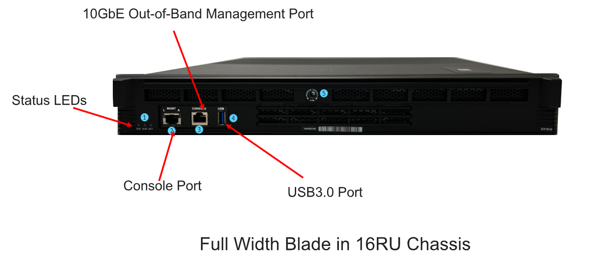
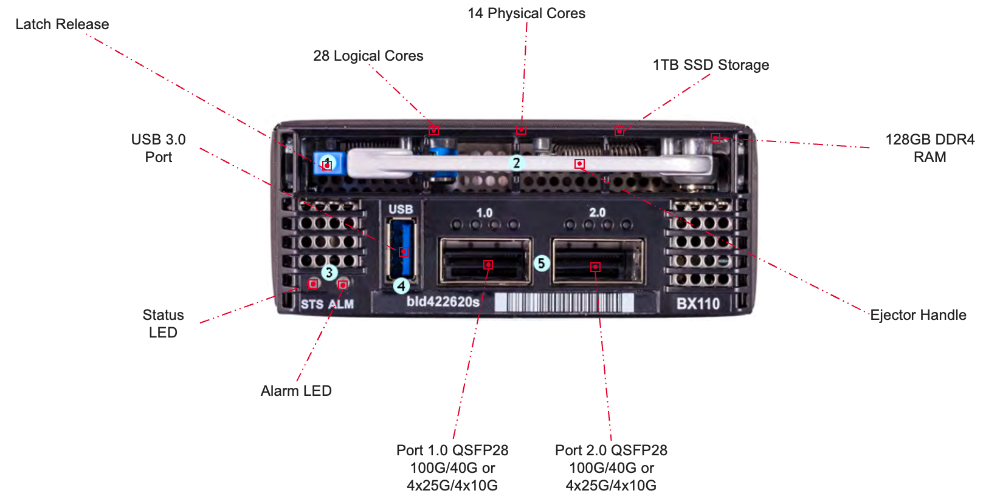

================
VELOS Components
================

CX410 Chassis
=============

The CX410 is a 4 Rack Unit (RU) chassis, that has eight ¼ width slots that can be populated by the BX110 or BX520 line cards, as well as 2 larger slots that are populated by the SX410 system controllers. The system controllers proxy console, and out-of-band Ethernet management for all the blades. There is an AC power version of the chassis, as well as a DC power version. The DC power version of VELOS is Network Equipment Building Systems (NEBS) compliant. NEBS standards are utilized all over the world for a host of commercial, utility, and defense applications. The standards are designed to ensure that the equipment continues to work at extremes of temperature, or after an extreme event, like an earthquake or a severe thunderstorm.  

.. image:: images/velos_components/image1.png
  :align: center
  :scale: 60%

CX1610 Chassis
=============

The CX1610 is a 16 Rack Unit (RU) chassis, that has thirty two ¼ width slots that can be populated by the BX110 or BX520 line cards, as well as 2 larger slots that are populated by the SX1610 system controllers. The system controllers proxy console, and out-of-band Ethernet management for all the blades. There is an AC power version of the chassis, as well as a DC power version. The DC power version of VELOS is Network Equipment Building Systems (NEBS) compliant. NEBS standards are utilized all over the world for a host of commercial, utility, and defense applications. The standards are designed to ensure that the equipment continues to work at extremes of temperature, or after an extreme event, like an earthquake or a severe thunderstorm.  

Rack Mounting the Chassis
=========================

An ideal environment for VELOS, is to use a minimum of a 30” rack. The rackmount kits that ship with the system will support the minimum depth of 30” and can telescope to longer depths if needed. If the rack depth is less than 30”, then custom rack mount kits will need to be ordered.   

Power Supplies & Controllers
============================

CX410 Power Supplies and Controllers
------------------------------------

The VELOS CX410 comes standard with 2 power supplies. Additional power supplies can be added to provide N+1, or N+N redundancy. The initial version of VELOS supports AC power, and up to 4 power supplies (each with their own input) can be installed within the chassis. A DC power version of the chassis is also available. Power supplies are removable from the front of the unit, by removing the LCD panel assembly. 

.. image:: images/velos_components/image3.png
  :width: 45%

.. image:: images/velos_components/image4.png
  :width: 45%

In the back of the chassis are 4 separate AC power inputs, and 2 redundant PSU controllers which are removable.

 

The PSU controllers are accessible in the upper left-hand corner of the back of the system.

.. image:: images/velos_components/image6.png
  :width: 45%

.. image:: images/velos_components/image7.png
  :width: 45%

A DC power version of the CX410 chassis is also available and runs the same system controllers and line cards.

.. image:: images/velos_components/image8.png
  :align: center

CX1610 Power Supplies and Controllers
------------------------------------

The VELOS CX1610 comes standard with 6 power supplies. Additional power supplies can be added to provide N+1, or N+N redundancy. The initial version of VELOS supports AC power, and up to 12 power supplies (each with their own input) can be installed within the chassis. A DC power version of the chassis is also available. Power supplies are removable from the front of the unit, by removing the LCD panel assembly. 

.. image:: images/velos_components/image3.png
  :width: 45%

.. image:: images/velos_components/image4.png
  :width: 45%

In the back of the chassis are 12 separate AC power inputs, and 4 redundant PSU controllers which are removable. Six of the power supplies and 2 of the power supply controllers are at the top of the chassis, and the remaining six power supplies and two more power supply controllers are at the bottom of the chassis.

 

The first two PSU controllers are accessible in the upper left-hand corner of the back of the system and the remaining two are accessible in the lower left-hand corner of the back of the system.

.. image:: images/velos_components/image6.png
  :width: 45%

.. image:: images/velos_components/image7.png
  :width: 45%

A DC power version of the CX410 chassis is also available and runs the same system controllers and line cards.

.. image:: images/velos_components/image8.png
  :align: center

Fan Trays & Cooling
===================

CX410 Fan Trays and Cooling
----------------------------

The VELOS chassis implements front-to-back cooling/airflow, and it is recommended that customers install such that VELOS is not intaking hot airflow from other devices. The fan tray is removable if it needs to be replaced but should not be removed for long periods of time, as overheating may occur. 

.. image:: images/velos_components/image9.png
  :align: center

.. image:: images/velos_components/image10.png
  :align: center

.. image:: images/velos_components/image11.png
  :align: center

CX1610 Fan Trays and Cooling
----------------------------

The VELOS chassis implements front-to-back cooling/airflow, and it is recommended that customers install such that VELOS is not intaking hot airflow from other devices. The CX1610 chassis has four removable fan trays. The fan trays are removable if one needs to be replaced, but should not be removed for long periods of time, as overheating may occur. 

.. image:: images/velos_components/image9.png
  :align: center

.. image:: images/velos_components/image10.png
  :align: center

.. image:: images/velos_components/image11.png
  :align: center

LCD Panel
==========

CX410 LCD Panel
----------------

In the initial release of VELOS most of the LCD functionality has not been enabled yet. The LCD will go through self-tests, and display the product name and F5 logo, but no diagnostics or configuration is supported at this time. The LCD assembly can be removed to gain access to the power supplies if needed. 

.. image:: images/velos_components/image12.png
  :align: center

.. image:: images/velos_components/image13.png
  :align: center

CX1610 LCD Panel
----------------

In the initial release of VELOS most of the LCD functionality has not been enabled yet. The LCD will go through self-tests, and display the product name and F5 logo, but no diagnostics or configuration is supported at this time. The LCD assembly can be removed to gain access to the power supplies if needed. 

.. image:: images/velos_components/image12.png
  :align: center

.. image:: images/velos_components/image13.png
  :align: center

System Controllers
===================

SX410 System Controllers
------------------------

Each CX410 chassis ships with two SX410 system controllers already installed. They are not optional and are not ordered separately. The system controllers perform two main functions:

*	They provide the active backplane connectivity, and layer2 switching to all line cards (BX110 and BX520)

     * They operate in an active/active manner from a layer2 switching perspective

*	They host the Kubernetes control plane functions

     * They operate in an active/standby manner for these functions

It is recommended that a system always operate with two system controllers for redundancy. If one should fail, the remaining system controller can take over, however backplane capacity will drop from 1.6Tbps to 800Gbps. The Kubernetes control plane will run on the active system controller and will fail over to the standby if the active should fail. 

.. image:: images/velos_components/image14.png
  :align: center
  :scale: 40%

All out-of-band management, and console access for the chassis is proxied through the system controllers. There is no need to cable these connections to the blades themselves, as was the case with VIPRION. The BX110 and BX520 blades have no console or out-of-band ethernet ports, it’s now centralized on the system controllers.

.. image:: images/velos_components/image15.png
  :align: center
  :scale: 100%

Looking at the left-hand side of the diagram below, you’ll notice the system controllers provide console and out-of-band management access to the chassis. This is proxied through the controller to the individual line cards. The system controllers have a built-in terminal server function, that allows direct connection to a blade if required. Each system controller also acts as a centralized switch fabric, interconnecting all blades in the system. Note, there are 2 100Gb backplane connections (primary and secondary) to each slot in the system, but only the primary connection is used with the first generation of BX110 blades. The BX520 blades utilize both 100Gb connections from each of the two slots the blade occupies (total 400Gb). 

.. image:: images/velos_components/image16.png
  :align: center
  :scale: 50%

SX1610 System Controllers
--------------------------

Each CX1610 chassis ships with two SX1610 system controllers already installed. They are not optional and are not ordered separately. The system controllers perform two main functions:

*	They provide the active backplane connectivity, and layer2 switching to all line cards (BX110 & BX520)

     * They operate in an active/active manner from a layer2 switching perspective

*	They host the Kubernetes control plane functions

     * They operate in an active/standby manner for these functions

It is recommended that a system always operate with two system controllers for redundancy. If one should fail, the remaining system controller can take over, however backplane capacity will drop from 6.4Tbps to 3.2Tbps in the CX1610 chassis. The Kubernetes control plane will run on the active system controller and will fail over to the standby if the active should fail. 

All out-of-band management, and console access for the chassis is proxied through the system controllers. There is no need to cable these connections to the blades themselves, as was the case with VIPRION. The BX110 and BX520 blades have no console or out-of-band ethernet ports, it’s now centralized on the system controllers.

Looking at the left-hand side of the diagram below, you’ll notice the system controllers provide console and out-of-band management access to the chassis. This is proxied through the controller to the individual line cards. The system controllers have a built-in terminal server function, that allows direct connection to a blade if required. Each system controller also acts as a centralized switch fabric, interconnecting all blades in the system. Note, there are 2 100Gb backplane connections (primary and secondary) to each slot in the system, but only the primary connection is used with the current first generation BX110 blades. The BX520 blades utilize both 100Gb connections from each of the two slots the blade occupies (total 400Gb). 

BX110 Blade
===========

The BX110 blade is a next generation data plane/line card. It has 2 high speed (QSFP+/QSFP28) ports, that can be configured for 40Gb, or 100Gb when bundled. If unbundled, then each port can be 4 x 25Gb, or 4 x 10Gb with the proper breakout cable and optics installed. There are no direct console or out-of-band connections to the blade, as those functions are now proxied by the system controllers. 

The BX110 has 14 physical cores, which are hyperthreaded into 28 vCPUs. Six of the vCPUs are reserved for the F5OS-C platform layer, leaving 22 vCPUs available for multitenancy. Each blade comes with a 1TB SSD drive and is populated with 128GB of RAM (double the current generation VIPRION B2250). Each BX110 has two Field Programmable Gate Arrays (FPGA's), which provide hardware offload for certain functions and workloads. The Application Traffic Service Engine (ATSE) is the “front panel FPGA”, which does initial classifications and offload, while the VELOS Queuing FPGA (VQF), is the “back panel FPGA” that implements queuing and CoS through the chassis backplane. The CPU complex provides hardware offload for SSL/TLS and compression, like previous generations of BIG-IP (such as iSeries and VIPRION B4450) performed these operations, but with a newer generation of processor. 

.. image:: images/velos_components/image18.png
  :align: center
  :scale: 50%

The SSD is removable, but not field replaceable. This allows customers who require that disks are destroyed before returning a blade for RMA have easy access to the SSD.

.. image:: images/velos_components/image19.png
  :align: center

BX520 Blade
===========

The BX520 blade is a next generation data plane/line card. It has 2 high speed (QSFP-DD) ports. The first port can be configured for either 100Gb or 4 x 100Gb (with the appropiate break out cable). The second port can be configured for either 4 x 100Gb(with the appropiate break out cable) or 400Gb. There are no direct console or out-of-band connections to the blade, as those functions are now proxied by the system controllers. 

The BX520 has 56 physical cores, which are hyperthreaded into 112 vCPUs. Eighteen of the vCPUs are reserved for the F5OS-C platform layer, leaving 96 vCPUs available for multitenancy. Each blade comes with a 4TB SSD drive and is populated with 512GB of RAM. Each BX520 has three Field Programmable Gate Arrays (FPGA's), which provide hardware offload for certain functions and workloads. The Traffic Aggregation Module (TAM) FPGA handles all front panel connections. The Application Traffic Service Engine (ATSE) handles initial classifications and offload, while the VELOS Queuing FPGA (VQF), is the “back panel FPGA” that implements queuing and CoS through the chassis backplane. The CPU complex provides hardware offload for SSL/TLS and compression, like previous generations of BIG-IP (such as iSeries and VIPRION B4450) performed these operations, but with a newer generation of processor. 

The SSD is removable, but not field replaceable. This allows customers who require that disks are destroyed before returning a blade for RMA have easy access to the SSD.

