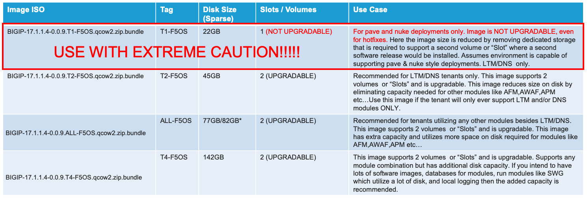
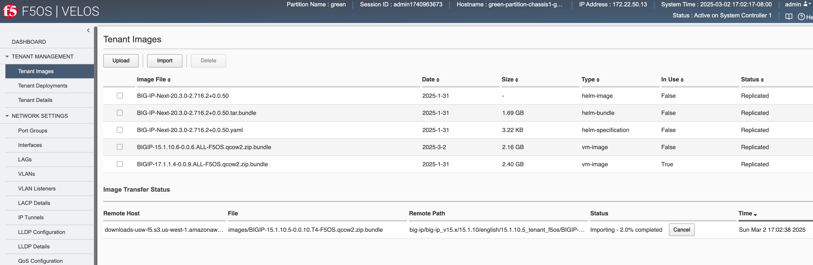
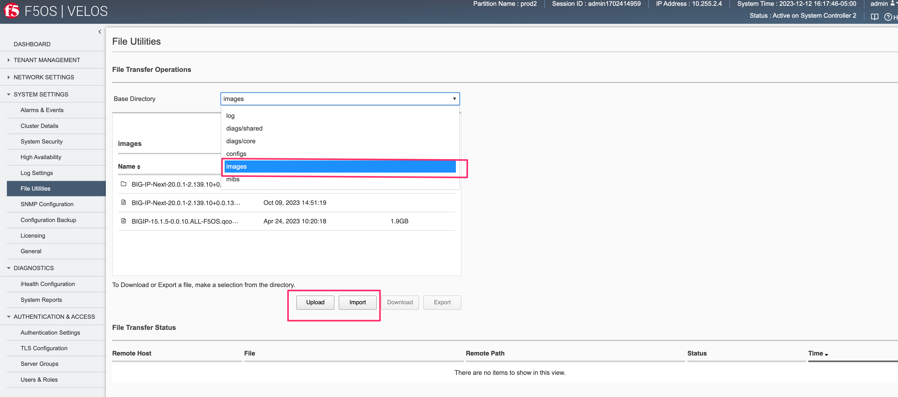
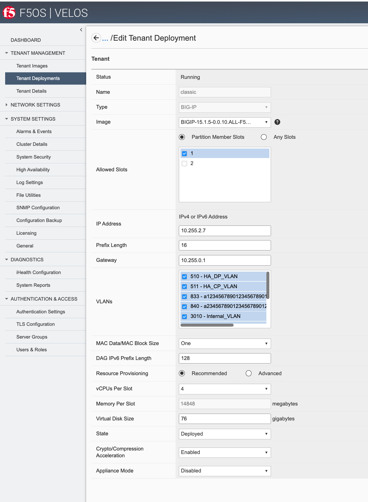
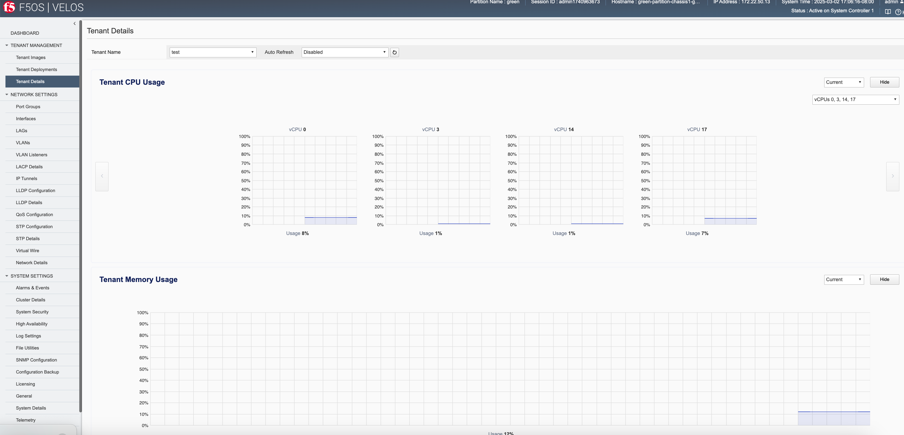

==================
Deploying a Tenant
==================

------------------
Tenant Image Types
------------------

Tenant images for F5OS are available on downloads.f5.com. VELOS allows different packaging options for tenant images. It will be up to administrators to choose the image that is best suited for their environment. The main differences between the image types will be how much space they can consume on disk, and whether they allow in place upgrades. VELOS only supports specific TMOS releases (currently 14.1.4 and later, and 15.1.4 and later). There is no plan to support v16.0, 16.1, or 17.0 tenants, and the next targeted tenant release will be v17.1. Tenant images for VELOS can be found on downloads.f5.com.

.. image:: images/velos_deploying_a_tenant/image1.png
  :align: center
  :scale: 70% 

Choose either 14.x or v15.x BIG-IP version, to get access to the F5OS supported tenant images. Ensure you choose the option that is labeled specifically for F5OS Tenant. As an example, **15.1.5_Tenant-F5OS**:

.. image:: images/velos_deploying_a_tenant/image2.png
  :align: center
  :scale: 70% 

There are 4 different types of tenant images to choose from (ALL, T1, T2, T4) as seen below; please read the rest of this section to determine the best image type for your environment:

.. image:: images/velos_deploying_a_tenant/image3.png
  :align: center
  :scale: 70% 

The **T1-F5OS** image type should be used with extreme caution. It is the smallest of the image sizes, but it only has one slot/volume for TMOS software, meaning it does not support upgrades (not even for hotfixes). This type of image is geared toward more modern environments where pave and nuke strategies are preferred over in-place upgrades.   

The remaining images (T2, ALL, T4) all support in place upgrades; however, they may limit the amount of disk space that can be used by the tenant. If more disk space is needed by the tenant in the future, the tenant can be moved to provisioned state and the disk can be expanded. There is no ability to decrease the disk space, so starting smaller and increasing will ensure there is adequate disk space for many tenants. 

The **T2-F5OS** image is intended for a tenant that will run LTM and / or DNS only; it is not suitable for tenants needing other modules provisioned (AVR may be an exception). This type of image is best suited in a high-density tenant environment where the number of tenants is going to be high per blade and using minimum CPU resources (1 or 2 vCPUs per tenant). You may want to limit the amount of disk space each tenant can use as a means of ensuring the file system on the blade does not become full. As an example, there is 1TB of disk per blade, and 22 tenants each using the 142GB T4 image would lead to an over provisioning situation. Because tenants are deployed in sparse mode which allows over provisioning, this may not be an issue initially, but could become a problem later in the tenant’s lifespan as it writes more data to disk. To keep the tenants in check, you can deploy smaller T2 images, which can consume 45GB each. LTM/DNS deployments use much less disk than other BIG-IP modules, which do extensive local logging and utilize databases on disk.

The **All-F5OS** image is suitable for any module configuration and supports a maximum of 76GB for the tenant. It is expected that the number of tenants per blade would be much less, as the module combinations that drive the need for more disk space typically require more CPU/memory, which will artificially reduce the tenant count per blade. Having a handful of 76GB or 156GB images per blade should not lead to an out of space condition. There are some environments where some tenants may need more disk space and the T4 image can provide for that. It may be best to default using the T4 image as that is essentially the default size for vCMP deployments today. 

The **T4-VELOS** image also supports any module combination but has additional disk capacity. If you intend to have a lot of software images, databases for modules, run modules like SWG which utilize a lot of disk, and local logging, then the added capacity is recommended. More detail on the image types can be found in the following solution article.

https://support.f5.com/csp/article/K45191957

Note that the image sizes in the chart are the maximum amount of space a tenant could use, not necessarily what it will consume on the physical disk. VELOS tenants are deployed in sparse mode on the file system when they are created. That means that a tenant may think it has a certain amount of disk space, but in reality, most of the space that is unused is zeroed-out and not consuming any space on the disk. 

This means the disk consumption on the chassis partition disk is much smaller than what appears inside the tenant. In the example below the tenant believes it has 77GB of disk allocated:

.. image:: images/velos_deploying_a_tenant/image6.png
  :align: center
  :scale: 70% 

However, the 76GB image is allocated in a sparse manner meaning the tenant is only utilizing what it needs, and on the file system of the blade it is consuming only 11GB on the disk:

This is analogous to thin provisioning in a hypervisor, where you can over-allocate resources. vCMP as an example today uses an image similar in size to the T4 image. There may be rare instances where a tenant running in production for a long time can end up with lots of extra space consumed on disk. This could be due to many in-place software upgrades, local logging, core files, database use and other factors. There is no utility available to reclaim that space that may have been used at one point but is no longer used. If the disk utilization becomes over-utilized, you could back up the tenant configuration, create a new fresh tenant, and restore the configuration from the old tenant, and then delete the old tenant. This would free up all the unused space again.

------------------
Tenant Deployments
------------------

Tenants can easily be deployed via the F5OS CLI, webUI, or API.

Tenant Deployment via CLI
-------------------------

Uploading a Tenant Image via CLI
================================

Tenant software images are loaded directly into the F5OS chassis partition layer. For the initial release of VELOS, supported tenant versions are v14.1.4 and later and 15.1.4 and later. No other TMOS versions are supported other than hotfixes or rollups based on those versions of software, and upgrades to newer versions happen within the tenant itself, not in the F5OS layer. The images inside F5OS are for initial deployment only. VELOS tenants do not support versions 16.0, 16.0 or 17.0, you can run either the minimum 14.1.4/15.1.4 releases or later or any versions 17.1.x and later.

Before deploying any tenant, you must ensure you have a proper tenant software release loaded into the F5OS chassis partition layer. If an HTTPS/SCP/SFTP server is not available, you may upload a tenant image using scp directly to the F5OS platform layer. Simply SCP an image to the out-of-band management IP address using the admin account and a path of **IMAGES**. There are also other upload options available in the webUI (Upload from Browser) or API (HTTPS/SCP/SFTP). Below is an example of using SCP from a remote client to the IP address of the VELOS chassis partition.

.. code-block:: bash

    scp BIGIP-15.1.5-0.0.8.ALL-F5OS.qcow2.zip.bundle admin@10.255.0.132:IMAGES

You may also import the tenant image file from the F5OS CLI. Use the **file import** command to get the tenant image file from a remote HTTPS server or from a remote server over SCP or SFTP. Below is an example of importing from a remote HTTPS server. Note the target directory should be **images/tenant**:

.. code-block:: bash

    Production1# file import remote-host 10.255.0.142 remote-file /upload/BIGIP-15.1.4-0.0.47.ALL-VELOS.qcow2.zip.bundle local-file images/tenant/BIGIP-15.1.4-0.0.47.ALL-VELOS.qcow2.zip.bundle username corpuser insecure
    Value for 'password' (<string>): ********
    result File transfer is initiated.(images/tenant/BIGIP-15.1.4-0.0.47.ALL-VELOS.qcow2.zip.bundle)

If a remote HTTPS server is not available, you may also import the file from the CLI over SCP by adding the **protocol scp** option to the command line:

.. code-block:: bash

    Production1# file import remote-host 10.255.0.142 remote-file /var/www/server/1/upload/BIGIP-15.1.4-0.0.47.ALL-VELOS.qcow2.zip.bundle local-file images/tenant/BIGIP-15.1.4-0.0.47.ALL-VELOS.qcow2.zip.bundle username root insecure protocol scp
    Value for 'password' (<string>): ********
    result File transfer is initiated.(images/tenant/BIGIP-15.1.4-0.0.47.ALL-VELOS.qcow2.zip.bundle)

The command **file transfer-status** will provide details of the transfer progress and any errors:

.. code-block:: bash

    Production1# file import remote-host 10.255.0.142 remote-file /var/www/server/1/upload/BIGIP-15.1.4-0.0.47.ALL-VELOS.qcow2.zip.bundle local-file images/tenant/BIGIP-15.1.4-0.0.47.ALL-VELOS.qcow2.zip.bundle username root insecure protocol scp
    Value for 'password' (<string>): ********
    result File transfer is initiated.(images/tenant/BIGIP-15.1.4-0.0.47.ALL-VELOS.qcow2.zip.bundle)

.. code-block:: bash

  Production-1# show file transfer-operations 
  file transfer-operations transfer-operation "" "" "" "" ""
  status    "    HTTP Error 302"
  timestamp "Wed Apr 26 15:53:38 2023"
  file transfer-operations transfer-operation images/BIG-IP-Next-0.13.0-2.13.6.tar.bundle artifactory.f5net.com artifactory/f5-mbip-generic/releases/0.13.0/test-candidate/2.13.6/velos/BIG-IP-Next-0.13.0-2.13.6.tar.bundle "Import file" "HTTPS   "
  status    "         Completed"
  timestamp "Fri Apr 14 03:08:44 2023"
  file transfer-operations transfer-operation images/BIG-IP-Next-0.14.0-2.29.0.tar.bundle sea.artifactory.f5net.com artifactory/f5-mbip-generic/releases/0.14.0/test-candidate/2.29.0/velos/BIG-IP-Next-0.14.0-2.29.0.tar.bundle "Import file" "HTTPS   "
  status    "         Completed"
  timestamp "Tue May 16 02:56:59 2023"
  file transfer-operations transfer-operation images/BIG-IP-Next-0.14.0-2.45.3+0.0.12.tar.bundle artifactory.f5net.com artifactory/f5-mbip-generic/releases/0.14.0/release-candidate/2.45.3+0.0.12/velos/BIG-IP-Next-0.14.0-2.45.3+0.0.12.tar.bundle "Import file" "HTTPS   "
  status    "         Completed"
  timestamp "Thu Jun  8 13:42:22 2023"
  file transfer-operations transfer-operation images/BIG-IP-Next-0.14.0-2.45.3+0.0.12.tgz.512.sig artifactory.f5net.com artifactory/f5-mbip-generic/releases/0.14.0/release-candidate/2.45.3+0.0.12/ve-upgrade/BIG-IP-Next-0.14.0-2.45.3+0.0.12.tgz.512.sig "Import file" "HTTPS   "
  status    "         Completed"
  timestamp "Thu Jun  8 13:38:55 2023"
  file transfer-operations transfer-operation images/BIG-IP-Next-0.14.0-2.45.3+0.0.24.tar.bundle artifactory.f5net.com artifactory/f5-mbip-generic/releases/0.14.0/release-candidate/2.45.3+0.0.24/velos/BIG-IP-Next-0.14.0-2.45.3+0.0.24.tar.bundle "Import file" "HTTPS   "
  status    "         Completed"
  timestamp "Wed Jun 21 19:33:45 2023"
  file transfer-operations transfer-operation images/BIG-IP-Next-0.15.0-2.94.0+0.0.1.tar.bundle sea.artifactory.f5net.com artifactory/f5-mbip-generic/releases/0.15.0/test-candidate/2.94.0+0.0.1/velos/BIG-IP-Next-0.15.0-2.94.0+0.0.1.tar.bundle "Import file" "HTTPS   "
  status    "         Completed"
  timestamp "Fri Jul 14 16:56:37 2023"
  file transfer-operations transfer-operation images/BIG-IP-Next-0.15.0-2.94.0+0.0.3.tar.bundle artifactory.f5net.com artifactory/f5-mbip-generic/releases/0.15.0/test-candidate/2.94.0+0.0.3/velos/BIG-IP-Next-0.15.0-2.94.0+0.0.3.tar.bundle "Import file" "HTTPS   "
  status    "         Completed"
  timestamp "Wed Jul 19 19:48:46 2023"
  file transfer-operations transfer-operation images/BIGIP-15.1.6.1-0.0.10.ALL-F5OS.qcow2.zip.bundle spkapexsrvc01.olympus.f5net.com v15.1.6.1/daily/build10.0/VM/BIGIP-15.1.6.1-0.0.10.ALL-F5OS.qcow2.zip.bundle "Import file" "HTTPS   "
  status    "         Completed"
  timestamp "Wed May  3 14:07:22 2023"
  file transfer-operations transfer-operation images/BIGIP-17.1.0.1-0.0.2.ALL-F5OS.qcow2.zip.bundle nibs.olympus.f5net.com build/bigip/v17.1.0.1/daily/build2.0/VM/BIGIP-17.1.0.1-0.0.2.ALL-F5OS.qcow2.zip.bundle "Import file" "HTTPS   "
  status    "    HTTP Error 302"
  timestamp "Wed Apr 26 15:53:38 2023"
  Production-1# 
 

You can view the current tenant images and their status in the F5OS CLI by using the **show images** command:

.. code-block:: bash

  Production-1# show images 
                                                  IN                                     
  NAME                                             USE    TYPE                STATUS      
  ----------------------------------------------------------------------------------------
  BIG-IP-Next-0.13.0-2.13.6                        false  helm-image          replicated  
  BIG-IP-Next-0.13.0-2.13.6.tar.bundle             false  helm-bundle         replicated  
  BIG-IP-Next-0.13.0-2.13.6.yaml                   false  helm-specification  replicated  
  BIG-IP-Next-0.13.0-4.88.0                        false  helm-image          replicated  
  BIG-IP-Next-0.13.0-4.88.0.tar.bundle             false  helm-bundle         replicated  
  BIG-IP-Next-0.13.0-4.88.0.yaml                   false  helm-specification  replicated  
  BIG-IP-Next-0.14.0-2.45.3+0.0.24                 false  helm-image          replicated  
  BIG-IP-Next-0.14.0-2.45.3+0.0.24.tar.bundle      false  helm-bundle         replicated  
  BIG-IP-Next-0.14.0-2.45.3+0.0.24.yaml            false  helm-specification  replicated  
  BIG-IP-Next-0.15.0-2.94.0+0.0.3                  true   helm-image          replicated  
  BIG-IP-Next-0.15.0-2.94.0+0.0.3.tar.bundle       true   helm-bundle         replicated  
  BIG-IP-Next-0.15.0-2.94.0+0.0.3.yaml             true   helm-specification  replicated  
  BIGIP-15.1.6.1-0.0.10.ALL-F5OS.qcow2.zip.bundle  false  vm-image            replicated  

  Production-1#

Creating a Tenant via CLI
=========================

Tenant lifecycle can be fully managed via the CLI using the **tenants** command in **config** mode on the chassis partition. Using command tab completion and question marks will help display all the tenant options. Enter **config** mode and enter the command **tenants tenant <tenant-name>** where **<tenant-name>** is the name of the tenant you would like to create. This will put you into a mode for that tenant and you will be prompted for some basic information to create the tenant via a CLI wizard. After answering basic information you may configure additional tenant parameters by entering **config ?** within the tenant mode, and that will provide all the additional configuration options:

.. code-block:: bash

    Production-1(config)# tenants tenant tenant2                        
    Value for 'config image' (<string>): BIGIP-14.1.4-0.0.619.ALL-VELOS.qcow2.zip.bundle
    Value for 'config mgmt-ip' (<IPv4 address>): 10.255.0.205
    Value for 'config prefix-length' (<unsignedByte, 1 .. 32>): 24
    Value for 'config gateway' (<IPv4 address>): 10.255.0.1

When you are inside the tenant mode you can enter each configuration item one line at a time using tab completion and question mark for help. 

.. code-block:: bash

  Production-1# config
  Entering configuration mode terminal
  Production-1(config)# tenants tenant tenant2 
  Production-1(config-tenant-tenant2)# config ?
  Possible completions:
    appliance-mode        
    cryptos               Enable crypto devices for the tenant.
    gateway               User-specified gateway for the tenant mgmt-ip.
    image                 User-specified image for tenant.
    memory                User-specified memory in MBs for the tenant.
    mgmt-ip               User-specified mgmt-ip for the tenant management access.
    nodes                 User-specified node-number(s) in the partition to schedule the tenant.
    prefix-length         User-specified prefix-length for the tenant mgmt-ip.
    running-state         User-specified desired state for the tenant.
    storage               User-specified storage information
    tenant-auth-support   Security can be enabled/disabled when tenant is Not in deployed state.
    type                  Tenant type.
    vcpu-cores-per-node   User-specified number of logical cpu cores for the tenant.
    vlans                 User-specified vlan-id from partition vlan table for the tenant.
  Production-1(config-tenant-tenant2)# config cryptos enabled 
  Production-1(config-tenant-tenant2)# config vcpu-cores-per-node 4
  Production-1(config-tenant-tenant2)# config type BIG-IP 
  Production-1(config-tenant-tenant2)# config nodes 2
  Production-1(config-tenant-tenant2)# config vlans 444        
  Production-1(config-tenant-tenant2)# config vlans 500
  Production-1(config-tenant-tenant2)# config vlans 555
  Production-1(config-tenant-tenant3)# config storage size 76
  Production-1(config-tenant-tenant2)# config running-state deployed
  Production-1(config-tenant-tenant2)# config memory 14848

Any changes must be committed for them to be executed:

.. code-block:: bash

  Production-1(config-tenant-tenant2)# commit
	
You may also put all the parameters on one line:

.. code-block:: bash

  Production-1(config)# tenants tenant tenant2 config image BIGIP-14.1.4-0.0.619.ALL-VELOS.qcow2.zip.bundle vcpu-cores-per-node 2 nodes [ 1 2 ] vlans [ 2001 3001 ] mgmt-ip 10.144.140.107 prefix-length 24 gateway 10.144.140.254 name cbip3 running-state configured
  Production-1 (tenant2)# commit
  Commit complete.

After the tenant is created you can run the command **show running-config tenant** to see what has been configured:

.. code-block:: bash

  Production-1# show run tenant
  tenants tenant bigtenant
  config name         bigtenant
  config type         BIG-IP
  config image        BIGIP-14.1.4-0.0.619.ALL-VELOS.qcow2.zip.bundle
  config nodes        [ 1 2 ]
  config mgmt-ip      10.255.0.149
  config prefix-length 24
  config gateway      10.255.0.1
  config vlans        [ 444 500 555 ]
  config cryptos      enabled
  config vcpu-cores-per-node 6
  config memory       22016
  config running-state deployed
  config appliance-mode disabled
  !

To see the actual status of the tenants, issue the CLI command **show tenants**.

.. code-block:: bash

  Production-1# show tenants 
  tenants tenant bigtenant
  state name          bigtenant
  state type          BIG-IP
  state mgmt-ip       10.255.0.149
  state prefix-length 24
  state gateway       10.255.0.1
  state vlans         [ 444 500 555 ]
  state cryptos       enabled
  state vcpu-cores-per-node 6
  state memory        22016
  state running-state deployed
  state mac-data base-mac 00:94:a1:8e:d0:0b
  state mac-data mac-pool-size 1
  state appliance-mode disabled
  state status        Running
  state primary-slot  1
  state image-version "BIG-IP 14.1.4 0.0.619"
  NDI      MAC                
  ----------------------------
  default  00:94:a1:8e:d0:09  

        INSTANCE                                                                                                                                                    
  NODE  ID        PHASE    IMAGE NAME                                       CREATION TIME         READY TIME            STATUS                   MGMT MAC           
  ------------------------------------------------------------------------------------------------------------------------------------------------------------------
  1     1         Running  BIGIP-14.1.4-0.0.619.ALL-VELOS.qcow2.zip.bundle  2021-01-15T17:15:03Z  2021-01-15T17:15:00Z  Started tenant instance  0a:27:45:20:90:c4  
  2     2         Running  BIGIP-14.1.4-0.0.619.ALL-VELOS.qcow2.zip.bundle  2021-01-15T17:15:03Z  2021-01-15T17:14:59Z  Started tenant instance  52:02:73:bf:ee:ac  

  tenants tenant tenant2
  state name          tenant2
  state type          BIG-IP
  state mgmt-ip       10.255.0.205
  state prefix-length 24
  state gateway       10.255.0.1
  state vlans         [ 444 500 555 ]
  state cryptos       enabled
  state vcpu-cores-per-node 4
  state memory        14848
  state running-state deployed
  state mac-data base-mac 00:94:a1:8e:d0:0d
  state mac-data mac-pool-size 1
  state appliance-mode disabled
  state status        Starting
  NDI      MAC                
  ----------------------------
  default  00:94:a1:8e:d0:0e  

        INSTANCE                                                                                                  CREATION  READY          MGMT  
  NODE  ID        PHASE                                          IMAGE NAME                                       TIME      TIME   STATUS  MAC   
  -----------------------------------------------------------------------------------------------------------------------------------------------
  2     2         Allocating resources to tenant is in progress  BIGIP-14.1.4-0.0.619.ALL-VELOS.qcow2.zip.bundle                           -     

Validating Tenant Status via CLI
================================

After the tenant is created you can run the command **show running-config tenant** to see what has been configured:

.. code-block:: bash

  Production-1# show run tenant
  tenants tenant bigtenant
  config name         bigtenant
  config type         BIG-IP
  config image        BIGIP-14.1.4-0.0.619.ALL-VELOS.qcow2.zip.bundle
  config nodes        [ 1 2 ]
  config mgmt-ip      10.255.0.149
  config prefix-length 24
  config gateway      10.255.0.1
  config vlans        [ 444 500 555 ]
  config cryptos      enabled
  config vcpu-cores-per-node 6
  config memory       22016
  config running-state deployed
  config appliance-mode disabled
  !

To see the actual status of the tenants, issue the CLI command **show tenants**.

.. code-block:: bash

  Production-1# show tenants 
  tenants tenant bigtenant
  state name          bigtenant
  state type          BIG-IP
  state mgmt-ip       10.255.0.149
  state prefix-length 24
  state gateway       10.255.0.1
  state vlans         [ 444 500 555 ]
  state cryptos       enabled
  state vcpu-cores-per-node 6
  state memory        22016
  state running-state deployed
  state mac-data base-mac 00:94:a1:8e:d0:0b
  state mac-data mac-pool-size 1
  state appliance-mode disabled
  state status        Running
  state primary-slot  1
  state image-version "BIG-IP 14.1.4 0.0.619"
  NDI      MAC                
  ----------------------------
  default  00:94:a1:8e:d0:09  

        INSTANCE                                                                                                                                                    
  NODE  ID        PHASE    IMAGE NAME                                       CREATION TIME         READY TIME            STATUS                   MGMT MAC           
  ------------------------------------------------------------------------------------------------------------------------------------------------------------------
  1     1         Running  BIGIP-14.1.4-0.0.619.ALL-VELOS.qcow2.zip.bundle  2021-01-15T17:15:03Z  2021-01-15T17:15:00Z  Started tenant instance  0a:27:45:20:90:c4  
  2     2         Running  BIGIP-14.1.4-0.0.619.ALL-VELOS.qcow2.zip.bundle  2021-01-15T17:15:03Z  2021-01-15T17:14:59Z  Started tenant instance  52:02:73:bf:ee:ac  

  tenants tenant tenant2
  state name          tenant2
  state type          BIG-IP
  state mgmt-ip       10.255.0.205
  state prefix-length 24
  state gateway       10.255.0.1
  state vlans         [ 444 500 555 ]
  state cryptos       enabled
  state vcpu-cores-per-node 4
  state memory        14848
  state running-state deployed
  state mac-data base-mac 00:94:a1:8e:d0:0d
  state mac-data mac-pool-size 1
  state appliance-mode disabled
  state status        Starting
  NDI      MAC                
  ----------------------------
  default  00:94:a1:8e:d0:0e  

        INSTANCE                                                                                                  CREATION  READY          MGMT  
  NODE  ID        PHASE                                          IMAGE NAME                                       TIME      TIME   STATUS  MAC   
  -----------------------------------------------------------------------------------------------------------------------------------------------
  2     2         Allocating resources to tenant is in progress  BIGIP-14.1.4-0.0.619.ALL-VELOS.qcow2.zip.bundle     

Tenant Deployment via webUI
---------------------------

Uploading a Tenant Image via webUI
==================================

You can upload a tenant image via the webUI in two different places. The first is by going to the **Tenant Management > Tenant Images** page. Click the **Add** button and you will receive a pop-up asking for the URL of a remote HTTPS server with optional credentials, and the ability to ignore certificate warnings. There is also an option to upload directly from a computer via the browser using the **Upload** option.

.. image:: images/velos_deploying_a_tenant/image9.png
  :align: center
  :scale: 70% 

After the image is uploaded you need to wait until it shows **Replicated** status before deploying a tenant.

Alternatively, you can upload from the **System Settings > File Utilities** page.

Creating a Tenant via webUI
============================

You can deploy a tenant from the webUI using the **Add** button in the **Tenant Management > Tenant Deployments** screen.

.. image:: images/velos_deploying_a_tenant/image10.png
  :align: center
  :scale: 70% 

The tenant deployment options are almost identical to deploying a vCMP guest, with a few minor differences. You’ll supply the tenant a name and choose the image for it to run. Next, you will pick what slots (blades) within the chassis partition you want the tenant to run on and assign an out-of-band management address, prefix, and gateway. There are **Recommended** and **Advanced** options for resource provisioning, Choosing Recommended will automatically adjust memory based on the vCPUs allocated to the tenant. Choosing Advanced will allow you to over-allocate memory which is something VIPRION did not support. You can choose different states (Configured, Provisioned, Deployed) just like vCMP, and there is an option to enable/disable hardware crypto acceleration (Enable is recommended). And finally, there is an option to enable Appliance mode which will disable root/bash access to the tenant.

Validating Tenant Status via webUI
===================================

You can validate the current high level status of a VELOS tenant in the webUI by clicking on the **Tenant Management** -> **Tenant Deployments** page. Here you can see the software version of the tenant (if it is running), as well as the high-level configuration for that tenant.

.. image:: images/velos_deploying_a_tenant/tenantstatus1.png
  :align: center
  :scale: 70% 

You can get further detail abd status of the tenant by clicking on the **Tenant Management** -> **Tenant Details** page. If a tenant encountered an issue during startup, it would show details here, and sometimes hovering over the status will provide even more details.

Tenant Deployment via API
-------------------------

The VELOS tenant lifecycle is fully supported in the F5OS API. This section will cover common examples.

Uploading a Tenant Image via API
================================

The upload utility requires a remote HTTPS, SCP, or SFTP server that is hosting the tenant image file. All API calls for tenant lifecycle are posted to the IP address of the chassis partition. To copy a tenant image into a chassis partition from a remote HTTPS server, use the following API call to the chassis partition IP address:

.. code-block:: bash

    POST https://{{velos_chassis1_chassis_partition1_ip}}:8888/api/data/f5-utils-file-transfer:file/import

.. code-block:: json

    {
        "input": [
            {
                "remote-host": "10.255.0.142",
                "remote-file": "upload/{{Tenant_Image}}",
                "local-file": "images/{{Tenant_Image}}",
                "insecure": "",
                "f5-utils-file-transfer:username": "corpuser",
                "f5-utils-file-transfer:password": "Passw0rd!!"
            }
        ]
    }

To list the current tenant images available on the chassis partition, use the following API Call:

.. code-block:: bash

    GET https://{{velos_chassis1_chassis_partition1_ip}}:8888/restconf/data/f5-tenant-images:images

Below is output generated from the previous command:

.. code-block:: json

    {
        "f5-tenant-images:images": {
            "image": [
                {
                    "name": "BIGIP-15.1.4-0.0.46.ALL-VELOS.qcow2.zip.bundle",
                    "in-use": true,
                    "status": "replicated"
                },
                {
                    "name": "BIGIP-15.1.4-0.0.47.ALL-VELOS.qcow2.zip.bundle",
                    "in-use": false,
                    "status": "replicated"
                }
            ]
        }
    }

Creating a Tenant via API
=========================

Tenant creation via the API is as simple as defining the parameters below and sending the POST to the chassis partition.

.. code-block:: bash

  POST https://{{velos_chassis1_chassis_partition1_ip}}:8888/restconf/data/f5-tenants:tenants

.. code-block:: json

  {
      "tenant": [
          {
              "name": "{{New_Tenant1_Name}}",
              "config": {
                  "image": "{{Tenant_Image}}",
                  "nodes": [
                      1
                  ],
                  "mgmt-ip": "{{Chassis1_Tenant1_IP}}",
                  "gateway": "{{OutofBand_DFGW}}",
                  "prefix-length": 24,
                  "vlans": [
                      3010,
                      501,
                      3011
                  ],
                  "vcpu-cores-per-node": 2,
                  "memory": 7680,
                  "cryptos": "enabled",
                  "storage": {
                      "size": 76
                  },
                  "running-state": "deployed"
              }
          }
      ]
  }

Validating Tenant Status via API
================================

You can validate the status of all tenants within the chassis partition using the following API call.

.. code-block:: bash

  GET https://{{Chassis1_Partition_IP}}:8888/restconf/data/f5-tenants:tenants

Below is an example output from a VELOS system:

.. code-block:: json

  {
      "f5-tenants:tenants": {
          "tenant": [
              {
                  "name": "tenant1",
                  "config": {
                      "name": "tenant1",
                      "type": "BIG-IP",
                      "image": "BIGIP-15.1.5-0.0.10.T4-F5OS.qcow2.zip.bundle",
                      "nodes": [
                          1
                      ],
                      "mgmt-ip": "10.255.0.149",
                      "prefix-length": 24,
                      "gateway": "10.255.0.1",
                      "vlans": [
                          501,
                          3010,
                          3011
                      ],
                      "cryptos": "enabled",
                      "tenant-auth-support": "disabled",
                      "vcpu-cores-per-node": 2,
                      "memory": "7680",
                      "storage": {
                          "size": 70
                      },
                      "running-state": "configured",
                      "appliance-mode": {
                          "enabled": false
                      }
                  },
                  "state": {
                      "name": "tenant1",
                      "unit-key-hash": "3LKG3f3UTbc5Talm3+D5uKodIC/LsO5w43m0n3EYHLOMEJM0E4E0Q27OK3WLWma4tBpY6Nu59i1m4HA+hR81hA==",
                      "type": "BIG-IP",
                      "image": "BIGIP-15.1.5-0.0.10.T4-F5OS.qcow2.zip.bundle",
                      "nodes": [
                          1
                      ],
                      "mgmt-ip": "10.255.0.149",
                      "prefix-length": 24,
                      "gateway": "10.255.0.1",
                      "mac-ndi-set": [
                          {
                              "ndi": "default",
                              "mac": "00:94:a1:8e:d0:09"
                          }
                      ],
                      "vlans": [
                          501,
                          3010,
                          3011
                      ],
                      "cryptos": "enabled",
                      "tenant-auth-support": "disabled",
                      "vcpu-cores-per-node": 2,
                      "memory": "7680",
                      "storage": {
                          "size": 70
                      },
                      "running-state": "configured",
                      "mac-data": {
                          "base-mac": "00:94:a1:8e:d0:0b",
                          "mac-pool-size": 1
                      },
                      "appliance-mode": {
                          "enabled": false
                      },
                      "status": "Configured"
                  }
              },
              {
                  "name": "tenant2",
                  "config": {
                      "name": "tenant2",
                      "type": "BIG-IP",
                      "image": "BIGIP-15.1.5-0.0.10.T4-F5OS.qcow2.zip.bundle",
                      "nodes": [
                          1
                      ],
                      "mgmt-ip": "10.255.0.205",
                      "prefix-length": 24,
                      "gateway": "10.255.0.1",
                      "vlans": [
                          502,
                          3010,
                          3011
                      ],
                      "cryptos": "enabled",
                      "tenant-auth-support": "disabled",
                      "vcpu-cores-per-node": 6,
                      "memory": "22016",
                      "storage": {
                          "size": 76
                      },
                      "running-state": "deployed",
                      "appliance-mode": {
                          "enabled": false
                      }
                  },
                  "state": {
                      "name": "tenant2",
                      "unit-key-hash": "cDzVBaFAZD+kHosgnwjzteF9D13BsmvcgXCdz2xMi8kztd0uxouyTNkvPt8uSaNLu5i5VyTLSRFt8fkcJahEvg==",
                      "type": "BIG-IP",
                      "image": "BIGIP-15.1.5-0.0.10.T4-F5OS.qcow2.zip.bundle",
                      "nodes": [
                          1
                      ],
                      "mgmt-ip": "10.255.0.205",
                      "prefix-length": 24,
                      "gateway": "10.255.0.1",
                      "mac-ndi-set": [
                          {
                              "ndi": "default",
                              "mac": "00:94:a1:8e:d0:0a"
                          }
                      ],
                      "vlans": [
                          502,
                          3010,
                          3011
                      ],
                      "cryptos": "enabled",
                      "tenant-auth-support": "disabled",
                      "vcpu-cores-per-node": 6,
                      "memory": "22016",
                      "storage": {
                          "size": 76
                      },
                      "running-state": "deployed",
                      "mac-data": {
                          "base-mac": "00:94:a1:8e:d0:0c",
                          "mac-pool-size": 1
                      },
                      "appliance-mode": {
                          "enabled": false
                      },
                      "status": "Starting",
                      "instances": {
                          "instance": [
                              {
                                  "node": 1,
                                  "pod-name": "tenant2-1",
                                  "instance-id": 1,
                                  "phase": "Pending",
                                  "creation-time": "2022-03-29T04:49:41Z",
                                  "ready-time": "",
                                  "status": "0/5 nodes are available: 2 Insufficient devices.kubevirt.io/kvm, 2 Insufficient devices.kubevirt.io/tun, 2 Insufficient devices.kubevirt.io/vhost-net, 2 Insufficient hugepages-2Mi, 4 node(s) didn't match node selector, 5 Insufficient f5.com/qat.",
                                  "mgmt-mac": "00:00:00:00:00:00"
                              }
                          ]
                      }
                  }
              },
              {
                  "name": "tenant3",
                  "config": {
                      "name": "tenant3",
                      "type": "BIG-IP",
                      "image": "BIGIP-15.1.5-0.0.10.T4-F5OS.qcow2.zip.bundle",
                      "nodes": [
                          1
                      ],
                      "mgmt-ip": "5.5.5.5",
                      "prefix-length": 24,
                      "gateway": "5.5.5.254",
                      "cryptos": "enabled",
                      "tenant-auth-support": "disabled",
                      "vcpu-cores-per-node": 2,
                      "memory": "7680",
                      "storage": {
                          "size": 76
                      },
                      "running-state": "configured",
                      "appliance-mode": {
                          "enabled": false
                      }
                  },
                  "state": {
                      "name": "tenant3",
                      "unit-key-hash": "LopnQ/ImnqSeOnTTraC84M9FITYVz2//d6lS4wpQxoc5AzQr/dtjy6aU2Q225JURT4viuWj9HwjB19KZSW6KEA==",
                      "type": "BIG-IP",
                      "image": "BIGIP-15.1.5-0.0.10.T4-F5OS.qcow2.zip.bundle",
                      "nodes": [
                          1
                      ],
                      "mgmt-ip": "5.5.5.5",
                      "prefix-length": 24,
                      "gateway": "5.5.5.254",
                      "cryptos": "enabled",
                      "tenant-auth-support": "disabled",
                      "vcpu-cores-per-node": 2,
                      "memory": "7680",
                      "storage": {
                          "size": 76
                      },
                      "running-state": "configured",
                      "mac-data": {
                          "base-mac": "00:94:a1:8e:d0:0d",
                          "mac-pool-size": 1
                      },
                      "appliance-mode": {
                          "enabled": false
                      },
                      "status": "Configured"
                  }
              }
          ]
      }
  }

-----------------
Resizing a Tenant
-----------------

VELOS tenants have static CPU and memory allocations. These can be changed after a tenant has been deployed, but the tenant will have to be temporarily suspended (put in the **provisioned** state), then the change to CPU and/or memory allocation can be made. A tenant can be expanded within a single blade, or it can be configured to extend across blades assuming adequate resources are available. Once the changes are completed the tenant can be put into the **deployed** state and returned to service.

Expanding a Tenant within the Same Blade via webUI
------------------------------------------------

Below is webUI output of a single tenant that is in the deployed and running state configured with 2 vCPUs per slot, 7680 memory per slot, and the tenant is allowed to run on only slot1. The workflow below will cover expanding the tenant from 2 to 4 vCPUs and the memory from 7680 to 14848 per slot. Click the check box next to the tenant, and then select the **Provision** button. 

.. image:: images/velos_deploying_a_tenant/image12.png
  :align: center
  :scale: 70% 

Click **OK**. This will move the tenant from **deployed** to **provisioned** state. You will see the tenant go from **running**, to **stopping**, to **stopped**.

.. image:: images/velos_deploying_a_tenant/image13.png
  :align: center
  :scale: 70% 

.. image:: images/velos_deploying_a_tenant/image14.png
  :align: center
  :scale: 70% 

Next click on the hyperlink for tenant1. This will bring you into the configuration page for that tenant.  Change the **vCPUs per slot** to **4**, and the **Memory per Slot** to **14848** and set the state back to **deployed**. When finished click Save and the tenant will start up again with the new configuration.

.. image:: images/velos_deploying_a_tenant/image15.png
  :align: center
  :scale: 70% 

.. image:: images/velos_deploying_a_tenant/image16.png
  :align: center
  :scale: 70% 

Expanding a Tenant within the Same Blade via CLI
------------------------------------------------

Expanding a tenant on the same blade via the CLI follows the same workflows as the webUI. You must first put the tenant in a provisioned state, and then make configuration changes, and then change back to deployed state. You can view the current configuration of the tenant by issuing the **show running-config tenants** command. Note the tenant currently has 2 vCPU, and 7680 MB of memory.

.. code-block:: bash

  Production-1# show running-config tenants 
  tenants tenant tenant1
  config type         BIG-IP
  config image        BIGIP-14.1.4-0.0.654.ALL-VELOS.qcow2.zip.bundle
  config nodes        [ 1 ]
  config mgmt-ip      10.255.0.207
  config prefix-length 24
  config gateway      10.255.0.1
  config vlans        [ 444 500 555 ]
  config cryptos      enabled
  config vcpu-cores-per-node 2
  config memory       7680
  config running-state deployed
  config appliance-mode disabled
  !
  Production-1# 

You can also view the tenant running status by issuing the CLI command **show tenants**.

.. code-block:: bash

  Production-1# show tenants 
  tenants tenant tenant1
  state type          BIG-IP
  state mgmt-ip       10.255.0.207
  state prefix-length 24
  state gateway       10.255.0.1
  state vlans         [ 444 500 555 ]
  state cryptos       enabled
  state vcpu-cores-per-node 2
  state memory        7680
  state running-state deployed
  state mac-data base-mac 00:94:a1:8e:58:1b
  state mac-data mac-pool-size 1
  state appliance-mode disabled
  state status        Running
  state primary-slot  1
  state image-version "BIG-IP 14.1.4 0.0.654"
  NDI      MAC                
  ----------------------------
  default  00:94:a1:8e:58:19  

        INSTANCE                                                                                                                                                    
  NODE  ID        PHASE    IMAGE NAME                                       CREATION TIME         READY TIME            STATUS                   MGMT MAC           
  ------------------------------------------------------------------------------------------------------------------------------------------------------------------
  1     1         Running  BIGIP-14.1.4-0.0.654.ALL-VELOS.qcow2.zip.bundle  2021-02-04T22:02:22Z  2021-02-04T22:02:18Z  Started tenant instance  42:d9:d1:e5:a3:c0  

  Production-1# 

To change the tenant configuration, you must first enter config mode and then change the tenant running state to **provisioned**. The change won’t take effect until the **commit** command is issued:

.. code-block:: bash

  Production-1#  config
  Entering configuration mode terminal
  Production-1(config)# tenants tenant tenant1 config running-state provisioned         
  Production-1(config-tenant-tenant1)# commit
  Commit complete.

You can monitor the tenant transition to provisioned state using the show commands above. Once in the provisioned state you can change the vCPU and memory configurations as well as the **running-state** back to deployed. Then issue the **commit** command to execute the changes.

.. code-block:: bash

  Production-1(config-tenant-tenant1)# exit
  Production-1(config)# tenants tenant tenant1 config vcpu-cores-per-node 4 memory 14848 running-state deployed    
  Production-1(config-tenant-tenant1)# commit 
    Commit complete.

Expanding a Tenant within the Same Blade via API
------------------------------------------------

First get the current tenant status via the API and note the current CPU Allocation. The tenant in the example below is currently configured to run on slot1 (node) and has 2 vCPUs and 7680 of memory per slot:

.. code-block:: bash

  GET https://{{velos_chassis1_chassis_partition1_ip}}:8888/restconf/data/f5-tenants:tenants/tenant={{New_Tenant1_Name}}/config

The API output:

.. code-block:: json

  {
      "f5-tenants:config": {
          "name": "tenant1",
          "type": "BIG-IP",
          "image": "BIGIP-14.1.4-0.0.654.ALL-VELOS.qcow2.zip.bundle",
          "nodes": [
              1
          ],
          "mgmt-ip": "10.255.0.207",
          "prefix-length": 24,
          "gateway": "10.255.0.1",
          "vlans": [
              444,
              500,
              555
          ],
          "cryptos": "enabled",
          "vcpu-cores-per-node": "2",
          "memory": "7680",
          "running-state": "deployed",
          "appliance-mode": {
              "enabled": false
          }
      }
  }

If you attempt to change the tenant configuration while it is in the deployed state, it will fail with an error like the one below notifying you that config changes when in the **deployed** state are not allowed:

.. code-block:: json

  {
      "errors": {
          "error": [
              {
                  "error-message": "/tenants/tenant{tenant1}/config/vcpu-cores-per-node (value \"4\"): cannot change vcpu-cores-per-node when tenant is in deployed state",
                  "error-path": "/f5-tenants:tenants/tenant=tenant1/config/vcpu-cores-per-node",
                  "error-tag": "invalid-value",
                  "error-type": "application"
              }
          ]
      }
  }

The workflow to change the tenant configuration is to first change the tenant state to be **provisioned** then make the configuration change. Use the following API PATCH call to move the tenant to the provisioned state:

.. code-block:: bash

  PATCH https://{{velos_chassis1_chassis_partition1_ip}}:8888/restconf/data/f5-tenants:tenants/tenant={{New_Tenant1_Name}}/config/running-state

And for the JSON body of the API call change the **running-state** to **provisioned**:

.. code-block:: json

  {
      "running-state": "provisioned"
  }

Next issue the GET command above to obtain the tenant status and note that its running state has changed to **provisioned**:

.. code-block:: json

        "cryptos": "enabled",
        "vcpu-cores-per-node": "2",
        "memory": "7680",
        "running-state": "provisioned",
        "appliance-mode": {
            "enabled": false

Send a PATCH API command to change the CPU and memory configuration so the tenant can expand from 2 to 4 vCPUs, and from 7680 to 14848 GB of memory. It’s important to change both the CPU and memory allocation when expanding the tenant.

.. code-block:: bash

  PATCH https://{{velos_chassis1_chassis_partition1_ip}}:8888/restconf/data/f5-tenants:tenants/tenant={{New_Tenant1_Name}}/config/vcpu-cores-per-node

.. code-block:: json

  {
      "vcpu-cores-per-node": 4,
      "memory": 14848
  }

Finally change the tenant status back to **deployed** and then check the status again to confirm the change. The tenant should boot up with the expanded memory and CPU.

.. code-block:: bash

  PATCH https://{{velos_chassis1_chassis_partition1_ip}}:8888/restconf/data/f5-tenants:tenants/tenant={{New_Tenant1_Name}}/config/running-state

.. code-block:: json

  {
      "running-state": "deployed"
  }

Expanding a Tenant Across Blades via webUI
----------------------------------------

VELOS tenants can be configured to expand across multiple blades. You can pre-configure a tenant to span more than one blade, and as blades are added to a chassis partition the tenant should automatically expand and start using additional resources it has been configured for. Spanning tenants across two or more blades have advantages and disadvantages that need to be considered. 

For tenants where the control plane is heavily utilized, spanning the tenant across blades can make the control plane performance worse, as it now needs to replicate its state between blades, and this adds additional overhead. Spanning tenants across blades also requires more IP addresses inside the tenants (one for each blade the tenant resides on) to ensure all failure cases are handled properly. A tenant can be configured to survive a blade failure and not failover to its peer, provided it has enough resources to run on a single blade. This is handled through HA group configuration within the tenant itself. It may be better in some cases to just failover to the tenant's peer in another chassis if a blade failure occurs. Expanding a tenant across blades can provide much higher data plane performance for a single tenant, so all these considerations need to be examined to determine the best configuration.   

One consideration when expanding a tenant across more than one blade is that you will need to configure additional out-of-band IP addresses for each blade that the tenant will reside on. This is required for proper HA communication and failover to cover specific cases around blade failures. Below is a webUI screenshot inside a VELOS tenant that shows the out-of-band management IP address along with the **Cluster Member IP Addresses**. You should configure a Cluster Member IP Address for each slot that a tenant will span. The **Alternate Management** and **Alternate Cluster Member IP addresses** are for dual stack IPv4/IPv6 support and you would configure IPv6 addresses here if the primary addresses were IPv4.

.. image:: images/velos_deploying_a_tenant/image17.png
  :align: center
  :scale: 70% 

Next a tenant that currently exists on a single blade will be expanded to span two blades using the webUI. In the screenshot below **tenant2** is currently configured to only run on slot/blade1 due to the **Allowed Slots** being configured for 1. This tenant is using 6 vCPUs and 22016 MB of memory on slot1.

.. image:: images/velos_deploying_a_tenant/image18.png
  :align: center
  :scale: 70% 

Select the checkbox next to tenant2 and then click the Provision button to move the tenant to the **provisioned** state so that configuration changes can occur. A pop-up will appear asking you to confirm. After confirming it will take a few seconds for the tenant to spin down into the provisioned state.

.. image:: images/velos_deploying_a_tenant/image19.png
  :align: center
  :scale: 70% 

Next click on the hyperlink for **tenant2** to change the configuration of the tenant. Change the **Allowed Slots** so that both 1 and 2 are now checked. Change the state from **Provisioned** to **Deployed* and then click **Save**. When prompted, confirm, and then watch the tenant start up.

.. image:: images/velos_deploying_a_tenant/image20.png
  :align: center
  :scale: 70% 

Note the tenant is now configured for both Slots 1 & 2 for **Allowed Slots**.

.. image:: images/velos_deploying_a_tenant/image21.png
  :align: center
  :scale: 70% 

Expanding a Tenant Across Blades via CLI
----------------------------------------

The same workflow can be done in the CLI. A tenant that currently exists on a single blade will be expanded to span two blades using the CLI. First display the current tenant status:

.. code-block:: bash

  Production-1# show tenants tenant tenant2
  tenants tenant tenant2
  state type          BIG-IP
  state mgmt-ip       10.255.0.208
  state prefix-length 24
  state gateway       10.255.0.1
  state vlans         [ 444 500 555 ]
  state cryptos       enabled
  state vcpu-cores-per-node 6
  state memory        22016
  state running-state deployed
  state mac-data base-mac 00:94:a1:8e:58:1c
  state mac-data mac-pool-size 1
  state appliance-mode disabled
  state status        Running
  state primary-slot  1
  state image-version "BIG-IP 14.1.4 0.0.654"
  NDI      MAC                
  ----------------------------
  default  00:94:a1:8e:58:1a  

        INSTANCE                                                                                                                                                    
  NODE  ID        PHASE    IMAGE NAME                                       CREATION TIME         READY TIME            STATUS                   MGMT MAC           
  ------------------------------------------------------------------------------------------------------------------------------------------------------------------
  1     1         Running  BIGIP-14.1.4-0.0.654.ALL-VELOS.qcow2.zip.bundle  2021-02-05T18:10:47Z  2021-02-05T18:10:42Z  Started tenant instance  72:f1:75:fd:0e:5f  

.. code-block:: bash

  Production-1# show running-config tenants tenant tenant2
  tenants tenant tenant2
  config type         BIG-IP
  config image        BIGIP-14.1.4-0.0.654.ALL-VELOS.qcow2.zip.bundle
  config nodes        [ 1 ]
  config mgmt-ip      10.255.0.208
  config prefix-length 24
  config gateway      10.255.0.1
  config vlans        [ 444 500 555 ]
  config cryptos      enabled
  config vcpu-cores-per-node 6
  config memory       22016
  config running-state deployed
  config appliance-mode disabled
  !

Enter config mode and change the tenant running-state to provisioned so that changes can be made to its configuration. A commit is needed to make the change.

.. code-block:: bash

  Production-1# config                      
  Entering configuration mode terminal
  Production-1(config)# tenants tenant tenant2 config running-state provisioned 
  Production-1(config-tenant-tenant2)# commit
  Commit complete.

Next alter the nodes configuration to [ 1 2 ] so that the tenant will deploy onto both blades, and set the running-state back to deployed so that the tenant will start back up.

.. code-block:: bash

  Production-1(config-tenant-tenant2)# exit
  Production-1(config)# tenants tenant tenant2 config node [ 1 2 ] running-state deployed
  Production-1(config-tenant-tenant2)# commit
  Commit complete.

You can verify the tenant status using the **show tenants** command. Note that Node 1 and Node 2 have an instance of tenant2 running.

.. code-block:: bash

  Production-1# show tenants tenant tenant2
  tenants tenant tenant2
  state type          BIG-IP
  state mgmt-ip       10.255.0.208
  state prefix-length 24
  state gateway       10.255.0.1
  state vlans         [ 444 500 555 ]
  state cryptos       enabled
  state vcpu-cores-per-node 6
  state memory        22016
  state running-state deployed
  state mac-data base-mac 00:94:a1:8e:58:1c
  state mac-data mac-pool-size 1
  state appliance-mode disabled
  state status        Running
  state primary-slot  1
  state image-version "BIG-IP 14.1.4 0.0.654"
  NDI      MAC                
  ----------------------------
  default  00:94:a1:8e:58:1a  

        INSTANCE                                                                                                                                                    
  NODE  ID        PHASE    IMAGE NAME                                       CREATION TIME         READY TIME            STATUS                   MGMT MAC           
  ------------------------------------------------------------------------------------------------------------------------------------------------------------------
  1     1         Running  BIGIP-14.1.4-0.0.654.ALL-VELOS.qcow2.zip.bundle  2021-02-05T18:30:14Z  2021-02-05T18:30:11Z  Started tenant instance  de:b5:21:4c:1b:f6  
  2     2         Running  BIGIP-14.1.4-0.0.654.ALL-VELOS.qcow2.zip.bundle  2021-02-05T18:31:24Z  2021-02-05T18:31:21Z  Started tenant instance  26:4f:35:7f:5d:1b  

Expanding a Tenant Across Blades via API
----------------------------------------

If the tenant is already deployed, then you must first change the tenant to a provisioned state before changes can be made. This will cause the tenant to shut down. The following API call will move the tenant to a provisioned state. 

.. code-block:: bash

  PATCH https://{{velos_chassis1_chassis_partition1_ip}}:8888//restconf/data/f5-tenants:tenants/tenant={{New_Tenant2_Name}}/config/running-state

.. code-block:: json

  {
      "running-state": "provisioned"
  }

Once the tenant is in the provisioned state you can issue another API call to modify its configuration. In this case the tenant will be expanded to run across slots 1 and 2, and also have its status changed back to deployed.

.. code-block:: bash

  PATCH https://{{velos_chassis1_chassis_partition1_ip}}:8888//restconf/data/f5-tenants:tenants/tenant={{New_Tenant2_Name}}/config/vcpu-cores-per-node

.. code-block:: json

  {
      "vcpu-cores-per-node": 6,
      "memory": 22016,
      "nodes": [
          1,
          2
      ],
      "running-state": "deployed"
  }

The last part is to verify the tenant’s status, and that the config change has taken affect:

.. code-block:: bash

  GET https://{{velos_chassis1_chassis_partition1_ip}}:8888/restconf/data/f5-tenants:tenants/tenant={{New_Tenant2_Name}}/config

.. code-block:: json

  {
      "f5-tenants:config": {
          "name": "tenant2",
          "type": "BIG-IP",
          "image": "BIGIP-14.1.4-0.0.654.ALL-VELOS.qcow2.zip.bundle",
          "nodes": [
              1
          ],
          "mgmt-ip": "10.255.0.208",
          "prefix-length": 24,
          "gateway": "10.255.0.1",
          "vlans": [
              444,
              500,
              555
          ],
          "cryptos": "enabled",
          "vcpu-cores-per-node": "6",
          "memory": "22016",
          "running-state": "deployed",
          "appliance-mode": {
              "enabled": false
          }
      }
  }
