=================
VELOS Diagnostics
=================

This section will go through some of the diagnostic capabilities within the F5OS platform layer. Inside the TMOS tenant, the same BIG-IP diagnostic utilities that customers are used to are still available.

Qkviews
=======

VELOS supports the ability to generate qkview reports to collect and bundle configuration and diagnostic data that can be sent to support or uploaded to iHealth. It is important to understand the VELOS architecture when generating qkview reports. Generating a qkview report from the system controller will capture OS data and container information related to the system controller software, while generating a qkview report inside a chassis partition will capture data and container information related to the partition layer. To capture tenant level information, you’ll need to run a qkview report inside the TMOS layer of the tenant.

`K2633: Submit a support case <https://my.f5.com/manage/s/article/K2633>`_

`K02521182: Generating diagnostic data for the VELOS system using the qkview utility  <https://support.f5.com/csp/article/K02521182>`_

In general, you can use the qkview utility on VELOS systems to automatically collect configuration and diagnostic information from the system. The qkview utility provided in F5OS-C software captures diagnostic information from the VELOS system and associated containers. 

Note: The qkview utility on the VELOS system does not capture diagnostic data from tenant BIG-IP systems. To generate diagnostic data for a tenant BIG-IP, log in to the tenant system and perform the relevant procedure in:

`K12878: Generating diagnostic data using the qkview utility <https://support.f5.com/csp/article/K12878>`_

The qkview utility on the VELOS system generates machine-readable JavaScript Object Notation (JSON) diagnostic data and combines the data into a single compressed Tape ARchive (TAR) format file. The single TAR file is comprised of embedded TAR files containing the diagnostic data of individual containers running on the system, as well as diagnostic data from the VELOS system. You can upload this file, called a qkview file, to iHealth, or give it to F5 Support to help them troubleshoot any issues.

Note: F5 Support requires a qkview file in all cases in which remote access to the product is not available.

**System Controller qkview**:

- Use this to investigate problems relating to the controllers themselves, or the controller platform services.
    - Collects information for active controller
    - Collects host information, including logs
    - Collects information from each controller platform service container
- Collects info for standby controller
    - Collects host information, including logs
    - Collects information from each controller platform service container
 
**Chassis Partition qkview**:

- Use this to investigate problems relating to a chassis partition. For example, a problem with one of the partition services, or one of the blades in that partition
    - Collects information for chassis partition services, on the controller for which the partition is active
        - Collects information for each partition service container
    - Collects information for partition services, on the controller for which the partition is in standby mode
        - Collects information for each partition service container
    - Collects information from each blade in the partition
    - Collects blade host information, including logs
    - Collects information for each partition service container

Qkview Creation and Upload via webUI
----------------------------------

In both the system controller and the chassis partition a qkview can be generated from the **Diagnostics > System Reports** page. Here, you can also optionally download the qkview file (added in F5OS-C 1.7.0) or upload them directly to iHealth provided your system is allowed to access the Internet. 

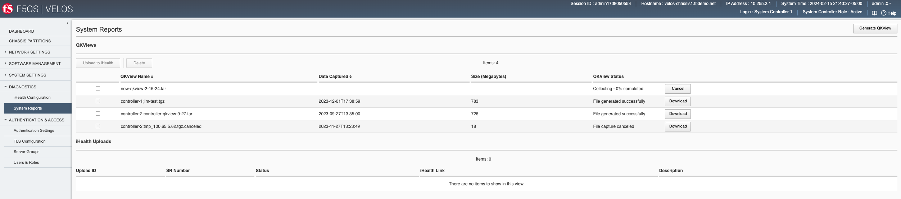

To generate a qkview report, click the **Generate QKview** button in the upper right-hand corner. It will take some time for the qkview to be generated.  Once the qkview is generated, you can click the checkbox next to it, and then select **Upload to iHealth**. Your iHealth credentials will automatically fill in if you entered them previously using the **Diagnostics -> iHealth Configuration** page. Note, that the iHelath service recently went through authentication enhancements, and some older version of F5OS-C may not authenticate properly to the iHealth service. You should upgrade to F5OS-C 1.6.x or later to get the new authentication support that is compatible with the iHealth service.

You can configure your iHealth **Client ID** and **Client Secret** to authenticate with the new iHealth authentication services using the **Diagnostics -> iHealth Configuration** page. You may also optionally configure a **Proxy Server** for iHealth access if your system requires external traffic to be inspected by a proxy server.

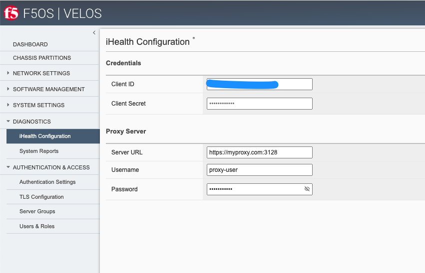

Once you have your **Client ID** and **Client Secret** configured you can then upload qkviews directly to iHealth. Your credentials will be automatically added to the upload request as seen below. You may also add an optional **F5 Support Case Number** and **Description**.

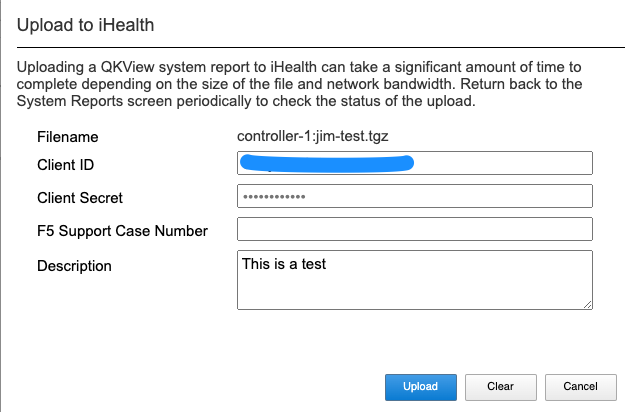

You'll see the status of the upload as it progresses:

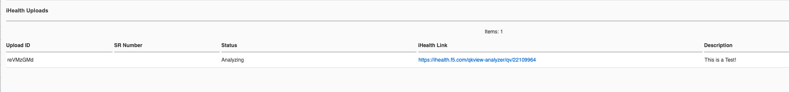

Qkview Creation and Upload via CLI
----------------------------------

You can configure your iHealth **Client ID** and **Client Secret** to authenticate with the new iHealth authentication services via the CLI. Enter **config** mode, and then use the **system diagnostics ihealth config** command to configure a **clientid** and **clientsecret**.

.. code-block:: bash

    syscon-1-active(config)# system diagnostics ihealth config clientid XXXXXXXXXXXXXXXXXXXX clientsecret
    (<AES encrypted string>): **********************************************************************************
    syscon-2-active(config)# commit 
    Commit complete.

    syscon-1-active(config)# do show system diagnostics ihealth 
    system diagnostics ihealth state server https://ihealth2-api.f5.com/qkview-analyzer/api/qkviews?visible_in_gui=True
    system diagnostics ihealth state authserver https://identity.account.f5.com/oauth2/ausp95ykc80HOU7SQ357/v1/token
    system diagnostics ihealth state clientid XXXXXXXXXXXXXXXXXXXX
            SERVICE                                                                                                                                           
    UPLOAD    REQUEST                                                                                                                                           
    ID        NUMBER   STATUS    IHEALTH LINK                                        DESCRIPTION      DETAILS                                                   
    ------------------------------------------------------------------------------------------------------------------------------------------------------------
    reVMzGMd           COMPLETE  https://ihealth.f5.com/qkview-analyzer/qv/22109964  This is a Test!  QKView uploaded successfully with 100 percent completion  

    syscon-1-active(config)#

You may also optionally configure a **Proxy Server** for iHealth access if your system requires external traffic to be inspected by a proxy server.

.. code-block:: bash

    syscon-1-active(config)# system diagnostics proxy config ?
    Possible completions:
    proxy-password   password for web proxy server.
    proxy-server     Server for local web proxy server.
    proxy-username   username for web proxy server.
    syscon-1-active(config)# system diagnostics proxy config 

To generate a qkview from the CLI run the command **system diagnostics qkview capture**.

.. code-block:: bash

    syscon-1-active# system diagnostics qkview capture 
    result  Qkview file controller-2.qkview is being collected
    return code 200
    resultint 0

 
You can view the status of the capture using the command system diagnostics qkview status.

.. code-block:: bash

    syscon-2-active# system diagnostics qkview status 
    result  {"Busy":true,"Percent":59,"Status":"collecting","Message":"Collecting Data","Filename":"controller-2.qkview"}
    
    resultint 0

    syscon-2-active# system diagnostics qkview status
    result  {"Busy":false,"Percent":100,"Status":"complete","Message":"Completed collection.","Filename":"controller-2.qkview"}
    
    resultint 0

You may also confirm the file has been created by using the **file list** command, or the **system diagnostics qkview list** command to see more details about the size and creation date of the file:

.. code-block:: bash

    syscon-1-active# file list path diags/shared/qkview/
    entries {
        name jim-test.tgz
        date Fri Dec  1 22:38:59 UTC 2023
        size 783MB
    }
    syscon-1-active# 

    syscon-1-active# system diagnostics qkview list
    result  {"Qkviews":[{"Filename":"jim-test.tgz","Date":"2023-12-01T17:38:59.08874537-05:00","Size":820585633}]}
    
    resultint 0
    syscon-1-active#

Qkview Creation and Upload to iHealth via API
---------------------------------------------

A qkview can be generated for the system controller or any chassis partition using the following API call. Note, the IP address endpoint will either be the system controller or the desired chassis partition IP address.

.. code-block:: bash

    POST https://{{velos_velos_chassis1_system_controller_ip}}:8888/restconf/data/openconfig-system:system/f5-system-diagnostics-qkview:diagnostics/f5-system-diagnostics-qkview:qkview/f5-system-diagnostics-qkview:capture

In the body of the API call enter the filename of the qkview to be saved.

.. code-block:: json

    {
        "f5-system-diagnostics-qkview:filename": "qkview{{currentdate}}.tgz"
    }

If the generation of a qkview is successful, you'll receive confirmation like the output below.

.. code-block:: json

    {
        "f5-system-diagnostics-qkview:output": {
            "result": " Warning: Qkview may contain sensitive data such as secrets, passwords and core files. Handle with care. Please send this file to F5 support. \nQkview file my-qkview2022-04-12.tgz is being collected.\nreturn code 200\n ",
            "resultint": 0
        }
    }

To check the status of the qkview collection you can use the following API command.

.. code-block:: bash

    POST https://{{velos_velos_chassis1_system_controller_ip}}:8888/restconf/data/openconfig-system:system/f5-system-diagnostics-qkview:diagnostics/f5-system-diagnostics-qkview:qkview/f5-system-diagnostics-qkview:status

The output of the command will show the percentage complete of the qkview.

.. code-block:: json

    {
        "f5-system-diagnostics-qkview:output": {
            "result": " {\"Busy\":true,\"Percent\":18,\"Status\":\"collecting\",\"Message\":\"Collecting Data\",\"Filename\":\"my-qkview2022-04-12.tgz\"}\n ",
            "resultint": 0
        }
    }

Before uploading your qkview file to iHealth you must ensure you have setup the proper credentials on your VELOS system. the iHealth service has recently changed its authentication methods. You must now get your client ID and client secret from the myf5.com portal, and then store them on your VELOS system to do direct uploads of qkview files to iHealth. Below is an example setting up the client ID and client secret via the API.

.. code-block:: bash

    PUT https://{{velos_chassis1_system_controller_ip}}:8888/restconf/data/openconfig-system:system/f5-system-diagnostics-qkview:diagnostics/f5-system-diagnostics-ihealth:ihealth/f5-system-diagnostics-ihealth:config/f5-system-diagnostics-ihealth:clientid

In the body of the API call, add your client ID:

.. code-block:: json

    {
    "f5-system-diagnostics-ihealth:clientid": "XXXXXXXXXXXXXXXXXXXXXXX"
    }

To confirm the client ID has been set, send the folowing API call:

.. code-block:: bash

    GET https://{{velos_chassis1_system_controller_ip}}:8888/restconf/data/openconfig-system:system/f5-system-diagnostics-qkview:diagnostics/f5-system-diagnostics-ihealth:ihealth/f5-system-diagnostics-ihealth:config/f5-system-diagnostics-ihealth:clientid

You should see something like the output below.

.. code-block:: json

    {
        "f5-system-diagnostics-ihealth:clientid": "XXXXXXXXXXXXXXXXXXXXXXXXXX"
    }

Next, you'll need to enter your client secret from myf5.com. Use the following API call to add your client secret.

.. code-block:: bash

    PUT https://{{velos_chassis1_system_controller_ip}}:8888/restconf/data/openconfig-system:system/f5-system-diagnostics-qkview:diagnostics/f5-system-diagnostics-ihealth:ihealth/f5-system-diagnostics-ihealth:config/f5-system-diagnostics-ihealth:clientsecret

In the body of the API call, enter the client secret as seen below:

.. code-block:: json

    {
        "f5-system-diagnostics-ihealth:clientsecret": "XXXXXXXXXXXXXXXXXXXXXXXXXXXXXXXXXXXXXXXXXXXXXXXXXXXXXXX"
    }

To view the current client secret enter the following API call.

.. code-block:: bash

    GET https://{{velos_chassis1_system_controller_ip}}:8888/restconf/data/openconfig-system:system/f5-system-diagnostics-qkview:diagnostics/f5-system-diagnostics-ihealth:ihealth/f5-system-diagnostics-ihealth:config/f5-system-diagnostics-ihealth:clientsecret

In the body of the API call, you'll see the encrypted client secret as seen below.

.. code-block:: json

    {
        "f5-system-diagnostics-ihealth:clientsecret": "XXXXXXXXXXXXXXXXXXXXXXXXXXXXXXXXXXXXXXXXXXXXXXXXXXXXXXXXXXXXXXXXXXXXXXX"
    }

If your environment has a proxy server and does not allow direct access to the Internet, then you can optionally add in the proxy server configuration to the VELOS system so that uploads will utilize the environment's proxy server when uploading qkviews to iHealth. Below is an example of adding a proxy server configuration via the API.

.. code-block:: bash

    PUT https://{{velos_chassis1_system_controller_ip}}:8888/restconf/data/openconfig-system:system/f5-system-diagnostics-qkview:diagnostics/f5-system-diagnostics-proxy:proxy/f5-system-diagnostics-proxy:config

In the body of the API call add the proxy server configuration as seen below.

.. code-block:: json

    {
        "f5-system-diagnostics-proxy:config": {
            "f5-system-diagnostics-proxy:proxy-username": "proxy-user",
            "f5-system-diagnostics-proxy:proxy-password": "password",
            "f5-system-diagnostics-proxy:proxy-server": "https://myproxy.com:3128"
        }
    }

To view the proxy server configuration, enter the following API call.

.. code-block:: bash

    GET https://{{velos_chassis1_system_controller_ip}}:8888/restconf/data/openconfig-system:system/f5-system-diagnostics-qkview:diagnostics/f5-system-diagnostics-proxy:proxy

You'll see the configuration returned in the API response.

.. code-block:: json

    {
        "f5-system-diagnostics-proxy:proxy": {
            "state": {
                "proxy-username": "proxy-user",
                "proxy-server": "https://myproxy.com:3128"
            },
            "config": {
                "proxy-username": "proxy-user",
                "proxy-password": "$8$XXXXXXXXXXXXXXXXXXXXXXXXXXXXXXXX",
                "proxy-server": "https://myproxy.com:3128"
            }
        }
    }

If you'd like to copy the qkview directly to iHealth once it is completed, use the following API command referencing the previously completed qkview file.

.. code-block:: bash

    POST https://{{velos_chassis1_system_controller_ip}}:8888/restconf/data/openconfig-system:system/f5-system-diagnostics-qkview:diagnostics/f5-system-diagnostics-ihealth:ihealth/f5-system-diagnostics-ihealth:upload

In the body of the API call add details with the filename, optional description, and SR number. The call below assumes you have previously stored the proper iHealth credentials.

.. code-block:: json

    {
    "f5-system-diagnostics-ihealth:qkview-file": "qkview{{currentdate}}.tgz",
    "f5-system-diagnostics-ihealth:description": "This is a test qkview",
    "f5-system-diagnostics-ihealth:service-request-number": ""
    }

The output will confirm the upload has begun.

.. code-block:: json

    {
        "f5-system-diagnostics-ihealth:output": {
            "message": "HTTP/1.1 202 Accepted\r\nLocation: /support/ihealth/status/a0PBQTGW\r\nDate: Tue, 12 Apr 2022 04:19:40 GMT\r\nContent-Length: 0\r\n\r\n",
            "errorcode": false
        }
    }

Qkview Download to Client via API
--------------------------------

You can download qkviews direct to a client machine using the F5OS API. First, list the contents of the path **diags/shared/qkview** to see the save qkview files:

.. code-block:: bash

    POST https://{{velos_chassis1_system_controller_ip}}:8888/restconf/data/f5-utils-file-transfer:file/list

In the body of the API call, add the following path:

.. code-block:: json

    {
    "f5-utils-file-transfer:path": "diags/shared/qkview"
    }

The output should look similar to the output below.

.. code-block:: json

    {
        "f5-utils-file-transfer:output": {
            "entries": [
                {
                    "name": "jim-test.tgz",
                    "date": "",
                    "size": "783MB"
                },
                {
                    "name": "new-qkview-2-15-24.tar",
                    "date": "",
                    "size": "674MB"
                }
            ]
        }
    }

To download one of the qkview files to the local client machine, enter the following API call.

.. code-block:: bash

    POST https://{{velos_chassis1_system_controller_ip}}:8888/restconf/data/f5-utils-file-transfer:file/f5-file-download:download-file/f5-file-download:start-download

For the **Headers** section of the Postman request be sure to add the following headers:

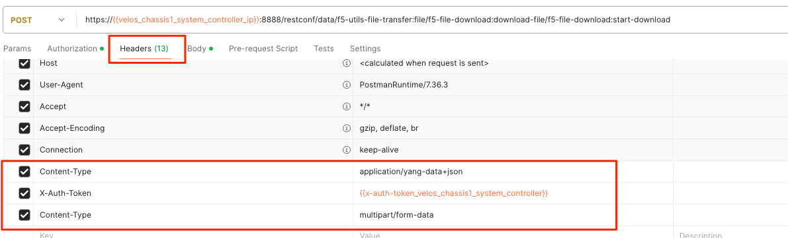

If you are using Postman, in the body of the API call select **Body**, then selct **form-data**. Then enter the **file-name**, **path**, and **token** as seen below.

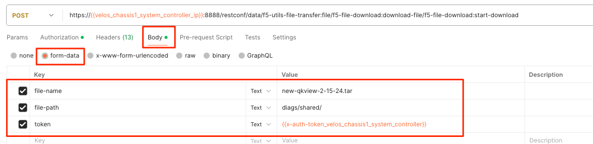

If you are using Postman, instead of clicking **Send**, click on the arrow next to Send, and then select **Send and Download**. You will then be prompted to save the file to your local file system.

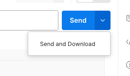

Logging
=======

F5OS has extensive logging and diagnostic capabilities, logs are stored locally on disk and can optionally be sent to a remote syslog server. In addition, there are multiple logging subsystems that can be tweaked to be more or less verbose via the **Software Component Log Levels**. Many functions inside the F5OS layer will log their important events to the default **velos.log** file that resides in the **/log/controller/** path. This is the file that will also redirect all logs to a remote location (in addition to local disk) when **Remote Log Servers** are added. There are many other log files available local on the disk (some can also be redirected to be sent remotely) for various functions. As an example, there is an **snmp.log** which logs all SNMP requests and traps that the system sends and receives. Another example is the **audit.log** that captures audit related information such as "who has logged in?", "What changes were made?", "Who made the changes?", and unsuccessful login attempts. This section will provide more details on the various logging subsystems, and how to configure them.

F5 publishes and maintains a log error catalog for F5OS-C (VELOS) here:

`F5OS-C/VELOS Error Catalog <https://clouddocs.f5.com/f5os-error-catalog/velos/velos-errors-index.html>`_

Viewing Logs
------------

Viewing Logs from the CLI
^^^^^^^^^^^^^^^^^^^^^^^^^

Logs can be viewed via the F5OS CLI, or they can be downloaded for remote viewing via CLI or webUI. Logs can also be sent to an external SYSLOG location. When troubleshooting specific issues, the logging subsystems (sw-components) logging levels can be adjusted temporarily to provide more information.

Many functions inside the F5OS layer will log their events to the main **velos.log** file that resides in the **/var/log_controller** path in the underlying system controller shell. In the F5OS CLI the paths are simplified so that you don’t have to know the underlying directory structure. You can use the **file list path** command to see the files inside the **log/controller** directory:

.. code-block:: bash

    syscon-2-active# file list path log/ 
    Possible completions:
    confd/  controller/  host/
    syscon-2-active# file list path log/controller/
    entries {
        name afu-cookie
        date Wed Aug 23 23:03:27 UTC 2023
        size 33B
    }
    entries {
        name audit.log
        date Fri Aug 25 15:17:24 UTC 2023
        size 6.9MB
    }
    entries {
        name audit.log.1
        date Wed Jul 12 16:58:15 UTC 2023
        size 11MB
    }
    entries {
        name audit.log.2.gz
        date Tue Jun  6 16:43:01 UTC 2023
        size 505KB
    }
    entries {
        name audit.log.3.gz
        date Thu May  4 22:39:02 UTC 2023
        size 500KB
    }
    entries {
        name audit.log.4.gz
        date Mon Apr 24 16:22:54 UTC 2023
        size 493KB
    }
    entries {
        name audit.log.5.gz
        date Tue Apr  4 15:03:32 UTC 2023
        size 499KB
    }
    entries {
        name cc-confd
        date Thu Aug 24 00:34:34 UTC 2023
        size 2.2MB
    }
    entries {
        name cc-confd-hal
        date Wed Aug 23 23:02:54 UTC 2023
        size 0B
    }
    entries {
        name cc-confd-health
        date Fri Aug 25 15:16:58 UTC 2023
        size 44MB
    }
    entries {
        name cc-confd-health-diag-agent
        date Wed Aug 23 23:02:57 UTC 2023
        size 0B
    }
    entries {
        name cc-confd-health.1
        date Fri Apr 21 16:19:02 UTC 2023
        size 101MB
    }
    entries {
        name cc-confd-init
        date Wed Aug 23 23:02:53 UTC 2023
        size 388KB
    }
    entries {
        name cc-upgrade.dbg
        date Wed Aug 23 23:03:12 UTC 2023
        size 277KB
    }
    entries {
        name chassis-manager
        date Fri Aug 25 15:17:25 UTC 2023
        size 66MB
    }
    entries {
        name chassis-manager.1
        date Sun Jul  9 09:51:03 UTC 2023
        size 101MB
    }
    entries {
        name chassis-manager.2.gz
        date Sat Jul  1 17:59:04 UTC 2023
        size 2.9MB
    }
    entries {
        name chassis-manager.3.gz
        date Sat Jun 24 02:13:04 UTC 2023
        size 2.9MB
    }
    entries {
        name chassis-manager.4.gz
        date Fri Jun 16 09:09:04 UTC 2023
        size 2.9MB
    }
    entries {
        name chassis-manager.5.gz
        date Thu Jun  8 18:58:04 UTC 2023
        size 3.0MB
    }
    entries {
        name confd
        date Thu Jul 14 17:50:32 UTC 2022
        size 0B
    }
    entries {
        name confd_go_standby
        date Mon Jan 30 15:57:56 UTC 2023
        size 207B
    }
    entries {
        name confd_image_remove
        date Mon May  8 15:41:49 UTC 2023
        size 6.5KB
    }
    entries {
        name config-object-manager
        date Wed Aug 23 23:21:09 UTC 2023
        size 23MB
    }
    entries {
        name config-object-manager-hal
        date Wed Aug 23 23:02:54 UTC 2023
        size 0B
    }
    entries {
        name events/
        date Wed Aug 23 23:03:36 UTC 2023
        size 4.0KB
    }
    entries {
        name ha
        date Thu Aug 24 01:01:25 UTC 2023
        size 5.3MB
    }
    entries {
        name ha-hal
        date Wed Aug 23 23:02:54 UTC 2023
        size 0B
    }
    entries {
        name host-config
        date Fri Aug 25 15:17:23 UTC 2023
        size 76MB
    }
    entries {
        name host-config-hal
        date Wed Aug 23 23:02:57 UTC 2023
        size 0B
    }
    entries {
        name host-config.1
        date Thu Jul 20 23:48:03 UTC 2023
        size 101MB
    }
    entries {
        name host-config.2.gz
        date Thu Jun 22 03:52:03 UTC 2023
        size 2.8MB
    }
    entries {
        name host-config.3.gz
        date Fri May 19 10:59:04 UTC 2023
        size 2.8MB
    }
    entries {
        name host-config.4.gz
        date Sat Apr  8 17:36:04 UTC 2023
        size 2.7MB
    }
    entries {
        name host-config.5.gz
        date Sun Mar 12 08:13:04 UTC 2023
        size 2.7MB
    }
    entries {
        name http_error_log
        date Wed Aug 23 23:03:04 UTC 2023
        size 17KB
    }
    entries {
        name httpd/
        date Fri May  5 04:24:03 UTC 2023
        size 4.0KB
    }
    entries {
        name image-server
        date Wed Aug 23 23:27:41 UTC 2023
        size 2.6MB
    }
    entries {
        name image-server-dhcp
        date Fri Aug 25 15:09:19 UTC 2023
        size 14MB
    }
    entries {
        name image-server-hal
        date Wed Aug 23 23:03:04 UTC 2023
        size 0B
    }
    entries {
        name image-server-httpd
        date Thu Jul 14 17:50:37 UTC 2022
        size 0B
    }
    entries {
        name image-server-monitor
        date Wed Aug 23 23:03:04 UTC 2023
        size 87KB
    }
    entries {
        name lcd.log
        date Wed Aug 23 23:08:44 UTC 2023
        size 123KB
    }
    entries {
        name logrotate.log
        date Fri Aug 25 15:17:01 UTC 2023
        size 40KB
    }
    entries {
        name logrotate.log.1
        date Fri Aug 25 15:11:02 UTC 2023
        size 5.1MB
    }
    entries {
        name logrotate.log.2.gz
        date Fri Aug 25 00:23:01 UTC 2023
        size 34KB
    }
    entries {
        name partition-agent
        date Wed Aug 23 23:27:39 UTC 2023
        size 11MB
    }
    entries {
        name partition-software-manager
        date Fri Aug 25 15:17:25 UTC 2023
        size 1.6MB
    }
    entries {
        name partition-software-manager.1
        date Fri Aug 25 13:56:04 UTC 2023
        size 101MB
    }
    entries {
        name partition-software-manager.2.gz
        date Tue Aug 22 05:38:03 UTC 2023
        size 3.6MB
    }
    entries {
        name partition-software-manager.3.gz
        date Sat Aug 19 01:36:04 UTC 2023
        size 3.6MB
    }
    entries {
        name partition-software-manager.4.gz
        date Tue Aug 15 21:39:03 UTC 2023
        size 3.6MB
    }
    entries {
        name partition-software-manager.5.gz
        date Sat Aug 12 17:42:04 UTC 2023
        size 3.6MB
    }
    entries {
        name partition-update
        date Fri Aug 25 15:13:08 UTC 2023
        size 96MB
    }
    entries {
        name partition-update.1
        date Mon Mar 27 04:12:04 UTC 2023
        size 101MB
    }
    entries {
        name partition-update.2.gz
        date Mon Nov 21 21:24:01 UTC 2022
        size 678KB
    }
    entries {
        name pel_log
        date Thu Aug 24 23:50:27 UTC 2023
        size 48MB
    }
    entries {
        name reprogram_chassis_network
        date Wed Aug 23 23:03:40 UTC 2023
        size 111KB
    }
    entries {
        name rsyslogd_init.log
        date Thu Aug 24 00:59:03 UTC 2023
        size 75MB
    }
    entries {
        name run/
        date Wed Aug 23 23:02:54 UTC 2023
        size 4.0KB
    }
    entries {
        name sshd.terminal-server
        date Wed Aug 23 23:03:46 UTC 2023
        size 3.0KB
    }
    entries {
        name switchd
        date Wed Aug 23 23:31:22 UTC 2023
        size 4.7MB
    }
    entries {
        name switchd-hal
        date Wed Aug 23 23:02:55 UTC 2023
        size 0B
    }
    entries {
        name switchd.1
        date Wed Feb  1 23:25:01 UTC 2023
        size 705MB
    }
    entries {
        name switchd.2.gz
        date Tue Jan 31 09:26:46 UTC 2023
        size 79MB
    }
    entries {
        name switchd.3.gz
        date Mon Jan 30 22:08:45 UTC 2023
        size 79MB
    }
    entries {
        name switchd.4.gz
        date Mon Jan 30 10:37:45 UTC 2023
        size 80MB
    }
    entries {
        name switchd.5.gz
        date Sun Jan 29 23:21:46 UTC 2023
        size 80MB
    }
    entries {
        name system-update
        date Wed Aug 23 22:53:48 UTC 2023
        size 49KB
    }
    entries {
        name terminal-server.default
        date Wed Aug 23 23:03:00 UTC 2023
        size 109KB
    }
    entries {
        name tftp.log
        date Wed Aug 23 23:13:05 UTC 2023
        size 1.7KB
    }
    entries {
        name vcc-confd-go-standby-hal.3451
        date Mon Jan 30 15:57:56 UTC 2023
        size 0B
    }
    entries {
        name vcc-confd-go-standby-hal.579
        date Tue Sep 13 17:19:41 UTC 2022
        size 0B
    }
    entries {
        name velos.log
        date Fri Aug 25 15:14:07 UTC 2023
        size 157MB
    }
    entries {
        name velos.log.1
        date Fri Apr 28 09:46:11 UTC 2023
        size 513MB
    }
    entries {
        name velos.log.2.gz
        date Sat Mar 11 00:35:13 UTC 2023
        size 23MB
    }
    entries {
        name velos.log.3.gz
        date Sun Sep 25 04:16:08 UTC 2022
        size 19MB
    }
    entries {
        name velos.log.4.gz
        date Fri Jul 15 05:53:11 UTC 2022
        size 16MB
    }
    entries {
        name velos.log.5.gz
        date Thu Jul 14 23:12:01 UTC 2022
        size 16MB
    }
    syscon-2-active#

To view the contents of the **velos.log** file, use the command **file show path /log/controller/velos.log**:

.. code-block:: bash

    syscon-1-active# file show log/controller/velos.log
    2021-02-08T11:52:27-08:00 localhost.localdomain notice boot_marker: ---===[ BOOT-MARKER ]===---
    2021-02-08T19:58:50.837735+00:00 controller-1 vcc-lacpd[0]: priority="Err" version=1.0 msgid=0x401000000000005 msg="Invalid Argument" function="fzmq_set_msg_queue_size" argument="handle NULL".
    2021-02-08T19:58:50.837748+00:00 controller-1 user-manager[14]: priority="Notice" version=1.0 msgid=0x6801000000000001 msg="User Manager Starting".
    2021-02-08T19:58:50.838837+00:00 controller-1 alert-service[7]: priority="Notice" version=1.0 msgid=0x2201000000000001 msg="Alert Service Starting..." version="3.4.7" date="Sun Oct 11 01:21:02 2020".
    2021-02-08T19:58:50.838867+00:00 controller-1 alert-service[7]: priority="Info" version=1.0 msgid=0x6602000000000005 msg="DB is not ready".
    2021-02-08T19:58:50.838881+00:00 controller-1 /usr/bin/authd[7]: priority="Info" version=1.0 msgid=0x6602000000000005 msg="DB is not ready".
    2021-02-08T19:58:50.838934+00:00 controller-1 alert-service[7]: priority="Info" version=1.0 msgid=0x6602000000000005 msg="DB is not ready".

There are options to manipulate the output of the file by adding **| ?**  to see the options.

.. code-block:: bash

    syscon-1-active# file show /log/controller/velos.log | ?
    Possible completions:
    append    Append output text to a file
    begin     Begin with the line that matches
    count     Count the number of lines in the output
    exclude   Exclude lines that match
    include   Include lines that match
    linnum    Enumerate lines in the output
    more      Paginate output
    nomore    Suppress pagination
    save      Save output text to a file
    until     End with the line that matches

There are also other file options to tail the log file using **file tail -f** for live tail of the file or **file tail -n <number of lines>**.

.. code-block:: bash

    syscon-1-active# file tail -f log/controller/velos.log 
    2021-02-23T16:42:41.251528+00:00 controller-1 rsyslog-configd[7]: priority="Info" version=1.0 msgid=0x1301000000000005 msg="Setting component log severity" name="partition-software-manager" severity=6.
    2021-02-23T16:42:41.284819+00:00 controller-1 rsyslog-configd[7]: priority="Info" version=1.0 msgid=0x1301000000000005 msg="Setting component log severity" name="vcc-chassis-manager" severity=6.
    2021-02-23T16:42:41.290347+00:00 controller-1 rsyslog-configd[7]: priority="Info" version=1.0 msgid=0x1301000000000005 msg="Setting component log severity" name="vcc-confd" severity=6.
    2021-02-23T16:42:41.295275+00:00 controller-1 rsyslog-configd[7]: priority="Info" version=1.0 msgid=0x1301000000000005 msg="Setting component log severity" name="vcc-ha" severity=6.
    2021-02-23T16:42:41.305051+00:00 controller-1 rsyslog-configd[7]: priority="Info" version=1.0 msgid=0x1301000000000005 msg="Setting component log severity" name="vcc-lacpd" severity=6.
    2021-02-23T16:42:41.305662+00:00 controller-1 rsyslog-configd[7]: priority="Info" version=1.0 msgid=0x1301000000000005 msg="Setting component log severity" name="vcc-partition-agent" severity=6.
    2021-02-23T16:42:46.960349+00:00 controller-1 partition-software-manager[9]: priority="Info" version=1.0 msgid=0x1101000000000034 msg="configuration updated; num_part:" num_partition=4.
    2021-02-23T16:42:46.960395+00:00 controller-1 partition-software-manager[9]: priority="Info" version=1.0 msgid=0x1101000000000036 msg="configuration updated; num_image:" num_partition_iso_image=4.
    2021-02-23T16:57:51.752978+00:00 controller-1 partition-software-manager[9]: priority="Err" version=1.0 msgid=0x1101000000000052 msg="unknown class_tag:" field_tag=1537040122.
    2021-02-23T16:57:56+00:00 controller-2 partition-software-manager[8]: priority="Err" version=1.0 msgid=0x1101000000000052 msg="unknown class_tag:" field_tag=1537040122.

Below output is showing an example of tailing the last 20 lines of the vleos.log file.

.. code-block:: bash

    syscon-1-active# file tail -n 20 log/controller/velos.log
    2021-02-23T16:42:41.077215+00:00 controller-1 vcc-lacpd[7]: priority="Debug" version=1.0 msgid=0x401000000000024 msg="Send Message" time=1614098561077203609 id="1614045762610008304:2" seq=207646 mtype="SEND_TYPE" src="lacpd CC2 sender" dest="addr:tcp://10.1.5.62:1053".
    2021-02-23T16:42:41.077239+00:00 controller-1 vcc-lacpd[7]: priority="Debug" version=1.0 msgid=0x3301000000000052 msg="PDU:" direction="Transmitted" interface="1/1.3" length=124.
    2021-02-23T16:42:41.077257+00:00 controller-1 vcc-lacpd[7]: priority="Debug" version=1.0 msgid=0x401000000000024 msg="Send Message" time=1614098561077247405 id="1614045762609932334:1" seq=207648 mtype="SEND_TYPE" src="lacpd CC1 sender" dest="addr:tcp://10.1.5.61:1053".
    2021-02-23T16:42:41.077280+00:00 controller-1 vcc-lacpd[7]: priority="Debug" version=1.0 msgid=0x3301000000000052 msg="PDU:" direction="Transmitted" interface="2/1.3" length=124.
    2021-02-23T16:42:41.077301+00:00 controller-1 vcc-lacpd[7]: priority="Debug" version=1.0 msgid=0x401000000000024 msg="Send Message" time=1614098561077291045 id="1614045762610008304:2" seq=207647 mtype="SEND_TYPE" src="lacpd CC2 sender" dest="addr:tcp://10.1.5.62:1053".
    2021-02-23T16:42:41.077391+00:00 controller-1 vcc-lacpd[7]: priority="Debug" version=1.0 msgid=0x3301000000000052 msg="PDU:" direction="Transmitted" interface="1/mgmt0" length=124.
    2021-02-23T16:42:41.077411+00:00 controller-1 vcc-lacpd[7]: priority="Debug" version=1.0 msgid=0x401000000000024 msg="Send Message" time=1614098561077399963 id="1614045762609932334:1" seq=207649 mtype="SEND_TYPE" src="lacpd CC1 sender" dest="addr:tcp://10.1.5.61:1053".
    2021-02-23T16:42:41.077437+00:00 controller-1 vcc-lacpd[7]: priority="Debug" version=1.0 msgid=0x3301000000000052 msg="PDU:" direction="Transmitted" interface="2/mgmt0" length=124.
    2021-02-23T16:42:41.077477+00:00 controller-1 vcc-lacpd[7]: priority="Debug" version=1.0 msgid=0x401000000000024 msg="Send Message" time=1614098561077445005 id="1614045762610008304:2" seq=207648 mtype="SEND_TYPE" src="lacpd CC2 sender" dest="addr:tcp://10.1.5.62:1053".
    2021-02-23T16:42:41.077637+00:00 controller-1 vcc-lacpd[7]: priority="Debug" version=1.0 msgid=0x3301000000000050 msg="" debug_str="zmqMsgHandler.receivePdu called".

Within a chassis partition the path for the logging is different. You can use the same CLI commands in the chassis partition that are used in the system controllers by substituting the updated path for the **log/velos.log** file.

.. code-block:: bash

    Production-1# file show log/velos.log     

    2021-02-22T23:46:23+00:00 10.1.18.51 controller-1(p2) partition-ha[1]: priority="Info" version=1.0 msgid=0x4602000000000004 msg="Active going Standby".
    2021-02-22T23:46:23.381784+00:00 controller-2(p2) user-manager[223]: priority="Info" version=1.0 msgid=0x6602000000000005 msg="DB is not ready".
    2021-02-22T23:46:23+00:00 10.1.18.2 blade-2(p2) platform-mgr[12]: priority="Info" version=1.0 msgid=0x6602000000000005 msg="DB is not ready".
    2021-02-22T23:46:23+00:00 10.1.18.2 blade-2(p2) fpgamgr[12]: priority="Info" version=1.0 msgid=0x6602000000000005 msg="DB is not ready".
    2021-02-22T23:46:23+00:00 10.1.18.2 blade-2(p2) /usr/bin/authd[7]: priority="Info" version=1.0 msgid=0x6602000000000005 msg="DB is not ready".
    2021-02-22T23:46:23+00:00 10.1.18.2 blade-2(p2) l2-agent[12]: priority="Info" version=1.0 msgid=0x6602000000000005 msg="DB is not ready".
    2021-02-22T23:46:23+00:00 10.1.18.2 blade-2(p2) partition-ha[1]: priority="Info" version=1.0 msgid=0x6602000000000005 msg="DB is not ready".
    2021-02-22T23:46:23+00:00 10.1.18.2 blade-2(p2) /usr/sbin/fips-service[13]: priority="Info" version=1.0 msgid=0x6602000000000005 msg="DB is not ready".
    2021-02-22T23:46:23+00:00 10.1.18.1 blade-1(p2) platform-mgr[11]: priority="Info" version=1.0 msgid=0x6602000000000005 msg="DB is not ready".

The following command will tail the velos.log file on the chassis partition.

.. code-block:: bash

    Production-1# file tail -f log/velos.log
    2021-02-23T17:38:10+00:00 10.1.18.2 blade-2(p2) lacpd[1]: priority="Debug" version=1.0 msgid=0x3401000000000048 msg="" debug_str="velocityDatapathHandler.pollPdu() called".
    2021-02-23T17:38:11+00:00 10.1.18.2 blade-2(p2) lacpd[1]: priority="Debug" version=1.0 msgid=0x3401000000000048 msg="" debug_str="velocityDatapathHandler.pollPdu() called".
    2021-02-23T17:38:11+00:00 10.1.18.2 blade-2(p2) lacpd[1]: priority="Debug" version=1.0 msgid=0x3401000000000045 msg="PDU:" direction="Transmitted" interface="1/2.0" length=124.
    2021-02-23T17:38:11+00:00 10.1.18.2 blade-2(p2) lacpd[1]: priority="Debug" version=1.0 msgid=0x3401000000000045 msg="PDU:" direction="Transmitted" interface="2/1.0" length=124.
    2021-02-23T17:38:11+00:00 10.1.18.2 blade-2(p2) lacpd[1]: priority="Debug" version=1.0 msgid=0x3401000000000045 msg="PDU:" direction="Transmitted" interface="1/1.0" length=124.

Viewing Logs from the webUI
^^^^^^^^^^^^^^^^^^^^^^^^^^^^

In the current release you cannot view the F5OS logs directly from the webUI, although you can download them from the webUI. To view the logs, you can use the CLI or API, or download the files and then view, or use a remote syslog server. To download log files from the webUI, go to the **System Settings -> File Utilities** page. Here there are various logs directories you can download files from. You have the option to **Export** files to a remote HTTPS server or **Download** the files directly to your client machine through the browser.

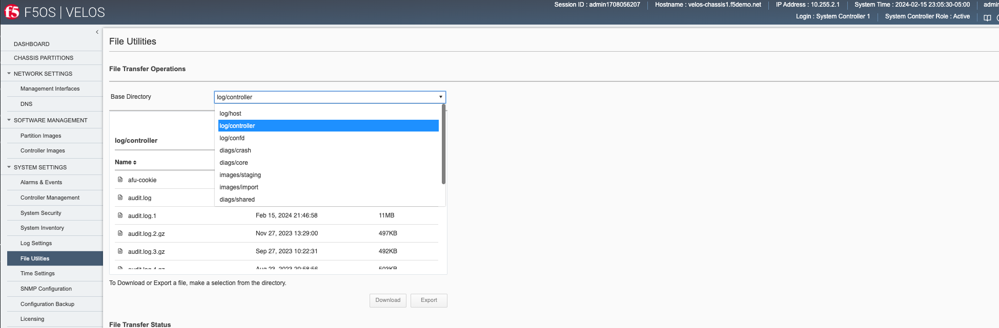

If you want to download the main **velos.log**, select the directory **/log/controller**.

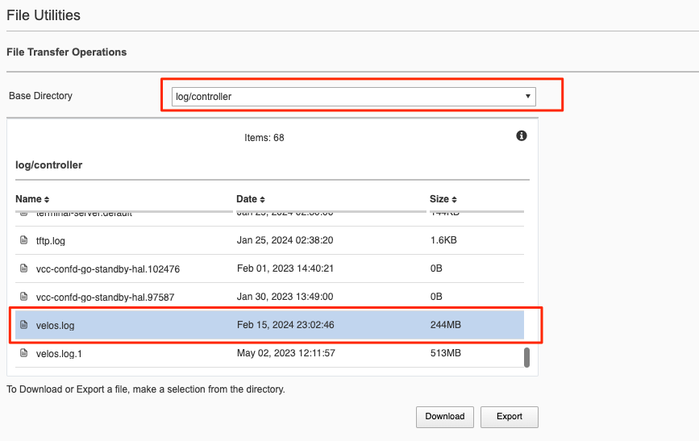

Downloading Logs from the API
^^^^^^^^^^^^^^^^^^^^^^^^^^^^^^

You can download various logs from the F5OS layer using the F5OS API. To list the current log files in the **log/system/** directory use the following API call.

.. code-block:: bash

    POST https://{{velos_chassis1_system_controller_ip}}:8888/restconf/data/f5-utils-file-transfer:file/list

In the body of the API call, add the virtual path you want to list.

.. code-block:: json
 
    {
    "f5-utils-file-transfer:path": "log/controller/"
    }

You should see similar output as displayed below.

.. code-block:: json

    {
        "f5-utils-file-transfer:output": {
            "entries": [
                {
                    "name": "afu-cookie",
                    "date": "Thu Jan 25 07:30:19 UTC 2024",
                    "size": "33B"
                },
                {
                    "name": "audit.log",
                    "date": "Fri Feb 16 04:13:06 UTC 2024",
                    "size": "2.4MB"
                },
                {
                    "name": "audit.log.1",
                    "date": "Fri Feb 16 02:46:58 UTC 2024",
                    "size": "11MB"
                },
                {
                    "name": "audit.log.2.gz",
                    "date": "Mon Nov 27 18:29:00 UTC 2023",
                    "size": "497KB"
                },
                {
                    "name": "audit.log.3.gz",
                    "date": "Wed Sep 27 14:22:31 UTC 2023",
                    "size": "492KB"
                },
                {
                    "name": "audit.log.4.gz",
                    "date": "Thu Aug 24 00:58:56 UTC 2023",
                    "size": "503KB"
                },
                {
                    "name": "audit.log.5.gz",
                    "date": "Wed Jul 12 19:39:02 UTC 2023",
                    "size": "501KB"
                },
                {
                    "name": "cc-confd",
                    "date": "Thu Jan 25 07:31:14 UTC 2024",
                    "size": "1.5MB"
                },
                {
                    "name": "cc-confd-hal",
                    "date": "Thu Jan 25 07:29:49 UTC 2024",
                    "size": "0B"
                },
                {
                    "name": "cc-confd-health",
                    "date": "Fri Feb 16 04:13:05 UTC 2024",
                    "size": "36MB"
                },
                {
                    "name": "cc-confd-health-diag-agent",
                    "date": "Thu Jan 25 07:29:53 UTC 2024",
                    "size": "0B"
                },
                {
                    "name": "cc-confd-health.1",
                    "date": "Tue Nov  7 08:12:01 UTC 2023",
                    "size": "101MB"
                },
                {
                    "name": "cc-confd-init",
                    "date": "Thu Jan 25 07:29:49 UTC 2024",
                    "size": "363KB"
                },
                {
                    "name": "cc-upgrade.dbg",
                    "date": "Thu Jan 25 07:30:42 UTC 2024",
                    "size": "361KB"
                },
                {
                    "name": "chassis-manager",
                    "date": "Thu Jan 25 07:31:07 UTC 2024",
                    "size": "77MB"
                },
                {
                    "name": "chassis-manager.1",
                    "date": "Mon Feb 27 01:46:02 UTC 2023",
                    "size": "101MB"
                },
                {
                    "name": "confd",
                    "date": "Thu Jan 26 22:00:08 UTC 2023",
                    "size": "0B"
                },
                {
                    "name": "confd_go_standby",
                    "date": "Wed Feb  1 19:40:21 UTC 2023",
                    "size": "128B"
                },
                {
                    "name": "confd_image_remove",
                    "date": "Thu Feb 15 21:41:00 UTC 2024",
                    "size": "142KB"
                },
                {
                    "name": "config-object-manager",
                    "date": "Thu Feb 15 21:56:47 UTC 2024",
                    "size": "55MB"
                },
                {
                    "name": "config-object-manager-hal",
                    "date": "Thu Jan 25 07:29:49 UTC 2024",
                    "size": "0B"
                },
                {
                    "name": "events/",
                    "date": "Thu Jan 25 05:01:22 UTC 2024",
                    "size": "4.0KB"
                },
                {
                    "name": "ha",
                    "date": "Fri Feb 16 04:03:29 UTC 2024",
                    "size": "30MB"
                },
                {
                    "name": "ha-hal",
                    "date": "Thu Jan 25 07:29:50 UTC 2024",
                    "size": "0B"
                },
                {
                    "name": "ha.1",
                    "date": "Tue Mar 14 13:02:02 UTC 2023",
                    "size": "101MB"
                },
                {
                    "name": "host-config",
                    "date": "Fri Feb 16 04:13:07 UTC 2024",
                    "size": "17MB"
                },
                {
                    "name": "host-config-hal",
                    "date": "Thu Jan 25 07:29:52 UTC 2024",
                    "size": "0B"
                },
                {
                    "name": "host-config.1",
                    "date": "Sun Feb 11 21:13:04 UTC 2024",
                    "size": "101MB"
                },
                {
                    "name": "host-config.2.gz",
                    "date": "Wed Jan 17 08:22:04 UTC 2024",
                    "size": "2.7MB"
                },
                {
                    "name": "host-config.3.gz",
                    "date": "Tue Dec 19 23:58:04 UTC 2023",
                    "size": "2.7MB"
                },
                {
                    "name": "host-config.4.gz",
                    "date": "Fri Nov 24 12:24:04 UTC 2023",
                    "size": "2.7MB"
                },
                {
                    "name": "host-config.5.gz",
                    "date": "Mon Oct 30 02:38:03 UTC 2023",
                    "size": "2.7MB"
                },
                {
                    "name": "http_error_log",
                    "date": "Thu Jan 25 07:28:10 UTC 2024",
                    "size": "15KB"
                },
                {
                    "name": "httpd/",
                    "date": "Sun May  7 18:26:04 UTC 2023",
                    "size": "4.0KB"
                },
                {
                    "name": "image-server",
                    "date": "Fri Feb 16 04:04:16 UTC 2024",
                    "size": "2.6MB"
                },
                {
                    "name": "image-server-dhcp",
                    "date": "Fri Feb 16 04:04:16 UTC 2024",
                    "size": "15MB"
                },
                {
                    "name": "image-server-hal",
                    "date": "Thu Jan 25 07:28:10 UTC 2024",
                    "size": "0B"
                },
                {
                    "name": "image-server-httpd",
                    "date": "Thu Jan 26 22:00:12 UTC 2023",
                    "size": "0B"
                },
                {
                    "name": "image-server-monitor",
                    "date": "Fri Feb 16 04:04:16 UTC 2024",
                    "size": "181KB"
                },
                {
                    "name": "lcd.log",
                    "date": "Wed Jan  3 18:47:35 UTC 2024",
                    "size": "418KB"
                },
                {
                    "name": "logrotate.log",
                    "date": "Fri Feb 16 04:13:01 UTC 2024",
                    "size": "2.4MB"
                },
                {
                    "name": "logrotate.log.1",
                    "date": "Thu Feb 15 21:14:01 UTC 2024",
                    "size": "5.1MB"
                },
                {
                    "name": "logrotate.log.2.gz",
                    "date": "Thu Feb 15 06:26:01 UTC 2024",
                    "size": "34KB"
                },
                {
                    "name": "partition-agent",
                    "date": "Thu Feb 15 21:56:53 UTC 2024",
                    "size": "2.5MB"
                },
                {
                    "name": "partition-software-manager",
                    "date": "Fri Feb 16 04:13:08 UTC 2024",
                    "size": "12MB"
                },
                {
                    "name": "partition-software-manager.1",
                    "date": "Thu Feb 15 19:25:04 UTC 2024",
                    "size": "101MB"
                },
                {
                    "name": "partition-software-manager.2.gz",
                    "date": "Mon Feb 12 17:52:04 UTC 2024",
                    "size": "3.7MB"
                },
                {
                    "name": "partition-software-manager.3.gz",
                    "date": "Fri Feb  9 16:20:04 UTC 2024",
                    "size": "3.7MB"
                },
                {
                    "name": "partition-software-manager.4.gz",
                    "date": "Tue Feb  6 14:46:04 UTC 2024",
                    "size": "3.7MB"
                },
                {
                    "name": "partition-software-manager.5.gz",
                    "date": "Sat Feb  3 13:12:03 UTC 2024",
                    "size": "3.7MB"
                },
                {
                    "name": "partition-update",
                    "date": "Fri Feb 16 04:10:14 UTC 2024",
                    "size": "47MB"
                },
                {
                    "name": "partition-update.1",
                    "date": "Sat Dec  2 15:33:03 UTC 2023",
                    "size": "101MB"
                },
                {
                    "name": "partition-update.2.gz",
                    "date": "Sat Jul  1 17:53:02 UTC 2023",
                    "size": "673KB"
                },
                {
                    "name": "pel_log",
                    "date": "Thu Feb 15 22:06:11 UTC 2024",
                    "size": "5.3MB"
                },
                {
                    "name": "pel_log.1",
                    "date": "Sat Dec 16 03:15:02 UTC 2023",
                    "size": "101MB"
                },
                {
                    "name": "reprogram_chassis_network",
                    "date": "Thu Jan 25 07:30:47 UTC 2024",
                    "size": "59KB"
                },
                {
                    "name": "rsyslogd_init.log",
                    "date": "Thu Jan 25 07:30:55 UTC 2024",
                    "size": "114KB"
                },
                {
                    "name": "run/",
                    "date": "Thu Jan 25 07:29:49 UTC 2024",
                    "size": "4.0KB"
                },
                {
                    "name": "sshd.terminal-server",
                    "date": "Thu Jan 25 07:30:51 UTC 2024",
                    "size": "8.1KB"
                },
                {
                    "name": "switchd",
                    "date": "Tue Feb 13 20:10:53 UTC 2024",
                    "size": "11MB"
                },
                {
                    "name": "switchd-hal",
                    "date": "Thu Jan 25 07:29:52 UTC 2024",
                    "size": "0B"
                },
                {
                    "name": "system-update",
                    "date": "Wed Jan  3 18:55:21 UTC 2024",
                    "size": "35KB"
                },
                {
                    "name": "terminal-server.default",
                    "date": "Thu Jan 25 07:30:06 UTC 2024",
                    "size": "144KB"
                },
                {
                    "name": "tftp.log",
                    "date": "Thu Jan 25 07:38:20 UTC 2024",
                    "size": "1.6KB"
                },
                {
                    "name": "vcc-confd-go-standby-hal.102476",
                    "date": "Wed Feb  1 19:40:21 UTC 2023",
                    "size": "0B"
                },
                {
                    "name": "vcc-confd-go-standby-hal.97587",
                    "date": "Mon Jan 30 18:49:00 UTC 2023",
                    "size": "0B"
                },
                {
                    "name": "velos.log",
                    "date": "Fri Feb 16 04:13:02 UTC 2024",
                    "size": "244MB"
                },
                {
                    "name": "velos.log.1",
                    "date": "Tue May  2 16:11:57 UTC 2023",
                    "size": "513MB"
                }
            ]
        }
    }

To download a specific log file, use the following API call.

.. code-block:: bash

    POST https://{{velos_chassis1_system_controller_ip}}:8888/restconf/data/f5-utils-file-transfer:file/f5-file-download:download-file/f5-file-download:start-download

In the body of the API call select **form-data**, and then enter the key/value pairs as seen below. The example provided will download the **velos.log** file that resides in the **log/controller* directory.

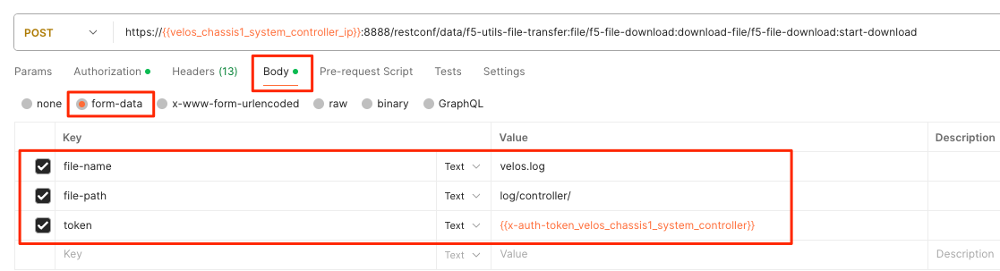

For the **Headers** secion of the Postman request be sure to add the following headers:

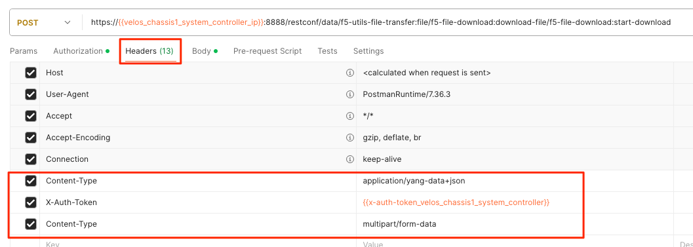

If you are using Postman, instead of clicking **Send**, click on the arrow next to Send, and then select **Send and Download**. You will then be prompted to save the file to your local file system.

If you wanted to download another log file in the same directory such as the **audit.log** file, simply change the file name in the **form-data** section as seen below.

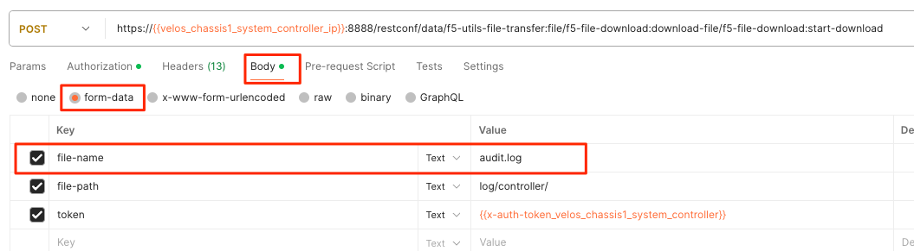

Viewing Event Logs from the API
^^^^^^^^^^^^^^^^^^^^^^^^^

If the system currently has any active alarms, you can view them via the following API call:

.. code-block:: bash

    GET https://{{velos_chassis1_system_controller_ip}}:8888/restconf/data/openconfig-system:system/alarms

If there are no active alarms, then no output will be displayed.

.. code-block:: json

You can display the F5OS Event Log via the following API call:

.. code-block:: bash

    GET https://{{velos_chassis1_system_controller_ip}}:8888/restconf/data/openconfig-system:system/f5-event-log:events

This will display all events (not just the active ones) from the beginning in the F5OS Event log:

.. code-block:: json

    {
        "f5-event-log:events": {
            "event": [
                {
                    "log": "65793 psu-3 psu-fault EVENT NA \"Deasserted: PSU 3 present\" \"2023-10-09 15:17:25.590783542 UTC\""
                },
                {
                    "log": "65793 psu-3 psu-fault EVENT NA \"Deasserted: PSU 3 input OK\" \"2023-10-09 15:17:25.697411943 UTC\""
                },
                {
                    "log": "65793 psu-4 psu-fault EVENT NA \"Deasserted: PSU 4 present\" \"2023-10-09 15:17:25.865224822 UTC\""
                },
                {
                    "log": "65793 psu-4 psu-fault EVENT NA \"Deasserted: PSU 4 input OK\" \"2023-10-09 15:17:25.868507303 UTC\""
                },
                {
                    "log": "65793 psu-4 psu-fault EVENT NA \"Deasserted: PSU 4 output OK\" \"2023-10-09 15:17:25.871668123 UTC\""
                },
                {
                    "log": "66048 controller-1 arbitration-state EVENT NA \"Deasserted: peer arbitration health state\" \"2023-10-09 15:17:25.875765168 UTC\""
                },
                {
                    "log": "66048 controller-1 arbitration-state EVENT NA \"Deasserted: peer arbitration health state\" \"2023-10-09 15:17:25.879797733 UTC\""
                },
                {
                    "log": "66048 controller-1 arbitration-state EVENT NA \"Asserted: peer arbitration health state\" \"2023-10-09 15:23:59.285049747 UTC\""
                },
                {
                    "log": "65546 controller-2 thermal-fault EVENT NA \"CPU TCTL-Delta at -45.0 degC\" \"2023-10-09 15:20:05.466308600 UTC\""
                },
                {
                    "log": "66048 controller-2 arbitration-state EVENT NA \"Asserted: local arbitration health state\" \"2023-10-09 15:20:07.464237779 UTC\""
                },
                {
                    "log": "326781 controller-2 reboot EVENT NA \"reboot - controller-2.chassis.local F5OS-C controller version 1.6.1-18991\" \"2023-10-09 15:20:20.656236104 UTC\""
                },
                {
                    "log": "65546 blade-1 thermal-fault EVENT NA \"Deasserted: VQF Thermtrip\" \"2023-10-09 15:59:11.287952620 UTC\""
                },
                {
                    "log": "65546 blade-1 thermal-fault EVENT NA \"Deasserted: ATSE Thermtrip\" \"2023-10-09 15:59:11.291913806 UTC\""
                },
                {
                    "log": "65546 blade-1 thermal-fault EVENT NA \"Deasserted: VQF hot\" \"2023-10-09 15:59:13.284937388 UTC\""
                },
                {
                    "log": "65546 blade-1 thermal-fault EVENT NA \"Deasserted: ATSE hot\" \"2023-10-09 15:59:13.290565535 UTC\""
                },
                {
                    "log": "65546 blade-2 thermal-fault EVENT NA \"Deasserted: ATSE Thermtrip\" \"2023-10-09 15:59:13.294731490 UTC\""
                },
                {
                    "log": "65546 blade-2 thermal-fault EVENT NA \"Deasserted: VQF hot\" \"2023-10-09 15:59:13.305101666 UTC\""
                },
                {
                    "log": "65546 blade-2 thermal-fault EVENT NA \"Deasserted: ATSE hot\" \"2023-10-09 15:59:13.309989489 UTC\""
                },
                {
                    "log": "65546 blade-2 thermal-fault EVENT NA \"Deasserted: VQF Thermtrip\" \"2023-10-09 15:59:13.314486891 UTC\""
                },
                {
                    "log": "65536 blade-1 hardware-device-fault EVENT NA \"Deasserted: CPU machine check error\" \"2023-10-09 15:59:13.318842371 UTC\""
                },
                {
                    "log": "65546 blade-1 thermal-fault EVENT NA \"BWE at +40.3 degC\" \"2023-10-09 15:59:13.332817116 UTC\""
                },
                {
                    "log": "65536 blade-2 hardware-device-fault EVENT NA \"Deasserted: CPU machine check error\" \"2023-10-09 15:59:15.288433804 UTC\""
                },
                {
                    "log": "65546 blade-2 thermal-fault EVENT NA \"BWE at +36.5 degC\" \"2023-10-09 15:59:15.300134311 UTC\""
                },
                {
                    "log": "65546 blade-1 thermal-fault EVENT NA \"VQF1 at +45.6 degC\" \"2023-10-09 15:59:15.307162918 UTC\""
                },
                {
                    "log": "65546 blade-1 thermal-fault EVENT NA \"ATSE5 at +47.1 degC\" \"2023-10-09 15:59:17.285244897 UTC\""
                },
                {
                    "log": "65546 blade-1 thermal-fault EVENT NA \"ATSE1 at +46.3 degC\" \"2023-10-09 15:59:17.290907800 UTC\""
                },
                {
                    "log": "65546 blade-1 thermal-fault EVENT NA \"ATSE2 at +46.8 degC\" \"2023-10-09 15:59:17.295233766 UTC\""
                },
                {
                    "log": "65546 blade-1 thermal-fault EVENT NA \"ATSE3 at +46.9 degC\" \"2023-10-09 15:59:17.299505749 UTC\""
                },
                {
                    "log": "65546 blade-1 thermal-fault EVENT NA \"ATSE4 at +46.9 degC\" \"2023-10-09 15:59:17.303687937 UTC\""
                },
                {
                    "log": "65546 blade-1 thermal-fault EVENT NA \"VQF2 at +46.2 degC\" \"2023-10-09 15:59:17.307745308 UTC\""
                },
                {
                    "log": "65546 blade-2 thermal-fault EVENT NA \"VQF1 at +44.0 degC\" \"2023-10-09 15:59:17.314931399 UTC\""
                },
                {
                    "log": "65546 blade-2 thermal-fault EVENT NA \"VQF2 at +45.0 degC\" \"2023-10-09 15:59:17.319608487 UTC\""
                },
                {
                    "log": "65546 blade-2 thermal-fault EVENT NA \"ATSE1 at +43.8 degC\" \"2023-10-09 15:59:17.326570152 UTC\""
                },
                {
                    "log": "65546 blade-2 thermal-fault EVENT NA \"ATSE2 at +44.8 degC\" \"2023-10-09 15:59:17.330799112 UTC\""
                },
                {
                    "log": "65546 blade-2 thermal-fault EVENT NA \"ATSE3 at +44.5 degC\" \"2023-10-09 15:59:17.335193886 UTC\""
                },
                {
                    "log": "65546 blade-2 thermal-fault EVENT NA \"ATSE4 at +43.7 degC\" \"2023-10-09 15:59:17.347510071 UTC\""
                },
                {
                    "log": "65546 blade-2 thermal-fault EVENT NA \"ATSE5 at +43.9 degC\" \"2023-10-09 15:59:17.352626694 UTC\""
                },
                {
                    "log": "65536 blade-2 hardware-device-fault EVENT NA \"Deasserted: CPU machine check error\" \"2023-10-09 15:59:21.369228251 UTC\""
                },
                {
                    "log": "65546 blade-3 thermal-fault EVENT NA \"Deasserted: VQF hot\" \"2023-10-09 15:59:33.300107701 UTC\""
                },
                {
                    "log": "65546 blade-3 thermal-fault EVENT NA \"Deasserted: ATSE hot\" \"2023-10-09 15:59:33.306066434 UTC\""
                },
                {
                    "log": "65546 blade-3 thermal-fault EVENT NA \"Deasserted: VQF Thermtrip\" \"2023-10-09 15:59:33.365177931 UTC\""
                },
                {
                    "log": "65546 blade-3 thermal-fault EVENT NA \"Deasserted: ATSE Thermtrip\" \"2023-10-09 15:59:33.369903466 UTC\""
                },
                {
                    "log": "65546 blade-3 thermal-fault EVENT NA \"BWE at +35.7 degC\" \"2023-10-09 15:59:35.283246598 UTC\""
                },
                {
                    "log": "65546 blade-3 thermal-fault EVENT NA \"ATSE1 at +40.9 degC\" \"2023-10-09 15:59:39.288933173 UTC\""
                },
                {
                    "log": "65546 blade-3 thermal-fault EVENT NA \"ATSE2 at +42.2 degC\" \"2023-10-09 15:59:39.302401579 UTC\""
                },
                {
                    "log": "65546 blade-3 thermal-fault EVENT NA \"ATSE3 at +41.8 degC\" \"2023-10-09 15:59:39.343269968 UTC\""
                },
                {
                    "log": "65546 blade-3 thermal-fault EVENT NA \"VQF1 at +46.0 degC\" \"2023-10-09 15:59:39.347217437 UTC\""
                },
                {
                    "log": "65546 blade-3 thermal-fault EVENT NA \"VQF2 at +47.1 degC\" \"2023-10-09 15:59:39.351551030 UTC\""
                },
                {
                    "log": "65546 blade-3 thermal-fault EVENT NA \"ATSE4 at +41.4 degC\" \"2023-10-09 15:59:39.362056270 UTC\""
                }

            ]
        }
    }

Logging Subsystems / Software Component Levels
-----------------------------------------------

Currently in both the system controller and chassis partition webUIs logging levels can be configured for local logging, and remote logging servers can be added. The **Software Component Log Levels** can be changed to have additional logging information sent to the local log.  The remote logging has its own **Severity** level, which will ultimately control the maximum level of all messages going to a remote log server regardless of the individual Component Log Levels. This will allow for more information to be logged locally for debug purposes, while keeping remote logging to a minimum. If you would like to have more verbosity going to the remote logging host, you can raise its severity to see additional messages.

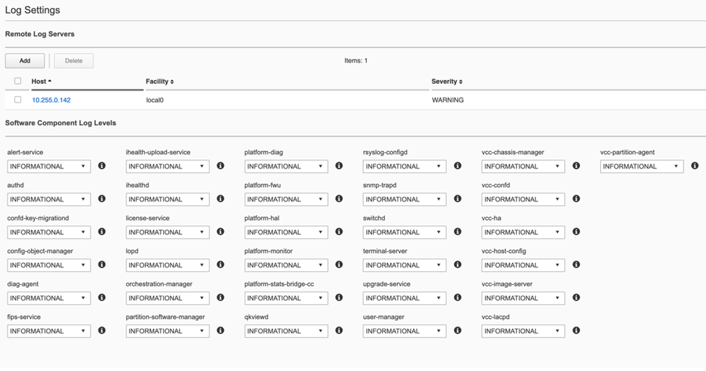

Changing the Software Component Log Levels via CLI
^^^^^^^^^^^^^^^^^^^^^^^^^^^^^^^^^^^^^^^^^^^^^^^^^^^^

If you would like to change any of the logging levels via the CLI you must be in config mode. Use the **system logging sw-components sw-component <component name> config <logging severity>** command. You must **commit** for this change to take effect. Be sure to set logging levels back to normal after troubleshooting has completed.

.. code-block:: bash

    syscon-1-active(config)# system logging sw-components sw-component ?
    Possible completions:
    alert-service     audit-service           authd                confd-key-migrationd  config-object-manager  diag-agent                fips-service                
    firewall-manager  ihealth-upload-service  ihealthd             license-service       lopd                   orchestration-manager     partition-software-manager  
    platform-diag     platform-fwu            platform-hal         platform-monitor      platform-stats         platform-stats-bridge-cc  qkviewd                     
    rsyslog-configd   snmp-service            snmp-trapd           sshd-crypto           switchd                system-service            terminal-server             
    upgrade-service   user-manager            vcc-chassis-manager  vcc-confd             vcc-ha                 vcc-host-config           vcc-image-server            
    vcc-lacpd         vcc-partition-agent     
    syscon-1-active(config)# 

Below is an example of setting the sw-subsystem **authd** to **DEBUG**, and then setting it back to **INFORMATIONAL**.

.. code-block:: bash

    syscon-1-active(config)# system logging sw-components sw-component authd config severity ?
    Description: sw-component logging severity level. Default is INFORMATIONAL.
    Possible completions:
    [INFORMATIONAL]  ALERT  CRITICAL  DEBUG  EMERGENCY  ERROR  INFORMATIONAL  NOTICE  WARNING
    syscon-1-active(config)# system logging sw-components sw-component authd config severity DEBUG
    syscon-1-active(config-sw-component-authd)# commit
    Commit complete.
    syscon-1-active(config-sw-component-authd)# 
    syscon-1-active(config-sw-component-authd)# exit
    syscon-1-active(config)# system logging sw-components sw-component authd config severity INFORMATIONAL 
    syscon-1-active(config-sw-component-authd)# commit
    Commit complete.
    syscon-1-active(config-sw-component-authd)#

Adjusting Software Component Logging Levels via webUI
^^^^^^^^^^^^^^^^^^^^^^^^^^^^^^^^^^^^^^^^^^^^^^^^^^^^

Currently F5OS webUI’s logging levels can be configured for local logging, and remote logging servers can be added as well. The **Software Component Log Levels** can be changed to have additional logging information sent to the local log.  The remote logging has its own **Severity** level which will ultimately control the maximum level of all messages going to a remote log server regardless of the individual Component Log Levels. This will allow for more information to be logged locally for debug purposes, while keeping remote logging to a minimum. If you would like to have more verbose information going to the remote logging host, you can raise its severity to see additional messages.

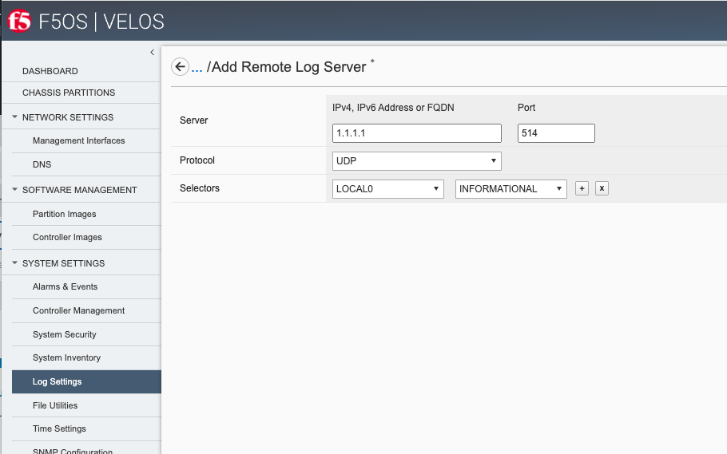

Adjusting Software Component Logging Levels via API
^^^^^^^^^^^^^^^^^^^^^^^^^^^^^^^^^^^^^^^^^^^^^^^^^^^^

You can display all the logging subsystem's logging levels via the following API call:

.. code-block:: bash

    GET https://{{velos_chassis1_system_controller_ip}}:8888/restconf/data/openconfig-system:system/logging

Every subsystem will be displayed along with its current setting:

.. code-block:: json

    {
        "openconfig-system:logging": {
            "remote-servers": {
                "remote-server": [
                    {
                        "host": "10.255.85.164",
                        "config": {
                            "host": "10.255.85.164",
                            "remote-port": 514,
                            "f5-openconfig-system-logging:proto": "udp"
                        },
                        "selectors": {
                            "selector": [
                                {
                                    "facility": "f5-system-logging-types:LOCAL0",
                                    "severity": "INFORMATIONAL",
                                    "config": {
                                        "facility": "f5-system-logging-types:LOCAL0",
                                        "severity": "INFORMATIONAL"
                                    }
                                },
                                {
                                    "facility": "f5-system-logging-types:AUTHPRIV",
                                    "severity": "INFORMATIONAL",
                                    "config": {
                                        "facility": "f5-system-logging-types:AUTHPRIV",
                                        "severity": "INFORMATIONAL"
                                    }
                                }
                            ]
                        }
                    }
                ]
            },
            "f5-openconfig-system-logging:sw-components": {
                "sw-component": [
                    {
                        "name": "alert-service",
                        "config": {
                            "name": "alert-service",
                            "description": "Alert service",
                            "severity": "INFORMATIONAL"
                        }
                    },
                    {
                        "name": "audit-service",
                        "config": {
                            "name": "audit-service",
                            "description": "Audit message handling service",
                            "severity": "INFORMATIONAL"
                        }
                    },
                    {
                        "name": "authd",
                        "config": {
                            "name": "authd",
                            "description": "Authentication configuration",
                            "severity": "INFORMATIONAL"
                        }
                    },
                    {
                        "name": "confd-key-migrationd",
                        "config": {
                            "name": "confd-key-migrationd",
                            "description": "Confd Primary Key Migration Service",
                            "severity": "INFORMATIONAL"
                        }
                    },
                    {
                        "name": "config-object-manager",
                        "config": {
                            "name": "config-object-manager",
                            "description": "Configuration object manager",
                            "severity": "INFORMATIONAL"
                        }
                    },
                    {
                        "name": "diag-agent",
                        "config": {
                            "name": "diag-agent",
                            "description": "Diag agent",
                            "severity": "INFORMATIONAL"
                        }
                    },
                    {
                        "name": "fips-service",
                        "config": {
                            "name": "fips-service",
                            "description": "FIPS service",
                            "severity": "INFORMATIONAL"
                        }
                    },
                    {
                        "name": "firewall-manager",
                        "config": {
                            "name": "firewall-manager",
                            "description": "Firewall Manager",
                            "severity": "INFORMATIONAL"
                        }
                    },
                    {
                        "name": "ihealth-upload-service",
                        "config": {
                            "name": "ihealth-upload-service",
                            "description": "Upload diagnostics data service",
                            "severity": "INFORMATIONAL"
                        }
                    },
                    {
                        "name": "ihealthd",
                        "config": {
                            "name": "ihealthd",
                            "description": "Communication proxy for ihealth-upload-service",
                            "severity": "INFORMATIONAL"
                        }
                    },
                    {
                        "name": "license-service",
                        "config": {
                            "name": "license-service",
                            "description": "License service",
                            "severity": "INFORMATIONAL"
                        }
                    },
                    {
                        "name": "lopd",
                        "config": {
                            "name": "lopd",
                            "description": "Communication proxy for the Lights Out Processor",
                            "severity": "INFORMATIONAL"
                        }
                    },
                    {
                        "name": "orchestration-manager",
                        "config": {
                            "name": "orchestration-manager",
                            "description": "Orchestration manager",
                            "severity": "INFORMATIONAL"
                        }
                    },
                    {
                        "name": "partition-software-manager",
                        "config": {
                            "name": "partition-software-manager",
                            "description": "Partition software manager",
                            "severity": "INFORMATIONAL"
                        }
                    },
                    {
                        "name": "platform-diag",
                        "config": {
                            "name": "platform-diag",
                            "description": "Platform diag service",
                            "severity": "INFORMATIONAL"
                        }
                    },
                    {
                        "name": "platform-fwu",
                        "config": {
                            "name": "platform-fwu",
                            "description": "Platform firmware upgrade",
                            "severity": "INFORMATIONAL"
                        }
                    },
                    {
                        "name": "platform-hal",
                        "config": {
                            "name": "platform-hal",
                            "description": "Platform hardware abstraction layer",
                            "severity": "INFORMATIONAL"
                        }
                    },
                    {
                        "name": "platform-monitor",
                        "config": {
                            "name": "platform-monitor",
                            "description": "Platform monitor",
                            "severity": "INFORMATIONAL"
                        }
                    },
                    {
                        "name": "platform-stats",
                        "config": {
                            "name": "platform-stats",
                            "description": "Collects platform statistics like cpu and memory utilization",
                            "severity": "INFORMATIONAL"
                        }
                    },
                    {
                        "name": "platform-stats-bridge-cc",
                        "config": {
                            "name": "platform-stats-bridge-cc",
                            "description": "Platform stats bridge",
                            "severity": "INFORMATIONAL"
                        }
                    },
                    {
                        "name": "qkviewd",
                        "config": {
                            "name": "qkviewd",
                            "description": "Diagnostic information",
                            "severity": "INFORMATIONAL"
                        }
                    },
                    {
                        "name": "rsyslog-configd",
                        "config": {
                            "name": "rsyslog-configd",
                            "description": "Logging configuration",
                            "severity": "INFORMATIONAL"
                        }
                    },
                    {
                        "name": "snmp-service",
                        "config": {
                            "name": "snmp-service",
                            "description": "SNMP service",
                            "severity": "INFORMATIONAL"
                        }
                    },
                    {
                        "name": "snmp-trapd",
                        "config": {
                            "name": "snmp-trapd",
                            "description": "SNMP trap",
                            "severity": "INFORMATIONAL"
                        }
                    },
                    {
                        "name": "sshd-crypto",
                        "config": {
                            "name": "sshd-crypto",
                            "description": "Enable Information logging for sshd-crypto",
                            "severity": "INFORMATIONAL"
                        }
                    },
                    {
                        "name": "switchd",
                        "config": {
                            "name": "switchd",
                            "description": "Switch daemon",
                            "severity": "INFORMATIONAL"
                        }
                    },
                    {
                        "name": "system-service",
                        "config": {
                            "name": "system-service",
                            "description": "System Configuration service",
                            "severity": "INFORMATIONAL"
                        }
                    },
                    {
                        "name": "terminal-server",
                        "config": {
                            "name": "terminal-server",
                            "description": "Terminal server",
                            "severity": "INFORMATIONAL"
                        }
                    },
                    {
                        "name": "upgrade-service",
                        "config": {
                            "name": "upgrade-service",
                            "description": "Software upgrade service",
                            "severity": "INFORMATIONAL"
                        }
                    },
                    {
                        "name": "user-manager",
                        "config": {
                            "name": "user-manager",
                            "description": "User manager",
                            "severity": "INFORMATIONAL"
                        }
                    },
                    {
                        "name": "vcc-chassis-manager",
                        "config": {
                            "name": "vcc-chassis-manager",
                            "description": "Chassis manager",
                            "severity": "INFORMATIONAL"
                        }
                    },
                    {
                        "name": "vcc-confd",
                        "config": {
                            "name": "vcc-confd",
                            "description": "System controller ConfD",
                            "severity": "INFORMATIONAL"
                        }
                    },
                    {
                        "name": "vcc-ha",
                        "config": {
                            "name": "vcc-ha",
                            "description": "High availability",
                            "severity": "INFORMATIONAL"
                        }
                    },
                    {
                        "name": "vcc-host-config",
                        "config": {
                            "name": "vcc-host-config",
                            "description": "Host configuration",
                            "severity": "INFORMATIONAL"
                        }
                    },
                    {
                        "name": "vcc-image-server",
                        "config": {
                            "name": "vcc-image-server",
                            "description": "Image server",
                            "severity": "INFORMATIONAL"
                        }
                    },
                    {
                        "name": "vcc-lacpd",
                        "config": {
                            "name": "vcc-lacpd",
                            "description": "Link aggregation control protocol",
                            "severity": "INFORMATIONAL"
                        }
                    },
                    {
                        "name": "vcc-partition-agent",
                        "config": {
                            "name": "vcc-partition-agent",
                            "description": "Partition agent",
                            "severity": "INFORMATIONAL"
                        }
                    }
                ]
            },
            "f5-openconfig-system-logging:host-logs": {
                "config": {
                    "remote-forwarding": {
                        "enabled": true,
                        "f5-system-logging-controller:include-standby": [
                            null
                        ]
                    },
                    "selectors": {
                        "selector": [
                            {
                                "facility": "openconfig-system-logging:AUTHPRIV",
                                "severity": "DEBUG"
                            }
                        ]
                    },
                    "files": {
                        "file": [
                            {
                                "name": "audit/audit.log"
                            }
                        ]
                    }
                }
            }
        }
    }

If you need to change the logging level to troubleshoot an issue, you can change the logging level via the APIs. Below is an example of changing the logging level for the **l2-agent** subsystem to **DEBUG**.

.. code-block:: bash

    PATCH https://{{velos_velos_chassis1_system_controller_ip}}:8888/restconf/data/openconfig-system:system/logging

In the body of the API call, enter the sw-component you want to change, and the severity level you'd like to set.

.. code-block:: json

    {
        "openconfig-system:logging": {
            "f5-openconfig-system-logging:sw-components": {
                "sw-component": {
                    "name": "audit-service",
                    "config": {
                        "name": "audit-service",
                        "description": "Audit message handling service",
                        "severity": "DEBUG"
                    }
                }
            }
        }
    }

When you are finished troubleshooting, you can set the logging level back to default (INFORMATIONAL).

.. code-block:: json

    {
        "openconfig-system:logging": {
            "f5-openconfig-system-logging:sw-components": {
                "sw-component": {
                    "name": "audit-service",
                    "config": {
                        "name": "audit-service",
                        "description": "Audit message handling service",
                        "severity": "INFORMATIONAL"
                    }
                }
            }
        }
    }

Logging Software Component Descriptions
---------------------------------------

Below is a brief description of what each sw-component is responsible for, and some example logging messages when DEBUG is enabled. Note that when DEBUG level is set these messages are not intended for customers, they are for F5 developers and support personnel.

**alert-service** - The Alert Service runs on both System Controllers and also each blade. "Alarm" is the user-facing term for alerts. Applications can send an AlertNotification or ThresholdNotification messages to their local alert service. The blades and the standby controller forward all alert messages to the alert service running on the active controller. It aggregates all alerts and publishes them to ConfD.

**api-svc-gateway** - API service gateway is designed to share information between the F5OS layer and the F5OS Tenant layer.

.. code-block:: bash

    2023-03-02T17:13:54.026196-05:00 appliance-1 api-svc-gateway[11]: priority="Debug" version=1.0 msgid=0x5801000000000005 msg="" text="send_zmq_request: type FPGAMGR_MSG len 17#012".
    2023-03-02T17:13:54.026481-05:00 appliance-1 api-svc-gateway[11]: priority="Debug" version=1.0 msgid=0x401000000000022 msg="Receive Message" time=1677795234026424838 id="1677769706046478812:1" seq=25256 mtype="FPGAD_REPLY" src="addr:tcp://*:1049" dest="api-svc-gateway".
    2023-03-02T17:13:54.026491-05:00 appliance-1 api-svc-gateway[11]: priority="Debug" version=1.0 msgid=0x5801000000000005 msg="" text="fpgamgr_zmq_reply_handler: msgid 51, token 415206256#012".
    2023-03-02T17:13:54.026494-05:00 appliance-1 api-svc-gateway[11]: priority="Debug" version=1.0 msgid=0x5801000000000005 msg="" text="fpgamgr_reply_handler: found callback for token 415206256#012".
    2023-03-02T17:13:55.027701-05:00 appliance-1 api-svc-gateway[11]: priority="Debug" version=1.0 msgid=0x401000000000024 msg="Send Message" time=1677795235027686383 id="1677769627848389263:1" seq=25260 mtype="SEND_TYPE" src="api-svc-gateway" dest="addr:tcp://localhost:1049".
    2023-03-02T17:13:55.027717-05:00 appliance-1 api-svc-gateway[11]: priority="Debug" version=1.0 msgid=0x5801000000000005 msg="" text="send_zmq_request: type FPGAMGR_MSG len 17#012".
    2023-03-02T17:13:55.028007-05:00 appliance-1 api-svc-gateway[11]: priority="Debug" version=1.0 msgid=0x401000000000022 msg="Receive Message" time=1677795235027943142 id="1677769706046478812:1" seq=25257 mtype="FPGAD_REPLY" src="addr:tcp://*:1049" dest="api-svc-gateway".
    2023-03-02T17:13:55.028018-05:00 appliance-1 api-svc-gateway[11]: priority="Debug" version=1.0 msgid=0x5801000000000005 msg="" text="fpgamgr_zmq_reply_handler: msgid 51, token 431991664#012".
    2023-03-02T17:13:55.028023-05:00 appliance-1 api-svc-gateway[11]: priority="Debug" version=1.0 msgid=0x5801000000000005 msg="" text="fpgamgr_reply_handler: found callback for token 431991664#012".
    2023-03-02T17:13:55.543064-05:00 appliance-1 api-svc-gateway[11]: priority="Debug" version=1.0 msgid=0x5801000000000005 msg="" text="Processing Tenant Event".
    2023-03-02T17:13:55.544046-05:00 appliance-1 api-svc-gateway[11]: priority="Debug" version=1.0 msgid=0x5802000000000001 msg="unknown tag  in operation" CFG_ITER="tenant cfg iter" TAG=171991382 OP=4.
    2023-03-02T17:13:55.544986-05:00 appliance-1 api-svc-gateway[11]: priority="Debug" version=1.0 msgid=0x5801000000000005 msg="" text="Done with tenant event processing".

**appliance-orchestration-manager** - Appliance orchestration manager

**audit-service** - Audit message handling service

**Authd** - The authentication service (authd) manages the configuration settings for AAA (Authentication, Authorization, Accounting).

.. code-block:: bash

    2023-03-07T19:56:20.682344-05:00 appliance-1 authd[8]: priority="Debug" version=1.0 msgid=0x401000000000022 msg="Receive Message" time=1678236980681562078 id="" seq=0 mtype="HealthMessage" src="" dest="tcp://127.0.0.1:3509".
    2023-03-07T19:56:20.682393-05:00 appliance-1 authd[8]: priority="Debug" version=1.0 msgid=0x401000000000024 msg="Send Message" time=1678236980682383532 id="1678217274187775734:0" seq=1313 mtype="HealthMessage" src="addr:tcp://*:3509" dest="".
    2023-03-07T19:56:20.682535-05:00 appliance-1 authd[8]: priority="Debug" version=1.0 msgid=0x401000000000022 msg="Receive Message" time=1678236980682492047 id="" seq=0 mtype="HealthMessage" src="" dest="tcp://127.0.0.1:3509".
    2023-03-07T19:56:20.682558-05:00 appliance-1 authd[8]: priority="Debug" version=1.0 msgid=0x401000000000024 msg="Send Message" time=1678236980682552774 id="1678217274187775734:0" seq=1314 mtype="HealthMessage" src="addr:tcp://*:3509" dest="".
    2023-03-07T19:56:50.682214-05:00 appliance-1 authd[8]: priority="Debug" version=1.0 msgid=0x401000000000022 msg="Receive Message" time=1678237010681917146 id="" seq=0 mtype="HealthMessage" src="" dest="tcp://127.0.0.1:3509".
    2023-03-07T19:56:50.682253-05:00 appliance-1 authd[8]: priority="Debug" version=1.0 msgid=0x401000000000024 msg="Send Message" time=1678237010682245853 id="1678217274187775734:0" seq=1315 mtype="HealthMessage" src="addr:tcp://*:3509" dest="".
    2023-03-07T19:56:50.682371-05:00 appliance-1 authd[8]: priority="Debug" version=1.0 msgid=0x401000000000022 msg="Receive Message" time=1678237010682336184 id="" seq=0 mtype="HealthMessage" src="" dest="tcp://127.0.0.1:3509".
    2023-03-07T19:56:50.682388-05:00 appliance-1 authd[8]: priority="Debug" version=1.0 msgid=0x401000000000024 msg="Send Message" time=1678237010682384529 id="1678217274187775734:0" seq=1316 mtype="HealthMessage" src="addr:tcp://*:3509" dest="".
    2023-03-07T19:57:20.681724-05:00 appliance-1 authd[8]: priority="Debug" version=1.0 msgid=0x401000000000022 msg="Receive Message" time=1678237040681443161 id="" seq=0 mtype="HealthMessage" src="" dest="tcp://127.0.0.1:3509".
    2023-03-07T19:57:20.681764-05:00 appliance-1 authd[8]: priority="Debug" version=1.0 msgid=0x401000000000024 msg="Send Message" time=1678237040681756663 id="1678217274187775734:0" seq=1317 mtype="HealthMessage" src="addr:tcp://*:3509" dest="".
    2023-03-07T19:57:20.681890-05:00 appliance-1 authd[8]: priority="Debug" version=1.0 msgid=0x401000000000022 msg="Receive Message" time=1678237040681843884 id="" seq=0 mtype="HealthMessage" src="" dest="tcp://127.0.0.1:3509".
    2023-03-07T19:57:20.681906-05:00 appliance-1 authd[8]: priority="Debug" version=1.0 msgid=0x401000000000024 msg="Send Message" time=1678237040681902126 id="1678217274187775734:0" seq=1318 mtype="HealthMessage" src="addr:tcp://*:3509" dest="".
    2023-03-07T19:57:46.611093-05:00 appliance-1 authd[8]: priority="Debug" version=1.0 msgid=0x3901000000000115 msg="HTTPD configuration file unchanged from previous config." name="/etc/auth-config/tls/httpd-options.conf".

**confd-key-migrationd** - Confd Primary Key Migration Service

.. code-block:: bash

    2023-03-07T19:59:26.636776-05:00 appliance-1 confd-key-migrationd[8]: priority="Debug" version=1.0 msgid=0x1b01000000000029 msg="Beginning step" step="SET_PEER_CONFD_ROMODE".
    2023-03-07T19:59:26.636797-05:00 appliance-1 confd-key-migrationd[8]: priority="Debug" version=1.0 msgid=0x1b01000000000029 msg="Beginning step" step="BACKUP_SECURE_ELEMENTS".
    2023-03-07T19:59:26.638451-05:00 appliance-1 confd-key-migrationd[8]: priority="Debug" version=1.0 msgid=0x1b01000000000018 msg="Specified maapi element does not exists in cdb" path="/system/logging/f5-logging:tls/f5-logging:key".
    2023-03-07T19:59:26.638645-05:00 appliance-1 confd-key-migrationd[8]: priority="Debug" version=1.0 msgid=0x1b01000000000018 msg="Specified maapi element does not exists in cdb" path="/system/aaa/authentication/ldap/tls_key".
    2023-03-07T19:59:26.638724-05:00 appliance-1 confd-key-migrationd[8]: priority="Debug" version=1.0 msgid=0x1b01000000000018 msg="Specified maapi element does not exists in cdb" path="/system/aaa/authentication/ldap/bindpw".
    2023-03-07T19:59:26.638999-05:00 appliance-1 confd-key-migrationd[8]: priority="Debug" version=1.0 msgid=0x1b01000000000018 msg="Specified maapi element does not exists in cdb" path="/system/aaa/tls/config/passphrase".
    2023-03-07T19:59:26.639063-05:00 appliance-1 confd-key-migrationd[8]: priority="Debug" version=1.0 msgid=0x1b01000000000018 msg="Specified maapi element does not exists in cdb" path="/system/aaa/tls/config/key".
    2023-03-07T19:59:26.639253-05:00 appliance-1 confd-key-migrationd[8]: priority="Debug" version=1.0 msgid=0x1b01000000000018 msg="Specified maapi element does not exists in cdb" path="/system/logging/tls/key".
    2023-03-07T19:59:26.639477-05:00 appliance-1 confd-key-migrationd[8]: priority="Debug" version=1.0 msgid=0x1b01000000000031 msg="debug:" msg="elem: bigip-tenant1".
    2023-03-07T19:59:26.639694-05:00 appliance-1 confd-key-migrationd[8]: priority="Debug" version=1.0 msgid=0x1b01000000000018 msg="Specified maapi element does not exists in cdb" path="/tenants/tenant{bigip-tenant1}/state/unit-key".
    2023-03-07T19:59:26.639753-05:00 appliance-1 confd-key-migrationd[8]: priority="Debug" version=1.0 msgid=0x1b01000000000031 msg="debug:" msg="elem: bigip-tenant1".
    2023-03-07T19:59:26.640329-05:00 appliance-1 confd-key-migrationd[8]: priority="Debug" version=1.0 msgid=0x1b01000000000018 msg="Specified maapi element does not exists in cdb" path="/system/diagnostics/proxy/config/proxy-password".
    2023-03-07T19:59:26.640730-05:00 appliance-1 confd-key-migrationd[8]: priority="Debug" version=1.0 msgid=0x1b01000000000029 msg="Beginning step" step="UPDATE_KEY".
    2023-03-07T19:59:26.662258-05:00 appliance-1 confd-key-migrationd[8]: priority="Debug" version=1.0 msgid=0x401000000000024 msg="Send Message" time=1678237166662247137 id="1678237166662231913:12" seq=0 mtype="ActionRequest" src="libhalsvc" dest="addr:tcp://localhost:1046".
    2023-03-07T19:59:26.663030-05:00 appliance-1 confd-key-migrationd[8]: priority="Debug" version=1.0 msgid=0x401000000000022 msg="Receive Message" time=1678237166662975272 id="" seq=0 mtype="ActionResponse" src="" dest="libhalsvc".
    2023-03-07T19:59:26.663289-05:00 appliance-1 confd-key-migrationd[8]: priority="Debug" version=1.0 msgid=0x401000000000024 msg="Send Message" time=1678237166663282866 id="1678237166663275196:13" seq=0 mtype="ActionRequest" src="libhalsvc" dest="addr:tcp://localhost:1046".
    2023-03-07T19:59:26.675999-05:00 appliance-1 confd-key-migrationd[8]: priority="Debug" version=1.0 msgid=0x401000000000022 msg="Receive Message" time=1678237166675937671 id="" seq=0 mtype="ActionResponse" src="" dest="libhalsvc".
    2023-03-07T19:59:26.846487-05:00 appliance-1 confd-key-migrationd[8]: priority="Debug" version=1.0 msgid=0x1b01000000000029 msg="Beginning step" step="RELOAD_CONFD_CONFIG".
    2023-03-07T19:59:26.932454-05:00 appliance-1 confd-key-migrationd[8]: priority="Debug" version=1.0 msgid=0x1b01000000000029 msg="Beginning step" step="RESTORE_SECURE_ELEMENTS".
    2023-03-07T19:59:26.933166-05:00 appliance-1 confd-key-migrationd[8]: priority="Debug" version=1.0 msgid=0x1b01000000000031 msg="debug:" msg="Restoring secure elem path: /tenants/platform-self-signed-cert/self-signed-key".
    2023-03-07T19:59:26.933886-05:00 appliance-1 confd-key-migrationd[8]: priority="Debug" version=1.0 msgid=0x1b01000000000031 msg="debug:" msg="Restoring secure elem path: /tenants/tenant{bigip-tenant1}/config/unit-key".
    2023-03-07T19:59:26.934306-05:00 appliance-1 confd-key-migrationd[8]: priority="Debug" version=1.0 msgid=0x1b01000000000031 msg="debug:" msg="Restoring secure elem path: /system/diagnostics/ihealth/config/password".
    2023-03-07T19:59:26.934638-05:00 appliance-1 confd-key-migrationd[8]: priority="Debug" version=1.0 msgid=0x1b01000000000031 msg="debug:" msg="Restoring secure elem path: /system/aaa/confd-restconf-token/secret".
    2023-03-07T19:59:26.980170-05:00 appliance-1 confd-key-migrationd[8]: priority="Debug" version=1.0 msgid=0x1b01000000000029 msg="Beginning step" step="SET_PEER_CONFD_RWMODE".
    2023-03-07T19:59:26.980178-05:00 appliance-1 confd-key-migrationd[8]: priority="Debug" version=1.0 msgid=0x1b01000000000029 msg="Beginning step" step="SET_PEER_CONFD_RELOAD".
    2023-03-07T20:00:24.280471-05:00 appliance-1 confd-key-migrationd[8]: priority="Debug" version=1.0 msgid=0x401000000000024 msg="Send Message" time=1678237224280270985 id="1678237224280257171:14" seq=0 mtype="ActionRequest" src="libhalsvc" dest="addr:tcp://localhost:1046".
    2023-03-07T20:00:24.281122-05:00 appliance-1 confd-key-migrationd[8]: priority="Debug" version=1.0 msgid=0x401000000000022 msg="Receive Message" time=1678237224281046981 id="" seq=0 mtype="ActionResponse" src="" dest="libhalsvc".
    2023-03-07T20:00:24.281452-05:00 appliance-1 confd-key-migrationd[8]: priority="Debug" version=1.0 msgid=0x401000000000024 msg="Send Message" time=1678237224281446127 id="1678237224281437570:15" seq=0 mtype="ActionRequest" src="libhalsvc" dest="addr:tcp://localhost:1046".
    2023-03-07T20:00:24.294650-05:00 appliance-1 confd-key-migrationd[8]: priority="Debug" version=1.0 msgid=0x401000000000022 msg="Receive Message" time=1678237224294553879 id="" seq=0 mtype="ActionResponse" src="" dest="libhalsvc".
    2023-03-07T20:00:24.343548-05:00 appliance-1 confd-key-migrationd[8]: priority="Debug" version=1.0 msgid=0x401000000000024 msg="Send Message" time=1678237224343539176 id="1678237224343527470:16" seq=0 mtype="ActionRequest" src="libhalsvc" dest="addr:tcp://localhost:1046".
    2023-03-07T20:00:24.344065-05:00 appliance-1 confd-key-migrationd[8]: priority="Debug" version=1.0 msgid=0x401000000000022 msg="Receive Message" time=1678237224344011399 id="" seq=0 mtype="ActionResponse" src="" dest="libhalsvc".
    2023-03-07T20:00:24.344340-05:00 appliance-1 confd-key-migrationd[8]: priority="Debug" version=1.0 msgid=0x401000000000024 msg="Send Message" time=1678237224344334357 id="1678237224344325349:17" seq=0 mtype="ActionRequest" src="libhalsvc" dest="addr:tcp://localhost:1046".
    2023-03-07T20:00:24.356657-05:00 appliance-1 confd-key-migrationd[8]: priority="Debug" version=1.0 msgid=0x401000000000022 msg="Receive Message" time=1678237224356588246 id="" seq=0 mtype="ActionResponse" src="" dest="libhalsvc".

	
**dagd-service** - Disaggregation (DAG) Daemon. The DAG service is used to distribute traffic across the available data plane processors (TMMs).

**datapath-cp-proxy** - Data path CP proxy

**diag-agent** - Diag agent

**disk-usage-statd** - Disk usage agent

**dma-agent** - DMA agent

**fips-service** - FIPS Service

**Fpgamgr** - FPGA manager

**http-server** - It is used for confd SSL termination, the GUI, and the REST API. 

**ihealth-upload-service** - Upload diagnostics data service. Events related to uploading qkviews to iHealth service.

**Ihealthd** - Communication proxy for ihealth-upload-service

**mage-agent** - Tenant image handling

.. code-block:: bash

    2023-03-02T17:11:14.158904-05:00 appliance-1 utils-agent[9]: priority="Info" version=1.0 msgid=0x5e01000000000009 msg="utils-agent" INFO="file path (images/tenant/BIGIP-17.1.0-0.0.16.ALL-F5OS.qcow2.zip.bundle) is allowed for Import file operation".
    2023-03-02T17:11:14.158945-05:00 appliance-1 utils-agent[9]: priority="Info" version=1.0 msgid=0x5e01000000000004 msg="utils-agent" INFO="HTTPS, Import".
    2023-03-02T17:11:14.161050-05:00 appliance-1 image-agent[10]: WATCH EVENT
    2023-03-02T17:11:14.161057-05:00 appliance-1 utils-agent[9]: priority="Info" version=1.0 msgid=0x5e01000000000009 msg="utils-agent" INFO="File Transfer in insecure  mode".
    2023-03-02T17:11:14.161058-05:00 appliance-1 image-agent[10]: watch_event: filename .BIGIP-17.1.0-0.0.16.ALL-F5OS.qcow2.zip.bundle
    2023-03-02T17:11:14.161060-05:00 appliance-1 image-agent[10]: WATCH EVENT DONE
    2023-03-02T17:11:14.173152-05:00 appliance-1 image-agent[10]: fetching image date 1.4.0-8882
    2023-03-02T17:11:14.203605-05:00 appliance-1 image-agent[10]: fetching image date 1.4.0-8622
    2023-03-02T17:11:14.233831-05:00 appliance-1 image-agent[10]: fetching image date 1.4.0-6986
    2023-03-02T17:11:14.264079-05:00 appliance-1 image-agent[10]: fetching image size 1.4.0-10138
    2023-03-02T17:11:14.295455-05:00 appliance-1 image-agent[10]: fetching image size 1.4.0-9386
    2023-03-02T17:11:14.325570-05:00 appliance-1 image-agent[10]: fetching image size 1.4.0-8939
    2023-03-02T17:11:14.355707-05:00 appliance-1 image-agent[10]: fetching image size 1.4.0-8882
    2023-03-02T17:11:14.385607-05:00 appliance-1 image-agent[10]: fetching image size 1.4.0-8622
    2023-03-02T17:11:14.415482-05:00 appliance-1 image-agent[10]: fetching image size 1.4.0-6986
    2023-03-02T17:11:14.445567-05:00 appliance-1 image-agent[10]: done with fetching the image data
    2023-03-02T17:11:14.445717-05:00 appliance-1 image-agent[10]: entering get_elem
    2023-03-02T17:11:14.445725-05:00 appliance-1 image-agent[10]: field_tag: 1753792284, class_tag: 630973766, path: /system/image/state/install/install-os-version
    2023-03-02T17:11:14.445973-05:00 appliance-1 image-agent[10]: finish is called
    2023-03-02T17:11:14.477492-05:00 appliance-1 utils-agent[9]: priority="Err" version=1.0 msgid=0x5e01000000000005 msg="utils-agent file transfer error" ERROR="HTTP Error 302".
    2023-03-02T17:11:14.477494-05:00 appliance-1 image-agent[10]: WATCH EVENT
    2023-03-02T17:11:14.477499-05:00 appliance-1 image-agent[10]: watch_event: filename .BIGIP-17.1.0-0.0.16.ALL-F5OS.qcow2.zip.bundle
    2023-03-02T17:11:14.477501-05:00 appliance-1 image-agent[10]: WATCH EVENT DONE
    2023-03-02T17:11:14.478554-05:00 appliance-1 utils-agent[9]: priority="Notice" version=1.0 msgid=0x5e01000000000006 msg="utils-agent" AUDITLOG="File transfer AUDIT. Failed Import file operation.  protocol(HTTPS) port(0) username() password(***hidden***) webtoken(***hidden***) remoteHost(nibs.olympus.f5net.com) remoteFile(build/bigip/v17.1.0/daily/build16.0/VM/BIGIP-17.1.0-0.0.16.ALL-F5OS.qcow2.zip.bundle) localFile(images/tenant/BIGIP-17.1.0-0.0.16.ALL-F5OS.qcow2.zip.bundle)".

**Kubehelper** - Application that will handle specific tasks for deploying tenants

**l2-agent** - L2 agent - Configuration changes for Layer2 services. The L2 Agent is responsible for managing the L2 configuration of the blade: interfaces, VLANs, trunks and L2 table.  Configuration is received from the partition manager and passed to the FPGA manager to be programmed into the hardware.

.. code-block:: bash

    2023-03-07T20:19:02.842421-05:00 appliance-1 l2-agent[11]: priority="Debug" version=1.0 msgid=0x208000000000005 msg="" text="IfOperCallpointHdlr::get_object_request - did not find a matching if entry".
    2023-03-07T20:19:02.842641-05:00 appliance-1 l2-agent[11]: priority="Debug" version=1.0 msgid=0x208000000000005 msg="" text="IfOperCallpointHdlr::get_object_request - did not find a matching if entry".
    2023-03-07T20:19:02.842916-05:00 appliance-1 l2-agent[11]: priority="Debug" version=1.0 msgid=0x208000000000005 msg="" text="IfOperCallpointHdlr::get_object_request - did not find a matching if entry".
    2023-03-07T20:19:05.591978-05:00 appliance-1 l2-agent[11]: priority="Debug" version=1.0 msgid=0x208000000000005 msg="" text="LagValidationHandler::validate_ifs g_lagswithmembers 0, g_delifs 0".
    2023-03-07T20:19:05.591986-05:00 appliance-1 l2-agent[11]: priority="Debug" version=1.0 msgid=0x208000000000005 msg="" text="LagValidationHandler::validate_lags g_lagswithmembers 0, g_newvidsifs 0, g_newvidslags 0, g_newlags 0, g_lagchangemembers 0, g_newifs 0".
    2023-03-07T20:19:05.591996-05:00 appliance-1 l2-agent[11]: priority="Debug" version=1.0 msgid=0x208000000000005 msg="" text="LagValidationHandler::validate_vlans g_newvidsifs 0, g_newvidslags 0".
    2023-03-07T20:19:05.592000-05:00 appliance-1 l2-agent[11]: priority="Debug" version=1.0 msgid=0x208000000000005 msg="" text="LagValidationHandler::validate_phy_ports - g_delifs size=0, g_fecifs size=0".
    2023-03-07T20:19:05.605520-05:00 appliance-1 l2-agent[11]: priority="Debug" version=1.0 msgid=0x208000000000005 msg="" text="IfConfigHandler::process_update lagmbrset-size=0".
    2023-03-07T20:19:05.605635-05:00 appliance-1 l2-agent[11]: priority="Debug" version=1.0 msgid=0x208000000000005 msg="" text="IfOperPublishHandler::set_if_enabled_oper_data: set enabled 1 for interface 1.0".
    2023-03-07T20:19:05.607134-05:00 appliance-1 l2-agent[11]: priority="Debug" version=1.0 msgid=0x208000000000005 msg="" text="IfConfigHandler::process_update - tvid_add 0, tvid_del 0, nvid_add 0, nvid_del 0, ntin_add 0, ntin_del 0, ntit_add 0, ntit_del 0, enable 1, mtu 0, fec 0".
    2023-03-07T20:19:05.607142-05:00 appliance-1 l2-agent[11]: priority="Debug" version=1.0 msgid=0x208000000000005 msg="" text="IfConfigHandler::process_update - lagid_add 0, lagid_del 0, if_del_set 0, lagid_del_set 0, lag_nvid_add 0, lag_nvid_del 0, lag_tvid_add 0, lag_tvid_del 0, if_disthash_map 0 if_publish_set 0".
    2023-03-07T20:19:05.607146-05:00 appliance-1 l2-agent[11]: priority="Debug" version=1.0 msgid=0x208000000000005 msg="" text="FpgaClient::update_if_enabled: start with phyport=64".
    2023-03-07T20:19:05.607162-05:00 appliance-1 l2-agent[11]: priority="Debug" version=1.0 msgid=0x208000000000005 msg="" text="IfConfigHandler::process_update ifname_lagid_del_map-size=0, ifname_lagid_add_map-size = 0".
    2023-03-07T20:19:05.607184-05:00 appliance-1 l2-agent[11]: priority="Debug" version=1.0 msgid=0x401000000000024 msg="Send Message" time=1678238345607170981 id="1678217281085641675:0" seq=63 mtype="L2AGENT_PORT_ENABLE_SET" src="#014" dest="addr:tcp://localhost:1049".
    2023-03-07T20:19:05.607201-05:00 appliance-1 l2-agent[11]: priority="Debug" version=1.0 msgid=0x208000000000005 msg="" text="FpgaClientSendHdlr::run - sent msgid L2AGENT_PORT_ENABLE_SET to fpgamgr with rc=0".
    2023-03-07T20:19:05.607204-05:00 appliance-1 l2-agent[11]: priority="Debug" version=1.0 msgid=0x208000000000005 msg="" text="FpgaClientSendHdlr::run - waitForSendRequest".
    2023-03-07T20:19:05.608716-05:00 appliance-1 l2-agent[11]: priority="Debug" version=1.0 msgid=0x208000000000005 msg="" text="IfOperSubscribeHandler::process_update - ifoperlacpmap-size=0, ifoperset-size=0".
    2023-03-07T20:19:05.620730-05:00 appliance-1 l2-agent[11]: priority="Debug" version=1.0 msgid=0x208000000000005 msg="" text="OPER STATUS = 1".
    2023-03-07T20:19:05.621090-05:00 appliance-1 l2-agent[11]: priority="Debug" version=1.0 msgid=0x208000000000005 msg="" text="IfOperSubscribeHandler::process_update - ifoperlacpmap-size=1, ifoperset-size=1".
    2023-03-07T20:19:05.621097-05:00 appliance-1 l2-agent[11]: priority="Debug" version=1.0 msgid=0x208000000000005 msg="" text="L2Agent::handle_if_op_state_change - START for if=1.0 opstate=UP, lacpstate=LACP_DOWN, oldopstate=DOWN, oldlacpstate=LACP_DOWN".
    2023-03-07T20:19:05.621107-05:00 appliance-1 l2-agent[11]: priority="Debug" version=1.0 msgid=0x208000000000005 msg="" text="L2Agent::handle_if_op_state_change - found if 1.0 - lagid=Arista - check if we need to send update".
    2023-03-07T20:19:05.621112-05:00 appliance-1 l2-agent[11]: priority="Debug" version=1.0 msgid=0x208000000000005 msg="" text="L2Agent::handle_if_op_state_change - was_up=0, is_up=0 - no need to send update".
    2023-03-07T20:19:05.621157-05:00 appliance-1 l2-agent[11]: priority="Debug" version=1.0 msgid=0x208000000000005 msg="" text="LagOperPublishHandler::compile_lag_oper_data: START with ifmap-size=22, ifstatemap-size=22, lagset=1".
    2023-03-07T20:19:05.621168-05:00 appliance-1 l2-agent[11]: priority="Debug" version=1.0 msgid=0x208000000000005 msg="" text="LagOperPublishHandler::compile_lag_oper_data - check out member 1.0 in LAG Arista lag_type LACP with oper UP lacpstate LACP_DOWN".
    2023-03-07T20:19:05.621179-05:00 appliance-1 l2-agent[11]: priority="Debug" version=1.0 msgid=0x208000000000005 msg="" text="LagOperPublishHandler::compile_lag_oper_data - check out member 2.0 in LAG Arista lag_type LACP with oper DOWN lacpstate LACP_DEFAULTED".
    2023-03-07T20:19:05.621185-05:00 appliance-1 l2-agent[11]: priority="Debug" version=1.0 msgid=0x208000000000005 msg="" text="LagOperPublishHandler::compile_lag_oper_data - found 1 LAGs to update".
    2023-03-07T20:19:05.621195-05:00 appliance-1 l2-agent[11]: priority="Debug" version=1.0 msgid=0x208000000000005 msg="" text="LagOperPublishHandler::set_lag_oper_data: START with lagopermap-size=1".
    2023-03-07T20:19:05.683263-05:00 appliance-1 l2-agent[11]: priority="Debug" version=1.0 msgid=0x208000000000005 msg="" text="IfOperCallpointHdlr::s_init: START with ifvector size=20".
    2023-03-07T20:19:05.683363-05:00 appliance-1 l2-agent[11]: priority="Debug" version=1.0 msgid=0x401000000000024 msg="Send Message" time=1678238345683355702 id="1678236473148048137:1" seq=440 mtype="IF Statistics Request" src="" dest="addr:tcp://localhost:1063".
    2023-03-07T20:19:05.683717-05:00 appliance-1 l2-agent[11]: priority="Debug" version=1.0 msgid=0x401000000000022 msg="Receive Message" time=1678238345683660538 id="1678217273365394961:0" seq=22641 mtype="Reply" src="addr:tcp://0.0.0.0:1063" dest="".
    2023-03-07T20:19:05.683733-05:00 appliance-1 l2-agent[11]: priority="Debug" version=1.0 msgid=0x208000000000005 msg="" text="IfOperCallpointHdlr::get_object_reply 1.0".

**Lacpd** -  Link Aggregation Control Protocol (LACP) related events. This would be used when troubleshooting issues when setting up a LAG with LACP enabled. You could set to debug temporarily to see LACP related events in the platfrom.log.

.. code-block:: bash

    2023-03-02T17:05:55.850289-05:00 appliance-1 lacpd[1]: priority="Debug" version=1.0 msgid=0x401000000000022 msg="Receive Message" time=1677794755850242378 id="1677769628507544224:1" seq=24999 mtype="Hello_RESP" src="addr:tcp://*:1088" dest="LacpHeartBeatsClient".
    2023-03-02T17:05:55.902407-05:00 appliance-1 lacpd[1]: priority="Debug" version=1.0 msgid=0x7302000000000022 msg="Did mapped to interface name." did=20 ifname="13.0".
    2023-03-02T17:05:55.902423-05:00 appliance-1 lacpd[1]: priority="Debug" version=1.0 msgid=0x7302000000000013 msg="" SEND_IFH="Send IFH: {     sep = 4    dm = 0    svc = 1    nti = 4095    did = 20    fwd_type = 1    net_override = 1    l2_override = 1    l3_override = 1    sdag_override = 1    force_overrides = 0    default_drop = 0    dlf_drop = 0    mirror = 0    dest_trunk = 0    remote_dump = 0    local_dump = 0}".
    2023-03-02T17:05:55.902428-05:00 appliance-1 lacpd[1]: priority="Debug" version=1.0 msgid=0x7302000000000006 msg="Sep Transmit queue" size=1.
    2023-03-02T17:05:55.902432-05:00 appliance-1 lacpd[1]: priority="Debug" version=1.0 msgid=0x7302000000000009 msg="successfully send packet on SEP".
    2023-03-02T17:05:55.902436-05:00 appliance-1 lacpd[1]: priority="Debug" version=1.0 msgid=0x7302000000000024 msg="" RX_STATS="in packets: 124617, in errors: 0, poll in errors: 0".
    2023-03-02T17:05:55.902438-05:00 appliance-1 lacpd[1]: priority="Debug" version=1.0 msgid=0x7302000000000025 msg="" TX_STATS="out packets: 100576, out errors: 0, poll out errors: 0".
    2023-03-02T17:05:55.902445-05:00 appliance-1 lacpd[1]: priority="Debug" version=1.0 msgid=0x7302000000000022 msg="Did mapped to interface name." did=21 ifname="14.0".
    2023-03-02T17:05:55.902449-05:00 appliance-1 lacpd[1]: priority="Debug" version=1.0 msgid=0x7302000000000013 msg="" SEND_IFH="Send IFH: {     sep = 5    dm = 0    svc = 1    nti = 4095    did = 21    fwd_type = 1    net_override = 1    l2_override = 1    l3_override = 1    sdag_override = 1    force_overrides = 0    default_drop = 0    dlf_drop = 0    mirror = 0    dest_trunk = 0    remote_dump = 0    local_dump = 0}".
    2023-03-02T17:05:55.902452-05:00 appliance-1 lacpd[1]: priority="Debug" version=1.0 msgid=0x7302000000000006 msg="Sep Transmit queue" size=1.
    2023-03-02T17:05:55.902454-05:00 appliance-1 lacpd[1]: priority="Debug" version=1.0 msgid=0x7302000000000009 msg="successfully send packet on SEP".
    2023-03-02T17:05:55.902457-05:00 appliance-1 lacpd[1]: priority="Debug" version=1.0 msgid=0x7302000000000024 msg="" RX_STATS="in packets: 124617, in errors: 0, poll in errors: 0".
    2023-03-02T17:05:55.902459-05:00 appliance-1 lacpd[1]: priority="Debug" version=1.0 msgid=0x7302000000000025 msg="" TX_STATS="out packets: 100577, out errors: 0, poll out errors: 0".
    2023-03-02T17:05:55.902466-05:00 appliance-1 lacpd[1]: priority="Debug" version=1.0 msgid=0x7302000000000022 msg="Did mapped to interface name." did=22 ifname="15.0".
    2023-03-02T17:05:55.902469-05:00 appliance-1 lacpd[1]: priority="Debug" version=1.0 msgid=0x7302000000000013 msg="" SEND_IFH="Send IFH: {     sep = 6    dm = 0    svc = 1    nti = 4095    did = 22    fwd_type = 1    net_override = 1    l2_override = 1    l3_override = 1    sdag_override = 1    force_overrides = 0    default_drop = 0    dlf_drop = 0    mirror = 0    dest_trunk = 0    remote_dump = 0    local_dump = 0}".
    2023-03-02T17:05:55.902472-05:00 appliance-1 lacpd[1]: priority="Debug" version=1.0 msgid=0x7302000000000006 msg="Sep Transmit queue" size=1.

**license-service** - logs events related to licensing.

.. code-block:: bash

    2023-03-07T19:25:32.273579-05:00 appliance-1 license-service[11]: priority="Debug" version=1.0 msgid=0x6605000000000001 msg="Trace" EVENT="Created ActionWorker".
    2023-03-07T19:25:32.273723-05:00 appliance-1 license-service[11]: priority="Debug" version=1.0 msgid=0x6605000000000001 msg="Trace" EVENT="ActionWorker Active".
    2023-03-07T19:25:32.273861-05:00 appliance-1 license-service[11]: priority="Debug" version=1.0 msgid=0x5704000000000001 msg=": Library debug message" func="getDossierRefHandle" MSG="Dossier for Appliance platform".
    2023-03-07T19:25:32.273868-05:00 appliance-1 license-service[11]: priority="Debug" version=1.0 msgid=0x5704000000000006 msg=": Base key:" func="init" KEY="B1249-45920-70635-24344-7350724".
    2023-03-07T19:25:32.273874-05:00 appliance-1 license-service[11]: priority="Debug" version=1.0 msgid=0x5704000000000003 msg=": START" func="addGenericDossierEntries".
    2023-03-07T19:25:32.273901-05:00 appliance-1 license-service[11]: priority="Debug" version=1.0 msgid=0x5704000000000009 msg=": BIOS File Path:" func="getBiosInfo" PATH="/sys/firmware/dmi/entries/0-0/".
    2023-03-07T19:25:32.274042-05:00 appliance-1 license-service[11]: priority="Debug" version=1.0 msgid=0x5704000000000010 msg=": BIOS Vendor:   Version:" func="addGenericDossierEntries" VENDOR="American Megatrends International, LLC." VERSION="OBJ: PGF-0262-xx BIOS: 2.00.117.1 ME: 4.4.4.202".
    2023-03-07T19:25:32.274052-05:00 appliance-1 license-service[11]: priority="Debug" version=1.0 msgid=0x5704000000000014 msg=": Adding Dossier Entry:" func="addDossierEntry" ENTRY="bios_id=American Megatrends International, LLC.".
    2023-03-07T19:25:32.274060-05:00 appliance-1 license-service[11]: priority="Debug" version=1.0 msgid=0x5704000000000014 msg=": Adding Dossier Entry:" func="addDossierEntry" ENTRY="bios_version=OBJ: PGF-0262-xx BIOS: 2.00.117.1 ME: 4.4.4.202".
    2023-03-07T19:25:32.274064-05:00 appliance-1 license-service[11]: priority="Debug" version=1.0 msgid=0x5704000000000014 msg=": Adding Dossier Entry:" func="addDossierEntry" ENTRY="bridge=None".
    2023-03-07T19:25:32.274072-05:00 appliance-1 license-service[11]: priority="Debug" version=1.0 msgid=0x5704000000000014 msg=": Adding Dossier Entry:" func="addDossierEntry" ENTRY="date=1678235132".
    2023-03-07T19:25:32.274079-05:00 appliance-1 license-service[11]: priority="Debug" version=1.0 msgid=0x5704000000000014 msg=": Adding Dossier Entry:" func="addDossierEntry" ENTRY="salt=576f394c".
    2023-03-07T19:25:32.274083-05:00 appliance-1 license-service[11]: priority="Debug" version=1.0 msgid=0x5704000000000003 msg=": START" func="getKernelVersion".
    2023-03-07T19:25:32.276595-05:00 appliance-1 license-service[11]: priority="Debug" version=1.0 msgid=0x5704000000000014 msg=": Adding Dossier Entry:" func="addDossierEntry" ENTRY="kernel=3.10.0-1160.71.1.F5.1.el7_8.x86_64".
    2023-03-07T19:25:32.276602-05:00 appliance-1 license-service[11]: priority="Debug" version=1.0 msgid=0x5704000000000013 msg=": Kernel Version:" func="addGenericDossierEntries" VERSION="3.10.0-1160.71.1.F5.1.el7_8.x86_64".
    2023-03-07T19:25:32.276616-05:00 appliance-1 license-service[11]: priority="Debug" version=1.0 msgid=0x5704000000000011 msg=": Version File Path:" func="getVersion" PATH="/etc/PRODUCT".
    2023-03-07T19:25:32.276633-05:00 appliance-1 license-service[11]: priority="Debug" version=1.0 msgid=0x5704000000000012 msg=": Version:" func="addGenericDossierEntries" VERSION="BIG-IP 1.4.0 2023-03-07-10281 (VANQUISH)".
    2023-03-07T19:25:32.276637-05:00 appliance-1 license-service[11]: priority="Debug" version=1.0 msgid=0x5704000000000014 msg=": Adding Dossier Entry:" func="addDossierEntry" ENTRY="version=BIG-IP 1.4.0 2023-03-07-10281 (VANQUISH)".
    2023-03-07T19:25:32.276640-05:00 appliance-1 license-service[11]: priority="Debug" version=1.0 msgid=0x5704000000000003 msg=": START" func="addHalEntries".
    2023-03-07T19:25:32.276642-05:00 appliance-1 license-service[11]: priority="Debug" version=1.0 msgid=0x5704000000000007 msg=": eeprom field:" func="getHalData" FIELD="Vendor Full Name".
    2023-03-07T19:25:32.276882-05:00 appliance-1 license-service[11]: priority="Debug" version=1.0 msgid=0x401000000000024 msg="Send Message" time=1678235132276868965 id="1678235132276822179:0" seq=0 mtype="ActionRequest" src="libhalsvc" dest="addr:tcp://localhost:1046".
    2023-03-07T19:25:32.970066-05:00 appliance-1 license-service[11]: priority="Debug" version=1.0 msgid=0x401000000000022 msg="Receive Message" time=1678235132969940351 id="" seq=0 mtype="ActionResponse" src="" dest="libhalsvc".
    2023-03-07T19:25:32.970263-05:00 appliance-1 license-service[11]: priority="Debug" version=1.0 msgid=0x5704000000000014 msg=": Adding Dossier Entry:" func="addDossierEntry" ENTRY="sys_mfc=F5 Networks Inc.".
    2023-03-07T19:25:32.970271-05:00 appliance-1 license-service[11]: priority="Debug" version=1.0 msgid=0x5704000000000007 msg=": eeprom field:" func="getHalData" FIELD="End Item Serial Number".
    2023-03-07T19:25:32.970277-05:00 appliance-1 license-service[11]: priority="Debug" version=1.0 msgid=0x5704000000000014 msg=": Adding Dossier Entry:" func="addDossierEntry" ENTRY="chassis_serial=f5-xpdn-ngmu".
    2023-03-07T19:25:32.970280-05:00 appliance-1 license-service[11]: priority="Debug" version=1.0 msgid=0x5704000000000007 msg=": eeprom field:" func="getHalData" FIELD="Base Mac".
    2023-03-07T19:25:32.970291-05:00 appliance-1 license-service[11]: priority="Debug" version=1.0 msgid=0x5704000000000014 msg=": Adding Dossier Entry:" func="addDossierEntry" ENTRY="mac=00:94:a1:69:59:00".
    2023-03-07T19:25:32.970294-05:00 appliance-1 license-service[11]: priority="Debug" version=1.0 msgid=0x5704000000000007 msg=": eeprom field:" func="getHalData" FIELD="Engineering Platform Id".
    2023-03-07T19:25:32.970304-05:00 appliance-1 license-service[11]: priority="Debug" version=1.0 msgid=0x5704000000000014 msg=": Adding Dossier Entry:" func="addDossierEntry" ENTRY="probes=0xCA000002".
    2023-03-07T19:25:32.970309-05:00 appliance-1 license-service[11]: priority="Debug" version=1.0 msgid=0x5704000000000014 msg=": Adding Dossier Entry:" func="addDossierEntry" ENTRY="sys_product=C128".
    2023-03-07T19:25:32.970495-05:00 appliance-1 license-service[11]: priority="Debug" version=1.0 msgid=0x401000000000024 msg="Send Message" time=1678235132970487968 id="1678235132970475415:1" seq=0 mtype="ActionRequest" src="libhalsvc" dest="addr:tcp://localhost:1046".
    2023-03-07T19:25:32.982349-05:00 appliance-1 license-service[11]: priority="Debug" version=1.0 msgid=0x401000000000022 msg="Receive Message" time=1678235132982285289 id="" seq=0 mtype="ActionResponse" src="" dest="libhalsvc".
    2023-03-07T19:25:32.982443-05:00 appliance-1 license-service[11]: priority="Debug" version=1.0 msgid=0x5704000000000014 msg=": Adding Dossier Entry:" func="addDossierEntry" ENTRY="sys_uuid=000000000000000000000000000000000000000030353438155139312f002300".
    2023-03-07T19:25:32.982447-05:00 appliance-1 license-service[11]: priority="Debug" version=1.0 msgid=0x5704000000000003 msg=": START" func="addAdditionalEntries".
    2023-03-07T19:25:32.982535-05:00 appliance-1 license-service[11]: priority="Debug" version=1.0 msgid=0x5704000000000014 msg=": Adding Dossier Entry:" func="addDossierEntry" ENTRY="cpu_type=Intel(R) Xeon(R) Gold 6312U CPU @ 2.40GHz".
    2023-03-07T19:25:32.982542-05:00 appliance-1 license-service[11]: priority="Debug" version=1.0 msgid=0x5704000000000014 msg=": Adding Dossier Entry:" func="addDossierEntry" ENTRY="cpu_rev=106".
    2023-03-07T19:25:32.982546-05:00 appliance-1 license-service[11]: priority="Debug" version=1.0 msgid=0x5704000000000014 msg=": Adding Dossier Entry:" func="addDossierEntry" ENTRY="cpu_speed=3100 MHz".
    2023-03-07T19:25:32.984061-05:00 appliance-1 license-service[11]: priority="Debug" version=1.0 msgid=0x5704000000000003 msg=": START" func="addMemInfo".
    2023-03-07T19:25:32.984471-05:00 appliance-1 license-service[11]: priority="Debug" version=1.0 msgid=0x5704000000000014 msg=": Adding Dossier Entry:" func="addDossierEntry" ENTRY="memory=257536MB".
    2023-03-07T19:25:32.984476-05:00 appliance-1 license-service[11]: priority="Debug" version=1.0 msgid=0x5704000000000008 msg=": Memory Size:" func="addMemInfo" SIZE="257536MB".
    2023-03-07T19:25:32.984484-05:00 appliance-1 license-service[11]: priority="Debug" version=1.0 msgid=0x5704000000000014 msg=": Adding Dossier Entry:" func="addDossierEntry" ENTRY="key=B1249-45920-70635-24344-7350724".
    2023-03-07T19:25:32.984488-05:00 appliance-1 license-service[11]: priority="Debug" version=1.0 msgid=0x5704000000000014 msg=": Adding Dossier Entry:" func="addDossierEntry" ENTRY="active=Y226037-5242227".
    2023-03-07T19:25:32.984491-05:00 appliance-1 license-service[11]: priority="Debug" version=1.0 msgid=0x5704000000000003 msg=": START" func="getDossierEncryptedBlob".
    2023-03-07T19:25:32.984493-05:00 appliance-1 license-service[11]: priority="Debug" version=1.0 msgid=0x5704000000000003 msg=": START" func="buildDossierBuffer".
    2023-03-07T19:25:33.006820-05:00 appliance-1 license-service[11]: priority="Debug" version=1.0 msgid=0x5704000000000003 msg=": START" func="getDossierHashBlob".
    2023-03-07T19:25:40.126846-05:00 appliance-1 license-service[11]: priority="Debug" version=1.0 msgid=0x6605000000000001 msg="Trace" EVENT="ActionWorker Idle".
    2023-03-07T19:25:40.215329-05:00 appliance-1 license-service[11]: priority="Debug" version=1.0 msgid=0x6605000000000001 msg="Trace" EVENT="ActionWorker Active".
    2023-03-07T19:25:40.215460-05:00 appliance-1 license-service[11]: priority="Debug" version=1.0 msgid=0x5704000000000001 msg=": Library debug message" func="getDossierRefHandle" MSG="Dossier for Appliance platform".
    2023-03-07T19:25:40.215465-05:00 appliance-1 license-service[11]: priority="Debug" version=1.0 msgid=0x5704000000000006 msg=": Base key:" func="init" KEY="B1249-45920-70635-24344-7350724".
    2023-03-07T19:25:40.215468-05:00 appliance-1 license-service[11]: priority="Debug" version=1.0 msgid=0x5704000000000003 msg=": START" func="addGenericDossierEntries".
    2023-03-07T19:25:40.215483-05:00 appliance-1 license-service[11]: priority="Debug" version=1.0 msgid=0x5704000000000009 msg=": BIOS File Path:" func="getBiosInfo" PATH="/sys/firmware/dmi/entries/0-0/".
    2023-03-07T19:25:40.215591-05:00 appliance-1 license-service[11]: priority="Debug" version=1.0 msgid=0x5704000000000010 msg=": BIOS Vendor:   Version:" func="addGenericDossierEntries" VENDOR="American Megatrends International, LLC." VERSION="OBJ: PGF-0262-xx BIOS: 2.00.117.1 ME: 4.4.4.202".
    2023-03-07T19:25:40.215600-05:00 appliance-1 license-service[11]: priority="Debug" version=1.0 msgid=0x5704000000000014 msg=": Adding Dossier Entry:" func="addDossierEntry" ENTRY="bios_id=American Megatrends International, LLC.".
    2023-03-07T19:25:40.215606-05:00 appliance-1 license-service[11]: priority="Debug" version=1.0 msgid=0x5704000000000014 msg=": Adding Dossier Entry:" func="addDossierEntry" ENTRY="bios_version=OBJ: PGF-0262-xx BIOS: 2.00.117.1 ME: 4.4.4.202".
    2023-03-07T19:25:40.215612-05:00 appliance-1 license-service[11]: priority="Debug" version=1.0 msgid=0x5704000000000014 msg=": Adding Dossier Entry:" func="addDossierEntry" ENTRY="bridge=None".
    2023-03-07T19:25:40.215616-05:00 appliance-1 license-service[11]: priority="Debug" version=1.0 msgid=0x5704000000000014 msg=": Adding Dossier Entry:" func="addDossierEntry" ENTRY="date=1678235140".
    2023-03-07T19:25:40.215623-05:00 appliance-1 license-service[11]: priority="Debug" version=1.0 msgid=0x5704000000000014 msg=": Adding Dossier Entry:" func="addDossierEntry" ENTRY="salt=0c2c555d".
    2023-03-07T19:25:40.215627-05:00 appliance-1 license-service[11]: priority="Debug" version=1.0 msgid=0x5704000000000003 msg=": START" func="getKernelVersion".
    2023-03-07T19:25:40.217896-05:00 appliance-1 license-service[11]: priority="Debug" version=1.0 msgid=0x5704000000000014 msg=": Adding Dossier Entry:" func="addDossierEntry" ENTRY="kernel=3.10.0-1160.71.1.F5.1.el7_8.x86_64".
    2023-03-07T19:25:40.217902-05:00 appliance-1 license-service[11]: priority="Debug" version=1.0 msgid=0x5704000000000013 msg=": Kernel Version:" func="addGenericDossierEntries" VERSION="3.10.0-1160.71.1.F5.1.el7_8.x86_64".
    2023-03-07T19:25:40.217914-05:00 appliance-1 license-service[11]: priority="Debug" version=1.0 msgid=0x5704000000000011 msg=": Version File Path:" func="getVersion" PATH="/etc/PRODUCT".
    2023-03-07T19:25:40.217927-05:00 appliance-1 license-service[11]: priority="Debug" version=1.0 msgid=0x5704000000000012 msg=": Version:" func="addGenericDossierEntries" VERSION="BIG-IP 1.4.0 2023-03-07-10281 (VANQUISH)".
    2023-03-07T19:25:40.217932-05:00 appliance-1 license-service[11]: priority="Debug" version=1.0 msgid=0x5704000000000014 msg=": Adding Dossier Entry:" func="addDossierEntry" ENTRY="version=BIG-IP 1.4.0 2023-03-07-10281 (VANQUISH)".
    2023-03-07T19:25:40.217934-05:00 appliance-1 license-service[11]: priority="Debug" version=1.0 msgid=0x5704000000000003 msg=": START" func="addHalEntries".
    2023-03-07T19:25:40.217936-05:00 appliance-1 license-service[11]: priority="Debug" version=1.0 msgid=0x5704000000000007 msg=": eeprom field:" func="getHalData" FIELD="Vendor Full Name".
    2023-03-07T19:25:40.218102-05:00 appliance-1 license-service[11]: priority="Debug" version=1.0 msgid=0x401000000000024 msg="Send Message" time=1678235140218094301 id="1678235140218079370:2" seq=0 mtype="ActionRequest" src="libhalsvc" dest="addr:tcp://localhost:1046".
    2023-03-07T19:25:40.941546-05:00 appliance-1 license-service[11]: priority="Debug" version=1.0 msgid=0x401000000000022 msg="Receive Message" time=1678235140941411643 id="" seq=0 mtype="ActionResponse" src="" dest="libhalsvc".
    2023-03-07T19:25:40.941725-05:00 appliance-1 license-service[11]: priority="Debug" version=1.0 msgid=0x5704000000000014 msg=": Adding Dossier Entry:" func="addDossierEntry" ENTRY="sys_mfc=F5 Networks Inc.".
    2023-03-07T19:25:40.941732-05:00 appliance-1 license-service[11]: priority="Debug" version=1.0 msgid=0x5704000000000007 msg=": eeprom field:" func="getHalData" FIELD="End Item Serial Number".
    2023-03-07T19:25:40.941739-05:00 appliance-1 license-service[11]: priority="Debug" version=1.0 msgid=0x5704000000000014 msg=": Adding Dossier Entry:" func="addDossierEntry" ENTRY="chassis_serial=f5-xpdn-ngmu".
    2023-03-07T19:25:40.941742-05:00 appliance-1 license-service[11]: priority="Debug" version=1.0 msgid=0x5704000000000007 msg=": eeprom field:" func="getHalData" FIELD="Base Mac".
    2023-03-07T19:25:40.941752-05:00 appliance-1 license-service[11]: priority="Debug" version=1.0 msgid=0x5704000000000014 msg=": Adding Dossier Entry:" func="addDossierEntry" ENTRY="mac=00:94:a1:69:59:00".
    2023-03-07T19:25:40.941755-05:00 appliance-1 license-service[11]: priority="Debug" version=1.0 msgid=0x5704000000000007 msg=": eeprom field:" func="getHalData" FIELD="Engineering Platform Id".
    2023-03-07T19:25:40.941760-05:00 appliance-1 license-service[11]: priority="Debug" version=1.0 msgid=0x5704000000000014 msg=": Adding Dossier Entry:" func="addDossierEntry" ENTRY="probes=0xCA000002".
    2023-03-07T19:25:40.941763-05:00 appliance-1 license-service[11]: priority="Debug" version=1.0 msgid=0x5704000000000014 msg=": Adding Dossier Entry:" func="addDossierEntry" ENTRY="sys_product=C128".
    2023-03-07T19:25:40.941860-05:00 appliance-1 license-service[11]: priority="Debug" version=1.0 msgid=0x401000000000024 msg="Send Message" time=1678235140941853130 id="1678235140941842150:3" seq=0 mtype="ActionRequest" src="libhalsvc" dest="addr:tcp://localhost:1046".
    2023-03-07T19:25:40.954525-05:00 appliance-1 license-service[11]: priority="Debug" version=1.0 msgid=0x401000000000022 msg="Receive Message" time=1678235140954447412 id="" seq=0 mtype="ActionResponse" src="" dest="libhalsvc".
    2023-03-07T19:25:40.954619-05:00 appliance-1 license-service[11]: priority="Debug" version=1.0 msgid=0x5704000000000014 msg=": Adding Dossier Entry:" func="addDossierEntry" ENTRY="sys_uuid=000000000000000000000000000000000000000030353438155139312f002300".
    2023-03-07T19:25:40.954624-05:00 appliance-1 license-service[11]: priority="Debug" version=1.0 msgid=0x5704000000000003 msg=": START" func="addAdditionalEntries".
    2023-03-07T19:25:40.954697-05:00 appliance-1 license-service[11]: priority="Debug" version=1.0 msgid=0x5704000000000014 msg=": Adding Dossier Entry:" func="addDossierEntry" ENTRY="cpu_type=Intel(R) Xeon(R) Gold 6312U CPU @ 2.40GHz".
    2023-03-07T19:25:40.954705-05:00 appliance-1 license-service[11]: priority="Debug" version=1.0 msgid=0x5704000000000014 msg=": Adding Dossier Entry:" func="addDossierEntry" ENTRY="cpu_rev=106".
    2023-03-07T19:25:40.954712-05:00 appliance-1 license-service[11]: priority="Debug" version=1.0 msgid=0x5704000000000014 msg=": Adding Dossier Entry:" func="addDossierEntry" ENTRY="cpu_speed=3100 MHz".
    2023-03-07T19:25:40.956215-05:00 appliance-1 license-service[11]: priority="Debug" version=1.0 msgid=0x5704000000000003 msg=": START" func="addMemInfo".
    2023-03-07T19:25:40.956922-05:00 appliance-1 license-service[11]: priority="Debug" version=1.0 msgid=0x5704000000000014 msg=": Adding Dossier Entry:" func="addDossierEntry" ENTRY="memory=257536MB".
    2023-03-07T19:25:40.956926-05:00 appliance-1 license-service[11]: priority="Debug" version=1.0 msgid=0x5704000000000008 msg=": Memory Size:" func="addMemInfo" SIZE="257536MB".
    2023-03-07T19:25:40.956934-05:00 appliance-1 license-service[11]: priority="Debug" version=1.0 msgid=0x5704000000000014 msg=": Adding Dossier Entry:" func="addDossierEntry" ENTRY="key=B1249-45920-70635-24344-7350724".
    2023-03-07T19:25:40.956938-05:00 appliance-1 license-service[11]: priority="Debug" version=1.0 msgid=0x5704000000000014 msg=": Adding Dossier Entry:" func="addDossierEntry" ENTRY="active=Y226037-5242227".
    2023-03-07T19:25:40.956940-05:00 appliance-1 license-service[11]: priority="Debug" version=1.0 msgid=0x5704000000000003 msg=": START" func="getDossierEncryptedBlob".
    2023-03-07T19:25:40.956943-05:00 appliance-1 license-service[11]: priority="Debug" version=1.0 msgid=0x5704000000000003 msg=": START" func="buildDossierBuffer".
    2023-03-07T19:25:40.957254-05:00 appliance-1 license-service[11]: priority="Debug" version=1.0 msgid=0x5704000000000003 msg=": START" func="getDossierHashBlob".
    2023-03-07T19:25:47.830904-05:00 appliance-1 license-service[11]: priority="Debug" version=1.0 msgid=0x5701000000000006 msg=": START" func="process_update".
    2023-03-07T19:25:47.831201-05:00 appliance-1 license-service[11]: priority="Debug" version=1.0 msgid=0x5701000000000006 msg=": START" func="static confd_iter_ret LicenseSubHdlr::license_iter(confd_hkeypath_t*, confd_iter_op, confd_value_t*, confd_value_t*, void*)".
    2023-03-07T19:25:47.831238-05:00 appliance-1 license-service[11]: priority="Debug" version=1.0 msgid=0x5701000000000006 msg=": START" func="void LicenseSubHdlr::set_license(int)".
    2023-03-07T19:25:47.840297-05:00 appliance-1 license-service[11]: priority="Notice" version=1.0 msgid=0x5701000000000022 msg=":" func="std::string LicenseActionHdlr::process_license_automatic_activation(confd_user_info*, std::string&, VectStr_t&, std::string&, uint16_t&, ActionWorker*)" message="License installed successfully.".
    2023-03-07T19:25:47.841267-05:00 appliance-1 license-service[11]: priority="Debug" version=1.0 msgid=0x6605000000000001 msg="Trace" EVENT="ActionWorker Idle".
    2023-03-07T19:25:47.909703-05:00 appliance-1 license-service[11]: priority="Debug" version=1.0 msgid=0x5701000000000006 msg=": START" func="static int LicenseOperHdlr::s_init(confd_trans_ctx*)".
    2023-03-07T19:25:47.910191-05:00 appliance-1 license-service[11]: priority="Debug" version=1.0 msgid=0x5701000000000006 msg=": START" func="static int LicenseOperHdlr::get_elem(confd_trans_ctx*, confd_hkeypath_t*)".
    2023-03-07T19:25:47.910649-05:00 appliance-1 license-service[11]: priority="Debug" version=1.0 msgid=0x5701000000000006 msg=": START" func="static int LicenseOperHdlr::get_elem(confd_trans_ctx*, confd_hkeypath_t*)".
    2023-03-07T19:25:47.910860-05:00 appliance-1 license-service[11]: priority="Debug" version=1.0 msgid=0x5701000000000006 msg=": START" func="static int LicenseOperHdlr::get_elem(confd_trans_ctx*, confd_hkeypath_t*)".
    2023-03-07T19:25:47.911048-05:00 appliance-1 license-service[11]: priority="Debug" version=1.0 msgid=0x5701000000000006 msg=": START" func="static int LicenseOperHdlr::get_elem(confd_trans_ctx*, confd_hkeypath_t*)".
    2023-03-07T19:25:47.912250-05:00 appliance-1 license-service[11]: priority="Debug" version=1.0 msgid=0x5701000000000006 msg=": START" func="static int LicenseOperHdlr::s_finish(confd_trans_ctx*)"

**line-dma-agent** - Line DMA agent

**Lldpd** - Link Layer Discovery Protocol (LLDP) related events.  This would be used when troubleshooting issues when setting up a LLDP. You could set to debug temporarily to see LLDP related events in the platfrom.log

.. code-block:: bash

    2023-03-02T17:07:49.746732-05:00 appliance-1 lldpd[9]: priority="Debug" version=1.0 msgid=0x6001000000000028 msg=": START" func="virtual void LldpApplDatapathHdlr::pollPdu()".
    2023-03-02T17:07:50.746676-05:00 appliance-1 lldpd[9]: priority="Debug" version=1.0 msgid=0x6001000000000028 msg=": START" func="virtual void LldpApplDatapathHdlr::pollPdu()".
    2023-03-02T17:07:51.747374-05:00 appliance-1 lldpd[9]: priority="Debug" version=1.0 msgid=0x6001000000000028 msg=": START" func="virtual void LldpApplDatapathHdlr::pollPdu()".
    2023-03-02T17:07:52.748234-05:00 appliance-1 lldpd[9]: priority="Debug" version=1.0 msgid=0x6001000000000028 msg=": START" func="virtual void LldpApplDatapathHdlr::pollPdu()".
    2023-03-02T17:07:53.748254-05:00 appliance-1 lldpd[9]: priority="Debug" version=1.0 msgid=0x6001000000000028 msg=": START" func="virtual void LldpApplDatapathHdlr::pollPdu()".
    2023-03-02T17:07:54.749138-05:00 appliance-1 lldpd[9]: priority="Debug" version=1.0 msgid=0x6001000000000028 msg=": START" func="virtual void LldpApplDatapathHdlr::pollPdu()".
    2023-03-02T17:07:55.749296-05:00 appliance-1 lldpd[9]: priority="Debug" version=1.0 msgid=0x6001000000000028 msg=": START" func="virtual void LldpApplDatapathHdlr::pollPdu()".

**Lopd** - Communication proxy for the Lights Out Processor

**network-manager** - Network manager "Network manager is responsible for managing network resource for VELOS, like vlans, services, fdb, etc. Network manager allocates a default service for each BIGIP virtual tenant.

**optics-mgr** - Optics tunning manager Provides the F5 tuning parameters for the optics in VELOS blades.

**orchestration-agent** - Tenant orchestration agent

**partition-common** -

**platform-diag** - Platform diag service

**platform-fwu** - Platform firmware upgrade

**platform-hal** - The Platform Hardware Abstraction Layer (HAL) service "is responsible for accessing the hardware. It provides low level data into the following areas:

	• Drives
	• Capacity, SMART attributes, wear, IO
	• LOP
	• Sensors
	• PEL
	• Alerts
	• CC → Fan Tray, PSU Controllers
	• CPU
	• Sensors
	• Utilization
	• Memory
	• Utilization
	• ECC

**platform-mgr** - Appliance platform manager

**platform-monitor** - "The Monitoring Agent works in conjunction with the diag-agent to perform scheduled and on-demand telemetry capturing and processing functionality. If some data needs to be processed on a periodic basis, the monitoring agent can be configured to capture it."

**platform-stats** -  "The VELOS Platform layer will capture various utilization stats related to the CPU, drives and memory and then store the data in TMSTAT stat tables

**platform-stats-bridge** - "The platform-stats-bridge-cc service provides platform stats from tmstat to ConfD.

**Qkviewd** - Collects the diagnostic data for qkviews.

.. code-block:: bash

    2023-03-07T19:54:12.445273-05:00 appliance-1 qkviewd[8]: priority="Debug" msgid=0x0c81000000000049 msg="Get list of qkview files" container="qkviewd"
    2023-03-07T19:54:12.445609-05:00 appliance-1 qkviewd[8]: priority="Debug" msgid=0x0c81000000000049 msg="Get list of qkview files" container="qkviewd"
    2023-03-07T19:54:12.461123-05:00 appliance-1 qkviewd[8]: priority="Debug" msgid=0x0c81000000000048 msg="Get Status for qkview" container="qkviewd" qkview=
    2023-03-07T19:54:26.327069-05:00 appliance-1 qkviewd[8]: priority="Debug" msgid=0x0c81000000000046 msg="Collecting qkview into file" container="qkviewd" file_name=jim-testing.tar
    2023-03-07T19:54:26.327097-05:00 appliance-1 qkviewd[8]: priority="Debug" msgid=0x0c8100000000004c msg="Debug:" container="qkviewd" MESSAGE=Total Disk Space =  118 GB
    2023-03-07T19:54:26.327103-05:00 appliance-1 qkviewd[8]: priority="Debug" msgid=0x0c8100000000004c msg="Debug:" container="qkviewd" MESSAGE=Free Disk Space =  42 GB
    2023-03-07T19:54:26.327107-05:00 appliance-1 qkviewd[8]: priority="Debug" msgid=0x0c8100000000004c msg="Debug:" container="qkviewd" MESSAGE=Used Disk Space =  76 GB
    2023-03-07T19:54:26.328730-05:00 appliance-1 qkviewd[8]: priority="Debug" msgid=0x0c8100000000003e msg="Starting to collect from peers." container="qkviewd" PEERS_NUM=0
    2023-03-07T19:54:26.328741-05:00 appliance-1 qkviewd[8]: priority="Debug" msgid=0x0c81000000000068 msg="Finished collecting peers." container="qkviewd" COLLECTED_PEERS=0 TOTAL_PEERS=0
    2023-03-07T19:54:26.493945-05:00 appliance-1 qkviewd[8]: priority="Debug" msgid=0x0c81000000000049 msg="Get list of qkview files" container="qkviewd"
    2023-03-07T19:54:26.494020-05:00 appliance-1 qkviewd[8]: priority="Debug" msgid=0x0c81000000000049 msg="Get list of qkview files" container="qkviewd"
    2023-03-07T19:54:26.571421-05:00 appliance-1 qkviewd[8]: priority="Debug" msgid=0x0c81000000000048 msg="Get Status for qkview" container="qkviewd" qkview=
    2023-03-07T19:54:28.231413-05:00 appliance-1 qkviewd[8]: priority="Debug" msgid=0x0c8100000000004b msg="Finished executing qkview in container" container="qkviewd" PID=35224 CONTAINER=/appliance_orchestration_manager RESULT=0
    2023-03-07T19:54:28.861225-05:00 appliance-1 qkviewd[8]: priority="Debug" msgid=0x0c81000000000056 msg="Container subpackage collected for" container="qkviewd" container=/appliance_orchestration_manager
    2023-03-07T19:54:29.095221-05:00 appliance-1 qkviewd[8]: priority="Debug" msgid=0x0c8100000000004c msg="Debug:" container="qkviewd" MESSAGE=Processed 1 percent of containers.
    2023-03-07T19:54:30.592381-05:00 appliance-1 qkviewd[8]: priority="Debug" msgid=0x0c8100000000004b msg="Finished executing qkview in container" container="qkviewd" PID=36827 CONTAINER=/system_dagd RESULT=0
    2023-03-07T19:54:30.814083-05:00 appliance-1 qkviewd[8]: priority="Debug" msgid=0x0c81000000000056 msg="Container subpackage collected for" container="qkviewd" container=/system_dagd
    2023-03-07T19:54:31.013798-05:00 appliance-1 qkviewd[8]: priority="Debug" msgid=0x0c8100000000004c msg="Debug:" container="qkviewd" MESSAGE=Processed 3 percent of containers.
    2023-03-07T19:54:32.769739-05:00 appliance-1 qkviewd[8]: priority="Debug" msgid=0x0c8100000000004b msg="Finished executing qkview in container" container="qkviewd" CONTAINER=/system-vconsole RESULT=0 PID=37302
    2023-03-07T19:54:33.337700-05:00 appliance-1 qkviewd[8]: priority="Debug" msgid=0x0c81000000000056 msg="Container subpackage collected for" container="qkviewd" container=/system-vconsole
    2023-03-07T19:54:33.572907-05:00 appliance-1 qkviewd[8]: priority="Debug" msgid=0x0c8100000000004c msg="Debug:" container="qkviewd" MESSAGE=Processed 4 percent of containers.
    2023-03-07T19:54:35.110100-05:00 appliance-1 qkviewd[8]: priority="Debug" msgid=0x0c8100000000004b msg="Finished executing qkview in container" container="qkviewd" PID=37988 CONTAINER=/system_network_manager RESULT=0
    2023-03-07T19:54:35.282560-05:00 appliance-1 qkviewd[8]: priority="Debug" msgid=0x0c81000000000056 msg="Container subpackage collected for" container="qkviewd" container=/system_network_manager
    2023-03-07T19:54:35.540992-05:00 appliance-1 qkviewd[8]: priority="Debug" msgid=0x0c8100000000004c msg="Debug:" container="qkviewd" MESSAGE=Processed 6 percent of containers.
    2023-03-07T19:54:37.111054-05:00 appliance-1 qkviewd[8]: priority="Debug" msgid=0x0c8100000000004b msg="Finished executing qkview in container" container="qkviewd" PID=38781 CONTAINER=/system_L2 RESULT=0
    2023-03-07T19:54:37.338015-05:00 appliance-1 qkviewd[8]: priority="Debug" msgid=0x0c81000000000056 msg="Container subpackage collected for" container="qkviewd" container=/system_L2
    2023-03-07T19:54:37.594286-05:00 appliance-1 qkviewd[8]: priority="Debug" msgid=0x0c8100000000004c msg="Debug:" container="qkviewd" MESSAGE=Processed 7 percent of containers.
    2023-03-07T19:54:39.134280-05:00 appliance-1 qkviewd[8]: priority="Debug" msgid=0x0c8100000000004b msg="Finished executing qkview in container" container="qkviewd" PID=39306 CONTAINER=/system_lldpd RESULT=0
    2023-03-07T19:54:39.369631-05:00 appliance-1 qkviewd[8]: priority="Debug" msgid=0x0c81000000000056 msg="Container subpackage collected for" container="qkviewd" container=/system_lldpd
    2023-03-07T19:54:39.585340-05:00 appliance-1 qkviewd[8]: priority="Debug" msgid=0x0c8100000000004c msg="Debug:" container="qkviewd" MESSAGE=Processed 9 percent of containers.
    2023-03-07T19:54:41.114932-05:00 appliance-1 qkviewd[8]: priority="Debug" msgid=0x0c8100000000004b msg="Finished executing qkview in container" container="qkviewd" PID=39721 CONTAINER=/system_datapath_cp_proxy RESULT=0
    2023-03-07T19:54:41.361471-05:00 appliance-1 qkviewd[8]: priority="Debug" msgid=0x0c81000000000056 msg="Container subpackage collected for" container="qkviewd" container=/system_datapath_cp_proxy
    2023-03-07T19:54:41.609232-05:00 appliance-1 qkviewd[8]: priority="Debug" msgid=0x0c8100000000004c msg="Debug:" container="qkviewd" MESSAGE=Processed 10 percent of containers.
    2023-03-07T19:54:41.798780-05:00 appliance-1 qkviewd[8]: priority="Debug" msgid=0x0c81000000000049 msg="Get list of qkview files" container="qkviewd"
    2023-03-07T19:54:41.799018-05:00 appliance-1 qkviewd[8]: priority="Debug" msgid=0x0c81000000000049 msg="Get list of qkview files" container="qkviewd"
    2023-03-07T19:54:41.802181-05:00 appliance-1 qkviewd[8]: priority="Debug" msgid=0x0c81000000000048 msg="Get Status for qkview" container="qkviewd" qkview=
    2023-03-07T19:54:43.227714-05:00 appliance-1 qkviewd[8]: priority="Debug" msgid=0x0c8100000000004b msg="Finished executing qkview in container" container="qkviewd" PID=40325 CONTAINER=/tcpdumpd_manager RESULT=0
    2023-03-07T19:54:43.577173-05:00 appliance-1 qkviewd[8]: priority="Debug" msgid=0x0c81000000000056 msg="Container subpackage collected for" container="qkviewd" container=/tcpdumpd_manager
    2023-03-07T19:54:43.865427-05:00 appliance-1 qkviewd[8]: priority="Debug" msgid=0x0c8100000000004c msg="Debug:" container="qkviewd" MESSAGE=Processed 12 percent of containers.
    2023-03-07T19:54:45.439687-05:00 appliance-1 qkviewd[8]: priority="Debug" msgid=0x0c8100000000004b msg="Finished executing qkview in container" container="qkviewd" PID=40717 CONTAINER=/system_velocity_rsyslogd RESULT=0
    2023-03-07T19:54:45.689827-05:00 appliance-1 qkviewd[8]: priority="Debug" msgid=0x0c81000000000056 msg="Container subpackage collected for" container="qkviewd" container=/system_velocity_rsyslogd
    2023-03-07T19:54:45.930944-05:00 appliance-1 qkviewd[8]: priority="Debug" msgid=0x0c8100000000004c msg="Debug:" container="qkviewd" MESSAGE=Processed 13 percent of containers.
    2023-03-07T19:54:47.431060-05:00 appliance-1 qkviewd[8]: priority="Debug" msgid=0x0c8100000000004b msg="Finished executing qkview in container" container="qkviewd" CONTAINER=/system_platform-stats-bridge RESULT=0 PID=41079
    2023-03-07T19:54:47.630702-05:00 appliance-1 qkviewd[8]: priority="Debug" msgid=0x0c81000000000056 msg="Container subpackage collected for" container="qkviewd" container=/system_platform-stats-bridge
    2023-03-07T19:54:47.889273-05:00 appliance-1 qkviewd[8]: priority="Debug" msgid=0x0c8100000000004c msg="Debug:" container="qkviewd" MESSAGE=Processed 14 percent of containers.
    2023-03-07T19:54:49.560205-05:00 appliance-1 qkviewd[8]: priority="Debug" msgid=0x0c8100000000004b msg="Finished executing qkview in container" container="qkviewd" PID=41523 CONTAINER=/system_license_service RESULT=0
    2023-03-07T19:54:49.928062-05:00 appliance-1 qkviewd[8]: priority="Debug" msgid=0x0c81000000000056 msg="Container subpackage collected for" container="qkviewd" container=/system_license_service
    2023-03-07T19:54:50.128223-05:00 appliance-1 qkviewd[8]: priority="Debug" msgid=0x0c8100000000004c msg="Debug:" container="qkviewd" MESSAGE=Processed 16 percent of containers.
    2023-03-07T19:54:51.687991-05:00 appliance-1 qkviewd[8]: priority="Debug" msgid=0x0c8100000000004b msg="Finished executing qkview in container" container="qkviewd" PID=42089 CONTAINER=/system_image_agent RESULT=0
    2023-03-07T19:54:51.966871-05:00 appliance-1 qkviewd[8]: priority="Debug" msgid=0x0c81000000000056 msg="Container subpackage collected for" container="qkviewd" container=/system_image_agent
    2023-03-07T19:54:52.168328-05:00 appliance-1 qkviewd[8]: priority="Debug" msgid=0x0c8100000000004c msg="Debug:" container="qkviewd" MESSAGE=Processed 17 percent of containers.
    2023-03-07T19:54:53.774187-05:00 appliance-1 qkviewd[8]: priority="Debug" msgid=0x0c8100000000004b msg="Finished executing qkview in container" container="qkviewd" PID=42756 CONTAINER=/system_user_manager RESULT=0
    2023-03-07T19:54:54.110384-05:00 appliance-1 qkviewd[8]: priority="Debug" msgid=0x0c81000000000056 msg="Container subpackage collected for" container="qkviewd" container=/system_user_manager
    2023-03-07T19:54:54.343088-05:00 appliance-1 qkviewd[8]: priority="Debug" msgid=0x0c8100000000004c msg="Debug:" container="qkviewd" MESSAGE=Processed 19 percent of containers.
    2023-03-07T19:54:55.926615-05:00 appliance-1 qkviewd[8]: priority="Debug" msgid=0x0c8100000000004b msg="Finished executing qkview in container" container="qkviewd" PID=43407 CONTAINER=/system_api_svc_gateway RESULT=0
    2023-03-07T19:54:56.197524-05:00 appliance-1 qkviewd[8]: priority="Debug" msgid=0x0c81000000000056 msg="Container subpackage collected for" container="qkviewd" container=/system_api_svc_gateway
    2023-03-07T19:54:56.455062-05:00 appliance-1 qkviewd[8]: priority="Debug" msgid=0x0c8100000000004c msg="Debug:" container="qkviewd" MESSAGE=Processed 20 percent of containers.
    2023-03-07T19:54:56.897771-05:00 appliance-1 qkviewd[8]: priority="Debug" msgid=0x0c81000000000049 msg="Get list of qkview files" container="qkviewd"
    2023-03-07T19:54:56.897836-05:00 appliance-1 qkviewd[8]: priority="Debug" msgid=0x0c81000000000049 msg="Get list of qkview files" container="qkviewd"
    2023-03-07T19:54:56.962009-05:00 appliance-1 qkviewd[8]: priority="Debug" msgid=0x0c81000000000048 msg="Get Status for qkview" container="qkviewd" qkview=
    2023-03-07T19:54:57.931684-05:00 appliance-1 qkviewd[8]: priority="Debug" msgid=0x0c8100000000004b msg="Finished executing qkview in container" container="qkviewd" CONTAINER=/system-common RESULT=0 PID=43998
    2023-03-07T19:54:58.097707-05:00 appliance-1 qkviewd[8]: priority="Debug" msgid=0x0c81000000000056 msg="Container subpackage collected for" container="qkviewd" container=/system-common
    2023-03-07T19:54:58.355206-05:00 appliance-1 qkviewd[8]: priority="Debug" msgid=0x0c8100000000004c msg="Debug:" container="qkviewd" MESSAGE=Processed 22 percent of containers.
    2023-03-07T19:54:59.806840-05:00 appliance-1 qkviewd[8]: priority="Debug" msgid=0x0c8100000000004b msg="Finished executing qkview in container" container="qkviewd" RESULT=0 PID=44306 CONTAINER=/system_audit_service
    2023-03-07T19:54:59.945616-05:00 appliance-1 qkviewd[8]: priority="Debug" msgid=0x0c81000000000056 msg="Container subpackage collected for" container="qkviewd" container=/system_audit_service
    2023-03-07T19:55:00.203001-05:00 appliance-1 qkviewd[8]: priority="Debug" msgid=0x0c8100000000004c msg="Debug:" container="qkviewd" MESSAGE=Processed 23 percent of containers.
    2023-03-07T19:55:03.753175-05:00 appliance-1 qkviewd[8]: priority="Debug" msgid=0x0c8100000000004b msg="Finished executing qkview in container" container="qkviewd" PID=44605 CONTAINER=/system_TPOB RESULT=0
    2023-03-07T19:55:04.069590-05:00 appliance-1 qkviewd[8]: priority="Debug" msgid=0x0c81000000000056 msg="Container subpackage collected for" container="qkviewd" container=/system_TPOB
    2023-03-07T19:55:04.303079-05:00 appliance-1 qkviewd[8]: priority="Debug" msgid=0x0c8100000000004c msg="Debug:" container="qkviewd" MESSAGE=Processed 25 percent of containers.
    2023-03-07T19:55:06.183681-05:00 appliance-1 qkviewd[8]: priority="Debug" msgid=0x0c8100000000004b msg="Finished executing qkview in container" container="qkviewd" CONTAINER=/system_host_config RESULT=0 PID=45538
    2023-03-07T19:55:06.482591-05:00 appliance-1 qkviewd[8]: priority="Debug" msgid=0x0c81000000000056 msg="Container subpackage collected for" container="qkviewd" container=/system_host_config
    2023-03-07T19:55:06.715891-05:00 appliance-1 qkviewd[8]: priority="Debug" msgid=0x0c8100000000004c msg="Debug:" container="qkviewd" MESSAGE=Processed 26 percent of containers.
    2023-03-07T19:55:08.257560-05:00 appliance-1 qkviewd[8]: priority="Debug" msgid=0x0c8100000000004b msg="Finished executing qkview in container" container="qkviewd" PID=45906 CONTAINER=/name-service-ldap RESULT=0
    2023-03-07T19:55:08.440014-05:00 appliance-1 qkviewd[8]: priority="Debug" msgid=0x0c81000000000056 msg="Container subpackage collected for" container="qkviewd" container=/name-service-ldap
    2023-03-07T19:55:08.727736-05:00 appliance-1 qkviewd[8]: priority="Debug" msgid=0x0c8100000000004c msg="Debug:" container="qkviewd" MESSAGE=Processed 28 percent of containers.
    2023-03-07T19:55:11.731387-05:00 appliance-1 qkviewd[8]: priority="Debug" msgid=0x0c8100000000004b msg="Finished executing qkview in container" container="qkviewd" CONTAINER=/diag-agent RESULT=0 PID=46656
    2023-03-07T19:55:11.914704-05:00 appliance-1 qkviewd[8]: priority="Debug" msgid=0x0c81000000000056 msg="Container subpackage collected for" container="qkviewd" container=/diag-agent
    2023-03-07T19:55:12.158750-05:00 appliance-1 qkviewd[8]: priority="Debug" msgid=0x0c81000000000049 msg="Get list of qkview files" container="qkviewd"
    2023-03-07T19:55:12.158816-05:00 appliance-1 qkviewd[8]: priority="Debug" msgid=0x0c81000000000049 msg="Get list of qkview files" container="qkviewd"
    2023-03-07T19:55:12.170093-05:00 appliance-1 qkviewd[8]: priority="Debug" msgid=0x0c8100000000004c msg="Debug:" container="qkviewd" MESSAGE=Processed 29 percent of containers.
    2023-03-07T19:55:12.223288-05:00 appliance-1 qkviewd[8]: priority="Debug" msgid=0x0c81000000000048 msg="Get Status for qkview" container="qkviewd" qkview=
    2023-03-07T19:55:13.816958-05:00 appliance-1 qkviewd[8]: priority="Debug" msgid=0x0c8100000000004b msg="Finished executing qkview in container" container="qkviewd" CONTAINER=/system_stpd RESULT=0 PID=47658
    2023-03-07T19:55:14.171287-05:00 appliance-1 qkviewd[8]: priority="Debug" msgid=0x0c81000000000056 msg="Container subpackage collected for" container="qkviewd" container=/system_stpd
    2023-03-07T19:55:14.493765-05:00 appliance-1 qkviewd[8]: priority="Debug" msgid=0x0c8100000000004c msg="Debug:" container="qkviewd" MESSAGE=Processed 30 percent of containers.

**rsyslog-configd** - remote logging related events This service takes logging configuration from confd and translates it to logging rules for controller_rsylogd (which runs rsyslog and logrotate). It produces rules for logging to remote servers, for replicating logs within the system, and for adjusting log severity levels.

.. code-block:: bash

    2023-03-07T19:52:30.400198-05:00 appliance-1 rsyslog-configd[8]: priority="Debug" version=1.0 msgid=0x1301000000000020 msg="DbgLog" msg="no. of ca-bundles configured are 0 ".
    2023-03-07T19:52:30.406743-05:00 appliance-1 rsyslog-configd[8]: priority="Debug" version=1.0 msgid=0x1301000000000020 msg="DbgLog" msg="1 server need update".
    2023-03-07T19:52:30.406787-05:00 appliance-1 rsyslog-configd[8]: priority="Debug" version=1.0 msgid=0x1301000000000020 msg="DbgLog" msg="main update 0x00000002".
    2023-03-07T19:52:30.406802-05:00 appliance-1 rsyslog-configd[8]: priority="Debug" version=1.0 msgid=0x1301000000000020 msg="DbgLog" msg="HostlogsEnabled: 1, hostlogsChanged 1 update 0x02".
    2023-03-07T19:52:30.406811-05:00 appliance-1 rsyslog-configd[8]: priority="Debug" version=1.0 msgid=0x1301000000000020 msg="DbgLog" msg="controller  update cchost 1 op 3".
    2023-03-07T19:52:30.406867-05:00 appliance-1 rsyslog-configd[8]: priority="Debug" version=1.0 msgid=0x1301000000000020 msg="DbgLog" msg="process_remdest_conf: cchost 1, mnt /var, op 3".
    2023-03-07T19:52:30.407725-05:00 appliance-1 rsyslog-configd[8]: priority="Debug" version=1.0 msgid=0x1301000000000020 msg="DbgLog" msg="controller host update cchost 1 op 1".
    2023-03-07T19:52:30.407862-05:00 appliance-1 rsyslog-configd[8]: priority="Debug" version=1.0 msgid=0x1301000000000020 msg="DbgLog" msg="process_remdest_conf: cchost 1, mnt /mnt, op 1".
    2023-03-07T19:52:30.408007-05:00 appliance-1 rsyslog-configd[8]: priority="Debug" version=1.0 msgid=0x1301000000000020 msg="DbgLog" msg="mnt /mnt".
    2023-03-07T19:52:30.408016-05:00 appliance-1 rsyslog-configd[8]: priority="Debug" version=1.0 msgid=0x1301000000000020 msg="DbgLog" msg="active: true add fwd config: yes".
    2023-03-07T19:52:30.408047-05:00 appliance-1 rsyslog-configd[8]: priority="Debug" version=1.0 msgid=0x1301000000000020 msg="DbgLog" msg="update_forwarding: hostlogs available".
    2023-03-07T19:52:36.056381-05:00 appliance-1 rsyslog-configd[8]: priority="Debug" version=1.0 msgid=0x1301000000000020 msg="DbgLog" msg="no. of ca-bundles configured are 0 ".
    2023-03-07T19:52:36.062938-05:00 appliance-1 rsyslog-configd[8]: priority="Debug" version=1.0 msgid=0x1301000000000020 msg="DbgLog" msg="1 server need update".
    2023-03-07T19:52:36.062982-05:00 appliance-1 rsyslog-configd[8]: priority="Debug" version=1.0 msgid=0x1301000000000020 msg="DbgLog" msg="main update 0x00000002".
    2023-03-07T19:52:36.062997-05:00 appliance-1 rsyslog-configd[8]: priority="Debug" version=1.0 msgid=0x1301000000000020 msg="DbgLog" msg="HostlogsEnabled: 1, hostlogsChanged 1 update 0x02".
    2023-03-07T19:52:36.063004-05:00 appliance-1 rsyslog-configd[8]: priority="Debug" version=1.0 msgid=0x1301000000000020 msg="DbgLog" msg="controller  update cchost 1 op 3".
    2023-03-07T19:52:36.063058-05:00 appliance-1 rsyslog-configd[8]: priority="Debug" version=1.0 msgid=0x1301000000000020 msg="DbgLog" msg="process_remdest_conf: cchost 1, mnt /var, op 3".
    2023-03-07T19:52:36.063238-05:00 appliance-1 rsyslog-configd[8]: priority="Debug" version=1.0 msgid=0x1301000000000020 msg="DbgLog" msg="controller host update cchost 1 op 1".
    2023-03-07T19:52:36.063374-05:00 appliance-1 rsyslog-configd[8]: priority="Debug" version=1.0 msgid=0x1301000000000020 msg="DbgLog" msg="process_remdest_conf: cchost 1, mnt /mnt, op 1".
    2023-03-07T19:52:36.063665-05:00 appliance-1 rsyslog-configd[8]: priority="Debug" version=1.0 msgid=0x1301000000000020 msg="DbgLog" msg="mnt /mnt".
    2023-03-07T19:52:36.063675-05:00 appliance-1 rsyslog-configd[8]: priority="Debug" version=1.0 msgid=0x1301000000000020 msg="DbgLog" msg="active: true add fwd config: yes".
    2023-03-07T19:52:36.063705-05:00 appliance-1 rsyslog-configd[8]: priority="Debug" version=1.0 msgid=0x1301000000000020 msg="DbgLog" msg="update_forwarding: hostlogs available".

**snmp-service** - 

**snmp-trapd** - Subscribes to Confd and sends snmp traps.

**Stpd** - Spanning tree protocol (STP)

**stream-generator** -

**sw-rbcast** - Software Rebroadcast Service used for shared VLANs between tenants

.. code-block:: bash

    r10900-1# file tail -f log/system/platform.log | include Debug
    2023-03-07T19:48:05.530036-05:00 appliance-1 sw-rbcast[12]: priority="Debug" version=1.0 msgid=0x6901000000000004 msg="" text="swrbSvcInstHandler::MOP_MODIFIED: /service-instances/service-instance{bigip-tenant1 1 4081884819}, key-type=2, tag=911404427".
    2023-03-07T19:48:05.530055-05:00 appliance-1 sw-rbcast[12]: priority="Debug" version=1.0 msgid=0x6901000000000004 msg="" text="swrbSvcInstHandler::svcinst_iter: cd path is /service-instances/service-instance{bigip-tenant1 1 4081884819}".
    2023-03-07T19:48:05.530162-05:00 appliance-1 sw-rbcast[12]: priority="Debug" version=1.0 msgid=0x6901000000000004 msg="" text="swrbSvcInstHandler::push_tnt_svc_info: tenant:bigip-tenant1/4081884819".
    2023-03-07T19:48:05.530718-05:00 appliance-1 sw-rbcast[12]: priority="Debug" version=1.0 msgid=0x6901000000000004 msg="" text="swrbSvcInstHandler::push_tnt_svc_info Adding svc_id 8".
    2023-03-07T19:48:05.530876-05:00 appliance-1 sw-rbcast[12]: priority="Debug" version=1.0 msgid=0x6901000000000004 msg="" text="swrbSvcInstHandler::process_all_tnt_svc_updates: tenant:bigip-tenant1/-213082477".
    2023-03-07T19:48:05.530890-05:00 appliance-1 sw-rbcast[12]: priority="Debug" version=1.0 msgid=0x6901000000000004 msg="" text="pktRbcast::setTntSvcMap: Tenant 'bigip-tenant1'/4081884819, svcs:[ 8 ]".
    2023-03-07T19:48:05.530903-05:00 appliance-1 sw-rbcast[12]: priority="Debug" version=1.0 msgid=0x6901000000000004 msg="" text="pktRbcast::updatePeerSvcMap: Svc[8]=[ ]".
    2023-03-07T19:48:05.531529-05:00 appliance-1 sw-rbcast[12]: priority="Debug" version=1.0 msgid=0x6901000000000004 msg="" text="swrbSvcInstHandler::MOP_MODIFIED: /service-instances/service-instance{bigip-tenant1 1 4081884820}, key-type=2, tag=911404427".
    2023-03-07T19:48:05.531535-05:00 appliance-1 sw-rbcast[12]: priority="Debug" version=1.0 msgid=0x6901000000000004 msg="" text="swrbSvcInstHandler::svcinst_iter: cd path is /service-instances/service-instance{bigip-tenant1 1 4081884820}".
    2023-03-07T19:48:05.531594-05:00 appliance-1 sw-rbcast[12]: priority="Debug" version=1.0 msgid=0x6901000000000004 msg="" text="swrbSvcInstHandler::push_tnt_svc_info: tenant:bigip-tenant1/4081884820".
    2023-03-07T19:48:05.532089-05:00 appliance-1 sw-rbcast[12]: priority="Debug" version=1.0 msgid=0x6901000000000004 msg="" text="swrbSvcInstHandler::push_tnt_svc_info Adding svc_id 8".
    2023-03-07T19:48:05.532188-05:00 appliance-1 sw-rbcast[12]: priority="Debug" version=1.0 msgid=0x6901000000000004 msg="" text="swrbSvcInstHandler::process_all_tnt_svc_updates: tenant:bigip-tenant1/-213082476".
    2023-03-07T19:48:05.532194-05:00 appliance-1 sw-rbcast[12]: priority="Debug" version=1.0 msgid=0x6901000000000004 msg="" text="pktRbcast::setTntSvcMap: Tenant 'bigip-tenant1'/4081884820, svcs:[ 8 ]".
    2023-03-07T19:48:05.532201-05:00 appliance-1 sw-rbcast[12]: priority="Debug" version=1.0 msgid=0x6901000000000004 msg="" text="pktRbcast::updatePeerSvcMap: Svc[8]=[ ]".

**sys-host-config** - System host config service

**system-control** - Appliance System control framework

**tcam-manager** -

**tcpdumpd-manager** - Tcpdump daemon

.. code-block:: bash

    2023-03-07T20:17:33.047324-05:00 appliance-1 tcpdumpd-manager[8]: priority="Debug" version=1.0 msgid=0x5405000000000006 msg="Manager Global Stats:" PKTS_RCVD=0 UNK_SECONDARIES=0 CLIENT_TIMEOUTS=0.
    2023-03-07T20:17:35.049536-05:00 appliance-1 tcpdumpd-manager[8]: priority="Debug" version=1.0 msgid=0x5405000000000006 msg="Manager Global Stats:" PKTS_RCVD=0 UNK_SECONDARIES=0 CLIENT_TIMEOUTS=0.
    2023-03-07T20:17:37.051390-05:00 appliance-1 tcpdumpd-manager[8]: priority="Debug" version=1.0 msgid=0x5405000000000006 msg="Manager Global Stats:" PKTS_RCVD=0 UNK_SECONDARIES=0 CLIENT_TIMEOUTS=0.
    2023-03-07T20:17:39.053540-05:00 appliance-1 tcpdumpd-manager[8]: priority="Debug" version=1.0 msgid=0x5405000000000006 msg="Manager Global Stats:" PKTS_RCVD=0 UNK_SECONDARIES=0 CLIENT_TIMEOUTS=0.
    2023-03-07T20:17:41.055731-05:00 appliance-1 tcpdumpd-manager[8]: priority="Debug" version=1.0 msgid=0x5405000000000006 msg="Manager Global Stats:" PKTS_RCVD=0 UNK_SECONDARIES=0 CLIENT_TIMEOUTS=0.
    2023-03-07T20:17:41.993867-05:00 appliance-1 tcpdumpd-manager[8]: priority="Debug" version=1.0 msgid=0x401000000000024 msg="Send Message" time=1678238261993847417 id="1678238261993819332:1" seq=0 mtype="TCPDUMP setup" src="tcpdumpd-master" dest="addr:tcp://localhost:1049".
    2023-03-07T20:17:41.993909-05:00 appliance-1 tcpdumpd-manager[8]: priority="Debug" version=1.0 msgid=0x5404000000000011 msg="InterfaceSubscriber: DLS table entry needs updating [IFNAME DID LD_OLD LD_NEW RD_OLD RD_NEW]:" STATUS="true" IFNAME="0.1" DID=64 LDOLD=0 LDNEW=1 RDOLD=0 RDNEW=0.
    2023-03-07T20:17:41.993986-05:00 appliance-1 tcpdumpd-manager[8]: priority="Debug" version=1.0 msgid=0x401000000000024 msg="Send Message" time=1678238261993973414 id="1678238261993961644:2" seq=0 mtype="TCPDUMP setup" src="tcpdumpd-master" dest="addr:tcp://localhost:1049".
    2023-03-07T20:17:41.994009-05:00 appliance-1 tcpdumpd-manager[8]: priority="Debug" version=1.0 msgid=0x5404000000000013 msg="InterfaceSubscriber: Table entry needs updating [IFNAME TABLE LD_OLD LD_NEW RD_OLD RD_NEW]:" STATUS="true" IFNAME="0.1" TABLE="BCAST/MCAST" LDOLD=0 LDNEW=1 RDOLD=0 RDNEW=0.
    2023-03-07T20:17:41.994038-05:00 appliance-1 tcpdumpd-manager[8]: priority="Debug" version=1.0 msgid=0x401000000000024 msg="Send Message" time=1678238261994033991 id="1678238261994031557:3" seq=0 mtype="TCPDUMP setup" src="tcpdumpd-master" dest="addr:tcp://localhost:1049".
    2023-03-07T20:17:41.994047-05:00 appliance-1 tcpdumpd-manager[8]: priority="Debug" version=1.0 msgid=0x5404000000000013 msg="InterfaceSubscriber: Table entry needs updating [IFNAME TABLE LD_OLD LD_NEW RD_OLD RD_NEW]:" STATUS="true" IFNAME="0.1" TABLE="DLF" LDOLD=0 LDNEW=1 RDOLD=0 RDNEW=0.
    2023-03-07T20:17:41.994071-05:00 appliance-1 tcpdumpd-manager[8]: priority="Debug" version=1.0 msgid=0x401000000000024 msg="Send Message" time=1678238261994068265 id="1678238261994066622:4" seq=0 mtype="TCPDUMP setup" src="tcpdumpd-master" dest="addr:tcp://localhost:1049".
    2023-03-07T20:17:41.994085-05:00 appliance-1 tcpdumpd-manager[8]: priority="Debug" version=1.0 msgid=0x5404000000000011 msg="InterfaceSubscriber: DLS table entry needs updating [IFNAME DID LD_OLD LD_NEW RD_OLD RD_NEW]:" STATUS="true" IFNAME="0.2" DID=64 LDOLD=0 LDNEW=1 RDOLD=0 RDNEW=0.
    2023-03-07T20:17:41.994115-05:00 appliance-1 tcpdumpd-manager[8]: priority="Debug" version=1.0 msgid=0x401000000000024 msg="Send Message" time=1678238261994111252 id="1678238261994109004:5" seq=0 mtype="TCPDUMP setup" src="tcpdumpd-master" dest="addr:tcp://localhost:1049".
    2023-03-07T20:17:41.994129-05:00 appliance-1 tcpdumpd-manager[8]: priority="Debug" version=1.0 msgid=0x5404000000000013 msg="InterfaceSubscriber: Table entry needs updating [IFNAME TABLE LD_OLD LD_NEW RD_OLD RD_NEW]:" STATUS="true" IFNAME="0.2" TABLE="BCAST/MCAST" LDOLD=0 LDNEW=1 RDOLD=0 RDNEW=0.

**tmstat-agent** - Appliance stats agent

**tmstat-merged** - Stats rollup

**upgrade-service** - Software upgrade service "Independent container for upgrading VELOS software after checking the new schema is compatible with the old one.

**user-manager** - Events related to F5OS user management

.. code-block:: bash

    r10900-1# file tail -f log/system/platform.log | include Debug   
    2023-03-07T19:41:34.956746-05:00 appliance-1 vconsole[113]: priority="Debug" msg="Connecting to" cBIP instance=bigip-tenant1-1 partition=default
    2023-03-07T19:45:11.195537-05:00 appliance-1 user-manager[24]: priority="Debug" version=1.0 msgid=0x6801000000000012 msg="User details: , ," user_name="user1" group_name="admin" expiry_date="-1".
    2023-03-07T19:45:11.195641-05:00 appliance-1 user-manager[24]: priority="Debug" version=1.0 msgid=0x6801000000000007 msg="SYS" MSG="useradd -M -N -p '!!' -g admin -d '/tmp' -s '/var/lib/controller/f5_confd_cli' user1".
    2023-03-07T19:45:11.204223-05:00 appliance-1 user-manager[24]: priority="Debug" version=1.0 msgid=0x6801000000000007 msg="SYS" MSG="chage -E-1 -M99999 -d0 'user1'".
    2023-03-07T19:45:11.209279-05:00 appliance-1 user-manager[24]: priority="Debug" version=1.0 msgid=0x6801000000000007 msg="SYS" MSG="faillock --dir /var/run/faillock  --user 'user1' --reset".
    2023-03-07T19:45:13.575822-05:00 appliance-1 user-manager[24]: priority="Debug" version=1.0 msgid=0x6801000000000012 msg="User details: , ," user_name="user1" group_name="admin" expiry_date="-1".
    2023-03-07T19:45:13.575870-05:00 appliance-1 user-manager[24]: priority="Debug" version=1.0 msgid=0x6801000000000007 msg="SYS" MSG="usermod -p '$6$xP1slOSv$vcWj6YkuzG5tYipahqJPEnX8OwmhYF9j.Gf4ILYotNlYRyGt2L3UmuGx1Sw4Bwzxu6UvBndx43ts6/QGfvlqZ0' -g admin -d '/tmp' -s '/var/lib/controller/f5_confd_cli' user1".
    2023-03-07T19:45:13.584703-05:00 appliance-1 user-manager[24]: priority="Debug" version=1.0 msgid=0x6801000000000007 msg="SYS" MSG="chage -E-1 -M99999 -d0 'user1'".
    2023-03-07T19:45:13.587566-05:00 appliance-1 user-manager[24]: priority="Debug" version=1.0 msgid=0x6801000000000007 msg="SYS" MSG="faillock --dir /var/run/faillock  --user 'user1' --reset".
    2023-03-07T19:45:13.620245-05:00 appliance-1 user-manager[24]: priority="Debug" version=1.0 msgid=0x6801000000000012 msg="User details: , ," user_name="user1" group_name="admin" expiry_date="-1".
    2023-03-07T19:45:13.620292-05:00 appliance-1 user-manager[24]: priority="Debug" version=1.0 msgid=0x6801000000000007 msg="SYS" MSG="usermod -p '$6$xP1slOSv$vcWj6YkuzG5tYipahqJPEnX8OwmhYF9j.Gf4ILYotNlYRyGt2L3UmuGx1Sw4Bwzxu6UvBndx43ts6/QGfvlqZ0' -g admin -d '/tmp' -s '/var/lib/controller/f5_confd_cli' user1".
    2023-03-07T19:45:13.624447-05:00 appliance-1 user-manager[24]: priority="Debug" version=1.0 msgid=0x6801000000000007 msg="SYS" MSG="chage -E-1 -M99999 -d2023-03-07 'user1'".
    2023-03-07T19:45:13.627075-05:00 appliance-1 user-manager[24]: priority="Debug" version=1.0 msgid=0x6801000000000007 msg="SYS" MSG="faillock --dir /var/run/faillock  --user 'user1' --reset".
    2023-03-07T19:45:14.664993-05:00 appliance-1 user-manager[24]: priority="Debug" version=1.0 msgid=0x6801000000000012 msg="User details: , ," user_name="user1" group_name="admin" expiry_date="-1".
    2023-03-07T19:45:14.665034-05:00 appliance-1 user-manager[24]: priority="Debug" version=1.0 msgid=0x6801000000000007 msg="SYS" MSG="usermod -p '$6$xP1slOSv$vcWj6YkuzG5tYipahqJPEnX8OwmhYF9j.Gf4ILYotNlYRyGt2L3UmuGx1Sw4Bwzxu6UvBndx43ts6/QGfvlqZ0' -g admin -d '/tmp' -s '/var/lib/controller/f5_confd_cli' user1".
    2023-03-07T19:45:14.671097-05:00 appliance-1 user-manager[24]: priority="Debug" version=1.0 msgid=0x6801000000000007 msg="SYS" MSG="chage -E-1 -M99999 -d0 'user1'".
    2023-03-07T19:45:14.673776-05:00 appliance-1 user-manager[24]: priority="Debug" version=1.0 msgid=0x6801000000000007 msg="SYS" MSG="faillock --dir /var/run/faillock  --user 'user1' --reset".

**utils-agent** - Provides commands to confd for importing and exporting files

**Vconsole** - Tenant virtual console related events.

.. code-block:: bash

    2023-03-07T19:41:34.956746-05:00 appliance-1 vconsole[113]: priority="Debug" msg="Connecting to" cBIP instance=bigip-tenant1-1 partition=default

TCPDUMP
=======

You can use the **tcpdump** utility on the VELOS system to capture traffic in chassis partitions. The captured traffic can be saved as a file and analyzed to help troubleshoot network issues.

When you use the tcpdump utility to capture traffic on a VELOS system, traffic is captured based on the chassis partition in which the command was run. Only the traffic that occurs on that chassis partition is captured. This includes traffic traversing the front panel ports on the chassis blades in the chassis partition as well as backplane traffic for the chassis partition.

When you run tcpdump in a chassis partition, a secondary tcpdump operation runs on each member blade in the chassis partition. The packets captured by the secondary tcpdumps are collected in the command output.

In addition to the normal tcpdump output, the following fields have been added that are specific to the VELOS system:

•	did - The Destination ID indicates the destination port for the frame.
•	sid - The Source ID indicates the source port for the frame.
•	svc - The Service ID indicates the destination tenant for the packet.
•	sep - The Service Endpoint indicates the service endpoint the packet is sent to.

You can see this in the following example output:

02:28:55.385343 IP 10.10.11.12 > 10.10.11.13: ICMP echo request, id 19463, seq 4, length 64 did:0F sid:04 sep:F svc:08 ld:1 rd:0
More detail on configuration and filtering of tcpdump is provide here:

`K12313135: Overview of the tcpdump utility on the VELOS system <https://support.f5.com/csp/article/K12313135>`1_20230328070500

You can capture traffic for a specific interface on a blade using the interface keyword in the tcpdump command. The interface is specified as <blade>/<port>.<subport>. If the interface keyword is not supplied, or if 0/0.0 is specified for the interface, no interface filtering occurs, and the command captures all interfaces in the partition.

Important: The interfaces on the VELOS system are capable of very high traffic rates. To prevent dropped packets during traffic capture, you should specify appropriate filters to capture only the intended traffic and reduce the total amount of captured traffic.

For example, the following command captures traffic on interface 1.0 on blade number 2:

.. code-block:: bash

    system diagnostics tcpdump interface "2/1.0"

The following command captures traffic-only packets in and out of the host of blade 2:

.. code-block:: bash
    system diagnostics tcpdump interface "2/0.0"

Specify a filter
----------------

Using the bpf keyword in the tcpdump command, you can specify a filter that limits the traffic capture based on the keywords you supply.

For example, the following command captures traffic only if the source or destination IP address is 10.10.10.100 and the source or destination port is 80:

system diagnostics tcpdump bpf "host 10.10.10.100 and port 80"

The following command captures traffic if the source IP address is 10.10.1.1 and the destination port is 443:

system diagnostics tcpdump bpf "src host 10.10.1.1 and dst port 443"

Specify an output file
----------------------

To send the captured traffic to a file, specify the filename using the outfile keyword. The resulting file is placed in the /var/F5/<partition>/ directory by default, or you can specify the directory in which to save the file.

For example, the following command sends the output of the tcpdump command to the /var/F5/partition/shared/example_capture.pcap file:

.. code-block:: bash

    system diagnostics tcpdump outfile /var/F5/partition/shared/example_capture.pcap

Combine options
---------------

The following example combines options to only capture traffic on interface 2.0 on blade 1 if the source IP address is 10.10.1.1 and the destination port is 80, and send the output to the /var/F5/partition/shared/example_capture.pcap file:

system diagnostics tcpdump interface "1/2.0" bpf "src host 10.10.1.1 and dst port 80" outfile /var/F5/partition/shared/example_capture.pcap    

Export TCPDUMP From CLI
-----------------------

You can export the tcpdump output file from the VELOS system using the command line file utility in F5OS-C or using the scp utility as the root user. To export a tcpdump output file using the file utility, perform the following procedure.

**Note: When using the file utility for export, first copy the tcpdump output file to the /var/shared/ directory. The local-file path for the file export command is then diags/shared/<filename>, as shown in the following example.**

Impact of procedure: Performing the following procedure should not have a negative impact on your system.

Log in to the command line on the rSeries system as the admin user. To export a file, use the following syntax:

.. code-block:: bash

    file export protocol <https | scp | sftp> local-file diags/shared/<tcpdump_filename> remote-host <host_address> remote-file <path/to/remote_file> username <user>

For example, to export the **/var/shared/example_capture.pcap** file to the /tmp/ directory of the remote host at 10.10.10.100 using scp protocol, enter the following command:

**Note: To disable remote system identity verification, use the insecure option to the file command.**

.. code-block:: bash

    file export protocol scp local-file diags/shared/example_capture.pcap remote-host 10.10.10.100 remote-file /tmp/example_capture.pcap username admin

At the prompt, to transfer the file, enter the password for the remote host. To check the status of the file transfer, enter the following command: **file transfer-status**. When complete, your output is similar to the following example:

.. code-block:: bash

    3    |Export file|SCP     |diags/shared/example_capture.pcap                         |10.10.10.100       |/tmp/example_capture.pcap                          |         Completed|

TCPDUMP Download to Client via API
--------------------------------

You can download tcpdump files direct to a client machine using the F5OS API. First list the contents of the path **diags/shared/tcpdump** to see the save qkview files:

.. code-block:: bash

    POST https://{{rseries_appliance1_ip}}:8888/restconf/data/f5-utils-file-transfer:file/list

In the body of the API call add the follwowing path:

.. code-block:: json

    {
    "f5-utils-file-transfer:path": "diags/shared/tcpdump"
    }

The output should look similar to the output below.

.. code-block:: json

    {
        "f5-utils-file-transfer:output": {
            "entries": [
                {
                    "name": "132.pcap",
                    "date": "",
                    "size": "574KB"
                },
                {
                    "name": "132_28.pcap",
                    "date": "",
                    "size": "442KB"
                },
                {
                    "name": "jimtcpdump.pcap",
                    "date": "",
                    "size": "4.3KB"
                },
                {
                    "name": "test.pcap",
                    "date": "",
                    "size": "23KB"
                }
            ]   
        }
    }

To copy one of the tcpdump files to the local client machine enter the following API call.

.. code-block:: bash

    POST https://{{rseries_appliance1_ip}}:8888/restconf/data/f5-utils-file-transfer:file/f5-file-download:download-file/f5-file-download:start-download

For the **Headers** section of the Postman request be sure to add the following headers:

If you are using Postman, in the body of the API call select **Body**, then select **form-data**. Then enter the **file-name**, **path**, and **token** as seen below. Note, that the path for downloading is currently **diags/shared/** and not the full path of **diags/shared/tcpdump/**. This may change in a future release.

.. image:: images/velos_diagnostics/downloadtcpdumpapi.png
  :align: center
  :scale: 70%

If you are using Postman, instead of clicking **Send**, click on the arrow next to Send, and then select **Send and Download**. You will then be prompted to save the file to your local file system.

Console Access to System Controllers and Blades via Built-In Terminal Server
============================================================================

You may have a need to access the console of a VELOS BX110 blade, one of the system controllers, or a tenant to diagnose a problem, or to watch it bootup. VELOS provides a built-in terminal server function that will proxy network connections to individual blades, system controller, and tenant console ports. Specific TCP ports on the system controller floating IP address have been reserved and mapped to console ports as follows:

•	System controller ports 7001-7008 map to slots/blades 1-8
•	System controller ports 7100 and 7200 map to system controllers 1 & 2
•	Chassis partition ports 700x map to tenant ID’s (requires tenant name as username)

You can connect to any blade by SSH’ing to the floating IP address of the system controller and specifying the proper port for the blade you want to connect with. Port 7001 maps to blade-1, 7002 to blade-2 etc. Once connected to the terminal server, you will need to log in as root to the blade. The blade will have the default root password and will need to be changed on first reboot. The example below shows connecting to blade 2 (port 7002) through a terminal server.

.. code-block:: bash

    $ ssh -l admin 10.255.0.147 -p 7002
    admin@10.255.0.147's password: 

    Terminal session established

    CentOS Linux 7 (Core)
    Kernel 3.10.0-862.14.4.el7.centos.plus.x86_64 on an x86_64

    blade-2 login: root
    Password: 
    You are required to change your password immediately (root enforced)
    Changing password for root.
    (current) UNIX password: 

Connecting to a system controller follows the same general process but uses ports 7100 for controller1 and 7200 for controller2. Below is an example connecting to system controller 1:

.. code-block:: bash

    $ ssh -l admin 10.255.0.147 -p 7100
    admin@10.255.0.147's password: 
    Terminal session established

    CentOS Linux 7 (Core)
    Kernel 3.10.0-862.14.4.el7.centos.plus.x86_64 on an x86_64

    controller-1 login: root
    Password: 
    Last failed login: Wed May 19 21:14:06 UTC 2021 on ttyS0
    There was 1 failed login attempt since the last successful login.
    Last login: Wed May 19 01:20:04 from controller-1.chassis.local
    [root@controller-1 ~]# 

Console Access to Tenant via Built-In Terminal Server
=====================================================

You may have a need to access the console of a tenant to diagnose a problem, or to watch it bootup. VELOS
provides a built-in terminal server function that will proxy network connections to a tenant console. VIPRION provided a **vconsole** capability which required a user to authenticate to the VIPRION CLI first before they could run the vconsole command. 

When a VELOS tenant is created and deployed a listening ssh port will be configured on port 700x of the chassis partition (where x is the tenant instance ID). After a tenant is created, you will need to set the tenant password and tweak the expiry date to force a password change before a user can connect via the terminal server.

Once a tenant is created from the chassis partition CLI enter the command **show system aaa authentication**. Note that there is a **username** that corresponds to each tenant that has been created (tenant1, tenant2, tenant3 in this case, but will match the configured name of the tenant) and each of these have the role of **tenant-console**. Note the expiry date is set for **1**, which means expired.

.. code-block:: bash

    Production-1# show system aaa authentication      
            LAST    TALLY  EXPIRY                  
    USERNAME  CHANGE  COUNT  DATE    ROLE            
    -------------------------------------------------
    admin     18667   0      -1      admin           
    root      18000   0      -1      root            
    tenant1   0       0      1       tenant-console  
    tenant2   0       0      1       tenant-console  
    tenant3   0       0      1       tenant-console  

    ROLENAME        GID   USERS  
    -----------------------------
    admin           9000  -      
    limited         9999  -      
    operator        9001  -      
    root            0     -      
    tenant-console  9100  -   

For tenant2 to have console access you must first set a password for that user using the command **system aaa authentication users user <tenant-name> config set-password password**. When prompted enter the desired password for this tenant’s console access. Next set the tenant's **expiry-date** to **-1** (no expiration date) and then **commit** to enable the changes.

.. code-block:: bash

    Production-1(config)# system aaa authentication users user tenant2 config set-password password      
    Value for 'password' (<string>): **************
    Production-1(config)# system aaa authentication users user tenant2 config expiry-date                                                                                                                                    
    (<string>) (1): -1
    Production-1(config-user-tenant2)# commit 
    Commit complete.

Now it will be possible to remotely ssh using a specific username and port pointed at the chassis partition IP address to connect directly to the console port of the tenant. The username will be the name of the tenant, and the port will be the instance TCP port 700x (where x is the instance ID of that tenant). Below is an example of the output from the **show tenants** command within the chassis partition. The tenant **tenant2** is running on two blades so it has two instance IDs 1 and 2. You can connect to either one of these instances via the console using tenant2 as the username and either port 7001 or 7002. 

.. code-block:: bash

    tenants tenant tenant2
    state type          BIG-IP
    state mgmt-ip       10.255.0.205
    state prefix-length 24
    state gateway       10.255.0.1
    state vlans         [ 444 500 555 ]
    state cryptos       enabled
    state vcpu-cores-per-node 6
    state memory        22016
    state running-state deployed
    state mac-data base-mac 00:94:a1:8e:d0:1c
    state mac-data mac-pool-size 1
    state appliance-mode disabled
    state status        Running
    state primary-slot  1
    state image-version "BIG-IP 14.1.4 0.0.9"
    NDI      MAC                
    ----------------------------
    default  00:94:a1:8e:d0:1a  

        INSTANCE                                                                                                                                                  
    NODE  ID        PHASE    IMAGE NAME                                     CREATION TIME         READY TIME            STATUS                   MGMT MAC           
    ----------------------------------------------------------------------------------------------------------------------------------------------------------------
    1     1         Running  BIGIP-14.1.4-0.0.9.ALL-VELOS.qcow2.zip.bundle  2021-02-10T21:16:23Z  2021-02-10T21:16:38Z  Started tenant instance  a2:4a:b4:fd:85:81  
    2     2         Running  BIGIP-14.1.4-0.0.9.ALL-VELOS.qcow2.zip.bundle  2021-02-10T21:16:27Z  2021-02-10T21:16:24Z  Started tenant instance  16:1a:f6:87:be:07  

The built-in terminal server will switch the connection to the appropriate tenant terminal server port. Once connected, you will still need to log in to the tenant. In the example below the username is tenant2 (matches the tenant name), and the port is 7001 meaning connect to instance ID 1 of that tenant. 

.. code-block:: bash

    FLD-ML-00054045:~ jmccarron$ ssh tenant2@10.255.0.148 -p 7001
    tenant1@10.255.0.148's password: 
    Successfully connected to tenant2-1 console. The escape sequence is ^]

    BIG-IP 14.1.4 Build 0.0.9
    Kernel 3.10.0-862.14.4.el7.x86_64 on an x86_64
    tenant1 login: root
    Password: 
    Last login: Thu Feb 11 22:43:43 on ttyS0
    [root@tenant2:/S1-green-P::Active:Standalone] config #

 
