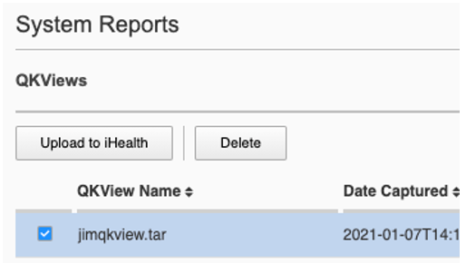

=================
VELOS Diagnostics
=================

Qkviews
=======

VELOS supports the ability to generate qkview reporte to collect and bundle configuration and diagnostic data that can be sent to support or uploaded to iHealth. It is important to understand the VELOS architecture when generating qkview reports. Generating a qkview report from the system controller will capture OS data and container information related to the system controller software, while generating a qkview report inside a chassis partition will capture data and container information related to the partition layer. To capture tenant level information, you’ll need to run a qkview report inside the TMOS layer of the tenant.

https://support.f5.com/csp/article/K02521182

**System Controller qkview**:

- Use this to investigate problems relating to the controllers themselves, or the controller platform services.
    - Collects information for active controller
    - Collects host information, including logs
    - Collects information from each controller platform service container
- Collects info for standby controller
    - Collects host information, including logs
    - Collects information from each controller platform service container
 
**Chassis Partition qkview**:

- Use this to investigate problems relating to a chassis partition. For example, a problem with one of the partition services, or one of the blades in that partition
    - Collects information for chassis partition services, on the controller for which the partition is active
        - Collects information for each partition service container
    - Collects information for partition services, on the controller for which the partition is in standby mode
        - Collects information for each partition service container
    - Collects information from each blade in the partition
    - Collects blade host information, including logs
    - Collects information for each partition service container

Generating Qkviews from the webUI
---------------------------------

In both the system controller and the chassis partition the qkview can be generated from **System Settings > System Reports** page. Here it also allows an admin to optionally upload them to iHealth. 

.. image:: images/velos_diagnostics/image1.png
  :align: center
  :scale: 70%

To generate a qkview report, click the button in the upper right-hand corner. It will take some time for the qkview to be generated.  Once the qkview is generated, you can click the checkbox next to it, and then select **Upload to iHealth**. Your iHealth credentials will automatically fill in if you entered them previously, and can be cleared if you want to use another account. You can optionally add an **F5 Support Case Number** and **Description** when uploading to iHealth.

.. image:: images/velos_diagnostics/image3.png
  :width: 45%

Generating Qkviews from the CLI
---------------------------------

If you would like to store iHealth credentials within the configuration you may do so via the system controller or chassis partition CLI. Enter **config** mode, and then use the **system diagnostics ihealth config** command to configure a **username** and **password**.

.. code-block:: bash

    syscon-2-active(config)# system diagnostics ihealth config username j.mccarron@f5.com password 
    (<AES encrypted string>): ********
    syscon-2-active(config)# commit 
    Commit complete.
    syscon-2-active(config)# do show system diagnostics ihealth 
    system diagnostics ihealth state username j.mccarron@f5.com
    system diagnostics ihealth state server https://ihealth-api.f5.com/qkview-analyzer/api/qkviews?visible_in_webUI=True
    system diagnostics ihealth state authserver https://api.f5.com/auth/pub/sso/login/ihealth-api
    syscon-2-active(config)# 

To generate a qkview from the CLI run the command **system diagnostics qkview capture**.

.. code-block:: bash

    syscon-2-active# system diagnostics qkview capture 
    result  Qkview file controller-2.qkview is being collected
    return code 200
    resultint 0

 
You can view the status of the capture using the command system diagnostics qkview status.

.. code-block:: bash

    syscon-2-active# system diagnostics qkview status 
    result  {"Busy":true,"Percent":59,"Status":"collecting","Message":"Collecting Data","Filename":"controller-2.qkview"}
    
    resultint 0

    syscon-2-active# system diagnostics qkview status
    result  {"Busy":false,"Percent":100,"Status":"complete","Message":"Completed collection.","Filename":"controller-2.qkview"}
    
    resultint 0

Generating Qkviews from the API
---------------------------------

A qkview can be generated for the system controller or any chassis partition using the following API call. Note the IP address endpoint will either be the system controller or the desired chassis partition IP address.

.. code-block:: bash

    POST https://{{velos_velos_chassis1_system_controller_ip}}:8888/restconf/data/openconfig-system:system/f5-system-diagnostics-qkview:diagnostics/f5-system-diagnostics-qkview:qkview/f5-system-diagnostics-qkview:capture

In the body of the API call enter the filename of the qkview to be saved.

.. code-block:: json

    {
        "f5-system-diagnostics-qkview:filename": "qkview{{currentdate}}.tgz"
    }

If the generation of a qkview is successful, you'll receive confirmation similar to the output below.

.. code-block:: json

    {
        "f5-system-diagnostics-qkview:output": {
            "result": " Warning: Qkview may contain sensitive data such as secrets, passwords and core files. Handle with care. Please send this file to F5 support. \nQkview file my-qkview2022-04-12.tgz is being collected.\nreturn code 200\n ",
            "resultint": 0
        }
    }

To check the status of the qkview collection you can use the following API command.

.. code-block:: bash

    POST https://{{velos_velos_chassis1_system_controller_ip}}:8888/restconf/data/openconfig-system:system/f5-system-diagnostics-qkview:diagnostics/f5-system-diagnostics-qkview:qkview/f5-system-diagnostics-qkview:status

The output of the command will show the percentage complete of the qkview.

.. code-block:: json

    {
        "f5-system-diagnostics-qkview:output": {
            "result": " {\"Busy\":true,\"Percent\":18,\"Status\":\"collecting\",\"Message\":\"Collecting Data\",\"Filename\":\"my-qkview2022-04-12.tgz\"}\n ",
            "resultint": 0
        }
    }

If you'd like to copy the qkview directly to iHealth once it is completed use the following API command referencing the previously completed qkview file.

.. code-block:: bash

    POST https://{{velos_velos_chassis1_system_controller_ip}}:8888/restconf/data/openconfig-system:system/f5-system-diagnostics-qkview:diagnostics/f5-system-diagnostics-ihealth:ihealth/f5-system-diagnostics-ihealth:upload

In the body of the API call add details with the filename, optional description and SR number. The call below assumes you have previously stored iHealth credentials, otherwise you can add them inside the API call.

.. code-block:: json

    {
    "f5-system-diagnostics-ihealth:qkview-file": "qkview{{currentdate}}.tgz",
    "f5-system-diagnostics-ihealth:description": "This is a test qkview",
    "f5-system-diagnostics-ihealth:service-request-number": ""
    }

The output will confirm the upload has begun.

.. code-block:: json

    {
        "f5-system-diagnostics-ihealth:output": {
            "message": "HTTP/1.1 202 Accepted\r\nLocation: /support/ihealth/status/a0PBQTGW\r\nDate: Tue, 12 Apr 2022 04:19:40 GMT\r\nContent-Length: 0\r\n\r\n",
            "errorcode": false
        }
    }

Logging
=======

The VELOS system will log messages to various log files. The main log being the **velos.log** file. There are many other log files for specific tasks, which can be used for troubleshooting. F5 publishes and maintains a log error catalog for F5OS-C (VELOS) here:

`F5OS-C/VELOS Error Catalog <https://clouddocs.f5.com/f5os-error-catalog/velos/velos-errors-index.html>`_

Logs can be viewed via the F5OS CLI, or they can be downloaded for remote viewing via CLI or webUI. Logs can also be sent to an external SYSLOG location. When troubleshooting specific issues, the logging subsystems (sw-components) logging levels can be adjusted temporarily to provide more information.

Many functions inside the F5OS layer will log their events to the main **velos.log** file that resides in the **/var/log_controller** path in the underlying system controller shell. In the F5OS CLI the paths are simplified so that you don’t have to know the underlying directory structure. You can use the **file list path** command to see the files inside the **log/controller** directory:

.. code-block:: bash

    syscon-2-active# file list path log/ 
    Possible completions:
    confd/  controller/  host/
    syscon-2-active# file list path log/controller/
    entries {
        name afu-cookie
        date Wed Aug 23 23:03:27 UTC 2023
        size 33B
    }
    entries {
        name audit.log
        date Fri Aug 25 15:17:24 UTC 2023
        size 6.9MB
    }
    entries {
        name audit.log.1
        date Wed Jul 12 16:58:15 UTC 2023
        size 11MB
    }
    entries {
        name audit.log.2.gz
        date Tue Jun  6 16:43:01 UTC 2023
        size 505KB
    }
    entries {
        name audit.log.3.gz
        date Thu May  4 22:39:02 UTC 2023
        size 500KB
    }
    entries {
        name audit.log.4.gz
        date Mon Apr 24 16:22:54 UTC 2023
        size 493KB
    }
    entries {
        name audit.log.5.gz
        date Tue Apr  4 15:03:32 UTC 2023
        size 499KB
    }
    entries {
        name cc-confd
        date Thu Aug 24 00:34:34 UTC 2023
        size 2.2MB
    }
    entries {
        name cc-confd-hal
        date Wed Aug 23 23:02:54 UTC 2023
        size 0B
    }
    entries {
        name cc-confd-health
        date Fri Aug 25 15:16:58 UTC 2023
        size 44MB
    }
    entries {
        name cc-confd-health-diag-agent
        date Wed Aug 23 23:02:57 UTC 2023
        size 0B
    }
    entries {
        name cc-confd-health.1
        date Fri Apr 21 16:19:02 UTC 2023
        size 101MB
    }
    entries {
        name cc-confd-init
        date Wed Aug 23 23:02:53 UTC 2023
        size 388KB
    }
    entries {
        name cc-upgrade.dbg
        date Wed Aug 23 23:03:12 UTC 2023
        size 277KB
    }
    entries {
        name chassis-manager
        date Fri Aug 25 15:17:25 UTC 2023
        size 66MB
    }
    entries {
        name chassis-manager.1
        date Sun Jul  9 09:51:03 UTC 2023
        size 101MB
    }
    entries {
        name chassis-manager.2.gz
        date Sat Jul  1 17:59:04 UTC 2023
        size 2.9MB
    }
    entries {
        name chassis-manager.3.gz
        date Sat Jun 24 02:13:04 UTC 2023
        size 2.9MB
    }
    entries {
        name chassis-manager.4.gz
        date Fri Jun 16 09:09:04 UTC 2023
        size 2.9MB
    }
    entries {
        name chassis-manager.5.gz
        date Thu Jun  8 18:58:04 UTC 2023
        size 3.0MB
    }
    entries {
        name confd
        date Thu Jul 14 17:50:32 UTC 2022
        size 0B
    }
    entries {
        name confd_go_standby
        date Mon Jan 30 15:57:56 UTC 2023
        size 207B
    }
    entries {
        name confd_image_remove
        date Mon May  8 15:41:49 UTC 2023
        size 6.5KB
    }
    entries {
        name config-object-manager
        date Wed Aug 23 23:21:09 UTC 2023
        size 23MB
    }
    entries {
        name config-object-manager-hal
        date Wed Aug 23 23:02:54 UTC 2023
        size 0B
    }
    entries {
        name events/
        date Wed Aug 23 23:03:36 UTC 2023
        size 4.0KB
    }
    entries {
        name ha
        date Thu Aug 24 01:01:25 UTC 2023
        size 5.3MB
    }
    entries {
        name ha-hal
        date Wed Aug 23 23:02:54 UTC 2023
        size 0B
    }
    entries {
        name host-config
        date Fri Aug 25 15:17:23 UTC 2023
        size 76MB
    }
    entries {
        name host-config-hal
        date Wed Aug 23 23:02:57 UTC 2023
        size 0B
    }
    entries {
        name host-config.1
        date Thu Jul 20 23:48:03 UTC 2023
        size 101MB
    }
    entries {
        name host-config.2.gz
        date Thu Jun 22 03:52:03 UTC 2023
        size 2.8MB
    }
    entries {
        name host-config.3.gz
        date Fri May 19 10:59:04 UTC 2023
        size 2.8MB
    }
    entries {
        name host-config.4.gz
        date Sat Apr  8 17:36:04 UTC 2023
        size 2.7MB
    }
    entries {
        name host-config.5.gz
        date Sun Mar 12 08:13:04 UTC 2023
        size 2.7MB
    }
    entries {
        name http_error_log
        date Wed Aug 23 23:03:04 UTC 2023
        size 17KB
    }
    entries {
        name httpd/
        date Fri May  5 04:24:03 UTC 2023
        size 4.0KB
    }
    entries {
        name image-server
        date Wed Aug 23 23:27:41 UTC 2023
        size 2.6MB
    }
    entries {
        name image-server-dhcp
        date Fri Aug 25 15:09:19 UTC 2023
        size 14MB
    }
    entries {
        name image-server-hal
        date Wed Aug 23 23:03:04 UTC 2023
        size 0B
    }
    entries {
        name image-server-httpd
        date Thu Jul 14 17:50:37 UTC 2022
        size 0B
    }
    entries {
        name image-server-monitor
        date Wed Aug 23 23:03:04 UTC 2023
        size 87KB
    }
    entries {
        name lcd.log
        date Wed Aug 23 23:08:44 UTC 2023
        size 123KB
    }
    entries {
        name logrotate.log
        date Fri Aug 25 15:17:01 UTC 2023
        size 40KB
    }
    entries {
        name logrotate.log.1
        date Fri Aug 25 15:11:02 UTC 2023
        size 5.1MB
    }
    entries {
        name logrotate.log.2.gz
        date Fri Aug 25 00:23:01 UTC 2023
        size 34KB
    }
    entries {
        name partition-agent
        date Wed Aug 23 23:27:39 UTC 2023
        size 11MB
    }
    entries {
        name partition-software-manager
        date Fri Aug 25 15:17:25 UTC 2023
        size 1.6MB
    }
    entries {
        name partition-software-manager.1
        date Fri Aug 25 13:56:04 UTC 2023
        size 101MB
    }
    entries {
        name partition-software-manager.2.gz
        date Tue Aug 22 05:38:03 UTC 2023
        size 3.6MB
    }
    entries {
        name partition-software-manager.3.gz
        date Sat Aug 19 01:36:04 UTC 2023
        size 3.6MB
    }
    entries {
        name partition-software-manager.4.gz
        date Tue Aug 15 21:39:03 UTC 2023
        size 3.6MB
    }
    entries {
        name partition-software-manager.5.gz
        date Sat Aug 12 17:42:04 UTC 2023
        size 3.6MB
    }
    entries {
        name partition-update
        date Fri Aug 25 15:13:08 UTC 2023
        size 96MB
    }
    entries {
        name partition-update.1
        date Mon Mar 27 04:12:04 UTC 2023
        size 101MB
    }
    entries {
        name partition-update.2.gz
        date Mon Nov 21 21:24:01 UTC 2022
        size 678KB
    }
    entries {
        name pel_log
        date Thu Aug 24 23:50:27 UTC 2023
        size 48MB
    }
    entries {
        name reprogram_chassis_network
        date Wed Aug 23 23:03:40 UTC 2023
        size 111KB
    }
    entries {
        name rsyslogd_init.log
        date Thu Aug 24 00:59:03 UTC 2023
        size 75MB
    }
    entries {
        name run/
        date Wed Aug 23 23:02:54 UTC 2023
        size 4.0KB
    }
    entries {
        name sshd.terminal-server
        date Wed Aug 23 23:03:46 UTC 2023
        size 3.0KB
    }
    entries {
        name switchd
        date Wed Aug 23 23:31:22 UTC 2023
        size 4.7MB
    }
    entries {
        name switchd-hal
        date Wed Aug 23 23:02:55 UTC 2023
        size 0B
    }
    entries {
        name switchd.1
        date Wed Feb  1 23:25:01 UTC 2023
        size 705MB
    }
    entries {
        name switchd.2.gz
        date Tue Jan 31 09:26:46 UTC 2023
        size 79MB
    }
    entries {
        name switchd.3.gz
        date Mon Jan 30 22:08:45 UTC 2023
        size 79MB
    }
    entries {
        name switchd.4.gz
        date Mon Jan 30 10:37:45 UTC 2023
        size 80MB
    }
    entries {
        name switchd.5.gz
        date Sun Jan 29 23:21:46 UTC 2023
        size 80MB
    }
    entries {
        name system-update
        date Wed Aug 23 22:53:48 UTC 2023
        size 49KB
    }
    entries {
        name terminal-server.default
        date Wed Aug 23 23:03:00 UTC 2023
        size 109KB
    }
    entries {
        name tftp.log
        date Wed Aug 23 23:13:05 UTC 2023
        size 1.7KB
    }
    entries {
        name vcc-confd-go-standby-hal.3451
        date Mon Jan 30 15:57:56 UTC 2023
        size 0B
    }
    entries {
        name vcc-confd-go-standby-hal.579
        date Tue Sep 13 17:19:41 UTC 2022
        size 0B
    }
    entries {
        name velos.log
        date Fri Aug 25 15:14:07 UTC 2023
        size 157MB
    }
    entries {
        name velos.log.1
        date Fri Apr 28 09:46:11 UTC 2023
        size 513MB
    }
    entries {
        name velos.log.2.gz
        date Sat Mar 11 00:35:13 UTC 2023
        size 23MB
    }
    entries {
        name velos.log.3.gz
        date Sun Sep 25 04:16:08 UTC 2022
        size 19MB
    }
    entries {
        name velos.log.4.gz
        date Fri Jul 15 05:53:11 UTC 2022
        size 16MB
    }
    entries {
        name velos.log.5.gz
        date Thu Jul 14 23:12:01 UTC 2022
        size 16MB
    }
    syscon-2-active#

To view the contents of the velos.log file use the command **file show path /log/controller/velos.log**:

.. code-block:: bash

    syscon-1-active# file show log/controller/velos.log
    2021-02-08T11:52:27-08:00 localhost.localdomain notice boot_marker: ---===[ BOOT-MARKER ]===---
    2021-02-08T19:58:50.837735+00:00 controller-1 vcc-lacpd[0]: priority="Err" version=1.0 msgid=0x401000000000005 msg="Invalid Argument" function="fzmq_set_msg_queue_size" argument="handle NULL".
    2021-02-08T19:58:50.837748+00:00 controller-1 user-manager[14]: priority="Notice" version=1.0 msgid=0x6801000000000001 msg="User Manager Starting".
    2021-02-08T19:58:50.838837+00:00 controller-1 alert-service[7]: priority="Notice" version=1.0 msgid=0x2201000000000001 msg="Alert Service Starting..." version="3.4.7" date="Sun Oct 11 01:21:02 2020".
    2021-02-08T19:58:50.838867+00:00 controller-1 alert-service[7]: priority="Info" version=1.0 msgid=0x6602000000000005 msg="DB is not ready".
    2021-02-08T19:58:50.838881+00:00 controller-1 /usr/bin/authd[7]: priority="Info" version=1.0 msgid=0x6602000000000005 msg="DB is not ready".
    2021-02-08T19:58:50.838934+00:00 controller-1 alert-service[7]: priority="Info" version=1.0 msgid=0x6602000000000005 msg="DB is not ready".

There are options to manipulate the output of the file by adding **| ?**  to see the options.

.. code-block:: bash

    syscon-1-active# file show /log/controller/velos.log | ?
    Possible completions:
    append    Append output text to a file
    begin     Begin with the line that matches
    count     Count the number of lines in the output
    exclude   Exclude lines that match
    include   Include lines that match
    linnum    Enumerate lines in the output
    more      Paginate output
    nomore    Suppress pagination
    save      Save output text to a file
    until     End with the line that matches

There are also other file options to tail the log file using **file tail -f** for live tail of the file or **file tail -n <number of lines>**.

.. code-block:: bash

    syscon-1-active# file tail -f log/controller/velos.log 
    2021-02-23T16:42:41.251528+00:00 controller-1 rsyslog-configd[7]: priority="Info" version=1.0 msgid=0x1301000000000005 msg="Setting component log severity" name="partition-software-manager" severity=6.
    2021-02-23T16:42:41.284819+00:00 controller-1 rsyslog-configd[7]: priority="Info" version=1.0 msgid=0x1301000000000005 msg="Setting component log severity" name="vcc-chassis-manager" severity=6.
    2021-02-23T16:42:41.290347+00:00 controller-1 rsyslog-configd[7]: priority="Info" version=1.0 msgid=0x1301000000000005 msg="Setting component log severity" name="vcc-confd" severity=6.
    2021-02-23T16:42:41.295275+00:00 controller-1 rsyslog-configd[7]: priority="Info" version=1.0 msgid=0x1301000000000005 msg="Setting component log severity" name="vcc-ha" severity=6.
    2021-02-23T16:42:41.305051+00:00 controller-1 rsyslog-configd[7]: priority="Info" version=1.0 msgid=0x1301000000000005 msg="Setting component log severity" name="vcc-lacpd" severity=6.
    2021-02-23T16:42:41.305662+00:00 controller-1 rsyslog-configd[7]: priority="Info" version=1.0 msgid=0x1301000000000005 msg="Setting component log severity" name="vcc-partition-agent" severity=6.
    2021-02-23T16:42:46.960349+00:00 controller-1 partition-software-manager[9]: priority="Info" version=1.0 msgid=0x1101000000000034 msg="configuration updated; num_part:" num_partition=4.
    2021-02-23T16:42:46.960395+00:00 controller-1 partition-software-manager[9]: priority="Info" version=1.0 msgid=0x1101000000000036 msg="configuration updated; num_image:" num_partition_iso_image=4.
    2021-02-23T16:57:51.752978+00:00 controller-1 partition-software-manager[9]: priority="Err" version=1.0 msgid=0x1101000000000052 msg="unknown class_tag:" field_tag=1537040122.
    2021-02-23T16:57:56+00:00 controller-2 partition-software-manager[8]: priority="Err" version=1.0 msgid=0x1101000000000052 msg="unknown class_tag:" field_tag=1537040122.

Below output is showing an example of tailing the last 20 lines of the vleos.log file.

.. code-block:: bash

    syscon-1-active# file tail -n 20 log/controller/velos.log
    2021-02-23T16:42:41.077215+00:00 controller-1 vcc-lacpd[7]: priority="Debug" version=1.0 msgid=0x401000000000024 msg="Send Message" time=1614098561077203609 id="1614045762610008304:2" seq=207646 mtype="SEND_TYPE" src="lacpd CC2 sender" dest="addr:tcp://10.1.5.62:1053".
    2021-02-23T16:42:41.077239+00:00 controller-1 vcc-lacpd[7]: priority="Debug" version=1.0 msgid=0x3301000000000052 msg="PDU:" direction="Transmitted" interface="1/1.3" length=124.
    2021-02-23T16:42:41.077257+00:00 controller-1 vcc-lacpd[7]: priority="Debug" version=1.0 msgid=0x401000000000024 msg="Send Message" time=1614098561077247405 id="1614045762609932334:1" seq=207648 mtype="SEND_TYPE" src="lacpd CC1 sender" dest="addr:tcp://10.1.5.61:1053".
    2021-02-23T16:42:41.077280+00:00 controller-1 vcc-lacpd[7]: priority="Debug" version=1.0 msgid=0x3301000000000052 msg="PDU:" direction="Transmitted" interface="2/1.3" length=124.
    2021-02-23T16:42:41.077301+00:00 controller-1 vcc-lacpd[7]: priority="Debug" version=1.0 msgid=0x401000000000024 msg="Send Message" time=1614098561077291045 id="1614045762610008304:2" seq=207647 mtype="SEND_TYPE" src="lacpd CC2 sender" dest="addr:tcp://10.1.5.62:1053".
    2021-02-23T16:42:41.077391+00:00 controller-1 vcc-lacpd[7]: priority="Debug" version=1.0 msgid=0x3301000000000052 msg="PDU:" direction="Transmitted" interface="1/mgmt0" length=124.
    2021-02-23T16:42:41.077411+00:00 controller-1 vcc-lacpd[7]: priority="Debug" version=1.0 msgid=0x401000000000024 msg="Send Message" time=1614098561077399963 id="1614045762609932334:1" seq=207649 mtype="SEND_TYPE" src="lacpd CC1 sender" dest="addr:tcp://10.1.5.61:1053".
    2021-02-23T16:42:41.077437+00:00 controller-1 vcc-lacpd[7]: priority="Debug" version=1.0 msgid=0x3301000000000052 msg="PDU:" direction="Transmitted" interface="2/mgmt0" length=124.
    2021-02-23T16:42:41.077477+00:00 controller-1 vcc-lacpd[7]: priority="Debug" version=1.0 msgid=0x401000000000024 msg="Send Message" time=1614098561077445005 id="1614045762610008304:2" seq=207648 mtype="SEND_TYPE" src="lacpd CC2 sender" dest="addr:tcp://10.1.5.62:1053".
    2021-02-23T16:42:41.077637+00:00 controller-1 vcc-lacpd[7]: priority="Debug" version=1.0 msgid=0x3301000000000050 msg="" debug_str="zmqMsgHandler.receivePdu called".

Within a chassis partition the path for the logging is different. You can use the same CLI commands in the chassis partition that are used in the system controllers by substituting the updated path for the **log/velos.log** file.

.. code-block:: bash

    Production-1# file show log/velos.log     

    2021-02-22T23:46:23+00:00 10.1.18.51 controller-1(p2) partition-ha[1]: priority="Info" version=1.0 msgid=0x4602000000000004 msg="Active going Standby".
    2021-02-22T23:46:23.381784+00:00 controller-2(p2) user-manager[223]: priority="Info" version=1.0 msgid=0x6602000000000005 msg="DB is not ready".
    2021-02-22T23:46:23+00:00 10.1.18.2 blade-2(p2) platform-mgr[12]: priority="Info" version=1.0 msgid=0x6602000000000005 msg="DB is not ready".
    2021-02-22T23:46:23+00:00 10.1.18.2 blade-2(p2) fpgamgr[12]: priority="Info" version=1.0 msgid=0x6602000000000005 msg="DB is not ready".
    2021-02-22T23:46:23+00:00 10.1.18.2 blade-2(p2) /usr/bin/authd[7]: priority="Info" version=1.0 msgid=0x6602000000000005 msg="DB is not ready".
    2021-02-22T23:46:23+00:00 10.1.18.2 blade-2(p2) l2-agent[12]: priority="Info" version=1.0 msgid=0x6602000000000005 msg="DB is not ready".
    2021-02-22T23:46:23+00:00 10.1.18.2 blade-2(p2) partition-ha[1]: priority="Info" version=1.0 msgid=0x6602000000000005 msg="DB is not ready".
    2021-02-22T23:46:23+00:00 10.1.18.2 blade-2(p2) /usr/sbin/fips-service[13]: priority="Info" version=1.0 msgid=0x6602000000000005 msg="DB is not ready".
    2021-02-22T23:46:23+00:00 10.1.18.1 blade-1(p2) platform-mgr[11]: priority="Info" version=1.0 msgid=0x6602000000000005 msg="DB is not ready".

.. code-block:: bash

    Production-1# file tail -f log/velos.log
    2021-02-23T17:38:10+00:00 10.1.18.2 blade-2(p2) lacpd[1]: priority="Debug" version=1.0 msgid=0x3401000000000048 msg="" debug_str="velocityDatapathHandler.pollPdu() called".
    2021-02-23T17:38:11+00:00 10.1.18.2 blade-2(p2) lacpd[1]: priority="Debug" version=1.0 msgid=0x3401000000000048 msg="" debug_str="velocityDatapathHandler.pollPdu() called".
    2021-02-23T17:38:11+00:00 10.1.18.2 blade-2(p2) lacpd[1]: priority="Debug" version=1.0 msgid=0x3401000000000045 msg="PDU:" direction="Transmitted" interface="1/2.0" length=124.
    2021-02-23T17:38:11+00:00 10.1.18.2 blade-2(p2) lacpd[1]: priority="Debug" version=1.0 msgid=0x3401000000000045 msg="PDU:" direction="Transmitted" interface="2/1.0" length=124.
    2021-02-23T17:38:11+00:00 10.1.18.2 blade-2(p2) lacpd[1]: priority="Debug" version=1.0 msgid=0x3401000000000045 msg="PDU:" direction="Transmitted" interface="1/1.0" length=124.

Currently in both the system controller and chassis partition webUIs logging levels can be configured for local logging, and remote logging servers can be added. The **Software Component Log Levels** can be changed to have additional logging information sent to the local log.  The remote logging has its own **Severity** level, which will ultimately control the maximum level of all messages going to a remote log server regardless of the individual Component Log Levels. This will allow for more information to be logged locally for debug purposes, while keeping remote logging to a minimum. If you would like to have more verbosity going to the remote logging host, you can raise its severity to see additional messages.

.. image:: images/velos_diagnostics/image4.png
  :align: center
  :scale: 70%

TCPDUMP
=======

You can use the **tcpdump** utility on the VELOS system to capture traffic in chassis partitions. The captured traffic can be saved as a file and analyzed to help troubleshoot network issues.

When you use the tcpdump utility to capture traffic on a VELOS system, traffic is captured based on the chassis partition in which the command was run. Only the traffic that occurs on that chassis partition is captured. This includes traffic traversing the front panel ports on the chassis blades in the chassis partition as well as backplane traffic for the chassis partition.

When you run tcpdump in a chassis partition, a secondary tcpdump operation runs on each member blade in the chassis partition. The packets captured by the secondary tcpdumps are collected together in the command output.

In addition to the normal tcpdump output, the following fields have been added that are specific to the VELOS system:

•	did - The Destination ID indicates the destination port for the frame.
•	sid - The Source ID indicates the source port for the frame.
•	svc - The Service ID indicates the destination tenant for the packet.
•	sep - The Service Endpoint indicates the service endpoint the packet is sent to.

You can see this in the following example output:

02:28:55.385343 IP 10.10.11.12 > 10.10.11.13: ICMP echo request, id 19463, seq 4, length 64 did:0F sid:04 sep:F svc:08 ld:1 rd:0
More detail on configuration and filtering of tcpdump is provide here:

https://support.f5.com/csp/article/K12313135

You can capture traffic for a specific interface on a blade using the interface keyword in the tcpdump command. The interface is specified as <blade>/<port>.<subport>. If the interface keyword is not supplied, or if 0/0.0 is specified for the interface, no interface filtering occurs and the command captures all interfaces in the partition.

Important: The interfaces on the VELOS system are capable of very high traffic rates. To prevent dropped packets during traffic capture, you should specify appropriate filters in order to capture only the intended traffic and reduce the total amount of captured traffic.

For example, the following command captures traffic on interface 1.0 on blade number 2:

.. code-block:: bash

    system diagnostics tcpdump interface "2/1.0"

The following command captures traffic-only packets in and out of the host of blade 2:

.. code-block:: bash
    system diagnostics tcpdump interface "2/0.0"

----------------
Specify a filter
----------------

Using the bpf keyword in the tcpdump command, you can specify a filter that limits the traffic capture based on the keywords you supply.

For example, the following command captures traffic only if the source or destination IP address is 10.10.10.100 and the source or destination port is 80:

system diagnostics tcpdump bpf "host 10.10.10.100 and port 80"

The following command captures traffic if the source IP address is 10.10.1.1 and the destination port is 443:

system diagnostics tcpdump bpf "src host 10.10.1.1 and dst port 443"

----------------------
Specify an output file
----------------------

To send the captured traffic to a file, specify the filename using the outfile keyword. The resulting file is placed in the /var/F5/<partiton>/ directory by default, or you can specify the directory in which to save the file.

For example, the following command sends the output of the tcpdump command to the /var/F5/partition/shared/example_capture.pcap file:

.. code-block:: bash

    system diagnostics tcpdump outfile /var/F5/partition/shared/example_capture.pcap

---------------
Combine options
---------------

The following example combines options to only capture traffic on interface 2.0 on blade 1 if the source IP address is 10.10.1.1 and the destination port is 80, and send the output to the /var/F5/partition/shared/example_capture.pcap file:

system diagnostics tcpdump interface "1/2.0" bpf "src host 10.10.1.1 and dst port 80" outfile /var/F5/partition/shared/example_capture.pcap    

Console Access to System Controllers and Blades via Built-In Terminal Server
============================================================================

You may have a need to access the console of a VELOS BX110 blade, one of the system controllers, or a tenant to diagnose a problem, or to watch it bootup. VELOS provides a built-in terminal server function that will proxy network connections to individual blades, system controller, and tenant console ports. Specific TCP ports on the system controller floating IP address have been reserved and mapped to console ports as follows:

•	System controller ports 7001-7008 map to slots/blades 1-8
•	System controller ports 7100 and 7200 map to system controllers 1 & 2
•	Chassis partition ports 700x map to tenant ID’s (requires tenant name as username)

You can connect to any blade by SSH’ing to the floating IP address of the system controller and specifying the proper port for the blade you want to connect with. Port 7001 maps to blade-1, 7002 to blade-2 etc. Once connected to the terminal server, you will need to log in as root to the blade. The blade will have the default root password and will need to be changed on first reboot. The example below shows connecting to blade 2 ( port 7002) through a terminal server.

.. code-block:: bash

    FLD-ML-00054045:~ jmccarron$ ssh -l admin 10.255.0.147 -p 7002
    admin@10.255.0.147's password: 

    Terminal session established

    CentOS Linux 7 (Core)
    Kernel 3.10.0-862.14.4.el7.centos.plus.x86_64 on an x86_64

    blade-2 login: root
    Password: 
    You are required to change your password immediately (root enforced)
    Changing password for root.
    (current) UNIX password: 

Connecting to a system controller follows the same general process but uses ports 7100 for controller1 and 7200 for controller2. Below is an example connecting to system controller 1:

.. code-block:: bash

    FLD-ML-00054045:~ jmccarron$ ssh -l admin 10.255.0.147 -p 7100
    admin@10.255.0.147's password: 
    Terminal session established

    CentOS Linux 7 (Core)
    Kernel 3.10.0-862.14.4.el7.centos.plus.x86_64 on an x86_64

    controller-1 login: root
    Password: 
    Last failed login: Wed May 19 21:14:06 UTC 2021 on ttyS0
    There was 1 failed login attempt since the last successful login.
    Last login: Wed May 19 01:20:04 from controller-1.chassis.local
    [root@controller-1 ~]# 

Console Access to Tenant via Built-In Terminal Server
=====================================================

You may have a need to access the console of a tenant to diagnose a problem, or to watch it bootup. VELOS
provides a built-in terminal server function that will proxy network connections to a tenant console. VIPRION provided a **vconsole** capability which required a user to authenticate to the VIPRION CLI first before they could run the vconsole command. 

When a VELOS tenant is created and deployed a listening ssh port will be configured on port 700x of the chassis partition (where x is the tenant instance ID). After a tenant is created, you will need to set the tenant password and tweak the expiry date to force a password change before a user can connect via the terminal server.

Once a tenant is created from the chassis partition CLI enter the command **show system aaa authentication**. Note that there is a **username** that corresponds to each tenant that has been created (tenant1, tenant2, tenant3 in this case, but will match the configured name of the tenant) and each of these have the role of **tenant-console**. Note the expiry date is set for **1**, which means expired.

.. code-block:: bash

    Production-1# show system aaa authentication      
            LAST    TALLY  EXPIRY                  
    USERNAME  CHANGE  COUNT  DATE    ROLE            
    -------------------------------------------------
    admin     18667   0      -1      admin           
    root      18000   0      -1      root            
    tenant1   0       0      1       tenant-console  
    tenant2   0       0      1       tenant-console  
    tenant3   0       0      1       tenant-console  

    ROLENAME        GID   USERS  
    -----------------------------
    admin           9000  -      
    limited         9999  -      
    operator        9001  -      
    root            0     -      
    tenant-console  9100  -   

For tenant2 to have console access you must first set a password for that user using the command **system aaa authentication users user <tenant-name> config set-password password**. When prompted enter the desired password for this tenant’s console access. Next set the tenant's **expiry-date** to **-1** (no expiration date) and then **commit** to enable the changes.

.. code-block:: bash

    Production-1(config)# system aaa authentication users user tenant2 config set-password password      
    Value for 'password' (<string>): **************
    Production-1(config)# system aaa authentication users user tenant2 config expiry-date                                                                                                                                    
    (<string>) (1): -1
    Production-1(config-user-tenant2)# commit 
    Commit complete.

Now it will be possible to remotely ssh using a specific username and port pointed at the chassis partition IP address to connect directly to the console port of the tenant. The username will be the name of the tenant, and the port will be the instance TCP port 700x (where x is the instance ID of that tenant). Below is an example of the output from the **show tenants** command within the chassis partition. The tenant **tenant2** is running on two blades so it has two instance IDs 1 and 2. You can connect to either one of these instances via the console using tenant2 as the username and either port 7001 or 7002. 

.. code-block:: bash

    tenants tenant tenant2
    state type          BIG-IP
    state mgmt-ip       10.255.0.205
    state prefix-length 24
    state gateway       10.255.0.1
    state vlans         [ 444 500 555 ]
    state cryptos       enabled
    state vcpu-cores-per-node 6
    state memory        22016
    state running-state deployed
    state mac-data base-mac 00:94:a1:8e:d0:1c
    state mac-data mac-pool-size 1
    state appliance-mode disabled
    state status        Running
    state primary-slot  1
    state image-version "BIG-IP 14.1.4 0.0.9"
    NDI      MAC                
    ----------------------------
    default  00:94:a1:8e:d0:1a  

        INSTANCE                                                                                                                                                  
    NODE  ID        PHASE    IMAGE NAME                                     CREATION TIME         READY TIME            STATUS                   MGMT MAC           
    ----------------------------------------------------------------------------------------------------------------------------------------------------------------
    1     1         Running  BIGIP-14.1.4-0.0.9.ALL-VELOS.qcow2.zip.bundle  2021-02-10T21:16:23Z  2021-02-10T21:16:38Z  Started tenant instance  a2:4a:b4:fd:85:81  
    2     2         Running  BIGIP-14.1.4-0.0.9.ALL-VELOS.qcow2.zip.bundle  2021-02-10T21:16:27Z  2021-02-10T21:16:24Z  Started tenant instance  16:1a:f6:87:be:07  

The built-in terminal server will switch the connection to the appropriate tenant terminal server port. Once connected, you will still need to log in to the tenant. In the example below the username is tenant2 (matches the tenant name), and the port is 7001 meaning connect to instance ID 1 of that tenant. 

.. code-block:: bash

    FLD-ML-00054045:~ jmccarron$ ssh tenant2@10.255.0.148 -p 7001
    tenant1@10.255.0.148's password: 
    Successfully connected to tenant2-1 console. The escape sequence is ^]

    BIG-IP 14.1.4 Build 0.0.9
    Kernel 3.10.0-862.14.4.el7.x86_64 on an x86_64
    tenant1 login: root
    Password: 
    Last login: Thu Feb 11 22:43:43 on ttyS0
    [root@tenant2:/S1-green-P::Active:Standalone] config #

 
