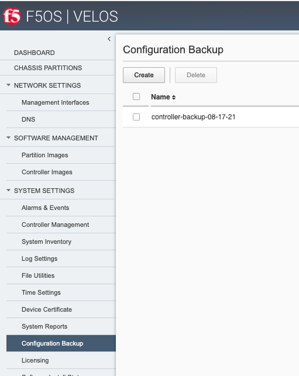
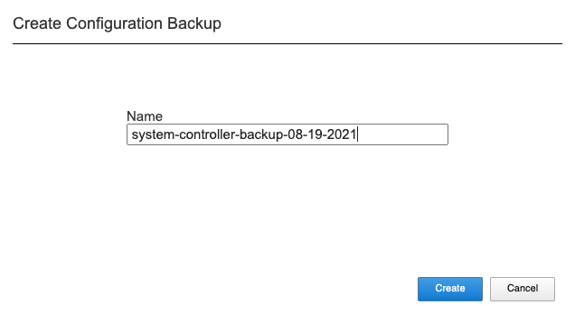

=====================================
F5OS Configuration Backup and Restore
=====================================

To completely backup the VELOS system, you’ll need to backup each tenant TMOS configuration, each F5OS chassis partition configuration, as well as the F5OS system controller configuration. Tenant backup utilizes the same backup and recovery procedures as existing BIG-IP devices/guests because the tenants themselves are running TMOS. For the F5OS layer (system controllers and chassis partitions) a different backup mechanism is utilized because F5OS is based on ConfD.  

The confd process manages the F5OS configuration on a VELOS system. The system stores the configuration in its configuration database (CDB). There are separate Confd databases for the system controller layer, and for each chassis partition.

At the chassis level, the F5OS configuration contains data that includes the following:

•	DNS
•	Network time protocol (NTP)
•	Authentication servers
•	Logging setup
•	High availability (HA) setup
•	Management IP addresses of the system controllers
•	Product license
•	Basic configuration of existing partitions, such as the partition name, floating management IP address, and the partition-to-slot mapping

At the chassis partition level, the F5OS configuration contains data that includes the following:

•	Portgroups of the assigned slots/nodes/blades
•	Virtual Local Area Networks (VLANs)
•	Logging setup
•	Authentication servers
•	Product license
•	HA setup

To perform a complete backup of the VELOS system, you must:

•	Back up the configuration data at the chassis and at each chassis partition.
•	Back up any deployed tenants using the tenants’ backup mechanism (i.e. a UCS).

More detail is covered in the following solution article:

https://support.f5.com/csp/article/K50135154

Backing Up the System Controller Database
=========================================

**Using the CLI:**

You can back up the system controller configuration database using the system database config-backup command when in config mode. The file will be saved in the path of /mnt/var/confd/configs automatically. You can then list the contents of that directory to ensure the file is there using the file list path command.

.. code-block:: bash

    syscon-1-active# config
    Entering configuration mode terminal
    syscon-1-active(config)# system database config-backup name chassis2-sys-controller-backup-2-26-21
    response Succeeded.
    syscon-1-active(config)# exit 

    syscon-1-active# file list path /mnt/var/confd/configs
    entries {
        name 
    chassis2-sys-controller-backup-2-26-21
    test-backup
    }
    syscon-1-active# 

**Using the GUI:**

**Note: In the current F5OS releases the confd system database can be backed up via CLI/GUI/API but it cannot be restored using the F5OS GUI. This will be added in a subsequent release.**

Copying System Controller Database Backup to an External Location
=================================================================

Once the database backup has been completed, you should copy the file to an external location so that the system can be restored in the case of a total failure. You can download the database configuration backup using the CLI, GUI, or API. 

In the GUI use the System Settings -> File Utilities page and from the dropdown select /mnt/var/confd/configs to see the previously saved backup file. Here you can import or export configuration files. Note that the current transfer of files to and from the GUI requires an external HTTPS server. 

