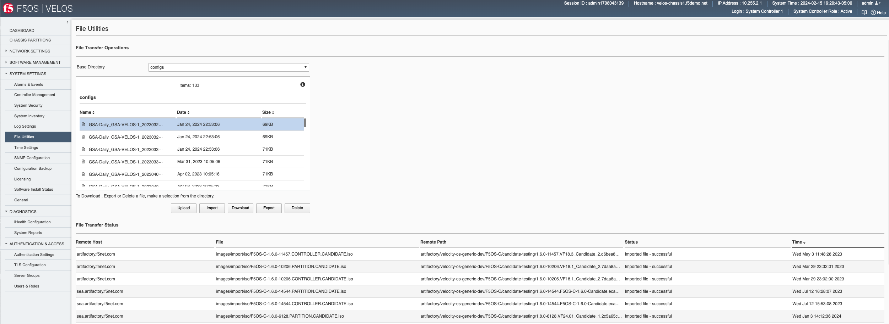

=====================================
F5OS Configuration Backup and Restore
=====================================

To completely backup the VELOS system, you’ll need to backup each tenant TMOS configuration, each F5OS chassis partition configuration, as well as the F5OS system controller configuration. Tenant backup utilizes the same backup and recovery procedures as existing BIG-IP devices/guests because the tenants themselves are running TMOS. For the F5OS layer (system controllers and chassis partitions), a different backup mechanism is utilized because F5OS configuration management is based on ConfD.  

The ConfD process manages the F5OS configuration on a VELOS system. The system stores the configuration in its configuration database (CDB). There are separate ConfD databases for the system controller layer, and for each chassis partition.

At the chassis level, the F5OS configuration contains data that includes the following:

•	DNS
•	Network time protocol (NTP)
•	Authentication servers
•	Logging setup
•	High availability (HA) setup
•	Management IP addresses of the system controllers
•	Product license
•	Basic configuration of existing partitions, such as the partition name, floating management IP address, and the partition-to-slot mapping

At the chassis partition level, the F5OS configuration contains data that includes the following:

•	Portgroups of the assigned slots/nodes/blades
•	Virtual Local Area Networks (VLANs)
•	Interfaces/LAGs
•	Logging setup
•	Authentication servers
•	Product license
•	HA setup
•	Tenant configuration

Note: The tenant configuration contains tenant name, type, image, management IP address, gateway, VLANs, assigned vCPUs, memory, storage size, and so on. It does not include the BIG-IP configuration within the tenant. To create a backup copy of the BIG-IP configuration of the tenant, you must perform the backup in the tenant itself. For information, refer to:

`K13132: Backing up and restoring BIG-IP configuration files with a UCS archive <https://support.f5.com/csp/article/K13132>_`

To perform a complete backup of the VELOS system, you must:

•	Back up the F5OS configuration data at the system controller layer
•	Back up the F5OS configuration data at each chassis partition
•	Back up any deployed tenants using the tenant's backup mechanism (i.e. a UCS).

More detail is covered in the following solution article:

`K50135154: Back up and restore the F5OS-C configuration on a VELOS system <https://support.f5.com/csp/article/K50135154>`_

Setting the Primary Key on F5OS
===============================

The F5 VELOS system uses a primary key to encrypt highly sensitive passwords/passphrases in the configuration database, such as:

•	Tenant unit keys used for TMOS Secure Vault
•	The F5OS API Service Gateway TLS key
•	Stored iHealth credentials
•	Stored AAA server credentials

The primary key is randomly generated by F5OS during initial installation. You should set the primary key to a known value prior to performing a configuration backup. If you restore a configuration backup on a different VELOS device, e.g. during an RMA replacement, you must first set the primary key passphrase and salt on the destination device to the same value as the source device. If this is not done correctly, the F5OS configuration restoration may appear to succeed but produce failures later when the system attempts to decrypt and use the secured parameters.

You should periodically change the primary key for additional security. If doing so, please note that a configuration backup is tied to the primary key at the time it was generated. If you change the primary key, you cannot restore older configuration backups without first setting the primary key to the previous value, if it is known. More details are provided in the solution article below.

**IMPORTANT: Be sure to make note and save the salt and passphrase in a safe location, as these will be needed to restore the configuration on a replacement system.** 

.. code-block:: bash

    syscon-1-active(config)# system aaa primary-key set passphrase               
    Value for 'passphrase' (<string, min: 6 chars, max: 255 chars>): **************
    Value for 'confirm-passphrase' (<string, min: 6 chars, max: 255 chars>): **************
    Value for 'salt' (<string, min: 6 chars, max: 255 chars>): **************
    Value for 'confirm-salt' (<string, min: 6 chars, max: 255 chars>): **************
    response Info: Key migration is initiated. Use 'show system aaa primary-key state status' to get status

    syscon-1-active(config)#

You can view the status of the primary-key being set with the **show system aaa primary-key state status** CLI command.

.. code-block:: bash

    syscon-1-active# show system aaa primary-key state status
    system aaa primary-key state status "IN_PROGRESS        Initiated: Tue Apr  9 19:46:14 2024"
    
    syscon-1-active# show system aaa primary-key state status
    system aaa primary-key state status "COMPLETE        Initiated: Tue Apr  9 19:46:14 2024"
    syscon-1-active# 

Note that the hash key can be used to check and compare the status of the primary-key on both the source and the replacement devices if restoring to a different device. To view the current primary-key hash, issue the following CLI command.

.. code-block:: bash

    syscon-1-active# show system aaa primary-key state
    system aaa primary-key state hash aNSWX6Xl8+dFx94JMRbySD/d/AJ8RarqJ+fedD#57bDxRF0cTgGFcZvMY415eDeAJjZlXp1qGuKI7CDmxNrnhw==
    system aaa primary-key state status "COMPLETE        Initiated: Tue Apr  9 19:46:14 2024"
    syscon-1-active#

Backing Up the System Controller Database
=========================================

Backing Up the System Controller Database via CLI
-------------------------------------------------

You can back up the system controller configuration database using the **system database config-backup** command when in **config** mode. The file will be saved in the path of **/configs** automatically. You can then list the contents of that directory to ensure the file is there using the **file list path** command.

.. code-block:: bash

    syscon-1-active# config
    Entering configuration mode terminal
    syscon-1-active(config)# system database config-backup name GSA-Daily_GSA-VELOS-1_20230328070500
    response Succeeded.
    syscon-1-active(config)# exit 

    syscon-1-active# file list path configs/
    entries {
        name GSA-Daily_GSA-VELOS-1_20230328070500
        date Thu Jan 25 03:53:06 UTC 2024
        size 69KB
    }
    entries {
        name GSA-Daily_GSA-VELOS-1_20230329070500
        date Thu Jan 25 03:53:06 UTC 2024
        size 69KB
    }

Backing Up the System Controller Database via webUI
---------------------------------------------------

Using the system controller webUI you can backup the ConfD configuration database using the **System Settings -> Configuration Backup** page. Click the **Create** button and provide a name for the backup file.

.. image:: images/velos_f5os_configuration_backup_and_restore/image1.png
   :width: 45%

.. image:: images/velos_f5os_configuration_backup_and_restore/image2.png
   :width: 45%
 

Backing Up the System Controller Database via API
-------------------------------------------------

The following API call will backup the system controller.

.. code-block:: bash

    POST https://{{velos_chassis1_system_controller_ip}}:8888/restconf/data/openconfig-system:system/f5-database:database/f5-database:config-backup

In the body of the API call, supply the name of the file that you want to save. 

.. code-block:: json

    {
        "f5-database:name": "SYSTEM-CONTROLLER-DB-BACKUP{{currentdate}}"
    }

**Note: In the current F5OS releases the ConfD system database can be backed up via CLI, webUI, or API but it cannot be restored using the F5OS webUI. This may be added in a subsequent release.**

Copying System Controller Database Backup to an External Location
=================================================================

Once the database backup has been completed, you should copy the file to an external location so that the system can be restored in the case of a total failure. You can download the database configuration backup using the CLI, webUI, or API. 

Copying System Controller Database Backup to an External Location via webUI
---------------------------------------------------------------------------

In the webUI use the **System Settings -> File Utilities** page and from the dropdown select **configs** to see the previously saved backup file. Here you can **Import** or **Export**, as well as **Upload** and **Download** configuration files. Note that the Import and Export options to transfer files requires an external HTTPS server, while the Upload and Download options will move files from your local browser. 

.. image:: images/velos_f5os_configuration_backup_and_restore/image4.png
  :align: center
  :scale: 70%

Additionally, you can **Download** individual files from within the **System Settings -> Configuration Backup** page starting with F5OS-C 1.8.0.

Copying System Controller Database Backup to an External Location via CLI
-------------------------------------------------------------------------

To transfer a file using the CLI use the **file list** command to see the contents of the **configs** directory. Note the previously saved file is listed.

.. code-block:: bash

    syscon-1-active# file list path configs/
    entries {
        name GSA-Daily_GSA-VELOS-1_20230328070500
        date Thu Jan 25 03:53:06 UTC 2024
        size 69KB
    }
    entries {
        name GSA-Daily_GSA-VELOS-1_20230329070500
        date Thu Jan 25 03:53:06 UTC 2024
        size 69KB
    }
    entries {
        name GSA-Daily_GSA-VELOS-1_20230330070500
        date Thu Jan 25 03:53:06 UTC 2024
        size 71KB
    }
    entries {
        name GSA-Daily_GSA-VELOS-1_20230331070500
        date Fri Mar 31 14:05:06 UTC 2023
        size 71KB
    }
    entries {
        name GSA-Daily_GSA-VELOS-1_20230402070500
        date Sun Apr  2 14:05:16 UTC 2023
        size 71KB
    }

To transfer the file from the CLI you can use the **file export** command. The option below is exporting to a remote HTTPS server. there are options to transfer using SFTP, and SCP as well.

.. code-block:: bash

    syscon-1-active# file export local-file configs/GSA-Daily_GSA-VELOS-1_20230328070500 remote-host 10.255.0.142 remote-file /upload/upload.php username corpuser insecure 
    Value for 'password' (<string>): ********
    result File transfer is initiated.(configs/GSA-Daily_GSA-VELOS-1_20230328070500)
    syscon-1-active#

To check on status of the export use the **file transfer-status** command:

.. code-block:: bash

    syscon-1-active# file transfer-status                                                                                                                                   
    result 
    S.No.|Operation  |Protocol|Local File Path                                             |Remote Host         |Remote File Path                                            |Status            
    1    |Export file|HTTPS   |configs/GSA-Daily_GSA-VELOS-1_20230328070500                |10.255.0.142        |/upload/upload.php                                          |Completed|Fri Aug 27 19:48:41 2023
    2    |Export file|HTTPS   |/mnt/var/confd/configs/chassis1-sys-controller-backup-2-26-21|10.255.0.142        |chassis1-sys-controller-backup-2-26-21                      |Failed to open/read local data from file/application
    3    |Export file|HTTPS   |/mnt/var/confd/configs/chassis1-sys-controller-backup-2-26-21|10.255.0.142        |/backup                                                     |Failed to open/read local data from file/application

If you don’t have an external HTTPS server that allows uploads, then you can log into the system controllers floating IP address with root access and scp the file from the shell. Go to the **/var/confd/configs** directory and scp the file to an external location. Note in the CLI and webUI the path is simplified to configs, but in the underlying file system it is stored in the **/var/confd/configs** directory.

.. code-block:: bash

    [root@controller-2 ~]# ls /var/confd/configs/
    controller-backup-08-17-21  my-backup
    [root@controller-2 ~]# scp /var/confd/configs/controller-backup-08-17-21 root@10.255.0.142:/var/www/server/1
    Are you sure you want to continue connecting (yes/no)? yes
    Warning: Permanently added '10.255.0.142' (ECDSA) to the list of known hosts.
    root@10.255.0.142's password: 
    controller-backup-08-17-21                                                       100%   77KB  28.8MB/s   00:00    
    [root@controller-2 ~]# 

Copying System Controller Database Backup to an External Location via API
-------------------------------------------------------------------------

To copy a ConfD configuration backup file from the system controller to a remote https server, use the following API call:

.. code-block:: bash

    POST https://{{velos_chassis1_system_controller_ip}}:8888/restconf/data/f5-utils-file-transfer:file/export

In the body of the API call, enter the credentials and remote server information. You can optionally add other protocols such as SFTP, or SCP instead of HTTPS.

.. code-block:: json

    {
        "f5-utils-file-transfer:insecure": "",
        "f5-utils-file-transfer:protocol": "https",
        "f5-utils-file-transfer:username": "corpuser",
        "f5-utils-file-transfer:password": "Passw0rd!!",
        "f5-utils-file-transfer:remote-host": "10.255.0.142",
        "f5-utils-file-transfer:remote-file": "/upload/upload.php",
        "f5-utils-file-transfer:local-file": "configs/SYSTEM-CONTROLLER-DB-BACKUP{{currentdate}}"
    }

Downloading System Controller Database Backup to a Client Machine via API
-------------------------------------------------------------------------

You can download configuration backup files from the F5OS system controller layer using the F5OS API. To list the current config files in the **configs/** directory use the following API call.

.. code-block:: bash

    POST https://{{velos_chassis1_system_controller_ip}}:8888/restconf/data/f5-utils-file-transfer:file/list

In the body of the API call, add the virtual path you want to list.

.. code-block:: json
 
    {
    "f5-utils-file-transfer:path": "configs/"
    }

You should see output like the example below.

.. code-block:: json

    {
        "f5-utils-file-transfer:output": {
            "entries": [
                {
                    "name": "GSA-Daily_GSA-VELOS-1_20230328070500",
                    "date": "Thu Jan 25 03:53:06 UTC 2024",
                    "size": "69KB"
                },
                {
                    "name": "GSA-Daily_GSA-VELOS-1_20230329070500",
                    "date": "Thu Jan 25 03:53:06 UTC 2024",
                    "size": "69KB"
                },
                {
                    "name": "GSA-Daily_GSA-VELOS-1_20230330070500",
                    "date": "Thu Jan 25 03:53:06 UTC 2024",
                    "size": "71KB"
                },
                {
                    "name": "GSA-Daily_GSA-VELOS-1_20230331070500",
                    "date": "Fri Mar 31 14:05:06 UTC 2023",
                    "size": "71KB"
                },
                {
                    "name": "GSA-Daily_GSA-VELOS-1_20230402070500",
                    "date": "Sun Apr  2 14:05:16 UTC 2023",
                    "size": "71KB"
                },
                {
                    "name": "GSA-Daily_GSA-VELOS-1_20230403070500",
                    "date": "Mon Apr  3 14:05:23 UTC 2023",
                    "size": "71KB"
                },
                {
                    "name": "GSA-Daily_GSA-VELOS-1_20230404070500",
                    "date": "Tue Apr  4 14:05:27 UTC 2023",
                    "size": "71KB"
                },
                {
                    "name": "GSA-Daily_GSA-VELOS-1_20230405070500",
                    "date": "Wed Apr  5 14:05:35 UTC 2023",
                    "size": "71KB"
                },
                {
                    "name": "GSA-Daily_GSA-VELOS-1_20230406070500",
                    "date": "Thu Jan 25 03:53:06 UTC 2024",
                    "size": "71KB"
                },
                {
                    "name": "Initial_backup_gsa_GSA-VELOS-1_20230410084408",
                    "date": "Thu Jan 25 03:53:06 UTC 2024",
                    "size": "71KB"
                }
                }
            ]
        }
    }

To download a specific config file, use the following API call.

.. code-block:: bash

    POST https://{{velos_chassis1_system_controller_ip}}:8888/restconf/data/f5-utils-file-transfer:file/f5-file-download:download-file/f5-file-download:start-download

For the **Headers** secion of the Postman request be sure to add the following headers:

In the body of the API call select **form-data**, and then enter the key/value pairs as seen below. The example provided will download the configuration file named **GSA-Daily_GSA-VELOS-1_20230328070500** file that resides in the **configs/** directory.

If you are using Postman, instead of clicking **Send**, click on the arrow next to Send, and then select **Send and Download**. You will then be prompted to save the file to your local file system.

Backing Up Chassis Partition Databases
======================================

In addition to backing up the system controller database, you should backup the configuration database on each chassis partition within the VELOS system. In the example below, there are two chassis partitions currently in use: **Production** and **Development**. Both must be backed up and archived off of the VELOS system.

Backing Up Chassis Partition Databases via CLI
----------------------------------------------

Log directly into the chassis partition Production's management IP address and enter **config** mode. Use the **system database config-backup** command to save a copy of the chassis partition config database. Then list the file using the **file list** command.

.. code-block:: bash

    syscon-2-active# config
    Entering configuration mode terminal
    syscon-2-active(config)# system database config-backup name chassis-partition-production-02-15-2024
    response Database backup successful. configs/chassis-partition-production-02-15-2024 is saved.
    syscon-2-active(config)# exit

    syscon-2-active# file list path configs/chassis-partition-production-02-15-2024 
    entries {
        name chassis-partition-production-02-15-2024
        date Fri Feb 16 00:27:51 UTC 2024
        size 64KB
    }
    syscon-2-active# 

Log directly into the chassis partition development's management IP address and enter **config** mode. Use the **system database config-backup** command to save a copy of the chassis partitions config database. Then list the file using the **file list** command.

.. code-block:: bash

    syscon-2-active# config
    Entering configuration mode terminal
    syscon-2-active(config)# system database config-backup name chassis-partition-production-02-15-2024
    response Database backup successful. configs/chassis-partition-production-02-15-2024 is saved.
    syscon-2-active(config)# exit

    
       
    syscon-2-active# file list path configs/chassis-partition-production-02-15-2024 
    entries {
        name chassis-partition-production-02-15-2024
        date Fri Feb 16 00:27:51 UTC 2024
        size 64KB
    }
    syscon-2-active# 

Backing Up Chassis Partition Databases via webUI
------------------------------------------------

This can also be done from each chassis partition’s webUI interface. Log into the chassis partition webUI. Then go to **System Utilities -> Configuration Backup**. Click **Create** to save the ConfD database configuration and provide a name. 

.. image:: images/velos_f5os_configuration_backup_and_restore/image5.png
  :align: center
  :scale: 100%

Backing Up Chassis Partition Databases via API
------------------------------------------------

You’ll need to do this for each chassis partition in the system. To backup the chassis partition databases via API use the following API command:

.. code-block:: bash

    POST https://{{velos_chassis1_chassis_partition1_ip}}:8888/restconf/data/openconfig-system:system/f5-database:database/f5-database:config-backup

In the body of the API call, provide the name of the backup.

.. code-block:: json

    {
        "f5-database:name": "Production-DB-BACKUP{{currentdate}}"
    }

Repeat this for each chassis partition.

Export Backups From the Chassis Partitions
==========================================

Copy the chassis partition backup files to a location outside of VELOS. The files can be copied off via the chassis partition CLI, webUI, or API. 

Export Backup From the Chassis Partition webUI
----------------------------------------------

You can copy the backup file out of the chassis partition using the **Systems Settings > File Utilities** menu in the webUI. Use the Base Directory drop down menu to select **configs** directory, you should see a copy of the file created there:

.. image:: images/velos_f5os_configuration_backup_and_restore/image6.png
  :align: center
  :scale: 100%

You can highlight the file, and then click the **Export** button. You wil then be prompted to enter the details for a remote HTTPS server so that the file can be copied out of the chassis partition:

.. image:: images/velos_f5os_configuration_backup_and_restore/image7.png
  :align: center
  :scale: 100%

If you select **Download**, then an option will appear to download through your browser to your local client machine.

Export Backup From the Chassis Partition CLI
--------------------------------------------

To transfer a backup file using the CLI, use the **file list** command to see the contents of the **configs** directory. Note, the previously saved file is listed. You will need to repeat this for all chassis partitions in the VELOS system.

To export the backup for the chassis partition **Production**, first list the contents of the configs directory:

.. code-block:: bash

    Production-1# file list path configs/
    entries {
        name 
    chassis-partition-Production-08-17-2021
    }
    Production-1# 

To transfer the file from the CLI, you can use the **file export** command. Note that the file export command requires either a remote HTTPS, SFTP, or SCP server that the file can be posted to. 

.. code-block:: bash

    Production-1# file export local-file configs/chassis-partition-Production-08-17-2021 remote-host 10.255.0.142 remote-file /upload/upload.php username corpuser insecure
    Value for 'password' (<string>): ********
    result File transfer is initiated.(configs/chassis-partition-Production-08-17-2021)
    Production-1#

You can use the CLI command **file transfer-status** to see if the file was copied successfully or not:

.. code-block:: bash

    Production-1# file transfer-status                                                                                                                                       
    result 
    S.No.|Operation  |Protocol|Local File Path                                             |Remote Host         |Remote File Path                                            |Status            |Time                
    1    |Export file|HTTPS   |configs/3-20-2021-Production-backup                       |10.255.0.142        |/upload/upload.php                                          |Failed to open/read local data from file/application|Fri Aug 27 20:05:34 2021
    2    |Export file|HTTPS   |configs/chassis-partition-Production-08-17-2021           |10.255.0.142        |/upload/upload.php                                          |         Completed|Fri Aug 27 20:06:22 2021

    Production-1# 

If you do not have a remote HTTPS, SCP, or SFTP server with the proper access to POST files, then you can copy the chassis partition backups from the system controller shell (Note, there is no shell access via the chassis partition IP). You’ll need to login to the system controllers shell using the root account. Once logged in list the contents of the **/var/F5** directory. You’ll notice **partition<ID>** directories, where <ID> equals the ID assigned to each partition.

.. code-block:: bash

    [root@controller-2 ~]# ls -al /var/F5/
    total 36
    drwxr-xr-x. 10 root root 4096 Mar 10 21:43 .
    drwxr-xr-x. 40 root root 4096 Mar  3 04:17 ..
    drwxr-xr-x.  3 root root 4096 Feb  8 19:58 controller
    drwxr-xr-x.  5 root root 4096 Feb  8 19:58 diagnostics
    drwxr-xr-x.  2 root root 4096 Feb  8 19:58 fips
    drwxr-xr-x. 24 root root 4096 Mar  3 04:27 partition1
    drwxr-xr-x.  3 root root   20 Mar 10 17:54 partition2
    drwxr-xr-x. 24 root root 4096 Mar  4 15:52 partition3
    drwxr-xr-x. 22 root root 4096 Mar 10 21:45 partition4
    drwxr-xr-x.  3 root root 4096 Feb  9 16:08 sirr
    [root@controller-2 ~]# 

The backup files for each partition are stored in the **/var/F5/partition<ID>/configs** directory. You will need to copy off each chassis partition backup file. You can use SCP to do this from the shell.

.. code-block:: bash

    [root@controller-2 ~]# ls -al /var/F5/partition4/configs
    total 52
    drwxrwxr-x.  2 root admin    43 Mar 20 06:10 .
    drwxr-xr-x. 22 root root   4096 Mar 10 21:45 ..
    -rw-r--r--.  1 root root  46954 Mar 20 06:10 3-20-2021-Production-backup
    [root@controller-2 ~]# 

Below is an example using SCP to copy off the backup file from partition ID 4, you should do this for each of the partitions:

.. code-block:: bash

    [root@controller-2 ~]# scp /var/F5/partition4/configs/3-20-2021-Production-backup root@10.255.0.142:/var/www/server/1/.
    root@10.255.0.142's password: 
    3-20-2021-Production-backup                                                             100%   46KB  23.7MB/s   00:00    
    [root@controller-2 ~]# 
    
Now repeat the same steps for each chassis partition in the system. 

Export Backup From the Chassis Partition to a Remote Server via API
-------------------------------------------------------------------

Each chassis partition in the system needs to be backed up independently. Below is an API example exporting the backup of the chassis partition **Development**. Note the API call is sent to the chassis partition IP address. Currently a remote HTTPS, SCP, or SFTP server is required to export the copy of the configuration backup using this method.

.. code-block:: bash

    POST https://{{velos_chassis1_chassis_partition1_ip}}:8888/api/data/f5-utils-file-transfer:file/export

In the body of the API call enter the remote server crednetials and connectivity information.

.. code-block:: json

    {
        "f5-utils-file-transfer:insecure": "",
        "f5-utils-file-transfer:username": "corpuser",
        "f5-utils-file-transfer:password": "Passw0rd1!",
        "f5-utils-file-transfer:local-file": "configs/development-DB-BACKUP{{currentdate}}",
        "f5-utils-file-transfer:remote-host": "10.255.0.142",
        "f5-utils-file-transfer:remote-port": 0,
        "f5-utils-file-transfer:remote-file": "/upload/upload.php"
    }

To check on the status of the file export you can use the following API call to check the transfer-status:

.. code-block:: bash

  POST https://{{velos_chassis1_chassis_partition1_ip}}:8888/api/data/f5-utils-file-transfer:file/transfer-status

In the body of the POST, use the following json payload to denote the path and file name to be exported.

.. code-block:: json

    {
        "f5-utils-file-transfer:file-name": "configs/development-DB-BACKUP{{currentdate}}"
    }

A status similar to the output below will be seen.

.. code-block:: json

    {
        "f5-utils-file-transfer:output": {
            "result": "\nS.No.|Operation  |Protocol|Local File Path |Remote Host  |Remote File Path   |Status  |Time  \n1    |Export file|HTTPS   |configs/development-DB-BACKUP2021-08-27 |10.255.0.142 |/upload/upload.php | Completed|Fri Aug 27 20:18:12 2021"
        }
    }

Repeat this step for all the other chassis partitions in the system.

Download Backup From the Chassis Partition to a Client Machine via API
----------------------------------------------------------------------

You can download configuration backup files from the F5OS layer using the F5OS API. To list the current config files in the **configs/** directory use the following API call.

.. code-block:: bash

    POST https://{{velos_chassis1_chassis_partition1_ip}}:8888/restconf/data/f5-utils-file-transfer:file/list

In the body of the API call, add the virtual path you want to list.

.. code-block:: json
 
    {
    "f5-utils-file-transfer:path": "configs/"
    }

You should see output like the example below.

.. code-block:: json

    {
        "f5-utils-file-transfer:output": {
            "entries": [
                {
                    "name": "F5OS-BACKUP-APPLIANCE12022-04-19",
                    "date": "Tue Apr 19 15:19:07 UTC 2022",
                    "size": "81KB"
                },
                {
                    "name": "F5OS-BACKUP-APPLIANCE12023-01-09",
                    "date": "Mon Jan  9 16:31:10 UTC 2023",
                    "size": "80KB"
                },
                {
                    "name": "F5OS-BACKUP-APPLIANCE12023-11-17",
                    "date": "Fri Nov 17 18:49:45 UTC 2023",
                    "size": "88KB"
                },
                {
                    "name": "F5OS-BACKUP-APPLIANCE12023-11-28",
                    "date": "Wed Nov 29 00:21:07 UTC 2023",
                    "size": "77KB"
                },
                {
                    "name": "F5OS-BACKUP2022-01-20",
                    "date": "Thu Jan 20 05:09:39 UTC 2022",
                    "size": "60KB"
                },
                {
                    "name": "jim-july",
                    "date": "Wed Jul 13 15:35:15 UTC 2022",
                    "size": "78KB"
                },
                {
                    "name": "jim-test1",
                    "date": "Wed Nov  8 21:09:09 UTC 2023",
                    "size": "77KB"
                }
            ]
        }
    }

To download a specific config file, use the following API call.

.. code-block:: bash

    POST https://{{velos_chassis1_chassis_partition1_ip}}:8888/restconf/data/f5-utils-file-transfer:file/f5-file-download:download-file/f5-file-download:start-download

For the **Headers** secion of the Postman request be sure to add the following headers:

In the body of the API call select **form-data**, and then enter the key/value pairs as seen below. The example provided will download the configuration file named **jim-july** file that resides in the **configs/** directory.

If you are using Postman, instead of clicking **Send**, click on the arrow next to Send, and then select **Send and Download**. You will then be prompted to save the file to your local file system.

test

Backing up Tenants
==================

Back up all tenants using a UCS archive or other mechanism so that they can be restored after the F5OS layer has been restored. Another alternative to UCS backup/restore of tenants, is using Declarative Onboarding and AS3. If tenants are configured using DO and AS3 initially, and the declarations are saved, they can be replayed to restore a tenant. BIG-IQ could be used for this purpose as AS3 and DO declarations can be sent through BIG-IQ.

UCS Backup is covered in the following solution article on askf5:

`K13132: Backing up and restoring BIG-IP configuration files with a UCS archive <https://support.f5.com/csp/article/K13132>`_

As with any UCS backup and restore it is critical that you set and save the tenants master key, as you will need it when restoring the UCS if it contains encrypted configuration elements.

The following video provides a demo of backing up UCS files from the BIG-IP webUI; this is the same for VELOS tenants.

.. raw:: html

    <iframe width="560" height="315" src="https://www.youtube.com/embed/OFE9MwxeBys" title="YouTube video player" frameborder="0" allow="accelerometer; autoplay; clipboard-write; encrypted-media; gyroscope; picture-in-picture" allowfullscreen></iframe>

You can also use BIG-IQ to back up VELOS tenants.

`BIG-IP Backup File Management from BIG-IQ <https://techdocs.f5.com/en-us/bigiq-8-0-0/managing-big-ip-devices-from-big-iq/backup-file-management.html>`_

The following video provides a demo of backing up UCS files from the BIG-IQ webUI, this is the same for VELOS tenants.

.. raw:: html

    <iframe width="560" height="315" src="https://www.youtube.com/embed/ThjvBhtfyO8" title="YouTube video player" frameborder="0" allow="accelerometer; autoplay; clipboard-write; encrypted-media; gyroscope; picture-in-picture" allowfullscreen></iframe>

Resetting the System (Not for Production)
=========================================

For a proof-of-concept test, this section will provide steps to wipe out the entire system configuration in a graceful manner. This is not intended as a workflow for production environments, as you would not typically be deleting entire system configurations, instead you would be restoring pieces of the configuration in the case of failure. 

The first step would be to ensure you have completed the previous sections, and have created backups for the system controllers, each chassis partition, and each tenant. These backups should have been copied out of the VELOS system to a remote server so that they can be copied back into the system and used to restore after it has been reset.

Remove Partitions and Reset Controller via CLI
----------------------------------------------

The first step is to ensure each chassis partition’s ConfD database has been **reset-to-default**. This will wipe out all tenant configurations and networking as well as all the system parameters associated with each chassis partition.

For the Development chassis partition:

.. code-block:: bash

    Development-1# config
    Development-1(config)# system database reset-to-default proceed  
    Value for 'proceed' [no,yes]: yes
    result Database reset-to-default successful.
    Development-1(config)# 
    System message at 2021-03-02 22:51:54...
    Commit performed by admin via tcp using cli.
    Development-1(config)# 

For the Production chassis partition:

.. code-block:: bash

    Production-1# config 
    Entering configuration mode terminal
    Production-1(config)# system database reset-to-default proceed 
    Value for 'proceed' [no,yes]: yes
    result Database reset-to-default successful.
    Production-1(config)# 
    System message at 2021-03-02 23:01:50...
    Commit performed by admin via tcp using cli.
    Production-1(config)# 

Once the partition configurations have been cleared, you’ll need to login to the system controller CLI via the floating IP address. You’ll need to put all slots back into the **none** partition and **commit** the changes. This will allow the partitions to be deleted in the next step.

.. code-block:: bash

    syscon-2-active(config)# slots slot 1-3 partition none
    syscon-2-active(config-slot-1-3)# commit 
    Commit complete.
    syscon-2-active(config-slot-1-3)#

Then remove the partitions from the system controller. In this case we will remove the chassis partitions called **Production** and **Development**.

.. code-block:: bash

    syscon-2-active(config)# no partitions partition Production 
    syscon-2-active(config)# no partitions partition Development 
    syscon-2-active(config)# commit 
    Commit complete.
    syscon-2-active(config)# 

For the final step, reset the system controllers ConfD database. This will essentially wipe out all partitions and all of the system controller configuration essentially setting it back to factory default.

.. code-block:: bash

    syscon-2-active(config)# system database config reset-default-config true
    syscon-2-active(config)# commit

Once this has been committed, both controllers need to be rebooted manually and in quick succession of each other. Login to the active controller and enter **config** mode, and then issue the **system reboot controllers controller standby** command, this will reboot the standby controller first. Run the same command again but this time reboot the **active** controller immediately after resetting the primary controller. You don't want any sort of long pause (minutes) between the resets. Ideally these commands should be run back-to-back.

.. code-block:: bash

    syscon-1-active(config)# system reboot controllers controller standby

    syscon-1-active(config)# system reboot controllers controller active

The system controllers should reboot, and their configurations will be completely wiped clean. You will need to login via the console / CLI to restore out-of-band networking connectivity, and then the previously archived configurations can be copied back and restored.

Remove Partitions and Reset Controller via API
----------------------------------------------

The reset-to-default for the chassis partition database is not supported via the webUI. This can be done via an API call to the chassis partition IP address. Below is an example sending the database reset-to-default command to the chassis partition called Production:

.. code-block:: bash

    POST https://{{velos_chassis1_chassis_partition1_ip}}:8888/restconf/data/openconfig-system:system/f5-database:database/f5-database:reset-to-default

The body of the API call must have the following:

.. code-block:: json

    {
    "f5-database:proceed": "yes"
    }

Repeat this for the other chassis partitions in the system, in this case send an API call to the IP address of the chassis partition Development:

.. code-block:: bash

    POST https://{{velos_chassis1_chassis_partition2_ip}}:8888/restconf/data/openconfig-system:system/f5-database:database/f5-database:reset-to-default

The body of the API call must have the following:

.. code-block:: json

    {
    "f5-database:proceed": "yes"
    }

Next, send an API call to the system controller IP address to re-assign any slots that were previously part of a chassis partition to the partition **none**. In the example below slots 1-2 were assigned to the chassis partition Production, and slot3 was assigned to the chassis partition Development. All 3 slots will be moved to the partition none. 

.. code-block:: bash

    POST https://{{velos_chassis1_system_controller_ip}}:8888/restconf/data/

All 3 slots are assigned to partition none.

.. code-block:: json

    {
        "f5-system-slot:slots": {
            "slot": [
                {
                    "slot-num": 1,
                    "enabled": true,
                    "partition": "none"
                },
                {
                    "slot-num": 2,
                    "enabled": true,
                    "partition": "none"
                },
                {
                    "slot-num": 3,
                    "enabled": true,
                    "partition": "none"
                }
            ]
        }
    }

Once the slots have been removed from the partitions, you can Delete any chassis partitions that were configured. In this case both **Production** and **Development** chassis partitions will be deleted by sending API calls to the system controller IP address:

.. code-block:: bash

    DELETE https://{{velos_chassis1_system_controller_ip}}:8888/restconf/data/f5-system-partition:partitions/partition=Production

    DELETE https://{{velos_chassis1_system_controller_ip}}:8888/restconf/data/f5-system-partition:partitions/partition=Development

The last step in the reset procedure is to set the system controllers ConfD database back to default.

.. code-block:: bash

    POST https://{{velos_chassis1_system_controller_ip}}:8888/restconf/data/openconfig-system:system/f5-database:database/f5-database:config

In the body of the API call, ensure the **f5-database:reset-default-config** is set to **true**.

.. code-block:: json

    {
    "f5-database:reset-default-config": "true"
    }

Once this has been committed, both controllers need to be rebooted manually and in quick succession of each other. Login to the active controller and enter **config** mode, and then issue the **system reboot controllers controller standby** command, this will reboot the standby controller first. Run the same command again but this time reboot the **active** controller immediately after resetting the primary controller. You don't want any sort of long pause (minutes) between the resets. Ideally these commands should be run back-to-back.

.. code-block:: bash

The system controllers should reboot, and their configurations will be completely wiped clean. You will need to login via the CLI to restore out-of-band networking connectivity, and then the previously archived configurations can be copied back and restored.  

Remove Partitions and Reset Controller via webUI
------------------------------------------------

In the system controller webUI go to the **Chassis Partitions** page. Select the chassis partition you wish to delete by using the check box, then click the **Delete** button. The webUI will automatically remove the slots and return them to the **none** chassis partition before deleting the selected chassis partition. You should delete all partitions except for **default**. 

.. image:: images/velos_f5os_configuration_backup_and_restore/image8.png
  :align: center
  :scale: 70%

There is no capability in the webUI currently to reset the system controller database. You’ll need to use the API or CLI to perform that function.

Restoring Out-of-Band Connectivity and Copying Archived Configs into the Controller
===================================================================================

You will need to login to the system controller console port since all the networking configuration has now been wiped clean. You will login with the default username/password of admin/admin, since any previous accounts will have been wiped clean. On first login you will be prompted to change your password. Note below that the current console is connected to the standby controller, you’ll need to connect to the console of the active controller to make further changes:

.. code-block:: bash

    controller-1 login: admin
    Password: 
    You are required to change your password immediately (root enforced)
    Changing password for admin.
    (current) UNIX password: admin
    New password: **************
    Retype new password: **************
    Last failed login: Fri Sep 10 14:49:55 UTC 2021 on ttyS0
    There was 1 failed login attempt since the last successful login.
    Last login: Thu Sep  2 14:09:57 on ttyS0
    Welcome to the F5OS System Controller Management CLI
    admin connected from 127.0.0.1 using console on syscon-1-standby
    syscon-1-standby# 

Logout of the system and login as root using the new password you just created for the admin account, you’ll be prompted to change the password again. There is a bug in the current F5OS version where the config directory is getting deleted on wiping out of the database, and it is not restored. Until that issue is resolved the recommended workaround is to create a new backup of the system controller configuration and that will create the required config directory. Note you will not restore from this backup, instead you will restore from the one taken earlier before the reset. 

.. code-block:: bash

    syscon-1-active# config
    Entering configuration mode terminal
    syscon-1-active(config)# system database config-backup name dummy-backup
    response Succeeded.
    syscon-1-active(config)# exit 

    syscon-1-active# file list path configs
    entries {
        name 
    dummy-backup
    test-backup
    }
    syscon-1-active# 

To transfer files into the system controller you’ll have to manually configure the out-of-band networking first. In the case below the system controller out-of-band ethernet ports were aggregated into a LAG before the system was reset. This needs to be recreated, and then static and floating out-of-band IP addresses are assigned as well as a prefix length and gateway.

.. code-block:: bash

    syscon-1-active# config
    syscon-1-active(config)# interfaces interface mgmt-aggr
    Value for 'config type' [a12MppSwitch,aal2,aal5,actelisMetaLOOP,...]: ieee8023adLag
    syscon-1-active(config-interface-mgmt-aggr)# config name mgmt-aggr
    syscon-1-active(config-interface-mgmt-aggr)# aggregation config lag-type LACP 
    syscon-1-active(config-interface-mgmt-aggr)# exit
    syscon-1-active(config)# lacp interfaces interface mgmt-aggr
    syscon-1-active(config-interface-mgmt-aggr)# config name mgmt-aggr
    syscon-1-active(config-interface-mgmt-aggr)# exit
    syscon-1-active(config)# interfaces interface 1/mgmt0 
    syscon-1-active(config-interface-1/mgmt0)# config name 1/mgmt0
    syscon-1-active(config-interface-1/mgmt0)# config type ethernetCsmacd 
    syscon-1-active(config-interface-1/mgmt0)# ethernet config aggregate-id mgmt-aggr 
    syscon-1-active(config-interface-1/mgmt0)# exit
    syscon-1-active(config)# exit
    yscon-1-active(config)# interfaces interface 2/mgmt0  
    syscon-1-active(config-interface-2/mgmt0)# config name 2/mgmt0
    syscon-1-active(config-interface-2/mgmt0)# config type ethernetCsmacd 
    syscon-1-active(config-interface-2/mgmt0)# ethernet config aggregate-id mgmt-aggr
    syscon-1-active(config-interface-2/mgmt0)# 
    syscon-1-active(config)# system mgmt-ip config ipv4 controller-1 address 10.255.0.145
    syscon-1-active(config)# system mgmt-ip config ipv4 controller-2 address 10.255.0.146
    syscon-1-active(config)# system mgmt-ip config ipv4 floating address 10.255.0.147
    syscon-1-active(config)# system mgmt-ip config ipv4 gateway 10.255.0.1
    syscon-1-active(config)# system mgmt-ip config ipv4 prefix-length 24
    syscon-1-active(config)# commit 
    Commit complete.

Importing System Controller Backups
===================================

Once the system is configured and out-of-band connectivity is restored, you can now copy the ConfD database archives back into the system controllers. If you are in the bash shell you can simply SCP the file into the **/var/confd/configs** directory. If it doesn’t exist, you can create it by creating a dummy backup of the system controller's configuration as outlined earlier.

Next, SCP the file from a remote server:

.. code-block:: bash

    scp root@10.255.0.142:/var/www/server/1/upload/SYSTEM-CONTROLLER-DB-BACKUP2021-09-10 .

Importing System Controller Backups via CLI
-------------------------------------------

To import the file using the F5OS CLI you must have a remote HTTPS, SFTP, or SCP server to host the file. Use the **file import** command as seen below to import the file into the **configs** directory. You can then check the **file transfer-status** and list the contents of the config directory using the **file list path configs** command.

.. code-block:: bash

    syscon-1-active# file import remote-host 10.255.0.142 remote-file /upload/SYSTEM-CONTROLLER-DB-BACKUP2021-09-10 local-file configs/SYSTEM-CONTROLLER-DB-BACKUP2021-09-10 username corpuser insecure
    Value for 'password' (<string>): ********
    result File transfer is initiated.(configs/SYSTEM-CONTROLLER-DB-BACKUP2021-09-10)

    syscon-1-active# file transfer-status 
    result 
    S.No.|Operation  |Protocol|Local File Path                                             |Remote Host         |Remote File Path                                            |Status            |Time                
    1    |Import file|HTTPS   |configs/SYSTEM-CONTROLLER-DB-BACKUP2021-09-10               |10.255.0.142        |/upload/SYSTEM-CONTROLLER-DB-BACKUP2021-09-10               |         Completed|Wed Sep 15 01:57:39 2021

    syscon-1-active# file list path configs/
    entries {
        name 
    dummy-backup
    SYSTEM-CONTROLLER-DB-BACKUP2021-09-10
    }
    syscon-1-active# 

Importing System Controller Backups from a Remote Server via API
---------------------------------------------------------------

Post the following API call to the system controllers IP address to import the archived ConfD backup file from a remote HTTPS server to the configs directory on the system controller.

.. code-block:: bash

    POST https://{{velos_chassis1_system_controller_ip}}:8888/restconf/data/f5-utils-file-transfer:file/import

In the body of the API call, enter the remote server credentials and connectivity information.

.. code-block:: json

    {
        "f5-utils-file-transfer:insecure": "",
        "f5-utils-file-transfer:protocol": "https",
        "f5-utils-file-transfer:username": "corpuser",
        "f5-utils-file-transfer:password": "Passw0rd!!",
        "f5-utils-file-transfer:remote-host": "10.255.0.142",
        "f5-utils-file-transfer:remote-file": "/upload/SYSTEM-CONTROLLER-DB-BACKUP{{currentdate}}",
        "f5-utils-file-transfer:local-file": "configs/SYSTEM-CONTROLLER-DB-BACKUP{{currentdate}}"
    }

You may query the transfer status of the file via the following API command:

.. code-block:: bash

    POST https://{{velos_chassis1_system_controller_ip}}:8888/api/data/f5-utils-file-transfer:file/transfer-status

In the body of the API call, enter the file name you want to query.

.. code-block:: json

    {
        "f5-utils-file-transfer:file-name": "configs/SYSTEM-CONTROLLER-DB-BACKUP{{currentdate}}"
    }

If you want to list the contents of the config directory via API use the following API command:

.. code-block:: bash

    POST https://{{velos_chassis1_system_controller_ip}}:8888/restconf/data/f5-utils-file-transfer:file/list

In the body of the API call, enter the path you want to query.

.. code-block:: json

    {
    "f5-utils-file-transfer:path": "configs"
    }

You’ll see the contents of the directory in the API response:

.. code-block:: json

    {
        "f5-utils-file-transfer:output": {
            "entries": [
                {
                    "name": "\nSYSTEM-CONTROLLER-DB-BACKUP2021-09-10"
                }
            ]
        }
    }

Uploading System Controller Backups from a Client Machine via API
-----------------------------------------------------------------

Post the following API call to the system controllers IP address to upload the archived ConfD backup file from a client machine to the configs directory on the system controller.

.. code-block:: bash

    POST https://{{velos_chassis1_system_controller_ip}}:8888/restconf/data/f5-utils-file-transfer:file/f5-file-upload-meta-data:upload/start-upload

In the body of the API call, enter the file name, size, and destination file-path.

.. code-block:: json

    {
        "size":65385,
        "name": "testrestore5",
        "file-path": "configs/"
    }

If using Postman, you'll want to setup a **Test** to capture the **upload-id** that can be used in the subsequent API call to upload the file. Below is the code to use in the Postman test to capture the upload-id as a variable.

.. code-block:: bash

    var resp = pm.response.json();
    pm.environment.set("upload-id", resp["f5-file-upload-meta-data:output"]["upload-id"])

Here is what it looks like inside of the Postman UI.

Once the upload-id has been obtained, you can now upload the file using the following API call. 

.. code-block:: bash

    POST https://{{velos_chassis1_system_controller_ip}}:8888/restconf/data/openconfig-system:system/f5-image-upload:image/upload-image

Ensure the following headers are set in the API call. You want to ensure the **content-type** and **file-upload-id** match what is seen below.

Finally, ensure the body is set for **form-data**, and you'll want to browse your file system to select the file you are uploading. 

Importing System Controller Backups via webUI
-------------------------------------------

You can use the **System Settings -> File Utilities** page to import or upload an archived system controller backup from a remote HTTPS, SFTP, or SCP server. Use the drop-down option for **Base Directory** and choose **configs** to see the current files in that directory, and to import or export files. Choose the **Import** option and a popup will appear asking for the details of how to obtain the remote file. The **Upload** option will allow you to upload from you client machine via the browser.

.. image:: images/velos_f5os_configuration_backup_and_restore/image9.png
  :align: center
  :scale: 70%

.. image:: images/velos_f5os_configuration_backup_and_restore/image10.png
  :align: center
  :scale: 70%

Restoring the System Controller from a Database Backup
======================================================

Restoring the System Controller from a Database Backup via CLI
--------------------------------------------------------------

Now that the system controller backup has been copied into the system, you can restore the previous backup using the **system database config-restore** command as seen below. You can use the **file list** command to verify the file name:

.. code-block:: bash

    syscon-2-active# file list path configs/ 
    entries {
        name 
    SYSTEM-CONTROLLER-DB-BACKUP2021-09-10
    }
    syscon-2-active# 

    syscon-2-active(config)# system database config-restore name SYSTEM-CONTROLLER-DB-BACKUP2021-09-10
    response Succeeded.
    syscon-2-active(config)#

Restoring the System Controller from a Database Backup via API
--------------------------------------------------------------

To restore the system controller ConfD database use the following API call:

.. code-block:: bash

    POST https://{{velos_chassis1_system_controller_ip}}:8888/restconf/data/openconfig-system:system/f5-database:database/f5-database:config-restore

In the body of the API call, enter the file name.

.. code-block:: json

    {
    "f5-database:name": "SYSTEM-CONTROLLER-DB-BACKUP{{currentdate}}"
    }

Restoring the System Controller from a Database Backup via webUI
----------------------------------------------------------------

Currently there is no webUI support for restoration of the ConfD database, so you’ll need to use either the CLI or API to restore the system controller’s database. 

Rebooting Blades 
================

Rebooting Blades from the webUI
-------------------------------

Once the database has been restored (you may need to wait a few minutes for the restoration to complete.) you'll need to reboot the blades in-order for the config to be deployed successfully. 

To reboot blades from the webUI log into each chassis partition. You will be prompted to change the password on first login. 

.. image:: images/velos_f5os_configuration_backup_and_restore/image11.png
  :align: center
  :scale: 70%

Once logged in you’ll notice no configuration inside the chassis partition. Go to the **System Settings -> General** Page and reboot each blade. You’ll need to do the same procedure for other chassis partitions if they exist.

.. image:: images/velos_f5os_configuration_backup_and_restore/image12.png
  :align: center
  :scale: 70%

Wait for each blade to return to the **Ready** status before going onto the next step.

Rebooting Blades from the API
-------------------------------

Once the database has been restored (you may need to wait a few minutes for the restoration to complete.) you'll need to reboot the blades in-order for the config to be deployed successfully. You will have to change the default password on the partition first, once that is done follow the procedure below. To reboot blades from the API, using the following API commands to list nodes (Blades), and then reboot them. The command below will list the current nodes and their names that can then be used to reboot. Send the API call to the chassis partition IP address:

.. code-block:: bash

    GET https://{{velos_chassis1_chassis_partition1_ip}}:8888/restconf/data/f5-cluster:cluster/nodes

The output will list all the nodes and blades.

.. code-block:: json

    {
        "f5-cluster:nodes": {
            "node": [
                {
                    "name": "blade-1",
                    "config": {
                        "name": "blade-1",
                        "enabled": true
                    },
                    "state": {
                        "name": "blade-1",
                        "enabled": true,
                        "node-running-state": "running",
                        "assigned": true,
                        "platform": {
                            "fpga-state": "FPGA_RDY",
                            "dma-agent-state": "DMA_AGENT_RDY"
                        },
                        "slot-number": 1,
                        "node-info": {
                            "creation-time": "2021-08-31T00:16:13Z",
                            "cpu": 28,
                            "pods": 250,
                            "memory": "131574100Ki"
                        },
                        "ready-info": {
                            "ready": true,
                            "last-transition-time": "2021-09-16T00:36:42Z",
                            "message": "kubelet is posting ready status"
                        },
                        "out-of-disk-info": {
                            "out-of-disk": false,
                            "last-transition-time": "2021-09-16T00:36:31Z",
                            "message": "kubelet has sufficient disk space available"
                        },
                        "disk-pressure-info": {
                            "disk-pressure": false,
                            "last-transition-time": "2021-09-16T00:36:31Z",
                            "message": "kubelet has no disk pressure"
                        },
                        "disk-data": {
                            "stats": [
                                {},
                                {},
                                {}
                            ]
                        },
                        "f5-disk-usage-threshold:disk-usage": {
                            "used-percent": 1,
                            "growth-rate": 0,
                            "status": "in-range"
                        }
                    }
                },
                {
                    "name": "blade-2",
                    "config": {
                        "name": "blade-2",
                        "enabled": true
                    },
                    "state": {
                        "name": "blade-2",
                        "enabled": true,
                        "node-running-state": "running",
                        "assigned": true,
                        "platform": {
                            "fpga-state": "FPGA_RDY",
                            "dma-agent-state": "DMA_AGENT_RDY"
                        },
                        "slot-number": 2,
                        "node-info": {
                            "creation-time": "2021-08-31T00:16:12Z",
                            "cpu": 28,
                            "pods": 250,
                            "memory": "131574100Ki"
                        },
                        "ready-info": {
                            "ready": true,
                            "last-transition-time": "2021-09-16T00:36:44Z",
                            "message": "kubelet is posting ready status"
                        },
                        "out-of-disk-info": {
                            "out-of-disk": false,
                            "last-transition-time": "2021-09-16T00:36:34Z",
                            "message": "kubelet has sufficient disk space available"
                        },
                        "disk-pressure-info": {
                            "disk-pressure": false,
                            "last-transition-time": "2021-09-16T00:36:34Z",
                            "message": "kubelet has no disk pressure"
                        },
                        "disk-data": {
                            "stats": [
                                {},
                                {},
                                {}
                            ]
                        },
                        "f5-disk-usage-threshold:disk-usage": {
                            "used-percent": 1,
                            "growth-rate": 0,
                            "status": "in-range"
                        }
                    }
                },
                {
                    "name": "blade-3",
                    "config": {
                        "name": "blade-3",
                        "enabled": true
                    },
                    "state": {
                        "name": "blade-3",
                        "enabled": true,
                        "node-running-state": "running",
                        "assigned": false,
                        "slot-number": 3
                    }
                },
                {
                    "name": "blade-4",
                    "config": {
                        "name": "blade-4",
                        "enabled": true
                    },
                    "state": {
                        "name": "blade-4",
                        "enabled": true,
                        "node-running-state": "running",
                        "assigned": false,
                        "slot-number": 4
                    }
                },
                {
                    "name": "blade-5",
                    "config": {
                        "name": "blade-5",
                        "enabled": true
                    },
                    "state": {
                        "name": "blade-5",
                        "enabled": true,
                        "node-running-state": "running",
                        "assigned": false,
                        "slot-number": 5
                    }
                },
                {
                    "name": "blade-6",
                    "config": {
                        "name": "blade-6",
                        "enabled": true
                    },
                    "state": {
                        "name": "blade-6",
                        "enabled": true,
                        "node-running-state": "running",
                        "assigned": false,
                        "slot-number": 6
                    }
                },
                {
                    "name": "blade-7",
                    "config": {
                        "name": "blade-7",
                        "enabled": true
                    },
                    "state": {
                        "name": "blade-7",
                        "enabled": true,
                        "node-running-state": "running",
                        "assigned": false,
                        "slot-number": 7
                    }
                },
                {
                    "name": "blade-8",
                    "config": {
                        "name": "blade-8",
                        "enabled": true
                    },
                    "state": {
                        "name": "blade-8",
                        "enabled": true,
                        "node-running-state": "running",
                        "assigned": false,
                        "slot-number": 8
                    }
                }
            ]
        }
    }

You must reboot each blade that was previously assigned to a partition:

.. code-block:: bash

    POST https://{{velos_chassis1_chassis_partition1_ip}}:8888/restconf/data/f5-cluster:cluster/nodes/node=blade-1/reboot

    POST https://{{velos_chassis1_chassis_partition1_ip}}:8888/restconf/data/f5-cluster:cluster/nodes/node=blade-2/reboot

    POST https://{{velos_chassis1_chassis_partition2_ip}}:8888/restconf/data/f5-cluster:cluster/nodes/node=blade-3/reboot

Rebooting Blades from the CLI
-------------------------------

Once the database has been restored (you may need to wait a few minutes for the restoration to complete.) you'll need to reboot the blades in-order for the config to be deployed successfully. You will have to change the default password on the partition first, once that is done follow the procedure below.

First, list the blades within the current chassis partition. In the example below, the production chassis partition has 2 blades (blade-1 & blade-2). You'll need to reboot both these blades from within the chassis partition. 

.. code-block:: bash

    production-2# show cluster nodes summary 
                                        NODE                                                 
                    VIRTUAL            RUNNING           PLATFORM                           
    NAME     ENABLED  SLOT     ASSIGNED  STATE    PRESENT  ID        SLOTS  NODE STATUS       
    ------------------------------------------------------------------------------------------
    blade-1  true     1        true      running  single   BX110     [ 1 ]  services running  
    blade-2  true     2        true      running  single   BX110     [ 2 ]  services running  
    blade-3  -        -        false     -        -        -         -      -                 
    blade-4  -        -        false     -        -        -         -      -                 
    blade-5  -        -        false     -        -        -         -      -                 
    blade-6  -        -        false     -        -        -         -      -                 
    blade-7  -        -        false     -        -        -         -      -                 
    blade-8  -        -        false     -        -        -         -      -                 

    production-2# 

To reboot **blade-1** and **blade-2**, use the following CLI commands.

.. code-block:: bash

    production-2# cluster reboot node blade-1 
    result 
    blade-1 reboot requested.
    production-2# cluster reboot node blade-2
    result 
    blade-2 reboot requested.
    production-2#

You can then use the command **show cluster nodes summary** to see the reboot status:

.. code-block:: bash

    production-2# show cluster nodes summary
                                        NODE                                                   
                    VIRTUAL            RUNNING           PLATFORM                             
    NAME     ENABLED  SLOT     ASSIGNED  STATE    PRESENT  ID        SLOTS  NODE STATUS         
    --------------------------------------------------------------------------------------------
    blade-1  true     1        true      running  single   BX110     [ 1 ]  reboot in-progress  
    blade-2  true     2        true      running  single   BX110     [ 2 ]  reboot in-progress  
    blade-3  -        -        false     -        -        -         -      -                   
    blade-4  -        -        false     -        -        -         -      -                   
    blade-5  -        -        false     -        -        -         -      -                   
    blade-6  -        -        false     -        -        -         -      -                   
    blade-7  -        -        false     -        -        -         -      -                   
    blade-8  -        -        false     -        -        -         -      -                   

    production-2# 

Wait until the blades are back in **services running** node status before moving on. If you have additional chassis partitions repeat the same steps above.

Importing Archived Chassis Partition Configs
============================================

Importing Archived Chassis Partition Configs via CLI
----------------------------------------------------

Log directly into the chassis partition CLI and use the **file import** command to copy the archived image from a remote HTTPS server. You can then use the **file transfer-status** to see if the import succeeded, and then the **file list** command to see the file.

.. code-block:: bash

    Production-1# file import remote-host 10.255.0.142 remote-file /upload/Production-DB-BACKUP2021-09-10 local-file configs/Production-DB-BACKUP2021-09-10 username corpuser insecure  
    Value for 'password' (<string>): ********
    result File transfer is initiated.(configs/Production-DB-BACKUP2021-09-10)

    Production-1# file transfer-status 
    result 
    S.No.|Operation  |Protocol|Local File Path                                             |Remote Host         |Remote File Path                                            |Status            |Time                
    1    |Import file|HTTPS   |configs/Production-DB-BACKUP2021-09-10                    |10.255.0.142        |/upload/Production-DB-BACKUP2021-09-10                    |         Completed|Wed Sep 15 03:15:43 2021

    Production-1# file list path configs/
    entries {
        name 
    Production-DB-BACKUP2021-09-10
    }
    Production-1# 

Repeat this process for each chassis partition in the system.

.. code-block:: bash

    development-1# file import remote-host 10.255.0.142 remote-file /upload/development-DB-BACKUP2021-09-10 local-file configs/development-DB-BACKUP2021-09-10 username corpuser insecure 
    Value for 'password' (<string>): ********
    result File transfer is initiated.(configs/development-DB-BACKUP2021-09-10)

    development-1# file transfer-status 
    result 
    S.No.|Operation  |Protocol|Local File Path                                             |Remote Host         |Remote File Path                                            |Status            |Time                
    1    |Import file|HTTPS   |configs/development-DB-BACKUP2021-09-10                  |10.255.0.142        |/upload/development-DB-BACKUP2021-09-10                  |         Completed|Wed Sep 15 03:21:40 2021

    development-1# file list path configs/
    entries {
        name 
    development-DB-BACKUP2021-09-10
    }
    development-1# 

Importing Archived Chassis Partition Configs form a Remote Server via API
-------------------------------------------------------------------------

Archived ConfD database backups can be imported from a remote HTTPS, SFTP, or SCP server via the following API call to the chassis partition IP addresses. Each chassis partition will need to have its own archived database imported so that it may be restored:

.. code-block:: bash

    POST https://{{velos_chassis1_chassis_partition2_ip}}:8888/restconf/data/f5-utils-file-transfer:file/import

In the body of the API call, enter the remote server credentials and connectivty information.

.. code-block:: json

    {
        "f5-utils-file-transfer:insecure": "",
        "f5-utils-file-transfer:protocol": "https",
        "f5-utils-file-transfer:username": "corpuser",
        "f5-utils-file-transfer:password": "Passw0rd!!",
        "f5-utils-file-transfer:remote-host": "10.255.0.142",
        "f5-utils-file-transfer:remote-file": "/upload/development-DB-BACKUP2021-09-10",
        "f5-utils-file-transfer:local-file": "configs/development-DB-BACKUP2021-09-10"
    }

You can check on the file transfer status by issubg the following API call:

.. code-block:: bash

    POST https://{{velos_chassis1_chassis_partition1_ip}}:8888/api/data/f5-utils-file-transfer:file/transfer-status

A status like the one below will show a status of completed if successful:

.. code-block:: json

    {
        "f5-utils-file-transfer:output": {
            "result": "\nS.No.|Operation  |Protocol|Local File Path                                             |Remote Host         |Remote File Path                                            |Status            |Time                \n1    |Import file|HTTPS   |configs/Production-DB-BACKUP2021-09-10                    |10.255.0.142        |/upload/Production-DB-BACKUP2021-09-10                    |         Completed|Thu Sep 16 01:33:50 2021"
        }
    }

Repeat similar steps for remaining chassis partitions:

.. code-block:: bash

    POST https://{{velos_chassis1_chassis_partition1_ip}}:8888/restconf/data/f5-utils-file-transfer:file/import

In the body of the API call, enter the remote server credentials and connectivty information.

.. code-block:: json

    {
        "f5-utils-file-transfer:insecure": "",
        "f5-utils-file-transfer:protocol": "https",
        "f5-utils-file-transfer:username": "corpuser",
        "f5-utils-file-transfer:password": "Passw0rd!!",
        "f5-utils-file-transfer:remote-host": "10.255.0.142",
        "f5-utils-file-transfer:remote-file": "/upload/Production-DB-BACKUP2021-09-10",
        "f5-utils-file-transfer:local-file": "configs/Production-DB-BACKUP2021-09-10"
    }

Uploading Archived Chassis Partition Configs form a Client Machine via API
-------------------------------------------------------------------------

Post the following API call to the chassis partition IP address to upload the archived ConfD backup file from a client machine to the configs directory on the chassis partition.

.. code-block:: bash

    POST https://{{velos_chassis1_system_controller_ip}}:8888/restconf/data/f5-utils-file-transfer:file/f5-file-upload-meta-data:upload/start-upload

In the body of the API call, enter the file name, size, and destination file-path.

.. code-block:: json

    {
        "size":65385,
        "name": "testrestore5",
        "file-path": "configs/"
    }

If using Postman, you'll want to setup a **Test** to capture the **upload-id** that can be used in the subsequent API call to upload the file. Below is the code to use in the Postman test to capture the upload-id as a variable.

.. code-block:: bash

    var resp = pm.response.json();
    pm.environment.set("upload-id", resp["f5-file-upload-meta-data:output"]["upload-id"])

Here is what it looks like inside of the Postman UI.

Once the upload-id has been obtained, you can now upload the file using the following API call. 

.. code-block:: bash

    POST https://{{velos_chassis1_system_controller_ip}}:8888/restconf/data/openconfig-system:system/f5-image-upload:image/upload-image

Ensure the following headers are set in the API call. You want to ensure the **content-type** and **file-upload-id** match what is seen below.

Finally, ensure the body is set for **form-data**, and you'll want to browse your file system to select the file you are uploading. 

Importing Archived Chassis Partition Configs via webUI
----------------------------------------------------

You can use the **System Settings -> File Utilities** page to import archives from a remote HTTPS server. 

.. image:: images/velos_f5os_configuration_backup_and_restore/image13.png
  :align: center
  :scale: 70%

Restoring Chassis Partitions from Database Backups
==================================================

Once the archived chassis partition configs have been copied into the partition, you can then restore them using the procedures in this section.

Restoring Chassis Partitions from Database Backups via CLI
----------------------------------------------------------

To restore a configuration database backup within a chassis partition, use the **system database config-restore** command inside the chassis partition. Note that a newly restored chassis partition will not have any tenant images loaded so tenants will show a **Pending** status until the proper image is loaded for that tenant.

.. code-block:: bash

    Production-1(config)# system database config-restore name Production-DB-BACKUP2021-09-10
    A clean configuration is required before restoring to a previous configuration.
    Please perform a reset-to-default operation if you have not done so already.
    Proceed? [yes/no]: yes
    result Database config-restore successful.
    Production-1(config)# 
    System message at 2021-09-15 03:25:53...
    Commit performed by admin via tcp using cli.
    Production-1(config)# 

    Development-1(config)# system database config-restore name development-DB-BACKUP2021-09-10
    A clean configuration is required before restoring to a previous configuration.
    Please perform a reset-to-default operation if you have not done so already.
    Proceed? [yes/no]: yes
    result Database config-restore successful.
    Development-1(config)# 
    System message at 2021-09-15 03:23:50...
    Commit performed by admin via tcp using cli.
    Development-1(config)# 

The tenant is properly restored and deployed; however, its status is pending waiting on image:

.. image:: images/velos_f5os_configuration_backup_and_restore/image14.png
  :align: center
  :scale: 70%

This can be seen in the chassis partition CLI by using the **show tenants** command. Note the **Phase** will display: **Tenant image not found**.

.. code-block:: bash

    Placeholder

Copy the proper tenant image into each partition and the tenant should then deploy successfully. Below is a **show images** output before and after an image is successfully uploaded. Note the **STATUS** of **not-present** and then **replicated** after the image has been uploaded:   

.. code-block:: bash

    Production-1# show images 
                                                    IN                  
    NAME                                            USE    STATUS       
    --------------------------------------------------------------------
    BIGIP-15.1.4-0.0.46.ALL-VELOS.qcow2.zip.bundle  false  not-present  

    Production-1# show images
                                                    IN                 
    NAME                                            USE    STATUS      
    -------------------------------------------------------------------
    BIGIP-15.1.4-0.0.46.ALL-VELOS.qcow2.zip.bundle  false  replicated  

Once the tenant is deployed you may login, and the upload and restore the tenant UCS image.

Restoring Chassis Partitions from Database Backups via API
----------------------------------------------------------

The following API commands will restore the database backups on the two chassis partitions:

.. code-block:: bash

    POST https://{{velos_chassis1_chassis_partition1_ip}}:8888/restconf/data/openconfig-system:system/f5-database:database/f5-database:config-restore

Enter the backupfile to be restored in the body of the API call.

.. code-block:: json

    {
    "f5-database:name": "Production-DB-BACKUP2021-09-10"
    }

Repeat the same process for other partitions on the system.

.. code-block:: bash

    POST https://{{velos_chassis1_chassis_partition2_ip}}:8888/restconf/data/openconfig-system:system/f5-database:database/f5-database:config-restore

Enter the backupfile to be restored in the body of the API call.

.. code-block:: json

    {
    "f5-database:name": "development-DB-BACKUP2021-09-10"
    }

The tenants are properly restored and deployed; however, its status is pending waiting on image. You can check the status of the images with the following API call:

.. code-block:: bash

    GET https://{{velos_chassis1_chassis_partition1_ip}}:8888/restconf/data/f5-tenant-images:images

You will need to load the image that the tenant was running when it was archived. The following API call will import a tenant image from a remote HTTPS server:

.. code-block:: bash

    POST https://{{velos_chassis1_chassis_partition1_ip}}:8888/api/data/f5-utils-file-transfer:file/import

Enter the remote server information.

.. code-block:: json

    {
        "input": [
            {
                "remote-host": "10.255.0.142",
                "remote-file": "upload/{{Tenant_Image}}",
                "local-file": "images/{{Tenant_Image}}",
                "insecure": "",
                "f5-utils-file-transfer:username": "corpuser",
                "f5-utils-file-transfer:password": "Passw0rd!!"
            }
        ]
    }

You can verify the tenant has successfully started once the image has been loaded:

.. code-block:: bash

    GET https://{{velos_chassis1_chassis_partition1_ip}}:8888/restconf/data/f5-tenants:tenants

The tenant status will be displayed.

.. code-block:: json

    {
        "f5-tenants:tenants": {
            "tenant": [
                {
                    "name": "tenant1",
                    "config": {
                        "name": "tenant1",
                        "type": "BIG-IP",
                        "image": "BIGIP-15.1.4-0.0.46.ALL-VELOS.qcow2.zip.bundle",
                        "nodes": [
                            1
                        ],
                        "mgmt-ip": "10.255.0.149",
                        "prefix-length": 24,
                        "gateway": "10.255.0.1",
                        "vlans": [
                            501,
                            3010,
                            3011
                        ],
                        "cryptos": "enabled",
                        "vcpu-cores-per-node": "4",
                        "memory": "14848",
                        "storage": {
                            "size": 76
                        },
                        "running-state": "deployed",
                        "appliance-mode": {
                            "enabled": false
                        }
                    },
                    "state": {
                        "name": "tenant1",
                        "unit-key-hash": "Y00du3mZxvi0UXGNV32NpCMLTRia8AbLvaHwAAuLxg2IS6EWppPwnSGSecfleaHh0lHXENQWKACz27xe9CyW5w==",
                        "type": "BIG-IP",
                        "image": "BIGIP-15.1.4-0.0.46.ALL-VELOS.qcow2.zip.bundle",
                        "nodes": [
                            1
                        ],
                        "mgmt-ip": "10.255.0.149",
                        "prefix-length": 24,
                        "gateway": "10.255.0.1",
                        "mac-ndi-set": [
                            {
                                "ndi": "default",
                                "mac": "00:94:a1:8e:d0:0b"
                            }
                        ],
                        "vlans": [
                            501,
                            3010,
                            3011
                        ],
                        "cryptos": "enabled",
                        "vcpu-cores-per-node": "4",
                        "memory": "14848",
                        "storage": {
                            "size": 76
                        },
                        "running-state": "deployed",
                        "mac-data": {
                            "base-mac": "00:94:a1:8e:d0:09",
                            "mac-pool-size": 1
                        },
                        "appliance-mode": {
                            "enabled": false
                        },
                        "status": "Running",
                        "primary-slot": 1,
                        "image-version": "BIG-IP 15.1.4 0.0.46",
                        "instances": {
                            "instance": [
                                {
                                    "node": 1,
                                    "instance-id": 1,
                                    "phase": "Running",
                                    "image-name": "BIGIP-15.1.4-0.0.46.ALL-VELOS.qcow2.zip.bundle",
                                    "creation-time": "2021-09-16T01:57:11Z",
                                    "ready-time": "2021-09-16T01:56:58Z",
                                    "status": "Started tenant instance",
                                    "mgmt-mac": "36:4d:6d:2d:a8:80"
                                }
                            ]
                        }
                    }
                },
                {
                    "name": "tenant2",
                    "config": {
                        "name": "tenant2",
                        "type": "BIG-IP",
                        "image": "BIGIP-15.1.4-0.0.46.ALL-VELOS.qcow2.zip.bundle",
                        "nodes": [
                            1,
                            2
                        ],
                        "mgmt-ip": "10.255.0.205",
                        "prefix-length": 24,
                        "gateway": "10.255.0.1",
                        "vlans": [
                            502,
                            3010,
                            3011
                        ],
                        "cryptos": "enabled",
                        "vcpu-cores-per-node": "6",
                        "memory": "22016",
                        "storage": {
                            "size": 76
                        },
                        "running-state": "deployed",
                        "appliance-mode": {
                            "enabled": false
                        }
                    },
                    "state": {
                        "name": "tenant2",
                        "unit-key-hash": "fRO3SmBcQxURAjrANfv8u4J9EDH+kG1KevOn99rvDupNW2HMyoBeWqN4nhabnmAha/wbbNxAR9l2JW9LEF+7FQ==",
                        "type": "BIG-IP",
                        "image": "BIGIP-15.1.4-0.0.46.ALL-VELOS.qcow2.zip.bundle",
                        "nodes": [
                            1,
                            2
                        ],
                        "mgmt-ip": "10.255.0.205",
                        "prefix-length": 24,
                        "gateway": "10.255.0.1",
                        "mac-ndi-set": [
                            {
                                "ndi": "default",
                                "mac": "00:94:a1:8e:d0:0c"
                            }
                        ],
                        "vlans": [
                            502,
                            3010,
                            3011
                        ],
                        "cryptos": "enabled",
                        "vcpu-cores-per-node": "6",
                        "memory": "22016",
                        "storage": {
                            "size": 76
                        },
                        "running-state": "deployed",
                        "mac-data": {
                            "base-mac": "00:94:a1:8e:d0:0a",
                            "mac-pool-size": 1
                        },
                        "appliance-mode": {
                            "enabled": false
                        },
                        "status": "Running",
                        "primary-slot": 1,
                        "image-version": "BIG-IP 15.1.4 0.0.46",
                        "instances": {
                            "instance": [
                                {
                                    "node": 1,
                                    "instance-id": 1,
                                    "phase": "Running",
                                    "image-name": "BIGIP-15.1.4-0.0.46.ALL-VELOS.qcow2.zip.bundle",
                                    "creation-time": "2021-09-16T01:58:41Z",
                                    "ready-time": "2021-09-16T01:58:27Z",
                                    "status": "Started tenant instance",
                                    "mgmt-mac": "de:08:94:a8:1b:08"
                                },
                                {
                                    "node": 2,
                                    "instance-id": 2,
                                    "phase": "Running",
                                    "image-name": "BIGIP-15.1.4-0.0.46.ALL-VELOS.qcow2.zip.bundle",
                                    "creation-time": "2021-09-16T01:58:37Z",
                                    "ready-time": "2021-09-16T01:58:24Z",
                                    "status": "Started tenant instance",
                                    "mgmt-mac": "a6:fe:75:70:21:c8"
                                }
                            ]
                        }
                    }
                }
            ]
        }
    }

The final step is to restore the backups on each individual tenant. This will follow the normal BIG-IP UCS restore process.
