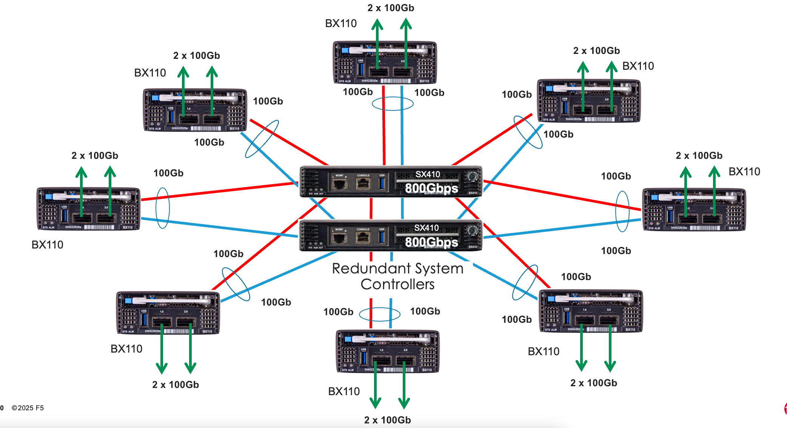
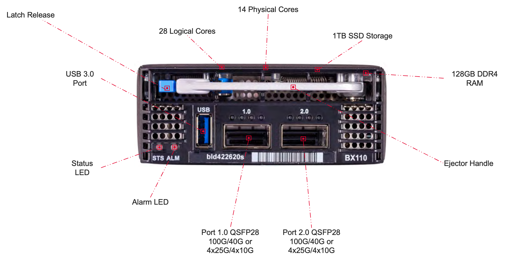

=======================
VELOS High Availability
=======================

System Controller HA
====================

The system controllers perform two main functions for the VELOS chassis. They are the centralized layer2 switch fabric connecting all blades within the system, and they also host the Kubernetes control plane which manages the F5OS layer. The CX410 system ships with redundant system controllers. 

The layer2 switch fabric function performed by the system controllers runs in an active-active manner. Both switch fabrics are active, and each BX110 blade is dual homed with a 100Gb backplane connection to each system controller (200Gb total). On the BX110 blade, the two 100Gb ports are bonded together in a static Link Aggregation Group (LAG). Traffic destined for other blades in the system will hash over the two links (assuming both are active), then traverse the switch fabrics on the system controllers on its way to the destination blade. 

While both switch fabrics are active there is 1.6Tbs of switching capacity between all the blades in the system. If one of the switch fabrics should fail, then the total bandwidth will be cut in half to 800Gbs on the backplane, and each blade will be limited to 100Gbs of backplane capacity. Note that the current throughput rating on the BX110 blades (95Gb) will not push the backplane to full capacity, even if there is a single system controller failure.

The second function the system controllers perform is the management of the control plane for the new Kubernetes platform layer (F5OS) . At this layer the system controllers run in an active/standby fashion. One system controller will be designated primary/active, and the other will be designated secondary/standby. All Kubernetes services will be active on the primary including the API server, scheduler, controller manager, etcd, webUI services etc…. The active system controller can always be reached via the floating IP address that is assigned to the system controllers. The floating address will move in the case of a controller failure. The secondary controller operates in a read-only manner and any changes to configuration must be made on the primary. All changes are replicated from primary to secondary controller, so they should always be in sync, there is no need to manually sync them. The Kubernetes control plane is responsible for deploying workloads on the BX110 blades.

.. image:: images/velos_high_availability/image2.png
  :align: center
  :scale: 70%

You may view the current high availability status in the dashboard of the system controller webUI. It will show which controller is primary and standby, as well as other system infromation realted to the system controllers.

You can view and configure the High Availability options for the system controllers in the webUI **Systems Settings > Controller Management** screen. You can force a failover, configure auto failback, as well as set the preferred node:

.. image:: images/velos_high_availability/image4.png
  :align: center
  :scale: 70%

Failover Behavior
=================

The failover behavior will depend on the type of outage encountered at the system controller. You can perform a manual failover from one system controller to the other via the system controller webUI:

.. image:: images/velos_high_availability/image5.png
  :align: center
  :scale: 70%

This will fail the Kubernetes control plane services from the active system controller to the standby, and the floating IP address will move to the new active controller. This type of outage will be non-disruptive to client traffic flowing through the tenants and layer2 switch fabrics running on the system controllers, which will continue to run in an active/active manner. Any management connections to the system controller or chassis partition F5OS webUI, CLI, or API’s will be disconnected, and will have to be re-established through the new active system controller. 

A physical reboot of the active system controller will cause all backplane traffic to temporarily use only the controller previously in the standby status, until the system controller that was rebooted returns. At that point, traffic will resume forwarding across both system controllers in an active/active manner. It is possible a slight disruption may occur to any tenant traffic that was in-flight across the backplane when the reboot occurs. 

If a software upgrade is being performed, then both system controllers are upgraded in parallel resulting in an outage for the entire chassis for the initial 1.1.x versions of F5OS. Rolling upgrade support for the system controllers was added in the F5OS 1.2.x release. This allows for a serial rolling upgrade to take place for the system controllers and minimal downtime to the tenants when the F5OS-C image on the controllers is upgraded.

Blade Level HA
==============

From a design standpoint it is best to spread in-band network connections across multiple blades if possible. Assuming there is more than one blade within a chassis partition spreading network connections via LAG’s will give the best resiliency and performance. Consider the diagram below where a LAG is split across two different BX110 blades. Incoming traffic should hash across both links and statistically should provide fairly even distribution given enough connections. Performance can still be lumpy, as the upstream switch is likely performing a hash-based distribution, and not distributing based on load. 

Incoming traffic will go through a disaggregation (DAG) process where connections are spread across all processors within the VELOS tenant. Again, a hash-based distribution will decide which blade/processor should handle the incoming connection. Given enough connections the expectation is that half are processed locally on the incoming blade, and the other half will be sent across the backplane to another blade assuming a tenant is configured to utilize more than one blade. If the return traffic going outbound can egress on the same blade that processed the connection, then a backplane traversal is saved, it doesn’t have to go back to the incoming blade. If a blade fails, or one of the links in the LAG should fail, then all traffic will ingress and egress on the remaining blade. There are more granular configuration options within the tenant to determine how failover cases should be handled if a blade should fail. Of course, additional blades/links can be added to a chassis partition, but they follow this forwarding behavior:

.. image:: images/velos_high_availability/image6.png
  :align: center
  :scale: 50%

This approach is better than terminating a LAG on a single blade. Incoming connections will DAG in a similar manner as described above; however, all egress traffic will only be able to go out on the same blade as where it initially ingresses. This will cause an extra backplane traversal. The LAG will provide link redundancy, but if the blade fails, there is no redundancy within the chassis to deal with this, you’ll need to configure HA groups or some other failover mechanism in the tenant to fail over to the remaining chassis. 

.. image:: images/velos_high_availability/image7.png
  :align: center
  :scale: 50%

Tenant Level HA Across Chassis
==============================

VELOS does not support tenant HA within the same chassis. F5 recommends configuring dual VELOS chassis with identically configured tenants and maintaining HA relationships at the tenant level as seen below. This mimics the VIPRION HA behavior between vCMP guests. There is no redundancy between chassis at the F5OS platform layer. The chassis’ themselves are unaware of the other chassis and there is no HA communication at this level, it’s the tenants that form the HA relationship.

.. image:: images/velos_high_availability/image8.png
  :align: center
  :scale: 70%

Tenants on different chassis, should have the same number of vCPUs and be configured to run on the same slots. HA interconnection VLANs would be configured between chassis partitions in the two chassis, and then tenants would configure HA just as is the case with vCMP guest HA relationships. Below is an example of two VELOS chassis with multiple chassis partitions each with their own HA interconnects and in-band networking.

.. image:: images/velos_high_availability/image9.png
  :align: center
  :scale: 70%

Tenant Level HA within the Chassis
==================================

VELOS does not support configuring HA relationships between tenants within the same chassis. You can configure tenants to span multiple blades, and then depending on what failover behavior you want, you can have the tenant run with less capacity within the same chassis if a blade fails, or fail over to the tenant in the other chassis. This is controlled within the tenant itself, just like vCMP guests HA failover was configured. HA groups allow an administrator to fail over based on pool, trunk, or blade availability. 

**Note: The HA Groups failover option based on trunks is not supported in VELOS tenants running 14.1.4.x and F5OS v1.1.x. The Tenants do not have visibility into the F5OS layer Link Aggregation Groups. F5OS 1.2.x and later along with VELOS tenant running 15.1.4 or later support trunks within an HA Group.**

**NOTE: Expanding a tenant across two or more blades will require additional configuration and IP addresses within the tenant. A tenant will require one out-of-band IP address for each slot it is hosted on plus one floating IP address. This is similar to how vCMP addressing is configured for HA.**

Below is an example of a “SuperVIP” tenant that spans all 8 blades. Each system controller will have one static IP address, and then there is a floating IP address. The chassis partition will require an out-of-band management address, as will the tenant. If the chassis partition is comprised of all 8 blades and the tenant will be spread across all 8 blades, then the tenant will need to have an IP address configured for each blade for proper HA failover and synchronization.

.. image:: images/velos_high_availability/image10.png
  :align: center
  :scale: 70%

Inside the tenant, one **Cluster Member IP Address** will need to be configured for each blade. If using IPv4 & IPv6 (dual stack management) then **Alternate Management** & **Cluster Member IP addresses** can be configured.

.. image:: images/velos_high_availability/image11.png
  :align: center
  :scale: 90%

For planning purposes a single large tenant “SuperVip” spanning 8 total blades would require 13 out-of-band management IP addresses for each chassis. In-band Self-IP & Virtual addresses are not included in this calculation.

+------------------------------+----------------------------------+--------------------+
| **IP Addresses Required**    | **Single Chassis**               | **HA Environment** | 
+==============================+==================================+====================+
| System Controller 1          |     1                            |  x2 for HA = 2     |
+------------------------------+----------------------------------+--------------------+
| System Controller 2          |     1                            |  x2 for HA = 2     | 
+------------------------------+----------------------------------+--------------------+
| System Controller Floating   |     1                            |  x2 for HA = 2     |
+------------------------------+----------------------------------+--------------------+
| Chassis Partition            |     1 per Chassis Partition      |  x2 for HA = 2     | 
+------------------------------+----------------------------------+--------------------+
| Tenant Management            |     1 per Tenant                 |  x2 for HA = 2     | 
+------------------------------+----------------------------------+--------------------+
| Tenant Cluster Member        |     8 per Tenant (one per slot)  |  x2 for HA = 16    |
+------------------------------+----------------------------------+--------------------+
| Total                        |     13                           |  x2 for HA = 26    | 
+------------------------------+----------------------------------+--------------------+

HA Group Configuration to Control Tenant Failover
=================================================

An active tenant will naturally failover to the standby tenant in another VELOS chassis if the tenant is not healthy and the standby detects it has failed. Ideally you should also configure HA Groups or some other mechanism within the tenant to detect external conditions that you will want to trigger a failover for. As an example, HA groups can monitor blades in the VELOS chassis, and failover if a minimum number of active blades is not met. You can also monitor pool member reachability to trigger a failover.

**Note: The HA Groups failover option based on trunks is not supported in F5OS v1.1.x versions with VELOS tenants running 14.1.4.x. The tenants do not have visibility into the F5OS layer Link Aggregation Groups. F5OS v1.2.x and later along with tenants running 15.1.4 or later support this functionality.**

VELOS HA Considerations and Recommended Practices
=================================================

As with previous generation BIG-IP appliances and chassis there are multiple HA topologies that are supported for VELOS tenants. In general, the HA setup for VELOS will mimic vCMP guest HA setup, as there is no HA configured at the underlying F5OS platform layer, although there is HA between the dual system controllers. Some customers prefer to utilize dedicated links (within a LAG) for the HA interconnect which carries HA VLANs between tenants, and other customers prefer to run these HA VLANs over the existing in-band ports (within a LAG), and not dedicate ports for the HA interconnect. The remaining parts of this section will cover the different topology options specific to the VELOS platform and cover pros and cons of each approach.

VELOS BX110 Blade 
-----------------

Each VELOS BX110 blade has two physical ports, that currently support the following options for connectivity: 100Gb, 40Gb, 4 x 25Gb, 4 x 10Gb. Currently both ports on the same blade must be configured for the same speed and mode. The number of blades installed may dictate what approach makes the most sense, as the number of ports available and the performance required may dictate some topology decisions.

HA Topology Options
-------------------

VELOS does not support tenant HA within the same chassis. F5 recommends configuring dual VELOS chassis with identically configured tenants and maintaining HA relationships at the tenant level as seen below. This mimics the VIPRION HA behavior between vCMP guests. There is no redundancy between chassis at the F5OS platform layer. The chassis’ themselves are unaware of the other chassis and there is no HA communication at this level, it’s the tenants that form the HA relationship.

.. image:: images/velos_high_availability/image8.png
  :align: center
  :scale: 70%

Tenants on different chassis should have the same number of vCPU’s and be configured to run on the same slots. HA interconnection VLANs would be configured between chassis partitions in the two chassis, and then tenants would configure HA just as is the case with vCMP guest HA relationships. Below is an example of two VELOS chassis with multiple chassis partitions each with their own HA interconnects and in-band networking.

.. image:: images/velos_high_availability/image13.png
  :align: center
  :scale: 60%

HA Topology Considerations
--------------------------

Most modern environments will have dual upstream layer2 switches that handle the in-band connections from multiple VELOS chassis. The ideal connection mechanism for the in-band connections is to connect to a switching infrastructure that supports MLAG or VPC between the upstream switches. This will allow LAG’s on VELOS side to be dual homed to both upstream switches and this will help prevent failover on VELOS in the event of an upstream switch failure. Below is an example of a typical deployment with a LAG with members from separate BX110 VELOS blades going to upstream L2 switches:

.. image:: images/velos_high_availability/image14.png
  :align: center
  :scale: 60%

If the environment only has a single blade in each chassis and 100Gb or 40Gb connectivity is desired, then putting both ports on the BX110 into a LAG and dual homing it to the two upstream switches in a vPC makes the most sense. Because there aren’t more ports to dedicate to an HA interconnect LAG, this drives the decision of which topology is best. In the example below, the HA VLAN(s) will run on the same LAG as the in-band traffic.

.. image:: images/velos_high_availability/image15.png
  :align: center
  :scale: 60%

If the environment is not running 100Gb or 40Gb, then the BX110 blade can be configured so that both ports support 4 x 25Gb ports, or 4 x 10Gb ports (total of 8 ports). With this many ports you have the option of adding more ports into the LAG to the upstream switches, and dedicating ports for an HA interconnect LAG between the two VELOS chassis.  As an example, 4 of the ports could be aggregated together in a LAG and 2 of those ports would go to upstream switch1 and the other two to upstream switch2. The remaining 4 ports could be put into another LAG dedicated for the HA interconnect between the chassis. The number of ports within the LAGs could be adjusted based on the specific environment requirements. i.e. fewer ports for the HA interconnect LAG if mirroring bandwidth is not expected to be too high. These ports could be added to the in-band LAG.

.. image:: images/velos_high_availability/image16.png
  :align: center
  :scale: 60%

As more BX110 blades are added to each VELOS chassis, more options become available as the restriction of running only one speed / mode is lifted because a second blade could be configured to run at different speeds.  This could allow some ports to run lowers speeds (4 x 25Gb, 4 x 10Gb) and break out, while other ports are running higher speed (40Gb or 100Gb). 

As additional blades are added, it makes sense to spread the LAG across more blades for added redundancy. It is not a requirement to extend the LAG to every blade within a chassis partition, but this can be done to optimize traffic flows and avoid extra backplane traversals. Consider the diagram below where a single LAG on one blade is configured but 2 blades are installed. Traffic will enter blade1 and go through a disaggregation process where some traffic may be processed locally on blade1 and other traffic will be sent to the remote blade2. Tenant slot configuration will also play into this decision. This means an extra hop across the backplane/switch fabrics for transactions to be processed, and then the response having to come back across the backplane to exit the chassis via the LAG.

.. image:: images/velos_high_availability/image17.png
  :align: center
  :scale: 60%

Consider the same number of blades, but instead of terminating the LAG on blade1 only, this time it is spread across both blade1 and blade2. This will allow incoming traffic to be somewhat evenly distributed coming into the chassis across the two blades (this is dependent on the upstream layer2 switch hashing algorithms and traffic patterns). In the diagram below traffic will still go through a disaggregation process and may be sent across the backplane/switch fabrics if needed. However, instead of having to traverse the backplane to egress the chassis, the VELOS blades will always prefer a local egress port over a backplane traversal. For this reason, spreading a LAG over more ports not only provides added resiliency in case of blade failure it also provides a more optimal traffic flow.

.. image:: images/velos_high_availability/image18.png
  :align: center
  :scale: 60%

Adding two highspeed (100gb or 40Gb) ports from each blade to the LAG can be done, but if the LAG is already configured to span to another blade, it may be considered overkill (Especially for the 100Gb case) because each BX110 blade is rated for a max of 95Gb, so adding an additional port is not going to increase performance.  If running lower speed ports this may be desired to drive more aggregate throughput into each blade.

Mirroring Considerations
------------------------

The two topologies below are identical except one has a dedicated LAG for the HA interconnect VLANs and the other lets HA VLANs ride over the in-band LAG. Whether they go to a vPC or not is optional. While the dedicated HA Interconnect LAG requires more ports, it does provide better isolation and performance for mirroring.

.. image:: images/velos_high_availability/image19.png
  :align: center
  :scale: 60% 

.. image:: images/velos_high_availability/image20.png
  :align: center
  :scale: 60%   

Consider the case where mirror traffic is intermingled over the in-band LAG with application traffic. Unless there is some sort of prioritization implemented, it’s possible that heartbeat and mirroring type traffic may be affected by saturation somewhere in the upstream switch or within the networking layer. The main disadvantage of this topology is HA VLAN disruption due to switch error. This can affect mirroring and heartbeat, whereas a dedicated HA interconnect between the VELOS chassis has no dpedencies on upstream switches or networking. The biggest concern is the Failover heartbeats from sod (udp port 1026). 

The right way to set this up is to configure HA heartbeats over the management interface as well as over the HA VLAN (K37361453). Unfortunately, this is harder than it seems for BIG-IP tenants that span multiple slots/blades in VELOS. You must make sure that each slot has an individual management address, and you must configure either management multicast (and make sure it works), or a mesh of unicast management addresses. Many customers overlook this step and if they fail to set this up properly, they would be unwittingly relying solely on the stability of their HA VLAN.

The example below shows a tenant configured on VELOS. For a single slot tenant (a tenant that only utilizes one slot/blade), you only need to configure the single Management IP address. If a VELOS tenant spans more than one blade then you must configure a separate cluster member IP address for each slot/blade that the tenant will run on. You cannot reuse these IP addresses within other tenants, they must have their own unique cluster member IP addresses if they span more than one blade.

.. image:: images/velos_high_availability/image21.png
  :align: center
  :scale: 60%  

The diagram below shows the configuration of multiple HA heartbeat paths. One is Multicast configured on the out-of-band network via the Management port on the VELOS system controllers, and the other is Unicast configured on the in-band network Self-IP on the tenant. As outlined in (K37361453), having both options defined is critical to HA working properly.

.. image:: images/velos_high_availability/image22.png
  :align: center
  :scale: 60%  

There is an alternative to configuring Multicast over the Management network, called Unicast Mesh, where each blade in the tenant is added configured as a Failover Unicast address, allowing each blade to exchange heartbeat message with all the blades of the peer tenant. As with Multicast, you must configure a separate cluster member IP address for each blade on which the tenant will run.

How Many Ports are Required for an HA Interconnect LAG?
-------------------------------------------------------

The number of ports required in a dedicated HA Interconnect may vary. Ideally you should have a minimum of two ports in a LAG with dedicated tagged VLANs for each tenant HA pair. Running configsync and mirroring over this interface is preferred if it has been enabled. The two links in a LAG provide redundancy if one link should fail, and you can add more interfaces to the LAG for added resiliency. These links should be spread across additional blades for added redundancy.

Generally, heartbeat traffic is not very bandwidth sensitive, but it can be sensitive to latency especially when mirroring is enabled. Mirroring will take up more bandwidth over the HA links, layer4 mirroring is less bandwidth intensive than layer7 mirroring. With layer4 mirroring there is one packet mirrored per connection, whereas layer7 mirroring is one mirrored connection per packet. 

You should plan for enough bandwidth in the LAG if mirroring is enabled. As mentioned above layer7 mirroring will generate lots of bandwidth as every packet has to be mirrored. 

HA Groups should be properly configured within VELOS tenants to detect external failures. You need to configure an HA Group with sufficient weight on the correct operation of the main trunk to upstream switches.  Without HA Groups (or less preferred VLAN Failsafe), the only requirement is to have heartbeat.

If you're setting up peer to peer connectivity, you're putting yourself in a position where a VELOS which loses its main traffic LAG will continue to heartbeat over the HA interface, and will continue to remain active.  Make sure HA group setup is explicitly mentioned as a requirement if you setup peer to peer HA VLANs
