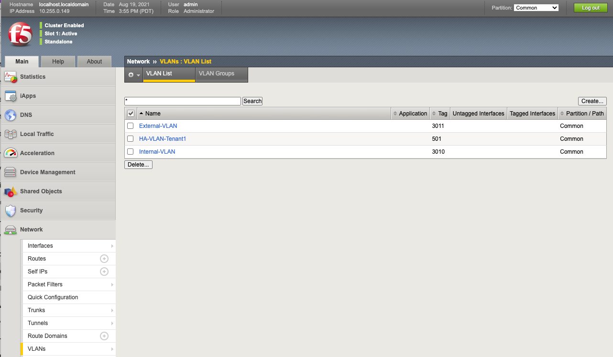

================
Inside the Tenant
=================

Once a tenant is deployed you can connect/communicate directly to one of its CLI, GUI, or API interfaces. At this layer you are interacting with TMOS, i.e. the experience should be almost identical to a vCMP guest with some minor exceptions.

VLAN Behavior
=============

In VIRPION with vCMP, VLANs are created at the vCMP host layer and added to physical interfaces or trunks. The VLANs are then assigned to a vCMP guest at creation time using the VLAN name. VLAN names are passed through to the vCMP guest as-is, meaning the names are unaltered. 

VELOS follows a similar behavior as far as tenants inheriting VLANs from the F5OS layer. At tenant creation time the admin will assign VLANs to the tenant based on VLAN ID. In VIPRION a vCMP guest will inherit the VLAN names, and they will appear inside the tenant. The initial versions of VELOS passed VLAN ID’s to the tenant but not the name (names were autogenerated), but as of F5OS version 1.1.2 the VELOS tenant will inherit the VLAN names just as a vCMP guest will. Below is a VELOS tenant showing the VLAN names being passed from the F5OS layer that the tenant was configured for: 

