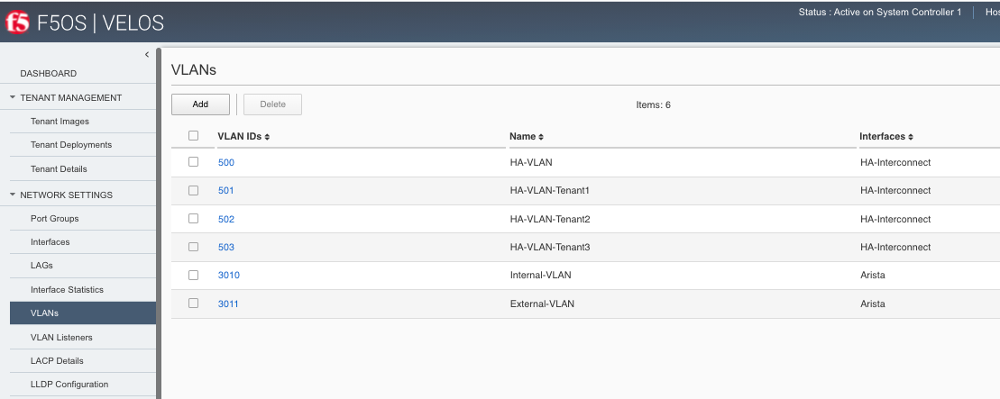
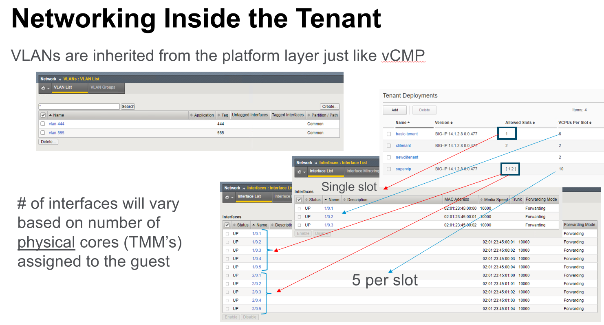

=================
Inside the Tenant
=================

Once a tenant is deployed you can connect/communicate directly to one of its CLI, GUI, or API interfaces. At this layer you are interacting with TMOS, i.e. the experience should be almost identical to a vCMP guest with some minor exceptions.

VLAN Behavior
=============

In VIRPION with vCMP, VLANs are created at the vCMP host layer and added to physical interfaces or trunks. The VLANs are then assigned to a vCMP guest at creation time using the VLAN name. VLAN names are passed through to the vCMP guest as-is, meaning the names are unaltered. 

VELOS follows a similar behavior as far as tenants inheriting VLANs from the F5OS layer. At tenant creation time the admin will assign VLANs to the tenant based on VLAN ID. In VIPRION a vCMP guest will inherit the VLAN names, and they will appear inside the tenant. The initial versions of VELOS passed VLAN ID’s to the tenant but not the name (names were autogenerated), but as of F5OS version 1.1.2 the VELOS tenant will inherit the VLAN names just as a vCMP guest will. Below is a VELOS tenant showing the VLAN names being passed from the F5OS layer that the tenant was configured for: 

.. image:: images/velos_inside_the_tenant/image1.png
  :align: center
  :scale: 70%

These are the VLANs as they appear in the F5OS platform layer. Notice that the tenant does not see all VLAN’s, only the ones that are assigned to it by the administrator:

This means that any VLAN configuration inside the VELOS tenant must be converted to utilize the VLAN name that is autogenerated. In many configurations the VLANs are setup manually before migrating the configuration, but there may be parts of the configuration that may rely on the VLAN name itself. Some examples would be route domains that reference VLANs by name. 

You can delete the VLAN inside the tenant and then recreate it with a new name, as long as the tag value remains the same. The tag value is what will connect it back to the VLAN in platform layer. The Journeys migration tool relies on a UCS restore procedure inside the tenant, and this too will create VLANs with their proper names, and as long as the tag matches the VLAN configured in the platform layer the VLANs will be connected. 

Interface Behavior
------------------

The number of interfaces within a tenant will be based upon the number of vCPU’s assigned to the tenant and the number of slots the tenant is running on. The screenshot below show the interfaces inside the tenant lining up with the number of physical cores per slot. In the first example there are 6 vCPU’s on a single slot tenant, this will equate to 3 physical CPU’s. Likewise for a dual slot tenant with 10 vCPU’s per slot. You’ll see 5 physical CPU’s per slot.

Trunk / HA Group Behavior
-------------------------

Within a vCMP guest Trunks can be used as part of the **HA Group** functionality to determine when a guest should fail over to its peer. 

An HA group is a specification of certain pools or host trunks (or any combination of these) that a guest administrator associates with a traffic group instance. The most common reason to configure an HA group is to ensure that failover is triggered when some number of trunk members become unavailable.

**Note: VELOS does not currently support the trunk option within an HA group. VELOS tenants currently don’t have visibility into the trunks configured at the platform layer.**

