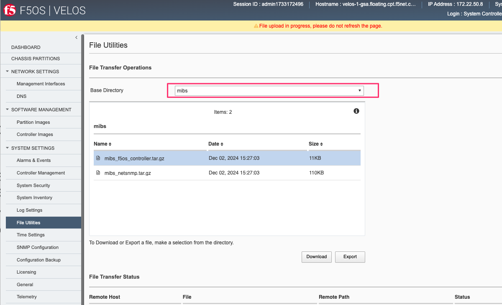
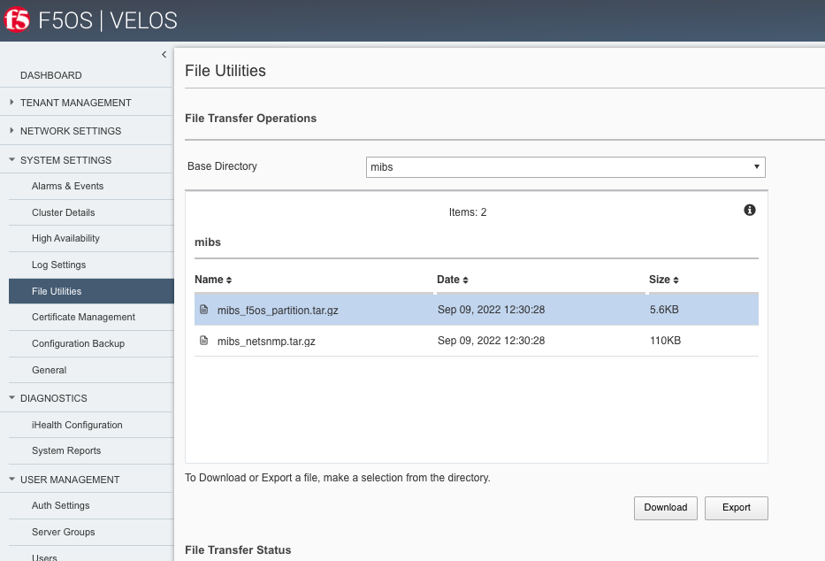
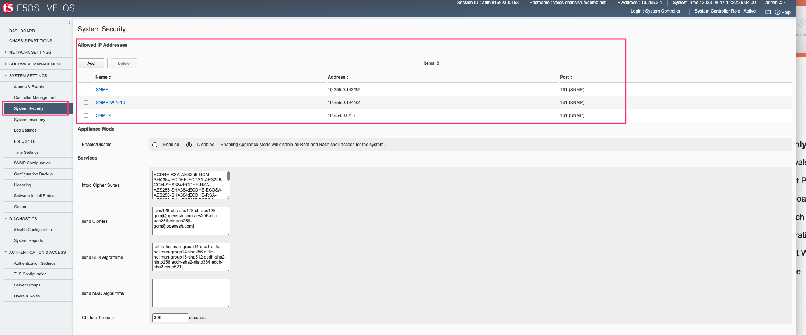
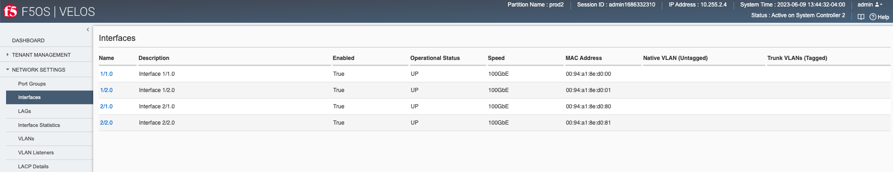
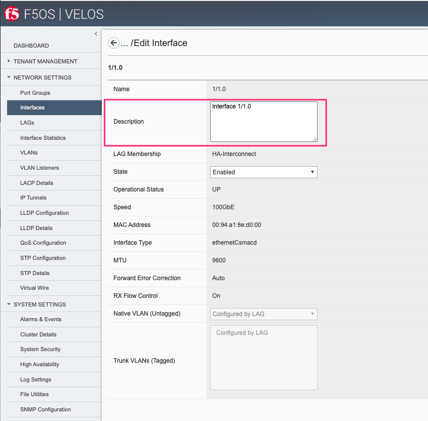
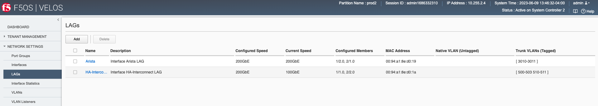
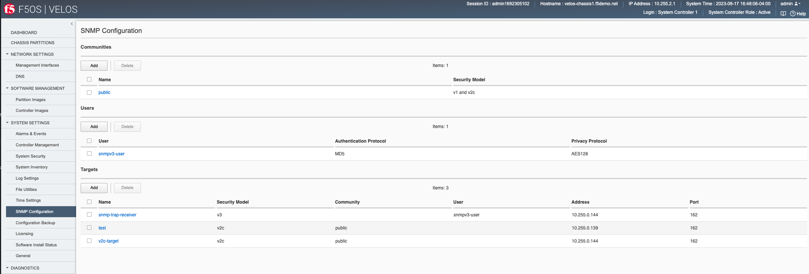
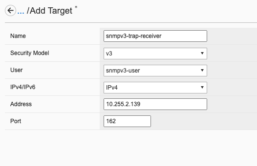
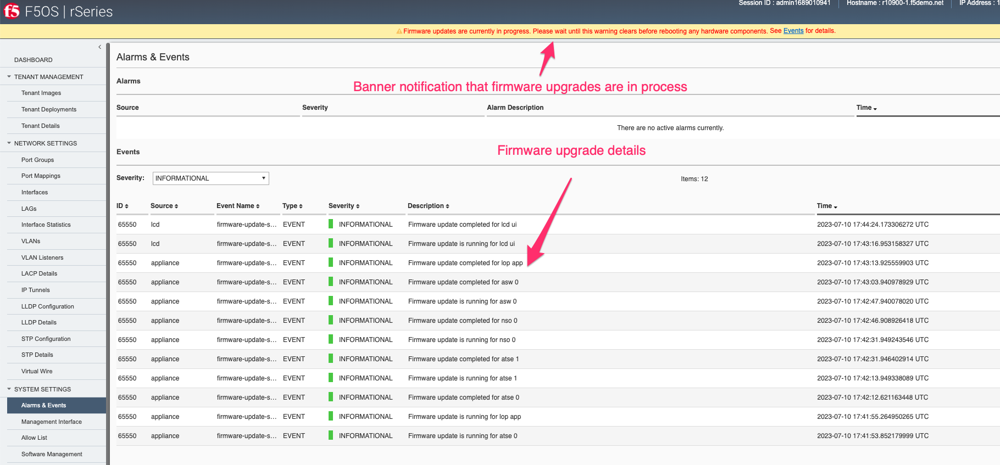

=======================================
VELOS F5OS SNMP Monitoring and Alerting
=======================================

SNMP support for F5OS will vary by release. In the initial F5OS-C 1.1.x versions, SNMP support was limited to **IF-MIB** support for the chassis partitions and SNMP trap support. F5OS v1.2.x added additional SNMP support, including Link Up/Down Traps for chassis partitions, and support for **IF-MIB**, **EtherLike-MIB**, and the **PLATFORM-STATS-MIB**. F5OS-C 1.5.x added additional SNMP MIB and trap coverage and F5OS-C 1.6.0 added SNMPv3 support. The **F5-PLATFORM-STATS-MIB** and **F5-OS-SYSTEM-MIB** were not supported on the system controllers until F5OS-C 1.6.0.

As of F5OS-C 1.6.0 the list of SNMP MIBs available are as follows:

**VELOS System Controller MIBs**

F5OS Controller MIBs:

- F5-ALERT-DEF-MIB
- F5-COMMON-SMI-MIB
- F5-CTRLR-ALERT-NOTIF-MIB
- F5-PLATFORM-STATS-MIB
- F5-OS-SYSTEM-MIB

NetSNMP MIBs System Controller:

- EtherLike-MIB
- HOST-RESOURCES-MIB (Included for dependency reasons, not supported)
- IANAifType-MIB
- IF-MIB
- IPV6-TC
- RFC1213-MIB
- SNMP-COMMUNITY-MIB
- SNMP-FRAMEWORK-MIB
- SNMP-MPD-MIB
- SNMP-NOTIFICATION-MIB
- SNMP-TARGET-MIB
- SNMP-USER-BASED-SM-MIB
- SNMP-VIEW-BASED-ACM-MIB
- SNMPv2-CONF
- SNMPv2-MIB
- SNMPv2-SMI
- SNMPv2-TC
- TRANSPORT-ADDRESS-MIB

**VELOS Chassis Partition MIBs**

F5OS Chassis Partition MIBs:

- F5-ALERT-DEF-MIB
- F5-COMMON-SMI-MIB
- F5-OS-LLDP-MIB
- F5-OS-PLATFORM-SMI-MIB
- F5-OS-SYSTEM-MIB
- F5-PARTITION-ALERT-NOTIF-MIB
- F5-PLATFORM-STATS-MIB

NetSNMP MIBs Chassis Partition:

- EtherLike-MIB
- HOST-RESOURCES-MIB (Included for dependency reasons, not supported)
- IANAifType-MIB
- IF-MIB
- IPV6-TC
- RFC1213-MIB
- SNMP-COMMUNITY-MIB
- SNMP-FRAMEWORK-MIB
- SNMP-MPD-MIB
- SNMP-NOTIFICATION-MIB
- SNMP-TARGET-MIB
- SNMP-USER-BASED-SM-MIB
- SNMP-VIEW-BASED-ACM-MIB
- SNMPv2-CONF
- SNMPv2-MIB
- SNMPv2-SMI
- SNMPv2-TC
- TRANSPORT-ADDRESS-MIB

MIBs can be downloaded directly from the F5OS layer starting in F5OS-C v1.5.x. From the webUI of the system controller, you can go to the **System Settings > File Utilities** page. Then, from the **Base Directory** drop down box select the **mibs** directory to download the MIB files. There are two separate MIB files: NetSNMP and F5OS MIBs for the controller. Download both MIB files and extract them to see the individual MIB files.

You can then download the F5OS controller MIBS and the standard Net SNMP MIBS as seen above. Repeat the same process on one of the chassis partitions to download the chassis partition MIBs.

Adding Allowed IPs for SNMP
===========================

Adding Allowed IPs for SNMP via CLI
-----------------------------------

By default, SNMP queries are not allowed into the F5OS platform layer. Before enabling SNMP, you'll need to open up the out-of-band management port on F5OS-C (on both the system controller and on all the chassis partitions) to allow SNMP queries from particular SNMP management endpoints. Below is an example of allowing any SNMP endpoint at 10.255.0.0 (prefix length of 24) to query the F5OS layer on port 161. The allowed-ip functionality is added in F5OS-C 1.6.0.

.. code-block:: bash

    syscon-1-active(config)# system allowed-ips allowed-ip snmp config ipv4 address 10.255.0.0 prefix-length 24 port 161
    syscon-1-active(config-allowed-ip-snmp)# commit
    Commit complete.
    syscon-1-active(config-allowed-ip-snmp)# 

Currently you can add one IP address/port pair per **allowed-ip** name with an optional prefix length to specify a CIDR block containing multiple addresses. If you require more than one non-contiguous IP address, you can add it under another name as seen below. 

.. code-block:: bash

    syscon-1-active(config)# system allowed-ips allowed-ip SNMP-144 config ipv4 address 10.255.0.144 port 161 
    syscon-1-active(config-allowed-ip-SNMP-144)# commit
    Commit complete.

    syscon-1-active(config-allowed-ip-SNMP-144)# system allowed-ips allowed-ip SNMP-145 config ipv4 address 10.255.2.145 port 161 
    syscon-1-active(config-allowed-ip-SNMP-145)# commit
    Commit complete.
    syscon-1-active(config-allowed-ip-SNMP-145)#

Adding Allowed IPs for SNMP via API
-----------------------------------

By default, SNMP queries are not allowed into the F5OS layer. Before enabling SNMP. you'll need to open up the out-of-band management port on F5OS-C to allow SNMP queries (on both the system controller and on all the chassis partitions). Below is an example of allowing multiple SNMP endpoints to access SNMP on the system on port 161.

.. code-block:: bash

    POST https://{{velos_chassis1_system_controller_ip}}:8888/restconf/data/openconfig-system:system/f5-allowed-ips:allowed-ips

Within the body of the API call, specific IP address/port combinations can be added under a given name. In the current release, you are limited to one IP address/port per name. 

.. code-block:: json

    {
        "allowed-ip": [
            {
                "name": "SNMP",
                "config": {
                    "ipv4": {
                        "address": "10.255.0.143",
                        "port": 161,
                        "prefix-length": 32
                    }
                }
            },
            {
                "name": "SNMP-WIN-10",
                "config": {
                    "ipv4": {
                        "address": "10.255.0.144",
                        "port": 161,
                        "prefix-length": 32
                    }
                }
            },
            {
                "name": "SNMP2",
                "config": {
                    "ipv4": {
                        "address": "10.254.0.0",
                        "port": 161,
                        "prefix-length": 16
                    }
                }
            }
        ]
    }

To view the allowed IPs in the API, use the following call.

.. code-block:: bash

    GET https://{{velos_chassis1_system_controller_ip}}:8888/restconf/data/openconfig-system:system/f5-allowed-ips:allowed-ips

The output will show the previously configured allowed-ip's.

.. code-block:: json

    {
        "f5-allowed-ips:allowed-ips": {
            "allowed-ip": [
                {
                    "name": "SNMP",
                    "config": {
                        "ipv4": {
                            "address": "10.255.0.143",
                            "prefix-length": 32,
                            "port": 161
                        }
                    }
                },
                {
                    "name": "SNMP-WIN-10",
                    "config": {
                        "ipv4": {
                            "address": "10.255.0.144",
                            "prefix-length": 32,
                            "port": 161
                        }
                    }
                },
                {
                    "name": "SNMP2",
                    "config": {
                        "ipv4": {
                            "address": "10.254.0.0",
                            "prefix-length": 16,
                            "port": 161
                        }
                    }
                }
            ]
        }
    }

Adding Allowed IPs for SNMP via webUI
-----------------------------------

Configuration of the **allowed-ip** functionality was added to the webUI in F5OS-C 1.6.0. By default, SNMP queries are not allowed into the F5OS platform layer. Before enabling SNMP, you'll need to open up the out-of-band management port on F5OS-C (on both the system controller and on all the chassis partitions) to allow SNMP queries from particular SNMP management endpoints. Below is an example of allowing a few SNMP endpoints to query the F5OS layer on port 161.

Adding Interface and LAG Descriptions
=====================================

It is highly recommended that you put interface descriptions in your configuration, so that they will show up in the description field when using SNMP polling.

Adding Out-of-Band Interface and LAG Descriptions via CLI
---------------------------------------------------------

To add descriptions for the out-of-band management ports on the system controllers in the CLI, follow the examples below. 

.. code-block:: bash

    syscon-1-active(config)# interfaces interface 1/mgmt0 config description "Interface 1/mgmt0"
    syscon-1-active(config-interface-1/mgmt0)# exit
    syscon-1-active(config)# interfaces interface 2/mgmt0 config description "Interface 2/mgmt0"
    syscon-1-active(config-interface-2/mgmt0)# exit
    syscon-1-active(config)# commit
    Commit complete.
    syscon-1-active(config)#

Adding Out-of-Band Interface and LAG Descriptions via API
---------------------------------------------------------

To add descriptions for the out-of-band management ports on the system controllers via the API, follow the examples below. Use the following PATCH command to update the descriptions for both 1/mgmt0 and 2/mgmt0 out-of-band interfaces.

.. code-block:: bash

    PATCH https://{{velos_chassis1_system_controller_ip}}:8888/restconf/data/

In the body of the API call, add the descriptions as seen below.

.. code-block:: json

    {
        "openconfig-interfaces:interfaces": {
            "interface": [
                {
                    "name": "1/mgmt0",
                    "config": {
                        "description": "1/mgmt0"
                    }
                },
                {
                    "name": "2/mgmt0",
                    "config": {
                        "description": "2/mgmt0"
                    }
                }
            ]
        }
    }

You can then issue the following GET API call to view each interfaces configuration including the new description. Note, the interface name must be encoded in Postman because of the special characters. The %2F will represent the slash in the interface name.

.. code-block:: bash

    GET https://{{velos_chassis1_system_controller_ip}}:8888/restconf/data/openconfig-interfaces:interfaces/interface=1%2Fmgmt0/config

You should see a response like the one below.

.. code-block:: json

    {
        "openconfig-interfaces:config": {
            "name": "1/mgmt0",
            "type": "iana-if-type:ethernetCsmacd",
            "description": "1/mgmt0",
            "enabled": true
        }
    }

You can then issue the same command with a different interface name for the second management interface.

.. code-block:: bash

    GET https://{{velos_chassis1_system_controller_ip}}:8888/restconf/data/openconfig-interfaces:interfaces/interface=2%2Fmgmt0/config

You should see a response similar to the one below.

.. code-block:: json

    {
        "openconfig-interfaces:config": {
            "name": "2/mgmt0",
            "type": "iana-if-type:ethernetCsmacd",
            "description": "2/mgmt0",
            "enabled": true
        }
    }

You cannot currently set the interface descriptions for the out-of-band management interfaces via the webUI. You'll need to use either the API or CLI.

Adding Interface and LAG Descriptions for Chassis Partitions via CLI
--------------------------------------------------------------------

Adding descriptions to the interfaces will make it easier to determine which interface you are monitoring when using SNMP. Below are examples of adding interface descriptions via CLI to interfaces within a chassis partition. You should repeat this for each chassis partition and all interfaces.

.. code-block:: bash

    prod2-2(config)# interfaces interface 1/1.0 config description "Interface 1/1.0"
    prod2-2(config-interface-1/1.0)# exit
    prod2-2(config)# interfaces interface 1/2.0 config description "Interface 1/2.0"
    prod2-2(config-interface-1/2.0)# exit
    prod2-2(config)# interfaces interface 2/1.0 config description "Interface 2/1.0"
    prod2-2(config-interface-2/1.0)# exit
    prod2-2(config)# interfaces interface 2/2.0 config description "Interface 2/2.0"
    prod2-2(config-interface-2/2.0)# exit
    prod2-2(config)# commit
    Commit complete.
    prod2-2(config)#

If you are using Link Aggregation Groups (LAGs), then you can also add interface descriptions to the LAG interfaces within each chassis partition:

.. code-block:: bash

    prod2-2(config)# interfaces interface Arista config description "Interface Arista LAG"
    prod2-2(config-interface-Arista)# exit
    prod2-2(config)# interfaces interface HA-Interconnect config description "Interface HA-Interconnect LAG"
    prod2-2(config-interface-HA-Interconnect)# exit 
    prod2-2(config)# commit
    Commit complete.
    prod2-2(config)# 

To view the interface descriptions, use the **show running-config interfaces** command.

.. code-block:: bash

    prod2-2# show running-config interfaces          
    interfaces interface 1/1.0
    config type              ethernetCsmacd
    config description       "Interface 1/1.0"
    config enabled
    config forward-error-correction auto
    ethernet config aggregate-id HA-Interconnect
    !
    interfaces interface 1/2.0
    config type              ethernetCsmacd
    config description       "Interface 1/2.0"
    config enabled
    config forward-error-correction auto
    ethernet config aggregate-id Arista
    !
    interfaces interface 2/1.0
    config type              ethernetCsmacd
    config description       "Interface 2/1.0"
    config enabled
    config forward-error-correction auto
    ethernet config aggregate-id Arista
    !
    interfaces interface 2/2.0
    config type              ethernetCsmacd
    config description       "Interface 2/2.0"
    config enabled
    config forward-error-correction auto
    ethernet config aggregate-id HA-Interconnect
    !
    interfaces interface Arista
    config type ieee8023adLag
    config description "Interface Arista LAG"
    aggregation config lag-type LACP
    aggregation config distribution-hash src-dst-ipport
    aggregation switched-vlan config trunk-vlans [ 3010 3011 ]
    !
    interfaces interface HA-Interconnect
    config type ieee8023adLag
    config description "Interface HA-Interconnect LAG"
    aggregation config lag-type LACP
    aggregation config distribution-hash src-dst-ipport
    aggregation switched-vlan config trunk-vlans [ 500 501 502 503 510 511 ]
    !
    prod2-2#

Adding Interface and LAG Descriptions for Chassis Partitions via webUI
--------------------------------------------------------------------

You can also add interface descriptions for both interfaces and LAGs within the webUI. Go to the **Network Settings -> Interfaces** page and select an interface to modify.

Then edit the description and **Save** the change, then repeat for all the other interfaces within that chassis partition. Then repeat for other chassis partitions.

For Link Aggregation Groups go to the **Network Settings -> LAGs** page and select a LAG to modify.

Then edit the description and **Save** the change, then repeat for all the other LAG interfaces within that chassis partition. Then repeat for other chassis partitions.

.. image:: images/velos_monitoring_snmp/image7.png
  :align: center
  :scale: 70%

Adding Interface and LAG Descriptions for Chassis Partitions via API
--------------------------------------------------------------------

To add descriptions for both the in-band interfaces and LAGs in the CLI, follow the examples below. The API example below is sent to the chassis partition IP address. 

.. code-block:: bash

    PATCH https://{{velos_chassis1_chassis_partition1_ip}}:8888/restconf/data/

Below is the proper formatting for the body of the API call. You will need to adjust to the number and type of interfaces to match what is in your chassis partition.

.. code-block:: json

   {
    "openconfig-interfaces:interfaces": {
        "interface": [
            {
                "name": "1/1.0",
                "config": {
                    "description": "VELOS Interface 1/1.0"
                }
            },
            {
                "name": "1/2.0",
                "config": {
                    "description": "VELOS Interface 1/2.0"
                }
            },
            {
                "name": "2/1.0",
                "config": {
                    "description": "VELOS Interface 2/1.0"
                }
            },
            {
                "name": "2/2.0",
                "config": {
                    "description": "VELOS Interface 2/2.0"
                }
            }

        ]
    }
}

If Link Aggregation Groups (LAGs) are configured, descriptions should be added to the LAG interfaces as well.

.. code-block:: bash

    PATCH https://{{velos_chassis1_chassis_partition1_ip}}:8888/restconf/data/

The body of the API call should contain JSON data that includes the descriptions for each LAG.

.. code-block:: json

    {
        "openconfig-interfaces:interfaces": {
            "interface": [
                {
                    "name": "Arista",
                    "config": {
                        "description": "VELOS Arista LAG Interface"
                    }
                },
                {
                    "name": "HA-Interconnect",
                    "config": {
                        "description": "VELOS HA-Interconnect Interface"
                    }
                }
            ]
        }
    }

You may then view the LAG description via the following API call:

.. code-block:: bash

    GET https://{{velos_chassis1_chassis_partition1_ip}}:8888/restconf/data/openconfig-interfaces:interfaces
    

The output below will show the LAG descriptions as well as all the other interfaces.

.. code-block:: json

    {
        "openconfig-interfaces:interfaces": {
            "interface": [
                {
                    "name": "1/1.0",
                    "config": {
                        "name": "1/1.0",
                        "type": "iana-if-type:ethernetCsmacd",
                        "description": "VELOS Interface 1/1.0",
                        "enabled": true,
                        "f5-interface:forward-error-correction": "auto"
                    },
                    "state": {
                        "name": "1/1.0",
                        "type": "iana-if-type:ethernetCsmacd",
                        "mtu": 9600,
                        "enabled": true,
                        "oper-status": "UP",
                        "counters": {
                            "in-octets": "17514",
                            "in-unicast-pkts": "0",
                            "in-broadcast-pkts": "0",
                            "in-multicast-pkts": "135",
                            "in-discards": "0",
                            "in-errors": "0",
                            "in-fcs-errors": "0",
                            "out-octets": "33431490",
                            "out-unicast-pkts": "0",
                            "out-broadcast-pkts": "0",
                            "out-multicast-pkts": "256908",
                            "out-discards": "0",
                            "out-errors": "0"
                        },
                        "f5-interface:forward-error-correction": "auto",
                        "f5-lacp:lacp_state": "LACP_DOWN"
                    },
                    "openconfig-if-ethernet:ethernet": {
                        "config": {
                            "openconfig-if-aggregate:aggregate-id": "HA-Interconnect"
                        },
                        "state": {
                            "port-speed": "openconfig-if-ethernet:SPEED_100GB",
                            "hw-mac-address": "00:94:a1:8e:d0:00",
                            "counters": {
                                "in-mac-control-frames": "0",
                                "in-mac-pause-frames": "0",
                                "in-oversize-frames": "0",
                                "in-jabber-frames": "0",
                                "in-fragment-frames": "0",
                                "in-8021q-frames": "0",
                                "in-crc-errors": "0",
                                "out-mac-control-frames": "0",
                                "out-mac-pause-frames": "0",
                                "out-8021q-frames": "0"
                            },
                            "f5-if-ethernet:flow-control": {
                                "rx": "on"
                            }
                        }
                    }
                },
                {
                    "name": "1/2.0",
                    "config": {
                        "name": "1/2.0",
                        "type": "iana-if-type:ethernetCsmacd",
                        "description": "VELOS Interface 1/2.0",
                        "enabled": true,
                        "f5-interface:forward-error-correction": "auto"
                    },
                    "state": {
                        "name": "1/2.0",
                        "type": "iana-if-type:ethernetCsmacd",
                        "mtu": 9600,
                        "enabled": true,
                        "oper-status": "UP",
                        "counters": {
                            "in-octets": "34222124",
                            "in-unicast-pkts": "6",
                            "in-broadcast-pkts": "5",
                            "in-multicast-pkts": "258896",
                            "in-discards": "0",
                            "in-errors": "0",
                            "in-fcs-errors": "0",
                            "out-octets": "31820928",
                            "out-unicast-pkts": "0",
                            "out-broadcast-pkts": "0",
                            "out-multicast-pkts": "248601",
                            "out-discards": "0",
                            "out-errors": "0"
                        },
                        "f5-interface:forward-error-correction": "auto",
                        "f5-lacp:lacp_state": "LACP_UP"
                    },
                    "openconfig-if-ethernet:ethernet": {
                        "config": {
                            "openconfig-if-aggregate:aggregate-id": "Arista"
                        },
                        "state": {
                            "port-speed": "openconfig-if-ethernet:SPEED_100GB",
                            "hw-mac-address": "00:94:a1:8e:d0:01",
                            "counters": {
                                "in-mac-control-frames": "0",
                                "in-mac-pause-frames": "0",
                                "in-oversize-frames": "0",
                                "in-jabber-frames": "0",
                                "in-fragment-frames": "0",
                                "in-8021q-frames": "0",
                                "in-crc-errors": "0",
                                "out-mac-control-frames": "0",
                                "out-mac-pause-frames": "0",
                                "out-8021q-frames": "0"
                            },
                            "f5-if-ethernet:flow-control": {
                                "rx": "on"
                            }
                        }
                    }
                },
                {
                    "name": "2/1.0",
                    "config": {
                        "name": "2/1.0",
                        "type": "iana-if-type:ethernetCsmacd",
                        "description": "VELOS Interface 2/1.0",
                        "enabled": true,
                        "f5-interface:forward-error-correction": "auto"
                    },
                    "state": {
                        "name": "2/1.0",
                        "type": "iana-if-type:ethernetCsmacd",
                        "mtu": 9600,
                        "enabled": true,
                        "oper-status": "UP",
                        "counters": {
                            "in-octets": "51072261",
                            "in-unicast-pkts": "9",
                            "in-broadcast-pkts": "18752",
                            "in-multicast-pkts": "383463",
                            "in-discards": "0",
                            "in-errors": "1",
                            "in-fcs-errors": "1",
                            "out-octets": "31832708",
                            "out-unicast-pkts": "0",
                            "out-broadcast-pkts": "0",
                            "out-multicast-pkts": "248701",
                            "out-discards": "0",
                            "out-errors": "0"
                        },
                        "f5-interface:forward-error-correction": "auto",
                        "f5-lacp:lacp_state": "LACP_UP"
                    },
                    "openconfig-if-ethernet:ethernet": {
                        "config": {
                            "openconfig-if-aggregate:aggregate-id": "Arista"
                        },
                        "state": {
                            "port-speed": "openconfig-if-ethernet:SPEED_100GB",
                            "hw-mac-address": "00:94:a1:8e:d0:80",
                            "counters": {
                                "in-mac-control-frames": "0",
                                "in-mac-pause-frames": "0",
                                "in-oversize-frames": "0",
                                "in-jabber-frames": "0",
                                "in-fragment-frames": "1",
                                "in-8021q-frames": "0",
                                "in-crc-errors": "0",
                                "out-mac-control-frames": "0",
                                "out-mac-pause-frames": "0",
                                "out-8021q-frames": "0"
                            },
                            "f5-if-ethernet:flow-control": {
                                "rx": "on"
                            }
                        }
                    }
                },
                {
                    "name": "2/2.0",
                    "config": {
                        "name": "2/2.0",
                        "type": "iana-if-type:ethernetCsmacd",
                        "description": "VELOS Interface 2/2.0",
                        "enabled": true,
                        "f5-interface:forward-error-correction": "auto"
                    },
                    "state": {
                        "name": "2/2.0",
                        "type": "iana-if-type:ethernetCsmacd",
                        "mtu": 9600,
                        "enabled": true,
                        "oper-status": "UP",
                        "counters": {
                            "in-octets": "33026022",
                            "in-unicast-pkts": "0",
                            "in-broadcast-pkts": "0",
                            "in-multicast-pkts": "256851",
                            "in-discards": "0",
                            "in-errors": "0",
                            "in-fcs-errors": "0",
                            "out-octets": "33430966",
                            "out-unicast-pkts": "0",
                            "out-broadcast-pkts": "0",
                            "out-multicast-pkts": "256916",
                            "out-discards": "0",
                            "out-errors": "0"
                        },
                        "f5-interface:forward-error-correction": "auto",
                        "f5-lacp:lacp_state": "LACP_UP"
                    },
                    "openconfig-if-ethernet:ethernet": {
                        "config": {
                            "openconfig-if-aggregate:aggregate-id": "HA-Interconnect"
                        },
                        "state": {
                            "port-speed": "openconfig-if-ethernet:SPEED_100GB",
                            "hw-mac-address": "00:94:a1:8e:d0:81",
                            "counters": {
                                "in-mac-control-frames": "0",
                                "in-mac-pause-frames": "0",
                                "in-oversize-frames": "0",
                                "in-jabber-frames": "0",
                                "in-fragment-frames": "0",
                                "in-8021q-frames": "0",
                                "in-crc-errors": "0",
                                "out-mac-control-frames": "0",
                                "out-mac-pause-frames": "0",
                                "out-8021q-frames": "0"
                            },
                            "f5-if-ethernet:flow-control": {
                                "rx": "on"
                            }
                        }
                    }
                },
                {
                    "name": "Arista",
                    "config": {
                        "name": "Arista",
                        "type": "iana-if-type:ieee8023adLag",
                        "description": "Interface Arista LAG",
                        "enabled": true
                    },
                    "state": {
                        "name": "Arista",
                        "type": "iana-if-type:ieee8023adLag",
                        "mtu": 9600,
                        "enabled": true,
                        "oper-status": "UP"
                    },
                    "openconfig-if-aggregate:aggregation": {
                        "config": {
                            "lag-type": "LACP",
                            "f5-if-aggregate:distribution-hash": "src-dst-ipport"
                        },
                        "state": {
                            "lag-type": "LACP",
                            "lag-speed": 200,
                            "f5-if-aggregate:distribution-hash": "src-dst-ipport",
                            "f5-if-aggregate:members": {
                                "member": [
                                    {
                                        "member-name": "1/2.0",
                                        "member-status": "UP"
                                    },
                                    {
                                        "member-name": "2/1.0",
                                        "member-status": "UP"
                                    }
                                ]
                            },
                            "f5-if-aggregate:mac-address": "00:94:a1:8e:d0:19",
                            "f5-if-aggregate:lagid": 1
                        },
                        "openconfig-vlan:switched-vlan": {
                            "config": {
                                "trunk-vlans": [
                                    3010,
                                    3011
                                ]
                            }
                        }
                    }
                },
                {
                    "name": "HA-Interconnect",
                    "config": {
                        "name": "HA-Interconnect",
                        "type": "iana-if-type:ieee8023adLag",
                        "description": "Interface HA-Interconnect LAG",
                        "enabled": true
                    },
                    "state": {
                        "name": "HA-Interconnect",
                        "type": "iana-if-type:ieee8023adLag",
                        "mtu": 9600,
                        "enabled": true,
                        "oper-status": "UP"
                    },
                    "openconfig-if-aggregate:aggregation": {
                        "config": {
                            "lag-type": "LACP",
                            "f5-if-aggregate:distribution-hash": "src-dst-ipport"
                        },
                        "state": {
                            "lag-type": "LACP",
                            "lag-speed": 100,
                            "f5-if-aggregate:distribution-hash": "src-dst-ipport",
                            "f5-if-aggregate:members": {
                                "member": [
                                    {
                                        "member-name": "1/1.0",
                                        "member-status": "DOWN"
                                    },
                                    {
                                        "member-name": "2/2.0",
                                        "member-status": "UP"
                                    }
                                ]
                            },
                            "f5-if-aggregate:mac-address": "00:94:a1:8e:d0:1a",
                            "f5-if-aggregate:lagid": 2
                        },
                        "openconfig-vlan:switched-vlan": {
                            "config": {
                                "trunk-vlans": [
                                    500,
                                    501,
                                    502,
                                    503,
                                    510,
                                    511
                                ]
                            }
                        }
                    }
                }
            ]
        }
    }

Enabling SNMP
=============

You can enable SNMP individually at the system controller layer, and for each chassis partition.

Enabling SNMP via CLI prior to F5OS-C 1.5.x
-------------------------------------------

Setting up SNMP can be done from the CLI by enabling an SNMP community such as **public**. Below is an example of enabling SNMP monitoring on a chassis partition, but the same configuration can be done on the system controller as well. The configuration in releases prior to F5OS-C 1.5.x is somewhat complicated and has been improved in F5OS-C 1.5.x and later. SNMPv3 support has also been added in F5OS-C 1.5.0. We recommend you use the later F5OS-C releases and the examples in the next section. This section is provided for reference for those that may still be running earlier versions of F5OS-C.

To enable SNMP on F5OS-C 1.4.x and earlier use the following CLI commands. If you are running F5OS-C 1.5.0 or later skip this section and move onto the next section.

You can configure the SNMP system parameters including the System Contact, System Location, and System Name as seen below:

.. code-block:: bash

    Production-1(config)# SNMPv2-MIB system sysContact jim@f5.com sysLocation Boston sysName VELOS-Production
    Production-1(config)# commit

Enabling SNMP can be done from the CLI by configuring the public SNMP community, and then configuring a Security Access Group. Below is an example of enabling SNMP monitoring at the F5OS layer. F5OS only supports read-only access for SNMP monitoring.    

.. code-block:: bash

    Production-1# config
    Entering configuration mode terminal
    Production-1(config)# SNMP-COMMUNITY-MIB snmpCommunityTable snmpCommunityEntry public snmpCommunityName public snmpCommunitySecurityName public
    Production-1(config-snmpCommunityEntry-public)# exit
    Production-1(config)# commit
    Commit complete.

To configure a Security Group for both SNMPv1 and SNMPv2c.   
   
.. code-block:: bash   
   
    Production-1(config)# SNMP-VIEW-BASED-ACM-MIB vacmSecurityToGroupTable vacmSecurityToGroupEntry 2 public vacmGroupName read-access
    Production-1(config-vacmSecurityToGroupEntry-2/public)# exit
    Production-1(config)# SNMP-VIEW-BASED-ACM-MIB vacmSecurityToGroupTable vacmSecurityToGroupEntry 1 public vacmGroupName read-access
    Production-1(config-vacmSecurityToGroupEntry-1/public)# exit
    Production-1(config)# commit
    Commit complete.

Enabling SNMP via CLI for Releases F5OS-C 1.5.0 and Later
---------------------------------------------------------

You can configure the SNMP System parameters including the **System Contact**, **System Location**, and **System Name** as seen below:

.. code-block:: bash

    Production-1(config)# SNMPv2-MIB system sysContact jim@f5.com sysLocation Boston sysName VELOS-Production
    Production-1(config)# commit

SNMP configuration was only available in the CLI and API prior to F5OS-C 1.5.0, and the CLI configuration was not intuitive. F5OS-C 1.5.0 has improved and streamlined SNMP configuration in the CLI and then configuration via the webUI was also added in F5OS-C 1.5.0. The example below is utilizing the new and improved SNMP CLI configuration for VELOS systems running F5OS-C 1.5.0 or later. 

Enabling SNMP can be done from the CLI by configuring the **public** SNMP community, and then configuring a **security-model**. The command below sets up an SNMP community of **public** with v1 and v2c security models. You may choose to enable both of these security models or only one.

.. code-block:: bash

    Production-1(config)# system snmp communities community public config security-model [ v1 v2c ]
    Production-1(config-community-public)# commit
    Commit complete.
    Production-1(config-community-public)# 

You can then display the SNMP community configuration using the **show system snmp** command.

.. code-block:: bash

    Production-1(config)# do show system snmp 
    system snmp engine-id state engine-id 80:00:2f:f4:03:00:94:a1:8e:d0:ff
    system snmp engine-id state type mac
                    SECURITY    
    NAME    NAME    MODEL       
    ----------------------------
    public  public  [ v1 v2c ]  

    Production-1(config)#

You may also configure SNMP users for SNMPv3 support, since SNMPv3 is a user-based security model. This provides additional support for authentication and privacy protocols. Authentication protocols of **md5**, **sha**, or **none** are supported. For privacy protocols **aes**, **des**, or **none** are supported. You'll then be prompted to enter the privacy-password.

.. code-block:: bash

    Production-1(config)# system snmp users user snmpv3user config authentication-protocol md5 privacy-protocol aes privacy-password 
    (<string, min: 8 chars, max: 32 chars>): **************
    Production-1(config-user-snmpv3user)# commit
    Commit complete.
    Production-1(config-user-snmpv3user)#

You may display the SNMP user configuration by entering the command **show system snmp users**.

.. code-block:: bash

    Production-1(config)# do show system snmp users
                            AUTHENTICATION  PRIVACY   
    NAME        NAME        PROTOCOL        PROTOCOL  
    --------------------------------------------------
    snmpv3user  snmpv3user  md5             aes       

    Production-1(config)# 

Polling SNMP Endpoints
======================

Once SNMP is properly setup and allow-lists are enabled (in both the system controllers and chassis partitions) you can poll SNMP objects from remote endpoints. If you have an SNMP manager, it is recommended you download the appropriate MIBs from the VELOS chassis and compile them into you SNMP manager. Alternatively, you can use SNMP command line utilities from a remote client to validate the SNMP endpoints. You can then poll/query either the chassis partition or the system controller via SNMP to get stats from the system using the following SNMP OID's:

SNMP System
-----------

You can view system parameters such as SysDescr, sysObjectID, sysUptime, sysContact, sysName, sysLocation, sysServices, sysORLastChange, sysORTable, sysDateAndTime by SNMP walking the following OID.

SNMP System OID: .1.3.6.1.2.1.1

Example output:

.. code-block:: bash

    prompt%  snmpwalk -ObenU -v2c -c public 10.255.2.4 .1.3.6.1.2.1.1
    .1.3.6.1.2.1.1.1.0 = STRING: Linux 3.10.0-1160.71.1.F5.1.el7_8.x86_64 : Partition services version 1.6.0-12952
    .1.3.6.1.2.1.1.2.0 = OID: .1.3.6.1.4.1.12276.1.3.1.6
    .1.3.6.1.2.1.1.3.0 = Timeticks: (14137257) 1 day, 15:16:12.57
    .1.3.6.1.2.1.1.4.0 = STRING: jim@f5.com
    .1.3.6.1.2.1.1.5.0 = STRING: VELOS-Production
    .1.3.6.1.2.1.1.6.0 = STRING: Boston
    .1.3.6.1.2.1.1.7.0 = INTEGER: 72
    .1.3.6.1.2.1.1.8.0 = Timeticks: (53) 0:00:00.53
    .1.3.6.1.2.1.1.9.1.2.1 = OID: .1.3.6.1.4.1.12276.1
    .1.3.6.1.2.1.1.9.1.2.2 = OID: .1.3.6.1.2.1.31
    .1.3.6.1.2.1.1.9.1.3.1 = STRING: F5 Networks enterprise Platform MIB
    .1.3.6.1.2.1.1.9.1.3.2 = STRING: The MIB module to describe generic objects for network interface sub-layers
    .1.3.6.1.2.1.1.9.1.4.1 = Timeticks: (53) 0:00:00.53
    .1.3.6.1.2.1.1.9.1.4.2 = Timeticks: (53) 0:00:00.53
    prompt% 

SNMP ifTable & ifXTable
-----------------------

You can poll the following SNMP OIDs to get detailed Interface stats for each physical port on the BX110 blades, and for Link Aggregation Groups that have been configured. Note, that you will only see interfaces and LAGs that are configured within the chassis partition you are monitoring. You will not have visibility into other chassis partition interfaces or LAGs unless you poll those chassis partitions directly. Below are the table views of the ifTable and ifXTable, you can poll individual interfaces if needed.

**NOTE: Stats for LAG interfaces are not currently populated.**

This MIB is supported on both the VELOS system controller and chassis partition layers.

Below is an example of the ifTable on the VELOS system controller.

.. code-block:: bash

    prompt % snmptable -v 2c  -c public -m ALL 10.255.2.3 ifTable                                
    SNMP table: IF-MIB::ifTable

    ifIndex ifDescr         ifType ifMtu    ifSpeed    ifPhysAddress ifAdminStatus ifOperStatus ifLastChange ifInOctets ifInUcastPkts ifInNUcastPkts ifInDiscards ifInErrors ifInUnknownProtos ifOutOctets ifOutUcastPkts ifOutNUcastPkts ifOutDiscards ifOutErrors ifOutQLen ifSpecific
    134217984       ? ethernetCsmacd     ? 4294967295 0:94:a1:8e:d0:7d            up           up            ?          ?             ?              ?         2517          0                 ?           ?              ?               ?            16           0         ?          ?
    134218001       ? ethernetCsmacd     ? 4294967295   5a:a5:5a:1:1:1            up           up            ?          ?             ?              ?            6          0                 ?           ?              ?               ?             0           0         ?          ?
    134218002       ? ethernetCsmacd     ? 4294967295   5a:a5:5a:1:1:2            up           up            ?          ?             ?              ?           53          0                 ?           ?              ?               ?             0           0         ?          ?
    134218003       ? ethernetCsmacd     ? 4294967295   5a:a5:5a:1:1:3            up           up            ?          ?             ?              ?          189          0                 ?           ?              ?               ?             0           0         ?          ?
    134218004       ? ethernetCsmacd     ?          ?   5a:a5:5a:1:1:4            up         down            ?          ?             ?              ?            0          0                 ?           ?              ?               ?             0           0         ?          ?
    134218005       ? ethernetCsmacd     ?          ?   5a:a5:5a:1:1:5            up         down            ?          ?             ?              ?            0          0                 ?           ?              ?               ?             0           0         ?          ?
    134218006       ? ethernetCsmacd     ?          ?   5a:a5:5a:1:1:6            up         down            ?          ?             ?              ?            0          0                 ?           ?              ?               ?             0           0         ?          ?
    134218007       ? ethernetCsmacd     ?          ?   5a:a5:5a:1:1:7            up         down            ?          ?             ?              ?            0          0                 ?           ?              ?               ?             0           0         ?          ?
    134218008       ? ethernetCsmacd     ?          ?   5a:a5:5a:1:1:8            up         down            ?          ?             ?              ?            0          0                 ?           ?              ?               ?             0           0         ?          ?
    134218018       ? ethernetCsmacd     ? 4294967295   5a:a5:5a:1:2:2            up           up            ?          ?             ?              ?       123430          0                 ?           ?              ?               ?             0           0         ?          ?
    134218019       ? ethernetCsmacd     ? 4294967295   5a:a5:5a:1:2:3            up           up            ?          ?             ?              ?       123384          0                 ?           ?              ?               ?             0           0         ?          ?
    134218020       ? ethernetCsmacd     ? 4294967295   5a:a5:5a:1:2:4            up           up            ?          ?             ?              ?       123633          0                 ?           ?              ?               ?             0           0         ?          ?
    134218021       ? ethernetCsmacd     ? 4294967295   5a:a5:5a:1:2:5            up           up            ?          ?             ?              ?           87          0                 ?           ?              ?               ?             0           0         ?          ?
    134218022       ? ethernetCsmacd     ? 4294967295   5a:a5:5a:1:2:6            up           up            ?          ?             ?              ?           25          0                 ?           ?              ?               ?             0           0         ?          ?
    134218033       ? ethernetCsmacd     ?          ?   5a:a5:5a:1:3:1            up           up            ?          ?             ?              ?      2905895          0                 ?           ?              ?               ?             0           0         ?          ?
    134218034       ? ethernetCsmacd     ?          ?   5a:a5:5a:1:3:2            up           up            ?          ?             ?              ?            0          0                 ?           ?              ?               ?             0           0         ?          ?
    134218035       ? ethernetCsmacd     ?          ?   5a:a5:5a:1:3:3            up           up            ?          ?             ?              ?       294605          0                 ?           ?              ?               ?             0           0         ?          ?
    134218036       ? ethernetCsmacd     ?          ?   5a:a5:5a:1:3:4            up         down            ?          ?             ?              ?            0          0                 ?           ?              ?               ?             0           0         ?          ?
    134218037       ? ethernetCsmacd     ?          ?   5a:a5:5a:1:3:5            up         down            ?          ?             ?              ?            0          0                 ?           ?              ?               ?             0           0         ?          ?
    134218038       ? ethernetCsmacd     ?          ?   5a:a5:5a:1:3:6            up         down            ?          ?             ?              ?            0          0                 ?           ?              ?               ?             0           0         ?          ?
    134218039       ? ethernetCsmacd     ?          ?   5a:a5:5a:1:3:7            up         down            ?          ?             ?              ?            0          0                 ?           ?              ?               ?             0           0         ?          ?
    134218040       ? ethernetCsmacd     ?          ?   5a:a5:5a:1:3:8            up         down            ?          ?             ?              ?            0          0                 ?           ?              ?               ?             0           0         ?          ?
    134218049       ? ethernetCsmacd     ? 4294967295   5a:a5:5a:1:4:1            up           up            ?          ?             ?              ?            1          0                 ?           ?              ?               ?             0           0         ?          ?
    134218240       ? ethernetCsmacd     ? 4294967295 0:94:a1:8e:d0:7e            up           up            ?          ?             ?              ?         2521          0                 ?           ?              ?               ?             0           0         ?          ?
    134218257       ? ethernetCsmacd     ? 4294967295   5a:a5:5a:2:1:1            up           up            ?          ?             ?              ?            6          0                 ?           ?              ?               ?             0           0         ?          ?
    134218258       ? ethernetCsmacd     ? 4294967295   5a:a5:5a:2:1:2            up           up            ?          ?             ?              ?           35          0                 ?           ?              ?               ?             0           0         ?          ?
    134218259       ? ethernetCsmacd     ? 4294967295   5a:a5:5a:2:1:3            up           up            ?          ?             ?              ?            6          0                 ?           ?              ?               ?             0           0         ?          ?
    134218260       ? ethernetCsmacd     ?          ?   5a:a5:5a:2:1:4            up         down            ?          ?             ?              ?            0          0                 ?           ?              ?               ?             0           0         ?          ?
    134218261       ? ethernetCsmacd     ?          ?   5a:a5:5a:2:1:5            up         down            ?          ?             ?              ?            0          0                 ?           ?              ?               ?             0           0         ?          ?
    134218262       ? ethernetCsmacd     ?          ?   5a:a5:5a:2:1:6            up         down            ?          ?             ?              ?            0          0                 ?           ?              ?               ?             0           0         ?          ?
    134218263       ? ethernetCsmacd     ?          ?   5a:a5:5a:2:1:7            up         down            ?          ?             ?              ?            0          0                 ?           ?              ?               ?             0           0         ?          ?
    134218264       ? ethernetCsmacd     ?          ?   5a:a5:5a:2:1:8            up         down            ?          ?             ?              ?            0          0                 ?           ?              ?               ?             0           0         ?          ?
    134218274       ? ethernetCsmacd     ? 4294967295   5a:a5:5a:2:2:2            up           up            ?          ?             ?              ?       134473          0                 ?           ?              ?               ?             0           0         ?          ?
    134218275       ? ethernetCsmacd     ? 4294967295   5a:a5:5a:2:2:3            up           up            ?          ?             ?              ?       134441          0                 ?           ?              ?               ?             0           0         ?          ?
    134218276       ? ethernetCsmacd     ? 4294967295   5a:a5:5a:2:2:4            up           up            ?          ?             ?              ?       134273          0                 ?           ?              ?               ?             0           0         ?          ?
    134218277       ? ethernetCsmacd     ? 4294967295   5a:a5:5a:2:2:5            up           up            ?          ?             ?              ?           77          0                 ?           ?              ?               ?             0           0         ?          ?
    134218278       ? ethernetCsmacd     ? 4294967295   5a:a5:5a:2:2:6            up           up            ?          ?             ?              ?           79          0                 ?           ?              ?               ?             0           0         ?          ?
    134218289       ? ethernetCsmacd     ?          ?   5a:a5:5a:2:3:1            up           up            ?          ?             ?              ?      3205615          0                 ?           ?              ?               ?             0           0         ?          ?
    134218290       ? ethernetCsmacd     ?          ?   5a:a5:5a:2:3:2            up           up            ?          ?             ?              ?            0          0                 ?           ?              ?               ?             0           0         ?          ?
    134218291       ? ethernetCsmacd     ?          ?   5a:a5:5a:2:3:3            up           up            ?          ?             ?              ?      3129748          0                 ?           ?              ?               ?             0           0         ?          ?
    134218292       ? ethernetCsmacd     ?          ?   5a:a5:5a:2:3:4            up         down            ?          ?             ?              ?            0          0                 ?           ?              ?               ?             0           0         ?          ?
    134218293       ? ethernetCsmacd     ?          ?   5a:a5:5a:2:3:5            up         down            ?          ?             ?              ?            0          0                 ?           ?              ?               ?             0           0         ?          ?
    134218294       ? ethernetCsmacd     ?          ?   5a:a5:5a:2:3:6            up         down            ?          ?             ?              ?            0          0                 ?           ?              ?               ?             0           0         ?          ?
    134218295       ? ethernetCsmacd     ?          ?   5a:a5:5a:2:3:7            up         down            ?          ?             ?              ?            0          0                 ?           ?              ?               ?             0           0         ?          ?
    134218296       ? ethernetCsmacd     ?          ?   5a:a5:5a:2:3:8            up         down            ?          ?             ?              ?            0          0                 ?           ?              ?               ?             0           0         ?          ?
    134218305       ? ethernetCsmacd     ? 4294967295   5a:a5:5a:2:4:1            up           up            ?          ?             ?              ?            1          0                 ?           ?              ?               ?             0           0         ?          ?
    prompt % 

Below is an example of the ifTable on the VELOS chassis partition.

.. code-block:: bash

    prompt % snmptable -v 2c  -c public -m ALL 10.255.2.4 ifTable
    SNMP table: IF-MIB::ifTable

    ifIndex                       ifDescr         ifType ifMtu    ifSpeed    ifPhysAddress ifAdminStatus ifOperStatus ifLastChange ifInOctets ifInUcastPkts ifInNUcastPkts ifInDiscards ifInErrors ifInUnknownProtos ifOutOctets ifOutUcastPkts ifOutNUcastPkts ifOutDiscards ifOutErrors ifOutQLen ifSpecific
    33554441         VELOS Interface 1/1.0 ethernetCsmacd  9600 4294967295  0:94:a1:8e:d0:0            up           up            ?          ?             ?              ?            0          0                 ?           ?              ?               ?             0           0         ?          ?
    33554442         VELOS Interface 1/2.0 ethernetCsmacd  9600 4294967295  0:94:a1:8e:d0:1            up           up            ?          ?             ?              ?            0          0                 ?           ?              ?               ?             0           0         ?          ?
    33554449         VELOS Interface 2/1.0 ethernetCsmacd  9600 4294967295 0:94:a1:8e:d0:80            up           up            ?          ?             ?              ?            0          0                 ?           ?              ?               ?             0           0         ?          ?
    33554450         VELOS Interface 2/2.0 ethernetCsmacd  9600 4294967295 0:94:a1:8e:d0:81            up           up            ?          ?             ?              ?            0          0                 ?           ?              ?               ?             0           0         ?          ?
    67108865          Interface Arista LAG  ieee8023adLag  9600 4294967295 0:94:a1:8e:d0:19            up           up            ?          ?             ?              ?            ?          ?                 ?           ?              ?               ?             ?           ?         ?          ?
    67108866 Interface HA-Interconnect LAG  ieee8023adLag  9600 4294967295 0:94:a1:8e:d0:1a            up           up            ?          ?             ?              ?            ?          ?                 ?           ?              ?               ?             ?           ?         ?          ?
    prompt % 

Below is an example of the ifXTable on the VELOS chassis partition.

.. code-block:: bash

    prompt% snmptable -v 2c -Cl -CB -Ci -OX -Cb -Cc 16 -Cw 384  -c public 10.255.2.4 ifXTable
    SNMP table: IF-MIB::ifXTable

    Name            InMulticastPkts InBroadcastPkts OutMulticastPkt OutBroadcastPkt HCInOctets      HCInUcastPkts   HCInMulticastPk HCInBroadcastPk HCOutOctets     HCOutUcastPkts  HCOutMulticastP HCOutBroadcastP LinkUpDownTrapE HighSpeed       PromiscuousMode ConnectorPresen Alias           CounterDisconti 

    index: [33554441]
    1/1.0           ?               ?               ?               ?               18883720        0               146777          0               19241160        0               147273          0               ?               ?               ?               ?               ?               ?               

    index: [33554442]
    1/2.0           ?               ?               ?               ?               28240312        1               218521          116             18072960        0               141195          0               ?               ?               ?               ?               ?               ?               

    index: [33554449]
    2/1.0           ?               ?               ?               ?               20343389        3               147723          9982            18145664        0               141763          0               ?               ?               ?               ?               ?               ?               

    index: [33554450]
    2/2.0           ?               ?               ?               ?               18832188        0               146463          0               19084361        0               146479          0               ?               ?               ?               ?               ?               ?               

    index: [67108865]
    Arista          ?               ?               ?               ?               ?               ?               ?               ?               ?               ?               ?               ?               ?               ?               ?               ?               ?               ?               

    index: [67108866]
    HA-Interconnect ?               ?               ?               ?               ?               ?               ?               ?               ?               ?               ?               ?               ?               ?               ?               ?               ?               ?               
    prompt%

Below is an example of the ifXTable on the VELOS system controller.

.. code-block:: bash

    prompt% snmptable -v 2c -Cl -CB -Ci -OX -Cb -Cc 16 -Cw 384  -c public 10.255.2.3 ifXTable
    SNMP table: IF-MIB::ifXTable

    Name            InMulticastPkts InBroadcastPkts OutMulticastPkt OutBroadcastPkt HCInOctets      HCInUcastPkts   HCInMulticastPk HCInBroadcastPk HCOutOctets     HCOutUcastPkts  HCOutMulticastP HCOutBroadcastP LinkUpDownTrapE HighSpeed       PromiscuousMode ConnectorPresen Alias           CounterDisconti 

    index: [134217984]
    1/mgmt0         ?               ?               ?               ?               5256447951      26117830        3199633         11958654        1284746094      12249665        3754677         2822129         ?               1000            ?               ?               ?               ?               

    index: [134218001]
    1/1.1           ?               ?               ?               ?               261779722836    604212954       74323736        15322929        207926430337    471079523       10414149        73420322        ?               10000           ?               ?               ?               ?               

    index: [134218002]
    1/1.2           ?               ?               ?               ?               28838246661     138497259       3732736         3695            70500241214     296539589       81022690        74640975        ?               10000           ?               ?               ?               ?               

    index: [134218003]
    1/1.3           ?               ?               ?               ?               22146223413     40899308        3652100         3641            15225553533     143001922       10414132        59378141        ?               10000           ?               ?               ?               ?               

    index: [134218004]
    1/1.4           ?               ?               ?               ?               0               0               0               0               0               0               0               0               ?               ?               ?               ?               ?               ?               

    index: [134218005]
    1/1.5           ?               ?               ?               ?               0               0               0               0               0               0               0               0               ?               ?               ?               ?               ?               ?               

    index: [134218006]
    1/1.6           ?               ?               ?               ?               0               0               0               0               0               0               0               0               ?               ?               ?               ?               ?               ?               

    index: [134218007]
    1/1.7           ?               ?               ?               ?               0               0               0               0               0               0               0               0               ?               ?               ?               ?               ?               ?               

    index: [134218008]
    1/1.8           ?               ?               ?               ?               0               0               0               0               0               0               0               0               ?               ?               ?               ?               ?               ?               

    index: [134218018]
    1/2.2           ?               ?               ?               ?               355245442939    971329076       85              19168869        621694386364    1309594382      74058406        125142614       ?               10000           ?               ?               ?               ?               

    index: [134218019]
    1/2.3           ?               ?               ?               ?               355481740189    971503869       87              19156691        561428589029    1063693447      7               39              ?               10000           ?               ?               ?               ?               

    index: [134218020]
    1/2.4           ?               ?               ?               ?               355531739556    971484256       89              19153502        573883917574    1023613049      11              33              ?               10000           ?               ?               ?               ?               

    index: [134218021]
    1/2.5           ?               ?               ?               ?               1727422530414   3159484769      1671945         88157276        1137069381464   2569256766      71577584        72821761        ?               25000           ?               ?               ?               ?               

    index: [134218022]
    1/2.6           ?               ?               ?               ?               1186128412      12597315        436289          9696545         1971917206      19283845        372886          11575733        ?               25000           ?               ?               ?               ?               

    index: [134218033]
    1/3.1           ?               ?               ?               ?               59926647230288  705018820503    413684          173             59926337516501  705015208994    319360          233846          ?               ?               ?               ?               ?               ?               

    index: [134218034]
    1/3.2           ?               ?               ?               ?               59926337596401  705015209893    319360          233846          59926400309453  705015915595    413684          173             ?               ?               ?               ?               ?               ?               

    index: [134218035]
    1/3.3           ?               ?               ?               ?               33739155        294652          60540           233958          0               0               0               0               ?               ?               ?               ?               ?               ?               

    index: [134218036]
    1/3.4           ?               ?               ?               ?               0               0               0               0               0               0               0               0               ?               ?               ?               ?               ?               ?               

    index: [134218037]
    1/3.5           ?               ?               ?               ?               0               0               0               0               0               0               0               0               ?               ?               ?               ?               ?               ?               

    index: [134218038]
    1/3.6           ?               ?               ?               ?               0               0               0               0               0               0               0               0               ?               ?               ?               ?               ?               ?               

    index: [134218039]
    1/3.7           ?               ?               ?               ?               0               0               0               0               0               0               0               0               ?               ?               ?               ?               ?               ?               

    index: [134218040]
    1/3.8           ?               ?               ?               ?               0               0               0               0               0               0               0               0               ?               ?               ?               ?               ?               ?               

    index: [134218049]
    1/4.1           ?               ?               ?               ?               114             1               1               0               0               0               0               0               ?               10000           ?               ?               ?               ?               

    index: [134218240]
    2/mgmt0         ?               ?               ?               ?               8492534662      28123574        2246292         12499684        1456103313      11723154        3513257         2748            ?               1000            ?               ?               ?               ?               

    index: [134218257]
    2/1.1           ?               ?               ?               ?               45158149931     335891800       3670791         7031            262343095350    556163732       3514571         2161857         ?               10000           ?               ?               ?               ?               

    index: [134218258]
    2/1.2           ?               ?               ?               ?               47778945263     161419401       3652777         14105413        179226043162    221980951       3514995         2162145         ?               10000           ?               ?               ?               ?               

    index: [134218259]
    2/1.3           ?               ?               ?               ?               19278691083     109372485       3733349         14105207        24803211900     62880670        3514581         2160163         ?               10000           ?               ?               ?               ?               

    index: [134218260]
    2/1.4           ?               ?               ?               ?               0               0               0               0               0               0               0               0               ?               ?               ?               ?               ?               ?               

    index: [134218261]
    2/1.5           ?               ?               ?               ?               0               0               0               0               0               0               0               0               ?               ?               ?               ?               ?               ?               

    index: [134218262]
    2/1.6           ?               ?               ?               ?               0               0               0               0               0               0               0               0               ?               ?               ?               ?               ?               ?               

    index: [134218263]
    2/1.7           ?               ?               ?               ?               0               0               0               0               0               0               0               0               ?               ?               ?               ?               ?               ?               

    index: [134218264]
    2/1.8           ?               ?               ?               ?               0               0               0               0               0               0               0               0               ?               ?               ?               ?               ?               ?               

    index: [134218274]
    2/2.2           ?               ?               ?               ?               614994539260    1039229986      96              19189667        327746681079    1053203293      74059777        125117686       ?               10000           ?               ?               ?               ?               

    index: [134218275]
    2/2.3           ?               ?               ?               ?               614704695105    1039015065      90              19184746        300923198304    868146419       8               13              ?               10000           ?               ?               ?               ?               

    index: [134218276]
    2/2.4           ?               ?               ?               ?               614767925027    1039083864      74              19183370        287301628581    848312641       4               8               ?               10000           ?               ?               ?               ?               

    index: [134218277]
    2/2.5           ?               ?               ?               ?               1137089236634   2969440399      71577662        72824101        1727431047527   2346222975      1672069         88157747        ?               25000           ?               ?               ?               ?               

    index: [134218278]
    2/2.6           ?               ?               ?               ?               1972381831      19285046        372927          11576404        1186170267      12597599        436314          9696846         ?               25000           ?               ?               ?               ?               

    index: [134218289]
    2/3.1           ?               ?               ?               ?               69053336213017  775775728931    775686247756    3061716         69037152661741  775702419290    775613848272    7894            ?               ?               ?               ?               ?               ?               

    index: [134218290]
    2/3.2           ?               ?               ?               ?               69037152688708  775702419592    775613848574    7894            69053063762986  775772523623    775683042450    3061714         ?               ?               ?               ?               ?               ?               

    index: [134218291]
    2/3.3           ?               ?               ?               ?               259297071       3129752         59889           3069663         0               0               0               0               ?               ?               ?               ?               ?               ?               

    index: [134218292]
    2/3.4           ?               ?               ?               ?               0               0               0               0               0               0               0               0               ?               ?               ?               ?               ?               ?               

    index: [134218293]
    2/3.5           ?               ?               ?               ?               0               0               0               0               0               0               0               0               ?               ?               ?               ?               ?               ?               

    index: [134218294]
    2/3.6           ?               ?               ?               ?               0               0               0               0               0               0               0               0               ?               ?               ?               ?               ?               ?               

    index: [134218295]
    2/3.7           ?               ?               ?               ?               0               0               0               0               0               0               0               0               ?               ?               ?               ?               ?               ?               

    index: [134218296]
    2/3.8           ?               ?               ?               ?               0               0               0               0               0               0               0               0               ?               ?               ?               ?               ?               ?               

    index: [134218305]
    2/4.1           ?               ?               ?               ?               114             1               1               0               0               0               0               0               ?               10000           ?               ?               ?               ?               
    prompt% 

CPU Processor Stats
--------------------- 

The CPU Processor Stats Table provides details on the Intel CPU processors which are running in the BX110 line card or on the system controller, depending on where the SNMP request is sent. It displays the core and thread counts, as well as the cache size, frequency, and model number. 

**F5-PLATFORM-STATS-MIB:cpuProcessorStatsTable OID: .1.3.6.1.4.1.12276.1.2.1.1.1**

This MIB is supported on both the VELOS system controller and chassis partition layers.

Below is an example polling the F5-PLATFORM-STATS-MIB:cpuProcessorStatsTable on the VELOS system controller.

.. code-block:: bash

    prompt% snmptable -v 2c  -c public -m ALL 10.255.2.3 F5-PLATFORM-STATS-MIB:cpuProcessorStatsTable
    SNMP table: F5-PLATFORM-STATS-MIB::cpuProcessorStatsTable

            index cpuIndex cpuCacheSize cpuCoreCnt       cpuFreq cpuStepping cpuThreadCnt                          cpuModelName
    controller-1        1     2048(KB)          8 2200.000(MHz)           1            8 Intel(R) Atom(TM) CPU C3758 @ 2.20GHz
    controller-2        1     2048(KB)          8 2200.000(MHz)           1            8 Intel(R) Atom(TM) CPU C3758 @ 2.20GHz
    prompt%

Below is an example polling the F5-PLATFORM-STATS-MIB:cpuProcessorStatsTable on the VELOS chassis partition. Note how each BX110 blade has 14 CPU cores which are hyperthreaded, so there are 28 cpuThreadCnt per blade.

.. code-block:: bash

    prompt%  snmptable -v 2c  -c public -m ALL 10.255.2.24 F5-PLATFORM-STATS-MIB:cpuProcessorStatsTable
    SNMP table: F5-PLATFORM-STATS-MIB::cpuProcessorStatsTable

    index cpuIndex cpuCacheSize cpuCoreCnt       cpuFreq cpuStepping cpuThreadCnt                            cpuModelName
    blade-1        0    19712(KB)         14 2112.103(MHz)           4           28 Intel(R) Xeon(R) D-2177NT CPU @ 1.90GHz
    blade-2        0    19712(KB)         14 1908.929(MHz)           4           28 Intel(R) Xeon(R) D-2177NT CPU @ 1.90GHz
    prompt%

CPU Utilization Stats Table
---------------------------

The table below shows the total CPU utilization per blade within a chassis partition or on the system controllers over 5 seconds, 1 minute, and 5 minutes averages as well as the current value. 

This MIB is supported on both the VELOS system controller and chassis partition layers.

**F5-PLATFORM-STATS-MIB:cpuUtilizationStatsTable OID: .1.3.6.1.4.1.12276.1.2.1.1.2**

Below is an example of an SNMP response from the system controller.

.. code-block:: bash

    prompt% snmptable -v 2c  -c public -m ALL 10.255.2.3 F5-PLATFORM-STATS-MIB:cpuUtilizationStatsTable
    SNMP table: F5-PLATFORM-STATS-MIB::cpuUtilizationStatsTable

    cpuCore    cpuCurrent cpuTotal5secAvg cpuTotal1minAvg cpuTotal5minAvg
        cpu 37 percentage   49 percentage   52 percentage   47 percentage
        cpu 49 percentage   37 percentage   42 percentage   39 percentage
    prompt% 

Below is an example of an SNMP response from a chassis partition.

.. code-block:: bash

    prompt%  snmptable -v 2c  -c public -m ALL 10.255.2.24 F5-PLATFORM-STATS-MIB:cpuUtilizationStatsTable
    SNMP table: F5-PLATFORM-STATS-MIB::cpuUtilizationStatsTable

    cpuCore    cpuCurrent cpuTotal5secAvg cpuTotal1minAvg cpuTotal5minAvg
        cpu 11 percentage   10 percentage    9 percentage   10 percentage
        cpu  2 percentage    3 percentage    3 percentage    3 percentage

CPU Core Stats Table
---------------------------

The CPU Core Stats Table shows the total CPU utilization per CPU within a chassis partition or system controller over 5 seconds, 1 minute, and 5 minutes averages. 

This MIB is supported on both the VELOS system controller and chassis partition layers.

**F5-PLATFORM-STATS-MIB:cpuCoreStatsTable OID: .1.3.6.1.4.1.12276.1.2.1.1.3**

Below is an example SNMP response from the system controllers. There are two system controllers, and each have 8 CPUs. 

.. code-block:: bash

    prompt% snmptable -v 2c  -c public -m ALL 10.255.2.3 F5-PLATFORM-STATS-MIB:cpuCoreStatsTable 
    SNMP table: F5-PLATFORM-STATS-MIB::cpuCoreStatsTable

    coreIndex coreName   coreCurrent coreTotal5secAvg coreTotal1minAvg coreTotal5minAvg
            0     cpu0 51 percentage    46 percentage    45 percentage    48 percentage
            1     cpu1 43 percentage    51 percentage    43 percentage    47 percentage
            2     cpu2 38 percentage    43 percentage    43 percentage    46 percentage
            3     cpu3 41 percentage    51 percentage    45 percentage    48 percentage
            4     cpu4 22 percentage    48 percentage    45 percentage    48 percentage
            5     cpu5 47 percentage    50 percentage    43 percentage    46 percentage
            6     cpu6 18 percentage    48 percentage    45 percentage    49 percentage
            7     cpu7 47 percentage    50 percentage    44 percentage    47 percentage
            0     cpu0 38 percentage    34 percentage    36 percentage    37 percentage
            1     cpu1 32 percentage    38 percentage    38 percentage    40 percentage
            2     cpu2 47 percentage    42 percentage    36 percentage    40 percentage
            3     cpu3 39 percentage    67 percentage    41 percentage    39 percentage
            4     cpu4 37 percentage    33 percentage    39 percentage    39 percentage
            5     cpu5 98 percentage    57 percentage    38 percentage    39 percentage
            6     cpu6 42 percentage    42 percentage    39 percentage    40 percentage
            7     cpu7 49 percentage    47 percentage    38 percentage    39 percentage
    prompt% 

Below is an example SNMP response from a chassis partition. In this example there is a 2-blade chassis partition. Each blade has 28 vCPUs.

.. code-block:: bash

    prompt%   snmptable -v 2c  -c public -m ALL 10.255.2.24 F5-PLATFORM-STATS-MIB:cpuCoreStatsTable       
    SNMP table: F5-PLATFORM-STATS-MIB::cpuCoreStatsTable

    coreIndex coreName   coreCurrent coreTotal5secAvg coreTotal1minAvg coreTotal5minAvg
            0     cpu0  9 percentage     8 percentage    12 percentage    11 percentage
            1     cpu1  8 percentage     6 percentage     8 percentage     5 percentage
            2     cpu2  9 percentage    12 percentage    11 percentage    11 percentage
            3     cpu3 15 percentage    11 percentage    10 percentage    11 percentage
            4     cpu4  4 percentage     6 percentage     8 percentage     5 percentage
            5     cpu5  4 percentage     4 percentage     7 percentage     4 percentage
            6     cpu6  6 percentage     4 percentage     8 percentage     5 percentage
            7     cpu7  2 percentage     3 percentage     7 percentage     5 percentage
            8     cpu8  8 percentage     6 percentage     6 percentage     4 percentage
            9     cpu9 12 percentage     8 percentage    11 percentage    11 percentage
            10    cpu10 10 percentage    10 percentage    12 percentage    11 percentage
            11    cpu11  7 percentage     6 percentage     6 percentage     6 percentage
            12    cpu12  6 percentage     6 percentage     6 percentage     6 percentage
            13    cpu13  5 percentage     6 percentage     6 percentage     6 percentage
            14    cpu14  6 percentage     5 percentage    14 percentage    13 percentage
            15    cpu15  6 percentage     7 percentage     7 percentage     5 percentage
            16    cpu16  7 percentage    10 percentage    13 percentage    13 percentage
            17    cpu17 13 percentage     8 percentage    13 percentage    14 percentage
            18    cpu18  7 percentage     9 percentage     8 percentage     5 percentage
            19    cpu19  1 percentage     5 percentage     6 percentage     4 percentage
            20    cpu20  5 percentage     3 percentage     5 percentage     4 percentage
            21    cpu21  1 percentage     2 percentage     6 percentage     4 percentage
            22    cpu22 10 percentage     6 percentage     6 percentage     4 percentage
            23    cpu23 10 percentage     6 percentage    14 percentage    13 percentage
            24    cpu24  8 percentage     6 percentage    11 percentage    12 percentage
            25    cpu25 16 percentage    12 percentage    21 percentage    21 percentage
            26    cpu26 25 percentage    20 percentage    23 percentage    22 percentage
            27    cpu27 15 percentage    11 percentage    24 percentage    23 percentage
            0     cpu0  4 percentage     2 percentage     2 percentage     2 percentage
            1     cpu1  2 percentage     2 percentage     3 percentage     3 percentage
            2     cpu2  2 percentage     2 percentage     3 percentage     3 percentage
            3     cpu3  3 percentage     2 percentage     3 percentage     3 percentage
            4     cpu4  4 percentage     2 percentage     2 percentage     3 percentage
            5     cpu5  4 percentage     2 percentage     2 percentage     2 percentage
            6     cpu6  4 percentage     3 percentage     2 percentage     2 percentage
            7     cpu7  2 percentage     2 percentage     3 percentage     3 percentage
            8     cpu8  7 percentage     3 percentage     2 percentage     2 percentage
            9     cpu9  3 percentage     3 percentage     3 percentage     2 percentage
            10    cpu10  3 percentage     2 percentage     2 percentage     2 percentage
            11    cpu11  7 percentage     7 percentage     7 percentage     7 percentage
            12    cpu12  6 percentage     7 percentage     7 percentage     7 percentage
            13    cpu13  7 percentage     6 percentage     6 percentage     6 percentage
            14    cpu14  0 percentage     0 percentage     3 percentage     3 percentage
            15    cpu15  2 percentage     1 percentage     4 percentage     3 percentage
            16    cpu16  0 percentage     1 percentage     4 percentage     2 percentage
            17    cpu17  9 percentage     9 percentage     3 percentage     2 percentage
            18    cpu18  1 percentage     1 percentage     1 percentage     2 percentage
            19    cpu19  1 percentage     1 percentage     1 percentage     3 percentage
            20    cpu20  1 percentage     1 percentage     1 percentage     2 percentage
            21    cpu21  0 percentage     1 percentage     3 percentage     3 percentage
            22    cpu22  0 percentage     1 percentage     3 percentage     5 percentage
            23    cpu23  0 percentage     0 percentage     2 percentage     2 percentage
            24    cpu24  0 percentage     0 percentage     2 percentage     2 percentage
            25    cpu25  3 percentage     3 percentage     6 percentage     6 percentage
            26    cpu26  5 percentage     3 percentage     8 percentage     6 percentage
            27    cpu27  2 percentage     2 percentage     5 percentage     6 percentage
    prompt% 

Disk Info Table
---------------

The following table displays information about the disks installed on each blade in the current chassis partition or on the system controllers in the VELOS system.

**F5-PLATFORM-STATS-MIB:diskInfoTable OID: .1.3.6.1.4.1.12276.1.2.1.2.1**

This MIB is supported on both the VELOS system controller and chassis partition layers.

Below is an example of an SNMP response from the system controllers.

.. code-block:: bash

    prompt%  snmptable -v 2c  -c public -m ALL 10.255.2.3 F5-PLATFORM-STATS-MIB:diskInfoTable  
    SNMP table: F5-PLATFORM-STATS-MIB::diskInfoTable

    diskName                  diskModel diskVendor diskVersion   diskSerialNo diskSize diskType
    nvme0n1 SAMSUNG MZ1LB960HAJQ-00007    Samsung    EDA7602Q S435NE0MA00234 683.00GB     nvme
    nvme0n1 SAMSUNG MZ1LB960HAJQ-00007    Samsung    EDA7602Q S435NE0MA00209 683.00GB     nvme
    prompt%

Below is an example of an SNMP response from a chassis partition.

.. code-block:: bash

    prompt%  snmptable -v 2c  -c public -m ALL 10.255.2.24 F5-PLATFORM-STATS-MIB:diskInfoTable    
    SNMP table: F5-PLATFORM-STATS-MIB::diskInfoTable

    diskName           diskModel diskVendor diskVersion     diskSerialNo  diskSize diskType
    nvme0n1 INTEL SSDPELKX010T8      Intel    VCV10301 BTLJ832408MW1P0I 1000.00GB     nvme
    nvme0n1 INTEL SSDPELKX010T8      Intel    VCV10301 BTLJ83040J6T1P0I 1000.00GB     nvme
    prompt%

Disk Utilization Stats Table
----------------------------

The table below shows the current disk utilization and performance of the disk on each BX110 blade within the current chassis partition or within the system controller.

This MIB is supported on both the VELOS system controller and chassis partition layers.

**F5-PLATFORM-STATS-MIB:diskUtilizationStatsTable OID: .1.3.6.1.4.1.12276.1.2.1.2.2**

Below is an example of an SNMP response from the system controllers.

.. code-block:: bash

    prompt% snmptable -v 2c  -c public -m ALL 10.255.2.3 F5-PLATFORM-STATS-MIB:diskUtilizationStatsTable
    SNMP table: F5-PLATFORM-STATS-MIB::diskUtilizationStatsTable

    diskPercentageUsed  diskTotalIops diskReadIops diskReadMerged     diskReadBytes diskReadLatencyMs   diskWriteIops diskWriteMerged       diskWriteBytes diskWriteLatencyMs
                    ? 225124465 IOPs  754014 IOPs         616139  9625482752 bytes         146668 ms 1141617894 IOPs      1017149001 10947930554880 bytes        32045027 ms
                    ? 230817683 IOPs  772963 IOPs         722503 10391336960 bytes         132484 ms 1171208497 IOPs       929037671 10557217084416 bytes        31396802 ms
    prompt%

Below is an example of an SNMP response from a chassis partition.

.. code-block:: bash

    prompt%  snmptable -v 2c  -c public -m ALL 10.255.2.24 F5-PLATFORM-STATS-MIB:diskUtilizationStatsTable
    SNMP table: F5-PLATFORM-STATS-MIB::diskUtilizationStatsTable

    diskPercentageUsed diskTotalIops diskReadIops diskReadMerged    diskReadBytes diskReadLatencyMs  diskWriteIops diskWriteMerged      diskWriteBytes diskWriteLatencyMs
                    ? 61438858 IOPs  385138 IOPs             39 5277251584 bytes         133577 ms 715914107 IOPs       488863893 7439268038144 bytes        49397122 ms
                    ? 43878413 IOPs  106619 IOPs             57 2466797568 bytes          56394 ms 467008954 IOPs       400818555 4270643787264 bytes        12735703 ms
    prompt%

Temperature Stats Table
-----------------------

The table below shows the temperature stats for the current chassis partition or system controller depending on where the SNMP query is sent.

This MIB is supported on both the VELOS system controller and chassis partition layers.

**F5-PLATFORM-STATS-MIB:temperatureStatsTable OID: .1.3.6.1.4.1.12276.1.2.1.3.1**

Below is an example of an SNMP response from the system controllers.

.. code-block:: bash

    prompt% snmptable -v 2c  -c public -m ALL 10.255.2.3 F5-PLATFORM-STATS-MIB:temperatureStatsTable
    SNMP table: F5-PLATFORM-STATS-MIB::temperatureStatsTable

        tempCurrent     tempAverage     tempMinimum     tempMaximum
    10.4 centigrade 10.4 centigrade  9.7 centigrade 13.1 centigrade
    19.3 centigrade 19.2 centigrade 18.5 centigrade 22.3 centigrade
    prompt%

Below is an example of an SNMP response from a chassis partition.

.. code-block:: bash

    prompt%  snmptable -v 2c  -c public -m ALL 10.255.2.24 F5-PLATFORM-STATS-MIB:temperatureStatsTable    
    SNMP table: F5-PLATFORM-STATS-MIB::temperatureStatsTable

        tempCurrent     tempAverage     tempMinimum     tempMaximum
    29.0 centigrade 28.8 centigrade 28.0 centigrade 31.0 centigrade
    27.0 centigrade 26.0 centigrade 25.0 centigrade 29.0 centigrade
    prompt% 

Memory Stats Table
------------------

This MIB displays the memory utilization for the system controllers. It is not currently supported on the chassis partitions. 

**F5-PLATFORM-STATS-MIB:memoryStatsTable OID:.1.3.6.1.4.1.12276.1.2.1.4.1**

.. code-block:: bash

    prompt%  snmptable -v 2c  -c public -m ALL 10.255.2.3 F5-PLATFORM-STATS-MIB:memoryStatsTable 
    SNMP table: F5-PLATFORM-STATS-MIB::memoryStatsTable

        memAvailable         memFree memPercentageUsed  memPlatformTotal   memPlatformUsed
    24210726912 bytes 761626624 bytes     28 percentage 33594761216 bytes 12607877120 bytes
    23474733056 bytes 468787200 bytes     30 percentage 33594761216 bytes 13459021824 bytes
    prompt% 

FPGA Stats Table
----------------

The FPGA Stats table shows the current FPGA versions. There are two different FPGAs on each BX110 line card: the ATSE (Application Traffic Service Engine) and the VQF (VELOS Queuing FPGA). This MIB is only supported on the chassis partition layer.

**F5-PLATFORM-STATS-MIB:fpgaTable OID: .1.3.6.1.4.1.12276.1.2.1.5.1**

.. code-block:: bash

    prompt%  snmptable -v 2c  -c public -m ALL 10.255.2.24 F5-PLATFORM-STATS-MIB:fpgaTable       
    SNMP table: F5-PLATFORM-STATS-MIB::fpgaTable

    fpgaIndex fpgaVersion
        vqf_0       8.9.5
        atse_0      7.10.2
        vqf_0       8.9.5
        atse_0      7.10.2
    prompt%

Firmware Table
----------------

This MIB provides the current firmware status and version for all subsystems. This MIB is supported at both the system controller and chassis partition layers.

Below is an example of an SNMP response from the system controllers.

.. code-block:: bash

    prompt% snmptable -v 2c  -c public -m ALL 10.255.2.3 F5-PLATFORM-STATS-MIB:fwTable  
    SNMP table: F5-PLATFORM-STATS-MIB::fwTable

                                fwName     fwVersion configurable fwUpdateStatus
                    fw-version-lop-app             ?        false           none
                fw-version-fpga-vqf0             ?        false           none
                fw-version-fpga-atse0             ?        false           none
                    fw-version-lop-app             ?        false           none
                fw-version-fpga-vqf0             ?        false           none
                fw-version-fpga-atse0             ?        false           none
                    fw-version-lop-app             ?        false           none
                fw-version-fpga-vqf0             ?        false           none
                fw-version-fpga-atse0             ?        false           none
                        fw-version-bios    2.02.170.1        false           none
                        fw-version-cpld      01.03.0A        false           none
                        fw-version-sirr        1.1.52        false           none
                    fw-version-drive      EDA7602Q        false           none
                    fw-version-bios-me     4.0.4.705        false           none
                    fw-version-lcd-app 2.02.141.00.1        false           none
                    fw-version-lop-app 2.01.1228.0.1        false           none
            fw-version-lcd-bootloader 2.01.109.00.1        false           none
            fw-version-lop-bootloader 1.02.1019.0.1        false           none
            fw-version-vfc-app-fanCtrl1  2.00.960.0.1        false           none
            fw-version-vpc-app-psuCtrl1  2.00.827.0.1        false           none
            fw-version-vpc-app-psuCtrl2  2.00.827.0.1        false           none
    fw-version-vfc-bootloader-fanCtrl1  1.02.798.0.1        false           none
    fw-version-vpc-bootloader-psuCtrl1  1.02.669.0.1        false           none
    fw-version-vpc-bootloader-psuCtrl2  1.02.669.0.1        false           none
                        fw-version-bios    2.02.170.1        false           none
                        fw-version-cpld      01.03.0A        false           none
                        fw-version-sirr        1.1.52        false           none
                    fw-version-drive      EDA7602Q        false           none
                    fw-version-bios-me     4.0.4.705        false           none
                    fw-version-lcd-app 2.02.141.00.1        false           none
                    fw-version-lop-app 2.01.1228.0.1        false           none
            fw-version-lcd-bootloader 2.01.109.00.1        false           none
            fw-version-lop-bootloader 1.02.1019.0.1        false           none
            fw-version-vfc-app-fanCtrl1  2.00.960.0.1        false           none
            fw-version-vpc-app-psuCtrl1  2.00.827.0.1        false           none
            fw-version-vpc-app-psuCtrl2  2.00.827.0.1        false           none
    fw-version-vfc-bootloader-fanCtrl1  1.02.798.0.1        false           none
    fw-version-vpc-bootloader-psuCtrl1  1.02.669.0.1        false           none
    fw-version-vpc-bootloader-psuCtrl2  1.02.669.0.1        false           none
    prompt%

Below is an example of an SNMP response from the chassis partition.

.. code-block:: bash

    prompt% snmptable -v 2c  -c public -m ALL 10.255.2.24 F5-PLATFORM-STATS-MIB:fwTable  
    SNMP table: F5-PLATFORM-STATS-MIB::fwTable

                        fwName                         fwVersion configurable fwUpdateStatus
                        QAT0 Lewisburg C62X Crypto/Compression        false              ?
                        QAT1 Lewisburg C62X Crypto/Compression        false              ?
                        QAT2 Lewisburg C62X Crypto/Compression        false              ?
            fw-version-bios                        3.00.222.1        false           none
            fw-version-cpld                          04.03.02        false           none
            fw-version-sirr                            1.1.58        false           none
            fw-version-bios-me                         4.0.4.736        false           none
            fw-version-lop-app                     2.00.1053.0.1        false              ?
    fw-version-drives-nvme0n1                                 ?        false           none
    fw-version-lop-bootloader                      1.02.868.0.1        false           none
                        QAT0 Lewisburg C62X Crypto/Compression        false              ?
                        QAT1 Lewisburg C62X Crypto/Compression        false              ?
                        QAT2 Lewisburg C62X Crypto/Compression        false              ?
            fw-version-bios                        3.00.222.1        false           none
            fw-version-cpld                          04.03.02        false           none
            fw-version-sirr                            1.1.58        false           none
            fw-version-bios-me                         4.0.4.736        false           none
            fw-version-lop-app                     2.00.1053.0.1        false              ?
    fw-version-drives-nvme0n1                                 ?        false           none
    fw-version-lop-bootloader                      1.02.868.0.1        false           none
    prompt%

SNMP Trap Support in F5OS
========================

You can enable SNMP traps for F5OS-C in both the system controllers and within each chassis partition. The **F5-CTRLR-ALERT-NOTIF-MIB** & the **F5-PARTITION-ALERT-NOTIF-MIB** provide details of supported system controller and chassis partition SNMP traps. Below is the current full list of traps supported as of F5OS-C 1.6.x.

**NOTE: the file will contain alerts for both F5OS-A (rSeries appliances) and F5OS-C (VELOS chassis). You only need to rely on one file if you are using both platforms. Some traps may be specific to one platform or the other.** 

For the system controllers, the following SNMP Traps are supported as of F5OS 1.6.x as defined in the **F5-CTRLR-ALERT-NOTIF-MIB.txt**.

SNMP Trap events that note a fault should also trigger an alert that can be viewed in the show alerts in the CLI, webUI, and API. Once a clear SNMP Trap is sent, it should clear the event from the **show events** output.

+--------------------------------------+----------------------------------+
| **Alert**                            | **OID**                          |                            
+======================================+==================================+
| lcd-fault                            | .1.3.6.1.4.1.12276.1.1.1.65792   |
+--------------------------------------+----------------------------------+
| psu-fault                            | .1.3.6.1.4.1.12276.1.1.1.65793   |
+--------------------------------------+----------------------------------+
| module-present                       | .1.3.6.1.4.1.12276.1.1.1.65794   |
+--------------------------------------+----------------------------------+
| module-communication-error           | .1.3.6.1.4.1.12276.1.1.1.65795   |
+--------------------------------------+----------------------------------+
| psu-redundancy-fault                 | .1.3.6.1.4.1.12276.1.1.1.65796   |
+--------------------------------------+----------------------------------+
| psu-controller-fault                 | .1.3.6.1.4.1.12276.1.1.1.65797   |
+--------------------------------------+----------------------------------+
| fan-controller-fault                 | .1.3.6.1.4.1.12276.1.1.1.65798   |
+--------------------------------------+----------------------------------+
| arbitration-state                    | .1.3.6.1.4.1.12276.1.1.1.66048   |
+--------------------------------------+----------------------------------+
| switch-status                        | .1.3.6.1.4.1.12276.1.1.1.66049   |
+--------------------------------------+----------------------------------+
| link-state                           | .1.3.6.1.4.1.12276.1.1.1.66050   |
+--------------------------------------+----------------------------------+
| hardware-device-fault                | .1.3.6.1.4.1.12276.1.1.1.65536   |
+--------------------------------------+----------------------------------+
| firmware-fault                       | .1.3.6.1.4.1.12276.1.1.1.65537   |
+--------------------------------------+----------------------------------+
| unknown-alarm                        | .1.3.6.1.4.1.12276.1.1.1.65538   |
+--------------------------------------+----------------------------------+
| memory-fault                         | .1.3.6.1.4.1.12276.1.1.1.65539   |
+--------------------------------------+----------------------------------+
| drive-fault                          | .1.3.6.1.4.1.12276.1.1.1.65540   |
+--------------------------------------+----------------------------------+
| cpu-fault                            | .1.3.6.1.4.1.12276.1.1.1.65541   |
+--------------------------------------+----------------------------------+
| pcie-fault                           | .1.3.6.1.4.1.12276.1.1.1.65542   |
+--------------------------------------+----------------------------------+
| aom-fault                            | .1.3.6.1.4.1.12276.1.1.1.65543   |
+--------------------------------------+----------------------------------+
| drive-capacity-fault                 | .1.3.6.1.4.1.12276.1.1.1.65544   |
+--------------------------------------+----------------------------------+
| power-fault                          | .1.3.6.1.4.1.12276.1.1.1.65545   |
+--------------------------------------+----------------------------------+
| thermal-fault                        | .1.3.6.1.4.1.12276.1.1.1.65546   |
+--------------------------------------+----------------------------------+
| drive-thermal-throttle               | .1.3.6.1.4.1.12276.1.1.1.65547   |
+--------------------------------------+----------------------------------+
| blade-thermal-fault                  | .1.3.6.1.4.1.12276.1.1.1.65548   |
+--------------------------------------+----------------------------------+
| blade-hardware-fault                 | .1.3.6.1.4.1.12276.1.1.1.65549   |
+--------------------------------------+----------------------------------+
| firmware-update-status               | .1.3.6.1.4.1.12276.1.1.1.65550   |
+--------------------------------------+----------------------------------+
| drive-utilization                    | .1.3.6.1.4.1.12276.1.1.1.65551   |
+--------------------------------------+----------------------------------+
| service-health                       | .1.3.6.1.4.1.12276.1.1.1.65552   |
+--------------------------------------+----------------------------------+
| partition1-image-volume-utilization  | .1.3.6.1.4.1.12276.1.1.1.65553   |
+--------------------------------------+----------------------------------+
| partition2-image-volume-utilization  | .1.3.6.1.4.1.12276.1.1.1.65554   |
+--------------------------------------+----------------------------------+
| partition3-image-volume-utilization  | .1.3.6.1.4.1.12276.1.1.1.65555   |
+--------------------------------------+----------------------------------+
| partition4-image-volume-utilization  | .1.3.6.1.4.1.12276.1.1.1.65556   |
+--------------------------------------+----------------------------------+
| partition5-image-volume-utilization  | .1.3.6.1.4.1.12276.1.1.1.65557   |
+--------------------------------------+----------------------------------+
| partition6-image-volume-utilization  | .1.3.6.1.4.1.12276.1.1.1.65558   |
+--------------------------------------+----------------------------------+
| partition7-image-volume-utilization  | .1.3.6.1.4.1.12276.1.1.1.65559   |
+--------------------------------------+----------------------------------+
| partition8-image-volume-utilization  | .1.3.6.1.4.1.12276.1.1.1.65560   |
+--------------------------------------+----------------------------------+
| partition1-shared-volume-utilization | .1.3.6.1.4.1.12276.1.1.1.65561   |
+--------------------------------------+----------------------------------+
| partition2-shared-volume-utilization | .1.3.6.1.4.1.12276.1.1.1.65562   |
+--------------------------------------+----------------------------------+
| partition3-shared-volume-utilization | .1.3.6.1.4.1.12276.1.1.1.65563   |
+--------------------------------------+----------------------------------+
| partition4-shared-volume-utilization | .1.3.6.1.4.1.12276.1.1.1.65564   |
+--------------------------------------+----------------------------------+
| partition5-shared-volume-utilization | .1.3.6.1.4.1.12276.1.1.1.65565   |
+--------------------------------------+----------------------------------+
| partition6-shared-volume-utilization | .1.3.6.1.4.1.12276.1.1.1.65566   |
+--------------------------------------+----------------------------------+
| partition7-shared-volume-utilization | .1.3.6.1.4.1.12276.1.1.1.65567   |
+--------------------------------------+----------------------------------+
| partition8-shared-volume-utilization | .1.3.6.1.4.1.12276.1.1.1.65568   |
+--------------------------------------+----------------------------------+
| partition1-config-volume-utilization | .1.3.6.1.4.1.12276.1.1.1.65569   |
+--------------------------------------+----------------------------------+
| partition2-config-volume-utilization | .1.3.6.1.4.1.12276.1.1.1.65570   |
+--------------------------------------+----------------------------------+
| partition3-config-volume-utilization | .1.3.6.1.4.1.12276.1.1.1.65571   |
+--------------------------------------+----------------------------------+
| partition4-config-volume-utilization | .1.3.6.1.4.1.12276.1.1.1.65572   |
+--------------------------------------+----------------------------------+
| partition5-config-volume-utilization | .1.3.6.1.4.1.12276.1.1.1.65573   |
+--------------------------------------+----------------------------------+
| partition6-config-volume-utilization | .1.3.6.1.4.1.12276.1.1.1.65574   |
+--------------------------------------+----------------------------------+
| partition7-config-volume-utilization | .1.3.6.1.4.1.12276.1.1.1.65575   |
+--------------------------------------+----------------------------------+
| partition8-config-volume-utilization | .1.3.6.1.4.1.12276.1.1.1.65576   |
+--------------------------------------+----------------------------------+
| sensor-fault                         | .1.3.6.1.4.1.12276.1.1.1.65577   |
+--------------------------------------+----------------------------------+
| datapath-fault                       | .1.3.6.1.4.1.12276.1.1.1.65578   |
+--------------------------------------+----------------------------------+
| boot-time-integrity-status           | .1.3.6.1.4.1.12276.1.1.1.65579   |
+--------------------------------------+----------------------------------+
| fipsError                            | .1.3.6.1.4.1.12276.1.1.1.196608  |
+--------------------------------------+----------------------------------+
| core-dump                            | .1.3.6.1.4.1.12276.1.1.1.327680  |
+--------------------------------------+----------------------------------+
| nebsEnabled                          | .1.3.6.1.4.1.12276.1.1.1.131072  |
+--------------------------------------+----------------------------------+
| nebsDisabled                         | .1.3.6.1.4.1.12276.1.1.1.131073  |
+--------------------------------------+----------------------------------+
| systemControllerNebsMismatch         | .1.3.6.1.4.1.12276.1.1.1.131929  |
+--------------------------------------+----------------------------------+
| bladeNebsMismatch                    | .1.3.6.1.4.1.12276.1.1.1.131329  |
+--------------------------------------+----------------------------------+

For the chassis partitions the following SNMP Traps are supported as of F5OS 1.5.x as defined in the **F5-PARTITION-ALERT-NOTIF-MIB.txt**:

+---------------------------------------+-----------------------------------+
| **Alert**                             | **OID**                           |                            
+=======================================+===================================+
| hardware-device-fault                 |  .1.3.6.1.4.1.12276.1.1.1.65536   |
+---------------------------------------+-----------------------------------+
| firmware-fault                        |  .1.3.6.1.4.1.12276.1.1.1.65537   |
+---------------------------------------+-----------------------------------+
| unknown-alarm                         |  .1.3.6.1.4.1.12276.1.1.1.65538   |
+---------------------------------------+-----------------------------------+
| memory-fault                          |  .1.3.6.1.4.1.12276.1.1.1.65539   |
+---------------------------------------+-----------------------------------+
| drive-fault                           |  .1.3.6.1.4.1.12276.1.1.1.65540   |
+---------------------------------------+-----------------------------------+
| cpu-fault                             |  .1.3.6.1.4.1.12276.1.1.1.65541   |
+---------------------------------------+-----------------------------------+
| pcie-fault                            |  .1.3.6.1.4.1.12276.1.1.1.65542   |
+---------------------------------------+-----------------------------------+
| aom-fault                             |  .1.3.6.1.4.1.12276.1.1.1.65543   |
+---------------------------------------+-----------------------------------+
| drive-capacity-fault                  |  .1.3.6.1.4.1.12276.1.1.1.65544   |
+---------------------------------------+-----------------------------------+
| power-fault                           |  .1.3.6.1.4.1.12276.1.1.1.65545   |
+---------------------------------------+-----------------------------------+
| thermal-fault                         |  .1.3.6.1.4.1.12276.1.1.1.65546   |
+---------------------------------------+-----------------------------------+
| drive-thermal-throttle                |  .1.3.6.1.4.1.12276.1.1.1.65547   |
+---------------------------------------+-----------------------------------+
| blade-thermal-fault                   |  .1.3.6.1.4.1.12276.1.1.1.65548   |
+---------------------------------------+-----------------------------------+
| blade-hardware-fault                  |  .1.3.6.1.4.1.12276.1.1.1.65549   |
+---------------------------------------+-----------------------------------+
| firmware-update-status                |  .1.3.6.1.4.1.12276.1.1.1.65550   |
+---------------------------------------+-----------------------------------+
| drive-utilization                     |  .1.3.6.1.4.1.12276.1.1.1.65551   |
+---------------------------------------+-----------------------------------+
| service-health                        |  .1.3.6.1.4.1.12276.1.1.1.65552   |
+---------------------------------------+-----------------------------------+
| partition1-image-volume-utilization   |  .1.3.6.1.4.1.12276.1.1.1.65553   |
+---------------------------------------+-----------------------------------+
| partition2-image-volume-utilization   |  .1.3.6.1.4.1.12276.1.1.1.65554   |
+---------------------------------------+-----------------------------------+
| partition3-image-volume-utilization   |  .1.3.6.1.4.1.12276.1.1.1.65555   |
+---------------------------------------+-----------------------------------+
| partition4-image-volume-utilization   |  .1.3.6.1.4.1.12276.1.1.1.65556   |
+---------------------------------------+-----------------------------------+
| partition5-image-volume-utilization   |  .1.3.6.1.4.1.12276.1.1.1.65557   |
+---------------------------------------+-----------------------------------+
| partition6-image-volume-utilization   |  .1.3.6.1.4.1.12276.1.1.1.65558   |
+---------------------------------------+-----------------------------------+
| partition7-image-volume-utilization   |  .1.3.6.1.4.1.12276.1.1.1.65559   |
+---------------------------------------+-----------------------------------+
| partition8-image-volume-utilization   |  .1.3.6.1.4.1.12276.1.1.1.65560   |
+---------------------------------------+-----------------------------------+
| partition1-shared-volume-utilization  |  .1.3.6.1.4.1.12276.1.1.1.65561   |
+---------------------------------------+-----------------------------------+
| partition2-shared-volume-utilization  |  .1.3.6.1.4.1.12276.1.1.1.65562   |
+---------------------------------------+-----------------------------------+
| partition3-shared-volume-utilization  |  .1.3.6.1.4.1.12276.1.1.1.65563   |
+---------------------------------------+-----------------------------------+
| partition4-shared-volume-utilization  |  .1.3.6.1.4.1.12276.1.1.1.65564   |
+---------------------------------------+-----------------------------------+
| partition5-shared-volume-utilization  |  .1.3.6.1.4.1.12276.1.1.1.65565   |
+---------------------------------------+-----------------------------------+
| partition6-shared-volume-utilization  |  .1.3.6.1.4.1.12276.1.1.1.65566   |
+---------------------------------------+-----------------------------------+
| partition7-shared-volume-utilization  |  .1.3.6.1.4.1.12276.1.1.1.65567   |
+---------------------------------------+-----------------------------------+
| partition8-shared-volume-utilization  |  .1.3.6.1.4.1.12276.1.1.1.65568   |
+---------------------------------------+-----------------------------------+
| partition1-config-volume-utilization  |  .1.3.6.1.4.1.12276.1.1.1.65569   |
+---------------------------------------+-----------------------------------+
| partition2-config-volume-utilization  |  .1.3.6.1.4.1.12276.1.1.1.65570   |
+---------------------------------------+-----------------------------------+
| partition3-config-volume-utilization  |  .1.3.6.1.4.1.12276.1.1.1.65571   |
+---------------------------------------+-----------------------------------+
| partition4-config-volume-utilization  |  .1.3.6.1.4.1.12276.1.1.1.65572   |
+---------------------------------------+-----------------------------------+
| partition5-config-volume-utilization  |  .1.3.6.1.4.1.12276.1.1.1.65573   |
+---------------------------------------+-----------------------------------+
| partition6-config-volume-utilization  |  .1.3.6.1.4.1.12276.1.1.1.65574   |
+---------------------------------------+-----------------------------------+
| partition7-config-volume-utilization  |  .1.3.6.1.4.1.12276.1.1.1.65575   |
+---------------------------------------+-----------------------------------+
| partition8-config-volume-utilization  |  .1.3.6.1.4.1.12276.1.1.1.65576   |
+---------------------------------------+-----------------------------------+
| sensor-fault                          |  .1.3.6.1.4.1.12276.1.1.1.65577   |
+---------------------------------------+-----------------------------------+
| datapath-fault                        |  .1.3.6.1.4.1.12276.1.1.1.65578   |
+---------------------------------------+-----------------------------------+
| boot-time-integrity-status            |  .1.3.6.1.4.1.12276.1.1.1.65579   |
+---------------------------------------+-----------------------------------+
| fipsError                             |  .1.3.6.1.4.1.12276.1.1.1.196608  |
+---------------------------------------+-----------------------------------+
| core-dump                             |  .1.3.6.1.4.1.12276.1.1.1.327680  |
+---------------------------------------+-----------------------------------+
| backplane                             |  .1.3.6.1.4.1.12276.1.1.1.262144  |
+---------------------------------------+-----------------------------------+
| txPwrHiAlarm                          |  .1.3.6.1.4.1.12276.1.1.1.262400  |
+---------------------------------------+-----------------------------------+
| txPwrHiWarn                           |  .1.3.6.1.4.1.12276.1.1.1.262401  |
+---------------------------------------+-----------------------------------+
| txPwrLoAlarm                          |  .1.3.6.1.4.1.12276.1.1.1.262402  |
+---------------------------------------+-----------------------------------+
| txPwrLoWarn                           |  .1.3.6.1.4.1.12276.1.1.1.262403  |
+---------------------------------------+-----------------------------------+
| rxPwrHiAlarm                          |  .1.3.6.1.4.1.12276.1.1.1.262404  |
+---------------------------------------+-----------------------------------+
| rxPwrHiWarn                           |  .1.3.6.1.4.1.12276.1.1.1.262405  |
+---------------------------------------+-----------------------------------+
| rxPwrLoAlarm                          |  .1.3.6.1.4.1.12276.1.1.1.262406  |
+---------------------------------------+-----------------------------------+
| rxPwrLoWarn                           |  .1.3.6.1.4.1.12276.1.1.1.262407  |
+---------------------------------------+-----------------------------------+
| txBiasHiAlarm                         |  .1.3.6.1.4.1.12276.1.1.1.262408  |
+---------------------------------------+-----------------------------------+
| txBiasHiWarn                          |  .1.3.6.1.4.1.12276.1.1.1.262409  |
+---------------------------------------+-----------------------------------+
| txBiasLoAlarm                         |  .1.3.6.1.4.1.12276.1.1.1.262410  |
+---------------------------------------+-----------------------------------+
| txBiasLoWarn                          |  .1.3.6.1.4.1.12276.1.1.1.262411  |
+---------------------------------------+-----------------------------------+
| ddmTempHiAlarm                        |  .1.3.6.1.4.1.12276.1.1.1.262412  |
+---------------------------------------+-----------------------------------+
| ddmTempHiWarn                         |  .1.3.6.1.4.1.12276.1.1.1.262413  |
+---------------------------------------+-----------------------------------+
| ddmTempLoAlarm                        |  .1.3.6.1.4.1.12276.1.1.1.262414  |
+---------------------------------------+-----------------------------------+
| ddmTempLoWarn                         |  .1.3.6.1.4.1.12276.1.1.1.262415  |
+---------------------------------------+-----------------------------------+
| ddmVccHiAlarm                         |  .1.3.6.1.4.1.12276.1.1.1.262416  |
+---------------------------------------+-----------------------------------+
| ddmVccHiWarn                          |  .1.3.6.1.4.1.12276.1.1.1.262417  |
+---------------------------------------+-----------------------------------+
| ddmVccLoAlarm                         |  .1.3.6.1.4.1.12276.1.1.1.262418  |
+---------------------------------------+-----------------------------------+
| ddmVccLoWarn                          |  .1.3.6.1.4.1.12276.1.1.1.262419  |
+---------------------------------------+-----------------------------------+

Enabling SNMP Traps
===================

------------------------------
Enabling SNMP Traps in the CLI
------------------------------

Enabling SNMP Traps in the CLI for F5OS-C 1.5.0 or Later
--------------------------------------------------------

The SNMP trap CLI configuration has been simplified in the F5OS-A 1.2.0 release and later. Use the **system snmp target** command to configure the SNMP trap destination. The example below uses SNMP v2c and a community string.

.. code-block:: bash

    syscon-1-active(config)# system snmp targets target v2c-target config community public security-model v2c ipv4 address 10.255.0.144 port 162
    syscon-1-active(config-target-v2c-target)# commit
    Commit complete.
    syscon-1-active(config-target-v2c-target)# 

This example below uses SNMPv3 and uses an SNMP user instead of a community string. First, create the SNMPv3 user that can then be used to setup a snmp-trap-receiver.

.. code-block:: bash

    syscon-1-active(config)# system snmp users user snmpv3-user config authentication-protocol md5 privacy-protocol aes 
    syscon-1-active(config-user-snmpv3-user)# exit
    syscon-1-active(config)# system snmp targets target snmp-trap-receiver config user snmpv3-user ipv4 address 10.255.0.144 port 162
    syscon-1-active(config-target-snmp-trap-receiver)# commit
    Commit complete.
    syscon-1-active(config-target-snmp-trap-receiver)#

You can then view the current SNMP configuration with the **show system snmp targets** command.

.. code-block:: bash

    syscon-1-active# show system snmp targets 
                                                                    SECURITY                                     
    NAME                NAME                USER         COMMUNITY  MODEL     ADDRESS       PORT  ADDRESS  PORT  
    -------------------------------------------------------------------------------------------------------------
    snmp-trap-receiver  snmp-trap-receiver  snmpv3-user  -          -         10.255.0.144  162   -        -     
    test                test                -            public     v2c       10.255.0.139  162   -        -     
    v2c-target          v2c-target          -            public     v2c       10.255.0.144  162   -        -     

    syscon-1-active#

Enabling SNMP Traps in the CLI for Releases Prior to F5OS-C 1.5.0
-----------------------------------------------------------------

Enter **config** mode and enter the following commands to enable SNMP traps. Specify your SNMP trap receiver's IP address and port after the **snmpTargetAddrTAddress** field. Make sure to **commit** any changes.

Note: The **snmpTargetAddrTAddress** is currently unintuitive and is easier to configure in F5OS-C 1.5.0 and later. The Trap target IP configuration for SNMP is ip + port. The calculation for port 2 octet conversion is 1st octet port >> 8 and 2nd octet is port & 255. For a typical 161 UDP port trap receiver, the 1st octet is 161 >> 8 = 0, and 2nd octet 161 & 255 = 161. The IP address configuration for an IP address of 10.255.0.139 & 161 UDP port is "10.255.0.139.0.161".

.. code-block:: bash

    syscon-1-active(config)# SNMP-NOTIFICATION-MIB snmpNotifyTable snmpNotifyEntry v2_trap snmpNotifyTag v2_trap snmpNotifyType trap snmpNotifyStorageType nonVolatile 
    syscon-1-active(config-snmpNotifyEntry-v2_trap)# exit
    syscon-1-active(config)# SNMP-TARGET-MIB snmpTargetAddrTable snmpTargetAddrEntry group2 snmpTargetAddrTDomain 1.3.6.1.6.1.1 snmpTargetAddrTAddress 10.255.0.139.0.161 snmpTargetAddrTimeout 1500 snmpTargetAddrRetryCount 3 snmpTargetAddrTagList v2_trap snmpTargetAddrParams group2 snmpTargetAddrStorageType nonVolatile snmpTargetAddrEngineID "" snmpTargetAddrTMask "" snmpTargetAddrMMS 2048 enabled
    syscon-1-active(config-snmpTargetAddrEntry-group2)# exit
    syscon-1-active(config)# SNMP-TARGET-MIB snmpTargetParamsTable snmpTargetParamsEntry group2 snmpTargetParamsMPModel 1 snmpTargetParamsSecurityModel 2 snmpTargetParamsSecurityName public snmpTargetParamsSecurityLevel noAuthNoPriv snmpTargetParamsStorageType nonVolatile
    syscon-1-active(config-snmpTargetParamsEntry-group2)# exit
    syscon-1-active(config)# commit 
    Commit complete.
    syscon-1-active(config)# 

There are various SNMP show commands in the CLI to provide configuration and stats.

.. code-block:: bash

    syscon-1-active#  show SNMP-FRAMEWORK-MIB 
    SNMP-FRAMEWORK-MIB snmpEngine snmpEngineID 80:00:61:81:05:01
    SNMP-FRAMEWORK-MIB snmpEngine snmpEngineBoots 26
    SNMP-FRAMEWORK-MIB snmpEngine snmpEngineTime 15215
    SNMP-FRAMEWORK-MIB snmpEngine snmpEngineMaxMessageSize 50000
    
    syscon-1-active#  show SNMP-MPD-MIB      
    SNMP-MPD-MIB snmpMPDStats snmpUnknownSecurityModels 0
    SNMP-MPD-MIB snmpMPDStats snmpInvalidMsgs 0
    SNMP-MPD-MIB snmpMPDStats snmpUnknownPDUHandlers 0
   
    syscon-1-active#  show SNMP-TARGET-MIB 
    SNMP-TARGET-MIB snmpTargetObjects snmpUnavailableContexts 0
    SNMP-TARGET-MIB snmpTargetObjects snmpUnknownContexts 0
    
    syscon-1-active#  show SNMP-USER-BASED-SM-MIB 
    SNMP-USER-BASED-SM-MIB usmStats usmStatsUnsupportedSecLevels 0
    SNMP-USER-BASED-SM-MIB usmStats usmStatsNotInTimeWindows 0
    SNMP-USER-BASED-SM-MIB usmStats usmStatsUnknownUserNames 0
    SNMP-USER-BASED-SM-MIB usmStats usmStatsUnknownEngineIDs 0
    SNMP-USER-BASED-SM-MIB usmStats usmStatsWrongDigests 0
    SNMP-USER-BASED-SM-MIB usmStats usmStatsDecryptionErrors 0
    
    syscon-1-active# show SNMPv2-MIB 
    SNMPv2-MIB system sysDescr "Linux 3.10.0-1160.71.1.F5.1.el7_8.x86_64 : System controller services version 1.6.0-14544"
    SNMPv2-MIB system sysObjectID 1.3.6.1.4.1.12276.1.3.1.5
    SNMPv2-MIB system sysUpTime 311278314
    SNMPv2-MIB system sysServices 72
    SNMPv2-MIB system sysORLastChange 0
    SNMPv2-MIB snmp snmpInPkts 0
    SNMPv2-MIB snmp snmpInBadVersions 0
    SNMPv2-MIB snmp snmpInBadCommunityNames 0
    SNMPv2-MIB snmp snmpInBadCommunityUses 0
    SNMPv2-MIB snmp snmpInASNParseErrs 0
    SNMPv2-MIB snmp snmpSilentDrops 0
    SNMPv2-MIB snmp snmpProxyDrops 0
    SNMPv2-MIB snmpSet snmpSetSerialNo 195289254

Enabling SNMP Traps in the webUI
--------------------------------

As of F5OS-C version 1.6.0 you can enable SNMP traps in the webUI. Go to the **System Settings** page, and then select **SNMP Configuration**. Under the **Targets** section, select **Add**. If you are going to use SNMPv3, you should setup an SNMP user first.

Enter the **Security Model**, **IP Address** and **Port** of the SNMP Trap receiver. You'll be required to add an **SNMP User** when selecting SNMPv3 as the security model.

Enabling SNMP Traps in the API
------------------------------

.. code-block:: bash

    PATCH https://{{rseries_appliance1_ip}}:8888/restconf/data/SNMP-NOTIFICATION-MIB:SNMP-NOTIFICATION-MIB

.. code-block:: json

    {
        "SNMP-NOTIFICATION-MIB:SNMP-NOTIFICATION-MIB": {
            "snmpNotifyTable": {
                "snmpNotifyEntry": [
                    {
                        "snmpNotifyName": "v2_trap",
                        "snmpNotifyTag": "v2_trap",
                        "snmpNotifyType": "trap",
                        "snmpNotifyStorageType": "nonVolatile"
                    }
                ]
            }
        }
    }

.. code-block:: bash

    PATCH https://{{rseries_appliance1_ip}}:8888/restconf/data/SNMP-TARGET-MIB:SNMP-TARGET-MIB

.. code-block:: json

    {
        "SNMP-TARGET-MIB:SNMP-TARGET-MIB": {
            "snmpTargetAddrTable": {
                "snmpTargetAddrEntry": [
                    {
                        "snmpTargetAddrName": "group2",
                        "snmpTargetAddrTDomain": "1.3.6.1.6.1.1",
                        "snmpTargetAddrTAddress": "10.255.0.144.0.161",
                        "snmpTargetAddrTimeout": 1500,
                        "snmpTargetAddrRetryCount": 3,
                        "snmpTargetAddrTagList": "v2_trap",
                        "snmpTargetAddrParams": "group2",
                        "snmpTargetAddrStorageType": "nonVolatile",
                        "snmpTargetAddrEngineID": "",
                        "snmpTargetAddrTMask": "",
                        "snmpTargetAddrMMS": 2048,
                        "enabled": true
                    }
                ]
            },
            "snmpTargetParamsTable": {
                "snmpTargetParamsEntry": [
                    {
                        "snmpTargetParamsName": "group2",
                        "snmpTargetParamsMPModel": 1,
                        "snmpTargetParamsSecurityModel": 2,
                        "snmpTargetParamsSecurityName": "public",
                        "snmpTargetParamsSecurityLevel": "noAuthNoPriv",
                        "snmpTargetParamsStorageType": "nonVolatile"
                    }
                ]
            }
        }
    }

SNMP Trap Details
=================

This section provides examples of SNMP traps and their associated log messages, and what troubleshooting steps are recommended.

Device Fault Traps
------------------

**hardware-device-fault          .1.3.6.1.4.1.12276.1.1.1.65536**   

This set of taps may indicate a fault with various hardware components on the VELOS chassis like CPUs or fans. Examine the trap for specific details of what subsystem has failed to determine the proper troubleshooting steps to pursue. 

.. code-block:: bash

    syscon-1-active# file show log/confd/snmp.log | include hardware-device-fault
    <INFO> 3-Oct-2022::09:34:13.421 controller-1 confd[437]: snmp snmpv2-trap reqid=64689659 10.255.0.143:162 (TimeTicks sysUpTime=1395)(OBJECT IDENTIFIER snmpTrapOID=hardware-device-fault)(OCTET STRING alertSource=controller-1)(INTEGER alertEffect=2)(INTEGER alertSeverity=8)(OCTET STRING alertTimeStamp=2022-10-03 09:33:04.622109597 UTC)(OCTET STRING alertDescription=Deasserted: CPU FIVR fault)
    <INFO> 3-Oct-2022::09:34:13.912 controller-1 confd[437]: snmp snmpv2-trap reqid=64689664 10.255.0.143:162 (TimeTicks sysUpTime=1444)(OBJECT IDENTIFIER snmpTrapOID=hardware-device-fault)(OCTET STRING alertSource=controller-1)(INTEGER alertEffect=2)(INTEGER alertSeverity=8)(OCTET STRING alertTimeStamp=2022-10-03 09:33:04.682054038 UTC)(OCTET STRING alertDescription=Deasserted: CPU machine check error)
    <INFO> 3-Oct-2022::09:34:14.012 controller-1 confd[437]: snmp snmpv2-trap reqid=64689665 10.255.0.143:162 (TimeTicks sysUpTime=1454)(OBJECT IDENTIFIER snmpTrapOID=hardware-device-fault)(OCTET STRING alertSource=controller-1)(INTEGER alertEffect=2)(INTEGER alertSeverity=8)(OCTET STRING alertTimeStamp=2022-10-03 09:33:04.695492799 UTC)(OCTET STRING alertDescription=Deasserted: CPU internal error)
    <INFO> 3-Oct-2022::09:34:14.163 controller-1 confd[437]: snmp snmpv2-trap reqid=64689667 10.255.0.143:162 (TimeTicks sysUpTime=1469)(OBJECT IDENTIFIER snmpTrapOID=hardware-device-fault)(OCTET STRING alertSource=controller-1)(INTEGER alertEffect=2)(INTEGER alertSeverity=8)(OCTET STRING alertTimeStamp=2022-10-03 09:33:04.796639804 UTC)(OCTET STRING alertDescription=Deasserted: TPM Provisioning failed)
    <INFO> 3-Oct-2022::09:34:14.214 controller-1 confd[437]: snmp snmpv2-trap reqid=64689668 10.255.0.143:162 (TimeTicks sysUpTime=1474)(OBJECT IDENTIFIER snmpTrapOID=hardware-device-fault)(OCTET STRING alertSource=controller-1)(INTEGER alertEffect=2)(INTEGER alertSeverity=8)(OCTET STRING alertTimeStamp=2022-10-03 09:33:04.801036565 UTC)(OCTET STRING alertDescription=Deasserted: Failure to discover boot device)
    <INFO> 3-Oct-2022::09:34:24.721 controller-1 confd[437]: snmp snmpv2-trap reqid=64689695 10.255.0.143:162 (TimeTicks sysUpTime=2525)(OBJECT IDENTIFIER snmpTrapOID=hardware-device-fault)(OCTET STRING alertSource=controller-2)(INTEGER alertEffect=2)(INTEGER alertSeverity=8)(OCTET STRING alertTimeStamp=2022-10-03 09:33:10.601938407 UTC)(OCTET STRING alertDescription=Deasserted: CPU fatal error)
    <INFO> 3-Oct-2022::09:34:25.190 controller-1 confd[437]: snmp snmpv2-trap reqid=64689700 10.255.0.143:162 (TimeTicks sysUpTime=2572)(OBJECT IDENTIFIER snmpTrapOID=hardware-device-fault)(OCTET STRING alertSource=controller-2)(INTEGER alertEffect=2)(INTEGER alertSeverity=8)(OCTET STRING alertTimeStamp=2022-10-03 09:33:13.532229145 UTC)(OCTET STRING alertDescription=Deasserted: CPU non-fatal error)
    <INFO> 3-Oct-2022::09:34:28.698 controller-1 confd[437]: snmp snmpv2-trap reqid=64689714 10.255.0.143:162 (TimeTicks sysUpTime=2923)(OBJECT IDENTIFIER snmpTrapOID=hardware-device-fault)(OCTET STRING alertSource=controller-2)(INTEGER alertEffect=2)(INTEGER alertSeverity=8)(OCTET STRING alertTimeStamp=2022-10-03 09:34:05.476303188 UTC)(OCTET STRING alertDescription=Deasserted: CPU HW correctable error)
    <INFO> 3-Oct-2022::09:34:29.069 controller-1 confd[437]: snmp snmpv2-trap reqid=64689720 10.255.0.143:162 (TimeTicks sysUpTime=2959)(OBJECT IDENTIFIER snmpTrapOID=hardware-device-fault)(OCTET STRING alertSource=controller-2)(INTEGER alertEffect=2)(INTEGER alertSeverity=8)(OCTET STRING alertTimeStamp=2022-10-03 09:34:05.650739661 UTC)(OCTET STRING alertDescription=Deasserted: TPM Randomization failed)
    <INFO> 3-Oct-2022::09:34:30.674 controller-1 confd[437]: snmp snmpv2-trap reqid=64689739 10.255.0.143:162 (TimeTicks sysUpTime=3120)(OBJECT IDENTIFIER snmpTrapOID=hardware-device-fault)(OCTET STRING alertSource=controller-2)(INTEGER alertEffect=2)(INTEGER alertSeverity=8)(OCTET STRING alertTimeStamp=2022-10-03 09:34:05.848924465 UTC)(OCTET STRING alertDescription=Deasserted: TPM Provisioning failed)
    <INFO> 3-Oct-2022::09:34:31.170 controller-1 confd[437]: snmp snmpv2-trap reqid=64689743 10.255.0.143:162 (TimeTicks sysUpTime=3170)(OBJECT IDENTIFIER snmpTrapOID=hardware-device-fault)(OCTET STRING alertSource=controller-2)(INTEGER alertEffect=2)(INTEGER alertSeverity=8)(OCTET STRING alertTimeStamp=2022-10-03 09:34:05.870864370 UTC)(OCTET STRING alertDescription=Deasserted: CPU thermal trip fault)
    <INFO> 3-Oct-2022::09:34:31.450 controller-1 confd[437]: snmp snmpv2-trap reqid=64689746 10.255.0.143:162 (TimeTicks sysUpTime=3198)(OBJECT IDENTIFIER snmpTrapOID=hardware-device-fault)(OCTET STRING alertSource=controller-2)(INTEGER alertEffect=2)(INTEGER alertSeverity=8)(OCTET STRING alertTimeStamp=2022-10-03 09:34:05.983601044 UTC)(OCTET STRING alertDescription=Deasserted: CPU hot fault)
    <INFO> 3-Oct-2022::09:34:31.547 controller-1 confd[437]: snmp snmpv2-trap reqid=64689748 10.255.0.143:162 (TimeTicks sysUpTime=3207)(OBJECT IDENTIFIER snmpTrapOID=hardware-device-fault)(OCTET STRING alertSource=controller-2)(INTEGER alertEffect=2)(INTEGER alertSeverity=8)(OCTET STRING alertTimeStamp=2022-10-03 09:34:05.996008252 UTC)(OCTET STRING alertDescription=Deasserted: Failure to discover boot device)
    <INFO> 3-Oct-2022::09:34:31.866 controller-1 confd[437]: snmp snmpv2-trap reqid=64689751 10.255.0.143:162 (TimeTicks sysUpTime=3239)(OBJECT IDENTIFIER snmpTrapOID=hardware-device-fault)(OCTET STRING alertSource=controller-2)(INTEGER alertEffect=2)(INTEGER alertSeverity=8)(OCTET STRING alertTimeStamp=2022-10-03 09:34:06.012085416 UTC)(OCTET STRING alertDescription=Deasserted: CPU FIVR fault)
    <INFO> 3-Oct-2022::09:34:32.476 controller-1 confd[437]: snmp snmpv2-trap reqid=64689757 10.255.0.143:162 (TimeTicks sysUpTime=3300)(OBJECT IDENTIFIER snmpTrapOID=hardware-device-fault)(OCTET STRING alertSource=controller-2)(INTEGER alertEffect=2)(INTEGER alertSeverity=8)(OCTET STRING alertTimeStamp=2022-10-03 09:34:06.047575870 UTC)(OCTET STRING alertDescription=Deasserted: CPU machine check error)
    <INFO> 3-Oct-2022::09:34:32.577 controller-1 confd[437]: snmp snmpv2-trap reqid=64689758 10.255.0.143:162 (TimeTicks sysUpTime=3310)(OBJECT IDENTIFIER snmpTrapOID=hardware-device-fault)(OCTET STRING alertSource=controller-2)(INTEGER alertEffect=2)(INTEGER alertSeverity=8)(OCTET STRING alertTimeStamp=2022-10-03 09:34:06.071956117 UTC)(OCTET STRING alertDescription=Deasserted: CPU internal error)
    <INFO> 3-Oct-2022::09:34:33.368 controller-1 confd[437]: snmp snmpv2-trap reqid=64689765 10.255.0.143:162 (TimeTicks sysUpTime=3390)(OBJECT IDENTIFIER snmpTrapOID=hardware-device-fault)(OCTET STRING alertSource=controller-2)(INTEGER alertEffect=2)(INTEGER alertSeverity=8)(OCTET STRING alertTimeStamp=2022-10-03 09:34:08.684787453 UTC)(OCTET STRING alertDescription=Deasserted: CPU HW correctable error)
    <INFO> 3-Oct-2022::09:34:33.725 controller-1 confd[437]: snmp snmpv2-trap reqid=64689771 10.255.0.143:162 (TimeTicks sysUpTime=3425)(OBJECT IDENTIFIER snmpTrapOID=hardware-device-fault)(OCTET STRING alertSource=controller-2)(INTEGER alertEffect=2)(INTEGER alertSeverity=8)(OCTET STRING alertTimeStamp=2022-10-03 09:34:08.783020614 UTC)(OCTET STRING alertDescription=Deasserted: TPM Randomization failed)
    <INFO> 3-Oct-2022::09:34:35.380 controller-1 confd[437]: snmp snmpv2-trap reqid=64689791 10.255.0.143:162 (TimeTicks sysUpTime=3591)(OBJECT IDENTIFIER snmpTrapOID=hardware-device-fault)(OCTET STRING alertSource=controller-2)(INTEGER alertEffect=2)(INTEGER alertSeverity=8)(OCTET STRING alertTimeStamp=2022-10-03 09:34:09.055593697 UTC)(OCTET STRING alertDescription=Deasserted: TPM Provisioning failed)
    <INFO> 3-Oct-2022::09:34:35.831 controller-1 confd[437]: snmp snmpv2-trap reqid=64689795 10.255.0.143:162 (TimeTicks sysUpTime=3636)(OBJECT IDENTIFIER snmpTrapOID=hardware-device-fault)(OCTET STRING alertSource=controller-2)(INTEGER alertEffect=2)(INTEGER alertSeverity=8)(OCTET STRING alertTimeStamp=2022-10-03 09:34:09.075155728 UTC)(OCTET STRING alertDescription=Deasserted: CPU thermal trip fault)
    <INFO> 3-Oct-2022::09:34:36.107 controller-1 confd[437]: snmp snmpv2-trap reqid=64689798 10.255.0.143:162 (TimeTicks sysUpTime=3663)(OBJECT IDENTIFIER snmpTrapOID=hardware-device-fault)(OCTET STRING alertSource=controller-2)(INTEGER alertEffect=2)(INTEGER alertSeverity=8)(OCTET STRING alertTimeStamp=2022-10-03 09:34:09.137071629 UTC)(OCTET STRING alertDescription=Deasserted: CPU hot fault)

**firmware-fault                 .1.3.6.1.4.1.12276.1.1.1.65537**

This set of taps may indicate a fault or temporary warning with the firmware upgrade process. Monitor the firmware upgrade process via SNMP traps, or via the CLI, API, or webUI alerts. These may occur as part of a software update to F5OS. Not every upgrade requires firmware to be updated. You may see different components having their firmware upgraded such as (lcd, bios, cpld, lop app, sirr, atse, nvme0, nvme1). It is important not to interrupt the firmware upgrade process. If you see a firmware update alert raised for a specific component, you should not make any changes to the system until each component returns a Firmware update completed message. In newer versions of F5OS, the webUI will display a banner at the top of the page while firmware updates run and will disappear when they complete. The banner will have a link to the **Alarms and Events** page which will show the current status of the firmware updates as seen below.

.. code-block:: bash

    syscon-1-active# file show log/confd/snmp.log | include firmware-fault       
    <INFO> 3-Oct-2022::09:34:14.060 controller-1 confd[437]: snmp snmpv2-trap reqid=64689666 10.255.0.143:162 (TimeTicks sysUpTime=1459)(OBJECT IDENTIFIER snmpTrapOID=firmware-fault)(OCTET STRING alertSource=controller-1)(INTEGER alertEffect=2)(INTEGER alertSeverity=8)(OCTET STRING alertTimeStamp=2022-10-03 09:33:04.738518251 UTC)(OCTET STRING alertDescription=Deasserted: ARM exception available)
    <INFO> 3-Oct-2022::09:34:14.274 controller-1 confd[437]: snmp snmpv2-trap reqid=64689669 10.255.0.143:162 (TimeTicks sysUpTime=1480)(OBJECT IDENTIFIER snmpTrapOID=firmware-fault)(OCTET STRING alertSource=fan-controller-1)(INTEGER alertEffect=2)(INTEGER alertSeverity=8)(OCTET STRING alertTimeStamp=2022-10-03 09:33:04.809201547 UTC)(OCTET STRING alertDescription=Deasserted: Watchdog timer warning)
    <INFO> 3-Oct-2022::09:34:14.317 controller-1 confd[437]: snmp snmpv2-trap reqid=64689670 10.255.0.143:162 (TimeTicks sysUpTime=1484)(OBJECT IDENTIFIER snmpTrapOID=firmware-fault)(OCTET STRING alertSource=fan-controller-1)(INTEGER alertEffect=2)(INTEGER alertSeverity=8)(OCTET STRING alertTimeStamp=2022-10-03 09:33:04.813164991 UTC)(OCTET STRING alertDescription=Deasserted: Task stack warning)
    <INFO> 3-Oct-2022::09:34:14.366 controller-1 confd[437]: snmp snmpv2-trap reqid=64689671 10.255.0.143:162 (TimeTicks sysUpTime=1489)(OBJECT IDENTIFIER snmpTrapOID=firmware-fault)(OCTET STRING alertSource=fan-controller-1)(INTEGER alertEffect=2)(INTEGER alertSeverity=8)(OCTET STRING alertTimeStamp=2022-10-03 09:33:05.423496350 UTC)(OCTET STRING alertDescription=Deasserted: Heap running low)
    <INFO> 3-Oct-2022::09:34:19.425 controller-1 confd[437]: snmp snmpv2-trap reqid=64689682 10.255.0.143:162 (TimeTicks sysUpTime=1995)(OBJECT IDENTIFIER snmpTrapOID=firmware-fault)(OCTET STRING alertSource=fan-controller-1)(INTEGER alertEffect=2)(INTEGER alertSeverity=8)(OCTET STRING alertTimeStamp=2022-10-03 09:33:05.257249161 UTC)(OCTET STRING alertDescription=Deasserted: Heap running low)
    <INFO> 3-Oct-2022::09:34:23.941 controller-1 confd[437]: snmp snmpv2-trap reqid=64689686 10.255.0.143:162 (TimeTicks sysUpTime=2447)(OBJECT IDENTIFIER snmpTrapOID=firmware-fault)(OCTET STRING alertSource=controller-2)(INTEGER alertEffect=2)(INTEGER alertSeverity=8)(OCTET STRING alertTimeStamp=2022-10-03 09:33:08.538532436 UTC)(OCTET STRING alertDescription=Deasserted: ARM exception available)
    <INFO> 3-Oct-2022::09:34:23.992 controller-1 confd[437]: snmp snmpv2-trap reqid=64689687 10.255.0.143:162 (TimeTicks sysUpTime=2452)(OBJECT IDENTIFIER snmpTrapOID=firmware-fault)(OCTET STRING alertSource=fan-controller-1)(INTEGER alertEffect=2)(INTEGER alertSeverity=8)(OCTET STRING alertTimeStamp=2022-10-03 09:33:10.511604856 UTC)(OCTET STRING alertDescription=Deasserted: ARM exception available)
    <INFO> 3-Oct-2022::09:34:28.960 controller-1 confd[437]: snmp snmpv2-trap reqid=64689719 10.255.0.143:162 (TimeTicks sysUpTime=2949)(OBJECT IDENTIFIER snmpTrapOID=firmware-fault)(OCTET STRING alertSource=controller-2)(INTEGER alertEffect=2)(INTEGER alertSeverity=8)(OCTET STRING alertTimeStamp=2022-10-03 09:34:05.629288197 UTC)(OCTET STRING alertDescription=Deasserted: Watchdog timer warning)
    <INFO> 3-Oct-2022::09:34:30.568 controller-1 confd[437]: snmp snmpv2-trap reqid=64689738 10.255.0.143:162 (TimeTicks sysUpTime=3109)(OBJECT IDENTIFIER snmpTrapOID=firmware-fault)(OCTET STRING alertSource=controller-2)(INTEGER alertEffect=2)(INTEGER alertSeverity=8)(OCTET STRING alertTimeStamp=2022-10-03 09:34:05.843882824 UTC)(OCTET STRING alertDescription=Deasserted: Task stack warning)
    <INFO> 3-Oct-2022::09:34:31.496 controller-1 confd[437]: snmp snmpv2-trap reqid=64689747 10.255.0.143:162 (TimeTicks sysUpTime=3202)(OBJECT IDENTIFIER snmpTrapOID=firmware-fault)(OCTET STRING alertSource=controller-2)(INTEGER alertEffect=2)(INTEGER alertSeverity=8)(OCTET STRING alertTimeStamp=2022-10-03 09:34:05.989205994 UTC)(OCTET STRING alertDescription=Deasserted: Heap running low)
    <INFO> 3-Oct-2022::09:34:32.628 controller-1 confd[437]: snmp snmpv2-trap reqid=64689759 10.255.0.143:162 (TimeTicks sysUpTime=3315)(OBJECT IDENTIFIER snmpTrapOID=firmware-fault)(OCTET STRING alertSource=fan-controller-1)(INTEGER alertEffect=2)(INTEGER alertSeverity=8)(OCTET STRING alertTimeStamp=2022-10-03 09:34:06.079544774 UTC)(OCTET STRING alertDescription=Deasserted: Watchdog timer warning)

**unknown-alarm                  .1.3.6.1.4.1.12276.1.1.1.65538**

.. code-block:: bash

    syscon-1-active# file show log/confd/snmp.log | include unknown-alarm
    <INFO> 3-May-2023::15:57:28.590 controller-1 confd[608]: snmp snmpv2-trap reqid=306728665 10.255.0.143:162 (TimeTicks sysUpTime=10501)(OBJECT IDENTIFIER snmpTrapOID=unknown-alarm)(OCTET STRING alertSource=blade-3)(INTEGER alertEffect=2)(INTEGER alertSeverity=8)(OCTET STRING alertTimeStamp=2023-05-03 15:57:11.750307435 UTC)(OCTET STRING alertDescription=Asserted: host power)
    <INFO> 3-May-2023::15:57:28.704 controller-1 confd[608]: snmp snmpv2-trap reqid=306728666 10.255.0.143:162 (TimeTicks sysUpTime=10512)(OBJECT IDENTIFIER snmpTrapOID=unknown-alarm)(OCTET STRING alertSource=blade-3)(INTEGER alertEffect=2)(INTEGER alertSeverity=8)(OCTET STRING alertTimeStamp=2023-05-03 15:57:11.764398034 UTC)(OCTET STRING alertDescription=Deasserted: host reset)
    <INFO> 3-May-2023::15:57:52.052 controller-1 confd[608]: snmp snmpv2-trap reqid=306728691 10.255.0.143:162 (TimeTicks sysUpTime=12847)(OBJECT IDENTIFIER snmpTrapOID=unknown-alarm)(OCTET STRING alertSource=blade-2)(INTEGER alertEffect=2)(INTEGER alertSeverity=8)(OCTET STRING alertTimeStamp=2023-05-03 15:57:29.819260230 UTC)(OCTET STRING alertDescription=Asserted: host power)
    <INFO> 3-May-2023::15:58:02.125 controller-1 confd[608]: snmp snmpv2-trap reqid=306728727 10.255.0.143:162 (TimeTicks sysUpTime=13854)(OBJECT IDENTIFIER snmpTrapOID=unknown-alarm)(OCTET STRING alertSource=blade-1)(INTEGER alertEffect=2)(INTEGER alertSeverity=8)(OCTET STRING alertTimeStamp=2023-05-03 15:57:30.252735664 UTC)(OCTET STRING alertDescription=Deasserted: host reset)
    <INFO> 3-May-2023::15:58:02.129 controller-1 confd[608]: snmp snmpv2-trap reqid=306728729 10.255.0.143:162 (TimeTicks sysUpTime=13855)(OBJECT IDENTIFIER snmpTrapOID=unknown-alarm)(OCTET STRING alertSource=blade-1)(INTEGER alertEffect=2)(INTEGER alertSeverity=8)(OCTET STRING alertTimeStamp=2023-05-03 15:57:30.272300685 UTC)(OCTET STRING alertDescription=Asserted: host power)
    <INFO> 3-May-2023::15:58:02.149 controller-1 confd[608]: snmp snmpv2-trap reqid=306728740 10.255.0.143:162 (TimeTicks sysUpTime=13857)(OBJECT IDENTIFIER snmpTrapOID=unknown-alarm)(OCTET STRING alertSource=blade-2)(INTEGER alertEffect=2)(INTEGER alertSeverity=8)(OCTET STRING alertTimeStamp=2023-05-03 15:57:35.313579115 UTC)(OCTET STRING alertDescription=Deasserted: host reset)
    <INFO> 3-May-2023::15:58:22.209 controller-1 confd[608]: snmp snmpv2-trap reqid=306728761 10.255.0.143:162 (TimeTicks sysUpTime=15863)(OBJECT IDENTIFIER snmpTrapOID=unknown-alarm)(OCTET STRING alertSource=blade-2)(INTEGER alertEffect=2)(INTEGER alertSeverity=8)(OCTET STRING alertTimeStamp=2023-05-03 15:57:45.521213877 UTC)(OCTET STRING alertDescription=Asserted: host power)
    <INFO> 3-May-2023::15:58:32.300 controller-1 confd[608]: snmp snmpv2-trap reqid=306728796 10.255.0.143:162 (TimeTicks sysUpTime=16872)(OBJECT IDENTIFIER snmpTrapOID=unknown-alarm)(OCTET STRING alertSource=blade-1)(INTEGER alertEffect=2)(INTEGER alertSeverity=8)(OCTET STRING alertTimeStamp=2023-05-03 15:57:45.951590859 UTC)(OCTET STRING alertDescription=Deasserted: host reset)
    <INFO> 3-May-2023::15:58:32.305 controller-1 confd[608]: snmp snmpv2-trap reqid=306728801 10.255.0.143:162 (TimeTicks sysUpTime=16872)(OBJECT IDENTIFIER snmpTrapOID=unknown-alarm)(OCTET STRING alertSource=blade-1)(INTEGER alertEffect=2)(INTEGER alertSeverity=8)(OCTET STRING alertTimeStamp=2023-05-03 15:57:47.762723656 UTC)(OCTET STRING alertDescription=Asserted: host power)

**memory-fault                   .1.3.6.1.4.1.12276.1.1.1.65539**

.. code-block:: bash

    file show log/confd/snmp.log | include memory-fault

**drive-fault                    .1.3.6.1.4.1.12276.1.1.1.65540**

.. code-block:: bash

    file show log/confd/snmp.log | include drive-fault

**cpu-fault                      .1.3.6.1.4.1.12276.1.1.1.65541**

.. code-block:: bash

    syscon-1-active# file show log/confd/snmp.log | include cpu-fault  

**pcie-fault                     .1.3.6.1.4.1.12276.1.1.1.65542**

.. code-block:: bash

    syscon-1-active# file show log/confd/snmp.log | include pcie-fault

**aom-fault                      .1.3.6.1.4.1.12276.1.1.1.65543**

.. code-block:: bash

    syscon-1-active# file show log/confd/snmp.log | include aom-fault

**drive-capacity-fault           .1.3.6.1.4.1.12276.1.1.1.65544**

The output below is from an rSeries appliance: 

.. code-block:: bash

    syscon-1-active# file show log/confd/snmp.log | include drive-capacity-fault
    <INFO> 12-Apr-2023::11:54:10.563 appliance-1 confd[116]: snmp snmpv2-trap reqid=608130731 10.255.8.22:6011 (TimeTicks sysUpTime=87079)(OBJECT IDENTIFIER snmpTrapOID=drive-capacity-fault)(OCTET STRING alertSource=appliance)(INTEGER alertEffect=1)(INTEGER alertSeverity=2)(OCTET STRING alertTimeStamp=2023-04-12 11:54:10.558711877 UTC)(OCTET STRING alertDescription=Running out of drive capacity)
    <INFO> 12-Apr-2023::11:54:10.613 appliance-1 confd[116]: snmp snmpv2-trap reqid=608130732 10.255.8.22:6011 (TimeTicks sysUpTime=87084)(OBJECT IDENTIFIER snmpTrapOID=drive-capacity-fault)(OCTET STRING alertSource=appliance)(INTEGER alertEffect=2)(INTEGER alertSeverity=8)(OCTET STRING alertTimeStamp=2023-04-12 11:54:10.558725204 UTC)(OCTET STRING alertDescription=Drive usage exceeded 97%, used=100%)
    <INFO> 12-Apr-2023::11:54:35.167 appliance-1 confd[116]: snmp snmpv2-trap reqid=608130733 10.255.8.22:6011 (TimeTicks sysUpTime=89540)(OBJECT IDENTIFIER snmpTrapOID=drive-capacity-fault)(OCTET STRING alertSource=appliance)(INTEGER alertEffect=0)(INTEGER alertSeverity=8)(OCTET STRING alertTimeStamp=2023-04-12 11:54:35.162718848 UTC)(OCTET STRING alertDescription=Running out of drive capacity)
    <INFO> 12-Apr-2023::11:54:35.217 appliance-1 confd[116]: snmp snmpv2-trap reqid=608130734 10.255.8.22:6011 (TimeTicks sysUpTime=89545)(OBJECT IDENTIFIER snmpTrapOID=drive-capacity-fault)(OCTET STRING alertSource=appliance)(INTEGER alertEffect=2)(INTEGER alertSeverity=8)(OCTET STRING alertTimeStamp=2023-04-12 11:54:35.162734807 UTC)(OCTET STRING alertDescription=Drive usage with in range, used=54%)

**power-fault                    .1.3.6.1.4.1.12276.1.1.1.65545**

.. code-block:: bash

    syscon-1-active# file show log/confd/snmp.log | include power-fault | more
    <INFO> 3-Oct-2022::09:34:13.191 controller-1 confd[437]: snmp snmpv2-trap reqid=64689657 10.255.0.143:162 (TimeTicks sysUpTime=1372)(OBJECT IDENTIFIER snmpTrapOID=power-fault)(OCTET STRING alertSource=controller-1)(INTEGER alertEffect=2)(INTEGER alertSeverity=8)(OCTET STRING alertTimeStamp=2022-10-03 09:33:02.814789677 UTC)(OCTET STRING alertDescription=Deasserted: +1.2V_VCC_DNV power fault)
    <INFO> 3-Oct-2022::09:34:13.291 controller-1 confd[437]: snmp snmpv2-trap reqid=64689658 10.255.0.143:162 (TimeTicks sysUpTime=1382)(OBJECT IDENTIFIER snmpTrapOID=power-fault)(OCTET STRING alertSource=controller-1)(INTEGER alertEffect=2)(INTEGER alertSeverity=8)(OCTET STRING alertTimeStamp=2022-10-03 09:33:04.617772204 UTC)(OCTET STRING alertDescription=Deasserted: +1.88V_BCM power fault)
    <INFO> 3-Oct-2022::09:34:13.498 controller-1 confd[437]: snmp snmpv2-trap reqid=64689660 10.255.0.143:162 (TimeTicks sysUpTime=1402)(OBJECT IDENTIFIER snmpTrapOID=power-fault)(OCTET STRING alertSource=controller-1)(INTEGER alertEffect=2)(INTEGER alertSeverity=8)(OCTET STRING alertTimeStamp=2022-10-03 09:33:04.646154531 UTC)(OCTET STRING alertDescription=Deasserted: +1.24V_VCCREF_DNV power fault)
    <INFO> 3-Oct-2022::09:34:13.601 controller-1 confd[437]: snmp snmpv2-trap reqid=64689661 10.255.0.143:162 (TimeTicks sysUpTime=1413)(OBJECT IDENTIFIER snmpTrapOID=power-fault)(OCTET STRING alertSource=controller-1)(INTEGER alertEffect=2)(INTEGER alertSeverity=8)(OCTET STRING alertTimeStamp=2022-10-03 09:33:04.659925020 UTC)(OCTET STRING alertDescription=Deasserted: +1.2V_VCCRAM_DNV power fault)
    <INFO> 3-Oct-2022::09:34:13.710 controller-1 confd[437]: snmp snmpv2-trap reqid=64689662 10.255.0.143:162 (TimeTicks sysUpTime=1424)(OBJECT IDENTIFIER snmpTrapOID=power-fault)(OCTET STRING alertSource=controller-1)(INTEGER alertEffect=2)(INTEGER alertSeverity=8)(OCTET STRING alertTimeStamp=2022-10-03 09:33:04.670031354 UTC)(OCTET STRING alertDescription=Deasserted: +3.3V_BCM power fault)
    <INFO> 3-Oct-2022::09:34:13.808 controller-1 confd[437]: snmp snmpv2-trap reqid=64689663 10.255.0.143:162 (TimeTicks sysUpTime=1433)(OBJECT IDENTIFIER snmpTrapOID=power-fault)(OCTET STRING alertSource=controller-1)(INTEGER alertEffect=2)(INTEGER alertSeverity=8)(OCTET STRING alertTimeStamp=2022-10-03 09:33:04.675692802 UTC)(OCTET STRING alertDescription=Deasserted: +1.27V_BCM power fault)
    <INFO> 3-Oct-2022::09:34:24.045 controller-1 confd[437]: snmp snmpv2-trap reqid=64689688 10.255.0.143:162 (TimeTicks sysUpTime=2457)(OBJECT IDENTIFIER snmpTrapOID=power-fault)(OCTET STRING alertSource=fan-controller-1)(INTEGER alertEffect=2)(INTEGER alertSeverity=8)(OCTET STRING alertTimeStamp=2022-10-03 09:33:10.523503631 UTC)(OCTET STRING alertDescription=Asserted: inlet hot swap controller power-good)
    <INFO> 3-Oct-2022::09:34:24.145 controller-1 confd[437]: snmp snmpv2-trap reqid=64689689 10.255.0.143:162 (TimeTicks sysUpTime=2467)(OBJECT IDENTIFIER snmpTrapOID=power-fault)(OCTET STRING alertSource=fan-controller-1)(INTEGER alertEffect=2)(INTEGER alertSeverity=8)(OCTET STRING alertTimeStamp=2022-10-03 09:33:10.528169243 UTC)(OCTET STRING alertDescription=Deasserted: inlet hot swap controller fault)
    <INFO> 3-Oct-2022::09:34:24.194 controller-1 confd[437]: snmp snmpv2-trap reqid=64689690 10.255.0.143:162 (TimeTicks sysUpTime=2472)(OBJECT IDENTIFIER snmpTrapOID=power-fault)(OCTET STRING alertSource=fan-controller-1)(INTEGER alertEffect=2)(INTEGER alertSeverity=8)(OCTET STRING alertTimeStamp=2022-10-03 09:33:10.542592525 UTC)(OCTET STRING alertDescription=Asserted: exhaust hot swap controller power-good)
    <INFO> 3-Oct-2022::09:34:24.306 controller-1 confd[437]: snmp snmpv2-trap reqid=64689691 10.255.0.143:162 (TimeTicks sysUpTime=2483)(OBJECT IDENTIFIER snmpTrapOID=power-fault)(OCTET STRING alertSource=fan-controller-1)(INTEGER alertEffect=2)(INTEGER alertSeverity=8)(OCTET STRING alertTimeStamp=2022-10-03 09:33:10.550460202 UTC)(OCTET STRING alertDescription=Deasserted: exhaust hot swap controller fault)
    <INFO> 3-Oct-2022::09:34:24.507 controller-1 confd[437]: snmp snmpv2-trap reqid=64689693 10.255.0.143:162 (TimeTicks sysUpTime=2503)(OBJECT IDENTIFIER snmpTrapOID=power-fault)(OCTET STRING alertSource=controller-2)(INTEGER alertEffect=2)(INTEGER alertSeverity=8)(OCTET STRING alertTimeStamp=2022-10-03 09:33:10.585489227 UTC)(OCTET STRING alertDescription=Deasserted: +1.2V_VDDQ_DNV power fault)
    <INFO> 3-Oct-2022::09:34:24.618 controller-1 confd[437]: snmp snmpv2-trap reqid=64689694 10.255.0.143:162 (TimeTicks sysUpTime=2514)(OBJECT IDENTIFIER snmpTrapOID=power-fault)(OCTET STRING alertSource=controller-2)(INTEGER alertEffect=2)(INTEGER alertSeverity=8)(OCTET STRING alertTimeStamp=2022-10-03 09:33:10.592594910 UTC)(OCTET STRING alertDescription=Deasserted: +1.0V_A_FAB_BCM power fault)
    <INFO> 3-Oct-2022::09:34:24.918 controller-1 confd[437]: snmp snmpv2-trap reqid=64689697 10.255.0.143:162 (TimeTicks sysUpTime=2544)(OBJECT IDENTIFIER snmpTrapOID=power-fault)(OCTET STRING alertSource=controller-2)(INTEGER alertEffect=2)(INTEGER alertSeverity=8)(OCTET STRING alertTimeStamp=2022-10-03 09:33:13.480445771 UTC)(OCTET STRING alertDescription=Deasserted: +0.6V_VTT_DNV power fault)
    <INFO> 3-Oct-2022::09:34:25.089 controller-1 confd[437]: snmp snmpv2-trap reqid=64689699 10.255.0.143:162 (TimeTicks sysUpTime=2562)(OBJECT IDENTIFIER snmpTrapOID=power-fault)(OCTET STRING alertSource=controller-2)(INTEGER alertEffect=2)(INTEGER alertSeverity=8)(OCTET STRING alertTimeStamp=2022-10-03 09:33:13.513588350 UTC)(OCTET STRING alertDescription=Deasserted: +1.25V_BCM power fault)
    <INFO> 3-Oct-2022::09:34:28.549 controller-1 confd[437]: snmp snmpv2-trap reqid=64689712 10.255.0.143:162 (TimeTicks sysUpTime=2908)(OBJECT IDENTIFIER snmpTrapOID=power-fault)(OCTET STRING alertSource=controller-2)(INTEGER alertEffect=2)(INTEGER alertSeverity=8)(OCTET STRING alertTimeStamp=2022-10-03 09:34:05.402307735 UTC)(OCTET STRING alertDescription=Deasserted: +1.05V_DNV power fault)

**thermal-fault                  .1.3.6.1.4.1.12276.1.1.1.65546**

.. code-block:: bash

    syscon-1-active# file show log/confd/snmp.log | include thermal-fault | more
    <INFO> 3-Oct-2022::09:34:18.464 controller-1 confd[437]: snmp snmpv2-trap reqid=64689672 10.255.0.143:162 (TimeTicks sysUpTime=1899)(OBJECT IDENTIFIER snmpTrapOID=thermal-fault)(OCTET STRING alertSource=controller-1)(INTEGER alertEffect=2)(INTEGER alertSeverity=8)(OCTET STRING alertTimeStamp=2022-10-03 09:33:07.193382129 UTC)(OCTET STRING alertDescription=outlet at +25.0 degC)
    <INFO> 3-Oct-2022::09:34:23.915 controller-1 confd[437]: snmp snmpv2-trap reqid=64689685 10.255.0.143:162 (TimeTicks sysUpTime=2444)(OBJECT IDENTIFIER snmpTrapOID=thermal-fault)(OCTET STRING alertSource=controller-2)(INTEGER alertEffect=2)(INTEGER alertSeverity=8)(OCTET STRING alertTimeStamp=2022-10-03 09:33:07.062324532 UTC)(OCTET STRING alertDescription=outlet at +25.0 degC)
    <INFO> 3-Oct-2022::09:34:24.406 controller-1 confd[437]: snmp snmpv2-trap reqid=64689692 10.255.0.143:162 (TimeTicks sysUpTime=2493)(OBJECT IDENTIFIER snmpTrapOID=thermal-fault)(OCTET STRING alertSource=controller-2)(INTEGER alertEffect=2)(INTEGER alertSeverity=8)(OCTET STRING alertTimeStamp=2022-10-03 09:33:10.575319872 UTC)(OCTET STRING alertDescription=inlet at +21.9 degC)
    <INFO> 3-Oct-2022::09:34:37.876 controller-1 confd[437]: snmp snmpv2-trap reqid=64689817 10.255.0.143:162 (TimeTicks sysUpTime=3840)(OBJECT IDENTIFIER snmpTrapOID=thermal-fault)(OCTET STRING alertSource=controller-1)(INTEGER alertEffect=2)(INTEGER alertSeverity=8)(OCTET STRING alertTimeStamp=2022-10-03 09:34:28.186029642 UTC)(OCTET STRING alertDescription=inlet at +22.6 degC)
    <INFO> 3-Oct-2022::09:34:45.984 controller-1 confd[437]: snmp snmpv2-trap reqid=64689904 10.255.0.143:162 (TimeTicks sysUpTime=4651)(OBJECT IDENTIFIER snmpTrapOID=thermal-fault)(OCTET STRING alertSource=controller-1)(INTEGER alertEffect=2)(INTEGER alertSeverity=8)(OCTET STRING alertTimeStamp=2022-10-03 09:34:30.509114926 UTC)(OCTET STRING alertDescription=inlet at +22.7 degC)
    <INFO> 3-Oct-2022::09:34:53.802 controller-1 confd[437]: snmp snmpv2-trap reqid=64689983 10.255.0.143:162 (TimeTicks sysUpTime=5433)(OBJECT IDENTIFIER snmpTrapOID=thermal-fault)(OCTET STRING alertSource=controller-1)(INTEGER alertEffect=2)(INTEGER alertSeverity=8)(OCTET STRING alertTimeStamp=2022-10-03 09:34:32.698845784 UTC)(OCTET STRING alertDescription=inlet at +22.7 degC)
    <INFO> 3-Oct-2022::09:35:00.787 controller-1 confd[437]: snmp snmpv2-trap reqid=64690058 10.255.0.143:162 (TimeTicks sysUpTime=6131)(OBJECT IDENTIFIER snmpTrapOID=thermal-fault)(OCTET STRING alertSource=controller-1)(INTEGER alertEffect=2)(INTEGER alertSeverity=8)(OCTET STRING alertTimeStamp=2022-10-03 09:34:34.352761479 UTC)(OCTET STRING alertDescription=inlet at +22.9 degC)
    <INFO> 3-Oct-2022::09:35:07.146 controller-1 confd[437]: snmp snmpv2-trap reqid=64690120 10.255.0.143:162 (TimeTicks sysUpTime=6767)(OBJECT IDENTIFIER snmpTrapOID=thermal-fault)(OCTET STRING alertSource=controller-1)(INTEGER alertEffect=2)(INTEGER alertSeverity=8)(OCTET STRING alertTimeStamp=2022-10-03 09:34:36.082246447 UTC)(OCTET STRING alertDescription=CPU TCTL-Delta at -43.0 degC)
    <INFO> 3-Oct-2022::09:35:07.394 controller-1 confd[437]: snmp snmpv2-trap reqid=64690124 10.255.0.143:162 (TimeTicks sysUpTime=6792)(OBJECT IDENTIFIER snmpTrapOID=thermal-fault)(OCTET STRING alertSource=controller-2)(INTEGER alertEffect=2)(INTEGER alertSeverity=8)(OCTET STRING alertTimeStamp=2022-10-03 09:34:13.942248080 UTC)(OCTET STRING alertDescription=CPU TCTL-Delta at -44.0 degC)
    <INFO> 3-Oct-2022::09:35:08.144 controller-1 confd[437]: snmp snmpv2-trap reqid=64690134 10.255.0.143:162 (TimeTicks sysUpTime=6867)(OBJECT IDENTIFIER snmpTrapOID=thermal-fault)(OCTET STRING alertSource=controller-1)(INTEGER alertEffect=2)(INTEGER alertSeverity=8)(OCTET STRING alertTimeStamp=2022-10-03 09:34:36.303747160 UTC)(OCTET STRING alertDescription=inlet at +23.0 degC)
    <INFO> 3-Oct-2022::09:35:17.798 controller-1 confd[437]: snmp snmpv2-trap reqid=64690204 10.255.0.143:162 (TimeTicks sysUpTime=7833)(OBJECT IDENTIFIER snmpTrapOID=thermal-fault)(OCTET STRING alertSource=controller-1)(INTEGER alertEffect=2)(INTEGER alertSeverity=8)(OCTET STRING alertTimeStamp=2022-10-03 09:34:39.303937649 UTC)(OCTET STRING alertDescription=CPU TCTL-Delta at -44.0 degC)
    <INFO> 3-Oct-2022::09:35:19.489 controller-1 confd[437]: snmp snmpv2-trap reqid=64690221 10.255.0.143:162 (TimeTicks sysUpTime=8002)(OBJECT IDENTIFIER snmpTrapOID=thermal-fault)(OCTET STRING alertSource=controller-2)(INTEGER alertEffect=2)(INTEGER alertSeverity=8)(OCTET STRING alertTimeStamp=2022-10-03 09:34:23.790713729 UTC)(OCTET STRING alertDescription=CPU TCTL-Delta at -44.0 degC)
    <INFO> 3-Oct-2022::09:35:20.656 controller-1 confd[437]: snmp snmpv2-trap reqid=64690240 10.255.0.143:162 (TimeTicks sysUpTime=8118)(OBJECT IDENTIFIER snmpTrapOID=thermal-fault)(OCTET STRING alertSource=controller-2)(INTEGER alertEffect=2)(INTEGER alertSeverity=8)(OCTET STRING alertTimeStamp=2022-10-03 09:34:23.879523051 UTC)(OCTET STRING alertDescription=outlet at +26.0 degC)
    <INFO> 3-Oct-2022::09:35:20.766 controller-1 confd[437]: snmp snmpv2-trap reqid=64690241 10.255.0.143:162 (TimeTicks sysUpTime=8129)(OBJECT IDENTIFIER snmpTrapOID=thermal-fault)(OCTET STRING alertSource=controller-2)(INTEGER alertEffect=2)(INTEGER alertSeverity=8)(OCTET STRING alertTimeStamp=2022-10-03 09:34:23.895240153 UTC)(OCTET STRING alertDescription=inlet at +22.4 degC)
    <INFO> 3-Oct-2022::09:35:21.010 controller-1 confd[437]: snmp snmpv2-trap reqid=64690243 10.255.0.143:162 (TimeTicks sysUpTime=8154)(OBJECT IDENTIFIER snmpTrapOID=thermal-fault)(OCTET STRING alertSource=controller-1)(INTEGER alertEffect=2)(INTEGER alertSeverity=8)(OCTET STRING alertTimeStamp=2022-10-03 09:34:41.928077278 UTC)(OCTET STRING alertDescription=outlet at +27.0 degC)
    <INFO> 3-Oct-2022::09:35:21.660 controller-1 confd[437]: snmp snmpv2-trap reqid=64690252 10.255.0.143:162 (TimeTicks sysUpTime=8219)(OBJECT IDENTIFIER snmpTrapOID=thermal-fault)(OCTET STRING alertSource=blade-2)(INTEGER alertEffect=2)(INTEGER alertSeverity=8)(OCTET STRING alertTimeStamp=2022-10-03 09:34:42.252968050 UTC)(OCTET STRING alertDescription=outlet at +23.0 degC)
    <INFO> 3-Oct-2022::09:35:21.814 controller-1 confd[437]: snmp snmpv2-trap reqid=64690254 10.255.0.143:162 (TimeTicks sysUpTime=8234)(OBJECT IDENTIFIER snmpTrapOID=thermal-fault)(OCTET STRING alertSource=blade-2)(INTEGER alertEffect=2)(INTEGER alertSeverity=8)(OCTET STRING alertTimeStamp=2022-10-03 09:34:42.315340541 UTC)(OCTET STRING alertDescription=Deasserted: memory channel A/B VDDQ VR hot)
    <INFO> 3-Oct-2022::09:35:26.436 controller-1 confd[437]: snmp snmpv2-trap reqid=64690291 10.255.0.143:162 (TimeTicks sysUpTime=8696)(OBJECT IDENTIFIER snmpTrapOID=thermal-fault)(OCTET STRING alertSource=controller-2)(INTEGER alertEffect=2)(INTEGER alertSeverity=8)(OCTET STRING alertTimeStamp=2022-10-03 09:34:25.774487181 UTC)(OCTET STRING alertDescription=CPU TCTL-Delta at -44.0 degC)
    <INFO> 3-Oct-2022::09:35:26.943 controller-1 confd[437]: snmp snmpv2-trap reqid=64690299 10.255.0.143:162 (TimeTicks sysUpTime=8747)(OBJECT IDENTIFIER snmpTrapOID=thermal-fault)(OCTET STRING alertSource=controller-2)(INTEGER alertEffect=2)(INTEGER alertSeverity=8)(OCTET STRING alertTimeStamp=2022-10-03 09:34:26.108861730 UTC)(OCTET STRING alertDescription=outlet at +26.0 degC)

**drive-thermal-throttle         .1.3.6.1.4.1.12276.1.1.1.65547**

.. code-block:: bash

    syscon-1-active# file show log/confd/snmp.log | include drive-thermal-throttle | more

**blade-thermal-fault            .1.3.6.1.4.1.12276.1.1.1.65548**

This SNMP Trap is for the VELOS system, and it monitors various temperature sensors on each VELOS blade. The sensors monitor CPU, FGPA, and memory temperatures and will warn if the temperature goes beyond recommended guidelines. If a thermal fault occurs, you can verify if it has cleared due to a temporary condition. You can also check the system fans to ensure they are operating properly in the VELOS system via the command **show components component fantray-1**. You can also check the environment in which the VELOS system is running to ensure the data center is not operating at too high temperature.

.. code-block:: bash

    syscon-2-active# show components component fantray-1 
    components component fantray-1
    state firmware-version 1.02.798.0.1
    state software-version 2.00.960.0.1
    state serial-no  sub0772g006w
    state part-no    "SUB-0772-05 REV B"
    state empty      false
    properties fantray-state fantray-temperature 23.0
    properties fantray-state inlet-fan-1-speed 6768
    properties fantray-state inlet-fan-2-speed 6699
    properties fantray-state inlet-fan-3-speed 6743
    properties fantray-state exhaust-fan-1-speed 6715
    properties fantray-state exhaust-fan-2-speed 6744
    properties fantray-state exhaust-fan-3-speed 6793
    syscon-2-active#

.. code-block:: bash

    r10900-1# file show log/confd/snmp.log | include blade-thermal-fault

**blade-hardware-fault           .1.3.6.1.4.1.12276.1.1.1.65549**

.. code-block:: bash

    syscon-1-active# file show log/confd/snmp.log | include blade-hardware-fault
    <INFO> 3-Oct-2022::10:14:57.326 controller-1 confd[437]: snmp snmpv2-trap reqid=718708801 10.255.0.143:162 (TimeTicks sysUpTime=20291)(OBJECT IDENTIFIER snmpTrapOID=blade-hardware-fault)(OCTET STRING alertSource=blade-2)(INTEGER alertEffect=1)(INTEGER alertSeverity=3)(OCTET STRING alertTimeStamp=2022-10-03 10:13:27.747878684 UTC)(OCTET STRING alertDescription=Hardware fault detected in blade)
    <INFO> 3-Oct-2022::10:14:57.376 controller-1 confd[437]: snmp snmpv2-trap reqid=718708802 10.255.0.143:162 (TimeTicks sysUpTime=20296)(OBJECT IDENTIFIER snmpTrapOID=blade-hardware-fault)(OCTET STRING alertSource=blade-2)(INTEGER alertEffect=2)(INTEGER alertSeverity=8)(OCTET STRING alertTimeStamp=2022-10-03 10:13:27.747890598 UTC)(OCTET STRING alertDescription=RAS AER 'Completion Timeout' uncorrectable errors detected, count=1)
    <INFO> 3-Oct-2022::11:18:23.314 controller-1 confd[437]: snmp snmpv2-trap reqid=718708827 10.255.0.143:162 (TimeTicks sysUpTime=400889)(OBJECT IDENTIFIER snmpTrapOID=blade-hardware-fault)(OCTET STRING alertSource=blade-2)(INTEGER alertEffect=0)(INTEGER alertSeverity=8)(OCTET STRING alertTimeStamp=2022-10-03 11:18:23.298321034 UTC)(OCTET STRING alertDescription=Hardware fault detected in blade)
    <INFO> 3-Oct-2022::11:18:23.363 controller-1 confd[437]: snmp snmpv2-trap reqid=718708828 10.255.0.143:162 (TimeTicks sysUpTime=400894)(OBJECT IDENTIFIER snmpTrapOID=blade-hardware-fault)(OCTET STRING alertSource=blade-2)(INTEGER alertEffect=2)(INTEGER alertSeverity=8)(OCTET STRING alertTimeStamp=2022-10-03 11:18:23.298341759 UTC)(OCTET STRING alertDescription=No RAS AER 'Completion Timeout' uncorrectable errors detected)
    <INFO> 18-Nov-2022::17:10:49.938 controller-1 confd[439]: snmp snmpv2-trap reqid=166056832 10.255.0.143:162 (TimeTicks sysUpTime=128600349)(OBJECT IDENTIFIER snmpTrapOID=blade-hardware-fault)(OCTET STRING alertSource=blade-2)(INTEGER alertEffect=1)(INTEGER alertSeverity=3)(OCTET STRING alertTimeStamp=2022-11-18 17:10:49.926326214 UTC)(OCTET STRING alertDescription=Hardware fault detected in blade)
    <INFO> 18-Nov-2022::17:10:49.988 controller-1 confd[439]: snmp snmpv2-trap reqid=166056833 10.255.0.143:162 (TimeTicks sysUpTime=128600353)(OBJECT IDENTIFIER snmpTrapOID=blade-hardware-fault)(OCTET STRING alertSource=blade-2)(INTEGER alertEffect=2)(INTEGER alertSeverity=8)(OCTET STRING alertTimeStamp=2022-11-18 17:10:49.926341579 UTC)(OCTET STRING alertDescription=RAS AER 'Completion Timeout' uncorrectable errors detected, count=1)
    <INFO> 18-Nov-2022::18:15:48.355 controller-1 confd[439]: snmp snmpv2-trap reqid=166056834 10.255.0.143:162 (TimeTicks sysUpTime=128990190)(OBJECT IDENTIFIER snmpTrapOID=blade-hardware-fault)(OCTET STRING alertSource=blade-2)(INTEGER alertEffect=0)(INTEGER alertSeverity=8)(OCTET STRING alertTimeStamp=2022-11-18 18:15:48.336108363 UTC)(OCTET STRING alertDescription=Hardware fault detected in blade)
    <INFO> 18-Nov-2022::18:15:48.404 controller-1 confd[439]: snmp snmpv2-trap reqid=166056835 10.255.0.143:162 (TimeTicks sysUpTime=128990195)(OBJECT IDENTIFIER snmpTrapOID=blade-hardware-fault)(OCTET STRING alertSource=blade-2)(INTEGER alertEffect=2)(INTEGER alertSeverity=8)(OCTET STRING alertTimeStamp=2022-11-18 18:15:48.336132387 UTC)(OCTET STRING alertDescription=No RAS AER 'Completion Timeout' uncorrectable errors detected)
    syscon-1-active# 

**sensor-fault                   .1.3.6.1.4.1.12276.1.1.1.65577**

.. code-block:: bash

    r10900-1# file show log/confd/snmp.log | include sensor-fault

**module-present                 .1.3.6.1.4.1.12276.1.1.1.66304**

.. code-block:: bash

    syscon-1-active# file show log/confd/snmp.log | include module-present | more
    <INFO> 3-Oct-2022::09:34:24.770 controller-1 confd[437]: snmp snmpv2-trap reqid=64689696 10.255.0.143:162 (TimeTicks sysUpTime=2530)(OBJECT IDENTIFIER snmpTrapOID=module-present)(OCTET STRING alertSource=controller-2)(INTEGER alertEffect=2)(INTEGER alertSeverity=8)(OCTET STRING alertTimeStamp=2022-10-03 09:33:10.611355273 UTC)(OCTET STRING alertDescription=Blade6 removed)
    <INFO> 3-Oct-2022::09:34:25.243 controller-1 confd[437]: snmp snmpv2-trap reqid=64689701 10.255.0.143:162 (TimeTicks sysUpTime=2577)(OBJECT IDENTIFIER snmpTrapOID=module-present)(OCTET STRING alertSource=controller-2)(INTEGER alertEffect=2)(INTEGER alertSeverity=8)(OCTET STRING alertTimeStamp=2022-10-03 09:33:13.560724295 UTC)(OCTET STRING alertDescription=Blade4 removed)
    <INFO> 3-Oct-2022::09:34:25.293 controller-1 confd[437]: snmp snmpv2-trap reqid=64689702 10.255.0.143:162 (TimeTicks sysUpTime=2582)(OBJECT IDENTIFIER snmpTrapOID=module-present)(OCTET STRING alertSource=controller-2)(INTEGER alertEffect=2)(INTEGER alertSeverity=8)(OCTET STRING alertTimeStamp=2022-10-03 09:33:13.588691078 UTC)(OCTET STRING alertDescription=Blade5 removed)
    <INFO> 3-Oct-2022::09:34:25.343 controller-1 confd[437]: snmp snmpv2-trap reqid=64689703 10.255.0.143:162 (TimeTicks sysUpTime=2587)(OBJECT IDENTIFIER snmpTrapOID=module-present)(OCTET STRING alertSource=controller-2)(INTEGER alertEffect=2)(INTEGER alertSeverity=8)(OCTET STRING alertTimeStamp=2022-10-03 09:33:13.631707464 UTC)(OCTET STRING alertDescription=Vpc1 present)
    <INFO> 3-Oct-2022::09:34:25.394 controller-1 confd[437]: snmp snmpv2-trap reqid=64689704 10.255.0.143:162 (TimeTicks sysUpTime=2592)(OBJECT IDENTIFIER snmpTrapOID=module-present)(OCTET STRING alertSource=controller-2)(INTEGER alertEffect=2)(INTEGER alertSeverity=8)(OCTET STRING alertTimeStamp=2022-10-03 09:33:13.646922534 UTC)(OCTET STRING alertDescription=Vpc2 present)
    <INFO> 3-Oct-2022::09:34:28.751 controller-1 confd[437]: snmp snmpv2-trap reqid=64689715 10.255.0.143:162 (TimeTicks sysUpTime=2928)(OBJECT IDENTIFIER snmpTrapOID=module-present)(OCTET STRING alertSource=controller-2)(INTEGER alertEffect=2)(INTEGER alertSeverity=8)(OCTET STRING alertTimeStamp=2022-10-03 09:34:05.510124761 UTC)(OCTET STRING alertDescription=Blade1 present)
    <INFO> 3-Oct-2022::09:34:28.801 controller-1 confd[437]: snmp snmpv2-trap reqid=64689716 10.255.0.143:162 (TimeTicks sysUpTime=2933)(OBJECT IDENTIFIER snmpTrapOID=module-present)(OCTET STRING alertSource=controller-2)(INTEGER alertEffect=2)(INTEGER alertSeverity=8)(OCTET STRING alertTimeStamp=2022-10-03 09:34:05.528553059 UTC)(OCTET STRING alertDescription=Blade2 present)
    <INFO> 3-Oct-2022::09:34:28.848 controller-1 confd[437]: snmp snmpv2-trap reqid=64689717 10.255.0.143:162 (TimeTicks sysUpTime=2938)(OBJECT IDENTIFIER snmpTrapOID=module-present)(OCTET STRING alertSource=controller-2)(INTEGER alertEffect=2)(INTEGER alertSeverity=8)(OCTET STRING alertTimeStamp=2022-10-03 09:34:05.559881492 UTC)(OCTET STRING alertDescription=Blade3 present)
    <INFO> 3-Oct-2022::09:34:29.523 controller-1 confd[437]: snmp snmpv2-trap reqid=64689725 10.255.0.143:162 (TimeTicks sysUpTime=3005)(OBJECT IDENTIFIER snmpTrapOID=module-present)(OCTET STRING alertSource=controller-2)(INTEGER alertEffect=2)(INTEGER alertSeverity=8)(OCTET STRING alertTimeStamp=2022-10-03 09:34:05.706122781 UTC)(OCTET STRING alertDescription=Vfc1 present)
    <INFO> 3-Oct-2022::09:34:30.385 controller-1 confd[437]: snmp snmpv2-trap reqid=64689734 10.255.0.143:162 (TimeTicks sysUpTime=3091)(OBJECT IDENTIFIER snmpTrapOID=module-present)(OCTET STRING alertSource=controller-2)(INTEGER alertEffect=2)(INTEGER alertSeverity=8)(OCTET STRING alertTimeStamp=2022-10-03 09:34:05.768040978 UTC)(OCTET STRING alertDescription=Blade7 removed)

**psu-fault                      .1.3.6.1.4.1.12276.1.1.1.66305**

This set of SNMP traps will relate to the health of the power supplies in the VELOS chassis. You may see traps related to insertion or removal of power supplies, inputs, and voltage thresholds. It is best to determine if the trap was a temporary condition, and if not and an error state persists, then determine if the inputs of the power supplies have become disconnected or changed. If the problem only occurs on one power supply, then you can try swapping inputs/power supplies during a maintenance window to see if the issue follows the power supply or the input source. 

.. code-block:: bash

    syscon-1-active# file show log/confd/snmp.log | include psu-fault | more     
    <INFO> 3-Oct-2022::09:34:18.591 controller-1 confd[437]: snmp snmpv2-trap reqid=64689673 10.255.0.143:162 (TimeTicks sysUpTime=1912)(OBJECT IDENTIFIER snmpTrapOID=psu-fault)(OCTET STRING alertSource=psu-1)(INTEGER alertEffect=2)(INTEGER alertSeverity=8)(OCTET STRING alertTimeStamp=2022-10-03 09:34:03.592794334 UTC)(OCTET STRING alertDescription=Asserted: PSU 1 output OK)
    <INFO> 3-Oct-2022::09:34:18.667 controller-1 confd[437]: snmp snmpv2-trap reqid=64689674 10.255.0.143:162 (TimeTicks sysUpTime=1919)(OBJECT IDENTIFIER snmpTrapOID=psu-fault)(OCTET STRING alertSource=psu-1)(INTEGER alertEffect=2)(INTEGER alertSeverity=8)(OCTET STRING alertTimeStamp=2022-10-03 09:34:06.362645427 UTC)(OCTET STRING alertDescription=Deasserted: PSU 1 unsupported)
    <INFO> 3-Oct-2022::09:34:18.822 controller-1 confd[437]: snmp snmpv2-trap reqid=64689676 10.255.0.143:162 (TimeTicks sysUpTime=1935)(OBJECT IDENTIFIER snmpTrapOID=psu-fault)(OCTET STRING alertSource=psu-2)(INTEGER alertEffect=2)(INTEGER alertSeverity=8)(OCTET STRING alertTimeStamp=2022-10-03 09:34:08.960634230 UTC)(OCTET STRING alertDescription=Deasserted: PSU 2 unsupported)
    <INFO> 3-Oct-2022::09:34:18.871 controller-1 confd[437]: snmp snmpv2-trap reqid=64689677 10.255.0.143:162 (TimeTicks sysUpTime=1940)(OBJECT IDENTIFIER snmpTrapOID=psu-fault)(OCTET STRING alertSource=psu-1)(INTEGER alertEffect=2)(INTEGER alertSeverity=8)(OCTET STRING alertTimeStamp=2022-10-03 09:34:08.972412243 UTC)(OCTET STRING alertDescription=Asserted: PSU 1 present)
    <INFO> 3-Oct-2022::09:34:18.971 controller-1 confd[437]: snmp snmpv2-trap reqid=64689678 10.255.0.143:162 (TimeTicks sysUpTime=1950)(OBJECT IDENTIFIER snmpTrapOID=psu-fault)(OCTET STRING alertSource=psu-1)(INTEGER alertEffect=2)(INTEGER alertSeverity=8)(OCTET STRING alertTimeStamp=2022-10-03 09:34:09.865116422 UTC)(OCTET STRING alertDescription=Asserted: PSU 1 input OK)
    <INFO> 3-Oct-2022::09:34:19.076 controller-1 confd[437]: snmp snmpv2-trap reqid=64689679 10.255.0.143:162 (TimeTicks sysUpTime=1960)(OBJECT IDENTIFIER snmpTrapOID=psu-fault)(OCTET STRING alertSource=psu-2)(INTEGER alertEffect=2)(INTEGER alertSeverity=8)(OCTET STRING alertTimeStamp=2022-10-03 09:34:11.134629861 UTC)(OCTET STRING alertDescription=Asserted: PSU 2 input OK)
    <INFO> 3-Oct-2022::09:34:19.180 controller-1 confd[437]: snmp snmpv2-trap reqid=64689680 10.255.0.143:162 (TimeTicks sysUpTime=1971)(OBJECT IDENTIFIER snmpTrapOID=psu-fault)(OCTET STRING alertSource=psu-2)(INTEGER alertEffect=2)(INTEGER alertSeverity=8)(OCTET STRING alertTimeStamp=2022-10-03 09:34:12.349240332 UTC)(OCTET STRING alertDescription=Asserted: PSU 2 output OK)
    <INFO> 3-Oct-2022::09:34:19.228 controller-1 confd[437]: snmp snmpv2-trap reqid=64689681 10.255.0.143:162 (TimeTicks sysUpTime=1975)(OBJECT IDENTIFIER snmpTrapOID=psu-fault)(OCTET STRING alertSource=psu-2)(INTEGER alertEffect=2)(INTEGER alertSeverity=8)(OCTET STRING alertTimeStamp=2022-10-03 09:34:12.387972373 UTC)(OCTET STRING alertDescription=Asserted: PSU 2 present)
    <INFO> 3-Oct-2022::09:34:20.845 controller-1 confd[437]: snmp snmpv2-trap reqid=64689683 10.255.0.143:162 (TimeTicks sysUpTime=2137)(OBJECT IDENTIFIER snmpTrapOID=psu-fault)(OCTET STRING alertSource=psu-1)(INTEGER alertEffect=2)(INTEGER alertSeverity=8)(OCTET STRING alertTimeStamp=2022-10-03 09:34:13.723877465 UTC)(OCTET STRING alertDescription=Deasserted: PSU 1 input under-voltage warning)
    <INFO> 3-Oct-2022::09:34:23.572 controller-1 confd[437]: snmp snmpv2-trap reqid=64689684 10.255.0.143:162 (TimeTicks sysUpTime=2410)(OBJECT IDENTIFIER snmpTrapOID=psu-fault)(OCTET STRING alertSource=psu-1)(INTEGER alertEffect=2)(INTEGER alertSeverity=8)(OCTET STRING alertTimeStamp=2022-10-03 09:34:16.190022658 UTC)(OCTET STRING alertDescription=Deasserted: PSU 1 input over-voltage warning)
    <INFO> 3-Oct-2022::09:34:25.055 controller-1 confd[437]: snmp snmpv2-trap reqid=64689698 10.255.0.143:162 (TimeTicks sysUpTime=2558)(OBJECT IDENTIFIER snmpTrapOID=psu-fault)(OCTET STRING alertSource=psu-1)(INTEGER alertEffect=2)(INTEGER alertSeverity=8)(OCTET STRING alertTimeStamp=2022-10-03 09:34:17.487691756 UTC)(OCTET STRING alertDescription=Deasserted: PSU 1 input over-voltage fault)

**lcd-fault                      .1.3.6.1.4.1.12276.1.1.1.66306**

This set of SNMP traps will relate to the health of the LCD subsystem on the VELOS chassis. You may notice lcd-fault traps as the firmware on the LCD is updated as part of an upgrade as seen below. These should be temporary states and eventually the system will generate an **LCD Health is OK** trap. If the system continues to show an LCD fault, a support case should be opened to determine if there is a legitimate hardware issue.

The output below is from an rSeries unit:

.. code-block:: bash

    syscon-1-active# file show log/confd/snmp.log | include lcd-fault | more
    <INFO> 15-Feb-2023::15:55:35.572 appliance-1 confd[126]: snmp snmpv2-trap reqid=1413418268 10.255.0.144:161 (TimeTicks sysUpTime=294)(OBJECT IDENTIFIER snmpTrapOID=lcd-fault)(OCTET STRING alertSource=lcd)(INTEGER alertEffect=0)(INTEGER alertSeverity=8)(OCTET STRING alertTimeStamp=2023-02-15 20:55:34.911681272 UTC)(OCTET STRING alertDescription=Fault detected in LCD module)
    <INFO> 15-Feb-2023::15:55:38.088 appliance-1 confd[126]: snmp snmpv2-trap reqid=1413418272 10.255.0.144:161 (TimeTicks sysUpTime=545)(OBJECT IDENTIFIER snmpTrapOID=firmware-update-status)(OCTET STRING alertSource=lcd)(INTEGER alertEffect=2)(INTEGER alertSeverity=8)(OCTET STRING alertTimeStamp=2023-02-15 20:55:38.055131188 UTC)(OCTET STRING alertDescription=Firmware update is running for lcd app)
    <INFO> 15-Feb-2023::15:55:57.476 appliance-1 confd[126]: snmp snmpv2-trap reqid=1413418298 10.255.0.144:161 (TimeTicks sysUpTime=2484)(OBJECT IDENTIFIER snmpTrapOID=lcd-fault)(OCTET STRING alertSource=lcd)(INTEGER alertEffect=1)(INTEGER alertSeverity=3)(OCTET STRING alertTimeStamp=2023-02-15 20:55:57.472258315 UTC)(OCTET STRING alertDescription=Fault detected in LCD module)
    <INFO> 15-Feb-2023::15:55:57.526 appliance-1 confd[126]: snmp snmpv2-trap reqid=1413418299 10.255.0.144:161 (TimeTicks sysUpTime=2489)(OBJECT IDENTIFIER snmpTrapOID=lcd-fault)(OCTET STRING alertSource=lcd)(INTEGER alertEffect=2)(INTEGER alertSeverity=8)(OCTET STRING alertTimeStamp=2023-02-15 20:55:57.472273735 UTC)(OCTET STRING alertDescription=LCD Health is Not OK)
    <INFO> 15-Feb-2023::15:58:42.071 appliance-1 confd[126]: snmp snmpv2-trap reqid=1413418313 10.255.0.144:161 (TimeTicks sysUpTime=18944)(OBJECT IDENTIFIER snmpTrapOID=module-communication-error)(OCTET STRING alertSource=lcd)(INTEGER alertEffect=1)(INTEGER alertSeverity=3)(OCTET STRING alertTimeStamp=2023-02-15 20:58:42.066037341 UTC)(OCTET STRING alertDescription=Module communication error detected)
    <INFO> 15-Feb-2023::15:58:42.120 appliance-1 confd[126]: snmp snmpv2-trap reqid=1413418314 10.255.0.144:161 (TimeTicks sysUpTime=18949)(OBJECT IDENTIFIER snmpTrapOID=module-communication-error)(OCTET STRING alertSource=lcd)(INTEGER alertEffect=2)(INTEGER alertSeverity=8)(OCTET STRING alertTimeStamp=2023-02-15 20:58:42.066055066 UTC)(OCTET STRING alertDescription=LCD module communication error detected)
    <INFO> 15-Feb-2023::15:58:42.171 appliance-1 confd[126]: snmp snmpv2-trap reqid=1413418315 10.255.0.144:161 (TimeTicks sysUpTime=18954)(OBJECT IDENTIFIER snmpTrapOID=lcd-fault)(OCTET STRING alertSource=lcd)(INTEGER alertEffect=0)(INTEGER alertSeverity=8)(OCTET STRING alertTimeStamp=2023-02-15 20:58:42.068393086 UTC)(OCTET STRING alertDescription=Fault detected in LCD module)
    <INFO> 15-Feb-2023::15:58:42.221 appliance-1 confd[126]: snmp snmpv2-trap reqid=1413418316 10.255.0.144:161 (TimeTicks sysUpTime=18959)(OBJECT IDENTIFIER snmpTrapOID=lcd-fault)(OCTET STRING alertSource=lcd)(INTEGER alertEffect=2)(INTEGER alertSeverity=8)(OCTET STRING alertTimeStamp=2023-02-15 20:58:42.068409568 UTC)(OCTET STRING alertDescription=LCD Health is Not OK)
    <INFO> 15-Feb-2023::15:59:12.060 appliance-1 confd[126]: snmp snmpv2-trap reqid=1413418321 10.255.0.144:161 (TimeTicks sysUpTime=21943)(OBJECT IDENTIFIER snmpTrapOID=firmware-update-status)(OCTET STRING alertSource=lcd)(INTEGER alertEffect=2)(INTEGER alertSeverity=8)(OCTET STRING alertTimeStamp=2023-02-15 20:59:12.056692654 UTC)(OCTET STRING alertDescription=Firmware update completed for lcd app)
    <INFO> 15-Feb-2023::15:59:14.590 appliance-1 confd[126]: snmp snmpv2-trap reqid=1413418322 10.255.0.144:161 (TimeTicks sysUpTime=22196)(OBJECT IDENTIFIER snmpTrapOID=module-communication-error)(OCTET STRING alertSource=lcd)(INTEGER alertEffect=0)(INTEGER alertSeverity=8)(OCTET STRING alertTimeStamp=2023-02-15 20:59:14.579441541 UTC)(OCTET STRING alertDescription=Module communication error detected)
    <INFO> 15-Feb-2023::15:59:14.635 appliance-1 confd[126]: snmp snmpv2-trap reqid=1413418323 10.255.0.144:161 (TimeTicks sysUpTime=22200)(OBJECT IDENTIFIER snmpTrapOID=module-communication-error)(OCTET STRING alertSource=lcd)(INTEGER alertEffect=2)(INTEGER alertSeverity=8)(OCTET STRING alertTimeStamp=2023-02-15 20:59:14.579463512 UTC)(OCTET STRING alertDescription=LCD module communication is OK)
    <INFO> 15-Feb-2023::15:59:14.685 appliance-1 confd[126]: snmp snmpv2-trap reqid=1413418324 10.255.0.144:161 (TimeTicks sysUpTime=22205)(OBJECT IDENTIFIER snmpTrapOID=lcd-fault)(OCTET STRING alertSource=lcd)(INTEGER alertEffect=2)(INTEGER alertSeverity=8)(OCTET STRING alertTimeStamp=2023-02-15 20:59:14.588063311 UTC)(OCTET STRING alertDescription=LCD Health is OK)

**module-communication-error     .1.3.6.1.4.1.12276.1.1.1.66307**

Power Supply Module

The output below is from an rSeries unit:

.. code-block:: bash

    syscon-1-active# file show log/confd/snmp.log | include module-communication-error
    <INFO> 12-Apr-2023::11:48:24.877 appliance-1 confd[116]: snmp snmpv2-trap reqid=608130717 10.255.8.22:6011 (TimeTicks sysUpTime=52511)(OBJECT IDENTIFIER snmpTrapOID=module-communication-error)(OCTET STRING alertSource=psu-1)(INTEGER alertEffect=1)(INTEGER alertSeverity=3)(OCTET STRING alertTimeStamp=2023-04-12 11:48:24.872113844 UTC)(OCTET STRING alertDescription=Module communication error detected)
    <INFO> 12-Apr-2023::11:48:24.926 appliance-1 confd[116]: snmp snmpv2-trap reqid=608130718 10.255.8.22:6011 (TimeTicks sysUpTime=52516)(OBJECT IDENTIFIER snmpTrapOID=module-communication-error)(OCTET STRING alertSource=psu-1)(INTEGER alertEffect=2)(INTEGER alertSeverity=8)(OCTET STRING alertTimeStamp=2023-04-12 11:48:24.872136218 UTC)(OCTET STRING alertDescription=PSU communication error detected)
    <INFO> 12-Apr-2023::11:48:37.139 appliance-1 confd[116]: snmp snmpv2-trap reqid=608130719 10.255.8.22:6011 (TimeTicks sysUpTime=53737)(OBJECT IDENTIFIER snmpTrapOID=module-communication-error)(OCTET STRING alertSource=psu-1)(INTEGER alertEffect=0)(INTEGER alertSeverity=8)(OCTET STRING alertTimeStamp=2023-04-12 11:48:37.136351907 UTC)(OCTET STRING alertDescription=Module communication error detected)
    <INFO> 12-Apr-2023::11:48:37.189 appliance-1 confd[116]: snmp snmpv2-trap reqid=608130720 10.255.8.22:6011 (TimeTicks sysUpTime=53742)(OBJECT IDENTIFIER snmpTrapOID=module-communication-error)(OCTET STRING alertSource=psu-1)(INTEGER alertEffect=2)(INTEGER alertSeverity=8)(OCTET STRING alertTimeStamp=2023-04-12 11:48:37.136369021 UTC)(OCTET STRING alertDescription=PSU communication is OK)

LCD Module

The output below is from an rSeries unit:

.. code-block:: bash

    r10900-1# file show log/system/snmp.log | include module-communication-error
    <INFO> 12-Apr-2023::11:51:32.363 appliance-1 confd[116]: snmp snmpv2-trap reqid=608130725 10.255.8.22:6011 (TimeTicks sysUpTime=71259)(OBJECT IDENTIFIER snmpTrapOID=module-communication-error)(OCTET STRING alertSource=lcd)(INTEGER alertEffect=1)(INTEGER alertSeverity=3)(OCTET STRING alertTimeStamp=2023-04-12 11:51:32.359013061 UTC)(OCTET STRING alertDescription=Module communication error detected)
    <INFO> 12-Apr-2023::11:51:32.413 appliance-1 confd[116]: snmp snmpv2-trap reqid=608130726 10.255.8.22:6011 (TimeTicks sysUpTime=71264)(OBJECT IDENTIFIER snmpTrapOID=module-communication-error)(OCTET STRING alertSource=lcd)(INTEGER alertEffect=2)(INTEGER alertSeverity=8)(OCTET STRING alertTimeStamp=2023-04-12 11:51:32.359032524 UTC)(OCTET STRING alertDescription=LCD module communication error detected)
    <INFO> 12-Apr-2023::11:51:32.463 appliance-1 confd[116]: snmp snmpv2-trap reqid=608130727 10.255.8.22:6011 (TimeTicks sysUpTime=71269)(OBJECT IDENTIFIER snmpTrapOID=lcd-fault)(OCTET STRING alertSource=lcd)(INTEGER alertEffect=2)(INTEGER alertSeverity=8)(OCTET STRING alertTimeStamp=2023-04-12 11:51:32.361661313 UTC)(OCTET STRING alertDescription=LCD Health is Not OK)
    <INFO> 12-Apr-2023::11:51:45.155 appliance-1 confd[116]: snmp snmpv2-trap reqid=608130728 10.255.8.22:6011 (TimeTicks sysUpTime=72538)(OBJECT IDENTIFIER snmpTrapOID=module-communication-error)(OCTET STRING alertSource=lcd)(INTEGER alertEffect=0)(INTEGER alertSeverity=8)(OCTET STRING alertTimeStamp=2023-04-12 11:51:45.150848562 UTC)(OCTET STRING alertDescription=Module communication error detected)
    <INFO> 12-Apr-2023::11:51:45.205 appliance-1 confd[116]: snmp snmpv2-trap reqid=608130729 10.255.8.22:6011 (TimeTicks sysUpTime=72543)(OBJECT IDENTIFIER snmpTrapOID=module-communication-error)(OCTET STRING alertSource=lcd)(INTEGER alertEffect=2)(INTEGER alertSeverity=8)(OCTET STRING alertTimeStamp=2023-04-12 11:51:45.150869755 UTC)(OCTET STRING alertDescription=LCD module communication is OK)
    <INFO> 12-Apr-2023::11:51:45.255 appliance-1 confd[116]: snmp snmpv2-trap reqid=608130730 10.255.8.22:6011 (TimeTicks sysUpTime=72549)(OBJECT IDENTIFIER snmpTrapOID=lcd-fault)(OCTET STRING alertSource=lcd)(INTEGER alertEffect=2)(INTEGER alertSeverity=8)(OCTET STRING alertTimeStamp=2023-04-12 11:51:45.156764576 UTC)(OCTET STRING alertDescription=LCD Health is OK)

 

Firmware Update Status Traps
----------------------------

**firmware-update-status         .1.3.6.1.4.1.12276.1.1.1.65550**

These traps provide indication of the beginning (Firmware update is running) and end (Firmware upgrade has completed) of firmware upgrades for different parts of the system. These may occur as part of a software update to F5OS. Not every upgrade requires firmware to be updated. You may see different components having their firmware upgraded such as (lcd, bios, cpld, lop app, sirr, atse, asw, nso, nvme0, nvme1). It is important not to interrupt the firmware upgrade process. If you see a firmware update alert raised for a specific component, you should not make any changes to the system until each component returns a Firmware update completed message. In newer versions of F5OS, the webUI will display a banner at the top of the page while firmware updates run and will disappear when they complete. The banner will have a link to the **Alarms and Events** page which will show the current status of the firmware updates as seen below.

The CLI command below shows how to filter the **snmp.log** file to only show firmware related events.

.. code-block:: bash

    syscon-1-active# file show log/confd/snmp.log | include firmware-update-status | more 
    <INFO> 3-Oct-2022::09:37:44.393 controller-1 confd[437]: snmp snmpv2-trap reqid=64691707 10.255.0.143:162 (TimeTicks sysUpTime=22492)(OBJECT IDENTIFIER snmpTrapOID=firmware-update-status)(OCTET STRING alertSource=blade-2)(INTEGER alertEffect=2)(INTEGER alertSeverity=8)(OCTET STRING alertTimeStamp=2022-10-03 09:35:48.870896214 UTC)(OCTET STRING alertDescription=Firmware update is running for atse 0)
    <INFO> 3-Oct-2022::09:37:45.245 controller-1 confd[437]: snmp snmpv2-trap reqid=64691712 10.255.0.143:162 (TimeTicks sysUpTime=22577)(OBJECT IDENTIFIER snmpTrapOID=firmware-update-status)(OCTET STRING alertSource=blade-3)(INTEGER alertEffect=2)(INTEGER alertSeverity=8)(OCTET STRING alertTimeStamp=2022-10-03 09:35:51.939545738 UTC)(OCTET STRING alertDescription=Firmware update is running for atse 0)
    <INFO> 3-Oct-2022::09:37:46.942 controller-1 confd[437]: snmp snmpv2-trap reqid=64691729 10.255.0.143:162 (TimeTicks sysUpTime=22747)(OBJECT IDENTIFIER snmpTrapOID=firmware-update-status)(OCTET STRING alertSource=blade-2)(INTEGER alertEffect=2)(INTEGER alertSeverity=8)(OCTET STRING alertTimeStamp=2022-10-03 09:36:00.925871290 UTC)(OCTET STRING alertDescription=Firmware update completed for atse 0)
    <INFO> 3-Oct-2022::09:37:46.992 controller-1 confd[437]: snmp snmpv2-trap reqid=64691730 10.255.0.143:162 (TimeTicks sysUpTime=22752)(OBJECT IDENTIFIER snmpTrapOID=firmware-update-status)(OCTET STRING alertSource=blade-2)(INTEGER alertEffect=2)(INTEGER alertSeverity=8)(OCTET STRING alertTimeStamp=2022-10-03 09:36:00.929282709 UTC)(OCTET STRING alertDescription=Firmware update is running for vqf 0)
    <INFO> 3-Oct-2022::09:37:47.043 controller-1 confd[437]: snmp snmpv2-trap reqid=64691731 10.255.0.143:162 (TimeTicks sysUpTime=22757)(OBJECT IDENTIFIER snmpTrapOID=firmware-update-status)(OCTET STRING alertSource=blade-3)(INTEGER alertEffect=2)(INTEGER alertSeverity=8)(OCTET STRING alertTimeStamp=2022-10-03 09:36:02.043180502 UTC)(OCTET STRING alertDescription=Firmware update completed for atse 0)
    <INFO> 3-Oct-2022::09:37:47.093 controller-1 confd[437]: snmp snmpv2-trap reqid=64691732 10.255.0.143:162 (TimeTicks sysUpTime=22762)(OBJECT IDENTIFIER snmpTrapOID=firmware-update-status)(OCTET STRING alertSource=blade-3)(INTEGER alertEffect=2)(INTEGER alertSeverity=8)(OCTET STRING alertTimeStamp=2022-10-03 09:36:02.046706053 UTC)(OCTET STRING alertDescription=Firmware update is running for vqf 0)
    <INFO> 3-Oct-2022::09:37:47.144 controller-1 confd[437]: snmp snmpv2-trap reqid=64691733 10.255.0.143:162 (TimeTicks sysUpTime=22767)(OBJECT IDENTIFIER snmpTrapOID=firmware-update-status)(OCTET STRING alertSource=blade-3)(INTEGER alertEffect=2)(INTEGER alertSeverity=8)(OCTET STRING alertTimeStamp=2022-10-03 09:36:10.044153041 UTC)(OCTET STRING alertDescription=Firmware update completed for vqf 0)
    <INFO> 3-Oct-2022::09:37:47.196 controller-1 confd[437]: snmp snmpv2-trap reqid=64691734 10.255.0.143:162 (TimeTicks sysUpTime=22772)(OBJECT IDENTIFIER snmpTrapOID=firmware-update-status)(OCTET STRING alertSource=blade-2)(INTEGER alertEffect=2)(INTEGER alertSeverity=8)(OCTET STRING alertTimeStamp=2022-10-03 09:36:10.104164703 UTC)(OCTET STRING alertDescription=Firmware update completed for vqf 0)
    <INFO> 3-Oct-2022::09:37:47.705 controller-1 confd[437]: snmp snmpv2-trap reqid=64691736 10.255.0.143:162 (TimeTicks sysUpTime=22823)(OBJECT IDENTIFIER snmpTrapOID=firmware-update-status)(OCTET STRING alertSource=blade-1)(INTEGER alertEffect=2)(INTEGER alertSeverity=8)(OCTET STRING alertTimeStamp=2022-10-03 09:36:30.054712423 UTC)(OCTET STRING alertDescription=Firmware update is running for atse 0)
    <INFO> 3-Oct-2022::09:37:47.861 controller-1 confd[437]: snmp snmpv2-trap reqid=64691738 10.255.0.143:162 (TimeTicks sysUpTime=22839)(OBJECT IDENTIFIER snmpTrapOID=firmware-update-status)(OCTET STRING alertSource=blade-1)(INTEGER alertEffect=2)(INTEGER alertSeverity=8)(OCTET STRING alertTimeStamp=2022-10-03 09:36:40.619282892 UTC)(OCTET STRING alertDescription=Firmware update completed for atse 0)
    <INFO> 3-Oct-2022::09:37:47.915 controller-1 confd[437]: snmp snmpv2-trap reqid=64691739 10.255.0.143:162 (TimeTicks sysUpTime=22844)(OBJECT IDENTIFIER snmpTrapOID=firmware-update-status)(OCTET STRING alertSource=blade-1)(INTEGER alertEffect=2)(INTEGER alertSeverity=8)(OCTET STRING alertTimeStamp=2022-10-03 09:36:42.005007447 UTC)(OCTET STRING alertDescription=Firmware update is running for vqf 0)
    <INFO> 3-Oct-2022::09:37:47.959 controller-1 confd[437]: snmp snmpv2-trap reqid=64691740 10.255.0.143:162 (TimeTicks sysUpTime=22849)(OBJECT IDENTIFIER snmpTrapOID=firmware-update-status)(OCTET STRING alertSource=blade-1)(INTEGER alertEffect=2)(INTEGER alertSeverity=8)(OCTET STRING alertTimeStamp=2022-10-03 09:36:50.005226389 UTC)(OCTET STRING alertDescription=Firmware update completed for vqf 0)
    <INFO> 3-Oct-2022::09:37:48.008 controller-1 confd[437]: snmp snmpv2-trap reqid=64691741 10.255.0.143:162 (TimeTicks sysUpTime=22853)(OBJECT IDENTIFIER snmpTrapOID=firmware-update-status)(OCTET STRING alertSource=blade-2)(INTEGER alertEffect=2)(INTEGER alertSeverity=8)(OCTET STRING alertTimeStamp=2022-10-03 09:37:05.068269087 UTC)(OCTET STRING alertDescription=Firmware update is running for atse 0)
    <INFO> 3-Oct-2022::09:37:48.059 controller-1 confd[437]: snmp snmpv2-trap reqid=64691742 10.255.0.143:162 (TimeTicks sysUpTime=22859)(OBJECT IDENTIFIER snmpTrapOID=firmware-update-status)(OCTET STRING alertSource=blade-2)(INTEGER alertEffect=2)(INTEGER alertSeverity=8)(OCTET STRING alertTimeStamp=2022-10-03 09:37:18.925139998 UTC)(OCTET STRING alertDescription=Firmware update completed for atse 0)
    <INFO> 3-Oct-2022::09:38:14.931 controller-1 confd[437]: snmp snmpv2-trap reqid=64691743 10.255.0.143:162 (TimeTicks sysUpTime=25546)(OBJECT IDENTIFIER snmpTrapOID=firmware-update-status)(OCTET STRING alertSource=blade-2)(INTEGER alertEffect=2)(INTEGER alertSeverity=8)(OCTET STRING alertTimeStamp=2022-10-03 09:38:14.926040195 UTC)(OCTET STRING alertDescription=Firmware update is running for atse 0)
    <INFO> 3-Oct-2022::09:38:25.324 controller-1 confd[437]: snmp snmpv2-trap reqid=64691744 10.255.0.143:162 (TimeTicks sysUpTime=26585)(OBJECT IDENTIFIER snmpTrapOID=firmware-update-status)(OCTET STRING alertSource=blade-2)(INTEGER alertEffect=2)(INTEGER alertSeverity=8)(OCTET STRING alertTimeStamp=2022-10-03 09:38:25.318148132 UTC)(OCTET STRING alertDescription=Firmware update completed for atse 0)
    <INFO> 3-Oct-2022::10:14:55.183 controller-1 confd[437]: snmp snmpv2-trap reqid=718708783 10.255.0.143:162 (TimeTicks sysUpTime=20076)(OBJECT IDENTIFIER snmpTrapOID=firmware-update-status)(OCTET STRING alertSource=blade-2)(INTEGER alertEffect=2)(INTEGER alertSeverity=8)(OCTET STRING alertTimeStamp=2022-10-03 10:13:23.217820626 UTC)(OCTET STRING alertDescription=Firmware update is running for atse 0)

Drive Utilization Traps
----------------------------

**drive-utilization              .1.3.6.1.4.1.12276.1.1.1.65551**

The system will monitor the storage utilization of the VELOS disks and warn if the disk usage gets too high. There are 3 levels of events that can occur as seen below:

- drive-capacity:critical-limit - Drive Usage exceeded 97%
- drive-capacity:failure-limit  - Drive Usage exceeded 90%
- drive-capacity:warning-limit  - Drive Usage exceeded 85%

You can use the **show system alarms** CLI command to see if the drive is in an overutilized state. 

.. code-block:: bash

    appliance-1# show system alarms
    ID RESOURCE SEVERITY TEXT TIME CREATED
    --------------------------------------------------------------------------------------------------
    65545 appliance EMERGENCY Power fault detected in hardware 2023-03-24 12:37:13.713715583 UTC
    65544 appliance CRITICAL Running out of drive capacity 2023-03-27 15:41:37.847817761 UTC
    65545 appliance EMERGENCY Power fault detected in hardware 2023-03-24 12:37:13.713715583 UTC

The **show system events** CLI command will provide more details of the drive events that have occurred.

.. code-block:: bash

    appliance-1# show system events | more
    system events event
    log "65544 appliance drive-capacity-fault ASSERT CRITICAL \"Running out of drive capacity\" \"2023-03-27 15:41:37.847817761 UTC\""
    system events event
    log "65544 appliance drive-capacity-fault EVENT NA \"Drive usage exceeded 97%, used=100%\" \"2023-03-27 15:41:37.847831437 UTC\""
    system events event
    log "65544 appliance drive-capacity-fault CLEAR CRITICAL \"Running out of drive capacity\" \"2023-03-27 15:42:32.655591036 UTC\""
    system events event
    log "65544 appliance drive-capacity-fault EVENT NA \"Drive usage with in range, used=54%\" \"2023-03-27 15:42:32.655608659 UTC\""

You can also view the snmp.log file to see the SNMP traps that have been issued for **drive-utilization**.

The output below is from an rSeries unit:

.. code-block:: bash

    syscon-1-active# file show log/confd/snmp.log | include drive-utilization
    <INFO> 12-Apr-2023::12:00:00.042 appliance-1 confd[116]: snmp snmpv2-trap reqid=608130742 10.255.8.22:6011 (TimeTicks sysUpTime=122027)(OBJECT IDENTIFIER snmpTrapOID=drive-utilization)(OCTET STRING alertSource=appliance)(INTEGER alertEffect=1)(INTEGER alertSeverity=4)(OCTET STRING alertTimeStamp=2023-04-12 12:00:00.037547416 UTC)(OCTET STRING alertDescription=Drive utilization growth rate is high)
    <INFO> 12-Apr-2023::12:00:00.092 appliance-1 confd[116]: snmp snmpv2-trap reqid=608130743 10.255.8.22:6011 (TimeTicks sysUpTime=122032)(OBJECT IDENTIFIER snmpTrapOID=drive-utilization)(OCTET STRING alertSource=appliance)(INTEGER alertEffect=2)(INTEGER alertSeverity=8)(OCTET STRING alertTimeStamp=2023-04-12 12:00:00.037560232 UTC)(OCTET STRING alertDescription=Drive usage growth rate exceeded 10%, growth=13%)
    <INFO> 12-Apr-2023::12:00:52.838 appliance-1 confd[116]: snmp snmpv2-trap reqid=608130745 10.255.8.22:6011 (TimeTicks sysUpTime=127307)(OBJECT IDENTIFIER snmpTrapOID=drive-utilization)(OCTET STRING alertSource=appliance)(INTEGER alertEffect=0)(INTEGER alertSeverity=8)(OCTET STRING alertTimeStamp=2023-04-12 12:00:52.834736965 UTC)(OCTET STRING alertDescription=Drive utilization growth rate is high)
    <INFO> 12-Apr-2023::12:00:52.888 appliance-1 confd[116]: snmp snmpv2-trap reqid=608130746 10.255.8.22:6011 (TimeTicks sysUpTime=127312)(OBJECT IDENTIFIER snmpTrapOID=drive-utilization)(OCTET STRING alertSource=appliance)(INTEGER alertEffect=2)(INTEGER alertSeverity=8)(OCTET STRING alertTimeStamp=2023-04-12 12:00:52.834754109 UTC)(OCTET STRING alertDescription=Drive usage growth rate with in range, growth=-10268%)

FIPS Related Traps
------------------

**fips-fault                     .1.3.6.1.4.1.12276.1.1.1.196308**

The output below is from an rSeries unit:

.. code-block:: bash

    syscon-1-active# file show log/confd/snmp.log | include fips-fault
    <INFO> 14-Apr-2023::13:42:57.915 appliance-1 confd[115]: snmp snmpv2-trap reqid=1188695914 10.255.8.22:6011 (TimeTicks sysUpTime=461536)(OBJECT IDENTIFIER snmpTrapOID=fips-fault)(OCTET STRING alertSource=appliance)(INTEGER alertEffect=1)(INTEGER alertSeverity=3)(OCTET STRING alertTimeStamp=2023-04-14 13:42:57.910341089 UTC)(OCTET STRING alertDescription=Fault detected in FIPS module)
    <INFO> 14-Apr-2023::13:43:27.924 appliance-1 confd[115]: snmp snmpv2-trap reqid=1188695915 10.255.8.22:6011 (TimeTicks sysUpTime=464537)(OBJECT IDENTIFIER snmpTrapOID=fips-fault)(OCTET STRING alertSource=appliance)(INTEGER alertEffect=0)(INTEGER alertSeverity=8)(OCTET STRING alertTimeStamp=2023-04-14 13:43:27.917797625 UTC)(OCTET STRING alertDescription=Fault detected in FIPS module)
    <INFO> 14-Apr-2023::13:56:57.930 appliance-1 confd[115]: snmp snmpv2-trap reqid=1188695918 10.255.8.22:6011 (TimeTicks sysUpTime=545537)(OBJECT IDENTIFIER snmpTrapOID=fips-fault)(OCTET STRING alertSource=appliance)(INTEGER alertEffect=1)(INTEGER alertSeverity=3)(OCTET STRING alertTimeStamp=2023-04-14 13:56:57.925072069 UTC)(OCTET STRING alertDescription=Fault detected in FIPS module)
    <INFO> 14-Apr-2023::13:57:27.924 appliance-1 confd[115]: snmp snmpv2-trap reqid=1188695919 10.255.8.22:6011 (TimeTicks sysUpTime=548537)(OBJECT IDENTIFIER snmpTrapOID=fips-fault)(OCTET STRING alertSource=appliance)(INTEGER alertEffect=0)(INTEGER alertSeverity=8)(OCTET STRING alertTimeStamp=2023-04-14 13:57:27.919985256 UTC)(OCTET STRING alertDescription=Fault detected in FIPS module)

**fipsError                      .1.3.6.1.4.1.12276.1.1.1.196608**

.. code-block:: bash

    syscon-1-active# file show log/confd/snmp.log | include fipsError    

System Event Traps
------------------

**core-dump                      .1.3.6.1.4.1.12276.1.1.1.327680**

This trap will indicate that the system has generated a core-dump file. A support case should be opened to diagnose the failure and a qkview should be taken and uploaded to iHealth to capture the diagnostic information for F5 support to analyze. Below is an example of an SNMP trap indicating that the orchestration manager has generated a core dump Files.

.. code-block:: bash

    syscon-1-active# file show log/confd/snmp.log | include core-dump
    <INFO> 27-Jan-2023::17:42:38.805 controller-1 confd[442]: snmp snmpv2-trap reqid=2081038626 10.255.0.143:162 (TimeTicks sysUpTime=206883178)(OBJECT IDENTIFIER snmpTrapOID=core-dump)(OCTET STRING alertSource=Controller-2)(INTEGER alertEffect=2)(INTEGER alertSeverity=8)(OCTET STRING alertTimeStamp=2023-01-27 17:42:27.132412331 UTC)(OCTET STRING alertDescription=Core dumped on Controller-2. process=vcc-chassis-man, location=/var/shared/core/container/core.vcc-chassis-ma.vcc-chassis-manager.12316.1674841342.core.gz)
    <INFO> 3-May-2023::15:57:31.095 controller-1 confd[608]: snmp snmpv2-trap reqid=306728670 10.255.0.143:162 (TimeTicks sysUpTime=10751)(OBJECT IDENTIFIER snmpTrapOID=core-dump)(OCTET STRING alertSource=Controller-1)(INTEGER alertEffect=2)(INTEGER alertSeverity=8)(OCTET STRING alertTimeStamp=2023-05-03 15:57:11.960474641 UTC)(OCTET STRING alertDescription=Core dumped on Controller-1. process=vcc-chassis-man, location=/var/shared/core/container/core..vcc-chassis-manager.23134.1683129427.core.gz)
    <INFO> 3-May-2023::16:06:46.063 controller-1 confd[608]: snmp snmpv2-trap reqid=306728930 10.255.0.143:162 (TimeTicks sysUpTime=66248)(OBJECT IDENTIFIER snmpTrapOID=core-dump)(OCTET STRING alertSource=Controller-1)(INTEGER alertEffect=2)(INTEGER alertSeverity=8)(OCTET STRING alertTimeStamp=2023-05-03 16:06:44.715885633 UTC)(OCTET STRING alertDescription=Core dumped on Controller-1. process=vcc-chassis-man, location=/var/shared/core/container/core..vcc-chassis-manager.60309.1683130000.core.gz)
    <INFO> 15-May-2023::13:12:55.460 controller-1 confd[602]: snmp snmpv2-trap reqid=1448346415 10.255.0.143:162 (TimeTicks sysUpTime=2966)(OBJECT IDENTIFIER snmpTrapOID=core-dump)(OCTET STRING alertSource=Controller-1)(INTEGER alertEffect=2)(INTEGER alertSeverity=8)(OCTET STRING alertTimeStamp=2023-05-15 13:12:40.087271132 UTC)(OCTET STRING alertDescription=Core dumped on Controller-1. process=vcc-chassis-man, location=/var/shared/core/container/core..vcc-chassis-manager.13051.1684156356.core.gz)
    <INFO> 15-May-2023::13:13:01.846 controller-1 confd[602]: snmp snmpv2-trap reqid=1448346431 10.255.0.143:162 (TimeTicks sysUpTime=3605)(OBJECT IDENTIFIER snmpTrapOID=core-dump)(OCTET STRING alertSource=Controller-2)(INTEGER alertEffect=2)(INTEGER alertSeverity=8)(OCTET STRING alertTimeStamp=2023-05-15 13:12:40.269591691 UTC)(OCTET STRING alertDescription=Core dumped on Controller-2. process=rsyslogd, location=/var/shared/core/container/core..rsyslogd.14019.1684156359.core.gz)
    syscon-1-active# 

**reboot                         .1.3.6.1.4.1.12276.1.1.1.327681**

This trap will indicate that the system has rebooted. It's possible this was a planned reboot initiated by the administrator. Below is an example of a reboot trap.

.. code-block:: bash

    syscon-1-active# file show log/confd/snmp.log | include reboot 
    <INFO> 10-Jul-2023::13:41:23.284 appliance-1 confd[130]: snmp snmpv2-trap reqid=1977423794 10.255.0.144:161 (TimeTicks sysUpTime=2909)(OBJECT IDENTIFIER snmpTrapOID=reboot)(OCTET STRING alertSource=appliance)(INTEGER alertEffect=2)(INTEGER alertSeverity=8)(OCTET STRING alertTimeStamp=2023-07-10 17:41:23.281740739 UTC)(OCTET STRING alertDescription=reboot - appliance-1.chassis.local F5OS-A R5R10 version 1.7.0-0528)

**raid-event                     .1.3.6.1.4.1.12276.1.1.1.393216**

.. code-block:: bash

    r10900-1# file show log/system/snmp.log | include raid-event

**backplane                      .1.3.6.1.4.1.12276.1.1.1.262144**

.. code-block:: bash

    syscon-1-active# file show log/confd/snmp.log | include backplane   

Interface / Optic Related Traps
-------------------------------

The SNMP traps below will correspond to the Digital Diagnostics Monitoring (DDM) that the F5OS layer runs to check the status and health of the fiberoptic transceivers installed. The **show portgroups** CLI command in the VELOS chassis partition will display the current ddm thresholds for warning and alarm as well as current values.

.. code-block:: bash

    Production-2# show portgroups | more
    portgroups portgroup 1/1
    state vendor-name      "F5 NETWORKS INC."
    state vendor-oui       009065
    state vendor-partnum   "OPT-0031        "
    state vendor-revision  A0
    state vendor-serialnum "X3CAU5A         "
    state transmitter-technology "850 nm VCSEL"
    state media            100GBASE-SR4
    state optic-state      QUALIFIED
    state ddm rx-pwr low-threshold alarm -14.0
    state ddm rx-pwr low-threshold warn -11.0
    state ddm rx-pwr instant val-lane1 -0.06
    state ddm rx-pwr instant val-lane2 0.06
    state ddm rx-pwr instant val-lane3 -0.02
    state ddm rx-pwr instant val-lane4 0.17
    state ddm rx-pwr high-threshold alarm 3.4
    state ddm rx-pwr high-threshold warn 2.4
    state ddm tx-pwr low-threshold alarm -10.0
    state ddm tx-pwr low-threshold warn -8.0
    state ddm tx-pwr instant val-lane1 -0.83
    state ddm tx-pwr instant val-lane2 -0.07
    state ddm tx-pwr instant val-lane3 -0.28
    state ddm tx-pwr instant val-lane4 -0.1
    state ddm tx-pwr high-threshold alarm 5.0
    state ddm tx-pwr high-threshold warn 3.0
    state ddm temp low-threshold alarm -5.0
    state ddm temp low-threshold warn 0.0
    state ddm temp instant val 28.8203
    state ddm temp high-threshold alarm 75.0
    state ddm temp high-threshold warn 70.0
    state ddm bias low-threshold alarm 0.003
    state ddm bias low-threshold warn 0.005
    state ddm bias instant val-lane1 0.003934
    state ddm bias instant val-lane2 0.007516
    state ddm bias instant val-lane3 0.00749
    state ddm bias instant val-lane4 0.007464
    state ddm bias high-threshold alarm 0.013
    state ddm bias high-threshold warn 0.011
    state ddm bias latched-status low-warn-lane "[ 1 ]"
    state ddm vcc low-threshold alarm 2.97
    state ddm vcc low-threshold warn 3.135
    state ddm vcc instant val 3.2626
    state ddm vcc high-threshold alarm 3.63
    state ddm vcc high-threshold warn 3.465

To keep a balance between the number of DDM alert types that need to be defined and the specificity of the alerts, the type, direction (high/low), and severity uniquely identify each DDM alert type. For example, ddmTempHiWarn is the alert that indicates a high temperature warning condition. Temperature and Voltage (Vcc) are both only specific to the fiber-optic transceiver and not the lanes within Transmitter power, Receiver power, and Transmitter bias are specific to each of the 4 lanes in a fiber-optic transceiver. The lanes that are involved in each alert are embedded at the front of the description string of the alert. A description string might look like: Lanes 1,3 Receiver power low alarm.

Below is an example of the rx-pwr ddm monitoring. There is a low warn threshold of -11.0 and a low alarm threshold of -14.0. There is also a high warn threshold of 2.4 and a high alarm threshold of 3.4. There are 4 lanes for this specific transceiver, and the current readings are all within acceptable ranges. If any of the lanes were to cross the low or high warn or alarm thresholds, then an SNMP trap would be generated.

.. code-block:: bash

    state ddm rx-pwr low-threshold alarm -14.0  <-- Will trigger SNMP Trap for Low Alarm
    state ddm rx-pwr low-threshold warn -11.0   <-- Will trigger SNMP Trap for Low Warn
    state ddm rx-pwr instant val-lane1 -0.66    <-- Current Reading
    state ddm rx-pwr instant val-lane2 -0.77    <-- Current Reading
    state ddm rx-pwr instant val-lane3 -0.79    <-- Current Reading
    state ddm rx-pwr instant val-lane4 -0.9     <-- Current Reading
    state ddm rx-pwr high-threshold alarm 3.4   <-- Will trigger SNMP Trap for High Alarm
    state ddm rx-pwr high-threshold warn 2.4    <-- Will trigger SNMP Trap for High Warn

.. code-block:: bash

    Production-2# file show log/snmp.log | include ddm   

**txPwrHiAlarm                   .1.3.6.1.4.1.12276.1.1.1.262400**

The transmit power threshold for a specific transceiver has reached high alarm status. Run the show portgroups command to see what the current values are for that transceiver. 

**txPwrHiWarn                    .1.3.6.1.4.1.12276.1.1.1.262401**

The transmit power threshold for a specific transceiver has reached high warn status. Run the show portgroups command to see what the current values are for that transceiver. 

**txPwrLoAlarm                   .1.3.6.1.4.1.12276.1.1.1.262402**

The transmit power threshold for a specific transceiver has reached low alarm status. Run the show portgroups command to see what the current values are for that transceiver. 

**txPwrLoWarn                    .1.3.6.1.4.1.12276.1.1.1.262403**

The transmit power threshold for a specific transceiver has reached low txPwrLoWarn status. Run the show portgroups command to see what the current values are for that transceiver. 

**rxPwrHiAlarm                   .1.3.6.1.4.1.12276.1.1.1.262404**

The receive power threshold for a specific transceiver has reached high alarm status. Run the show portgroups command to see what the current values are for that transceiver. 

**rxPwrHiWarn                    .1.3.6.1.4.1.12276.1.1.1.262405**

The receive power threshold for a specific transceiver has reached high warn status. Run the show portgroups command to see what the current values are for that transceiver. 

**rxPwrLoAlarm                   .1.3.6.1.4.1.12276.1.1.1.262406**

The receive power threshold for a specific transceiver has reached low alarm status. Run the show portgroups command to see what the current values are for that transceiver. 

**rxPwrLoWarn                    .1.3.6.1.4.1.12276.1.1.1.262407**

The receive power threshold for a specific transceiver has reached low warn status. Run the show portgroups command to see what the current values are for that transceiver. 

**txBiasHiAlarm                  .1.3.6.1.4.1.12276.1.1.1.262408**

The transmit bias threshold for a specific transceiver has reached high alarm status. Run the show portgroups command to see what the current values are for that transceiver. 

**txBiasHiWarn                   .1.3.6.1.4.1.12276.1.1.1.262409**

The transmit bias threshold for a specific transceiver has reached high warn status. Run the show portgroups command to see what the current values are for that transceiver. 

**txBiasLoAlarm                  .1.3.6.1.4.1.12276.1.1.1.262410**

The transmit bias threshold for a specific transceiver has reached low alarm status. Run the show portgroups command to see what the current values are for that transceiver. 

**txBiasLoWarn                   .1.3.6.1.4.1.12276.1.1.1.262411**

The transmit bias threshold for a specific transceiver has reached low warn status. Run the show portgroups command to see what the current values are for that transceiver. 

**ddmTempHiAlarm                 .1.3.6.1.4.1.12276.1.1.1.262412**

The ddm temperature threshold for a specific transceiver has reached high alarm status. Run the show portgroups command to see what the current values are for that transceiver. 

**ddmTempHiWarn                  .1.3.6.1.4.1.12276.1.1.1.262413**

The ddm temperature threshold for a specific transceiver has reached high warn status. Run the show portgroups command to see what the current values are for that transceiver.

**ddmTempLoAlarm                 .1.3.6.1.4.1.12276.1.1.1.262414**

The ddm temperature threshold for a specific transceiver has reached low alarm status. Run the show portgroups command to see what the current values are for that transceiver.

**ddmTempLoWarn                  .1.3.6.1.4.1.12276.1.1.1.262415**

The ddm temperature threshold for a specific transceiver has reached low warn status. Run the show portgroups command to see what the current values are for that transceiver.

**ddmVccHiAlarm                  .1.3.6.1.4.1.12276.1.1.1.262416**

The ddm vcc (Voltage) threshold for a specific transceiver has reached high alarm status. Run the show portgroups command to see what the current values are for that transceiver.

**ddmVccHiWarn                   .1.3.6.1.4.1.12276.1.1.1.262417**

The ddm vcc (Voltage) threshold for a specific transceiver has reached high warn status. Run the show portgroups command to see what the current values are for that transceiver.

**ddmVccLoAlarm                  .1.3.6.1.4.1.12276.1.1.1.262418**

The ddm vcc (Voltage) threshold for a specific transceiver has reached low alarm status. Run the show portgroups command to see what the current values are for that transceiver.

**ddmVccLoWarn                   .1.3.6.1.4.1.12276.1.1.1.262419**

The ddm vcc (Voltage) threshold for a specific transceiver has reached low warn status. Run the show portgroups command to see what the current values are for that transceiver.

Troubleshooting SNMP
====================

There are SNMP logs in the system controllers and within each chassis partition. SNMP information is captured in the **snmp.log** located within the **log/confd** directory of the system controller, and in the **/log** directory in the chassis partition. Below is an example using the system controller F5OS CLI to view the SNMP logs. 

**Note: The CLI and webUI abstract the full paths for logs so that they are easier to find; if using root access to the bash shell, then the full path to the system controller SNMP logs is **/var/confd/log/snmp.log**.

.. code-block:: bash

    syscon-1-active# file tail -n 20 log/confd/snmp.log 
    <INFO> 2-Aug-2023::19:18:44.933 controller-1 confd[603]: snmp snmpv2-trap reqid=651301557 10.255.0.139:162 (TimeTicks sysUpTime=182562762)(OBJECT IDENTIFIER snmpTrapOID=thermal-fault)(OCTET STRING alertSource=controller-2)(INTEGER alertEffect=2)(INTEGER alertSeverity=8)(OCTET STRING alertTimeStamp=2023-08-02 23:18:43.918659285 UTC)(OCTET STRING alertDescription=inlet at +18.5 degC)
    <INFO> 2-Aug-2023::19:18:45.152 controller-1 confd[603]: snmp snmpv2-trap reqid=651301558 10.255.0.139:162 (TimeTicks sysUpTime=182562784)(OBJECT IDENTIFIER snmpTrapOID=thermal-fault)(OCTET STRING alertSource=blade-1)(INTEGER alertEffect=2)(INTEGER alertSeverity=8)(OCTET STRING alertTimeStamp=2023-08-02 23:18:45.078005934 UTC)(OCTET STRING alertDescription=outlet at +45.0 degC)
    <INFO> 2-Aug-2023::19:18:45.244 controller-1 confd[603]: snmp snmpv2-trap reqid=651301559 10.255.0.139:162 (TimeTicks sysUpTime=182562793)(OBJECT IDENTIFIER snmpTrapOID=thermal-fault)(OCTET STRING alertSource=blade-3)(INTEGER alertEffect=2)(INTEGER alertSeverity=8)(OCTET STRING alertTimeStamp=2023-08-02 23:18:45.127424977 UTC)(OCTET STRING alertDescription=outlet at +45.0 degC)
    <INFO> 2-Aug-2023::19:18:45.349 controller-1 confd[603]: snmp snmpv2-trap reqid=651301560 10.255.0.139:162 (TimeTicks sysUpTime=182562804)(OBJECT IDENTIFIER snmpTrapOID=thermal-fault)(OCTET STRING alertSource=blade-1)(INTEGER alertEffect=2)(INTEGER alertSeverity=8)(OCTET STRING alertTimeStamp=2023-08-02 23:18:45.168637802 UTC)(OCTET STRING alertDescription=inlet at +23.0 degC)
    <INFO> 2-Aug-2023::19:18:45.443 controller-1 confd[603]: snmp snmpv2-trap reqid=651301561 10.255.0.139:162 (TimeTicks sysUpTime=182562813)(OBJECT IDENTIFIER snmpTrapOID=thermal-fault)(OCTET STRING alertSource=controller-1)(INTEGER alertEffect=2)(INTEGER alertSeverity=8)(OCTET STRING alertTimeStamp=2023-08-02 23:18:45.255147812 UTC)(OCTET STRING alertDescription=outlet at +28.0 degC)
    <INFO> 2-Aug-2023::19:18:47.124 controller-1 confd[603]: snmp snmpv2-trap reqid=651301562 10.255.0.139:162 (TimeTicks sysUpTime=182562981)(OBJECT IDENTIFIER snmpTrapOID=thermal-fault)(OCTET STRING alertSource=controller-1)(INTEGER alertEffect=2)(INTEGER alertSeverity=8)(OCTET STRING alertTimeStamp=2023-08-02 23:18:47.064438805 UTC)(OCTET STRING alertDescription=inlet at +9.9 degC)
    <INFO> 3-Aug-2023::16:14:13.138 controller-1 confd[603]: snmp snmpv2-trap reqid=651301563 10.255.0.139:162 (TimeTicks sysUpTime=190095583)(OBJECT IDENTIFIER snmpTrapOID=thermal-fault)(OCTET STRING alertSource=controller-1)(INTEGER alertEffect=2)(INTEGER alertSeverity=8)(OCTET STRING alertTimeStamp=2023-08-03 20:14:13.079245613 UTC)(OCTET STRING alertDescription=inlet at +10.0 degC)
    <INFO> 5-Aug-2023::13:03:43.170 controller-1 confd[603]: snmp snmpv2-trap reqid=651301564 10.255.0.139:162 (TimeTicks sysUpTime=206232586)(OBJECT IDENTIFIER snmpTrapOID=thermal-fault)(OCTET STRING alertSource=controller-1)(INTEGER alertEffect=2)(INTEGER alertSeverity=8)(OCTET STRING alertTimeStamp=2023-08-05 17:03:43.112461099 UTC)(OCTET STRING alertDescription=inlet at +9.3 degC)
    <INFO> 7-Aug-2023::01:37:49.152 controller-1 confd[603]: snmp snmpv2-trap reqid=651301565 10.255.0.139:162 (TimeTicks sysUpTime=219397184)(OBJECT IDENTIFIER snmpTrapOID=thermal-fault)(OCTET STRING alertSource=controller-1)(INTEGER alertEffect=2)(INTEGER alertSeverity=8)(OCTET STRING alertTimeStamp=2023-08-07 05:37:49.093715562 UTC)(OCTET STRING alertDescription=inlet at +9.7 degC)
    <INFO> 7-Aug-2023::20:15:07.127 controller-1 confd[603]: snmp snmpv2-trap reqid=651301566 10.255.0.139:162 (TimeTicks sysUpTime=226100982)(OBJECT IDENTIFIER snmpTrapOID=thermal-fault)(OCTET STRING alertSource=controller-1)(INTEGER alertEffect=2)(INTEGER alertSeverity=8)(OCTET STRING alertTimeStamp=2023-08-08 00:15:07.066042954 UTC)(OCTET STRING alertDescription=inlet at +10.2 degC)
    <INFO> 8-Aug-2023::15:26:07.155 controller-1 confd[603]: snmp snmpv2-trap reqid=651301567 10.255.0.139:162 (TimeTicks sysUpTime=233006985)(OBJECT IDENTIFIER snmpTrapOID=thermal-fault)(OCTET STRING alertSource=controller-1)(INTEGER alertEffect=2)(INTEGER alertSeverity=8)(OCTET STRING alertTimeStamp=2023-08-08 19:26:07.096245341 UTC)(OCTET STRING alertDescription=inlet at +9.4 degC)
    <INFO> 9-Aug-2023::02:40:11.128 controller-1 confd[603]: snmp snmpv2-trap reqid=651301568 10.255.0.139:162 (TimeTicks sysUpTime=237051382)(OBJECT IDENTIFIER snmpTrapOID=thermal-fault)(OCTET STRING alertSource=controller-1)(INTEGER alertEffect=2)(INTEGER alertSeverity=8)(OCTET STRING alertTimeStamp=2023-08-09 06:40:11.069561657 UTC)(OCTET STRING alertDescription=inlet at +8.5 degC)
    <INFO> 9-Aug-2023::08:08:51.297 controller-1 confd[603]: snmp snmpv2-trap reqid=651301569 10.255.0.139:162 (TimeTicks sysUpTime=239023399)(OBJECT IDENTIFIER snmpTrapOID=thermal-fault)(OCTET STRING alertSource=controller-1)(INTEGER alertEffect=2)(INTEGER alertSeverity=8)(OCTET STRING alertTimeStamp=2023-08-09 12:08:51.235393294 UTC)(OCTET STRING alertDescription=inlet at +9.0 degC)
    <INFO> 9-Aug-2023::14:51:31.125 controller-1 confd[603]: snmp snmpv2-trap reqid=651301570 10.255.0.139:162 (TimeTicks sysUpTime=241439381)(OBJECT IDENTIFIER snmpTrapOID=thermal-fault)(OCTET STRING alertSource=controller-1)(INTEGER alertEffect=2)(INTEGER alertSeverity=8)(OCTET STRING alertTimeStamp=2023-08-09 18:51:31.064364864 UTC)(OCTET STRING alertDescription=inlet at +8.4 degC)
    <INFO> 9-Aug-2023::23:17:19.123 controller-1 confd[603]: snmp snmpv2-trap reqid=651301571 10.255.0.139:162 (TimeTicks sysUpTime=244474181)(OBJECT IDENTIFIER snmpTrapOID=thermal-fault)(OCTET STRING alertSource=controller-1)(INTEGER alertEffect=2)(INTEGER alertSeverity=8)(OCTET STRING alertTimeStamp=2023-08-10 03:17:19.063597147 UTC)(OCTET STRING alertDescription=inlet at +9.2 degC)
    <INFO> 10-Aug-2023::00:25:31.117 controller-1 confd[603]: snmp snmpv2-trap reqid=651301572 10.255.0.139:162 (TimeTicks sysUpTime=244883381)(OBJECT IDENTIFIER snmpTrapOID=thermal-fault)(OCTET STRING alertSource=controller-1)(INTEGER alertEffect=2)(INTEGER alertSeverity=8)(OCTET STRING alertTimeStamp=2023-08-10 04:25:31.058598946 UTC)(OCTET STRING alertDescription=inlet at +9.5 degC)
    <INFO> 10-Aug-2023::01:17:09.120 controller-1 confd[603]: snmp snmpv2-trap reqid=651301573 10.255.0.139:162 (TimeTicks sysUpTime=245193181)(OBJECT IDENTIFIER snmpTrapOID=thermal-fault)(OCTET STRING alertSource=controller-1)(INTEGER alertEffect=2)(INTEGER alertSeverity=8)(OCTET STRING alertTimeStamp=2023-08-10 05:17:09.060294318 UTC)(OCTET STRING alertDescription=inlet at +9.4 degC)
    <INFO> 10-Aug-2023::21:54:35.129 controller-1 confd[603]: snmp snmpv2-trap reqid=651301574 10.255.0.139:162 (TimeTicks sysUpTime=252617782)(OBJECT IDENTIFIER snmpTrapOID=thermal-fault)(OCTET STRING alertSource=controller-1)(INTEGER alertEffect=2)(INTEGER alertSeverity=8)(OCTET STRING alertTimeStamp=2023-08-11 01:54:35.067191375 UTC)(OCTET STRING alertDescription=inlet at +9.0 degC)
    <INFO> 12-Aug-2023::23:43:45.121 controller-1 confd[603]: snmp snmpv2-trap reqid=651301575 10.255.0.139:162 (TimeTicks sysUpTime=270552781)(OBJECT IDENTIFIER snmpTrapOID=thermal-fault)(OCTET STRING alertSource=controller-1)(INTEGER alertEffect=2)(INTEGER alertSeverity=8)(OCTET STRING alertTimeStamp=2023-08-13 03:43:45.064105470 UTC)(OCTET STRING alertDescription=inlet at +10.0 degC)
    <INFO> 15-Aug-2023::13:27:07.120 controller-1 confd[603]: snmp snmpv2-trap reqid=651301576 10.255.0.139:162 (TimeTicks sysUpTime=292772981)(OBJECT IDENTIFIER snmpTrapOID=thermal-fault)(OCTET STRING alertSource=controller-1)(INTEGER alertEffect=2)(INTEGER alertSeverity=8)(OCTET STRING alertTimeStamp=2023-08-15 17:27:07.060818625 UTC)(OCTET STRING alertDescription=inlet at +9.5 degC)
    

SNMP information is captured in the **snmp.log** located within the **log** directory of each chassis partition:

Note: The CLI and webUI abstract the full paths for logs so that they are easier to find, if using root access to the bash shell, then the full path to the chassis partition snmp logs is **/var/F5/partition<id>/log/snmp.log**

.. code-block:: bash

    Production-1# file tail -n 20 log/snmp.log 
    <INFO> 24-Sep-2021::06:10:36.000 partition2 confd[103]: snmp get-next-request reqid=1512684928 172.18.104.29:50858 (INTEGER vacmAccessContextMatch.11.114.101.97.100.45.97.99.99.101.115.115.0.0.1)(OCTET STRING vacmAccessReadViewName.11.114.101.97.100.45.97.99.99.101.115.115.0.0.1)(OCTET STRING vacmAccessNotifyViewName.11.114.101.97.100.45.97.99.99.101.115.115.0.0.1)(INTEGER vacmAccessStorageType.11.114.101.97.100.45.97.99.99.101.115.115.0.0.1)(INTEGER vacmAccessStatus.11.114.101.97.100.45.97.99.99.101.115.115.0.0.1)
    <INFO> 24-Sep-2021::06:10:36.003 partition2 confd[103]: snmp get-response reqid=1512684928 172.18.104.29:50858 (OCTET STRING vacmAccessReadViewName.11.114.101.97.100.45.97.99.99.101.115.115.0.0.1=internet)(OCTET STRING vacmAccessNotifyViewName.11.114.101.97.100.45.97.99.99.101.115.115.0.0.1=internet)(INTEGER vacmAccessStorageType.11.114.101.97.100.45.97.99.99.101.115.115.0.0.1=3)(INTEGER vacmAccessStatus.11.114.101.97.100.45.97.99.99.101.115.115.0.0.1=1)(INTEGER vacmViewSpinLock=1837836215)
    <INFO> 24-Sep-2021::06:10:43.510 partition2 confd[103]: snmp get-next-request reqid=1512684931 172.18.104.29:50859 (OCTET STRING vacmViewTreeFamilyViewName.)(OBJECT IDENTIFIER vacmViewTreeFamilySubtree.)(OCTET STRING vacmViewTreeFamilyMask.)(INTEGER vacmViewTreeFamilyType.)(INTEGER vacmViewTreeFamilyStorageType.)(INTEGER vacmViewTreeFamilyStatus.)
    <INFO> 24-Sep-2021::06:10:43.516 partition2 confd[103]: snmp get-response reqid=1512684931 172.18.104.29:50859 (OCTET STRING vacmViewTreeFamilyMask.8.105.110.116.101.114.110.101.116.4.1.3.6.1=)(OCTET STRING vacmViewTreeFamilyMask.8.105.110.116.101.114.110.101.116.4.1.3.6.1=)(OCTET STRING vacmViewTreeFamilyMask.8.105.110.116.101.114.110.101.116.4.1.3.6.1=)(INTEGER vacmViewTreeFamilyType.8.105.110.116.101.114.110.101.116.4.1.3.6.1=1)(INTEGER vacmViewTreeFamilyStorageType.8.105.110.116.101.114.110.101.116.4.1.3.6.1=3)(INTEGER vacmViewTreeFamilyStatus.8.105.110.116.101.114.110.101.116.4.1.3.6.1=1)
    <INFO> 24-Sep-2021::06:10:43.532 partition2 confd[103]: snmp get-next-request reqid=1512684934 172.18.104.29:50859 (OCTET STRING vacmViewTreeFamilyMask.8.105.110.116.101.114.110.101.116.4.1.3.6.1)(INTEGER vacmViewTreeFamilyType.8.105.110.116.101.114.110.101.116.4.1.3.6.1)(INTEGER vacmViewTreeFamilyStorageType.8.105.110.116.101.114.110.101.116.4.1.3.6.1)(INTEGER vacmViewTreeFamilyStatus.8.105.110.116.101.114.110.101.116.4.1.3.6.1)
    <INFO> 24-Sep-2021::06:10:43.533 partition2 confd[103]: snmp get-response reqid=1512684934 172.18.104.29:50859 (INTEGER vacmViewTreeFamilyType.8.105.110.116.101.114.110.101.116.4.1.3.6.1=1)(INTEGER vacmViewTreeFamilyStorageType.8.105.110.116.101.114.110.101.116.4.1.3.6.1=3)(INTEGER vacmViewTreeFamilyStatus.8.105.110.116.101.114.110.101.116.4.1.3.6.1=1)(OCTET STRING snmpCommunityName.98.111.121.97.112.97.116.105=boyapati)
    <INFO> 24-Sep-2021::06:10:53.626 partition2 confd[103]: snmp get-next-request reqid=1512684937 172.18.104.29:50860 (OCTET STRING vacmContextName.)
    <INFO> 24-Sep-2021::06:10:53.627 partition2 confd[103]: snmp get-response reqid=1512684937 172.18.104.29:50860 (OCTET STRING vacmContextName.0.=)
    <INFO> 24-Sep-2021::06:10:53.640 partition2 confd[103]: snmp get-next-request reqid=1512684940 172.18.104.29:50860 (OCTET STRING vacmContextName.0.)
    <INFO> 24-Sep-2021::06:10:53.644 partition2 confd[103]: snmp get-response reqid=1512684940 172.18.104.29:50860 (OCTET STRING vacmGroupName.1.8.98.111.121.97.112.97.116.105=read-access)
    <INFO> 24-Sep-2021::06:11:16.645 partition2 confd[103]: snmp get-bulk-request reqid=1512684943 172.18.104.29:60019 non-repeaters=0 max-repetitions=10 (platformCPUGroup)
    <INFO> 24-Sep-2021::06:11:16.649 partition2 confd[103]: snmp get-response reqid=1512684943 172.18.104.29:60019 (INTEGER snmpSetSerialNo=504343332)(OCTET STRING snmpEngineID=80:00:61:81:05:01)(INTEGER snmpEngineBoots=3)(INTEGER snmpEngineTime=52301)(INTEGER snmpEngineMaxMessageSize=50000)(Counter32 snmpUnknownSecurityModels=0)(Counter32 snmpInvalidMsgs=0)(Counter32 snmpUnknownPDUHandlers=0)(INTEGER snmpTargetSpinLock=888290400)(Counter32 snmpUnavailableContexts=0)
    <INFO> 24-Sep-2021::06:11:27.761 partition2 confd[103]: snmp get-next-request reqid=1512684946 172.18.104.29:60020 (platformCPUGroup)
    <INFO> 24-Sep-2021::06:11:27.762 partition2 confd[103]: snmp get-response reqid=1512684946 172.18.104.29:60020 (INTEGER snmpSetSerialNo=504343332)
    <INFO> 24-Sep-2021::06:11:34.792 partition2 confd[103]: snmp get-bulk-request reqid=1512684949 172.18.104.29:60021 non-repeaters=0 max-repetitions=50 (platformCPUGroup)
    <INFO> 24-Sep-2021::06:11:34.807 partition2 confd[103]: snmp get-response reqid=1512684949 172.18.104.29:60021 (INTEGER snmpSetSerialNo=504343332)(OCTET STRING snmpEngineID=80:00:61:81:05:01)(INTEGER snmpEngineBoots=3)(INTEGER snmpEngineTime=52319)(INTEGER snmpEngineMaxMessageSize=50000)(Counter32 snmpUnknownSecurityModels=0)(Counter32 snmpInvalidMsgs=0)(Counter32 snmpUnknownPDUHandlers=0)(INTEGER snmpTargetSpinLock=888290400)(Counter32 snmpUnavailableContexts=0)(Counter32 snmpUnknownContexts=0)(OCTET STRING vacmContextName.0.=)(OCTET STRING vacmGroupName.1.8.98.111.121.97.112.97.116.105=read-access)(OCTET STRING vacmGroupName.2.8.98.111.121.97.112.97.116.105=read-access)(INTEGER vacmSecurityToGroupStorageType.1.8.98.111.121.97.112.97.116.105=3)(INTEGER vacmSecurityToGroupStorageType.2.8.98.111.121.97.112.97.116.105=3)(INTEGER vacmSecurityToGroupStatus.1.8.98.111.121.97.112.97.116.105=1)(INTEGER vacmSecurityToGroupStatus.2.8.98.111.121.97.112.97.116.105=1)(INTEGER vacmAccessContextMatch.11.114.101.97.100.45.97.99.99.101.115.115.0.0.1=1)(OCTET STRING vacmAccessReadViewName.11.114.101.97.100.45.97.99.99.101.115.115.0.0.1=internet)(OCTET STRING vacmAccessNotifyViewName.11.114.101.97.100.45.97.99.99.101.115.115.0.0.1=internet)(INTEGER vacmAccessStorageType.11.114.101.97.100.45.97.99.99.101.115.115.0.0.1=3)(INTEGER vacmAccessStatus.11.114.101.97.100.45.97.99.99.101.115.115.0.0.1=1)(INTEGER vacmViewSpinLock=1837836215)(OCTET STRING vacmViewTreeFamilyMask.8.105.110.116.101.114.110.101.116.4.1.3.6.1=)(INTEGER vacmViewTreeFamilyType.8.105.110.116.101.114.110.101.116.4.1.3.6.1=1)(INTEGER vacmViewTreeFamilyStorageType.8.105.110.116.101.114.110.101.116.4.1.3.6.1=3)(INTEGER vacmViewTreeFamilyStatus.8.105.110.116.101.114.110.101.116.4.1.3.6.1=1)(OCTET STRING snmpCommunityName.98.111.121.97.112.97.116.105=boyapati)(OCTET STRING snmpCommunitySecurityName.98.111.121.97.112.97.116.105=boyapati)(OCTET STRING snmpCommunityContextEngineID.98.111.121.97.112.97.116.105=80:00:61:81:05:01)(OCTET STRING snmpCommunityContextName.98.111.121.97.112.97.116.105=)(OCTET STRING snmpCommunityTransportTag.98.111.121.97.112.97.116.105=)(INTEGER snmpCommunityStorageType.98.111.121.97.112.97.116.105=4)(INTEGER snmpCommunityStatus.98.111.121.97.112.97.116.105=1)(INTEGER snmpCommunityStatus.98.111.121.97.112.97.116.105=endOfMibView)
    <INFO> 24-Sep-2021::17:33:16.445 partition2 confd[103]: snmp get-request reqid=6725531 172.23.81.81:42802 (OCTET STRING sysDescr)
    <INFO> 24-Sep-2021::17:47:04.751 partition2 confd[103]: snmp get-request reqid=6728306 172.23.81.81:42172 (OCTET STRING sysDescr)
    <INFO> 24-Sep-2021::17:47:14.754 partition2 confd[103]: snmp get-request reqid=6728306 172.23.81.81:42172 (OCTET STRING sysDescr)
    <INFO> 24-Sep-2021::17:47:24.760 partition2 confd[103]: snmp get-request reqid=6728306 172.23.81.81:42172 (OCTET STRING sysDescr)
    Production-1# 

