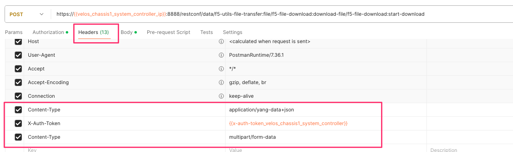
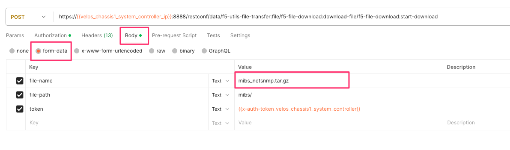
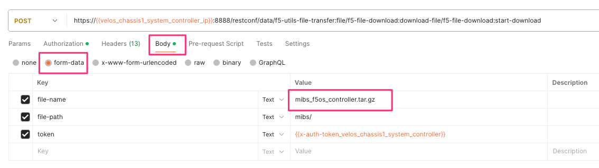
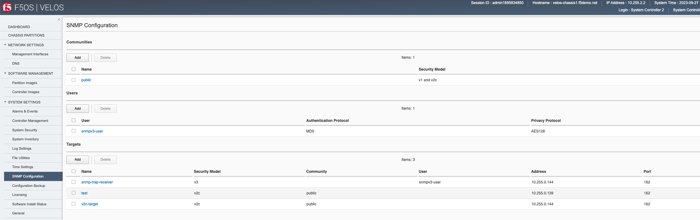
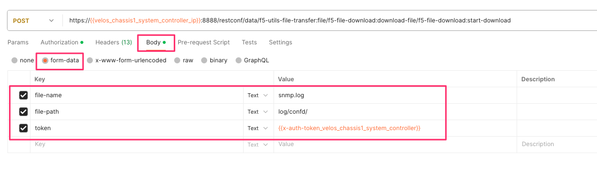

=======================================
VELOS F5OS SNMP Monitoring and Alerting
=======================================

SNMP support for F5OS will vary by release. In the initial F5OS-C 1.1.x versions, SNMP support was limited to **IF-MIB** support for the chassis partitions and SNMP trap support. F5OS v1.2.x added additional SNMP support, including Link Up/Down Traps for chassis partitions, and support for **IF-MIB**, **EtherLike-MIB**, and the **PLATFORM-STATS-MIB**. F5OS-C 1.5.x added additional SNMP MIB and trap coverage and F5OS-C 1.6.0 added SNMPv3 support. The **F5-PLATFORM-STATS-MIB** and **F5-OS-SYSTEM-MIB** were not supported on the system controllers until F5OS-C 1.6.0.

As of F5OS-C 1.8.0 the list of SNMP MIBs available are as follows:

**VELOS System Controller MIBs**

F5OS Controller MIBs:

- F5-ALERT-DEF-MIB
- F5-COMMON-SMI-MIB
- F5-CTRLR-ALERT-NOTIF-MIB
- F5-PLATFORM-STATS-MIB
- F5-OS-SYSTEM-MIB

NetSNMP MIBs System Controller:

- EtherLike-MIB
- HOST-RESOURCES-MIB
- IANAifType-MIB
- IF-MIB
- IPV6-TC
- RFC1213-MIB
- SNMP-COMMUNITY-MIB
- SNMP-FRAMEWORK-MIB
- SNMP-MPD-MIB
- SNMP-NOTIFICATION-MIB
- SNMP-TARGET-MIB
- SNMP-USER-BASED-SM-MIB
- SNMP-VIEW-BASED-ACM-MIB
- SNMPv2-CONF
- SNMPv2-MIB
- SNMPv2-SMI
- SNMPv2-TC
- TRANSPORT-ADDRESS-MIB

**VELOS Chassis Partition MIBs**

F5OS Chassis Partition MIBs:

- F5-PLATFORM-STATS-MIB
- F5-PARTITION-ALERT-NOTIF-MIB
- F5-OS-TENANT-MIB
- F5-OS-SYSTEM-MIB
- F5-OS-PLATFORM-SMI-MIB
- F5-OS-LLDP-MIB
- F5-COMMON-SMI-MIB
- F5-ALERT-DEF-MIB

NetSNMP MIBs Chassis Partition:

- EtherLike-MIB
- HOST-RESOURCES-MIB
- IANAifType-MIB
- IF-MIB
- IPV6-TC
- RFC1213-MIB
- SNMP-COMMUNITY-MIB
- SNMP-FRAMEWORK-MIB
- SNMP-MPD-MIB
- SNMP-NOTIFICATION-MIB
- SNMP-TARGET-MIB
- SNMP-USER-BASED-SM-MIB
- SNMP-VIEW-BASED-ACM-MIB
- SNMPv2-CONF
- SNMPv2-MIB
- SNMPv2-SMI
- SNMPv2-TC
- TRANSPORT-ADDRESS-MIB

Downloading MIBs
================

SNMP MIBs can be downloaded directly from the F5OS layer starting in F5OS-C v1.5.x. 

Downloading MIBs via webUI
--------------------------

From the webUI of the system controller, you can go to the **System Settings > File Utilities** page. Then, from the **Base Directory** drop down box select the **mibs** directory to download the MIB files. There are two separate MIB files: NetSNMP and F5OS MIBs for the controller. Download both MIB files and extract them to see the individual MIB files.

.. image:: images/velos_monitoring_snmp/image1.png
  :align: center
  :scale: 70%

You can then download the F5OS controller MIBS and the standard Net SNMP MIBS as seen above. Repeat the same process on one of the chassis partitions to download the chassis partition MIBs.

.. image:: images/velos_monitoring_snmp/image2.png
  :align: center
  :scale: 70%

Uploading MIBs to a Remote Server via CLI
-----------------------------------------

From the CLI, use the **file export** command to transfer the MIB files to a remote server. First, list the MIB files using the **file list** command as seen below.

.. code-block:: bash

    syscon-1-active# file list path mibs/
    entries {
        name mibs_f5os_controller.tar.gz
        date Thu Jan 25 07:29:49 UTC 2024
        size 7.2KB
    }
    entries {
        name mibs_netsnmp.tar.gz
        date Thu Jan 25 07:29:49 UTC 2024
        size 110KB
    }
    syscon-1-active#

To upload each of the files to a remote HTTPS server use the following command. You can also upload using SCP or SFTP by using the proper protocol option.

.. code-block:: bash

    syscon-1-active# file export local-file mibs/mibs_f5os_controller.tar.gz remote-host 10.255.0.142 remote-file /upload/upload.php username corpuser insecure
    Value for 'password' (<string>): ********
    result File transfer is initiated.(mibs_f5os_controller.tar.gz)
    syscon-1-active#

Repeat the same API call but change the filename to the **mibs_netsnmp.tar.gz** file. 

.. code-block:: bash

    syscon-1-active# file export local-file mibs/mibs_netsnmp.tar.gz remote-host 10.255.0.142 remote-file /upload/upload.php username corpuser insecure
    Value for 'password' (<string>): ********
    result File transfer is initiated.(mibs_netsnmp.tar.gz)
    syscon-1-active#

To get the chassis partition MIBs repeat the same steps on one of your chassis partitions to get the file **mibs_f5os_partition.tar.gz**.

Downloading MIBs via API
--------------------------

You can utilize the F5OS API to download the MIB files directly to a client machine, or to upload to a remote server over HTTPS, SCP, or SFTP. First, list the contents of the **mibs/** directory on the VELOS system controller using the following API call to get the filenames.

.. code-block:: bash

    POST https://{{velos_chassis1_system_controller_ip}}:8888/restconf/data/f5-utils-file-transfer:file/list

In the body of the API call add the following:

.. code-block:: json

    {
    "f5-utils-file-transfer:path": "mibs/"
    }

This will list the contents of the mibs directory as seen below.

.. code-block:: json

    {
        "f5-utils-file-transfer:output": {
            "entries": [
                {
                    "name": "mibs_f5os_controller.tar.gz",
                    "date": "Thu Jan 25 07:29:49 UTC 2024",
                    "size": "7.2KB"
                },
                {
                    "name": "mibs_netsnmp.tar.gz",
                    "date": "Thu Jan 25 07:29:49 UTC 2024",
                    "size": "110KB"
                }
            ]
        }
    }

You'll notice there are two separate MIB files, one is for Enterprise MIBs, while the other is for F5 specific MIBs. You'll need to download both files and add them to your SNMP manager. Below are example API calls to download each of the SNMP MIB files.

.. code-block:: bash

    POST https://{{velos_chassis1_system_controller_ip}}:8888/restconf/data/f5-utils-file-transfer:file/f5-file-download:download-file/f5-file-download:start-download

For the **Headers** section of the Postman request, be sure to add the following headers:

If you are using Postman, in the body of the API call select **Body**, then select **form-data**. Then enter the **file-name**, **path**, and **token** as seen below. 

Repeat the same process for the other MIB file.

If you are using Postman, instead of clicking **Send**, click on the arrow next to Send, and then select **Send and Download**. You will then be prompted to save the file to your local file system.

Exporting MIBs to a Remote Server via the API
---------------------------------------------

To copy the SNMP MIB files from VELOS to a remote HTTPS server use the following API call:

.. code-block:: bash

    POST https://{{velos_chassis1_system_controller_ip}}:8888/restconf/data/f5-utils-file-transfer:file/export

In the body of the API call, add the remote server info and local file you want to export.

.. code-block:: json

    {
        "f5-utils-file-transfer:insecure": "",
        "f5-utils-file-transfer:protocol": "https",
        "f5-utils-file-transfer:username": "corpuser",
        "f5-utils-file-transfer:password": "password",
        "f5-utils-file-transfer:remote-host": "10.255.0.142",
        "f5-utils-file-transfer:remote-file": "/upload/upload.php",
        "f5-utils-file-transfer:local-file": "mibs/mibs_f5os_controller.tar.gz"
    }
    
You can then check on the status of the export via the following API call:

.. code-block:: bash

    POST https://{{velos_chassis1_system_controller_ip}}:8888/api/data/f5-utils-file-transfer:file/transfer-status

The output will show the status of the file export.

.. code-block:: json

    {
        "f5-utils-file-transfer:output": {
            "result": "\nS.No.|Operation  |Protocol|Local File Path                                             |Remote Host         |Remote File Path                                            |Status            |Time                \n1    |Export file|HTTPS   |mibs/mibs_f5os_controller.tar.gz.gz                               |10.255.0.142        |/upload/upload.php                                          |         Completed|Thu Jan 20 05:11:44 2022"
        }
    }

Repeat the same steps to download the other MIB file. Then repeat the same steps to download the chassis partition MIB from one of your chassis partitions.

Adding Allowed IPs for SNMP
===========================

Adding Allowed IPs for SNMP via CLI
-----------------------------------

By default, SNMP queries are not allowed into the F5OS platform layer. Before enabling SNMP, you'll need to open up the out-of-band management port on F5OS-C (on both the system controller and on all the chassis partitions) to allow SNMP queries from particular SNMP management endpoints. Below is an example of allowing any SNMP endpoint at 10.255.0.0 (prefix length of 24) to query the F5OS layer on port 161. The allowed-ip functionality is added in F5OS-C 1.6.0.

.. code-block:: bash

    syscon-1-active(config)# system allowed-ips allowed-ip snmp config ipv4 address 10.255.0.0 prefix-length 24 port 161
    syscon-1-active(config-allowed-ip-snmp)# commit
    Commit complete.
    syscon-1-active(config-allowed-ip-snmp)# 

Currently you can add one IP address/port pair per **allowed-ip** name with an optional prefix length to specify a CIDR block containing multiple addresses. If you require more than one non-contiguous IP address, you can add it under another name as seen below. 

.. code-block:: bash

    syscon-1-active(config)# system allowed-ips allowed-ip SNMP-144 config ipv4 address 10.255.0.144 port 161 
    syscon-1-active(config-allowed-ip-SNMP-144)# commit
    Commit complete.

    syscon-1-active(config-allowed-ip-SNMP-144)# system allowed-ips allowed-ip SNMP-145 config ipv4 address 10.255.2.145 port 161 
    syscon-1-active(config-allowed-ip-SNMP-145)# commit
    Commit complete.
    syscon-1-active(config-allowed-ip-SNMP-145)#

Adding Allowed IPs for SNMP via API
-----------------------------------

By default, SNMP queries are not allowed into the F5OS layer. Before enabling SNMP. you'll need to open up the out-of-band management port on F5OS-C to allow SNMP queries (on both the system controller and on all the chassis partitions). Below is an example of allowing multiple SNMP endpoints to access SNMP on the system on port 161.

.. code-block:: bash

    POST https://{{velos_chassis1_system_controller_ip}}:8888/restconf/data/openconfig-system:system/f5-allowed-ips:allowed-ips

Within the body of the API call, specific IP address/port combinations can be added under a given name. In the current release, you are limited to one IP address/port per name. 

.. code-block:: json

    {
        "allowed-ip": [
            {
                "name": "SNMP",
                "config": {
                    "ipv4": {
                        "address": "10.255.0.143",
                        "port": 161,
                        "prefix-length": 32
                    }
                }
            },
            {
                "name": "SNMP-WIN-10",
                "config": {
                    "ipv4": {
                        "address": "10.255.0.144",
                        "port": 161,
                        "prefix-length": 32
                    }
                }
            },
            {
                "name": "SNMP2",
                "config": {
                    "ipv4": {
                        "address": "10.254.0.0",
                        "port": 161,
                        "prefix-length": 16
                    }
                }
            }
        ]
    }

To view the allowed IPs in the API, use the following call.

.. code-block:: bash

    GET https://{{velos_chassis1_system_controller_ip}}:8888/restconf/data/openconfig-system:system/f5-allowed-ips:allowed-ips

The output will show the previously configured allowed-ip's.

.. code-block:: json

    {
        "f5-allowed-ips:allowed-ips": {
            "allowed-ip": [
                {
                    "name": "SNMP",
                    "config": {
                        "ipv4": {
                            "address": "10.255.0.143",
                            "prefix-length": 32,
                            "port": 161
                        }
                    }
                },
                {
                    "name": "SNMP-WIN-10",
                    "config": {
                        "ipv4": {
                            "address": "10.255.0.144",
                            "prefix-length": 32,
                            "port": 161
                        }
                    }
                },
                {
                    "name": "SNMP2",
                    "config": {
                        "ipv4": {
                            "address": "10.254.0.0",
                            "prefix-length": 16,
                            "port": 161
                        }
                    }
                }
            ]
        }
    }

Adding Allowed IPs for SNMP via webUI
-----------------------------------

Configuration of the **allowed-ip** functionality was added to the webUI in F5OS-C 1.6.0. By default, SNMP queries are not allowed into the F5OS platform layer. Before enabling SNMP, you'll need to open up the out-of-band management port on F5OS-C (on both the system controller and on all the chassis partitions) to allow SNMP queries from particular SNMP management endpoints. Below is an example of allowing a few SNMP endpoints to query the F5OS layer on port 161.

.. image:: images/velos_monitoring_snmp/imagesnmpwebui.png
  :align: center
  :scale: 70%

Adding Interface and LAG Descriptions
=====================================

It is highly recommended that you put interface descriptions in your configuration, so that they will show up in the description field when using SNMP polling.

Adding Out-of-Band Interface and LAG Descriptions via CLI
---------------------------------------------------------

To add descriptions for the out-of-band management ports on the system controllers in the CLI, follow the examples below. 

.. code-block:: bash

    syscon-1-active(config)# interfaces interface 1/mgmt0 config description "Interface 1/mgmt0"
    syscon-1-active(config-interface-1/mgmt0)# exit
    syscon-1-active(config)# interfaces interface 2/mgmt0 config description "Interface 2/mgmt0"
    syscon-1-active(config-interface-2/mgmt0)# exit
    syscon-1-active(config)# commit
    Commit complete.
    syscon-1-active(config)#

Adding Out-of-Band Interface and LAG Descriptions via API
---------------------------------------------------------

To add descriptions for the out-of-band management ports on the system controllers via the API, follow the examples below. Use the following PATCH command to update the descriptions for both 1/mgmt0 and 2/mgmt0 out-of-band interfaces.

.. code-block:: bash

    PATCH https://{{velos_chassis1_system_controller_ip}}:8888/restconf/data/

In the body of the API call, add the descriptions as seen below.

.. code-block:: json

    {
        "openconfig-interfaces:interfaces": {
            "interface": [
                {
                    "name": "1/mgmt0",
                    "config": {
                        "description": "1/mgmt0"
                    }
                },
                {
                    "name": "2/mgmt0",
                    "config": {
                        "description": "2/mgmt0"
                    }
                }
            ]
        }
    }

You can then issue the following GET API call to view each interfaces configuration including the new description. Note, the interface name must be encoded in Postman because of the special characters. The %2F will represent the slash in the interface name.

.. code-block:: bash

    GET https://{{velos_chassis1_system_controller_ip}}:8888/restconf/data/openconfig-interfaces:interfaces/interface=1%2Fmgmt0/config

You should see a response like the one below.

.. code-block:: json

    {
        "openconfig-interfaces:config": {
            "name": "1/mgmt0",
            "type": "iana-if-type:ethernetCsmacd",
            "description": "1/mgmt0",
            "enabled": true
        }
    }

You can then issue the same command with a different interface name for the second management interface.

.. code-block:: bash

    GET https://{{velos_chassis1_system_controller_ip}}:8888/restconf/data/openconfig-interfaces:interfaces/interface=2%2Fmgmt0/config

You should see a response similar to the one below.

.. code-block:: json

    {
        "openconfig-interfaces:config": {
            "name": "2/mgmt0",
            "type": "iana-if-type:ethernetCsmacd",
            "description": "2/mgmt0",
            "enabled": true
        }
    }

You cannot currently set the interface descriptions for the out-of-band management interfaces via the webUI. You'll need to use either the API or CLI.

Adding Interface and LAG Descriptions for Chassis Partitions via CLI
--------------------------------------------------------------------

Adding descriptions to the interfaces will make it easier to determine which interface you are monitoring when using SNMP. Below are examples of adding interface descriptions via CLI to interfaces within a chassis partition. You should repeat this for each chassis partition and all interfaces.

.. code-block:: bash

    prod2-2(config)# interfaces interface 1/1.0 config description "Interface 1/1.0"
    prod2-2(config-interface-1/1.0)# exit
    prod2-2(config)# interfaces interface 1/2.0 config description "Interface 1/2.0"
    prod2-2(config-interface-1/2.0)# exit
    prod2-2(config)# interfaces interface 2/1.0 config description "Interface 2/1.0"
    prod2-2(config-interface-2/1.0)# exit
    prod2-2(config)# interfaces interface 2/2.0 config description "Interface 2/2.0"
    prod2-2(config-interface-2/2.0)# exit
    prod2-2(config)# commit
    Commit complete.
    prod2-2(config)#

If you are using Link Aggregation Groups (LAGs), then you can also add interface descriptions to the LAG interfaces within each chassis partition:

.. code-block:: bash

    prod2-2(config)# interfaces interface Arista config description "Interface Arista LAG"
    prod2-2(config-interface-Arista)# exit
    prod2-2(config)# interfaces interface HA-Interconnect config description "Interface HA-Interconnect LAG"
    prod2-2(config-interface-HA-Interconnect)# exit 
    prod2-2(config)# commit
    Commit complete.
    prod2-2(config)# 

To view the interface descriptions, use the **show running-config interfaces** command.

.. code-block:: bash

    prod2-2# show running-config interfaces          
    interfaces interface 1/1.0
    config type              ethernetCsmacd
    config description       "Interface 1/1.0"
    config enabled
    config forward-error-correction auto
    ethernet config aggregate-id HA-Interconnect
    !
    interfaces interface 1/2.0
    config type              ethernetCsmacd
    config description       "Interface 1/2.0"
    config enabled
    config forward-error-correction auto
    ethernet config aggregate-id Arista
    !
    interfaces interface 2/1.0
    config type              ethernetCsmacd
    config description       "Interface 2/1.0"
    config enabled
    config forward-error-correction auto
    ethernet config aggregate-id Arista
    !
    interfaces interface 2/2.0
    config type              ethernetCsmacd
    config description       "Interface 2/2.0"
    config enabled
    config forward-error-correction auto
    ethernet config aggregate-id HA-Interconnect
    !
    interfaces interface Arista
    config type ieee8023adLag
    config description "Interface Arista LAG"
    aggregation config lag-type LACP
    aggregation config distribution-hash src-dst-ipport
    aggregation switched-vlan config trunk-vlans [ 3010 3011 ]
    !
    interfaces interface HA-Interconnect
    config type ieee8023adLag
    config description "Interface HA-Interconnect LAG"
    aggregation config lag-type LACP
    aggregation config distribution-hash src-dst-ipport
    aggregation switched-vlan config trunk-vlans [ 500 501 502 503 510 511 ]
    !
    prod2-2#

Adding Interface and LAG Descriptions for Chassis Partitions via webUI
--------------------------------------------------------------------

You can also add interface descriptions for both interfaces and LAGs within the webUI. Go to the **Network Settings -> Interfaces** page and select an interface to modify.

.. image:: images/velos_monitoring_snmp/image4.png
  :align: center
  :scale: 70%

Then edit the description and **Save** the change, then repeat for all the other interfaces within that chassis partition. Then repeat for other chassis partitions.

.. image:: images/velos_monitoring_snmp/image5.png
  :align: center
  :scale: 70%

For Link Aggregation Groups go to the **Network Settings -> LAGs** page and select a LAG to modify.

.. image:: images/velos_monitoring_snmp/image6.png
  :align: center
  :scale: 70%

Then edit the description and **Save** the change, then repeat for all the other LAG interfaces within that chassis partition. Then repeat for other chassis partitions.

.. image:: images/velos_monitoring_snmp/image7.png
  :align: center
  :scale: 70%

Adding Interface and LAG Descriptions for Chassis Partitions via API
--------------------------------------------------------------------

To add descriptions for both the in-band interfaces and LAGs in the CLI, follow the examples below. The API example below is sent to the chassis partition IP address. 

.. code-block:: bash

    PATCH https://{{velos_chassis1_chassis_partition1_ip}}:8888/restconf/data/

Below is the proper formatting for the body of the API call. You will need to adjust to the number and type of interfaces to match what is in your chassis partition.

.. code-block:: json

   {
    "openconfig-interfaces:interfaces": {
        "interface": [
            {
                "name": "1/1.0",
                "config": {
                    "description": "VELOS Interface 1/1.0"
                }
            },
            {
                "name": "1/2.0",
                "config": {
                    "description": "VELOS Interface 1/2.0"
                }
            },
            {
                "name": "2/1.0",
                "config": {
                    "description": "VELOS Interface 2/1.0"
                }
            },
            {
                "name": "2/2.0",
                "config": {
                    "description": "VELOS Interface 2/2.0"
                }
            }
            ]
        }
    }

If Link Aggregation Groups (LAGs) are configured, descriptions should be added to the LAG interfaces as well.

.. code-block:: bash

    PATCH https://{{velos_chassis1_chassis_partition1_ip}}:8888/restconf/data/

The body of the API call should contain JSON data that includes the descriptions for each LAG.

.. code-block:: json

    {
        "openconfig-interfaces:interfaces": {
            "interface": [
                {
                    "name": "Arista",
                    "config": {
                        "description": "VELOS Arista LAG Interface"
                    }
                },
                {
                    "name": "HA-Interconnect",
                    "config": {
                        "description": "VELOS HA-Interconnect Interface"
                    }
                }
            ]
        }
    }

You may then view the LAG description via the following API call:

.. code-block:: bash

    GET https://{{velos_chassis1_chassis_partition1_ip}}:8888/restconf/data/openconfig-interfaces:interfaces
    

The output below will show the LAG descriptions as well as all the other interfaces.

.. code-block:: json

    {
        "openconfig-interfaces:interfaces": {
            "interface": [
                {
                    "name": "1/1.0",
                    "config": {
                        "name": "1/1.0",
                        "type": "iana-if-type:ethernetCsmacd",
                        "description": "VELOS Interface 1/1.0",
                        "enabled": true,
                        "f5-interface:forward-error-correction": "auto"
                    },
                    "state": {
                        "name": "1/1.0",
                        "type": "iana-if-type:ethernetCsmacd",
                        "mtu": 9600,
                        "enabled": true,
                        "oper-status": "UP",
                        "counters": {
                            "in-octets": "17514",
                            "in-unicast-pkts": "0",
                            "in-broadcast-pkts": "0",
                            "in-multicast-pkts": "135",
                            "in-discards": "0",
                            "in-errors": "0",
                            "in-fcs-errors": "0",
                            "out-octets": "33431490",
                            "out-unicast-pkts": "0",
                            "out-broadcast-pkts": "0",
                            "out-multicast-pkts": "256908",
                            "out-discards": "0",
                            "out-errors": "0"
                        },
                        "f5-interface:forward-error-correction": "auto",
                        "f5-lacp:lacp_state": "LACP_DOWN"
                    },
                    "openconfig-if-ethernet:ethernet": {
                        "config": {
                            "openconfig-if-aggregate:aggregate-id": "HA-Interconnect"
                        },
                        "state": {
                            "port-speed": "openconfig-if-ethernet:SPEED_100GB",
                            "hw-mac-address": "00:94:a1:8e:d0:00",
                            "counters": {
                                "in-mac-control-frames": "0",
                                "in-mac-pause-frames": "0",
                                "in-oversize-frames": "0",
                                "in-jabber-frames": "0",
                                "in-fragment-frames": "0",
                                "in-8021q-frames": "0",
                                "in-crc-errors": "0",
                                "out-mac-control-frames": "0",
                                "out-mac-pause-frames": "0",
                                "out-8021q-frames": "0"
                            },
                            "f5-if-ethernet:flow-control": {
                                "rx": "on"
                            }
                        }
                    }
                },
                {
                    "name": "1/2.0",
                    "config": {
                        "name": "1/2.0",
                        "type": "iana-if-type:ethernetCsmacd",
                        "description": "VELOS Interface 1/2.0",
                        "enabled": true,
                        "f5-interface:forward-error-correction": "auto"
                    },
                    "state": {
                        "name": "1/2.0",
                        "type": "iana-if-type:ethernetCsmacd",
                        "mtu": 9600,
                        "enabled": true,
                        "oper-status": "UP",
                        "counters": {
                            "in-octets": "34222124",
                            "in-unicast-pkts": "6",
                            "in-broadcast-pkts": "5",
                            "in-multicast-pkts": "258896",
                            "in-discards": "0",
                            "in-errors": "0",
                            "in-fcs-errors": "0",
                            "out-octets": "31820928",
                            "out-unicast-pkts": "0",
                            "out-broadcast-pkts": "0",
                            "out-multicast-pkts": "248601",
                            "out-discards": "0",
                            "out-errors": "0"
                        },
                        "f5-interface:forward-error-correction": "auto",
                        "f5-lacp:lacp_state": "LACP_UP"
                    },
                    "openconfig-if-ethernet:ethernet": {
                        "config": {
                            "openconfig-if-aggregate:aggregate-id": "Arista"
                        },
                        "state": {
                            "port-speed": "openconfig-if-ethernet:SPEED_100GB",
                            "hw-mac-address": "00:94:a1:8e:d0:01",
                            "counters": {
                                "in-mac-control-frames": "0",
                                "in-mac-pause-frames": "0",
                                "in-oversize-frames": "0",
                                "in-jabber-frames": "0",
                                "in-fragment-frames": "0",
                                "in-8021q-frames": "0",
                                "in-crc-errors": "0",
                                "out-mac-control-frames": "0",
                                "out-mac-pause-frames": "0",
                                "out-8021q-frames": "0"
                            },
                            "f5-if-ethernet:flow-control": {
                                "rx": "on"
                            }
                        }
                    }
                },
                {
                    "name": "2/1.0",
                    "config": {
                        "name": "2/1.0",
                        "type": "iana-if-type:ethernetCsmacd",
                        "description": "VELOS Interface 2/1.0",
                        "enabled": true,
                        "f5-interface:forward-error-correction": "auto"
                    },
                    "state": {
                        "name": "2/1.0",
                        "type": "iana-if-type:ethernetCsmacd",
                        "mtu": 9600,
                        "enabled": true,
                        "oper-status": "UP",
                        "counters": {
                            "in-octets": "51072261",
                            "in-unicast-pkts": "9",
                            "in-broadcast-pkts": "18752",
                            "in-multicast-pkts": "383463",
                            "in-discards": "0",
                            "in-errors": "1",
                            "in-fcs-errors": "1",
                            "out-octets": "31832708",
                            "out-unicast-pkts": "0",
                            "out-broadcast-pkts": "0",
                            "out-multicast-pkts": "248701",
                            "out-discards": "0",
                            "out-errors": "0"
                        },
                        "f5-interface:forward-error-correction": "auto",
                        "f5-lacp:lacp_state": "LACP_UP"
                    },
                    "openconfig-if-ethernet:ethernet": {
                        "config": {
                            "openconfig-if-aggregate:aggregate-id": "Arista"
                        },
                        "state": {
                            "port-speed": "openconfig-if-ethernet:SPEED_100GB",
                            "hw-mac-address": "00:94:a1:8e:d0:80",
                            "counters": {
                                "in-mac-control-frames": "0",
                                "in-mac-pause-frames": "0",
                                "in-oversize-frames": "0",
                                "in-jabber-frames": "0",
                                "in-fragment-frames": "1",
                                "in-8021q-frames": "0",
                                "in-crc-errors": "0",
                                "out-mac-control-frames": "0",
                                "out-mac-pause-frames": "0",
                                "out-8021q-frames": "0"
                            },
                            "f5-if-ethernet:flow-control": {
                                "rx": "on"
                            }
                        }
                    }
                },
                {
                    "name": "2/2.0",
                    "config": {
                        "name": "2/2.0",
                        "type": "iana-if-type:ethernetCsmacd",
                        "description": "VELOS Interface 2/2.0",
                        "enabled": true,
                        "f5-interface:forward-error-correction": "auto"
                    },
                    "state": {
                        "name": "2/2.0",
                        "type": "iana-if-type:ethernetCsmacd",
                        "mtu": 9600,
                        "enabled": true,
                        "oper-status": "UP",
                        "counters": {
                            "in-octets": "33026022",
                            "in-unicast-pkts": "0",
                            "in-broadcast-pkts": "0",
                            "in-multicast-pkts": "256851",
                            "in-discards": "0",
                            "in-errors": "0",
                            "in-fcs-errors": "0",
                            "out-octets": "33430966",
                            "out-unicast-pkts": "0",
                            "out-broadcast-pkts": "0",
                            "out-multicast-pkts": "256916",
                            "out-discards": "0",
                            "out-errors": "0"
                        },
                        "f5-interface:forward-error-correction": "auto",
                        "f5-lacp:lacp_state": "LACP_UP"
                    },
                    "openconfig-if-ethernet:ethernet": {
                        "config": {
                            "openconfig-if-aggregate:aggregate-id": "HA-Interconnect"
                        },
                        "state": {
                            "port-speed": "openconfig-if-ethernet:SPEED_100GB",
                            "hw-mac-address": "00:94:a1:8e:d0:81",
                            "counters": {
                                "in-mac-control-frames": "0",
                                "in-mac-pause-frames": "0",
                                "in-oversize-frames": "0",
                                "in-jabber-frames": "0",
                                "in-fragment-frames": "0",
                                "in-8021q-frames": "0",
                                "in-crc-errors": "0",
                                "out-mac-control-frames": "0",
                                "out-mac-pause-frames": "0",
                                "out-8021q-frames": "0"
                            },
                            "f5-if-ethernet:flow-control": {
                                "rx": "on"
                            }
                        }
                    }
                },
                {
                    "name": "Arista",
                    "config": {
                        "name": "Arista",
                        "type": "iana-if-type:ieee8023adLag",
                        "description": "Interface Arista LAG",
                        "enabled": true
                    },
                    "state": {
                        "name": "Arista",
                        "type": "iana-if-type:ieee8023adLag",
                        "mtu": 9600,
                        "enabled": true,
                        "oper-status": "UP"
                    },
                    "openconfig-if-aggregate:aggregation": {
                        "config": {
                            "lag-type": "LACP",
                            "f5-if-aggregate:distribution-hash": "src-dst-ipport"
                        },
                        "state": {
                            "lag-type": "LACP",
                            "lag-speed": 200,
                            "f5-if-aggregate:distribution-hash": "src-dst-ipport",
                            "f5-if-aggregate:members": {
                                "member": [
                                    {
                                        "member-name": "1/2.0",
                                        "member-status": "UP"
                                    },
                                    {
                                        "member-name": "2/1.0",
                                        "member-status": "UP"
                                    }
                                ]
                            },
                            "f5-if-aggregate:mac-address": "00:94:a1:8e:d0:19",
                            "f5-if-aggregate:lagid": 1
                        },
                        "openconfig-vlan:switched-vlan": {
                            "config": {
                                "trunk-vlans": [
                                    3010,
                                    3011
                                ]
                            }
                        }
                    }
                },
                {
                    "name": "HA-Interconnect",
                    "config": {
                        "name": "HA-Interconnect",
                        "type": "iana-if-type:ieee8023adLag",
                        "description": "Interface HA-Interconnect LAG",
                        "enabled": true
                    },
                    "state": {
                        "name": "HA-Interconnect",
                        "type": "iana-if-type:ieee8023adLag",
                        "mtu": 9600,
                        "enabled": true,
                        "oper-status": "UP"
                    },
                    "openconfig-if-aggregate:aggregation": {
                        "config": {
                            "lag-type": "LACP",
                            "f5-if-aggregate:distribution-hash": "src-dst-ipport"
                        },
                        "state": {
                            "lag-type": "LACP",
                            "lag-speed": 100,
                            "f5-if-aggregate:distribution-hash": "src-dst-ipport",
                            "f5-if-aggregate:members": {
                                "member": [
                                    {
                                        "member-name": "1/1.0",
                                        "member-status": "DOWN"
                                    },
                                    {
                                        "member-name": "2/2.0",
                                        "member-status": "UP"
                                    }
                                ]
                            },
                            "f5-if-aggregate:mac-address": "00:94:a1:8e:d0:1a",
                            "f5-if-aggregate:lagid": 2
                        },
                        "openconfig-vlan:switched-vlan": {
                            "config": {
                                "trunk-vlans": [
                                    500,
                                    501,
                                    502,
                                    503,
                                    510,
                                    511
                                ]
                            }
                        }
                    }
                }
            ]
        }
    }

Enabling SNMP
=============

You can enable SNMP individually at the system controller layer, and for each chassis partition.

Enabling SNMP via CLI prior to F5OS-C 1.5.x
-------------------------------------------

Setting up SNMP can be done from the CLI by enabling an SNMP community such as **public**. Below is an example of enabling SNMP monitoring on a chassis partition, but the same configuration can be done on the system controller as well. The configuration in releases prior to F5OS-C 1.5.x is somewhat complicated and has been improved in F5OS-C 1.5.x and later. SNMPv3 support has also been added in F5OS-C 1.5.0. We recommend you use the later F5OS-C releases and the examples in the next section. This section is provided for reference for those that may still be running earlier versions of F5OS-C.

To enable SNMP on F5OS-C 1.4.x and earlier use the following CLI commands. If you are running F5OS-C 1.5.0 or later skip this section and move onto the next section.

You can configure the SNMP system parameters including the System Contact, System Location, and System Name as seen below:

.. code-block:: bash

    Production-1(config)# SNMPv2-MIB system sysContact jim@f5.com sysLocation Boston sysName VELOS-Production
    Production-1(config)# commit

Enabling SNMP can be done from the CLI by configuring the public SNMP community, and then configuring a Security Access Group. Below is an example of enabling SNMP monitoring at the F5OS layer. F5OS only supports read-only access for SNMP monitoring.    

.. code-block:: bash

    Production-1# config
    Entering configuration mode terminal
    Production-1(config)# SNMP-COMMUNITY-MIB snmpCommunityTable snmpCommunityEntry public snmpCommunityName public snmpCommunitySecurityName public
    Production-1(config-snmpCommunityEntry-public)# exit
    Production-1(config)# commit
    Commit complete.

To configure a Security Group for both SNMPv1 and SNMPv2c.   
   
.. code-block:: bash   
   
    Production-1(config)# SNMP-VIEW-BASED-ACM-MIB vacmSecurityToGroupTable vacmSecurityToGroupEntry 2 public vacmGroupName read-access
    Production-1(config-vacmSecurityToGroupEntry-2/public)# exit
    Production-1(config)# SNMP-VIEW-BASED-ACM-MIB vacmSecurityToGroupTable vacmSecurityToGroupEntry 1 public vacmGroupName read-access
    Production-1(config-vacmSecurityToGroupEntry-1/public)# exit
    Production-1(config)# commit
    Commit complete.

Enabling SNMP via CLI for Releases F5OS-C 1.5.0 and Later
---------------------------------------------------------

You can configure the SNMP System parameters including the **System Contact**, **System Location**, and **System Name** as seen below:

.. code-block:: bash

    Production-1(config)# SNMPv2-MIB system sysContact jim@f5.com sysLocation Boston sysName VELOS-Production
    Production-1(config)# commit

SNMP configuration was only available in the CLI and API prior to F5OS-C 1.5.0, and the CLI configuration was not intuitive. F5OS-C 1.5.0 has improved and streamlined SNMP configuration in the CLI and then configuration via the webUI was also added in F5OS-C 1.5.0. The example below is utilizing the new and improved SNMP CLI configuration for VELOS systems running F5OS-C 1.5.0 or later. 

Enabling SNMP can be done from the CLI by configuring the **public** SNMP community, and then configuring a **security-model**. The command below sets up an SNMP community of **public** with v1 and v2c security models. You may choose to enable both of these security models or only one.

.. code-block:: bash

    Production-1(config)# system snmp communities community public config security-model [ v1 v2c ]
    Production-1(config-community-public)# commit
    Commit complete.
    Production-1(config-community-public)# 

You can then display the SNMP community configuration using the **show system snmp** command.

.. code-block:: bash

    Production-1(config)# do show system snmp 
    system snmp engine-id state engine-id 80:00:2f:f4:03:00:94:a1:8e:d0:ff
    system snmp engine-id state type mac
                    SECURITY    
    NAME    NAME    MODEL       
    ----------------------------
    public  public  [ v1 v2c ]  

    Production-1(config)#

You may also configure SNMP users for SNMPv3 support, since SNMPv3 is a user-based security model. This provides additional support for authentication and privacy protocols. Authentication protocols of **md5**, **sha**, or **none** are supported. For privacy protocols **aes**, **des**, or **none** are supported. You'll then be prompted to enter the privacy-password.

.. code-block:: bash

    Production-1(config)# system snmp users user snmpv3user config authentication-protocol md5 privacy-protocol aes privacy-password 
    (<string, min: 8 chars, max: 32 chars>): **************
    Production-1(config-user-snmpv3user)# commit
    Commit complete.
    Production-1(config-user-snmpv3user)#

You may display the SNMP user configuration by entering the command **show system snmp users**.

.. code-block:: bash

    Production-1(config)# do show system snmp users
                            AUTHENTICATION  PRIVACY   
    NAME        NAME        PROTOCOL        PROTOCOL  
    --------------------------------------------------
    snmpv3user  snmpv3user  md5             aes       

    Production-1(config)# 

Enabling SNMP via webUI 
-------------------------

SNMP **Communities**, **Users**, and **Targets** can be setup on the **System Settings -> SNMP Configuration** page. Here, an admin can enable access for SNMP monitoring of the system through either communities for SNMPv1/v2c, or through users for SNMPv3. In addition, remote SNMP Trap receiver locations can be enabled for alerting. 

Enabling SNMP via API 
-------------------------

SNMP **Communities**, **Users**, and **Targets** can be setup via the API. An admin can enable access for SNMP monitoring of the system through either communities for SNMPv1/v2c, or through users for SNMPv3. In addition, remote SNMP Trap receiver locations can be enabled for alerting. 

To configure the SNMP system parameters via API use the following API call:

.. code-block:: bash

    PATCH https://{{velos_chassis1_system_controller_ip}}:8888/restconf/data/SNMPv2-MIB:SNMPv2-MIB/system

In the body of the API add the SNMP sysContact, sysName, and sysLocation.

.. code-block:: json

    {
    "SNMPv2-MIB:system": {
        "sysContact": "jim@f5.com",
        "sysName": "velos-chassis1.f5demo.net",
        "sysLocation": "Boston"
        }
    }

To view the SNMP system parameters use the following API call:

.. code-block:: bash

    GET https://{{velos_chassis1_system_controller_ip}}:8888/restconf/data/SNMPv2-MIB:SNMPv2-MIB/system

A response similar to the one below will be displayed.

.. code-block:: json

    {
    "SNMPv2-MIB:system": {
        "sysDescr": "F5 VELOS-CX410 : Linux 3.10.0-1160.71.1.F5.1.el7_8.x86_64 : System controller services version 1.8.0-9671",
        "sysObjectID": "1.3.6.1.4.1.12276.1.3.1.5",
        "sysUpTime": 50894041,
        "sysContact": "jim@f5.com",
        "sysName": "velos-chassis1.f5demo.net",
        "sysLocation": "Boston",
        "sysServices": 72,
        "sysORLastChange": 0
        }
    }

To create an SNMPv3 user use the following API call.

.. code-block:: bash

    PATCH https://{{velos_chassis1_system_controller_ip}}:8888/restconf/data/openconfig-system:system/f5-system-snmp:snmp

Within the body of the API call, add the following JSON to add a user.

.. code-block:: bash

    {
        "f5-system-snmp:snmp": {
            "users": {
                "user": [
                    {
                        "name": "snmpv3-user3",
                        "config": {
                            "name": "snmpv3-user3",
                            "authentication-protocol": "md5",
                            "f5-system-snmp:authentication-password": "{{velos_system_controller_password}}",
                            "privacy-protocol": "aes",
                            "f5-system-snmp:privacy-password": "{{velos_system_controller_password}}"
                        }
                    }
                ]
            }
        }
    }

If you are using SNMPv1/v2c then communities are the means of access. You can create an SNMP community via the API with the following API call: 

.. code-block:: bash

    PATCH https://{{velos_chassis1_system_controller_ip}}:8888/restconf/data/openconfig-system:system/f5-system-snmp:snmp

In the body of the API call, add the community name you want to use to allow access to SNMP on the VELOS system. In this case a community called **public2** is being used to enable access.

.. code-block:: bash

    {
        "f5-system-snmp:snmp": {
            "communities": {
                "community": [
                    {
                        "name": "public2",
                        "config": {
                            "name": "public2",
                            "security-model": [
                                "v1",
                                "v2c"
                            ]
                        }
                    }
                ]
            }
        }
    }    

To view the current SNMP configuration, issue the following API call:

.. code-block:: bash

    GET https://{{velos_chassis1_system_controller_ip}}:8888/restconf/data/openconfig-system:system/f5-system-snmp:snmp

The output should appear similar to the example below.

.. code-block:: bash

    {
        "f5-system-snmp:snmp": {
            "users": {
                "user": [
                    {
                        "name": "snmpv3-user",
                        "config": {
                            "name": "snmpv3-user",
                            "authentication-protocol": "md5",
                            "privacy-protocol": "aes"
                        },
                        "state": {
                            "name": "snmpv3-user",
                            "authentication-protocol": "md5",
                            "privacy-protocol": "aes"
                        }
                    },
                    {
                        "name": "snmpv3-user2",
                        "config": {
                            "name": "snmpv3-user2",
                            "authentication-protocol": "md5",
                            "privacy-protocol": "aes"
                        },
                        "state": {
                            "name": "snmpv3-user2",
                            "authentication-protocol": "md5",
                            "privacy-protocol": "aes"
                        }
                    }
                ]
            },
            "targets": {
                "target": [
                    {
                        "name": "snmp-trap-receiver",
                        "config": {
                            "name": "snmp-trap-receiver",
                            "user": "snmpv3-user",
                            "ipv4": {
                                "address": "10.255.0.144",
                                "port": 162
                            }
                        },
                        "state": {
                            "name": "snmp-trap-receiver",
                            "user": "snmpv3-user",
                            "ipv4": {
                                "address": "10.255.0.144",
                                "port": 162
                            }
                        }
                    },
                    {
                        "name": "test",
                        "config": {
                            "name": "test",
                            "community": "public",
                            "security-model": "v2c",
                            "ipv4": {
                                "address": "10.255.0.139",
                                "port": 162
                            }
                        },
                        "state": {
                            "name": "test",
                            "community": "public",
                            "security-model": "v2c",
                            "ipv4": {
                                "address": "10.255.0.139",
                                "port": 162
                            }
                        }
                    },
                    {
                        "name": "v2c-target",
                        "config": {
                            "name": "v2c-target",
                            "community": "public",
                            "security-model": "v2c",
                            "ipv4": {
                                "address": "10.255.0.144",
                                "port": 162
                            }
                        },
                        "state": {
                            "name": "v2c-target",
                            "community": "public",
                            "security-model": "v2c",
                            "ipv4": {
                                "address": "10.255.0.144",
                                "port": 162
                            }
                        }
                    }
                ]
            },
            "communities": {
                "community": [
                    {
                        "name": "public",
                        "config": {
                            "name": "public",
                            "security-model": [
                                "v1",
                                "v2c"
                            ]
                        },
                        "state": {
                            "name": "public",
                            "security-model": [
                                "v1",
                                "v2c"
                            ]
                        }
                    }
                ]
            },
            "engine-id": {
                "config": {
                    "value": "mac"
                },
                "state": {
                    "engine-id": "80:00:2f:f4:03:00:94:a1:8e:d0:00",
                    "type": "mac"
                }
            }
        }
    }

Polling SNMP Endpoints
======================

Once SNMP is properly setup and allow-lists are enabled (in both the system controllers and chassis partitions), you can poll SNMP objects from remote endpoints. If you have an SNMP manager, it is recommended you download the appropriate MIBs from the VELOS chassis and compile them into you SNMP manager. Alternatively, you can use SNMP command line utilities from a remote client to validate the SNMP endpoints. You can then poll/query either the chassis partition or the system controller via SNMP to get stats from the system using the following SNMP OID's:

System
------

You can view system parameters such as SysDescr, sysObjectID, sysUptime, sysContact, sysName, sysLocation, sysServices, sysORLastChange, sysORTable, sysDateAndTime by SNMP walking the following OID.

**SNMP System OID: .1.3.6.1.2.1.1**

Example output:

.. code-block:: bash

    prompt% snmpwalk -ObenU -v2c -c public 10.255.2.3 .1.3.6.1.2.1.1     
    .1.3.6.1.2.1.1.1.0 = STRING: F5 VELOS-CX410 : Linux 3.10.0-1160.71.1.F5.1.el7_8.x86_64 : System controller services version 1.8.0-8738
    .1.3.6.1.2.1.1.2.0 = OID: .1.3.6.1.4.1.12276.1.3.1.5
    .1.3.6.1.2.1.1.3.0 = Timeticks: (25484697) 2 days, 22:47:26.97
    .1.3.6.1.2.1.1.4.0 = STRING: jim@f5.com
    .1.3.6.1.2.1.1.5.0 = STRING: velos-chassis1.f5demo.net
    .1.3.6.1.2.1.1.6.0 = STRING: Boston
    .1.3.6.1.2.1.1.7.0 = INTEGER: 72
    .1.3.6.1.2.1.1.8.0 = Timeticks: (0) 0:00:00.00
    prompt%

ifTable & ifXTable
------------------

You can poll the following SNMP OIDs to get detailed Interface stats for each physical port on the BX110 blades, and for Link Aggregation Groups that have been configured. Note, that you will only see interfaces and LAGs that are configured within the chassis partition you are monitoring. You will not have visibility into other chassis partition interfaces or LAGs unless you poll those chassis partitions directly. Below are the table views of the ifTable and ifXTable, you can poll individual interfaces if needed.

This MIB is supported on both the VELOS system controller and chassis partition layers.

**SNMP ifTable OID: .1.3.6.1.2.1.2.2**

Below is an example of the ifTable on the VELOS system controller.

.. code-block:: bash

    prompt % snmptable -v 2c  -c public -m ALL 10.255.2.3 ifTable                                
    SNMP table: IF-MIB::ifTable

    ifIndex ifDescr         ifType ifMtu    ifSpeed    ifPhysAddress ifAdminStatus ifOperStatus ifLastChange ifInOctets ifInUcastPkts ifInNUcastPkts ifInDiscards ifInErrors ifInUnknownProtos ifOutOctets ifOutUcastPkts ifOutNUcastPkts ifOutDiscards ifOutErrors ifOutQLen ifSpecific
    134217984       ? ethernetCsmacd     ? 4294967295 0:94:a1:8e:d0:7d            up           up            ?          ?             ?              ?         2517          0                 ?           ?              ?               ?            16           0         ?          ?
    134218001       ? ethernetCsmacd     ? 4294967295   5a:a5:5a:1:1:1            up           up            ?          ?             ?              ?            6          0                 ?           ?              ?               ?             0           0         ?          ?
    134218002       ? ethernetCsmacd     ? 4294967295   5a:a5:5a:1:1:2            up           up            ?          ?             ?              ?           53          0                 ?           ?              ?               ?             0           0         ?          ?
    134218003       ? ethernetCsmacd     ? 4294967295   5a:a5:5a:1:1:3            up           up            ?          ?             ?              ?          189          0                 ?           ?              ?               ?             0           0         ?          ?
    134218004       ? ethernetCsmacd     ?          ?   5a:a5:5a:1:1:4            up         down            ?          ?             ?              ?            0          0                 ?           ?              ?               ?             0           0         ?          ?
    134218005       ? ethernetCsmacd     ?          ?   5a:a5:5a:1:1:5            up         down            ?          ?             ?              ?            0          0                 ?           ?              ?               ?             0           0         ?          ?
    134218006       ? ethernetCsmacd     ?          ?   5a:a5:5a:1:1:6            up         down            ?          ?             ?              ?            0          0                 ?           ?              ?               ?             0           0         ?          ?
    134218007       ? ethernetCsmacd     ?          ?   5a:a5:5a:1:1:7            up         down            ?          ?             ?              ?            0          0                 ?           ?              ?               ?             0           0         ?          ?
    134218008       ? ethernetCsmacd     ?          ?   5a:a5:5a:1:1:8            up         down            ?          ?             ?              ?            0          0                 ?           ?              ?               ?             0           0         ?          ?
    134218018       ? ethernetCsmacd     ? 4294967295   5a:a5:5a:1:2:2            up           up            ?          ?             ?              ?       123430          0                 ?           ?              ?               ?             0           0         ?          ?
    134218019       ? ethernetCsmacd     ? 4294967295   5a:a5:5a:1:2:3            up           up            ?          ?             ?              ?       123384          0                 ?           ?              ?               ?             0           0         ?          ?
    134218020       ? ethernetCsmacd     ? 4294967295   5a:a5:5a:1:2:4            up           up            ?          ?             ?              ?       123633          0                 ?           ?              ?               ?             0           0         ?          ?
    134218021       ? ethernetCsmacd     ? 4294967295   5a:a5:5a:1:2:5            up           up            ?          ?             ?              ?           87          0                 ?           ?              ?               ?             0           0         ?          ?
    134218022       ? ethernetCsmacd     ? 4294967295   5a:a5:5a:1:2:6            up           up            ?          ?             ?              ?           25          0                 ?           ?              ?               ?             0           0         ?          ?
    134218033       ? ethernetCsmacd     ?          ?   5a:a5:5a:1:3:1            up           up            ?          ?             ?              ?      2905895          0                 ?           ?              ?               ?             0           0         ?          ?
    134218034       ? ethernetCsmacd     ?          ?   5a:a5:5a:1:3:2            up           up            ?          ?             ?              ?            0          0                 ?           ?              ?               ?             0           0         ?          ?
    134218035       ? ethernetCsmacd     ?          ?   5a:a5:5a:1:3:3            up           up            ?          ?             ?              ?       294605          0                 ?           ?              ?               ?             0           0         ?          ?
    134218036       ? ethernetCsmacd     ?          ?   5a:a5:5a:1:3:4            up         down            ?          ?             ?              ?            0          0                 ?           ?              ?               ?             0           0         ?          ?
    134218037       ? ethernetCsmacd     ?          ?   5a:a5:5a:1:3:5            up         down            ?          ?             ?              ?            0          0                 ?           ?              ?               ?             0           0         ?          ?
    134218038       ? ethernetCsmacd     ?          ?   5a:a5:5a:1:3:6            up         down            ?          ?             ?              ?            0          0                 ?           ?              ?               ?             0           0         ?          ?
    134218039       ? ethernetCsmacd     ?          ?   5a:a5:5a:1:3:7            up         down            ?          ?             ?              ?            0          0                 ?           ?              ?               ?             0           0         ?          ?
    134218040       ? ethernetCsmacd     ?          ?   5a:a5:5a:1:3:8            up         down            ?          ?             ?              ?            0          0                 ?           ?              ?               ?             0           0         ?          ?
    134218049       ? ethernetCsmacd     ? 4294967295   5a:a5:5a:1:4:1            up           up            ?          ?             ?              ?            1          0                 ?           ?              ?               ?             0           0         ?          ?
    134218240       ? ethernetCsmacd     ? 4294967295 0:94:a1:8e:d0:7e            up           up            ?          ?             ?              ?         2521          0                 ?           ?              ?               ?             0           0         ?          ?
    134218257       ? ethernetCsmacd     ? 4294967295   5a:a5:5a:2:1:1            up           up            ?          ?             ?              ?            6          0                 ?           ?              ?               ?             0           0         ?          ?
    134218258       ? ethernetCsmacd     ? 4294967295   5a:a5:5a:2:1:2            up           up            ?          ?             ?              ?           35          0                 ?           ?              ?               ?             0           0         ?          ?
    134218259       ? ethernetCsmacd     ? 4294967295   5a:a5:5a:2:1:3            up           up            ?          ?             ?              ?            6          0                 ?           ?              ?               ?             0           0         ?          ?
    134218260       ? ethernetCsmacd     ?          ?   5a:a5:5a:2:1:4            up         down            ?          ?             ?              ?            0          0                 ?           ?              ?               ?             0           0         ?          ?
    134218261       ? ethernetCsmacd     ?          ?   5a:a5:5a:2:1:5            up         down            ?          ?             ?              ?            0          0                 ?           ?              ?               ?             0           0         ?          ?
    134218262       ? ethernetCsmacd     ?          ?   5a:a5:5a:2:1:6            up         down            ?          ?             ?              ?            0          0                 ?           ?              ?               ?             0           0         ?          ?
    134218263       ? ethernetCsmacd     ?          ?   5a:a5:5a:2:1:7            up         down            ?          ?             ?              ?            0          0                 ?           ?              ?               ?             0           0         ?          ?
    134218264       ? ethernetCsmacd     ?          ?   5a:a5:5a:2:1:8            up         down            ?          ?             ?              ?            0          0                 ?           ?              ?               ?             0           0         ?          ?
    134218274       ? ethernetCsmacd     ? 4294967295   5a:a5:5a:2:2:2            up           up            ?          ?             ?              ?       134473          0                 ?           ?              ?               ?             0           0         ?          ?
    134218275       ? ethernetCsmacd     ? 4294967295   5a:a5:5a:2:2:3            up           up            ?          ?             ?              ?       134441          0                 ?           ?              ?               ?             0           0         ?          ?
    134218276       ? ethernetCsmacd     ? 4294967295   5a:a5:5a:2:2:4            up           up            ?          ?             ?              ?       134273          0                 ?           ?              ?               ?             0           0         ?          ?
    134218277       ? ethernetCsmacd     ? 4294967295   5a:a5:5a:2:2:5            up           up            ?          ?             ?              ?           77          0                 ?           ?              ?               ?             0           0         ?          ?
    134218278       ? ethernetCsmacd     ? 4294967295   5a:a5:5a:2:2:6            up           up            ?          ?             ?              ?           79          0                 ?           ?              ?               ?             0           0         ?          ?
    134218289       ? ethernetCsmacd     ?          ?   5a:a5:5a:2:3:1            up           up            ?          ?             ?              ?      3205615          0                 ?           ?              ?               ?             0           0         ?          ?
    134218290       ? ethernetCsmacd     ?          ?   5a:a5:5a:2:3:2            up           up            ?          ?             ?              ?            0          0                 ?           ?              ?               ?             0           0         ?          ?
    134218291       ? ethernetCsmacd     ?          ?   5a:a5:5a:2:3:3            up           up            ?          ?             ?              ?      3129748          0                 ?           ?              ?               ?             0           0         ?          ?
    134218292       ? ethernetCsmacd     ?          ?   5a:a5:5a:2:3:4            up         down            ?          ?             ?              ?            0          0                 ?           ?              ?               ?             0           0         ?          ?
    134218293       ? ethernetCsmacd     ?          ?   5a:a5:5a:2:3:5            up         down            ?          ?             ?              ?            0          0                 ?           ?              ?               ?             0           0         ?          ?
    134218294       ? ethernetCsmacd     ?          ?   5a:a5:5a:2:3:6            up         down            ?          ?             ?              ?            0          0                 ?           ?              ?               ?             0           0         ?          ?
    134218295       ? ethernetCsmacd     ?          ?   5a:a5:5a:2:3:7            up         down            ?          ?             ?              ?            0          0                 ?           ?              ?               ?             0           0         ?          ?
    134218296       ? ethernetCsmacd     ?          ?   5a:a5:5a:2:3:8            up         down            ?          ?             ?              ?            0          0                 ?           ?              ?               ?             0           0         ?          ?
    134218305       ? ethernetCsmacd     ? 4294967295   5a:a5:5a:2:4:1            up           up            ?          ?             ?              ?            1          0                 ?           ?              ?               ?             0           0         ?          ?
    prompt % 

Below is an example of the ifTable on the VELOS chassis partition.

.. code-block:: bash

    prompt% snmptable -v 2c  -c public -m ALL 10.255.2.4 ifTable        
    SNMP table: IF-MIB::ifTable

    ifIndex                       ifDescr         ifType ifMtu    ifSpeed    ifPhysAddress ifAdminStatus ifOperStatus ifLastChange ifInOctets ifInUcastPkts ifInNUcastPkts ifInDiscards ifInErrors ifInUnknownProtos ifOutOctets ifOutUcastPkts ifOutNUcastPkts ifOutDiscards ifOutErrors ifOutQLen ifSpecific
    33554445         VELOS Interface 1/1.0 ethernetCsmacd  9600 4294967295  0:94:a1:8e:d0:0            up         down            ?          ?             ?              ?            0        364                 ?           ?              ?               ?             0           0         ?          ?
    33554449         VELOS Interface 2/1.0 ethernetCsmacd  9600 4294967295 0:94:a1:8e:d0:80            up           up            ?          ?             ?              ?            0          0                 ?           ?              ?               ?             0           0         ?          ?
    33554450         VELOS Interface 2/2.0 ethernetCsmacd  9600 4294967295 0:94:a1:8e:d0:81            up         down            ?          ?             ?              ?            0          0                 ?           ?              ?               ?             0           0         ?          ?
    67108865          Interface Arista LAG  ieee8023adLag  9600 4294967295 0:94:a1:8e:d0:19            up           up            ?          ?             ?              ?            0          0                 ?           ?              ?               ?             0           0         ?          ?
    67108866 Interface HA-Interconnect LAG  ieee8023adLag  9600          0 0:94:a1:8e:d0:1a            up         down            ?          ?             ?              ?            0        364                 ?           ?              ?               ?             0           0         ?          ?
    prompt%

**SNMP ifXTable OID: .1.3.6.1.2.1.31.1.1**

Below is an example of the ifXTable on the VELOS chassis partition.

.. code-block:: bash

    prompt% snmptable -v 2c  -c public -m ALL 10.255.2.4 ifXTable
    SNMP table: IF-MIB::ifXTable

            ifName ifInMulticastPkts ifInBroadcastPkts ifOutMulticastPkts ifOutBroadcastPkts ifHCInOctets ifHCInUcastPkts ifHCInMulticastPkts ifHCInBroadcastPkts ifHCOutOctets ifHCOutUcastPkts ifHCOutMulticastPkts ifHCOutBroadcastPkts ifLinkUpDownTrapEnable ifHighSpeed ifPromiscuousMode ifConnectorPresent ifAlias ifCounterDiscontinuityTime
            1/1.0                 ?                 ?                  ?                  ?       460216               0                3479                   0      11302515                0                77018                    0                      ?      100000                 ?                  ?       ?                          ?
            2/1.0                 ?                 ?                  ?                  ?            0               0                   0                   0             0                0                    0                    0                      ?      100000                 ?                  ?       ?                          ?
            2/2.0                 ?                 ?                  ?                  ?            0               0                   0                   0             0                0                    0                    0                      ?      100000                 ?                  ?       ?                          ?
            Arista                 ?                 ?                  ?                  ?     72771870               0              559045                1834      45967104                0               359118                    0                      ?   552894464                 ?                  ?       ?                          ?
    HA-Interconnect                 ?                 ?                  ?                  ?       460216               0                3479                   0      11302515                0                77018                    0                      ?           0                 ?                  ?       ?                          ?
    prompt %

Below is an example of the ifXTable on the VELOS system controller.

.. code-block:: bash

    prompt% snmptable -v 2c -Cl -CB -Ci -OX -Cb -Cc 16 -Cw 384  -c public 10.255.2.3 ifXTable
    SNMP table: IF-MIB::ifXTable

    Name            InMulticastPkts InBroadcastPkts OutMulticastPkt OutBroadcastPkt HCInOctets      HCInUcastPkts   HCInMulticastPk HCInBroadcastPk HCOutOctets     HCOutUcastPkts  HCOutMulticastP HCOutBroadcastP LinkUpDownTrapE HighSpeed       PromiscuousMode ConnectorPresen Alias           CounterDisconti 

    index: [134217984]
    1/mgmt0         ?               ?               ?               ?               5256447951      26117830        3199633         11958654        1284746094      12249665        3754677         2822129         ?               1000            ?               ?               ?               ?               

    index: [134218001]
    1/1.1           ?               ?               ?               ?               261779722836    604212954       74323736        15322929        207926430337    471079523       10414149        73420322        ?               10000           ?               ?               ?               ?               

    index: [134218002]
    1/1.2           ?               ?               ?               ?               28838246661     138497259       3732736         3695            70500241214     296539589       81022690        74640975        ?               10000           ?               ?               ?               ?               

    index: [134218003]
    1/1.3           ?               ?               ?               ?               22146223413     40899308        3652100         3641            15225553533     143001922       10414132        59378141        ?               10000           ?               ?               ?               ?               

    index: [134218004]
    1/1.4           ?               ?               ?               ?               0               0               0               0               0               0               0               0               ?               ?               ?               ?               ?               ?               

    index: [134218005]
    1/1.5           ?               ?               ?               ?               0               0               0               0               0               0               0               0               ?               ?               ?               ?               ?               ?               

    index: [134218006]
    1/1.6           ?               ?               ?               ?               0               0               0               0               0               0               0               0               ?               ?               ?               ?               ?               ?               

    index: [134218007]
    1/1.7           ?               ?               ?               ?               0               0               0               0               0               0               0               0               ?               ?               ?               ?               ?               ?               

    index: [134218008]
    1/1.8           ?               ?               ?               ?               0               0               0               0               0               0               0               0               ?               ?               ?               ?               ?               ?               

    index: [134218018]
    1/2.2           ?               ?               ?               ?               355245442939    971329076       85              19168869        621694386364    1309594382      74058406        125142614       ?               10000           ?               ?               ?               ?               

    index: [134218019]
    1/2.3           ?               ?               ?               ?               355481740189    971503869       87              19156691        561428589029    1063693447      7               39              ?               10000           ?               ?               ?               ?               

    index: [134218020]
    1/2.4           ?               ?               ?               ?               355531739556    971484256       89              19153502        573883917574    1023613049      11              33              ?               10000           ?               ?               ?               ?               

    index: [134218021]
    1/2.5           ?               ?               ?               ?               1727422530414   3159484769      1671945         88157276        1137069381464   2569256766      71577584        72821761        ?               25000           ?               ?               ?               ?               

    index: [134218022]
    1/2.6           ?               ?               ?               ?               1186128412      12597315        436289          9696545         1971917206      19283845        372886          11575733        ?               25000           ?               ?               ?               ?               

    index: [134218033]
    1/3.1           ?               ?               ?               ?               59926647230288  705018820503    413684          173             59926337516501  705015208994    319360          233846          ?               ?               ?               ?               ?               ?               

    index: [134218034]
    1/3.2           ?               ?               ?               ?               59926337596401  705015209893    319360          233846          59926400309453  705015915595    413684          173             ?               ?               ?               ?               ?               ?               

    index: [134218035]
    1/3.3           ?               ?               ?               ?               33739155        294652          60540           233958          0               0               0               0               ?               ?               ?               ?               ?               ?               

    index: [134218036]
    1/3.4           ?               ?               ?               ?               0               0               0               0               0               0               0               0               ?               ?               ?               ?               ?               ?               

    index: [134218037]
    1/3.5           ?               ?               ?               ?               0               0               0               0               0               0               0               0               ?               ?               ?               ?               ?               ?               

    index: [134218038]
    1/3.6           ?               ?               ?               ?               0               0               0               0               0               0               0               0               ?               ?               ?               ?               ?               ?               

    index: [134218039]
    1/3.7           ?               ?               ?               ?               0               0               0               0               0               0               0               0               ?               ?               ?               ?               ?               ?               

    index: [134218040]
    1/3.8           ?               ?               ?               ?               0               0               0               0               0               0               0               0               ?               ?               ?               ?               ?               ?               

    index: [134218049]
    1/4.1           ?               ?               ?               ?               114             1               1               0               0               0               0               0               ?               10000           ?               ?               ?               ?               

    index: [134218240]
    2/mgmt0         ?               ?               ?               ?               8492534662      28123574        2246292         12499684        1456103313      11723154        3513257         2748            ?               1000            ?               ?               ?               ?               

    index: [134218257]
    2/1.1           ?               ?               ?               ?               45158149931     335891800       3670791         7031            262343095350    556163732       3514571         2161857         ?               10000           ?               ?               ?               ?               

    index: [134218258]
    2/1.2           ?               ?               ?               ?               47778945263     161419401       3652777         14105413        179226043162    221980951       3514995         2162145         ?               10000           ?               ?               ?               ?               

    index: [134218259]
    2/1.3           ?               ?               ?               ?               19278691083     109372485       3733349         14105207        24803211900     62880670        3514581         2160163         ?               10000           ?               ?               ?               ?               

    index: [134218260]
    2/1.4           ?               ?               ?               ?               0               0               0               0               0               0               0               0               ?               ?               ?               ?               ?               ?               

    index: [134218261]
    2/1.5           ?               ?               ?               ?               0               0               0               0               0               0               0               0               ?               ?               ?               ?               ?               ?               

    index: [134218262]
    2/1.6           ?               ?               ?               ?               0               0               0               0               0               0               0               0               ?               ?               ?               ?               ?               ?               

    index: [134218263]
    2/1.7           ?               ?               ?               ?               0               0               0               0               0               0               0               0               ?               ?               ?               ?               ?               ?               

    index: [134218264]
    2/1.8           ?               ?               ?               ?               0               0               0               0               0               0               0               0               ?               ?               ?               ?               ?               ?               

    index: [134218274]
    2/2.2           ?               ?               ?               ?               614994539260    1039229986      96              19189667        327746681079    1053203293      74059777        125117686       ?               10000           ?               ?               ?               ?               

    index: [134218275]
    2/2.3           ?               ?               ?               ?               614704695105    1039015065      90              19184746        300923198304    868146419       8               13              ?               10000           ?               ?               ?               ?               

    index: [134218276]
    2/2.4           ?               ?               ?               ?               614767925027    1039083864      74              19183370        287301628581    848312641       4               8               ?               10000           ?               ?               ?               ?               

    index: [134218277]
    2/2.5           ?               ?               ?               ?               1137089236634   2969440399      71577662        72824101        1727431047527   2346222975      1672069         88157747        ?               25000           ?               ?               ?               ?               

    index: [134218278]
    2/2.6           ?               ?               ?               ?               1972381831      19285046        372927          11576404        1186170267      12597599        436314          9696846         ?               25000           ?               ?               ?               ?               

    index: [134218289]
    2/3.1           ?               ?               ?               ?               69053336213017  775775728931    775686247756    3061716         69037152661741  775702419290    775613848272    7894            ?               ?               ?               ?               ?               ?               

    index: [134218290]
    2/3.2           ?               ?               ?               ?               69037152688708  775702419592    775613848574    7894            69053063762986  775772523623    775683042450    3061714         ?               ?               ?               ?               ?               ?               

    index: [134218291]
    2/3.3           ?               ?               ?               ?               259297071       3129752         59889           3069663         0               0               0               0               ?               ?               ?               ?               ?               ?               

    index: [134218292]
    2/3.4           ?               ?               ?               ?               0               0               0               0               0               0               0               0               ?               ?               ?               ?               ?               ?               

    index: [134218293]
    2/3.5           ?               ?               ?               ?               0               0               0               0               0               0               0               0               ?               ?               ?               ?               ?               ?               

    index: [134218294]
    2/3.6           ?               ?               ?               ?               0               0               0               0               0               0               0               0               ?               ?               ?               ?               ?               ?               

    index: [134218295]
    2/3.7           ?               ?               ?               ?               0               0               0               0               0               0               0               0               ?               ?               ?               ?               ?               ?               

    index: [134218296]
    2/3.8           ?               ?               ?               ?               0               0               0               0               0               0               0               0               ?               ?               ?               ?               ?               ?               

    index: [134218305]
    2/4.1           ?               ?               ?               ?               114             1               1               0               0               0               0               0               ?               10000           ?               ?               ?               ?               
    prompt% 

CPU Processor Stats
--------------------- 

The CPU Processor Stats Table provides details on the Intel CPU processors which are running in the BX110 line card or on the system controller, depending on where the SNMP request is sent. It displays the core and thread counts, as well as the cache size, frequency, and model number. 

**F5-PLATFORM-STATS-MIB:cpuProcessorStatsTable OID: .1.3.6.1.4.1.12276.1.2.1.1.1**

This MIB is supported on both the VELOS system controller and chassis partition layers.

Below is an example polling the F5-PLATFORM-STATS-MIB:cpuProcessorStatsTable on the VELOS system controller.

.. code-block:: bash

    prompt% snmptable -v 2c  -c public -m ALL 10.255.2.3 F5-PLATFORM-STATS-MIB:cpuProcessorStatsTable
    SNMP table: F5-PLATFORM-STATS-MIB::cpuProcessorStatsTable

            index cpuIndex cpuCacheSize cpuCoreCnt       cpuFreq cpuStepping cpuThreadCnt                          cpuModelName
    controller-1        1     2048(KB)          8 2200.000(MHz)           1            8 Intel(R) Atom(TM) CPU C3758 @ 2.20GHz
    controller-2        1     2048(KB)          8 2200.000(MHz)           1            8 Intel(R) Atom(TM) CPU C3758 @ 2.20GHz
    prompt%

Below is an example polling the F5-PLATFORM-STATS-MIB:cpuProcessorStatsTable on the VELOS chassis partition. Note how each BX110 blade has 14 CPU cores which are hyperthreaded, so there are 28 cpuThreadCnt per blade.

.. code-block:: bash

    prompt%  snmptable -v 2c  -c public -m ALL 10.255.2.24 F5-PLATFORM-STATS-MIB:cpuProcessorStatsTable
    SNMP table: F5-PLATFORM-STATS-MIB::cpuProcessorStatsTable

    index cpuIndex cpuCacheSize cpuCoreCnt       cpuFreq cpuStepping cpuThreadCnt                            cpuModelName
    blade-1        0    19712(KB)         14 2112.103(MHz)           4           28 Intel(R) Xeon(R) D-2177NT CPU @ 1.90GHz
    blade-2        0    19712(KB)         14 1908.929(MHz)           4           28 Intel(R) Xeon(R) D-2177NT CPU @ 1.90GHz
    prompt%

CPU Utilization Stats Table
---------------------------

The table below shows the total CPU utilization per blade within a chassis partition or on the system controllers over 5 seconds, 1 minute, and 5 minutes averages as well as the current value. 

This MIB is supported on both the VELOS system controller and chassis partition layers.

**F5-PLATFORM-STATS-MIB:cpuUtilizationStatsTable OID: .1.3.6.1.4.1.12276.1.2.1.1.2**

Below is an example of an SNMP response from the system controller.

.. code-block:: bash

    prompt% snmptable -v 2c  -c public -m ALL 10.255.2.3 F5-PLATFORM-STATS-MIB:cpuUtilizationStatsTable
    SNMP table: F5-PLATFORM-STATS-MIB::cpuUtilizationStatsTable

    cpuCore    cpuCurrent cpuTotal5secAvg cpuTotal1minAvg cpuTotal5minAvg
        cpu 37 percentage   49 percentage   52 percentage   47 percentage
        cpu 49 percentage   37 percentage   42 percentage   39 percentage
    prompt% 

Below is an example of an SNMP response from a chassis partition.

.. code-block:: bash

    prompt%  snmptable -v 2c  -c public -m ALL 10.255.2.24 F5-PLATFORM-STATS-MIB:cpuUtilizationStatsTable
    SNMP table: F5-PLATFORM-STATS-MIB::cpuUtilizationStatsTable

    cpuCore    cpuCurrent cpuTotal5secAvg cpuTotal1minAvg cpuTotal5minAvg
        cpu 11 percentage   10 percentage    9 percentage   10 percentage
        cpu  2 percentage    3 percentage    3 percentage    3 percentage

CPU Core Stats Table
---------------------------

The CPU Core Stats Table shows the total CPU utilization per CPU within a chassis partition or system controller over 5 seconds, 1 minute, and 5 minutes averages. 

This MIB is supported on both the VELOS system controller and chassis partition layers.

**F5-PLATFORM-STATS-MIB:cpuCoreStatsTable OID: .1.3.6.1.4.1.12276.1.2.1.1.3**

Below is an example SNMP response from the system controllers. There are two system controllers, and each have 8 CPUs. 

.. code-block:: bash

    prompt% snmptable -v 2c  -c public -m ALL 10.255.2.3 F5-PLATFORM-STATS-MIB:cpuCoreStatsTable 
    SNMP table: F5-PLATFORM-STATS-MIB::cpuCoreStatsTable

    coreIndex coreName   coreCurrent coreTotal5secAvg coreTotal1minAvg coreTotal5minAvg
            0     cpu0 51 percentage    46 percentage    45 percentage    48 percentage
            1     cpu1 43 percentage    51 percentage    43 percentage    47 percentage
            2     cpu2 38 percentage    43 percentage    43 percentage    46 percentage
            3     cpu3 41 percentage    51 percentage    45 percentage    48 percentage
            4     cpu4 22 percentage    48 percentage    45 percentage    48 percentage
            5     cpu5 47 percentage    50 percentage    43 percentage    46 percentage
            6     cpu6 18 percentage    48 percentage    45 percentage    49 percentage
            7     cpu7 47 percentage    50 percentage    44 percentage    47 percentage
            0     cpu0 38 percentage    34 percentage    36 percentage    37 percentage
            1     cpu1 32 percentage    38 percentage    38 percentage    40 percentage
            2     cpu2 47 percentage    42 percentage    36 percentage    40 percentage
            3     cpu3 39 percentage    67 percentage    41 percentage    39 percentage
            4     cpu4 37 percentage    33 percentage    39 percentage    39 percentage
            5     cpu5 98 percentage    57 percentage    38 percentage    39 percentage
            6     cpu6 42 percentage    42 percentage    39 percentage    40 percentage
            7     cpu7 49 percentage    47 percentage    38 percentage    39 percentage
    prompt% 

Below is an example SNMP response from a chassis partition. In this example there is a 2-blade chassis partition. Each blade has 28 vCPUs.

.. code-block:: bash

    prompt%   snmptable -v 2c  -c public -m ALL 10.255.2.24 F5-PLATFORM-STATS-MIB:cpuCoreStatsTable       
    SNMP table: F5-PLATFORM-STATS-MIB::cpuCoreStatsTable

    coreIndex coreName   coreCurrent coreTotal5secAvg coreTotal1minAvg coreTotal5minAvg
            0     cpu0  9 percentage     8 percentage    12 percentage    11 percentage
            1     cpu1  8 percentage     6 percentage     8 percentage     5 percentage
            2     cpu2  9 percentage    12 percentage    11 percentage    11 percentage
            3     cpu3 15 percentage    11 percentage    10 percentage    11 percentage
            4     cpu4  4 percentage     6 percentage     8 percentage     5 percentage
            5     cpu5  4 percentage     4 percentage     7 percentage     4 percentage
            6     cpu6  6 percentage     4 percentage     8 percentage     5 percentage
            7     cpu7  2 percentage     3 percentage     7 percentage     5 percentage
            8     cpu8  8 percentage     6 percentage     6 percentage     4 percentage
            9     cpu9 12 percentage     8 percentage    11 percentage    11 percentage
            10    cpu10 10 percentage    10 percentage    12 percentage    11 percentage
            11    cpu11  7 percentage     6 percentage     6 percentage     6 percentage
            12    cpu12  6 percentage     6 percentage     6 percentage     6 percentage
            13    cpu13  5 percentage     6 percentage     6 percentage     6 percentage
            14    cpu14  6 percentage     5 percentage    14 percentage    13 percentage
            15    cpu15  6 percentage     7 percentage     7 percentage     5 percentage
            16    cpu16  7 percentage    10 percentage    13 percentage    13 percentage
            17    cpu17 13 percentage     8 percentage    13 percentage    14 percentage
            18    cpu18  7 percentage     9 percentage     8 percentage     5 percentage
            19    cpu19  1 percentage     5 percentage     6 percentage     4 percentage
            20    cpu20  5 percentage     3 percentage     5 percentage     4 percentage
            21    cpu21  1 percentage     2 percentage     6 percentage     4 percentage
            22    cpu22 10 percentage     6 percentage     6 percentage     4 percentage
            23    cpu23 10 percentage     6 percentage    14 percentage    13 percentage
            24    cpu24  8 percentage     6 percentage    11 percentage    12 percentage
            25    cpu25 16 percentage    12 percentage    21 percentage    21 percentage
            26    cpu26 25 percentage    20 percentage    23 percentage    22 percentage
            27    cpu27 15 percentage    11 percentage    24 percentage    23 percentage
            0     cpu0  4 percentage     2 percentage     2 percentage     2 percentage
            1     cpu1  2 percentage     2 percentage     3 percentage     3 percentage
            2     cpu2  2 percentage     2 percentage     3 percentage     3 percentage
            3     cpu3  3 percentage     2 percentage     3 percentage     3 percentage
            4     cpu4  4 percentage     2 percentage     2 percentage     3 percentage
            5     cpu5  4 percentage     2 percentage     2 percentage     2 percentage
            6     cpu6  4 percentage     3 percentage     2 percentage     2 percentage
            7     cpu7  2 percentage     2 percentage     3 percentage     3 percentage
            8     cpu8  7 percentage     3 percentage     2 percentage     2 percentage
            9     cpu9  3 percentage     3 percentage     3 percentage     2 percentage
            10    cpu10  3 percentage     2 percentage     2 percentage     2 percentage
            11    cpu11  7 percentage     7 percentage     7 percentage     7 percentage
            12    cpu12  6 percentage     7 percentage     7 percentage     7 percentage
            13    cpu13  7 percentage     6 percentage     6 percentage     6 percentage
            14    cpu14  0 percentage     0 percentage     3 percentage     3 percentage
            15    cpu15  2 percentage     1 percentage     4 percentage     3 percentage
            16    cpu16  0 percentage     1 percentage     4 percentage     2 percentage
            17    cpu17  9 percentage     9 percentage     3 percentage     2 percentage
            18    cpu18  1 percentage     1 percentage     1 percentage     2 percentage
            19    cpu19  1 percentage     1 percentage     1 percentage     3 percentage
            20    cpu20  1 percentage     1 percentage     1 percentage     2 percentage
            21    cpu21  0 percentage     1 percentage     3 percentage     3 percentage
            22    cpu22  0 percentage     1 percentage     3 percentage     5 percentage
            23    cpu23  0 percentage     0 percentage     2 percentage     2 percentage
            24    cpu24  0 percentage     0 percentage     2 percentage     2 percentage
            25    cpu25  3 percentage     3 percentage     6 percentage     6 percentage
            26    cpu26  5 percentage     3 percentage     8 percentage     6 percentage
            27    cpu27  2 percentage     2 percentage     5 percentage     6 percentage
    prompt% 

Disk Info Table
---------------

The following table displays information about the disks installed on each blade in the current chassis partition or on the system controllers in the VELOS system.

**F5-PLATFORM-STATS-MIB:diskInfoTable OID: .1.3.6.1.4.1.12276.1.2.1.2.1**

This MIB is supported on both the VELOS system controller and chassis partition layers.

Below is an example of an SNMP response from the system controllers.

.. code-block:: bash

    prompt%  snmptable -v 2c  -c public -m ALL 10.255.2.3 F5-PLATFORM-STATS-MIB:diskInfoTable  
    SNMP table: F5-PLATFORM-STATS-MIB::diskInfoTable

    diskName                  diskModel diskVendor diskVersion   diskSerialNo diskSize diskType
    nvme0n1 SAMSUNG MZ1LB960HAJQ-00007    Samsung    EDA7602Q S435NE0MA00234 683.00GB     nvme
    nvme0n1 SAMSUNG MZ1LB960HAJQ-00007    Samsung    EDA7602Q S435NE0MA00209 683.00GB     nvme
    prompt%

Below is an example of an SNMP response from a chassis partition.

.. code-block:: bash

    prompt% snmptable -v 2c  -c public -m ALL 10.255.2.4 F5-PLATFORM-STATS-MIB:diskInfoTable
    SNMP table: F5-PLATFORM-STATS-MIB::diskInfoTable

    diskName                  diskModel diskVendor diskVersion   diskSerialNo diskSize diskType
    nvme0n1 SAMSUNG MZ1LB960HAJQ-00007    Samsung    EDA7602Q S435NE0MA02828 733.00GB     nvme
    nvme0n1 SAMSUNG MZ1LB960HAJQ-00007    Samsung    EDA7602Q S435NE0MA00227 733.00GB     nvme
    prompt% 

Disk Utilization Stats Table
----------------------------

The table below shows the current disk utilization and performance of the disk on each BX110 blade within the current chassis partition or within the system controller.

This MIB is supported on both the VELOS system controller and chassis partition layers.

**F5-PLATFORM-STATS-MIB:diskUtilizationStatsTable OID: .1.3.6.1.4.1.12276.1.2.1.2.2**

Below is an example of an SNMP response from the system controllers.

.. code-block:: bash

    prompt% snmptable -v 2c  -c public -m ALL 10.255.2.23 F5-PLATFORM-STATS-MIB:diskUtilizationStatsTable
    SNMP table: F5-PLATFORM-STATS-MIB::diskUtilizationStatsTable

    diskPercentageUsed diskTotalIops diskReadIops diskReadMerged     diskReadBytes diskReadLatencyMs diskWriteIops diskWriteMerged    diskWriteBytes diskWriteLatencyMs
        12 percentage        0 IOPs     204 IOPs              0     8749056 bytes            185 ms        0 IOPs               0           0 bytes               0 ms
        12 percentage        0 IOPs  666228 IOPs        1115473 10110011392 bytes         272411 ms  2118902 IOPs         2351220 28983360512 bytes         5512882 ms
        17 percentage        0 IOPs     201 IOPs              0     8355840 bytes            182 ms        0 IOPs               0           0 bytes               0 ms
        17 percentage        0 IOPs  547803 IOPs         858905  8188963328 bytes          80584 ms  1404623 IOPs         1786639 22982436864 bytes         2349522 ms
    prompt %

Below is an example of an SNMP response from a chassis partition.

.. code-block:: bash

    prompt% snmptable -v 2c  -c public -m ALL 10.255.2.24 F5-PLATFORM-STATS-MIB:diskUtilizationStatsTable
    SNMP table: F5-PLATFORM-STATS-MIB::diskUtilizationStatsTable

    diskPercentageUsed diskTotalIops diskReadIops diskReadMerged    diskReadBytes diskReadLatencyMs diskWriteIops diskWriteMerged   diskWriteBytes diskWriteLatencyMs
        3 percentage        0 IOPs  119946 IOPs              0 4526585856 bytes          86491 ms   189810 IOPs          187943 6725282304 bytes         3824236 ms
        3 percentage        0 IOPs  127245 IOPs              0 4551145472 bytes          87063 ms   193734 IOPs          193829 6859720192 bytes         6429589 ms
    prompt%

Host Resources Storage Table
----------------------------

The table below shows the current file system utilization on an VELOS chassis.

**hrStorageTable OID: 1.3.6.1.2.1.25.2.3**

The table below is from a VELOS System Controller:

.. code-block:: bash

    prompt% snmptable -v 2c  -c public -m ALL 10.255.2.23 hrStorageTable
    SNMP table: HOST-RESOURCES-MIB::hrStorageTable

    hrStorageIndex                            hrStorageType                         hrStorageDescr hrStorageAllocationUnits hrStorageSize hrStorageUsed hrStorageAllocationFailures
            65537 HOST-RESOURCES-TYPES::hrStorageFixedDisk                      controller-1 /dev               4096 Bytes       4085896             0                           ?
            65538 HOST-RESOURCES-TYPES::hrStorageFixedDisk                  controller-1 /dev/shm               4096 Bytes       4100923             0                           ?
            65539 HOST-RESOURCES-TYPES::hrStorageFixedDisk                      controller-1 /run               4096 Bytes       4100923          5725                           ?
            65540 HOST-RESOURCES-TYPES::hrStorageFixedDisk            controller-1 /sys/fs/cgroup               4096 Bytes       4100923             0                           ?
            65541 HOST-RESOURCES-TYPES::hrStorageFixedDisk                  controller-1 /sysroot               4096 Bytes     118410536      14566508                           ?
            65542 HOST-RESOURCES-TYPES::hrStorageFixedDisk                     controller-1 /boot               4096 Bytes        121909         36321                           ?
            65543 HOST-RESOURCES-TYPES::hrStorageFixedDisk                 controller-1 /boot/efi               4096 Bytes        127930          3218                           ?
            65544 HOST-RESOURCES-TYPES::hrStorageFixedDisk       controller-1 /var/export/chassis               4096 Bytes      90050865      21728365                           ?
            65545 HOST-RESOURCES-TYPES::hrStorageFixedDisk        controller-1 /var/F5/partition1               4096 Bytes       2618880          8274                           ?
            65546 HOST-RESOURCES-TYPES::hrStorageFixedDisk controller-1 /var/F5/partition1/IMAGES               4096 Bytes       3929600          8260                           ?
            65547 HOST-RESOURCES-TYPES::hrStorageFixedDisk controller-1 /var/F5/partition1/shared               4096 Bytes       2618880          8260                           ?
            65548 HOST-RESOURCES-TYPES::hrStorageFixedDisk        controller-1 /var/F5/partition2               4096 Bytes       2618880         37687                           ?
            65549 HOST-RESOURCES-TYPES::hrStorageFixedDisk controller-1 /var/F5/partition2/IMAGES               4096 Bytes       3929600       1509948                           ?
            65550 HOST-RESOURCES-TYPES::hrStorageFixedDisk controller-1 /var/F5/partition2/shared               4096 Bytes       2618880          8303                           ?
            65551 HOST-RESOURCES-TYPES::hrStorageFixedDisk        controller-1 /var/F5/partition3               4096 Bytes       2618880         38662                           ?
            65552 HOST-RESOURCES-TYPES::hrStorageFixedDisk controller-1 /var/F5/partition3/IMAGES               4096 Bytes       3929600       1067005                           ?
            65553 HOST-RESOURCES-TYPES::hrStorageFixedDisk controller-1 /var/F5/partition3/shared               4096 Bytes       2618880          8303                           ?
            131073 HOST-RESOURCES-TYPES::hrStorageFixedDisk                      controller-2 /dev               4096 Bytes       4085896             0                           ?
            131074 HOST-RESOURCES-TYPES::hrStorageFixedDisk                  controller-2 /dev/shm               4096 Bytes       4100923             0                           ?
            131075 HOST-RESOURCES-TYPES::hrStorageFixedDisk                      controller-2 /run               4096 Bytes       4100923          5815                           ?
            131076 HOST-RESOURCES-TYPES::hrStorageFixedDisk            controller-2 /sys/fs/cgroup               4096 Bytes       4100923             0                           ?
            131077 HOST-RESOURCES-TYPES::hrStorageFixedDisk                  controller-2 /sysroot               4096 Bytes      86403125      15398397                           ?
            131078 HOST-RESOURCES-TYPES::hrStorageFixedDisk                     controller-2 /boot               4096 Bytes        121909         36316                           ?
            131079 HOST-RESOURCES-TYPES::hrStorageFixedDisk                 controller-2 /boot/efi               4096 Bytes        127930          3218                           ?
            131080 HOST-RESOURCES-TYPES::hrStorageFixedDisk       controller-2 /var/export/chassis               4096 Bytes      66054144      17751119                           ?
            131081 HOST-RESOURCES-TYPES::hrStorageFixedDisk        controller-2 /var/F5/partition1               4096 Bytes       2618880          8248                           ?
            131082 HOST-RESOURCES-TYPES::hrStorageFixedDisk controller-2 /var/F5/partition1/IMAGES               4096 Bytes       3929600          8260                           ?
            131083 HOST-RESOURCES-TYPES::hrStorageFixedDisk controller-2 /var/F5/partition1/shared               4096 Bytes       2618880          8260                           ?
            131084 HOST-RESOURCES-TYPES::hrStorageFixedDisk        controller-2 /var/F5/partition2               4096 Bytes       2618880         37808                           ?
            131085 HOST-RESOURCES-TYPES::hrStorageFixedDisk controller-2 /var/F5/partition2/IMAGES               4096 Bytes       3929600       1509956                           ?
            131086 HOST-RESOURCES-TYPES::hrStorageFixedDisk controller-2 /var/F5/partition2/shared               4096 Bytes       2618880          8303                           ?
            131087 HOST-RESOURCES-TYPES::hrStorageFixedDisk        controller-2 /var/F5/partition3               4096 Bytes       2618880         37752                           ?
            131088 HOST-RESOURCES-TYPES::hrStorageFixedDisk controller-2 /var/F5/partition3/IMAGES               4096 Bytes       3929600       1067013                           ?
            131089 HOST-RESOURCES-TYPES::hrStorageFixedDisk controller-2 /var/F5/partition3/shared               4096 Bytes       2618880          8303                           ?
    prompt% 

It can also be run against a VELOS chassis partition:

.. code-block:: bash

    prompt% snmptable -v 2c  -c public -m ALL 10.255.2.24 hrStorageTable
    SNMP table: HOST-RESOURCES-MIB::hrStorageTable

    hrStorageIndex                            hrStorageType                         hrStorageDescr hrStorageAllocationUnits hrStorageSize hrStorageUsed hrStorageAllocationFailures
            65537 HOST-RESOURCES-TYPES::hrStorageFixedDisk                           blade-1 /dev               4096 Bytes      16432028             0                           ?
            65538 HOST-RESOURCES-TYPES::hrStorageFixedDisk                       blade-1 /dev/shm               4096 Bytes      16447028             0                           ?
            65539 HOST-RESOURCES-TYPES::hrStorageFixedDisk                           blade-1 /run               4096 Bytes      16447028         14531                           ?
            65540 HOST-RESOURCES-TYPES::hrStorageFixedDisk                 blade-1 /sys/fs/cgroup               4096 Bytes      16447028             0                           ?
            65541 HOST-RESOURCES-TYPES::hrStorageFixedDisk                       blade-1 /sysroot               4096 Bytes     239039335       7523014                           ?
            65542 HOST-RESOURCES-TYPES::hrStorageFixedDisk                          blade-1 /boot               4096 Bytes        121909         36037                           ?
            65543 HOST-RESOURCES-TYPES::hrStorageFixedDisk                      blade-1 /boot/efi               4096 Bytes        127930          5256                           ?
            131073 HOST-RESOURCES-TYPES::hrStorageFixedDisk                           blade-2 /dev               4096 Bytes      16432028             0                           ?
            131074 HOST-RESOURCES-TYPES::hrStorageFixedDisk                       blade-2 /dev/shm               4096 Bytes      16447028             0                           ?
            131075 HOST-RESOURCES-TYPES::hrStorageFixedDisk                           blade-2 /run               4096 Bytes      16447028         14865                           ?
            131076 HOST-RESOURCES-TYPES::hrStorageFixedDisk                 blade-2 /sys/fs/cgroup               4096 Bytes      16447028             0                           ?
            131077 HOST-RESOURCES-TYPES::hrStorageFixedDisk                       blade-2 /sysroot               4096 Bytes     239039335      11878572                           ?
            131078 HOST-RESOURCES-TYPES::hrStorageFixedDisk                          blade-2 /boot               4096 Bytes        121909         36041                           ?
            131079 HOST-RESOURCES-TYPES::hrStorageFixedDisk                      blade-2 /boot/efi               4096 Bytes        127930          5256                           ?
            6619137 HOST-RESOURCES-TYPES::hrStorageFixedDisk        controller-1 /var/F5/partition2               4096 Bytes       2618880         37294                           ?
            6619138 HOST-RESOURCES-TYPES::hrStorageFixedDisk controller-1 /var/F5/partition2/IMAGES               4096 Bytes       3929600       1509948                           ?
            6619139 HOST-RESOURCES-TYPES::hrStorageFixedDisk controller-1 /var/F5/partition2/shared               4096 Bytes       2618880          8303                           ?
            6684673 HOST-RESOURCES-TYPES::hrStorageFixedDisk        controller-2 /var/F5/partition2               4096 Bytes       2618880         37821                           ?
            6684674 HOST-RESOURCES-TYPES::hrStorageFixedDisk controller-2 /var/F5/partition2/IMAGES               4096 Bytes       3929600       1509956                           ?
            6684675 HOST-RESOURCES-TYPES::hrStorageFixedDisk controller-2 /var/F5/partition2/shared               4096 Bytes       2618880          8303                           ?
    prompt%

Componenent Info Table
----------------------------

The table below shows the current VELOS component information for the chassis level or partition level.

This MIB is supported on both the VELOS system controller and chassis partition layers.

**F5-PLATFORM-STATS-MIB:componentInfoTable OID: .1.3.6.1.4.1.12276.1.2.1.8.1**

Below is the component info table from the system controller layer.

.. code-block:: bash

    prompt% snmptable -v 2c  -c public -m ALL 10.255.2.23 F5-PLATFORM-STATS-MIB:componentInfoTable

    SNMP table: F5-PLATFORM-STATS-MIB::componentInfoTable

        serialNo                     model baudRate
    sub0811g000m                         ?        ?
    19010BPJ0038                         ?        ?
    19010BPJ0020                         ?        ?
    bld424257s                       BX110        ?
    bld424258s                       BX110        ?
    bld422437s                       BX110        ?
    chs600148s                       CX410        ?
    Sub0772g001b                         ?        ?
    bld424389s                       SX410      19200
    bld424501s                       SX410      19200
    sub0759g0014                         ?        ?
    sub0759g000z                         ?        ?
    prompt% 

You can also walk the F5-PLATFORM-STATS-MIB:componentInfoTable and each component and its coresponding serial number will be displayed.

.. code-block:: bash

    prompt% snmpwalk  -v 2c -c public -m ALL 10.255.2.23 F5-PLATFORM-STATS-MIB:componentInfoTable
    F5-PLATFORM-STATS-MIB::serialNo."lcd" = STRING: sub0811g000m
    F5-PLATFORM-STATS-MIB::serialNo."psu-1" = STRING: 19010BPJ0038
    F5-PLATFORM-STATS-MIB::serialNo."psu-2" = STRING: 19010BPJ0020
    F5-PLATFORM-STATS-MIB::serialNo."blade-1" = STRING: bld424257s
    F5-PLATFORM-STATS-MIB::serialNo."blade-2" = STRING: bld424258s
    F5-PLATFORM-STATS-MIB::serialNo."blade-3" = STRING: bld422437s
    F5-PLATFORM-STATS-MIB::serialNo."chassis" = STRING: chs600148s
    F5-PLATFORM-STATS-MIB::serialNo."fantray-1" = STRING: Sub0772g001b
    F5-PLATFORM-STATS-MIB::serialNo."controller-1" = STRING: bld424389s
    F5-PLATFORM-STATS-MIB::serialNo."controller-2" = STRING: bld424501s
    F5-PLATFORM-STATS-MIB::serialNo."psu-controller-1" = STRING: sub0759g0014
    F5-PLATFORM-STATS-MIB::serialNo."psu-controller-2" = STRING: sub0759g000z
    F5-PLATFORM-STATS-MIB::model."blade-1" = STRING: BX110
    F5-PLATFORM-STATS-MIB::model."blade-2" = STRING: BX110
    F5-PLATFORM-STATS-MIB::model."blade-3" = STRING: BX110
    F5-PLATFORM-STATS-MIB::model."chassis" = STRING: CX410
    F5-PLATFORM-STATS-MIB::baudRate."controller-1" = INTEGER: 19200
    F5-PLATFORM-STATS-MIB::baudRate."controller-2" = INTEGER: 19200
    prompt%

Below is the component info table from the chassis partition layer.

.. code-block:: bash

    prompt% snmptable -v 2c  -c public -m ALL 10.255.2.24 F5-PLATFORM-STATS-MIB:componentInfoTable

    SNMP table: F5-PLATFORM-STATS-MIB::componentInfoTable

    serialNo    model baudRate
    bld424257s  BX110        ?
    bld424258s  BX110        ?
    prompt% 

You can also walk the F5-PLATFORM-STATS-MIB:componentInfoTable within the chassis partition and each blade and its coresponding serial number will be displayed.

.. code-block:: bash

    prompt% snmpwalk  -v 2c -c public -m ALL 10.255.2.24 F5-PLATFORM-STATS-MIB:componentInfoTable
    F5-PLATFORM-STATS-MIB::serialNo."blade-1" = STRING: bld424257s
    F5-PLATFORM-STATS-MIB::serialNo."blade-2" = STRING: bld424258s
    prompt% 

Power Supply Unit Stats Table
----------------------------

The table below shows the current status and health of the VELOS power supply units. This MIB is added in F5OS-C 1.8.0.

This MIB is supported on the VELOS system controller layer.

**F5-PLATFORM-STATS-MIB:psuStatsTable OID: .1.3.6.1.4.1.12276.1.2.1.9.1**

.. code-block:: bash

    prompt% snmptable -v 2c  -c public -m ALL 10.255.2.3 F5-PLATFORM-STATS-MIB:psuStatsTable
    SNMP table: F5-PLATFORM-STATS-MIB::psuStatsTable

    psuName  psuSerialNo  psuPartNo psuCurrentIn psuCurrentOut psuVoltageIn psuVoltageOut psuTemperature1 psuTemperature2 psuTemperature3 psuFan1Speed psuFan2Speed psuPowerIn psuPowerOut
    psu-1 19331BPJ0075 SPAFFIV-07     2.097 mA     33.375 mA   206.750 mV     12.340 mV        17.0 °C        32.5 °C        31.2 °C     7520 RPM     7040 RPM 443.000 mW  412.000 mW
    psu-2 19332BPJ0129 SPAFFIV-07     2.207 mA     34.187 mA   206.750 mV     12.337 mV        16.2 °C        32.0 °C        30.5 °C     7328 RPM     7008 RPM 455.000 mW  430.500 mW
    prompt %

Temperature Stats Table
-----------------------

The table below shows the temperature stats for the current chassis partition or system controller depending on where the SNMP query is sent.

This MIB is supported on both the VELOS system controller and chassis partition layers.

**F5-PLATFORM-STATS-MIB:temperatureStatsTable OID: .1.3.6.1.4.1.12276.1.2.1.3.1**

Below is an example of an SNMP response from the system controllers.

.. code-block:: bash

    prompt% snmptable -v 2c  -c public -m ALL 10.255.2.3 F5-PLATFORM-STATS-MIB:temperatureStatsTable
    SNMP table: F5-PLATFORM-STATS-MIB::temperatureStatsTable

        tempCurrent     tempAverage     tempMinimum     tempMaximum
    10.4 centigrade 10.4 centigrade  9.7 centigrade 13.1 centigrade
    19.3 centigrade 19.2 centigrade 18.5 centigrade 22.3 centigrade
    prompt%

You can also walk the F5-PLATFORM-STATS-MIB:temperatureStatsTable and each component and its corresponding temperature reading will be displayed.

.. code-block:: bash

    prompt% snmpwalk  -v 2c -c public -m ALL 10.255.2.23 F5-PLATFORM-STATS-MIB:temperatureStatsTable 
    F5-PLATFORM-STATS-MIB::tempCurrent."controller-1" = INTEGER: 18.1 centigrade
    F5-PLATFORM-STATS-MIB::tempCurrent."controller-2" = INTEGER: 16.6 centigrade
    F5-PLATFORM-STATS-MIB::tempAverage."controller-1" = INTEGER: 16.4 centigrade
    F5-PLATFORM-STATS-MIB::tempAverage."controller-2" = INTEGER: 15.1 centigrade
    F5-PLATFORM-STATS-MIB::tempMinimum."controller-1" = INTEGER: 15.7 centigrade
    F5-PLATFORM-STATS-MIB::tempMinimum."controller-2" = INTEGER: 14.3 centigrade
    F5-PLATFORM-STATS-MIB::tempMaximum."controller-1" = INTEGER: 18.8 centigrade
    F5-PLATFORM-STATS-MIB::tempMaximum."controller-2" = INTEGER: 18.0 centigrade
    prompt%

Below is an example of an SNMP response from a chassis partition and each blade and its corresponding temperature reading will be displayed.

.. code-block:: bash

    prompt%  snmptable -v 2c  -c public -m ALL 10.255.2.24 F5-PLATFORM-STATS-MIB:temperatureStatsTable    
    SNMP table: F5-PLATFORM-STATS-MIB::temperatureStatsTable

        tempCurrent     tempAverage     tempMinimum     tempMaximum
    29.0 centigrade 28.8 centigrade 28.0 centigrade 31.0 centigrade
    27.0 centigrade 26.0 centigrade 25.0 centigrade 29.0 centigrade
    prompt% 

You can also walk the F5-PLATFORM-STATS-MIB:temperatureStatsTable within a chassis partition and each blade within the partition and its corresponding temperature reading will be displayed.

.. code-block:: bash

    prompt% snmpwalk  -v 2c -c public -m ALL 10.255.2.24 F5-PLATFORM-STATS-MIB:temperatureStatsTable
    F5-PLATFORM-STATS-MIB::tempCurrent."blade-1" = INTEGER: 21.0 centigrade
    F5-PLATFORM-STATS-MIB::tempCurrent."blade-2" = INTEGER: 19.0 centigrade
    F5-PLATFORM-STATS-MIB::tempAverage."blade-1" = INTEGER: 19.9 centigrade
    F5-PLATFORM-STATS-MIB::tempAverage."blade-2" = INTEGER: 18.6 centigrade
    F5-PLATFORM-STATS-MIB::tempMinimum."blade-1" = INTEGER: 19.0 centigrade
    F5-PLATFORM-STATS-MIB::tempMinimum."blade-2" = INTEGER: 18.0 centigrade
    F5-PLATFORM-STATS-MIB::tempMaximum."blade-1" = INTEGER: 23.0 centigrade
    F5-PLATFORM-STATS-MIB::tempMaximum."blade-2" = INTEGER: 21.0 centigrade
    prompt%

Memory Stats Table
------------------

This MIB displays the memory utilization for the system controllers as well as the chassis partitions. Below is the table view for the system ccontrollers:

**F5-PLATFORM-STATS-MIB:memoryStatsTable OID:.1.3.6.1.4.1.12276.1.2.1.4.1**

.. code-block:: bash

    prompt%  snmptable -v 2c  -c public -m ALL 10.255.2.23 F5-PLATFORM-STATS-MIB:memoryStatsTable 
    SNMP table: F5-PLATFORM-STATS-MIB::memoryStatsTable

        memAvailable         memFree memPercentageUsed  memPlatformTotal   memPlatformUsed
    24210726912 bytes 761626624 bytes     28 percentage 33594761216 bytes 12607877120 bytes
    23474733056 bytes 468787200 bytes     30 percentage 33594761216 bytes 13459021824 bytes
    prompt% 

You can also walk the F5-PLATFORM-STATS-MIB:memoryStatsTable within a system controller and each controller and its corresponding memory readings will be displayed.

.. code-block:: bash

    prompt% snmpwalk  -v 2c -c public -m ALL 10.255.2.23 F5-PLATFORM-STATS-MIB:memoryStatsTable 
    F5-PLATFORM-STATS-MIB::memAvailable."controller-1" = Counter64: 25858002944 bytes
    F5-PLATFORM-STATS-MIB::memAvailable."controller-2" = Counter64: 25343537152 bytes
    F5-PLATFORM-STATS-MIB::memFree."controller-1" = Counter64: 696377344 bytes
    F5-PLATFORM-STATS-MIB::memFree."controller-2" = Counter64: 288727040 bytes
    F5-PLATFORM-STATS-MIB::memPercentageUsed."controller-1" = INTEGER: 23 percentage
    F5-PLATFORM-STATS-MIB::memPercentageUsed."controller-2" = INTEGER: 24 percentage
    F5-PLATFORM-STATS-MIB::memPlatformTotal."controller-1" = Counter64: 33594761216 bytes
    F5-PLATFORM-STATS-MIB::memPlatformTotal."controller-2" = Counter64: 33594761216 bytes
    F5-PLATFORM-STATS-MIB::memPlatformUsed."controller-1" = Counter64: 9703399424 bytes
    F5-PLATFORM-STATS-MIB::memPlatformUsed."controller-2" = Counter64: 10094477312 bytes
    prompt%   

Below is a table view of the memory consumption for all the blades within a chassis partition. In the example below there are two blades.

.. code-block:: bash

    prompt% snmptable -v 2c  -c public -m ALL 10.255.2.24 F5-PLATFORM-STATS-MIB:memoryStatsTable 
    SNMP table: F5-PLATFORM-STATS-MIB::memoryStatsTable

        memAvailable           memFree memPercentageUsed  memPlatformTotal  memPlatformUsed
    19053563904 bytes 15529746432 bytes     85 percentage 26843971584 bytes 7043231744 bytes
    18955780096 bytes 15364800512 bytes     85 percentage 26843971584 bytes 7147962368 bytes
    prompt%

You can also walk the F5-PLATFORM-STATS-MIB:memoryStatsTable within a chassis partition and each blade within the partition and its corresponding memory readings will be displayed.

.. code-block:: bash

    prompt% snmpwalk  -v 2c -c public -m ALL 10.255.2.24 F5-PLATFORM-STATS-MIB:memoryStatsTable      
    F5-PLATFORM-STATS-MIB::memAvailable."blade-1" = Counter64: 19054059520 bytes
    F5-PLATFORM-STATS-MIB::memAvailable."blade-2" = Counter64: 18947096576 bytes
    F5-PLATFORM-STATS-MIB::memFree."blade-1" = Counter64: 15540944896 bytes
    F5-PLATFORM-STATS-MIB::memFree."blade-2" = Counter64: 15365103616 bytes
    F5-PLATFORM-STATS-MIB::memPercentageUsed."blade-1" = INTEGER: 85 percentage
    F5-PLATFORM-STATS-MIB::memPercentageUsed."blade-2" = INTEGER: 85 percentage
    F5-PLATFORM-STATS-MIB::memPlatformTotal."blade-1" = Counter64: 26843971584 bytes
    F5-PLATFORM-STATS-MIB::memPlatformTotal."blade-2" = Counter64: 26843971584 bytes
    F5-PLATFORM-STATS-MIB::memPlatformUsed."blade-1" = Counter64: 7042252800 bytes
    F5-PLATFORM-STATS-MIB::memPlatformUsed."blade-2" = Counter64: 7156518912 bytes
    prompt% 

FPGA Stats Table
----------------

The FPGA Stats table shows the current FPGA versions. There are two different FPGAs on each BX110 line card: the ATSE (Application Traffic Service Engine) and the VQF (VELOS Queuing FPGA). This MIB is only supported on the chassis partition layer. Below is the table view.

**F5-PLATFORM-STATS-MIB:fpgaTable OID: .1.3.6.1.4.1.12276.1.2.1.5.1**

.. code-block:: bash

    prompt%  snmptable -v 2c  -c public -m ALL 10.255.2.24 F5-PLATFORM-STATS-MIB:fpgaTable       
    SNMP table: F5-PLATFORM-STATS-MIB::fpgaTable

    fpgaIndex fpgaVersion
        vqf_0       8.9.5
        atse_0      7.10.2
        vqf_0       8.9.5
        atse_0      7.10.2
    prompt%

You can also walk the MIB to get more information.

.. code-block:: bash

    prompt% snmpwalk  -v 2c -c public -m ALL 10.255.2.24 F5-PLATFORM-STATS-MIB:fpgaTable 
    F5-PLATFORM-STATS-MIB::fpgaIndex."blade-1"."vqf_0" = STRING: vqf_0
    F5-PLATFORM-STATS-MIB::fpgaIndex."blade-1"."atse_0" = STRING: atse_0
    F5-PLATFORM-STATS-MIB::fpgaIndex."blade-2"."vqf_0" = STRING: vqf_0
    F5-PLATFORM-STATS-MIB::fpgaIndex."blade-2"."atse_0" = STRING: atse_0
    F5-PLATFORM-STATS-MIB::fpgaVersion."blade-1"."vqf_0" = STRING: 8.10.0
    F5-PLATFORM-STATS-MIB::fpgaVersion."blade-1"."atse_0" = STRING: 7.10.6
    F5-PLATFORM-STATS-MIB::fpgaVersion."blade-2"."vqf_0" = STRING: 8.10.0
    F5-PLATFORM-STATS-MIB::fpgaVersion."blade-2"."atse_0" = STRING: 7.10.6
    prompt%

Firmware Table
----------------

This MIB provides the current firmware status and version for all subsystems. This MIB is supported at both the system controller and chassis partition layers.

Below is an example of an SNMP response from the system controllers.

**F5-PLATFORM-STATS-MIB:fwTable OID: .1.3.6.1.4.1.12276.1.2.1.6.1**

.. code-block:: bash

    prompt% snmptable -v 2c  -c public -m ALL 10.255.2.23 F5-PLATFORM-STATS-MIB:fwTable  
    SNMP table: F5-PLATFORM-STATS-MIB::fwTable

                                fwName     fwVersion configurable fwUpdateStatus
                        fw-version-bios    2.02.170.1        false           none
                        fw-version-cpld      01.03.0A        false           none
                        fw-version-sirr        1.1.52        false           none
                    fw-version-drive      VCV10301        false           none
                    fw-version-bios-me     4.0.4.705        false           none
                    fw-version-lcd-app 2.02.141.00.1        false           none
                    fw-version-lop-app 2.01.1276.0.1        false           none
            fw-version-lcd-bootloader 2.01.109.00.1        false           none
            fw-version-lop-bootloader 1.02.1019.0.1        false           none
            fw-version-vfc-app-fanCtrl1 2.00.1008.0.1        false           none
            fw-version-vpc-app-psuCtrl1  2.00.875.0.1        false           none
            fw-version-vpc-app-psuCtrl2  2.00.875.0.1        false           none
    fw-version-vfc-bootloader-fanCtrl1  1.02.798.0.1        false           none
    fw-version-vpc-bootloader-psuCtrl1  1.02.669.0.1        false           none
    fw-version-vpc-bootloader-psuCtrl2  1.02.669.0.1        false           none
                        fw-version-bios    2.02.170.1        false           none
                        fw-version-cpld      01.03.0A        false           none
                        fw-version-sirr        1.1.52        false           none
                    fw-version-drive      EDA7602Q        false           none
                    fw-version-bios-me     4.0.4.705        false           none
                    fw-version-lcd-app 2.02.141.00.1        false           none
                    fw-version-lop-app 2.01.1282.0.1        false              ?
            fw-version-lcd-bootloader 2.01.109.00.1        false           none
            fw-version-lop-bootloader 1.02.1019.0.1        false           none
            fw-version-vfc-app-fanCtrl1 2.00.1008.0.1        false           none
            fw-version-vpc-app-psuCtrl1  2.00.875.0.1        false           none
            fw-version-vpc-app-psuCtrl2  2.00.875.0.1        false           none
    fw-version-vfc-bootloader-fanCtrl1  1.02.798.0.1        false           none
    fw-version-vpc-bootloader-psuCtrl1  1.02.669.0.1        false           none
    fw-version-vpc-bootloader-psuCtrl2  1.02.669.0.1        false           none
    prompt% 

Below is an example of an SNMP response from the chassis partition.

.. code-block:: bash

    prompt% snmptable -v 2c  -c public -m ALL 10.255.2.24 F5-PLATFORM-STATS-MIB:fwTable  
    SNMP table: F5-PLATFORM-STATS-MIB::fwTable

                        fwName                         fwVersion configurable fwUpdateStatus
                          QAT0 Lewisburg C62X Crypto/Compression        false              ?
                          QAT1 Lewisburg C62X Crypto/Compression        false              ?
                          QAT2 Lewisburg C62X Crypto/Compression        false              ?
               fw-version-bios                        3.00.222.1        false           none
               fw-version-cpld                          04.03.02        false           none
               fw-version-sirr                            1.1.58        false           none
            fw-version-bios-me                         4.0.4.736        false           none
            fw-version-lop-app                     2.00.1053.0.1        false              ?
     fw-version-drives-nvme0n1                                 ?        false           none
     fw-version-lop-bootloader                      1.02.868.0.1        false           none
                          QAT0 Lewisburg C62X Crypto/Compression        false              ?
                          QAT1 Lewisburg C62X Crypto/Compression        false              ?
                          QAT2 Lewisburg C62X Crypto/Compression        false              ?
               fw-version-bios                        3.00.222.1        false           none
               fw-version-cpld                          04.03.02        false           none
               fw-version-sirr                            1.1.58        false           none
            fw-version-bios-me                         4.0.4.736        false           none
            fw-version-lop-app                     2.00.1053.0.1        false              ?
     fw-version-drives-nvme0n1                                 ?        false           none
     fw-version-lop-bootloader                      1.02.868.0.1        false           none
    prompt%

Fantray Stats Table
----------------------

Query the following SNMP OID to get detailed fan speeds.

**F5-PLATFORM-STATS-MIB:fantrayStatsTable  OID: .1.3.6.1.4.1.12276.1.2.1.7.1**

.. code-block:: bash

    prompt% snmptable -v 2c  -c public -m ALL 10.255.2.23 F5-PLATFORM-STATS-MIB:fantrayStatsTable
    SNMP table: F5-PLATFORM-STATS-MIB::fantrayStatsTable

    fan-1-speed fan-2-speed fan-3-speed fan-4-speed fan-5-speed fan-6-speed fan-7-speed fan-8-speed fan-9-speed fan-10-speed fan-11-speed fan-12-speed fantray-temperature inlet-fan-1-speed inlet-fan-2-speed inlet-fan-3-speed exhaust-fan-1-speed exhaust-fan-2-speed exhaust-fan-3-speed
            ?           ?           ?           ?           ?           ?           ?           ?           ?            ?            ?            ?            18.0 °C          6570 RPM          6560 RPM          6516 RPM            6534 RPM            6538 RPM            6538 RPM
    prompt% 

Licensing Info
--------------

Query the following SNMP OID to get detailed licensing information.

**F5-OS-SYSTEM-MIB:licenseActiveModuleTable  OID: 1.3.6.1.4.1.12276.1.3.3.9**

The licenseActiveModuleTable will display all actively licensed modules.

.. code-block:: bash

    prompt% snmptable -v2c -c public -m ALL 10.255.2.23 F5-OS-SYSTEM-MIB:licenseActiveModuleTable
    SNMP table: F5-OS-SYSTEM-MIB::licenseActiveModuleTable

                                                                                                                                                                                                                                                                    activeModule
    Best Bundle, CX410|Y307926-5850731|Max Compression, CX410|Rate Shaping|Max SSL, CX410|DNS, Max QPS, CX410|Advanced Web Application Firewall, CX410|Access Policy Manager, Base, CX410|Advanced Firewall Manager, CX410|Carrier Grade NAT (AFM ONLY)|Advanced Routing, CX410
    prompt% 

You can also snmpwalk from the OID 1.3.6.1.4.1.12276.1.3 to get more licensing details:

.. code-block:: bash

    prompt% snmpwalk -ObenU -v2c -c public 10.255.2.23 1.3.6.1.4.1.12276.1.3
    .1.3.6.1.4.1.12276.1.3.3.1.0 = STRING: "1.6.2"
    .1.3.6.1.4.1.12276.1.3.3.2.0 = STRING: "S7446-04251-28413-73770-4543519"
    .1.3.6.1.4.1.12276.1.3.3.3.0 = STRING: "2024/08/21"
    .1.3.6.1.4.1.12276.1.3.3.4.0 = STRING: "2024/04/08"
    .1.3.6.1.4.1.12276.1.3.3.5.0 = STRING: "2024/09/20"
    .1.3.6.1.4.1.12276.1.3.3.6.0 = STRING: "2024/08/21"
    .1.3.6.1.4.1.12276.1.3.3.7.0 = STRING: "F101"
    .1.3.6.1.4.1.12276.1.3.3.8.0 = STRING: "chs600148s"
    .1.3.6.1.4.1.12276.1.3.3.9.1.2.1 = STRING: "Best Bundle, CX410|Y307926-5850731|Max Compression, CX410|Rate Shaping|Max SSL, CX410|DNS, Max QPS, CX410|Advanced Web Application Firewall, CX410|Access Policy Manager, Base, CX410|Advanced Firewall Manager, CX410|Carrier Grade NAT (AFM ONLY)|Advanced Routing, CX410"
    prompt% 

LLDP Configuration Table
-----------------------------

Query the following SNMP OID to get detailed LLDP configuration table. LLDP is only supported on the VELOS chassis partition interfaces, and not on the system controller management ports.

**F5-OS-LLDP-MIB:lldpIfConfigTable  OID: 1.3.6.1.4.1.12276.1.4.1.1.3.1**

.. code-block:: bash

    prompt% snmptable -v 2c  -c public -m ALL 10.255.2.24 F5-OS-LLDP-MIB:lldpIfConfigTable 
    SNMP table: F5-OS-LLDP-MIB::lldpIfConfigTable

    lldpIfName lldpIfEnabled lldpIfTlvAdvertisement lldpIfTlvmap
        1/1.0          true                   txrx       130943
        1/2.0          true                   txrx       130943
        2/1.0          true                   txrx       130943
        2/2.0          true                   txrx       130943
    prompt%

LLDP Neighbors Table
-----------------------------

Query the following SNMP OID to get detailed LLDP neighbors table.

**F5-OS-LLDP-MIB:lldpNeighborsTable  OID: 1.3.6.1.4.1.12276.1.4.1.1.4.1**

.. code-block:: bash

    prompt% snmptable -v 2c  -c public -m ALL 10.255.2.24 F5-OS-LLDP-MIB:lldpNeighborsTable
    SNMP table: F5-OS-LLDP-MIB::lldpNeighborsTable

    lldpLocalInterface lldpNeighborPortId lldpNeighborChassisId                           lldpNeighborPortDesc           lldpNeighborSysName                                                            lldpNeighborSysDesc lldpNeighborSysCap lldpNeighborMgmtAddr lldpNeighborPvid lldpNeighborPpvid lldpNeighborVlanName lldpNeighborVlanTag lldpNeighborProtocolIdentity lldpNeighborAutoNego lldpNeighborPmd lldpNeighborMau lldpNeighborAggStatus lldpNeighborAggPortid lldpNeighborMfs lldpNeighborF5ProductModel
                1/2.0       Ethernet30/1     98:5d:82:1d:2c:a9 \"Port Channel to VELOS#2 Chassis Partition1\" BOSPDTSTB0401.pdbos.f5net.com Arista Networks EOS version 4.26.5M running on an Arista Networks DCS-7170-32C            1310724            10.39.0.3                1                 0                    ?                   0                            0                    0               0               0                     3                    75            9236                          ?
                2/1.0       Ethernet29/1     98:5d:82:1d:2c:a9 \"Port Channel to VELOS#2 Chassis Partition1\" BOSPDTSTB0401.pdbos.f5net.com Arista Networks EOS version 4.26.5M running on an Arista Networks DCS-7170-32C            1310724            10.39.0.3                1                 0                    ?                   0                            0                    0               0               0                     3                    75            9236                          ?
    prompt% 

Tenant State Table
-----------------------------

Query the following SNMP OID to get detailed tenant status.

**F5-OS-TENANT-MIB:tenantStateTable  OID: 1.3.6.1.4.1.12276.1.5.1.1.1**

.. code-block:: bash

    prompt% snmptable -v 2c  -c public -m ALL 10.255.2.24 F5-OS-TENANT-MIB:tenantStateTable
    SNMP table: F5-OS-TENANT-MIB::tenantStateTable

            tenantName tenantType                                     tenantImage                   tenantDeploymentFile tenantMgmtIP tenantPrefixLength tenantDagIPv6PrefixLength tenantGateway tenantCryptos tenantVcpuCoresPerNode tenantMemory tenantStorageSize tenantRunningState tenantMacDataSize tenantApplianceMode                                                                        tenantUnitKeyHash tenantFloatingAddress tenantHAState tenantNameSpace tenantPrimarySlot tenantQatVFCount tenantImageVersion tenantStatus tenantTargetDeploymentFile tenantTargetImage tenantUpgradeStatus    tenantBaseMac tenantMgmtMac
            mtb-test1      bigip BIGIP-17.1.1.2-0.0.10.ALL-F5OS.qcow2.zip.bundle                                      ?     10.1.1.2                 24                       128      10.1.1.1       enabled                     22     90000 MB            700 GB         configured                16            disabled Cc48+QSpnn/7NlSasw9+iLFhqako4baE/IaNMb0gemVHEDNoxXwdx85n9qz4o61UgVH2X5qp/p1GvyeOIZEzvw==                     ?             ?               ?                 ?               33                  ?   Configured                          ?                 ?                   ? 0:94:a1:8e:58:1c             ?
    tenant1-f5demo-net  bigipnext               BIG-IP-Next-20.2.1-2.430.2+0.0.37 BIG-IP-Next-20.2.1-2.430.2+0.0.37.yaml  10.255.2.15                 24                       128  10.255.2.252       enabled                      4     14848 MB             25 GB           deployed                 1            disabled iIld1ZOJRAQ0J68/2h8tsWDyl/vL6BJtuPcoEMrBAsg7Lm52bEL3lyXPBMgfh2UwvRzgUx1qeC9hz+Pz2BwbHA==                     ?    standalone               ?                 ?                8                  ?      Running                          ?                 ?          notstarted  0:94:a1:8e:58:9             ?
    tenant2-f5demo-net  bigipnext               BIG-IP-Next-20.2.1-2.430.2+0.0.48 BIG-IP-Next-20.2.1-2.430.2+0.0.48.yaml  10.255.2.14                 24                       128  10.255.2.252       enabled                      4     14848 MB             25 GB           deployed                 1            disabled uIc2yU238abhyqSDm1N0T7sltuN9YFbQumYzYgXFnk/YXaX8cGoMrMVbvAJgqNK7fzKogP/XvpZtNAZwZFbNfw==                     ?    standalone               ?                 ?                8                  ?      Running                          ?                 ?          notstarted  0:94:a1:8e:58:c             ?
    prompt%

Tenant Virtual Wires Table
-----------------------------

Query the following SNMP OID to get detailed tenant status.

**F5-OS-TENANT-MIB:tenantVirtualWiresTable  OID: 1.3.6.1.4.1.12276.1.5.1.2.1**

.. code-block:: bash

    prompt% snmptable -v 2c  -c public -m ALL 10.255.2.24 F5-OS-TENANT-MIB:tenantVirtualWiresTable

Tenant VLANs Table
-----------------------------

Query the following SNMP OID to get detailed tenant status.

**F5-OS-TENANT-MIB:tenantVlansTable  OID: 1.3.6.1.4.1.12276.1.5.1.3.1**

.. code-block:: bash

    prompt% snmptable -v 2c  -c public -m ALL 10.255.2.24 F5-OS-TENANT-MIB:tenantVlansTable
    SNMP table: F5-OS-TENANT-MIB::tenantVlansTable

    tenantVlan
            500
        3010
        3011
        3010
        3011
    prompt%

Tenant Nodes Table
-----------------------------

Query the following SNMP OID to get detailed tenant status.

**F5-OS-TENANT-MIB:tenantNodesTable  OID: 1.3.6.1.4.1.12276.1.5.1.4.1**

.. code-block:: bash

    prompt% snmptable -v 2c  -c public -m ALL 10.255.2.24 F5-OS-TENANT-MIB:tenantNodesTable
    SNMP table: F5-OS-TENANT-MIB::tenantNodesTable

    tenantNode
            1
            2
            1
            2
    prompt%

Tenant CPU Allocation Table
-----------------------------

Query the following SNMP OID to get detailed tenant status.

**F5-OS-TENANT-MIB:tenantCPUAllocationsStateTable  OID: 1.3.6.1.4.1.12276.1.5.1.5.1**

.. code-block:: bash

    prompt% snmptable -v 2c  -c public -m ALL 10.255.2.24 F5-OS-TENANT-MIB:tenantCPUAllocationsStateTable
    SNMP table: F5-OS-TENANT-MIB::tenantCPUAllocationsStateTable

    tenantCPU
            11
            17
            35
            41
            7
            9
            31
            33
    prompt%

Tenant Feature Flags Table
-----------------------------

Query the following SNMP OID to get detailed tenant status.

**F5-OS-TENANT-MIB:tenantFeatureFlagsStateTable  OID: 1.3.6.1.4.1.12276.1.5.1.6.1**

.. code-block:: bash

    prompt% snmptable -v 2c  -c public -m ALL 10.255.2.24 F5-OS-TENANT-MIB:tenantFeatureFlagsStateTable
    SNMP table: F5-OS-TENANT-MIB::tenantFeatureFlagsStateTable

    tenantClusteringAsServiceFlag tenantStatsStreamCapableFlag
                          true                         true
                             ?                         true
    prompt%

Tenant Instances Table
-----------------------------

Query the following SNMP OID to get detailed tenant status.

**F5-OS-TENANT-MIB:tenantInstancesStateTable  OID: 1.3.6.1.4.1.12276.1.5.1.7.1**

.. code-block:: bash

    prompt% snmptable -v 2c  -c public -m ALL 10.255.2.24 F5-OS-TENANT-MIB:tenantInstancesStateTable
    SNMP table: F5-OS-TENANT-MIB::tenantInstancesStateTable

                                        tenantPodName tenantInstanceId tenantInstanceSlot tenantInstancePhase tenantInstanceCreationTime tenantInstanceReadyTime                                                                                                       tenantInstanceStatus tenantInstanceMgmtMac
                            tenant1-f5demo-net-f5-avcl                1                  ?             Running       2024-08-21T23:10:53Z    2024-08-21T23:11:45Z                                                                                                    Started tenant instance                     ?
                            tenant1-f5demo-net-f5-dssm                1                  ?             Running       2024-08-21T23:10:52Z    2024-08-21T23:11:38Z                                                                                                    Started tenant instance                     ?
                        tenant1-f5demo-net-data-store                1                  ?             Running       2024-08-21T23:10:52Z    2024-08-21T23:11:56Z                                                                                                    Started tenant instance                     ?
                        tenant1-f5demo-net-f5-appsvcs                1                  ?             Running       2024-08-21T23:10:52Z    2024-08-21T23:11:33Z                                                                                                    Started tenant instance                     ?
                        tenant1-f5demo-net-f5-cmsg-mq                1                  ?             Running       2024-08-21T23:10:53Z    2024-08-21T23:11:18Z                                                                                                    Started tenant instance                     ?
                        tenant1-f5demo-net-f5-csm-icb                1                  ?             Running       2024-08-21T23:10:53Z    2024-08-21T23:13:08Z                                                                                                    Started tenant instance                     ?
                        tenant1-f5demo-net-f5-fsm-tmm                1                  ?             Running       2024-08-21T23:10:52Z    2024-08-21T23:12:25Z                                                                                                    Started tenant instance                     ?
                        tenant1-f5demo-net-f5-csm-bird                1                  ?             Running       2024-08-21T23:10:52Z    2024-08-21T23:11:07Z                                                                                                    Started tenant instance                     ?
                        tenant1-f5demo-net-f5-fcdn-sync                1                  ?             Running       2024-08-21T23:11:26Z    2024-08-21T23:11:39Z                                                                                                    Started tenant instance                     ?
                        tenant1-f5demo-net-f5-csm-qkview                1                  ?             Running       2024-08-21T23:10:52Z    2024-08-21T23:11:49Z                                                                                                    Started tenant instance                     ?
                        tenant1-f5demo-net-f5-eesv-vault                1                  ?             Running       2024-08-21T23:10:52Z    2024-08-21T23:12:15Z                                                                                                    Started tenant instance                     ?
                        tenant1-f5demo-net-f5-onboarding                1                  ?             Running       2024-08-21T23:10:52Z    2024-08-21T23:11:27Z                                                                                                    Started tenant instance                     ?
                    tenant1-f5demo-net-f5-access-apmd                1                  ?             Running       2024-08-21T23:10:53Z    2024-08-21T23:11:13Z                                                                                                    Started tenant instance                     ?
                    tenant1-f5demo-net-f5-toda-server                1                  ?             Running       2024-08-21T23:11:06Z    2024-08-21T23:11:13Z                                                                                                    Started tenant instance                     ?
                    tenant1-f5demo-net-f5-toda-logpull                1                  ?             Running       2024-08-21T23:10:52Z    2024-08-21T23:11:26Z                                                                                                    Started tenant instance                     ?
                    tenant1-f5demo-net-f5-toda-observer                1                  ?             Running       2024-08-21T23:10:52Z    2024-08-21T23:11:41Z                                                                                                    Started tenant instance                     ?
                    tenant1-f5demo-net-f5-csm-api-engine                1                  ?             Running       2024-08-21T23:10:52Z    2024-08-21T23:13:12Z                                                                                                    Started tenant instance                     ?
                    tenant1-f5demo-net-f5-eesv-licensing                1                  ?             Running       2024-08-21T23:10:52Z    2024-08-21T23:11:12Z                                                                                                    Started tenant instance                     ?
                    tenant1-f5demo-net-f5-platform-agent                1                  ?             Running       2024-08-21T23:10:53Z    2024-08-21T23:14:01Z                                                                                                    Started tenant instance                     ?
                tenant1-f5demo-net-f5-access-renderer                1                  ?             Running       2024-08-21T23:10:53Z    2024-08-21T23:11:21Z                                                                                                    Started tenant instance                     ?
            tenant1-f5demo-net-f5-toda-otel-collector                1                  ?             Running       2024-08-21T23:10:52Z    2024-08-21T23:11:34Z                                                                                                    Started tenant instance                     ?
            tenant1-f5demo-net-f5-asec-ip-intelligence                1                  ?             Running       2024-08-21T23:10:52Z    2024-08-21T23:10:59Z                                                                                                    Started tenant instance                     ?
            tenant1-f5demo-net-f5-asec-policy-compiler                1                  ?             Running       2024-08-21T23:10:53Z    2024-08-21T23:11:08Z                                                                                                    Started tenant instance                     ?
            tenant1-f5demo-net-f5-access-session-manager                1                  ?             Running       2024-08-21T23:10:52Z    2024-08-21T23:11:18Z                                                                                                    Started tenant instance                     ?
    tenant1-f5demo-net-f5-asec-clientside-js-obfuscator                1                  ?             Running       2024-08-21T23:10:52Z    2024-08-21T23:11:30Z                                                                                                    Started tenant instance                     ?
                                    tenant2-f5demo-net-1                1                  ?             Pending                          ?                       ? 0/5 nodes are available: 2 node(s) didn't match node selector, 3 node(s) were not ready, 3 node(s) were out of disk space.                     ?
                            tenant2-f5demo-net-f5-avcl                2                  ?             Running       2024-08-21T23:10:52Z    2024-08-21T23:11:42Z                                                                                                    Started tenant instance                     ?
                            tenant2-f5demo-net-f5-dssm                2                  ?             Running       2024-08-21T23:10:52Z    2024-08-21T23:11:25Z                                                                                                    Started tenant instance                     ?
                        tenant2-f5demo-net-data-store                2                  ?             Running       2024-08-21T23:10:52Z    2024-08-21T23:12:15Z                                                                                                    Started tenant instance                     ?
                        tenant2-f5demo-net-f5-appsvcs                2                  ?             Running       2024-08-21T23:10:53Z    2024-08-21T23:11:43Z                                                                                                    Started tenant instance                     ?
                        tenant2-f5demo-net-f5-cmsg-mq                2                  ?             Running       2024-08-21T23:10:52Z    2024-08-21T23:11:07Z                                                                                                    Started tenant instance                     ?
                        tenant2-f5demo-net-f5-csm-icb                2                  ?             Running       2024-08-21T23:10:52Z    2024-08-21T23:13:04Z                                                                                                    Started tenant instance                     ?
                        tenant2-f5demo-net-f5-fsm-tmm                2                  ?             Running       2024-08-21T23:10:54Z    2024-08-21T23:12:22Z                                                                                                    Started tenant instance                     ?
                        tenant2-f5demo-net-f5-csm-bird                2                  ?             Running       2024-08-21T23:10:52Z    2024-08-21T23:11:09Z                                                                                                    Started tenant instance                     ?
                        tenant2-f5demo-net-f5-fcdn-sync                2                  ?             Running       2024-08-21T23:10:56Z    2024-08-21T23:11:13Z                                                                                                    Started tenant instance                     ?
                        tenant2-f5demo-net-f5-csm-qkview                2                  ?             Running       2024-08-21T23:10:52Z    2024-08-21T23:12:04Z                                                                                                    Started tenant instance                     ?
                        tenant2-f5demo-net-f5-eesv-vault                2                  ?             Running       2024-08-21T23:10:52Z    2024-08-21T23:12:22Z                                                                                                    Started tenant instance                     ?
                        tenant2-f5demo-net-f5-onboarding                2                  ?             Running       2024-08-21T23:10:52Z    2024-08-21T23:11:27Z                                                                                                    Started tenant instance                     ?
                    tenant2-f5demo-net-f5-access-apmd                2                  ?             Running       2024-08-21T23:10:52Z    2024-08-21T23:11:01Z                                                                                                    Started tenant instance                     ?
                    tenant2-f5demo-net-f5-toda-server                2                  ?             Running       2024-08-21T23:11:38Z    2024-08-21T23:11:44Z                                                                                                    Started tenant instance                     ?
                    tenant2-f5demo-net-f5-toda-logpull                2                  ?             Running       2024-08-21T23:10:53Z    2024-08-21T23:11:29Z                                                                                                    Started tenant instance                     ?
                    tenant2-f5demo-net-f5-toda-observer                2                  ?             Running       2024-08-21T23:10:52Z    2024-08-21T23:11:33Z                                                                                                    Started tenant instance                     ?
                    tenant2-f5demo-net-f5-csm-api-engine                2                  ?             Running       2024-08-21T23:10:53Z    2024-08-21T23:13:10Z                                                                                                    Started tenant instance                     ?
                    tenant2-f5demo-net-f5-eesv-licensing                2                  ?             Running       2024-08-21T23:10:52Z    2024-08-21T23:11:01Z                                                                                                    Started tenant instance                     ?
                    tenant2-f5demo-net-f5-platform-agent                2                  ?             Running       2024-08-21T23:10:52Z    2024-08-21T23:14:46Z                                                                                                    Started tenant instance                     ?
                tenant2-f5demo-net-f5-access-renderer                2                  ?             Running       2024-08-21T23:10:53Z    2024-08-21T23:11:02Z                                                                                                    Started tenant instance                     ?
            tenant2-f5demo-net-f5-toda-otel-collector                2                  ?             Running       2024-08-21T23:10:53Z    2024-08-21T23:11:24Z                                                                                                    Started tenant instance                     ?
            tenant2-f5demo-net-f5-asec-ip-intelligence                2                  ?             Running       2024-08-21T23:10:52Z    2024-08-21T23:11:27Z                                                                                                    Started tenant instance                     ?
            tenant2-f5demo-net-f5-asec-policy-compiler                2                  ?             Running       2024-08-21T23:10:52Z    2024-08-21T23:11:13Z                                                                                                    Started tenant instance                     ?
            tenant2-f5demo-net-f5-access-session-manager                2                  ?             Running       2024-08-21T23:10:53Z    2024-08-21T23:11:03Z                                                                                                    Started tenant instance                     ?
    tenant2-f5demo-net-f5-asec-clientside-js-obfuscator                2                  ?             Running       2024-08-21T23:10:52Z    2024-08-21T23:11:17Z                                                                                                    Started tenant instance                     ?
    prompt%

Tenant MAC Table
-----------------------------

Query the following SNMP OID to get detailed tenant status.

**F5-OS-TENANT-MIB:tenantMacBlockStateTable  OID: 1.3.6.1.4.1.12276.1.5.1.8.1**

.. code-block:: bash

    prompt% snmptable -v 2c  -c public -m ALL 10.255.2.24 F5-OS-TENANT-MIB:tenantMacBlockStateTable
    SNMP table: F5-OS-TENANT-MIB::tenantMacBlockStateTable

            tenantMAC
    00:94:a1:8e:58:1c
    00:94:a1:8e:58:1d
    00:94:a1:8e:58:1e
    00:94:a1:8e:58:1f
    00:94:a1:8e:58:20
    00:94:a1:8e:58:21
    00:94:a1:8e:58:22
    00:94:a1:8e:58:23
    00:94:a1:8e:58:24
    00:94:a1:8e:58:25
    00:94:a1:8e:58:26
    00:94:a1:8e:58:27
    00:94:a1:8e:58:28
    00:94:a1:8e:58:29
    00:94:a1:8e:58:2a
    00:94:a1:8e:58:2b
    00:94:a1:8e:58:09
    00:94:a1:8e:58:0c
    prompt% 

Tenant Sub Modules Table
-----------------------------

Query the following SNMP OID to get detailed tenant status.

**F5-OS-TENANT-MIB:tenantSubModulesStateTable  OID: 1.3.6.1.4.1.12276.1.5.1.9.1**

.. code-block:: bash

    prompt% snmptable -v 2c  -c public -m ALL 10.255.2.24 F5-OS-TENANT-MIB:tenantSubModulesStateTable

Tenant Sub Modules VLAN Table
-----------------------------

Query the following SNMP OID to get detailed tenant status.

**F5-OS-TENANT-MIB:tenantSubModuleVlansStateTable  OID: 1.3.6.1.4.1.12276.1.5.1.10.1**

.. code-block:: bash

    prompt% snmptable -v 2c  -c public -m ALL 10.255.2.24 F5-OS-TENANT-MIB:tenantSubModuleVlansStateTable

Tenant Sub Modules Hugepage Table
-----------------------------

Query the following SNMP OID to get detailed tenant status.

**F5-OS-TENANT-MIB:tenantSubModuleHugepagesStateTable  OID: 1.3.6.1.4.1.12276.1.5.1.11.1**

.. code-block:: bash

    prompt% snmptable -v 2c  -c public -m ALL 10.255.2.24 F5-OS-TENANT-MIB:tenantSubModuleHugepagesStateTable

Tenant Upgrade Events Table
-----------------------------

Query the following SNMP OID to get detailed tenant status.

**F5-OS-TENANT-MIB:tenantUpgradeEventsStateTable  OID: 1.3.6.1.4.1.12276.1.5.1.12.1**

.. code-block:: bash

    prompt% snmptable -v 2c  -c public -m ALL 10.255.2.24 F5-OS-TENANT-MIB:tenantUpgradeEventsStateTable

Tenant

SNMP Trap Support in F5OS
========================

You can enable SNMP traps for F5OS-C in both the system controllers and within each chassis partition. The **F5-CTRLR-ALERT-NOTIF-MIB** & the **F5-PARTITION-ALERT-NOTIF-MIB** provide details of supported system controller and chassis partition SNMP traps. Below is the current full list of traps supported as of F5OS-C 1.8.x.

**NOTE: the file will contain alerts for both F5OS-A (rSeries appliances) and F5OS-C (VELOS chassis). You only need to rely on one file if you are using both platforms. Some traps may be specific to one platform or the other.** 

For the system controllers, the following SNMP Traps are supported as of F5OS 1.8.x as defined in the **F5-CTRLR-ALERT-NOTIF-MIB.txt**.

SNMP Trap events that note a fault should also trigger an alert that can be viewed in the show alerts in the CLI, webUI, and API. Once a clear SNMP Trap is sent, it should clear the event from the **show events** output.

+---------------------------------------+----------------------------------+
| **Alert**                             | **OID**                          |                            
+=======================================+==================================+
| hardware-device-fault                 | .1.3.6.1.4.1.12276.1.1.1.65536   |
+---------------------------------------+----------------------------------+
| firmware-fault                        | .1.3.6.1.4.1.12276.1.1.1.65537   |
+---------------------------------------+----------------------------------+
| unknown-alarm                         | .1.3.6.1.4.1.12276.1.1.1.65538   |
+---------------------------------------+----------------------------------+
| memory-fault                          | .1.3.6.1.4.1.12276.1.1.1.65539   |
+---------------------------------------+----------------------------------+
| drive-fault                           | .1.3.6.1.4.1.12276.1.1.1.65540   |
+---------------------------------------+----------------------------------+
| cpu-fault                             | .1.3.6.1.4.1.12276.1.1.1.65541   |
+---------------------------------------+----------------------------------+
| pcie-fault                            | .1.3.6.1.4.1.12276.1.1.1.65542   |
+---------------------------------------+----------------------------------+
| aom-fault                             | .1.3.6.1.4.1.12276.1.1.1.65543   |
+---------------------------------------+----------------------------------+
| drive-capacity-fault                  | .1.3.6.1.4.1.12276.1.1.1.65544   |
+---------------------------------------+----------------------------------+
| power-fault                           | .1.3.6.1.4.1.12276.1.1.1.65545   |
+---------------------------------------+----------------------------------+
| thermal-fault                         | .1.3.6.1.4.1.12276.1.1.1.65546   |
+---------------------------------------+----------------------------------+
| drive-thermal-throttle                | .1.3.6.1.4.1.12276.1.1.1.65547   |
+---------------------------------------+----------------------------------+
| blade-thermal-fault                   | .1.3.6.1.4.1.12276.1.1.1.65548   |
+---------------------------------------+----------------------------------+
| blade-hardware-fault                  | .1.3.6.1.4.1.12276.1.1.1.65549   |
+---------------------------------------+----------------------------------+
| firmware-update-status                | .1.3.6.1.4.1.12276.1.1.1.65550   |
+---------------------------------------+----------------------------------+
| drive-utilization                     | .1.3.6.1.4.1.12276.1.1.1.65551   |
+---------------------------------------+----------------------------------+
| partition1-image-volume-utilization   | .1.3.6.1.4.1.12276.1.1.1.65553   |
+---------------------------------------+----------------------------------+
| partition2-image-volume-utilization   | .1.3.6.1.4.1.12276.1.1.1.65554   |
+---------------------------------------+----------------------------------+
| partition3-image-volume-utilization   | .1.3.6.1.4.1.12276.1.1.1.65555   |
+---------------------------------------+----------------------------------+
| partition4-image-volume-utilization   | .1.3.6.1.4.1.12276.1.1.1.65556   |
+---------------------------------------+----------------------------------+
| partition5-image-volume-utilization   | .1.3.6.1.4.1.12276.1.1.1.65557   |
+---------------------------------------+----------------------------------+
| partition6-image-volume-utilization   | .1.3.6.1.4.1.12276.1.1.1.65558   |
+---------------------------------------+----------------------------------+
| partition7-image-volume-utilization   | .1.3.6.1.4.1.12276.1.1.1.65559   |
+---------------------------------------+----------------------------------+
| partition8-image-volume-utilization   | .1.3.6.1.4.1.12276.1.1.1.65560   |
+---------------------------------------+----------------------------------+
| partition9-image-volume-utilization   | .1.3.6.1.4.1.12276.1.1.1.65580   |
+---------------------------------------+----------------------------------+
| partition10-image-volume-utilization  | .1.3.6.1.4.1.12276.1.1.1.65581   |
+---------------------------------------+----------------------------------+
| partition11-image-volume-utilization  | .1.3.6.1.4.1.12276.1.1.1.65582   |
+---------------------------------------+----------------------------------+
| partition12-image-volume-utilization  | .1.3.6.1.4.1.12276.1.1.1.65583   |
+---------------------------------------+----------------------------------+
| partition13-image-volume-utilization  | .1.3.6.1.4.1.12276.1.1.1.65584   |
+---------------------------------------+----------------------------------+
| partition14-image-volume-utilization  | .1.3.6.1.4.1.12276.1.1.1.65585   |
+---------------------------------------+----------------------------------+
| partition15-image-volume-utilization  | .1.3.6.1.4.1.12276.1.1.1.65586   |
+---------------------------------------+----------------------------------+
| partition16-image-volume-utilization  | .1.3.6.1.4.1.12276.1.1.1.65587   |
+---------------------------------------+----------------------------------+
| partition17-image-volume-utilization  | .1.3.6.1.4.1.12276.1.1.1.65588   |
+---------------------------------------+----------------------------------+
| partition18-image-volume-utilization  | .1.3.6.1.4.1.12276.1.1.1.65589   |
+---------------------------------------+----------------------------------+
| partition19-image-volume-utilization  | .1.3.6.1.4.1.12276.1.1.1.65590   |
+---------------------------------------+----------------------------------+
| partition20-image-volume-utilization  | .1.3.6.1.4.1.12276.1.1.1.65591   |
+---------------------------------------+----------------------------------+
| partition21-image-volume-utilization  | .1.3.6.1.4.1.12276.1.1.1.65592   |
+---------------------------------------+----------------------------------+
| partition22-image-volume-utilization  | .1.3.6.1.4.1.12276.1.1.1.65593   |
+---------------------------------------+----------------------------------+
| partition23-image-volume-utilization  | .1.3.6.1.4.1.12276.1.1.1.65594   |
+---------------------------------------+----------------------------------+
| partition24-image-volume-utilization  | .1.3.6.1.4.1.12276.1.1.1.65595   |
+---------------------------------------+----------------------------------+
| partition25-image-volume-utilization  | .1.3.6.1.4.1.12276.1.1.1.65596   |
+---------------------------------------+----------------------------------+
| partition26-image-volume-utilization  | .1.3.6.1.4.1.12276.1.1.1.65597   |
+---------------------------------------+----------------------------------+
| partition27-image-volume-utilization  | .1.3.6.1.4.1.12276.1.1.1.65598   |
+---------------------------------------+----------------------------------+
| partition28-image-volume-utilization  | .1.3.6.1.4.1.12276.1.1.1.65599   |
+---------------------------------------+----------------------------------+
| partition29-image-volume-utilization  | .1.3.6.1.4.1.12276.1.1.1.65600   |
+---------------------------------------+----------------------------------+
| partition30-image-volume-utilization  | .1.3.6.1.4.1.12276.1.1.1.65601   |
+---------------------------------------+----------------------------------+
| partition31-image-volume-utilization  | .1.3.6.1.4.1.12276.1.1.1.65602   |
+---------------------------------------+----------------------------------+
| partition32-image-volume-utilization  | .1.3.6.1.4.1.12276.1.1.1.65603   |
+---------------------------------------+----------------------------------+
| partition1-shared-volume-utilization  | .1.3.6.1.4.1.12276.1.1.1.65561   |
+---------------------------------------+----------------------------------+
| partition2-shared-volume-utilization  | .1.3.6.1.4.1.12276.1.1.1.65562   |
+---------------------------------------+----------------------------------+
| partition3-shared-volume-utilization  | .1.3.6.1.4.1.12276.1.1.1.65563   |
+---------------------------------------+----------------------------------+
| partition4-shared-volume-utilization  | .1.3.6.1.4.1.12276.1.1.1.65564   |
+---------------------------------------+----------------------------------+
| partition5-shared-volume-utilization  | .1.3.6.1.4.1.12276.1.1.1.65565   |
+---------------------------------------+----------------------------------+
| partition6-shared-volume-utilization  | .1.3.6.1.4.1.12276.1.1.1.65566   |
+---------------------------------------+----------------------------------+
| partition7-shared-volume-utilization  | .1.3.6.1.4.1.12276.1.1.1.65567   |
+---------------------------------------+----------------------------------+
| partition8-shared-volume-utilization  | .1.3.6.1.4.1.12276.1.1.1.65568   |
+---------------------------------------+----------------------------------+
| partition9-shared-volume-utilization  | .1.3.6.1.4.1.12276.1.1.1.65604   |
+---------------------------------------+----------------------------------+
| partition10-shared-volume-utilization | .1.3.6.1.4.1.12276.1.1.1.65605   |
+---------------------------------------+----------------------------------+
| partition11-shared-volume-utilization | .1.3.6.1.4.1.12276.1.1.1.65606   |
+---------------------------------------+----------------------------------+
| partition12-shared-volume-utilization | .1.3.6.1.4.1.12276.1.1.1.65607   |
+---------------------------------------+----------------------------------+
| partition13-shared-volume-utilization | .1.3.6.1.4.1.12276.1.1.1.65608   |
+---------------------------------------+----------------------------------+
| partition14-shared-volume-utilization | .1.3.6.1.4.1.12276.1.1.1.65609   |
+---------------------------------------+----------------------------------+
| partition15-shared-volume-utilization | .1.3.6.1.4.1.12276.1.1.1.65610   |
+---------------------------------------+----------------------------------+
| partition16-shared-volume-utilization | .1.3.6.1.4.1.12276.1.1.1.65611   |
+---------------------------------------+----------------------------------+
| partition17-shared-volume-utilization | .1.3.6.1.4.1.12276.1.1.1.65612   |
+---------------------------------------+----------------------------------+
| partition18-shared-volume-utilization | .1.3.6.1.4.1.12276.1.1.1.65613   |
+---------------------------------------+----------------------------------+
| partition19-shared-volume-utilization | .1.3.6.1.4.1.12276.1.1.1.65614   |
+---------------------------------------+----------------------------------+
| partition20-shared-volume-utilization | .1.3.6.1.4.1.12276.1.1.1.65615   |
+---------------------------------------+----------------------------------+
| partition21-shared-volume-utilization | .1.3.6.1.4.1.12276.1.1.1.65616   |
+---------------------------------------+----------------------------------+
| partition22-shared-volume-utilization | .1.3.6.1.4.1.12276.1.1.1.65617   |
+---------------------------------------+----------------------------------+
| partition23-shared-volume-utilization | .1.3.6.1.4.1.12276.1.1.1.65618   |
+---------------------------------------+----------------------------------+
| partition24-shared-volume-utilization | .1.3.6.1.4.1.12276.1.1.1.65619   |
+---------------------------------------+----------------------------------+
| partition25-shared-volume-utilization | .1.3.6.1.4.1.12276.1.1.1.65620   |
+---------------------------------------+----------------------------------+
| partition26-shared-volume-utilization | .1.3.6.1.4.1.12276.1.1.1.65621   |
+---------------------------------------+----------------------------------+
| partition27-shared-volume-utilization | .1.3.6.1.4.1.12276.1.1.1.65622   |
+---------------------------------------+----------------------------------+
| partition28-shared-volume-utilization | .1.3.6.1.4.1.12276.1.1.1.65623   |
+---------------------------------------+----------------------------------+
| partition29-shared-volume-utilization | .1.3.6.1.4.1.12276.1.1.1.65624   |
+---------------------------------------+----------------------------------+
| partition30-shared-volume-utilization | .1.3.6.1.4.1.12276.1.1.1.65625   |
+---------------------------------------+----------------------------------+
| partition31-shared-volume-utilization | .1.3.6.1.4.1.12276.1.1.1.65626   |
+---------------------------------------+----------------------------------+
| partition32-shared-volume-utilization | .1.3.6.1.4.1.12276.1.1.1.65627   |
+---------------------------------------+----------------------------------+
| partition1-config-volume-utilization  | .1.3.6.1.4.1.12276.1.1.1.65569   |
+---------------------------------------+----------------------------------+
| partition2-config-volume-utilization  | .1.3.6.1.4.1.12276.1.1.1.65570   |
+---------------------------------------+----------------------------------+
| partition3-config-volume-utilization  | .1.3.6.1.4.1.12276.1.1.1.65571   |
+---------------------------------------+----------------------------------+
| partition4-config-volume-utilization  | .1.3.6.1.4.1.12276.1.1.1.65572   |
+---------------------------------------+----------------------------------+
| partition5-config-volume-utilization  | .1.3.6.1.4.1.12276.1.1.1.65573   |
+---------------------------------------+----------------------------------+
| partition6-config-volume-utilization  | .1.3.6.1.4.1.12276.1.1.1.65574   |
+---------------------------------------+----------------------------------+
| partition7-config-volume-utilization  | .1.3.6.1.4.1.12276.1.1.1.65575   |
+---------------------------------------+----------------------------------+
| partition8-config-volume-utilization  | .1.3.6.1.4.1.12276.1.1.1.65576   |
+---------------------------------------+----------------------------------+
| partition9-config-volume-utilization  | .1.3.6.1.4.1.12276.1.1.1.65628   |
+---------------------------------------+----------------------------------+
| partition10-config-volume-utilization | .1.3.6.1.4.1.12276.1.1.1.65629   |
+---------------------------------------+----------------------------------+
| partition11-config-volume-utilization | .1.3.6.1.4.1.12276.1.1.1.65630   |
+---------------------------------------+----------------------------------+
| partition12-config-volume-utilization | .1.3.6.1.4.1.12276.1.1.1.65631   |
+---------------------------------------+----------------------------------+
| partition13-config-volume-utilization | .1.3.6.1.4.1.12276.1.1.1.65632   |
+---------------------------------------+----------------------------------+
| partition14-config-volume-utilization | .1.3.6.1.4.1.12276.1.1.1.65633   |
+---------------------------------------+----------------------------------+
| partition15-config-volume-utilization | .1.3.6.1.4.1.12276.1.1.1.65634   |
+---------------------------------------+----------------------------------+
| partition16-config-volume-utilization | .1.3.6.1.4.1.12276.1.1.1.65635   |
+---------------------------------------+----------------------------------+
| partition17-config-volume-utilization | .1.3.6.1.4.1.12276.1.1.1.65636   |
+---------------------------------------+----------------------------------+
| partition18-config-volume-utilization | .1.3.6.1.4.1.12276.1.1.1.65637   |
+---------------------------------------+----------------------------------+
| partition19-config-volume-utilization | .1.3.6.1.4.1.12276.1.1.1.65638   |
+---------------------------------------+----------------------------------+
| partition20-config-volume-utilization | .1.3.6.1.4.1.12276.1.1.1.65639   |
+---------------------------------------+----------------------------------+
| partition21-config-volume-utilization | .1.3.6.1.4.1.12276.1.1.1.65640   |
+---------------------------------------+----------------------------------+
| partition22-config-volume-utilization | .1.3.6.1.4.1.12276.1.1.1.65641   |
+---------------------------------------+----------------------------------+
| partition23-config-volume-utilization | .1.3.6.1.4.1.12276.1.1.1.65642   |
+---------------------------------------+----------------------------------+
| partition24-config-volume-utilization | .1.3.6.1.4.1.12276.1.1.1.65643   |
+---------------------------------------+----------------------------------+
| partition25-config-volume-utilization | .1.3.6.1.4.1.12276.1.1.1.65644   |
+---------------------------------------+----------------------------------+
| partition26-config-volume-utilization | .1.3.6.1.4.1.12276.1.1.1.65645   |
+---------------------------------------+----------------------------------+
| partition27-config-volume-utilization | .1.3.6.1.4.1.12276.1.1.1.65646   |
+---------------------------------------+----------------------------------+
| partition28-config-volume-utilization | .1.3.6.1.4.1.12276.1.1.1.65647   |
+---------------------------------------+----------------------------------+
| partition29-config-volume-utilization | .1.3.6.1.4.1.12276.1.1.1.65648   |
+---------------------------------------+----------------------------------+
| partition30-config-volume-utilization | .1.3.6.1.4.1.12276.1.1.1.65649   |
+---------------------------------------+----------------------------------+
| partition31-config-volume-utilization | .1.3.6.1.4.1.12276.1.1.1.65650   |
+---------------------------------------+----------------------------------+
| partition32-config-volume-utilization | .1.3.6.1.4.1.12276.1.1.1.65651   |
+---------------------------------------+----------------------------------+
| sensor-fault                          | .1.3.6.1.4.1.12276.1.1.1.65577   |
+---------------------------------------+----------------------------------+
| datapath-fault                        | .1.3.6.1.4.1.12276.1.1.1.65578   |
+---------------------------------------+----------------------------------+
| boot-time-integrity-status            | .1.3.6.1.4.1.12276.1.1.1.65579   |
+---------------------------------------+----------------------------------+
| lcd-fault                             | .1.3.6.1.4.1.12276.1.1.1.65792   |
+---------------------------------------+----------------------------------+
| psu-fault                             | .1.3.6.1.4.1.12276.1.1.1.65793   |
+---------------------------------------+----------------------------------+
| module-present                        | .1.3.6.1.4.1.12276.1.1.1.65794   |
+---------------------------------------+----------------------------------+
| module-communication-error            | .1.3.6.1.4.1.12276.1.1.1.65795   |
+---------------------------------------+----------------------------------+
| psu-redundancy-fault                  | .1.3.6.1.4.1.12276.1.1.1.65796   |
+---------------------------------------+----------------------------------+
| psu-controller-fault                  | .1.3.6.1.4.1.12276.1.1.1.65797   |
+---------------------------------------+----------------------------------+
| fan-controller-fault                  | .1.3.6.1.4.1.12276.1.1.1.65798   |
+---------------------------------------+----------------------------------+
| arbitration-state                     | .1.3.6.1.4.1.12276.1.1.1.66048   |
+---------------------------------------+----------------------------------+
| switch-status                         | .1.3.6.1.4.1.12276.1.1.1.66049   |
+---------------------------------------+----------------------------------+
| link-state                            | .1.3.6.1.4.1.12276.1.1.1.66050   |
+---------------------------------------+----------------------------------+
| nebsEnabled                           | .1.3.6.1.4.1.12276.1.1.1.131072  |
+---------------------------------------+----------------------------------+
| nebsDisabled                          | .1.3.6.1.4.1.12276.1.1.1.131073  |
+---------------------------------------+----------------------------------+
| systemControllerNebsMismatch          | .1.3.6.1.4.1.12276.1.1.1.131929  |
+---------------------------------------+----------------------------------+
| bladeNebsMismatch                     | .1.3.6.1.4.1.12276.1.1.1.131329  |
+---------------------------------------+----------------------------------+
| fipsError                             | .1.3.6.1.4.1.12276.1.1.1.196608  |
+---------------------------------------+----------------------------------+
| core-dump                             | .1.3.6.1.4.1.12276.1.1.1.327680  |
+---------------------------------------+----------------------------------+
| reboot                                | .1.3.6.1.4.1.12276.1.1.1.327681  |
+---------------------------------------+----------------------------------+
| incompatible-image                    | .1.3.6.1.4.1.12276.1.1.1.327682  |
+---------------------------------------+----------------------------------+
| login-failed                          | .1.3.6.1.4.1.12276.1.1.1.327683  |
+---------------------------------------+----------------------------------+
| openshiftCertsExpWithinNinetyDays     | .1.3.6.1.4.1.12276.1.1.1.458752  |
+---------------------------------------+----------------------------------+
| openshiftCertificatesExpiring         | .1.3.6.1.4.1.12276.1.1.1.458753  |
+---------------------------------------+----------------------------------+
| openshiftUpgradeNeeded                | .1.3.6.1.4.1.12276.1.1.1.459008  |
+---------------------------------------+----------------------------------+
| coldStart                             | .1.3.6.1.6.3.1.1.5.1             |
+---------------------------------------+----------------------------------+

For the chassis partitions the following SNMP Traps are supported as of F5OS 1.8.x as defined in the **F5-PARTITION-ALERT-NOTIF-MIB.txt**:

+---------------------------------------+-----------------------------------+
| **Alert**                             | **OID**                           |                            
+=======================================+===================================+
| linkDown                              | .1.3.6.1.6.3.1.1.5.3              |
+---------------------------------------+-----------------------------------+
| linkUp                                | .1.3.6.1.6.3.1.1.5.4              |
+---------------------------------------+-----------------------------------+
| hardware-device-fault                 |  .1.3.6.1.4.1.12276.1.1.1.65536   |
+---------------------------------------+-----------------------------------+
| firmware-fault                        |  .1.3.6.1.4.1.12276.1.1.1.65537   |
+---------------------------------------+-----------------------------------+
| unknown-alarm                         |  .1.3.6.1.4.1.12276.1.1.1.65538   |
+---------------------------------------+-----------------------------------+
| memory-fault                          |  .1.3.6.1.4.1.12276.1.1.1.65539   |
+---------------------------------------+-----------------------------------+
| drive-fault                           |  .1.3.6.1.4.1.12276.1.1.1.65540   |
+---------------------------------------+-----------------------------------+
| cpu-fault                             |  .1.3.6.1.4.1.12276.1.1.1.65541   |
+---------------------------------------+-----------------------------------+
| pcie-fault                            |  .1.3.6.1.4.1.12276.1.1.1.65542   |
+---------------------------------------+-----------------------------------+
| aom-fault                             |  .1.3.6.1.4.1.12276.1.1.1.65543   |
+---------------------------------------+-----------------------------------+
| drive-capacity-fault                  |  .1.3.6.1.4.1.12276.1.1.1.65544   |
+---------------------------------------+-----------------------------------+
| power-fault                           |  .1.3.6.1.4.1.12276.1.1.1.65545   |
+---------------------------------------+-----------------------------------+
| thermal-fault                         |  .1.3.6.1.4.1.12276.1.1.1.65546   |
+---------------------------------------+-----------------------------------+
| drive-thermal-throttle                |  .1.3.6.1.4.1.12276.1.1.1.65547   |
+---------------------------------------+-----------------------------------+
| blade-thermal-fault                   |  .1.3.6.1.4.1.12276.1.1.1.65548   |
+---------------------------------------+-----------------------------------+
| blade-hardware-fault                  |  .1.3.6.1.4.1.12276.1.1.1.65549   |
+---------------------------------------+-----------------------------------+
| firmware-update-status                |  .1.3.6.1.4.1.12276.1.1.1.65550   |
+---------------------------------------+-----------------------------------+
| drive-utilization                     |  .1.3.6.1.4.1.12276.1.1.1.65551   |
+---------------------------------------+-----------------------------------+
| partition1-image-volume-utilization   | .1.3.6.1.4.1.12276.1.1.1.65553    |
+---------------------------------------+-----------------------------------+
| partition2-image-volume-utilization   | .1.3.6.1.4.1.12276.1.1.1.65554    |
+---------------------------------------+-----------------------------------+
| partition3-image-volume-utilization   | .1.3.6.1.4.1.12276.1.1.1.65555    |
+---------------------------------------+-----------------------------------+
| partition4-image-volume-utilization   | .1.3.6.1.4.1.12276.1.1.1.65556    |
+---------------------------------------+-----------------------------------+
| partition5-image-volume-utilization   | .1.3.6.1.4.1.12276.1.1.1.65557    |
+---------------------------------------+-----------------------------------+
| partition6-image-volume-utilization   | .1.3.6.1.4.1.12276.1.1.1.65558    |
+---------------------------------------+-----------------------------------+
| partition7-image-volume-utilization   | .1.3.6.1.4.1.12276.1.1.1.65559    |
+---------------------------------------+-----------------------------------+
| partition8-image-volume-utilization   | .1.3.6.1.4.1.12276.1.1.1.65560    |
+---------------------------------------+-----------------------------------+
| partition9-image-volume-utilization   | .1.3.6.1.4.1.12276.1.1.1.65580    |
+---------------------------------------+-----------------------------------+
| partition10-image-volume-utilization  | .1.3.6.1.4.1.12276.1.1.1.65581    |
+---------------------------------------+-----------------------------------+
| partition11-image-volume-utilization  | .1.3.6.1.4.1.12276.1.1.1.65582    |
+---------------------------------------+-----------------------------------+
| partition12-image-volume-utilization  | .1.3.6.1.4.1.12276.1.1.1.65583    |
+---------------------------------------+-----------------------------------+
| partition13-image-volume-utilization  | .1.3.6.1.4.1.12276.1.1.1.65584    |
+---------------------------------------+-----------------------------------+
| partition14-image-volume-utilization  | .1.3.6.1.4.1.12276.1.1.1.65585    |
+---------------------------------------+-----------------------------------+
| partition15-image-volume-utilization  | .1.3.6.1.4.1.12276.1.1.1.65586    |
+---------------------------------------+-----------------------------------+
| partition16-image-volume-utilization  | .1.3.6.1.4.1.12276.1.1.1.65587    |
+---------------------------------------+-----------------------------------+
| partition17-image-volume-utilization  | .1.3.6.1.4.1.12276.1.1.1.65588    |
+---------------------------------------+-----------------------------------+
| partition18-image-volume-utilization  | .1.3.6.1.4.1.12276.1.1.1.65589    |
+---------------------------------------+-----------------------------------+
| partition19-image-volume-utilization  | .1.3.6.1.4.1.12276.1.1.1.65590    |
+---------------------------------------+-----------------------------------+
| partition20-image-volume-utilization  | .1.3.6.1.4.1.12276.1.1.1.65591    |
+---------------------------------------+-----------------------------------+
| partition21-image-volume-utilization  | .1.3.6.1.4.1.12276.1.1.1.65592    |
+---------------------------------------+-----------------------------------+
| partition22-image-volume-utilization  | .1.3.6.1.4.1.12276.1.1.1.65593    |
+---------------------------------------+-----------------------------------+
| partition23-image-volume-utilization  | .1.3.6.1.4.1.12276.1.1.1.65594    |
+---------------------------------------+-----------------------------------+
| partition24-image-volume-utilization  | .1.3.6.1.4.1.12276.1.1.1.65595    |
+---------------------------------------+-----------------------------------+
| partition25-image-volume-utilization  | .1.3.6.1.4.1.12276.1.1.1.65596    |
+---------------------------------------+-----------------------------------+
| partition26-image-volume-utilization  | .1.3.6.1.4.1.12276.1.1.1.65597    |
+---------------------------------------+-----------------------------------+
| partition27-image-volume-utilization  | .1.3.6.1.4.1.12276.1.1.1.65598    |
+---------------------------------------+-----------------------------------+
| partition28-image-volume-utilization  | .1.3.6.1.4.1.12276.1.1.1.65599    |
+---------------------------------------+-----------------------------------+
| partition29-image-volume-utilization  | .1.3.6.1.4.1.12276.1.1.1.65600    |
+---------------------------------------+-----------------------------------+
| partition30-image-volume-utilization  | .1.3.6.1.4.1.12276.1.1.1.65601    |
+---------------------------------------+-----------------------------------+
| partition31-image-volume-utilization  | .1.3.6.1.4.1.12276.1.1.1.65602    |
+---------------------------------------+-----------------------------------+
| partition32-image-volume-utilization  | .1.3.6.1.4.1.12276.1.1.1.65603    |
+---------------------------------------+-----------------------------------+
| partition1-shared-volume-utilization  | .1.3.6.1.4.1.12276.1.1.1.65561    |
+---------------------------------------+-----------------------------------+
| partition2-shared-volume-utilization  | .1.3.6.1.4.1.12276.1.1.1.65562    |
+---------------------------------------+-----------------------------------+
| partition3-shared-volume-utilization  | .1.3.6.1.4.1.12276.1.1.1.65563    |
+---------------------------------------+-----------------------------------+
| partition4-shared-volume-utilization  | .1.3.6.1.4.1.12276.1.1.1.65564    |
+---------------------------------------+-----------------------------------+
| partition5-shared-volume-utilization  | .1.3.6.1.4.1.12276.1.1.1.65565    |
+---------------------------------------+-----------------------------------+
| partition6-shared-volume-utilization  | .1.3.6.1.4.1.12276.1.1.1.65566    |
+---------------------------------------+-----------------------------------+
| partition7-shared-volume-utilization  | .1.3.6.1.4.1.12276.1.1.1.65567    |
+---------------------------------------+-----------------------------------+
| partition8-shared-volume-utilization  | .1.3.6.1.4.1.12276.1.1.1.65568    |
+---------------------------------------+-----------------------------------+
| partition9-shared-volume-utilization  | .1.3.6.1.4.1.12276.1.1.1.65604    |
+---------------------------------------+-----------------------------------+
| partition10-shared-volume-utilization | .1.3.6.1.4.1.12276.1.1.1.65605    |
+---------------------------------------+-----------------------------------+
| partition11-shared-volume-utilization | .1.3.6.1.4.1.12276.1.1.1.65606    |
+---------------------------------------+-----------------------------------+
| partition12-shared-volume-utilization | .1.3.6.1.4.1.12276.1.1.1.65607    |
+---------------------------------------+-----------------------------------+
| partition13-shared-volume-utilization | .1.3.6.1.4.1.12276.1.1.1.65608    |
+---------------------------------------+-----------------------------------+
| partition14-shared-volume-utilization | .1.3.6.1.4.1.12276.1.1.1.65609    |
+---------------------------------------+-----------------------------------+
| partition15-shared-volume-utilization | .1.3.6.1.4.1.12276.1.1.1.65610    |
+---------------------------------------+-----------------------------------+
| partition16-shared-volume-utilization | .1.3.6.1.4.1.12276.1.1.1.65611    |
+---------------------------------------+-----------------------------------+
| partition17-shared-volume-utilization | .1.3.6.1.4.1.12276.1.1.1.65612    |
+---------------------------------------+-----------------------------------+
| partition18-shared-volume-utilization | .1.3.6.1.4.1.12276.1.1.1.65613    |
+---------------------------------------+-----------------------------------+
| partition19-shared-volume-utilization | .1.3.6.1.4.1.12276.1.1.1.65614    |
+---------------------------------------+-----------------------------------+
| partition20-shared-volume-utilization | .1.3.6.1.4.1.12276.1.1.1.65615    |
+---------------------------------------+-----------------------------------+
| partition21-shared-volume-utilization | .1.3.6.1.4.1.12276.1.1.1.65616    |
+---------------------------------------+-----------------------------------+
| partition22-shared-volume-utilization | .1.3.6.1.4.1.12276.1.1.1.65617    |
+---------------------------------------+-----------------------------------+
| partition23-shared-volume-utilization | .1.3.6.1.4.1.12276.1.1.1.65618    |
+---------------------------------------+-----------------------------------+
| partition24-shared-volume-utilization | .1.3.6.1.4.1.12276.1.1.1.65619    |
+---------------------------------------+-----------------------------------+
| partition25-shared-volume-utilization | .1.3.6.1.4.1.12276.1.1.1.65620    |
+---------------------------------------+-----------------------------------+
| partition26-shared-volume-utilization | .1.3.6.1.4.1.12276.1.1.1.65621    |
+---------------------------------------+-----------------------------------+
| partition27-shared-volume-utilization | .1.3.6.1.4.1.12276.1.1.1.65622    |
+---------------------------------------+-----------------------------------+
| partition28-shared-volume-utilization | .1.3.6.1.4.1.12276.1.1.1.65623    |
+---------------------------------------+-----------------------------------+
| partition29-shared-volume-utilization | .1.3.6.1.4.1.12276.1.1.1.65624    |
+---------------------------------------+-----------------------------------+
| partition30-shared-volume-utilization | .1.3.6.1.4.1.12276.1.1.1.65625    |
+---------------------------------------+-----------------------------------+
| partition31-shared-volume-utilization | .1.3.6.1.4.1.12276.1.1.1.65626    |
+---------------------------------------+-----------------------------------+
| partition32-shared-volume-utilization | .1.3.6.1.4.1.12276.1.1.1.65627    |
+---------------------------------------+-----------------------------------+
| partition1-config-volume-utilization  | .1.3.6.1.4.1.12276.1.1.1.65569    |
+---------------------------------------+-----------------------------------+
| partition2-config-volume-utilization  | .1.3.6.1.4.1.12276.1.1.1.65570    |
+---------------------------------------+-----------------------------------+
| partition3-config-volume-utilization  | .1.3.6.1.4.1.12276.1.1.1.65571    |
+---------------------------------------+-----------------------------------+
| partition4-config-volume-utilization  | .1.3.6.1.4.1.12276.1.1.1.65572    |
+---------------------------------------+-----------------------------------+
| partition5-config-volume-utilization  | .1.3.6.1.4.1.12276.1.1.1.65573    |
+---------------------------------------+-----------------------------------+
| partition6-config-volume-utilization  | .1.3.6.1.4.1.12276.1.1.1.65574    |
+---------------------------------------+-----------------------------------+
| partition7-config-volume-utilization  | .1.3.6.1.4.1.12276.1.1.1.65575    |
+---------------------------------------+-----------------------------------+
| partition8-config-volume-utilization  | .1.3.6.1.4.1.12276.1.1.1.65576    |
+---------------------------------------+-----------------------------------+
| partition9-config-volume-utilization  | .1.3.6.1.4.1.12276.1.1.1.65628    |
+---------------------------------------+-----------------------------------+
| partition10-config-volume-utilization | .1.3.6.1.4.1.12276.1.1.1.65629    |
+---------------------------------------+-----------------------------------+
| partition11-config-volume-utilization | .1.3.6.1.4.1.12276.1.1.1.65630    |
+---------------------------------------+-----------------------------------+
| partition12-config-volume-utilization | .1.3.6.1.4.1.12276.1.1.1.65631    |
+---------------------------------------+-----------------------------------+
| partition13-config-volume-utilization | .1.3.6.1.4.1.12276.1.1.1.65632    |
+---------------------------------------+-----------------------------------+
| partition14-config-volume-utilization | .1.3.6.1.4.1.12276.1.1.1.65633    |
+---------------------------------------+-----------------------------------+
| partition15-config-volume-utilization | .1.3.6.1.4.1.12276.1.1.1.65634    |
+---------------------------------------+-----------------------------------+
| partition16-config-volume-utilization | .1.3.6.1.4.1.12276.1.1.1.65635    |
+---------------------------------------+-----------------------------------+
| partition17-config-volume-utilization | .1.3.6.1.4.1.12276.1.1.1.65636    |
+---------------------------------------+-----------------------------------+
| partition18-config-volume-utilization | .1.3.6.1.4.1.12276.1.1.1.65637    |
+---------------------------------------+-----------------------------------+
| partition19-config-volume-utilization | .1.3.6.1.4.1.12276.1.1.1.65638    |
+---------------------------------------+-----------------------------------+
| partition20-config-volume-utilization | .1.3.6.1.4.1.12276.1.1.1.65639    |
+---------------------------------------+-----------------------------------+
| partition21-config-volume-utilization | .1.3.6.1.4.1.12276.1.1.1.65640    |
+---------------------------------------+-----------------------------------+
| partition22-config-volume-utilization | .1.3.6.1.4.1.12276.1.1.1.65641    |
+---------------------------------------+-----------------------------------+
| partition23-config-volume-utilization | .1.3.6.1.4.1.12276.1.1.1.65642    |
+---------------------------------------+-----------------------------------+
| partition24-config-volume-utilization | .1.3.6.1.4.1.12276.1.1.1.65643    |
+---------------------------------------+-----------------------------------+
| partition25-config-volume-utilization | .1.3.6.1.4.1.12276.1.1.1.65644    |
+---------------------------------------+-----------------------------------+
| partition26-config-volume-utilization | .1.3.6.1.4.1.12276.1.1.1.65645    |
+---------------------------------------+-----------------------------------+
| partition27-config-volume-utilization | .1.3.6.1.4.1.12276.1.1.1.65646    |
+---------------------------------------+-----------------------------------+
| partition28-config-volume-utilization | .1.3.6.1.4.1.12276.1.1.1.65647    |
+---------------------------------------+-----------------------------------+
| partition29-config-volume-utilization | .1.3.6.1.4.1.12276.1.1.1.65648    |
+---------------------------------------+-----------------------------------+
| partition30-config-volume-utilization | .1.3.6.1.4.1.12276.1.1.1.65649    |
+---------------------------------------+-----------------------------------+
| partition31-config-volume-utilization | .1.3.6.1.4.1.12276.1.1.1.65650    |
+---------------------------------------+-----------------------------------+
| partition32-config-volume-utilization | .1.3.6.1.4.1.12276.1.1.1.65651    |
+---------------------------------------+-----------------------------------+
| sensor-fault                          |  .1.3.6.1.4.1.12276.1.1.1.65577   |
+---------------------------------------+-----------------------------------+
| datapath-fault                        |  .1.3.6.1.4.1.12276.1.1.1.65578   |
+---------------------------------------+-----------------------------------+
| boot-time-integrity-status            |  .1.3.6.1.4.1.12276.1.1.1.65579   |
+---------------------------------------+-----------------------------------+
| fipsError                             |  .1.3.6.1.4.1.12276.1.1.1.196608  |
+---------------------------------------+-----------------------------------+
| core-dump                             | .1.3.6.1.4.1.12276.1.1.1.327680   |
+---------------------------------------+-----------------------------------+
| reboot                                | .1.3.6.1.4.1.12276.1.1.1.327681   |
+---------------------------------------+-----------------------------------+
| incompatible-image                    | .1.3.6.1.4.1.12276.1.1.1.327682   |
+---------------------------------------+-----------------------------------+
| login-failed                          | .1.3.6.1.4.1.12276.1.1.1.327683   |
+---------------------------------------+-----------------------------------+
| backplane                             |  .1.3.6.1.4.1.12276.1.1.1.262144  |
+---------------------------------------+-----------------------------------+
| txPwr                                 |  .1.3.6.1.4.1.12276.1.1.1.262400  |
+---------------------------------------+-----------------------------------+
| rxPwr                                 |  .1.3.6.1.4.1.12276.1.1.1.262401  |
+---------------------------------------+-----------------------------------+
| txBias                                |  .1.3.6.1.4.1.12276.1.1.1.262402  |
+---------------------------------------+-----------------------------------+
| ddmTemp                               |  .1.3.6.1.4.1.12276.1.1.1.262403  |
+---------------------------------------+-----------------------------------+
| ddmVcc                                |  .1.3.6.1.4.1.12276.1.1.1.262404  |
+---------------------------------------+-----------------------------------+
| initialization                        |  .1.3.6.1.4.1.12276.1.1.1.262656  |
+---------------------------------------+-----------------------------------+
| ePVA                                  |  .1.3.6.1.4.1.12276.1.1.1.262912  |
+---------------------------------------+-----------------------------------+
| be2Training                           |  .1.3.6.1.4.1.12276.1.1.1.262913  |
+---------------------------------------+-----------------------------------+
| up                                    |  .1.3.6.1.4.1.12276.1.1.1.263168  |
+---------------------------------------+-----------------------------------+
| down                                  |  .1.3.6.1.4.1.12276.1.1.1.263169  |
+---------------------------------------+-----------------------------------+
| speed                                 |  .1.3.6.1.4.1.12276.1.1.1.263170  |
+---------------------------------------+-----------------------------------+
| disabled                              |  .1.3.6.1.4.1.12276.1.1.1.263171  |
+---------------------------------------+-----------------------------------+
| lacp-mac-failure                      |  .1.3.6.1.4.1.12276.1.1.1.590081  |
+---------------------------------------+-----------------------------------+
| mac-exhaustion                        |  .1.3.6.1.4.1.12276.1.1.1.590082  |
+---------------------------------------+-----------------------------------+
| inaccessibleMemory                    |  .1.3.6.1.4.1.12276.1.1.1.458752  |
+---------------------------------------+-----------------------------------+

Enabling SNMP Traps
===================

Enabling SNMP Traps in the CLI
------------------------------

Enabling SNMP Traps in the CLI for F5OS-C 1.5.0 or Later
^^^^^^^^^^^^^^^^^^^^^^^^^^^^^^^^^^^^^^^^^^^^^^^^^^^^^^^^^

The SNMP trap CLI configuration has been simplified in the F5OS-A 1.2.0 release and later. Use the **system snmp target** command to configure the SNMP trap destination. The example below uses SNMP v2c and a community string.

.. code-block:: bash

    syscon-1-active(config)# system snmp targets target v2c-target config community public security-model v2c ipv4 address 10.255.0.144 port 162
    syscon-1-active(config-target-v2c-target)# commit
    Commit complete.
    syscon-1-active(config-target-v2c-target)# 

This example below uses SNMPv3 and uses an SNMP user instead of a community string. First, create the SNMPv3 user that can then be used to setup a snmp-trap-receiver.

.. code-block:: bash

    syscon-1-active(config)# system snmp users user snmpv3-user config authentication-protocol md5 privacy-protocol aes 
    syscon-1-active(config-user-snmpv3-user)# exit
    syscon-1-active(config)# system snmp targets target snmp-trap-receiver config user snmpv3-user ipv4 address 10.255.0.144 port 162
    syscon-1-active(config-target-snmp-trap-receiver)# commit
    Commit complete.
    syscon-1-active(config-target-snmp-trap-receiver)#

You can then view the current SNMP configuration with the **show system snmp targets** command.

.. code-block:: bash

    syscon-1-active# show system snmp targets 
                                                                    SECURITY                                     
    NAME                NAME                USER         COMMUNITY  MODEL     ADDRESS       PORT  ADDRESS  PORT  
    -------------------------------------------------------------------------------------------------------------
    snmp-trap-receiver  snmp-trap-receiver  snmpv3-user  -          -         10.255.0.144  162   -        -     
    test                test                -            public     v2c       10.255.0.139  162   -        -     
    v2c-target          v2c-target          -            public     v2c       10.255.0.144  162   -        -     

    syscon-1-active#

Enabling SNMP Traps in the CLI for Releases Prior to F5OS-C 1.5.0
^^^^^^^^^^^^^^^^^^^^^^^^^^^^^^^^^^^^^^^^^^^^^^^^^^^^^^^^^^^^^^^^^

Enter **config** mode and enter the following commands to enable SNMP traps. Specify your SNMP trap receiver's IP address and port after the **snmpTargetAddrTAddress** field. Make sure to **commit** any changes.

Note: The **snmpTargetAddrTAddress** is currently unintuitive and is easier to configure in F5OS-C 1.5.0 and later. The Trap target IP configuration for SNMP is ip + port. The calculation for port 2 octet conversion is 1st octet port >> 8 and 2nd octet is port & 255. For a typical 161 UDP port trap receiver, the 1st octet is 161 >> 8 = 0, and 2nd octet 161 & 255 = 161. The IP address configuration for an IP address of 10.255.0.139 & 161 UDP port is "10.255.0.139.0.161".

.. code-block:: bash

    syscon-1-active(config)# SNMP-NOTIFICATION-MIB snmpNotifyTable snmpNotifyEntry v2_trap snmpNotifyTag v2_trap snmpNotifyType trap snmpNotifyStorageType nonVolatile 
    syscon-1-active(config-snmpNotifyEntry-v2_trap)# exit
    syscon-1-active(config)# SNMP-TARGET-MIB snmpTargetAddrTable snmpTargetAddrEntry group2 snmpTargetAddrTDomain 1.3.6.1.6.1.1 snmpTargetAddrTAddress 10.255.0.139.0.161 snmpTargetAddrTimeout 1500 snmpTargetAddrRetryCount 3 snmpTargetAddrTagList v2_trap snmpTargetAddrParams group2 snmpTargetAddrStorageType nonVolatile snmpTargetAddrEngineID "" snmpTargetAddrTMask "" snmpTargetAddrMMS 2048 enabled
    syscon-1-active(config-snmpTargetAddrEntry-group2)# exit
    syscon-1-active(config)# SNMP-TARGET-MIB snmpTargetParamsTable snmpTargetParamsEntry group2 snmpTargetParamsMPModel 1 snmpTargetParamsSecurityModel 2 snmpTargetParamsSecurityName public snmpTargetParamsSecurityLevel noAuthNoPriv snmpTargetParamsStorageType nonVolatile
    syscon-1-active(config-snmpTargetParamsEntry-group2)# exit
    syscon-1-active(config)# commit 
    Commit complete.
    syscon-1-active(config)# 

There are various SNMP show commands in the CLI to provide configuration and stats.

.. code-block:: bash

    syscon-1-active#  show SNMP-FRAMEWORK-MIB 
    SNMP-FRAMEWORK-MIB snmpEngine snmpEngineID 80:00:61:81:05:01
    SNMP-FRAMEWORK-MIB snmpEngine snmpEngineBoots 26
    SNMP-FRAMEWORK-MIB snmpEngine snmpEngineTime 15215
    SNMP-FRAMEWORK-MIB snmpEngine snmpEngineMaxMessageSize 50000
    
    syscon-1-active#  show SNMP-MPD-MIB      
    SNMP-MPD-MIB snmpMPDStats snmpUnknownSecurityModels 0
    SNMP-MPD-MIB snmpMPDStats snmpInvalidMsgs 0
    SNMP-MPD-MIB snmpMPDStats snmpUnknownPDUHandlers 0
   
    syscon-1-active#  show SNMP-TARGET-MIB 
    SNMP-TARGET-MIB snmpTargetObjects snmpUnavailableContexts 0
    SNMP-TARGET-MIB snmpTargetObjects snmpUnknownContexts 0
    
    syscon-1-active#  show SNMP-USER-BASED-SM-MIB 
    SNMP-USER-BASED-SM-MIB usmStats usmStatsUnsupportedSecLevels 0
    SNMP-USER-BASED-SM-MIB usmStats usmStatsNotInTimeWindows 0
    SNMP-USER-BASED-SM-MIB usmStats usmStatsUnknownUserNames 0
    SNMP-USER-BASED-SM-MIB usmStats usmStatsUnknownEngineIDs 0
    SNMP-USER-BASED-SM-MIB usmStats usmStatsWrongDigests 0
    SNMP-USER-BASED-SM-MIB usmStats usmStatsDecryptionErrors 0
    
    syscon-1-active# show SNMPv2-MIB 
    SNMPv2-MIB system sysDescr "Linux 3.10.0-1160.71.1.F5.1.el7_8.x86_64 : System controller services version 1.6.0-14544"
    SNMPv2-MIB system sysObjectID 1.3.6.1.4.1.12276.1.3.1.5
    SNMPv2-MIB system sysUpTime 311278314
    SNMPv2-MIB system sysServices 72
    SNMPv2-MIB system sysORLastChange 0
    SNMPv2-MIB snmp snmpInPkts 0
    SNMPv2-MIB snmp snmpInBadVersions 0
    SNMPv2-MIB snmp snmpInBadCommunityNames 0
    SNMPv2-MIB snmp snmpInBadCommunityUses 0
    SNMPv2-MIB snmp snmpInASNParseErrs 0
    SNMPv2-MIB snmp snmpSilentDrops 0
    SNMPv2-MIB snmp snmpProxyDrops 0
    SNMPv2-MIB snmpSet snmpSetSerialNo 195289254

Enabling SNMP Traps in the webUI
^^^^^^^^^^^^^^^^^^^^^^^^^^^^^^^^

As of F5OS-C version 1.6.0 you can enable SNMP traps in the webUI. Go to the **System Settings** page, and then select **SNMP Configuration**. Under the **Targets** section, select **Add**. If you are going to use SNMPv3, you should setup an SNMP user first.

.. image:: images/velos_monitoring_snmp/image_snmp1.png
  :align: center
  :scale: 70%

Enter the **Security Model**, **IP Address** and **Port** of the SNMP Trap receiver. You'll be required to add an **SNMP User** when selecting SNMPv3 as the security model.

.. image:: images/velos_monitoring_snmp/image_snmp2.png
  :align: center
  :scale: 100%

Enabling SNMP Traps in the API
^^^^^^^^^^^^^^^^^^^^^^^^^^^^^^

To enable SNMP traps via the API, use the following PATCH API call.

.. code-block:: bash

    PATCH https://{{velos_chassis1_system_controller_ip}}:8888/restconf/data/openconfig-system:system/f5-system-snmp:snmp

In the body of the API call add the SNMP trap target along with the IP address/port and optional user.

.. code-block:: json

    {
        "f5-system-snmp:snmp": {
            "targets": {
                "target": {
                    "name": "snmp-trap-receiver2",
                    "config": {
                        "name": "snmp-trap-receiver2",
                        "user": "snmpv3-user",
                        "ipv4": {
                            "address": "10.255.0.143",
                            "port": 162
                        }
                    }
                }
            }
        }
    }

To view the current SNMP configuration, issue the following API call:

.. code-block:: bash

    GET https://{{velos_chassis1_system_controller_ip}}:8888/restconf/data/openconfig-system:system/f5-system-snmp:snmp/targets

The output should appear similar to the example below.

.. code-block:: bash

    {
        "f5-system-snmp:targets": {
            "target": [
                {
                    "name": "snmp-trap-receiver",
                    "config": {
                        "name": "snmp-trap-receiver",
                        "user": "snmpv3-user",
                        "ipv4": {
                            "address": "10.255.0.144",
                            "port": 162
                        }
                    },
                    "state": {
                        "name": "snmp-trap-receiver",
                        "user": "snmpv3-user",
                        "ipv4": {
                            "address": "10.255.0.144",
                            "port": 162
                        }
                    }
                },
                {
                    "name": "snmp-trap-receiver2",
                    "config": {
                        "name": "snmp-trap-receiver2",
                        "user": "snmpv3-user",
                        "ipv4": {
                            "address": "10.255.0.143",
                            "port": 162
                        }
                    },
                    "state": {
                        "name": "snmp-trap-receiver2",
                        "user": "snmpv3-user",
                        "ipv4": {
                            "address": "10.255.0.143",
                            "port": 162
                        }
                    }
                },
                {
                    "name": "test",
                    "config": {
                        "name": "test",
                        "community": "public",
                        "security-model": "v2c",
                        "ipv4": {
                            "address": "10.255.0.139",
                            "port": 162
                        }
                    },
                    "state": {
                        "name": "test",
                        "community": "public",
                        "security-model": "v2c",
                        "ipv4": {
                            "address": "10.255.0.139",
                            "port": 162
                        }
                    }
                },
                {
                    "name": "v2c-target",
                    "config": {
                        "name": "v2c-target",
                        "community": "public",
                        "security-model": "v2c",
                        "ipv4": {
                            "address": "10.255.0.144",
                            "port": 162
                        }
                    },
                    "state": {
                        "name": "v2c-target",
                        "community": "public",
                        "security-model": "v2c",
                        "ipv4": {
                            "address": "10.255.0.144",
                            "port": 162
                        }
                    }
                }
            ]
        }
    }

SNMP Trap Details
=================

This section provides examples of SNMP traps and their associated log messages, and what troubleshooting steps are recommended. Traps will be sent with either an **assert** when an alarm occurs, a **clear** when the alarm is cleared, or an **event** which is providing an update to a raised alarm event.

- assert(1) is reported in alertEffect when alarm is raised.
- clear(0) is reported in alertEffect when alarm is cleared.
- event(2) is updated in alertEffect when event notification is reported.

As an example, the following set of traps are from an LCD failure and recovery on an F5OS based rSeries device, but similar concepts would apply to VELOS. Note, that first there are a bunch of alarms being raised noted by **(INTEGER alertEffect=1)**. Then there are follow-on events, which provide additional updates to those alarms that have been raised noted by **(INTEGER alertEffect=2)**. Finally, the alarms are cleared as noted by **(INTEGER alertEffect=0)**, as well as additional informational events related to the clear noted by **(INTEGER alertEffect=2)**.

.. code-block:: bash

    r10900-1# file show log/system/snmp.log | include 11-Jul-2022::06:32       
    <INFO> 11-Jul-2022::06:32:03.334 appliance-1 confd[127]: snmp snmpv2-trap reqid=1257440809 10.255.0.145:161 (TimeTicks sysUpTime=24905)(OBJECT IDENTIFIER snmpTrapOID=module-communication-error)(OCTET STRING alertSource=lcd)(INTEGER alertEffect=1)(INTEGER alertSeverity=3)(OCTET STRING alertTimeStamp=2022-07-11 06:32:03.331289309 UTC)(OCTET STRING alertDescription=Module communication error detected)
    <INFO> 11-Jul-2022::06:32:03.335 appliance-1 confd[127]: snmp snmpv2-trap reqid=1257440809 10.255.0.144:161 (TimeTicks sysUpTime=24905)(OBJECT IDENTIFIER snmpTrapOID=module-communication-error)(OCTET STRING alertSource=lcd)(INTEGER alertEffect=1)(INTEGER alertSeverity=3)(OCTET STRING alertTimeStamp=2022-07-11 06:32:03.331289309 UTC)(OCTET STRING alertDescription=Module communication error detected)
    <INFO> 11-Jul-2022::06:32:03.384 appliance-1 confd[127]: snmp snmpv2-trap reqid=1257440810 10.255.0.145:161 (TimeTicks sysUpTime=24910)(OBJECT IDENTIFIER snmpTrapOID=module-communication-error)(OCTET STRING alertSource=lcd)(INTEGER alertEffect=2)(INTEGER alertSeverity=8)(OCTET STRING alertTimeStamp=2022-07-11 06:32:03.331305808 UTC)(OCTET STRING alertDescription=LCD module communication error detected)
    <INFO> 11-Jul-2022::06:32:03.384 appliance-1 confd[127]: snmp snmpv2-trap reqid=1257440810 10.255.0.144:161 (TimeTicks sysUpTime=24910)(OBJECT IDENTIFIER snmpTrapOID=module-communication-error)(OCTET STRING alertSource=lcd)(INTEGER alertEffect=2)(INTEGER alertSeverity=8)(OCTET STRING alertTimeStamp=2022-07-11 06:32:03.331305808 UTC)(OCTET STRING alertDescription=LCD module communication error detected)
    <INFO> 11-Jul-2022::06:32:03.434 appliance-1 confd[127]: snmp snmpv2-trap reqid=1257440811 10.255.0.145:161 (TimeTicks sysUpTime=24915)(OBJECT IDENTIFIER snmpTrapOID=lcd-fault)(OCTET STRING alertSource=lcd)(INTEGER alertEffect=2)(INTEGER alertSeverity=8)(OCTET STRING alertTimeStamp=2022-07-11 06:32:03.335454678 UTC)(OCTET STRING alertDescription=LCD Health is Not OK)
    <INFO> 11-Jul-2022::06:32:03.434 appliance-1 confd[127]: snmp snmpv2-trap reqid=1257440811 10.255.0.144:161 (TimeTicks sysUpTime=24915)(OBJECT IDENTIFIER snmpTrapOID=lcd-fault)(OCTET STRING alertSource=lcd)(INTEGER alertEffect=2)(INTEGER alertSeverity=8)(OCTET STRING alertTimeStamp=2022-07-11 06:32:03.335454678 UTC)(OCTET STRING alertDescription=LCD Health is Not OK)
    <INFO> 11-Jul-2022::06:32:07.371 appliance-1 confd[127]: snmp snmpv2-trap reqid=1257440812 10.255.0.145:161 (TimeTicks sysUpTime=25309)(OBJECT IDENTIFIER snmpTrapOID=linkUp)(INTEGER ifIndex.0.=33554447)(INTEGER ifAdminStatus.0.=1)(INTEGER ifOperStatus.0.=1)
    <INFO> 11-Jul-2022::06:32:07.371 appliance-1 confd[127]: snmp snmpv2-trap reqid=1257440812 10.255.0.144:161 (TimeTicks sysUpTime=25309)(OBJECT IDENTIFIER snmpTrapOID=linkUp)(INTEGER ifIndex.0.=33554447)(INTEGER ifAdminStatus.0.=1)(INTEGER ifOperStatus.0.=1)
    <INFO> 11-Jul-2022::06:32:23.884 appliance-1 confd[127]: snmp snmpv2-trap reqid=1257440813 10.255.0.145:161 (TimeTicks sysUpTime=26960)(OBJECT IDENTIFIER snmpTrapOID=linkUp)(INTEGER ifIndex.0.=33554448)(INTEGER ifAdminStatus.0.=1)(INTEGER ifOperStatus.0.=1)
    <INFO> 11-Jul-2022::06:32:23.884 appliance-1 confd[127]: snmp snmpv2-trap reqid=1257440813 10.255.0.144:161 (TimeTicks sysUpTime=26960)(OBJECT IDENTIFIER snmpTrapOID=linkUp)(INTEGER ifIndex.0.=33554448)(INTEGER ifAdminStatus.0.=1)(INTEGER ifOperStatus.0.=1)
    <INFO> 11-Jul-2022::06:32:52.025 appliance-1 confd[127]: snmp snmpv2-trap reqid=1257440814 10.255.0.145:161 (TimeTicks sysUpTime=29774)(OBJECT IDENTIFIER snmpTrapOID=firmware-update-status)(OCTET STRING alertSource=lcd)(INTEGER alertEffect=2)(INTEGER alertSeverity=8)(OCTET STRING alertTimeStamp=2022-07-11 06:32:52.020011073 UTC)(OCTET STRING alertDescription=Firmware update completed for lcd app)
    <INFO> 11-Jul-2022::06:32:52.025 appliance-1 confd[127]: snmp snmpv2-trap reqid=1257440814 10.255.0.144:161 (TimeTicks sysUpTime=29774)(OBJECT IDENTIFIER snmpTrapOID=firmware-update-status)(OCTET STRING alertSource=lcd)(INTEGER alertEffect=2)(INTEGER alertSeverity=8)(OCTET STRING alertTimeStamp=2022-07-11 06:32:52.020011073 UTC)(OCTET STRING alertDescription=Firmware update completed for lcd app)
    <INFO> 11-Jul-2022::06:32:53.291 appliance-1 confd[127]: snmp snmpv2-trap reqid=1257440815 10.255.0.145:161 (TimeTicks sysUpTime=29901)(OBJECT IDENTIFIER snmpTrapOID=module-communication-error)(OCTET STRING alertSource=lcd)(INTEGER alertEffect=0)(INTEGER alertSeverity=8)(OCTET STRING alertTimeStamp=2022-07-11 06:32:53.287950254 UTC)(OCTET STRING alertDescription=Module communication error detected)
    <INFO> 11-Jul-2022::06:32:53.291 appliance-1 confd[127]: snmp snmpv2-trap reqid=1257440815 10.255.0.144:161 (TimeTicks sysUpTime=29901)(OBJECT IDENTIFIER snmpTrapOID=module-communication-error)(OCTET STRING alertSource=lcd)(INTEGER alertEffect=0)(INTEGER alertSeverity=8)(OCTET STRING alertTimeStamp=2022-07-11 06:32:53.287950254 UTC)(OCTET STRING alertDescription=Module communication error detected)
    <INFO> 11-Jul-2022::06:32:53.341 appliance-1 confd[127]: snmp snmpv2-trap reqid=1257440816 10.255.0.145:161 (TimeTicks sysUpTime=29906)(OBJECT IDENTIFIER snmpTrapOID=module-communication-error)(OCTET STRING alertSource=lcd)(INTEGER alertEffect=2)(INTEGER alertSeverity=8)(OCTET STRING alertTimeStamp=2022-07-11 06:32:53.287969529 UTC)(OCTET STRING alertDescription=LCD module communication is OK)
    <INFO> 11-Jul-2022::06:32:53.341 appliance-1 confd[127]: snmp snmpv2-trap reqid=1257440816 10.255.0.144:161 (TimeTicks sysUpTime=29906)(OBJECT IDENTIFIER snmpTrapOID=module-communication-error)(OCTET STRING alertSource=lcd)(INTEGER alertEffect=2)(INTEGER alertSeverity=8)(OCTET STRING alertTimeStamp=2022-07-11 06:32:53.287969529 UTC)(OCTET STRING alertDescription=LCD module communication is OK)
    <INFO> 11-Jul-2022::06:32:53.391 appliance-1 confd[127]: snmp snmpv2-trap reqid=1257440817 10.255.0.145:161 (TimeTicks sysUpTime=29911)(OBJECT IDENTIFIER snmpTrapOID=lcd-fault)(OCTET STRING alertSource=lcd)(INTEGER alertEffect=2)(INTEGER alertSeverity=8)(OCTET STRING alertTimeStamp=2022-07-11 06:32:53.292347336 UTC)(OCTET STRING alertDescription=LCD Health is OK)
    <INFO> 11-Jul-2022::06:32:53.391 appliance-1 confd[127]: snmp snmpv2-trap reqid=1257440817 10.255.0.144:161 (TimeTicks sysUpTime=29911)(OBJECT IDENTIFIER snmpTrapOID=lcd-fault)(OCTET STRING alertSource=lcd)(INTEGER alertEffect=2)(INTEGER alertSeverity=8)(OCTET STRING alertTimeStamp=2022-07-11 06:32:53.292347336 UTC)(OCTET STRING alertDescription=LCD Health is OK)

Generic SNMP Traps
------------------

**coldStart         	1.3.6.1.6.3.1.1.5.1**  

A coldStart trap signifies that the SNMP entity,supporting a notification originator application, is reinitializing itself and that its configuration may have been altered. This trap can come from both the system controllers and the chassis partitions.

.. code-block:: bash

    <INFO> 15-Mar-2024::12:34:38.428 partition2 confd[102]: snmp snmpv2-trap reqid=1834217795 10.255.0.139:162 (TimeTicks sysUpTime=717)(OBJECT IDENTIFIER snmpTrapOID=coldStart)

    <INFO> 23-Jul-2024::12:37:14.929 controller-1 confd[658]: snmp snmpv2-trap reqid=2109934136 10.255.80.251:162 (TimeTicks sysUpTime=2751)(OBJECT IDENTIFIER snmpTrapOID=coldStart)

**link down         	1.3.6.1.6.3.1.1.5.3**  

A linkDown trap signifies that the SNMP entity, acting in an agent role, has detected that the ifOperStatus object for one of its communication links is about to enter the down state from some other state (but not from the notPresent state). This other state is indicated by the included value of ifOperStatus.

.. code-block:: bash

    <INFO> 15-Mar-2024::13:44:56.045 partition2 confd[112]: snmp snmpv2-trap reqid=1524445192 10.255.0.139:162 (TimeTicks sysUpTime=296420)(OBJECT IDENTIFIER snmpTrapOID=linkDown)(INTEGER ifIndex.0.=33554445)(INTEGER ifAdminStatus.0.=1)(INTEGER ifOperStatus.0.=2)

    

**down         .1.3.6.1.4.1.12276.1.1.1.263169**

In F5OS-C 1.8.0 an additional F5OS enterprise trap has been added that will trigger in parallel with the generic linkup/down traps. The enterprise up/down traps adds a human readable interface name as seen below.

.. code-block:: bash

    <INFO> 30-Apr-2024::15:14:38.582 partition2 confd[123]: snmp snmpv2-trap reqid=677841658 10.255.80.251:162 (TimeTicks sysUpTime=49704)(OBJECT IDENTIFIER snmpTrapOID=linkDown)(INTEGER ifIndex.0.=33554450)(INTEGER ifAdminStatus.0.=1)(INTEGER ifOperStatus.0.=2)

    <INFO> 30-Apr-2024::15:14:38.577 partition2 confd[123]: snmp snmpv2-trap reqid=677841657 10.255.80.251:162 (TimeTicks sysUpTime=49704)(OBJECT IDENTIFIER snmpTrapOID=down)(OCTET STRING alertSource=interface-1/2.0)(INTEGER alertEffect=1)(INTEGER alertSeverity=4)(OCTET STRING alertTimeStamp=2024-04-30 19:14:38.516399590 UTC)(OCTET STRING alertDescription=Interface down)

**link up         	1.3.6.1.6.3.1.1.5.4**  

A linkUp trap signifies that the SNMP entity, acting in an agent role, has detected that the ifOperStatus object for one of its communication links left the down state and transitioned into some other state (but not into the notPresent state). This other state is indicated by the included value of ifOperStatus.

.. code-block:: bash

    <INFO> 15-Mar-2024::13:44:53.737 partition2 confd[112]: snmp snmpv2-trap reqid=1524445191 10.255.0.139:162 (TimeTicks sysUpTime=296189)(OBJECT IDENTIFIER snmpTrapOID=linkUp)(INTEGER ifIndex.0.=33554445)(INTEGER ifAdminStatus.0.=1)(INTEGER ifOperStatus.0.=1)

**up         .1.3.6.1.4.1.12276.1.1.1.263168**

In F5OS-C 1.8.0 an additional F5OS enterprise trap has been added that will trigger in parallel with the generic linkup/down traps. The enterprise up/down traps adds a human readable interface name as seen below.

.. code-block:: bash

    <INFO> 30-Apr-2024::15:14:51.956 partition2 confd[123]: snmp snmpv2-trap reqid=677841662 10.255.80.251:162 (TimeTicks sysUpTime=51041)(OBJECT IDENTIFIER snmpTrapOID=linkUp)(INTEGER ifIndex.0.=33554450)(INTEGER ifAdminStatus.0.=1)(INTEGER ifOperStatus.0.=1) 
    <INFO> 30-Apr-2024::15:14:51.995 partition2 confd[123]: snmp snmpv2-trap reqid=677841663 10.255.80.251:162 (TimeTicks sysUpTime=51045)(OBJECT IDENTIFIER snmpTrapOID=up)(OCTET STRING alertSource=interface-1/2.0)(INTEGER alertEffect=2)(INTEGER alertSeverity=8)(OCTET STRING alertTimeStamp=2024-04-30 19:14:51.909205675 UTC)(OCTET STRING alertDescription=Interface up)
    test1-1# 

F5OS Specific Traps
------------------

Device Fault Traps
^^^^^^^^^^^^^^^^^^^

**hardware-device-fault          .1.3.6.1.4.1.12276.1.1.1.65536**

+------------------+-----------------------------------------------------------------------+
| AlertEffect      | Possible Description in SNMP Trap                                     |
+==================+=======================================================================+
| ASSERT           | Hardware device fault detected                                        |
+------------------+-----------------------------------------------------------------------+
| EVENT            | << Asserted | Deasserted >> :  << hardware sensor or machine error >> |
|                  |                                                                       |
|                  | Example:                                                              | 
|                  |                                                                       |
|                  | Asserted: CPU machine check error                                     |
|                  |                                                                       |
+------------------+-----------------------------------------------------------------------+
| CLEAR            | Hardware device fault detected                                        |
+------------------+-----------------------------------------------------------------------+

This set of taps may indicate a fault with various hardware components on the VELOS chassis like CPUs or fans. Examine the trap for specific details of what subsystem has failed to determine the proper troubleshooting steps to pursue. 

.. code-block:: bash

    syscon-1-active# file show log/confd/snmp.log | include hardware-device-fault
    <INFO> 3-Oct-2022::09:34:13.421 controller-1 confd[437]: snmp snmpv2-trap reqid=64689659 10.255.0.143:162 (TimeTicks sysUpTime=1395)(OBJECT IDENTIFIER snmpTrapOID=hardware-device-fault)(OCTET STRING alertSource=controller-1)(INTEGER alertEffect=2)(INTEGER alertSeverity=8)(OCTET STRING alertTimeStamp=2022-10-03 09:33:04.622109597 UTC)(OCTET STRING alertDescription=Deasserted: CPU FIVR fault)
    <INFO> 3-Oct-2022::09:34:13.912 controller-1 confd[437]: snmp snmpv2-trap reqid=64689664 10.255.0.143:162 (TimeTicks sysUpTime=1444)(OBJECT IDENTIFIER snmpTrapOID=hardware-device-fault)(OCTET STRING alertSource=controller-1)(INTEGER alertEffect=2)(INTEGER alertSeverity=8)(OCTET STRING alertTimeStamp=2022-10-03 09:33:04.682054038 UTC)(OCTET STRING alertDescription=Deasserted: CPU machine check error)
    <INFO> 3-Oct-2022::09:34:14.012 controller-1 confd[437]: snmp snmpv2-trap reqid=64689665 10.255.0.143:162 (TimeTicks sysUpTime=1454)(OBJECT IDENTIFIER snmpTrapOID=hardware-device-fault)(OCTET STRING alertSource=controller-1)(INTEGER alertEffect=2)(INTEGER alertSeverity=8)(OCTET STRING alertTimeStamp=2022-10-03 09:33:04.695492799 UTC)(OCTET STRING alertDescription=Deasserted: CPU internal error)
    <INFO> 3-Oct-2022::09:34:14.163 controller-1 confd[437]: snmp snmpv2-trap reqid=64689667 10.255.0.143:162 (TimeTicks sysUpTime=1469)(OBJECT IDENTIFIER snmpTrapOID=hardware-device-fault)(OCTET STRING alertSource=controller-1)(INTEGER alertEffect=2)(INTEGER alertSeverity=8)(OCTET STRING alertTimeStamp=2022-10-03 09:33:04.796639804 UTC)(OCTET STRING alertDescription=Deasserted: TPM Provisioning failed)
    <INFO> 3-Oct-2022::09:34:14.214 controller-1 confd[437]: snmp snmpv2-trap reqid=64689668 10.255.0.143:162 (TimeTicks sysUpTime=1474)(OBJECT IDENTIFIER snmpTrapOID=hardware-device-fault)(OCTET STRING alertSource=controller-1)(INTEGER alertEffect=2)(INTEGER alertSeverity=8)(OCTET STRING alertTimeStamp=2022-10-03 09:33:04.801036565 UTC)(OCTET STRING alertDescription=Deasserted: Failure to discover boot device)
    <INFO> 3-Oct-2022::09:34:24.721 controller-1 confd[437]: snmp snmpv2-trap reqid=64689695 10.255.0.143:162 (TimeTicks sysUpTime=2525)(OBJECT IDENTIFIER snmpTrapOID=hardware-device-fault)(OCTET STRING alertSource=controller-2)(INTEGER alertEffect=2)(INTEGER alertSeverity=8)(OCTET STRING alertTimeStamp=2022-10-03 09:33:10.601938407 UTC)(OCTET STRING alertDescription=Deasserted: CPU fatal error)
    <INFO> 3-Oct-2022::09:34:25.190 controller-1 confd[437]: snmp snmpv2-trap reqid=64689700 10.255.0.143:162 (TimeTicks sysUpTime=2572)(OBJECT IDENTIFIER snmpTrapOID=hardware-device-fault)(OCTET STRING alertSource=controller-2)(INTEGER alertEffect=2)(INTEGER alertSeverity=8)(OCTET STRING alertTimeStamp=2022-10-03 09:33:13.532229145 UTC)(OCTET STRING alertDescription=Deasserted: CPU non-fatal error)
    <INFO> 3-Oct-2022::09:34:28.698 controller-1 confd[437]: snmp snmpv2-trap reqid=64689714 10.255.0.143:162 (TimeTicks sysUpTime=2923)(OBJECT IDENTIFIER snmpTrapOID=hardware-device-fault)(OCTET STRING alertSource=controller-2)(INTEGER alertEffect=2)(INTEGER alertSeverity=8)(OCTET STRING alertTimeStamp=2022-10-03 09:34:05.476303188 UTC)(OCTET STRING alertDescription=Deasserted: CPU HW correctable error)
    <INFO> 3-Oct-2022::09:34:29.069 controller-1 confd[437]: snmp snmpv2-trap reqid=64689720 10.255.0.143:162 (TimeTicks sysUpTime=2959)(OBJECT IDENTIFIER snmpTrapOID=hardware-device-fault)(OCTET STRING alertSource=controller-2)(INTEGER alertEffect=2)(INTEGER alertSeverity=8)(OCTET STRING alertTimeStamp=2022-10-03 09:34:05.650739661 UTC)(OCTET STRING alertDescription=Deasserted: TPM Randomization failed)
    <INFO> 3-Oct-2022::09:34:30.674 controller-1 confd[437]: snmp snmpv2-trap reqid=64689739 10.255.0.143:162 (TimeTicks sysUpTime=3120)(OBJECT IDENTIFIER snmpTrapOID=hardware-device-fault)(OCTET STRING alertSource=controller-2)(INTEGER alertEffect=2)(INTEGER alertSeverity=8)(OCTET STRING alertTimeStamp=2022-10-03 09:34:05.848924465 UTC)(OCTET STRING alertDescription=Deasserted: TPM Provisioning failed)
    <INFO> 3-Oct-2022::09:34:31.170 controller-1 confd[437]: snmp snmpv2-trap reqid=64689743 10.255.0.143:162 (TimeTicks sysUpTime=3170)(OBJECT IDENTIFIER snmpTrapOID=hardware-device-fault)(OCTET STRING alertSource=controller-2)(INTEGER alertEffect=2)(INTEGER alertSeverity=8)(OCTET STRING alertTimeStamp=2022-10-03 09:34:05.870864370 UTC)(OCTET STRING alertDescription=Deasserted: CPU thermal trip fault)
    <INFO> 3-Oct-2022::09:34:31.450 controller-1 confd[437]: snmp snmpv2-trap reqid=64689746 10.255.0.143:162 (TimeTicks sysUpTime=3198)(OBJECT IDENTIFIER snmpTrapOID=hardware-device-fault)(OCTET STRING alertSource=controller-2)(INTEGER alertEffect=2)(INTEGER alertSeverity=8)(OCTET STRING alertTimeStamp=2022-10-03 09:34:05.983601044 UTC)(OCTET STRING alertDescription=Deasserted: CPU hot fault)
    <INFO> 3-Oct-2022::09:34:31.547 controller-1 confd[437]: snmp snmpv2-trap reqid=64689748 10.255.0.143:162 (TimeTicks sysUpTime=3207)(OBJECT IDENTIFIER snmpTrapOID=hardware-device-fault)(OCTET STRING alertSource=controller-2)(INTEGER alertEffect=2)(INTEGER alertSeverity=8)(OCTET STRING alertTimeStamp=2022-10-03 09:34:05.996008252 UTC)(OCTET STRING alertDescription=Deasserted: Failure to discover boot device)
    <INFO> 3-Oct-2022::09:34:31.866 controller-1 confd[437]: snmp snmpv2-trap reqid=64689751 10.255.0.143:162 (TimeTicks sysUpTime=3239)(OBJECT IDENTIFIER snmpTrapOID=hardware-device-fault)(OCTET STRING alertSource=controller-2)(INTEGER alertEffect=2)(INTEGER alertSeverity=8)(OCTET STRING alertTimeStamp=2022-10-03 09:34:06.012085416 UTC)(OCTET STRING alertDescription=Deasserted: CPU FIVR fault)
    <INFO> 3-Oct-2022::09:34:32.476 controller-1 confd[437]: snmp snmpv2-trap reqid=64689757 10.255.0.143:162 (TimeTicks sysUpTime=3300)(OBJECT IDENTIFIER snmpTrapOID=hardware-device-fault)(OCTET STRING alertSource=controller-2)(INTEGER alertEffect=2)(INTEGER alertSeverity=8)(OCTET STRING alertTimeStamp=2022-10-03 09:34:06.047575870 UTC)(OCTET STRING alertDescription=Deasserted: CPU machine check error)
    <INFO> 3-Oct-2022::09:34:32.577 controller-1 confd[437]: snmp snmpv2-trap reqid=64689758 10.255.0.143:162 (TimeTicks sysUpTime=3310)(OBJECT IDENTIFIER snmpTrapOID=hardware-device-fault)(OCTET STRING alertSource=controller-2)(INTEGER alertEffect=2)(INTEGER alertSeverity=8)(OCTET STRING alertTimeStamp=2022-10-03 09:34:06.071956117 UTC)(OCTET STRING alertDescription=Deasserted: CPU internal error)
    <INFO> 3-Oct-2022::09:34:33.368 controller-1 confd[437]: snmp snmpv2-trap reqid=64689765 10.255.0.143:162 (TimeTicks sysUpTime=3390)(OBJECT IDENTIFIER snmpTrapOID=hardware-device-fault)(OCTET STRING alertSource=controller-2)(INTEGER alertEffect=2)(INTEGER alertSeverity=8)(OCTET STRING alertTimeStamp=2022-10-03 09:34:08.684787453 UTC)(OCTET STRING alertDescription=Deasserted: CPU HW correctable error)
    <INFO> 3-Oct-2022::09:34:33.725 controller-1 confd[437]: snmp snmpv2-trap reqid=64689771 10.255.0.143:162 (TimeTicks sysUpTime=3425)(OBJECT IDENTIFIER snmpTrapOID=hardware-device-fault)(OCTET STRING alertSource=controller-2)(INTEGER alertEffect=2)(INTEGER alertSeverity=8)(OCTET STRING alertTimeStamp=2022-10-03 09:34:08.783020614 UTC)(OCTET STRING alertDescription=Deasserted: TPM Randomization failed)
    <INFO> 3-Oct-2022::09:34:35.380 controller-1 confd[437]: snmp snmpv2-trap reqid=64689791 10.255.0.143:162 (TimeTicks sysUpTime=3591)(OBJECT IDENTIFIER snmpTrapOID=hardware-device-fault)(OCTET STRING alertSource=controller-2)(INTEGER alertEffect=2)(INTEGER alertSeverity=8)(OCTET STRING alertTimeStamp=2022-10-03 09:34:09.055593697 UTC)(OCTET STRING alertDescription=Deasserted: TPM Provisioning failed)
    <INFO> 3-Oct-2022::09:34:35.831 controller-1 confd[437]: snmp snmpv2-trap reqid=64689795 10.255.0.143:162 (TimeTicks sysUpTime=3636)(OBJECT IDENTIFIER snmpTrapOID=hardware-device-fault)(OCTET STRING alertSource=controller-2)(INTEGER alertEffect=2)(INTEGER alertSeverity=8)(OCTET STRING alertTimeStamp=2022-10-03 09:34:09.075155728 UTC)(OCTET STRING alertDescription=Deasserted: CPU thermal trip fault)
    <INFO> 3-Oct-2022::09:34:36.107 controller-1 confd[437]: snmp snmpv2-trap reqid=64689798 10.255.0.143:162 (TimeTicks sysUpTime=3663)(OBJECT IDENTIFIER snmpTrapOID=hardware-device-fault)(OCTET STRING alertSource=controller-2)(INTEGER alertEffect=2)(INTEGER alertSeverity=8)(OCTET STRING alertTimeStamp=2022-10-03 09:34:09.137071629 UTC)(OCTET STRING alertDescription=Deasserted: CPU hot fault)

**firmware-fault                 .1.3.6.1.4.1.12276.1.1.1.65537**

+------------------+----------------------------------------------------------------------------------------------------------+
| AlertEffect      | Possible Description in SNMP Trap                                                                        |
+==================+==========================================================================================================+
| EVENT            | <<ARM Exception data available | Heap running low | Task stack usage warning | Watchdog timer warning >> |
+------------------+----------------------------------------------------------------------------------------------------------+

This set of taps may indicate a fault or temporary warning with the firmware upgrade process. Monitor the firmware upgrade process via SNMP traps, or via the CLI, API, or webUI alerts. These may occur as part of a software update to F5OS. Not every upgrade requires firmware to be updated. You may see different components having their firmware upgraded such as (lcd, bios, cpld, lop app, sirr, atse, nvme0, nvme1). It is important not to interrupt the firmware upgrade process. If you see a firmware update alert raised for a specific component, you should not make any changes to the system until each component returns a Firmware update completed message. In newer versions of F5OS, the webUI will display a banner at the top of the page while firmware updates run and will disappear when they complete. The banner will have a link to the **Alarms and Events** page which will show the current status of the firmware updates as seen below.

.. image:: images/velos_monitoring_snmp/imagefirmwareupgrade.png
  :align: center
  :scale: 100%

.. code-block:: bash

    syscon-1-active# file show log/confd/snmp.log | include firmware-fault       
    <INFO> 3-Oct-2022::09:34:14.060 controller-1 confd[437]: snmp snmpv2-trap reqid=64689666 10.255.0.143:162 (TimeTicks sysUpTime=1459)(OBJECT IDENTIFIER snmpTrapOID=firmware-fault)(OCTET STRING alertSource=controller-1)(INTEGER alertEffect=2)(INTEGER alertSeverity=8)(OCTET STRING alertTimeStamp=2022-10-03 09:33:04.738518251 UTC)(OCTET STRING alertDescription=Deasserted: ARM exception available)
    <INFO> 3-Oct-2022::09:34:14.274 controller-1 confd[437]: snmp snmpv2-trap reqid=64689669 10.255.0.143:162 (TimeTicks sysUpTime=1480)(OBJECT IDENTIFIER snmpTrapOID=firmware-fault)(OCTET STRING alertSource=fan-controller-1)(INTEGER alertEffect=2)(INTEGER alertSeverity=8)(OCTET STRING alertTimeStamp=2022-10-03 09:33:04.809201547 UTC)(OCTET STRING alertDescription=Deasserted: Watchdog timer warning)
    <INFO> 3-Oct-2022::09:34:14.317 controller-1 confd[437]: snmp snmpv2-trap reqid=64689670 10.255.0.143:162 (TimeTicks sysUpTime=1484)(OBJECT IDENTIFIER snmpTrapOID=firmware-fault)(OCTET STRING alertSource=fan-controller-1)(INTEGER alertEffect=2)(INTEGER alertSeverity=8)(OCTET STRING alertTimeStamp=2022-10-03 09:33:04.813164991 UTC)(OCTET STRING alertDescription=Deasserted: Task stack warning)
    <INFO> 3-Oct-2022::09:34:14.366 controller-1 confd[437]: snmp snmpv2-trap reqid=64689671 10.255.0.143:162 (TimeTicks sysUpTime=1489)(OBJECT IDENTIFIER snmpTrapOID=firmware-fault)(OCTET STRING alertSource=fan-controller-1)(INTEGER alertEffect=2)(INTEGER alertSeverity=8)(OCTET STRING alertTimeStamp=2022-10-03 09:33:05.423496350 UTC)(OCTET STRING alertDescription=Deasserted: Heap running low)
    <INFO> 3-Oct-2022::09:34:19.425 controller-1 confd[437]: snmp snmpv2-trap reqid=64689682 10.255.0.143:162 (TimeTicks sysUpTime=1995)(OBJECT IDENTIFIER snmpTrapOID=firmware-fault)(OCTET STRING alertSource=fan-controller-1)(INTEGER alertEffect=2)(INTEGER alertSeverity=8)(OCTET STRING alertTimeStamp=2022-10-03 09:33:05.257249161 UTC)(OCTET STRING alertDescription=Deasserted: Heap running low)
    <INFO> 3-Oct-2022::09:34:23.941 controller-1 confd[437]: snmp snmpv2-trap reqid=64689686 10.255.0.143:162 (TimeTicks sysUpTime=2447)(OBJECT IDENTIFIER snmpTrapOID=firmware-fault)(OCTET STRING alertSource=controller-2)(INTEGER alertEffect=2)(INTEGER alertSeverity=8)(OCTET STRING alertTimeStamp=2022-10-03 09:33:08.538532436 UTC)(OCTET STRING alertDescription=Deasserted: ARM exception available)
    <INFO> 3-Oct-2022::09:34:23.992 controller-1 confd[437]: snmp snmpv2-trap reqid=64689687 10.255.0.143:162 (TimeTicks sysUpTime=2452)(OBJECT IDENTIFIER snmpTrapOID=firmware-fault)(OCTET STRING alertSource=fan-controller-1)(INTEGER alertEffect=2)(INTEGER alertSeverity=8)(OCTET STRING alertTimeStamp=2022-10-03 09:33:10.511604856 UTC)(OCTET STRING alertDescription=Deasserted: ARM exception available)
    <INFO> 3-Oct-2022::09:34:28.960 controller-1 confd[437]: snmp snmpv2-trap reqid=64689719 10.255.0.143:162 (TimeTicks sysUpTime=2949)(OBJECT IDENTIFIER snmpTrapOID=firmware-fault)(OCTET STRING alertSource=controller-2)(INTEGER alertEffect=2)(INTEGER alertSeverity=8)(OCTET STRING alertTimeStamp=2022-10-03 09:34:05.629288197 UTC)(OCTET STRING alertDescription=Deasserted: Watchdog timer warning)
    <INFO> 3-Oct-2022::09:34:30.568 controller-1 confd[437]: snmp snmpv2-trap reqid=64689738 10.255.0.143:162 (TimeTicks sysUpTime=3109)(OBJECT IDENTIFIER snmpTrapOID=firmware-fault)(OCTET STRING alertSource=controller-2)(INTEGER alertEffect=2)(INTEGER alertSeverity=8)(OCTET STRING alertTimeStamp=2022-10-03 09:34:05.843882824 UTC)(OCTET STRING alertDescription=Deasserted: Task stack warning)
    <INFO> 3-Oct-2022::09:34:31.496 controller-1 confd[437]: snmp snmpv2-trap reqid=64689747 10.255.0.143:162 (TimeTicks sysUpTime=3202)(OBJECT IDENTIFIER snmpTrapOID=firmware-fault)(OCTET STRING alertSource=controller-2)(INTEGER alertEffect=2)(INTEGER alertSeverity=8)(OCTET STRING alertTimeStamp=2022-10-03 09:34:05.989205994 UTC)(OCTET STRING alertDescription=Deasserted: Heap running low)
    <INFO> 3-Oct-2022::09:34:32.628 controller-1 confd[437]: snmp snmpv2-trap reqid=64689759 10.255.0.143:162 (TimeTicks sysUpTime=3315)(OBJECT IDENTIFIER snmpTrapOID=firmware-fault)(OCTET STRING alertSource=fan-controller-1)(INTEGER alertEffect=2)(INTEGER alertSeverity=8)(OCTET STRING alertTimeStamp=2022-10-03 09:34:06.079544774 UTC)(OCTET STRING alertDescription=Deasserted: Watchdog timer warning)

**unknown-alarm                  .1.3.6.1.4.1.12276.1.1.1.65538**

+------------------+------------------------------------------------------------------------------------------+
| AlertEffect      | Possible Description in SNMP Trap                                                        |
+==================+==========================================================================================+
| EVENT            |                                                                                          |
+------------------+------------------------------------------------------------------------------------------+

Unregistered alarm detected.

.. code-block:: bash

    syscon-1-active# file show log/confd/snmp.log | include unknown-alarm
    <INFO> 3-May-2023::15:57:28.590 controller-1 confd[608]: snmp snmpv2-trap reqid=306728665 10.255.0.143:162 (TimeTicks sysUpTime=10501)(OBJECT IDENTIFIER snmpTrapOID=unknown-alarm)(OCTET STRING alertSource=blade-3)(INTEGER alertEffect=2)(INTEGER alertSeverity=8)(OCTET STRING alertTimeStamp=2023-05-03 15:57:11.750307435 UTC)(OCTET STRING alertDescription=Asserted: host power)
    <INFO> 3-May-2023::15:57:28.704 controller-1 confd[608]: snmp snmpv2-trap reqid=306728666 10.255.0.143:162 (TimeTicks sysUpTime=10512)(OBJECT IDENTIFIER snmpTrapOID=unknown-alarm)(OCTET STRING alertSource=blade-3)(INTEGER alertEffect=2)(INTEGER alertSeverity=8)(OCTET STRING alertTimeStamp=2023-05-03 15:57:11.764398034 UTC)(OCTET STRING alertDescription=Deasserted: host reset)
    <INFO> 3-May-2023::15:57:52.052 controller-1 confd[608]: snmp snmpv2-trap reqid=306728691 10.255.0.143:162 (TimeTicks sysUpTime=12847)(OBJECT IDENTIFIER snmpTrapOID=unknown-alarm)(OCTET STRING alertSource=blade-2)(INTEGER alertEffect=2)(INTEGER alertSeverity=8)(OCTET STRING alertTimeStamp=2023-05-03 15:57:29.819260230 UTC)(OCTET STRING alertDescription=Asserted: host power)
    <INFO> 3-May-2023::15:58:02.125 controller-1 confd[608]: snmp snmpv2-trap reqid=306728727 10.255.0.143:162 (TimeTicks sysUpTime=13854)(OBJECT IDENTIFIER snmpTrapOID=unknown-alarm)(OCTET STRING alertSource=blade-1)(INTEGER alertEffect=2)(INTEGER alertSeverity=8)(OCTET STRING alertTimeStamp=2023-05-03 15:57:30.252735664 UTC)(OCTET STRING alertDescription=Deasserted: host reset)
    <INFO> 3-May-2023::15:58:02.129 controller-1 confd[608]: snmp snmpv2-trap reqid=306728729 10.255.0.143:162 (TimeTicks sysUpTime=13855)(OBJECT IDENTIFIER snmpTrapOID=unknown-alarm)(OCTET STRING alertSource=blade-1)(INTEGER alertEffect=2)(INTEGER alertSeverity=8)(OCTET STRING alertTimeStamp=2023-05-03 15:57:30.272300685 UTC)(OCTET STRING alertDescription=Asserted: host power)
    <INFO> 3-May-2023::15:58:02.149 controller-1 confd[608]: snmp snmpv2-trap reqid=306728740 10.255.0.143:162 (TimeTicks sysUpTime=13857)(OBJECT IDENTIFIER snmpTrapOID=unknown-alarm)(OCTET STRING alertSource=blade-2)(INTEGER alertEffect=2)(INTEGER alertSeverity=8)(OCTET STRING alertTimeStamp=2023-05-03 15:57:35.313579115 UTC)(OCTET STRING alertDescription=Deasserted: host reset)
    <INFO> 3-May-2023::15:58:22.209 controller-1 confd[608]: snmp snmpv2-trap reqid=306728761 10.255.0.143:162 (TimeTicks sysUpTime=15863)(OBJECT IDENTIFIER snmpTrapOID=unknown-alarm)(OCTET STRING alertSource=blade-2)(INTEGER alertEffect=2)(INTEGER alertSeverity=8)(OCTET STRING alertTimeStamp=2023-05-03 15:57:45.521213877 UTC)(OCTET STRING alertDescription=Asserted: host power)
    <INFO> 3-May-2023::15:58:32.300 controller-1 confd[608]: snmp snmpv2-trap reqid=306728796 10.255.0.143:162 (TimeTicks sysUpTime=16872)(OBJECT IDENTIFIER snmpTrapOID=unknown-alarm)(OCTET STRING alertSource=blade-1)(INTEGER alertEffect=2)(INTEGER alertSeverity=8)(OCTET STRING alertTimeStamp=2023-05-03 15:57:45.951590859 UTC)(OCTET STRING alertDescription=Deasserted: host reset)
    <INFO> 3-May-2023::15:58:32.305 controller-1 confd[608]: snmp snmpv2-trap reqid=306728801 10.255.0.143:162 (TimeTicks sysUpTime=16872)(OBJECT IDENTIFIER snmpTrapOID=unknown-alarm)(OCTET STRING alertSource=blade-1)(INTEGER alertEffect=2)(INTEGER alertSeverity=8)(OCTET STRING alertTimeStamp=2023-05-03 15:57:47.762723656 UTC)(OCTET STRING alertDescription=Asserted: host power)

**memory-fault                   .1.3.6.1.4.1.12276.1.1.1.65539**

+------------------+------------------------------------------------------------------------------------------+
| AlertEffect      | Possible Description in SNMP Trap                                                        |
+==================+==========================================================================================+
| EVENT            |                                                                                          |
+------------------+------------------------------------------------------------------------------------------+

.. code-block:: bash

    file show log/confd/snmp.log | include memory-fault

**drive-fault                    .1.3.6.1.4.1.12276.1.1.1.65540**

+------------------+------------------------------------------------------------------------------------+
| AlertEffect      | Possible Description in SNMP Trap                                                  |
+==================+====================================================================================+
| ASSERT           | Fault in drive detected                                                            |
+------------------+------------------------------------------------------------------------------------+
| EVENT            | Event can either of these below issues:                                            |
|                  |                                                                                    |
|                  |  Drive Available Spare is below threshold                                          |
|                  |                                                                                    |
|                  |  Drive Volatile Memory Backup System has failed                                    |
|                  |                                                                                    |
|                  |  Drive Endurance consumed has exceeded threshold                                   |
|                  |                                                                                    |
|                  |  Drive has encountered Media Errors                                                |
|                  |                                                                                    |
|                  |  Allowable program fail count is below 50 percent                                  |
|                  |                                                                                    |
|                  |  Allowable program fail count is below 80 percent                                  |
|                  |                                                                                    |
|                  |  Allowable erase fail count is below 50 percent                                    |
|                  |                                                                                    |
|                  |  Allowable erase fail count is below 80 percent                                    |
|                  |                                                                                    |
|                  |  Drive Reliability is degraded due to excessive media or internal errors           |
|                  |                                                                                    |
|                  |  More number of CRC errors encountered                                             |
|                  |                                                                                    |
|                  |  Less than 50 Percentage of erase cycles remaining                                 |
|                  |                                                                                    |
|                  |  Less than 80 Percentage of erase cycles remaining                                 |
|                  |                                                                                    |
|                  |  Drive Media is not in read-only mode                                              |
|                  |                                                                                    |
|                  | Clear descriptions:                                                                |
|                  |                                                                                    |
|                  |  Event can either of these below issues:                                           |
|                  |                                                                                    |
|                  |  Drive Available Spare is as expected                                              |
|                  |                                                                                    |
|                  |  Drive Volatile Memory Backup System is healthy                                    |
|                  |                                                                                    |
|                  |  Drive Endurance consumed is normal                                                |
|                  |                                                                                    |
|                  |  Drive has no Internal or Media Errors / Drive has no Media Errors                 |
|                  |                                                                                    |
|                  |  Allowable program fail count is above 80 percent                                  |
|                  |                                                                                    |
|                  |  Allowable erase fail count is above 80 percent                                    |
|                  |                                                                                    |
|                  |  Number of CRC errors are in allowed range                                         |
|                  |                                                                                    |
|                  |  More than 80 Percentage of erase cycles remaining                                 |
|                  |                                                                                    |
|                  |  Drive Media is placed in read-only mode                                           |
+------------------+------------------------------------------------------------------------------------+
| CLEAR            | Fault in drive detected                                                            |
+------------------+------------------------------------------------------------------------------------+

.. code-block:: bash

    file show log/confd/snmp.log | include drive-fault

**cpu-fault                      .1.3.6.1.4.1.12276.1.1.1.65541**

+------------------+------------------------------------------------------------------------------------------+
| AlertEffect      | Possible Description in SNMP Trap                                                        |
+==================+==========================================================================================+
| EVENT            |                                                                                          |
+------------------+------------------------------------------------------------------------------------------+

.. code-block:: bash

    syscon-1-active# file show log/confd/snmp.log | include cpu-fault  

**pcie-fault                     .1.3.6.1.4.1.12276.1.1.1.65542**

+------------------+------------------------------------------------------------------------------------------+
| AlertEffect      | Possible Description in SNMP Trap                                                        |
+==================+==========================================================================================+
| EVENT            |                                                                                          |
+------------------+------------------------------------------------------------------------------------------+

.. code-block:: bash

    syscon-1-active# file show log/confd/snmp.log | include pcie-fault

**aom-fault                      .1.3.6.1.4.1.12276.1.1.1.65543**

+------------------+------------------------------------------------------------------------------------+
| AlertEffect      | Possible Description in SNMP Trap                                                  |
+==================+====================================================================================+
| ASSERT           | Fault detected in the AOM                                                          |
+------------------+------------------------------------------------------------------------------------+
| EVENT            | << Asserted | Deasserted >>: <<sensor name>>                                       |
|                  |                                                                                    |
|                  | Sensor names include:                                                              |
|                  |                                                                                    |
|                  | I2C-1 PEL EEPROM Ack Fault                                                         |
|                  |                                                                                    |
|                  | I2C-1 CPLD EEPROM Ack Fault                                                        |
|                  |                                                                                    |
|                  | I2C-1 Platform EEPROM Ack Fault                                                    |
|                  |                                                                                    |
|                  | I2C-3 TMP421 Outlet Ack Fault                                                      |
|                  |                                                                                    |
|                  | I2C-3 MAX31730 VQF Ack Fault                                                       |
|                  |                                                                                    |
|                  | I2C-3 TMP423 Ack Fault                                                             |
|                  |                                                                                    |
|                  | I2C-3 MAX31730 ATSE1 Ack Fault                                                     |
|                  |                                                                                    |
|                  | I2C-3 MAX31730 ATSE2 Ack Fault                                                     |
|                  |                                                                                    |
|                  | I2C-3 LM25066 Hotswap Controller Ack Fault                                         |
|                  |                                                                                    |
|                  | I2C-4 TMP468 ATSE Ack Fault                                                        |
|                  |                                                                                    |
|                  | I2C-4 TMP421 Inlet Ack Fault                                                       |
|                  |                                                                                    |
|                  | I2C-1 Stuck Bus Fault                                                              |
|                  |                                                                                    |
|                  | I2C-2 Stuck Bus Fault                                                              |
|                  |                                                                                    |
|                  | I2C-3 Stuck Bus Fault                                                              |
|                  |                                                                                    |
|                  | I2C-4 Stuck Bus Fault                                                              |
|                  |                                                                                    |
|                  | LOP FIT Forced Bad Health                                                          |
|                  |                                                                                    |
|                  | Blade-LOP NC-SI / RMII Failure                                                     |
|                  |                                                                                    |
|                  | Power-On Self Test (POST) failure                                                  |
+------------------+------------------------------------------------------------------------------------+
| CLEAR            | Fault detected in the AOM                                                          |
+------------------+------------------------------------------------------------------------------------+

The example logs below are from a VELOS system controller.

.. code-block:: bash

    velos-1-gsa-2-active# file show log/confd/snmp.log | include aom-fault
    <INFO> 3-Jan-2024::14:05:47.699 controller-2 confd[571]: snmp snmpv2-trap reqid=638913575 10.255.0.139:162 (TimeTicks sysUpTime=82582)(OBJECT IDENTIFIER snmpTrapOID=aom-fault)(OCTET STRING alertSource=controller-1)(INTEGER alertEffect=2)(INTEGER alertSeverity=8)(OCTET STRING alertTimeStamp=2024-01-03 19:04:57.008547624 UTC)(OCTET STRING alertDescription=Attribute health reset)
    <INFO> 3-Jan-2024::14:05:47.700 controller-2 confd[571]: snmp snmpv2-trap reqid=638913575 10.255.0.144:162 (TimeTicks sysUpTime=82582)(OBJECT IDENTIFIER snmpTrapOID=aom-fault)(OCTET STRING alertSource=controller-1)(INTEGER alertEffect=2)(INTEGER alertSeverity=8)(OCTET STRING alertTimeStamp=2024-01-03 19:04:57.008547624 UTC)(OCTET STRING alertDescription=Attribute health reset)
    <INFO> 3-Jan-2024::14:05:47.702 controller-2 confd[571]: snmp snmpv2-trap reqid=638913576 10.255.0.144:162 (TimeTicks sysUpTime=82582)(OBJECT IDENTIFIER snmpTrapOID=aom-fault)(OCTET STRING alertSource=controller-1)(INTEGER alertEffect=2)(INTEGER alertSeverity=8)(OCTET STRING alertTimeStamp=2024-01-03 19:04:57.008547624 UTC)(OCTET STRING alertDescription=Attribute health reset)
    <INFO> 3-Jan-2024::14:05:47.703 controller-2 confd[571]: snmp snmpv2-trap reqid=638913576 10.255.0.143:162 (TimeTicks sysUpTime=82582)(OBJECT IDENTIFIER snmpTrapOID=aom-fault)(OCTET STRING alertSource=controller-1)(INTEGER alertEffect=2)(INTEGER alertSeverity=8)(OCTET STRING alertTimeStamp=2024-01-03 19:04:57.008547624 UTC)(OCTET STRING alertDescription=Attribute health reset)
    <INFO> 16-Feb-2024::01:17:44.032 controller-2 confd[583]: snmp snmpv2-trap reqid=338839460 10.255.80.251:162 (TimeTicks sysUpTime=62379)(OBJECT IDENTIFIER snmpTrapOID=aom-fault)(OCTET STRING alertSource=controller-1)(INTEGER alertEffect=2)(INTEGER alertSeverity=8)(OCTET STRING alertTimeStamp=2024-02-16 06:15:59.868305865 UTC)(OCTET STRING alertDescription=LOP is receiving health reports from all installed VFC cards)
    <INFO> 5-Mar-2024::15:16:16.696 controller-2 confd[581]: snmp snmpv2-trap reqid=220801582 10.255.80.251:162 (TimeTicks sysUpTime=21586)(OBJECT IDENTIFIER snmpTrapOID=aom-fault)(OCTET STRING alertSource=controller-2)(INTEGER alertEffect=1)(INTEGER alertSeverity=3)(OCTET STRING alertTimeStamp=2024-03-05 20:16:16.605975998 UTC)(OCTET STRING alertDescription=Fault detected in the AOM)
    <INFO> 5-Mar-2024::15:16:16.732 controller-2 confd[581]: snmp snmpv2-trap reqid=220801583 10.255.80.251:162 (TimeTicks sysUpTime=21590)(OBJECT IDENTIFIER snmpTrapOID=aom-fault)(OCTET STRING alertSource=controller-2)(INTEGER alertEffect=2)(INTEGER alertSeverity=8)(OCTET STRING alertTimeStamp=2024-03-05 20:16:16.606020613 UTC)(OCTET STRING alertDescription=LOP is not receiving health reports from all installed VPC cards)
    <INFO> 5-Mar-2024::15:16:16.784 controller-2 confd[581]: snmp snmpv2-trap reqid=220801584 10.255.80.251:162 (TimeTicks sysUpTime=21595)(OBJECT IDENTIFIER snmpTrapOID=aom-fault)(OCTET STRING alertSource=controller-2)(INTEGER alertEffect=0)(INTEGER alertSeverity=8)(OCTET STRING alertTimeStamp=2024-03-05 20:16:16.643891161 UTC)(OCTET STRING alertDescription=Fault detected in the AOM)
    <INFO> 5-Mar-2024::15:16:16.834 controller-2 confd[581]: snmp snmpv2-trap reqid=220801585 10.255.80.251:162 (TimeTicks sysUpTime=21600)(OBJECT IDENTIFIER snmpTrapOID=aom-fault)(OCTET STRING alertSource=controller-2)(INTEGER alertEffect=2)(INTEGER alertSeverity=8)(OCTET STRING alertTimeStamp=2024-03-05 20:16:16.643912339 UTC)(OCTET STRING alertDescription=LOP is not receiving health reports from all installed VPC cards)
    <INFO> 5-Mar-2024::15:23:15.878 controller-2 confd[581]: snmp snmpv2-trap reqid=220801597 10.255.80.251:162 (TimeTicks sysUpTime=63505)(OBJECT IDENTIFIER snmpTrapOID=aom-fault)(OCTET STRING alertSource=controller-1)(INTEGER alertEffect=2)(INTEGER alertSeverity=8)(OCTET STRING alertTimeStamp=2024-03-05 20:21:35.736268196 UTC)(OCTET STRING alertDescription=Attribute health reset)
    velos-1-gsa-2-active#

**drive-capacity-fault           .1.3.6.1.4.1.12276.1.1.1.65544**

+------------------+------------------------------------------------------------------------------------+
| AlertEffect      | Possible Description in SNMP Trap                                                  |
+==================+====================================================================================+
| ASSERT           | Running out of drive capacity                                                      |
+------------------+------------------------------------------------------------------------------------+
| EVENT            | << value >> percent of drive capacity left                                         |
|                  |                                                                                    |
|                  | Drive capacity is available                                                        |
|                  |                                                                                    |
|                  | Example:                                                                           |
|                  |                                                                                    |
|                  | Ten percent of drive capacity left                                                 |
|                  |                                                                                    |
|                  | Three percent of drive capacity left                                               |
|                  |                                                                                    |
|                  | Fifteen percent of drive capacity left                                             |
|                  |                                                                                    |
|                  | Drive capacity is available                                                        |
+------------------+------------------------------------------------------------------------------------+
| CLEAR            | Running out of drive capacity                                                      |
+------------------+------------------------------------------------------------------------------------+

The output below is from an rSeries appliance: 

.. code-block:: bash

    syscon-1-active# file show log/confd/snmp.log | include drive-capacity-fault
    <INFO> 12-Apr-2023::11:54:10.563 appliance-1 confd[116]: snmp snmpv2-trap reqid=608130731 10.255.8.22:6011 (TimeTicks sysUpTime=87079)(OBJECT IDENTIFIER snmpTrapOID=drive-capacity-fault)(OCTET STRING alertSource=appliance)(INTEGER alertEffect=1)(INTEGER alertSeverity=2)(OCTET STRING alertTimeStamp=2023-04-12 11:54:10.558711877 UTC)(OCTET STRING alertDescription=Running out of drive capacity)
    <INFO> 12-Apr-2023::11:54:10.613 appliance-1 confd[116]: snmp snmpv2-trap reqid=608130732 10.255.8.22:6011 (TimeTicks sysUpTime=87084)(OBJECT IDENTIFIER snmpTrapOID=drive-capacity-fault)(OCTET STRING alertSource=appliance)(INTEGER alertEffect=2)(INTEGER alertSeverity=8)(OCTET STRING alertTimeStamp=2023-04-12 11:54:10.558725204 UTC)(OCTET STRING alertDescription=Drive usage exceeded 97%, used=100%)
    <INFO> 12-Apr-2023::11:54:35.167 appliance-1 confd[116]: snmp snmpv2-trap reqid=608130733 10.255.8.22:6011 (TimeTicks sysUpTime=89540)(OBJECT IDENTIFIER snmpTrapOID=drive-capacity-fault)(OCTET STRING alertSource=appliance)(INTEGER alertEffect=0)(INTEGER alertSeverity=8)(OCTET STRING alertTimeStamp=2023-04-12 11:54:35.162718848 UTC)(OCTET STRING alertDescription=Running out of drive capacity)
    <INFO> 12-Apr-2023::11:54:35.217 appliance-1 confd[116]: snmp snmpv2-trap reqid=608130734 10.255.8.22:6011 (TimeTicks sysUpTime=89545)(OBJECT IDENTIFIER snmpTrapOID=drive-capacity-fault)(OCTET STRING alertSource=appliance)(INTEGER alertEffect=2)(INTEGER alertSeverity=8)(OCTET STRING alertTimeStamp=2023-04-12 11:54:35.162734807 UTC)(OCTET STRING alertDescription=Drive usage with in range, used=54%)

**power-fault                    .1.3.6.1.4.1.12276.1.1.1.65545**

+------------------+------------------------------------------------------------------------------------+
| AlertEffect      | Possible Description in SNMP Trap                                                  |
+==================+====================================================================================+
| ASSERT           | Power fault detected in hardware                                                   |
+------------------+------------------------------------------------------------------------------------+
| EVENT            | << Asserted | Deasserted >>: <<sensor name>>                                       |
|                  |                                                                                    |
|                  | Example:                                                                           |
|                  |                                                                                    |
|                  | Asserted: +5.0V_STBY power fault                                                   |
+------------------+------------------------------------------------------------------------------------+
| CLEAR            | Power fault detected in hardware                                                   |
+------------------+------------------------------------------------------------------------------------+

Power fault detected in hardware.

.. code-block:: bash

    syscon-1-active# file show log/confd/snmp.log | include power-fault | more
    <INFO> 3-Oct-2022::09:34:13.191 controller-1 confd[437]: snmp snmpv2-trap reqid=64689657 10.255.0.143:162 (TimeTicks sysUpTime=1372)(OBJECT IDENTIFIER snmpTrapOID=power-fault)(OCTET STRING alertSource=controller-1)(INTEGER alertEffect=2)(INTEGER alertSeverity=8)(OCTET STRING alertTimeStamp=2022-10-03 09:33:02.814789677 UTC)(OCTET STRING alertDescription=Deasserted: +1.2V_VCC_DNV power fault)
    <INFO> 3-Oct-2022::09:34:13.291 controller-1 confd[437]: snmp snmpv2-trap reqid=64689658 10.255.0.143:162 (TimeTicks sysUpTime=1382)(OBJECT IDENTIFIER snmpTrapOID=power-fault)(OCTET STRING alertSource=controller-1)(INTEGER alertEffect=2)(INTEGER alertSeverity=8)(OCTET STRING alertTimeStamp=2022-10-03 09:33:04.617772204 UTC)(OCTET STRING alertDescription=Deasserted: +1.88V_BCM power fault)
    <INFO> 3-Oct-2022::09:34:13.498 controller-1 confd[437]: snmp snmpv2-trap reqid=64689660 10.255.0.143:162 (TimeTicks sysUpTime=1402)(OBJECT IDENTIFIER snmpTrapOID=power-fault)(OCTET STRING alertSource=controller-1)(INTEGER alertEffect=2)(INTEGER alertSeverity=8)(OCTET STRING alertTimeStamp=2022-10-03 09:33:04.646154531 UTC)(OCTET STRING alertDescription=Deasserted: +1.24V_VCCREF_DNV power fault)
    <INFO> 3-Oct-2022::09:34:13.601 controller-1 confd[437]: snmp snmpv2-trap reqid=64689661 10.255.0.143:162 (TimeTicks sysUpTime=1413)(OBJECT IDENTIFIER snmpTrapOID=power-fault)(OCTET STRING alertSource=controller-1)(INTEGER alertEffect=2)(INTEGER alertSeverity=8)(OCTET STRING alertTimeStamp=2022-10-03 09:33:04.659925020 UTC)(OCTET STRING alertDescription=Deasserted: +1.2V_VCCRAM_DNV power fault)
    <INFO> 3-Oct-2022::09:34:13.710 controller-1 confd[437]: snmp snmpv2-trap reqid=64689662 10.255.0.143:162 (TimeTicks sysUpTime=1424)(OBJECT IDENTIFIER snmpTrapOID=power-fault)(OCTET STRING alertSource=controller-1)(INTEGER alertEffect=2)(INTEGER alertSeverity=8)(OCTET STRING alertTimeStamp=2022-10-03 09:33:04.670031354 UTC)(OCTET STRING alertDescription=Deasserted: +3.3V_BCM power fault)
    <INFO> 3-Oct-2022::09:34:13.808 controller-1 confd[437]: snmp snmpv2-trap reqid=64689663 10.255.0.143:162 (TimeTicks sysUpTime=1433)(OBJECT IDENTIFIER snmpTrapOID=power-fault)(OCTET STRING alertSource=controller-1)(INTEGER alertEffect=2)(INTEGER alertSeverity=8)(OCTET STRING alertTimeStamp=2022-10-03 09:33:04.675692802 UTC)(OCTET STRING alertDescription=Deasserted: +1.27V_BCM power fault)
    <INFO> 3-Oct-2022::09:34:24.045 controller-1 confd[437]: snmp snmpv2-trap reqid=64689688 10.255.0.143:162 (TimeTicks sysUpTime=2457)(OBJECT IDENTIFIER snmpTrapOID=power-fault)(OCTET STRING alertSource=fan-controller-1)(INTEGER alertEffect=2)(INTEGER alertSeverity=8)(OCTET STRING alertTimeStamp=2022-10-03 09:33:10.523503631 UTC)(OCTET STRING alertDescription=Asserted: inlet hot swap controller power-good)
    <INFO> 3-Oct-2022::09:34:24.145 controller-1 confd[437]: snmp snmpv2-trap reqid=64689689 10.255.0.143:162 (TimeTicks sysUpTime=2467)(OBJECT IDENTIFIER snmpTrapOID=power-fault)(OCTET STRING alertSource=fan-controller-1)(INTEGER alertEffect=2)(INTEGER alertSeverity=8)(OCTET STRING alertTimeStamp=2022-10-03 09:33:10.528169243 UTC)(OCTET STRING alertDescription=Deasserted: inlet hot swap controller fault)
    <INFO> 3-Oct-2022::09:34:24.194 controller-1 confd[437]: snmp snmpv2-trap reqid=64689690 10.255.0.143:162 (TimeTicks sysUpTime=2472)(OBJECT IDENTIFIER snmpTrapOID=power-fault)(OCTET STRING alertSource=fan-controller-1)(INTEGER alertEffect=2)(INTEGER alertSeverity=8)(OCTET STRING alertTimeStamp=2022-10-03 09:33:10.542592525 UTC)(OCTET STRING alertDescription=Asserted: exhaust hot swap controller power-good)
    <INFO> 3-Oct-2022::09:34:24.306 controller-1 confd[437]: snmp snmpv2-trap reqid=64689691 10.255.0.143:162 (TimeTicks sysUpTime=2483)(OBJECT IDENTIFIER snmpTrapOID=power-fault)(OCTET STRING alertSource=fan-controller-1)(INTEGER alertEffect=2)(INTEGER alertSeverity=8)(OCTET STRING alertTimeStamp=2022-10-03 09:33:10.550460202 UTC)(OCTET STRING alertDescription=Deasserted: exhaust hot swap controller fault)
    <INFO> 3-Oct-2022::09:34:24.507 controller-1 confd[437]: snmp snmpv2-trap reqid=64689693 10.255.0.143:162 (TimeTicks sysUpTime=2503)(OBJECT IDENTIFIER snmpTrapOID=power-fault)(OCTET STRING alertSource=controller-2)(INTEGER alertEffect=2)(INTEGER alertSeverity=8)(OCTET STRING alertTimeStamp=2022-10-03 09:33:10.585489227 UTC)(OCTET STRING alertDescription=Deasserted: +1.2V_VDDQ_DNV power fault)
    <INFO> 3-Oct-2022::09:34:24.618 controller-1 confd[437]: snmp snmpv2-trap reqid=64689694 10.255.0.143:162 (TimeTicks sysUpTime=2514)(OBJECT IDENTIFIER snmpTrapOID=power-fault)(OCTET STRING alertSource=controller-2)(INTEGER alertEffect=2)(INTEGER alertSeverity=8)(OCTET STRING alertTimeStamp=2022-10-03 09:33:10.592594910 UTC)(OCTET STRING alertDescription=Deasserted: +1.0V_A_FAB_BCM power fault)
    <INFO> 3-Oct-2022::09:34:24.918 controller-1 confd[437]: snmp snmpv2-trap reqid=64689697 10.255.0.143:162 (TimeTicks sysUpTime=2544)(OBJECT IDENTIFIER snmpTrapOID=power-fault)(OCTET STRING alertSource=controller-2)(INTEGER alertEffect=2)(INTEGER alertSeverity=8)(OCTET STRING alertTimeStamp=2022-10-03 09:33:13.480445771 UTC)(OCTET STRING alertDescription=Deasserted: +0.6V_VTT_DNV power fault)
    <INFO> 3-Oct-2022::09:34:25.089 controller-1 confd[437]: snmp snmpv2-trap reqid=64689699 10.255.0.143:162 (TimeTicks sysUpTime=2562)(OBJECT IDENTIFIER snmpTrapOID=power-fault)(OCTET STRING alertSource=controller-2)(INTEGER alertEffect=2)(INTEGER alertSeverity=8)(OCTET STRING alertTimeStamp=2022-10-03 09:33:13.513588350 UTC)(OCTET STRING alertDescription=Deasserted: +1.25V_BCM power fault)
    <INFO> 3-Oct-2022::09:34:28.549 controller-1 confd[437]: snmp snmpv2-trap reqid=64689712 10.255.0.143:162 (TimeTicks sysUpTime=2908)(OBJECT IDENTIFIER snmpTrapOID=power-fault)(OCTET STRING alertSource=controller-2)(INTEGER alertEffect=2)(INTEGER alertSeverity=8)(OCTET STRING alertTimeStamp=2022-10-03 09:34:05.402307735 UTC)(OCTET STRING alertDescription=Deasserted: +1.05V_DNV power fault)

**thermal-fault                  .1.3.6.1.4.1.12276.1.1.1.65546**

+------------------+------------------------------------------------------------------------------------+
| AlertEffect      | Possible Description in SNMP Trap                                                  |
+==================+====================================================================================+
| ASSERT           | Thermal fault detected in hardware                                                 |
+------------------+------------------------------------------------------------------------------------+
| EVENT            | << Thermal sensor >> at <<temperature>>                                            |
|                  |                                                                                    |
|                  | Example: VQF at +38.1 degC                                                         |
+------------------+------------------------------------------------------------------------------------+
| CLEAR            | Thermal fault detected in hardware                                                 |
+------------------+------------------------------------------------------------------------------------+

Thermal fault detected in hardware.

.. code-block:: bash

    syscon-1-active# file show log/confd/snmp.log | include thermal-fault | more
    <INFO> 3-Oct-2022::09:34:18.464 controller-1 confd[437]: snmp snmpv2-trap reqid=64689672 10.255.0.143:162 (TimeTicks sysUpTime=1899)(OBJECT IDENTIFIER snmpTrapOID=thermal-fault)(OCTET STRING alertSource=controller-1)(INTEGER alertEffect=2)(INTEGER alertSeverity=8)(OCTET STRING alertTimeStamp=2022-10-03 09:33:07.193382129 UTC)(OCTET STRING alertDescription=outlet at +25.0 degC)
    <INFO> 3-Oct-2022::09:34:23.915 controller-1 confd[437]: snmp snmpv2-trap reqid=64689685 10.255.0.143:162 (TimeTicks sysUpTime=2444)(OBJECT IDENTIFIER snmpTrapOID=thermal-fault)(OCTET STRING alertSource=controller-2)(INTEGER alertEffect=2)(INTEGER alertSeverity=8)(OCTET STRING alertTimeStamp=2022-10-03 09:33:07.062324532 UTC)(OCTET STRING alertDescription=outlet at +25.0 degC)
    <INFO> 3-Oct-2022::09:34:24.406 controller-1 confd[437]: snmp snmpv2-trap reqid=64689692 10.255.0.143:162 (TimeTicks sysUpTime=2493)(OBJECT IDENTIFIER snmpTrapOID=thermal-fault)(OCTET STRING alertSource=controller-2)(INTEGER alertEffect=2)(INTEGER alertSeverity=8)(OCTET STRING alertTimeStamp=2022-10-03 09:33:10.575319872 UTC)(OCTET STRING alertDescription=inlet at +21.9 degC)
    <INFO> 3-Oct-2022::09:34:37.876 controller-1 confd[437]: snmp snmpv2-trap reqid=64689817 10.255.0.143:162 (TimeTicks sysUpTime=3840)(OBJECT IDENTIFIER snmpTrapOID=thermal-fault)(OCTET STRING alertSource=controller-1)(INTEGER alertEffect=2)(INTEGER alertSeverity=8)(OCTET STRING alertTimeStamp=2022-10-03 09:34:28.186029642 UTC)(OCTET STRING alertDescription=inlet at +22.6 degC)
    <INFO> 3-Oct-2022::09:34:45.984 controller-1 confd[437]: snmp snmpv2-trap reqid=64689904 10.255.0.143:162 (TimeTicks sysUpTime=4651)(OBJECT IDENTIFIER snmpTrapOID=thermal-fault)(OCTET STRING alertSource=controller-1)(INTEGER alertEffect=2)(INTEGER alertSeverity=8)(OCTET STRING alertTimeStamp=2022-10-03 09:34:30.509114926 UTC)(OCTET STRING alertDescription=inlet at +22.7 degC)
    <INFO> 3-Oct-2022::09:34:53.802 controller-1 confd[437]: snmp snmpv2-trap reqid=64689983 10.255.0.143:162 (TimeTicks sysUpTime=5433)(OBJECT IDENTIFIER snmpTrapOID=thermal-fault)(OCTET STRING alertSource=controller-1)(INTEGER alertEffect=2)(INTEGER alertSeverity=8)(OCTET STRING alertTimeStamp=2022-10-03 09:34:32.698845784 UTC)(OCTET STRING alertDescription=inlet at +22.7 degC)
    <INFO> 3-Oct-2022::09:35:00.787 controller-1 confd[437]: snmp snmpv2-trap reqid=64690058 10.255.0.143:162 (TimeTicks sysUpTime=6131)(OBJECT IDENTIFIER snmpTrapOID=thermal-fault)(OCTET STRING alertSource=controller-1)(INTEGER alertEffect=2)(INTEGER alertSeverity=8)(OCTET STRING alertTimeStamp=2022-10-03 09:34:34.352761479 UTC)(OCTET STRING alertDescription=inlet at +22.9 degC)
    <INFO> 3-Oct-2022::09:35:07.146 controller-1 confd[437]: snmp snmpv2-trap reqid=64690120 10.255.0.143:162 (TimeTicks sysUpTime=6767)(OBJECT IDENTIFIER snmpTrapOID=thermal-fault)(OCTET STRING alertSource=controller-1)(INTEGER alertEffect=2)(INTEGER alertSeverity=8)(OCTET STRING alertTimeStamp=2022-10-03 09:34:36.082246447 UTC)(OCTET STRING alertDescription=CPU TCTL-Delta at -43.0 degC)
    <INFO> 3-Oct-2022::09:35:07.394 controller-1 confd[437]: snmp snmpv2-trap reqid=64690124 10.255.0.143:162 (TimeTicks sysUpTime=6792)(OBJECT IDENTIFIER snmpTrapOID=thermal-fault)(OCTET STRING alertSource=controller-2)(INTEGER alertEffect=2)(INTEGER alertSeverity=8)(OCTET STRING alertTimeStamp=2022-10-03 09:34:13.942248080 UTC)(OCTET STRING alertDescription=CPU TCTL-Delta at -44.0 degC)
    <INFO> 3-Oct-2022::09:35:08.144 controller-1 confd[437]: snmp snmpv2-trap reqid=64690134 10.255.0.143:162 (TimeTicks sysUpTime=6867)(OBJECT IDENTIFIER snmpTrapOID=thermal-fault)(OCTET STRING alertSource=controller-1)(INTEGER alertEffect=2)(INTEGER alertSeverity=8)(OCTET STRING alertTimeStamp=2022-10-03 09:34:36.303747160 UTC)(OCTET STRING alertDescription=inlet at +23.0 degC)
    <INFO> 3-Oct-2022::09:35:17.798 controller-1 confd[437]: snmp snmpv2-trap reqid=64690204 10.255.0.143:162 (TimeTicks sysUpTime=7833)(OBJECT IDENTIFIER snmpTrapOID=thermal-fault)(OCTET STRING alertSource=controller-1)(INTEGER alertEffect=2)(INTEGER alertSeverity=8)(OCTET STRING alertTimeStamp=2022-10-03 09:34:39.303937649 UTC)(OCTET STRING alertDescription=CPU TCTL-Delta at -44.0 degC)
    <INFO> 3-Oct-2022::09:35:19.489 controller-1 confd[437]: snmp snmpv2-trap reqid=64690221 10.255.0.143:162 (TimeTicks sysUpTime=8002)(OBJECT IDENTIFIER snmpTrapOID=thermal-fault)(OCTET STRING alertSource=controller-2)(INTEGER alertEffect=2)(INTEGER alertSeverity=8)(OCTET STRING alertTimeStamp=2022-10-03 09:34:23.790713729 UTC)(OCTET STRING alertDescription=CPU TCTL-Delta at -44.0 degC)
    <INFO> 3-Oct-2022::09:35:20.656 controller-1 confd[437]: snmp snmpv2-trap reqid=64690240 10.255.0.143:162 (TimeTicks sysUpTime=8118)(OBJECT IDENTIFIER snmpTrapOID=thermal-fault)(OCTET STRING alertSource=controller-2)(INTEGER alertEffect=2)(INTEGER alertSeverity=8)(OCTET STRING alertTimeStamp=2022-10-03 09:34:23.879523051 UTC)(OCTET STRING alertDescription=outlet at +26.0 degC)
    <INFO> 3-Oct-2022::09:35:20.766 controller-1 confd[437]: snmp snmpv2-trap reqid=64690241 10.255.0.143:162 (TimeTicks sysUpTime=8129)(OBJECT IDENTIFIER snmpTrapOID=thermal-fault)(OCTET STRING alertSource=controller-2)(INTEGER alertEffect=2)(INTEGER alertSeverity=8)(OCTET STRING alertTimeStamp=2022-10-03 09:34:23.895240153 UTC)(OCTET STRING alertDescription=inlet at +22.4 degC)
    <INFO> 3-Oct-2022::09:35:21.010 controller-1 confd[437]: snmp snmpv2-trap reqid=64690243 10.255.0.143:162 (TimeTicks sysUpTime=8154)(OBJECT IDENTIFIER snmpTrapOID=thermal-fault)(OCTET STRING alertSource=controller-1)(INTEGER alertEffect=2)(INTEGER alertSeverity=8)(OCTET STRING alertTimeStamp=2022-10-03 09:34:41.928077278 UTC)(OCTET STRING alertDescription=outlet at +27.0 degC)
    <INFO> 3-Oct-2022::09:35:21.660 controller-1 confd[437]: snmp snmpv2-trap reqid=64690252 10.255.0.143:162 (TimeTicks sysUpTime=8219)(OBJECT IDENTIFIER snmpTrapOID=thermal-fault)(OCTET STRING alertSource=blade-2)(INTEGER alertEffect=2)(INTEGER alertSeverity=8)(OCTET STRING alertTimeStamp=2022-10-03 09:34:42.252968050 UTC)(OCTET STRING alertDescription=outlet at +23.0 degC)
    <INFO> 3-Oct-2022::09:35:21.814 controller-1 confd[437]: snmp snmpv2-trap reqid=64690254 10.255.0.143:162 (TimeTicks sysUpTime=8234)(OBJECT IDENTIFIER snmpTrapOID=thermal-fault)(OCTET STRING alertSource=blade-2)(INTEGER alertEffect=2)(INTEGER alertSeverity=8)(OCTET STRING alertTimeStamp=2022-10-03 09:34:42.315340541 UTC)(OCTET STRING alertDescription=Deasserted: memory channel A/B VDDQ VR hot)
    <INFO> 3-Oct-2022::09:35:26.436 controller-1 confd[437]: snmp snmpv2-trap reqid=64690291 10.255.0.143:162 (TimeTicks sysUpTime=8696)(OBJECT IDENTIFIER snmpTrapOID=thermal-fault)(OCTET STRING alertSource=controller-2)(INTEGER alertEffect=2)(INTEGER alertSeverity=8)(OCTET STRING alertTimeStamp=2022-10-03 09:34:25.774487181 UTC)(OCTET STRING alertDescription=CPU TCTL-Delta at -44.0 degC)
    <INFO> 3-Oct-2022::09:35:26.943 controller-1 confd[437]: snmp snmpv2-trap reqid=64690299 10.255.0.143:162 (TimeTicks sysUpTime=8747)(OBJECT IDENTIFIER snmpTrapOID=thermal-fault)(OCTET STRING alertSource=controller-2)(INTEGER alertEffect=2)(INTEGER alertSeverity=8)(OCTET STRING alertTimeStamp=2022-10-03 09:34:26.108861730 UTC)(OCTET STRING alertDescription=outlet at +26.0 degC)

**drive-thermal-throttle         .1.3.6.1.4.1.12276.1.1.1.65547**

+------------------+------------------------------------------------------------------------------------+
| AlertEffect      | Possible Description in SNMP Trap                                                  |
+==================+====================================================================================+
| ASSERT           | Drive has entered a thermal throttle condition                                     |
+------------------+------------------------------------------------------------------------------------+
| EVENT            | Drive's thermal throttling is more than <<value>> percent                          |
|                  |                                                                                    |
|                  | Drive has entered a thermal throttle condition                                     |
|                  |                                                                                    |
|                  | Examples:                                                                          |
|                  |                                                                                    |
|                  | Drive's thermal throttling is more than 15 percent                                 |
|                  |                                                                                    |
|                  | Drive's thermal throttling is more than 80 percent                                 | 
|                  |                                                                                    |
|                  | Drive has entered a thermal throttle condition                                     |
+------------------+------------------------------------------------------------------------------------+
| CLEAR            | Drive has entered a thermal throttle condition                                     |
+------------------+------------------------------------------------------------------------------------+

Drive has entered a thermal throttle condition.

.. code-block:: bash

    syscon-1-active# file show log/confd/snmp.log | include drive-thermal-throttle | more

**blade-thermal-fault            .1.3.6.1.4.1.12276.1.1.1.65548**

+------------------+------------------------------------------------------------------------------------+
| AlertEffect      | Possible Description in SNMP Trap                                                  |
+==================+====================================================================================+
| ASSERT           | Thermal fault detected in blade                                                    |
+------------------+------------------------------------------------------------------------------------+
| EVENT            | Drive Temperature has exceeded threshold                                           |
|                  |                                                                                    |
|                  | Drive Sensor Temperature is outside operating range                                |
|                  |                                                                                    |
|                  | Drive Temperature is as expected                                                   |
|                  |                                                                                    |
|                  | Drive Sensor Temperature is within normal range                                    |
+------------------+------------------------------------------------------------------------------------+
| CLEAR            | Thermal fault detected in blade                                                    |
+------------------+------------------------------------------------------------------------------------+

This SNMP Trap is for the VELOS system, and it monitors various temperature sensors on each VELOS blade. The sensors monitor CPU, FGPA, and memory temperatures and will warn if the temperature goes beyond recommended guidelines. If a thermal fault occurs, you can verify if it has cleared due to a temporary condition. You can also check the system fans to ensure they are operating properly in the VELOS system via the command **show components component fantray-1**. You can also check the environment in which the VELOS system is running to ensure the data center is not operating at too high temperature.

.. code-block:: bash

    syscon-2-active# show components component fantray-1 
    components component fantray-1
    state firmware-version 1.02.798.0.1
    state software-version 2.00.960.0.1
    state serial-no  sub0772g006w
    state part-no    "SUB-0772-05 REV B"
    state empty      false
    properties fantray-state fantray-temperature 23.0
    properties fantray-state inlet-fan-1-speed 6768
    properties fantray-state inlet-fan-2-speed 6699
    properties fantray-state inlet-fan-3-speed 6743
    properties fantray-state exhaust-fan-1-speed 6715
    properties fantray-state exhaust-fan-2-speed 6744
    properties fantray-state exhaust-fan-3-speed 6793
    syscon-2-active#

.. code-block:: bash

    syscon-2-active# file show log/confd/snmp.log | include blade-thermal-fault

**blade-hardware-fault           .1.3.6.1.4.1.12276.1.1.1.65549**

+------------------+------------------------------------------------------------------------------------+
| AlertEffect      | Possible Description in SNMP Trap                                                  |
+==================+====================================================================================+
| ASSERT           | Hardware fault detected in blade                                                   |
+------------------+------------------------------------------------------------------------------------+
| EVENT            | << Asserted | Deasserted >> : << ras error>>                                       |
|                  |                                                                                    |
|                  | Ras errors list is:                                                                |
|                  |                                                                                    |
|                  | RAS AER correctable advisory non-fatal error                                       |
|                  |                                                                                    |
|                  | RAS AER correctable BAD DLLP error                                                 |
|                  |                                                                                    |
|                  | RAS AER correctable BAD TLP error                                                  |
|                  |                                                                                    |
|                  | RAS AER correctable Receiver error                                                 |
|                  |                                                                                    |
|                  | RAS AER correctable RELAY_NUM rollover error                                       |
|                  |                                                                                    |
|                  | RAS AER correctable replay timer timeout error                                     |
|                  |                                                                                    |
|                  | RAS AER uncorrectable completer abort error                                        |
|                  |                                                                                    |
|                  | RAS AER uncorrectable completion timeout error                                     |
|                  |                                                                                    |
|                  | RAS AER uncorrectable data link protocol error                                     |
|                  |                                                                                    |
|                  | RAS AER uncorrectable ECRC error                                                   |
|                  |                                                                                    |
|                  | RAS AER uncorrectable flow control protocol error                                  |
|                  |                                                                                    |
|                  | RAS AER uncorrectable malformed TLP error                                          |
|                  |                                                                                    |
|                  | RAS AER uncorrectable Poisoned TLP Error                                           |
|                  |                                                                                    |
|                  | RAS AER uncorrectable receiver overflow error                                      |
|                  |                                                                                    |
|                  | RAS AER uncorrectable unexpected completion error                                  |
|                  |                                                                                    |
|                  | RAS AER uncorrectable unsupported request error                                    |
|                  |                                                                                    |
|                  | RAS AER unknown error                                                              |
|                  |                                                                                    |
|                  | RAS Extlog invalid address error                                                   |
|                  |                                                                                    |
|                  | RAS Extlog master abort error                                                      |
|                  |                                                                                    |
|                  | RAS Extlog memory sparing error                                                    |
|                  |                                                                                    |
|                  | RAS Extlog mirror broken error                                                     |
|                  |                                                                                    |
|                  | RAS Extlog multi-bit ECC error                                                     |
|                  |                                                                                    |
|                  | RAS Extlog multi-symbol chipkill ECC error                                         |
|                  |                                                                                    |
|                  | RAS Extlog no error                                                                |
|                  |                                                                                    |
|                  | RAS Extlog Parity error                                                            |
|                  |                                                                                    |
|                  | RAS Extlog physical memory map-out error                                           |
|                  |                                                                                    |
|                  | RAS Extlog scrub corrected error                                                   |
|                  |                                                                                    |
|                  | RAS Extlog scrub uncorrected error                                                 |
|                  |                                                                                    |
|                  | RAS Extlog single-bit ECC error                                                    |
|                  |                                                                                    |
|                  | RAS Extlog single-symbol chipkill ECC error                                        |
|                  |                                                                                    |
|                  | RAS Extlog target abort error                                                      |
|                  |                                                                                    |
|                  | RAS Extlog Unknown error                                                           |
|                  |                                                                                    |
|                  | RAS Extlog unknown type error                                                      |
|                  |                                                                                    |
|                  | RAS Extlog watchdog timeout error                                                  |
|                  |                                                                                    |
|                  | RAS MCE processor temperature throttling disabled error                            |
|                  |                                                                                    |
|                  | RAS MCE address/command error                                                      |
|                  |                                                                                    |
|                  | RAS MCE generic undefined request error                                            |
|                  |                                                                                    |
|                  | RAS MCE memory read error                                                          |
|                  |                                                                                    |
|                  | RAS MCE memory scrubbing error                                                     |
|                  |                                                                                    |
|                  | RAS MCE memory write error                                                         |
|                  |                                                                                    |
|                  | RAS MCE unknown error                                                              |
|                  |                                                                                    |
|                  | RAS memory controller fatal event                                                  |
|                  |                                                                                    |
|                  | RAS memory controller uncorrected event                                            |
|                  |                                                                                    |
+------------------+------------------------------------------------------------------------------------+
| CLEAR            | Hardware fault detected in blade                                                   |
+------------------+------------------------------------------------------------------------------------+

Traps will be generated for blade-hardware-faults. A Reliability, Availability, and Servieability (RAS) monitoring system monitors blade hardware utilizing Advanced Error Reporting (AER) for PCIe devices.

.. code-block:: bash

    syscon-1-active# file show log/confd/snmp.log | include blade-hardware-fault
    <INFO> 3-Oct-2022::10:14:57.326 controller-1 confd[437]: snmp snmpv2-trap reqid=718708801 10.255.0.143:162 (TimeTicks sysUpTime=20291)(OBJECT IDENTIFIER snmpTrapOID=blade-hardware-fault)(OCTET STRING alertSource=blade-2)(INTEGER alertEffect=1)(INTEGER alertSeverity=3)(OCTET STRING alertTimeStamp=2022-10-03 10:13:27.747878684 UTC)(OCTET STRING alertDescription=Hardware fault detected in blade)
    <INFO> 3-Oct-2022::10:14:57.376 controller-1 confd[437]: snmp snmpv2-trap reqid=718708802 10.255.0.143:162 (TimeTicks sysUpTime=20296)(OBJECT IDENTIFIER snmpTrapOID=blade-hardware-fault)(OCTET STRING alertSource=blade-2)(INTEGER alertEffect=2)(INTEGER alertSeverity=8)(OCTET STRING alertTimeStamp=2022-10-03 10:13:27.747890598 UTC)(OCTET STRING alertDescription=RAS AER 'Completion Timeout' uncorrectable errors detected, count=1)
    <INFO> 3-Oct-2022::11:18:23.314 controller-1 confd[437]: snmp snmpv2-trap reqid=718708827 10.255.0.143:162 (TimeTicks sysUpTime=400889)(OBJECT IDENTIFIER snmpTrapOID=blade-hardware-fault)(OCTET STRING alertSource=blade-2)(INTEGER alertEffect=0)(INTEGER alertSeverity=8)(OCTET STRING alertTimeStamp=2022-10-03 11:18:23.298321034 UTC)(OCTET STRING alertDescription=Hardware fault detected in blade)
    <INFO> 3-Oct-2022::11:18:23.363 controller-1 confd[437]: snmp snmpv2-trap reqid=718708828 10.255.0.143:162 (TimeTicks sysUpTime=400894)(OBJECT IDENTIFIER snmpTrapOID=blade-hardware-fault)(OCTET STRING alertSource=blade-2)(INTEGER alertEffect=2)(INTEGER alertSeverity=8)(OCTET STRING alertTimeStamp=2022-10-03 11:18:23.298341759 UTC)(OCTET STRING alertDescription=No RAS AER 'Completion Timeout' uncorrectable errors detected)
    <INFO> 18-Nov-2022::17:10:49.938 controller-1 confd[439]: snmp snmpv2-trap reqid=166056832 10.255.0.143:162 (TimeTicks sysUpTime=128600349)(OBJECT IDENTIFIER snmpTrapOID=blade-hardware-fault)(OCTET STRING alertSource=blade-2)(INTEGER alertEffect=1)(INTEGER alertSeverity=3)(OCTET STRING alertTimeStamp=2022-11-18 17:10:49.926326214 UTC)(OCTET STRING alertDescription=Hardware fault detected in blade)
    <INFO> 18-Nov-2022::17:10:49.988 controller-1 confd[439]: snmp snmpv2-trap reqid=166056833 10.255.0.143:162 (TimeTicks sysUpTime=128600353)(OBJECT IDENTIFIER snmpTrapOID=blade-hardware-fault)(OCTET STRING alertSource=blade-2)(INTEGER alertEffect=2)(INTEGER alertSeverity=8)(OCTET STRING alertTimeStamp=2022-11-18 17:10:49.926341579 UTC)(OCTET STRING alertDescription=RAS AER 'Completion Timeout' uncorrectable errors detected, count=1)
    <INFO> 18-Nov-2022::18:15:48.355 controller-1 confd[439]: snmp snmpv2-trap reqid=166056834 10.255.0.143:162 (TimeTicks sysUpTime=128990190)(OBJECT IDENTIFIER snmpTrapOID=blade-hardware-fault)(OCTET STRING alertSource=blade-2)(INTEGER alertEffect=0)(INTEGER alertSeverity=8)(OCTET STRING alertTimeStamp=2022-11-18 18:15:48.336108363 UTC)(OCTET STRING alertDescription=Hardware fault detected in blade)
    <INFO> 18-Nov-2022::18:15:48.404 controller-1 confd[439]: snmp snmpv2-trap reqid=166056835 10.255.0.143:162 (TimeTicks sysUpTime=128990195)(OBJECT IDENTIFIER snmpTrapOID=blade-hardware-fault)(OCTET STRING alertSource=blade-2)(INTEGER alertEffect=2)(INTEGER alertSeverity=8)(OCTET STRING alertTimeStamp=2022-11-18 18:15:48.336132387 UTC)(OCTET STRING alertDescription=No RAS AER 'Completion Timeout' uncorrectable errors detected)
    syscon-1-active# 

**sensor-fault                   .1.3.6.1.4.1.12276.1.1.1.65577**

+------------------+-------------------------------------------------------------------+
| AlertEffect      | Possible Description in SNMP Trap                                 |
+==================+===================================================================+
| ASSERT           | Sensor fault detected in hardware                                 |
+------------------+-------------------------------------------------------------------+
| EVENT            | << Asserted | Deasserted >> : sensor fault: <<sensor name>>       |
+------------------+-------------------------------------------------------------------+
| CLEAR            | Sensor fault detected in hardware                                 |
+------------------+-------------------------------------------------------------------+

Traps will be generated for sensor faults or communication failures. In the example below, an Inlet Sensor fault was detetected (Asserted) and then cleared (Deasserted).

.. code-block:: bash

    velos-chassis1-1-active# file show log/confd/snmp.log | include sensor-fault
    <INFO> 9-Nov-2023::19:21:08.938 controller-1 confd[604]: snmp snmpv2-trap reqid=1548244105 10.255.0.139:162 (TimeTicks sysUpTime=271109396)(OBJECT IDENTIFIER snmpTrapOID=sensor-fault)(OCTET STRING alertSource=controller-1)(INTEGER alertEffect=1)(INTEGER alertSeverity=3)(OCTET STRING alertTimeStamp=2023-11-10 00:21:08.927022179 UTC)(OCTET STRING alertDescription=Sensor fault detected in hardware)
    <INFO> 9-Nov-2023::19:21:08.939 controller-1 confd[604]: snmp snmpv2-trap reqid=1548244105 10.255.0.144:162 (TimeTicks sysUpTime=271109396)(OBJECT IDENTIFIER snmpTrapOID=sensor-fault)(OCTET STRING alertSource=controller-1)(INTEGER alertEffect=1)(INTEGER alertSeverity=3)(OCTET STRING alertTimeStamp=2023-11-10 00:21:08.927022179 UTC)(OCTET STRING alertDescription=Sensor fault detected in hardware)
    <INFO> 9-Nov-2023::19:21:08.942 controller-1 confd[604]: snmp snmpv2-trap reqid=1548244106 10.255.0.144:162 (TimeTicks sysUpTime=271109396)(OBJECT IDENTIFIER snmpTrapOID=sensor-fault)(OCTET STRING alertSource=controller-1)(INTEGER alertEffect=1)(INTEGER alertSeverity=3)(OCTET STRING alertTimeStamp=2023-11-10 00:21:08.927022179 UTC)(OCTET STRING alertDescription=Sensor fault detected in hardware)
    <INFO> 9-Nov-2023::19:21:08.943 controller-1 confd[604]: snmp snmpv2-trap reqid=1548244106 10.255.0.143:162 (TimeTicks sysUpTime=271109396)(OBJECT IDENTIFIER snmpTrapOID=sensor-fault)(OCTET STRING alertSource=controller-1)(INTEGER alertEffect=1)(INTEGER alertSeverity=3)(OCTET STRING alertTimeStamp=2023-11-10 00:21:08.927022179 UTC)(OCTET STRING alertDescription=Sensor fault detected in hardware)
    <INFO> 9-Nov-2023::19:21:08.988 controller-1 confd[604]: snmp snmpv2-trap reqid=1548244107 10.255.0.139:162 (TimeTicks sysUpTime=271109401)(OBJECT IDENTIFIER snmpTrapOID=sensor-fault)(OCTET STRING alertSource=controller-1)(INTEGER alertEffect=2)(INTEGER alertSeverity=8)(OCTET STRING alertTimeStamp=2023-11-10 00:21:08.927133721 UTC)(OCTET STRING alertDescription=Asserted: sensor fault: Inlet)
    <INFO> 9-Nov-2023::19:21:08.989 controller-1 confd[604]: snmp snmpv2-trap reqid=1548244107 10.255.0.144:162 (TimeTicks sysUpTime=271109401)(OBJECT IDENTIFIER snmpTrapOID=sensor-fault)(OCTET STRING alertSource=controller-1)(INTEGER alertEffect=2)(INTEGER alertSeverity=8)(OCTET STRING alertTimeStamp=2023-11-10 00:21:08.927133721 UTC)(OCTET STRING alertDescription=Asserted: sensor fault: Inlet)
    <INFO> 9-Nov-2023::19:21:08.993 controller-1 confd[604]: snmp snmpv2-trap reqid=1548244108 10.255.0.144:162 (TimeTicks sysUpTime=271109401)(OBJECT IDENTIFIER snmpTrapOID=sensor-fault)(OCTET STRING alertSource=controller-1)(INTEGER alertEffect=2)(INTEGER alertSeverity=8)(OCTET STRING alertTimeStamp=2023-11-10 00:21:08.927133721 UTC)(OCTET STRING alertDescription=Asserted: sensor fault: Inlet)
    <INFO> 9-Nov-2023::19:21:08.996 controller-1 confd[604]: snmp snmpv2-trap reqid=1548244108 10.255.0.143:162 (TimeTicks sysUpTime=271109401)(OBJECT IDENTIFIER snmpTrapOID=sensor-fault)(OCTET STRING alertSource=controller-1)(INTEGER alertEffect=2)(INTEGER alertSeverity=8)(OCTET STRING alertTimeStamp=2023-11-10 00:21:08.927133721 UTC)(OCTET STRING alertDescription=Asserted: sensor fault: Inlet)
    <INFO> 9-Nov-2023::19:26:08.930 controller-1 confd[604]: snmp snmpv2-trap reqid=1548244111 10.255.0.139:162 (TimeTicks sysUpTime=271139395)(OBJECT IDENTIFIER snmpTrapOID=sensor-fault)(OCTET STRING alertSource=controller-1)(INTEGER alertEffect=0)(INTEGER alertSeverity=8)(OCTET STRING alertTimeStamp=2023-11-10 00:26:08.911277769 UTC)(OCTET STRING alertDescription=Sensor fault detected in hardware)
    <INFO> 9-Nov-2023::19:26:08.931 controller-1 confd[604]: snmp snmpv2-trap reqid=1548244111 10.255.0.144:162 (TimeTicks sysUpTime=271139395)(OBJECT IDENTIFIER snmpTrapOID=sensor-fault)(OCTET STRING alertSource=controller-1)(INTEGER alertEffect=0)(INTEGER alertSeverity=8)(OCTET STRING alertTimeStamp=2023-11-10 00:26:08.911277769 UTC)(OCTET STRING alertDescription=Sensor fault detected in hardware)
    <INFO> 9-Nov-2023::19:26:08.934 controller-1 confd[604]: snmp snmpv2-trap reqid=1548244112 10.255.0.144:162 (TimeTicks sysUpTime=271139395)(OBJECT IDENTIFIER snmpTrapOID=sensor-fault)(OCTET STRING alertSource=controller-1)(INTEGER alertEffect=0)(INTEGER alertSeverity=8)(OCTET STRING alertTimeStamp=2023-11-10 00:26:08.911277769 UTC)(OCTET STRING alertDescription=Sensor fault detected in hardware)
    <INFO> 9-Nov-2023::19:26:08.935 controller-1 confd[604]: snmp snmpv2-trap reqid=1548244112 10.255.0.143:162 (TimeTicks sysUpTime=271139395)(OBJECT IDENTIFIER snmpTrapOID=sensor-fault)(OCTET STRING alertSource=controller-1)(INTEGER alertEffect=0)(INTEGER alertSeverity=8)(OCTET STRING alertTimeStamp=2023-11-10 00:26:08.911277769 UTC)(OCTET STRING alertDescription=Sensor fault detected in hardware)
    <INFO> 9-Nov-2023::19:26:08.989 controller-1 confd[604]: snmp snmpv2-trap reqid=1548244113 10.255.0.139:162 (TimeTicks sysUpTime=271139401)(OBJECT IDENTIFIER snmpTrapOID=sensor-fault)(OCTET STRING alertSource=controller-1)(INTEGER alertEffect=2)(INTEGER alertSeverity=8)(OCTET STRING alertTimeStamp=2023-11-10 00:26:08.911332002 UTC)(OCTET STRING alertDescription=Deasserted: sensor fault: Inlet)
    <INFO> 9-Nov-2023::19:26:08.990 controller-1 confd[604]: snmp snmpv2-trap reqid=1548244113 10.255.0.144:162 (TimeTicks sysUpTime=271139401)(OBJECT IDENTIFIER snmpTrapOID=sensor-fault)(OCTET STRING alertSource=controller-1)(INTEGER alertEffect=2)(INTEGER alertSeverity=8)(OCTET STRING alertTimeStamp=2023-11-10 00:26:08.911332002 UTC)(OCTET STRING alertDescription=Deasserted: sensor fault: Inlet)
    <INFO> 9-Nov-2023::19:26:08.990 controller-1 confd[604]: snmp snmpv2-trap reqid=1548244114 10.255.0.144:162 (TimeTicks sysUpTime=271139401)(OBJECT IDENTIFIER snmpTrapOID=sensor-fault)(OCTET STRING alertSource=controller-1)(INTEGER alertEffect=2)(INTEGER alertSeverity=8)(OCTET STRING alertTimeStamp=2023-11-10 00:26:08.911332002 UTC)(OCTET STRING alertDescription=Deasserted: sensor fault: Inlet)
    <INFO> 9-Nov-2023::19:26:08.991 controller-1 confd[604]: snmp snmpv2-trap reqid=1548244114 10.255.0.143:162 (TimeTicks sysUpTime=271139401)(OBJECT IDENTIFIER snmpTrapOID=sensor-fault)(OCTET STRING alertSource=controller-1)(INTEGER alertEffect=2)(INTEGER alertSeverity=8)(OCTET STRING alertTimeStamp=2023-11-10 00:26:08.911332002 UTC)(OCTET STRING alertDescription=Deasserted: sensor fault: Inlet)

**module-present                 .1.3.6.1.4.1.12276.1.1.1.65794**

+------------------+-----------------------------------------------------------+
| AlertEffect      | Possible Description in SNMP Trap                         |
+==================+===========================================================+
| EVENT            | <<module>> <<present|removed>>                            |
|                  |                                                           |
|                  | Example: blade1 removed                                   |
+------------------+-----------------------------------------------------------+

Traps will be generated for componenents being present or removed. As an example, blades being inserted (present) or removed will generate traps. If the LCD panel is presenet or removed, or if the PeerCc (Peer Chassis Controller) is present or removed.

.. code-block:: bash

    velos-chassis2-1-active# file show log/confd/snmp.log | include module | include trap
    <INFO> 21-Aug-2024::22:38:55.801 controller-1 confd[656]: snmp snmpv2-trap reqid=174749112 10.255.80.251:162 (TimeTicks sysUpTime=29410)(OBJECT IDENTIFIER snmpTrapOID=module-present)(OCTET STRING alertSource=controller-1)(INTEGER alertEffect=2)(INTEGER alertSeverity=8)(OCTET STRING alertTimeStamp=2024-08-21 22:35:14.027630330 UTC)(OCTET STRING alertDescription=Blade1 present)
    <INFO> 21-Aug-2024::22:38:55.848 controller-1 confd[656]: snmp snmpv2-trap reqid=174749113 10.255.80.251:162 (TimeTicks sysUpTime=29415)(OBJECT IDENTIFIER snmpTrapOID=module-present)(OCTET STRING alertSource=controller-1)(INTEGER alertEffect=2)(INTEGER alertSeverity=8)(OCTET STRING alertTimeStamp=2024-08-21 22:35:14.042131211 UTC)(OCTET STRING alertDescription=Blade2 present)
    <INFO> 21-Aug-2024::22:38:55.899 controller-1 confd[656]: snmp snmpv2-trap reqid=174749114 10.255.80.251:162 (TimeTicks sysUpTime=29420)(OBJECT IDENTIFIER snmpTrapOID=module-present)(OCTET STRING alertSource=controller-1)(INTEGER alertEffect=2)(INTEGER alertSeverity=8)(OCTET STRING alertTimeStamp=2024-08-21 22:35:14.056767261 UTC)(OCTET STRING alertDescription=Blade3 present)
    <INFO> 21-Aug-2024::22:38:56.362 controller-1 confd[656]: snmp snmpv2-trap reqid=174749120 10.255.80.251:162 (TimeTicks sysUpTime=29466)(OBJECT IDENTIFIER snmpTrapOID=module-present)(OCTET STRING alertSource=controller-1)(INTEGER alertEffect=2)(INTEGER alertSeverity=8)(OCTET STRING alertTimeStamp=2024-08-21 22:35:14.120668658 UTC)(OCTET STRING alertDescription=Vfc1 present)
    <INFO> 21-Aug-2024::22:38:57.232 controller-1 confd[656]: snmp snmpv2-trap reqid=174749129 10.255.80.251:162 (TimeTicks sysUpTime=29553)(OBJECT IDENTIFIER snmpTrapOID=module-present)(OCTET STRING alertSource=controller-1)(INTEGER alertEffect=2)(INTEGER alertSeverity=8)(OCTET STRING alertTimeStamp=2024-08-21 22:35:15.184293249 UTC)(OCTET STRING alertDescription=Blade7 removed)
    <INFO> 21-Aug-2024::22:38:57.282 controller-1 confd[656]: snmp snmpv2-trap reqid=174749130 10.255.80.251:162 (TimeTicks sysUpTime=29558)(OBJECT IDENTIFIER snmpTrapOID=module-present)(OCTET STRING alertSource=controller-1)(INTEGER alertEffect=2)(INTEGER alertSeverity=8)(OCTET STRING alertTimeStamp=2024-08-21 22:35:15.235227870 UTC)(OCTET STRING alertDescription=Blade8 removed)
    <INFO> 21-Aug-2024::22:38:57.333 controller-1 confd[656]: snmp snmpv2-trap reqid=174749131 10.255.80.251:162 (TimeTicks sysUpTime=29563)(OBJECT IDENTIFIER snmpTrapOID=module-present)(OCTET STRING alertSource=controller-1)(INTEGER alertEffect=2)(INTEGER alertSeverity=8)(OCTET STRING alertTimeStamp=2024-08-21 22:35:15.264607555 UTC)(OCTET STRING alertDescription=Lcd present)
    <INFO> 21-Aug-2024::22:38:57.384 controller-1 confd[656]: snmp snmpv2-trap reqid=174749132 10.255.80.251:162 (TimeTicks sysUpTime=29568)(OBJECT IDENTIFIER snmpTrapOID=module-present)(OCTET STRING alertSource=controller-1)(INTEGER alertEffect=2)(INTEGER alertSeverity=8)(OCTET STRING alertTimeStamp=2024-08-21 22:35:15.278798938 UTC)(OCTET STRING alertDescription=PeerCc present)
    <INFO> 21-Aug-2024::22:39:02.079 controller-1 confd[656]: snmp snmpv2-trap reqid=174749159 10.255.80.251:162 (TimeTicks sysUpTime=30038)(OBJECT IDENTIFIER snmpTrapOID=module-present)(OCTET STRING alertSource=controller-1)(INTEGER alertEffect=2)(INTEGER alertSeverity=8)(OCTET STRING alertTimeStamp=2024-08-21 22:35:25.181560551 UTC)(OCTET STRING alertDescription=Blade6 removed)
    <INFO> 21-Aug-2024::22:39:02.466 controller-1 confd[656]: snmp snmpv2-trap reqid=174749163 10.255.80.251:162 (TimeTicks sysUpTime=30077)(OBJECT IDENTIFIER snmpTrapOID=module-present)(OCTET STRING alertSource=controller-1)(INTEGER alertEffect=2)(INTEGER alertSeverity=8)(OCTET STRING alertTimeStamp=2024-08-21 22:35:25.211925968 UTC)(OCTET STRING alertDescription=Blade4 removed)
    <INFO> 21-Aug-2024::22:39:02.528 controller-1 confd[656]: snmp snmpv2-trap reqid=174749164 10.255.80.251:162 (TimeTicks sysUpTime=30083)(OBJECT IDENTIFIER snmpTrapOID=module-present)(OCTET STRING alertSource=controller-1)(INTEGER alertEffect=2)(INTEGER alertSeverity=8)(OCTET STRING alertTimeStamp=2024-08-21 22:35:25.223983065 UTC)(OCTET STRING alertDescription=Blade5 removed)
    <INFO> 21-Aug-2024::22:39:02.556 controller-1 confd[656]: snmp snmpv2-trap reqid=174749165 10.255.80.251:162 (TimeTicks sysUpTime=30086)(OBJECT IDENTIFIER snmpTrapOID=module-present)(OCTET STRING alertSource=controller-1)(INTEGER alertEffect=2)(INTEGER alertSeverity=8)(OCTET STRING alertTimeStamp=2024-08-21 22:35:25.241758596 UTC)(OCTET STRING alertDescription=Vpc1 present)
    <INFO> 21-Aug-2024::22:39:02.603 controller-1 confd[656]: snmp snmpv2-trap reqid=174749166 10.255.80.251:162 (TimeTicks sysUpTime=30090)(OBJECT IDENTIFIER snmpTrapOID=module-present)(OCTET STRING alertSource=controller-1)(INTEGER alertEffect=2)(INTEGER alertSeverity=8)(OCTET STRING alertTimeStamp=2024-08-21 22:35:25.253807231 UTC)(OCTET STRING alertDescription=Vpc2 present)
    <INFO> 21-Aug-2024::22:50:45.106 controller-1 confd[656]: snmp snmpv2-trap reqid=174749294 10.255.80.251:162 (TimeTicks sysUpTime=100340)(OBJECT IDENTIFIER snmpTrapOID=module-present)(OCTET STRING alertSource=controller-2)(INTEGER alertEffect=2)(INTEGER alertSeverity=8)(OCTET STRING alertTimeStamp=2024-08-21 22:51:13.433492411 UTC)(OCTET STRING alertDescription=Vfc1 present)
    <INFO> 21-Aug-2024::22:50:45.900 controller-1 confd[656]: snmp snmpv2-trap reqid=174749303 10.255.80.251:162 (TimeTicks sysUpTime=100420)(OBJECT IDENTIFIER snmpTrapOID=module-present)(OCTET STRING alertSource=controller-2)(INTEGER alertEffect=2)(INTEGER alertSeverity=8)(OCTET STRING alertTimeStamp=2024-08-21 22:51:13.476539115 UTC)(OCTET STRING alertDescription=Blade7 removed)
    <INFO> 21-Aug-2024::22:50:45.951 controller-1 confd[656]: snmp snmpv2-trap reqid=174749304 10.255.80.251:162 (TimeTicks sysUpTime=100425)(OBJECT IDENTIFIER snmpTrapOID=module-present)(OCTET STRING alertSource=controller-2)(INTEGER alertEffect=2)(INTEGER alertSeverity=8)(OCTET STRING alertTimeStamp=2024-08-21 22:51:13.488380932 UTC)(OCTET STRING alertDescription=Blade8 removed)
    <INFO> 21-Aug-2024::22:50:46.001 controller-1 confd[656]: snmp snmpv2-trap reqid=174749305 10.255.80.251:162 (TimeTicks sysUpTime=100430)(OBJECT IDENTIFIER snmpTrapOID=module-present)(OCTET STRING alertSource=controller-2)(INTEGER alertEffect=2)(INTEGER alertSeverity=8)(OCTET STRING alertTimeStamp=2024-08-21 22:51:13.518108913 UTC)(OCTET STRING alertDescription=Lcd present)
    <INFO> 21-Aug-2024::22:50:46.052 controller-1 confd[656]: snmp snmpv2-trap reqid=174749306 10.255.80.251:162 (TimeTicks sysUpTime=100435)(OBJECT IDENTIFIER snmpTrapOID=module-present)(OCTET STRING alertSource=controller-2)(INTEGER alertEffect=2)(INTEGER alertSeverity=8)(OCTET STRING alertTimeStamp=2024-08-21 22:51:14.178706661 UTC)(OCTET STRING alertDescription=PeerCc present)
    <INFO> 21-Aug-2024::22:50:50.777 controller-1 confd[656]: snmp snmpv2-trap reqid=174749335 10.255.80.251:162 (TimeTicks sysUpTime=100908)(OBJECT IDENTIFIER snmpTrapOID=module-present)(OCTET STRING alertSource=controller-2)(INTEGER alertEffect=2)(INTEGER alertSeverity=8)(OCTET STRING alertTimeStamp=2024-08-21 22:51:22.927142786 UTC)(OCTET STRING alertDescription=Blade6 removed)
    <INFO> 21-Aug-2024::22:50:51.192 controller-1 confd[656]: snmp snmpv2-trap reqid=174749339 10.255.80.251:162 (TimeTicks sysUpTime=100949)(OBJECT IDENTIFIER snmpTrapOID=module-present)(OCTET STRING alertSource=controller-2)(INTEGER alertEffect=2)(INTEGER alertSeverity=8)(OCTET STRING alertTimeStamp=2024-08-21 22:51:22.961800500 UTC)(OCTET STRING alertDescription=Blade4 removed)
    <INFO> 21-Aug-2024::22:50:51.203 controller-1 confd[656]: snmp snmpv2-trap reqid=174749340 10.255.80.251:162 (TimeTicks sysUpTime=100950)(OBJECT IDENTIFIER snmpTrapOID=module-present)(OCTET STRING alertSource=controller-2)(INTEGER alertEffect=2)(INTEGER alertSeverity=8)(OCTET STRING alertTimeStamp=2024-08-21 22:51:22.974497119 UTC)(OCTET STRING alertDescription=Blade5 removed)
    <INFO> 21-Aug-2024::22:50:51.271 controller-1 confd[656]: snmp snmpv2-trap reqid=174749341 10.255.80.251:162 (TimeTicks sysUpTime=100957)(OBJECT IDENTIFIER snmpTrapOID=module-present)(OCTET STRING alertSource=controller-2)(INTEGER alertEffect=2)(INTEGER alertSeverity=8)(OCTET STRING alertTimeStamp=2024-08-21 22:51:22.989681624 UTC)(OCTET STRING alertDescription=Vpc1 present)
    <INFO> 21-Aug-2024::22:50:51.364 controller-1 confd[656]: snmp snmpv2-trap reqid=174749342 10.255.80.251:162 (TimeTicks sysUpTime=100966)(OBJECT IDENTIFIER snmpTrapOID=module-present)(OCTET STRING alertSource=controller-2)(INTEGER alertEffect=2)(INTEGER alertSeverity=8)(OCTET STRING alertTimeStamp=2024-08-21 22:51:23.001344462 UTC)(OCTET STRING alertDescription=Vpc2 present)
    <INFO> 21-Aug-2024::22:50:51.614 controller-1 confd[656]: snmp snmpv2-trap reqid=174749346 10.255.80.251:162 (TimeTicks sysUpTime=100991)(OBJECT IDENTIFIER snmpTrapOID=module-present)(OCTET STRING alertSource=controller-2)(INTEGER alertEffect=2)(INTEGER alertSeverity=8)(OCTET STRING alertTimeStamp=2024-08-21 22:51:23.025348062 UTC)(OCTET STRING alertDescription=Blade1 present)
    <INFO> 21-Aug-2024::22:50:51.680 controller-1 confd[656]: snmp snmpv2-trap reqid=174749347 10.255.80.251:162 (TimeTicks sysUpTime=100998)(OBJECT IDENTIFIER snmpTrapOID=module-present)(OCTET STRING alertSource=controller-2)(INTEGER alertEffect=2)(INTEGER alertSeverity=8)(OCTET STRING alertTimeStamp=2024-08-21 22:51:23.035809494 UTC)(OCTET STRING alertDescription=Blade2 present)
    <INFO> 21-Aug-2024::22:50:51.725 controller-1 confd[656]: snmp snmpv2-trap reqid=174749348 10.255.80.251:162 (TimeTicks sysUpTime=101002)(OBJECT IDENTIFIER snmpTrapOID=module-present)(OCTET STRING alertSource=controller-2)(INTEGER alertEffect=2)(INTEGER alertSeverity=8)(OCTET STRING alertTimeStamp=2024-08-21 22:51:23.048965786 UTC)(OCTET STRING alertDescription=Blade3 present)

**psu-fault                      .1.3.6.1.4.1.12276.1.1.1.65793**

+------------------+------------------------------------------------------------------------------------+
| AlertEffect      | Possible Description in SNMP Trap                                                  |
+==================+====================================================================================+
| ASSERT           | PSU fault detected                                                                 |
+------------------+------------------------------------------------------------------------------------+
| EVENT            | <<< Asserted| Deasserted >>: PSU <<psu number>> << sensor that caused the issue>>  |
|                  |                                                                                    |
|                  | Examples:                                                                          |
|                  |                                                                                    |
|                  | Asserted: PSU 1 input under-voltage warning                                        |
|                  |                                                                                    |
|                  | Deasserted: PSU 1 input under-voltage warning                                      |
|                  |                                                                                    |
|                  | Sensor could be:                                                                   |
|                  |                                                                                    |
|                  | input over-power warning                                                           |
|                  |                                                                                    |
|                  | input over-current warning                                                         |
|                  |                                                                                    |
|                  | input over-current fault                                                           |
|                  |                                                                                    |
|                  | unit off for low input voltage                                                     |
|                  |                                                                                    |
|                  | input under-voltage fault                                                          |
|                  |                                                                                    |
|                  | input under-voltage warning                                                        |
|                  |                                                                                    |
|                  | input over-voltage warning                                                         | 
|                  |                                                                                    |
|                  | input over-voltage fault                                                           |
|                  |                                                                                    |
|                  | PSU present                                                                        |
|                  |                                                                                    |
|                  | PSU input-ok                                                                       |
|                  |                                                                                    |
|                  | PSU output-ok                                                                      |
|                  |                                                                                    |
|                  | PSU unsupported                                                                    |
|                  |                                                                                    |
|                  | PSU mismatch                                                                       |
+------------------+------------------------------------------------------------------------------------+
| CLEAR            | PSU fault detected                                                                 |
+------------------+------------------------------------------------------------------------------------+

This set of SNMP traps will relate to the health of the power supplies in the VELOS chassis. You may see traps related to insertion or removal of power supplies, inputs, and voltage thresholds. It is best to determine if the trap was a temporary condition, and if not and an error state persists, then determine if the inputs of the power supplies have become disconnected or changed. If the problem only occurs on one power supply, then you can try swapping inputs/power supplies during a maintenance window to see if the issue follows the power supply or the input source. 

.. code-block:: bash

    syscon-1-active# file show log/confd/snmp.log | include psu-fault | more     
    <INFO> 3-Oct-2022::09:34:18.591 controller-1 confd[437]: snmp snmpv2-trap reqid=64689673 10.255.0.143:162 (TimeTicks sysUpTime=1912)(OBJECT IDENTIFIER snmpTrapOID=psu-fault)(OCTET STRING alertSource=psu-1)(INTEGER alertEffect=2)(INTEGER alertSeverity=8)(OCTET STRING alertTimeStamp=2022-10-03 09:34:03.592794334 UTC)(OCTET STRING alertDescription=Asserted: PSU 1 output OK)
    <INFO> 3-Oct-2022::09:34:18.667 controller-1 confd[437]: snmp snmpv2-trap reqid=64689674 10.255.0.143:162 (TimeTicks sysUpTime=1919)(OBJECT IDENTIFIER snmpTrapOID=psu-fault)(OCTET STRING alertSource=psu-1)(INTEGER alertEffect=2)(INTEGER alertSeverity=8)(OCTET STRING alertTimeStamp=2022-10-03 09:34:06.362645427 UTC)(OCTET STRING alertDescription=Deasserted: PSU 1 unsupported)
    <INFO> 3-Oct-2022::09:34:18.822 controller-1 confd[437]: snmp snmpv2-trap reqid=64689676 10.255.0.143:162 (TimeTicks sysUpTime=1935)(OBJECT IDENTIFIER snmpTrapOID=psu-fault)(OCTET STRING alertSource=psu-2)(INTEGER alertEffect=2)(INTEGER alertSeverity=8)(OCTET STRING alertTimeStamp=2022-10-03 09:34:08.960634230 UTC)(OCTET STRING alertDescription=Deasserted: PSU 2 unsupported)
    <INFO> 3-Oct-2022::09:34:18.871 controller-1 confd[437]: snmp snmpv2-trap reqid=64689677 10.255.0.143:162 (TimeTicks sysUpTime=1940)(OBJECT IDENTIFIER snmpTrapOID=psu-fault)(OCTET STRING alertSource=psu-1)(INTEGER alertEffect=2)(INTEGER alertSeverity=8)(OCTET STRING alertTimeStamp=2022-10-03 09:34:08.972412243 UTC)(OCTET STRING alertDescription=Asserted: PSU 1 present)
    <INFO> 3-Oct-2022::09:34:18.971 controller-1 confd[437]: snmp snmpv2-trap reqid=64689678 10.255.0.143:162 (TimeTicks sysUpTime=1950)(OBJECT IDENTIFIER snmpTrapOID=psu-fault)(OCTET STRING alertSource=psu-1)(INTEGER alertEffect=2)(INTEGER alertSeverity=8)(OCTET STRING alertTimeStamp=2022-10-03 09:34:09.865116422 UTC)(OCTET STRING alertDescription=Asserted: PSU 1 input OK)
    <INFO> 3-Oct-2022::09:34:19.076 controller-1 confd[437]: snmp snmpv2-trap reqid=64689679 10.255.0.143:162 (TimeTicks sysUpTime=1960)(OBJECT IDENTIFIER snmpTrapOID=psu-fault)(OCTET STRING alertSource=psu-2)(INTEGER alertEffect=2)(INTEGER alertSeverity=8)(OCTET STRING alertTimeStamp=2022-10-03 09:34:11.134629861 UTC)(OCTET STRING alertDescription=Asserted: PSU 2 input OK)
    <INFO> 3-Oct-2022::09:34:19.180 controller-1 confd[437]: snmp snmpv2-trap reqid=64689680 10.255.0.143:162 (TimeTicks sysUpTime=1971)(OBJECT IDENTIFIER snmpTrapOID=psu-fault)(OCTET STRING alertSource=psu-2)(INTEGER alertEffect=2)(INTEGER alertSeverity=8)(OCTET STRING alertTimeStamp=2022-10-03 09:34:12.349240332 UTC)(OCTET STRING alertDescription=Asserted: PSU 2 output OK)
    <INFO> 3-Oct-2022::09:34:19.228 controller-1 confd[437]: snmp snmpv2-trap reqid=64689681 10.255.0.143:162 (TimeTicks sysUpTime=1975)(OBJECT IDENTIFIER snmpTrapOID=psu-fault)(OCTET STRING alertSource=psu-2)(INTEGER alertEffect=2)(INTEGER alertSeverity=8)(OCTET STRING alertTimeStamp=2022-10-03 09:34:12.387972373 UTC)(OCTET STRING alertDescription=Asserted: PSU 2 present)
    <INFO> 3-Oct-2022::09:34:20.845 controller-1 confd[437]: snmp snmpv2-trap reqid=64689683 10.255.0.143:162 (TimeTicks sysUpTime=2137)(OBJECT IDENTIFIER snmpTrapOID=psu-fault)(OCTET STRING alertSource=psu-1)(INTEGER alertEffect=2)(INTEGER alertSeverity=8)(OCTET STRING alertTimeStamp=2022-10-03 09:34:13.723877465 UTC)(OCTET STRING alertDescription=Deasserted: PSU 1 input under-voltage warning)
    <INFO> 3-Oct-2022::09:34:23.572 controller-1 confd[437]: snmp snmpv2-trap reqid=64689684 10.255.0.143:162 (TimeTicks sysUpTime=2410)(OBJECT IDENTIFIER snmpTrapOID=psu-fault)(OCTET STRING alertSource=psu-1)(INTEGER alertEffect=2)(INTEGER alertSeverity=8)(OCTET STRING alertTimeStamp=2022-10-03 09:34:16.190022658 UTC)(OCTET STRING alertDescription=Deasserted: PSU 1 input over-voltage warning)
    <INFO> 3-Oct-2022::09:34:25.055 controller-1 confd[437]: snmp snmpv2-trap reqid=64689698 10.255.0.143:162 (TimeTicks sysUpTime=2558)(OBJECT IDENTIFIER snmpTrapOID=psu-fault)(OCTET STRING alertSource=psu-1)(INTEGER alertEffect=2)(INTEGER alertSeverity=8)(OCTET STRING alertTimeStamp=2022-10-03 09:34:17.487691756 UTC)(OCTET STRING alertDescription=Deasserted: PSU 1 input over-voltage fault)

**lcd-fault                      .1.3.6.1.4.1.12276.1.1.1.65792**

+------------------+-----------------------------------------------------------+
| AlertEffect      | Possible Description in SNMP Trap                         |
+==================+===========================================================+
| ASSERT           | Fault detected in LCD module                              |
+------------------+-----------------------------------------------------------+
| EVENT            | <<LCD is in fault state | LCD is in healthy state >>      |
+------------------+-----------------------------------------------------------+
| CLEAR            | Fault detected in LCD module                              |
+------------------+-----------------------------------------------------------+

This set of SNMP traps will relate to the health of the LCD subsystem on the VELOS chassis. You may notice lcd-fault traps as the firmware on the LCD is updated as part of an upgrade as seen below. These should be temporary states and eventually the system will generate an **LCD Health is OK** trap. If the system continues to show an LCD fault, a support case should be opened to determine if there is a legitimate hardware issue.

The output below is from an rSeries unit:

.. code-block:: bash

    syscon-1-active# file show log/confd/snmp.log | include lcd-fault | more
    <INFO> 15-Feb-2023::15:55:35.572 appliance-1 confd[126]: snmp snmpv2-trap reqid=1413418268 10.255.0.144:161 (TimeTicks sysUpTime=294)(OBJECT IDENTIFIER snmpTrapOID=lcd-fault)(OCTET STRING alertSource=lcd)(INTEGER alertEffect=0)(INTEGER alertSeverity=8)(OCTET STRING alertTimeStamp=2023-02-15 20:55:34.911681272 UTC)(OCTET STRING alertDescription=Fault detected in LCD module)
    <INFO> 15-Feb-2023::15:55:38.088 appliance-1 confd[126]: snmp snmpv2-trap reqid=1413418272 10.255.0.144:161 (TimeTicks sysUpTime=545)(OBJECT IDENTIFIER snmpTrapOID=firmware-update-status)(OCTET STRING alertSource=lcd)(INTEGER alertEffect=2)(INTEGER alertSeverity=8)(OCTET STRING alertTimeStamp=2023-02-15 20:55:38.055131188 UTC)(OCTET STRING alertDescription=Firmware update is running for lcd app)
    <INFO> 15-Feb-2023::15:55:57.476 appliance-1 confd[126]: snmp snmpv2-trap reqid=1413418298 10.255.0.144:161 (TimeTicks sysUpTime=2484)(OBJECT IDENTIFIER snmpTrapOID=lcd-fault)(OCTET STRING alertSource=lcd)(INTEGER alertEffect=1)(INTEGER alertSeverity=3)(OCTET STRING alertTimeStamp=2023-02-15 20:55:57.472258315 UTC)(OCTET STRING alertDescription=Fault detected in LCD module)
    <INFO> 15-Feb-2023::15:55:57.526 appliance-1 confd[126]: snmp snmpv2-trap reqid=1413418299 10.255.0.144:161 (TimeTicks sysUpTime=2489)(OBJECT IDENTIFIER snmpTrapOID=lcd-fault)(OCTET STRING alertSource=lcd)(INTEGER alertEffect=2)(INTEGER alertSeverity=8)(OCTET STRING alertTimeStamp=2023-02-15 20:55:57.472273735 UTC)(OCTET STRING alertDescription=LCD Health is Not OK)
    <INFO> 15-Feb-2023::15:58:42.071 appliance-1 confd[126]: snmp snmpv2-trap reqid=1413418313 10.255.0.144:161 (TimeTicks sysUpTime=18944)(OBJECT IDENTIFIER snmpTrapOID=module-communication-error)(OCTET STRING alertSource=lcd)(INTEGER alertEffect=1)(INTEGER alertSeverity=3)(OCTET STRING alertTimeStamp=2023-02-15 20:58:42.066037341 UTC)(OCTET STRING alertDescription=Module communication error detected)
    <INFO> 15-Feb-2023::15:58:42.120 appliance-1 confd[126]: snmp snmpv2-trap reqid=1413418314 10.255.0.144:161 (TimeTicks sysUpTime=18949)(OBJECT IDENTIFIER snmpTrapOID=module-communication-error)(OCTET STRING alertSource=lcd)(INTEGER alertEffect=2)(INTEGER alertSeverity=8)(OCTET STRING alertTimeStamp=2023-02-15 20:58:42.066055066 UTC)(OCTET STRING alertDescription=LCD module communication error detected)
    <INFO> 15-Feb-2023::15:58:42.171 appliance-1 confd[126]: snmp snmpv2-trap reqid=1413418315 10.255.0.144:161 (TimeTicks sysUpTime=18954)(OBJECT IDENTIFIER snmpTrapOID=lcd-fault)(OCTET STRING alertSource=lcd)(INTEGER alertEffect=0)(INTEGER alertSeverity=8)(OCTET STRING alertTimeStamp=2023-02-15 20:58:42.068393086 UTC)(OCTET STRING alertDescription=Fault detected in LCD module)
    <INFO> 15-Feb-2023::15:58:42.221 appliance-1 confd[126]: snmp snmpv2-trap reqid=1413418316 10.255.0.144:161 (TimeTicks sysUpTime=18959)(OBJECT IDENTIFIER snmpTrapOID=lcd-fault)(OCTET STRING alertSource=lcd)(INTEGER alertEffect=2)(INTEGER alertSeverity=8)(OCTET STRING alertTimeStamp=2023-02-15 20:58:42.068409568 UTC)(OCTET STRING alertDescription=LCD Health is Not OK)
    <INFO> 15-Feb-2023::15:59:12.060 appliance-1 confd[126]: snmp snmpv2-trap reqid=1413418321 10.255.0.144:161 (TimeTicks sysUpTime=21943)(OBJECT IDENTIFIER snmpTrapOID=firmware-update-status)(OCTET STRING alertSource=lcd)(INTEGER alertEffect=2)(INTEGER alertSeverity=8)(OCTET STRING alertTimeStamp=2023-02-15 20:59:12.056692654 UTC)(OCTET STRING alertDescription=Firmware update completed for lcd app)
    <INFO> 15-Feb-2023::15:59:14.590 appliance-1 confd[126]: snmp snmpv2-trap reqid=1413418322 10.255.0.144:161 (TimeTicks sysUpTime=22196)(OBJECT IDENTIFIER snmpTrapOID=module-communication-error)(OCTET STRING alertSource=lcd)(INTEGER alertEffect=0)(INTEGER alertSeverity=8)(OCTET STRING alertTimeStamp=2023-02-15 20:59:14.579441541 UTC)(OCTET STRING alertDescription=Module communication error detected)
    <INFO> 15-Feb-2023::15:59:14.635 appliance-1 confd[126]: snmp snmpv2-trap reqid=1413418323 10.255.0.144:161 (TimeTicks sysUpTime=22200)(OBJECT IDENTIFIER snmpTrapOID=module-communication-error)(OCTET STRING alertSource=lcd)(INTEGER alertEffect=2)(INTEGER alertSeverity=8)(OCTET STRING alertTimeStamp=2023-02-15 20:59:14.579463512 UTC)(OCTET STRING alertDescription=LCD module communication is OK)
    <INFO> 15-Feb-2023::15:59:14.685 appliance-1 confd[126]: snmp snmpv2-trap reqid=1413418324 10.255.0.144:161 (TimeTicks sysUpTime=22205)(OBJECT IDENTIFIER snmpTrapOID=lcd-fault)(OCTET STRING alertSource=lcd)(INTEGER alertEffect=2)(INTEGER alertSeverity=8)(OCTET STRING alertTimeStamp=2023-02-15 20:59:14.588063311 UTC)(OCTET STRING alertDescription=LCD Health is OK)

**module-communication-error     .1.3.6.1.4.1.12276.1.1.1.65795**

+------------------+-----------------------------------------------------------+
| AlertEffect      | Possible Description in SNMP Trap                         |
+==================+===========================================================+
| ASSERT           | Module communication error detected                       |
+------------------+-----------------------------------------------------------+
| EVENT            | <<module>> communication error detected                   |
|                  |                                                           |
|                  | <<module>> communication is OK                            |
|                  |                                                           |
|                  | Example:                                                  |
|                  |                                                           |
|                  | lcd communication error detected.                         |
|                  |                                                           |
+------------------+-----------------------------------------------------------+
| CLEAR            | Module communication error detected                       |
+------------------+-----------------------------------------------------------+

Power Supply Module

The output below is from an rSeries unit:

.. code-block:: bash

    syscon-1-active# file show log/confd/snmp.log | include module-communication-error
    <INFO> 12-Apr-2023::11:48:24.877 appliance-1 confd[116]: snmp snmpv2-trap reqid=608130717 10.255.8.22:6011 (TimeTicks sysUpTime=52511)(OBJECT IDENTIFIER snmpTrapOID=module-communication-error)(OCTET STRING alertSource=psu-1)(INTEGER alertEffect=1)(INTEGER alertSeverity=3)(OCTET STRING alertTimeStamp=2023-04-12 11:48:24.872113844 UTC)(OCTET STRING alertDescription=Module communication error detected)
    <INFO> 12-Apr-2023::11:48:24.926 appliance-1 confd[116]: snmp snmpv2-trap reqid=608130718 10.255.8.22:6011 (TimeTicks sysUpTime=52516)(OBJECT IDENTIFIER snmpTrapOID=module-communication-error)(OCTET STRING alertSource=psu-1)(INTEGER alertEffect=2)(INTEGER alertSeverity=8)(OCTET STRING alertTimeStamp=2023-04-12 11:48:24.872136218 UTC)(OCTET STRING alertDescription=PSU communication error detected)
    <INFO> 12-Apr-2023::11:48:37.139 appliance-1 confd[116]: snmp snmpv2-trap reqid=608130719 10.255.8.22:6011 (TimeTicks sysUpTime=53737)(OBJECT IDENTIFIER snmpTrapOID=module-communication-error)(OCTET STRING alertSource=psu-1)(INTEGER alertEffect=0)(INTEGER alertSeverity=8)(OCTET STRING alertTimeStamp=2023-04-12 11:48:37.136351907 UTC)(OCTET STRING alertDescription=Module communication error detected)
    <INFO> 12-Apr-2023::11:48:37.189 appliance-1 confd[116]: snmp snmpv2-trap reqid=608130720 10.255.8.22:6011 (TimeTicks sysUpTime=53742)(OBJECT IDENTIFIER snmpTrapOID=module-communication-error)(OCTET STRING alertSource=psu-1)(INTEGER alertEffect=2)(INTEGER alertSeverity=8)(OCTET STRING alertTimeStamp=2023-04-12 11:48:37.136369021 UTC)(OCTET STRING alertDescription=PSU communication is OK)

LCD Module

The output below is from an rSeries unit:

.. code-block:: bash

    r10900-1# file show log/system/snmp.log | include module-communication-error
    <INFO> 12-Apr-2023::11:51:32.363 appliance-1 confd[116]: snmp snmpv2-trap reqid=608130725 10.255.8.22:6011 (TimeTicks sysUpTime=71259)(OBJECT IDENTIFIER snmpTrapOID=module-communication-error)(OCTET STRING alertSource=lcd)(INTEGER alertEffect=1)(INTEGER alertSeverity=3)(OCTET STRING alertTimeStamp=2023-04-12 11:51:32.359013061 UTC)(OCTET STRING alertDescription=Module communication error detected)
    <INFO> 12-Apr-2023::11:51:32.413 appliance-1 confd[116]: snmp snmpv2-trap reqid=608130726 10.255.8.22:6011 (TimeTicks sysUpTime=71264)(OBJECT IDENTIFIER snmpTrapOID=module-communication-error)(OCTET STRING alertSource=lcd)(INTEGER alertEffect=2)(INTEGER alertSeverity=8)(OCTET STRING alertTimeStamp=2023-04-12 11:51:32.359032524 UTC)(OCTET STRING alertDescription=LCD module communication error detected)
    <INFO> 12-Apr-2023::11:51:32.463 appliance-1 confd[116]: snmp snmpv2-trap reqid=608130727 10.255.8.22:6011 (TimeTicks sysUpTime=71269)(OBJECT IDENTIFIER snmpTrapOID=lcd-fault)(OCTET STRING alertSource=lcd)(INTEGER alertEffect=2)(INTEGER alertSeverity=8)(OCTET STRING alertTimeStamp=2023-04-12 11:51:32.361661313 UTC)(OCTET STRING alertDescription=LCD Health is Not OK)
    <INFO> 12-Apr-2023::11:51:45.155 appliance-1 confd[116]: snmp snmpv2-trap reqid=608130728 10.255.8.22:6011 (TimeTicks sysUpTime=72538)(OBJECT IDENTIFIER snmpTrapOID=module-communication-error)(OCTET STRING alertSource=lcd)(INTEGER alertEffect=0)(INTEGER alertSeverity=8)(OCTET STRING alertTimeStamp=2023-04-12 11:51:45.150848562 UTC)(OCTET STRING alertDescription=Module communication error detected)
    <INFO> 12-Apr-2023::11:51:45.205 appliance-1 confd[116]: snmp snmpv2-trap reqid=608130729 10.255.8.22:6011 (TimeTicks sysUpTime=72543)(OBJECT IDENTIFIER snmpTrapOID=module-communication-error)(OCTET STRING alertSource=lcd)(INTEGER alertEffect=2)(INTEGER alertSeverity=8)(OCTET STRING alertTimeStamp=2023-04-12 11:51:45.150869755 UTC)(OCTET STRING alertDescription=LCD module communication is OK)
    <INFO> 12-Apr-2023::11:51:45.255 appliance-1 confd[116]: snmp snmpv2-trap reqid=608130730 10.255.8.22:6011 (TimeTicks sysUpTime=72549)(OBJECT IDENTIFIER snmpTrapOID=lcd-fault)(OCTET STRING alertSource=lcd)(INTEGER alertEffect=2)(INTEGER alertSeverity=8)(OCTET STRING alertTimeStamp=2023-04-12 11:51:45.156764576 UTC)(OCTET STRING alertDescription=LCD Health is OK)

**psu-redundancy-fault         .1.3.6.1.4.1.12276.1.1.1.65796**

+------------------+-----------------------------------------------------------+
| AlertEffect      | Possible Description in SNMP Trap                         |
+==================+===========================================================+
| ASSERT           | PSU redundancy fault detected                             |
+------------------+-----------------------------------------------------------+
| EVENT            | Chassis doesnt have enough working power supplies         |
|                  |                                                           |
|                  | Chassis has enough working power supplies                 |
|                  |                                                           |
+------------------+-----------------------------------------------------------+
| CLEAR            | PSU redundancy fault detected                             |
+------------------+-----------------------------------------------------------+

PSU redundancy fault detected.

.. code-block:: bash

**psu-controller-fault         .1.3.6.1.4.1.12276.1.1.1.65797**

+------------------+-----------------------------------------------------------+
| AlertEffect      | Possible Description in SNMP Trap                         |
+==================+===========================================================+
| ASSERT           | Fault detected in PSU Controller health                   |
+------------------+-----------------------------------------------------------+
| EVENT            | <<Asserted | Deasserted>>: <<PSU controller sensor>>      |
|                  |                                                           |
+------------------+-----------------------------------------------------------+
| CLEAR            | Fault detected in PSU Controller health                   |
+------------------+-----------------------------------------------------------+

Fault detected in PSU Controller health.

.. code-block:: bash
    

**fan-controller-fault         .1.3.6.1.4.1.12276.1.1.1.65798**

+------------------+-----------------------------------------------------------+
| AlertEffect      | Possible Description in SNMP Trap                         |
+==================+===========================================================+
| ASSERT           | Fault detected in Fan Controller health                   |
+------------------+-----------------------------------------------------------+
| EVENT            | <<Asserted | Deasserted>>: <<Fan controller sensor>>      |
|                  |                                                           |
+------------------+-----------------------------------------------------------+
| CLEAR            | Fault detected in Fan Controller health                   |
+------------------+-----------------------------------------------------------+

Fault detected in Fan Controller health.

.. code-block:: bash
    

**arbitration-state         .1.3.6.1.4.1.12276.1.1.1.66048**

+------------------+---------------------------------------------------------------------+
| AlertEffect      | Possible Description in SNMP Trap                                   |
+==================+=====================================================================+
| EVENT            | <<Asserted| Deasserted>> local arbitration health state             |
+------------------+---------------------------------------------------------------------+
| EVENT            | <<Asserted| Deasserted>> local arbitration request-active state     |
+------------------+---------------------------------------------------------------------+
| EVENT            | <<Asserted| Deasserted>> local arbitration grant-active state       |
+------------------+---------------------------------------------------------------------+

Change detected in System Controller Arbitration State.

.. code-block:: bash
    
    <INFO> 23-Jul-2024::12:37:48.556 controller-1 confd[658]: snmp snmpv2-trap reqid=2109934181 10.255.80.251:162 (TimeTicks sysUpTime=6115)(OBJECT IDENTIFIER snmpTrapOID=arbitration-state)(OCTET STRING alertSource=controller-1)(INTEGER alertEffect=2)(INTEGER alertSeverity=8)(OCTET STRING alertTimeStamp=2024-07-23 16:37:48.486553104 UTC)(OCTET STRING alertDescription=Deasserted: peer arbitration health state)
    <INFO> 23-Jul-2024::12:46:18.548 controller-1 confd[658]: snmp snmpv2-trap reqid=2109934182 10.255.80.251:162 (TimeTicks sysUpTime=56476)(OBJECT IDENTIFIER snmpTrapOID=arbitration-state)(OCTET STRING alertSource=controller-1)(INTEGER alertEffect=2)(INTEGER alertSeverity=8)(OCTET STRING alertTimeStamp=2024-07-23 16:46:18.541298567 UTC)(OCTET STRING alertDescription=Asserted: peer arbitration health state)
    <INFO> 23-Jul-2024::12:47:06.505 controller-1 confd[658]: snmp snmpv2-trap reqid=2109934183 10.255.80.251:162 (TimeTicks sysUpTime=61318)(OBJECT IDENTIFIER snmpTrapOID=arbitration-state)(OCTET STRING alertSource=controller-2)(INTEGER alertEffect=2)(INTEGER alertSeverity=8)(OCTET STRING alertTimeStamp=2024-07-23 16:46:16.607590924 UTC)(OCTET STRING alertDescription=Deasserted: local arbitration health state)
    <INFO> 23-Jul-2024::12:47:06.668 controller-1 confd[658]: snmp snmpv2-trap reqid=2109934185 10.255.80.251:162 (TimeTicks sysUpTime=61335)(OBJECT IDENTIFIER snmpTrapOID=arbitration-state)(OCTET STRING alertSource=controller-2)(INTEGER alertEffect=2)(INTEGER alertSeverity=8)(OCTET STRING alertTimeStamp=2024-07-23 16:46:25.798025854 UTC)(OCTET STRING alertDescription=Asserted: local arbitration health state)

**switch-status         .1.3.6.1.4.1.12276.1.1.1.66049** 

+------------------+-----------------------------------------------------------+
| AlertEffect      | Possible Description in SNMP Trap                         |
+==================+===========================================================+
| ASSERT           | Switch port status                                        |
+------------------+-----------------------------------------------------------+
| EVENT            |                                                           |
|                  |                                                           |
+------------------+-----------------------------------------------------------+
| CLEAR            | Switch port status                                        |
+------------------+-----------------------------------------------------------+

Switch port status.

.. code-block:: bash
    
    <INFO> 23-Jul-2024::13:39:16.822 controller-1 confd[658]: snmp snmpv2-trap reqid=2109934234 10.255.80.251:162 (TimeTicks sysUpTime=374941)(OBJECT IDENTIFIER snmpTrapOID=switch-status)(OCTET STRING alertSource=controller-1)(INTEGER alertEffect=2)(INTEGER alertSeverity=8)(OCTET STRING alertTimeStamp=2024-07-23 17:39:16.722021333 UTC)(OCTET STRING alertDescription=data plane switch port hg14 (blade2/bp0) has FEC uncorrected errors, value=1)

    <INFO> 23-Jul-2024::13:39:46.879 controller-1 confd[658]: snmp snmpv2-trap reqid=2109934236 10.255.80.251:162 (TimeTicks sysUpTime=377947)(OBJECT IDENTIFIER snmpTrapOID=switch-status)(OCTET STRING alertSource=controller-1)(INTEGER alertEffect=2)(INTEGER alertSeverity=8)(OCTET STRING alertTimeStamp=2024-07-23 17:39:46.771763998 UTC)(OCTET STRING alertDescription=data plane switch port hg14 (blade2/bp0) has no FEC uncorrected errors)

**link-state         .1.3.6.1.4.1.12276.1.1.1.66050**

+------------------+-----------------------------------------------------------+
| AlertEffect      | Possible Description in SNMP Trap                         |
+==================+===========================================================+
| ASSERT           | Management link state is down                             |
+------------------+-----------------------------------------------------------+
| EVENT            | Front-panel management port link status is <<down | up >> |
|                  |                                                           |
+------------------+-----------------------------------------------------------+
| CLEAR            | Management link state is down                             |
+------------------+-----------------------------------------------------------+

Traps for the front panel system controller management port link state. Each system controller has a single 10Gb Ethernet port. Traps will be generated when these ports change status. The Source of the trap will either be controller-1 or controller-2, and the body of the trap will indicate the status of the port (up or down). Traps will be sent with either an **assert** when an alarm occurs, a **clear** when the alarm is cleared, or an **event** which is providing an update to a raised alarm event.

- assert(1) is reported in alertEffect when alarm is raised.
- clear(0) is reported in alertEffect when alarm is cleared.
- event(2) is updated in alertEffect when event notification is reported.

As an example, the following set of traps are from a Link Down event on controller-1. The first trap has **alertEffect=1** indicating an assert. The second trap has **alertEffect=2** indicating an additional infromation about the assert. The 3rd trap is a clear event of the original alert indicated by the **alertEffect=0**. Fianlly addtional information is provided **alertEffect=2** in the 4th trap, indicating the link is back up.

.. code-block:: bash
    
    <INFO> 23-Jul-2024::23:50:08.503 controller-1 confd[658]: snmp snmpv2-trap reqid=2109934240 10.255.80.251:162 (TimeTicks sysUpTime=4040110)(OBJECT IDENTIFIER snmpTrapOID=link-state)(OCTET STRING alertSource=controller-2)(INTEGER alertEffect=1)(INTEGER alertSeverity=4)(OCTET STRING alertTimeStamp=2024-07-24 03:50:08.433629827 UTC)(OCTET STRING alertDescription=Management link state is down)
    <INFO> 23-Jul-2024::23:50:08.516 controller-1 confd[658]: snmp snmpv2-trap reqid=2109934241 10.255.80.251:162 (TimeTicks sysUpTime=4040111)(OBJECT IDENTIFIER snmpTrapOID=link-state)(OCTET STRING alertSource=controller-2)(INTEGER alertEffect=2)(INTEGER alertSeverity=8)(OCTET STRING alertTimeStamp=2024-07-24 03:50:08.433666735 UTC)(OCTET STRING alertDescription=Front-panel management port link status is down)
    <INFO> 23-Jul-2024::23:51:08.493 controller-1 confd[658]: snmp snmpv2-trap reqid=2109934242 10.255.80.251:162 (TimeTicks sysUpTime=4046108)(OBJECT IDENTIFIER snmpTrapOID=link-state)(OCTET STRING alertSource=controller-2)(INTEGER alertEffect=0)(INTEGER alertSeverity=8)(OCTET STRING alertTimeStamp=2024-07-24 03:51:08.471133766 UTC)(OCTET STRING alertDescription=Management link state is down)
    <INFO> 23-Jul-2024::23:51:08.547 controller-1 confd[658]: snmp snmpv2-trap reqid=2109934243 10.255.80.251:162 (TimeTicks sysUpTime=4046114)(OBJECT IDENTIFIER snmpTrapOID=link-state)(OCTET STRING alertSource=controller-2)(INTEGER alertEffect=2)(INTEGER alertSeverity=8)(OCTET STRING alertTimeStamp=2024-07-24 03:51:08.471162616 UTC)(OCTET STRING alertDescription=Front-panel management port link status is up)

**datapath-fault         .1.3.6.1.4.1.12276.1.1.1.65578**

+------------------+----------------------------------------------------------------------------------------------------------+
| AlertEffect      | Possible Description in SNMP Trap                                                                        |
+==================+==========================================================================================================+
| EVENT            |                                                                                                          |
+------------------+----------------------------------------------------------------------------------------------------------+

Hardware datapath fault.

.. code-block:: bash
    

**boot-time-integrity-status         .1.3.6.1.4.1.12276.1.1.1.65579**

+------------------+----------------------------------------------------------------------------------------------------------+
| AlertEffect      | Possible Description in SNMP Trap                                                                        |
+==================+==========================================================================================================+
| EVENT            | Boot time integrity failure detected                                                                     |
+------------------+----------------------------------------------------------------------------------------------------------+

Boot time integrity failure detected.

.. code-block:: bash
    
    <INFO> 17-Jun-2024::17:06:12.992 controller-1 confd[651]: snmp snmpv2-trap reqid=1333239385 10.255.80.251:162 (TimeTicks sysUpTime=2588)(OBJECT IDENTIFIER snmpTrapOID=boot-time-integrity-status)(OCTET STRING alertSource=blade-3)(INTEGER alertEffect=2)(INTEGER alertSeverity=8)(OCTET STRING alertTimeStamp=2024-06-17 21:05:40.038536850 UTC)(OCTET STRING alertDescription=Deasserted: OS boot time integrity check complete)
    <INFO> 17-Jun-2024::17:06:13.121 controller-1 confd[651]: snmp snmpv2-trap reqid=1333239386 10.255.80.251:162 (TimeTicks sysUpTime=2601)(OBJECT IDENTIFIER snmpTrapOID=boot-time-integrity-status)(OCTET STRING alertSource=blade-2)(INTEGER alertEffect=2)(INTEGER alertSeverity=8)(OCTET STRING alertTimeStamp=2024-06-17 21:05:40.044855786 UTC)(OCTET STRING alertDescription=Deasserted: OS boot time integrity check complete)
    <INFO> 17-Jun-2024::17:06:13.237 controller-1 confd[651]: snmp snmpv2-trap reqid=1333239387 10.255.80.251:162 (TimeTicks sysUpTime=2613)(OBJECT IDENTIFIER snmpTrapOID=boot-time-integrity-status)(OCTET STRING alertSource=blade-3)(INTEGER alertEffect=2)(INTEGER alertSeverity=8)(OCTET STRING alertTimeStamp=2024-06-17 21:05:40.052817609 UTC)(OCTET STRING alertDescription=Deasserted: OS boot time integrity check failure)
    <INFO> 17-Jun-2024::17:06:13.383 controller-1 confd[651]: snmp snmpv2-trap reqid=1333239388 10.255.80.251:162 (TimeTicks sysUpTime=2627)(OBJECT IDENTIFIER snmpTrapOID=boot-time-integrity-status)(OCTET STRING alertSource=blade-2)(INTEGER alertEffect=2)(INTEGER alertSeverity=8)(OCTET STRING alertTimeStamp=2024-06-17 21:05:40.058460353 UTC)(OCTET STRING alertDescription=Deasserted: OS boot time integrity check failure)
    <INFO> 17-Jun-2024::17:06:13.559 controller-1 confd[651]: snmp snmpv2-trap reqid=1333239389 10.255.80.251:162 (TimeTicks sysUpTime=2645)(OBJECT IDENTIFIER snmpTrapOID=boot-time-integrity-status)(OCTET STRING alertSource=blade-1)(INTEGER alertEffect=2)(INTEGER alertSeverity=8)(OCTET STRING alertTimeStamp=2024-06-17 21:05:40.074260559 UTC)(OCTET STRING alertDescription=Deasserted: OS boot time integrity check complete)
    <INFO> 17-Jun-2024::17:06:13.711 controller-1 confd[651]: snmp snmpv2-trap reqid=1333239390 10.255.80.251:162 (TimeTicks sysUpTime=2660)(OBJECT IDENTIFIER snmpTrapOID=boot-time-integrity-status)(OCTET STRING alertSource=blade-1)(INTEGER alertEffect=2)(INTEGER alertSeverity=8)(OCTET STRING alertTimeStamp=2024-06-17 21:05:40.078563910 UTC)(OCTET STRING alertDescription=Deasserted: OS boot time integrity check failure)

**incompatible-image         .1.3.6.1.4.1.12276.1.1.1.327682**

+------------------+-------------------------------------------------------------------------------------------+
| AlertEffect      | Possible Description in SNMP Trap                                                         |
+==================+===========================================================================================+
| EVENT            | Unsupported platform <Platform Type>                                                      |
|                  | import file <file path and name> removed incorrect file name                              |
|                  | import file <file path and name> removed File name has special characters                 |
|                  | Unexpected error processing Command '<command details>' returned non-zero exit status 32. |
+------------------+-------------------------------------------------------------------------------------------+

Trap notification when the platform incompatible image is imported.

.. code-block:: bash
    
**login-failed     .1.3.6.1.4.1.12276.1.1.1.327683**

+------------------+-------------------------------------------------------------------------------------------+
| AlertEffect      | Possible Description in SNMP Trap                                                         |
+==================+===========================================================================================+
| EVENT            | F5OS login attempt failed for the user: <username>, rhost: <remote host IP>               |
+------------------+-------------------------------------------------------------------------------------------+

An SNMP Trap will be generated for login failures to the F5OS interfaces. Below is an example of an authentication failure trap generated on a system controller.

.. code-block:: bash

    velos-chassis2-1-active# file tail -f log/confd/snmp.log 
    <INFO> 22-Aug-2024::13:18:24.022 controller-1 confd[656]: snmp snmpv2-trap reqid=174749401 10.255.80.251:162 (TimeTicks sysUpTime=5306232)(OBJECT IDENTIFIER snmpTrapOID=login-failed)(OCTET STRING alertSource=controller-1)(INTEGER alertEffect=2)(INTEGER alertSeverity=8)(OCTET STRING alertTimeStamp=2024-08-22 13:18:23.991872061 UTC)(OCTET STRING alertDescription=F5OS login attempt failed for the user: admin, rhost: 172.18.104.121)
    <INFO> 22-Aug-2024::13:18:28.121 controller-1 confd[656]: snmp snmpv2-trap reqid=174749402 10.255.80.251:162 (TimeTicks sysUpTime=5306642)(OBJECT IDENTIFIER snmpTrapOID=login-failed)(OCTET STRING alertSource=controller-1)(INTEGER alertEffect=2)(INTEGER alertSeverity=8)(OCTET STRING alertTimeStamp=2024-08-22 13:18:28.071075669 UTC)(OCTET STRING alertDescription=F5OS login attempt failed for the user: admin, rhost: 172.18.104.121)
    <INFO> 22-Aug-2024::13:18:31.330 controller-1 confd[656]: snmp snmpv2-trap reqid=174749403 10.255.80.251:162 (TimeTicks sysUpTime=5306963)(OBJECT IDENTIFIER snmpTrapOID=login-failed)(OCTET STRING alertSource=controller-1)(INTEGER alertEffect=2)(INTEGER alertSeverity=8)(OCTET STRING alertTimeStamp=2024-08-22 13:18:31.324417671 UTC)(OCTET STRING alertDescription=F5OS login attempt failed for the user: admin, rhost: 172.18.104.121)

Below is an example of an authentication failure trap generated on a chassis partition.

.. code-block:: bash

    Production-2# file tail -f log/snmp.log 
    <INFO> 22-Aug-2024::13:00:33.112 partition2 confd[123]: snmp snmpv2-trap reqid=1289508594 10.255.80.251:162 (TimeTicks sysUpTime=5028649)(OBJECT IDENTIFIER snmpTrapOID=login-failed)(OCTET STRING alertSource=partition2(Production))(INTEGER alertEffect=2)(INTEGER alertSeverity=8)(OCTET STRING alertTimeStamp=2024-08-22 13:00:33.100340535 UTC)(OCTET STRING alertDescription=F5OS login attempt failed for the user: admin, rhost: 172.18.104.121)

**nebsEnabled         .1.3.6.1.4.1.12276.1.1.1.131072**

+------------------+----------------------------------------------------------------------------------------------------------+
| AlertEffect      | Possible Description in SNMP Trap                                                                        |
+==================+==========================================================================================================+
| EVENT            | Chassis is operating with NEBS temperature thresholds                                                    |
+------------------+----------------------------------------------------------------------------------------------------------+

Chassis is operating with NEBS temperature thresholds.

.. code-block:: bash
    

**nebsDisabled         .1.3.6.1.4.1.12276.1.1.1.131073**

+------------------+----------------------------------------------------------------------------------------------------------+
| AlertEffect      | Possible Description in SNMP Trap                                                                        |
+==================+==========================================================================================================+
| EVENT            | Chassis is operating with non-NEBS temperature thresholds                                                |
+------------------+----------------------------------------------------------------------------------------------------------+

Chassis is operating with non-NEBS temperature thresholds.

.. code-block:: bash
    

**systemControllerNebsMismatch         .1.3.6.1.4.1.12276.1.1.1.131328**

+------------------+----------------------------------------------------------------------------------------------------------------------+
| AlertEffect      | Possible Description in SNMP Trap                                                                                    |
+==================+======================================================================================================================+
| ASSERT           | Chassis operating with non-NEBS temperature thresholds non-NEBS system controller installed in a NEBS chassis        |                                                                                                          
+------------------+----------------------------------------------------------------------------------------------------------------------+
| CLEAR            | Chassis operating with non-NEBS temperature thresholds non-NEBS system controller installed in a NEBS chassis        |                                                                                                          
+------------------+----------------------------------------------------------------------------------------------------------------------+

Chassis operating with non-NEBS temperature thresholds (non-NEBS system controller installed in a NEBS chassis).

.. code-block:: bash
    

**bladeNebsMismatch         .1.3.6.1.4.1.12276.1.1.1.131329**

+------------------+----------------------------------------------------------------------------------------------------------+
| AlertEffect      | Possible Description in SNMP Trap                                                                        |
+==================+==========================================================================================================+
| ASSERT           | Blade operating with non-NEBS temperature thresholds non-NEBS blade installed in a NEBS chassis          |                                                                                                          
+------------------+----------------------------------------------------------------------------------------------------------+
| CLEAR            | Blade operating with non-NEBS temperature thresholds non-NEBS blade installed in a NEBS chassis          |                                                                                                          
+------------------+----------------------------------------------------------------------------------------------------------+

Blade operating with non-NEBS temperature thresholds (non-NEBS blade installed in a NEBS chassis).

.. code-block:: bash
    

**openshiftCertsExpWithinNinetyDays         .1.3.6.1.4.1.12276.1.1.1.458752**

+------------------+----------------------------------------------------------------------------------------------------------+
| AlertEffect      | Possible Description in SNMP Trap                                                                        |
+==================+==========================================================================================================+
| ASSERT           | One or more openshift certificates expiring within 90 days.                                              |
+------------------+----------------------------------------------------------------------------------------------------------+
| CLEAR            | One or more openshift certificates expiring within 90 days.                                              |
+------------------+----------------------------------------------------------------------------------------------------------+

One or more openshift certificates expiring within 90 days.

.. code-block:: bash
    

**openshiftCertificatesExpiring         .1.3.6.1.4.1.12276.1.1.1.458753**

+------------------+----------------------------------------------------------------------------------------------------------+
| AlertEffect      | Possible Description in SNMP Trap                                                                        |
+==================+==========================================================================================================+
| ASSERT           | One or more openshift certificates has expired or is expiring.                                           |
+------------------+----------------------------------------------------------------------------------------------------------+
| CLEAR            | One or more openshift certificates has expired or is expiring.                                           |
+------------------+----------------------------------------------------------------------------------------------------------+

One or more openshift certificates has expired or is expiring.

.. code-block:: bash
    

**openshiftUpgradeNeeded         .1.3.6.1.4.1.12276.1.1.1.459008**

+------------------+----------------------------------------------------------------------------------------------------------+
| AlertEffect      | Possible Description in SNMP Trap                                                                        |
+==================+==========================================================================================================+
| ASSERT           | The openshift cluster requires a manual rebuild to use the latest containers.                            |
+------------------+----------------------------------------------------------------------------------------------------------+
| CLEAR            | The openshift cluster requires a manual rebuild to use the latest containers.                            |
+------------------+----------------------------------------------------------------------------------------------------------+

The openshift cluster requires a manual rebuild to use the latest containers.

.. code-block:: bash
    

**initialization         .1.3.6.1.4.1.12276.1.1.1.262656**

+------------------+----------------------------------------------------------------------------------------------------------+
| AlertEffect      | Possible Description in SNMP Trap                                                                        |
+==================+==========================================================================================================+
| EVENT            |                                                                                                          |
+------------------+----------------------------------------------------------------------------------------------------------+

Critical issue in fpga and datapath initialization process.

.. code-block:: bash
    

**ePVA         .1.3.6.1.4.1.12276.1.1.1.262912**

+------------------+----------------------------------------------------------------------------------------------------------+
| AlertEffect      | Possible Description in SNMP Trap                                                                        |
+==================+==========================================================================================================+
| EVENT            |                                                                                                          |
+------------------+----------------------------------------------------------------------------------------------------------+

Could not initialize ePVA.

.. code-block:: bash
    
    

**speed         .1.3.6.1.4.1.12276.1.1.1.263170**

+------------------+----------------------------------------------------------------------------------------------------------+
| AlertEffect      | Possible Description in SNMP Trap                                                                        |
+==================+==========================================================================================================+
| EVENT            |                                                                                                          |
+------------------+----------------------------------------------------------------------------------------------------------+

Port speed change event.

.. code-block:: bash
    

**lacp-mac-failure         .1.3.6.1.4.1.12276.1.1.1.590081**

+------------------+----------------------------------------------------------------------------------------------------------+
| AlertEffect      | Possible Description in SNMP Trap                                                                        |
+==================+==========================================================================================================+
| EVENT            |                                                                                                          |
+------------------+----------------------------------------------------------------------------------------------------------+

Failed to publish LACP MAC address to the database.

.. code-block:: bash
    

**mac-exhaustion         .1.3.6.1.4.1.12276.1.1.1.590082**

+------------------+----------------------------------------------------------------------------------------------------------+
| AlertEffect      | Possible Description in SNMP Trap                                                                        |
+==================+==========================================================================================================+
| EVENT            |                                                                                                          |
+------------------+----------------------------------------------------------------------------------------------------------+

Partition MAC pool is exhausted.

.. code-block:: bash
    

**inaccessibleMemory         .1.3.6.1.4.1.12276.1.1.1.458752**

+------------------+----------------------------------------------------------------------------------------------------------+
| AlertEffect      | Possible Description in SNMP Trap                                                                        |
+==================+==========================================================================================================+
| EVENT            |                                                                                                          |
+------------------+----------------------------------------------------------------------------------------------------------+

Notification indicating unusable hugepage memory.

.. code-block:: bash
    

Firmware Update Status Traps
^^^^^^^^^^^^^^^^^^^^^^^^^^^^

**firmware-update-status         .1.3.6.1.4.1.12276.1.1.1.65550**

+------------------+----------------------------------------------------------------------------------------------------------+
| AlertEffect      | Possible Description in SNMP Trap                                                                        |
+==================+==========================================================================================================+
| EVENT            | Firmware update is <<running | completed >> for <<module>>                                               |
|                  |                                                                                                          |
|                  | Example: Firmware update is running for vqf 0                                                            |
+------------------+----------------------------------------------------------------------------------------------------------+

These traps provide indication of the beginning (Firmware update is running) and end (Firmware upgrade has completed) of firmware upgrades for different parts of the system. These may occur as part of a software update to F5OS. Not every upgrade requires firmware to be updated. You may see different components having their firmware upgraded such as (lcd, bios, cpld, lop app, sirr, atse, asw, nso, nvme0, nvme1). It is important not to interrupt the firmware upgrade process. If you see a firmware update alert raised for a specific component, you should not make any changes to the system until each component returns a Firmware update completed message. In newer versions of F5OS, the webUI will display a banner at the top of the page while firmware updates run and will disappear when they complete. The banner will have a link to the **Alarms and Events** page which will show the current status of the firmware updates as seen below.

.. image:: images/velos_monitoring_snmp/imagefirmwareupgrade.png
  :align: center
  :scale: 100%

The CLI command below shows how to filter the **snmp.log** file to only show firmware related events.

.. code-block:: bash

    syscon-1-active# file show log/confd/snmp.log | include firmware-update-status | more 
    <INFO> 3-Oct-2022::09:37:44.393 controller-1 confd[437]: snmp snmpv2-trap reqid=64691707 10.255.0.143:162 (TimeTicks sysUpTime=22492)(OBJECT IDENTIFIER snmpTrapOID=firmware-update-status)(OCTET STRING alertSource=blade-2)(INTEGER alertEffect=2)(INTEGER alertSeverity=8)(OCTET STRING alertTimeStamp=2022-10-03 09:35:48.870896214 UTC)(OCTET STRING alertDescription=Firmware update is running for atse 0)
    <INFO> 3-Oct-2022::09:37:45.245 controller-1 confd[437]: snmp snmpv2-trap reqid=64691712 10.255.0.143:162 (TimeTicks sysUpTime=22577)(OBJECT IDENTIFIER snmpTrapOID=firmware-update-status)(OCTET STRING alertSource=blade-3)(INTEGER alertEffect=2)(INTEGER alertSeverity=8)(OCTET STRING alertTimeStamp=2022-10-03 09:35:51.939545738 UTC)(OCTET STRING alertDescription=Firmware update is running for atse 0)
    <INFO> 3-Oct-2022::09:37:46.942 controller-1 confd[437]: snmp snmpv2-trap reqid=64691729 10.255.0.143:162 (TimeTicks sysUpTime=22747)(OBJECT IDENTIFIER snmpTrapOID=firmware-update-status)(OCTET STRING alertSource=blade-2)(INTEGER alertEffect=2)(INTEGER alertSeverity=8)(OCTET STRING alertTimeStamp=2022-10-03 09:36:00.925871290 UTC)(OCTET STRING alertDescription=Firmware update completed for atse 0)
    <INFO> 3-Oct-2022::09:37:46.992 controller-1 confd[437]: snmp snmpv2-trap reqid=64691730 10.255.0.143:162 (TimeTicks sysUpTime=22752)(OBJECT IDENTIFIER snmpTrapOID=firmware-update-status)(OCTET STRING alertSource=blade-2)(INTEGER alertEffect=2)(INTEGER alertSeverity=8)(OCTET STRING alertTimeStamp=2022-10-03 09:36:00.929282709 UTC)(OCTET STRING alertDescription=Firmware update is running for vqf 0)
    <INFO> 3-Oct-2022::09:37:47.043 controller-1 confd[437]: snmp snmpv2-trap reqid=64691731 10.255.0.143:162 (TimeTicks sysUpTime=22757)(OBJECT IDENTIFIER snmpTrapOID=firmware-update-status)(OCTET STRING alertSource=blade-3)(INTEGER alertEffect=2)(INTEGER alertSeverity=8)(OCTET STRING alertTimeStamp=2022-10-03 09:36:02.043180502 UTC)(OCTET STRING alertDescription=Firmware update completed for atse 0)
    <INFO> 3-Oct-2022::09:37:47.093 controller-1 confd[437]: snmp snmpv2-trap reqid=64691732 10.255.0.143:162 (TimeTicks sysUpTime=22762)(OBJECT IDENTIFIER snmpTrapOID=firmware-update-status)(OCTET STRING alertSource=blade-3)(INTEGER alertEffect=2)(INTEGER alertSeverity=8)(OCTET STRING alertTimeStamp=2022-10-03 09:36:02.046706053 UTC)(OCTET STRING alertDescription=Firmware update is running for vqf 0)
    <INFO> 3-Oct-2022::09:37:47.144 controller-1 confd[437]: snmp snmpv2-trap reqid=64691733 10.255.0.143:162 (TimeTicks sysUpTime=22767)(OBJECT IDENTIFIER snmpTrapOID=firmware-update-status)(OCTET STRING alertSource=blade-3)(INTEGER alertEffect=2)(INTEGER alertSeverity=8)(OCTET STRING alertTimeStamp=2022-10-03 09:36:10.044153041 UTC)(OCTET STRING alertDescription=Firmware update completed for vqf 0)
    <INFO> 3-Oct-2022::09:37:47.196 controller-1 confd[437]: snmp snmpv2-trap reqid=64691734 10.255.0.143:162 (TimeTicks sysUpTime=22772)(OBJECT IDENTIFIER snmpTrapOID=firmware-update-status)(OCTET STRING alertSource=blade-2)(INTEGER alertEffect=2)(INTEGER alertSeverity=8)(OCTET STRING alertTimeStamp=2022-10-03 09:36:10.104164703 UTC)(OCTET STRING alertDescription=Firmware update completed for vqf 0)
    <INFO> 3-Oct-2022::09:37:47.705 controller-1 confd[437]: snmp snmpv2-trap reqid=64691736 10.255.0.143:162 (TimeTicks sysUpTime=22823)(OBJECT IDENTIFIER snmpTrapOID=firmware-update-status)(OCTET STRING alertSource=blade-1)(INTEGER alertEffect=2)(INTEGER alertSeverity=8)(OCTET STRING alertTimeStamp=2022-10-03 09:36:30.054712423 UTC)(OCTET STRING alertDescription=Firmware update is running for atse 0)
    <INFO> 3-Oct-2022::09:37:47.861 controller-1 confd[437]: snmp snmpv2-trap reqid=64691738 10.255.0.143:162 (TimeTicks sysUpTime=22839)(OBJECT IDENTIFIER snmpTrapOID=firmware-update-status)(OCTET STRING alertSource=blade-1)(INTEGER alertEffect=2)(INTEGER alertSeverity=8)(OCTET STRING alertTimeStamp=2022-10-03 09:36:40.619282892 UTC)(OCTET STRING alertDescription=Firmware update completed for atse 0)
    <INFO> 3-Oct-2022::09:37:47.915 controller-1 confd[437]: snmp snmpv2-trap reqid=64691739 10.255.0.143:162 (TimeTicks sysUpTime=22844)(OBJECT IDENTIFIER snmpTrapOID=firmware-update-status)(OCTET STRING alertSource=blade-1)(INTEGER alertEffect=2)(INTEGER alertSeverity=8)(OCTET STRING alertTimeStamp=2022-10-03 09:36:42.005007447 UTC)(OCTET STRING alertDescription=Firmware update is running for vqf 0)
    <INFO> 3-Oct-2022::09:37:47.959 controller-1 confd[437]: snmp snmpv2-trap reqid=64691740 10.255.0.143:162 (TimeTicks sysUpTime=22849)(OBJECT IDENTIFIER snmpTrapOID=firmware-update-status)(OCTET STRING alertSource=blade-1)(INTEGER alertEffect=2)(INTEGER alertSeverity=8)(OCTET STRING alertTimeStamp=2022-10-03 09:36:50.005226389 UTC)(OCTET STRING alertDescription=Firmware update completed for vqf 0)
    <INFO> 3-Oct-2022::09:37:48.008 controller-1 confd[437]: snmp snmpv2-trap reqid=64691741 10.255.0.143:162 (TimeTicks sysUpTime=22853)(OBJECT IDENTIFIER snmpTrapOID=firmware-update-status)(OCTET STRING alertSource=blade-2)(INTEGER alertEffect=2)(INTEGER alertSeverity=8)(OCTET STRING alertTimeStamp=2022-10-03 09:37:05.068269087 UTC)(OCTET STRING alertDescription=Firmware update is running for atse 0)
    <INFO> 3-Oct-2022::09:37:48.059 controller-1 confd[437]: snmp snmpv2-trap reqid=64691742 10.255.0.143:162 (TimeTicks sysUpTime=22859)(OBJECT IDENTIFIER snmpTrapOID=firmware-update-status)(OCTET STRING alertSource=blade-2)(INTEGER alertEffect=2)(INTEGER alertSeverity=8)(OCTET STRING alertTimeStamp=2022-10-03 09:37:18.925139998 UTC)(OCTET STRING alertDescription=Firmware update completed for atse 0)
    <INFO> 3-Oct-2022::09:38:14.931 controller-1 confd[437]: snmp snmpv2-trap reqid=64691743 10.255.0.143:162 (TimeTicks sysUpTime=25546)(OBJECT IDENTIFIER snmpTrapOID=firmware-update-status)(OCTET STRING alertSource=blade-2)(INTEGER alertEffect=2)(INTEGER alertSeverity=8)(OCTET STRING alertTimeStamp=2022-10-03 09:38:14.926040195 UTC)(OCTET STRING alertDescription=Firmware update is running for atse 0)
    <INFO> 3-Oct-2022::09:38:25.324 controller-1 confd[437]: snmp snmpv2-trap reqid=64691744 10.255.0.143:162 (TimeTicks sysUpTime=26585)(OBJECT IDENTIFIER snmpTrapOID=firmware-update-status)(OCTET STRING alertSource=blade-2)(INTEGER alertEffect=2)(INTEGER alertSeverity=8)(OCTET STRING alertTimeStamp=2022-10-03 09:38:25.318148132 UTC)(OCTET STRING alertDescription=Firmware update completed for atse 0)
    <INFO> 3-Oct-2022::10:14:55.183 controller-1 confd[437]: snmp snmpv2-trap reqid=718708783 10.255.0.143:162 (TimeTicks sysUpTime=20076)(OBJECT IDENTIFIER snmpTrapOID=firmware-update-status)(OCTET STRING alertSource=blade-2)(INTEGER alertEffect=2)(INTEGER alertSeverity=8)(OCTET STRING alertTimeStamp=2022-10-03 10:13:23.217820626 UTC)(OCTET STRING alertDescription=Firmware update is running for atse 0)

Drive Utilization Traps
^^^^^^^^^^^^^^^^^^^^^^^

**drive-utilization              .1.3.6.1.4.1.12276.1.1.1.65551**

+------------------+-------------------------------------------------------------------+
| AlertEffect      | Possible Description in SNMP Trap                                 |
+==================+===================================================================+
| ASSERT           | Drive utilization growth rate is high                             |
+------------------+-------------------------------------------------------------------+
| EVENT            | Drive usage growth rate exceeded 10%, growth={{.growthPercent}}   |
|                  |                                                                   |
|                  | Drive usage growth rate with in range, growth={{.growthPercent}}% |
|                  |                                                                   |
+------------------+-------------------------------------------------------------------+
| CLEAR            | Drive utilization growth rate is high                             |
+------------------+-------------------------------------------------------------------+

The system will monitor the storage utilization of the VELOS disks and warn if the disk usage gets too high. There are 3 levels of events that can occur as seen below:

- drive-capacity:critical-limit - Drive Usage exceeded 97%
- drive-capacity:failure-limit  - Drive Usage exceeded 90%
- drive-capacity:warning-limit  - Drive Usage exceeded 85%

You can use the **show system alarms** CLI command to see if the drive is in an overutilized state. 

.. code-block:: bash

    appliance-1# show system alarms
    ID RESOURCE SEVERITY TEXT TIME CREATED
    --------------------------------------------------------------------------------------------------
    65545 appliance EMERGENCY Power fault detected in hardware 2023-03-24 12:37:13.713715583 UTC
    65544 appliance CRITICAL Running out of drive capacity 2023-03-27 15:41:37.847817761 UTC
    65545 appliance EMERGENCY Power fault detected in hardware 2023-03-24 12:37:13.713715583 UTC

The **show system events** CLI command will provide more details of the drive events that have occurred.

.. code-block:: bash

    appliance-1# show system events | more
    system events event
    log "65544 appliance drive-capacity-fault ASSERT CRITICAL \"Running out of drive capacity\" \"2023-03-27 15:41:37.847817761 UTC\""
    system events event
    log "65544 appliance drive-capacity-fault EVENT NA \"Drive usage exceeded 97%, used=100%\" \"2023-03-27 15:41:37.847831437 UTC\""
    system events event
    log "65544 appliance drive-capacity-fault CLEAR CRITICAL \"Running out of drive capacity\" \"2023-03-27 15:42:32.655591036 UTC\""
    system events event
    log "65544 appliance drive-capacity-fault EVENT NA \"Drive usage with in range, used=54%\" \"2023-03-27 15:42:32.655608659 UTC\""

You can also view the snmp.log file to see the SNMP traps that have been issued for **drive-utilization**.

The output below is from an rSeries unit:

.. code-block:: bash

    syscon-1-active# file show log/confd/snmp.log | include drive-utilization
    <INFO> 12-Apr-2023::12:00:00.042 appliance-1 confd[116]: snmp snmpv2-trap reqid=608130742 10.255.8.22:6011 (TimeTicks sysUpTime=122027)(OBJECT IDENTIFIER snmpTrapOID=drive-utilization)(OCTET STRING alertSource=appliance)(INTEGER alertEffect=1)(INTEGER alertSeverity=4)(OCTET STRING alertTimeStamp=2023-04-12 12:00:00.037547416 UTC)(OCTET STRING alertDescription=Drive utilization growth rate is high)
    <INFO> 12-Apr-2023::12:00:00.092 appliance-1 confd[116]: snmp snmpv2-trap reqid=608130743 10.255.8.22:6011 (TimeTicks sysUpTime=122032)(OBJECT IDENTIFIER snmpTrapOID=drive-utilization)(OCTET STRING alertSource=appliance)(INTEGER alertEffect=2)(INTEGER alertSeverity=8)(OCTET STRING alertTimeStamp=2023-04-12 12:00:00.037560232 UTC)(OCTET STRING alertDescription=Drive usage growth rate exceeded 10%, growth=13%)
    <INFO> 12-Apr-2023::12:00:52.838 appliance-1 confd[116]: snmp snmpv2-trap reqid=608130745 10.255.8.22:6011 (TimeTicks sysUpTime=127307)(OBJECT IDENTIFIER snmpTrapOID=drive-utilization)(OCTET STRING alertSource=appliance)(INTEGER alertEffect=0)(INTEGER alertSeverity=8)(OCTET STRING alertTimeStamp=2023-04-12 12:00:52.834736965 UTC)(OCTET STRING alertDescription=Drive utilization growth rate is high)
    <INFO> 12-Apr-2023::12:00:52.888 appliance-1 confd[116]: snmp snmpv2-trap reqid=608130746 10.255.8.22:6011 (TimeTicks sysUpTime=127312)(OBJECT IDENTIFIER snmpTrapOID=drive-utilization)(OCTET STRING alertSource=appliance)(INTEGER alertEffect=2)(INTEGER alertSeverity=8)(OCTET STRING alertTimeStamp=2023-04-12 12:00:52.834754109 UTC)(OCTET STRING alertDescription=Drive usage growth rate with in range, growth=-10268%)

FIPS Related Traps
^^^^^^^^^^^^^^^^^^^

**fips-fault                     .1.3.6.1.4.1.12276.1.1.1.196308**

+------------------+------------------------------------------------------------------------------------------+
| AlertEffect      | Possible Description in SNMP Trap                                                        |
+==================+==========================================================================================+
| EVENT            |                                                                                          |
+------------------+------------------------------------------------------------------------------------------+

The output below is from an rSeries unit:

.. code-block:: bash

    syscon-1-active# file show log/confd/snmp.log | include fips-fault
    <INFO> 14-Apr-2023::13:42:57.915 appliance-1 confd[115]: snmp snmpv2-trap reqid=1188695914 10.255.8.22:6011 (TimeTicks sysUpTime=461536)(OBJECT IDENTIFIER snmpTrapOID=fips-fault)(OCTET STRING alertSource=appliance)(INTEGER alertEffect=1)(INTEGER alertSeverity=3)(OCTET STRING alertTimeStamp=2023-04-14 13:42:57.910341089 UTC)(OCTET STRING alertDescription=Fault detected in FIPS module)
    <INFO> 14-Apr-2023::13:43:27.924 appliance-1 confd[115]: snmp snmpv2-trap reqid=1188695915 10.255.8.22:6011 (TimeTicks sysUpTime=464537)(OBJECT IDENTIFIER snmpTrapOID=fips-fault)(OCTET STRING alertSource=appliance)(INTEGER alertEffect=0)(INTEGER alertSeverity=8)(OCTET STRING alertTimeStamp=2023-04-14 13:43:27.917797625 UTC)(OCTET STRING alertDescription=Fault detected in FIPS module)
    <INFO> 14-Apr-2023::13:56:57.930 appliance-1 confd[115]: snmp snmpv2-trap reqid=1188695918 10.255.8.22:6011 (TimeTicks sysUpTime=545537)(OBJECT IDENTIFIER snmpTrapOID=fips-fault)(OCTET STRING alertSource=appliance)(INTEGER alertEffect=1)(INTEGER alertSeverity=3)(OCTET STRING alertTimeStamp=2023-04-14 13:56:57.925072069 UTC)(OCTET STRING alertDescription=Fault detected in FIPS module)
    <INFO> 14-Apr-2023::13:57:27.924 appliance-1 confd[115]: snmp snmpv2-trap reqid=1188695919 10.255.8.22:6011 (TimeTicks sysUpTime=548537)(OBJECT IDENTIFIER snmpTrapOID=fips-fault)(OCTET STRING alertSource=appliance)(INTEGER alertEffect=0)(INTEGER alertSeverity=8)(OCTET STRING alertTimeStamp=2023-04-14 13:57:27.919985256 UTC)(OCTET STRING alertDescription=Fault detected in FIPS module)

**fipsError                      .1.3.6.1.4.1.12276.1.1.1.196608**

+------------------+-------------------------------------------------------------------+
| AlertEffect      | Possible Description in SNMP Trap                                 |
+==================+===================================================================+
| ASSERT           | FIPS error identified in one or more services                     |
+------------------+-------------------------------------------------------------------+
| CLEAR            | FIPS error identified in one or more services                     |
+------------------+-------------------------------------------------------------------+

FIPS error identified in one or more services.

.. code-block:: bash

    syscon-1-active# file show log/confd/snmp.log | include fipsError    

System Event Traps
^^^^^^^^^^^^^^^^^^^

**core-dump                      .1.3.6.1.4.1.12276.1.1.1.327680**

+------------------+------------------------------------------------------------------------------------------+
| AlertEffect      | Possible Description in SNMP Trap                                                        |
+==================+==========================================================================================+
| EVENT            | Core dumped on Controller-<1|2>. process=<service name> location=<core file location>    |
+------------------+------------------------------------------------------------------------------------------+

This trap will indicate that the system has generated a core-dump file. A support case should be opened to diagnose the failure and a qkview should be taken and uploaded to iHealth to capture the diagnostic information for F5 support to analyze. Below is an example of an SNMP trap indicating that the orchestration manager has generated a core dump Files.

.. code-block:: bash

    syscon-1-active# file show log/confd/snmp.log | include core-dump
    <INFO> 27-Jan-2023::17:42:38.805 controller-1 confd[442]: snmp snmpv2-trap reqid=2081038626 10.255.0.143:162 (TimeTicks sysUpTime=206883178)(OBJECT IDENTIFIER snmpTrapOID=core-dump)(OCTET STRING alertSource=Controller-2)(INTEGER alertEffect=2)(INTEGER alertSeverity=8)(OCTET STRING alertTimeStamp=2023-01-27 17:42:27.132412331 UTC)(OCTET STRING alertDescription=Core dumped on Controller-2. process=vcc-chassis-man, location=/var/shared/core/container/core.vcc-chassis-ma.vcc-chassis-manager.12316.1674841342.core.gz)
    <INFO> 3-May-2023::15:57:31.095 controller-1 confd[608]: snmp snmpv2-trap reqid=306728670 10.255.0.143:162 (TimeTicks sysUpTime=10751)(OBJECT IDENTIFIER snmpTrapOID=core-dump)(OCTET STRING alertSource=Controller-1)(INTEGER alertEffect=2)(INTEGER alertSeverity=8)(OCTET STRING alertTimeStamp=2023-05-03 15:57:11.960474641 UTC)(OCTET STRING alertDescription=Core dumped on Controller-1. process=vcc-chassis-man, location=/var/shared/core/container/core..vcc-chassis-manager.23134.1683129427.core.gz)
    <INFO> 3-May-2023::16:06:46.063 controller-1 confd[608]: snmp snmpv2-trap reqid=306728930 10.255.0.143:162 (TimeTicks sysUpTime=66248)(OBJECT IDENTIFIER snmpTrapOID=core-dump)(OCTET STRING alertSource=Controller-1)(INTEGER alertEffect=2)(INTEGER alertSeverity=8)(OCTET STRING alertTimeStamp=2023-05-03 16:06:44.715885633 UTC)(OCTET STRING alertDescription=Core dumped on Controller-1. process=vcc-chassis-man, location=/var/shared/core/container/core..vcc-chassis-manager.60309.1683130000.core.gz)
    <INFO> 15-May-2023::13:12:55.460 controller-1 confd[602]: snmp snmpv2-trap reqid=1448346415 10.255.0.143:162 (TimeTicks sysUpTime=2966)(OBJECT IDENTIFIER snmpTrapOID=core-dump)(OCTET STRING alertSource=Controller-1)(INTEGER alertEffect=2)(INTEGER alertSeverity=8)(OCTET STRING alertTimeStamp=2023-05-15 13:12:40.087271132 UTC)(OCTET STRING alertDescription=Core dumped on Controller-1. process=vcc-chassis-man, location=/var/shared/core/container/core..vcc-chassis-manager.13051.1684156356.core.gz)
    <INFO> 15-May-2023::13:13:01.846 controller-1 confd[602]: snmp snmpv2-trap reqid=1448346431 10.255.0.143:162 (TimeTicks sysUpTime=3605)(OBJECT IDENTIFIER snmpTrapOID=core-dump)(OCTET STRING alertSource=Controller-2)(INTEGER alertEffect=2)(INTEGER alertSeverity=8)(OCTET STRING alertTimeStamp=2023-05-15 13:12:40.269591691 UTC)(OCTET STRING alertDescription=Core dumped on Controller-2. process=rsyslogd, location=/var/shared/core/container/core..rsyslogd.14019.1684156359.core.gz)
    syscon-1-active# 

**reboot                         .1.3.6.1.4.1.12276.1.1.1.327681**

+------------------+------------------------------------------------------------------------------------------+
| AlertEffect      | Possible Description in SNMP Trap                                                        |
+==================+==========================================================================================+
| EVENT            | reboot - controller-<1|2>.chassis.local F5OS-C controller version <Version>              |
+------------------+------------------------------------------------------------------------------------------+

This trap will indicate that the system has rebooted. It's possible this was a planned reboot initiated by the administrator. Below is an example of a reboot trap.

.. code-block:: bash

    <INFO> 23-Jul-2024::12:47:06.710 controller-1 confd[658]: snmp snmpv2-trap reqid=2109934186 10.255.80.251:162 (TimeTicks sysUpTime=61339)(OBJECT IDENTIFIER snmpTrapOID=reboot)(OCTET STRING alertSource=controller-2)(INTEGER alertEffect=2)(INTEGER alertSeverity=8)(OCTET STRING alertTimeStamp=2024-07-23 16:46:30.379710424 UTC)(OCTET STRING alertDescription=reboot - controller-2.chassis.local F5OS-C controller version 1.8.0-14453)

**raid-event                     .1.3.6.1.4.1.12276.1.1.1.393216**

+------------------+----------------------------------------------------------------------------------------------------------+
| AlertEffect      | Possible Description in SNMP Trap                                                                        |
+==================+==========================================================================================================+
| EVENT            |                                                                                                          |
+------------------+----------------------------------------------------------------------------------------------------------+

.. code-block:: bash

    r10900-1# file show log/system/snmp.log | include raid-event

**backplane                      .1.3.6.1.4.1.12276.1.1.1.262144**

+------------------+----------------------------------------------------------------------------------------------------------+
| AlertEffect      | Possible Description in SNMP Trap                                                                        |
+==================+==========================================================================================================+
| EVENT            |                                                                                                          |
+------------------+----------------------------------------------------------------------------------------------------------+

.. code-block:: bash

    syscon-1-active# file show log/confd/snmp.log | include backplane   

Interface / Optic Related Traps
^^^^^^^^^^^^^^^^^^^^^^^^^^^^^^^

The SNMP traps below will correspond to the Digital Diagnostics Monitoring (DDM) that the F5OS layer runs to check the status and health of the fiberoptic transceivers installed. The **show portgroups** CLI command in the VELOS chassis partition will display the current ddm thresholds for warning and alarm as well as current values.

.. code-block:: bash

    Production-2# show portgroups | more
    portgroups portgroup 1/1
    state vendor-name      "F5 NETWORKS INC."
    state vendor-oui       009065
    state vendor-partnum   "OPT-0031        "
    state vendor-revision  A0
    state vendor-serialnum "X3CAU5A         "
    state transmitter-technology "850 nm VCSEL"
    state media            100GBASE-SR4
    state optic-state      QUALIFIED
    state ddm rx-pwr low-threshold alarm -14.0
    state ddm rx-pwr low-threshold warn -11.0
    state ddm rx-pwr instant val-lane1 -0.06
    state ddm rx-pwr instant val-lane2 0.06
    state ddm rx-pwr instant val-lane3 -0.02
    state ddm rx-pwr instant val-lane4 0.17
    state ddm rx-pwr high-threshold alarm 3.4
    state ddm rx-pwr high-threshold warn 2.4
    state ddm tx-pwr low-threshold alarm -10.0
    state ddm tx-pwr low-threshold warn -8.0
    state ddm tx-pwr instant val-lane1 -0.83
    state ddm tx-pwr instant val-lane2 -0.07
    state ddm tx-pwr instant val-lane3 -0.28
    state ddm tx-pwr instant val-lane4 -0.1
    state ddm tx-pwr high-threshold alarm 5.0
    state ddm tx-pwr high-threshold warn 3.0
    state ddm temp low-threshold alarm -5.0
    state ddm temp low-threshold warn 0.0
    state ddm temp instant val 28.8203
    state ddm temp high-threshold alarm 75.0
    state ddm temp high-threshold warn 70.0
    state ddm bias low-threshold alarm 0.003
    state ddm bias low-threshold warn 0.005
    state ddm bias instant val-lane1 0.003934
    state ddm bias instant val-lane2 0.007516
    state ddm bias instant val-lane3 0.00749
    state ddm bias instant val-lane4 0.007464
    state ddm bias high-threshold alarm 0.013
    state ddm bias high-threshold warn 0.011
    state ddm bias latched-status low-warn-lane "[ 1 ]"
    state ddm vcc low-threshold alarm 2.97
    state ddm vcc low-threshold warn 3.135
    state ddm vcc instant val 3.2626
    state ddm vcc high-threshold alarm 3.63
    state ddm vcc high-threshold warn 3.465

To keep a balance between the number of DDM alert types that need to be defined and the specificity of the alerts, the type, direction (high/low), and severity uniquely identify each DDM alert type. For example, ddmTempHiWarn is the alert that indicates a high temperature warning condition. Temperature and Voltage (Vcc) are both only specific to the fiber-optic transceiver and not the lanes within Transmitter power, Receiver power, and Transmitter bias are specific to each of the 4 lanes in a fiber-optic transceiver. The lanes that are involved in each alert are embedded at the front of the description string of the alert. A description string might look like: Lanes 1,3 Receiver power low alarm.

Below is an example of the rx-pwr ddm monitoring. There is a low warn threshold of -11.0 and a low alarm threshold of -14.0. There is also a high warn threshold of 2.4 and a high alarm threshold of 3.4. There are 4 lanes for this specific transceiver, and the current readings are all within acceptable ranges. If any of the lanes were to cross the low or high warn or alarm thresholds, then an SNMP trap would be generated.

.. code-block:: bash

    state ddm rx-pwr low-threshold alarm -14.0  <-- Will trigger SNMP Trap for Low Alarm
    state ddm rx-pwr low-threshold warn -11.0   <-- Will trigger SNMP Trap for Low Warn
    state ddm rx-pwr instant val-lane1 -0.66    <-- Current Reading
    state ddm rx-pwr instant val-lane2 -0.77    <-- Current Reading
    state ddm rx-pwr instant val-lane3 -0.79    <-- Current Reading
    state ddm rx-pwr instant val-lane4 -0.9     <-- Current Reading
    state ddm rx-pwr high-threshold alarm 3.4   <-- Will trigger SNMP Trap for High Alarm
    state ddm rx-pwr high-threshold warn 2.4    <-- Will trigger SNMP Trap for High Warn

**txPwr                   .1.3.6.1.4.1.12276.1.1.1.262400**

+------------------+----------------------------------------------------------------------------------------------------------+
| AlertEffect      | Possible Description in SNMP Trap                                                                        |
+==================+==========================================================================================================+
| EVENT            |                                                                                                          |
+------------------+----------------------------------------------------------------------------------------------------------+

The transmit power threshold for a specific transceiver has triggered a warning or alarm event. Run the show portgroups command to see what the current values are for that transceiver. 

.. code-block:: bash

    chassis1-prod-partition-2# file show  log/snmp.log | include txPwr
    <INFO> 23-Jul-2024::23:25:34.238 partition2 confd[122]: snmp snmpv2-trap reqid=1370215022 10.255.80.251:162 (TimeTicks sysUpTime=3571244)(OBJECT IDENTIFIER snmpTrapOID=txPwr)(OCTET STRING alertSource=Portgroup 2/2)(INTEGER alertEffect=1)(INTEGER alertSeverity=3)(OCTET STRING alertTimeStamp=2024-07-24 03:25:34.218591376 UTC)(OCTET STRING alertDescription=Lanes: 1,2,3,4 Transmitter power low alarm)

**rxPwr                   .1.3.6.1.4.1.12276.1.1.1.262401**

+------------------+----------------------------------------------------------------------------------------------------------+
| AlertEffect      | Possible Description in SNMP Trap                                                                        |
+==================+==========================================================================================================+
| EVENT            |                                                                                                          |
+------------------+----------------------------------------------------------------------------------------------------------+

The receive power threshold for a specific transceiver has triggered a warning or alarm event. Run the show portgroups command to see what the current values are for that transceiver. 

.. code-block:: bash

    chassis1-prod-partition-2# file show  log/snmp.log | include rxPwr
    <INFO> 23-Jul-2024::23:25:34.302 partition2 confd[122]: snmp snmpv2-trap reqid=1370215023 10.255.80.251:162 (TimeTicks sysUpTime=3571250)(OBJECT IDENTIFIER snmpTrapOID=rxPwr)(OCTET STRING alertSource=Portgroup 2/2)(INTEGER alertEffect=1)(INTEGER alertSeverity=4)(OCTET STRING alertTimeStamp=2024-07-24 03:25:34.218508824 UTC)(OCTET STRING alertDescription=Lanes: 1,2,3,4 Receiver power low warning)

**txBias                   .1.3.6.1.4.1.12276.1.1.1.262402**

+------------------+----------------------------------------------------------------------------------------------------------+
| AlertEffect      | Possible Description in SNMP Trap                                                                        |
+==================+==========================================================================================================+
| EVENT            |                                                                                                          |
+------------------+----------------------------------------------------------------------------------------------------------+

The transmit bias threshold for a specific transceiver has triggered a warning or alarm event. Run the show portgroups command to see what the current values are for that transceiver. 

.. code-block:: bash

    chassis1-prod-partition-2# file show  log/snmp.log | include txBias
    <INFO> 23-Jul-2024::23:25:34.465 partition2 confd[122]: snmp snmpv2-trap reqid=1370215024 10.255.80.251:162 (TimeTicks sysUpTime=3571267)(OBJECT IDENTIFIER snmpTrapOID=txBias)(OCTET STRING alertSource=Portgroup 2/2)(INTEGER alertEffect=1)(INTEGER alertSeverity=3)(OCTET STRING alertTimeStamp=2024-07-24 03:25:34.218760526 UTC)(OCTET STRING alertDescription=Lanes: 1,2,3,4 Transmitter bias low alarm)

**ddmTemp                   .1.3.6.1.4.1.12276.1.1.1.262403**

+------------------+----------------------------------------------------------------------------------------------------------+
| AlertEffect      | Possible Description in SNMP Trap                                                                        |
+==================+==========================================================================================================+
| EVENT            |                                                                                                          |
+------------------+----------------------------------------------------------------------------------------------------------+

The ddm temperature threshold for a specific transceiver has triggered a warning or alarm event. Run the show portgroups command to see what the current values are for that transceiver.

.. code-block:: bash

**ddmVcc                   .1.3.6.1.4.1.12276.1.1.1.262404**

+------------------+----------------------------------------------------------------------------------------------------------+
| AlertEffect      | Possible Description in SNMP Trap                                                                        |
+==================+==========================================================================================================+
| EVENT            |                                                                                                          |
+------------------+----------------------------------------------------------------------------------------------------------+

The ddm voltage threshold for a specific transceiver has triggered a warning or alarm event. Run the show portgroups command to see what the current values are for that transceiver.

.. code-block:: bash

Troubleshooting SNMP
=====================

There are SNMP logs in the system controllers and within each chassis partition. SNMP information is captured in the **snmp.log** located within the **log/confd** directory of the system controller, and in the **/log** directory in the chassis partition. Below is an example using the system controller F5OS CLI to view the SNMP logs. 

**Note: The CLI and webUI abstract the full paths for logs so that they are easier to find; if using root access to the bash shell, then the full path to the system controller SNMP logs is **/var/confd/log/snmp.log**.

.. code-block:: bash

    syscon-1-active# file tail -n 20 log/confd/snmp.log 
    <INFO> 2-Aug-2023::19:18:44.933 controller-1 confd[603]: snmp snmpv2-trap reqid=651301557 10.255.0.139:162 (TimeTicks sysUpTime=182562762)(OBJECT IDENTIFIER snmpTrapOID=thermal-fault)(OCTET STRING alertSource=controller-2)(INTEGER alertEffect=2)(INTEGER alertSeverity=8)(OCTET STRING alertTimeStamp=2023-08-02 23:18:43.918659285 UTC)(OCTET STRING alertDescription=inlet at +18.5 degC)
    <INFO> 2-Aug-2023::19:18:45.152 controller-1 confd[603]: snmp snmpv2-trap reqid=651301558 10.255.0.139:162 (TimeTicks sysUpTime=182562784)(OBJECT IDENTIFIER snmpTrapOID=thermal-fault)(OCTET STRING alertSource=blade-1)(INTEGER alertEffect=2)(INTEGER alertSeverity=8)(OCTET STRING alertTimeStamp=2023-08-02 23:18:45.078005934 UTC)(OCTET STRING alertDescription=outlet at +45.0 degC)
    <INFO> 2-Aug-2023::19:18:45.244 controller-1 confd[603]: snmp snmpv2-trap reqid=651301559 10.255.0.139:162 (TimeTicks sysUpTime=182562793)(OBJECT IDENTIFIER snmpTrapOID=thermal-fault)(OCTET STRING alertSource=blade-3)(INTEGER alertEffect=2)(INTEGER alertSeverity=8)(OCTET STRING alertTimeStamp=2023-08-02 23:18:45.127424977 UTC)(OCTET STRING alertDescription=outlet at +45.0 degC)
    <INFO> 2-Aug-2023::19:18:45.349 controller-1 confd[603]: snmp snmpv2-trap reqid=651301560 10.255.0.139:162 (TimeTicks sysUpTime=182562804)(OBJECT IDENTIFIER snmpTrapOID=thermal-fault)(OCTET STRING alertSource=blade-1)(INTEGER alertEffect=2)(INTEGER alertSeverity=8)(OCTET STRING alertTimeStamp=2023-08-02 23:18:45.168637802 UTC)(OCTET STRING alertDescription=inlet at +23.0 degC)
    <INFO> 2-Aug-2023::19:18:45.443 controller-1 confd[603]: snmp snmpv2-trap reqid=651301561 10.255.0.139:162 (TimeTicks sysUpTime=182562813)(OBJECT IDENTIFIER snmpTrapOID=thermal-fault)(OCTET STRING alertSource=controller-1)(INTEGER alertEffect=2)(INTEGER alertSeverity=8)(OCTET STRING alertTimeStamp=2023-08-02 23:18:45.255147812 UTC)(OCTET STRING alertDescription=outlet at +28.0 degC)
    <INFO> 2-Aug-2023::19:18:47.124 controller-1 confd[603]: snmp snmpv2-trap reqid=651301562 10.255.0.139:162 (TimeTicks sysUpTime=182562981)(OBJECT IDENTIFIER snmpTrapOID=thermal-fault)(OCTET STRING alertSource=controller-1)(INTEGER alertEffect=2)(INTEGER alertSeverity=8)(OCTET STRING alertTimeStamp=2023-08-02 23:18:47.064438805 UTC)(OCTET STRING alertDescription=inlet at +9.9 degC)
    <INFO> 3-Aug-2023::16:14:13.138 controller-1 confd[603]: snmp snmpv2-trap reqid=651301563 10.255.0.139:162 (TimeTicks sysUpTime=190095583)(OBJECT IDENTIFIER snmpTrapOID=thermal-fault)(OCTET STRING alertSource=controller-1)(INTEGER alertEffect=2)(INTEGER alertSeverity=8)(OCTET STRING alertTimeStamp=2023-08-03 20:14:13.079245613 UTC)(OCTET STRING alertDescription=inlet at +10.0 degC)
    <INFO> 5-Aug-2023::13:03:43.170 controller-1 confd[603]: snmp snmpv2-trap reqid=651301564 10.255.0.139:162 (TimeTicks sysUpTime=206232586)(OBJECT IDENTIFIER snmpTrapOID=thermal-fault)(OCTET STRING alertSource=controller-1)(INTEGER alertEffect=2)(INTEGER alertSeverity=8)(OCTET STRING alertTimeStamp=2023-08-05 17:03:43.112461099 UTC)(OCTET STRING alertDescription=inlet at +9.3 degC)
    <INFO> 7-Aug-2023::01:37:49.152 controller-1 confd[603]: snmp snmpv2-trap reqid=651301565 10.255.0.139:162 (TimeTicks sysUpTime=219397184)(OBJECT IDENTIFIER snmpTrapOID=thermal-fault)(OCTET STRING alertSource=controller-1)(INTEGER alertEffect=2)(INTEGER alertSeverity=8)(OCTET STRING alertTimeStamp=2023-08-07 05:37:49.093715562 UTC)(OCTET STRING alertDescription=inlet at +9.7 degC)
    <INFO> 7-Aug-2023::20:15:07.127 controller-1 confd[603]: snmp snmpv2-trap reqid=651301566 10.255.0.139:162 (TimeTicks sysUpTime=226100982)(OBJECT IDENTIFIER snmpTrapOID=thermal-fault)(OCTET STRING alertSource=controller-1)(INTEGER alertEffect=2)(INTEGER alertSeverity=8)(OCTET STRING alertTimeStamp=2023-08-08 00:15:07.066042954 UTC)(OCTET STRING alertDescription=inlet at +10.2 degC)
    <INFO> 8-Aug-2023::15:26:07.155 controller-1 confd[603]: snmp snmpv2-trap reqid=651301567 10.255.0.139:162 (TimeTicks sysUpTime=233006985)(OBJECT IDENTIFIER snmpTrapOID=thermal-fault)(OCTET STRING alertSource=controller-1)(INTEGER alertEffect=2)(INTEGER alertSeverity=8)(OCTET STRING alertTimeStamp=2023-08-08 19:26:07.096245341 UTC)(OCTET STRING alertDescription=inlet at +9.4 degC)
    <INFO> 9-Aug-2023::02:40:11.128 controller-1 confd[603]: snmp snmpv2-trap reqid=651301568 10.255.0.139:162 (TimeTicks sysUpTime=237051382)(OBJECT IDENTIFIER snmpTrapOID=thermal-fault)(OCTET STRING alertSource=controller-1)(INTEGER alertEffect=2)(INTEGER alertSeverity=8)(OCTET STRING alertTimeStamp=2023-08-09 06:40:11.069561657 UTC)(OCTET STRING alertDescription=inlet at +8.5 degC)
    <INFO> 9-Aug-2023::08:08:51.297 controller-1 confd[603]: snmp snmpv2-trap reqid=651301569 10.255.0.139:162 (TimeTicks sysUpTime=239023399)(OBJECT IDENTIFIER snmpTrapOID=thermal-fault)(OCTET STRING alertSource=controller-1)(INTEGER alertEffect=2)(INTEGER alertSeverity=8)(OCTET STRING alertTimeStamp=2023-08-09 12:08:51.235393294 UTC)(OCTET STRING alertDescription=inlet at +9.0 degC)
    <INFO> 9-Aug-2023::14:51:31.125 controller-1 confd[603]: snmp snmpv2-trap reqid=651301570 10.255.0.139:162 (TimeTicks sysUpTime=241439381)(OBJECT IDENTIFIER snmpTrapOID=thermal-fault)(OCTET STRING alertSource=controller-1)(INTEGER alertEffect=2)(INTEGER alertSeverity=8)(OCTET STRING alertTimeStamp=2023-08-09 18:51:31.064364864 UTC)(OCTET STRING alertDescription=inlet at +8.4 degC)
    <INFO> 9-Aug-2023::23:17:19.123 controller-1 confd[603]: snmp snmpv2-trap reqid=651301571 10.255.0.139:162 (TimeTicks sysUpTime=244474181)(OBJECT IDENTIFIER snmpTrapOID=thermal-fault)(OCTET STRING alertSource=controller-1)(INTEGER alertEffect=2)(INTEGER alertSeverity=8)(OCTET STRING alertTimeStamp=2023-08-10 03:17:19.063597147 UTC)(OCTET STRING alertDescription=inlet at +9.2 degC)
    <INFO> 10-Aug-2023::00:25:31.117 controller-1 confd[603]: snmp snmpv2-trap reqid=651301572 10.255.0.139:162 (TimeTicks sysUpTime=244883381)(OBJECT IDENTIFIER snmpTrapOID=thermal-fault)(OCTET STRING alertSource=controller-1)(INTEGER alertEffect=2)(INTEGER alertSeverity=8)(OCTET STRING alertTimeStamp=2023-08-10 04:25:31.058598946 UTC)(OCTET STRING alertDescription=inlet at +9.5 degC)
    <INFO> 10-Aug-2023::01:17:09.120 controller-1 confd[603]: snmp snmpv2-trap reqid=651301573 10.255.0.139:162 (TimeTicks sysUpTime=245193181)(OBJECT IDENTIFIER snmpTrapOID=thermal-fault)(OCTET STRING alertSource=controller-1)(INTEGER alertEffect=2)(INTEGER alertSeverity=8)(OCTET STRING alertTimeStamp=2023-08-10 05:17:09.060294318 UTC)(OCTET STRING alertDescription=inlet at +9.4 degC)
    <INFO> 10-Aug-2023::21:54:35.129 controller-1 confd[603]: snmp snmpv2-trap reqid=651301574 10.255.0.139:162 (TimeTicks sysUpTime=252617782)(OBJECT IDENTIFIER snmpTrapOID=thermal-fault)(OCTET STRING alertSource=controller-1)(INTEGER alertEffect=2)(INTEGER alertSeverity=8)(OCTET STRING alertTimeStamp=2023-08-11 01:54:35.067191375 UTC)(OCTET STRING alertDescription=inlet at +9.0 degC)
    <INFO> 12-Aug-2023::23:43:45.121 controller-1 confd[603]: snmp snmpv2-trap reqid=651301575 10.255.0.139:162 (TimeTicks sysUpTime=270552781)(OBJECT IDENTIFIER snmpTrapOID=thermal-fault)(OCTET STRING alertSource=controller-1)(INTEGER alertEffect=2)(INTEGER alertSeverity=8)(OCTET STRING alertTimeStamp=2023-08-13 03:43:45.064105470 UTC)(OCTET STRING alertDescription=inlet at +10.0 degC)
    <INFO> 15-Aug-2023::13:27:07.120 controller-1 confd[603]: snmp snmpv2-trap reqid=651301576 10.255.0.139:162 (TimeTicks sysUpTime=292772981)(OBJECT IDENTIFIER snmpTrapOID=thermal-fault)(OCTET STRING alertSource=controller-1)(INTEGER alertEffect=2)(INTEGER alertSeverity=8)(OCTET STRING alertTimeStamp=2023-08-15 17:27:07.060818625 UTC)(OCTET STRING alertDescription=inlet at +9.5 degC)
    

SNMP information is captured in the **snmp.log** located within the **log** directory of each chassis partition:

Note: The CLI and webUI abstract the full paths for logs so that they are easier to find, if using root access to the bash shell, then the full path to the chassis partition snmp logs is **/var/F5/partition<id>/log/snmp.log**

.. code-block:: bash

    Production-1# file tail -n 20 log/snmp.log 
    <INFO> 24-Sep-2021::06:10:36.000 partition2 confd[103]: snmp get-next-request reqid=1512684928 172.18.104.29:50858 (INTEGER vacmAccessContextMatch.11.114.101.97.100.45.97.99.99.101.115.115.0.0.1)(OCTET STRING vacmAccessReadViewName.11.114.101.97.100.45.97.99.99.101.115.115.0.0.1)(OCTET STRING vacmAccessNotifyViewName.11.114.101.97.100.45.97.99.99.101.115.115.0.0.1)(INTEGER vacmAccessStorageType.11.114.101.97.100.45.97.99.99.101.115.115.0.0.1)(INTEGER vacmAccessStatus.11.114.101.97.100.45.97.99.99.101.115.115.0.0.1)
    <INFO> 24-Sep-2021::06:10:36.003 partition2 confd[103]: snmp get-response reqid=1512684928 172.18.104.29:50858 (OCTET STRING vacmAccessReadViewName.11.114.101.97.100.45.97.99.99.101.115.115.0.0.1=internet)(OCTET STRING vacmAccessNotifyViewName.11.114.101.97.100.45.97.99.99.101.115.115.0.0.1=internet)(INTEGER vacmAccessStorageType.11.114.101.97.100.45.97.99.99.101.115.115.0.0.1=3)(INTEGER vacmAccessStatus.11.114.101.97.100.45.97.99.99.101.115.115.0.0.1=1)(INTEGER vacmViewSpinLock=1837836215)
    <INFO> 24-Sep-2021::06:10:43.510 partition2 confd[103]: snmp get-next-request reqid=1512684931 172.18.104.29:50859 (OCTET STRING vacmViewTreeFamilyViewName.)(OBJECT IDENTIFIER vacmViewTreeFamilySubtree.)(OCTET STRING vacmViewTreeFamilyMask.)(INTEGER vacmViewTreeFamilyType.)(INTEGER vacmViewTreeFamilyStorageType.)(INTEGER vacmViewTreeFamilyStatus.)
    <INFO> 24-Sep-2021::06:10:43.516 partition2 confd[103]: snmp get-response reqid=1512684931 172.18.104.29:50859 (OCTET STRING vacmViewTreeFamilyMask.8.105.110.116.101.114.110.101.116.4.1.3.6.1=)(OCTET STRING vacmViewTreeFamilyMask.8.105.110.116.101.114.110.101.116.4.1.3.6.1=)(OCTET STRING vacmViewTreeFamilyMask.8.105.110.116.101.114.110.101.116.4.1.3.6.1=)(INTEGER vacmViewTreeFamilyType.8.105.110.116.101.114.110.101.116.4.1.3.6.1=1)(INTEGER vacmViewTreeFamilyStorageType.8.105.110.116.101.114.110.101.116.4.1.3.6.1=3)(INTEGER vacmViewTreeFamilyStatus.8.105.110.116.101.114.110.101.116.4.1.3.6.1=1)
    <INFO> 24-Sep-2021::06:10:43.532 partition2 confd[103]: snmp get-next-request reqid=1512684934 172.18.104.29:50859 (OCTET STRING vacmViewTreeFamilyMask.8.105.110.116.101.114.110.101.116.4.1.3.6.1)(INTEGER vacmViewTreeFamilyType.8.105.110.116.101.114.110.101.116.4.1.3.6.1)(INTEGER vacmViewTreeFamilyStorageType.8.105.110.116.101.114.110.101.116.4.1.3.6.1)(INTEGER vacmViewTreeFamilyStatus.8.105.110.116.101.114.110.101.116.4.1.3.6.1)
    <INFO> 24-Sep-2021::06:10:43.533 partition2 confd[103]: snmp get-response reqid=1512684934 172.18.104.29:50859 (INTEGER vacmViewTreeFamilyType.8.105.110.116.101.114.110.101.116.4.1.3.6.1=1)(INTEGER vacmViewTreeFamilyStorageType.8.105.110.116.101.114.110.101.116.4.1.3.6.1=3)(INTEGER vacmViewTreeFamilyStatus.8.105.110.116.101.114.110.101.116.4.1.3.6.1=1)(OCTET STRING snmpCommunityName.98.111.121.97.112.97.116.105=boyapati)
    <INFO> 24-Sep-2021::06:10:53.626 partition2 confd[103]: snmp get-next-request reqid=1512684937 172.18.104.29:50860 (OCTET STRING vacmContextName.)
    <INFO> 24-Sep-2021::06:10:53.627 partition2 confd[103]: snmp get-response reqid=1512684937 172.18.104.29:50860 (OCTET STRING vacmContextName.0.=)
    <INFO> 24-Sep-2021::06:10:53.640 partition2 confd[103]: snmp get-next-request reqid=1512684940 172.18.104.29:50860 (OCTET STRING vacmContextName.0.)
    <INFO> 24-Sep-2021::06:10:53.644 partition2 confd[103]: snmp get-response reqid=1512684940 172.18.104.29:50860 (OCTET STRING vacmGroupName.1.8.98.111.121.97.112.97.116.105=read-access)
    <INFO> 24-Sep-2021::06:11:16.645 partition2 confd[103]: snmp get-bulk-request reqid=1512684943 172.18.104.29:60019 non-repeaters=0 max-repetitions=10 (platformCPUGroup)
    <INFO> 24-Sep-2021::06:11:16.649 partition2 confd[103]: snmp get-response reqid=1512684943 172.18.104.29:60019 (INTEGER snmpSetSerialNo=504343332)(OCTET STRING snmpEngineID=80:00:61:81:05:01)(INTEGER snmpEngineBoots=3)(INTEGER snmpEngineTime=52301)(INTEGER snmpEngineMaxMessageSize=50000)(Counter32 snmpUnknownSecurityModels=0)(Counter32 snmpInvalidMsgs=0)(Counter32 snmpUnknownPDUHandlers=0)(INTEGER snmpTargetSpinLock=888290400)(Counter32 snmpUnavailableContexts=0)
    <INFO> 24-Sep-2021::06:11:27.761 partition2 confd[103]: snmp get-next-request reqid=1512684946 172.18.104.29:60020 (platformCPUGroup)
    <INFO> 24-Sep-2021::06:11:27.762 partition2 confd[103]: snmp get-response reqid=1512684946 172.18.104.29:60020 (INTEGER snmpSetSerialNo=504343332)
    <INFO> 24-Sep-2021::06:11:34.792 partition2 confd[103]: snmp get-bulk-request reqid=1512684949 172.18.104.29:60021 non-repeaters=0 max-repetitions=50 (platformCPUGroup)
    <INFO> 24-Sep-2021::06:11:34.807 partition2 confd[103]: snmp get-response reqid=1512684949 172.18.104.29:60021 (INTEGER snmpSetSerialNo=504343332)(OCTET STRING snmpEngineID=80:00:61:81:05:01)(INTEGER snmpEngineBoots=3)(INTEGER snmpEngineTime=52319)(INTEGER snmpEngineMaxMessageSize=50000)(Counter32 snmpUnknownSecurityModels=0)(Counter32 snmpInvalidMsgs=0)(Counter32 snmpUnknownPDUHandlers=0)(INTEGER snmpTargetSpinLock=888290400)(Counter32 snmpUnavailableContexts=0)(Counter32 snmpUnknownContexts=0)(OCTET STRING vacmContextName.0.=)(OCTET STRING vacmGroupName.1.8.98.111.121.97.112.97.116.105=read-access)(OCTET STRING vacmGroupName.2.8.98.111.121.97.112.97.116.105=read-access)(INTEGER vacmSecurityToGroupStorageType.1.8.98.111.121.97.112.97.116.105=3)(INTEGER vacmSecurityToGroupStorageType.2.8.98.111.121.97.112.97.116.105=3)(INTEGER vacmSecurityToGroupStatus.1.8.98.111.121.97.112.97.116.105=1)(INTEGER vacmSecurityToGroupStatus.2.8.98.111.121.97.112.97.116.105=1)(INTEGER vacmAccessContextMatch.11.114.101.97.100.45.97.99.99.101.115.115.0.0.1=1)(OCTET STRING vacmAccessReadViewName.11.114.101.97.100.45.97.99.99.101.115.115.0.0.1=internet)(OCTET STRING vacmAccessNotifyViewName.11.114.101.97.100.45.97.99.99.101.115.115.0.0.1=internet)(INTEGER vacmAccessStorageType.11.114.101.97.100.45.97.99.99.101.115.115.0.0.1=3)(INTEGER vacmAccessStatus.11.114.101.97.100.45.97.99.99.101.115.115.0.0.1=1)(INTEGER vacmViewSpinLock=1837836215)(OCTET STRING vacmViewTreeFamilyMask.8.105.110.116.101.114.110.101.116.4.1.3.6.1=)(INTEGER vacmViewTreeFamilyType.8.105.110.116.101.114.110.101.116.4.1.3.6.1=1)(INTEGER vacmViewTreeFamilyStorageType.8.105.110.116.101.114.110.101.116.4.1.3.6.1=3)(INTEGER vacmViewTreeFamilyStatus.8.105.110.116.101.114.110.101.116.4.1.3.6.1=1)(OCTET STRING snmpCommunityName.98.111.121.97.112.97.116.105=boyapati)(OCTET STRING snmpCommunitySecurityName.98.111.121.97.112.97.116.105=boyapati)(OCTET STRING snmpCommunityContextEngineID.98.111.121.97.112.97.116.105=80:00:61:81:05:01)(OCTET STRING snmpCommunityContextName.98.111.121.97.112.97.116.105=)(OCTET STRING snmpCommunityTransportTag.98.111.121.97.112.97.116.105=)(INTEGER snmpCommunityStorageType.98.111.121.97.112.97.116.105=4)(INTEGER snmpCommunityStatus.98.111.121.97.112.97.116.105=1)(INTEGER snmpCommunityStatus.98.111.121.97.112.97.116.105=endOfMibView)
    <INFO> 24-Sep-2021::17:33:16.445 partition2 confd[103]: snmp get-request reqid=6725531 172.23.81.81:42802 (OCTET STRING sysDescr)
    <INFO> 24-Sep-2021::17:47:04.751 partition2 confd[103]: snmp get-request reqid=6728306 172.23.81.81:42172 (OCTET STRING sysDescr)
    <INFO> 24-Sep-2021::17:47:14.754 partition2 confd[103]: snmp get-request reqid=6728306 172.23.81.81:42172 (OCTET STRING sysDescr)
    <INFO> 24-Sep-2021::17:47:24.760 partition2 confd[103]: snmp get-request reqid=6728306 172.23.81.81:42172 (OCTET STRING sysDescr)
    Production-1# 

Downloading SNMP Logs from the API
----------------------------------

You can download various logs from the F5OS layer using the F5OS API. The snmp.log file resides in the **log/confd/** directory for the system controller snmp logs. To list the current log files in the **log/confd/** directory, use the following API call against the system controller floating IP address.

.. code-block:: bash

    POST https://{{velos_chassis1_system_controller_ip}}:8888/restconf/data/f5-utils-file-transfer:file/list

In the body of the API call, add the virtual path you want to list.

.. code-block:: json
 
    {
    "f5-utils-file-transfer:path": "log/confd/"
    }

The output will show other files, along with the **snmp.log** file.

.. code-block:: json

    {
    "f5-utils-file-transfer:output": {
        "entries": [
            {
                "name": "confd.log",
                "date": "Thu Jan 25 07:30:50 UTC 2024",
                "size": "6.9MB"
            },
            {
                "name": "devel.log",
                "date": "Fri Feb 16 02:00:51 UTC 2024",
                "size": "874MB"
            },
            {
                "name": "ext-auth-err.log",
                "date": "Fri Feb 16 01:58:32 UTC 2024",
                "size": "0B"
            },
            {
                "name": "ext-val-err.log",
                "date": "Fri Feb 16 02:00:51 UTC 2024",
                "size": "0B"
            },
            {
                "name": "snmp.log",
                "date": "Thu Feb 15 16:29:29 UTC 2024",
                "size": "14MB"
            },
            {
                "name": "webui/",
                "date": "Thu Jan 25 07:29:54 UTC 2024",
                "size": "4.0KB"
            }
        ]
    }
}

To download the **snmp.log** file use the following API call.

.. code-block:: bash

    POST https://{{velos_chassis1_system_controller_ip}}:8888/restconf/data/f5-utils-file-transfer:file/f5-file-download:download-file/f5-file-download:start-download

In the body of the API call select **form-data**, and then enter the key/value pairs as seen below. The example provided will download the **snmp.log** file that resides in the **log/confd** directory on the system controller.

If you are using Postman, instead of clicking **Send**, click on the arrow next to Send, and then select **Send and Download**. You will then be prompted to save the file to your local file system.

