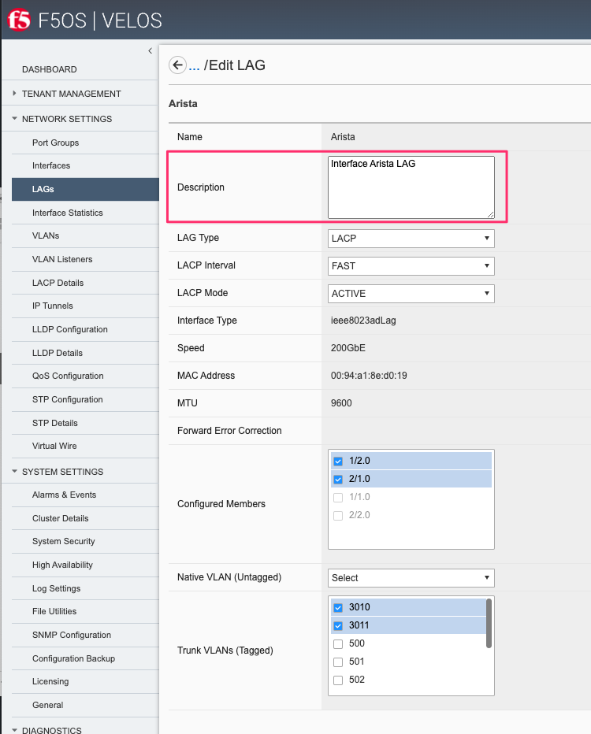

=======================================
VELOS F5OS SNMP Monitoring and Alerting
=======================================

SNMP support for F5OS will vary by release. In the intial F5OS-C 1.1.x versions, SNMP support was limited to **IF-MIB** support for the chassis partitions and SNMP trap support. F5OS v1.2.x added additional SNMP support, including Link Up/Down Traps for chassis partitions, and support for  **IF-MIB**, **EtherLike-MIB**, and the **PLATFORM-STATS-MIB**. F5OS-C 1.5.x added addtional SNMP MIB and trap coverage and F5OS-C 1.6.0 added SNMPv3 support.

As of F5OS-C 1.6.0 the list of SNMP MIBs available are as follows:

**VELOS System Controller MIBs**

F5OS Controller MIBs:

- F5-ALERT-DEF-MIB
- F5-COMMON-SMI-MIB
- F5-CTRLR-ALERT-NOTIF-MIB
- F5-PLATFORM-STATS-MIB
- F5-OS-SYSTEM-MIB

NetSNMP MIBs System Controller:

- EtherLike-MIB
- HOST-RESOURCES-MIB
- IANAifType-MIB
- IF-MIB
- IPV6-TC
- RFC1213-MIB
- SNMP-COMMUNITY-MIB
- SNMP-FRAMEWORK-MIB
- SNMP-MPD-MIB
- SNMP-NOTIFICATION-MIB
- SNMP-TARGET-MIB
- SNMP-USER-BASED-SM-MIB
- SNMP-VIEW-BASED-ACM-MIB
- SNMPv2-CONF
- SNMPv2-MIB
- SNMPv2-SMI
- SNMPv2-TC
- TRANSPORT-ADDRESS-MIB

**VELOS Chassis Partition MIBs**

F5OS Chassis Partition MIBs:

- F5-ALERT-DEF-MIB
- F5-COMMON-SMI-MIB
- F5-OS-LLDP-MIB
- F5-OS-PLATFORM-SMI-MIB
- F5-OS-SYSTEM-MIB
- F5-PARTITION-ALERT-NOTIF-MIB
- F5-PLATFORM-STATS-MIB

NetSNMP MIBs Chassis Partition:

- EtherLike-MIB
- HOST-RESOURCES-MIB
- IANAifType-MIB
- IF-MIB
- IPV6-TC
- RFC1213-MIB
- SNMP-COMMUNITY-MIB
- SNMP-FRAMEWORK-MIB
- SNMP-MPD-MIB
- SNMP-NOTIFICATION-MIB
- SNMP-TARGET-MIB
- SNMP-USER-BASED-SM-MIB
- SNMP-VIEW-BASED-ACM-MIB
- SNMPv2-CONF
- SNMPv2-MIB
- SNMPv2-SMI
- SNMPv2-TC
- TRANSPORT-ADDRESS-MIB

MIBs can be downloaded directly from the F5OS layer starting in F5OS-C v1.5.x. From the webUI of the system controller, you can go to the **System Settings > File Utilities** page. Then, from the **Base Directory** drop down box select the **mibs** directory to download the MIB files. There are two separate MIB files: NetSNMP and F5OS MIBs for the controller. Download both MIB files and extract them to see the individual MIB files.

.. image:: images/velos_monitoring_snmp/image1.png
  :align: center
  :scale: 70%

You can then download the F5OS controller MIBS and the standard Net SNMP MIBS as seen above. Repeat the same process on one of the chassis partitions to download the chassis partition MIBs.

.. image:: images/velos_monitoring_snmp/image2.png
  :align: center
  :scale: 70%

Adding Allowed IPs for SNMP
===========================

Adding Allowed IPs for SNMP via CLI
-----------------------------------

By default, SNMP queries are not allowed into the F5OS platform layer. Before enabling SNMP, you'll need to open up the out-of-band management port on F5OS-C (on both the system controller and on all the chassis partitions) to allow SNMP queries from particular SNMP management endpoints. Below is an example of allowing any SNMP endpoint at 10.255.0.0 (prefix length of 24) to query the F5OS layer on port 161. The allowed-ip functionality is added in F5OS-C 1.6.0.

.. code-block:: bash

    syscon-1-active(config)# system allowed-ips allowed-ip snmp config ipv4 address 10.255.0.0 prefix-length 24 port 161
    syscon-1-active(config-allowed-ip-snmp)# commit
    Commit complete.
    syscon-1-active(config-allowed-ip-snmp)# 

Currently you can add one IP address/port pair per **allowed-ip** name with an optional prefix length to specify a CIDR block contaning multiple addresses. If you require more than one non-contiguous IP address you can add it under another name as seen below. 

.. code-block:: bash

    syscon-1-active(config)# system allowed-ips allowed-ip SNMP-144 config ipv4 address 10.255.0.144 port 161 
    syscon-1-active(config-allowed-ip-SNMP-144)# commit
    Commit complete.

    syscon-1-active(config-allowed-ip-SNMP-144)# system allowed-ips allowed-ip SNMP-145 config ipv4 address 10.255.2.145 port 161 
    syscon-1-active(config-allowed-ip-SNMP-145)# commit
    Commit complete.
    syscon-1-active(config-allowed-ip-SNMP-145)#

Adding Allowed IPs for SNMP via API
-----------------------------------

By default SNMP queries are not allowed into the F5OS layer. Before enabling SNMP you'll need to open up the out-of-band management port on F5OS-C to allow SNMP queries (on both the system controller and on all the chassis partitions). Below is an example of allowing multiple SNMP endpoints to access SNMP on the system on port 161.

.. code-block:: bash

    POST https://{{velos_chassis1_system_controller_ip}}:8888/restconf/data/openconfig-system:system/f5-allowed-ips:allowed-ips

Within the body of the API call, specific IP address/port combinations can be added under a given name. In the current release, you are limited to one IP address/port per name. 

.. code-block:: json

    {
        "allowed-ip": [
            {
                "name": "SNMP",
                "config": {
                    "ipv4": {
                        "address": "10.255.0.143",
                        "port": 161,
                        "prefix-length": 32
                    }
                }
            },
            {
                "name": "SNMP-WIN-10",
                "config": {
                    "ipv4": {
                        "address": "10.255.0.144",
                        "port": 161,
                        "prefix-length": 32
                    }
                }
            },
            {
                "name": "SNMP2",
                "config": {
                    "ipv4": {
                        "address": "10.254.0.0",
                        "port": 161,
                        "prefix-length": 16
                    }
                }
            }
        ]
    }

To view the allowed IPs in the API, use the following call.

.. code-block:: bash

    GET https://{{velos_chassis1_system_controller_ip}}:8888/restconf/data/openconfig-system:system/f5-allowed-ips:allowed-ips

The output will show the previously configured allowed-ip's.

.. code-block:: json

    {
        "f5-allowed-ips:allowed-ips": {
            "allowed-ip": [
                {
                    "name": "SNMP",
                    "config": {
                        "ipv4": {
                            "address": "10.255.0.143",
                            "prefix-length": 32,
                            "port": 161
                        }
                    }
                },
                {
                    "name": "SNMP-WIN-10",
                    "config": {
                        "ipv4": {
                            "address": "10.255.0.144",
                            "prefix-length": 32,
                            "port": 161
                        }
                    }
                },
                {
                    "name": "SNMP2",
                    "config": {
                        "ipv4": {
                            "address": "10.254.0.0",
                            "prefix-length": 16,
                            "port": 161
                        }
                    }
                }
            ]
        }
    }

Adding Allowed IPs for SNMP via webUI
-----------------------------------

Configuration of the **allowed-ip** functionality is not supported yet, this will be added in F5OS-C 1.7.0. For now you must use either the API or CLI to configure this. Below is what the F5OS-C 1.7.0 fucntinality will look like:

By default, SNMP queries are not allowed into the F5OS platform layer. Before enabling SNMP, you'll need to open up the out-of-band management port on F5OS-C (on both the system controller and on all the chassis partitions) to allow SNMP queries from particular SNMP management endpoints. Below is an example of allowing any SNMP endpoint at 10.255.0.0 (prefix length of 24) to query the F5OS layer on port 161.

.. image:: images/velos_monitoring_snmp/image3.png
  :align: center
  :scale: 70%

Adding Interface and LAG Descriptions
=====================================

It is highly recommended that you put interface descriptions in your configuration, so that they will show up in the description field when using SNMP polling.

Adding Out-of-Band Interface and LAG Descriptions via CLI
---------------------------------------------------------

To add descriptions for the out-of-band management ports on the system controllers in the CLI, follow the examples below. 

.. code-block:: bash

    syscon-1-active(config)# interfaces interface 1/mgmt0 config description "Interface 1/mgmt0"
    syscon-1-active(config-interface-1/mgmt0)# exit
    syscon-1-active(config)# interfaces interface 2/mgmt0 config description "Interface 2/mgmt0"
    syscon-1-active(config-interface-2/mgmt0)# exit
    syscon-1-active(config)# commit
    Commit complete.
    syscon-1-active(config)#

Adding Out-of-Band Interface and LAG Descriptions via API
---------------------------------------------------------

To add descriptions for the out-of-band management ports on the system controllers via the API, follow the examples below. Use the following PATCH command to update the descriptions for both 1/mgmt0 and 2/mgmt0 out-of-band interfaces.

.. code-block:: bash

    PATCH https://{{velos_chassis1_system_controller_ip}}:8888/restconf/data/

In the body of the API call, add the descriptions as seen below.

.. code-block:: json

    {
        "openconfig-interfaces:interfaces": {
            "interface": [
                {
                    "name": "1/mgmt0",
                    "config": {
                        "description": "1/mgmt0"
                    }
                },
                {
                    "name": "2/mgmt0",
                    "config": {
                        "description": "2/mgmt0"
                    }
                }
            ]
        }
    }

You can then issue the following GET API call to view each interfaces configuration including the new description. Note, the interface name has to be encoded in Postman because of the special characters. The %2F will repsent the slash in the interface name.

.. code-block:: bash

    GET https://{{velos_chassis1_system_controller_ip}}:8888/restconf/data/openconfig-interfaces:interfaces/interface=1%2Fmgmt0/config

You should see a response similar to the one below.

.. code-block:: json

    {
        "openconfig-interfaces:config": {
            "name": "1/mgmt0",
            "type": "iana-if-type:ethernetCsmacd",
            "description": "1/mgmt0",
            "enabled": true
        }
    }

You can then issue the same command with a different interface name for the second management interface.

.. code-block:: bash

    GET https://{{velos_chassis1_system_controller_ip}}:8888/restconf/data/openconfig-interfaces:interfaces/interface=2%2Fmgmt0/config

You should see a response similar to the one below.

.. code-block:: json

    {
        "openconfig-interfaces:config": {
            "name": "2/mgmt0",
            "type": "iana-if-type:ethernetCsmacd",
            "description": "2/mgmt0",
            "enabled": true
        }
    }

You cannot currently set the interface descriptions for the out-of-band management interfaces via the webUI. You'll need to use either the API or CLI.

Adding Interface and LAG Descriptions for Chassis Partitions via CLI
--------------------------------------------------------------------

Adding descriptions to the interfaces will make it easier to determine which interface you are monitoring when using SNMP. Below are examples of adding interface descriptions via CLI to interfaces within a chassis partition. You should repeat this for each chassis partition and all interfaces.

.. code-block:: bash

    prod2-2(config)# interfaces interface 1/1.0 config description "Interface 1/1.0"
    prod2-2(config-interface-1/1.0)# exit
    prod2-2(config)# interfaces interface 1/2.0 config description "Interface 1/2.0"
    prod2-2(config-interface-1/2.0)# exit
    prod2-2(config)# interfaces interface 2/1.0 config description "Interface 2/1.0"
    prod2-2(config-interface-2/1.0)# exit
    prod2-2(config)# interfaces interface 2/2.0 config description "Interface 2/2.0"
    prod2-2(config-interface-2/2.0)# exit
    prod2-2(config)# commit
    Commit complete.
    prod2-2(config)#

If you are using Link Aggregation Groups (LAGs), then you can also add interface descriptions to the LAG interfaces within each chassis partition:

.. code-block:: bash

    prod2-2(config)# interfaces interface Arista config description "Interface Arista LAG"
    prod2-2(config-interface-Arista)# exit
    prod2-2(config)# interfaces interface HA-Interconnect config description "Interface HA-Interconnect LAG"
    prod2-2(config-interface-HA-Interconnect)# exit 
    prod2-2(config)# commit
    Commit complete.
    prod2-2(config)# 

To view the interface descriptions, use the **show running-config interfaces** command.

.. code-block:: bash

    prod2-2# show running-config interfaces          
    interfaces interface 1/1.0
    config type              ethernetCsmacd
    config description       "Interface 1/1.0"
    config enabled
    config forward-error-correction auto
    ethernet config aggregate-id HA-Interconnect
    !
    interfaces interface 1/2.0
    config type              ethernetCsmacd
    config description       "Interface 1/2.0"
    config enabled
    config forward-error-correction auto
    ethernet config aggregate-id Arista
    !
    interfaces interface 2/1.0
    config type              ethernetCsmacd
    config description       "Interface 2/1.0"
    config enabled
    config forward-error-correction auto
    ethernet config aggregate-id Arista
    !
    interfaces interface 2/2.0
    config type              ethernetCsmacd
    config description       "Interface 2/2.0"
    config enabled
    config forward-error-correction auto
    ethernet config aggregate-id HA-Interconnect
    !
    interfaces interface Arista
    config type ieee8023adLag
    config description "Interface Arista LAG"
    aggregation config lag-type LACP
    aggregation config distribution-hash src-dst-ipport
    aggregation switched-vlan config trunk-vlans [ 3010 3011 ]
    !
    interfaces interface HA-Interconnect
    config type ieee8023adLag
    config description "Interface HA-Interconnect LAG"
    aggregation config lag-type LACP
    aggregation config distribution-hash src-dst-ipport
    aggregation switched-vlan config trunk-vlans [ 500 501 502 503 510 511 ]
    !
    prod2-2#

Adding Interface and LAG Descriptions for Chassis Partitions via webUI
--------------------------------------------------------------------

You can also add interface descriptions for both interfaces and LAGs within the webUI. Go to the **Network Settings -> Interfaces** page and select an interface to modify.

Then edit the description and **Save** the change, then repeat for all the other interfaces within that chassis partition. Then repeat for other chassis partitions.

.. image:: images/velos_monitoring_snmp/image5.png
  :align: center
  :scale: 70%

For Link Aggregation Groups go to the **Network Settings -> LAGs** page and select a LAG to modify.

.. image:: images/velos_monitoring_snmp/image6.png
  :align: center
  :scale: 70%

Then edit the description and **Save** the change, then repeat for all the other LAG interfaces within that chassis partition. Then repeat for other chassis partitions.

Adding Interface and LAG Descriptions for Chassis Partitions via API
--------------------------------------------------------------------

To add descriptions for both the in-band interfaces and LAGs in the CLI, follow the examples below. The API example below is sent to the chassis partition IP address. 

.. code-block:: bash

    PATCH https://{{velos_chassis1_chassis_partition1_ip}}:8888/restconf/data/

Below is the proper formatitng for the body of the API call. You will need to adjust to the number and type of interfaces to match what is in your chassis partition.

.. code-block:: json

   {
    "openconfig-interfaces:interfaces": {
        "interface": [
            {
                "name": "1/1.0",
                "config": {
                    "description": "VELOS Interface 1/1.0"
                }
            },
            {
                "name": "1/2.0",
                "config": {
                    "description": "VELOS Interface 1/2.0"
                }
            },
            {
                "name": "2/1.0",
                "config": {
                    "description": "VELOS Interface 2/1.0"
                }
            },
            {
                "name": "2/2.0",
                "config": {
                    "description": "VELOS Interface 2/2.0"
                }
            }

        ]
    }
}

If Link Aggregation Groups (LAGs) are configured, descriptions should be added to the LAG interfaces as well.

.. code-block:: bash

    PATCH https://{{velos_chassis1_chassis_partition1_ip}}:8888/restconf/data/

The body of the API call should contain JSON data that includes the descriptions for each LAG.

.. code-block:: json

    {
        "openconfig-interfaces:interfaces": {
            "interface": [
                {
                    "name": "Arista",
                    "config": {
                        "description": "VELOS Arista LAG Interface"
                    }
                },
                {
                    "name": "HA-Interconnect",
                    "config": {
                        "description": "VELOS HA-Interconnect Interface"
                    }
                }
            ]
        }
    }

You may then view the LAG description via the following API call:

.. code-block:: bash

    GET https://{{velos_chassis1_chassis_partition1_ip}}:8888/restconf/data/openconfig-interfaces:interfaces
    

The output below will show the LAG descriptions as well as all the other interfaces.

.. code-block:: json

    {
        "openconfig-interfaces:interfaces": {
            "interface": [
                {
                    "name": "1/1.0",
                    "config": {
                        "name": "1/1.0",
                        "type": "iana-if-type:ethernetCsmacd",
                        "description": "VELOS Interface 1/1.0",
                        "enabled": true,
                        "f5-interface:forward-error-correction": "auto"
                    },
                    "state": {
                        "name": "1/1.0",
                        "type": "iana-if-type:ethernetCsmacd",
                        "mtu": 9600,
                        "enabled": true,
                        "oper-status": "UP",
                        "counters": {
                            "in-octets": "17514",
                            "in-unicast-pkts": "0",
                            "in-broadcast-pkts": "0",
                            "in-multicast-pkts": "135",
                            "in-discards": "0",
                            "in-errors": "0",
                            "in-fcs-errors": "0",
                            "out-octets": "33431490",
                            "out-unicast-pkts": "0",
                            "out-broadcast-pkts": "0",
                            "out-multicast-pkts": "256908",
                            "out-discards": "0",
                            "out-errors": "0"
                        },
                        "f5-interface:forward-error-correction": "auto",
                        "f5-lacp:lacp_state": "LACP_DOWN"
                    },
                    "openconfig-if-ethernet:ethernet": {
                        "config": {
                            "openconfig-if-aggregate:aggregate-id": "HA-Interconnect"
                        },
                        "state": {
                            "port-speed": "openconfig-if-ethernet:SPEED_100GB",
                            "hw-mac-address": "00:94:a1:8e:d0:00",
                            "counters": {
                                "in-mac-control-frames": "0",
                                "in-mac-pause-frames": "0",
                                "in-oversize-frames": "0",
                                "in-jabber-frames": "0",
                                "in-fragment-frames": "0",
                                "in-8021q-frames": "0",
                                "in-crc-errors": "0",
                                "out-mac-control-frames": "0",
                                "out-mac-pause-frames": "0",
                                "out-8021q-frames": "0"
                            },
                            "f5-if-ethernet:flow-control": {
                                "rx": "on"
                            }
                        }
                    }
                },
                {
                    "name": "1/2.0",
                    "config": {
                        "name": "1/2.0",
                        "type": "iana-if-type:ethernetCsmacd",
                        "description": "VELOS Interface 1/2.0",
                        "enabled": true,
                        "f5-interface:forward-error-correction": "auto"
                    },
                    "state": {
                        "name": "1/2.0",
                        "type": "iana-if-type:ethernetCsmacd",
                        "mtu": 9600,
                        "enabled": true,
                        "oper-status": "UP",
                        "counters": {
                            "in-octets": "34222124",
                            "in-unicast-pkts": "6",
                            "in-broadcast-pkts": "5",
                            "in-multicast-pkts": "258896",
                            "in-discards": "0",
                            "in-errors": "0",
                            "in-fcs-errors": "0",
                            "out-octets": "31820928",
                            "out-unicast-pkts": "0",
                            "out-broadcast-pkts": "0",
                            "out-multicast-pkts": "248601",
                            "out-discards": "0",
                            "out-errors": "0"
                        },
                        "f5-interface:forward-error-correction": "auto",
                        "f5-lacp:lacp_state": "LACP_UP"
                    },
                    "openconfig-if-ethernet:ethernet": {
                        "config": {
                            "openconfig-if-aggregate:aggregate-id": "Arista"
                        },
                        "state": {
                            "port-speed": "openconfig-if-ethernet:SPEED_100GB",
                            "hw-mac-address": "00:94:a1:8e:d0:01",
                            "counters": {
                                "in-mac-control-frames": "0",
                                "in-mac-pause-frames": "0",
                                "in-oversize-frames": "0",
                                "in-jabber-frames": "0",
                                "in-fragment-frames": "0",
                                "in-8021q-frames": "0",
                                "in-crc-errors": "0",
                                "out-mac-control-frames": "0",
                                "out-mac-pause-frames": "0",
                                "out-8021q-frames": "0"
                            },
                            "f5-if-ethernet:flow-control": {
                                "rx": "on"
                            }
                        }
                    }
                },
                {
                    "name": "2/1.0",
                    "config": {
                        "name": "2/1.0",
                        "type": "iana-if-type:ethernetCsmacd",
                        "description": "VELOS Interface 2/1.0",
                        "enabled": true,
                        "f5-interface:forward-error-correction": "auto"
                    },
                    "state": {
                        "name": "2/1.0",
                        "type": "iana-if-type:ethernetCsmacd",
                        "mtu": 9600,
                        "enabled": true,
                        "oper-status": "UP",
                        "counters": {
                            "in-octets": "51072261",
                            "in-unicast-pkts": "9",
                            "in-broadcast-pkts": "18752",
                            "in-multicast-pkts": "383463",
                            "in-discards": "0",
                            "in-errors": "1",
                            "in-fcs-errors": "1",
                            "out-octets": "31832708",
                            "out-unicast-pkts": "0",
                            "out-broadcast-pkts": "0",
                            "out-multicast-pkts": "248701",
                            "out-discards": "0",
                            "out-errors": "0"
                        },
                        "f5-interface:forward-error-correction": "auto",
                        "f5-lacp:lacp_state": "LACP_UP"
                    },
                    "openconfig-if-ethernet:ethernet": {
                        "config": {
                            "openconfig-if-aggregate:aggregate-id": "Arista"
                        },
                        "state": {
                            "port-speed": "openconfig-if-ethernet:SPEED_100GB",
                            "hw-mac-address": "00:94:a1:8e:d0:80",
                            "counters": {
                                "in-mac-control-frames": "0",
                                "in-mac-pause-frames": "0",
                                "in-oversize-frames": "0",
                                "in-jabber-frames": "0",
                                "in-fragment-frames": "1",
                                "in-8021q-frames": "0",
                                "in-crc-errors": "0",
                                "out-mac-control-frames": "0",
                                "out-mac-pause-frames": "0",
                                "out-8021q-frames": "0"
                            },
                            "f5-if-ethernet:flow-control": {
                                "rx": "on"
                            }
                        }
                    }
                },
                {
                    "name": "2/2.0",
                    "config": {
                        "name": "2/2.0",
                        "type": "iana-if-type:ethernetCsmacd",
                        "description": "VELOS Interface 2/2.0",
                        "enabled": true,
                        "f5-interface:forward-error-correction": "auto"
                    },
                    "state": {
                        "name": "2/2.0",
                        "type": "iana-if-type:ethernetCsmacd",
                        "mtu": 9600,
                        "enabled": true,
                        "oper-status": "UP",
                        "counters": {
                            "in-octets": "33026022",
                            "in-unicast-pkts": "0",
                            "in-broadcast-pkts": "0",
                            "in-multicast-pkts": "256851",
                            "in-discards": "0",
                            "in-errors": "0",
                            "in-fcs-errors": "0",
                            "out-octets": "33430966",
                            "out-unicast-pkts": "0",
                            "out-broadcast-pkts": "0",
                            "out-multicast-pkts": "256916",
                            "out-discards": "0",
                            "out-errors": "0"
                        },
                        "f5-interface:forward-error-correction": "auto",
                        "f5-lacp:lacp_state": "LACP_UP"
                    },
                    "openconfig-if-ethernet:ethernet": {
                        "config": {
                            "openconfig-if-aggregate:aggregate-id": "HA-Interconnect"
                        },
                        "state": {
                            "port-speed": "openconfig-if-ethernet:SPEED_100GB",
                            "hw-mac-address": "00:94:a1:8e:d0:81",
                            "counters": {
                                "in-mac-control-frames": "0",
                                "in-mac-pause-frames": "0",
                                "in-oversize-frames": "0",
                                "in-jabber-frames": "0",
                                "in-fragment-frames": "0",
                                "in-8021q-frames": "0",
                                "in-crc-errors": "0",
                                "out-mac-control-frames": "0",
                                "out-mac-pause-frames": "0",
                                "out-8021q-frames": "0"
                            },
                            "f5-if-ethernet:flow-control": {
                                "rx": "on"
                            }
                        }
                    }
                },
                {
                    "name": "Arista",
                    "config": {
                        "name": "Arista",
                        "type": "iana-if-type:ieee8023adLag",
                        "description": "Interface Arista LAG",
                        "enabled": true
                    },
                    "state": {
                        "name": "Arista",
                        "type": "iana-if-type:ieee8023adLag",
                        "mtu": 9600,
                        "enabled": true,
                        "oper-status": "UP"
                    },
                    "openconfig-if-aggregate:aggregation": {
                        "config": {
                            "lag-type": "LACP",
                            "f5-if-aggregate:distribution-hash": "src-dst-ipport"
                        },
                        "state": {
                            "lag-type": "LACP",
                            "lag-speed": 200,
                            "f5-if-aggregate:distribution-hash": "src-dst-ipport",
                            "f5-if-aggregate:members": {
                                "member": [
                                    {
                                        "member-name": "1/2.0",
                                        "member-status": "UP"
                                    },
                                    {
                                        "member-name": "2/1.0",
                                        "member-status": "UP"
                                    }
                                ]
                            },
                            "f5-if-aggregate:mac-address": "00:94:a1:8e:d0:19",
                            "f5-if-aggregate:lagid": 1
                        },
                        "openconfig-vlan:switched-vlan": {
                            "config": {
                                "trunk-vlans": [
                                    3010,
                                    3011
                                ]
                            }
                        }
                    }
                },
                {
                    "name": "HA-Interconnect",
                    "config": {
                        "name": "HA-Interconnect",
                        "type": "iana-if-type:ieee8023adLag",
                        "description": "Interface HA-Interconnect LAG",
                        "enabled": true
                    },
                    "state": {
                        "name": "HA-Interconnect",
                        "type": "iana-if-type:ieee8023adLag",
                        "mtu": 9600,
                        "enabled": true,
                        "oper-status": "UP"
                    },
                    "openconfig-if-aggregate:aggregation": {
                        "config": {
                            "lag-type": "LACP",
                            "f5-if-aggregate:distribution-hash": "src-dst-ipport"
                        },
                        "state": {
                            "lag-type": "LACP",
                            "lag-speed": 100,
                            "f5-if-aggregate:distribution-hash": "src-dst-ipport",
                            "f5-if-aggregate:members": {
                                "member": [
                                    {
                                        "member-name": "1/1.0",
                                        "member-status": "DOWN"
                                    },
                                    {
                                        "member-name": "2/2.0",
                                        "member-status": "UP"
                                    }
                                ]
                            },
                            "f5-if-aggregate:mac-address": "00:94:a1:8e:d0:1a",
                            "f5-if-aggregate:lagid": 2
                        },
                        "openconfig-vlan:switched-vlan": {
                            "config": {
                                "trunk-vlans": [
                                    500,
                                    501,
                                    502,
                                    503,
                                    510,
                                    511
                                ]
                            }
                        }
                    }
                }
            ]
        }
    }

Enabling SNMP via CLI prior to F5OS-C 1.5.x
===========================================

Setting up SNMP can be done from the CLI by enabling an SNMP community such as **public**. Below is an example of enabling SNMP monitoring on a chassis partition, but the same configuration can be done on the system controller as well. The configuration in releases prior to F5OS-C 1.5.x is somewhat complicated, and has been improved in F5OS-C 1.5.x and later. We recomend you use the later F5OS-C releases and the examples in the next section. This section is provided for reference for those that may still be running earlier versions of F5OS-C.

To enable SNMP on F5OS-C 1.4.x and earlier use the following CLI commands. If you are running f5OS-C 1.5.0 or later skip this section and move onto the next section.

You can configure the SNMP system paramters including the System Contact, System Location, and System Name as seen below:

.. code-block:: bash

    Production-1(config)# SNMPv2-MIB system sysContact jim@f5.com sysLocation Boston sysName VELOS-Production
    Production-1(config)# commit

Enabling SNMP can be done from the CLI by configuring the public SNMP community, and then configuring a Security Access Group. Below is an example of enabling SNMP monitoring at the F5OS layer. F5OS only supports read-only access for SNMP monitoring.    

.. code-block:: bash

    Production-1# config
    Entering configuration mode terminal
    Production-1(config)# SNMP-COMMUNITY-MIB snmpCommunityTable snmpCommunityEntry public snmpCommunityName public snmpCommunitySecurityName public
    Production-1(config-snmpCommunityEntry-public)# exit
    Production-1(config)# commit
    Commit complete.

To configure a Security Group for both SNMPv1 and SNMPv2c.   
   
.. code-block:: bash   
   
    Production-1(config)# SNMP-VIEW-BASED-ACM-MIB vacmSecurityToGroupTable vacmSecurityToGroupEntry 2 public vacmGroupName read-access
    Production-1(config-vacmSecurityToGroupEntry-2/public)# exit
    Production-1(config)# SNMP-VIEW-BASED-ACM-MIB vacmSecurityToGroupTable vacmSecurityToGroupEntry 1 public vacmGroupName read-access
    Production-1(config-vacmSecurityToGroupEntry-1/public)# exit
    Production-1(config)# commit
    Commit complete.

Enabling SNMP via CLI for Releases F5OS-C 1.5.0 and Later
=========================================================

You can configure the SNMP System parameters including the **System Contact**, **System Location**, and **System Name** as seen below:

.. code-block:: bash

    Production-1(config)# SNMPv2-MIB system sysContact jim@f5.com sysLocation Boston sysName VELOS-Production
    Production-1(config)# commit

SNMP configuration was only available in the CLI and API prior to F5OS-C 1.5.0, and the CLI configuration was not intuitive. F5OS-C 1.5.0 has improved and streamlined SNMP configuration in the CLI and then configuration via the webUI was also added in F5OS-C 1.5.0. The example below is utilizing the new and improved SNMP CLI configuration for VELOS systems running F5OS-C 1.5.0 or later. 

Enabling SNMP can be done from the CLI by configuring the **public** SNMP community, and then configuring a **security-model**. The command below sets up an SNMP community of **public** with v1 and v2c security models. You may choose to enable both of these security models or only one.

.. code-block:: bash

    Production-1(config)# system snmp communities community public config security-model [ v1 v2c ]
    Production-1(config-community-public)# commit
    Commit complete.
    Production-1(config-community-public)# 

You can then display the SNMP community configuration using the **show system snmp** command.

.. code-block:: bash

    Production-1(config)# do show system snmp 
    system snmp engine-id state engine-id 80:00:2f:f4:03:00:94:a1:8e:d0:ff
    system snmp engine-id state type mac
                    SECURITY    
    NAME    NAME    MODEL       
    ----------------------------
    public  public  [ v1 v2c ]  

    Production-1(config)#

You may also configure SNMP users for SNMPv3 support, since SNMPv3 is a user-based security model. This provides addtional support for authentication and privacy protocols. Authentication protocols of **md5**, **sha**, or **none** are supported. For privacy protocols **aes**, **des**, or **none** are supported. You'll then be prompted to enter the privacy-password.

.. code-block:: bash

    Production-1(config)# system snmp users user snmpv3user config authentication-protocol md5 privacy-protocol aes privacy-password 
    (<string, min: 8 chars, max: 32 chars>): **************
    Production-1(config-user-snmpv3user)# commit
    Commit complete.
    Production-1(config-user-snmpv3user)#

You may display the SNMP user configuration by entering the command **show system snmp users**.

.. code-block:: bash

    Production-1(config)# do show system snmp users
                            AUTHENTICATION  PRIVACY   
    NAME        NAME        PROTOCOL        PROTOCOL  
    --------------------------------------------------
    snmpv3user  snmpv3user  md5             aes       

    Production-1(config)# 

Polling SNMP Endpoints
=====================

Once SNMP is properly setup, and allow-lists are enabled (in both the system controllers and chassis partitions) you can poll SNMP objects from remote endpoints. If you have an SNMP manager it is recommended you download the appropriate MIBs from the VELOS chassis, and compile them into you SNMP manager. Alternatively, you can use SNMP command line utilites from a remote client to validate the SNMP endpoints.

You can then poll the chassis partiton via SNMP to get stats from the system using the following SNMP OID's:

-----------
SNMP System
-----------

SNMP System OID: .1.3.6.1.2.1.1

Example output:

.. code-block:: bash

    sysDescr.0	Linux 3.10.0-862.14.4.el7.centos.plus.x86_64 : Partition services version 1.2.1-10781	OctetString	10.255.0.148:161
    sysObjectID.0	system	OID	10.255.0.148:161
    sysUpTime.0	1 hour 13 minutes 13.88 seconds (439388)	TimeTicks	10.255.0.148:161
    sysContact.0	jim@f5.com	OctetString	10.255.0.148:161
    sysName.0	VELOS-Production	OctetString	10.255.0.148:161
    sysLocation.0	Boston	OctetString	10.255.0.148:161
    sysServices.0	72	Integer	10.255.0.148:161
    .1.3.6.1.2.1.1.8.0	190 milliseconds (19)	TimeTicks	10.255.0.148:161
    .1.3.6.1.2.1.1.9.1.2.1	platform	OID	10.255.0.148:161
    .1.3.6.1.2.1.1.9.1.2.2	.1.3.6.1.2.1.31	OID	10.255.0.148:161

------------
SNMP ifIndex
------------

You can poll the following SNMP OID to get detailed Interface stats for each physical port on the BX110 blades, and also for Link Aggregation Groups that have been configured. Note, that you will only see interfaces and LAGs that are configured within the chassis partition you are monitoring. You will not have visibility into other chassis partition interfaces or LAGs unless you poll those chasssis partitions directly.

**NOTE: Stats for LAG interfaces are not currently populated.**

SNMP ifIndex OID: .1.3.6.1.2.1.2.2.1

+-------------+---------------------+----------------+-----------+-------------+--------------------+-------------------+------------------+------------------+----------------+-------------------+--------------------+------------------+----------------+-----------------------+-----------------+--------------------+---------------------+-------------------+-----------------+---------------+----------------+-----------------+
| **ifIndex** | **ifDescr**         | **ifType**     | **ifMtu** | **ifSpeed** | **ifPhysAddress**  | **ifAdminStatus** | **ifOperStatus** | **ifLastChange** | **ifInOctets** | **ifInUcastPkts** | **ifInNUcastPkts** | **ifInDiscards** | **ifInErrors** | **ifInUnknownProtos** | **ifOutOctets** | **ifOutUcastPkts** | **ifOutNUcastPkts** | **ifOutDiscards** | **ifOutErrors** | **ifOutQLen** | **ifSpecific** | **Index Value** |
+=============+=====================+================+===========+=============+====================+===================+==================+==================+================+===================+====================+==================+================+=======================+=================+====================+=====================+===================+=================+===============+================+=================+
| 33554441    | Interface-1/1.0     | ethernetCsmacd | 9600      | 4294967295  | 00-94-A1-8E-D0-00  | up                | up               | 0                | 0              | 0                 | 0                  | 33554441         |                |                       |                 |                    |                     |                   |                 |               |                |                 |
+-------------+---------------------+----------------+-----------+-------------+--------------------+-------------------+------------------+------------------+----------------+-------------------+--------------------+------------------+----------------+-----------------------+-----------------+--------------------+---------------------+-------------------+-----------------+---------------+----------------+-----------------+
| 33554442    | Interface-1/2.0     | ethernetCsmacd | 9600      | 4294967295  | 00-94-A1-8E-D0-01  | up                | up               | 0                | 0              | 0                 | 0                  | 33554441         |                |                       |                 |                    |                     |                   |                 |               |                |                 |
+-------------+---------------------+----------------+-----------+-------------+--------------------+-------------------+------------------+------------------+----------------+-------------------+--------------------+------------------+----------------+-----------------------+-----------------+--------------------+---------------------+-------------------+-----------------+---------------+----------------+-----------------+
| 33554449    | Interface-2/1.0     | ethernetCsmacd | 9600      | 4294967295  | 00-94-A1-8E-D0-80  | up                | up               | 0                | 0              | 0                 | 0                  | 33554441         |                |                       |                 |                    |                     |                   |                 |               |                |                 |
+-------------+---------------------+----------------+-----------+-------------+--------------------+-------------------+------------------+------------------+----------------+-------------------+--------------------+------------------+----------------+-----------------------+-----------------+--------------------+---------------------+-------------------+-----------------+---------------+----------------+-----------------+
| 33554450    | Interface-2/2.0     | ethernetCsmacd | 9600      | 4294967295  | 00-94-A1-8E-D0-81  | up                | up               | 0                | 0              | 0                 | 0                  | 33554441         |                |                       |                 |                    |                     |                   |                 |               |                |                 |
+-------------+---------------------+----------------+-----------+-------------+--------------------+-------------------+------------------+------------------+----------------+-------------------+--------------------+------------------+----------------+-----------------------+-----------------+--------------------+---------------------+-------------------+-----------------+---------------+----------------+-----------------+
| 67108865    | Arista LAG          | ieee8023adLag  | 9600      | 4294967295  | 00-94-A1-8E-D0-0B  | up                | up               | 0                | 0              | 0                 | 0                  | 33554441         |                |                       |                 |                    |                     |                   |                 |               |                |                 |
+-------------+---------------------+----------------+-----------+-------------+--------------------+-------------------+------------------+------------------+----------------+-------------------+--------------------+------------------+----------------+-----------------------+-----------------+--------------------+---------------------+-------------------+-----------------+---------------+----------------+-----------------+
| 67108866    | HA-Interconnect LAG | ieee8023adLag  | 9600      | 4294967295  | 00-94-A1-8E-D0-0C  | up                | up               | 0                | 0              | 0                 | 0                  | 33554441         |                |                       |                 |                    |                     |                   |                 |               |                |                 |
+-------------+---------------------+----------------+-----------+-------------+--------------------+-------------------+------------------+------------------+----------------+-------------------+--------------------+------------------+----------------+-----------------------+-----------------+--------------------+---------------------+-------------------+-----------------+---------------+----------------+-----------------+

---------------------
Chassis Partition CPU
--------------------- 

The CPU Processor Stats Table provides details on the Intel CPU processors which are running in the BX110 line card. It displays the core and thread Counts, as well as the cache size, frequency and model number.

SNMP Chassis Partition CPU Processor Stats Table OID: .1.3.6.1.4.1.12276.1.2.1.1.1

+-----------+--------------+------------------+----------------+---------------+-----------------+------------------+------------------------------------------+-----------------------------+
| **Index** | **cpuIndex** | **cpuCacheSize** | **cpuCoreCnt** | **cpuFreq**   | **cpuStepping** | **cpuThreadCnt** | **cpuModelName**                         | **Index Value**             |
+===========+==============+==================+================+===============+=================+==================+==========================================+=============================+
| blade-1   | 0            | 19712(KB)        | 14             | 2552.893(MHz) | 4               | 28               | Intel(R) Xeon(R) D-2177NT CPU @ 1.90GHz  | 7.98.108.97.100.101.45.49.0 |
+-----------+--------------+------------------+----------------+---------------+-----------------+------------------+------------------------------------------+-----------------------------+
| blade-2   | 0            | 19712(KB)        | 14             | 2370.593(MHz) | 4               | 28               | Intel(R) Xeon(R) D-2177NT CPU @ 1.90GHz  | 7.98.108.97.100.101.45.50.0 |
+-----------+--------------+------------------+----------------+---------------+-----------------+------------------+------------------------------------------+-----------------------------+

---------------------------
CPU Utilization Stats Table
---------------------------

The table below shows the total CPU utilization per blade within a chassis partition over 5 seconds, 1 minute, and 5 minutes averages as well as the current value.

SNMP CPU Utilization Stats Table OID: .1.3.6.1.4.1.12276.1.2.1.1.2

+-------------+----------------+---------------------+---------------------+---------------------+---------------------------+
| **cpuCore** |	**cpuCurrent** | **cpuTotal5secAvg** | **cpuTotal1minAvg** | **cpuTotal5minAvg** | **Index Value**           |
+=============+================+=====================+=====================+=====================+===========================+
| cpu         | 3              | 4                   | 4                   | 4                   | 7.98.108.97.100.101.45.49 |
+-------------+----------------+---------------------+---------------------+---------------------+---------------------------+
| cpu         | 3              | 4                   | 4                   | 4                   | 7.98.108.97.100.101.45.50 |
+-------------+----------------+---------------------+---------------------+---------------------+---------------------------+

---------------------------
CPU Core Stats Table
---------------------------

The table below shows the total CPU utilization per vCPU within a chassis partition over 5 seconds, 1 minute, and 5 minutes averages. Below is an example of a 2 blade chassis partition. Each blade has 28 vCPUs or cores:

SNMP CPU Core Stas Table OID: .1.3.6.1.4.1.12276.1.2.1.1.3

+---------------+--------------+-----------------+----------------------+----------------------+----------------------+-------------------------------+
| **CoreIndex** | **CoreName** | **CoreCurrent** | **CoreTotal5secAvg** | **CoreTotal1minAvg** | **CoreTotal5minAvg** | **Index Value**               |
+===============+==============+=================+======================+======================+======================+===============================+
| 0             | cpu0         | 7               | 8                    | 8                    | 8                    | 7.98.108.97.100.101.45.49.0   |
+---------------+--------------+-----------------+----------------------+----------------------+----------------------+-------------------------------+
| 1             | cpu1         | 7               | 8                    | 8                    | 8                    | 7.98.108.97.100.101.45.49.1   |
+---------------+--------------+-----------------+----------------------+----------------------+----------------------+-------------------------------+
| 2             | cpu2         | 7               | 8                    | 8                    | 8                    | 7.98.108.97.100.101.45.49.2   |
+---------------+--------------+-----------------+----------------------+----------------------+----------------------+-------------------------------+
| 3             | cpu3         | 7               | 8                    | 8                    | 8                    | 7.98.108.97.100.101.45.49.3   |
+---------------+--------------+-----------------+----------------------+----------------------+----------------------+-------------------------------+
| 4             | cpu4         | 7               | 8                    | 8                    | 8                    | 7.98.108.97.100.101.45.49.4   |
+---------------+--------------+-----------------+----------------------+----------------------+----------------------+-------------------------------+
| 5             | cpu5         | 7               | 8                    | 8                    | 8                    | 7.98.108.97.100.101.45.49.5   |
+---------------+--------------+-----------------+----------------------+----------------------+----------------------+-------------------------------+
| 6             | cpu6         | 7               | 8                    | 8                    | 8                    | 7.98.108.97.100.101.45.49.6   |
+---------------+--------------+-----------------+----------------------+----------------------+----------------------+-------------------------------+
| 7             | cpu7         | 7               | 8                    | 8                    | 8                    | 7.98.108.97.100.101.45.49.7   |
+---------------+--------------+-----------------+----------------------+----------------------+----------------------+-------------------------------+
| 8             | cpu8         | 7               | 8                    | 8                    | 8                    | 7.98.108.97.100.101.45.49.8   |
+---------------+--------------+-----------------+----------------------+----------------------+----------------------+-------------------------------+
| 9             | cpu9         | 7               | 8                    | 8                    | 8                    | 7.98.108.97.100.101.45.49.9   |
+---------------+--------------+-----------------+----------------------+----------------------+----------------------+-------------------------------+
| 10            | cpu10        | 7               | 8                    | 8                    | 8                    | 7.98.108.97.100.101.45.49.10  |
+---------------+--------------+-----------------+----------------------+----------------------+----------------------+-------------------------------+
| 11            | cpu11        | 7               | 8                    | 8                    | 8                    | 7.98.108.97.100.101.45.49.11  |
+---------------+--------------+-----------------+----------------------+----------------------+----------------------+-------------------------------+
| 12            | cpu12        | 7               | 8                    | 8                    | 8                    | 7.98.108.97.100.101.45.49.12  |
+---------------+--------------+-----------------+----------------------+----------------------+----------------------+-------------------------------+
| 13            | cpu13        | 7               | 8                    | 8                    | 8                    | 7.98.108.97.100.101.45.49.13  |
+---------------+--------------+-----------------+----------------------+----------------------+----------------------+-------------------------------+
| 14            | cpu14        | 7               | 8                    | 8                    | 8                    | 7.98.108.97.100.101.45.49.14  |
+---------------+--------------+-----------------+----------------------+----------------------+----------------------+-------------------------------+
| 15            | cpu15        | 7               | 8                    | 8                    | 8                    | 7.98.108.97.100.101.45.49.15  |
+---------------+--------------+-----------------+----------------------+----------------------+----------------------+-------------------------------+
| 16            | cpu16        | 7               | 8                    | 8                    | 8                    | 7.98.108.97.100.101.45.49.16  |
+---------------+--------------+-----------------+----------------------+----------------------+----------------------+-------------------------------+
| 17            | cpu17        | 7               | 8                    | 8                    | 8                    | 7.98.108.97.100.101.45.49.17  |
+---------------+--------------+-----------------+----------------------+----------------------+----------------------+-------------------------------+
| 18            | cpu18        | 7               | 8                    | 8                    | 8                    | 7.98.108.97.100.101.45.49.18  |
+---------------+--------------+-----------------+----------------------+----------------------+----------------------+-------------------------------+
| 19            | cpu19        | 7               | 8                    | 8                    | 8                    | 7.98.108.97.100.101.45.49.19  |
+---------------+--------------+-----------------+----------------------+----------------------+----------------------+-------------------------------+
| 20            | cpu20        | 7               | 8                    | 8                    | 8                    | 7.98.108.97.100.101.45.49.20  |
+---------------+--------------+-----------------+----------------------+----------------------+----------------------+-------------------------------+
| 21            | cpu21        | 7               | 8                    | 8                    | 8                    | 7.98.108.97.100.101.45.49.21  |
+---------------+--------------+-----------------+----------------------+----------------------+----------------------+-------------------------------+
| 22            | cpu22        | 7               | 8                    | 8                    | 8                    | 7.98.108.97.100.101.45.49.22  |
+---------------+--------------+-----------------+----------------------+----------------------+----------------------+-------------------------------+
| 23            | cpu23        | 7               | 8                    | 8                    | 8                    | 7.98.108.97.100.101.45.49.23  |
+---------------+--------------+-----------------+----------------------+----------------------+----------------------+-------------------------------+
| 24            | cpu24        | 7               | 8                    | 8                    | 8                    | 7.98.108.97.100.101.45.49.24  |
+---------------+--------------+-----------------+----------------------+----------------------+----------------------+-------------------------------+
| 25            | cpu25        | 7               | 8                    | 8                    | 8                    | 7.98.108.97.100.101.45.49.25  |
+---------------+--------------+-----------------+----------------------+----------------------+----------------------+-------------------------------+
| 26            | cpu26        | 7               | 8                    | 8                    | 8                    | 7.98.108.97.100.101.45.49.26  |
+---------------+--------------+-----------------+----------------------+----------------------+----------------------+-------------------------------+
| 27            | cpu27        | 7               | 8                    | 8                    | 8                    | 7.98.108.97.100.101.45.49.27  |
+---------------+--------------+-----------------+----------------------+----------------------+----------------------+-------------------------------+
| 0             | cpu0         | 7               | 8                    | 8                    | 8                    | 7.98.108.97.100.101.45.50.0   |
+---------------+--------------+-----------------+----------------------+----------------------+----------------------+-------------------------------+
| 1             | cpu1         | 7               | 8                    | 8                    | 8                    | 7.98.108.97.100.101.45.50.1   |
+---------------+--------------+-----------------+----------------------+----------------------+----------------------+-------------------------------+
| 2             | cpu2         | 7               | 8                    | 8                    | 8                    | 7.98.108.97.100.101.45.50.2   |
+---------------+--------------+-----------------+----------------------+----------------------+----------------------+-------------------------------+
| 3             | cpu3         | 7               | 8                    | 8                    | 8                    | 7.98.108.97.100.101.45.50.3   |
+---------------+--------------+-----------------+----------------------+----------------------+----------------------+-------------------------------+
| 4             | cpu4         | 7               | 8                    | 8                    | 8                    | 7.98.108.97.100.101.45.50.4   |
+---------------+--------------+-----------------+----------------------+----------------------+----------------------+-------------------------------+
| 5             | cpu5         | 7               | 8                    | 8                    | 8                    | 7.98.108.97.100.101.45.50.5   |
+---------------+--------------+-----------------+----------------------+----------------------+----------------------+-------------------------------+
| 6             | cpu6         | 7               | 8                    | 8                    | 8                    | 7.98.108.97.100.101.45.50.6   |
+---------------+--------------+-----------------+----------------------+----------------------+----------------------+-------------------------------+
| 7             | cpu7         | 7               | 8                    | 8                    | 8                    | 7.98.108.97.100.101.45.50.7   |
+---------------+--------------+-----------------+----------------------+----------------------+----------------------+-------------------------------+
| 8             | cpu8         | 7               | 8                    | 8                    | 8                    | 7.98.108.97.100.101.45.50.8   |
+---------------+--------------+-----------------+----------------------+----------------------+----------------------+-------------------------------+
| 9             | cpu9         | 7               | 8                    | 8                    | 8                    | 7.98.108.97.100.101.45.50.9   |
+---------------+--------------+-----------------+----------------------+----------------------+----------------------+-------------------------------+
| 10            | cpu10        | 7               | 8                    | 8                    | 8                    | 7.98.108.97.100.101.45.50.10  |
+---------------+--------------+-----------------+----------------------+----------------------+----------------------+-------------------------------+
| 11            | cpu11        | 7               | 8                    | 8                    | 8                    | 7.98.108.97.100.101.45.50.11  |
+---------------+--------------+-----------------+----------------------+----------------------+----------------------+-------------------------------+
| 12            | cpu12        | 7               | 8                    | 8                    | 8                    | 7.98.108.97.100.101.45.50.12  |
+---------------+--------------+-----------------+----------------------+----------------------+----------------------+-------------------------------+
| 13            | cpu13        | 7               | 8                    | 8                    | 8                    | 7.98.108.97.100.101.45.50.13  |
+---------------+--------------+-----------------+----------------------+----------------------+----------------------+-------------------------------+
| 14            | cpu14        | 7               | 8                    | 8                    | 8                    | 7.98.108.97.100.101.45.50.14  |
+---------------+--------------+-----------------+----------------------+----------------------+----------------------+-------------------------------+
| 15            | cpu15        | 7               | 8                    | 8                    | 8                    | 7.98.108.97.100.101.45.50.15  |
+---------------+--------------+-----------------+----------------------+----------------------+----------------------+-------------------------------+
| 16            | cpu16        | 7               | 8                    | 8                    | 8                    | 7.98.108.97.100.101.45.50.16  |
+---------------+--------------+-----------------+----------------------+----------------------+----------------------+-------------------------------+
| 17            | cpu17        | 7               | 8                    | 8                    | 8                    | 7.98.108.97.100.101.45.50.17  |
+---------------+--------------+-----------------+----------------------+----------------------+----------------------+-------------------------------+
| 18            | cpu18        | 7               | 8                    | 8                    | 8                    | 7.98.108.97.100.101.45.50.18  |
+---------------+--------------+-----------------+----------------------+----------------------+----------------------+-------------------------------+
| 19            | cpu19        | 7               | 8                    | 8                    | 8                    | 7.98.108.97.100.101.45.50.19  |
+---------------+--------------+-----------------+----------------------+----------------------+----------------------+-------------------------------+
| 20            | cpu20        | 7               | 8                    | 8                    | 8                    | 7.98.108.97.100.101.45.50.20  |
+---------------+--------------+-----------------+----------------------+----------------------+----------------------+-------------------------------+
| 21            | cpu21        | 7               | 8                    | 8                    | 8                    | 7.98.108.97.100.101.45.50.21  |
+---------------+--------------+-----------------+----------------------+----------------------+----------------------+-------------------------------+
| 22            | cpu22        | 7               | 8                    | 8                    | 8                    | 7.98.108.97.100.101.45.50.22  |
+---------------+--------------+-----------------+----------------------+----------------------+----------------------+-------------------------------+
| 23            | cpu23        | 7               | 8                    | 8                    | 8                    | 7.98.108.97.100.101.45.50.23  |
+---------------+--------------+-----------------+----------------------+----------------------+----------------------+-------------------------------+
| 24            | cpu24        | 7               | 8                    | 8                    | 8                    | 7.98.108.97.100.101.45.50.24  |
+---------------+--------------+-----------------+----------------------+----------------------+----------------------+-------------------------------+
| 25            | cpu25        | 7               | 8                    | 8                    | 8                    | 7.98.108.97.100.101.45.50.25  |
+---------------+--------------+-----------------+----------------------+----------------------+----------------------+-------------------------------+
| 26            | cpu26        | 7               | 8                    | 8                    | 8                    | 7.98.108.97.100.101.45.50.26  |
+---------------+--------------+-----------------+----------------------+----------------------+----------------------+-------------------------------+
| 27            | cpu27        | 7               | 8                    | 8                    | 8                    | 7.98.108.97.100.101.45.50.27  |
+---------------+--------------+-----------------+----------------------+----------------------+----------------------+-------------------------------+

---------------
Disk Info Table
---------------

The following table displays information about the disks installed on each blade in the current chassis partition.

SNMP Disk Info Table OID: .1.3.6.1.4.1.12276.1.2.1.2.1

+--------------+----------------------------+----------------+-----------------+------------------+----------------+--------------+-------------------------------------------------------+
| **diskName** | **diskModel**              | **diskVendor** | **diskVersion** | **diskSerialNo** | **diskSize**   | **diskType** | **Index Value**                                       |
+==============+============================+================+=================+==================+================+==============+=======================================================+
| nvme0n1      | SAMSUNG MZ1LB960HAJQ=00007 | Samsung        | EDA7502Q        | S435NE0MA02828   | 733.00GB       | nvme         | 7.98.108.97.100.101.45.49.7.110.118.109.101.48.110.49 |
+--------------+----------------------------+----------------+-----------------+------------------+----------------+--------------+-------------------------------------------------------+
| nvme0n1      | SAMSUNG MZ1LB960HAJQ=00007 | Samsung        | EDA7502Q        | S435NE0MA00227   | 733.00GB       | nvme         | 7.98.108.97.100.101.45.50.7.110.118.109.101.48.110.49 |
+--------------+----------------------------+----------------+-----------------+------------------+----------------+--------------+-------------------------------------------------------+

----------------------------
Disk Utilization Stats Table
----------------------------

The table below shows the current disk utilization and performance of the disk on each BX110 blade within the current chassis partition.

SNMP Disk Utilization Stats Table OID: .1.3.6.1.4.1.12276.1.2.1.2.2

+------------------------+-------------------+------------------+--------------------+-------------------+-----------------------+-------------------+---------------------+--------------------+-------------------------+-------------------------------------------------------+
| **diskPercentageUsed** | **diskTotalIops** | **diskReadIops** | **diskReadMerged** | **diskReadBytes** | **diskReadLatencyMs** | **diskWriteIops** | **diskWriteMerged** | **diskWriteBytes** | **diskWriteLatencyMs**  | **Index Value**                                       |                            
+========================+===================+==================+====================+===================+=======================+===================+=====================+====================+=========================+=======================================================+
|                        | 4495              | 0                | 0                  | 4390905           | 13695                 | 20511             | 32907               | 2195945            | 56163                   | 7.98.108.97.100.101.45.49.7.110.118.109.101.48.110.49 |
+------------------------+-------------------+------------------+--------------------+-------------------+-----------------------+-------------------+---------------------+--------------------+-------------------------+-------------------------------------------------------+
|                        | 4495              | 0                | 0                  | 4390905           | 13695                 | 20511             | 32907               | 2195945            | 56163                   | 7.98.108.97.100.101.45.50.7.110.118.109.101.48.110.49 |
+------------------------+-------------------+------------------+--------------------+-------------------+-----------------------+-------------------+---------------------+--------------------+-------------------------+-------------------------------------------------------+

-----------------------
Temperature Stats Table
-----------------------

The table below shows the temperature stats for the current chassis partition.

SNMP Temperature Stats Table OID: .1.3.6.1.4.1.12276.1.2.1.3.1

+----------------+-----------------+-----------------+-----------------+---------------------------+
| **tempCurent** | **tempAverage** | **tempMinimum** | **tempMaximum** | **Index Value**           |                            
+================+=================+=================+=================+===========================+
| 29.0           | 25.8            | 24.0            | 29.0            | 7.98.108.97.100.101.45.49 |
+----------------+-----------------+-----------------+-----------------+---------------------------+
| 29.0           | 26.2            | 24.0            | 30.0            | 7.98.108.97.100.101.45.50 |        
+----------------+-----------------+-----------------+-----------------+---------------------------+

------------------
Memory Stats Table
------------------

SNMP Memory Stats Table OID:.1.3.6.1.4.1.12276.1.2.1.4.1

----------------
FPGA Stats Table
----------------

The FPGA Stats table shows the current FPGA version. There are two different FPGA's on each BX110 line card: the ATSE (Application Traffic Service Engine) and the VQF (VELOS Queuing FPGA). 

SNMP FPGA Stats Table OID: .1.3.6.1.4.1.12276.1.2.1.5.1

+---------------+-----------------+--------------------------------------------------+
| **fpgaIndex** | **fpgaVersion** | **Index Value**                                  |                            
+===============+=================+==================================================+
| vqf_0         | 8.7.12          | 7.98.108.97.100.101.45.49.5.118.113.102.95.48    |
+---------------+-----------------+--------------------------------------------------+
| atse_0        | 7.7.3           | 7.98.108.97.100.101.45.49.6.97.116.115.101.95.48 |  
+---------------+-----------------+--------------------------------------------------+
| vqf_0         | 8.7.12          | 7.98.108.97.100.101.45.49.5.118.113.102.95.48    |
+---------------+-----------------+--------------------------------------------------+
| atse_0        | 7.7.3           | 7.98.108.97.100.101.45.49.6.97.116.115.101.95.48 |  
+---------------+-----------------+--------------------------------------------------+

SNMP Trap Support in F5OS
========================

You can enable SNMP traps in both the system controllers and within each chassis partition. The **F5-CTRLR-ALERT-NOTIF-MIB** & the **F5-PARTITION-ALERT-NOTIF-MIB** provide details of supported system controller and chassis partition SNMP traps. Below is the current full list of traps supported as of F5OS-C 1.5.x.

For the system controllers, the following SNMP Traps are supported as of F5OS 1.5.x as defined in the **F5-CTRLR-ALERT-NOTIF-MIB.txt**.

SNMP Trap events that note a fault should also trigger an alert that can be viewed in the show alerts in the CLI, webUI, and API. Once the clear SNMP Trap is sent it should clear the event from the **show events** output.

+--------------------------------------+----------------------------------+
| **Alert**                            | **OID**                          |                            
+======================================+==================================+
| lcd-fault                            | .1.3.6.1.4.1.12276.1.1.1.65792   |
+--------------------------------------+----------------------------------+
| psu-fault                            | .1.3.6.1.4.1.12276.1.1.1.65793   |
+--------------------------------------+----------------------------------+
| module-present                       | .1.3.6.1.4.1.12276.1.1.1.65794   |
+--------------------------------------+----------------------------------+
| module-communication-error           | .1.3.6.1.4.1.12276.1.1.1.65795   |
+--------------------------------------+----------------------------------+
| psu-redundancy-fault                 | .1.3.6.1.4.1.12276.1.1.1.65796   |
+--------------------------------------+----------------------------------+
| psu-controller-fault                 | .1.3.6.1.4.1.12276.1.1.1.65797   |
+--------------------------------------+----------------------------------+
| fan-controller-fault                 | .1.3.6.1.4.1.12276.1.1.1.65798   |
+--------------------------------------+----------------------------------+
| arbitration-state                    | .1.3.6.1.4.1.12276.1.1.1.66048   |
+--------------------------------------+----------------------------------+
| switch-status                        | .1.3.6.1.4.1.12276.1.1.1.66049   |
+--------------------------------------+----------------------------------+
| link-state                           | .1.3.6.1.4.1.12276.1.1.1.66050   |
+--------------------------------------+----------------------------------+
| hardware-device-fault                | .1.3.6.1.4.1.12276.1.1.1.65536   |
+--------------------------------------+----------------------------------+
| firmware-fault                       | .1.3.6.1.4.1.12276.1.1.1.65537   |
+--------------------------------------+----------------------------------+
| unknown-alarm                        | .1.3.6.1.4.1.12276.1.1.1.65538   |
+--------------------------------------+----------------------------------+
| memory-fault                         | .1.3.6.1.4.1.12276.1.1.1.65539   |
+--------------------------------------+----------------------------------+
| drive-fault                          | .1.3.6.1.4.1.12276.1.1.1.65540   |
+--------------------------------------+----------------------------------+
| cpu-fault                            | .1.3.6.1.4.1.12276.1.1.1.65541   |
+--------------------------------------+----------------------------------+
| pcie-fault                           | .1.3.6.1.4.1.12276.1.1.1.65542   |
+--------------------------------------+----------------------------------+
| aom-fault                            | .1.3.6.1.4.1.12276.1.1.1.65543   |
+--------------------------------------+----------------------------------+
| drive-capacity-fault                 | .1.3.6.1.4.1.12276.1.1.1.65544   |
+--------------------------------------+----------------------------------+
| power-fault                          | .1.3.6.1.4.1.12276.1.1.1.65545   |
+--------------------------------------+----------------------------------+
| thermal-fault                        | .1.3.6.1.4.1.12276.1.1.1.65546   |
+--------------------------------------+----------------------------------+
| drive-thermal-throttle               | .1.3.6.1.4.1.12276.1.1.1.65547   |
+--------------------------------------+----------------------------------+
| blade-thermal-fault                  | .1.3.6.1.4.1.12276.1.1.1.65548   |
+--------------------------------------+----------------------------------+
| blade-hardware-fault                 | .1.3.6.1.4.1.12276.1.1.1.65549   |
+--------------------------------------+----------------------------------+
| firmware-update-status               | .1.3.6.1.4.1.12276.1.1.1.65550   |
+--------------------------------------+----------------------------------+
| drive-utilization                    | .1.3.6.1.4.1.12276.1.1.1.65551   |
+--------------------------------------+----------------------------------+
| service-health                       | .1.3.6.1.4.1.12276.1.1.1.65552   |
+--------------------------------------+----------------------------------+
| partition1-image-volume-utilization  | .1.3.6.1.4.1.12276.1.1.1.65553   |
+--------------------------------------+----------------------------------+
| partition2-image-volume-utilization  | .1.3.6.1.4.1.12276.1.1.1.65554   |
+--------------------------------------+----------------------------------+
| partition3-image-volume-utilization  | .1.3.6.1.4.1.12276.1.1.1.65555   |
+--------------------------------------+----------------------------------+
| partition4-image-volume-utilization  | .1.3.6.1.4.1.12276.1.1.1.65556   |
+--------------------------------------+----------------------------------+
| partition5-image-volume-utilization  | .1.3.6.1.4.1.12276.1.1.1.65557   |
+--------------------------------------+----------------------------------+
| partition6-image-volume-utilization  | .1.3.6.1.4.1.12276.1.1.1.65558   |
+--------------------------------------+----------------------------------+
| partition7-image-volume-utilization  | .1.3.6.1.4.1.12276.1.1.1.65559   |
+--------------------------------------+----------------------------------+
| partition8-image-volume-utilization  | .1.3.6.1.4.1.12276.1.1.1.65560   |
+--------------------------------------+----------------------------------+
| partition1-shared-volume-utilization | .1.3.6.1.4.1.12276.1.1.1.65561   |
+--------------------------------------+----------------------------------+
| partition2-shared-volume-utilization | .1.3.6.1.4.1.12276.1.1.1.65562   |
+--------------------------------------+----------------------------------+
| partition3-shared-volume-utilization | .1.3.6.1.4.1.12276.1.1.1.65563   |
+--------------------------------------+----------------------------------+
| partition4-shared-volume-utilization | .1.3.6.1.4.1.12276.1.1.1.65564   |
+--------------------------------------+----------------------------------+
| partition5-shared-volume-utilization | .1.3.6.1.4.1.12276.1.1.1.65565   |
+--------------------------------------+----------------------------------+
| partition6-shared-volume-utilization | .1.3.6.1.4.1.12276.1.1.1.65566   |
+--------------------------------------+----------------------------------+
| partition7-shared-volume-utilization | .1.3.6.1.4.1.12276.1.1.1.65567   |
+--------------------------------------+----------------------------------+
| partition8-shared-volume-utilization | .1.3.6.1.4.1.12276.1.1.1.65568   |
+--------------------------------------+----------------------------------+
| partition1-config-volume-utilization | .1.3.6.1.4.1.12276.1.1.1.65569   |
+--------------------------------------+----------------------------------+
| partition2-config-volume-utilization | .1.3.6.1.4.1.12276.1.1.1.65570   |
+--------------------------------------+----------------------------------+
| partition3-config-volume-utilization | .1.3.6.1.4.1.12276.1.1.1.65571   |
+--------------------------------------+----------------------------------+
| partition4-config-volume-utilization | .1.3.6.1.4.1.12276.1.1.1.65572   |
+--------------------------------------+----------------------------------+
| partition5-config-volume-utilization | .1.3.6.1.4.1.12276.1.1.1.65573   |
+--------------------------------------+----------------------------------+
| partition6-config-volume-utilization | .1.3.6.1.4.1.12276.1.1.1.65574   |
+--------------------------------------+----------------------------------+
| partition7-config-volume-utilization | .1.3.6.1.4.1.12276.1.1.1.65575   |
+--------------------------------------+----------------------------------+
| partition8-config-volume-utilization | .1.3.6.1.4.1.12276.1.1.1.65576   |
+--------------------------------------+----------------------------------+
| sensor-fault                         | .1.3.6.1.4.1.12276.1.1.1.65577   |
+--------------------------------------+----------------------------------+
| fipsError                            | .1.3.6.1.4.1.12276.1.1.1.196608  |
+--------------------------------------+----------------------------------+
| core-dump                            | .1.3.6.1.4.1.12276.1.1.1.327680  |
+--------------------------------------+----------------------------------+
| nebsEnabled                          | .1.3.6.1.4.1.12276.1.1.1.131072  |
+--------------------------------------+----------------------------------+
| nebsDisabled                         | .1.3.6.1.4.1.12276.1.1.1.131073  |
+--------------------------------------+----------------------------------+
| systemControllerNebsMismatch         | .1.3.6.1.4.1.12276.1.1.1.131929  |
+--------------------------------------+----------------------------------+

For the chassis partitions the following SNMP Traps are supported as of F5OS 1.5.x as defined in the **F5-PARTITION-ALERT-NOTIF-MIB.txt**:

+----------------------------+-----------------------------------+
| **Alert**                  | **OID**                           |                            
+============================+===================================+
| hardware-device-fault      |  .1.3.6.1.4.1.12276.1.1.1.65536   |
+----------------------------+-----------------------------------+
| firmware-fault             |  .1.3.6.1.4.1.12276.1.1.1.65537   |
+----------------------------+-----------------------------------+
| unknown-alarm              |  .1.3.6.1.4.1.12276.1.1.1.65538   |
+----------------------------+-----------------------------------+
| memory-fault               |  .1.3.6.1.4.1.12276.1.1.1.65539   |
+----------------------------+-----------------------------------+
| drive-fault                |  .1.3.6.1.4.1.12276.1.1.1.65540   |
+----------------------------+-----------------------------------+
| cpu-fault                  |  .1.3.6.1.4.1.12276.1.1.1.65541   |
+----------------------------+-----------------------------------+
| pcie-fault                 |  .1.3.6.1.4.1.12276.1.1.1.65542   |
+----------------------------+-----------------------------------+
| aom-fault                  |  .1.3.6.1.4.1.12276.1.1.1.65543   |
+----------------------------+-----------------------------------+
| drive-capacity-fault       |  .1.3.6.1.4.1.12276.1.1.1.65544   |
+----------------------------+-----------------------------------+
| power-fault                |  .1.3.6.1.4.1.12276.1.1.1.65545   |
+----------------------------+-----------------------------------+
| thermal-fault              |  .1.3.6.1.4.1.12276.1.1.1.65546   |
+----------------------------+-----------------------------------+
| drive-thermal-throttle     |  .1.3.6.1.4.1.12276.1.1.1.65547   |
+----------------------------+-----------------------------------+
| blade-thermal-fault        |  .1.3.6.1.4.1.12276.1.1.1.65548   |
+----------------------------+-----------------------------------+
| blade-hardware-fault       |  .1.3.6.1.4.1.12276.1.1.1.65549   |
+----------------------------+-----------------------------------+
| firmware-update-status     |  .1.3.6.1.4.1.12276.1.1.1.65550   |
+----------------------------+-----------------------------------+
| fipsError                  |  .1.3.6.1.4.1.12276.1.1.1.196608  |
+----------------------------+-----------------------------------+
| core-dump                  |  .1.3.6.1.4.1.12276.1.1.1.327680  |
+----------------------------+-----------------------------------+

------------------------------
Enabling SNMP Traps in the CLI
------------------------------

Enter **config** mode and enter the following commands to enable SNMP traps. Specifiy your SNMP trap receiver's IP address and port after the **snmpTargetAddrTAddress** field. Make sure to **commit** any changes.

Note: The **snmpTargetAddrTAddress** is currently unintuitive and an enhacement request has been filed to simplify the IP address and port configuration. The Trap target IP configuration for SNMP is ip + port. The calculation for port 2 octet conversion is 1st octet port >> 8 and 2nd octet is port & 255. For a typical 161 UDP port trap receiver, The 1st octet is 161 >> 8 = 0, and 2nd octet 161 & 255 = 161. The IP address configuration for an IP address of 10.255.0.139 & 161 UDP port is "10.255.0.139.0.161".

.. code-block:: bash

    syscon-1-active(config)# SNMP-NOTIFICATION-MIB snmpNotifyTable snmpNotifyEntry v2_trap snmpNotifyTag v2_trap snmpNotifyType trap snmpNotifyStorageType nonVolatile 
    syscon-1-active(config-snmpNotifyEntry-v2_trap)# exit
    syscon-1-active(config)# SNMP-TARGET-MIB snmpTargetAddrTable snmpTargetAddrEntry group2 snmpTargetAddrTDomain 1.3.6.1.6.1.1 snmpTargetAddrTAddress 10.255.0.139.0.161 snmpTargetAddrTimeout 1500 snmpTargetAddrRetryCount 3 snmpTargetAddrTagList v2_trap snmpTargetAddrParams group2 snmpTargetAddrStorageType nonVolatile snmpTargetAddrEngineID "" snmpTargetAddrTMask "" snmpTargetAddrMMS 2048 enabled
    syscon-1-active(config-snmpTargetAddrEntry-group2)# exit
    syscon-1-active(config)# SNMP-TARGET-MIB snmpTargetParamsTable snmpTargetParamsEntry group2 snmpTargetParamsMPModel 1 snmpTargetParamsSecurityModel 2 snmpTargetParamsSecurityName public snmpTargetParamsSecurityLevel noAuthNoPriv snmpTargetParamsStorageType nonVolatile
    syscon-1-active(config-snmpTargetParamsEntry-group2)# exit
    syscon-1-active(config)# commit 
    Commit complete.
    syscon-1-active(config)# 

Troubleshooting SNMP
====================

There are SNMP logs for the system controllers and within each chassis partition. SNMP information is captured in the **snmp.log** located within the **log/confd** directory of the system controller. Below is an example using the system contoller F5OS CLI to view the SNMP logs. 

**Note: The CLI and webUI abstract the full paths for logs so that they are easier to find; if using root access to the bash shell, then the full path to the system controller SNMP logs is **/var/confd/log/snmp.log**.

.. code-block:: bash

    syscon-2-active# file tail -n 20 log/confd/snmp.log 
    <INFO> 6-Oct-2021::00:25:49.125 controller-2 confd[403]: snmp get-request reqid=1698654669 10.255.0.139:53745 (OCTET STRING sysContact)
    <INFO> 6-Oct-2021::00:25:49.129 controller-2 confd[403]: snmp get-response reqid=1698654669 10.255.0.139:53745 (OCTET STRING sysContact=Jim@f5.com)
    <INFO> 6-Oct-2021::00:25:49.130 controller-2 confd[403]: snmp get-request reqid=1698654670 10.255.0.139:53438 (OCTET STRING sysName)
    <INFO> 6-Oct-2021::00:25:49.133 controller-2 confd[403]: snmp get-response reqid=1698654670 10.255.0.139:53438 (OCTET STRING sysName=VELOS)
    <INFO> 6-Oct-2021::00:25:49.133 controller-2 confd[403]: snmp get-request reqid=1698654671 10.255.0.139:40402 (OCTET STRING sysLocation)
    <INFO> 6-Oct-2021::00:25:49.136 controller-2 confd[403]: snmp get-response reqid=1698654671 10.255.0.139:40402 (OCTET STRING sysLocation=Boston)
    <INFO> 6-Oct-2021::00:30:48.493 controller-2 confd[403]: snmp get-request reqid=1002109892 10.255.0.139:57416 (TimeTicks sysUpTime)
    <INFO> 6-Oct-2021::00:30:48.496 controller-2 confd[403]: snmp get-response reqid=1002109892 10.255.0.139:57416 (TimeTicks sysUpTime=174495150)
    <INFO> 6-Oct-2021::00:30:48.499 controller-2 confd[403]: snmp get-request reqid=1002109893 10.255.0.139:45272 (OCTET STRING sysDescr)
    <INFO> 6-Oct-2021::00:30:48.502 controller-2 confd[403]: snmp get-response reqid=1002109893 10.255.0.139:45272 (OCTET STRING sysDescr=Tail-f ConfD agent)
    <INFO> 6-Oct-2021::00:30:48.503 controller-2 confd[403]: snmp get-request reqid=1002109894 10.255.0.139:52783 (OBJECT IDENTIFIER sysObjectID)
    <INFO> 6-Oct-2021::00:30:48.509 controller-2 confd[403]: snmp get-response reqid=1002109894 10.255.0.139:52783 (OBJECT IDENTIFIER sysObjectID=1.3.6.1.4.1.24961)
    <INFO> 6-Oct-2021::00:30:48.510 controller-2 confd[403]: snmp get-request reqid=1002109895 10.255.0.139:52543 (TimeTicks sysUpTime)
    <INFO> 6-Oct-2021::00:30:48.512 controller-2 confd[403]: snmp get-response reqid=1002109895 10.255.0.139:52543 (TimeTicks sysUpTime=174495152)
    <INFO> 6-Oct-2021::00:30:48.514 controller-2 confd[403]: snmp get-request reqid=1002109896 10.255.0.139:50082 (OCTET STRING sysContact)
    <INFO> 6-Oct-2021::00:30:48.517 controller-2 confd[403]: snmp get-response reqid=1002109896 10.255.0.139:50082 (OCTET STRING sysContact=Jim@f5.com)
    <INFO> 6-Oct-2021::00:30:48.518 controller-2 confd[403]: snmp get-request reqid=1002109897 10.255.0.139:54944 (OCTET STRING sysName)
    <INFO> 6-Oct-2021::00:30:48.520 controller-2 confd[403]: snmp get-response reqid=1002109897 10.255.0.139:54944 (OCTET STRING sysName=VELOS)
    <INFO> 6-Oct-2021::00:30:48.521 controller-2 confd[403]: snmp get-request reqid=1002109898 10.255.0.139:51556 (OCTET STRING sysLocation)
    <INFO> 6-Oct-2021::00:30:48.523 controller-2 confd[403]: snmp get-response reqid=1002109898 10.255.0.139:51556 (OCTET STRING sysLocation=Boston)
    syscon-2-active# 

SNMP information is captured in the **snmp.log** located within the **log** directory of each chassis partition:

Note: The CLI and webUI abstract the full paths for logs so that they are easier to find, if using root access to the bash shell, then the full path to the chassis partition snmp logs is **/var/F5/partition<id>/log/snmp.log**

.. code-block:: bash

    Production-1# file tail -n 20 log/
    Possible completions:
    audit.log  auth.log  confd.log  devel.log  ext-auth-err.log  ext-val-err.log  httpd/  logrotate.log  logrotate.log.1  logrotate.log.2.gz  partition_sync.log  rsyslogd_init.log  snmp.log  startup.log  startup.log.prev  trace/  vconsole_auth.log  vconsole_startup.log  velos.log  webui/
    Production-1# file tail -n 20 log/snmp.log 
    <INFO> 24-Sep-2021::06:10:36.000 partition2 confd[103]: snmp get-next-request reqid=1512684928 172.18.104.29:50858 (INTEGER vacmAccessContextMatch.11.114.101.97.100.45.97.99.99.101.115.115.0.0.1)(OCTET STRING vacmAccessReadViewName.11.114.101.97.100.45.97.99.99.101.115.115.0.0.1)(OCTET STRING vacmAccessNotifyViewName.11.114.101.97.100.45.97.99.99.101.115.115.0.0.1)(INTEGER vacmAccessStorageType.11.114.101.97.100.45.97.99.99.101.115.115.0.0.1)(INTEGER vacmAccessStatus.11.114.101.97.100.45.97.99.99.101.115.115.0.0.1)
    <INFO> 24-Sep-2021::06:10:36.003 partition2 confd[103]: snmp get-response reqid=1512684928 172.18.104.29:50858 (OCTET STRING vacmAccessReadViewName.11.114.101.97.100.45.97.99.99.101.115.115.0.0.1=internet)(OCTET STRING vacmAccessNotifyViewName.11.114.101.97.100.45.97.99.99.101.115.115.0.0.1=internet)(INTEGER vacmAccessStorageType.11.114.101.97.100.45.97.99.99.101.115.115.0.0.1=3)(INTEGER vacmAccessStatus.11.114.101.97.100.45.97.99.99.101.115.115.0.0.1=1)(INTEGER vacmViewSpinLock=1837836215)
    <INFO> 24-Sep-2021::06:10:43.510 partition2 confd[103]: snmp get-next-request reqid=1512684931 172.18.104.29:50859 (OCTET STRING vacmViewTreeFamilyViewName.)(OBJECT IDENTIFIER vacmViewTreeFamilySubtree.)(OCTET STRING vacmViewTreeFamilyMask.)(INTEGER vacmViewTreeFamilyType.)(INTEGER vacmViewTreeFamilyStorageType.)(INTEGER vacmViewTreeFamilyStatus.)
    <INFO> 24-Sep-2021::06:10:43.516 partition2 confd[103]: snmp get-response reqid=1512684931 172.18.104.29:50859 (OCTET STRING vacmViewTreeFamilyMask.8.105.110.116.101.114.110.101.116.4.1.3.6.1=)(OCTET STRING vacmViewTreeFamilyMask.8.105.110.116.101.114.110.101.116.4.1.3.6.1=)(OCTET STRING vacmViewTreeFamilyMask.8.105.110.116.101.114.110.101.116.4.1.3.6.1=)(INTEGER vacmViewTreeFamilyType.8.105.110.116.101.114.110.101.116.4.1.3.6.1=1)(INTEGER vacmViewTreeFamilyStorageType.8.105.110.116.101.114.110.101.116.4.1.3.6.1=3)(INTEGER vacmViewTreeFamilyStatus.8.105.110.116.101.114.110.101.116.4.1.3.6.1=1)
    <INFO> 24-Sep-2021::06:10:43.532 partition2 confd[103]: snmp get-next-request reqid=1512684934 172.18.104.29:50859 (OCTET STRING vacmViewTreeFamilyMask.8.105.110.116.101.114.110.101.116.4.1.3.6.1)(INTEGER vacmViewTreeFamilyType.8.105.110.116.101.114.110.101.116.4.1.3.6.1)(INTEGER vacmViewTreeFamilyStorageType.8.105.110.116.101.114.110.101.116.4.1.3.6.1)(INTEGER vacmViewTreeFamilyStatus.8.105.110.116.101.114.110.101.116.4.1.3.6.1)
    <INFO> 24-Sep-2021::06:10:43.533 partition2 confd[103]: snmp get-response reqid=1512684934 172.18.104.29:50859 (INTEGER vacmViewTreeFamilyType.8.105.110.116.101.114.110.101.116.4.1.3.6.1=1)(INTEGER vacmViewTreeFamilyStorageType.8.105.110.116.101.114.110.101.116.4.1.3.6.1=3)(INTEGER vacmViewTreeFamilyStatus.8.105.110.116.101.114.110.101.116.4.1.3.6.1=1)(OCTET STRING snmpCommunityName.98.111.121.97.112.97.116.105=boyapati)
    <INFO> 24-Sep-2021::06:10:53.626 partition2 confd[103]: snmp get-next-request reqid=1512684937 172.18.104.29:50860 (OCTET STRING vacmContextName.)
    <INFO> 24-Sep-2021::06:10:53.627 partition2 confd[103]: snmp get-response reqid=1512684937 172.18.104.29:50860 (OCTET STRING vacmContextName.0.=)
    <INFO> 24-Sep-2021::06:10:53.640 partition2 confd[103]: snmp get-next-request reqid=1512684940 172.18.104.29:50860 (OCTET STRING vacmContextName.0.)
    <INFO> 24-Sep-2021::06:10:53.644 partition2 confd[103]: snmp get-response reqid=1512684940 172.18.104.29:50860 (OCTET STRING vacmGroupName.1.8.98.111.121.97.112.97.116.105=read-access)
    <INFO> 24-Sep-2021::06:11:16.645 partition2 confd[103]: snmp get-bulk-request reqid=1512684943 172.18.104.29:60019 non-repeaters=0 max-repetitions=10 (platformCPUGroup)
    <INFO> 24-Sep-2021::06:11:16.649 partition2 confd[103]: snmp get-response reqid=1512684943 172.18.104.29:60019 (INTEGER snmpSetSerialNo=504343332)(OCTET STRING snmpEngineID=80:00:61:81:05:01)(INTEGER snmpEngineBoots=3)(INTEGER snmpEngineTime=52301)(INTEGER snmpEngineMaxMessageSize=50000)(Counter32 snmpUnknownSecurityModels=0)(Counter32 snmpInvalidMsgs=0)(Counter32 snmpUnknownPDUHandlers=0)(INTEGER snmpTargetSpinLock=888290400)(Counter32 snmpUnavailableContexts=0)
    <INFO> 24-Sep-2021::06:11:27.761 partition2 confd[103]: snmp get-next-request reqid=1512684946 172.18.104.29:60020 (platformCPUGroup)
    <INFO> 24-Sep-2021::06:11:27.762 partition2 confd[103]: snmp get-response reqid=1512684946 172.18.104.29:60020 (INTEGER snmpSetSerialNo=504343332)
    <INFO> 24-Sep-2021::06:11:34.792 partition2 confd[103]: snmp get-bulk-request reqid=1512684949 172.18.104.29:60021 non-repeaters=0 max-repetitions=50 (platformCPUGroup)
    <INFO> 24-Sep-2021::06:11:34.807 partition2 confd[103]: snmp get-response reqid=1512684949 172.18.104.29:60021 (INTEGER snmpSetSerialNo=504343332)(OCTET STRING snmpEngineID=80:00:61:81:05:01)(INTEGER snmpEngineBoots=3)(INTEGER snmpEngineTime=52319)(INTEGER snmpEngineMaxMessageSize=50000)(Counter32 snmpUnknownSecurityModels=0)(Counter32 snmpInvalidMsgs=0)(Counter32 snmpUnknownPDUHandlers=0)(INTEGER snmpTargetSpinLock=888290400)(Counter32 snmpUnavailableContexts=0)(Counter32 snmpUnknownContexts=0)(OCTET STRING vacmContextName.0.=)(OCTET STRING vacmGroupName.1.8.98.111.121.97.112.97.116.105=read-access)(OCTET STRING vacmGroupName.2.8.98.111.121.97.112.97.116.105=read-access)(INTEGER vacmSecurityToGroupStorageType.1.8.98.111.121.97.112.97.116.105=3)(INTEGER vacmSecurityToGroupStorageType.2.8.98.111.121.97.112.97.116.105=3)(INTEGER vacmSecurityToGroupStatus.1.8.98.111.121.97.112.97.116.105=1)(INTEGER vacmSecurityToGroupStatus.2.8.98.111.121.97.112.97.116.105=1)(INTEGER vacmAccessContextMatch.11.114.101.97.100.45.97.99.99.101.115.115.0.0.1=1)(OCTET STRING vacmAccessReadViewName.11.114.101.97.100.45.97.99.99.101.115.115.0.0.1=internet)(OCTET STRING vacmAccessNotifyViewName.11.114.101.97.100.45.97.99.99.101.115.115.0.0.1=internet)(INTEGER vacmAccessStorageType.11.114.101.97.100.45.97.99.99.101.115.115.0.0.1=3)(INTEGER vacmAccessStatus.11.114.101.97.100.45.97.99.99.101.115.115.0.0.1=1)(INTEGER vacmViewSpinLock=1837836215)(OCTET STRING vacmViewTreeFamilyMask.8.105.110.116.101.114.110.101.116.4.1.3.6.1=)(INTEGER vacmViewTreeFamilyType.8.105.110.116.101.114.110.101.116.4.1.3.6.1=1)(INTEGER vacmViewTreeFamilyStorageType.8.105.110.116.101.114.110.101.116.4.1.3.6.1=3)(INTEGER vacmViewTreeFamilyStatus.8.105.110.116.101.114.110.101.116.4.1.3.6.1=1)(OCTET STRING snmpCommunityName.98.111.121.97.112.97.116.105=boyapati)(OCTET STRING snmpCommunitySecurityName.98.111.121.97.112.97.116.105=boyapati)(OCTET STRING snmpCommunityContextEngineID.98.111.121.97.112.97.116.105=80:00:61:81:05:01)(OCTET STRING snmpCommunityContextName.98.111.121.97.112.97.116.105=)(OCTET STRING snmpCommunityTransportTag.98.111.121.97.112.97.116.105=)(INTEGER snmpCommunityStorageType.98.111.121.97.112.97.116.105=4)(INTEGER snmpCommunityStatus.98.111.121.97.112.97.116.105=1)(INTEGER snmpCommunityStatus.98.111.121.97.112.97.116.105=endOfMibView)
    <INFO> 24-Sep-2021::17:33:16.445 partition2 confd[103]: snmp get-request reqid=6725531 172.23.81.81:42802 (OCTET STRING sysDescr)
    <INFO> 24-Sep-2021::17:47:04.751 partition2 confd[103]: snmp get-request reqid=6728306 172.23.81.81:42172 (OCTET STRING sysDescr)
    <INFO> 24-Sep-2021::17:47:14.754 partition2 confd[103]: snmp get-request reqid=6728306 172.23.81.81:42172 (OCTET STRING sysDescr)
    <INFO> 24-Sep-2021::17:47:24.760 partition2 confd[103]: snmp get-request reqid=6728306 172.23.81.81:42172 (OCTET STRING sysDescr)
    Production-1# 

