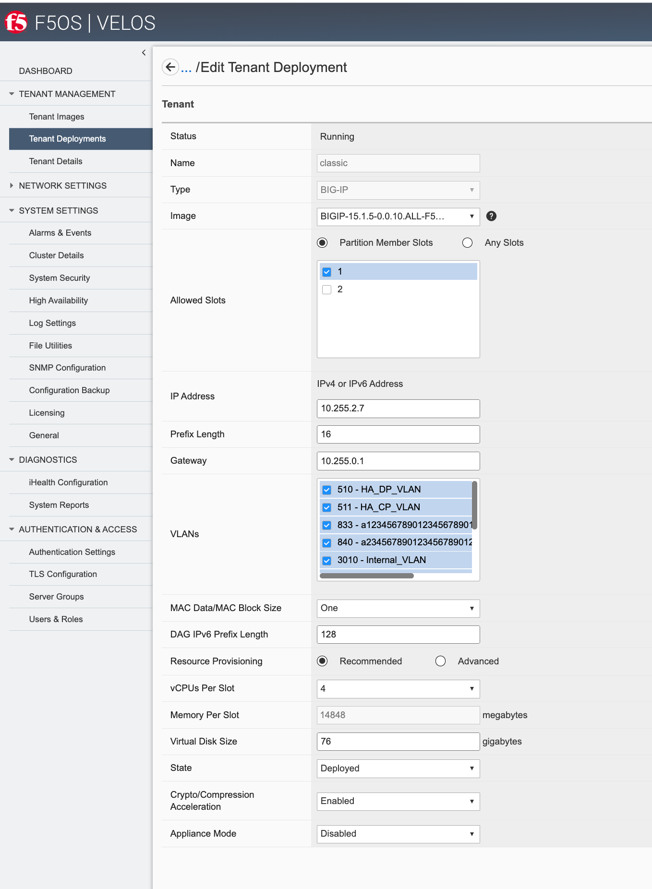
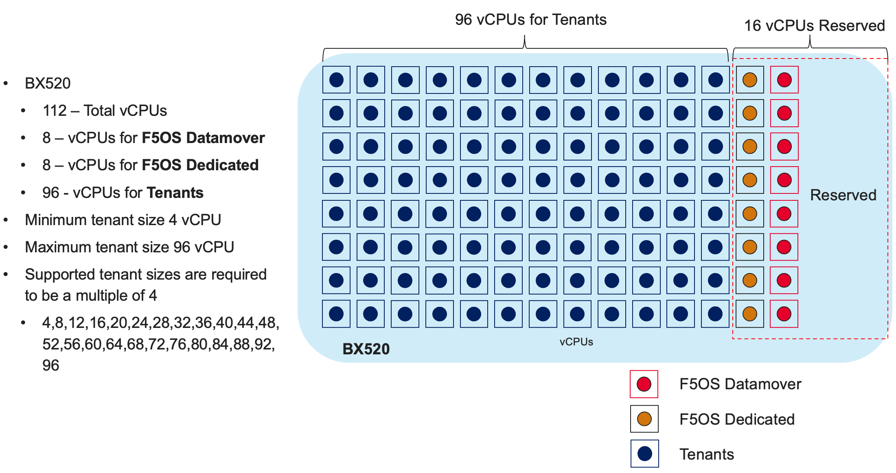

============
Multitenancy
============

In previous generation chassis and appliances, F5 supported **vCMP** as a means of providing multitenancy and virtualization. vCMP allowed for configuration of **Guests**; which were independent virtualized instances of BIG-IP. VELOS provides a similar type of virtualization experience; however it is not based on vCMP. Instead, VELOS allows for **Tenants** to be created, which are virtualized instances of BIG-IP on top of the containerized F5OS layer. 

Unlike VIPRION, where vCMP is an option that can added to the chassis, VELOS is multitenant by default. There is no option for a “bare metal” configuration; tenancy is baked into the architecture. You may configure one large tenant to emulate a “bare-metal” BIG-IP configuration if required. For customers that run bare-metal in VIPRION today, the L4-7 configuration and inherited VLANs will be migrated into a VELOS tenant, and the lower-level networking (interfaces, Link Aggregation Groups, and VLANs) will be configured in the F5OS-C platform layer. Below is a depiction of BIG-IP tenants running on top of the F5OS layer. 

.. image:: images/velos_multitenancy/image1.png
  :align: center
  :scale: 80%

Each tenant will run as a Virtual Machine via a technology called Kubevirt, which allows Virtual Machines to run on top of a containerized architecture. The tenant itself will run TMOS, and it will be managed like a vCMP guest is managed. Note, the tenant is not a Virtual Edition (VE), it is a highly optimized virtual machine that is fully integrated with the underlying hardware and supports all the traditional hardware offload capabilities like SSL/TLS offload, FASTL4 forwarding, DDoS mitigation, and much more. In the future, when BIG-IP Next tenants are supported in VELOS, those tenants will run in their native containerized mode, and not run as a Virtual Machine.

Creating a VELOS tenant is nearly identical to creating a vCMP guest on VIPRION, with a few exceptions. When creating a VELOS tenant, you’ll provide a name, a TMOS image for the tenant to run, which slots (blades) the tenant will be configured to run on, out-of-band IP addressing/mask and gateway, and which VLANs the tenant should inherit. Just like a vCMP guest, the VLANs are configured at provision time and not within the tenant itself. The tenant will inherit VLANs that have been configured at the F5OS platform layer and have been added to the tenant configuration by the administrator during provisioning.

For resource provisioning, you can use **Recommended** settings or **Advanced** settings. Recommended, will allocate the minimum amount of memory in proportion the number of vCPUs assigned to the tenant. Advanced mode will allow you to customize the memory allocation for this tenant and over-allocate if desired, without having to allocate additional vCPUs. This is something not possible in VIPRION, but now you can over-provision memory assigned to the tenant. The default memory allocations for Recommended mode are shown below.

+---------------------+--------------------+--------------------------+-------------------+-----------------+
| **Tenant Size**     | **Physical Cores** | **Logical Cores (vCPU)** | **Min Bytes RAM** | **RAM/vCPU**    |
+=====================+====================+==========================+===================+=================+
| BX110 1vCPU Tenant  | 0.5                |  1                       | 4,096,000,000     | 4,096,000,000   |
+---------------------+--------------------+--------------------------+-------------------+-----------------+
| BX110 2vCPU Tenant  | 1                  |  2                       | 7,680,000,000     | 3,840,000,000   |
+---------------------+--------------------+--------------------------+-------------------+-----------------+
| BX110 4vCPU Tenant  | 2                  |  4                       | 14,848,000,000    | 3,712,000,000   |
+---------------------+--------------------+--------------------------+-------------------+-----------------+
| BX110 6vCPU Tenant  | 3                  |  6                       | 22,016,000,000    | 3,669,333,333   |
+---------------------+--------------------+--------------------------+-------------------+-----------------+
| BX110 8vCPU Tenant  | 4                  |  8                       | 29,184,000,000    | 3,648,000,000   |
+---------------------+--------------------+--------------------------+-------------------+-----------------+
| BX110 10vCPU Tenant | 5                  |  10                      | 36,352,000,000    | 3,635,200,000   |
+---------------------+--------------------+--------------------------+-------------------+-----------------+
| BX110 12vCPU Tenant | 6                  |  12                      | 43,520,000,000    | 3,626,666,667   |
+---------------------+--------------------+--------------------------+-------------------+-----------------+
| BX110 14vCPU Tenant | 7                  |  14                      | 50,688,000,000    | 3,620,571,429   |
+---------------------+--------------------+--------------------------+-------------------+-----------------+
| BX110 16vCPU Tenant | 8                  |  16                      | 57,856,000,000    | 3,616,000,000   |
+---------------------+--------------------+--------------------------+-------------------+-----------------+
| BX110 18vCPU Tenant | 9                  |  18                      | 65,024,000,000    | 3,612,444,444   |
+---------------------+--------------------+--------------------------+-------------------+-----------------+
| BX110 20vCPU Tenant | 10                 |  20                      | 72,192,000,000    | 3,609,600,000   |
+---------------------+--------------------+--------------------------+-------------------+-----------------+
| BX110 22vCPU Tenant | 11                 |  22                      | 79,360,000,000    | 3,607,272,727   |
+---------------------+--------------------+--------------------------+-------------------+-----------------+

Each BX110 blade has 128GB of memory. The F5OS layer takes about 33GB of RAM leaving ~95GB of RAM for use by tenants. Using the Recommended values per tenant; ~80GB of RAM will be used, leaving ~15GB of additional RAM. You may over-allocate RAM to a tenant until the 90GB of RAM is depleted. There is a formula for figuring out the minimum amount of RAM a particular tenant size will receive using the recommended values:

**min-memory = (3.5 * 1024 * vcpu-cores-per-node) + 512**

Each BX110 blade has 28 vCPUs, however 6 of those vCPUs are dedicated to the F5OS platform layer and the data mover (CPU to FPGA interconnect). This leaves 22 vCPUs left over for use by tenants. You can dedicate all 22 vCPUs to one large tenant, or you can allocate smaller numbers of VCPUs per tenant so that you can deploy many tenants. Below is a diagram depicting the CPU/vCPUs on a single BX110 blade.

.. image:: images/velos_multitenancy/image3.png
  :align: center
  :scale: 70%

Single vCPU (Skinny) tenants are supported, but that option is hidden under **Advanced** mode. This would allow for 22 single vCPU tenants per BX110 blade. While single vCPUs guests are supported, they are not recommended for most environments. This is because a single vCPU tenant is running on a single hyperthread, and performance of a single thread can be influenced by other services running on the other hyperthread of a CPU. Since this can lead to unpredictable behavior, only a very lightly loaded LTM/DNS-only type tenant should be considered for this option. As always proper sizing should be done to ensure the tenant has enough resources. 

For the BX520 the default memory allocations for Recommended mode are shown below.

+---------------------+--------------------+--------------------------+-------------------+-----------------+
| **Tenant Size**     | **Physical Cores** | **Logical Cores (vCPU)** | **Min Bytes RAM** | **RAM/vCPU**    |
+=====================+====================+==========================+===================+=================+
| BX520 1vCPU Tenant  | 0.5                |  1                       | 4,096,000,000     | 4,096,000,000   |
+---------------------+--------------------+--------------------------+-------------------+-----------------+
| BX520 2vCPU Tenant  | 1                  |  2                       | 7,680,000,000     | 3,840,000,000   |
+---------------------+--------------------+--------------------------+-------------------+-----------------+
| BX520 4vCPU Tenant  | 2                  |  4                       | 14,848,000,000    | 3,712,000,000   |
+---------------------+--------------------+--------------------------+-------------------+-----------------+
| BX520 6vCPU Tenant  | 3                  |  6                       | 22,016,000,000    | 3,669,333,333   |
+---------------------+--------------------+--------------------------+-------------------+-----------------+
| BX520 8vCPU Tenant  | 4                  |  8                       | 29,184,000,000    | 3,648,000,000   |
+---------------------+--------------------+--------------------------+-------------------+-----------------+
| BX520 10vCPU Tenant | 5                  |  10                      | 36,352,000,000    | 3,635,200,000   |
+---------------------+--------------------+--------------------------+-------------------+-----------------+
| BX520 12vCPU Tenant | 6                  |  12                      | 43,520,000,000    | 3,626,666,667   |
+---------------------+--------------------+--------------------------+-------------------+-----------------+
| BX520 14vCPU Tenant | 7                  |  14                      | 50,688,000,000    | 3,620,571,429   |
+---------------------+--------------------+--------------------------+-------------------+-----------------+
| BX520 16vCPU Tenant | 8                  |  16                      | 57,856,000,000    | 3,616,000,000   |
+---------------------+--------------------+--------------------------+-------------------+-----------------+
| BX520 18vCPU Tenant | 9                  |  18                      | 65,024,000,000    | 3,612,444,444   |
+---------------------+--------------------+--------------------------+-------------------+-----------------+
| BX520 20vCPU Tenant | 10                 |  20                      | 72,192,000,000    | 3,609,600,000   |
+---------------------+--------------------+--------------------------+-------------------+-----------------+
| BX520 22vCPU Tenant | 11                 |  22                      | 79,360,000,000    | 3,605,333,333   |
+---------------------+--------------------+--------------------------+-------------------+-----------------+
| BX520 24vCPU Tenant | 12                 |  24                      | 86,528,000,000    | 3,603,692,308   |
+---------------------+--------------------+--------------------------+-------------------+-----------------+
| BX520 26vCPU Tenant | 13                 |  26                      | 93,696,000,000    | 3,602,285,714   |
+---------------------+--------------------+--------------------------+-------------------+-----------------+
| BX520 28vCPU Tenant | 14                 |  28                      | 100,864,000,000   | 3,601,066,667   |
+---------------------+--------------------+--------------------------+-------------------+-----------------+
| BX520 30vCPU Tenant | 15                 |  30                      | 108,032,000,000   | 3,600,000,000   |
+---------------------+--------------------+--------------------------+-------------------+-----------------+
| BX520 32vCPU Tenant | 16                 |  32                      | 115,200,000,000   | 3,599,058,824   |
+---------------------+--------------------+--------------------------+-------------------+-----------------+
| BX520 34vCPU Tenant | 17                 |  34                      | 122,368,000,000   | 3,598,222,222   |
+---------------------+--------------------+--------------------------+-------------------+-----------------+
| BX520 36vCPU Tenant | 18                 |  36                      | 129,546,000,000   | 3,597,473,684   |
+---------------------+--------------------+--------------------------+-------------------+-----------------+
| BX520 38vCPU Tenant | 19                 |  38                      | 136,704,000,000   | 3,596,800,000   |
+---------------------+--------------------+--------------------------+-------------------+-----------------+
| BX520 40vCPU Tenant | 20                 |  40                      | 143,872,000,000   | 3,596,190,476   |
+---------------------+--------------------+--------------------------+-------------------+-----------------+
| BX520 42vCPU Tenant | 21                 |  42                      | 151,040,000,000   | 3,595,190,476   |
+---------------------+--------------------+--------------------------+-------------------+-----------------+
| BX520 44vCPU Tenant | 22                 |  44                      | 158,208,000,000   | 3,595,636,364   |
+---------------------+--------------------+--------------------------+-------------------+-----------------+
| BX520 46vCPU Tenant | 23                 |  46                      | 165,376,000,000   | 3,595,130,435   |
+---------------------+--------------------+--------------------------+-------------------+-----------------+
| BX520 48vCPU Tenant | 24                 |  48                      | 172,544,000,000   | 3,594,666,667   |
+---------------------+--------------------+--------------------------+-------------------+-----------------+
| BX520 50vCPU Tenant | 25                 |  50                      | 179,712,000,000   | 3,594,240,000   |
+---------------------+--------------------+--------------------------+-------------------+-----------------+
| BX520 52vCPU Tenant | 26                 |  52                      | 186,880,000,000   | 3,593,846,154   |
+---------------------+--------------------+--------------------------+-------------------+-----------------+
| BX520 54vCPU Tenant | 27                 |  54                      | 194,048,000,000   | 3,593,481,481   |
+---------------------+--------------------+--------------------------+-------------------+-----------------+
| BX520 56vCPU Tenant | 28                 |  56                      | 201,216,000,000   | 3,593,142,857   |
+---------------------+--------------------+--------------------------+-------------------+-----------------+
| BX520 58vCPU Tenant | 29                 |  58                      | 208,384,000,000   | 3,592,827,586   |
+---------------------+--------------------+--------------------------+-------------------+-----------------+
| BX520 60vCPU Tenant | 30                 |  60                      | 215,552,000,000   | 3,592,533,333   |
+---------------------+--------------------+--------------------------+-------------------+-----------------+
| BX520 62vCPU Tenant | 31                 |  62                      | 222,720,000,000   | 3,592,258,065   |
+---------------------+--------------------+--------------------------+-------------------+-----------------+
| BX520 64vCPU Tenant | 32                 |  64                      | 229,888,000,000   | 3,592,000,000   |
+---------------------+--------------------+--------------------------+-------------------+-----------------+
| BX520 66vCPU Tenant | 33                 |  66                      | 237,056,000,000   | 3,591,757,576   |
+---------------------+--------------------+--------------------------+-------------------+-----------------+
| BX520 68vCPU Tenant | 34                 |  68                      | 244,224,000,000   | 3,591,529,412   |
+---------------------+--------------------+--------------------------+-------------------+-----------------+
| BX520 70vCPU Tenant | 35                 |  70                      | 251,392,000,000   | 3,591,314,286   |
+---------------------+--------------------+--------------------------+-------------------+-----------------+
| BX520 72vCPU Tenant | 36                 |  72                      | 258,560,000,000   | 3,591,111,111   |
+---------------------+--------------------+--------------------------+-------------------+-----------------+
| BX520 74vCPU Tenant | 37                 |  74                      | 265,728,000,000   | 3,590,918,919   |
+---------------------+--------------------+--------------------------+-------------------+-----------------+
| BX520 76vCPU Tenant | 38                 |  76                      | 272,896,000,000   | 3,590,736,842   |
+---------------------+--------------------+--------------------------+-------------------+-----------------+
| BX520 78vCPU Tenant | 39                 |  78                      | 280,064,000,000   | 3,590,564,103   |
+---------------------+--------------------+--------------------------+-------------------+-----------------+
| BX520 80vCPU Tenant | 40                 |  80                      | 287,232,000,000   | 3,590,400,000   |
+---------------------+--------------------+--------------------------+-------------------+-----------------+
| BX520 82vCPU Tenant | 41                 |  82                      | 294,400,000,000   | 3,590,243,902   |
+---------------------+--------------------+--------------------------+-------------------+-----------------+
| BX520 84vCPU Tenant | 42                 |  84                      | 301,568,000,000   | 3.590,095,238   |
+---------------------+--------------------+--------------------------+-------------------+-----------------+
| BX520 86vCPU Tenant | 43                 |  86                      | 308,736,000,000   | 3,589,953,488   |
+---------------------+--------------------+--------------------------+-------------------+-----------------+
| BX520 88vCPU Tenant | 44                 |  88                      | 315,904,000,000   | 3,589,818,182   |
+---------------------+--------------------+--------------------------+-------------------+-----------------+
| BX520 90vCPU Tenant | 45                 |  90                      | 323,072,000,000   | 3,589,688,889   |
+---------------------+--------------------+--------------------------+-------------------+-----------------+
| BX520 92vCPU Tenant | 46                 |  92                      | 330,240,000,000   | 3,589,565,217   |
+---------------------+--------------------+--------------------------+-------------------+-----------------+
| BX520 94vCPU Tenant | 47                 |  94                      | 337,408,000,000   | 3,589,446,809   |
+---------------------+--------------------+--------------------------+-------------------+-----------------+
| BX520 96vCPU Tenant | 48                 |  96                      | 344,576,000,000   | 3,589,333,333   |
+---------------------+--------------------+--------------------------+-------------------+-----------------+

Each BX520 blade has 48 vCPUs, however 16 of those vCPUs are dedicated to the F5OS platform layer and the data mover (CPU to FPGA interconnect). This leaves 96 vCPUs left over for use by tenants. You can dedicate all 96 vCPUs to one large tenant, or you can allocate smaller numbers of VCPUs per tenant so that you can deploy many tenants. Below is a diagram depicting the CPU/vCPUs on a single BX110 blade.

Single vCPU (Skinny) tenants are supported, but that option is hidden under **Advanced** mode. This would allow for 96 single vCPU tenants per BX520 blade. While single vCPUs guests are supported, they are not recommended for most environments. This is because a single vCPU tenant is running on a single hyperthread, and performance of a single thread can be influenced by other services running on the other hyperthread of a CPU. Since this can lead to unpredictable behavior, only a very lightly loaded LTM/DNS-only type tenant should be considered for this option. As always proper sizing should be done to ensure the tenant has enough resources. 

A VELOS tenant supports 3 states: (**Configured**, **Provisioned**, and **Deployed**):

**Configured**

- The tenant configuration exists on the chassis partition, but the tenant is not running, and no hardware resources (CPU, memory) are allocated to it. This is the initial state and the default.

**Provisioned**

- Moves the tenant into the Provisioned state, which causes the system to install the software, assign the tenant to nodes, and create virtual disks for the tenant on those nodes. If you choose this option, it takes a few minutes to complete the provisioning. The tenant does not run while in this state.

**Deployed**

- Changes the tenant to the Deployed state. The tenant is set up, resources are allocated to the tenant, the image is moved onto the blade, the software is installed, and after those tasks are complete, the tenant is fully deployed and running. If you choose this option, it takes a few minutes to complete the deployment and bring up the system.

You may also configure **Crypto/Compression Acceleration**. This option is enabled by default, meaning the tenant will utilize and offload to crypto (SSL/TLS) and compression hardware, or it can be disabled meaning all crypto and compression will be done in software. It is highly recommended to use the default enabled option for best performance. 

In some VIPRION blades, there is an option to configure an **SSL Mode** for vCMP guests. This option is not available in VELOS, and the behavior may be different:

If you currently utilize the SSL Mode feature where SSL resources can be **Dedicated, Shared, or Isolated** for each vCMP guest, this configuration option is not supported on VELOS at initial release. vCMP guests operate in the default shared mode, meaning all guests get equal access to the shared SSL hardware resources. You may configure the SSL Mode to **dedicated**, where SSL hardware resources are dedicated to a guest in proportion to the vCPUs assigned to a guest. You may also configure **none**, meaning all SSL processing is done in software. 

In VELOS there is no **SSL Mode** configuration option. By default, you may configure the **Crypto/Compression Acceleration** option when deploying a VELOS tenant. The choices are **enabled** or **disabled**. When enabled, the system will assign SSL hardware resources in proportion to the number of vCPUs assigned to the tenant. This is conceptually like SSL Mode **Dedicated** works on vCMP guests, but not 100% the same implementation. When disabled, no SSL hardware resources are assigned to the tenant, and all processing is done in software. An environment currently running in the default shared mode will now be running in a mode that essentially mimics the SSL Mode Dedicated. 

Lastly, the tenant may be configured to support **Appliance Mode**, which is a security option that disables root and bash access to the tenant.
