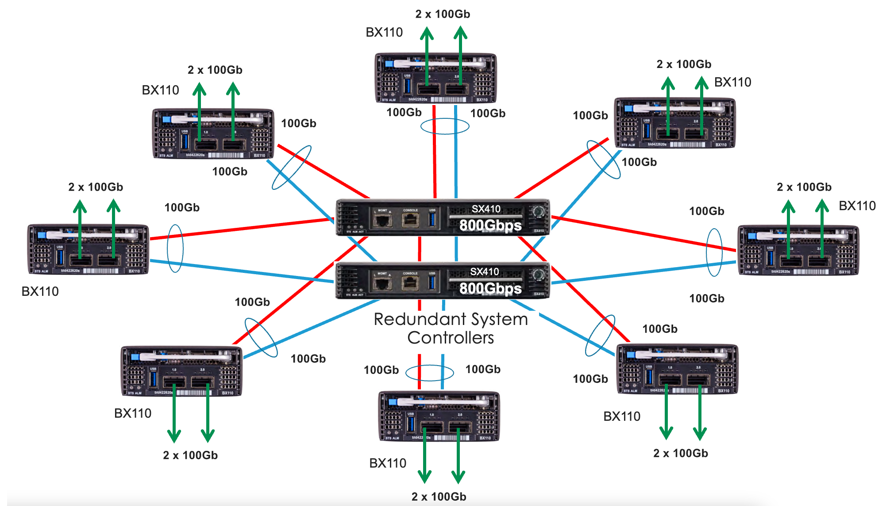

================
VELOS Networking
================

Platform Layer Isolation
========================

Management of the new F5OS-C platform layer is completely isolated from in-band traffic networking and VLANs. It is purposely isolated, so that it is only accessible via the out-of-band management network. In fact, there are no in-band IP addresses assigned to either the system controllers or the chassis partitions (The F5OS layer); only tenants will have in-band management IP addresses and access. Tenants also have out-of-band connectivity.

This allows customers to run a secure/locked-down out-of-band management network, where access is tightly restricted. The diagram below shows the out-of-band management access entering the VELOS chassis through the system controllers on the left. The system controllers bridge those external out-of-band connections to an internal out-of-band network, that connects to all chassis partitions and tenants within the VELOS chassis. 

.. image:: images/velos_networking/image1.png
  :align: center

Out-of-Band Management Network
==============================

All out-of-band networking is handled through the system controllers. Each system controller has its own static IP address, and there is also a floating IP address that will follow the active system controller. The system controller will also act as a bridge between the outside out-of-band network, and the out-of-band management VLAN inside the chassis. There is one common network/VLAN for out-of-band networking inside the chassis. All chassis partitions, and tenants will connect to this VLAN, and their default gateway should be pointed to a router on the outside of the chassis. You can attempt to isolate partitions and tenants on the OOB network by using separate IP networks that are multi-netted, but this does not provide true network isolation that a VLAN would provide. VLAN tagging is not supported on the out-of-band management ports on the system controllers.

Below is an example deployment; where each system controller has its own unique IP address, and an administrator can connect to either system controller (active/standby) directly, but the standby will be in a read-only mode. It is recommended that a floating IP address be configured, and that IP address will follow the active system controller, so that an admin using the F5OS API, CLI, or webUI can always connect to the active system controller. Note, the individual interfaces on each system controller can be bonded together into a single LAG for added redundancy.

.. image:: images/velos_networking/image2.png
  :align: center
  :scale: 50%

Chassis Partitions and Networking
=================================

Each chassis partition is a unique entity that has its own set of (local/remote) users and authentication. It is managed via a dedicated out-of-band IP address with its own F5OS CLI, webUI, and API access. A chassis partition can be dedicated to a specific group, and that group will only be able to access networking and tenants within their partition. They will not be able to access or share resources within other chassis partitions in the system. This is an added level of isolation that VIPRION did not have. Below are some examples:

.. image:: images/velos_networking/image3.png
  :align: center
  :scale: 70%

**Note: The environment above would require external networking connections between the chassis partitions if a tenant in one chassis partition needed to communicate with a tenant in another chassis partition.**

.. image:: images/velos_networking/image4.png
  :align: center
  :scale: 50%

In addition to management access being completely isolated and unique, in-band networking (for use by tenants) is configured and completely contained within the chassis partition. Each chassis partition will have its own set of networking components such as PortGroups, VLANs, LAGs, and interfaces. This means that networking within one chassis partition is not accessible or viewable from another chassis partition. 

Isolation at the network level is also enforced via the centralized switch fabrics that reside in the dual system controllers. In the VELOS system each blade has multiple connections into the centralized switch fabrics for redundancy and added bandwidth. Each BX110 blade has 2 x 100Gb backplane connections (one to each system controller), that are bonded together in a static LAG (Link Aggregation Group). This star-wired topology provides fast and reliable backplane connections between all the blades, and also allows for complete isolation at the networking layer.

When chassis partitions are created, the administrator will assign one or more blades, which are then isolated from all other blades in the chassis. The centralized switch fabrics are automatically configured with port based VLANs and VLAN tagging to enforce network isolation between chassis partitions. The diagrams below provide a visual of how this is enforced.

.. image:: images/velos_networking/image6.png
  :align: center
  :scale: 80%

In the example below, the chassis partition **Production** is completely isolated from the **QA/Dev Apps** chassis partition.

.. image:: images/velos_networking/image7.png
  :align: center
  :scale: 80%

Network Isolation
=================

To illustrate the point of how isolated chassis partitions are, the diagram below shows two VELOS chassis with multiple chassis partitions in each. Since there is no sharing of in-band network resources, each chassis partition must have its own network connectivity to the in-band networks, and for optional dedicated HA interconnects between the two chassis. There is no way to share interfaces, VLANs, or LAGs between chassis partitions. 

.. image:: images/velos_networking/image8.png
  :align: center
  :scale: 80%

Port Groups
===========

The portgroup component is used to control the mode of the physical port. This controls whether the port is bundled or unbundled, and the port speed. The term portgroup is used rather than simply “port” because some front panel ports may accept different types of optics. Depending on the portgroup mode value, a different FPGA version is loaded, and the speed of the port is adjusted accordingly. The user can modify the portgroup mode as needed through the F5OS CLI, webUI, or API.

.. image:: images/velos_networking/image9.png
  :width: 45%

.. image:: images/velos_networking/image10.png
  :width: 45%

In releases prior to F5OS-C 1.5.1 both ports on a BX110 blade must be configured for the same mode, both ports must be either 100GB, 40GB, 4 x 25GB, or 4 x 10GB; there was no support for mixing modes on the same blade. You could have different options across different blades within the same chassis partition, but within a single blade, the ports had to be the same. F5OS-C 1.5.1 introduced more flexible options for port group configurations within the same blade. The table below shows the new heterogeneous port modes that were introduced in F5OS-C 1.5.1.

.. image:: images/velos_networking/image10a.png
   :align: center
   :scale: 70%

Below is an example of the chassis partition webUI Port Groups screen. Note that any changes in configuration will require a reboot of the blade to load a new FPGA bitstream image.

.. image:: images/velos_networking/image11.png
   :align: center
   :scale: 70%

Interfaces
==========

Interface numbering will vary depending on the current portgroup configuration. Interfaces will always be numbered by **<blade#>/<port#>**. The number of ports on a blade will change depending on if the portgroup is configured as bundled, or unbundled. If the ports are bundled then ports will be **1/1.0** and **1/2.0** for slot 1, and **2/1.0** and **2/2.0** for slot 2. 

If ports are unbundled, then the port numbering will be **1/1.1, 1/1.2, 1/1.3, and 1/1.4** for the first physical port and **1/2.1, 1/2.2, 1/2.3, and 1/2.4** for the second physical port. Breakout cables will be needed to support the unbundled 25Gb, or 10Gb configurations. Even when multiple chassis partitions are used, the port numbering will stay consistent starting with the blade number. Below is an example of port numbering when all interfaces are bundled.

.. image:: images/velos_networking/image12.png
  :align: center

Below is an example of port numbering when all interfaces are unbundled.

.. image:: images/velos_networking/image12a.png
  :align: center

Supported Optics
================

Only F5 branded optics are officially supported on VELOS. The BX110 blade supports speeds of 10Gb, 25Gb, 40Gb, and 100Gb depending on the type of optics used, and the port group configuration. VELOS interfaces will accept F5 approved QSFP+ or QSFP28 optics. Third-party optics are not officially supported per F5 support policies: https://support.f5.com/csp/article/K8153. 

**40GB QSFP+ options:**

+------------------------+------------+------------------------------------------------------------------------------+
| 40GBASE-LR4 (QSFP+)    | OPT-0030   | TRANSCEIVER, QSFP+, 40G-LR4, 10KM, LC, SMF, DDM, F5 BRANDED                  |
+------------------------+------------+------------------------------------------------------------------------------+
| 40GBASE-SR4 (QSFP+)    | OPT-0036   | TRANSCEIVER, QSFP+, 40GIG-SR4, 850NM, 100M, MPO, RESET, MMF, DDM, F5 BRANDED |
+------------------------+------------+------------------------------------------------------------------------------+
| 40G BiDi (QSFP+)       | OPT-0043   | TRANSCEIVER, QSFP+, 2X20G BIDI 850NM-900NM, 100M, LC, MMF, DDM, F5 BRANDED   |
+------------------------+------------+------------------------------------------------------------------------------+
| 40G-PSM4 (QSFP+)       | OPT-0045   | TRANSCEIVER, QSFP+, 40GIG-PSM4, 1310NM, 10KM, MPO, SMF, DDM, F5 BRANDED      |
+------------------------+------------+------------------------------------------------------------------------------+

**100GB QSFP28 options:**

+------------------------+------------+----------------------------------------------------------------------------------+
| 100GBASE-SR4 (QSFP28)  | OPT-0031   | TRANSCEIVER, QSFP28, 100G-SR4, 850NM, MMF, MPO, DDM, BRANDED                     |
+------------------------+------------+----------------------------------------------------------------------------------+
| 100GBASE-LR4 (QSFP28)  | OPT-00352  | TRANSCEIVER, QSFP28, 100G-LR4, 10KM, LC, SMF, 4.5W, DDM, VELOCITY SDK, BRANDED   |
+------------------------+------------+----------------------------------------------------------------------------------+
| 100G-PSM4 (QSFP28)     | OPT-0055   | TRANSCEIVER, QSFP28, 100GIG-PSM4, 1310NM, 500M, MPO, SMF, F5 BRANDED             |
+------------------------+------------+----------------------------------------------------------------------------------+
| 100G BIDI (QSFP28)     | OPT-0047   | TRANSCEIVER, QSFP28, 100G BIDI, 100M, LC, MMF, F5 BRANDED (Planned for mid CY21) |
+------------------------+------------+----------------------------------------------------------------------------------+

**Note: OPT-0039 QSFP28 LR4 used in VIPRION/iSeries are compatible with VELOS, but default optics for 100G SR4 VEOS is OPT-0052 (as shown above)**.

Below are the current VELOS optic SKUs:

**Note: 100G BiDi is planned (please contact product management to discuss your requirements, as there are different standards available in the market)**.

+----------------------+------+---------------------------------------------------------------------------------------+
| F5-UPGVELQSFP28LR4   | MY   | VELOS Field Upgrade: QSFP28 Transceiver (100G-LR4, 10KM, LC, SMF, DDM) ROHS           |
+----------------------+------+---------------------------------------------------------------------------------------+
| F5-UPGVELQSFP28PSM4  | TH   | VELOS Field Upgrade: QSFP28 Transceiver (100G-PSM4, 500M, MPO/APC, SMF, DDM) ROHS     |
+----------------------+------+---------------------------------------------------------------------------------------+
| F5-UPGVELQSFP28-SR4  | PH   | VELOS Field Upgrade: QSFP28 Transceiver (100G-SR4, 100M, MPO MMF, DDM) ROHS           |
+----------------------+------+---------------------------------------------------------------------------------------+
| F5-UPG-VEL-QSFP+BD   | PH   | VELOS Field Upgrade: QSFP+ Transceiver (2x20G-BIDI, 850NM-900NM, 100M, LC, MMF, DDM)  |
+----------------------+------+---------------------------------------------------------------------------------------+
| F5-UPG-VEL-QSFP+LR4  | MY   | VELOS Field Upgrade: QSFP+ Transceiver (40G-LR, 1310NM, 10KM, LC, SMF, DDM Support)   |
+----------------------+------+---------------------------------------------------------------------------------------+
| F5-UPG-VEL-QSFP+PSM4 | PH   | VELOS Field Upgrade: QSFP+ Transceiver (40G-PSM4, 1310NM, 10KM, MPO/APC, SMF, DDM )   |
+----------------------+------+---------------------------------------------------------------------------------------+
| F5-UPG-VEL-QSFP+SR4  | CN   | VELOS Field Upgrade: QSFP+ Transceiver (40G-SR4, 850NM, 100M, MPO, DDM Support)       |
+----------------------+------+---------------------------------------------------------------------------------------+

The QSFP+ and QSFP28 optics when configured for unbundled mode, will break out into either 4 x 25Gb (with a 100Gb QSFP28 optic) or 4 x 10Gb (with a 40Gb QSFP+ optic). You will need to utilize a breakout cable to allow the single physical port to break out into 4 lower speed ports. The following breakout cable SKUs can be ordered and utilized for either 4 x 25Gb, or 4 x 10GB depending on the optic installed. Note, they come in different lengths (1 meter, 3 meters, or 10 meters) and each of the SKUs is a 2 Pack.

+---------------------+------+--------------------------------------------------------------------------------------------+
| F5-UPGVELSR4XSR3M   | CN   | VELOS Field Upgrade: QSFP28-QSFP+ Breakout Cable for SR4 ONLY MPO to 4LC (3 Meter 2 Pack)  |
+---------------------+------+--------------------------------------------------------------------------------------------+
| F5-UPGVELSR4XSR1M   | CN   | VELOS Field Upgrade: QSFP28-QSFP+ Breakout Cable for SR4 ONLY MPO to 4LC (1 Meter 2 Pack)  |
+---------------------+------+--------------------------------------------------------------------------------------------+
| F5-UPGVELSR4XSR10M  | CN   | VELOS Field Upgrade: QSFP28-QSFP+ Breakout Cable for SR4 ONLY MPO to 4LC (10 Meter 2 Pack) |
+---------------------+------+--------------------------------------------------------------------------------------------+

Breakout for 40G PSM4 or 100G PSM4 transceivers *ONLY* (Note these are not 2 pack):

+---------------------+------+----------------------------------------------------------------------------------------------+
| F5-UPG-VELPSMXLR10M   | CN   | VELOS Field Upgrade: QSFP28-QSFP+ Breakout Cable for PSM4 ONLY. MPO/APC to 4LC (10 Meter)  |
+---------------------+------+----------------------------------------------------------------------------------------------+
| F5-UPG-VELPSM4XLR3M   | CN   | VELOS Field Upgrade: QSFP28-QSFP+ Breakout Cable for PSM4 ONLY. MPO/APC to 4LC (3 Meter)   |
+---------------------+------+----------------------------------------------------------------------------------------------+

VLANs
=====

VELOS supports both 802.1Q tagged and untagged VLAN interfaces. In the current F5OS releases, double VLAN tagging (802.1Q-in-Q) is not supported. Any port within a chassis partition, even across blades can be added to a VLAN, and VLANs are specific to that chassis partition. VLAN IDs (which may or may not be the same logical VLAN) can be re-used across different chassis partitions, and tenants within a chassis partition can share the same VLANs. Any VLANs that are configured on different chassis partitions will not be able to communicate inside the chassis, they will need to be connected via an external switch to facilitate communication between them.

Link Aggregation Groups
=======================

VELOS allows for bonding of interfaces into Link Aggregation Groups or LAGs. LAGs can span across blades, as long as blades are in the same chassis partition. Links within a LAG must be the same type and speed. LAGs may be configured for **static** or **lacp** mode. The maximum number of members within a single LAG is 32.

An admin can configure the **LACP Type** to **LACP** or **Static**, the **LACP Mode** to be **Active** or **Passive**, and the **LACP Interval** to **Slow** or **Fast**.  
