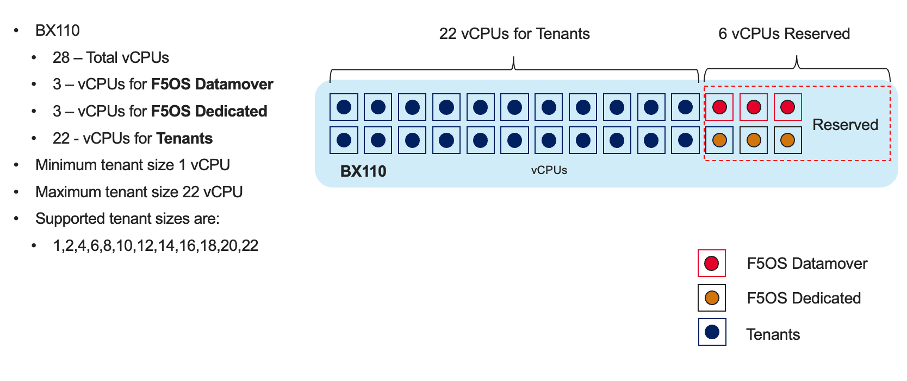

==========================
VELOS Performance and Sizing
==========================

VELOS blades are a new generation of hardware using the latest Intel CPUs for processing in addition to FPGAs. Intel CPUs perform SSL processing and compression offload as was done with previous generation BIG-IP solutions such as iSeries and the VIPRION B4450. Older VIPRION blades such as the B2100, B2150, & B2250 use Intel processing, but use Cavium Nitrox for SSL offload. The newer generation Intel chipsets provide more modern SSL cipher support and can offload ECC (Elliptical Curve) based ciphers in hardware, which most previous generations of VIPRION blades could not.

In addition to more modern Intel chipsets, both the BX110 and BX520 blades also have extensive FPGA support. In previous generations of F5 hardware the ePVA was used to offload varying workloads from FASTL4 to DDoS mitigation, and that functionality is brought forward and expanded upon in the new generation of VELOS hardware. 

Some additional links on the benefits of hardware offload using the ePVA in previous generation BIG-IP solutions:

`Embedded Packet Velocity (ePVA) Acceleration Table <https://techdocs.f5.com/content/dam/f5/kb/global/solutions/sol12837_pdf.html/12837.pdf>`_

`F5 Fast L4 Acceleration and the F5 Smart Coprocessor (prioritized Fast L4 Acceleration) <https://devcentral.f5.com/s/articles/F5-Fast-L4-Acceleration-and-the-F5-Smart-Coprocessor-prioritized-Fast-L4-Acceleration>`_

In VELOS for the BX110 blade there are now two distinct FPGAs, the **Application Traffic Services Engine** (ATSE), and the **VELOS Queuing FPGA** (VQF). The BX520 blade also leverages the VQF and ATSE, but the BX520 has two ATSE FPGAs compared to just one for the BX110. There is an additional FPGA called the Traffic Aggregation Module (TAM) on the BX520 which handles the 100Gb and 400Gb physical interface management. In addition to supporting functions done by the ePVA in previous generations, there are additional functions that were performed in software or Broadcom chipsets that are now handled in the FPGAs.

.. image:: images/velos_performance_and_sizing/image1.png
  :align: center
  :scale: 70%

When comparing performance of VELOS to VIPRION C2400 it is important to note that VELOS is more scalable as it has double the number of slots (8 in VELOS compared to 4 in VIPRION), so the amount of performance in the same RU (Rack Unit) is significantly increased. The VELOS blades are half the width of the current B2250 blades in VIPRION. Looking at comparisons of VIPRION B2150 and B2250 against a single VELOS BX110 blade you can see a 1.5x-3x increase in Layer 7 Requests Per Second (RPS) performance depending on which blade you may be migrating from. From an SSL perspective the increase is 2.3x-10x for RSA based ciphers, and for Elliptical Curve the BX110 can now offload that to hardware, whereas the B2150 and B2250 had to process those ciphers in software consuming more CPU.

.. image:: images/velos_performance_and_sizing/image2.png
  :align: center
  :scale: 70%

The real value of VELOS is the ability to scale from 3-6x for Layer 7 RPS and up to 20x for SSL (RSA) when comparing fully loaded chassis (4 VIPRION blades vs. 8 VELOS blades) in the same 4RU footprint.

.. image:: images/velos_performance_and_sizing/image3.png
  :align: center
  :scale: 40%

When comparing VELOS to VIPRION C4480/4800 it is important to note that the current VELOS BX110 blade is not as dense CPU-wise as the current generation B4450 blade. In many cases it may take 2 BX110 blades to provide similar CPU density/performance as a single B4450 blade. The sizing will be dependent on the configuration of the current generation blades, how utilized they are, and how vCMP is configured. Note in the case of DNS, responses per second are significantly higher on the B4450 (6.4m rps) compared to BX110 (2.5m rps). Below are some single blade comparisons of the B4340N, B4450N and a single VELOS BX110 blade. And then single blade comparisons of the B4300, B4450 and a single VELOS BX110 blade.

.. image:: images/velos_performance_and_sizing/image4.png
  :align: center
  :scale: 40%

.. image:: images/velos_performance_and_sizing/image5.png
  :align: center
  :scale: 40%

The VELOS CX410 chassis is only 4U compared to the VIPRION 4480 (7RU) and VIPRION 4800 (16RU) chassis so comparing performance per RU may be a more important metric. The other important factor is cost: a single BX110 blade is half the price of the VIPRION B4450 blade so a fairer comparison would be two BX110 blades to a single B4450 blade. Two BX110 blades will compare very well to a single B4450 blade with some metrics being higher, and some slightly lower than the B4450 but at the same pricepoint. 

.. image:: images/velos_performance_and_sizing/image6.png
  :align: center
  :scale: 40%

.. image:: images/velos_performance_and_sizing/image7.png
  :align: center
  :scale: 40%

Below is an example of a B4450 configuration (excluding chassis) with 4 blades and an identical priced VELOS BX110 solution (excluding chassis) with 8 blades. For the same price the VELOS configuration will provide higher performance at a lower footprint.

.. image:: images/velos_performance_and_sizing/image8.png
  :align: center
  :scale: 40%

.. image:: images/velos_performance_and_sizing/image9.png
  :align: center
  :scale: 40%

The performance numbers for VELOS already include any overhead for multitenancy as the platform is multitenant by default. There is nothing to switch on to enable multitenancy. VIPRION on the other hand has the option of running multitenancy by enabling vCMP. Published data sheet numbers for VIPRION are for bare-metal mode, where no virtualization (vCMP) is enabled. Enabling vCMP on VIPRION has overhead and will reduce the overall performance of a blade as the hypervisor takes up CPU and memory resources.

How much performance drops can vary for different metrics, but F5 has always sized environments using a rule of thumb of ~20% hit on performance for enabling virtualization/vCMP. With VELOS the published data sheet numbers are with multitenancy enabled, so there is no need to calculate in an additional 20% drop due to virtualization being enabled.  

vCPU Sizing
===========

Each VELOS BX110 blade has 28 vCPUs, but 6 of those vCPUs are reserved for use by the F5OS platform layer and data mover (FPGA to CPU interconnect). This is different than VIPRION where each vCPU gave a portion of its processing and memory to the hypervisor. In VELOS 22 vCPUs are available per blade to be assigned to tenants since the other 6 are reserved by the F5OS platform layer. The diagram below depicts the BX110 blade vCPU allocation: 

.. image:: images/velos_performance_and_sizing/image10.png
  :align: center
  :scale: 70%

When sizing, removing the 6 dedicated vCPUs from the equation will give a better representation of what the per vCPU performance will be. Comparing the performance of a single vCPU can be important for control plane sizing and for extrapolation of what a tenant’s performance may be. Below is a comparison on the CPUs on the VIPRION B2250, VELOS BX110, and VIPRION B4450. Note that the VELOS sizing is more complex because of the way the CPUs are used. Since 3 physical / 6 vCPUs are dedicated for use by the platform layer, overall CPU performance can be misleading. 

The graphs below compare 1 and 2 blade configurations of the B2250 vs. a single B4450 blade, and 1 and 2 blade VELOS BX110 configurations. There are comparisons which include all the vCPUs on a BX110, and another set which removes the 6 vCPUs used for the platform layer (more realistic). Instead of showing 14 physical cores and 28 vCPUs, VELOS is sized using 11 physical cores and 22 vCPUs (listed as "minus platform Layer CPU").

.. image:: images/velos_performance_and_sizing/image11.png
  :align: center
  :scale: 70%

.. image:: images/velos_performance_and_sizing/image12.png
  :align: center
  :scale: 70%

To compare performance of VIPRION against VELOS you can first look at overall CPU capacity of the system, and then break that down to per vCPU performance to get a fair comparison. In a typical sizing exercise, it is normal to look at the overall data sheet metric you are interested in divided by the total number of vCPUs in the system to come up with a per vCPU metric. Because VELOS dedicates some of its processing to the F5OS platform layer, we remove them from the overall sizing metric so that numbers don’t get skewed. As an example, take the overall BX110 blade performance metrics then divide by the total vCPUs on the blades minus the 6 vCPUs for the platform layer (divide by 22). In the past some have used total or aggregate CPU Ghz as a means of comparing different platforms. This may work well when comparing similar generation and architecture platforms but may not be the best metric given the changes in VELOS. VELOS has more modern processors, which are more efficient and can boost to higher rates than previous generation processors so looking at aggregate processor speed (total Ghz) only is not sufficient to get accurate sizing. 

In the past **Relative CPU Scale** was a numeric grade-based comparison where the overall CPU capacity/horsepower of the system was given a rating. The rating is an easy way to compare different BIG-IP platforms. The Relative CPU Scale is calculated by taking the total # of CPUs in a system (not including those used by VELOS platform layer) and multiplying that times the speed (Ghz) that the processors run. This will result in an aggregate CPU Ghz for the platform or blade. We then take the Aggregate CPU Ghz of a BIG-IP 2000s platform and give it a grade of 1. All other platforms are then given a numeric grade of how many times faster it is than the 2000s. This results in a simple numeric rating system that combines CPU speed with the number of CPUs without having explain Ghz.

In the graph below you can see that a B2250 blade has 10 times more aggregate CPU capacity than the 2000s.  A VELOS BX110 blade will have either 8.7x (minus platform CPUs) or 11.1x (including platform CPUs) and a 4450 blade has 22x. What may be deceiving here is how this translates into performance because the BX110 has next generation processors, and a different architecture where some CPUs are dedicated to the platform layer. Using the Aggregate CPU Ghz, or Relative CPU scale would lead you to believe VELOS was less powerful than a B2250. This is not the case.

.. image:: images/velos_performance_and_sizing/image13.png
  :align: center
  :scale: 80%

To see how this really translates into performance, it is good to look at a Layer7 data sheet metric as that is something that will use a lot of CPU resources. If you look at the per blade Layer7 (Inf-Inf) numbers, you’ll notice VELOS provides higher numbers than a B2250 even though its rating is lower in the chart above. This is likely due to the newer generation of processors, the fact that some processing is dedicated to the platform layer, and the fact that the CPUs can boost higher than previous generations. Generally, a BX110 blade is going to be faster than a B2250 blade (each metric will vary), but it’s safe to propose BX110 blades as direct replacements for B2250 blades. Also keep in mind BX110 has the latest Intel processing and crypto support so things like ECC ciphers are now accelerated in hardware, which was not the case with VIPRION B2xxx blades. 

Note a BX110 blade is not intended to replace a single B4450 blade. The B4450 has ~2 times the processing power and vCPU count of a BX110 blade. In most cases it would take 2 BX110 blades to handle the workload of a single B4450. 

.. image:: images/velos_performance_and_sizing/image14.png
  :align: center
  :scale: 80%

Because each blade has a different number of CPUs, a common sizing exercise is to look at the per vCPU performance by using the formulas above to come up with a per vCPU metric. In the graph below it is done for Layer7 RPS (Inf-Inf), but you could use the same math for any metric. Note, the graph below is not derived from a per vCPU test, it is taking a published blade metric and dividing it by the number of available vCPUs to come up with a per vCPU metric. As mentioned above, using the VELOS metric which is (minus the platform CPUs) is the most realistic. As expected, the BX110 provides a better per vCPU Requests Per Second (RPS) than the B2250, but what may be surprising is that it has a higher RPS on a per vCPU basis than the B4450 as well. This is because the B4450 gets its overall speed due to the total number of vCPUs, and it has 2x more CPUs than the BX110. Even though the BX110 CPUs run slower (1.9Ghz vs. 2.2Ghz) than the B4450, the changes in architecture, more modern CPU etc., make it perform faster at the per vCPU metric.

.. image:: images/velos_performance_and_sizing/image15.png
  :align: center
  :scale: 80%

**NOTE: The per vCPU charts above are based on extrapolations, not per vCPU testing, so results may vary. This is generally acceptable for sizing use, as this is more a means of comparison of platform differences than a guarantee of a certain metric.**

Also consider that these extrapolations for the VIPRION blades are for bare metal configuration with no vCMP enabled. When extrapolating what the performance would be with vCMP enabled on a per vCPU basis the numbers for VIPRION blades would have 20% subtracted from them. VELOS on the other hand is multitenant by default, so there is no need to subtract 20% for virtualization overhead. The VELOS numbers are inclusive of multitenancy already.

Memory Sizing
=============

Each VELOS BX110 blade has 128GB of memory, which is double the current memory support of the B2250 blade (64GB) but half the current B4450 blade (256GB). Generally, a BX110 will have more than enough memory to replace a B2250 blade and will provide more memory which may help vCMP guests which are pushing memory limits.  Just like sizing based on L7 it will likely take 2 BX110 blades to replace a B4450 blade when looking at memory only. 

.. image:: images/velos_performance_and_sizing/image16.png
  :align: center
  :scale: 80%

Breaking down memory to get per vCPU numbers will help when dealing with current vCMP guest configurations where memory is allocated based on the number of vCPUs assigned to the guest. Because VELOS has a different architecture than VIPRION there is a formula for calculating how much memory a vCPU will receive. The chart below shows the default RAM per vCPU allocation with a 1 vCPU tenant. 

.. image:: images/velos_performance_and_sizing/image17.png
  :align: center
  :scale: 70%

With VELOS the amount of RAM per vCPU will change slightly as more vCPUs are added to the tenant. Below are the default values for total RAM, and RAM per vCPU for the VELOS tenants. These are recommended values, but VELOS provides advanced options where memory per tenant can be customized to allocate more memory. See the Multitenancy section for more details on memory customization.

For resource provisioning, you can use **Recommended** settings or **Advanced** settings. Recommended, will allocate the minimum amount of memory in proportion the number of vCPUs assigned to the tenant. Advanced mode will allow you to customize the memory allocation for this tenant and over-allocate if desired, without having to allocate additional vCPUs. This is something not possible in VIPRION, but now you can over-provision memory assigned to the tenant. The default memory allocations for Recommended mode are shown below.

+---------------------+--------------------+--------------------------+-------------------+-----------------+
| **Tenant Size**     | **Physical Cores** | **Logical Cores (vCPU)** | **Min Bytes RAM** | **RAM/vCPU**    |
+=====================+====================+==========================+===================+=================+
| BX110 1vCPU Tenant  | 0.5                |  1                       | 4,096,000,000     | 4,096,000,000   |
+---------------------+--------------------+--------------------------+-------------------+-----------------+
| BX110 2vCPU Tenant  | 1                  |  2                       | 7,680,000,000     | 3,840,000,000   |
+---------------------+--------------------+--------------------------+-------------------+-----------------+
| BX110 4vCPU Tenant  | 2                  |  4                       | 14,848,000,000    | 3,712,000,000   |
+---------------------+--------------------+--------------------------+-------------------+-----------------+
| BX110 6vCPU Tenant  | 3                  |  6                       | 22,016,000,000    | 3,669,333,333   |
+---------------------+--------------------+--------------------------+-------------------+-----------------+
| BX110 8vCPU Tenant  | 4                  |  8                       | 29,184,000,000    | 3,648,000,000   |
+---------------------+--------------------+--------------------------+-------------------+-----------------+
| BX110 10vCPU Tenant | 5                  |  10                      | 36,352,000,000    | 3,635,200,000   |
+---------------------+--------------------+--------------------------+-------------------+-----------------+
| BX110 12vCPU Tenant | 6                  |  12                      | 43,520,000,000    | 3,626,666,667   |
+---------------------+--------------------+--------------------------+-------------------+-----------------+
| BX110 14vCPU Tenant | 7                  |  14                      | 50,688,000,000    | 3,620,571,429   |
+---------------------+--------------------+--------------------------+-------------------+-----------------+
| BX110 16vCPU Tenant | 8                  |  16                      | 57,856,000,000    | 3,616,000,000   |
+---------------------+--------------------+--------------------------+-------------------+-----------------+
| BX110 18vCPU Tenant | 9                  |  18                      | 65,024,000,000    | 3,612,444,444   |
+---------------------+--------------------+--------------------------+-------------------+-----------------+
| BX110 20vCPU Tenant | 10                 |  20                      | 72,192,000,000    | 3,609,600,000   |
+---------------------+--------------------+--------------------------+-------------------+-----------------+
| BX110 22vCPU Tenant | 11                 |  22                      | 79,360,000,000    | 3,607,272,727   |
+---------------------+--------------------+--------------------------+-------------------+-----------------+

Each BX110 blade has 128GB of memory. The F5OS layer takes about 33GB of RAM leaving ~95GB of RAM for use by tenants. Using the Recommended values per tenant; ~80GB of RAM will be used, leaving ~15GB of additional RAM. You may over-allocate RAM to a tenant until the 90GB of RAM is depleted. There is a formula for figuring out the minimum amount of RAM a particular tenant size will receive using the recommended values:

**min-memory = (3.5 * 1024 * vcpu-cores-per-node) + 512**

Each BX110 blade has 28 vCPUs, however 6 of those vCPUs are dedicated to the F5OS platform layer and the data mover (CPU to FPGA interconnect). This leaves 22 vCPUs left over for use by tenants. You can dedicate all 22 vCPUs to one large tenant, or you can allocate smaller numbers of VCPUs per tenant so that you can deploy many tenants. Below is a diagram depicting the CPU/vCPUs on a single BX110 blade.

Single vCPU (Skinny) tenants are supported, but that option is hidden under **Advanced** mode. This would allow for 22 single vCPU tenants per BX110 blade. While single vCPUs guests are supported, they are not recommended for most environments. This is because a single vCPU tenant is running on a single hyperthread, and performance of a single thread can be influenced by other services running on the other hyperthread of a CPU. Since this can lead to unpredictable behavior, only a very lightly loaded LTM/DNS-only type tenant should be considered for this option. As always proper sizing should be done to ensure the tenant has enough resources. 

+--------------------------+----------------------+------------------------+---------------------------------+-----------------------------------+-------------------------------------+---------------+
| **VELOS Blade Type**     | **Memory per Blade** | **Memory Use by F5OS** | **Memory Available to Tenants** | **Minimum RAM used (Max vCPU)**   | **Extra RAM Available for Tenants** | **Max vCPUs** |
+==========================+======================+========================+=================================+===================================+=====================================+===============+
| BX110                    | 128GB RAM            |  33GB                  |  95GB                           |  79GB                             |  15GB                               |   22          |
+--------------------------+----------------------+------------------------+---------------------------------+-----------------------------------+-------------------------------------+---------------+
| BX520                    | 512GB RAM            |  34GB                  |  478GB                          |  345GB                            |  133GB                              |   96          |
+--------------------------+----------------------+------------------------+---------------------------------+-----------------------------------+-------------------------------------+---------------+

For the BX520 the default memory allocations for Recommended mode are shown below.

+---------------------+--------------------+--------------------------+-------------------+-----------------+
| **Tenant Size**     | **Physical Cores** | **Logical Cores (vCPU)** | **Min Bytes RAM** | **RAM/vCPU**    |
+=====================+====================+==========================+===================+=================+
| BX520 4vCPU Tenant  | 2                  |  4                       | 14,848,000,000    | 3,712,000,000   |
+---------------------+--------------------+--------------------------+-------------------+-----------------+
| BX520 8vCPU Tenant  | 4                  |  8                       | 29,184,000,000    | 3,648,000,000   |
+---------------------+--------------------+--------------------------+-------------------+-----------------+
| BX520 12vCPU Tenant | 6                  |  12                      | 43,520,000,000    | 3,626,666,667   |
+---------------------+--------------------+--------------------------+-------------------+-----------------+
| BX520 16vCPU Tenant | 8                  |  16                      | 57,856,000,000    | 3,616,000,000   |
+---------------------+--------------------+--------------------------+-------------------+-----------------+
| BX520 20vCPU Tenant | 10                 |  20                      | 72,192,000,000    | 3,609,600,000   |
+---------------------+--------------------+--------------------------+-------------------+-----------------+
| BX520 24vCPU Tenant | 12                 |  24                      | 86,528,000,000    | 3,603,692,308   |
+---------------------+--------------------+--------------------------+-------------------+-----------------+
| BX520 28vCPU Tenant | 14                 |  28                      | 100,864,000,000   | 3,601,066,667   |
+---------------------+--------------------+--------------------------+-------------------+-----------------+
| BX520 32vCPU Tenant | 16                 |  32                      | 115,200,000,000   | 3,599,058,824   |
+---------------------+--------------------+--------------------------+-------------------+-----------------+
| BX520 36vCPU Tenant | 18                 |  36                      | 129,546,000,000   | 3,597,473,684   |
+---------------------+--------------------+--------------------------+-------------------+-----------------+
| BX520 40vCPU Tenant | 20                 |  40                      | 143,872,000,000   | 3,596,190,476   |
+---------------------+--------------------+--------------------------+-------------------+-----------------+
| BX520 44vCPU Tenant | 22                 |  44                      | 158,208,000,000   | 3,595,636,364   |
+---------------------+--------------------+--------------------------+-------------------+-----------------+
| BX520 48vCPU Tenant | 24                 |  48                      | 172,544,000,000   | 3,594,666,667   |
+---------------------+--------------------+--------------------------+-------------------+-----------------+
| BX520 52vCPU Tenant | 26                 |  52                      | 186,880,000,000   | 3,593,846,154   |
+---------------------+--------------------+--------------------------+-------------------+-----------------+
| BX520 56vCPU Tenant | 28                 |  56                      | 201,216,000,000   | 3,593,142,857   |
+---------------------+--------------------+--------------------------+-------------------+-----------------+
| BX520 60vCPU Tenant | 30                 |  60                      | 215,552,000,000   | 3,592,533,333   |
+---------------------+--------------------+--------------------------+-------------------+-----------------+
| BX520 64vCPU Tenant | 32                 |  64                      | 229,888,000,000   | 3,592,000,000   |
+---------------------+--------------------+--------------------------+-------------------+-----------------+
| BX520 68vCPU Tenant | 34                 |  68                      | 244,224,000,000   | 3,591,529,412   |
+---------------------+--------------------+--------------------------+-------------------+-----------------+
| BX520 72vCPU Tenant | 36                 |  72                      | 258,560,000,000   | 3,591,111,111   |
+---------------------+--------------------+--------------------------+-------------------+-----------------+
| BX520 76vCPU Tenant | 38                 |  76                      | 272,896,000,000   | 3,590,736,842   |
+---------------------+--------------------+--------------------------+-------------------+-----------------+
| BX520 80vCPU Tenant | 40                 |  80                      | 287,232,000,000   | 3,590,400,000   |
+---------------------+--------------------+--------------------------+-------------------+-----------------+
| BX520 84vCPU Tenant | 42                 |  84                      | 301,568,000,000   | 3.590,095,238   |
+---------------------+--------------------+--------------------------+-------------------+-----------------+
| BX520 88vCPU Tenant | 44                 |  88                      | 315,904,000,000   | 3,589,818,182   |
+---------------------+--------------------+--------------------------+-------------------+-----------------+
| BX520 92vCPU Tenant | 46                 |  92                      | 330,240,000,000   | 3,589,565,217   |
+---------------------+--------------------+--------------------------+-------------------+-----------------+
| BX520 96vCPU Tenant | 48                 |  96                      | 344,576,000,000   | 3,589,333,333   |
+---------------------+--------------------+--------------------------+-------------------+-----------------+

Each BX520 blade has 512GB of memory. The F5OS layer takes about 34GB of RAM leaving ~478GB of RAM for use by tenants. Using the Recommended values per tenant; ~345GB of RAM will be used, leaving ~133GB of additional RAM. You may over-allocate RAM to a tenant until the additional 133GB of RAM is depleted. There is a formula for figuring out the minimum amount of RAM a particular tenant size will receive using the recommended values:

**min-memory = (3.5 * 1024 * vcpu-cores-per-node) + 512**

Each BX520 blade has 48 vCPUs, however 16 of those vCPUs are dedicated to the F5OS platform layer and the data mover (CPU to FPGA interconnect). This leaves 96 vCPUs left over for use by tenants. You can dedicate all 96 vCPUs to one large tenant, or you can allocate smaller numbers of VCPUs per tenant so that you can deploy many tenants. The minimum vCPU size per tenant is 4 vCPU's. Below is a diagram depicting the CPU/vCPUs on a single BX520 blade.

.. image:: images/velos_multitenancy/bx520-tenants.png
  :align: center
  :scale: 70%