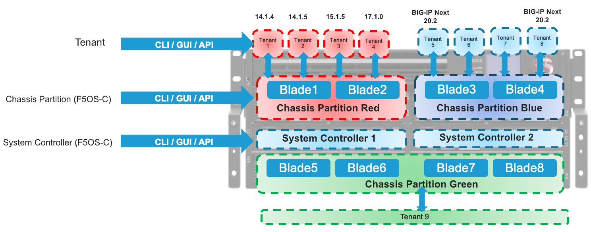

=============================
Points of Management in VELOS
=============================

There are three main points of management within the VELOS chassis: the **system controllers**, the **chassis partitions**, and the individual **tenants**. Each supports their own CLI, webUI, and API access and have their own authentications and users. 

Additionally, they each run their own version of software; tenants are able to run specific versions of TMOS which have been approved to run on the VELOS platform, and system controllers and chassis partitions each have their own version of F5OS-C software. BIG-IP Next tenants can also run on the VELOS chassis, and support for different sized tenants, mixed configurations, and cross blade support is being phased in over multiple releases. It is suggested to check both the F5OS and BIG-IP Next release notes for the latest supported configurations for BIG-IP Next on VELOS. The supported BIG-IP/TMOS and BIG-IP Next versions along with their supported F5OS versions for the various VELOS platforms can be found here:

`K86001294: F5OS hardware/software support matrix <https://my.f5.com/manage/s/article/K86001294>`_

Details on the latest BIG-IP Next tenant support for VELOS can be found in the latest BIG-IP Next System Requirements and Compatibility documentation:

`BIG-IP Next System Requirements and Compatibility <https://clouddocs.f5.com/bigip-next/latest/release_notes/big-ip-next-rn-new-features.html#system-requirements-and-compatibility>`_

In general, for BIG-IP tenants TMOS versions 14.1.4 and later, 15.1.4 and later, and 17.1.x, 17.5 and later are supported on the BX110 blades in the CX410 chassis. There are no plans to support versions 16.0.x, 16.1.x, or 17.0.x, and there are no plans to support TMOS versions prior to 14.1.4. For the BX520 blade, the minimum supported TMOS version is 17.1.2 and later.

The F5OS-C platform layer in VELOS runs its own version of F5OS, which is unique to the VELOS chassis. On downloads.f5.com, the VELOS versions of F5OS are referred to as F5OS-C, where the C stands for chassis. The rSeries appliances also run F5OS, but that version is designated as F5OS-A, where A stands for appliance. Most of the code and configuration interfaces of F5OS are common between VELOS and rSeries, but VELOS has unique F5OS features that are chassis specific. VELOS has two layers of F5OS (system controller and chassis partition), and each of these have their own software images, in addition to the tenants that run TMOS.

.. image:: images/velos_points_of_management/image2.png
  :align: center
  :scale: 90%

At the F5OS-C platform layer, initial configuration consists of out-of-band management IP addresses, prefix and default gateway, and other system parameters like DNS and NTP. Licensing is also configured at the F5OS layer, and is similar to VIPRION with vCMP configured, in that it is applied at the chassis level and inherited by all tenants. All these items are configured at the system controller layer. The administrator also configures **chassis partitions** (groupings of VELOS blades/slots), that each have their own management IP address, and F5OS CLI, GUI, and API interfaces.

Inside the chassis partition F5OS layer, interfaces, in-band networking (VLANs, interfaces, Link Aggregation Groups) are configured. Once networking is set up, tenants can be provisioned, and deployed from the F5OS chassis partition management interfaces. Once the tenant is deployed, it is managed like any other BIG-IP instance. This is very similar to how vCMP guests are managed on iSeries or VIPRION. Please refer to the **VELOS Systems Administration Guide** on my.f5.com for more detailed information.

`VELOS Systems: Administration and Configuration <https://techdocs.f5.com/en-us/velos-1-8-0/velos-systems-administration-configuration.html>`_

Differences from iSeries and VIPRION
------------------------------------

The management of VELOS/F5OS has a lot of similarities to how vCMP is managed on iSeries or VIPRION, in that there are two distinct layers of management. In the diagram below on the left, a typical vCMP environment has a **host** layer and a **guest** layer. At the vCMP host layer, all networking is configured including interfaces, trunks, and VLANs. When vCMP guests are configured, they will be assigned a set of VLANs by the administrator that it will have access to. The administrator may not want to give the guest access to all VLANs in the system and may only assign a small subset of VLANs from the host layer to a specific guest. Inside the TMOS layer of the guest does not require manual configuration of interfaces or trunks, it is the VLANs that are inherited from the vCMP host configuration that will provide connectivity. The guest will only have access to the VLANs specifically assigned to it when it was created. 

On the right-hand side is an F5OS environment (in this case VELOS), at the F5OS chassis partition platform layer, all networking is configured including interfaces, trunks (now called LAGs), and VLANs. When F5OS tenants are configured, they are assigned VLANs by the administrator that the tenant will have access to. Inside the tenant itself does not require any manual configuration of interfaces or LAGs (this is confiured at the F5OS layer), and VLANs will be inherited from the F5OS platform layer configuration. The F5OS tenant will only have access to the VLANs specifically assigned to it when it was created.

.. image:: images/velos_points_of_management/image3.png
  :align: center
  :scale: 80%

Comparing the management of a non-VCMP (bare metal) iSeries or VIPRION to VELOS is going to be a little bit different with the introduction of the F5OS platform layer. With a bare-metal deployment on iSeries/VIPRION, configuration objects such as interfaces, trunks, and VLANs are directly configurable from within the TMOS layer. Monitoring of the lower layer networking can also be done within the TMOS layer. 

When moving to VELOS, the configuration and monitoring of the lower-level networking objects are done at the F5OS platform layer. For SNMP monitoring there are separate SNMP MIBs and traps for the F5OS layer that can be used to monitor interfaces and platform level statistics. F5OS doesn't use the term trunk to represent aggregated links, it uses the term Link Aggregation Group or LAG. There are also F5OS APIs to monitor and configure the platform layer. The F5OS tenants themselves still support standard TMOS monitoring of the higher layers.

.. image:: images/velos_points_of_management/image4.png
  :align: center
  :scale: 50%

VLANs are created in the F5OS platform layer, and then they can be assigned to separate interfaces or LAGs. When a tenant is created, the administrator can then assign one or more of those VLANs to be accessible by the F5OS tenant. Once the tenant is deployed, the configured VLANs will automatically be inherited and will show up in the VLAN configuration inside TMOS. VLANs will automatically show up in Route Domain 0 by default. If you need to assign these VLANs to another Route Domain inside the tenant, then you may delete them from Route Domain 0 inside the TMOS tenant and then recreate them with the same VLAN ID inside the proper Route Domain, and connectivity will be restored to the lower F5OS layer. This is the same behavior a vCMP guest would have inside of VIPRION or iSeries as outlined in the following link.

`Deploying Route Domains within a vCMP Guest <https://techdocs.f5.com/kb/en-us/products/big-ip_ltm/manuals/product/vcmp-administration-viprion-13-0-0/15.html>`_

.. image:: images/velos_points_of_management/image5.png
  :align: center
  :scale: 50%

Monitoring for a bare metal iSeries or VIPRION is all done within TMOS, whereas in VELOS there are now two layers that can be monitored. Interfaces, LAGs, and other platform layer objects such as CPU, memory, temperature, disks can be monitored at the F5OS layer via CLI, GUI, API, or SNMP. Higher level monitoring of virtual servers, pools and L4-7 objects continue to be done inside the TMOS layer of the F5OS tenant.

.. image:: images/velos_points_of_management/image6.png
  :align: center
  :scale: 50%

In general, F5OS tenants in the VELOS platforms have no visibility into the underlying physical interfaces or LAGs that are configured at the F5OS layer. The tenant will be connected to specific interfaces or LAGs based on its VLAN membership. The only exception to this is the HA Group functionality inside the tenant, which has visibility into LAG state and membership to facilitate proper redundancy/failover. As an example, an F5OS tenant on a VELOS BX110 blade has no visibility into the physical interfaces at the F5OS layer. Instead, the tenant will see virtual interfaces and the number of interfaces within a tenant will be based upon the number of CPUs assigned to the tenant. The screenshot below shows the interfaces inside the tenant lining up with the number of physical CPU cores per tenant. Each CPU core has two hyperthreads and the TMM will run on one of those hyperthreads. The interfaces inside the tenant are not physical interfaces, they are high speed virtual interfaces that map to each TMM. In the example below there are 22 vCPUs assigned to a single F5OS tenant, this will equate to 11 physical CPUs due to hyperthreading. As seen in the output below, the tenant has 22 vCPUs assigned. 

.. image:: images/velos_points_of_management/image7.png
  :align: center
  :scale: 70%

BIG-IP tenants leverage HT-Split where the TMM process runs on even numbered hyperthreads as described in the following solution article.

`K15003: Data and control plane tasks use separate logical cores when the BIG-IP system CPU uses Intel Hyper-Threading Technology <https://my.f5.com/manage/s/article/K15003>`_

If you were to look inside the tenant, you'll notice that the number of Interfaces correlates to the number of physical CPU cores (or more specifically TMM's) assigned to the tenant, in this case 11. Note how the tenant does not see the physical interfaces at the F5OS layer.  

.. image:: images/velos_points_of_management/image7a.png
  :align: center
  :scale: 70%

  
