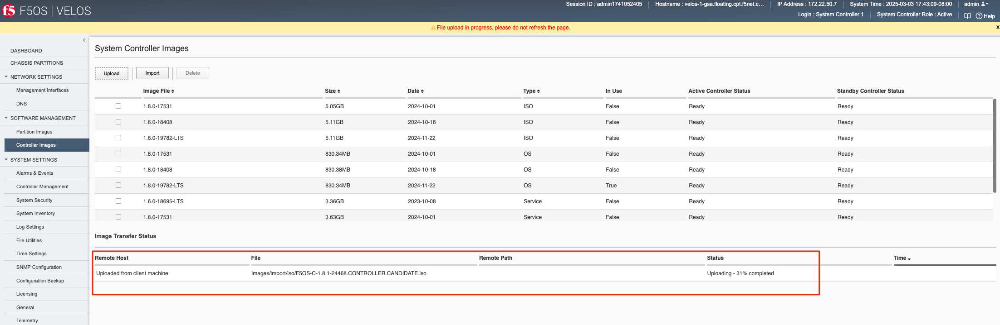
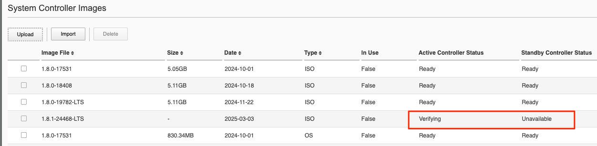
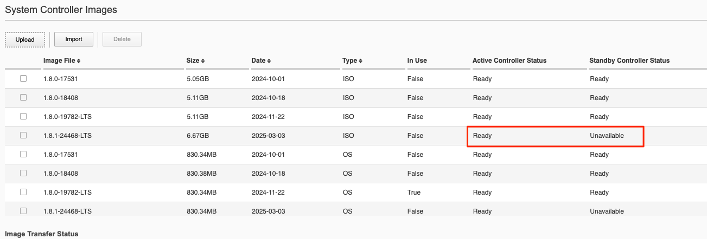
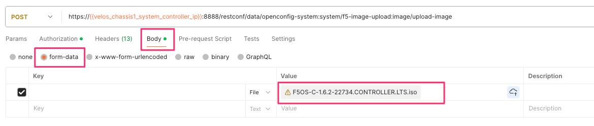
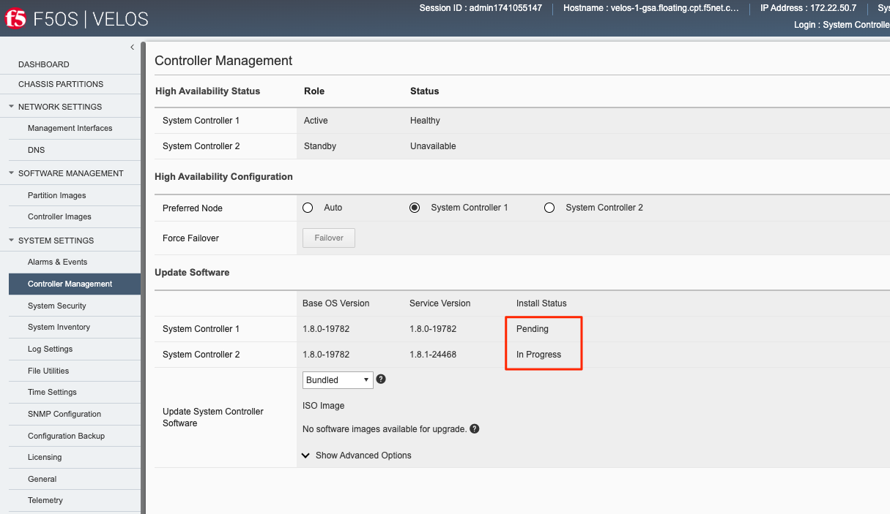
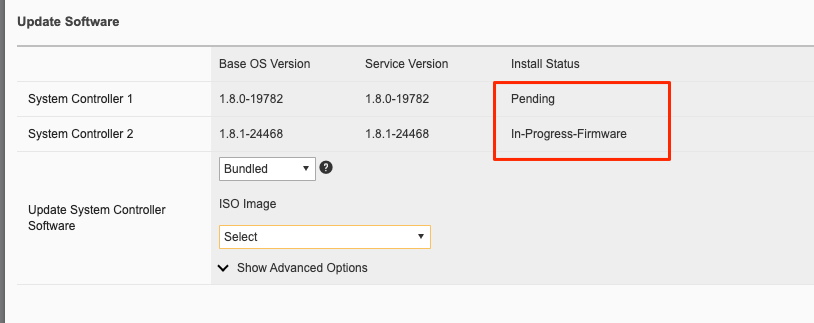
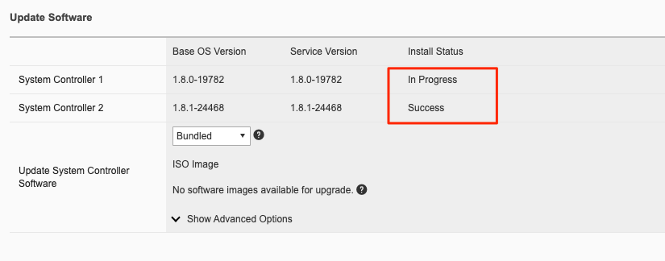
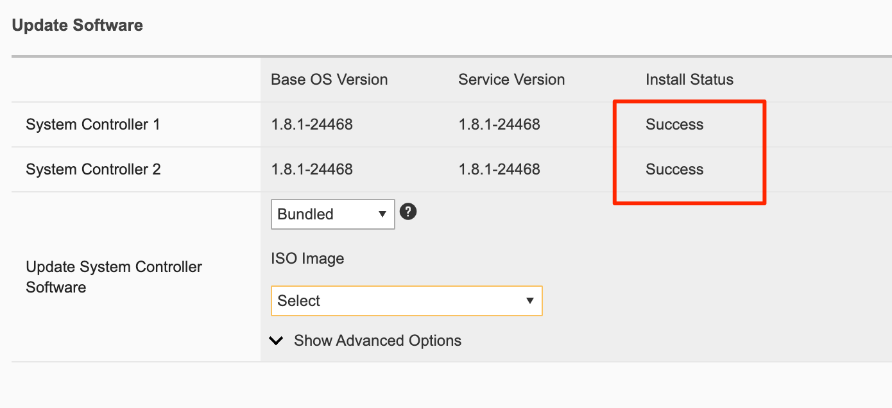
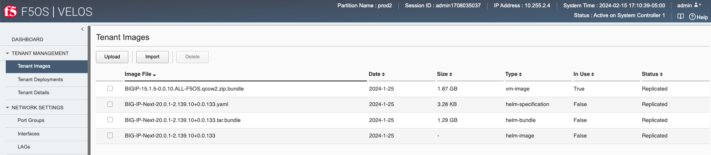

=================
Software Upgrades
=================

F5OS-C System Controller Upgrades
=================================

The system controllers are fully redundant and F5OS-C v1.2.x versions of F5OS-C introduced a rolling upgrade capability for the system controller upgrade process, which minimizes disruption to the chassis. The chassis must be already running a version of F5OS 1.2.x or later to take advantage of this capability. Upgrades from 1.1.x versions to a 1.2.x version will not see rolling upgrade functionality.

For 1.2.x and later upgrades of F5OS-C on the system controllers, a rolling upgrade occurs where the standby controller is upgraded first, and when completed it will go to an active state, and the remaining controller will be upgraded.

When upgrading the system controllers, you will have a choice of upgrading either a bundled release, meaning **OS** and **Services** are **bundled** together in an ISO image, or **unbundled** where you can upgrade service and/or OS independently. F5 recommends using the bundled/ISO option for upgrades currently. In the future, unbundled options may be utilized for some upgrades.

.. image:: images/velos_software_upgrades/image1.png
  :align: center
  :scale: 70%

Below are examples of the subcomponents that make up the OS and Service levels within both the system controller layer, and the chassis partition layer.

.. image:: images/velos_software_upgrades/image2.png
  :align: center
  :scale: 70%

The outage for a service-only upgrade on the system controller is smaller than if the entire OS was upgraded. A service upgrade will not cause a reboot of the controllers, where an OS upgrade will. If the OS does not need to be upgraded to address an issue, then you can choose to only upgrade the services. The OS is more of the container/OS layer, where most of the F5 specific code is in the service layer. Most upgrades currently require both service and OS to be upgraded, but in the future this service versus OS upgrades may become available. Upgrades are easily accomplished via the system controller UI. First you would upload F5OS images for both the controllers as well as the partitions into the system controllers. 

Uploading Controller and Partition Images via the webUI
-----------------------------------------------------

You can upload F5OS controller and partition images from the **Software Management -> Controllers Images** and **Partition Images** pages.

.. image:: images/velos_software_upgrades/image3.png
  :align: center
  :scale: 70%

.. image:: images/velos_software_upgrades/image4.png
  :align: center
  :scale: 70%

Click **Add**, and you will be prompted to provide the configuration details for a remote HTTPS server where the images can be downloaded from. You will need to have a remote HTTPS server that allows downloads in order to import images into the system via the webUI. You can alternatively use the **Upload** option to upload an F5OS-C system controller or chassis partition ISO file from a client machine through the browser.

You can also upload or import F5OS-C images for both the system controllers and the chassis partitions using the **System Settings > File Utilities** page.

.. image:: images/velos_software_upgrades/image5.png
  :align: center
  :scale: 70%

Alternatively, you may also upload images to the controller through the **System Settings -> File Utilities** page. You can select the **images/staging** option from the drop-down menu to import new controller or partition images. Once uploaded into the staging area they will be imported and made available for upgrades after a brief delay.

.. image:: images/velos_software_upgrades/image6.png
  :align: center
  :scale: 70%

After the upload completes, it will take some time for it to be replicated to the standby system controller. At that point it should show up in the CLI and webUI. If you don’t see it immediately, be patient and wait a few minutes for it to show up, as it will not appear until the internal replication is completed.

You can monitor the status of an image upload in the WebUI as seen below.

After completing the upload the image will go to the **Verifying** stage on the active controller.

After verifcation it will go to the **Ready** stage on the active controller. It will then begin extracting the ISO into the OS and service images. It will also begin replicating the image to the standby controller.

.. image:: images/velos_software_upgrades/verifying-standby.png
  :align: center
  :scale: 70%

Once the image shows ready on both controllers you are then ready to upgrade the controllers.

.. image:: images/velos_software_upgrades/verifying-standby.png
  :align: center
  :scale: 70%

Uploading Controller and Partition Images via the CLI
-----------------------------------------------------

The **file import** utility in the CLI relies on either a remote HTTPS, SCP, or SFTP server hosting the image files that need to be imported. The files should be imported into the **images/staging** directory. Once the file import is initiated, you can check its status using the **file transfer-status** command.

.. code-block:: bash

    syscon-2-active# file import remote-host 10.255.0.142 remote-file /upload/F5OS-C-1.2.1-10781.CONTROLLER.iso local-file images/staging/F5OS-C-1.2.1-10781.CONTROLLER.iso username corpuser insecure 

    syscon-2-active# file transfer-status                                                                                                                                                             
    result 
    S.No.|Operation  |Protocol|Local File Path                                             |Remote Host         |Remote File Path                                            |Status            |Time                
    1    |Import file|HTTPS   |images/staging/F5OS-C-1.2.1-10781.CONTROLLER.iso            |10.255.0.142        |/upload/F5OS-C-1.2.1-10781.CONTROLLER.iso                   |In Progress (5.0%)|Thu Sep 16 17:11:51 2021
    2    |Import file|HTTPS   |images/import/iso/F5OS-C-1.2.1-10781.CONTROLLER.iso         |10.255.0.142        |uploads/F5OS-C-1.2.1-10781.CONTROLLER.iso                   |File Not Found, HTTP Error 404|Thu Sep 16 16:18:27 2021

You can alternatively copy the controller and partition images into the floating IP address of the system controllers. You would use the **root** account and the target directory should be **/var/import/staging/**.

.. code-block:: bash

    root@xubuntu-vm# scp F5OS-C-1.2.1-10781.CONTROLLER.iso root@10.255.0.147:/var/import/staging/.

    root@xubuntu-vm# scp F5OS-C-1.2.1-10781.PARTITION.iso root@10.255.0.147:/var/import/staging/.

Uploading Controller and Partition Images from a Remote Server via the API
--------------------------------------------------------------------------

As with the webUI, the current implementation of **file import** in the API relies on either a remote HTTPS, SCP, or SFTP server hosting the image files to be imported. The files should be imported into the **images/staging** directory. Once the file import is initiated you can check its status using the **file transfer-status** API calls.

List the current system controller and partitions images in the images/staging directory via API calls:

.. code-block:: bash

    POST https://{{velos_chassis1_system_controller_ip}}:8888/restconf/data/f5-utils-file-transfer:file/list

The following JSON should be in the payload of the API call above.

.. code-block:: json

    {
    "f5-utils-file-transfer:path": "images/staging"
    }

Below is an example output:

.. code-block:: json

    {
        "f5-utils-file-transfer:output": {
            "entries": [
                {
                    "name": "\nBIGIP-14.1.4.2-0.0.5.ALL-VELOS.qcow2.zip.bundle\nF5OS-C-1.1.2-6101.PARTITION.iso\nF5OS-C-1.2.0-10357.CONTROLLER.iso\nF5OS-C-1.2.0-10357.PARTITION.iso\nF5OS-C-1.2.0-6345.PARTITION.DEV.iso\nF5OS-C-1.2.0-6433.CONTROLLER.DEV.iso\nF5OS-C-1.2.0-6435.CONTROLLER.DEV.iso\nF5OS-C-1.2.0-7091.CONTROLLER.CANDIDATE.iso\nF5OS-C-1.2.0-7091.PARTITION.CANDIDATE.iso\nF5OS-C-1.2.0-7451.CONTROLLER.CANDIDATE.iso\nF5OS-C-1.2.0-7451.PARTITION.CANDIDATE.iso\nF5OS-C-1.2.0-8813.CONTROLLER.CANDIDATE.iso\nF5OS-C-1.2.0-9003.PARTITION.iso\nF5OS-C-1.2.0-9496.CONTROLLER.CANDIDATE.iso\nF5OS-C-1.2.0-9496.PARTITION.CANDIDATE.iso\nF5OS-C-1.2.1-10692.CONTROLLER.CANDIDATE.iso\nF5OS-C-1.2.1-10692.PARTITION.CANDIDATE.iso\nF5OS-C-1.2.1-10781.PARTITION.iso\ncontroller.1.1.2-6101.iso"
                }
            ]
        }
    }

You can then query the **images/import** directory for various image types like ISO, Service, or OS:

.. code-block:: bash

    POST https://{{velos_chassis1_system_controller_ip}}:8888/restconf/data/f5-utils-file-transfer:file/list

In the body of the API call, enter the path you want to query.

.. code-block:: json

    {
    "f5-utils-file-transfer:path": "images/import/iso"
    }

Below is an example output:

.. code-block:: json

    {
        "f5-utils-file-transfer:output": {
            "entries": [
                {
                    "name": "\nBIGIP-14.1.4.2-0.0.5.ALL-VELOS.qcow2.zip.bundle\nF5OS-C-1.1.2-6101.PARTITION.iso\nF5OS-C-1.2.0-10357.CONTROLLER.iso\nF5OS-C-1.2.0-10357.PARTITION.iso\nF5OS-C-1.2.0-6345.PARTITION.DEV.iso\nF5OS-C-1.2.0-6433.CONTROLLER.DEV.iso\nF5OS-C-1.2.0-6435.CONTROLLER.DEV.iso\nF5OS-C-1.2.0-7091.CONTROLLER.CANDIDATE.iso\nF5OS-C-1.2.0-7091.PARTITION.CANDIDATE.iso\nF5OS-C-1.2.0-7451.CONTROLLER.CANDIDATE.iso\nF5OS-C-1.2.0-7451.PARTITION.CANDIDATE.iso\nF5OS-C-1.2.0-8813.CONTROLLER.CANDIDATE.iso\nF5OS-C-1.2.0-9003.PARTITION.iso\nF5OS-C-1.2.0-9496.CONTROLLER.CANDIDATE.iso\nF5OS-C-1.2.0-9496.PARTITION.CANDIDATE.iso\nF5OS-C-1.2.1-10692.CONTROLLER.CANDIDATE.iso\nF5OS-C-1.2.1-10692.PARTITION.CANDIDATE.iso\nF5OS-C-1.2.1-10781.PARTITION.iso\ncontroller.1.1.2-6101.iso"
                }
            ]
        }
    }
To import an F5OS-C image from a remote HTTPS server, use the following API example. You can optionally import using other protocols such as SFTP or SCP by adding the proper protocol option to the API command below. To import images, use the following API examples for controller and partition images. To import the **controller** image:

.. code-block:: bash

    POST https://{{velos_chassis1_system_controller_ip}}:8888/api/data/f5-utils-file-transfer:file/import

In the body of the API call, enter the local and remote file details.

.. code-block:: json

    {
        "input": [
            {
                "remote-host": "10.255.0.142",
                "remote-file": "/upload/{{Controller_ISO_Image_Full}}",
                "local-file": "images/staging/",
                "insecure": "",
                "f5-utils-file-transfer:username": "corpuser",
                "f5-utils-file-transfer:password": "Passw0rd!!"
            }
        ]
    }

To import the **partition** image:

.. code-block:: bash

    POST https://{{velos_chassis1_system_controller_ip}}:8888/api/data/f5-utils-file-transfer:file/import

In the body of the API call, enter the local and remote file details.

.. code-block:: json

    {
        "input": [
            {
                "remote-host": "10.255.0.142",
                "remote-file": "/upload/{{Partition_ISO_Image_Full}}",
                "local-file": "images/staging/",
                "insecure": "",
                "f5-utils-file-transfer:username": "corpuser",
                "f5-utils-file-transfer:password": "password"
            }
        ]
    }

You can then check on the file transfer status with the following API call:

.. code-block:: bash

    POST https://{{velos_chassis1_system_controller_ip}}:8888/restconf/data/f5-utils-file-transfer:file/transfer-status

A response like the one below will provide the status of the transfer:

.. code-block:: json

    {
        "f5-utils-file-transfer:output": {
            "result": "\nS.No.|Operation  |Protocol|Local File Path  |Remote Host |Remote File Path                                        |Status            |Time                \n1    |
    Import file|HTTPS   |images/staging/F5OS-C-1.2.1-10781.PARTITION.iso |10.255.0.142 |/upload/F5OS-C-1.2.1-10781.PARTITION.iso                    |File Not Found, HTTP Error 404|Thu Sep 16 20:27:23 2021\n2    
    |Import file|HTTPS   |images/staging/F5OS-C-1.2.1-10781.CONTROLLER.iso            |10.255.0.142        |F5OS-C-1.2.1-10781.CONTROLLER.iso                           |File Not Found, HTTP Error 404|Thu Sep 16 20:19:56 2021\n3    
    |Import file|HTTPS   |images/import/iso/F5OS-C-1.2.1-10781.CONTROLLER.iso         |10.255.0.142        |uploads/F5OS-C-1.2.1-10781.CONTROLLER.iso                   |File Not Found, HTTP Error 404|Thu Sep 16 16:18:27 2021\n4    
    |Import file|HTTPS   |images/staging/F5OS-C-1.2.1-10781.CONTROLLER.iso            |10.255.0.142        |/upload/F5OS-C-1.2.1-10781.CONTROLLER.iso                   |         Completed|Thu Sep 16 20:24:26 2021\n"
        }
    }

After transferring the file, you can view the contents of the images/staging directory. The file will then go through an import process before it is ready for use.

.. code-block:: bash

    POST https://{{velos_chassis1_system_controller_ip}}:8888/restconf/data/f5-utils-file-transfer:file/list

In the body of the API call, enter the path you want to query.

.. code-block:: json

    {
    "f5-utils-file-transfer:path": "images/staging"
    }

You will see all the files in the images/staging directory:

.. code-block:: json

    {
        "f5-utils-file-transfer:output": {
            "entries": [
                {
                    "name": "\nF5OS-C-1.2.0-10357.CONTROLLER.iso\nF5OS-C-1.2.0-10357.PARTITION.iso\nF5OS-C-1.2.1-10692.CONTROLLER.CANDIDATE.iso\nF5OS-C-1.2.1-10692.PARTITION.CANDIDATE.iso\nF5OS-C-1.2.1-10781.CONTROLLER.iso\ncontroller.1.1.2-6101.iso"
                }
            ]
        }
    }

You can then monitor the images/import/iso directory to see when the file is ready to use for upgrade:

.. code-block:: bash

    POST https://{{velos_chassis1_system_controller_ip}}:8888/restconf/data/f5-utils-file-transfer:file/list

In the body of the API call, enter the path you want to query.

.. code-block:: json

    {
    "f5-utils-file-transfer:path": "images/import/iso"
    }

You’ll see output like the example below. Once the file shows up here you are ready to upgrade.

.. code-block:: json

    {
        "f5-utils-file-transfer:output": {
            "entries": [
                {
                    "name": "\nF5OS-C-1.2.0-10357.CONTROLLER.iso\nF5OS-C-1.2.0-10357.PARTITION.iso\nF5OS-C-1.2.1-10692.CONTROLLER.CANDIDATE.iso\nF5OS-C-1.2.1-10692.PARTITION.CANDIDATE.iso\nF5OS-C-1.2.1-10781.CONTROLLER.iso\ncontroller.1.1.2-6101.iso"
                }
            ]
        }
    }

Uploading Controller and Partition Images from a Client Machine via the API
--------------------------------------------------------------------------

You can upload an F5OS controller or chassis partition image from a client machine over the API. First, you must obtain an **upload-id** using the following API call.

.. code-block:: bash

    POST https://{{velos_chassis1_system_controller_ip}}:8888/restconf/data/f5-utils-file-transfer:file/f5-file-upload-meta-data:upload/start-upload

In the body of the API call enter the **size**, **name**, and **file-path** as seen in the example below.

.. code-block:: json

    {
        "size":5944377856,
        "name": "F5OS-C-1.6.2-22734.CONTROLLER.LTS.iso",
        "file-path": "images/staging/"
    }

If you are using Postman, the API call above will generate an upload-id that will need to be captured so it can be used in the subsequent API call to upload the file. Below is an example of the code that should be added to the **Test** section of the API call so that the upload-id can be captured and saved to a variable for subsequent API calls.

.. code-block:: bash

    var resp = pm.response.json();
    pm.environment.set("upload-id", resp["f5-file-upload-meta-data:output"]["upload-id"])

Below is an example of how this would appear inside the Postman interface.

Once the upload-id is captured, you can then initiate a file upload of the F5OS image using the following API call.

.. code-block:: bash

    POST https://{{velos_chassis1_system_controller_ip}}:8888/restconf/data/openconfig-system:system/f5-image-upload:image/upload-image

In the body of the API call select **form-data**, and then in the **Value** section click **Select Files** and select the F5OS-C image you want to upload as seen in the example below.

In the **Headers** section ensure you add the **file-upload-id** header, with the variable used to capture the id in the previous API call.

Upgrading the System Controllers via webUI
------------------------------------------

Once the new images are loaded, you can perform the upgrade from the **System Settings > Controller Management** screen. Currently it is recommended you use the **Bundled** option to upgrade using the ISO. In the future, there may be cases where **Unbundled** (separate OS or Service upgrades) are recommended. Once you click **Save** the upgrade process will begin. For F5OS versions 1.1.x there is no rolling upgrade support and both controllers will reboot immediately taking the entire chassis offline. For F5OSv1.2 rolling upgrade support has been added, but you must be on a v1.2.x release or later to take advantage of this new functionality. With rolling upgrade support, traffic disruption should be minimal during the upgrade process of the system controllers as the tenants will still be runnning.

.. image:: images/velos_software_upgrades/image7.png
  :align: center
  :scale: 70%

You'll be able to momitor the upgrade status by going to the **System Settings -> Controller Management** page. The upgrade will start with the backup controller and it will move to **In Progress** status while the active controller will show **Pending** status.

You may or may not see the status change to **In-Progress-Firmware** if a firmware upgrade is required. Not all upgrades require a firmware upgrade.

When the standby controller is finished upgrading it will intiate a failover and become active. Your session to the WebUI will be disconnected, and you'll need to re-connect. The other controller will now start its upgrade process and will show **In Progress** while the other controller will now show **Success**.

Again, you may or may not see a firmware upgrade, but when complete both controllers should show **Success**.

Upgrading the System Controllers via CLI
----------------------------------------

In the system controller CLI you can use the **show image** command to see the currently installed software versions for each system controller.

.. code-block:: bash

    velos-1-gsa-1-active# show image 
    VERSION OS                                             IN           
    CONTROLLER   CONTROLLER  STATUS  DATE        SIZE      USE    TYPE  
    --------------------------------------------------------------------
    1.8.0-17531  1           ready   2024-10-01  830.34MB  false  -     
    1.8.0-18408  1           ready   2024-10-18  830.38MB  false  -     
    1.8.0-19782  1           ready   2024-11-22  830.34MB  true   LTS   

    VERSION                                                           
    SERVICE                                              IN           
    CONTROLLER   CONTROLLER  STATUS  DATE        SIZE    USE    TYPE  
    ------------------------------------------------------------------
    1.6.0-18695  1           ready   2023-10-08  3.36GB  false  LTS   
    1.8.0-17531  1           ready   2024-10-01  3.63GB  false  -     
    1.8.0-18408  1           ready   2024-10-18  3.69GB  false  -     
    1.8.0-19782  1           ready   2024-11-22  3.69GB  true   LTS   

    VERSION ISO                                          IN           
    CONTROLLER   CONTROLLER  STATUS  DATE        SIZE    USE    TYPE  
    ------------------------------------------------------------------
    1.8.0-17531  1           ready   2024-10-01  5.05GB  false  -     
    1.8.0-18408  1           ready   2024-10-18  5.11GB  false  -     
    1.8.0-19782  1           ready   2024-11-22  5.11GB  false  LTS   

    VERSION OS                                             IN           
    CONTROLLER   CONTROLLER  STATUS  DATE        SIZE      USE    TYPE  
    --------------------------------------------------------------------
    1.8.0-17531  2           ready   2024-10-01  830.34MB  false  -     
    1.8.0-18408  2           ready   2024-10-18  830.38MB  false  -     
    1.8.0-19782  2           ready   2024-11-22  830.34MB  true   LTS   

    VERSION                                                           
    SERVICE                                              IN           
    CONTROLLER   CONTROLLER  STATUS  DATE        SIZE    USE    TYPE  
    ------------------------------------------------------------------
    1.6.0-18695  2           ready   2023-10-08  3.36GB  false  LTS   
    1.8.0-17531  2           ready   2024-10-01  3.63GB  false  -     
    1.8.0-18408  2           ready   2024-10-18  3.69GB  false  -     
    1.8.0-19782  2           ready   2024-11-22  3.69GB  true   LTS   

    VERSION ISO                                          IN           
    CONTROLLER   CONTROLLER  STATUS  DATE        SIZE    USE    TYPE  
    ------------------------------------------------------------------
    1.8.0-17531  2           ready   2024-10-01  5.05GB  false  -     
    1.8.0-18408  2           ready   2024-10-18  5.11GB  false  -     
    1.8.0-19782  2           ready   2024-11-22  5.11GB  false  LTS   

    VERSION OS                                             IN                     
    PARTITION    CONTROLLER  STATUS  DATE        SIZE      USE    TYPE  NAME  ID  
    ------------------------------------------------------------------------------
    1.6.0-12952  1           ready   2023-05-31  788.75MB  false  -               
    1.8.0-17531  1           ready   2024-10-01  832.77MB  false  -               
    1.8.0-18408  1           ready   2024-10-18  832.80MB  false  -               
    1.8.0-19782  1           ready   2024-11-22  832.83MB  false  LTS             

    VERSION                                                                        
    SERVICE                                              IN                        
    PARTITION    CONTROLLER  STATUS  DATE        SIZE    USE    TYPE  NAME     ID  
    -------------------------------------------------------------------------------
    1.6.0-12952  1           ready   2023-05-31  1.76GB  true   -     default  1   
    1.8.0-17531  1           ready   2024-10-01  1.61GB  false  -                  
    1.8.0-18408  1           ready   2024-10-18  1.67GB  false  -                  
    1.8.0-19782  1           ready   2024-11-22  1.67GB  true   LTS   blue     3   
                                                                    green    2   
                                                                    red      4   

    VERSION ISO                                          IN                        
    PARTITION    CONTROLLER  STATUS  DATE        SIZE    USE    TYPE  NAME     ID  
    -------------------------------------------------------------------------------
    1.6.0-12952  1           ready   2023-05-31  3.14GB  true   -     default  1   
    1.8.0-17531  1           ready   2024-10-01  3.04GB  false  -                  
    1.8.0-18408  1           ready   2024-10-18  3.10GB  false  -                  
    1.8.0-19782  1           ready   2024-11-22  3.10GB  true   LTS   blue     3   
                                                                    green    2   
                                                                    red      4   

    VERSION OS                                             IN                     
    PARTITION    CONTROLLER  STATUS  DATE        SIZE      USE    TYPE  NAME  ID  
    ------------------------------------------------------------------------------
    1.6.0-12952  2           ready   2023-05-31  788.75MB  false  -               
    1.8.0-17531  2           ready   2024-10-01  832.77MB  false  -               
    1.8.0-18408  2           ready   2024-10-18  832.80MB  false  -               
    1.8.0-19782  2           ready   2024-11-22  832.83MB  false  LTS             

    VERSION                                                                        
    SERVICE                                              IN                        
    PARTITION    CONTROLLER  STATUS  DATE        SIZE    USE    TYPE  NAME     ID  
    -------------------------------------------------------------------------------
    1.6.0-12952  2           ready   2023-05-31  1.76GB  true   -     default  1   
    1.8.0-17531  2           ready   2024-10-01  1.61GB  false  -                  
    1.8.0-18408  2           ready   2024-10-18  1.67GB  false  -                  
    1.8.0-19782  2           ready   2024-11-22  1.67GB  true   LTS   blue     3   
                                                                    green    2   
                                                                    red      4   

    VERSION ISO                                          IN                        
    PARTITION    CONTROLLER  STATUS  DATE        SIZE    USE    TYPE  NAME     ID  
    -------------------------------------------------------------------------------
    1.6.0-12952  2           ready   2023-05-31  3.14GB  true   -     default  1   
    1.8.0-17531  2           ready   2024-10-01  3.04GB  false  -                  
    1.8.0-18408  2           ready   2024-10-18  3.10GB  false  -                  
    1.8.0-19782  2           ready   2024-11-22  3.10GB  true   LTS   blue     3   
                                                                    green    2   
                                                                    red      4   

    velos-1-gsa-1-active#

The command **show running-config image** will show the current configuration for software images. You can enter config mode and change the configuration using the **system image set-version** command and then commit to initiate an upgrade.

.. code-block:: bash

    velos-1-gsa-1-active# show running-config image 
    image controller config os os 1.8.0-17531
    !
    image controller config os os 1.8.0-18408
    !
    image controller config os os 1.8.0-19782
    !
    image controller config services service 1.6.0-18695
    !
    image controller config services service 1.8.0-17531
    !
    image controller config services service 1.8.0-18408
    !
    image controller config services service 1.8.0-19782
    !
    image controller config iso iso 1.8.0-17531
    service 1.8.0-17531
    os      1.8.0-17531
    !
    image controller config iso iso 1.8.0-18408
    service 1.8.0-18408
    os      1.8.0-18408
    !
    image controller config iso iso 1.8.0-19782
    service 1.8.0-19782
    os      1.8.0-19782
    !
    image partition config os os 1.6.0-12952
    !
    image partition config os os 1.8.0-17531
    !
    image partition config os os 1.8.0-18408
    !
    image partition config os os 1.8.0-19782
    !
    image partition config services service 1.6.0-12952
    !
    image partition config services service 1.8.0-17531
    !
    image partition config services service 1.8.0-18408
    !
    image partition config services service 1.8.0-19782
    !
    image partition config iso iso 1.6.0-12952
    service 1.6.0-12952
    os      1.6.0-12952
    !
    image partition config iso iso 1.8.0-17531
    service 1.8.0-17531
    os      1.8.0-17531
    !
    image partition config iso iso 1.8.0-18408
    service 1.8.0-18408
    os      1.8.0-18408
    !
    image partition config iso iso 1.8.0-19782
    service 1.8.0-19782
    os      1.8.0-19782
    !
    velos-1-gsa-1-active#

Before upgrading you need to run the **system image check-version** command on the ISO you want to upgrade to. This will ensure the image is valid and that the system is able to upgrade to that version. It will also provide an estimate of the upgrade time, along with the number of failovers required to complete the upgrade.

.. code-block:: bash

    velos-1-gsa-1-active(config)# system image check-version iso-version 1.8.1-24468 
    response Compatibility verification succeeded.
    Estimated time: 66 minutes
    Failover(s): 2
    velos-1-gsa-1-active(config)#

If the check-version succeeds, you may then run the **system image set-version** command to initiate the upgrade.

.. code-block:: bash

    velos-1-gsa-1-active(config)# system image set-version iso-version 1.8.1-24468 proceed 
    Value for 'proceed' [no,yes]: yes
    response Controller ISO version has been set.
    Estimated time: 66 minutes
    Failover(s): 2
    velos-1-gsa-1-active(config)#

An upgrade of the system controllers should automatically start after the above command is entered. You can follow the upgrade progress by issuing the command **show system image**:

.. code-block:: bash

    syscon-2-active# show system image 
                        SERVICE      ISO      INSTALL      
    NUMBER  OS VERSION   VERSION      VERSION  STATUS       
    --------------------------------------------------------
    1       1.2.1-10692  1.2.1-10692  -        in-progress  
    2       1.2.1-10692  1.2.1-10692  -        pending      

    syscon-2-active# 

Upgrading the System Controllers via API
----------------------------------------

To upgrade the system controllers via the API you must first run the check version API call with the version you want to update to:

.. code-block:: bash

 POST https://{{velos_chassis1_system_controller_ip}}:8888/restconf/data/openconfig-system:system/f5-system-controller-image:image/f5-system-controller-image:check-version

In the body of the API call enter the following:

.. code-block:: json

    {
        "f5-system-controller-image:iso-version": "{{Controller_ISO_Image_Full}}"
    }

If the compatibility check passes then you will get a message like the one below, and it is safe to install the new image via the set-version API call:

.. code-block:: json

    {
        "f5-system-controller-image:output": {
            "response": "Compatibility verification succeeded."
        }
    }

This is the Set Version API call that will initiate the upgrade:

.. code-block:: bash

    POST https://{{velos_chassis1_system_controller_ip}}:8888/restconf/data/openconfig-system:system/f5-system-controller-image:image/f5-system-controller-image:set-version

In the body of the API call enter the following:

.. code-block:: json

    {
        "f5-system-controller-image:iso-version": "{{Controller_ISO_Image_Full}}"
    }

If the upgrade initiation is successful, you will get notification like the message below:

.. code-block:: json

    {
        "f5-system-controller-image:output": {
            "response": "Controller iso version has been set"
        }
    }

You can then monitor the upgrade process with the following API call.

.. code-block:: bash

    GET https://{{velos_chassis1_system_controller_ip}}:8888/restconf/data/openconfig-system:system/f5-system-controller-image:image

In the output, you will see the **install-status** of each controller.

.. code-block:: json

    {
        "f5-system-controller-image:image": {
            "state": {
                "controllers": {
                    "controller": [
                        {
                            "number": 1,
                            "os-version": "1.8.1-24468",
                            "service-version": "1.8.1-24468",
                            "install-status": "success"
                        },
                        {
                            "number": 2,
                            "os-version": "1.8.1-24468",
                            "service-version": "1.8.1-24468",
                            "install-status": "success"
                        }
                    ]
                }
            }
        }
    }

Chassis Partition Upgrades
==========================

Upgrading a Chassis Partition via the webUI
-----------------------------------------

Upgrade of chassis partitions is performed from the system controller webUI **Partition Management** screen. You must first select the checkmark next to the chassis partition you wish to upgrade and then click **Edit**. You’ll now be able perform either a **bundled** or **unbundled** software upgrade of the chassis partition. Currently, a bundled upgrade using the ISO image is recommended. Once you click **Save**, the partition will be brought offline and back online after the upgrade. All tenants will be suspended during this time so an outage will occur for this chassis partition only. 

.. image:: images/velos_software_upgrades/image8.png
  :align: center
  :scale: 70%

Upgrading a Chassis Partition via the CLI
-----------------------------------------

In the system controller CLI you can use the **show image** command to see the currently installed software versions for each chassis partition.

.. code-block:: bash

    syscon-1-active# show image
    VERSION OS                                   IN     
    CONTROLLER   CONTROLLER  STATUS  DATE        USE    
    ----------------------------------------------------
    1.1.2-6101   1           ready               false  
    1.2.0-10357  1           ready   2021-08-21  false  
    1.2.1-10692  1           ready   2021-08-30  false  
    1.2.1-10781  1           ready   2021-09-01  true   

    VERSION                                             
    SERVICE                                      IN     
    CONTROLLER   CONTROLLER  STATUS  DATE        USE    
    ----------------------------------------------------
    1.1.0-6101   1           ready   2021-05-09  false  
    1.1.2-6101   1           ready   2021-05-09  false  
    1.2.0-10357  1           ready   2021-08-21  false  
    1.2.1-10692  1           ready   2021-08-30  false  
    1.2.1-10781  1           ready   2021-09-01  true   

    VERSION ISO                                  IN     
    CONTROLLER   CONTROLLER  STATUS  DATE        USE    
    ----------------------------------------------------
    1.1.2-6101   1           ready   2021-05-09  false  
    1.2.0-10357  1           ready   2021-08-21  false  
    1.2.1-10692  1           ready   2021-08-30  false  
    1.2.1-10781  1           ready   2021-09-01  false  

    VERSION OS                                   IN     
    CONTROLLER   CONTROLLER  STATUS  DATE        USE    
    ----------------------------------------------------
    1.1.2-6101   2           ready   2021-05-09  false  
    1.2.0-10357  2           ready   2021-08-21  false  
    1.2.1-10692  2           ready   2021-08-30  false  
    1.2.1-10781  2           ready   2021-09-01  true   

    VERSION                                             
    SERVICE                                      IN     
    CONTROLLER   CONTROLLER  STATUS  DATE        USE    
    ----------------------------------------------------
    1.1.0-6101   2           ready   2021-05-09  false  
    1.1.2-6101   2           ready   2021-05-09  false  
    1.2.0-10357  2           ready   2021-08-21  false  
    1.2.1-10692  2           ready   2021-08-30  false  
    1.2.1-10781  2           ready   2021-09-01  true   

    VERSION ISO                                  IN     
    CONTROLLER   CONTROLLER  STATUS  DATE        USE    
    ----------------------------------------------------
    1.1.2-6101   2           ready   2021-05-09  false  
    1.2.0-10357  2           ready   2021-08-21  false  
    1.2.1-10692  2           ready   2021-08-30  false  
    1.2.1-10781  2           ready   2021-09-01  false  

    VERSION OS                                   IN               
    PARTITION    CONTROLLER  STATUS  DATE        USE    NAME  ID  
    --------------------------------------------------------------
    1.2.0-10357  1           ready   2021-08-21  false            
    1.2.1-10692  1           ready   2021-08-30  false            

    VERSION                                                          
    SERVICE                                      IN                  
    PARTITION    CONTROLLER  STATUS  DATE        USE    NAME     ID  
    -----------------------------------------------------------------
    1.2.0-10357  1           ready   2021-08-21  false               
    1.2.1-10692  1           ready   2021-08-30  true   default  1   

    VERSION ISO                                  IN                         
    PARTITION    CONTROLLER  STATUS  DATE        USE    NAME            ID  
    ------------------------------------------------------------------------
    1.2.0-10357  1           ready   2021-08-21  false                      
    1.2.1-10692  1           ready   2021-08-30  true   Production    2   
                                                        default         1   
                                                        smallpartition  3   

    VERSION OS                                   IN               
    PARTITION    CONTROLLER  STATUS  DATE        USE    NAME  ID  
    --------------------------------------------------------------
    1.2.0-10357  2           ready   2021-08-21  false            
    1.2.1-10692  2           ready   2021-08-30  false            

    VERSION                                                          
    SERVICE                                      IN                  
    PARTITION    CONTROLLER  STATUS  DATE        USE    NAME     ID  
    -----------------------------------------------------------------
    1.2.0-10357  2           ready   2021-08-21  false               
    1.2.1-10692  2           ready   2021-08-30  true   default  1   

    VERSION ISO                                  IN                         
    PARTITION    CONTROLLER  STATUS  DATE        USE    NAME            ID  
    ------------------------------------------------------------------------
    1.2.0-10357  2           ready   2021-08-21  false                      
    1.2.1-10692  2           ready   2021-08-30  true   Production    2   
                                                        default         1   
                                                        smallpartition  3   

    syscon-1-active# 

The command **show running-config image** will show the current configuration for software images. Before upgrading a chassis partition you must first run the **check-version** utility to ensure the system can be upgraded to the new releases, and it will also provide an estimate of how long the upgrade will take.

You can enter **config** mode and check the version using the **partitions partition {{partition-name}} check-version iso-version {{iso-version}}** command. As seen below, an upgrade on the green partition to version 1.8.1-24468 will take 26 minutes, and there will be 2 reboots for each blade (due to an added firmware upgrade). Not all releases will require a firmware upgrade.

.. code-block:: bash

    velos-1-gsa-2-active(config)# partitions partition green check-version iso-version 1.8.1-24468 
    result Partition upgrade compatibility check succeeded.
    Estimated time: 26 minutes
    Reboot(s): 2 for each blade

    velos-1-gsa-2-active(config)# 

Once the check version has been done, you can then run the **set-version** which will initiate the upgrade.

.. code-block:: bash

    velos-1-gsa-2-active(config)# partitions partition green set-version iso-version 1.8.1-24468 
    Partition database compatibility check succeeded.
    Changing running partition software version will interrupt tenant operation and data plane traffic.
    Estimated time: 26 minutes
    Reboot(s): 2 for each blade
    Proceed? [yes/no]: yes
    result Version update successful.
    velos-1-gsa-2-active(config)#

You can then monitor the partition install status using the **show partitions install** command. Note, how the green partition shows **in-progress**.

.. code-block:: bash

    velos-1-gsa-2-active# show partitions install 
                                        INSTALL      INSTALL                               
                BLADE OS     SERVICE      BLADE OS     SERVICE      INSTALL      INSTALLING  
    NAME     ID  VERSION      VERSION      VERSION      VERSION      STATUS       CONTROLLER  
    ------------------------------------------------------------------------------------------
    none     -   -            -            -            -            -            -           
    default  1   1.6.0-12952  1.6.0-12952  1.6.0-12952  1.6.0-12952  success      -           
    green    2   1.8.0-19782  1.8.0-19782  1.8.1-24468  1.8.1-24468  in-progress  1           
    blue     3   1.8.0-19782  1.8.0-19782  1.8.0-19782  1.8.0-19782  success      -           
    red      4   1.8.0-19782  1.8.0-19782  1.8.0-19782  1.8.0-19782  success      -           

    velos-1-gsa-2-active#

It will then go through various states as the upgrade progresses.

.. code-block:: bash

    velos-1-gsa-2-active# show partitions install
                                        INSTALL      INSTALL                                  
                BLADE OS     SERVICE      BLADE OS     SERVICE                      INSTALLING  
    NAME     ID  VERSION      VERSION      VERSION      VERSION      INSTALL STATUS  CONTROLLER  
    ---------------------------------------------------------------------------------------------
    none     -   -            -            -            -            -               -           
    default  1   1.6.0-12952  1.6.0-12952  1.6.0-12952  1.6.0-12952  success         -           
    green    2   1.8.0-19782  1.8.0-19782  1.8.1-24468  1.8.1-24468  switching-role  1           
    blue     3   1.8.0-19782  1.8.0-19782  1.8.0-19782  1.8.0-19782  success         -           
    red      4   1.8.0-19782  1.8.0-19782  1.8.0-19782  1.8.0-19782  success         -           

    velos-1-gsa-2-active#  

When completed, the install status will show **success**.

.. code-block:: bash

    velos-1-gsa-2-active# show partitions install
                                        INSTALL      INSTALL                           
                BLADE OS     SERVICE      BLADE OS     SERVICE      INSTALL  INSTALLING  
    NAME     ID  VERSION      VERSION      VERSION      VERSION      STATUS   CONTROLLER  
    --------------------------------------------------------------------------------------
    none     -   -            -            -            -            -        -           
    default  1   1.6.0-12952  1.6.0-12952  1.6.0-12952  1.6.0-12952  success  -           
    green    2   1.8.1-24468  1.8.1-24468  1.8.1-24468  1.8.1-24468  success  -           
    blue     3   1.8.0-19782  1.8.0-19782  1.8.0-19782  1.8.0-19782  success  -           
    red      4   1.8.0-19782  1.8.0-19782  1.8.0-19782  1.8.0-19782  success  -           

    velos-1-gsa-2-active#    

Upgrading a Chassis Partition via the API
-----------------------------------------

To upgrade a chassis partition via the API you must first run the check version API call with the version you want to update to:

.. code-block:: bash

 POST https://{{velos_chassis1_system_controller_ip}}:8888/restconf/data/f5-system-partition:partitions/partition={{velos_chassis_partition2_name}}/check-version

In the body of the API call, enter the ISO image version you want to upgrade to.

.. code-block:: json

    {
        "f5-system-partition:iso-version": "{{velos_partition_iso_image}}"
    }

If the compatibility check passes then you will get a message like the one below, and it is safe to install the new image via the set-version API call. Note, that it will provide an estimate of the time for the upgrade to complete, as well as list the number of reboots required.

.. code-block:: json

    {
        "f5-system-partition:output": {
            "result": "Partition upgrade compatibility check succeeded.\nEstimated time: 26 minutes\nReboot(s): 2 for each blade\n"
        }
    }

Once the check version is successful, you may then initiate the upgrade using the set-version option. This is the set-version API call that will initiate the upgrade:

.. code-block:: bash

    POST https://{{velos_chassis1_system_controller_ip}}:8888/restconf/data/f5-system-partition:partitions/partition={{velos_chassis_partition2_name}}/set-version

In the body of the API request, enter the ISO version you want to upgrade to.

.. code-block:: json

    {
        "input": {
            "iso-version": "{{Partition_ISO_Image}}"
        }
    }

If the set-version is successful, you will see a notification like the message below letting you know how long the upgrade will take:

.. code-block:: json

    {
        "f5-system-partition:output": {
            "result": "Version update successful.\nEstimated time: 26 minutes\nReboot(s): 2 for each blade\n"
        }
    }

To monitor the partition upgrade status issue the follwoing API call:

.. code-block:: bash

    GET https://{{velos_chassis1_system_controller_ip}}:8888/restconf/data/f5-system-partition:partitions/partition={{velos_chassis_partition2_name}}

In the body of the API call you can monitor the **install-status**.

.. code-block:: json

    {
        "f5-system-partition:partition": [
            {
                "name": "blue",
                "config": {
                    "enabled": true,
                    "iso-version": "1.8.0-19782",
                    "configuration-volume": 15,
                    "images-volume": 15,
                    "shared-volume": 10,
                    "pxe-server": "internal",
                    "mgmt-ip": {
                        "ipv4": {
                            "address": "172.22.50.14",
                            "prefix-length": 26,
                            "gateway": "172.22.50.62"
                        },
                        "ipv6": {
                            "address": "::",
                            "prefix-length": 0,
                            "gateway": "::"
                        }
                    }
                },
                "state": {
                    "id": 3,
                    "os-version": "1.8.0-19782",
                    "service-version": "1.8.0-19782",
                    "install-os-version": "1.8.1-24468",
                    "install-service-version": "1.8.1-24468",
                    "install-status": "switching-role",
                    "installing-controller": 1,
                    "ipv4": {
                        "address": "172.22.50.14",
                        "prefix-length": 26,
                        "gateway": "172.22.50.62"
                    },
                    "ipv6": {
                        "address": "::",
                        "prefix-length": 0,
                        "gateway": "::"
                    },
                    "controllers": {
                        "controller": [
                            {
                                "controller": 1,
                                "partition-id": 3,
                                "partition-status": "running-active",
                                "running-service-version": "1.8.1-24468",
                                "status-seconds": "6",
                                "status-age": "6s",
                                "volumes": {
                                    "volume": [
                                        {
                                            "volume-name": "config",
                                            "total-size": "15G",
                                            "available-size": "15G"
                                        },
                                        {
                                            "volume-name": "images",
                                            "total-size": "15G",
                                            "available-size": "11G"
                                        },
                                        {
                                            "volume-name": "shared",
                                            "total-size": "10G",
                                            "available-size": "10G"
                                        }
                                    ]
                                }
                            },
                            {
                                "controller": 2,
                                "partition-id": 3,
                                "partition-status": "starting",
                                "status-seconds": "0",
                                "status-age": "0s",
                                "volumes": {
                                    "volume": [
                                        {
                                            "volume-name": "config",
                                            "total-size": "15G",
                                            "available-size": "15G"
                                        },
                                        {
                                            "volume-name": "images",
                                            "total-size": "15G",
                                            "available-size": "11G"
                                        },
                                        {
                                            "volume-name": "shared",
                                            "total-size": "10G",
                                            "available-size": "10G"
                                        }
                                    ]
                                }
                            }
                        ]
                    }
                }
            }
        ]
    }

Tenant Images and Upgrades
==========================

Loading Tenant Images for New Tenants via webUI
-----------------------------------------------

Tenant software images are loaded directly into each chassis partition. If you have more than one chassis partition, you’ll need to load tenant images for each one independently. Ensure that you are loading a TMOS version that is supported on the VELOS platform, and that you are using the proper F5OS tenant image file. For details on which TMOS versions are supported on VELOS, consult the following article.

`K86001294: F5OS hardware/software support matrix <https://my.f5.com/manage/s/article/K86001294>`_

Before deploying any tenant, you must ensure you have a proper tenant software release loaded into the chassis partition. Under **Tenant Management** there is a page for uploading tenant software images. There are BIG-IP TMOS images specifically for F5OS, as well as BIG-IP Next images for F5OS. Only supported VELOS TMOS releases should be loaded into this system. Do not attempt to load older or even newer images unless there are officially supported on VELOS. 

There is an option to **Import** new releases which will open a pop-up window that will ask for remote host, path and optional authentication parameters. Using this method requires a remote HTTPS server with the image loaded. You may also use the **Upload** option in the webUI, which allows for the tenant image file to be uploaded from your local client machine via the browser interface. The **Tenant Images** page will also indicate if an image is in use by a tenant, and if it is replicated to other blades in the chassis partition.

If you chose the **Import** option, a pop-up window will appear allowing you the enter the remote server path and credentials to upload the tenant image from a remote HTTPS server. 

.. image:: images/velos_software_upgrades/image10.png
  :align: center
  :scale: 100%

If an HTTPS server is not available, you may upload a tenant image using SCP directly to the chassis partition. Simply scp an image to the chassis partitions out-of-band management IP address using the admin account and a path of **IMAGES**. 

.. code-block:: bash

    scp BIGIP-bigip14.1.x-tmos-bugfix-14.1.3.1-0.0.586.ALL-VELOS.qcow2.zip.bundle admin@10.255.0.148:IMAGES

Loading Tenant Images for New Tenants via CLI
---------------------------------------------

You may also import the tenant image file from the chassis partition CLI. Use the file import command to get the tenant image file from a remote HTTPS server. You must do this for each chassis partition:

.. code-block:: bash

    Production# file import remote-host 10.255.0.142 remote-file /upload/BIGIP-15.1.4-0.0.47.ALL-VELOS.qcow2.zip.bundle local-file images/BIGIP-15.1.4-0.0.47.ALL-VELOS.qcow2.zip.bundle username corpuser insecure

Repeat for other chassis partitions:

.. code-block:: bash

    smallpartition# file import remote-host 10.255.0.142 remote-file /upload/BIGIP-15.1.4-0.0.47.ALL-VELOS.qcow2.zip.bundle local-file images/BIGIP-15.1.4-0.0.47.ALL-VELOS.qcow2.zip.bundle username corpuser insecure

The command **file transfer-status** will provide details of the transfer progress and any errors:

.. code-block:: bash

    Production-1# file import remote-host 10.255.0.142 remote-file /upload/BIGIP-15.1.4-0.0.47.ALL-VELOS.qcow2.zip.bundle local-file images/BIGIP-15.1.4-0.0.47.ALL-VELOS.qcow2.zip.bundle username corpuser insecure
    Value for 'password' (<string>): ********
    result File transfer is initiated.(images/BIGIP-15.1.4-0.0.47.ALL-VELOS.qcow2.zip.bundle)

    Production-1# file transfer-status 
    result 
    S.No.|Operation  |Protocol|Local File Path                                             |Remote Host         |Remote File Path                                            |Status            |Time                
    1    |Import file|HTTPS   |images/BIGIP-15.1.4-0.0.47.ALL-VELOS.qcow2.zip.bundle       |10.255.0.142        |/upload/BIGIP-15.1.4-0.0.47.ALL-VELOS.qcow2.zip.bundle      |In Progress (15.0%)|Fri Sep 17 15:36:29 2021

You can view the current tenant images and their status in the chassis partition CLI:

.. code-block:: bash

    green-partition-chassis1-gsa-1# show images
                                                    IN                                     
    NAME                                             USE    TYPE                STATUS      
    ----------------------------------------------------------------------------------------
    BIG-IP-Next-20.3.0-2.716.2+0.0.50                false  helm-image          replicated  
    BIG-IP-Next-20.3.0-2.716.2+0.0.50.tar.bundle     false  helm-bundle         replicated  
    BIG-IP-Next-20.3.0-2.716.2+0.0.50.yaml           false  helm-specification  replicated  
    BIGIP-15.1.10.5-0.0.10.T4-F5OS.qcow2.zip.bundle  false  vm-image            replicated  
    BIGIP-15.1.10.6-0.0.6.ALL-F5OS.qcow2.zip.bundle  false  vm-image            replicated  
    BIGIP-17.1.1.4-0.0.9.ALL-F5OS.qcow2.zip.bundle   true   vm-image            replicated  

    green-partition-chassis1-gsa-1# 

Loading Tenant Images from a Remote Server via API
------------------------------------------------

To copy a tenant image into the chassis partition over the API, use the following API call to the chassis partition out-of-band management IP address. The example below copies a tenant image from a remote HTTPS server. You may also edit the API call to copy from remote SFTP or SCP servers by adding the proper **protocol** option.

.. code-block:: bash

    POST https://{{velos_chassis1_chassis_partition1_ip}}:8888/api/data/f5-utils-file-transfer:file/import

In the body of the API request, enter the information as seen below.

.. code-block:: json

    {
        "input": [
            {
                "remote-host": "10.255.0.142",
                "remote-file": "upload/{{Tenant_Image}}",
                "local-file": "images/{{Tenant_Image}}",
                "insecure": "",
                "f5-utils-file-transfer:username": "corpuser",
                "f5-utils-file-transfer:password": "Passw0rd!!"
            }
        ]
    }

To list the current tenant images available on the chassis partition, use the following API Call:

.. code-block:: bash

    GET https://{{velos_chassis1_chassis_partition1_ip}}:8888/restconf/data/f5-tenant-images:images

Below is output generated from the previous command:

.. code-block:: json

    {
        "f5-tenant-images:images": {
            "image": [
                {
                    "name": "BIGIP-15.1.4-0.0.46.ALL-VELOS.qcow2.zip.bundle",
                    "in-use": true,
                    "status": "replicated"
                },
                {
                    "name": "BIGIP-15.1.4-0.0.47.ALL-VELOS.qcow2.zip.bundle",
                    "in-use": false,
                    "status": "replicated"
                }
            ]
        }
    }

Uploading Tenant Images from a Client Machine via the API
---------------------------------------------------------

You can upload an F5OS tenant image from a client machine over the API. First you must obtain an **upload-id** using the following API call.

.. code-block:: bash

    POST https://{{velos_chassis1_chassis_partition1_ip}}:8888/restconf/data/f5-utils-file-transfer:file/f5-file-upload-meta-data:upload/start-upload

In the body of the API call enter the **size**, **name**, and **file-path** as seen in the example below.

.. code-block:: json

    {
        "size":2239554028,
        "name": "BIGIP-15.1.10.1-0.0.9.ALL-F5OS.qcow2.zip.bundle",
        "file-path": "images/"
    }

If you are using Postman, the API call above will generate an upload-id that will need to be captured so it can be used in the API call to upload the file. Below is an example of the code that should be added to the **Test** section of the API call so that the **upload-id** can be captured and saved to a variable called **upload-id** for subsequent API calls.

.. code-block:: bash

    var resp = pm.response.json();
    pm.environment.set("upload-id", resp["f5-file-upload-meta-data:output"]["upload-id"])

Below is an example of how this would appear inside the Postman interface under the **Tests** section.

Once the upload-id is captured, you can then initiate a file upload of the F5OS TENANT_NAME image using the following API call.

.. code-block:: bash

    POST https://{{velos_chassis1_chassis_partition1_ip}}:8888/restconf/data/openconfig-system:system/f5-image-upload:image/upload-image

In the body of the API call select **form-data**, and then in the **Value** section click **Select Files** and select the F5OS tenant image you want to upload as seen in the example below.

In the **Headers** section ensure you add the **file-upload-id** header, with the variable used to capture the id in the previous API call.

.. image:: images/velos_software_upgrades/file-upload-tenant-headers.png
  :align: center
  :scale: 100%

Tenant Upgrades
===============

Tenants are upgraded via the normal TMOS upgrade process. Find the proper ISO image and ensure it is of a supported VELOS release and upload it into the TMOS tenant. Once uploaded you can upgrade and boot into the new version. Currently VELOS does not allow an upgrade of the tenant from inside the F5OS layer, you must perform the upgrade from inside the tenant.

**NOTE: Currently VELOS does not provide a shared image repository for all tenants to upgrade from. With vCMP guests, VIPRION allowed for an image to be loaded once into the host layer, and all tenants had access to that repository to use to upgrade.**

